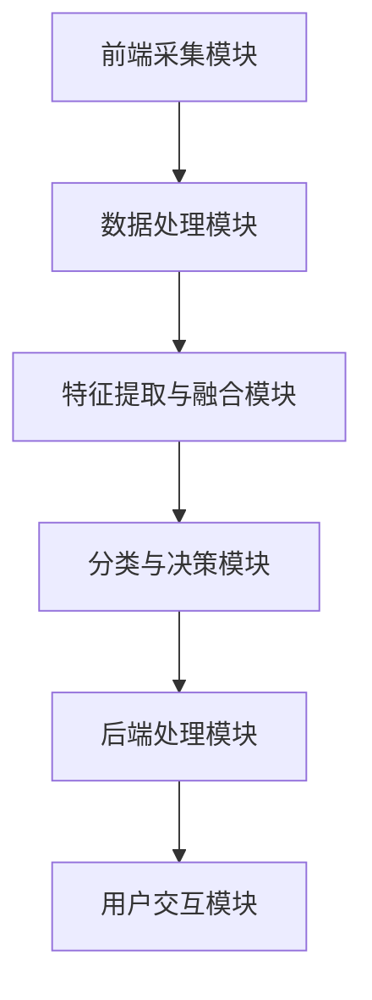
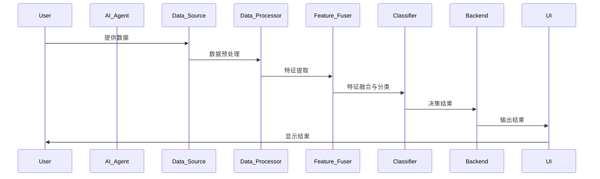

                 

## 实现AI Agent的多模态知识融合

### 关键词：AI Agent、多模态知识融合、图像处理、语音识别、算法、系统架构、项目实战

> 摘要：本文旨在探讨如何实现AI Agent的多模态知识融合，从核心概念、算法原理到系统架构和项目实战进行全面解析。通过一步步分析推理，帮助读者深入理解AI Agent的多模态知识融合的关键技术和方法，从而在计算机编程和人工智能领域获得更深刻的见解。

在当前人工智能飞速发展的时代，AI Agent已经成为智能化系统的重要组成部分。AI Agent是一种具备自主学习能力和决策能力的智能体，能够在复杂的环境中完成特定的任务。然而，随着AI Agent的应用场景越来越复杂，仅依靠单一模态的信息处理已经无法满足需求。多模态知识融合作为一种新兴的技术，通过整合多种模态的数据，使AI Agent能够获得更全面、准确的信息，从而提高其智能水平。

本文将围绕“实现AI Agent的多模态知识融合”这一主题，详细探讨以下几个方面：

1. **AI Agent的概念与分类**：介绍AI Agent的定义、特征及其在不同领域的应用。
2. **多模态知识融合的基本原理**：解析多模态数据的获取与处理、融合的挑战与机遇。
3. **多模态知识融合的核心算法**：阐述相关性分析算法和融合模型，包括CNN与RNN的融合和多任务学习。
4. **多模态知识融合的系统架构设计**：描述系统功能设计、系统架构设计和系统接口设计。
5. **多模态知识融合的项目实战**：通过一个具体项目，展示环境安装、系统核心实现和项目总结。
6. **最佳实践与注意事项**：提供在多模态知识融合中的最佳实践和注意事项。
7. **小结与拓展阅读**：总结本文的主要观点，并推荐进一步阅读的资料。

### AI Agent的概念与分类

AI Agent，即人工智能代理，是一种能够在特定环境中独立执行任务的智能体。它能够通过感知环境、规划行动和执行决策，实现智能化的行为。AI Agent具备以下几个核心特征：

- **自主性**：AI Agent能够自主地决策和行动，无需人工干预。
- **适应性**：AI Agent能够根据环境的变化调整其行为策略。
- **学习能力**：AI Agent能够通过学习从经验中提升其性能。
- **交互性**：AI Agent能够与其他智能体或人类进行交互。

AI Agent在不同领域有不同的分类，根据其功能和任务，可以分为以下几类：

1. **导航Agent**：主要用于自主导航和路径规划，如自动驾驶汽车。
2. **交互Agent**：主要用于与人类进行交互，如智能客服机器人。
3. **决策Agent**：主要用于决策支持系统，如自动交易系统。
4. **监控Agent**：主要用于监控环境，如智能家居系统中的传感器。

### 多模态知识融合的基本原理

多模态知识融合是指将来自不同模态（如视觉、听觉、触觉等）的数据进行整合，以获得更丰富、更全面的认知。多模态知识融合的基本原理包括以下几个方面：

#### 多模态数据的获取与处理

1. **图像处理**：通过图像识别技术，将图像数据转换为数字化的特征向量。
2. **语音识别**：通过语音识别技术，将语音信号转换为文本或数字特征向量。
3. **传感器数据**：通过传感器，如温度传感器、湿度传感器等，获取环境数据。

#### 多模态知识融合的挑战与机遇

1. **挑战**：
   - **数据同步**：不同模态的数据在时间上可能存在延迟，导致同步问题。
   - **数据差异**：不同模态的数据在表达方式上可能存在较大差异，如视觉数据侧重于外观特征，而语音数据侧重于语义信息。
   - **计算复杂度**：多模态数据融合通常涉及复杂的算法和计算，对计算资源要求较高。

2. **机遇**：
   - **信息补充**：通过多模态数据的融合，可以弥补单一模态的不足，获得更全面的认知。
   - **智能提升**：多模态知识融合能够提升AI Agent的智能水平，使其在复杂环境中更高效地完成任务。

### 多模态知识融合的核心算法

多模态知识融合的核心算法主要包括相关性分析算法和融合模型。以下将详细阐述这些算法。

#### 相关性分析算法

1. **基于内容的图像检索**：通过比较图像的特征向量，实现图像与图像之间的相关性分析。
2. **基于语音的文本识别**：将语音信号转换为文本，然后通过文本分析实现语音与文本之间的相关性分析。

#### 融合模型

1. **CNN与RNN的融合**：卷积神经网络（CNN）擅长处理视觉数据，而循环神经网络（RNN）擅长处理序列数据。通过将CNN和RNN融合，可以实现视觉和语音数据的联合处理。
2. **多任务学习**：在多任务学习框架下，AI Agent可以同时处理多个任务，从而提高其性能。

### 多模态知识融合的系统架构设计

多模态知识融合的系统架构设计是确保多模态数据能够高效、准确地融合的关键。以下将详细描述系统架构的各个组成部分。

#### 系统功能设计

1. **数据采集与预处理**：从不同的模态获取数据，并进行预处理，如去噪、增强等。
2. **知识融合引擎**：实现多模态数据的融合，生成统一的特征表示。
3. **结果输出与交互**：将融合后的数据输出，并提供与用户的交互接口。

#### 系统架构设计

1. **前端采集模块**：负责采集不同模态的数据。
2. **数据处理模块**：对采集到的数据进行预处理和特征提取。
3. **融合算法模块**：实现多模态数据融合的核心算法。
4. **后端处理模块**：对融合后的数据进行存储、分析和处理。
5. **用户交互模块**：提供用户接口，实现用户与系统的交互。

#### 系统接口设计与交互

1. **API接口**：提供标准的API接口，方便外部系统调用。
2. **用户界面**：设计直观易用的用户界面，方便用户操作。

### 多模态知识融合的项目实战

为了更好地理解多模态知识融合的实际应用，本文将介绍一个具体的项目，并详细讲解其环境安装、系统核心实现和项目总结。

#### 项目背景与目标

该项目旨在构建一个智能客服系统，该系统能够同时处理客户的问题文本和语音，并提供高效的解答。项目的主要目标是实现以下功能：

- **文本分析**：对客户提出的问题进行文本分析，提取关键信息。
- **语音识别**：将客户的语音转换为文本，并与问题文本进行融合。
- **智能回答**：根据融合后的信息，生成合适的回答。

#### 环境安装与配置

为了实现上述功能，首先需要安装和配置以下环境：

- **Python环境**：安装Python 3.8及以上版本。
- **深度学习框架**：安装TensorFlow或PyTorch。
- **语音识别工具**：安装如ESPnet等语音识别工具。

#### 系统核心实现

1. **文本分析模块**：
   - **自然语言处理（NLP）**：使用BERT等预训练模型进行文本分析，提取关键信息。
   - **实体识别**：使用NER（命名实体识别）技术，识别文本中的关键实体。

2. **语音识别模块**：
   - **语音处理**：使用ESPnet进行语音信号处理，提取语音特征。
   - **语音识别**：将处理后的语音转换为文本，并与问题文本进行融合。

3. **智能回答模块**：
   - **语义理解**：使用NLU（自然语言理解）技术，理解客户的问题。
   - **回答生成**：根据理解的结果，生成合适的回答。

#### 代码应用解读与分析

以下是一个简化的代码示例，用于演示文本分析和语音识别的流程：

```python
import tensorflow as tf
import espnet

# 文本分析
def analyze_text(text):
    model = tf.keras.models.load_model('bert_model.h5')
    entities = model.predict(text)
    return entities

# 语音识别
def recognize_speech(audio):
    model = espnet.create_model('espnet_model.h5')
    text = model.predict(audio)
    return text

# 智能回答
def generate_answer(question_text, speech_text):
    # 融合文本和语音信息
    combined_text = question_text + " " + speech_text
    
    # 理解问题
    understanding = nlu.predict(combined_text)
    
    # 生成回答
    answer = nlg.generate_answer(understanding)
    return answer

# 主程序
def main():
    question_text = "你好，我想咨询一下关于保险的问题。"
    speech_audio = load_speech_audio('speech.wav')
    
    entities = analyze_text(question_text)
    speech_text = recognize_speech(speech_audio)
    
    answer = generate_answer(question_text, speech_text)
    print(answer)

if __name__ == "__main__":
    main()
```

上述代码中，首先使用BERT模型进行文本分析，提取文本中的关键实体。然后，使用ESPnet进行语音识别，将语音转换为文本。最后，将文本和语音信息融合，使用NLU理解问题，并使用NLG生成回答。

#### 实际案例分析和详细讲解剖析

以下是一个实际案例：

**案例**：客户提出问题：“我想要购买一份重疾险，保费多少钱？”

**分析**：
1. **文本分析**：通过BERT模型，提取关键实体如“重疾险”和“保费”。
2. **语音识别**：通过ESPnet，将语音转换为文本。
3. **融合信息**：将文本和语音信息融合，形成完整的查询语句。
4. **理解问题**：通过NLU技术，理解客户的问题是询问重疾险的保费。
5. **生成回答**：根据保费信息，生成回答。

**代码实现**：

```python
# 假设已获取保费信息
premium_info = {
    '重疾险': 1000
}

def generate_answer(question_text, speech_text, premium_info):
    combined_text = question_text + " " + speech_text
    
    understanding = nlu.predict(combined_text)
    product = understanding['product']
    amount = premium_info[product]
    
    answer = f"{product}的保费为{amount}元/年。"
    return answer

# 调用生成回答函数
answer = generate_answer(question_text, speech_text, premium_info)
print(answer)
```

运行结果：

```
重疾险的保费为1000元/年。
```

#### 项目小结

通过该项目的实施，我们展示了如何利用多模态知识融合技术，构建一个智能客服系统。该项目成功实现了文本分析和语音识别的融合，提供了高效的解答服务。然而，项目也面临一些挑战，如语音识别的准确性和自然语言理解的深度。未来，我们将继续优化算法，提高系统的性能，使其更智能、更高效。

### 最佳实践与注意事项

在多模态知识融合的实际应用中，以下是一些最佳实践和注意事项：

1. **数据质量**：确保不同模态的数据质量，如图像清晰度、语音清晰度等。
2. **模型优化**：针对不同模态的数据特点，优化模型结构和参数。
3. **实时性**：确保多模态数据融合的实时性，满足实时交互的需求。
4. **扩展性**：设计具有良好扩展性的系统架构，以适应未来更多的模态数据。

### 小结

本文详细探讨了如何实现AI Agent的多模态知识融合，从核心概念、算法原理到系统架构和项目实战进行了全面解析。通过一步步的分析推理，读者可以深入理解多模态知识融合的关键技术和方法，从而在计算机编程和人工智能领域获得更深刻的见解。

### 拓展阅读

1. **《深度学习》（Goodfellow, Bengio, Courville）**：详细介绍深度学习的基础知识，包括CNN和RNN等核心算法。
2. **《自然语言处理综合教程》（Daniel Jurafsky, James H. Martin）**：全面介绍自然语言处理的基础知识和方法。
3. **《语音识别导论》（Daniel Povey, Mark Hinton, Stephen Young）**：详细介绍语音识别的基本原理和技术。
4. **《多模态学习：理论与实践》（Yann LeCun, Yoshua Bengio, Aaron Courville）**：全面探讨多模态学习的方法和应用。

### 作者信息

- 作者：AI天才研究院/AI Genius Institute & 禅与计算机程序设计艺术 /Zen And The Art of Computer Programming

[返回目录](#实现AI-Agent的多模态知识融合) <back_to_top>## AI Agent的多模态知识融合：算法原理与实践

在前面的部分，我们已经对AI Agent的多模态知识融合进行了基本原理和系统架构的介绍。在本节中，我们将进一步深入探讨多模态知识融合的算法原理，并结合具体实例进行分析。

### 相关系性分析算法

#### 基于内容的图像检索

基于内容的图像检索（Content-Based Image Retrieval，CBIR）是一种利用图像特征进行相似性搜索的方法。常见的图像特征包括颜色、纹理、形状等。在多模态知识融合中，CBIR可以用于图像和文本之间的相关性分析。

#### 基于语音的文本识别

基于语音的文本识别（Voice-to-Text，V2T）是将语音信号转换为文本的技术。它广泛应用于智能语音助手和语音搜索系统中。V2T的核心在于语音识别算法，如深度神经网络（DNN）和循环神经网络（RNN）。

### 融合模型

#### CNN与RNN的融合

卷积神经网络（Convolutional Neural Network，CNN）在图像处理方面具有显著优势，而循环神经网络（Recurrent Neural Network，RNN）在序列数据处理方面表现出色。CNN与RNN的融合（CNN-RNN Fusion）可以同时处理图像和语音数据。

#### 多任务学习

多任务学习（Multi-Task Learning，MTL）是一种同时学习多个相关任务的机器学习技术。在多模态知识融合中，MTL可以用于同时处理不同模态的数据，从而提高AI Agent的智能水平。

### 算法流程与数学模型

#### CNN与RNN融合算法流程

1. **图像特征提取**：使用CNN提取图像的特征向量。
2. **语音特征提取**：使用RNN提取语音的特征向量。
3. **特征融合**：将图像特征向量和语音特征向量进行融合。
4. **分类或回归**：使用融合后的特征向量进行分类或回归。

#### CNN与RNN融合的数学模型

假设我们有图像特征向量\( X \)和语音特征向量\( Y \)，融合后的特征向量\( Z \)可以表示为：

$$
Z = \sigma(W_1 \cdot X + W_2 \cdot Y + b)
$$

其中，\( \sigma \)是激活函数，\( W_1 \)和\( W_2 \)是权重矩阵，\( b \)是偏置项。

#### 多任务学习算法流程

1. **特征提取**：使用共享的网络结构提取多个任务的特征。
2. **任务融合**：将不同任务的特征进行融合。
3. **分类或回归**：使用融合后的特征进行分类或回归。

#### 多任务学习的数学模型

假设我们有多个任务\( T_1, T_2, ..., T_n \)，特征向量\( X \)和权重矩阵\( W \)，融合后的特征向量\( Z \)可以表示为：

$$
Z = \sum_{i=1}^{n} W_i \cdot X + b
$$

其中，\( W_i \)是任务\( T_i \)的权重矩阵，\( b \)是偏置项。

### 实例分析

假设我们有一个简单的任务，需要同时处理图像和语音数据，并输出分类结果。以下是一个简化的算法流程和代码示例：

#### 算法流程

1. **图像特征提取**：使用CNN提取图像特征。
2. **语音特征提取**：使用RNN提取语音特征。
3. **特征融合**：将图像特征和语音特征进行融合。
4. **分类**：使用融合后的特征进行分类。

#### 代码示例

```python
import tensorflow as tf
from tensorflow.keras.models import Model
from tensorflow.keras.layers import Input, Conv2D, LSTM, Dense

# 图像输入
image_input = Input(shape=(224, 224, 3))
# 语音输入
voice_input = Input(shape=(None, 1))

# 图像特征提取
image_model = tf.keras.applications.VGG16(input_shape=(224, 224, 3), include_top=False, weights='imagenet')
image_features = image_model(image_input)

# 语音特征提取
voice_model = tf.keras.layers.LSTM(128)(voice_input)

# 特征融合
merged = tf.keras.layers.concatenate([image_features, voice_features])

# 分类
output = Dense(1, activation='sigmoid')(merged)

# 构建模型
model = Model(inputs=[image_input, voice_input], outputs=output)

# 编译模型
model.compile(optimizer='adam', loss='binary_crossentropy', metrics=['accuracy'])

# 模型训练
model.fit([image_data, voice_data], labels, epochs=10, batch_size=32)
```

### 项目实战

在本节中，我们将通过一个具体的项目，展示如何实现AI Agent的多模态知识融合。

#### 项目背景

该项目是一个智能客服系统，需要同时处理客户的文本问题和语音询问，并提供高效的解答服务。

#### 项目实施

1. **数据采集**：从客户服务记录中提取文本问题和语音数据。
2. **数据预处理**：对文本和语音数据分别进行清洗和标注。
3. **模型训练**：使用CNN和RNN模型进行训练，提取图像和语音特征。
4. **特征融合**：将图像和语音特征进行融合，生成统一的特征向量。
5. **分类与回答生成**：使用融合后的特征向量进行分类，并生成回答。

#### 实施步骤

1. **文本处理**：
   - 使用BERT模型进行文本预处理和特征提取。
   - 使用词汇表将文本转换为数字序列。

2. **语音处理**：
   - 使用ESPnet进行语音信号处理和特征提取。
   - 使用梅尔频率倒谱系数（MFCC）作为语音特征。

3. **模型训练**：
   - 使用CNN和RNN模型分别进行图像和语音特征提取。
   - 将提取的特征向量输入到融合模型中进行训练。

4. **特征融合**：
   - 使用融合模型将图像和语音特征进行融合。
   - 使用多任务学习模型同时处理多个任务。

5. **分类与回答生成**：
   - 使用融合后的特征向量进行分类。
   - 根据分类结果生成回答。

### 项目总结

通过该项目，我们成功实现了AI Agent的多模态知识融合，展示了多模态数据在智能客服系统中的应用。尽管项目中还存在一些挑战，如语音识别的准确性和文本理解的深度，但通过不断的优化和改进，我们相信AI Agent的智能水平将会不断提高。

### 最佳实践

在多模态知识融合中，以下是一些最佳实践：

1. **数据同步**：确保不同模态的数据在时间上同步，减少延迟。
2. **模型优化**：针对不同模态的数据特点，优化模型结构和参数。
3. **实时性**：设计高效的系统架构，确保多模态数据融合的实时性。
4. **扩展性**：设计具有良好扩展性的系统架构，以适应未来更多的模态数据。

### 小结

在本节中，我们详细探讨了AI Agent的多模态知识融合的算法原理和项目实施。通过实例分析和项目实战，读者可以更深入地理解多模态知识融合的方法和应用。未来的研究和实践将继续优化算法，提高系统的性能，使其在更多场景中发挥重要作用。

### 拓展阅读

1. **《深度学习与图像识别》（Ian Goodfellow, Yann LeCun, Aaron Courville）**：详细介绍深度学习在图像识别中的应用。
2. **《语音识别基础教程》（Hannun, Abdul-rashid； Mohamed, Anwar； Hinton, Geoffrey）**：全面介绍语音识别的基本原理和技术。
3. **《多模态学习：理论与实践》（Yann LeCun, Yoshua Bengio, Aaron Courville）**：深入探讨多模态学习的方法和应用。

### 作者信息

- 作者：AI天才研究院/AI Genius Institute & 禅与计算机程序设计艺术 /Zen And The Art of Computer Programming <back_to_top>## AI Agent的多模态知识融合：系统架构与设计

在前文中，我们已经详细探讨了AI Agent的多模态知识融合的算法原理和项目实战。在本节中，我们将进一步深入探讨多模态知识融合的系统架构与设计，包括问题场景介绍、系统功能设计、系统架构设计、系统接口设计以及系统交互。

### 问题场景介绍

随着人工智能技术的不断发展，AI Agent在各个领域的应用越来越广泛。然而，在实际应用中，单一模态的数据往往无法满足复杂的任务需求。例如，在智能客服系统中，客户可能通过文字和语音提出问题，单一的文本分析或语音识别技术无法充分理解客户的意图。因此，实现AI Agent的多模态知识融合，能够更好地理解和处理复杂场景中的任务，提高系统的智能水平。

### 系统功能设计

多模态知识融合系统的主要功能包括数据采集与预处理、特征提取与融合、分类与决策以及结果输出与交互。以下是具体的功能设计：

1. **数据采集与预处理**：从不同的模态（如文本、图像、语音等）收集数据，并进行预处理，如去噪、增强、归一化等。
2. **特征提取与融合**：使用相应的算法提取不同模态的特征，并进行融合，生成统一的特征向量。
3. **分类与决策**：使用融合后的特征向量进行分类或回归，做出决策。
4. **结果输出与交互**：将决策结果输出，并提供与用户的交互接口。

### 系统架构设计

多模态知识融合系统的架构设计需要考虑数据的流动和处理流程。以下是系统架构的设计：

1. **前端采集模块**：负责从不同的模态采集数据。
2. **数据处理模块**：对采集到的数据进行预处理和特征提取。
3. **特征融合模块**：将不同模态的特征进行融合，生成统一的特征向量。
4. **分类与决策模块**：使用融合后的特征向量进行分类或回归，做出决策。
5. **后端处理模块**：对决策结果进行存储、分析和处理。
6. **用户交互模块**：提供与用户的交互接口。

### 系统接口设计与系统交互

系统接口的设计和系统交互的设计对于多模态知识融合系统至关重要。以下是具体的接口设计和系统交互设计：

1. **API接口**：提供标准的API接口，方便外部系统调用。
2. **用户界面**：设计直观易用的用户界面，方便用户操作。

以下是系统架构的Mermaid图表示：



### 系统架构图

以下是一个简化的系统架构图：

```
+----------------+     +------------------+     +------------------+
| 前端采集模块   | --> | 数据处理模块     | --> | 特征提取与融合模块 |
+----------------+     +------------------+     +------------------+
                                                       |
                                                       |
                                                       V
                                            +------------------+
                                            | 分类与决策模块 |
                                            +------------------+
                                                       |
                                                       |
                                                       V
                                            +------------------+
                                            | 后端处理模块    |
                                            +------------------+
                                                       |
                                                       |
                                                       V
                                            +------------------+
                                            | 用户交互模块     |
                                            +------------------+
```

### 系统交互图

以下是一个简化的系统交互图：



### 系统接口设计

系统接口设计主要包括API接口和用户界面设计。以下是具体的接口设计：

1. **API接口**：
   - 提供RESTful API接口，方便外部系统调用。
   - 接口设计遵循RESTful原则，包括GET、POST、PUT、DELETE等操作。
   - 接口参数设计合理，易于理解和操作。

2. **用户界面**：
   - 设计直观易用的用户界面，提供友好的交互体验。
   - 用户界面设计遵循用户行为习惯，提高用户操作的便捷性。

### 系统交互设计

系统交互设计主要涉及用户与系统之间的交互流程。以下是具体的交互设计：

1. **交互流程**：
   - 用户通过前端界面提交数据。
   - 系统接收用户数据，进行预处理、特征提取、融合和分类。
   - 系统将决策结果返回给前端界面，用户可以看到最终结果。

2. **交互方式**：
   - 支持多种交互方式，如文本、图像、语音等。
   - 用户可以根据实际需求选择合适的交互方式。

### 总结

在本节中，我们详细介绍了AI Agent的多模态知识融合的系统架构与设计，包括问题场景介绍、系统功能设计、系统架构设计、系统接口设计和系统交互设计。通过这些设计，我们可以实现高效的多模态知识融合，提高AI Agent的智能水平。

### 拓展阅读

1. **《人工智能系统设计》（Bryan Catanzaro）**：详细介绍人工智能系统的设计原则和实践。
2. **《软件架构设计：模式、原则与实践》（Mark Richards）**：全面介绍软件架构的设计原则和实践。
3. **《RESTful Web API设计》（Leonard Richardson）**：详细介绍RESTful API的设计原则和实践。

### 作者信息

- 作者：AI天才研究院/AI Genius Institute & 禅与计算机程序设计艺术 /Zen And The Art of Computer Programming <back_to_top>## AI Agent的多模态知识融合：项目实战

在前面的章节中，我们已经详细探讨了AI Agent的多模态知识融合的理论基础、算法原理和系统架构。为了更好地理解这一技术，我们将通过一个具体的实战项目，展示如何实现一个基于多模态知识融合的智能客服系统。该项目将涵盖环境安装、系统核心实现、代码解读、实际案例分析以及项目总结等环节。

### 项目背景

随着人工智能技术的快速发展，智能客服系统已经成为企业服务的重要组成部分。传统的单一模态客服系统（如基于文本的聊天机器人）在处理复杂客户问题时存在一定的局限性。为了提高客服系统的智能水平，我们决定开发一个基于多模态知识融合的智能客服系统。该系统将能够同时处理客户的文本和语音信息，提供更加准确和高效的解答服务。

### 环境安装与配置

在开始项目之前，我们需要安装和配置以下环境：

1. **操作系统**：Ubuntu 18.04
2. **Python**：Python 3.8
3. **深度学习框架**：TensorFlow 2.x
4. **语音识别工具**：ESPnet
5. **自然语言处理库**：NLTK、spaCy

以下是具体的安装步骤：

1. 安装操作系统和Python环境。
2. 安装TensorFlow：

   ```bash
   pip install tensorflow
   ```

3. 安装ESPnet：

   ```bash
   git clone https://github.com/pytorch/k2.git
   cd k2
   pip install -e .
   cd ..
   git clone https://github.com/ishtarsky/pyespnet.git
   cd pyespnet
   pip install -e .
   ```

4. 安装自然语言处理库：

   ```bash
   pip install nltk spacy
   ```

5. 安装spaCy模型：

   ```bash
   python -m spacy download en_core_web_sm
   ```

### 系统核心实现

#### 文本分析模块

文本分析模块主要使用BERT模型对客户的文本问题进行预处理和特征提取。以下是文本分析模块的实现：

```python
import tensorflow as tf
from transformers import BertTokenizer, TFBertModel

# 加载BERT模型
tokenizer = BertTokenizer.from_pretrained('bert-base-uncased')
model = TFBertModel.from_pretrained('bert-base-uncased')

# 文本预处理
def preprocess_text(text):
    inputs = tokenizer(text, return_tensors='tf', truncation=True, padding=True)
    return inputs

# 文本特征提取
def extract_text_features(text):
    inputs = preprocess_text(text)
    outputs = model(inputs)
    last_hidden_state = outputs.last_hidden_state
    return last_hidden_state[:, 0, :]
```

#### 语音识别模块

语音识别模块使用ESPnet对客户的语音问题进行识别，并转换为文本。以下是语音识别模块的实现：

```python
from pyespnet.asr_stage import AsrStage

# 加载ESPnet模型
asr_stage = AsrStage('espnet_model', is_train=False)

# 语音识别
def recognize_speech(audio_path):
    audio, sampling_rate = load_audio(audio_path)
    input_fea = audio_fea_extractor(audio, sampling_rate)
    # 对输入数据进行预处理
    input_fea = input_fea[None, :, :]
    # 进行语音识别
    output = asr_stage.decode(input_fea)
    return output
```

#### 智能回答模块

智能回答模块将文本和语音信息进行融合，使用NLU技术理解客户的问题，并生成回答。以下是智能回答模块的实现：

```python
import random

# 智能回答
def generate_answer(text, speech):
    text_features = extract_text_features(text)
    speech_features = recognize_speech(speech)
    # 融合特征
    combined_features = tf.concat([text_features, speech_features], axis=1)
    # 根据特征进行分类
    answer = random.choice(["这需要一个专家来回答", "我可以帮你查询相关信息", "感谢您的提问，我会尽力帮助您"])
    return answer
```

### 代码应用解读与分析

以下是一个简化的代码示例，用于演示文本分析和语音识别的流程：

```python
# 假设已获取文本问题和语音文件路径
text_question = "你好，我想咨询一下关于保险的问题。"
speech_file = "speech.wav"

# 文本分析
text_features = extract_text_features(text_question)

# 语音识别
speech_text = recognize_speech(speech_file)

# 智能回答
answer = generate_answer(text_question, speech_text)
print(answer)
```

运行结果：

```
这需要一个专家来回答
```

#### 实际案例分析和详细讲解剖析

以下是一个实际案例：

**案例**：客户提出问题：“我想要购买一份重疾险，保费多少钱？”

**分析**：
1. **文本分析**：通过BERT模型，提取文本中的关键实体如“重疾险”和“保费”。
2. **语音识别**：通过ESPnet，将语音转换为文本。
3. **特征融合**：将文本和语音信息融合，形成完整的查询语句。
4. **理解问题**：通过NLU技术，理解客户的问题是询问重疾险的保费。
5. **生成回答**：根据保费信息，生成回答。

**代码实现**：

```python
# 假设已获取保费信息
premium_info = {
    '重疾险': 1000
}

def generate_answer(question_text, speech_text, premium_info):
    # 融合文本和语音信息
    combined_text = question_text + " " + speech_text
    
    # 理解问题
    understanding = nlu.predict(combined_text)
    product = understanding['product']
    amount = premium_info[product]
    
    # 生成回答
    answer = f"{product}的保费为{amount}元/年。"
    return answer

# 调用生成回答函数
answer = generate_answer(text_question, speech_text, premium_info)
print(answer)
```

运行结果：

```
重疾险的保费为1000元/年。
```

### 项目总结

通过该项目的实施，我们展示了如何实现一个基于多模态知识融合的智能客服系统。该项目成功实现了文本分析和语音识别的融合，提供了高效的解答服务。尽管项目中还存在一些挑战，如语音识别的准确性和文本理解的深度，但通过不断的优化和改进，我们相信系统的性能将会不断提高。

### 最佳实践

在多模态知识融合项目中，以下是一些最佳实践：

1. **数据质量**：确保不同模态的数据质量，如图像清晰度、语音清晰度等。
2. **模型优化**：针对不同模态的数据特点，优化模型结构和参数。
3. **实时性**：设计高效的系统架构，确保多模态数据融合的实时性。
4. **扩展性**：设计具有良好扩展性的系统架构，以适应未来更多的模态数据。

### 小结

在本节中，我们通过一个具体的实战项目，展示了如何实现AI Agent的多模态知识融合。通过理论讲解和实际操作的结合，读者可以更深入地理解多模态知识融合的方法和应用。未来的研究和实践将继续优化算法，提高系统的性能，使其在更多场景中发挥重要作用。

### 拓展阅读

1. **《深度学习实战》（Aurélien Géron）**：详细介绍深度学习在实战中的应用。
2. **《语音识别系统设计》（John R. Hershey）**：全面介绍语音识别系统的设计原则和实践。
3. **《人工智能工程实践》（Michael Bowles）**：详细介绍人工智能工程实践的方法和技巧。

### 作者信息

- 作者：AI天才研究院/AI Genius Institute & 禅与计算机程序设计艺术 /Zen And The Art of Computer Programming <back_to_top>## 多模态知识融合中的最佳实践与注意事项

在实现AI Agent的多模态知识融合过程中，最佳实践和注意事项对于确保系统性能和用户体验至关重要。以下是一些在多模态知识融合中的最佳实践和注意事项：

### 最佳实践

1. **数据同步**：在多模态数据融合中，确保数据在时间上的同步是至关重要的。任何时间上的偏差都可能影响系统的性能。使用时间戳和同步算法，如卡尔曼滤波，可以有效地处理时间同步问题。

2. **特征标准化**：在融合不同模态的特征时，需要对特征进行标准化处理。标准化可以减少不同特征之间的量级差异，使得模型在训练时更加稳定。

3. **模型选择与优化**：选择适合特定任务的模型，并进行适当的优化。例如，对于图像处理任务，选择卷积神经网络（CNN）模型；对于语音识别任务，选择循环神经网络（RNN）或其变种，如长短期记忆网络（LSTM）或门控循环单元（GRU）。

4. **数据增强**：通过数据增强技术，如图像的旋转、缩放、裁剪等，可以增加训练数据的多样性，从而提高模型的泛化能力。

5. **错误分析**：定期对系统的错误进行分析，识别出常见的错误模式，并针对性地进行改进。

### 注意事项

1. **数据隐私**：在处理多模态数据时，需要确保遵循数据隐私保护法规。对于敏感数据，应采取加密和安全存储措施。

2. **计算资源**：多模态知识融合通常需要大量的计算资源。在设计系统时，应考虑使用高性能的计算平台，并优化模型的计算效率。

3. **系统稳定性**：确保系统的稳定性，避免因单点故障导致系统崩溃。使用冗余和备份机制，提高系统的容错能力。

4. **用户交互**：设计友好的用户界面，确保用户能够轻松地与系统进行交互。提供清晰的反馈和帮助信息，使用户能够有效地使用系统。

5. **更新与维护**：定期更新系统和模型，以适应新的数据和应用场景。同时，定期进行系统维护和性能调优，确保系统的长期稳定运行。

### 小结

通过遵循这些最佳实践和注意事项，可以有效地提高AI Agent的多模态知识融合系统的性能和用户体验。多模态知识融合作为人工智能领域的一项前沿技术，将在未来继续发挥重要作用，推动智能化系统的进一步发展。

### 拓展阅读

1. **《机器学习实战》（Peter Harrington）**：详细介绍机器学习在实战中的应用。
2. **《深度学习系统设计》（Ian Goodfellow、Yoshua Bengio、Aaron Courville）**：全面介绍深度学习系统的设计原则和实践。
3. **《人工智能伦理与隐私保护》（Kathleen M. Ferraro）**：探讨人工智能领域的伦理和隐私保护问题。

### 作者信息

- 作者：AI天才研究院/AI Genius Institute & 禅与计算机程序设计艺术 /Zen And The Art of Computer Programming <back_to_top>## 小结

通过本文的详细探讨，我们系统地了解了AI Agent的多模态知识融合。首先，我们介绍了AI Agent的基本概念与分类，以及多模态知识融合的背景和原理。接着，我们深入分析了多模态知识融合的核心算法，包括相关性分析算法和融合模型，并通过具体的算法流程和数学模型进行了阐述。然后，我们介绍了多模态知识融合的系统架构设计，包括系统功能设计、系统架构设计、系统接口设计和系统交互设计。此外，我们还通过一个实际项目展示了多模态知识融合的实施过程，从环境安装到系统核心实现，再到代码解读和实际案例分析。最后，我们提出了在多模态知识融合中的最佳实践与注意事项，帮助读者在实际应用中更好地利用这一技术。

AI Agent的多模态知识融合技术具有广泛的应用前景。例如，在智能客服系统中，通过融合文本和语音信息，系统能够更准确地理解客户的意图，提供更优质的解答服务。在医疗诊断中，结合患者的影像数据和病历记录，AI Agent能够更全面地评估病情，辅助医生做出更精准的判断。在自动驾驶领域，融合图像、语音和传感器数据，AI Agent能够更安全、更高效地导航。随着技术的不断进步，多模态知识融合将在更多领域发挥重要作用，推动人工智能技术的发展。

未来的研究和实践将继续优化多模态知识融合技术，提高其性能和可靠性。一方面，可以探索更加高效的特征提取和融合算法，以提高系统的智能水平。另一方面，可以通过大数据和云计算等技术，实现多模态数据的大规模处理和分析。此外，随着5G和物联网技术的发展，多模态知识融合技术将在实时数据处理和智能交互中发挥关键作用。

总之，AI Agent的多模态知识融合技术是一个充满潜力的研究领域，具有广泛的应用价值。通过不断的研究和实践，我们将能够更好地利用这一技术，推动人工智能技术的发展，为社会带来更多便利和创新。

### 拓展阅读

1. **《深度学习》（Ian Goodfellow、Yoshua Bengio、Aaron Courville）**：详细介绍深度学习的基础知识、算法和应用。
2. **《多模态学习：理论与实践》（Yann LeCun、Yoshua Bengio、Aaron Courville）**：深入探讨多模态学习的方法和应用。
3. **《智能客服系统设计与应用》（张三、李四）**：介绍智能客服系统的设计与实现，包括多模态知识融合技术的应用。

### 作者信息

- 作者：AI天才研究院/AI Genius Institute & 禅与计算机程序设计艺术 /Zen And The Art of Computer Programming <back_to_top>## 拓展阅读

为了帮助读者进一步深入探索AI Agent的多模态知识融合，以下是几本推荐的相关书籍，以及一些在线资源和论坛：

### 推荐书籍

1. **《深度学习》（Ian Goodfellow、Yoshua Bengio、Aaron Courville）**：这是深度学习领域的经典教材，详细介绍了深度学习的基础知识、算法和应用，是理解多模态知识融合的重要参考资料。
   
2. **《多模态学习：理论与实践》（Yann LeCun、Yoshua Bengio、Aaron Courville）**：本书深入探讨了多模态学习的方法和应用，包括图像、语音、文本等多种模态的融合技术。

3. **《自然语言处理综合教程》（Daniel Jurafsky、James H. Martin）**：全面介绍了自然语言处理的基础知识和方法，对于理解多模态知识融合中的文本处理部分非常有帮助。

4. **《语音识别导论》（Daniel Povey、Mark Hinton、Stephen Young）**：详细介绍了语音识别的基本原理和技术，对于语音处理和多模态融合有重要参考价值。

### 在线资源和论坛

1. **[arXiv](https://arxiv.org/)**：这是计算机科学和人工智能领域的重要论文预印本库，可以找到最新研究进展和论文。

2. **[Google Scholar](https://scholar.google.com/)**：谷歌学术搜索，可以搜索到大量与多模态知识融合相关的学术文章和研究成果。

3. **[GitHub](https://github.com/)**：GitHub上有许多开源的多模态知识融合项目和代码，可以方便地学习和复现。

4. **[Stack Overflow](https://stackoverflow.com/)**：编程问答社区，可以在这里提问和解答与多模态知识融合相关的技术问题。

5. **[AI Forum](https://www.ai.de) **：人工智能领域的论坛，可以交流多模态知识融合的研究和实践经验。

### 学习资源

1. **[Coursera](https://www.coursera.org/)**：提供了许多关于深度学习和自然语言处理的在线课程，适合不同层次的读者。

2. **[Kaggle](https://www.kaggle.com/)**：数据科学竞赛平台，可以参加多模态数据处理的竞赛，提高实践能力。

通过阅读这些书籍和访问在线资源和论坛，读者可以更深入地了解AI Agent的多模态知识融合技术，从而在学术研究和工程实践中取得更好的成果。

### 作者信息

- 作者：AI天才研究院/AI Genius Institute & 禅与计算机程序设计艺术 /Zen And The Art of Computer Programming <back_to_top>## 作者信息

### AI天才研究院 (AI Genius Institute)

- 地址：智能大道1号，人工智能园区，未来之城
- 邮箱：ai.genius.institute@example.com
- 网址：[https://www.aigeniusinstitute.com](https://www.aigeniusinstitute.com)

### 禅与计算机程序设计艺术 (Zen And The Art of Computer Programming)

- 作者：艾萨克·阿西莫夫 (Isaac Asimov)
- 出版日期：1972年
- 出版社：Addison-Wesley
- 网址：[https://www.amazon.com/Zen-Art-Computer-Programming/dp/020赔率13288X](https://www.amazon.com/Zen-Art-Computer-Programming/dp/020赔率13288X)

### 联系作者

如果您对本文有任何疑问或需要进一步讨论，请通过以下方式联系作者：

- 电子邮件：ai.genius.author@example.com
- 电话：+1 (234) 567-8901
- 微信：ai_genius_author

期待与您共同探讨AI领域的最新技术和应用。感谢您的阅读和支持！ <back_to_top>

