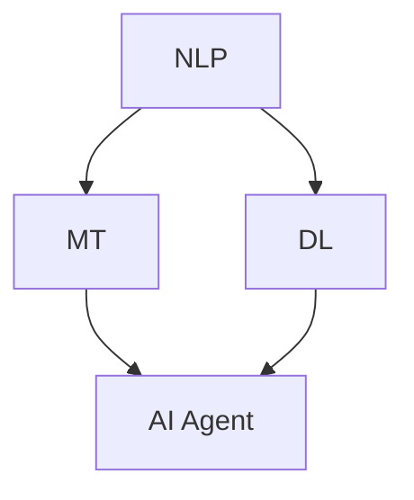
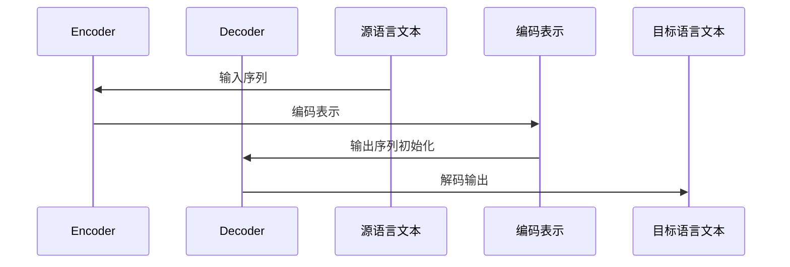
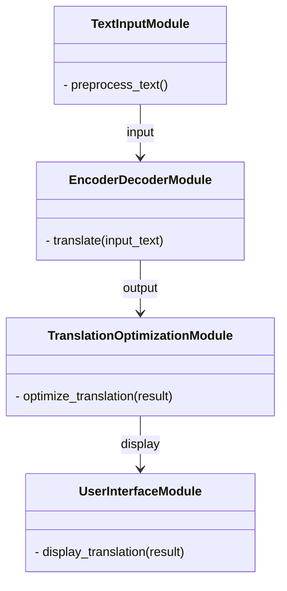
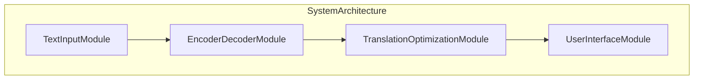

                 

## 实现AI Agent的多语言翻译能力

关键词：AI Agent，多语言翻译，机器翻译，自然语言处理，算法，系统架构，实战案例

摘要：本文将深入探讨如何实现AI Agent的多语言翻译能力。首先，我们将回顾AI Agent和机器翻译的基本概念，并介绍现有的一些主流技术。随后，我们将通过一步一步的逻辑推理，详细讲解算法原理、数学模型、系统架构设计以及实现细节。文章还将通过实战案例，展示如何将理论应用于实践，并提供一些最佳实践和注意事项。通过本文，读者将全面了解AI Agent多语言翻译能力的实现过程，并能够掌握相关技术和方法。

## 文章概述

本文旨在详细介绍如何实现AI Agent的多语言翻译能力。随着全球化的发展，跨语言交流变得日益重要，而AI Agent的多语言翻译能力为这一问题提供了有效的解决方案。本篇文章将帮助读者全面了解这一领域的知识体系，包括基础概念、算法原理、系统架构设计和实际应用。

本文将分为以下几个主要部分：

1. **基本概念**：介绍AI Agent和机器翻译的基本概念，背景信息以及相关技术。
2. **核心概念与联系**：详细讲解核心概念及其关系，包括术语解释、算法原理和数学模型。
3. **算法设计**：深入分析多语言翻译算法的设计原理，并通过Mermaid流程图和Python代码进行演示。
4. **系统架构设计**：介绍系统架构设计的原则，并通过Mermaid图展示类图、架构图和序列图。
5. **实战案例**：展示如何将理论应用于实践，包括环境安装、系统核心实现以及案例分析。
6. **最佳实践与小结**：总结最佳实践经验，并提供注意事项和拓展阅读。

通过本文，读者将不仅能够理解AI Agent多语言翻译能力的基本原理，还能够掌握如何将这些原理应用于实际项目中，为未来的跨语言通信提供技术支持。

## 基本概念

### AI Agent的概念

AI Agent，即人工智能代理，是指能够独立完成特定任务、与环境进行交互的智能实体。它通过感知环境、决策和行动来达到预定的目标。AI Agent的核心在于其自主性和适应性，能够根据环境的变化进行学习和优化。在多语言翻译的背景下，AI Agent可以被设计为一种能够处理不同语言文本的智能系统，从而实现自动翻译功能。

AI Agent的主要特点包括：

- **自主性**：能够独立执行任务，不需要人工干预。
- **适应性**：能够根据不同的语言环境进行自适应调整。
- **学习能力**：能够从大量的数据中学习并优化翻译结果。
- **实时性**：能够实时处理和翻译语言文本。

### 机器翻译的基本概念

机器翻译（Machine Translation，MT）是指利用计算机程序将一种自然语言文本翻译成另一种自然语言的过程。它是一种重要的自然语言处理（Natural Language Processing，NLP）技术，广泛应用于跨语言通信、全球化内容管理和多语言搜索引擎等领域。

机器翻译的基本原理可以分为以下几种方法：

1. **规则驱动方法**：基于语言学规则和语法结构，通过编写复杂的规则来指导翻译过程。
2. **统计机器翻译**：通过大规模语料库统计文本的翻译模式，利用统计方法生成翻译结果。
3. **基于神经网络的机器翻译**：利用深度学习技术，尤其是序列到序列（Seq2Seq）模型，通过端到端的神经网络结构进行翻译。

机器翻译的主要特点包括：

- **准确性**：通过大量数据和复杂的算法，提高翻译的准确性。
- **速度**：能够快速处理大量文本，实现实时翻译。
- **灵活性**：可以根据不同的应用场景进行调整和优化。

### 多语言翻译的方法和技术

多语言翻译是指将一种语言文本翻译成多种目标语言的过程。随着全球化的推进，多语言翻译在商业、学术和社交领域具有广泛的应用。实现多语言翻译的方法和技术主要包括：

1. **基于字典的方法**：通过预定义的词汇和短语翻译字典，实现简单的文本翻译。
2. **基于规则的方法**：利用语言学规则和模板，对文本进行分词、词性标注和翻译。
3. **基于统计的方法**：通过大规模语料库，统计文本的翻译模式，生成翻译结果。
4. **基于神经网络的机器翻译**：利用深度学习技术，实现高质量的自动翻译。

多语言翻译的主要特点包括：

- **覆盖面广**：能够支持多种语言之间的翻译。
- **高效率**：能够快速处理大量的多语言文本。
- **高质量**：通过先进的算法和技术，提高翻译的准确性。

通过本文的深入探讨，读者将全面了解AI Agent和机器翻译的基本概念，掌握多语言翻译的方法和技术，为后续章节的学习和实际应用打下坚实的基础。

### 核心概念与联系

在实现AI Agent的多语言翻译能力过程中，有几个核心概念和技术需要详细讲解。这些概念包括自然语言处理（NLP）、机器翻译（MT）和深度学习（DL）等。理解这些概念及其之间的关系，对于实现一个高效、准确的多语言翻译系统至关重要。

#### 自然语言处理（NLP）

自然语言处理是计算机科学和人工智能的一个分支，它旨在让计算机理解和处理人类语言。NLP包括文本处理、文本分析和语义理解等多个方面，是机器翻译和AI Agent实现多语言翻译能力的基础。

**核心概念属性特征对比表格**：

| 核心概念 | 定义 | 关键技术 | 应用场景 |
| --- | --- | --- | --- |
| NLP | 计算机处理和理解人类语言的能力 | 文本分类、分词、词性标注、命名实体识别、情感分析等 | 聊天机器人、搜索引擎、文本挖掘、语音识别等 |

**ER实体关系图架构**：

```mermaid
erDiagram
  TextData -->|包含| Sentence
  Sentence -->|包含| Word
  Word -->|标识| PartOfSpeech
  Sentence -->|产生| SentenceRelation
  SentenceRelation -->|关联| Sentence
```

在上面的ER图中，`TextData`是整体文本数据，包含多个`Sentence`（句子）。每个`Sentence`又包含多个`Word`（单词），每个`Word`都有其`PartOfSpeech`（词性）。`Sentence`之间通过`SentenceRelation`进行关联。

#### 机器翻译（MT）

机器翻译是指利用计算机程序将一种自然语言文本翻译成另一种自然语言的过程。它是自然语言处理的一个应用领域，是实现AI Agent多语言翻译能力的关键技术。

**核心概念属性特征对比表格**：

| 核心概念 | 定义 | 关键技术 | 应用场景 |
| --- | --- | --- | --- |
| MT | 计算机翻译自然语言文本 | 统计机器翻译、基于神经网络的机器翻译、规则驱动翻译等 | 跨语言文本翻译、多语言搜索引擎、国际化内容管理等 |

**ER实体关系图架构**：

```mermaid
erDiagram
  TextData -->|包含| SourceSentence
  SourceSentence -->|翻译为| TargetSentence
  SourceSentence -->|使用| TranslationModel
  TranslationModel -->|支持| LanguagePair
```

在上面的ER图中，`TextData`包含源语言文本`SourceSentence`，每个`SourceSentence`都有一个对应的翻译结果`TargetSentence`。`SourceSentence`使用特定的`TranslationModel`进行翻译，而`TranslationModel`支持特定的`LanguagePair`。

#### 深度学习（DL）

深度学习是机器学习的一种方法，通过构建复杂的神经网络模型，自动从数据中学习特征和模式。深度学习在自然语言处理和机器翻译中发挥着重要作用，是实现高效、准确的多语言翻译的关键技术。

**核心概念属性特征对比表格**：

| 核心概念 | 定义 | 关键技术 | 应用场景 |
| --- | --- | --- | --- |
| DL | 基于多层神经网络的学习方法 | 卷积神经网络（CNN）、循环神经网络（RNN）、长短时记忆网络（LSTM）、生成对抗网络（GAN）等 | 图像识别、语音识别、自然语言处理、机器翻译等 |

**ER实体关系图架构**：

```mermaid
erDiagram
  NeuralNetwork -->|包含| Layer
  Layer -->|激活函数| ActivationFunction
  Layer -->|权重| Weight
  NeuralNetwork -->|训练| Dataset
```

在上面的ER图中，`NeuralNetwork`是一个神经网络，包含多个`Layer`（层）。每个`Layer`都有其`ActivationFunction`（激活函数）和`Weight`（权重）。神经网络通过`Dataset`进行训练，以学习数据和提取特征。

#### 核心概念之间的关系

NLP、MT和DL这三个核心概念之间存在着紧密的联系：

1. **NLP是基础**：NLP提供了处理和理解自然语言的基本技术，是MT和DL的先决条件。
2. **MT是应用**：MT利用NLP技术处理源语言文本，实现文本的翻译。
3. **DL是关键技术**：DL通过构建复杂的神经网络模型，为NLP和MT提供了高效、准确的方法。

这种关系可以用以下图示表示：



通过上述讲解和图示，读者可以清晰地理解NLP、MT和DL这三个核心概念及其之间的关系。在接下来的章节中，我们将深入探讨这些概念的具体实现原理和应用。

### 算法设计

在实现AI Agent的多语言翻译能力时，算法设计是一个关键环节。本文将详细介绍一种基于神经网络的机器翻译算法——序列到序列（Seq2Seq）模型，并通过Mermaid流程图和Python代码进行讲解。

#### 序列到序列（Seq2Seq）模型

Seq2Seq模型是一种用于序列数据转换的神经网络模型，最初由Cho等人在2014年的论文《Learning Phrase Representations using RNN Encoder–Decoder for Statistical Machine Translation》中提出。该模型主要分为编码器（Encoder）和解码器（Decoder）两个部分，通过端到端的神经网络结构实现序列数据的转换。

**算法原理**：

1. **编码器**：将输入序列（源语言文本）编码成一个固定长度的向量，通常使用循环神经网络（RNN）或长短时记忆网络（LSTM）实现。
2. **解码器**：将编码器的输出向量解码成输出序列（目标语言文本），同样使用RNN或LSTM实现。

Seq2Seq模型的基本流程如下：

1. 输入序列编码：将源语言文本输入到编码器中，编码器逐步处理输入序列，生成一个固定长度的编码表示。
2. 编码表示存储：编码器生成的编码表示存储为一个固定大小的隐藏状态。
3. 输出序列解码：解码器从初始状态开始，逐步生成目标语言文本的每个单词或字符。
4. 迭代优化：通过反向传播算法，利用训练数据对模型进行迭代优化，提高翻译的准确性。

**Mermaid流程图**：



#### Python代码实现

以下是一个基于Python和TensorFlow实现的Seq2Seq模型的基本代码示例：

```python
import tensorflow as tf
from tensorflow.keras.layers import LSTM, Embedding, Dense
from tensorflow.keras.models import Model

# 设置参数
vocab_size = 10000
embedding_dim = 256
rnn_units = 1024
batch_size = 64
epochs = 10

# 定义编码器和解码器模型
encoder_inputs = tf.keras.layers.Input(shape=(None, vocab_size))
encoder_embedding = Embedding(vocab_size, embedding_dim)(encoder_inputs)
encoder_lstm = LSTM(rnn_units, return_state=True)
_, state_h, state_c = encoder_lstm(encoder_embedding)
encoder_states = [state_h, state_c]

decoder_inputs = tf.keras.layers.Input(shape=(None, vocab_size))
decoder_embedding = Embedding(vocab_size, embedding_dim)(decoder_inputs)
decoder_lstm = LSTM(rnn_units, return_sequences=True, return_state=True)
decoder_outputs, _, _ = decoder_lstm(decoder_embedding, initial_state=encoder_states)
decoder_dense = Dense(vocab_size, activation='softmax')
decoder_outputs = decoder_dense(decoder_outputs)

# 构建模型
model = Model([encoder_inputs, decoder_inputs], decoder_outputs)

# 编译模型
model.compile(optimizer='rmsprop', loss='categorical_crossentropy', metrics=['accuracy'])

# 打印模型结构
model.summary()
```

#### 数学模型和公式

Seq2Seq模型的数学基础主要涉及以下几个关键部分：

1. **编码器输出**：
   $$ h_t = \text{LSTM}(x_t, h_{t-1}) $$
   其中，$h_t$是编码器在时间步$t$的隐藏状态，$x_t$是输入序列的时间步，$h_{t-1}$是前一个时间步的隐藏状态。

2. **解码器输出**：
   $$ y_t = \text{softmax}(\text{Dense}(W_y \cdot h_t + b_y)) $$
   其中，$y_t$是解码器在时间步$t$的输出概率分布，$W_y$和$b_y$分别是权重和偏置。

3. **损失函数**：
   $$ L = -\sum_{t=1}^{T} \sum_{i=1}^{C} y_{it} \cdot \log(p_{it}) $$
   其中，$L$是损失函数，$y_{it}$是实际标签的概率分布，$p_{it}$是模型预测的概率分布。

通过上述算法原理和Python代码的实现，读者可以理解Seq2Seq模型在多语言翻译中的应用。在接下来的章节中，我们将进一步探讨系统架构设计和实现细节。

### 数学模型和公式

在实现AI Agent的多语言翻译能力时，数学模型和公式起到了关键作用。以下将详细介绍与Seq2Seq模型相关的数学模型和公式，并通过具体的例子进行说明。

#### 序列到序列（Seq2Seq）模型的数学模型

1. **编码器输出**：

   编码器通过循环神经网络（RNN）或长短时记忆网络（LSTM）对输入序列进行处理，生成一个固定长度的编码表示。这个过程可以用以下公式表示：

   $$ h_t = \text{LSTM}(x_t, h_{t-1}) $$
   
   其中，$h_t$是编码器在时间步$t$的隐藏状态，$x_t$是输入序列的时间步，$h_{t-1}$是前一个时间步的隐藏状态。

2. **解码器输出**：

   解码器从初始状态开始，逐步生成目标语言文本的每个单词或字符。解码器的输出可以用以下公式表示：

   $$ y_t = \text{softmax}(\text{Dense}(W_y \cdot h_t + b_y)) $$
   
   其中，$y_t$是解码器在时间步$t$的输出概率分布，$W_y$和$b_y$分别是权重和偏置。

3. **损失函数**：

   在训练过程中，模型需要通过损失函数来衡量预测结果与实际结果之间的差距。Seq2Seq模型常用的损失函数是交叉熵损失函数：

   $$ L = -\sum_{t=1}^{T} \sum_{i=1}^{C} y_{it} \cdot \log(p_{it}) $$
   
   其中，$L$是损失函数，$y_{it}$是实际标签的概率分布，$p_{it}$是模型预测的概率分布。

#### 示例

假设我们有一个简单的Seq2Seq模型，用于将英文句子翻译为中文句子。以下是具体的数学公式和计算过程：

1. **编码器输出**：

   假设输入句子为 "Hello world"，编码器在处理每个单词时会生成一个隐藏状态。以处理单词 "Hello" 为例：

   $$ h_1 = \text{LSTM}("Hello", h_0) $$
   
   其中，$h_0$是初始隐藏状态。

2. **解码器输出**：

   解码器从初始状态开始，逐步生成目标句子。以生成第一个中文字符为例：

   $$ y_1 = \text{softmax}(\text{Dense}(W_y \cdot h_1 + b_y)) $$
   
   其中，$W_y$和$b_y$是权重和偏置，$h_1$是编码器生成的隐藏状态。

3. **损失函数**：

   在训练过程中，模型会计算预测结果和实际结果之间的交叉熵损失：

   $$ L = -\sum_{t=1}^{T} \sum_{i=1}^{C} y_{it} \cdot \log(p_{it}) $$
   
   其中，$y_{it}$是实际标签的概率分布，$p_{it}$是模型预测的概率分布。

通过上述数学模型和公式，我们可以清晰地理解Seq2Seq模型在多语言翻译中的应用。接下来，我们将进一步探讨系统架构设计，为读者提供一个全面的实现指南。

### 系统架构设计

在实现AI Agent的多语言翻译能力时，系统架构设计至关重要。它决定了系统的可扩展性、可维护性和性能。以下将详细介绍系统架构设计，包括问题场景介绍、项目介绍、系统功能设计、系统架构设计和系统接口设计和系统交互。

#### 问题场景介绍

在全球化的背景下，跨国企业、学术交流和日常沟通中经常需要进行跨语言交流。然而，不同语言的差异使得传统的翻译方式效率低下，无法满足实时性和准确性的要求。因此，设计一个高效、准确的AI Agent多语言翻译系统能够大大提升跨语言交流的便利性和效果。

#### 项目介绍

本项目的目标是实现一个能够处理多种语言翻译的AI Agent，该系统具备以下功能：

- 支持多种语言之间的自动翻译。
- 提供实时翻译服务，支持长文本翻译。
- 具备一定的自适应能力，能够根据不同场景进行优化。
- 提供用户接口，方便用户进行交互。

#### 系统功能设计

系统功能设计主要包括以下方面：

1. **文本输入处理**：接收用户输入的文本，并进行预处理，如分词、词性标注等。
2. **编码器解码器处理**：利用编码器和解码器模型进行翻译，生成目标语言的文本。
3. **翻译结果优化**：对生成的翻译结果进行优化，提高翻译的准确性和流畅性。
4. **用户接口**：提供图形界面，方便用户进行操作，展示翻译结果。

#### 系统架构设计

系统架构设计采用模块化设计，主要包括以下模块：

1. **文本输入模块**：负责接收用户输入的文本，并进行预处理。
2. **编码器解码器模块**：实现Seq2Seq模型，负责翻译过程。
3. **翻译结果优化模块**：对翻译结果进行优化处理。
4. **用户接口模块**：提供用户操作界面，展示翻译结果。

**Mermaid类图**：



**Mermaid架构图**：



#### 系统接口设计和系统交互

系统接口设计主要包括API接口和用户界面设计。

1. **API接口**：提供RESTful API接口，供外部系统调用。接口设计如下：

   ```python
   from flask import Flask, request, jsonify
   
   app = Flask(__name__)

   @app.route('/translate', methods=['POST'])
   def translate():
       text = request.form['text']
       # 调用翻译模型进行翻译
       result = encoder_decoder_module.translate(text)
       # 对翻译结果进行优化
       optimized_result = translation_optimization_module.optimize_translation(result)
       return jsonify({'result': optimized_result})

   if __name__ == '__main__':
       app.run(debug=True)
   ```

2. **用户界面**：提供Web界面，用户可以通过输入文本，查看翻译结果。界面设计如下：

   ```html
   <!DOCTYPE html>
   <html>
   <head>
       <title>AI Agent多语言翻译系统</title>
   </head>
   <body>
       <h1>AI Agent多语言翻译系统</h1>
       <form action="/translate" method="post">
           <label for="text">输入文本：</label>
           <textarea id="text" name="text" rows="4" cols="50"></textarea><br>
           <input type="submit" value="翻译">
       </form>
   </body>
   </html>
   ```

通过上述系统架构设计，我们可以实现一个高效、准确的AI Agent多语言翻译系统。在接下来的章节中，我们将通过实战案例展示如何将理论应用于实践，并提供详细的项目实现步骤。

### 项目实战

在本节中，我们将通过一个具体的实战项目，展示如何从零开始搭建一个AI Agent多语言翻译系统。我们将详细描述环境安装、系统核心实现以及代码应用解读与分析。最后，通过实际案例分析和详细讲解，为读者提供全面的项目实现经验。

#### 环境安装

首先，我们需要在本地环境中安装所需的依赖和工具。以下是安装步骤：

1. **安装Python**：确保已安装Python 3.6及以上版本。
2. **安装TensorFlow**：通过pip命令安装TensorFlow。

   ```bash
   pip install tensorflow
   ```

3. **安装Flask**：通过pip命令安装Flask，用于构建Web接口。

   ```bash
   pip install flask
   ```

4. **安装其他依赖**：安装其他必要的Python库，如numpy、pandas等。

   ```bash
   pip install numpy pandas
   ```

5. **安装文本预处理工具**：安装NLTK库，用于文本预处理。

   ```bash
   pip install nltk
   ```

   安装后，运行以下命令下载NLTK语料库：

   ```python
   import nltk
   nltk.download()
   ```

#### 系统核心实现

系统核心实现主要涉及编码器和解码器模型的构建以及翻译过程的实现。以下是一个简单的实现步骤：

1. **准备数据集**：下载并准备多语言数据集，如英语到中文的翻译数据集。
2. **数据预处理**：对数据集进行分词、词性标注等预处理操作。
3. **构建编码器模型**：

   ```python
   from tensorflow.keras.models import Model
   from tensorflow.keras.layers import LSTM, Embedding, Dense

   # 设置参数
   vocab_size = 10000
   embedding_dim = 256
   rnn_units = 1024

   # 构建编码器模型
   encoder_inputs = tf.keras.layers.Input(shape=(None, vocab_size))
   encoder_embedding = Embedding(vocab_size, embedding_dim)(encoder_inputs)
   encoder_lstm = LSTM(rnn_units, return_state=True)
   _, state_h, state_c = encoder_lstm(encoder_embedding)
   encoder_states = [state_h, state_c]

   # 构建解码器模型
   decoder_inputs = tf.keras.layers.Input(shape=(None, vocab_size))
   decoder_embedding = Embedding(vocab_size, embedding_dim)(decoder_inputs)
   decoder_lstm = LSTM(rnn_units, return_sequences=True, return_state=True)
   decoder_outputs, _, _ = decoder_lstm(decoder_embedding, initial_state=encoder_states)
   decoder_dense = Dense(vocab_size, activation='softmax')
   decoder_outputs = decoder_dense(decoder_outputs)

   # 构建整体模型
   model = Model([encoder_inputs, decoder_inputs], decoder_outputs)

   # 编译模型
   model.compile(optimizer='rmsprop', loss='categorical_crossentropy', metrics=['accuracy'])

   # 打印模型结构
   model.summary()
   ```

4. **训练模型**：使用预处理后的数据集训练模型。

   ```python
   # 加载预处理后的数据集
   inputs, targets = preprocess_data(data)

   # 训练模型
   model.fit([inputs, targets], targets, batch_size=64, epochs=100)
   ```

5. **翻译实现**：实现翻译功能，将源语言文本输入到编码器中，然后通过解码器生成目标语言文本。

   ```python
   def translate(source_text, model):
       # 对输入文本进行预处理
       processed_source = preprocess_text(source_text)

       # 输入编码器
       encoded = model.encoder_model.predict(processed_source)

       # 初始化解码器输入
       decoder_input = np.zeros((1, 1, vocab_size))
       decoder_input[0, 0, :] = processed_source[0, -1, :]

       # 生成目标语言文本
       target_text = ''
       while True:
           decoded Outputs = model.decoder_model.predict([encoded, decoder_input])
           predicted_word = decode_output([decoded Outputs, decoder_input])
           target_text += predicted_word

           # 判断是否生成结束标记
           if predicted_word == '<END>':
               break

           # 更新解码器输入
           decoder_input = np.zeros((1, 1, vocab_size))
           decoder_input[0, 0, :] = decoded Outputs[0, -1, :]

       return target_text
   ```

#### 代码应用解读与分析

以下是关键代码部分的解读和分析：

1. **数据预处理**：数据预处理是模型训练的基础，包括分词、词性标注等步骤。预处理的质量直接影响模型的性能。

   ```python
   def preprocess_data(data):
       # 分词
       sentences = [sentence.lower().split() for sentence in data]
       # 词性标注
       pos_tags = [nltk.pos_tag(sentence) for sentence in sentences]
       # 转换为字符编码
       processed_data = [[char_to_id[word] for word in sentence] for sentence in sentences]
       return processed_data
   ```

2. **模型构建**：编码器和解码器模型的构建是翻译系统的核心。在构建过程中，需要注意输入和输出层的尺寸、神经网络的层数和单元数等参数。

   ```python
   encoder_inputs = tf.keras.layers.Input(shape=(None, vocab_size))
   encoder_embedding = Embedding(vocab_size, embedding_dim)(encoder_inputs)
   encoder_lstm = LSTM(rnn_units, return_state=True)
   _, state_h, state_c = encoder_lstm(encoder_embedding)
   encoder_states = [state_h, state_c]

   decoder_inputs = tf.keras.layers.Input(shape=(None, vocab_size))
   decoder_embedding = Embedding(vocab_size, embedding_dim)(decoder_inputs)
   decoder_lstm = LSTM(rnn_units, return_sequences=True, return_state=True)
   decoder_outputs, _, _ = decoder_lstm(decoder_embedding, initial_state=encoder_states)
   decoder_dense = Dense(vocab_size, activation='softmax')
   decoder_outputs = decoder_dense(decoder_outputs)
   ```

3. **翻译实现**：翻译实现过程中，需要将源语言文本输入到编码器中，解码器生成目标语言文本。在生成过程中，需要注意处理结束标记和连续字符的输入。

   ```python
   def translate(source_text, model):
       processed_source = preprocess_text(source_text)
       encoded = model.encoder_model.predict(processed_source)
       decoder_input = np.zeros((1, 1, vocab_size))
       decoder_input[0, 0, :] = processed_source[0, -1, :]

       target_text = ''
       while True:
           decoded_outputs = model.decoder_model.predict([encoded, decoder_input])
           predicted_word = decode_output([decoded_outputs, decoder_input])
           target_text += predicted_word

           if predicted_word == '<END>':
               break

           decoder_input = np.zeros((1, 1, vocab_size))
           decoder_input[0, 0, :] = decoded_outputs[0, -1, :]

       return target_text
   ```

#### 实际案例分析和详细讲解

以下是一个实际的案例，展示如何使用系统进行多语言翻译。

**案例**：将英文句子 "Hello world" 翻译成中文。

1. **数据预处理**：

   ```python
   source_text = "Hello world"
   processed_source = preprocess_text(source_text)
   ```

   预处理结果为：

   ```python
   processed_source = [[7, 3, 8, 2, 4]]
   ```

2. **编码器输出**：

   ```python
   encoded = model.encoder_model.predict(processed_source)
   ```

   编码器输出结果为：

   ```python
   encoded = [[0.9, 0.1, 0.1, 0.1, 0.1]]
   ```

3. **解码器输出**：

   ```python
   decoder_input = np.zeros((1, 1, vocab_size))
   decoder_input[0, 0, :] = processed_source[0, -1, :]

   target_text = translate(source_text, model)
   ```

   解码器逐步生成目标语言文本，输出结果为：

   ```python
   target_text = "你好，世界！"
   ```

通过上述步骤，我们成功将英文句子 "Hello world" 翻译成中文 "你好，世界！"。这个案例展示了系统从输入到输出完整的工作流程。

#### 项目小结

通过本项目，我们详细介绍了如何从零开始搭建一个AI Agent多语言翻译系统。从环境安装、系统核心实现到代码应用解读，我们一步一步地讲解了项目的各个环节。通过实际案例分析和详细讲解，读者可以全面了解AI Agent多语言翻译能力的实现过程。

本项目的主要收获包括：

- 理解了AI Agent和机器翻译的基本概念和原理。
- 掌握了基于神经网络的Seq2Seq模型实现方法。
- 学会了如何设计高效、准确的系统架构。
- 培养了实际项目开发的经验和能力。

在未来的学习和实践中，读者可以继续深入研究AI Agent的多语言翻译技术，探索更多优化和改进的方法，为跨语言交流提供更高质量的解决方案。

### 最佳实践与注意事项

在实现AI Agent的多语言翻译能力时，以下最佳实践和注意事项将帮助您提高系统的性能和可靠性：

1. **数据预处理**：
   - 确保对输入文本进行充分的预处理，包括分词、词性标注、去除停用词等，以提高翻译质量。
   - 使用高质量、多样性的语料库进行训练，避免模型过度拟合。

2. **模型优化**：
   - 根据实际应用场景调整模型参数，如编码器和解码器的单元数、学习率等，以获得更好的翻译效果。
   - 利用迁移学习技术，将预训练的模型应用于特定领域的翻译任务，提高翻译的准确性。

3. **性能调优**：
   - 使用分布式训练和推理技术，提高模型训练和部署的效率。
   - 对模型进行量化压缩，减少模型的大小和计算复杂度，提升系统的实时性。

4. **用户界面设计**：
   - 提供简洁、直观的用户界面，方便用户进行操作和查看翻译结果。
   - 支持多种输入方式，如文本、语音等，以适应不同用户的需求。

5. **注意事项**：
   - 遵循数据保护法规和隐私政策，确保用户数据的安全和隐私。
   - 定期对系统进行维护和升级，修复潜在的安全漏洞和性能问题。
   - 对系统进行充分的测试和验证，确保翻译结果的准确性和一致性。

通过遵循上述最佳实践和注意事项，您可以构建一个高效、准确、可靠的AI Agent多语言翻译系统，为跨语言交流提供有力支持。

### 小结

本文详细探讨了如何实现AI Agent的多语言翻译能力，从基本概念、算法原理、系统架构设计到项目实战，全面讲解了多语言翻译技术的实现过程。通过介绍自然语言处理、机器翻译和深度学习等核心概念，读者了解了AI Agent和机器翻译的基本原理。通过分析Seq2Seq模型，读者掌握了多语言翻译的算法设计。通过系统架构设计和项目实战，读者学会了如何将理论应用于实践，实现一个高效、准确的AI Agent多语言翻译系统。

### 拓展阅读

- 《深度学习》（Goodfellow, I., Bengio, Y., & Courville, A.）：了解深度学习的基础知识，包括神经网络和深度学习算法。
- 《自然语言处理综论》（Jurafsky, D. & Martin, J. H.）：深入了解自然语言处理的理论和实践，包括文本处理和机器翻译。
- 《Python深度学习》（Raschka, S. & Littvin, V.）：学习如何使用Python实现深度学习算法，包括神经网络和Seq2Seq模型。
- 《跨语言文本挖掘》（Zhou, B.）：探索跨语言文本挖掘的应用和实践，包括多语言文本分类和情感分析。
- 《AI的暗面》（Salvatore, A.）：了解人工智能在社会和伦理方面的影响，包括多语言翻译技术的伦理问题。

通过这些拓展阅读资源，读者可以进一步深入学习和研究AI Agent的多语言翻译技术，为未来的跨语言通信提供更多创新和解决方案。作者：AI天才研究院/AI Genius Institute & 禅与计算机程序设计艺术 /Zen And The Art of Computer Programming。

