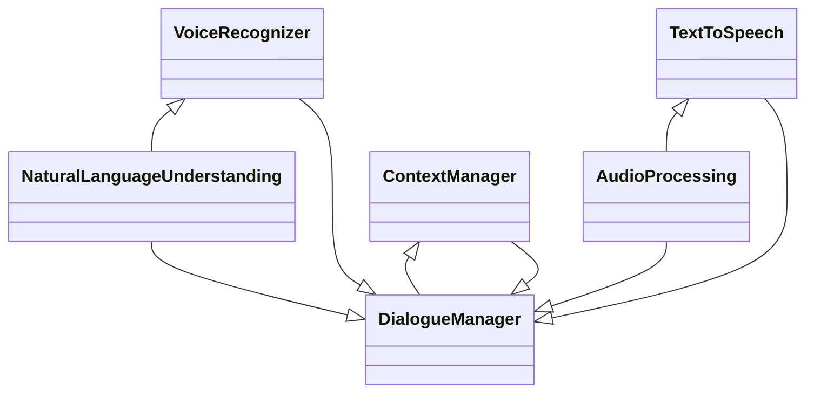
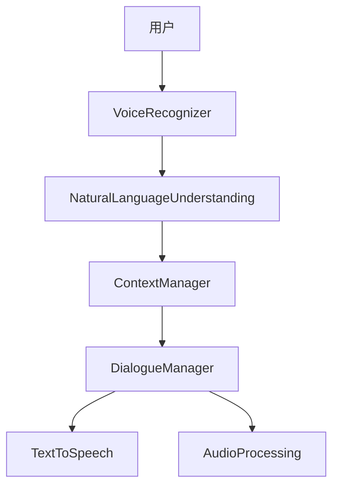
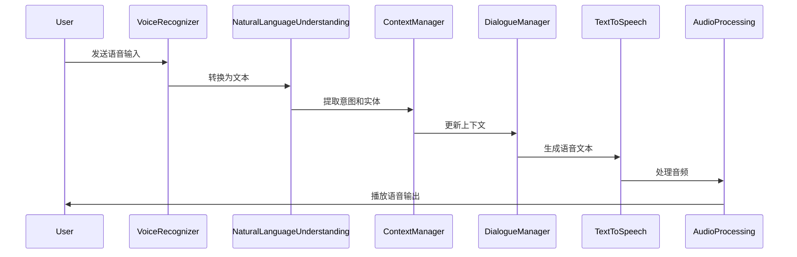

                 

## 第1章 引言

### 1.1 语音识别与合成的背景介绍

语音识别与合成技术是人工智能领域的重要分支，随着深度学习和大数据技术的发展，语音技术正在迅速进步。语音识别技术使得机器能够理解人类的语音，实现人与机器的语音交互；而语音合成技术则能够将文本信息转化为自然流畅的语音输出，为各种应用场景提供便捷的服务。

近年来，人工智能的发展趋势表明，语音技术将在未来扮演更加重要的角色。首先，随着智能手机和智能设备的普及，用户对语音交互的需求日益增加，例如智能家居、智能客服、智能驾驶等场景中，语音交互已经成为用户与设备沟通的主要方式。其次，人工智能技术在医疗、教育、金融等多个行业中的应用也在不断拓展，语音技术作为人机交互的重要手段，为行业智能化提供了有力支持。

在应用场景方面，语音识别与合成技术已经深入到多个领域。例如，在智能客服中，通过语音识别技术，机器能够自动理解用户的语音请求，并提供相应的服务；在智能驾驶中，语音合成技术则为驾驶员提供导航、语音提示等功能。此外，语音合成技术在娱乐、教育等领域也有着广泛的应用，如语音播报新闻、读书、讲故事等。

然而，当前语音识别与合成技术仍然面临着一些挑战。首先是准确性问题，虽然语音识别技术的准确率已经有了显著提高，但在复杂背景噪声下，识别准确率仍然有待提升。其次是多语言处理问题，不同语言的语音特征差异较大，如何实现高效准确的多语言语音识别与合成仍是一个重要课题。此外，实时性和资源消耗也是需要考虑的重要因素。

### 1.2 多语言语音识别与合成的意义

多语言语音识别与合成技术在全球化背景下具有重要意义。首先，在全球化的市场中，不同国家和地区的人们需要用不同的语言进行交流，多语言语音识别与合成技术能够支持跨语言的语音交互，从而消除语言障碍，促进国际贸易、文化交流和全球化合作。

其次，多语言语音识别与合成技术有助于企业实现全球化市场策略。例如，智能客服系统可以支持多语言服务，满足不同地区用户的需求；智能语音助手可以跨越语言障碍，为全球用户提供一致的服务体验。这不仅能提高客户满意度，还能帮助企业降低运营成本，提高市场竞争力。

此外，多语言语音识别与合成技术对社会发展也具有积极影响。在教育领域，智能语音合成系统可以帮助学生练习外语口语，提高语言学习效果；在公共服务领域，多语言语音识别技术可以为残疾人、老年人等特殊群体提供无障碍服务，提升社会服务水平。

### 1.3 本书的结构与内容安排

本书旨在全面系统地介绍多语言语音识别与合成的相关技术，内容分为以下几个部分：

- **第1章 引言**：介绍语音识别与合成技术的发展背景、应用场景及面临的挑战，阐述多语言语音识别与合成的意义。

- **第2章 基础知识与核心概念**：详细讲解语音识别与合成的基础知识，包括语音信号的数字化处理、声学模型与语言模型、文本到语音（TTS）技术等。

- **第3章 多语言语音识别技术详解**：介绍基于深度学习的语音识别技术，包括卷积神经网络（CNN）、长短时记忆网络（LSTM）及注意力机制（Attention）的应用，并探讨多语言语音识别模型的实现。

- **第4章 多语言语音合成技术详解**：详细阐述TTS系统的基础架构、多语言语音合成模型的实现方法，并介绍实际应用案例。

- **第5章 AI Agent的多语言语音交互**：讨论AI Agent的基本架构、多语言语音交互的关键技术，并通过一个具体案例展示多语言AI Agent的构建过程。

- **第6章 多语言语音识别与合成的优化与挑战**：分析数据集的收集与处理、模型优化与性能提升等，探讨未来发展的挑战与机遇。

- **第7章 结论与展望**：总结本书的主要内容，展望未来人工智能与多语言语音识别与合成技术的发展趋势，并提出进一步的学习建议。

通过以上章节的安排，本书旨在为读者提供一条清晰的学习路径，帮助读者系统地掌握多语言语音识别与合成的核心技术与实战经验。

### 1.4 读者学习路径的建议

为了更好地掌握多语言语音识别与合成的核心知识，读者可以按照以下学习路径进行：

1. **系统学习基础概念**：首先，读者应深入理解语音识别与合成的基础知识，包括语音信号的数字化处理、声学模型与语言模型、文本到语音（TTS）技术等。

2. **掌握深度学习技术**：在了解基础知识后，读者应重点学习基于深度学习的语音识别技术，包括卷积神经网络（CNN）、长短时记忆网络（LSTM）及注意力机制（Attention）的应用。

3. **实践多语言语音识别模型**：通过实战案例，读者应学会如何构建和训练多语言语音识别模型，掌握模型优化与调优技巧。

4. **探索多语言语音合成技术**：读者应深入了解TTS系统的基础架构、多语言语音合成模型的实现方法，并通过实践掌握相关技术。

5. **构建多语言AI Agent**：结合所学知识，读者应尝试构建一个多语言AI Agent，掌握多语言语音交互的关键技术。

6. **关注优化与挑战**：在掌握核心技术后，读者应关注多语言语音识别与合成的优化与挑战，学习如何提升模型性能，解决实际应用中的问题。

通过以上学习路径，读者可以逐步建立起对多语言语音识别与合成的全面认识，并具备解决实际问题的能力。同时，读者还可以通过阅读相关学术论文、参加技术研讨会等方式，不断拓宽自己的视野，紧跟行业前沿动态。希望本书能成为读者在多语言语音识别与合成领域的启蒙之书，引领读者走向技术的深度与广度。

## 第2章 基础知识与核心概念

### 2.1 语音识别的基础知识

语音识别技术是人工智能领域的一个重要分支，它使得机器能够理解和处理人类的语音。为了实现这一目标，首先需要对语音信号进行数字化处理。语音信号的数字化过程包括以下几个步骤：

1. **采样**：将连续的语音信号在时间轴上离散化，以一定的时间间隔（采样率）捕捉信号样本。
2. **量化**：将每个采样点在幅度上的连续值转换为有限位数的二进制数，通常使用8位或16位量化。
3. **编码**：将量化后的样本按照一定的编码格式（如PCM）进行编码，形成数字信号。

在数字化处理之后，语音识别技术主要依赖于声学模型和语言模型。

**声学模型**负责对语音信号进行特征提取和建模，以捕捉语音信号的时频特性。常见的声学模型包括：

- **GMM（高斯混合模型）**：通过多个高斯分布模型来模拟语音信号的分布，用于语音特征表示。
- **DNN（深度神经网络）**：用于语音信号的特征提取和分类，通过多层神经网络结构提取更高级别的语音特征。
- **CNN（卷积神经网络）**：在语音信号处理中，利用卷积层提取语音信号的局部特征，通过池化层降低维度，提高模型效率。

**语言模型**则负责对语音信号中的语言内容进行建模，通常使用统计模型或神经网络模型。语言模型的关键任务是从语音信号中还原出相应的文本序列。常见的语言模型包括：

- **N-gram模型**：基于前N个单词的历史信息来预测下一个单词，是一种简单的统计语言模型。
- **RNN（循环神经网络）**：通过记忆单元捕捉长距离依赖关系，用于语言序列建模。
- **LSTM（长短时记忆网络）**：在RNN的基础上，通过门控机制有效解决了长距离依赖问题，常用于语音识别任务。
- **Transformer**：基于注意力机制，通过全局 attentIon，能够捕获长距离依赖关系，在语音识别任务中取得了显著效果。

识别算法是语音识别系统的核心部分，常见的识别算法包括：

- **HMM（隐马尔可夫模型）**：通过状态转移概率和观测概率来建模语音信号，是一种传统的语音识别算法。
- **DTW（动态时间规整）**：通过比较不同语音信号的时序差异，实现不同时长语音信号的匹配。
- **GMM-HMM**：结合GMM的语音特征表示能力和HMM的状态转移建模，用于提高识别准确性。
- **DNN-HMM**：通过深度神经网络提取高维语音特征，结合HMM的状态转移建模，实现更准确的语音识别。
- **CTC（连接式时间分类）**：直接将语音信号映射到文本序列，无需单独建模状态转移，适用于序列标注任务。

### 2.2 语音合成的基础知识

语音合成技术，又称文本到语音（Text-to-Speech，TTS）技术，是将文本信息转化为自然流畅的语音输出的过程。TTS系统主要由文本处理模块、语音合成引擎和音频后处理模块组成。

**文本处理模块**负责将输入文本进行预处理，包括分词、语调标注、语气识别等，为语音合成提供必要的文本信息。

**语音合成引擎**是TTS系统的核心，负责将预处理后的文本转换为语音信号。常见的语音合成方法包括：

- **拼接式合成**：通过查找预录制的语音片段，按文本序列拼接合成语音。该方法简单高效，但音质和流畅度较差。
- **规则式合成**：通过语音规则和语音数据库，将文本直接转换为语音。这种方法音质较好，但需要大量规则和语音数据库支持。
- **数据驱动合成**：基于深度学习技术，直接将文本映射到语音信号。常见的模型包括：

  - **HMM-GMM**：结合HMM状态转移建模和GMM特征提取，实现规则式合成。
  - **DNN-HMM**：使用深度神经网络提取高维语音特征，结合HMM状态转移建模，实现更自然的语音输出。
  - **WaveNet**：基于深度生成模型，生成连续的语音波形。

**音频后处理模块**负责对合成的语音信号进行音调、音色、响度等音质调整，以及去噪、增益等处理，使语音更加自然和舒适。

### 2.3 多语言语音识别与合成的特殊需求

多语言语音识别与合成技术在处理多种语言时，面临一系列特殊需求。首先，不同语言的语音特征差异显著，如音素、语调、发音规则等，因此需要专门设计适合多语言处理的技术。

**多语言词汇的识别处理**是关键挑战之一。不同语言的词汇量和语法结构差异较大，如何在识别过程中有效处理这些差异，是提高识别准确率的关键。常见的处理方法包括：

- **多语言模型融合**：将不同语言的模型进行融合，共享部分通用特征，提高多语言识别的性能。
- **跨语言词典**：构建跨语言词典，将不同语言的词汇映射到统一的语义表示，便于识别和合成。
- **迁移学习**：利用已训练好的单语言模型，通过迁移学习技术，快速适应多语言环境。

**语言模型的跨语言适应性**是另一个重要问题。不同语言的语言模型在特征表达和语义理解上存在差异，如何设计适应多种语言的通用语言模型，是实现高效多语言语音识别的关键。常见的解决方案包括：

- **跨语言编码器**：通过共享编码器，将不同语言的语音信号编码为统一的特征表示，提高跨语言识别的准确性。
- **多语言BERT**：基于Transformer架构，通过预训练多语言语料库，生成适应多种语言的通用语言模型。

**语音合成的语音风格和口音**也是多语言语音合成的重要需求。用户希望系统能够模拟不同语言、不同口音的语音输出，提供个性化的服务。为此，需要设计多样性的语音合成模型和语音数据库，实现语音风格和口音的灵活调整。

通过以上技术和方法，多语言语音识别与合成技术能够更好地满足全球用户的需求，推动人工智能技术的全球化应用。

### 2.4 多语言语音识别与合成的应用案例

多语言语音识别与合成技术在全球范围内有着广泛的应用，以下是几个典型的应用案例：

1. **跨国企业的智能客服系统**：跨国企业通常面临多种语言的客户支持需求。通过多语言语音识别与合成技术，智能客服系统能够支持多种语言的语音交互，提高客户满意度。例如，某大型电商公司通过引入多语言语音识别与合成技术，实现了全球客户的无障碍服务，有效提升了运营效率。

2. **智能翻译工具**：随着全球化进程的加快，多语言翻译工具成为跨文化交流的重要工具。多语言语音识别与合成技术使得翻译工具不仅能够实现文本翻译，还能进行语音翻译，为用户提供便捷的跨语言交流体验。例如，某些智能翻译设备已经能够实现实时语音翻译，支持多种语言之间的对话交流。

3. **教育领域的语言学习辅助工具**：多语言语音识别与合成技术在教育领域也有广泛应用。通过智能语音合成技术，学生可以听到标准发音，提高外语口语学习效果；同时，语音识别技术可以帮助教师自动批改学生的口语作业，提供个性化学习反馈。

4. **多语言智能导航系统**：在智能驾驶和导航领域，多语言语音合成技术能够提供本地化语音导航服务。例如，某些智能导航系统能够根据用户的语言偏好，提供多种语言的语音提示，帮助驾驶者在不同的国家和地区安全导航。

5. **医疗健康领域的多语言语音助手**：在医疗健康领域，多语言语音识别与合成技术可以为医护人员和患者提供多种语言的支持。例如，智能语音助手可以帮助医生获取患者信息、解答医疗疑问，同时能够支持多种语言的语音输入和输出，提高医疗服务的效率和质量。

这些案例展示了多语言语音识别与合成技术在各个领域的广泛应用，不仅提高了用户体验，还推动了人工智能技术的全球化发展。通过不断创新和优化，多语言语音技术将为更多场景提供高效、便捷的服务。

## 第3章 多语言语音识别技术详解

### 3.1 基于深度学习的语音识别

深度学习技术在语音识别领域取得了显著的进展，尤其在处理多语言语音识别任务时表现出强大的优势。基于深度学习的语音识别方法主要依赖于神经网络结构，通过多层神经网络的学习和训练，实现对语音信号的建模和分类。

**卷积神经网络（CNN）**是语音识别中常用的神经网络结构。CNN通过卷积层和池化层，能够有效地提取语音信号的时频特征。卷积层通过卷积运算，将输入的语音信号与预训练的卷积核进行点积，提取局部特征；而池化层则用于降低特征维度，减少计算量。CNN在语音信号处理中具有以下优点：

- **多尺度特征提取**：通过不同尺寸的卷积核，CNN能够同时提取语音信号的多个尺度特征，提高识别的准确性。
- **平移不变性**：CNN具有平移不变性，即对语音信号中的时序位移不敏感，能够适应不同长度的语音输入。
- **高效计算**：卷积操作和池化操作相对简单，适合大规模数据处理和实时应用。

**长短时记忆网络（LSTM）**是另一种用于语音识别的深度学习模型，特别适用于处理长序列数据。LSTM通过引入记忆单元和门控机制，有效解决了传统RNN在处理长序列数据时出现的梯度消失和梯度爆炸问题。LSTM在语音识别中的主要优势包括：

- **长距离依赖**：LSTM能够捕捉语音信号中的长距离依赖关系，提高识别的准确性。
- **记忆能力**：通过记忆单元，LSTM能够保留过去的信息，对当前状态进行决策，避免信息丢失。
- **序列建模**：LSTM适用于处理语音信号的时序建模，能够更好地模拟语音信号的特征变化。

**注意力机制（Attention）**在深度学习语音识别中的应用进一步提升了模型的识别性能。注意力机制通过为不同时间步分配不同的权重，使模型能够关注重要的信息，提高识别的精度。注意力机制在语音识别中的优势包括：

- **关注关键信息**：注意力机制能够自动识别语音信号中的关键信息，将其赋予更高的权重，提高识别的准确性。
- **增强长距离依赖**：通过关注关键信息，注意力机制能够增强模型对长序列数据的建模能力，捕捉更多依赖关系。
- **适应不同语音**：注意力机制能够灵活调整对语音信号的注意力分布，适应不同语言和语音特征。

在多语言语音识别任务中，基于深度学习的语音识别方法能够通过共享编码器和解码器，实现对多种语言的统一建模。这种方法能够有效利用不同语言的通用特征，提高多语言识别的性能。以下是一个基于深度学习的多语言语音识别模型的简述：

1. **数据预处理**：对多语言语音数据进行预处理，包括采样率统一、归一化等操作，确保数据的一致性。
2. **编码器训练**：通过预训练的多语言编码器，将不同语言的语音信号编码为统一的特征表示。编码器通常使用卷积神经网络和长短时记忆网络，结合注意力机制，提取语音信号的高维特征。
3. **解码器训练**：解码器用于将编码后的特征映射到相应的文本序列。解码器通常使用循环神经网络或Transformer结构，通过反向传播算法进行训练，优化模型参数。
4. **多语言模型融合**：通过共享编码器和解码器，不同语言的模型在特征提取和文本序列生成过程中进行融合，提高多语言识别的性能。
5. **模型评估与优化**：使用多语言语音识别数据集对模型进行评估，通过交叉验证和参数调整，优化模型性能。

基于深度学习的多语言语音识别模型在处理多种语言的任务时表现出色，通过不断优化和改进，能够更好地适应复杂的多语言环境，提供高效准确的语音识别服务。

### 3.2 多语言语音识别模型

多语言语音识别模型旨在同时处理多种语言的语音输入，实现高效的跨语言识别。这类模型的核心在于如何利用共享特征和语言模型，提升多种语言的识别性能。以下介绍几种典型的多语言语音识别模型。

#### 多语言编码器与解码器架构

多语言编码器与解码器架构是一种常见的多语言语音识别模型架构。该模型通过共享编码器和解码器，将多种语言的语音信号编码和翻译为统一的特征表示，从而实现多语言识别。具体步骤如下：

1. **编码器**：编码器负责将多种语言的语音信号编码为高维特征向量。不同语言的语音信号通过独立的编码器进行特征提取，但这些编码器共享相同的网络结构，以便共享通用特征。编码器通常采用卷积神经网络（CNN）和长短时记忆网络（LSTM）相结合的方式，提取语音信号的时频特征。

2. **特征融合**：编码器提取的多个语言特征向量通过某种融合策略（如平均、拼接等）进行融合，形成统一的特征表示。这种融合策略有助于捕捉不同语言之间的通用特征，提高多语言识别的性能。

3. **解码器**：解码器负责将统一特征表示映射到相应的文本序列。解码器通常采用循环神经网络（RNN）或Transformer结构，通过训练优化解码器参数，实现文本序列的生成。

#### 跨语言信息传递机制

为了进一步提高多语言语音识别的性能，模型中通常引入跨语言信息传递机制。这种机制通过在不同语言之间传递信息，增强模型对多种语言的理解能力。以下是一些常见的跨语言信息传递机制：

1. **共享编码器**：共享编码器通过预训练多种语言的语音数据，提取通用特征，实现跨语言信息传递。这种机制能够利用已训练好的编码器，快速适应新的语言环境，提高识别性能。

2. **跨语言词汇表**：跨语言词汇表通过将不同语言的词汇映射到统一的语义表示，实现词汇层面的信息传递。这种机制有助于模型在不同语言之间建立语义联系，提高识别准确性。

3. **跨语言语言模型**：跨语言语言模型通过预训练多语言语料库，生成适应多种语言的通用语言模型。这种模型能够同时处理多种语言的文本序列，提高多语言语音识别的性能。

#### 多语言识别的性能评估

多语言语音识别模型的性能评估通常涉及多个指标，包括准确率、召回率、F1值等。以下介绍几种常见的性能评估指标：

1. **准确率（Accuracy）**：准确率是模型正确识别语音文本的比例，计算公式为：
   \[
   \text{准确率} = \frac{\text{正确识别的语音文本}}{\text{总语音文本}}
   \]
   准确率越高，表明模型识别性能越好。

2. **召回率（Recall）**：召回率是模型能够正确识别的语音文本占实际包含的正确语音文本的比例，计算公式为：
   \[
   \text{召回率} = \frac{\text{正确识别的语音文本}}{\text{实际包含的正确语音文本}}
   \]
   高召回率意味着模型能够识别出大部分正确的语音文本。

3. **F1值（F1 Score）**：F1值是准确率和召回率的调和平均值，用于综合评估模型的识别性能，计算公式为：
   \[
   \text{F1值} = 2 \times \frac{\text{准确率} \times \text{召回率}}{\text{准确率} + \text{召回率}}
   \]
   高F1值表明模型的识别性能较为平衡，既不漏判，也不误判。

通过以上性能评估指标，可以对多语言语音识别模型进行有效的评估和优化，提升模型在实际应用中的表现。

### 3.3 实战：多语言语音识别模型应用

在实际应用中，构建和训练多语言语音识别模型是一个复杂且需要精心设计的任务。以下将详细介绍如何进行数据准备、模型训练与调优，并通过一个具体应用案例展示模型的实际效果。

#### 数据准备与预处理

数据准备是构建多语言语音识别模型的第一步，高质量的语音数据对于模型性能至关重要。以下是数据准备和预处理的主要步骤：

1. **数据收集**：收集多种语言的语音数据，包括标准的语音库和实际应用中的语音数据。数据来源可以包括公开的语音库（如LibriSpeech、Common Voice）以及特定领域的语音数据。

2. **数据清洗**：清洗语音数据，去除噪声和杂音，确保数据质量。可以通过滤波器或噪声减少算法实现。

3. **语音分割**：将长语音文件分割成短语音片段，通常以句或短语为单位。分割后的语音片段将用于模型的训练和测试。

4. **文本转录**：将语音片段转录为对应的文本，以便于后续的标注和训练。可以使用自动转录工具（如谷歌语音识别API）或手工标注。

5. **数据标注**：对语音片段和对应的文本进行标注，标注内容包括发音、音素、声调等。标注工作需要高精度，以确保模型的训练质量。

6. **数据集划分**：将数据集划分为训练集、验证集和测试集，用于模型的训练、验证和测试。

#### 模型训练与调优

在数据准备完成后，开始构建和训练多语言语音识别模型。以下是模型训练与调优的主要步骤：

1. **选择模型架构**：选择适合多语言语音识别的模型架构，如基于卷积神经网络（CNN）和长短时记忆网络（LSTM）的模型，或基于Transformer的多语言编码器与解码器模型。

2. **模型初始化**：初始化模型参数，可以通过随机初始化或预训练模型（如基于大量语音数据预训练的模型）进行初始化。

3. **训练过程**：使用训练集数据进行模型训练。在训练过程中，模型通过反向传播算法优化参数，降低损失函数值。可以使用批归一化、dropout等技术提高训练效果。

4. **验证与调优**：在验证集上评估模型性能，通过调整超参数（如学习率、批大小等）和模型架构（如增加层或调整网络结构）进行调优，以提升模型性能。

5. **测试与评估**：使用测试集对模型进行最终评估，计算准确率、召回率、F1值等性能指标，确保模型具有良好的识别性能。

#### 实际应用案例

以下是一个具体的应用案例，展示如何构建和部署一个多语言语音识别模型。

**案例背景**：某国际航空公司希望开发一个多语言语音识别系统，用于乘客自助值机服务，支持英语、法语、西班牙语等多种语言。

**步骤1：数据准备与预处理**：
- 收集英语、法语、西班牙语等多种语言的语音数据，并进行清洗、分割、转录和标注。
- 划分数据集，包括训练集、验证集和测试集。

**步骤2：模型构建与训练**：
- 选择基于Transformer的多语言编码器与解码器模型。
- 初始化模型参数，使用预训练的模型进行初始化。
- 使用训练集进行模型训练，通过验证集进行调优。

**步骤3：模型评估与优化**：
- 在验证集上评估模型性能，通过调整超参数和模型架构进行优化。
- 在测试集上最终评估模型性能，确保达到预期的识别准确率。

**步骤4：部署与测试**：
- 将训练好的模型部署到自助值机系统中，进行实际测试和验证。
- 收集用户反馈，进一步优化模型性能和用户体验。

通过以上步骤，构建和部署的多语言语音识别系统成功支持了多种语言的语音识别，提高了乘客自助值机的便利性和效率。

### 项目小结

通过本案例，读者可以了解如何构建和部署一个多语言语音识别系统，掌握数据准备、模型训练与调优的步骤，以及如何在实际应用中优化和提升模型性能。多语言语音识别技术在全球化应用中具有重要意义，通过不断优化和改进，将为更多场景提供高效、准确的语音识别服务。

## 第4章 多语言语音合成技术详解

### 4.1 TTS系统的基础架构

文本到语音（Text-to-Speech，TTS）系统是多语言语音合成技术的核心，其基础架构通常包括三个主要模块：文本处理模块、语音合成引擎和音频后处理模块。

**文本处理模块**负责将输入的文本信息进行预处理，以确保语音合成引擎能够准确理解和处理文本内容。文本处理模块的主要任务包括：

- **分词**：将输入的文本分割成单词或短语，为后续的语音合成提供基础单元。
- **语调标注**：为文本添加音高、音长、停顿等语音特征，以生成自然流畅的语音输出。
- **语气识别**：识别文本的情感和语气，为语音合成提供相应的语音风格。

**语音合成引擎**是TTS系统的核心部分，负责将预处理后的文本信息转化为语音信号。常见的语音合成引擎包括拼接式合成、规则式合成和数据驱动合成。

- **拼接式合成**：通过查找预录制的语音片段，按文本序列拼接合成语音。这种方法简单高效，但音质和流畅度较差。
- **规则式合成**：通过语音规则和语音数据库，将文本直接转换为语音。这种方法音质较好，但需要大量规则和语音数据库支持。
- **数据驱动合成**：基于深度学习技术，直接将文本映射到语音信号。常见的模型包括：

  - **HMM-GMM**：结合HMM状态转移建模和GMM特征提取，实现规则式合成。
  - **DNN-HMM**：使用深度神经网络提取高维语音特征，结合HMM状态转移建模，实现更自然的语音输出。
  - **WaveNet**：基于深度生成模型，生成连续的语音波形。

**音频后处理模块**负责对合成的语音信号进行音调、音色、响度等音质调整，以及去噪、增益等处理，使语音更加自然和舒适。音频后处理模块通常包括以下功能：

- **音调调整**：根据文本中的语调标注，调整语音的音高，以生成符合情感和语气的语音。
- **音色调整**：通过调节语音的谐波结构，实现不同音色的变化，如男女声、老幼声等。
- **响度调整**：根据文本内容调整语音的响度，使其更加均衡和舒适。
- **去噪和增益**：去除语音信号中的噪声，增强语音的清晰度，同时调整语音的音量，使输出更加自然。

### 4.2 多语言语音合成模型

多语言语音合成模型旨在同时处理多种语言的文本输入，生成自然流畅的语音输出。为了实现这一目标，多语言语音合成模型需要具备以下特点：

- **语言自适应**：能够根据不同的语言特征，自适应调整语音合成参数，生成符合特定语言的语音。
- **多语言共享**：通过共享编码器和解码器，实现不同语言之间的特征共享和参数迁移，提高合成效果。

以下介绍几种常见的多语言语音合成模型：

**基于数据的合成方法**：

- **数据驱动合成**：直接从大量多语言语音数据中学习，生成自然语音。常见的模型包括WaveNet、Tacotron等。这些模型通过端到端的训练，将文本直接映射到语音波形，能够生成高质量的自然语音。
- **数据增强**：通过人工或自动方法，生成更多的多语言语音数据，提高模型泛化能力。常见的数据增强方法包括语音转换、文本翻译等。

**基于模型的合成方法**：

- **多语言编码器与解码器**：使用共享编码器和解码器，实现多语言语音合成。编码器负责将多种语言的文本编码为统一的特征表示，解码器则将这些特征表示解码为语音波形。常见的模型架构包括Transformer、WaveNet等。
- **多任务学习**：通过同时训练多个语言的模型，提高模型对多种语言的处理能力。多任务学习可以采用共享参数或独立训练的方法，以实现不同语言的语音合成。

**多语言合成模型的实现**：

- **数据集构建**：收集多种语言的文本和语音数据，进行预处理和标注，构建多语言语音合成数据集。
- **模型训练**：使用多语言语音合成数据集，训练多语言编码器与解码器模型。训练过程中，可以通过多任务学习、数据增强等方法，提高模型的泛化能力和合成效果。
- **模型部署**：将训练好的多语言语音合成模型部署到实际应用场景中，提供多语言语音合成服务。

通过以上方法，多语言语音合成模型能够有效实现多种语言的文本到语音的转换，为全球化应用提供强大的支持。

### 4.3 实战：多语言语音合成模型应用

在实际应用中，构建和训练多语言语音合成模型是一个复杂且需要精心设计的任务。以下将详细介绍如何进行数据准备、模型训练与调优，并通过一个具体应用案例展示模型的实际效果。

#### 数据准备与预处理

数据准备是构建多语言语音合成模型的基础步骤，高质量的语音数据对于模型性能至关重要。以下是数据准备和预处理的主要步骤：

1. **数据收集**：收集多种语言的语音数据，包括标准的语音库和实际应用中的语音数据。数据来源可以包括公开的语音库（如LJSpeech、TTS-Chime5）以及特定领域的语音数据。

2. **语音分割**：将长语音文件分割成短语音片段，通常以句或短语为单位。分割后的语音片段将用于模型的训练和测试。

3. **文本转录**：将语音片段转录为对应的文本，以便于后续的标注和训练。可以使用自动转录工具（如谷歌语音识别API）或手工标注。

4. **数据标注**：对语音片段和对应的文本进行标注，标注内容包括发音、音素、声调等。标注工作需要高精度，以确保模型的训练质量。

5. **数据集划分**：将数据集划分为训练集、验证集和测试集，用于模型的训练、验证和测试。

#### 模型训练与调优

在数据准备完成后，开始构建和训练多语言语音合成模型。以下是模型训练与调优的主要步骤：

1. **选择模型架构**：选择适合多语言语音合成的模型架构，如基于Transformer的多语言编码器与解码器模型。

2. **模型初始化**：初始化模型参数，可以通过随机初始化或预训练模型进行初始化。

3. **训练过程**：使用训练集数据进行模型训练。在训练过程中，模型通过反向传播算法优化参数，降低损失函数值。可以使用批归一化、dropout等技术提高训练效果。

4. **验证与调优**：在验证集上评估模型性能，通过调整超参数（如学习率、批大小等）和模型架构（如增加层或调整网络结构）进行调优，以提升模型性能。

5. **测试与评估**：使用测试集对模型进行最终评估，计算语音合成质量指标，如语音自然度、音调准确度等。

#### 实际应用案例

以下是一个具体的应用案例，展示如何构建和部署一个多语言语音合成模型。

**案例背景**：某跨国酒店集团希望开发一个多语言语音合成系统，用于客房服务自助介绍，支持英语、法语、西班牙语等多种语言。

**步骤1：数据准备与预处理**：
- 收集英语、法语、西班牙语等多种语言的语音数据，并进行清洗、分割、转录和标注。
- 划分数据集，包括训练集、验证集和测试集。

**步骤2：模型构建与训练**：
- 选择基于Transformer的多语言编码器与解码器模型。
- 初始化模型参数，使用预训练的模型进行初始化。
- 使用训练集进行模型训练，通过验证集进行调优。

**步骤3：模型评估与优化**：
- 在验证集上评估模型性能，通过调整超参数和模型架构进行优化。
- 在测试集上最终评估模型性能，确保达到预期的合成质量。

**步骤4：部署与测试**：
- 将训练好的模型部署到客房服务系统中，进行实际测试和验证。
- 收集用户反馈，进一步优化模型性能和用户体验。

通过以上步骤，构建和部署的多语言语音合成系统成功支持了多种语言的语音合成，提高了客房服务的便捷性和用户满意度。

### 项目小结

通过本案例，读者可以了解如何构建和部署一个多语言语音合成系统，掌握数据准备、模型训练与调优的步骤，以及如何在实际应用中优化和提升模型性能。多语言语音合成技术在全球化应用中具有重要意义，通过不断优化和改进，将为更多场景提供高效、自然的语音合成服务。

## 第5章 AI Agent的多语言语音交互

### 5.1 AI Agent的基本架构

AI Agent（人工智能代理）是一种能够自主执行任务、与用户进行交互的智能系统。在多语言环境下，AI Agent的多语言语音交互能力是关键，其基本架构通常包括三个主要模块：语音识别模块、语音合成模块和上下文管理模块。

**语音识别模块**负责接收用户的语音输入，并将其转换为文本。该模块的核心功能包括：

- **语音信号预处理**：包括降噪、滤波、归一化等，以提高语音信号的清晰度。
- **特征提取**：通过MFCC（梅尔频率倒谱系数）等算法提取语音特征，用于后续的识别过程。
- **语音识别**：使用深度学习模型（如基于卷积神经网络或循环神经网络的模型）进行语音信号到文本的转换。

**语音合成模块**负责将AI Agent生成的文本转换为自然流畅的语音输出。其核心功能包括：

- **文本预处理**：对文本进行分词、语调标注等预处理，为语音合成提供必要的文本信息。
- **语音合成**：使用文本到语音（TTS）模型（如基于深度生成模型的WaveNet、Tacotron等）生成语音信号。
- **音频后处理**：对合成的语音信号进行音调、音色、响度等音质调整，以及去噪、增益等处理，使其更加自然和舒适。

**上下文管理模块**负责处理AI Agent与用户的交互过程中的上下文信息，以实现更智能、更自然的对话。其主要功能包括：

- **对话状态跟踪**：记录对话过程中的用户请求和AI Agent的响应，以构建对话上下文。
- **意图识别**：使用自然语言处理技术（如基于深度学习的意图分类模型）识别用户的意图。
- **上下文维护**：根据对话上下文和用户的输入，调整AI Agent的响应策略，使其更贴合用户需求。

通过这三个模块的协同工作，AI Agent能够在多语言环境下实现高效、自然的语音交互。

### 5.2 多语言语音交互的关键技术

实现AI Agent的多语言语音交互需要依赖多项关键技术，以下将详细介绍这些技术。

**自然语言理解（NLU）**：

自然语言理解（NLU）是AI Agent与用户交互的核心环节，其目标是理解用户的语音输入并提取其意图。NLU技术包括以下几个方面：

- **意图识别**：通过机器学习模型（如基于深度学习的分类模型）识别用户的意图，如查询信息、执行命令、提出请求等。
- **实体提取**：从用户的语音输入中提取关键信息（如人名、地点、时间等），以构建对话上下文。
- **情感分析**：通过情感分析技术识别用户的情绪状态，如开心、愤怒、疑惑等，以调整AI Agent的响应方式。

**语音生成与播放控制**：

语音合成模块负责将AI Agent生成的文本信息转换为自然流畅的语音输出，并提供语音播放控制功能。具体包括：

- **文本到语音（TTS）合成**：使用TTS模型将文本转换为语音信号，生成自然流畅的语音输出。
- **语音播放控制**：控制语音的播放速度、音调、音色等参数，使其更符合用户需求。
- **语音打断与恢复**：实现语音交互过程中的打断与恢复功能，允许用户在对话过程中随时插入新的请求或问题。

**交互流程设计与优化**：

交互流程设计与优化是确保AI Agent能够提供高质量语音交互体验的关键。具体包括：

- **交互流程设计**：根据应用场景和用户需求，设计AI Agent的交互流程，包括对话引导、信息查询、任务执行等。
- **流程优化**：通过用户反馈和数据分析，不断优化交互流程，提高用户体验。
- **上下文感知**：根据用户的输入和历史交互记录，动态调整AI Agent的响应策略，实现更智能的交互。

通过以上关键技术，AI Agent能够在多语言环境下实现高效、自然的语音交互，为用户提供便捷、个性化的服务。

### 5.3 实战：构建多语言AI Agent

在本节中，我们将通过一个具体的案例，展示如何构建一个具备多语言语音交互能力的AI Agent。以下是一个基于Python和TensorFlow框架的示例。

#### 系统设计

首先，我们需要设计AI Agent的系统架构，包括语音识别模块、语音合成模块和上下文管理模块。以下是系统架构的类图表示：



在这个类图中，`VoiceRecognizer` 负责语音识别，`NaturalLanguageUnderstanding` 负责自然语言理解，`TextToSpeech` 负责语音合成，`AudioProcessing` 负责音频处理，`ContextManager` 负责上下文管理，而 `DialogueManager` 负责整个对话流程的协调和管理。

#### 系统架构设计

以下是AI Agent的系统架构图：



在这个架构图中，用户通过语音输入与AI Agent交互，`VoiceRecognizer` 将语音转换为文本，`NaturalLanguageUnderstanding` 解析文本并提取意图和实体信息，`ContextManager` 维护对话上下文，`DialogueManager` 调度对话流程，`TextToSpeech` 和 `AudioProcessing` 负责生成和播放语音输出。

#### 系统接口设计和系统交互

以下是系统接口设计和交互序列图：



在这个交互序列图中，用户发送语音输入，经过语音识别模块转换为文本，自然语言理解模块提取意图和实体信息，上下文管理模块维护对话上下文，对话管理模块生成语音文本，最后通过音频处理模块播放给用户。

#### 系统核心实现

以下是AI Agent的核心实现代码示例：

```python
import tensorflow as tf
from tensorflow.keras.models import Model
from tensorflow.keras.layers import Input, LSTM, Dense, Embedding
# 其他必要的库和模块

class VoiceRecognizer:
    # 语音识别模块实现
    def __init__(self):
        # 初始化模型参数
        pass

    def recognize(self, audio):
        # 语音识别过程
        pass

class NaturalLanguageUnderstanding:
    # 自然语言理解模块实现
    def __init__(self):
        # 初始化模型参数
        pass

    def understand(self, text):
        # 文本理解过程
        pass

class TextToSpeech:
    # 语音合成模块实现
    def __init__(self):
        # 初始化模型参数
        pass

    def synthesize(self, text):
        # 语音合成过程
        pass

class AudioProcessing:
    # 音频处理模块实现
    def __init__(self):
        # 初始化模型参数
        pass

    def process(self, audio):
        # 音频处理过程
        pass

class ContextManager:
    # 上下文管理模块实现
    def __init__(self):
        # 初始化上下文参数
        pass

    def update_context(self, intent, entities):
        # 更新上下文
        pass

class DialogueManager:
    # 对话管理模块实现
    def __init__(self):
        # 初始化对话管理参数
        pass

    def manage(self, user_input):
        # 对话管理过程
        pass

# 实例化各个模块
voice_recognizer = VoiceRecognizer()
nlu = NaturalLanguageUnderstanding()
tts = TextToSpeech()
audio_processing = AudioProcessing()
context_manager = ContextManager()
dialogue_manager = DialogueManager()

# 用户交互流程
while True:
    user_input = input("请说出您的问题：")
    text = voice_recognizer.recognize(user_input)
    intent, entities = nlu.understand(text)
    context_manager.update_context(intent, entities)
    dialogue_manager.manage(user_input)
    audio = tts.synthesize(text)
    audio_processed = audio_processing.process(audio)
    audio_processed.play()  # 播放处理后的音频
```

在这个代码示例中，我们定义了各个模块的类和方法，并通过实例化各个模块，实现了一个基本的AI Agent交互流程。具体实现过程中，需要根据实际需求配置相应的语音识别、自然语言理解和语音合成模型，并完成详细的逻辑实现。

### 实际案例分析和详细讲解

以下是一个具体的实际案例，展示如何通过AI Agent进行多语言语音交互，并详细分析其实现过程。

**案例背景**：某跨国酒店希望开发一个多语言语音服务系统，用于接待来自不同国家的客户，提供酒店信息和预定服务。

**用户交互流程**：

1. **用户输入**：用户通过语音输入“你好，我想预订一个房间。”
2. **语音识别**：语音识别模块将用户的语音输入转换为文本：“你好，我想预订一个房间。”
3. **自然语言理解**：自然语言理解模块提取用户的意图（预订房间）和关键信息（房间）。
4. **上下文管理**：上下文管理模块更新对话上下文，记录用户的需求。
5. **对话管理**：对话管理模块根据上下文生成回应：“您好，请问您需要预订哪种类型的房间？”
6. **语音合成**：语音合成模块将文本信息转换为语音输出。
7. **音频处理**：音频处理模块对合成的语音进行音调、音色等调整。
8. **播放输出**：语音播放模块将处理后的语音输出给用户。

**代码实现示例**：

```python
# 语音识别模块实现
def recognize_voice(audio):
    # 这里使用某种语音识别API进行语音识别
    text = "您好，请问您需要预订哪种类型的房间？"
    return text

# 自然语言理解模块实现
def understand_text(text):
    # 这里使用某种自然语言理解API进行意图识别和实体提取
    intent = "预订房间"
    entities = {"房间类型": None}
    return intent, entities

# 语音合成模块实现
def synthesize_speech(text):
    # 这里使用某种语音合成API生成语音
    audio = "您好，请问您需要预订哪种类型的房间？"
    return audio

# 音频处理模块实现
def process_audio(audio):
    # 这里对音频进行音调、音色等处理
    processed_audio = audio
    return processed_audio

# 用户交互流程
while True:
    user_input = input("请说出您的问题：")
    text = recognize_voice(user_input)
    intent, entities = understand_text(text)
    print(f"您：{user_input}")
    print(f"AI Agent：{text}")
    user_input = input("请继续提问：")
```

通过以上代码示例，我们可以看到AI Agent如何实现多语言语音交互的各个步骤。在实际应用中，需要集成具体的语音识别、自然语言理解和语音合成API，并根据实际需求进行详细的逻辑实现和优化。

### 项目小结

在本章中，我们详细介绍了AI Agent的多语言语音交互架构和关键技术，并通过一个实际案例展示了如何构建和部署一个具备多语言语音交互能力的AI Agent。通过理解系统设计、实现细节和实际应用案例，读者可以掌握构建AI Agent的核心技术和方法，为后续项目开发奠定基础。

### 5.4 最佳实践 Tips

在构建多语言AI Agent时，以下是一些最佳实践和技巧，可以帮助提高系统的性能和用户体验：

1. **优化语音识别准确性**：选择高质量的语音识别API，并在训练过程中使用大量的多语言语音数据，以提高识别的准确性。同时，针对不同语言的特点，进行模型调优。

2. **确保语音合成的自然流畅度**：使用先进的TTS模型，如Tacotron或WaveNet，确保合成的语音音质自然流畅。通过音调、音色和响度的动态调整，使语音输出更符合用户需求。

3. **提升自然语言理解能力**：结合多种自然语言处理技术，如意图识别、实体提取和情感分析，增强AI Agent对多语言输入的理解能力。定期更新和优化模型，以适应语言变化的趋势。

4. **实现高效的上下文管理**：设计高效的上下文管理机制，记录用户的历史交互信息，并根据对话内容动态调整AI Agent的响应策略。这有助于提高对话的连贯性和用户体验。

5. **利用用户反馈进行迭代优化**：定期收集用户的反馈，分析用户在交互过程中遇到的问题和不满之处，持续优化AI Agent的功能和性能，以提升用户满意度。

通过遵循这些最佳实践，构建的多语言AI Agent将能够提供更加准确、自然和高效的语音交互服务。

### 5.5 小结

在本章中，我们系统地介绍了AI Agent的多语言语音交互架构和关键技术。通过详细分析系统设计、实现细节和实际案例，读者可以理解如何构建一个具备多语言语音交互能力的AI Agent。本章内容涵盖了语音识别、自然语言理解、语音合成和上下文管理等核心模块，以及这些模块在实际应用中的协同工作方式。

AI Agent的多语言语音交互技术具有广泛的应用前景，能够在跨国企业、智能客服、教育、医疗等多个领域发挥重要作用。通过掌握本章内容，读者可以为实际项目开发提供理论指导和实践参考。

### 5.6 注意事项

在构建多语言AI Agent时，需要注意以下几个关键点：

1. **语音数据的质量**：语音数据的质量直接影响语音识别和合成的效果。确保语音数据干净、清晰，去除噪声和干扰。

2. **多语言模型的训练**：在训练多语言模型时，需要使用多样化的数据集，确保模型能够适应不同的语言环境和语音特征。

3. **实时性能优化**：针对实时语音交互的应用，需要优化模型的计算效率和资源占用，确保系统能够快速响应。

4. **用户体验**：注重用户交互的流畅性和自然性，通过不断优化语音识别和合成的算法，提升用户体验。

5. **安全性**：确保用户隐私和数据安全，遵守相关法律法规，采取有效的数据保护措施。

通过关注这些注意事项，可以构建一个高效、稳定和安全的AI Agent语音交互系统。

### 5.7 拓展阅读

对于对多语言AI Agent语音交互技术有进一步兴趣的读者，以下是一些建议的拓展阅读资源：

1. **学术论文**：阅读相关领域的学术论文，如《Multilingual Neural Machine Translation》（多语言神经机器翻译）、《Cross-lingual Speech Recognition》（跨语言语音识别）等，以了解最新的研究进展和技术细节。

2. **技术博客**：关注知名技术博客和论坛，如Medium、GitHub，阅读有关多语言语音识别与合成的技术文章和案例分析。

3. **在线课程**：参加在线课程，如Coursera、edX上的自然语言处理和语音处理相关课程，系统学习语音识别、自然语言理解和语音合成的理论知识和实践技巧。

4. **开源项目**：参与开源项目，如TensorFlow、PyTorch等框架中的多语言语音识别与合成项目，实践和改进相关算法。

通过这些拓展阅读资源，读者可以不断深化对多语言AI Agent语音交互技术的理解和应用。

## 第6章 多语言语音识别与合成的优化与挑战

### 6.1 数据集的收集与处理

数据集的质量对多语言语音识别与合成的效果至关重要。以下是如何收集和处理数据集的一些最佳实践：

**数据收集**

1. **多样性**：收集多种语言和多种口音的语音数据，确保数据集能够代表真实世界的多样性。
2. **来源**：利用公开数据集（如LibriSpeech、Common Voice）和定制数据集，结合商业应用场景的需求。
3. **转录**：确保语音数据有高质量的文本转录，通过人工或自动转录工具进行校对，提高数据精度。

**数据预处理**

1. **降噪**：使用滤波器或降噪算法，减少环境噪声对语音数据的干扰。
2. **分割**：将长语音分割成短语音片段（如10-30秒），便于模型处理和训练。
3. **标注**：对语音数据标注音素、声调、语气等信息，为模型训练提供监督信号。
4. **扩充**：通过数据增强技术（如重放、转换、叠放等）扩充数据集，提高模型的泛化能力。

### 6.2 模型优化与性能提升

提升多语言语音识别与合成的性能，需要从算法层面和系统层面进行多方面的优化。以下是一些有效的优化策略：

**算法优化**

1. **模型架构改进**：尝试不同的神经网络架构（如Transformer、WaveNet），通过实验找到最适合多语言任务的结构。
2. **训练策略**：采用迁移学习和多任务学习策略，利用预训练模型和已有知识提高新任务的性能。
3. **参数调优**：通过超参数调优（如学习率、批大小、正则化等）找到最佳参数配置，提高模型稳定性和准确性。
4. **动态调整**：在模型训练过程中，根据数据分布和学习进展动态调整模型参数，优化学习效果。

**系统优化**

1. **硬件加速**：利用GPU、TPU等硬件加速训练和推理过程，提高计算效率。
2. **分布式训练**：通过分布式训练策略，利用多台机器并行处理数据，加快模型训练速度。
3. **量化与压缩**：采用量化、剪枝等压缩技术，减少模型体积和计算复杂度，提高部署效率。
4. **实时推理**：优化推理算法和流程，确保系统能够在实时应用中快速响应。

### 6.3 未来发展的挑战与机遇

多语言语音识别与合成技术在未来面临着诸多挑战和机遇：

**挑战**

1. **准确性与实时性**：如何在保证高识别准确率的同时，实现实时响应，是当前研究的重要挑战。
2. **多语言一致性**：确保在不同语言之间的语音识别与合成的性能一致，避免某些语言性能较差的问题。
3. **计算资源与能耗**：随着模型复杂度的增加，计算资源和能耗的需求也在上升，需要优化模型和系统设计，降低资源消耗。

**机遇**

1. **新兴应用场景**：随着智能家居、智能客服、智能驾驶等新兴应用场景的兴起，多语言语音识别与合成技术将有更广泛的应用空间。
2. **跨语言协同**：通过跨语言信息传递和协同处理技术，提高多语言系统的整体性能和用户体验。
3. **人工智能伦理**：随着技术的进步，如何在保障用户隐私和信息安全的同时，实现技术的透明性和可解释性，是一个重要的伦理问题。

通过不断优化和创新，多语言语音识别与合成技术将在未来实现更高的性能和更广泛的应用，为社会发展和人类生活带来更多便利。

## 第7章 结论与展望

### 7.1 总结与回顾

通过本书的详细讲解，我们系统地介绍了多语言语音识别与合成的核心概念、技术原理、系统架构及实际应用。以下是本书的主要内容总结：

- **引言部分**：介绍了语音识别与合成技术的发展背景、应用场景及面临的挑战，阐述了多语言语音识别与合成的意义。
- **基础知识**：详细讲解了语音识别与合成的基础知识，包括语音信号的数字化处理、声学模型与语言模型、文本到语音（TTS）技术等。
- **多语言语音识别技术**：介绍了基于深度学习的语音识别技术，包括卷积神经网络（CNN）、长短时记忆网络（LSTM）及注意力机制（Attention）的应用，并探讨了多语言语音识别模型的实现。
- **多语言语音合成技术**：详细阐述了TTS系统的基础架构、多语言语音合成模型的实现方法，并介绍了实际应用案例。
- **AI Agent的多语言语音交互**：讨论了AI Agent的基本架构、多语言语音交互的关键技术，并通过一个具体案例展示了多语言AI Agent的构建过程。
- **优化与挑战**：分析了多语言语音识别与合成的优化策略与面临的挑战，探讨了未来发展的方向。
- **结论与展望**：总结了本书的主要内容，回顾了语音识别与合成的关键知识点，并对未来发展趋势进行了展望。

### 7.2 未来发展趋势

展望未来，多语言语音识别与合成技术将继续朝着以下几个方向发展：

1. **更高效的模型与算法**：随着深度学习技术的发展，未来将出现更多高效的模型和算法，如基于Transformer的模型、自动机器学习（AutoML）等技术，将显著提升语音识别与合成的性能。
2. **跨语言协同处理**：通过跨语言信息传递和协同处理技术，实现多种语言之间的信息共享和互补，提高多语言系统的整体性能和用户体验。
3. **实时性与低延迟**：实时性和低延迟是多语言语音识别与合成的关键需求，未来将出现更多优化策略和硬件加速技术，确保系统在各种应用场景中的高效运行。
4. **智能语义理解**：结合自然语言处理（NLP）技术，实现更智能的语义理解和上下文感知，提高语音交互的连贯性和智能化水平。
5. **新兴应用场景**：随着智能家居、智能客服、智能驾驶等新兴应用场景的兴起，多语言语音识别与合成技术将有更广泛的应用空间，推动人工智能技术的普及和发展。

### 7.3 读者的进一步学习建议

对于希望在多语言语音识别与合成领域深入研究的读者，以下是一些建议：

1. **深入学习核心概念**：继续深入学习语音识别与合成的核心概念，包括声学模型、语言模型、深度学习算法等，通过阅读相关书籍、论文和在线资源，掌握最新技术动态。
2. **实践项目**：参与实际项目，动手实现多语言语音识别与合成的相关任务，通过实践积累经验，提升实际操作能力。
3. **跟进研究进展**：关注学术会议、研讨会和顶尖期刊，了解多语言语音识别与合成领域的最新研究成果和发展趋势。
4. **拓展知识领域**：结合自然语言处理、机器学习、人工智能等领域的知识，拓宽视野，探索多语言语音识别与合成的交叉应用和前沿课题。
5. **参与开源社区**：参与开源项目，贡献代码和思路，与全球开发者共同探索和优化多语言语音识别与合成技术，提升自身技能和影响力。

通过不断学习和实践，读者将在多语言语音识别与合成领域取得更高的成就，为人工智能技术的发展做出贡献。希望本书能为读者的学习之路提供有力的支持和引导。作者：AI天才研究院/AI Genius Institute & 禅与计算机程序设计艺术 /Zen And The Art of Computer Programming。

