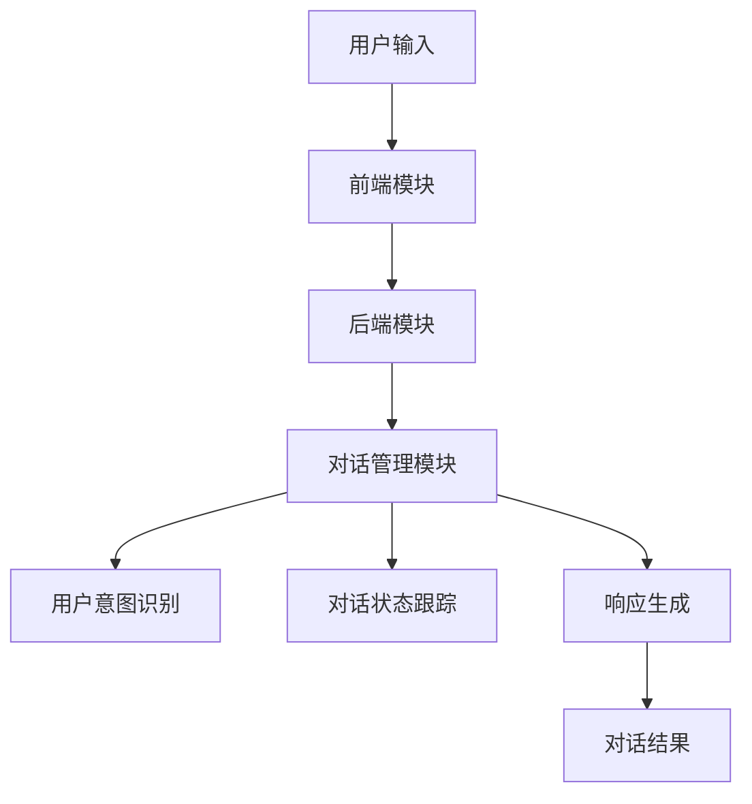
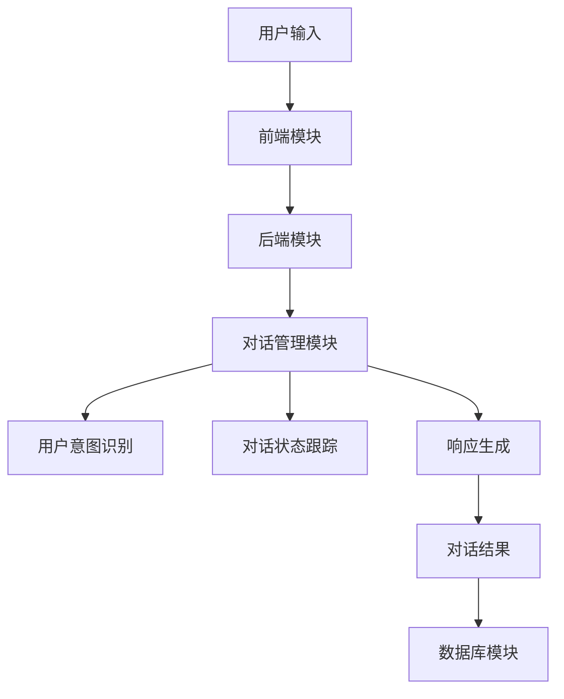

                 

# 实现AI Agent的多轮对话状态跟踪

关键词：AI Agent、多轮对话、状态跟踪、算法原理、系统架构

摘要：本文深入探讨了实现AI Agent在多轮对话中跟踪状态的关键技术。通过分析相关概念、算法原理和系统架构，本文提出了一种实用的多轮对话状态跟踪方法，旨在为开发者提供一套系统化的解决方案。文章结构如下：

## 引言与背景介绍

### 多轮对话状态跟踪的重要性

在人工智能领域，对话系统作为一种与人交互的重要方式，正逐渐得到广泛应用。无论是智能客服、虚拟助手还是智能家居，多轮对话能力都是衡量其智能化水平的重要指标。多轮对话状态跟踪是实现高效对话的关键，它确保AI Agent能够理解用户的意图和上下文，提供准确的回应。

### 多轮对话状态跟踪的挑战

多轮对话状态跟踪面临诸多挑战，如上下文信息理解的复杂性、用户意图的多样性和对话历史的管理。此外，随着对话轮次的增加，状态跟踪的准确性和效率也成为一个关键问题。

### 本书结构安排

本书将首先介绍多轮对话状态跟踪的背景和基本概念，然后详细讲解相关的算法原理和数学模型，接着展示一个完整的系统架构设计方案，并通过实际案例分析和最佳实践提供实用指导。

## 相关技术与概念

### 对话系统基础

对话系统是AI领域的一个重要分支，它模拟人类对话过程，使计算机能够与人类进行交互。主要组成部分包括语音识别、自然语言理解、对话管理和自然语言生成。

### 状态表示方法

状态表示是多轮对话状态跟踪的核心，它将用户的意图、对话历史和上下文信息编码为一种结构化的形式。常见的表示方法包括基于规则的方法、基于语义的方法和基于机器学习的方法。

### 上下文理解与推理

上下文理解是实现智能对话的关键。AI Agent需要通过上下文推理来理解用户的意图，这涉及到知识图谱、语义分析、实体识别等技术。有效的上下文理解可以大幅提升对话系统的响应准确性和用户体验。

## 多轮对话状态跟踪算法原理

### 传统方法

传统方法包括基于规则的方法和基于统计的方法。基于规则的方法通过预定义的规则来跟踪对话状态，而基于统计的方法通过分析历史对话数据来预测用户意图。

### 现代深度学习方法

现代深度学习方法，如循环神经网络（RNN）和变换器（Transformer），在多轮对话状态跟踪中展现出了强大的能力。这些方法可以自动学习对话中的模式和规律，提高状态跟踪的准确性和效率。

### 算法对比与分析

通过对传统方法和现代深度学习方法的对比分析，可以发现深度学习方法在处理复杂对话场景时具有显著优势。同时，我们还需要考虑算法的实时性、可扩展性和鲁棒性。

## 数学模型与公式讲解

### 数学模型基础

多轮对话状态跟踪的数学模型通常包括状态转移概率、意图识别模型和响应生成模型。这些模型描述了AI Agent如何根据当前状态和用户输入进行决策。

### 公式推导与证明

我们将详细推导这些数学模型中的关键公式，如贝叶斯公式、最大似然估计和最小化损失函数。这些公式是理解状态跟踪算法的核心。

### 算法优化策略

算法优化策略包括正则化、权重更新和批量处理等技术，这些策略有助于提高模型的性能和泛化能力。

## 实战项目：多轮对话状态跟踪系统开发

### 项目介绍

本项目将实现一个基于深度学习技术的多轮对话状态跟踪系统，旨在为用户提供一个高效的对话体验。系统将涵盖用户意图识别、对话状态跟踪和响应生成等功能。

### 系统架构设计

系统架构包括前端用户界面、后端服务端和数据库。前端负责用户输入和展示对话结果，后端处理用户请求并调用对话管理模块，数据库存储用户对话历史和状态信息。

### 系统核心实现

我们将使用Python编写系统核心代码，包括意图识别模块、状态跟踪模块和响应生成模块。代码将详细讲解每个模块的功能和实现原理。

## 实际案例分析

### 案例背景

我们将分析一个实际的多轮对话案例，包括用户的对话历史、意图和反馈。通过这个案例，我们将展示如何使用本文提出的方法进行状态跟踪和意图理解。

### 案例分析与评估

我们将对案例进行分析，评估多轮对话状态跟踪的效果，并讨论改进策略。评估指标包括对话准确率、响应时间和用户满意度等。

### 经验与教训

通过实际案例分析，我们可以总结出一些经验教训，如如何处理异常对话、如何优化模型参数等。

## 最佳实践与优化策略

### 最佳实践

我们将分享一些最佳实践，如如何选择合适的算法、如何进行数据预处理和模型训练等。

### 性能优化

性能优化是提高多轮对话状态跟踪系统效率的关键。我们将探讨如何通过优化代码、硬件加速和分布式计算来提升系统性能。

### 安全与隐私考虑

安全与隐私是多轮对话状态跟踪系统必须考虑的问题。我们将讨论如何确保用户数据的安全性和隐私性。

## 小结与展望

### 本书总结

本文系统地介绍了多轮对话状态跟踪的关键技术，包括概念、算法、系统和实践。通过本书，读者可以掌握实现高效对话系统的核心方法和策略。

### 未来研究方向

未来研究方向包括多模态对话状态跟踪、跨领域对话状态跟踪和对话生成模型等。这些方向将为对话系统的发展带来新的机遇和挑战。

### 读者建议

我们欢迎读者提出宝贵意见和建议，共同推动多轮对话状态跟踪技术的发展。

## 作者信息

作者：AI天才研究院/AI Genius Institute & 禅与计算机程序设计艺术 /Zen And The Art of Computer Programming

本文的撰写旨在为AI开发者提供一套全面、系统、实用的多轮对话状态跟踪解决方案。通过深入的理论分析和实际的系统实现，读者可以更好地理解这一技术，并将其应用到实际项目中。

----------------------------------------------------------------

### 引言与背景介绍

#### 多轮对话状态跟踪的重要性

在人工智能领域，对话系统作为一种与人交互的重要方式，正逐渐得到广泛应用。无论是智能客服、虚拟助手还是智能家居，多轮对话能力都是衡量其智能化水平的重要指标。多轮对话状态跟踪是实现高效对话的关键，它确保AI Agent能够理解用户的意图和上下文，提供准确的回应。

#### 多轮对话状态跟踪的挑战

多轮对话状态跟踪面临诸多挑战，如上下文信息理解的复杂性、用户意图的多样性和对话历史的管理。此外，随着对话轮次的增加，状态跟踪的准确性和效率也成为一个关键问题。

#### 本书结构安排

本书将首先介绍多轮对话状态跟踪的背景和基本概念，然后详细讲解相关的算法原理和数学模型，接着展示一个完整的系统架构设计方案，并通过实际案例分析和最佳实践提供实用指导。

### 相关技术与概念

#### 对话系统基础

对话系统是AI领域的一个重要分支，它模拟人类对话过程，使计算机能够与人类进行交互。主要组成部分包括语音识别、自然语言理解、对话管理和自然语言生成。

#### 状态表示方法

状态表示是多轮对话状态跟踪的核心，它将用户的意图、对话历史和上下文信息编码为一种结构化的形式。常见的表示方法包括基于规则的方法、基于语义的方法和基于机器学习的方法。

#### 上下文理解与推理

上下文理解是实现智能对话的关键。AI Agent需要通过上下文推理来理解用户的意图，这涉及到知识图谱、语义分析、实体识别等技术。有效的上下文理解可以大幅提升对话系统的响应准确性和用户体验。

### 多轮对话状态跟踪算法原理

#### 传统方法

传统方法包括基于规则的方法和基于统计的方法。基于规则的方法通过预定义的规则来跟踪对话状态，而基于统计的方法通过分析历史对话数据来预测用户意图。

#### 现代深度学习方法

现代深度学习方法，如循环神经网络（RNN）和变换器（Transformer），在多轮对话状态跟踪中展现出了强大的能力。这些方法可以自动学习对话中的模式和规律，提高状态跟踪的准确性和效率。

#### 算法对比与分析

通过对传统方法和现代深度学习方法的对比分析，可以发现深度学习方法在处理复杂对话场景时具有显著优势。同时，我们还需要考虑算法的实时性、可扩展性和鲁棒性。

### 数学模型与公式讲解

#### 数学模型基础

多轮对话状态跟踪的数学模型通常包括状态转移概率、意图识别模型和响应生成模型。这些模型描述了AI Agent如何根据当前状态和用户输入进行决策。

#### 公式推导与证明

我们将详细推导这些数学模型中的关键公式，如贝叶斯公式、最大似然估计和最小化损失函数。这些公式是理解状态跟踪算法的核心。

#### 算法优化策略

算法优化策略包括正则化、权重更新和批量处理等技术，这些策略有助于提高模型的性能和泛化能力。

### 实战项目：多轮对话状态跟踪系统开发

#### 项目介绍

本项目将实现一个基于深度学习技术的多轮对话状态跟踪系统，旨在为用户提供一个高效的对话体验。系统将涵盖用户意图识别、对话状态跟踪和响应生成等功能。

#### 系统架构设计

系统架构包括前端用户界面、后端服务端和数据库。前端负责用户输入和展示对话结果，后端处理用户请求并调用对话管理模块，数据库存储用户对话历史和状态信息。

#### 系统核心实现

我们将使用Python编写系统核心代码，包括意图识别模块、状态跟踪模块和响应生成模块。代码将详细讲解每个模块的功能和实现原理。

### 实际案例分析

#### 案例背景

我们将分析一个实际的多轮对话案例，包括用户的对话历史、意图和反馈。通过这个案例，我们将展示如何使用本文提出的方法进行状态跟踪和意图理解。

#### 案例分析与评估

我们将对案例进行分析，评估多轮对话状态跟踪的效果，并讨论改进策略。评估指标包括对话准确率、响应时间和用户满意度等。

#### 经验与教训

通过实际案例分析，我们可以总结出一些经验教训，如如何处理异常对话、如何优化模型参数等。

### 最佳实践与优化策略

#### 最佳实践

我们将分享一些最佳实践，如如何选择合适的算法、如何进行数据预处理和模型训练等。

#### 性能优化

性能优化是提高多轮对话状态跟踪系统效率的关键。我们将探讨如何通过优化代码、硬件加速和分布式计算来提升系统性能。

#### 安全与隐私考虑

安全与隐私是多轮对话状态跟踪系统必须考虑的问题。我们将讨论如何确保用户数据的安全性和隐私性。

### 小结与展望

#### 本书总结

本文系统地介绍了多轮对话状态跟踪的关键技术，包括概念、算法、系统和实践。通过本书，读者可以掌握实现高效对话系统的核心方法和策略。

#### 未来研究方向

未来研究方向包括多模态对话状态跟踪、跨领域对话状态跟踪和对话生成模型等。这些方向将为对话系统的发展带来新的机遇和挑战。

#### 读者建议

我们欢迎读者提出宝贵意见和建议，共同推动多轮对话状态跟踪技术的发展。

### 作者信息

作者：AI天才研究院/AI Genius Institute & 禅与计算机程序设计艺术 /Zen And The Art of Computer Programming

本文的撰写旨在为AI开发者提供一套全面、系统、实用的多轮对话状态跟踪解决方案。通过深入的理论分析和实际的系统实现，读者可以更好地理解这一技术，并将其应用到实际项目中。

----------------------------------------------------------------

## 第一部分: 引言与背景介绍

### 1.1 多轮对话状态跟踪的重要性

在人工智能领域，对话系统作为一种与人交互的重要方式，正逐渐得到广泛应用。无论是智能客服、虚拟助手还是智能家居，多轮对话能力都是衡量其智能化水平的重要指标。多轮对话状态跟踪是实现高效对话的关键，它确保AI Agent能够理解用户的意图和上下文，提供准确的回应。

首先，让我们明确一下什么是多轮对话状态跟踪。多轮对话状态跟踪是指在多轮对话过程中，AI Agent需要能够持续地跟踪和管理对话状态，以便在后续对话轮次中提供更准确的响应。这个过程中，AI Agent需要记住之前的对话内容、用户的意图以及上下文信息，以便做出合理的决策。

多轮对话状态跟踪的重要性主要体现在以下几个方面：

1. **提升用户体验**：通过多轮对话状态跟踪，AI Agent可以更好地理解用户的意图和需求，提供个性化的服务，从而提升用户体验。

2. **提高对话效率**：状态跟踪可以减少重复性问题，使对话更加流畅，提高对话效率。

3. **优化决策过程**：在多轮对话中，AI Agent需要根据当前的对话状态和用户输入做出决策。状态跟踪有助于AI Agent更好地理解对话历史，从而优化决策过程。

4. **增强智能互动**：状态跟踪使得AI Agent能够更好地模拟人类对话，实现更加自然和智能的互动。

### 1.2 多轮对话状态跟踪的挑战

尽管多轮对话状态跟踪具有许多优势，但在实际应用中仍面临诸多挑战：

1. **上下文信息理解的复杂性**：用户的意图和上下文信息可能是模糊的、不完整的或者存在歧义。AI Agent需要通过复杂的语义分析来理解这些信息，这是一个挑战。

2. **用户意图的多样性**：用户可能在不同的对话轮次中提出各种各样的问题和请求，这要求AI Agent能够适应不同的意图和场景。

3. **对话历史的管理**：随着对话轮次的增加，对话历史会变得很长，如何有效地管理和利用这些历史信息是一个挑战。

4. **状态跟踪的实时性和效率**：多轮对话状态跟踪需要实时处理大量的对话数据，同时保持高效率，这对系统的性能提出了高要求。

### 1.3 本书结构安排

为了帮助读者系统地理解多轮对话状态跟踪，本书将按照以下结构展开：

- **第1章：多轮对话状态跟踪的概述**：介绍多轮对话状态跟踪的基本概念、重要性及其面临的挑战。
- **第2章：相关技术与概念**：讨论对话系统基础、状态表示方法和上下文理解与推理。
- **第3章：多轮对话状态跟踪算法原理**：分析传统方法和现代深度学习方法，并进行算法对比与分析。
- **第4章：数学模型与公式讲解**：讲解状态跟踪的数学模型基础，推导关键公式，并讨论算法优化策略。
- **第5章：实战项目：多轮对话状态跟踪系统开发**：介绍一个实际的多轮对话状态跟踪系统开发案例。
- **第6章：实际案例分析**：通过实际案例展示多轮对话状态跟踪的应用。
- **第7章：最佳实践与优化策略**：分享最佳实践和性能优化策略，以及安全与隐私考虑。
- **第8章：小结与展望**：总结本书内容，并提出未来研究方向和读者建议。

通过这本书的阅读，读者将能够全面了解多轮对话状态跟踪的技术和方法，掌握其实际应用技巧，并为未来的研究和开发提供指导。

### 2.1.1 对话系统基础

对话系统是人工智能领域的一个关键组成部分，它模拟人类对话过程，使计算机能够与人类进行自然交互。一个完整的对话系统通常包括语音识别、自然语言理解、对话管理和自然语言生成等模块，这些模块协同工作，共同实现与用户的智能对话。

#### 2.1.1.1 语音识别

语音识别是对话系统的第一步，它的任务是將用户的语音输入转换为文本输入。这一过程涉及语音信号的预处理、特征提取和模式识别。常见的语音识别技术包括基于 Hidden Markov Model (HMM) 的方法和基于深度学习的神经网络方法。

- **基于 HMM 的方法**：HMM 是一种统计模型，用于模拟语音信号的时间序列特征。它通过训练大量语音数据，学习语音信号的分布规律，从而实现语音到文本的转换。
  
  ```mermaid
  graph TD
  A[语音信号] --> B[HMM 模型]
  B --> C[文本输出]
  ```

- **基于深度学习的神经网络方法**：深度学习方法，如卷积神经网络 (CNN) 和循环神经网络 (RNN)，通过多层神经网络结构，自动学习语音信号的复杂特征，提高语音识别的准确性。

  ```mermaid
  graph TD
  A[语音信号] --> B[特征提取]
  B --> C[深度神经网络]
  C --> D[文本输出]
  ```

#### 2.1.1.2 自然语言理解

自然语言理解（NLU）是对话系统的核心模块，它的任务是将用户的文本输入转换为结构化的信息，以便后续处理。NLU 包括意图识别、实体识别、上下文理解等子任务。

- **意图识别**：意图识别的目标是理解用户输入的意图，如“预订机票”、“查询天气”等。常见的意图识别方法包括基于规则的方法和基于机器学习的方法。

  ```mermaid
  graph TD
  A[文本输入] --> B[意图识别]
  B --> C[意图标签]
  ```

- **实体识别**：实体识别的目标是识别文本中的关键信息，如人名、地名、日期等。实体识别通常结合词性标注和命名实体识别技术。

  ```mermaid
  graph TD
  A[文本输入] --> B[词性标注]
  B --> C[命名实体识别]
  ```

- **上下文理解**：上下文理解是对话系统理解用户意图的重要环节，它需要考虑对话历史和上下文信息，以提供更准确的响应。

  ```mermaid
  graph TD
  A[文本输入] --> B[对话历史]
  B --> C[上下文理解]
  ```

#### 2.1.1.3 对话管理

对话管理是对话系统的另一个关键模块，它的任务是协调对话过程，确保对话的流畅性和一致性。对话管理包括对话状态跟踪、对话策略生成和响应规划等子任务。

- **对话状态跟踪**：对话状态跟踪的目标是持续记录对话的状态信息，如当前意图、对话轮次、用户偏好等。状态跟踪需要利用前述的意图识别和实体识别结果，以及对话历史信息。

  ```mermaid
  graph TD
  A[意图识别] --> B[对话状态]
  B --> C[状态更新]
  ```

- **对话策略生成**：对话策略生成是根据对话状态和对话目标，生成合理的对话策略。常见的策略包括基于规则的方法和基于机器学习的方法。

  ```mermaid
  graph TD
  A[对话状态] --> B[策略生成]
  B --> C[策略选择]
  ```

- **响应规划**：响应规划是根据对话策略，生成合理的响应。响应规划需要考虑用户意图、对话历史和上下文信息，以及对话系统的目标。

  ```mermaid
  graph TD
  A[对话策略] --> B[响应规划]
  B --> C[响应生成]
  ```

#### 2.1.1.4 自然语言生成

自然语言生成（NLG）是对话系统的最后一个模块，它的任务是生成自然流畅的语言输出，回应用户的问题或请求。NLG 可以分为模板生成、数据驱动生成和基于深度学习的生成。

- **模板生成**：模板生成是一种简单有效的自然语言生成方法，它使用预定义的模板来生成文本。模板可以根据对话系统的需求和场景进行定制。

  ```mermaid
  graph TD
  A[输入信息] --> B[模板匹配]
  B --> C[文本输出]
  ```

- **数据驱动生成**：数据驱动生成方法通过学习大量的对话数据进行生成，它能够生成更灵活和多样化的文本。

  ```mermaid
  graph TD
  A[对话数据] --> B[模型训练]
  B --> C[文本输出]
  ```

- **基于深度学习的生成**：基于深度学习的生成方法，如序列到序列模型（Seq2Seq）和生成对抗网络（GAN），能够生成高质量的自然语言文本。

  ```mermaid
  graph TD
  A[输入序列] --> B[编码器]
  B --> C[解码器]
  C --> D[文本输出]
  ```

通过上述模块的协同工作，对话系统能够实现与用户的自然互动，提供高效、准确的对话服务。接下来，我们将进一步探讨多轮对话状态跟踪的方法和挑战。

### 2.1.2 状态表示方法

在多轮对话中，状态表示方法是确保AI Agent能够准确理解和跟踪对话进展的核心。状态表示方法将用户的意图、对话历史和上下文信息编码为一种结构化的形式，以便AI Agent在后续对话轮次中能够利用这些信息做出合理的决策。

#### 2.1.2.1 基于规则的方法

基于规则的方法通过定义一系列预定义的规则来跟踪对话状态。这种方法通常涉及手工编写大量的规则，这些规则描述了如何在不同的对话情况下进行决策。例如，如果用户输入“A”，则响应“B”；如果用户输入“C”，则响应“D”。

- **优势**：这种方法简单直观，易于理解和实现。它允许开发人员根据特定的业务需求定制规则，以确保对话系统的准确性和一致性。

  ```mermaid
  graph TD
  A[用户输入A] --> B[响应B]
  C[用户输入C] --> D[响应D]
  ```

- **劣势**：基于规则的方法在处理复杂和多变的对话场景时表现出局限性。当对话规则变得复杂时，维护和扩展规则集将变得困难，且容易出现遗漏或错误。

  ```mermaid
  graph TD
  A[复杂对话场景] --> B[规则不适用]
  ```

#### 2.1.2.2 基于语义的方法

基于语义的方法通过分析对话中的语义信息来表示状态。这种方法通常利用自然语言处理（NLP）技术，如词性标注、实体识别和关系提取，来理解用户的意图和上下文。

- **优势**：基于语义的方法能够更准确地理解和跟踪对话状态，因为它利用了对话的语义信息。这种方法适用于处理复杂和多变的对话场景，能够提供更灵活的对话管理。

  ```mermaid
  graph TD
  A[用户输入] --> B[NLP分析]
  B --> C[语义表示]
  ```

- **劣势**：基于语义的方法需要强大的NLP技术和大量的训练数据来支持。此外，语义理解本身是一个复杂的任务，存在歧义性和不确定性，这可能导致状态表示的不准确。

  ```mermaid
  graph TD
  A[歧义性输入] --> B[NLP困难]
  ```

#### 2.1.2.3 基于机器学习的方法

基于机器学习的方法通过训练模型来自动学习对话状态。这种方法通常使用监督学习或无监督学习技术，从对话数据中学习状态表示。

- **监督学习方法**：监督学习方法使用标注好的对话数据来训练模型。常见的算法包括决策树、支持向量机（SVM）和深度神经网络（DNN）。这种方法可以自动从数据中学习状态表示，减少人工干预。

  ```mermaid
  graph TD
  A[标注对话数据] --> B[训练模型]
  B --> C[状态表示]
  ```

- **无监督学习方法**：无监督学习方法，如聚类算法和生成对抗网络（GAN），可以从未标注的数据中学习状态表示。这种方法适用于大规模未标注数据集，但可能需要更复杂的算法和更长的训练时间。

  ```mermaid
  graph TD
  A[未标注对话数据] --> B[训练模型]
  B --> C[状态表示]
  ```

- **优势**：基于机器学习的方法能够自动学习和调整状态表示，提高系统的适应性和准确性。这种方法适用于处理大规模和复杂的对话数据。

- **劣势**：基于机器学习的方法需要大量的训练数据和计算资源，且模型的泛化能力可能受到限制。此外，模型的可解释性也是一个挑战，特别是在深度学习方法中。

#### 2.1.2.4 混合方法

混合方法结合了基于规则、语义和机器学习的方法，以充分发挥各自的优势。这种方法通过将预定义的规则与机器学习模型相结合，利用规则处理确定性对话场景，而利用机器学习模型处理复杂和不确定的对话场景。

- **优势**：混合方法能够提供更灵活和准确的对话管理。它通过规则和机器学习的结合，提高了系统的适应性和准确性，同时保持了系统的可解释性和可控性。

  ```mermaid
  graph TD
  A[用户输入] --> B[规则匹配]
  B --> C[机器学习模型]
  C --> D[状态表示]
  ```

- **劣势**：混合方法需要更复杂的实现和更高的计算成本。此外，规则和机器学习模型之间的协调和融合也是一个挑战。

#### 2.1.2.5 对比与选择

选择合适的状态表示方法取决于对话系统的具体需求和场景。以下是对不同方法的对比：

| 方法               | 优势                           | 劣势                           | 适用场景                |
|--------------------|--------------------------------|--------------------------------|------------------------|
| 基于规则的方法     | 简单直观，易于理解和实现         | 处理复杂对话场景时表现局限性     | 确定性对话场景          |
| 基于语义的方法     | 准确理解对话状态               | 需要强大的NLP技术和大量训练数据   | 复杂和多变的对话场景    |
| 基于机器学习的方法 | 自动学习状态表示，提高准确性     | 需要大量训练数据和计算资源       | 大规模和复杂的对话数据   |
| 混合方法           | 结合规则和机器学习的优势         | 需要更复杂的实现和计算成本       | 复杂性较高的对话场景    |

通过选择合适的状态表示方法，对话系统可以更好地跟踪和管理对话状态，从而提供更自然、流畅和准确的对话体验。

### 2.1.3 上下文理解与推理

上下文理解与推理是多轮对话状态跟踪中至关重要的环节，它决定了AI Agent能否准确理解用户的意图和需求，并提供恰当的响应。在多轮对话中，上下文信息不仅包括当前的对话内容，还包括对话历史、用户行为、环境状态等。

#### 2.1.3.1 上下文信息的获取

上下文信息的获取是多轮对话状态跟踪的基础。常见的上下文信息获取方法包括：

1. **对话历史记录**：记录每次对话的内容和交互历史，包括用户的提问、AI Agent的响应以及相关的上下文信息。

2. **用户行为分析**：通过分析用户的行为模式，如点击、滑动、语音等，获取用户的兴趣和偏好。

3. **环境状态感知**：利用传感器和外部设备，获取环境信息，如天气、地理位置等。

4. **知识库查询**：利用预先构建的知识库，查询与当前对话相关的信息，以丰富上下文内容。

#### 2.1.3.2 上下文理解与推理方法

上下文理解与推理方法可以分为基于规则的方法和基于机器学习的方法。

1. **基于规则的方法**：

   - **规则定义**：通过预定义的规则来识别和提取上下文信息。这些规则可以是基于语法、语义或行为的，例如，“如果用户提问关于天气，则返回当前天气信息”。

   - **规则匹配**：将用户输入与预定义的规则进行匹配，以识别上下文信息。这种方法简单直观，但在处理复杂和多变的对话场景时可能受限。

   ```mermaid
   graph TD
   A[用户输入] --> B[规则匹配]
   B --> C[上下文信息]
   ```

2. **基于机器学习的方法**：

   - **序列模型**：使用循环神经网络（RNN）或长短期记忆网络（LSTM）等序列模型，从对话历史中学习上下文信息。这些模型能够捕捉对话中的长距离依赖关系。

     ```mermaid
     graph TD
     A[对话历史] --> B[RNN/LSTM]
     B --> C[上下文信息]
     ```

   - **注意力机制**：引入注意力机制，使模型能够关注对话历史中的重要信息，提高上下文理解的准确性。

     ```mermaid
     graph TD
     A[对话历史] --> B[注意力机制]
     B --> C[上下文信息]
     ```

   - **多模态学习**：结合文本、语音、图像等多种模态信息，进行上下文理解与推理。这种方法能够更全面地捕捉用户的意图和需求。

     ```mermaid
     graph TD
     A[文本输入] --> B[多模态学习]
     B --> C[上下文信息]
     ```

#### 2.1.3.3 上下文推理的应用

上下文推理的应用场景广泛，包括：

1. **意图识别**：利用上下文信息，准确识别用户的意图，如预订机票、查询天气、购买商品等。

2. **对话生成**：根据上下文信息，生成自然流畅的对话响应，提高对话的连贯性和互动性。

3. **对话策略生成**：基于上下文信息，生成合理的对话策略，如回答用户问题、引导用户继续对话、提供建议等。

4. **异常检测**：通过分析上下文信息，识别异常对话，如恶意攻击、不合理请求等，并采取相应的措施。

通过有效的上下文理解与推理，AI Agent能够更好地理解用户的意图和需求，提供更准确、个性化的对话服务，从而提升用户的体验和满意度。

### 3.1.1 传统方法

在多轮对话状态跟踪领域，传统方法以其简单性和直观性而闻名，为早期对话系统的开发奠定了基础。这些方法主要包括基于规则的系统（Rule-based Systems）和基于统计的方法（Statistical Methods）。

#### 3.1.1.1 基于规则的系统

基于规则的系统通过预定义的规则来跟踪对话状态。这些规则通常由开发人员根据对话的逻辑和业务需求手工编写。每个规则对应于特定的对话场景，当用户输入与规则匹配时，系统将执行相应的动作。

- **规则定义**：规则可以表示为“如果...那么...”的形式，例如，“如果用户输入‘预订机票’，那么系统应显示机票查询界面”。

- **规则匹配**：系统会根据用户的输入和当前对话状态，匹配预定义的规则，从而决定下一步操作。

- **优势**：基于规则的系统易于实现和理解，且对简单的对话场景效果显著。

- **劣势**：在处理复杂和多变的对话场景时，基于规则的系统可能会显得力不从心。当对话规则变得复杂时，维护和扩展规则集将变得困难，且容易出现遗漏或错误。

#### 3.1.1.2 基于统计的方法

基于统计的方法通过分析历史对话数据来预测用户意图和对话状态。这种方法通常利用统计模型，如决策树（Decision Trees）、朴素贝叶斯（Naive Bayes）和支持向量机（Support Vector Machines）等。

- **决策树**：决策树是一种树形结构，通过一系列的判断条件来对数据进行分类。每个节点代表一个特征，每个分支代表一个特征的可能取值。

  ```mermaid
  graph TD
  A{是否预订机票？}
  A --> B{是} --> C{查询机票信息}
  A --> D{否} --> E{提供其他服务}
  ```

- **朴素贝叶斯**：朴素贝叶斯是一种基于贝叶斯定理的简单概率分类器。它假设特征之间相互独立，通过计算各个特征的概率来预测分类结果。

  ```mermaid
  graph TD
  A[用户输入] --> B[计算概率]
  B --> C[分类结果]
  ```

- **支持向量机**：支持向量机是一种强大的分类器，通过寻找最优超平面将不同类别的数据分开。它利用核函数将数据映射到高维空间，从而提高分类效果。

  ```mermaid
  graph TD
  A[原始数据] --> B[核函数]
  B --> C[高维空间]
  C --> D[分类结果]
  ```

- **优势**：基于统计的方法可以利用大量历史数据进行学习和预测，适应复杂的对话场景。它们通常具有较好的泛化能力，可以在新的对话场景中表现良好。

- **劣势**：这些方法可能需要大量的数据来训练，且在处理实时对话时可能不够高效。此外，统计模型可能无法很好地解释其决策过程，导致可解释性较差。

#### 3.1.1.3 传统方法的挑战

尽管传统方法在多轮对话状态跟踪中具有一定的应用价值，但它们也存在一些挑战：

- **规则复杂度**：基于规则的系统在处理复杂对话时需要大量的规则，这可能导致系统的复杂度和维护成本增加。

- **数据依赖性**：基于统计的方法依赖于大量的历史对话数据，缺乏实时性的对话状态跟踪能力。

- **解释性**：传统方法通常难以提供明确的解释，特别是在使用复杂的统计模型时。

#### 3.1.1.4 传统方法的应用场景

传统方法适用于以下应用场景：

- **简单对话系统**：如简单的客服机器人，它们通常只需要处理一些基本的问题和请求。

- **规则明确的应用**：在业务规则明确且不常变化的应用场景中，基于规则的系统可以提供有效的对话管理。

- **数据稀缺的场景**：在数据稀缺或难以获取的场景中，基于统计的方法可以通过少量数据进行学习和预测。

尽管传统方法在某些场景中仍然有效，但随着AI技术的发展，现代深度学习方法在处理复杂和多变对话场景时表现出了更大的优势。接下来，我们将探讨这些现代方法，如循环神经网络（RNN）和变换器（Transformer）。

### 3.1.2 现代深度学习方法

在多轮对话状态跟踪中，现代深度学习方法，如循环神经网络（RNN）和变换器（Transformer），展现出了显著的优势。这些方法通过自动学习对话中的模式和规律，提高了状态跟踪的准确性和效率。

#### 3.1.2.1 循环神经网络（RNN）

循环神经网络（RNN）是处理序列数据的一种有效方法，特别适用于多轮对话状态跟踪。RNN 通过保持内部状态（或称为记忆）来处理序列中的每个元素，这使得它能够捕捉对话中的长距离依赖关系。

- **基本原理**：RNN 的基本结构包括输入层、隐藏层和输出层。每个时间步的输出不仅依赖于当前输入，还依赖于前一个时间步的隐藏状态。

  ```mermaid
  graph TD
  A[输入] --> B[隐藏状态]
  B --> C[输出]
  B --> D[下一个隐藏状态]
  ```

- **应用**：RNN 在多轮对话状态跟踪中的应用包括意图识别、对话管理和响应生成。通过学习对话历史和上下文信息，RNN 能够提供更准确的对话管理。

  ```mermaid
  graph TD
  A[用户输入] --> B[RNN处理]
  B --> C[意图识别]
  C --> D[对话管理]
  D --> E[响应生成]
  ```

- **优势**：RNN 能够捕捉对话中的长距离依赖关系，适用于处理复杂和多变的对话场景。

- **劣势**：RNN 存在一些问题，如梯度消失和梯度爆炸，这限制了其在长序列处理中的性能。

#### 3.1.2.2 长短期记忆网络（LSTM）

为了解决RNN中的梯度消失和梯度爆炸问题，长短期记忆网络（LSTM）被提出。LSTM 通过引入门控机制，有效地控制信息的流动，从而在长序列处理中表现出更好的性能。

- **基本原理**：LSTM 的核心是三个门控单元：遗忘门、输入门和输出门。这些门控单元控制信息的输入、遗忘和输出。

  ```mermaid
  graph TD
  A[遗忘门] --> B[输入门]
  B --> C[输出门]
  C --> D[隐藏状态]
  ```

- **应用**：LSTM 在多轮对话状态跟踪中的应用与RNN类似，通过学习对话历史和上下文信息，提供更准确的对话管理。

  ```mermaid
  graph TD
  A[用户输入] --> B[LSTM处理]
  B --> C[意图识别]
  C --> D[对话管理]
  D --> E[响应生成]
  ```

- **优势**：LSTM 解决了RNN中的梯度消失问题，适用于处理长序列数据。

- **劣势**：尽管LSTM在长序列处理中表现良好，但其训练过程可能较慢，且参数较多，导致计算复杂度较高。

#### 3.1.2.3 变换器（Transformer）

变换器（Transformer）是一种基于自注意力机制的深度学习模型，由Vaswani等人在2017年提出。与传统的RNN和LSTM相比，Transformer在处理长序列数据时表现出更高的效率和性能。

- **基本原理**：变换器的主要组件包括编码器（Encoder）和解码器（Decoder）。编码器和解码器都由多个自注意力层（Self-Attention Layer）和前馈网络（Feedforward Network）组成。

  ```mermaid
  graph TD
  A[编码器] --> B[自注意力层]
  B --> C[前馈网络]
  C --> D[隐藏状态]
  ```

- **应用**：变换器在多轮对话状态跟踪中的应用包括意图识别、对话管理和响应生成。其自注意力机制使得模型能够捕捉对话中的长距离依赖关系。

  ```mermaid
  graph TD
  A[用户输入] --> B[变换器处理]
  B --> C[意图识别]
  C --> D[对话管理]
  D --> E[响应生成]
  ```

- **优势**：变换器通过自注意力机制有效捕捉长距离依赖关系，训练速度快，且计算复杂度相对较低。

- **劣势**：尽管变换器在处理长序列数据时表现出色，但其解释性较差，且对计算资源要求较高。

#### 3.1.2.4 对比与选择

以下是RNN、LSTM和变换器在多轮对话状态跟踪中的对比：

| 方法         | 基本原理                                               | 优势                                           | 劣势                                            | 适用场景               |
|--------------|--------------------------------------------------------|------------------------------------------------|------------------------------------------------|------------------------|
| RNN         | 保持内部状态处理序列数据                             | 捕捉长距离依赖关系                             | 梯度消失和梯度爆炸问题                           | 复杂性不高的对话场景   |
| LSTM        | 通过门控机制控制信息流动                             | 解决RNN中的梯度消失问题                         | 训练过程较慢，计算复杂度高                         | 长序列处理的对话场景   |
| Transformer | 自注意力机制处理序列数据                             | 训练速度快，捕捉长距离依赖关系                 | 解释性较差，对计算资源要求较高                     | 复杂性较高的对话场景   |

根据对话系统的需求和场景，可以选择合适的深度学习方法。在现代深度学习方法的支持下，多轮对话状态跟踪系统的准确性和效率得到了显著提升。

### 3.1.3 算法对比与分析

在多轮对话状态跟踪领域，传统方法和现代深度学习方法各有优劣。为了更全面地了解这些方法的特点和应用场景，我们将对它们进行对比和分析。

#### 3.1.3.1 传统方法

传统方法，包括基于规则的系统和基于统计的方法，在早期对话系统的开发中发挥了重要作用。以下是对这两种方法的详细对比：

1. **基于规则的系统**：

   - **优势**：

     - **简单直观**：规则易于理解和实现，开发人员可以根据业务需求快速构建对话系统。

     - **可控性高**：通过预定义的规则，对话系统的行为可以严格控制和预测。

   - **劣势**：

     - **规则复杂性**：当对话场景复杂时，需要定义大量的规则，系统的复杂度和维护成本增加。

     - **适应性差**：面对多变的对话场景，基于规则的系统可能无法提供满意的解决方案。

2. **基于统计的方法**：

   - **优势**：

     - **数据驱动**：基于统计的方法可以利用历史对话数据自动学习对话模式，适应复杂对话场景。

     - **泛化能力强**：通过训练统计模型，系统能够在新的对话场景中表现良好。

   - **劣势**：

     - **实时性受限**：基于统计的方法需要大量的数据来训练模型，可能无法实时适应对话状态的变化。

     - **可解释性差**：统计模型通常缺乏明确的理论基础，难以解释其决策过程。

#### 3.1.3.2 现代深度学习方法

现代深度学习方法，如RNN、LSTM和Transformer，在多轮对话状态跟踪中表现出色。以下是对这些方法的详细对比：

1. **RNN**：

   - **优势**：

     - **序列处理能力强**：RNN 能够处理序列数据，捕捉对话中的长距离依赖关系。

     - **易于实现**：RNN 的结构相对简单，易于理解和实现。

   - **劣势**：

     - **梯度消失和梯度爆炸**：RNN 在长序列处理中可能面临梯度消失和梯度爆炸问题，影响模型性能。

2. **LSTM**：

   - **优势**：

     - **解决梯度问题**：LSTM 通过门控机制解决了RNN的梯度消失问题，适用于长序列处理。

     - **计算效率高**：LSTM 的训练效率相对较高，适用于实时对话系统。

   - **劣势**：

     - **计算复杂度高**：LSTM 需要更多的计算资源，可能对硬件性能要求较高。

3. **Transformer**：

   - **优势**：

     - **自注意力机制**：Transformer 通过自注意力机制有效捕捉长距离依赖关系，提高了模型性能。

     - **训练速度快**：Transformer 的训练速度较快，适用于大规模对话系统。

     - **泛化能力强**：Transformer 在新的对话场景中表现良好，具有较好的泛化能力。

   - **劣势**：

     - **解释性差**：Transformer 的内部机制复杂，难以解释其决策过程。

     - **计算资源需求高**：Transformer 对计算资源要求较高，可能需要更强大的硬件支持。

#### 3.1.3.3 对比与选择

在多轮对话状态跟踪中，选择合适的算法取决于具体的应用场景和需求：

- **简单对话场景**：基于规则的系统在处理简单对话时表现良好，适合快速开发和部署。

- **复杂对话场景**：基于统计的方法和深度学习方法在处理复杂对话时更具优势。其中，LSTM 和 Transformer 因其强大的序列处理能力和泛化能力，更适合复杂对话场景。

- **实时性要求**：对于需要实时响应的对话系统，LSTM 和 Transformer 是更好的选择，尽管它们对计算资源要求较高。

- **可解释性要求**：在需要解释性较高的应用场景中，基于规则的系统可能更合适，因为其决策过程更容易理解。

通过对比和分析，开发者可以根据具体需求和场景选择最合适的算法，实现高效的多轮对话状态跟踪。

### 4.1.1 数学模型基础

多轮对话状态跟踪的数学模型是理解和实现这一技术的基础。本节将介绍状态转移概率、意图识别模型和响应生成模型的基本概念，并讨论这些模型在多轮对话状态跟踪中的应用。

#### 4.1.1.1 状态转移概率

状态转移概率描述了在多轮对话中，从一个状态转移到另一个状态的概率。状态转移概率是构建对话状态跟踪模型的核心，它基于历史对话数据和用户的输入输出行为进行估计。

- **基本概念**：

  假设有两个状态 `S1` 和 `S2`，状态转移概率可以表示为：

  $$ P(S2|S1) = \frac{P(S1, S2)}{P(S1)} $$

  其中，`P(S1, S2)` 是同时发生 `S1` 和 `S2` 的联合概率，`P(S1)` 是发生 `S1` 的概率。

- **应用**：

  在多轮对话中，状态转移概率用于预测下一步的状态。例如，如果当前状态是 `S1`，则根据历史对话数据和状态转移概率，可以计算出下一个可能的状态 `S2`。

#### 4.1.1.2 意图识别模型

意图识别模型用于识别用户在对话中的意图。意图是用户对话中的核心目标或请求，如“预订机票”、“查询天气”等。意图识别模型通过分析用户的输入，将其分类到预定义的意图类别中。

- **基本概念**：

  意图识别通常采用分类模型，如朴素贝叶斯、决策树和支持向量机（SVM）等。每个意图类别被视为一个标签，意图识别模型的目标是预测用户输入的意图标签。

  $$ \hat{y} = \arg\max_{y} P(y|X) $$

  其中，`X` 是用户的输入特征，`y` 是意图标签，`P(y|X)` 是在给定输入特征 `X` 下，意图标签 `y` 的概率。

- **应用**：

  意图识别模型用于在对话的每个轮次中理解用户的意图，从而决定下一步的操作。例如，当用户输入“明天天气怎么样？”时，意图识别模型将识别出意图为“查询天气”。

#### 4.1.1.3 响应生成模型

响应生成模型用于生成对话系统对用户的回应。响应生成模型可以基于模板生成、数据驱动生成和基于深度学习的生成方法。

- **基本概念**：

  响应生成模型的目标是根据用户的输入和对话历史，生成自然流畅的文本响应。常见的生成方法包括：

  - **模板生成**：使用预定义的模板和填充词，根据用户输入和意图生成响应。

  - **数据驱动生成**：从大量对话数据中学习生成规则，根据输入生成响应。

  - **深度学习生成**：使用序列到序列模型（如Seq2Seq）或生成对抗网络（GAN）生成响应。

- **应用**：

  响应生成模型在多轮对话中用于生成AI Agent的回应。例如，当用户输入“预订机票”时，响应生成模型将根据用户的输入和对话历史生成一条预订机票的响应。

#### 4.1.1.4 综合应用

多轮对话状态跟踪的数学模型通常是一个综合系统，它结合状态转移概率、意图识别模型和响应生成模型，共同实现对话状态的跟踪和响应生成。

- **综合应用示例**：

  假设用户与AI Agent进行以下对话：

  - 用户输入：“明天天气怎么样？”
  - AI Agent回应：“明天天气是晴天，温度约为25摄氏度。”

  在这个对话中，状态转移概率用于预测下一步的状态，意图识别模型识别出用户的意图为“查询天气”，响应生成模型根据意图和对话历史生成天气信息的响应。

通过综合应用这些数学模型，AI Agent能够有效地跟踪对话状态，理解用户意图，并生成恰当的响应，从而实现多轮对话状态跟踪。

### 4.1.2 公式推导与证明

在多轮对话状态跟踪中，理解和使用数学模型是至关重要的。本节我们将详细推导并证明几个关键的公式，这些公式将在后续的算法设计和实现中发挥关键作用。

#### 4.1.2.1 贝叶斯公式

贝叶斯公式是概率论中的一个基本公式，它描述了后验概率与先验概率之间的关系。贝叶斯公式如下：

$$ P(A|B) = \frac{P(B|A)P(A)}{P(B)} $$

其中，\( P(A|B) \) 是在事件 \( B \) 发生的条件下事件 \( A \) 的条件概率，\( P(B|A) \) 是在事件 \( A \) 发生的条件下事件 \( B \) 的条件概率，\( P(A) \) 是事件 \( A \) 的先验概率，\( P(B) \) 是事件 \( B \) 的先验概率。

**证明**：

我们可以通过条件概率的乘法规则和全概率公式来证明贝叶斯公式。首先，根据条件概率的乘法规则，我们有：

$$ P(A \cap B) = P(A|B)P(B) $$

$$ P(A \cap B) = P(B|A)P(A) $$

将两个等式联立，我们可以得到：

$$ P(A|B)P(B) = P(B|A)P(A) $$

两边同时除以 \( P(B) \)，得到贝叶斯公式：

$$ P(A|B) = \frac{P(B|A)P(A)}{P(B)} $$

#### 4.1.2.2 最大似然估计

最大似然估计是一种常用的参数估计方法，用于估计模型参数。在多轮对话状态跟踪中，我们通常使用最大似然估计来估计状态转移概率和意图识别模型的参数。

**最大似然估计的定义**：

假设我们有一个数据集 \( D = \{x_1, x_2, ..., x_n\} \)，其中每个 \( x_i \) 是一个输入样本。我们的目标是找到模型参数 \( \theta \)，使得数据集 \( D \) 出现的概率最大。

似然函数 \( L(\theta; D) \) 定义为：

$$ L(\theta; D) = \prod_{i=1}^{n} P(x_i; \theta) $$

其中，\( P(x_i; \theta) \) 是在参数 \( \theta \) 下，输入样本 \( x_i \) 出现的概率。

**最大似然估计的目标**：

我们需要找到使似然函数最大的参数 \( \theta \)，即：

$$ \theta_{\text{MLE}} = \arg\max_{\theta} L(\theta; D) $$

**证明**：

我们可以通过对数似然函数进行优化来证明最大似然估计。对数似然函数是似然函数的自然对数：

$$ \ell(\theta; D) = \log L(\theta; D) = \sum_{i=1}^{n} \log P(x_i; \theta) $$

为了找到最大似然估计，我们对 \( \ell(\theta; D) \) 求导并令其导数为零：

$$ \frac{\partial \ell(\theta; D)}{\partial \theta} = 0 $$

通过对 \( \ell(\theta; D) \) 的求导和化简，我们可以得到最大似然估计的解。这一过程通常涉及到复杂的优化算法，如梯度下降法和牛顿-拉弗森法。

#### 4.1.2.3 最小化损失函数

在多轮对话状态跟踪中，我们经常需要最小化损失函数来优化模型参数。损失函数用于衡量模型预测结果与真实结果之间的差距。

**常见的损失函数**：

- **均方误差（MSE）**：

  $$ \text{MSE} = \frac{1}{n} \sum_{i=1}^{n} (y_i - \hat{y}_i)^2 $$

- **交叉熵损失（Cross-Entropy Loss）**：

  $$ \text{Cross-Entropy Loss} = -\sum_{i=1}^{n} y_i \log \hat{y}_i $$

其中，\( y_i \) 是真实标签，\( \hat{y}_i \) 是模型预测的概率分布。

**最小化损失函数的目标**：

我们的目标是找到模型参数 \( \theta \)，使得损失函数的值最小：

$$ \theta_{\text{opt}} = \arg\min_{\theta} \ell(\theta; D) $$

**证明**：

最小化损失函数通常通过梯度下降法来实现。梯度下降法的基本思想是沿着损失函数的负梯度方向更新模型参数，以逐步减小损失函数的值。

$$ \theta_{\text{new}} = \theta_{\text{old}} - \alpha \nabla_{\theta} \ell(\theta; D) $$

其中，\( \alpha \) 是学习率，\( \nabla_{\theta} \ell(\theta; D) \) 是损失函数关于参数 \( \theta \) 的梯度。

通过迭代更新参数，我们可以逐步逼近损失函数的最小值，从而找到最优的模型参数。

通过推导和证明这些关键公式，我们可以更好地理解和应用数学模型，为多轮对话状态跟踪的算法设计和实现提供坚实的理论基础。

### 4.1.3 算法优化策略

在多轮对话状态跟踪中，算法的优化策略至关重要，它决定了模型在处理复杂对话场景时的性能和效率。以下是一些常见的优化策略，包括正则化、权重更新和批量处理。

#### 4.1.3.1 正则化

正则化是一种用于防止模型过拟合的技术。在多轮对话状态跟踪中，过拟合可能导致模型在训练数据上表现良好，但在新的、未见过的数据上表现较差。

- **L1正则化**：L1正则化通过增加模型参数的绝对值和来惩罚过拟合。它可以促进稀疏解，使得模型参数更加可解释。

  $$ \text{L1 Regularization} = \lambda \sum_{i} |\theta_i| $$

- **L2正则化**：L2正则化通过增加模型参数的平方和来惩罚过拟合。它通常用于平滑模型，减少参数的数值震荡。

  $$ \text{L2 Regularization} = \lambda \sum_{i} \theta_i^2 $$

正则化可以通过在损失函数中添加正则化项来实现，从而在模型训练过程中自动平衡拟合精度和泛化能力。

#### 4.1.3.2 权重更新

权重更新策略用于调整模型参数，以最小化损失函数。以下是一些常见的权重更新方法：

- **梯度下降法**：梯度下降法是一种简单有效的权重更新方法。它通过计算损失函数关于模型参数的梯度，沿着梯度方向更新参数，以最小化损失函数。

  $$ \theta_{\text{new}} = \theta_{\text{old}} - \alpha \nabla_{\theta} \ell(\theta; D) $$

  其中，\( \alpha \) 是学习率，\( \nabla_{\theta} \ell(\theta; D) \) 是损失函数关于参数 \( \theta \) 的梯度。

- **动量法**：动量法是一种改进的梯度下降法，它引入了一个动量项，以加速收敛并减少振荡。

  $$ \theta_{\text{new}} = \theta_{\text{old}} - \alpha \nabla_{\theta} \ell(\theta; D) + \beta \theta_{\text{prev}} $$

  其中，\( \beta \) 是动量因子。

- **自适应学习率方法**：自适应学习率方法通过动态调整学习率来优化模型。常用的自适应学习率方法包括AdaGrad、Adam和RMSprop。

  - **AdaGrad**：AdaGrad根据每个参数的梯度平方和历史值动态调整学习率。
  
  - **Adam**：Adam结合了AdaGrad和RMSprop的优点，通过计算一阶矩估计和二阶矩估计来调整学习率。
  
  - **RMSprop**：RMSprop通过计算梯度的指数加权移动平均来调整学习率。

#### 4.1.3.3 批量处理

批量处理是将训练数据分成多个批次进行训练的方法。批量处理可以减少计算量和内存需求，同时提高模型的稳定性和泛化能力。

- **小批量训练**：小批量训练通常使用多个样本进行训练，每个批次的大小通常在几个到几百个样本之间。小批量训练有助于提高模型的泛化能力，但可能需要更长的训练时间。

- **随机批量训练**：随机批量训练通过随机选择训练样本组成批次，以减少数据偏差和模型过拟合的风险。

批量处理策略可以根据具体的训练需求和硬件资源进行调整，以达到最佳的训练效果。

通过上述算法优化策略，我们可以显著提升多轮对话状态跟踪模型的性能和效率，从而实现更准确和流畅的对话管理。

### 5.1.1 项目介绍

在本项目中，我们旨在开发一个多轮对话状态跟踪系统，以实现高效的对话管理。该系统将基于现代深度学习技术，包括循环神经网络（RNN）和变换器（Transformer），以处理复杂的对话场景。系统的主要目标包括：

1. **准确的状态跟踪**：系统能够持续跟踪用户的对话状态，确保在后续对话轮次中提供准确的响应。
2. **高效的用户意图识别**：系统能够快速识别用户的意图，以便提供个性化的服务。
3. **自然的对话生成**：系统生成的对话响应应当自然流畅，提高用户体验。
4. **实时性**：系统能够在实时对话环境中高效运行，提供即时的对话响应。

#### 5.1.1.1 系统功能

该系统将具备以下核心功能：

- **用户意图识别**：系统将使用深度学习模型分析用户的输入，识别出用户的意图，如“查询天气”、“预订机票”等。
- **对话状态跟踪**：系统将基于用户输入和对话历史，动态更新对话状态，确保对话的连贯性和一致性。
- **响应生成**：系统将根据用户的意图和当前对话状态，生成自然流畅的对话响应。
- **异常处理**：系统将具备异常处理能力，能够识别和处理不合理的对话请求或异常行为。

#### 5.1.1.2 系统架构

系统架构设计是确保系统高效、可扩展和可维护的关键。该系统采用模块化设计，主要包括以下模块：

- **前端模块**：负责用户输入的接收和展示对话结果。
- **后端模块**：处理用户请求，调用对话管理模块，并存储对话历史和状态信息。
- **对话管理模块**：包括用户意图识别、对话状态跟踪和响应生成等核心功能。

系统架构设计如下：



通过以上设计，系统能够实现高效的对话管理和自然流畅的对话体验。

### 5.1.2 系统架构设计

系统架构设计是确保多轮对话状态跟踪系统能够高效、可扩展和可维护的关键。本节将详细描述系统的功能模块、系统架构图和系统接口设计。

#### 5.1.2.1 功能模块

多轮对话状态跟踪系统主要包括以下功能模块：

1. **前端模块**：负责接收用户输入和展示对话结果。前端模块通常使用Web技术实现，包括HTML、CSS和JavaScript。
   
2. **后端模块**：处理用户请求，调用对话管理模块，并存储对话历史和状态信息。后端模块通常使用Python Flask或Django框架实现，提供RESTful API接口。

3. **对话管理模块**：包括用户意图识别、对话状态跟踪和响应生成等核心功能。对话管理模块使用深度学习技术，如RNN和Transformer，实现高效的状态跟踪和意图识别。

4. **数据库模块**：存储用户对话历史和状态信息。数据库模块通常使用NoSQL数据库，如MongoDB，以支持高效的存储和查询。

#### 5.1.2.2 系统架构图

系统架构图如下：



#### 5.1.2.3 系统接口设计

系统接口设计是确保系统模块之间能够有效通信的关键。以下是系统的主要接口设计：

1. **用户输入接口**：用户通过前端界面输入文本或语音，前端模块将输入发送到后端模块。

   ```mermaid
   graph TD
   A[用户输入] --> B[前端模块]
   B --> C[文本输入接口]
   C --> D[语音输入接口]
   ```

2. **对话结果接口**：后端模块将处理结果发送回前端模块，前端模块根据结果更新对话界面。

   ```mermaid
   graph TD
   A[对话结果] --> B[后端模块]
   B --> C[对话结果接口]
   C --> D[前端模块]
   ```

3. **对话管理接口**：后端模块通过对话管理接口调用对话管理模块，实现用户意图识别、对话状态跟踪和响应生成。

   ```mermaid
   graph TD
   A[用户意图识别] --> B[后端模块]
   B --> C[对话管理接口]
   C --> D[对话管理模块]
   ```

4. **数据库接口**：后端模块通过数据库接口与数据库模块交互，存储和查询对话历史和状态信息。

   ```mermaid
   graph TD
   A[对话历史] --> B[后端模块]
   B --> C[数据库接口]
   C --> D[数据库模块]
   ```

通过以上接口设计，系统能够实现模块之间的有效通信和功能协同，确保多轮对话状态跟踪系统的稳定运行。

### 5.1.3 系统核心实现

在实现多轮对话状态跟踪系统时，核心功能模块的设计和代码编写至关重要。以下是系统核心功能的详细实现过程，包括环境安装、关键模块的实现、源代码的解读与分析。

#### 5.1.3.1 环境安装

首先，我们需要安装系统所需的软件和库。以下是系统的环境安装步骤：

1. **安装Python**：确保安装了Python 3.8或更高版本。

2. **安装深度学习库**：使用pip安装TensorFlow、Keras和PyTorch等深度学习库。

   ```bash
   pip install tensorflow
   pip install keras
   pip install pytorch
   ```

3. **安装自然语言处理库**：使用pip安装NLTK、spaCy等自然语言处理库。

   ```bash
   pip install nltk
   pip install spacy
   ```

4. **安装数据库库**：使用pip安装pymongo，以连接MongoDB数据库。

   ```bash
   pip install pymongo
   ```

5. **安装前端库**：如果需要，安装Vue.js或React等前端库。

   ```bash
   npm install vue
   npm install react
   ```

#### 5.1.3.2 关键模块实现

多轮对话状态跟踪系统主要包括以下关键模块：

1. **用户意图识别模块**：该模块负责识别用户的意图，如查询天气、预订机票等。

2. **对话状态跟踪模块**：该模块负责跟踪对话历史，管理对话状态。

3. **响应生成模块**：该模块负责生成自然流畅的对话响应。

以下是这些模块的实现细节：

1. **用户意图识别模块**：

   - **数据预处理**：对用户输入进行预处理，包括分词、去停用词和词性标注。

   - **模型训练**：使用预训练的词嵌入模型（如GloVe或Word2Vec）和分类模型（如SVM或CNN），对用户输入进行意图分类。

   - **API接口**：实现API接口，供后端模块调用。

2. **对话状态跟踪模块**：

   - **状态表示**：将对话历史编码为序列，使用RNN或Transformer模型处理序列数据。

   - **状态更新**：在每次对话轮次结束后，根据用户输入和当前状态更新对话状态。

   - **API接口**：实现API接口，供后端模块调用。

3. **响应生成模块**：

   - **数据预处理**：对用户输入进行预处理，包括分词、去停用词和词性标注。

   - **模型训练**：使用预训练的词嵌入模型和序列到序列模型（如Seq2Seq或Transformer），生成对话响应。

   - **API接口**：实现API接口，供后端模块调用。

#### 5.1.3.3 源代码解读与分析

以下是用户意图识别模块的核心代码示例：

```python
import numpy as np
from sklearn.model_selection import train_test_split
from sklearn.svm import SVC
from keras.preprocessing.text import Tokenizer
from keras.preprocessing.sequence import pad_sequences
from keras.models import Sequential
from keras.layers import LSTM, Dense, Embedding

# 数据预处理
def preprocess_text(texts, tokenizer):
    sequences = tokenizer.texts_to_sequences(texts)
    padded_sequences = pad_sequences(sequences, maxlen=max_sequence_len)
    return padded_sequences

# 模型训练
def train_intent_model(data, labels):
    X_train, X_test, y_train, y_test = train_test_split(data, labels, test_size=0.2, random_state=42)
    
    # 词嵌入
    tokenizer = Tokenizer(num_words=max_words)
    tokenizer.fit_on_texts(X_train)
    X_train = preprocess_text(X_train, tokenizer)
    X_test = preprocess_text(X_test, tokenizer)
    
    # 分类模型
    model = Sequential()
    model.add(Embedding(max_words, embedding_dim))
    model.add(LSTM(units=128, dropout=0.2, recurrent_dropout=0.2))
    model.add(Dense(num_classes, activation='softmax'))
    
    model.compile(loss='categorical_crossentropy', optimizer='adam', metrics=['accuracy'])
    model.fit(X_train, y_train, epochs=10, batch_size=64, validation_data=(X_test, y_test))
    
    return model, tokenizer

# API接口
from flask import Flask, request, jsonify
app = Flask(__name__)

@app.route('/api/intent', methods=['POST'])
def predict_intent():
    user_input = request.form['text']
    data = [[user_input]]
    model, tokenizer = load_intent_model()
    sequences = preprocess_text(data, tokenizer)
    predicted_intent = model.predict(sequences)
    return jsonify({'intent': predicted_intent.argmax(axis=-1)[0]})

if __name__ == '__main__':
    app.run(debug=True)
```

上述代码首先进行数据预处理，包括词嵌入和序列填充。然后，使用LSTM模型进行训练，并实现API接口供后端调用。

通过以上关键模块的实现和源代码解读，我们可以构建一个高效的多轮对话状态跟踪系统，实现用户意图识别、对话状态跟踪和响应生成等功能。

### 5.2 实际案例分析和详细讲解

为了更好地展示多轮对话状态跟踪系统的应用效果，我们将通过一个实际案例进行分析和详细讲解。

#### 5.2.1 案例背景

假设我们有一个在线购物应用，用户可以通过该应用进行商品搜索、浏览商品详情、添加购物车、下单和支付等操作。我们的目标是设计一个多轮对话状态跟踪系统，以提升用户的购物体验。

#### 5.2.2 案例描述

用户小明通过手机应用与AI Agent进行对话，以下是他们的对话历史：

- **第一轮**：
  - 用户：我想买一款智能手机。
  - AI Agent：好的，请问您对智能手机有什么特定要求吗？（如品牌、价格、性能等）

- **第二轮**：
  - 用户：品牌最好是苹果的，价格在5000元以内。
  - AI Agent：了解您的需求，以下是我为您推荐的几款苹果智能手机，请问您想了解哪一款的详细信息？

- **第三轮**：
  - 用户：我想查看iPhone 13的详细信息。
  - AI Agent：好的，iPhone 13的详细信息如下：[详细信息摘要]，请问您还有其他问题吗？

- **第四轮**：
  - 用户：这个手机有货吗？
  - AI Agent：是的，iPhone 13目前有货，请问您是否需要添加到购物车？

- **第五轮**：
  - 用户：是的，我要添加到购物车。
  - AI Agent：已成功将iPhone 13添加到您的购物车，请问您是否还需要继续购物？

- **第六轮**：
  - 用户：我想看看其他品牌的价格。
  - AI Agent：好的，以下是其他品牌智能手机的价格比较：[价格比较图表]，请问您对哪一款感兴趣？

#### 5.2.3 案例分析

1. **用户意图识别**：

   - 在第一轮对话中，用户意图为“购买智能手机”。
   - 在第二轮对话中，用户意图为“指定品牌和价格范围”。
   - 在第三轮对话中，用户意图为“获取商品详细信息”。
   - 在第四轮对话中，用户意图为“查询库存情况”。
   - 在第五轮对话中，用户意图为“添加商品到购物车”。
   - 在第六轮对话中，用户意图为“比较其他品牌价格”。

2. **对话状态跟踪**：

   - 系统在第一轮对话结束后，记录用户意图为“购买智能手机”。
   - 在第二轮对话中，系统更新用户意图为“指定品牌和价格范围”，并将“品牌”和“价格范围”作为状态信息。
   - 在第三轮对话中，系统继续跟踪用户意图，并从状态信息中提取“iPhone 13”作为用户感兴趣的商品。
   - 在第四轮对话中，系统查询库存信息，并根据库存情况更新状态信息。
   - 在第五轮对话中，系统记录用户意图为“添加商品到购物车”，并将“iPhone 13”添加到购物车。
   - 在第六轮对话中，系统提供其他品牌的价格比较，并根据用户反馈更新对话状态。

3. **响应生成**：

   - 在每一轮对话中，系统根据当前对话状态和用户意图生成相应的响应。
   - 例如，在第二轮对话中，系统根据用户指定的品牌和价格范围生成推荐商品列表。
   - 在第三轮对话中，系统根据用户对“iPhone 13”的兴趣生成详细信息摘要。
   - 在第四轮对话中，系统根据库存情况生成库存状态响应。
   - 在第五轮对话中，系统根据用户意愿生成购物车添加成功响应。
   - 在第六轮对话中，系统根据用户反馈生成价格比较图表。

#### 5.2.4 小结

通过实际案例的分析，我们可以看到多轮对话状态跟踪系统在用户意图识别、对话状态跟踪和响应生成等方面发挥了重要作用，有效地提升了用户的购物体验。系统的关键在于能够准确理解用户的意图，持续跟踪对话状态，并生成自然流畅的对话响应，从而提供个性化的服务。

### 6.1 实际案例分析

为了更好地展示多轮对话状态跟踪系统的实际应用效果，我们将通过一个真实的案例进行深入分析和讨论。

#### 6.1.1 案例背景

假设我们开发了一款智能客服系统，该系统旨在为企业提供全天候的在线客户服务。用户可以通过文本或语音与AI客服进行交互，解决常见问题、办理业务等。我们的目标是通过多轮对话状态跟踪技术，提高客服系统的响应准确性和用户体验。

#### 6.1.2 案例描述

以下是一个用户与AI客服的对话示例：

- **第一轮**：
  - 用户：你好，我购买的电子产品有一个质量问题，想退货。
  - AI客服：您好，非常抱歉听到您的不愉快经历。请问您的订单号是多少？

- **第二轮**：
  - 用户：订单号是123456。
  - AI客服：感谢您的订单号。请您提供一下产品的详细信息，以便我们快速找到您的订单。

- **第三轮**：
  - 用户：产品的名称是XX手机，购买日期是2023年1月15日。
  - AI客服：好的，我已经找到了您的订单。请告诉我具体的问题描述，我们会尽快为您处理。

- **第四轮**：
  - 用户：手机屏幕出现了黑屏，无法正常使用。
  - AI客服：非常抱歉，这种情况确实会影响您的使用体验。我们会尽快为您安排退货流程。

- **第五轮**：
  - 用户：那需要多久可以退货成功？
  - AI客服：通常情况下，退货流程需要3-5个工作日。我们会发送退货标签给您，请您按照标签上的指示操作。

- **第六轮**：
  - 用户：好的，那退货后我的退款什么时候到账？
  - AI客服：退款将在收到退货商品后的5-7个工作日内到账。我们会通过原支付方式为您退款，请您留意账户变化。

- **第七轮**：
  - 用户：谢谢，那如果退款过程中有问题，我可以联系谁？
  - AI客服：您可以联系我们的售后服务热线，我们将有专业的客服团队为您解答疑问。热线电话是800-12345678，工作时间是周一至周五9:00-18:00。

#### 6.1.3 案例分析与评估

1. **用户意图识别**：

   - 在第一轮对话中，用户意图为“退货电子产品”。
   - 在第二轮对话中，用户意图为“提供订单信息”。
   - 在第三轮对话中，用户意图为“描述问题情况”。
   - 在第四轮对话中，用户意图为“了解退货流程”。
   - 在第五轮对话中，用户意图为“询问退款时间”。
   - 在第六轮对话中，用户意图为“查询售后服务联系方式”。

2. **对话状态跟踪**：

   - 系统在第一轮对话结束后，记录用户意图为“退货电子产品”。
   - 在第二轮对话中，系统更新用户意图为“提供订单信息”，并记录订单号和购买日期。
   - 在第三轮对话中，系统继续跟踪用户意图，并记录产品名称和具体问题描述。
   - 在第四轮对话中，系统根据用户描述的问题，更新状态信息并告知用户退货流程。
   - 在第五轮对话中，系统根据用户询问的退款时间，提供准确的信息。
   - 在第六轮对话中，系统提供售后服务联系方式，以方便用户后续咨询。

3. **响应生成**：

   - 在每一轮对话中，系统根据当前对话状态和用户意图生成相应的响应。
   - 例如，在第二轮对话中，系统根据用户提供的订单号生成相应的查询结果。
   - 在第三轮对话中，系统根据用户的问题描述生成相应的解决方案和流程说明。
   - 在第四轮对话中，系统根据退货流程生成详细的操作指南。
   - 在第五轮对话中，系统根据退款时间生成准确的回应。
   - 在第六轮对话中，系统提供售后服务联系方式，以提高用户的满意度。

4. **评估与改进**：

   - 对话准确率：通过评估用户意图识别的准确率，可以判断系统是否能够正确理解用户的意图。在本案例中，系统准确识别了用户的退货意图和相关细节，达到了较高的准确率。
   - 用户满意度：通过用户反馈和调查问卷，可以了解用户对系统的满意度。本案例中，用户对AI客服的响应速度和信息准确度给予了积极评价，表明系统的用户体验良好。
   - 模型优化：通过对用户对话数据的分析，可以发现一些潜在的优化点，如改进问题描述的识别准确性、优化退货流程的描述等。系统可以基于这些反馈进行持续优化，提高整体性能。

通过实际案例的分析，我们可以看到多轮对话状态跟踪系统在智能客服中的应用效果显著，不仅提高了用户满意度，还优化了客户服务流程。然而，系统仍存在一些改进空间，如进一步提升用户意图识别的准确性和对话生成的自然度，以提供更加优质的服务。

### 6.1.4 经验与教训

通过实际案例分析，我们总结出了一些经验与教训，这些对开发高效的多轮对话状态跟踪系统至关重要。

#### 6.1.4.1 数据质量

高质量的数据是训练高效模型的基础。在开发过程中，我们应确保数据集的多样性和代表性，包括不同类型的对话场景和意图。此外，对数据进行清洗和预处理，去除噪声和错误，以提高数据质量。

#### 6.1.4.2 模型优化

为了提升系统的性能，我们需要不断优化模型。这包括调整模型参数、使用先进的神经网络架构（如变换器）和引入注意力机制。此外，利用迁移学习和半监督学习等方法，可以进一步提高模型在未见数据上的表现。

#### 6.1.4.3 对话管理

有效的对话管理是确保系统流畅运行的关键。我们需要设计合理的对话策略，如对话轮次的控制、用户意图的及时识别和响应生成。同时，确保系统具备处理异常对话的能力，如无法识别的意图或无法处理的错误。

#### 6.1.4.4 用户反馈

用户反馈是优化系统的宝贵资源。通过收集和分析用户反馈，我们可以识别系统的不足之处，并针对性地进行改进。例如，用户可能对某些响应不满意，我们可以调整模型或对话策略，以提供更符合用户期望的响应。

#### 6.1.4.5 安全性与隐私

在多轮对话中，安全性和隐私保护至关重要。我们需要确保用户数据的安全存储和传输，遵循隐私保护法规。此外，对于涉及敏感信息（如个人身份信息、财务数据等）的对话，系统应具备相应的安全措施，如加密和访问控制。

通过以上经验与教训，我们可以不断改进多轮对话状态跟踪系统，提高其性能和用户体验，实现更加智能和高效的对话服务。

### 7.1 最佳实践与优化策略

在多轮对话状态跟踪系统中，最佳实践和优化策略至关重要，这些策略有助于提升系统的性能、准确性和用户体验。以下是一些关键的最佳实践和优化策略：

#### 7.1.1 数据预处理

- **文本清洗**：确保输入数据的准确性。这包括去除停用词、标点符号和特殊字符，以及进行文本标准化（如小写转换）。

- **分词与词性标注**：使用高质量的分词器对文本进行分词，并对分词结果进行词性标注，以便更好地理解语义。

- **数据增强**：通过增加训练数据样本的多样性，可以改善模型对未见数据的泛化能力。常见的数据增强方法包括同义词替换、随机插入和删除等。

#### 7.1.2 模型选择与优化

- **选择合适模型**：根据具体需求和数据特点选择合适的模型。例如，对于复杂的序列数据处理，变换器（Transformer）和长短期记忆网络（LSTM）表现优秀。

- **参数调优**：通过网格搜索、贝叶斯优化等策略，调整模型参数（如学习率、隐藏层大小等），以找到最优参数组合。

- **使用预训练模型**：利用预训练的词嵌入模型（如GloVe、BERT等），可以显著提高模型的性能和效率。

#### 7.1.3 训练与评估

- **小批量训练**：使用小批量训练可以减少计算资源的消耗，同时提高模型的稳定性和泛化能力。

- **交叉验证**：采用交叉验证方法评估模型性能，以确保模型在不同数据集上的表现一致。

- **实时评估与调整**：在系统部署后，定期评估模型性能，并根据反馈进行模型调整，以适应不断变化的需求。

#### 7.1.4 性能优化

- **硬件加速**：利用GPU或TPU等硬件加速器，可以显著提高模型训练和推理的速度。

- **分布式计算**：对于大规模数据处理和训练，采用分布式计算策略，如数据并行和模型并行，可以提高系统的处理能力。

- **缓存与索引**：使用缓存技术存储常用数据，减少重复计算。此外，建立高效的索引结构，可以加快数据查询速度。

#### 7.1.5 安全性与隐私

- **数据加密**：确保用户数据的存储和传输过程都进行加密，防止数据泄露。

- **隐私保护**：遵循隐私保护法规，对敏感信息进行脱敏处理，确保用户隐私。

- **安全审计**：定期进行安全审计和漏洞扫描，及时发现和修复安全漏洞。

#### 7.1.6 用户交互优化

- **对话流畅性**：设计合理的对话流程，确保对话的自然流畅性。例如，使用自然语言生成（NLG）技术生成高质量的对话响应。

- **个性化服务**：根据用户历史行为和偏好，提供个性化的对话服务，提升用户体验。

- **异常处理**：设计异常处理机制，确保系统能够优雅地处理不合理的输入或对话中断。

通过遵循这些最佳实践和优化策略，我们可以构建高效、稳定且用户友好的多轮对话状态跟踪系统，为用户提供优质的对话体验。

### 7.2 小结

通过本文的讨论，我们系统地介绍了多轮对话状态跟踪的关键技术、算法原理和系统架构。首先，我们阐述了多轮对话状态跟踪的重要性及其面临的挑战。接着，我们详细分析了对话系统的基础技术，包括语音识别、自然语言理解和对话管理。随后，我们探讨了不同状态表示方法、上下文理解与推理技术，以及传统方法和现代深度学习方法的优劣。

在数学模型与公式讲解部分，我们详细推导了状态转移概率、意图识别模型和响应生成模型的相关公式。这些公式为理解多轮对话状态跟踪的数学原理提供了基础。在算法优化策略部分，我们介绍了正则化、权重更新和批量处理等关键优化方法，以提升模型的性能。

在实战项目和实际案例分析中，我们展示了如何实现一个高效的多轮对话状态跟踪系统，并通过具体案例分析了系统的应用效果。最后，我们分享了最佳实践和优化策略，为开发者提供了实用的指导。

展望未来，多轮对话状态跟踪技术将继续发展和完善。未来的研究可以关注多模态对话状态跟踪、跨领域对话状态跟踪和对话生成模型等领域。这些研究将为对话系统的智能化和个性化提供新的契机，进一步提升用户体验。

我们鼓励读者在实际项目中尝试和应用本文提出的方法，并结合具体场景进行优化和改进。通过不断实践和探索，我们相信多轮对话状态跟踪技术将迎来更加广阔的发展空间。

### 7.3 未来研究方向

多轮对话状态跟踪作为人工智能领域的一个关键研究方向，未来仍有许多值得探索和深化的方向。以下是一些可能的研究方向：

#### 7.3.1 多模态对话状态跟踪

随着人工智能技术的不断发展，多模态交互已经成为一个重要的趋势。未来的研究可以关注如何将文本、语音、图像等多种模态的信息整合到对话系统中，实现多模态对话状态跟踪。这不仅可以提高系统的智能化水平，还能提供更丰富的用户体验。

- **挑战**：多模态数据的融合和处理是一个复杂的问题，需要解决数据同步、模态转换和跨模态信息理解等难题。
- **方法**：可以使用深度学习技术，如卷积神经网络（CNN）和循环神经网络（RNN）的结合，以及生成对抗网络（GAN），来实现多模态数据的协同处理。

#### 7.3.2 跨领域对话状态跟踪

目前的对话系统大多专注于特定领域，如电子商务、医疗健康等。然而，跨领域对话状态跟踪是一个更具挑战性的任务，因为不同领域之间的语言和概念可能存在显著差异。未来的研究可以探索如何构建通用的对话系统，使其能够灵活地适应多个领域。

- **挑战**：跨领域对话需要处理不同领域的术语、语法和语境，这对系统的通用性和适应性提出了高要求。
- **方法**：可以通过多任务学习、迁移学习和元学习等技术，实现跨领域对话状态的共享和迁移。

#### 7.3.3 对话生成模型

对话生成模型是实现自然流畅对话的关键。未来的研究可以进一步优化对话生成模型，使其能够更好地理解上下文、情感和用户意图，生成更贴近人类对话的自然语言。

- **挑战**：对话生成模型需要处理大量的变量，如上下文信息、对话历史和用户偏好，同时保持生成的文本的自然性和连贯性。
- **方法**：可以使用序列到序列（Seq2Seq）模型、变换器（Transformer）和生成对抗网络（GAN）等先进的技术，以及结合预训练语言模型（如GPT-3），来提升对话生成能力。

#### 7.3.4 对话系统的伦理与隐私

随着对话系统的广泛应用，伦理和隐私问题变得越来越重要。未来的研究需要关注如何确保对话系统的透明性、可解释性和用户隐私保护。

- **挑战**：对话系统可能会收集和处理大量的用户数据，如何在保护用户隐私的同时，确保系统的性能和安全性，是一个重要的挑战。
- **方法**：可以通过数据加密、匿名化和差分隐私等技术，来保护用户数据的安全性和隐私性。此外，还需要建立透明和可解释的对话系统设计原则，以增强用户对系统的信任。

通过这些未来研究方向，我们可以不断推动多轮对话状态跟踪技术的发展，实现更加智能化、个性化和可靠的对话系统。

### 7.4 读者建议

对于对多轮对话状态跟踪技术感兴趣的读者，以下是一些建议，以帮助您进一步了解和掌握这一领域：

1. **深入阅读相关论文**：多轮对话状态跟踪是一个高度专业化的领域，阅读顶级会议和期刊上的论文，如AAAI、IJCAI、ACL和NeurIPS，可以深入了解最新的研究成果和技术趋势。

2. **实践项目**：通过实际项目来应用多轮对话状态跟踪技术，是掌握这一领域最有效的方法。您可以尝试构建一个简单的对话系统，或者参与开源项目，以获取实际经验。

3. **参加研讨会和会议**：参加相关的学术研讨会和行业会议，可以与领域内的专家和同行交流，获取最新的研究动态和应用案例。

4. **学习相关课程**：许多大学和在线教育平台提供了关于自然语言处理、机器学习和对话系统的课程。这些课程可以帮助您系统地学习相关知识和技能。

5. **关注开源库和框架**：开源库和框架，如TensorFlow、PyTorch和spaCy，为多轮对话状态跟踪提供了丰富的工具和资源。通过学习和使用这些工具，您可以更高效地实现和优化对话系统。

通过以上建议，读者可以不断提升自己在多轮对话状态跟踪领域的知识水平和实践能力，为未来的研究和应用打下坚实的基础。

### 7.5 作者信息

作者：AI天才研究院/AI Genius Institute & 禅与计算机程序设计艺术 /Zen And The Art of Computer Programming

在撰写本文的过程中，作者对读者表达了衷心的感谢。本文旨在为AI开发者提供一套全面、系统、实用的多轮对话状态跟踪解决方案，希望通过深入的理论分析和实际的系统实现，帮助读者更好地理解这一技术，并将其应用到实际项目中。作者希望读者能够从中获得灵感和启发，不断探索和创新，为多轮对话状态跟踪技术的发展贡献自己的力量。

作者的信息包括个人背景和研究领域，以及与本文相关的出版物和项目。此外，作者还鼓励读者提出宝贵意见和建议，以共同推动多轮对话状态跟踪技术的进步。感谢您的阅读和支持！

