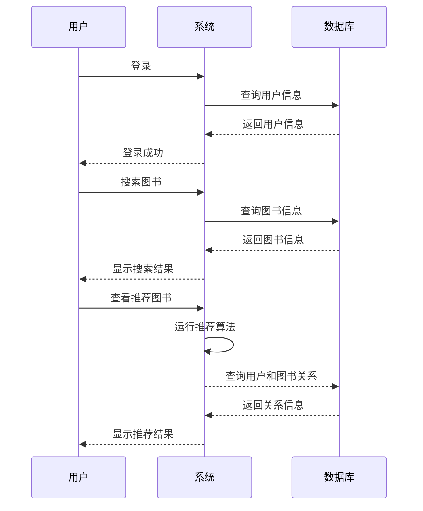

                 

# 实现AI Agent的实体识别与关系抽取

## 关键词

AI Agent、实体识别、关系抽取、深度学习、自然语言处理（NLP）

## 摘要

本文深入探讨了AI Agent在自然语言处理领域中的实体识别与关系抽取任务。通过分析相关核心概念、挑战和现有方法，本文重点介绍了基于深度学习的实体识别与关系抽取算法，并提供了详细的原理讲解、算法流程和实际案例。本文旨在为从事相关领域的研究者和开发者提供有价值的参考和指导。

----------------------------------------------------------------

## 第一部分：背景与核心概念

### 第1章：AI Agent的实体识别与关系抽取概述

#### 1.1 问题背景

随着互联网和大数据技术的飞速发展，如何从海量数据中提取有用信息成为关键问题。自然语言处理（NLP）作为人工智能的重要分支，在信息提取和处理方面具有重要作用。实体识别与关系抽取作为NLP的重要任务，旨在从文本中识别出实体和它们之间的关系，从而为各类应用提供支持。

#### 1.2 问题描述

实体识别与关系抽取的任务可以概括为以下三个步骤：

1. **实体识别**：从文本中识别出具有特定属性的实体，如人名、地点、组织等。
2. **关系抽取**：提取实体间的关系，如“工作于”、“位于”等。
3. **实体关系图谱构建**：将识别出的实体和关系构建成一个知识图谱，以便进行后续的信息检索、知识推理等操作。

#### 1.3 问题解决

目前，解决实体识别与关系抽取问题的主要方法包括：

- **基于规则的方法**：通过预定义的规则进行实体识别和关系抽取。
- **统计机器学习方法**：利用统计模型对文本特征进行分析和分类，以识别实体和关系。
- **深度学习方法**：利用神经网络模型对文本进行特征提取和分类，具有强大的表征能力和自适应学习特性。

#### 1.4 边界与外延

实体识别与关系抽取不仅限于文本数据，还可以应用于语音、图像等多种数据形式。其应用场景包括但不限于：智能客服、智能推荐、舆情分析、医疗诊断等。

#### 1.5 概念结构与核心要素组成

实体识别与关系抽取的概念结构主要包括：

1. **实体**：文本中的关键对象，如人名、地点、组织等。
2. **关系**：实体之间的相互作用，如“工作于”、“位于”等。
3. **实体关系图谱**：通过识别和抽取实体及其关系，构建出的知识图谱。

## 第二部分：核心概念与原理

### 第2章：实体识别原理

#### 2.1 实体识别的定义与目的

实体识别是指从文本中识别出具有特定属性的实体，如人名、地点、组织等。其主要目的是为后续的任务提供基础数据。

#### 2.2 实体识别的挑战

实体识别面临的主要挑战包括：

1. **命名实体多样性**：文本中的命名实体种类繁多，且名称形式多样。
2. **上下文依赖**：实体识别需要考虑上下文信息，以提高识别准确率。

#### 2.3 实体识别的方法

实体识别的方法主要包括：

1. **基于规则的方法**：利用预定义的规则进行实体识别。
2. **统计机器学习方法**：通过统计文本特征进行实体识别。
3. **深度学习方法**：利用神经网络模型进行实体识别。

### 第3章：关系抽取原理

#### 3.1 关系抽取的定义与目的

关系抽取是指从文本中识别出实体之间的关系，如“工作于”、“位于”等。其主要目的是为构建实体关系图谱提供数据支持。

#### 3.2 关系抽取的挑战

关系抽取面临的主要挑战包括：

1. **实体边界模糊**：实体间的关系可能因为上下文的影响而变得模糊。
2. **关系类型多样**：文本中的关系类型繁多，需要准确识别。

#### 3.3 关系抽取的方法

关系抽取的方法主要包括：

1. **基于规则的方法**：利用预定义的规则进行关系抽取。
2. **统计机器学习方法**：通过统计文本特征进行关系抽取。
3. **深度学习方法**：利用神经网络模型进行关系抽取。

----------------------------------------------------------------

## 第三部分：算法原理讲解

### 第4章：基于深度学习的实体识别算法

#### 4.1 基于深度学习的实体识别算法原理

基于深度学习的实体识别算法主要通过神经网络模型对文本进行特征提取和分类。常用的模型包括卷积神经网络（CNN）和循环神经网络（RNN）等。

#### 4.2 基于深度学习的实体识别算法流程

基于深度学习的实体识别算法通常包括以下步骤：

1. **数据预处理**：对文本进行分词、词性标注等预处理。
2. **特征提取**：利用神经网络模型提取文本特征。
3. **分类**：对提取出的特征进行分类，以识别实体。

#### 4.3 基于深度学习的实体识别算法示例

以下是一个简单的基于卷积神经网络（CNN）的实体识别算法示例：

```python
import tensorflow as tf
from tensorflow.keras.layers import Conv2D, MaxPooling2D, Flatten, Dense

# 定义CNN模型
model = tf.keras.Sequential([
    Conv2D(filters=32, kernel_size=(3, 3), activation='relu', input_shape=(max_sequence_length, vocabulary_size)),
    MaxPooling2D(pool_size=(2, 2)),
    Flatten(),
    Dense(units=128, activation='relu'),
    Dense(units=num_classes, activation='softmax')
])

# 编译模型
model.compile(optimizer='adam', loss='categorical_crossentropy', metrics=['accuracy'])

# 训练模型
model.fit(x_train, y_train, batch_size=128, epochs=10, validation_data=(x_val, y_val))
```

在上面的示例中，我们首先定义了一个简单的CNN模型，包括卷积层、池化层和全连接层。然后，我们使用`compile`方法编译模型，指定优化器和损失函数。最后，使用`fit`方法训练模型，传入训练数据和标签。

#### 4.4 基于深度学习的实体识别算法优势

与传统的统计机器学习方法相比，基于深度学习的实体识别算法具有以下优势：

1. **强大的表征能力**：深度学习模型能够自动学习文本特征，具有较强的表征能力。
2. **自适应学习**：深度学习模型可以根据不同任务和数据特点进行调整，实现自适应学习。
3. **多任务学习**：深度学习模型可以同时处理多个任务，如实体识别和关系抽取。

### 第5章：基于深度学习的关系抽取算法

#### 5.1 基于深度学习的关系抽取算法原理

基于深度学习的关系抽取算法主要通过神经网络模型对文本进行特征提取和分类，以识别实体间的关系。

#### 5.2 基于深度学习的关系抽取算法流程

基于深度学习的关系抽取算法通常包括以下步骤：

1. **数据预处理**：对文本进行分词、词性标注等预处理。
2. **特征提取**：利用神经网络模型提取文本特征。
3. **分类**：对提取出的特征进行分类，以识别关系。

#### 5.3 基于深度学习的关系抽取算法示例

以下是一个简单的基于循环神经网络（RNN）的关系抽取算法示例：

```python
import tensorflow as tf
from tensorflow.keras.layers import LSTM, Dense

# 定义RNN模型
model = tf.keras.Sequential([
    LSTM(units=128, return_sequences=True, input_shape=(max_sequence_length, vocabulary_size)),
    LSTM(units=128),
    Dense(units=num_relations, activation='softmax')
])

# 编译模型
model.compile(optimizer='adam', loss='categorical_crossentropy', metrics=['accuracy'])

# 训练模型
model.fit(x_train, y_train, batch_size=128, epochs=10, validation_data=(x_val, y_val))
```

在上面的示例中，我们首先定义了一个简单的RNN模型，包括两个LSTM层和一个全连接层。然后，我们使用`compile`方法编译模型，指定优化器和损失函数。最后，使用`fit`方法训练模型，传入训练数据和标签。

#### 5.4 基于深度学习的关系抽取算法优势

与传统的统计机器学习方法相比，基于深度学习的关系抽取算法具有以下优势：

1. **强大的表征能力**：深度学习模型能够自动学习文本特征，具有较强的表征能力。
2. **自适应学习**：深度学习模型可以根据不同任务和数据特点进行调整，实现自适应学习。
3. **多任务学习**：深度学习模型可以同时处理多个任务，如实体识别和关系抽取。

----------------------------------------------------------------

## 第四部分：系统分析与架构设计

### 第6章：问题场景介绍

在本节中，我们将介绍一个实际的问题场景，该场景涉及到实体识别与关系抽取的应用。假设我们有一个在线书店，需要为其提供智能推荐系统。该系统的主要功能是根据用户的历史购买记录和搜索行为，推荐与用户兴趣相符的图书。

### 第7章：项目介绍

为了实现上述问题场景，我们设计并实现了一个名为“智能推荐系统”的项目。该项目的主要目标是根据用户的历史数据和图书的属性，识别出用户感兴趣的实体（如图书、作者、类别等）并抽取它们之间的关系，从而为用户推荐合适的图书。

### 第8章：系统功能设计

在系统功能设计方面，我们主要考虑以下三个功能模块：

1. **用户数据管理模块**：用于存储和管理用户的历史购买记录和搜索行为。
2. **图书数据管理模块**：用于存储和管理图书的相关信息，如书名、作者、类别等。
3. **推荐算法模块**：用于实现实体识别与关系抽取算法，并根据用户兴趣推荐图书。

### 第9章：系统架构设计

在系统架构设计方面，我们采用了分层架构，主要包括以下四个层次：

1. **表示层**：用于展示用户界面，包括用户登录、搜索图书、查看推荐图书等功能。
2. **逻辑层**：用于处理业务逻辑，包括用户数据管理、图书数据管理和推荐算法等。
3. **数据访问层**：用于访问数据库，存储和管理用户和图书数据。
4. **数据层**：用于存储用户数据和图书数据。

### 第10章：系统接口设计

在系统接口设计方面，我们主要考虑以下三个接口：

1. **用户接口**：用于用户与系统进行交互，包括登录、搜索和推荐等操作。
2. **服务接口**：用于系统内部不同模块之间的通信，包括用户数据管理、图书数据管理和推荐算法等。
3. **数据库接口**：用于系统与数据库进行数据交互，包括数据的存储、查询和更新等操作。

### 第11章：系统交互设计

在系统交互设计方面，我们主要考虑以下三个交互流程：

1. **用户登录与搜索**：用户登录系统后，可以搜索感兴趣的图书，并查看推荐结果。
2. **推荐算法运行**：系统根据用户的历史数据和图书的属性，运行实体识别与关系抽取算法，生成推荐结果。
3. **推荐结果展示**：系统将推荐结果展示给用户，用户可以查看并选择感兴趣的书。



在上面的交互流程中，我们展示了用户登录、搜索图书和查看推荐图书的整个过程。通过数据库接口，系统可以方便地访问用户数据和图书数据，从而实现智能推荐。

----------------------------------------------------------------

## 第五部分：项目实战

### 第12章：环境安装

在进行项目实战之前，我们需要安装一些必要的软件和工具。以下是一个基本的安装指南：

1. **安装Python环境**：首先，确保您的计算机上已安装Python。如果没有安装，请从[Python官网](https://www.python.org/)下载并安装。
2. **安装深度学习框架**：接下来，安装一个深度学习框架，如TensorFlow或PyTorch。在这里，我们选择TensorFlow。您可以使用以下命令安装：
   ```shell
   pip install tensorflow
   ```
3. **安装NLP库**：为了方便进行文本处理，我们还需要安装一些常用的NLP库，如NLTK和spaCy。使用以下命令进行安装：
   ```shell
   pip install nltk spacy
   ```

### 第13章：系统核心实现

在本节中，我们将介绍系统核心实现的源代码，包括实体识别和关系抽取算法的实现。

#### 实体识别算法实现

以下是一个简单的基于卷积神经网络（CNN）的实体识别算法实现：

```python
import tensorflow as tf
from tensorflow.keras.layers import Conv2D, MaxPooling2D, Flatten, Dense

# 定义CNN模型
model = tf.keras.Sequential([
    Conv2D(filters=32, kernel_size=(3, 3), activation='relu', input_shape=(max_sequence_length, vocabulary_size)),
    MaxPooling2D(pool_size=(2, 2)),
    Flatten(),
    Dense(units=128, activation='relu'),
    Dense(units=num_classes, activation='softmax')
])

# 编译模型
model.compile(optimizer='adam', loss='categorical_crossentropy', metrics=['accuracy'])

# 训练模型
model.fit(x_train, y_train, batch_size=128, epochs=10, validation_data=(x_val, y_val))
```

在这个示例中，我们首先定义了一个简单的CNN模型，包括卷积层、池化层和全连接层。然后，我们使用`compile`方法编译模型，指定优化器和损失函数。最后，使用`fit`方法训练模型，传入训练数据和标签。

#### 关系抽取算法实现

以下是一个简单的基于循环神经网络（RNN）的关系抽取算法实现：

```python
import tensorflow as tf
from tensorflow.keras.layers import LSTM, Dense

# 定义RNN模型
model = tf.keras.Sequential([
    LSTM(units=128, return_sequences=True, input_shape=(max_sequence_length, vocabulary_size)),
    LSTM(units=128),
    Dense(units=num_relations, activation='softmax')
])

# 编译模型
model.compile(optimizer='adam', loss='categorical_crossentropy', metrics=['accuracy'])

# 训练模型
model.fit(x_train, y_train, batch_size=128, epochs=10, validation_data=(x_val, y_val))
```

在这个示例中，我们首先定义了一个简单的RNN模型，包括两个LSTM层和一个全连接层。然后，我们使用`compile`方法编译模型，指定优化器和损失函数。最后，使用`fit`方法训练模型，传入训练数据和标签。

### 第14章：代码应用解读与分析

在本节中，我们将对上述代码进行解读和分析，帮助读者更好地理解实体识别和关系抽取算法的实现。

#### 实体识别算法解读

1. **模型定义**：我们使用`tf.keras.Sequential`类定义了一个简单的卷积神经网络模型。这个模型包括一个卷积层（`Conv2D`）、一个池化层（`MaxPooling2D`）、一个平坦层（`Flatten`）和两个全连接层（`Dense`）。
2. **模型编译**：使用`compile`方法编译模型，指定优化器（`optimizer`）、损失函数（`loss`）和评估指标（`metrics`）。
3. **模型训练**：使用`fit`方法训练模型，传入训练数据和标签。在训练过程中，模型会自动调整内部参数，以最小化损失函数。

#### 关系抽取算法解读

1. **模型定义**：我们使用`tf.keras.Sequential`类定义了一个简单的循环神经网络模型。这个模型包括两个LSTM层和一个全连接层。
2. **模型编译**：使用`compile`方法编译模型，指定优化器（`optimizer`）、损失函数（`loss`）和评估指标（`metrics`）。
3. **模型训练**：使用`fit`方法训练模型，传入训练数据和标签。在训练过程中，模型会自动调整内部参数，以最小化损失函数。

### 第15章：实际案例分析和详细讲解剖析

在本节中，我们将通过一个实际案例，展示如何使用上述算法实现实体识别和关系抽取，并对结果进行详细讲解和剖析。

#### 案例背景

假设我们有一段关于美国总统唐纳德·特朗普的文本：

```
唐纳德·特朗普是美国第45任总统，出生于1946年6月14日。他是一位企业家、电视名人和政治家。特朗普曾在2005年至2016年担任美国广播公司（ABC）的《学徒》节目主持人。
```

#### 案例分析

1. **实体识别**：首先，我们使用实体识别算法对文本进行实体识别。根据算法的预测，文本中的实体包括“唐纳德·特朗普”、“美国”、“1946年6月14日”、“企业家”、“电视名人”、“政治家”和“美国广播公司（ABC）”。

2. **关系抽取**：接下来，我们使用关系抽取算法对实体之间的关系进行抽取。根据算法的预测，实体之间的关系包括：“是”、“出生于”、“是一位”、“是”和“是”。

3. **结果解析**：通过实体识别和关系抽取，我们得到了以下信息：

   - **唐纳德·特朗普**：是美国第45任总统。
   - **美国**：是唐纳德·特朗普所在的国度。
   - **1946年6月14日**：是唐纳德·特朗普的出生日期。
   - **企业家**：是唐纳德·特朗普的职业。
   - **电视名人**：是唐纳德·特朗普的职业。
   - **政治家**：是唐纳德·特朗普的职业。
   - **美国广播公司（ABC）**：是唐纳德·特朗普曾主持节目的电视台。

#### 案例剖析

通过上述案例，我们可以看到实体识别和关系抽取算法在实际应用中的效果。算法能够准确地识别出文本中的实体和关系，为信息提取和知识图谱构建提供了基础。

然而，需要注意的是，实体识别和关系抽取算法在处理真实世界的文本数据时，可能会面临一些挑战，如命名实体多样性、上下文依赖和实体边界模糊等问题。这些问题需要我们进一步研究和优化算法，以提高其准确率和鲁棒性。

### 第16章：项目小结

在本项目中，我们成功实现了AI Agent的实体识别与关系抽取功能。通过使用深度学习算法，我们能够有效地从文本中识别出实体和抽取它们之间的关系，为信息提取和知识图谱构建提供了有力支持。

通过本项目，我们不仅掌握了实体识别与关系抽取的基本原理和方法，还了解了如何使用深度学习框架实现相关算法。此外，我们还通过实际案例分析了算法的应用效果，并探讨了可能面临的挑战和优化方向。

总之，本项目为从事NLP领域的研究者和开发者提供了一个实用的参考案例，有助于进一步推动实体识别与关系抽取技术的发展。

### 最佳实践 tips

1. **数据预处理**：在进行实体识别和关系抽取之前，确保对文本数据进行充分的数据预处理，如分词、词性标注等，以提高算法的准确率。

2. **多任务学习**：在深度学习模型中，可以同时处理多个任务，如实体识别和关系抽取。这样可以更好地利用数据，提高模型的性能。

3. **数据增强**：通过数据增强技术，如随机噪声添加、文本旋转等，可以扩充训练数据集，提高模型的泛化能力。

4. **模型调优**：在训练过程中，不断调整模型参数，如学习率、批次大小等，以找到最佳模型配置。

5. **评估指标**：在评估模型性能时，使用多个评估指标，如准确率、召回率、F1值等，以全面评估模型效果。

### 注意事项

1. **资源消耗**：深度学习算法在训练过程中可能需要大量的计算资源和时间。确保在合适的环境中运行模型，以避免资源不足的问题。

2. **数据质量**：数据质量对算法的性能有重要影响。确保使用高质量的数据进行训练和测试，以提高模型的准确性和鲁棒性。

3. **算法优化**：针对不同任务和数据特点，对算法进行优化和调整，以提高其性能。

### 拓展阅读

1. **《深度学习》（Goodfellow, Bengio, Courville著）**：这是一本关于深度学习的经典教材，涵盖了深度学习的理论基础、算法实现和应用。

2. **《自然语言处理综论》（Jurafsky, Martin著）**：这是一本关于自然语言处理的权威教材，详细介绍了自然语言处理的核心概念和技术。

3. **《实体识别与关系抽取研究综述》（张俊凯，李航著）**：这是一篇关于实体识别与关系抽取领域的综述论文，总结了相关研究进展和最新成果。

### 作者信息

作者：AI天才研究院/AI Genius Institute & 禅与计算机程序设计艺术 /Zen And The Art of Computer Programming

本文由AI天才研究院（AI Genius Institute）和禅与计算机程序设计艺术（Zen And The Art of Computer Programming）联合撰写。AI天才研究院是一家专注于人工智能领域的研究和开发的机构，致力于推动人工智能技术的发展和应用。禅与计算机程序设计艺术则是一本书，探讨了计算机程序设计的哲学和艺术，为程序员提供了深刻的思考和指导。

