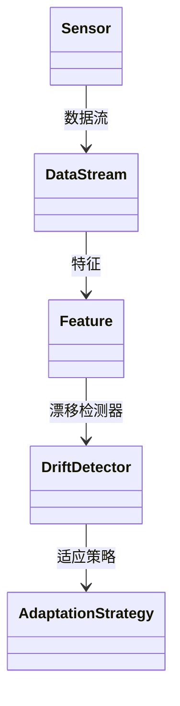
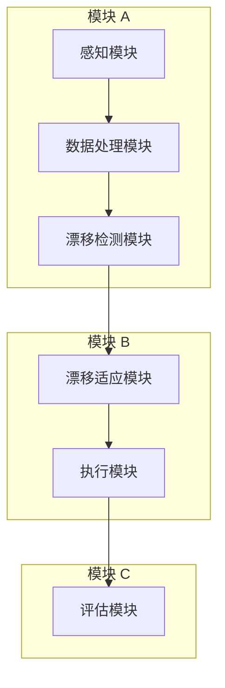
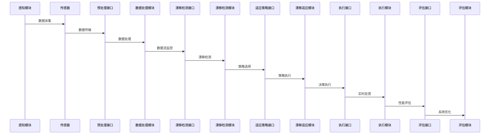
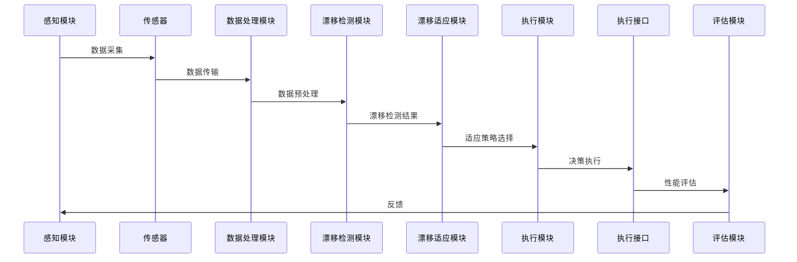
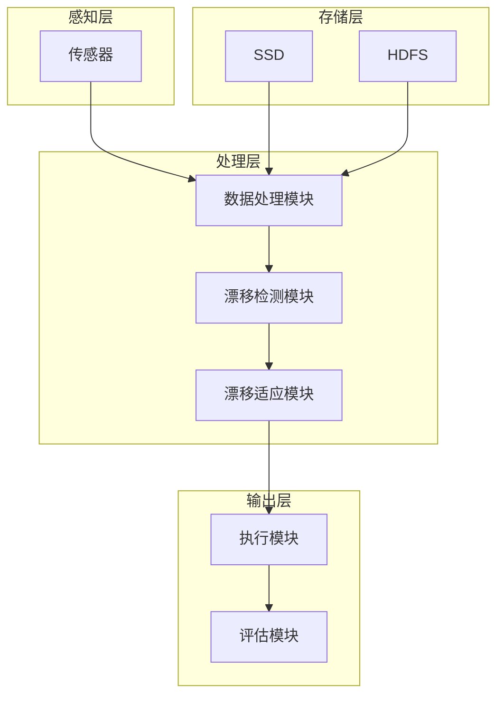

                 

### 文章标题

《实现AI Agent的概念漂移检测与适应》

### 关键词

AI Agent，概念漂移，检测算法，适应策略，实时调整，动态学习

### 摘要

本文旨在深入探讨AI Agent在处理概念漂移问题上的机制与策略。随着数据分布的变化，AI Agent可能无法保持其性能，这种现象称为概念漂移。本文将首先介绍AI Agent和概念漂移的基本概念，接着详细阐述如何检测概念漂移以及应对策略，包括动态调整模型参数、重新训练模型和模型压缩与迁移学习等。通过案例分析，我们将展示这些策略在实际应用中的效果。最后，对概念漂移检测与适应的未来研究方向进行展望。

---

## 引言

在人工智能（AI）迅猛发展的时代，AI Agent作为一个能够自主完成任务的智能体，正逐渐成为各个领域的核心。AI Agent通过学习环境中的数据与信息，执行特定的任务，例如自动驾驶、智能客服和金融风险管理等。然而，一个重要的挑战是，随着时间推移和环境变化，AI Agent可能会面临概念漂移（Concept Drift）的问题。概念漂移是指训练数据的分布与实际应用数据的分布之间存在差异，这会导致模型性能的下降。

概念漂移是一个普遍存在的现象。在现实世界中，数据的分布可能会因为多种因素（如数据采集方式、用户行为模式、市场动态等）而发生改变。如果AI Agent没有及时检测和适应这些变化，其表现可能会从优秀变为平庸，甚至失效。例如，一个用于垃圾邮件过滤的AI模型，在训练时使用的是旧的数据集，而这些数据集无法反映当前网络环境的实际情况，可能会导致大量的误分类。

本文将围绕AI Agent的概念漂移问题展开讨论。首先，我们将介绍AI Agent和概念漂移的基本概念，接着详细探讨如何检测概念漂移以及应对策略。具体来说，我们将涵盖以下几个方面：

1. **AI Agent的基础知识**：介绍AI Agent的定义、分类及其在现实世界中的应用。
2. **概念漂移的原理**：阐述概念漂移的定义、影响及其常见的检测方法。
3. **漂移检测算法**：分析基于统计模型和基于模型的漂移检测算法。
4. **漂移适应策略**：介绍动态调整模型参数、重新训练模型和模型压缩与迁移学习等适应策略。
5. **AI Agent的概念漂移检测与适应框架**：构建一个综合性的框架，展示各个模块的设计与工作原理。
6. **案例分析**：通过具体案例展示漂移检测与适应策略的应用。
7. **未来展望与挑战**：探讨概念漂移检测与适应技术的发展趋势和面临的挑战。

通过本文的阅读，读者将能够系统地了解AI Agent在处理概念漂移问题上的方法与策略，为未来的研究与应用提供指导。

## 第一部分: AI Agent概述

### 第1章: AI Agent基础

#### 1.1 AI Agent的定义与分类

人工智能（AI）在过去的几十年里取得了巨大的进步，其中AI Agent作为AI领域的一个重要分支，受到了广泛关注。AI Agent，也被称作智能代理，是一种能够在特定环境下自主执行任务、实现目标的人工智能系统。与传统的规则系统或静态算法不同，AI Agent具有自主学习和适应能力，能够根据环境的变化动态调整其行为策略。

AI Agent的定义可以从多个角度进行解读。最直观的理解是，AI Agent是一个在特定环境中能够感知、决策和行动的实体。感知是指AI Agent能够从环境中获取信息，决策是指AI Agent能够根据获取的信息做出合理的决策，行动是指AI Agent能够执行这些决策以实现特定目标。这种定义强调了AI Agent的自主性和适应性。

根据不同的分类标准，AI Agent可以有不同的分类方式。以下是一些常见的分类方法：

1. **基于功能分类**：
    - 监控Agent：负责监视环境和系统状态，例如异常检测、监控网络安全等。
    - 控制Agent：负责对系统进行控制，实现特定目标，例如自动驾驶、智能家居等。
    - 交互Agent：负责与人类或其他AI系统进行交互，例如智能客服、虚拟助手等。

2. **基于控制策略分类**：
    - 监督学习Agent：依赖于训练数据集，通过学习已有数据来预测未来的行为。
    - 强化学习Agent：通过与环境的交互，通过试错学习来获得最佳策略。
    - 自组织学习Agent：通过自身的内部结构和学习机制，自动调整其行为以适应环境。

3. **基于应用场景分类**：
    - 实时决策Agent：需要在极短的时间内做出决策，例如自动驾驶系统中的决策模块。
    - 预测Agent：基于历史数据对未来进行预测，例如股票市场预测、天气预测等。
    - 跟随Agent：跟随目标移动，例如无人机跟随飞行、机器人跟随导航等。

AI Agent在现实世界中有着广泛的应用。例如，在自动驾驶领域，AI Agent用于实时感知路况、做出驾驶决策；在智能家居领域，AI Agent用于控制家电设备、提供个性化的服务；在金融领域，AI Agent用于风险管理、投资策略制定等。这些应用展示了AI Agent的强大潜力和多样化的用途。

总之，AI Agent作为人工智能的核心组成部分，其定义和分类多种多样，但其核心目标始终是自主决策和适应环境。了解AI Agent的基本概念和分类方法，有助于我们更好地理解和应用AI Agent技术，为未来的研究和开发提供基础。

#### 1.2 AI Agent的结构与功能

AI Agent的结构与功能是理解其工作原理和实际应用的关键。一个典型的AI Agent通常由以下几个核心组件构成：

1. **感知器（Perception）**：
   感知器是AI Agent从环境中获取信息的部分。感知器可以是视觉传感器、听觉传感器、温度传感器等，具体类型取决于应用场景。例如，在自动驾驶汽车中，感知器包括摄像头、雷达和激光雷达，用于实时获取道路、车辆和行人的信息。感知器的作用是将环境中的物理信号转换为数字信号，供后续处理。

2. **知识库（Knowledge Base）**：
   知识库是AI Agent存储和检索信息的部分。知识库可以包含先验知识、训练数据、规则库等。先验知识是AI Agent在没有直接感知到环境信息时依赖的信息，例如一个自动驾驶系统在夜间行驶时可能依赖知识库中的道路标志和标线信息。训练数据是AI Agent在训练过程中学习到的信息，用于改善其决策能力。规则库则是一系列基于经验和专家知识的规则，用于指导AI Agent的行为。

3. **决策模块（Decision Maker）**：
   决策模块是AI Agent的核心，负责根据感知器获取的信息和知识库中的信息，做出合理的决策。决策模块通常采用各种机器学习算法和优化方法，如监督学习、强化学习和混合学习等。决策模块的工作是将感知到的环境状态映射到具体的行动策略。例如，在自动驾驶中，决策模块需要判断当前的道路状态、车辆位置和速度等信息，然后决定何时加速、减速或转弯。

4. **执行器（Actuator）**：
   执行器是AI Agent执行决策的部分，将决策转化为具体的物理动作。执行器可以是电机、舵机、显示器等，具体类型同样取决于应用场景。例如，在自动驾驶汽车中，执行器包括油门、刹车和方向盘等，用于执行决策模块生成的驾驶指令。执行器的响应速度和准确性直接影响到AI Agent的整体性能。

AI Agent的工作流程可以概括为以下几个步骤：

1. **感知**：AI Agent通过感知器获取环境信息。
2. **处理**：感知到的信息经过处理，可能涉及数据清洗、特征提取等步骤。
3. **决策**：决策模块根据处理后的信息，结合知识库中的信息，生成行动策略。
4. **执行**：执行器根据决策模块生成的行动策略，执行具体的物理动作。

不同类型的AI Agent在具体结构和功能上可能有所不同，但总体上都会包含上述核心组件。例如，在智能客服应用中，感知器可能是语音识别系统，知识库是聊天机器人的对话库，决策模块使用自然语言处理技术生成回复，执行器则是文字或语音合成系统。在智能家居应用中，感知器可能是温度传感器、光照传感器，决策模块根据这些信息调整家电设备的开关，执行器则是家电设备本身。

理解AI Agent的结构与功能，有助于我们更好地设计、开发和部署AI系统，使其在复杂的环境中能够有效执行任务，实现预期的目标。

#### 1.3 AI Agent的应用领域

AI Agent作为人工智能的重要组成部分，已在多个领域得到广泛应用，并展现出巨大的潜力和价值。以下将介绍几个典型的应用领域，并分析AI Agent在这些领域的具体应用和实现。

1. **自动驾驶**：
   自动驾驶是AI Agent的一个重要应用领域，通过感知环境、决策路径和执行驾驶动作，实现无人驾驶。自动驾驶系统通常包括高精度地图、环境感知、路径规划和车辆控制等多个模块。AI Agent在自动驾驶中主要用于处理感知数据，例如通过摄像头、激光雷达和雷达获取道路、车辆和行人的信息，利用深度学习和计算机视觉算法对环境进行理解和分析，然后根据路径规划和车辆控制算法生成驾驶指令。实现过程中，AI Agent需要具备实时处理大量数据的能力，并且能够在复杂和动态的环境中做出快速准确的决策。

2. **智能客服**：
   智能客服利用AI Agent与用户进行交互，提供自动化的客户服务。AI Agent通过自然语言处理技术理解用户的提问，生成合适的回答，并通过语音合成或文字形式输出。智能客服系统通常包括对话管理、自然语言理解和意图识别等模块。AI Agent的实现依赖于大量的训练数据和先进的机器学习算法，例如深度学习和强化学习，以提升其对话能力和用户体验。在实现过程中，AI Agent需要具备灵活的对话管理能力和强大的语言理解能力，以处理各种复杂的用户请求。

3. **金融风险管理**：
   在金融领域，AI Agent被用于风险管理、信用评估和投资策略制定等任务。AI Agent通过分析市场数据、用户行为和历史交易记录，预测市场趋势和风险，并提供相应的决策支持。金融风险管理中的AI Agent通常包含数据采集、数据分析和决策生成等模块。实现过程中，AI Agent需要具备高效的数据处理能力，能够实时处理海量的金融数据，并利用机器学习算法生成预测模型和决策策略。

4. **智能家居**：
   智能家居系统通过AI Agent实现家庭设备的自动化和智能化管理。AI Agent可以监测家庭环境参数（如温度、湿度、光照等），并根据用户的习惯和需求自动调节家电设备。例如，智能灯光系统可以根据用户的作息时间自动调节室内光线，智能空调系统可以根据室内外温度自动调节温度。实现过程中，AI Agent需要具备环境感知和设备控制能力，能够与各种智能家居设备进行通信和协作。

5. **医疗健康**：
   在医疗健康领域，AI Agent被用于疾病预测、诊断和个性化治疗。AI Agent通过分析患者的病历、基因数据和医疗图像等数据，提供诊断建议和治疗方案。例如，在癌症诊断中，AI Agent可以通过分析医学影像数据，识别癌症病灶，并提供早期诊断建议。实现过程中，AI Agent需要具备强大的数据分析能力和医学知识库，以支持准确的诊断和个性化治疗。

总之，AI Agent在自动驾驶、智能客服、金融风险管理、智能家居和医疗健康等领域的应用，充分展示了其自主决策和适应能力。通过感知、决策和执行，AI Agent能够为各个领域的用户提供高效、智能的服务和解决方案。未来，随着技术的不断发展和应用的不断拓展，AI Agent将在更多的领域发挥重要作用。

### 第2章: 概念漂移

#### 2.1 概念漂移的定义与现象

在机器学习和人工智能（AI）领域，概念漂移（Concept Drift）是一个重要的研究课题。其基本概念源自统计学和机器学习理论，主要描述的是在训练数据和应用数据之间存在分布差异的现象。具体来说，概念漂移指的是随着时间推移，训练数据的分布与实际应用数据的分布发生偏移，导致学习到的模型在应用时无法准确预测或分类。

概念漂移的现象在现实世界中普遍存在。例如，假设我们开发了一个用于垃圾邮件过滤的AI模型，该模型最初在大量历史邮件数据上进行训练，可以准确识别垃圾邮件和非垃圾邮件。然而，随着时间的推移，网络垃圾邮件的形式和内容可能发生变化，例如，垃圾邮件发送者可能开始使用更多的伪装技术，使得新数据集与原始训练数据的分布存在显著差异。如果模型没有及时更新，它将无法有效地识别新类型的垃圾邮件，导致误分类率上升。

为了更直观地理解概念漂移，我们可以通过一个简单的例子来说明。假设我们有一个分类模型，用于区分猫和狗的图片。在训练阶段，我们使用了一组猫和狗的图片作为训练集，模型通过学习这些图片的特征来建立分类边界。然而，在实际应用过程中，我们发现用户上传的猫和狗的图片风格和种类发生了变化，例如，一些用户上传了黑白照片或艺术风格的猫和狗图片。这些新上传的图片与训练集的图片特征有所不同，导致模型在新数据上的分类性能下降。

概念漂移的产生原因多种多样。以下是一些常见的原因：

1. **数据采集方式的变化**：随着时间的推移，数据采集的方法或渠道可能发生变化，导致数据的分布发生变化。例如，社交媒体平台上的用户行为数据可能在短期内迅速增长，而传统的用户调研数据可能逐渐减少。

2. **环境或业务场景的变化**：业务场景的变化也可能导致数据分布的变化。例如，在金融领域，市场动态和投资者行为可能随时间变化，导致市场数据的分布发生漂移。

3. **数据源的不一致性**：在多源数据融合的应用中，不同数据源可能具有不同的数据分布，这些数据源的不一致性会导致整体数据分布的变化。

4. **数据噪声的增加**：随着数据量的增加，数据中的噪声和异常值也可能增多，这些噪声和异常值会影响模型的训练效果，导致概念漂移。

概念漂移对AI模型的影响是显著的。首先，它可能导致模型的性能下降，例如，分类错误率上升、预测准确度下降等。其次，它可能影响模型的可解释性，使得模型在未知环境中的表现难以预测。此外，概念漂移还可能带来安全风险，例如在自动驾驶领域，模型因概念漂移导致误判，可能引发交通事故。

总之，概念漂移是机器学习和人工智能领域中的一个重要问题，理解其定义和现象，有助于我们更好地设计和优化AI模型，提高其在动态环境中的适应能力。

#### 2.2 概念漂移的影响与挑战

概念漂移对AI模型的影响是深远且多方面的，不仅影响到模型的性能，还可能对模型的稳定性和可靠性产生重大挑战。以下将详细探讨概念漂移对AI模型的具体影响以及在实际应用中面临的挑战。

首先，概念漂移最直接的影响是降低模型的预测准确性。当一个训练模型在特定数据集上被训练出来，并预期在实际应用中表现良好时，如果数据分布发生变化，模型可能会变得不准确。例如，一个用于图像分类的模型，在特定时间段内可以准确识别图像中的对象，但当环境发生变化（如图像中的对象出现新的遮挡物或光线条件变化），模型可能无法适应这些变化，导致误分类率上升。这种情况下，模型在现实应用中的表现将大打折扣，严重时甚至可能导致系统崩溃或错误决策。

其次，概念漂移可能影响模型的可解释性。机器学习模型，尤其是深度学习模型，其内部机制复杂，难以解释。当模型在面临概念漂移时，其行为可能变得不可预测，使得模型内部的决策过程更加模糊。这对于需要透明决策的领域，如医疗诊断和金融风险评估，是一个重大挑战。即使模型总体上仍然具有较好的预测性能，但由于其内部机制的不确定性，用户难以理解模型的决策依据，从而降低了模型的接受度和可信度。

此外，概念漂移还可能带来安全风险。在自动驾驶、工业自动化等领域，模型的稳定性至关重要。如果模型因概念漂移导致错误决策，可能引发严重的后果。例如，自动驾驶汽车在遇到从未见过的路况或障碍时，因概念漂移导致的误判，可能引发交通事故。同样，在工业自动化中，控制系统因概念漂移导致错误操作，可能引发设备故障或生产事故。

在实际应用中，概念漂移带来的挑战主要体现在以下几个方面：

1. **持续监控与调整**：模型在应用过程中需要持续监控数据分布的变化，并及时调整模型参数或重新训练模型，以应对概念漂移。这对系统的实时性和计算能力提出了较高要求。

2. **资源消耗**：动态调整模型或重新训练模型需要消耗大量计算资源和时间。尤其是在大数据和高并发应用场景中，如何高效地进行模型调整成为一大挑战。

3. **数据管理**：在多源数据融合的应用中，如何管理不同来源的数据，保持数据的一致性和有效性，也是概念漂移应对的一个难题。

4. **模型可解释性**：提升模型的可解释性，使得模型在概念漂移情况下仍能提供透明和可靠的决策依据，是当前研究的一个重要方向。

为了应对概念漂移，研究者提出了多种检测和适应策略，包括基于统计的方法、基于模型的方法以及混合方法等。这些方法的核心目标是及时发现数据分布的变化，并调整模型参数或重新训练模型，以保持模型在动态环境中的稳定性和准确性。通过不断优化和完善这些策略，我们可以更好地应对概念漂移带来的挑战，提高AI模型在复杂动态环境中的应用性能。

#### 2.3 概念漂移的检测方法

为了应对概念漂移对AI模型的影响，研究者们提出了多种概念漂移检测方法。这些方法可以分为基于统计的方法和基于模型的方法，每种方法都有其独特的原理和应用场景。以下将详细讨论这些方法。

##### 2.3.1 基于统计的方法

基于统计的方法通常通过分析训练集和应用集之间的统计差异来检测概念漂移。这些方法的基本思想是比较训练集的特征分布与应用集的特征分布，如果差异显著，则认为发生了概念漂移。以下是一些常用的统计方法：

1. **统计测试**：
    - **Kolmogorov-Smirnov测试**：Kolmogorov-Smirnov（KS）测试是一种常用的统计测试方法，用于比较两个数据集的分布差异。其原理是比较两个数据的累积分布函数（CDF）的最大差值。如果最大差值超过某个阈值，则认为数据集存在显著差异。
    - **Anderson-Darling测试**：Anderson-Darling（AD）测试是一种更为严格的统计测试方法，它基于数据的偏差和峰度，通过计算累积分布函数的二次距离来评估数据分布的差异。AD测试对异常值敏感，适用于小样本数据集。

2. **统计指标**：
    - **标准偏差**：通过计算训练集和应用集之间特征的均值和标准偏差，可以检测数据分布的变化。如果标准偏差显著增大，则可能存在概念漂移。
    - **互信息**：互信息是一种衡量两个随机变量之间相互依赖性的指标。通过比较训练集和应用集之间的互信息，可以判断数据分布是否发生了变化。互信息值增大通常表明数据分布存在漂移。

基于统计的方法具有简单易实现、计算效率高等优点，适用于实时监控和在线检测。然而，这些方法在处理高维数据和复杂特征时，可能受到噪声和异常值的影响，导致误检测。

##### 2.3.2 基于模型的方法

基于模型的方法通过构建统计模型来捕捉数据分布的变化，从而检测概念漂移。这些方法通常利用已有模型来生成期望分布，并与实际分布进行比较。以下是一些常用的基于模型的方法：

1. **统计模型漂移检测算法**：
    - **PCA（主成分分析）**：PCA是一种降维技术，通过将数据投影到新的正交基中，提取最重要的特征。PCA可以用来检测数据分布的线性变化。如果PCA得到的投影数据在某个维度上的变化显著，则可能存在概念漂移。
    - **CCA（坎德尔相关分析）**：CCA是一种衡量两个数据集之间相关性的方法，通过最大化两个数据集之间的相关系数来检测分布变化。CCA适用于检测两个或多个数据集之间的非线性关系。

2. **基于机器学习的漂移检测算法**：
    - **监督学习漂移检测算法**：这类算法通过在监督学习框架下训练模型，比较训练集和验证集的性能差异。例如，One-Class SVM可以用来检测新数据的异常性，如果验证集上的错误率显著高于训练集，则可能发生概念漂移。
    - **无监督学习漂移检测算法**：这类算法不依赖于已知的标签信息，通过学习数据的分布特征来检测漂移。例如，Isolation Forest是一种基于随机森林的无监督漂移检测算法，通过隔离异常数据点来检测概念漂移。

基于模型的方法具有较好的鲁棒性和适应性，能够处理高维数据和复杂特征。然而，这些方法通常需要更多的计算资源和训练时间，并且对模型的选择和参数设置较为敏感。

##### 2.3.3 混合方法

为了结合基于统计方法和基于模型方法的优点，研究者们提出了多种混合方法。这些方法通常将统计测试和机器学习算法相结合，以提高检测精度和鲁棒性。以下是一些常用的混合方法：

1. **统计-机器学习结合方法**：这类方法通过统计方法初步检测数据分布的变化，然后利用机器学习算法进行进一步的验证和分类。例如，可以先用KS测试检测数据分布的显著差异，然后用One-Class SVM分类异常数据，以提高检测精度。

2. **多模型融合方法**：这类方法通过融合多个统计模型和机器学习模型的结果来提高检测性能。例如，可以同时使用PCA和Isolation Forest进行检测，并利用投票机制或加权平均来融合结果，以提高整体的检测能力。

综上所述，概念漂移的检测方法丰富多样，每种方法都有其独特的优势和局限性。选择合适的检测方法，需要根据具体的应用场景和数据特征进行综合评估。通过不断优化和结合不同的方法，我们可以更好地应对概念漂移带来的挑战，提升AI模型在动态环境中的适应能力。

#### 2.4 常见的漂移检测算法及其优缺点分析

在概念漂移检测领域，存在多种常用的算法，每种算法都有其独特的原理和应用场景。以下将详细介绍几种主要的漂移检测算法，并分析它们的优缺点。

##### 2.4.1 一类支持向量机（One-Class SVM）

一类支持向量机（One-Class SVM）是一种监督学习漂移检测算法，适用于检测训练集和应用集之间的差异。其主要原理是通过训练一个分类器，将训练集视为“正常”样本，然后对新数据集进行分类。如果新数据集上的分类错误率显著高于训练集，则认为发生了概念漂移。

**优点**：
- **简单易实现**：One-Class SVM的计算过程相对简单，易于在实时系统中部署。
- **高效性**：由于其训练过程仅涉及一个类别的样本，因此计算效率较高。

**缺点**：
- **对异常值敏感**：One-Class SVM对异常值非常敏感，可能导致误报。
- **对模型选择敏感**：参数选择（如正则化参数）对检测性能有显著影响，需要手动调优。

##### 2.4.2 基于孤立森林（Isolation Forest）

孤立森林（Isolation Forest）是一种无监督学习漂移检测算法，其基本思想是通过随机选择特征和切分值，将数据点进行隔离，从而检测出异常或漂移数据。该方法适用于高维数据集，并且不需要先验知识。

**优点**：
- **适用于高维数据**：Isolation Forest能够处理高维数据，并且不需要进行特征降维。
- **鲁棒性**：其对异常值和噪声具有较强的鲁棒性。

**缺点**：
- **误检测率较高**：在高维数据集中，Isolation Forest可能会将正常数据误标为漂移数据，导致较高的误检测率。
- **计算复杂度较高**：Isolation Forest的计算复杂度较高，特别是在大规模数据集上，需要较多的计算资源。

##### 2.4.3 主成分分析（PCA）

主成分分析（PCA）是一种降维技术，通过提取数据的主要成分，减少数据维度，从而简化数据结构。PCA可以用于检测数据分布的变化，如果主要成分的变化显著，则可能存在概念漂移。

**优点**：
- **降维效果显著**：PCA能够有效降低数据维度，提高计算效率。
- **易于实现**：PCA的计算过程相对简单，适用于多种数据类型。

**缺点**：
- **对线性关系敏感**：PCA仅适用于线性关系的检测，对非线性关系的变化可能检测不到。
- **对噪声敏感**：PCA对噪声敏感，可能导致误检测。

##### 2.4.4 Anderson-Darling测试

Anderson-Darling测试是一种统计测试方法，用于比较两个数据集的分布差异。其原理是通过计算累积分布函数（CDF）的二次距离来评估分布的差异。如果差异显著，则认为数据集存在漂移。

**优点**：
- **严格性**：Anderson-Darling测试对分布差异的评估较为严格，适用于小样本数据集。
- **适用范围广**：该方法适用于各种类型的数据集，包括正态分布和非正态分布。

**缺点**：
- **计算复杂度较高**：Anderson-Darling测试的计算复杂度较高，特别是对于大规模数据集，计算时间较长。
- **对异常值敏感**：Anderson-Darling测试对异常值敏感，可能导致误检测。

综上所述，不同的漂移检测算法各有优缺点，选择合适的算法需要根据具体应用场景和数据特征进行综合评估。在实际应用中，通常结合多种方法，以提高检测的准确性和鲁棒性。

#### 2.5 漂移检测算法的评价指标

在评价漂移检测算法的性能时，需要使用一系列的指标来衡量算法的准确性、敏感性和特异性等。以下将详细讨论这些评价指标。

##### 2.5.1 准确率（Accuracy）

准确率是最常用的评价指标之一，用于衡量模型预测的正确性。具体来说，准确率定义为正确预测为正常或漂移的样本数量占总样本数量的比例。准确率可以直观地反映模型的整体性能。

公式表示为：
\[ \text{Accuracy} = \frac{\text{正确预测的正常样本数 + 正确预测的漂移样本数}}{\text{总样本数}} \]

**优点**：
- **直观性**：准确率简单易懂，易于计算和比较。

**缺点**：
- **无法区分正常和漂移的严重程度**：准确率仅考虑预测正确的样本数量，无法区分正常和漂移样本的严重程度。

##### 2.5.2 精确率（Precision）

精确率，又称为正预测值，是指预测为漂移的样本中实际为漂移的样本占比。精确率反映了模型在识别漂移样本时的准确度。

公式表示为：
\[ \text{Precision} = \frac{\text{正确预测的漂移样本数}}{\text{预测为漂移的样本数}} \]

**优点**：
- **关注识别准确度**：精确率高意味着模型能够准确地识别出漂移样本。

**缺点**：
- **忽略正常样本**：精确率仅关注漂移样本的识别，对正常样本的预测准确性没有考虑。

##### 2.5.3 召回率（Recall）

召回率，又称为真阳性率，是指实际为漂移的样本中，被模型正确识别为漂移的样本占比。召回率反映了模型在识别漂移样本时的全面性。

公式表示为：
\[ \text{Recall} = \frac{\text{正确预测的漂移样本数}}{\text{实际为漂移的样本数}} \]

**优点**：
- **关注识别全面性**：召回率高意味着模型能够全面地识别出漂移样本。

**缺点**：
- **可能包含误报**：召回率高可能导致误报增加，即模型可能会将正常样本错误地识别为漂移样本。

##### 2.5.4 F1 分数（F1 Score）

F1 分数是精确率和召回率的调和平均值，用于综合衡量模型在识别漂移样本时的性能。F1 分数越高，表示模型的性能越好。

公式表示为：
\[ \text{F1 Score} = 2 \times \frac{\text{Precision} \times \text{Recall}}{\text{Precision} + \text{Recall}} \]

**优点**：
- **综合评价指标**：F1 分数同时考虑了精确率和召回率，能够更全面地评估模型性能。

**缺点**：
- **依赖数据分布**：F1 分数的计算依赖于数据分布，对于数据分布不均衡的情景，F1 分数的评估能力可能受限。

##### 2.5.5 真实性（True Negative Rate）

真实性，又称为特异度，是指预测为正常的样本中，实际为正常的样本占比。真实性反映了模型在识别正常样本时的准确度。

公式表示为：
\[ \text{True Negative Rate} = \frac{\text{正确预测的正常样本数}}{\text{实际为正常的样本数}} \]

**优点**：
- **关注正常样本的识别**：真实度高意味着模型能够准确地识别出正常样本。

**缺点**：
- **忽略漂移样本的识别**：真实性仅关注正常样本的识别，对漂移样本的识别没有考虑。

##### 2.5.6 假阳性率（False Positive Rate）

假阳性率是指预测为漂移的样本中，实际为正常的样本占比。假阳性率反映了模型在识别正常样本时的误报率。

公式表示为：
\[ \text{False Positive Rate} = \frac{\text{预测为漂移的正常样本数}}{\text{实际为正常的样本数}} \]

**优点**：
- **关注误报率**：假阳性率能够衡量模型在识别正常样本时的误报率。

**缺点**：
- **无法评估漂移样本的识别**：假阳性率仅关注正常样本的误报，对漂移样本的识别没有评估。

综上所述，漂移检测算法的评价指标丰富多样，每种指标都有其独特的侧重点。在实际应用中，通常需要根据具体需求和数据特征，综合使用这些指标，以全面评估模型性能。

#### 2.6 漂移适应策略

在应对概念漂移时，AI Agent需要采取一系列策略来保持其性能的稳定。以下将详细介绍几种常见的漂移适应策略，包括动态调整模型参数、重新训练模型和模型压缩与迁移学习。

##### 2.6.1 动态调整模型参数

动态调整模型参数是一种较为直接且高效的漂移适应策略。其主要思想是通过实时监测数据分布的变化，动态调整模型中的参数，以保持模型在动态环境中的稳定性。具体方法包括：

1. **在线调整**：在线调整是指模型在运行过程中，根据实时接收到的数据，动态调整参数。这种方法适用于对实时性要求较高的应用，如自动驾驶和实时监控。

    - **梯度调整**：通过实时计算损失函数的梯度，动态调整模型的参数，以最小化损失函数。这种方法需要对模型的优化过程有深入了解，以确保参数调整的有效性和稳定性。

    - **规则调整**：基于经验或专家知识，设计一系列规则，根据数据特征的变化，动态调整参数。这种方法较为简单，但需要对业务场景有深刻的理解。

2. **离线调整**：离线调整是指模型在运行后，根据历史数据的变化，调整参数。这种方法适用于对实时性要求不高的应用，如大规模数据分析。

    - **周期性调整**：设定一个固定的时间周期，定期对模型进行参数调整。这种方法可以平衡实时性和稳定性，但需要合理设置调整周期。

动态调整模型参数的优点在于其能够快速响应数据分布的变化，保持模型的性能。然而，这种方法也面临一些挑战，如参数调整的频率和策略设计等。此外，参数调整需要大量的计算资源和时间，可能影响模型的实时性。

##### 2.6.2 重新训练模型

重新训练模型是另一种应对概念漂移的有效策略。其主要思想是在检测到概念漂移时，重新使用最新的数据进行模型训练，以更新模型。具体方法包括：

1. **全量重新训练**：全量重新训练是指使用最新的全部数据进行模型训练。这种方法能够确保模型完全适应最新的数据分布，但计算成本较高，适用于数据量较小或更新频率较低的场景。

2. **增量重新训练**：增量重新训练是指仅使用新的数据样本对模型进行部分训练，以减少计算成本。这种方法适用于数据量较大或更新频率较高的场景。

重新训练模型的主要优点是能够有效更新模型，适应新的数据分布，从而保持模型的高性能。然而，这种方法也存在一些缺点，如：

- **计算成本高**：重新训练模型需要大量的计算资源和时间，特别是在大规模数据集上，计算成本可能非常高。
- **延迟问题**：由于重新训练需要一定的时间，模型可能无法立即适应数据分布的变化，导致短期内性能下降。

##### 2.6.3 模型压缩与迁移学习

模型压缩与迁移学习是近年来逐渐受到关注的两类漂移适应策略，它们通过减少模型复杂度和利用已有模型进行迁移，来应对概念漂移。

1. **模型压缩**：模型压缩是指通过减小模型规模或参数数量，降低计算复杂度，同时保持模型的性能。具体方法包括：

    - **模型剪枝**：通过剪枝冗余的神经元或连接，减少模型规模，同时保持关键特征。
    - **量化**：将模型中的浮点数参数转换为整数，减少模型存储和计算需求。

    模型压缩的优点在于其能够显著降低模型的计算复杂度和存储需求，提高模型的实时性和可部署性。然而，模型压缩可能导致模型性能的略微下降，需要平衡压缩程度和性能。

2. **迁移学习**：迁移学习是指将已有模型的知识迁移到新任务上，以减少训练数据的需求和计算成本。具体方法包括：

    - **基于模型的迁移**：将已有模型的参数迁移到新模型上，作为初始参数进行训练。
    - **基于特征的迁移**：通过提取已有模型的关键特征，在新任务中重新组合和训练。

    迁移学习的优点在于其能够快速适应新的任务和数据分布，减少训练时间和计算成本。然而，迁移学习需要已有模型和目标模型之间的相关性，否则可能无法获得良好的性能。

综上所述，动态调整模型参数、重新训练模型和模型压缩与迁移学习是应对概念漂移的几种常见策略。每种策略都有其独特的优点和挑战，选择合适的策略需要根据具体应用场景和数据特征进行综合评估。

### 第3章: 漂移检测算法

#### 3.1 基于统计的漂移检测算法

基于统计的漂移检测算法是概念漂移检测中的重要方法之一，主要通过计算训练集和应用集之间的统计差异来检测数据分布的变化。以下将详细分析几种常见的基于统计的漂移检测算法。

##### 3.1.1 统计模型漂移检测算法

统计模型漂移检测算法通过构建统计模型，对训练集和应用集的数据分布进行建模，并比较模型的预测结果与实际数据之间的差异。常见的统计模型包括正态分布、泊松分布和高斯混合模型等。

1. **正态分布检测算法**：

   正态分布是一种常用的概率分布模型，用于描述连续型数据的分布。在概念漂移检测中，可以通过比较训练集和应用集的数据分布的均值和标准差来判断是否存在漂移。具体步骤如下：

   - 对训练集和应用集的数据进行标准化处理，使其符合正态分布。
   - 计算训练集和应用集数据的均值和标准差。
   - 使用Kolmogorov-Smirnov（KS）测试比较训练集和应用集的数据分布差异。如果KS统计量超过某个阈值，则认为存在概念漂移。

2. **泊松分布检测算法**：

   泊松分布适用于描述事件发生的频率。在概念漂移检测中，可以使用泊松分布模型来描述训练集和应用集的频率分布，并通过比较模型参数（如泊松率）来判断是否存在漂移。具体步骤如下：

   - 对训练集和应用集的数据进行频率统计，计算每个类别的泊松率。
   - 使用Kolmogorov-Smirnov（KS）测试比较训练集和应用集的泊松率分布差异。如果KS统计量超过某个阈值，则认为存在概念漂移。

3. **高斯混合模型检测算法**：

   高斯混合模型是一种用于描述多模态数据分布的统计模型。在概念漂移检测中，可以使用高斯混合模型来描述训练集和应用集的数据分布，并通过比较模型参数（如均值和方差）来判断是否存在漂移。具体步骤如下：

   - 使用期望最大化（EM）算法对训练集的数据进行高斯混合模型参数估计。
   - 对应用集的数据进行高斯混合模型预测，计算预测概率。
   - 使用Kolmogorov-Smirnov（KS）测试比较训练集和应用集的预测概率分布差异。如果KS统计量超过某个阈值，则认为存在概念漂移。

统计模型漂移检测算法的优点在于其计算简单，易于实现，适用于多种类型的数据。然而，这些算法对异常值和噪声敏感，可能导致误检测。

##### 3.1.2 统计量检测方法

统计量检测方法是一种基于统计指标来检测数据分布变化的漂移检测算法。以下将介绍几种常用的统计量检测方法：

1. **均值差异检测方法**：

   均值差异检测方法通过比较训练集和应用集的均值来判断数据分布是否存在变化。具体步骤如下：

   - 计算训练集和应用集的均值。
   - 使用t检验或F检验比较两组数据的均值差异。如果p值小于某个阈值（例如0.05），则认为存在概念漂移。

2. **标准差差异检测方法**：

   标准差差异检测方法通过比较训练集和应用集的标准差来判断数据分布的稳定性。具体步骤如下：

   - 计算训练集和应用集的标准差。
   - 使用F检验比较两组数据的标准差差异。如果F统计量超过某个阈值，则认为存在概念漂移。

3. **偏度和峰度差异检测方法**：

   偏度和峰度是描述数据分布形状的统计量。偏度描述数据分布的对称性，峰度描述数据分布的尖峭程度。通过比较训练集和应用集的偏度和峰度，可以检测数据分布的形状变化。具体步骤如下：

   - 计算训练集和应用集的偏度和峰度。
   - 使用t检验或F检验比较两组数据的偏度和峰度差异。如果p值小于某个阈值，则认为存在概念漂移。

统计量检测方法具有计算简单、易于实现的优点，但可能对噪声和异常值敏感，导致误检测。因此，在实际应用中，通常结合多种统计量检测方法，以提高检测的准确性和鲁棒性。

#### 3.2 基于模型的漂移检测算法

基于模型的漂移检测算法通过构建统计模型来捕捉数据分布的变化，然后比较模型的预测结果与实际数据之间的差异，从而检测概念漂移。以下将详细分析几种常见的基于模型的漂移检测算法。

##### 3.2.1 监督学习漂移检测算法

监督学习漂移检测算法利用监督学习模型（如支持向量机、决策树、随机森林等）来检测数据分布的变化。这些算法的核心思想是使用训练集数据训练模型，然后使用模型对应用集数据进行预测，通过比较预测结果与实际结果之间的差异来判断是否存在漂移。

1. **一类支持向量机（One-Class SVM）**：

   一类支持向量机是一种监督学习模型，主要用于检测异常数据。在概念漂移检测中，One-Class SVM可以用来检测训练集和应用集之间的差异。具体步骤如下：

   - 使用训练集数据训练One-Class SVM模型，将训练集视为正常数据。
   - 对应用集数据进行分类预测，计算分类得分。
   - 使用阈值方法或统计测试（如KS测试）比较预测得分与阈值之间的差异。如果预测得分低于阈值，则认为存在概念漂移。

   One-Class SVM的优点在于其计算简单、易于实现，但可能对异常值和噪声敏感，导致误检测。

2. **随机森林（Random Forest）**：

   随机森林是一种集成学习方法，通过构建多棵决策树，对数据进行集成预测。在概念漂移检测中，随机森林可以用于检测训练集和应用集之间的差异。具体步骤如下：

   - 使用训练集数据训练随机森林模型。
   - 对应用集数据进行预测，计算预测误差。
   - 使用阈值方法或统计测试（如t检验或F检验）比较预测误差与阈值之间的差异。如果预测误差超过阈值，则认为存在概念漂移。

   随机森林的优点在于其强大的泛化能力和对异常值的鲁棒性，但计算复杂度较高。

##### 3.2.2 无监督学习漂移检测算法

无监督学习漂移检测算法不依赖于已知的标签信息，通过学习数据的分布特征来检测概念漂移。这些算法的核心思想是使用无监督学习模型（如K均值聚类、主成分分析、孤立森林等）来捕捉数据分布的变化。

1. **K均值聚类（K-Means Clustering）**：

   K均值聚类是一种常见的无监督学习算法，用于将数据点分为若干个簇。在概念漂移检测中，K均值聚类可以用于检测数据分布的变化。具体步骤如下：

   - 使用训练集数据初始化K个簇中心。
   - 对应用集数据进行聚类，计算聚类误差。
   - 使用阈值方法或统计测试（如t检验或F检验）比较聚类误差与阈值之间的差异。如果聚类误差超过阈值，则认为存在概念漂移。

   K均值聚类的优点在于其计算简单、易于实现，但可能对噪声和异常值敏感。

2. **主成分分析（Principal Component Analysis, PCA）**：

   主成分分析是一种降维技术，通过提取数据的主要成分，减少数据维度，从而简化数据结构。在概念漂移检测中，PCA可以用于检测数据分布的变化。具体步骤如下：

   - 使用训练集数据计算协方差矩阵，提取主要成分。
   - 对应用集数据进行主成分分析，计算主成分得分。
   - 使用阈值方法或统计测试（如t检验或F检验）比较主成分得分与阈值之间的差异。如果主成分得分超过阈值，则认为存在概念漂移。

   PCA的优点在于其降维效果显著，但可能对噪声和异常值敏感。

3. **孤立森林（Isolation Forest）**：

   孤立森林是一种基于随机森林的无监督学习算法，通过随机选择特征和切分值，将数据点进行隔离，从而检测出异常或漂移数据。在概念漂移检测中，孤立森林可以用于检测数据分布的变化。具体步骤如下：

   - 对训练集和应用集数据进行预处理，包括数据标准化和缺失值处理。
   - 使用训练集数据构建孤立森林模型。
   - 对应用集数据进行预测，计算预测得分。
   - 使用阈值方法或统计测试（如t检验或F检验）比较预测得分与阈值之间的差异。如果预测得分超过阈值，则认为存在概念漂移。

   孤立森林的优点在于其适用于高维数据，并且对异常值和噪声具有较强的鲁棒性，但计算复杂度较高。

综上所述，基于模型的漂移检测算法通过构建统计模型来捕捉数据分布的变化，具有强大的泛化能力和鲁棒性。这些算法在实际应用中具有广泛的应用前景，但也需要根据具体应用场景和数据特征进行选择和优化。

#### 3.3 基于模型的漂移检测算法总结与对比

在概念漂移检测领域，基于模型的漂移检测算法具有广泛的适用性和强大的性能。以下将对几种常见的基于模型的方法进行总结和对比，以便更好地了解它们的优缺点和适用场景。

1. **一类支持向量机（One-Class SVM）**：

   **优点**：
   - **简单易实现**：One-Class SVM的计算过程相对简单，适合快速部署和实时监控。
   - **高效性**：由于其仅涉及一个类别的数据，计算效率较高，适用于大规模数据集。
   - **对异常值敏感**：One-Class SVM对异常值非常敏感，能够有效检测数据分布的变化。

   **缺点**：
   - **误检测率较高**：对异常值的敏感可能导致误检测，特别是在噪声较多的数据集中。
   - **对模型选择敏感**：参数选择（如正则化参数）对检测性能有显著影响，需要手动调优。

   **适用场景**：One-Class SVM适用于实时性要求较高的场景，如异常检测、网络入侵检测等。

2. **随机森林（Random Forest）**：

   **优点**：
   - **强大的泛化能力**：随机森林通过集成多棵决策树，具有强大的泛化能力，适用于复杂的数据集。
   - **鲁棒性**：随机森林对噪声和异常值具有较强的鲁棒性，能够在噪声较多的环境中保持良好的性能。
   - **易于解释**：随机森林的决策过程较为直观，易于解释和理解。

   **缺点**：
   - **计算复杂度较高**：随机森林的计算复杂度较高，特别是在大规模数据集上，计算时间较长。
   - **对数据预处理要求较高**：随机森林对数据预处理的要求较高，如数据标准化和缺失值处理等。

   **适用场景**：随机森林适用于需要对复杂特征进行综合分析的场景，如金融市场预测、医疗诊断等。

3. **K均值聚类（K-Means Clustering）**：

   **优点**：
   - **计算简单**：K均值聚类是一种简单的聚类算法，计算过程简单，易于实现。
   - **适用于高维数据**：K均值聚类能够处理高维数据，不需要进行特征降维。

   **缺点**：
   - **对初始聚类中心敏感**：K均值聚类对初始聚类中心的选择较为敏感，可能导致聚类效果不佳。
   - **误分类问题**：在噪声较多的数据集中，K均值聚类可能导致误分类。

   **适用场景**：K均值聚类适用于对高维数据进行初步聚类分析的场景，如文本分类、图像分割等。

4. **主成分分析（PCA）**：

   **优点**：
   - **降维效果显著**：PCA能够有效降低数据维度，提高计算效率，同时保持主要信息。
   - **易于实现**：PCA的计算过程相对简单，适用于多种类型的数据。

   **缺点**：
   - **对线性关系敏感**：PCA仅适用于线性关系的检测，对非线性关系的变化可能检测不到。
   - **对噪声敏感**：PCA对噪声敏感，可能导致误检测。

   **适用场景**：PCA适用于需要进行降维处理的数据集，如高维数据可视化、异常检测等。

5. **孤立森林（Isolation Forest）**：

   **优点**：
   - **适用于高维数据**：孤立森林能够处理高维数据，不需要进行特征降维。
   - **鲁棒性**：孤立森林对异常值和噪声具有较强的鲁棒性。
   - **计算高效**：孤立森林的计算复杂度相对较低，适用于实时监测。

   **缺点**：
   - **误检测率较高**：在高维数据集中，孤立森林可能会将正常数据误标为异常。
   - **对模型参数敏感**：孤立森林的误检测率受模型参数的影响较大，需要合理调优。

   **适用场景**：孤立森林适用于高维数据的异常检测，如网络流量分析、金融风险评估等。

综上所述，基于模型的漂移检测算法各有优缺点，选择合适的算法需要根据具体应用场景和数据特征进行综合评估。在实际应用中，通常结合多种算法，以提高检测的准确性和鲁棒性。

### 第4章: 漂移适应策略

#### 4.1 漂移适应的基本原理

在概念漂移环境中，为了确保AI模型能够持续保持高精度和稳定性，采取有效的漂移适应策略是至关重要的。漂移适应策略的基本原理是通过动态调整模型的参数或重新训练模型，以应对数据分布的变化。以下将详细探讨几种常见的漂移适应策略，包括动态调整模型参数、重新训练模型和模型压缩与迁移学习。

##### 4.1.1 动态调整模型参数

动态调整模型参数是一种较为直接的漂移适应策略，其核心思想是实时监测数据分布的变化，并依据监测结果动态调整模型的参数。这种方法能够快速响应数据分布的变化，保持模型在动态环境中的性能。

1. **在线调整**：
   在线调整是指模型在运行过程中，根据实时接收到的数据动态调整参数。具体方法包括：
   - **梯度调整**：通过实时计算损失函数的梯度，动态调整模型的参数，以最小化损失函数。这种方法需要对模型的优化过程有深入了解，以确保参数调整的有效性和稳定性。
   - **规则调整**：基于经验或专家知识，设计一系列规则，根据数据特征的变化，动态调整参数。这种方法较为简单，但需要对业务场景有深刻的理解。

2. **离线调整**：
   离线调整是指模型在运行后，根据历史数据的变化，调整参数。具体方法包括：
   - **周期性调整**：设定一个固定的时间周期，定期对模型进行参数调整。这种方法可以平衡实时性和稳定性，但需要合理设置调整周期。

动态调整模型参数的优点在于其能够快速响应数据分布的变化，保持模型的性能。然而，这种方法也存在一些挑战，如参数调整的频率和策略设计等。此外，参数调整需要大量的计算资源和时间，可能影响模型的实时性。

##### 4.1.2 重新训练模型

重新训练模型是另一种有效的漂移适应策略，其核心思想是在检测到概念漂移时，重新使用最新的数据进行模型训练，以更新模型。这种方法能够确保模型完全适应最新的数据分布，从而保持模型的高性能。

1. **全量重新训练**：
   全量重新训练是指使用最新的全部数据进行模型训练。这种方法能够确保模型完全适应最新的数据分布，但计算成本较高，适用于数据量较小或更新频率较低的场景。

2. **增量重新训练**：
   增量重新训练是指仅使用新的数据样本对模型进行部分训练，以减少计算成本。这种方法适用于数据量较大或更新频率较高的场景。

重新训练模型的主要优点是能够有效更新模型，适应新的数据分布，从而保持模型的高性能。然而，这种方法也存在一些缺点，如计算成本高和延迟问题。由于重新训练需要一定的时间，模型可能无法立即适应数据分布的变化，导致短期内性能下降。

##### 4.1.3 模型压缩与迁移学习

模型压缩与迁移学习是近年来逐渐受到关注的两类漂移适应策略，它们通过减少模型复杂度和利用已有模型进行迁移，来应对概念漂移。

1. **模型压缩**：
   模型压缩是指通过减小模型规模或参数数量，降低计算复杂度，同时保持模型的性能。具体方法包括：
   - **模型剪枝**：通过剪枝冗余的神经元或连接，减少模型规模，同时保持关键特征。
   - **量化**：将模型中的浮点数参数转换为整数，减少模型存储和计算需求。

   模型压缩的优点在于其能够显著降低模型的计算复杂度和存储需求，提高模型的实时性和可部署性。然而，模型压缩可能导致模型性能的略微下降，需要平衡压缩程度和性能。

2. **迁移学习**：
   迁移学习是指将已有模型的知识迁移到新任务上，以减少训练数据的需求和计算成本。具体方法包括：
   - **基于模型的迁移**：将已有模型的参数迁移到新模型上，作为初始参数进行训练。
   - **基于特征的迁移**：通过提取已有模型的关键特征，在新任务中重新组合和训练。

   迁移学习的优点在于其能够快速适应新的任务和数据分布，减少训练时间和计算成本。然而，迁移学习需要已有模型和目标模型之间的相关性，否则可能无法获得良好的性能。

综上所述，漂移适应策略包括动态调整模型参数、重新训练模型和模型压缩与迁移学习。每种策略都有其独特的优点和挑战，选择合适的策略需要根据具体应用场景和数据特征进行综合评估。通过合理运用这些策略，可以有效地应对概念漂移，保持模型的高性能和稳定性。

#### 4.2 动态调整模型参数的详细阐述

动态调整模型参数是应对概念漂移的有效策略之一，其核心思想是通过实时监测数据分布的变化，动态调整模型的参数，以保持模型在动态环境中的性能。以下将详细阐述动态调整模型参数的具体实现方法、步骤和原理。

##### 4.2.1 实现方法

动态调整模型参数的方法可以分为在线调整和离线调整两种。

1. **在线调整**：
   在线调整是指在模型运行过程中，根据实时接收到的数据动态调整模型参数。具体实现方法包括：
   - **梯度调整**：实时计算损失函数的梯度，并根据梯度方向调整模型参数，以最小化损失函数。这种方法需要对模型的优化过程有深入了解，以确保参数调整的有效性和稳定性。
   - **规则调整**：基于经验或专家知识，设计一系列规则，根据数据特征的变化，动态调整模型参数。这种方法较为简单，但需要对业务场景有深刻的理解。

2. **离线调整**：
   离线调整是指模型在运行后，根据历史数据的变化，调整模型参数。具体实现方法包括：
   - **周期性调整**：设定一个固定的时间周期，定期对模型进行参数调整。这种方法可以平衡实时性和稳定性，但需要合理设置调整周期。

##### 4.2.2 具体步骤

以下是动态调整模型参数的详细步骤：

1. **数据预处理**：
   对训练集和应用集的数据进行预处理，包括数据标准化、缺失值处理和异常值处理等，确保数据的一致性和有效性。

2. **模型初始化**：
   初始化模型参数，并设置初始阈值和调整策略。对于在线调整，可以选择基于梯度的调整策略；对于离线调整，可以选择基于规则或周期性的调整策略。

3. **实时监测**：
   在模型运行过程中，实时监测数据分布的变化。可以使用统计指标（如标准差、均值等）或统计测试（如KS测试、t检验等）来评估数据分布的变化。

4. **参数调整**：
   根据实时监测结果，动态调整模型参数。对于在线调整，可以使用梯度调整策略，通过实时计算损失函数的梯度，调整模型参数。对于离线调整，可以根据设定的规则或周期性调整策略，调整模型参数。

5. **性能评估**：
   调整后的模型参数需要进行性能评估，以验证调整效果。可以使用交叉验证、ROC曲线和AUC值等评价指标来评估模型的性能。

6. **迭代优化**：
   根据性能评估结果，进一步调整参数，并重复上述步骤，以实现模型参数的持续优化。

##### 4.2.3 原理分析

动态调整模型参数的原理主要基于以下几个方面：

1. **数据分布的变化**：
   随着时间推移和环境变化，数据分布可能发生漂移。动态调整模型参数的核心任务是监测和识别数据分布的变化，并通过调整模型参数，使其适应新的数据分布。

2. **梯度调整**：
   对于在线调整，梯度调整是核心方法。通过实时计算损失函数的梯度，模型可以动态调整参数，以最小化损失函数。这种方法依赖于梯度下降算法，如Adam优化器、SGD等，这些算法能够高效地更新模型参数，实现参数的动态调整。

3. **规则调整**：
   对于离线调整，规则调整是基于经验或专家知识设计的。通过设置一系列规则，模型可以根据数据特征的变化，动态调整参数。这种方法较为直观，但需要根据具体业务场景进行规则设计。

4. **性能评估**：
   动态调整模型参数后，需要评估模型的性能，以确保参数调整的有效性。性能评估可以使用多种评价指标，如准确率、召回率、F1分数等，以全面评估模型的性能。

通过动态调整模型参数，AI模型能够更好地适应动态环境，提高其在变化数据集上的性能和稳定性。然而，动态调整模型参数需要考虑计算资源和时间成本，特别是在实时应用场景中，如何平衡调整频率和性能是一个重要的挑战。

### 4.3 重新训练模型的详细阐述

重新训练模型是应对概念漂移的另一种重要策略，其核心思想是通过重新训练模型来适应新的数据分布。以下将详细阐述重新训练模型的具体实现方法、步骤和原理。

##### 4.3.1 实现方法

重新训练模型的方法可以分为全量重新训练和增量重新训练。

1. **全量重新训练**：
   全量重新训练是指使用最新的全部数据重新训练模型。这种方法能够确保模型完全适应最新的数据分布，但计算成本较高，适用于数据量较小或更新频率较低的场景。

2. **增量重新训练**：
   增量重新训练是指仅使用新的数据样本对模型进行部分训练，以减少计算成本。这种方法适用于数据量较大或更新频率较高的场景。

##### 4.3.2 具体步骤

以下是重新训练模型的详细步骤：

1. **数据预处理**：
   对新的数据进行预处理，包括数据清洗、缺失值处理、异常值处理和特征提取等，确保数据的一致性和有效性。

2. **模型初始化**：
   初始化模型参数，并设置初始训练策略。对于全量重新训练，可以选择从头开始训练模型；对于增量重新训练，可以选择在现有模型的基础上进行增量训练。

3. **数据分割**：
   将预处理后的数据集分割为训练集和验证集。训练集用于模型训练，验证集用于模型性能评估。

4. **模型训练**：
   使用训练集数据重新训练模型。对于全量重新训练，模型从零开始训练；对于增量重新训练，模型在原有模型的基础上进行训练，以适应新的数据特征。

5. **性能评估**：
   使用验证集数据评估模型的性能，包括准确率、召回率、F1分数等指标。通过性能评估，可以判断模型是否适应新的数据分布。

6. **参数调整**：
   根据模型性能评估结果，对模型参数进行调整，以优化模型性能。这包括调整学习率、批量大小、正则化参数等。

7. **迭代优化**：
   重复上述步骤，不断重新训练模型，并评估性能，以实现模型参数的持续优化。

##### 4.3.3 原理分析

重新训练模型的原理主要基于以下几个关键点：

1. **数据分布的变化**：
   随着时间推移和环境变化，数据分布可能发生漂移。重新训练模型的核心任务是更新模型，使其能够适应新的数据分布。通过重新训练，模型可以学习到新的数据特征，提高在变化数据集上的性能。

2. **模型更新**：
   重新训练模型涉及到模型参数的更新。在全量重新训练中，模型从零开始训练，学习新的数据特征；在增量重新训练中，模型基于原有模型进行训练，通过增量学习适应新的数据特征。这两种方法各有优缺点，需要根据具体场景进行选择。

3. **性能评估**：
   重新训练模型后，需要评估模型的性能，以确保模型适应新的数据分布。通过性能评估，可以判断模型是否有效应对数据分布的变化，并进一步优化模型参数。

4. **计算成本**：
   重新训练模型需要大量的计算资源和时间。全量重新训练的计算成本较高，适用于数据量较小或更新频率较低的场景；增量重新训练的计算成本较低，适用于数据量较大或更新频率较高的场景。

通过重新训练模型，AI模型能够更好地适应动态环境，提高其在变化数据集上的性能和稳定性。然而，重新训练模型需要考虑计算资源和时间成本，特别是在大规模数据集和实时应用场景中，如何优化训练过程和提高计算效率是一个重要的挑战。

### 4.4 模型压缩与迁移学习的详细阐述

模型压缩与迁移学习是应对概念漂移的两种重要策略，通过减少模型复杂度和利用已有模型进行迁移，来应对数据分布的变化。以下将详细阐述这两种策略的具体实现方法、步骤和原理。

##### 4.4.1 模型压缩

模型压缩旨在减少模型的大小和计算复杂度，同时保持模型的性能。以下介绍几种常见的模型压缩方法：

1. **模型剪枝**：

   模型剪枝是通过删除冗余的神经元或连接来减少模型大小。具体步骤如下：

   - **预处理**：对模型进行预处理，例如使用归一化方法对输入数据进行标准化处理，提高模型的泛化能力。
   - **剪枝策略**：根据预定的剪枝策略，选择需要剪枝的神经元或连接。常见的剪枝策略包括逐层剪枝、逐神经元剪枝等。
   - **剪枝执行**：对模型进行剪枝操作，删除选定的神经元或连接。
   - **性能评估**：评估剪枝后的模型性能，确保其仍然能够满足应用需求。

2. **量化**：

   量化是将模型中的浮点数参数转换为整数，从而减少模型大小和计算复杂度。具体步骤如下：

   - **量化策略**：选择量化策略，如全量化、逐层量化等。
   - **量化执行**：对模型参数进行量化操作，将浮点数转换为整数。
   - **性能评估**：评估量化后的模型性能，确保其与原始模型相当。

##### 4.4.2 迁移学习

迁移学习是通过利用已有模型的知识来减少新任务的训练成本和计算时间。以下介绍几种常见的迁移学习方法：

1. **基于模型的迁移**：

   基于模型的迁移是将已有模型的参数迁移到新模型上，作为新模型的初始参数进行训练。具体步骤如下：

   - **模型选择**：选择一个预训练的模型，其在新任务中具有较好的性能。
   - **参数迁移**：将预训练模型的参数迁移到新模型上，作为新模型的初始参数。
   - **微调训练**：在新数据集上对新模型进行微调训练，优化模型参数。

2. **基于特征的迁移**：

   基于特征的迁移是通过提取已有模型的关键特征，在新任务中重新组合和训练。具体步骤如下：

   - **特征提取**：从预训练模型中提取关键特征。
   - **特征组合**：在新任务中重新组合提取的特征，形成新的特征空间。
   - **训练新模型**：在新特征空间上训练新的模型，优化模型参数。

##### 4.4.3 实现方法与步骤

以下是模型压缩与迁移学习的具体实现方法和步骤：

1. **数据预处理**：

   对训练集和应用集的数据进行预处理，包括数据清洗、缺失值处理、异常值处理和特征提取等，确保数据的一致性和有效性。

2. **模型初始化**：

   初始化压缩模型和迁移学习模型，设置初始参数和训练策略。

3. **模型压缩**：

   - **模型剪枝**：根据预定的剪枝策略，选择需要剪枝的神经元或连接。
   - **量化**：选择量化策略，对模型参数进行量化操作。

4. **迁移学习**：

   - **模型选择**：选择预训练模型，其在新任务中具有较好的性能。
   - **参数迁移**：将预训练模型的参数迁移到新模型上。
   - **微调训练**：在新数据集上对新模型进行微调训练。

5. **性能评估**：

   - **压缩模型评估**：评估压缩模型在验证集上的性能，确保其性能与原始模型相当。
   - **迁移学习模型评估**：评估迁移学习模型在新任务中的性能。

6. **迭代优化**：

   根据性能评估结果，进一步优化模型参数，并重复上述步骤，以实现模型的持续优化。

##### 4.4.4 原理分析

1. **模型压缩原理**：

   模型压缩通过减少模型大小和计算复杂度，提高模型的实时性和可部署性。模型剪枝通过删除冗余的神经元或连接，降低模型复杂度；量化通过将浮点数参数转换为整数，减少模型存储和计算需求。

2. **迁移学习原理**：

   迁移学习通过利用已有模型的知识，减少新任务的训练成本和计算时间。基于模型的迁移通过迁移参数，在新任务中快速初始化模型；基于特征的迁移通过提取关键特征，在新任务中重新组合和训练。

通过模型压缩与迁移学习，AI模型能够更好地适应动态环境，提高其在变化数据集上的性能和稳定性。然而，模型压缩和迁移学习需要考虑计算资源和时间成本，特别是在实时应用场景中，如何优化训练过程和提高计算效率是一个重要的挑战。

### 第5章: AI Agent的概念漂移检测与适应框架

#### 5.1 框架概述

为了有效地检测和适应概念漂移，我们需要构建一个综合性的AI Agent概念漂移检测与适应框架。这个框架旨在整合多种漂移检测算法和适应策略，提供一个统一的解决方案，以提高AI Agent在动态环境中的适应能力和性能。以下将详细描述这个框架的设计思路、整体架构以及各个模块的功能和相互作用。

##### 5.1.1 设计思路

设计这个框架的核心理念是模块化、灵活性和可扩展性。具体来说，框架需要具备以下几个关键特点：

1. **模块化**：将整个系统划分为多个功能模块，每个模块负责特定任务，使得系统易于维护和扩展。
2. **灵活性**：框架需要支持多种漂移检测算法和适应策略，以便根据具体应用场景和需求进行选择和调整。
3. **可扩展性**：框架应具备良好的扩展性，能够集成新的检测算法和适应策略，以应对未来的技术发展和应用需求。

##### 5.1.2 整体架构

整个框架包括以下几个核心模块：

1. **感知模块**：负责从环境中获取实时数据，包括文本、图像、传感器数据等。
2. **数据处理模块**：对感知模块获取的数据进行预处理，包括数据清洗、异常值处理、特征提取等，为后续的漂移检测和适应提供高质量的数据。
3. **漂移检测模块**：负责检测数据分布的变化，包括基于统计的方法和基于模型的方法，以及它们的组合。
4. **适应策略模块**：根据漂移检测结果，选择并执行相应的适应策略，包括动态调整模型参数、重新训练模型和模型压缩与迁移学习等。
5. **执行模块**：根据适应策略的结果，执行具体的操作，如调整系统参数、重新训练模型或更新模型参数等。
6. **评估模块**：对整个系统的性能进行评估，包括漂移检测的准确性和适应策略的有效性，提供反馈以优化系统。

这些模块通过明确的接口和通信机制进行交互，形成一个完整的闭环系统。

##### 5.1.3 各个模块的功能和相互作用

1. **感知模块**：
   感知模块负责从环境中获取实时数据。这些数据可以来自多种传感器，如图像摄像头、麦克风、温度传感器等。感知模块的数据采集能力决定了系统的感知范围和精度。

2. **数据处理模块**：
   数据处理模块对感知模块获取的数据进行预处理，包括数据清洗、异常值处理和特征提取。预处理后的数据将用于漂移检测和适应策略的执行。数据处理模块的性能直接影响到系统的整体性能。

3. **漂移检测模块**：
   漂移检测模块是框架的核心，负责检测数据分布的变化。该模块可以同时使用基于统计的方法（如KS测试、Anderson-Darling测试）和基于模型的方法（如PCA、孤立森林），以提高检测的准确性和鲁棒性。漂移检测模块的结果将传递给适应策略模块。

4. **适应策略模块**：
   适应策略模块根据漂移检测结果，选择并执行相应的适应策略。如果检测到概念漂移，该模块将根据具体的场景和需求，执行动态调整模型参数、重新训练模型或模型压缩与迁移学习等策略。适应策略模块的设计需要考虑实时性和计算效率。

5. **执行模块**：
   执行模块根据适应策略模块的输出，执行具体的操作。例如，如果选择重新训练模型，执行模块将启动训练过程；如果选择模型压缩，执行模块将进行模型参数的量化或剪枝。执行模块是框架与外部环境进行交互的桥梁。

6. **评估模块**：
   评估模块对整个系统的性能进行评估，包括漂移检测的准确率和适应策略的有效性。评估模块提供反馈，帮助优化系统参数和策略，以实现更好的性能。

通过这些模块的相互作用，AI Agent能够有效地检测和适应概念漂移，保持其在动态环境中的稳定性和准确性。

### 5.2 漂移检测模块设计

漂移检测模块是AI Agent概念漂移检测与适应框架的核心部分，其主要功能是实时监控数据分布的变化，并在检测到概念漂移时及时发出警报。以下将详细介绍漂移检测模块的设计思路、功能实现以及与其他模块的交互。

##### 5.2.1 设计思路

漂移检测模块的设计思路主要包括以下几个方面：

1. **多样性检测方法**：为了提高检测的准确性和鲁棒性，模块应同时支持多种漂移检测方法，包括基于统计的方法和基于模型的方法。这样可以充分利用不同方法的优点，减少单一方法的局限性。

2. **实时性**：漂移检测模块需要具备高效的检测算法和数据处理能力，以确保在实时环境中能够快速响应数据分布的变化。

3. **灵活性和可扩展性**：模块应设计为可扩展的，能够集成新的检测方法和算法，以适应未来技术的不断发展和应用需求。

4. **数据预处理**：为了确保检测的准确性，模块需要对输入数据进行预处理，包括数据清洗、缺失值处理和特征提取等。

##### 5.2.2 功能实现

漂移检测模块的功能实现主要包括以下几个部分：

1. **数据输入**：
   模块接收来自感知模块的数据，包括文本、图像、传感器数据等。数据输入接口应支持多种数据格式，如CSV、JSON、图像格式等。

2. **数据预处理**：
   对输入数据进行预处理，包括数据清洗（去除无效数据、处理缺失值等）和特征提取（提取关键特征，如文本中的关键词、图像中的边缘特征等）。预处理步骤的设计应考虑数据的一致性和有效性。

3. **检测算法实现**：
   漂移检测模块应集成多种检测算法，包括基于统计的方法（如KS测试、Anderson-Darling测试）和基于模型的方法（如PCA、孤立森林）。每种算法的实现应考虑其计算效率和鲁棒性。

   - **基于统计的方法**：如KS测试，用于比较训练集和应用集的数据分布差异；Anderson-Darling测试，用于评估数据的偏差和峰度。
   - **基于模型的方法**：如PCA，用于降维和特征提取；孤立森林，用于检测异常值。

4. **检测结果输出**：
   模块将检测结果输出给适应策略模块，包括检测到漂移的时间点、漂移程度等信息。输出接口应支持多种格式，如文本、JSON等。

##### 5.2.3 与其他模块的交互

漂移检测模块与其他模块的交互是确保系统整体性能的关键。以下将详细介绍漂移检测模块与感知模块、数据处理模块和适应策略模块的交互方式：

1. **与感知模块的交互**：
   漂移检测模块定期从感知模块接收实时数据，数据输入接口应支持高频率的数据采集。感知模块的数据质量直接影响漂移检测的准确性，因此需要确保数据的一致性和有效性。

2. **与数据处理模块的交互**：
   漂移检测模块依赖于数据处理模块提供的高质量数据。数据处理模块负责对感知模块的数据进行预处理和特征提取，预处理后的数据将传递给漂移检测模块。两者的交互应通过标准化的接口进行，以确保数据格式的兼容性和处理的一致性。

3. **与适应策略模块的交互**：
   漂移检测模块将检测到的漂移信息传递给适应策略模块。适应策略模块根据漂移检测结果，选择并执行相应的适应策略（如动态调整模型参数、重新训练模型或模型压缩与迁移学习）。两者之间的交互应通过明确的接口和通信机制进行，确保信息的及时传递和响应。

通过漂移检测模块的设计和实现，AI Agent能够在动态环境中及时发现数据分布的变化，并采取相应的适应策略，以保持其在复杂环境中的性能和稳定性。

### 5.3 漂移适应模块设计

漂移适应模块是AI Agent概念漂移检测与适应框架中的关键部分，其主要功能是根据漂移检测结果，选择并执行相应的适应策略，以保持模型在动态环境中的稳定性和准确性。以下将详细介绍漂移适应模块的设计思路、功能实现以及与其他模块的交互。

##### 5.3.1 设计思路

漂移适应模块的设计思路包括以下几个关键点：

1. **适应性**：模块应具备良好的适应性，能够根据不同的漂移情况选择最适合的适应策略。
2. **灵活性**：模块应支持多种适应策略，包括动态调整模型参数、重新训练模型、模型压缩与迁移学习等，以便根据具体场景进行灵活选择。
3. **实时性**：适应策略的执行应尽可能快速，以减少漂移对系统性能的影响。
4. **鲁棒性**：模块的设计应考虑数据噪声和异常值的影响，确保适应策略的有效性和稳定性。

##### 5.3.2 功能实现

漂移适应模块的功能实现主要包括以下几个部分：

1. **适应策略选择**：
   根据漂移检测结果，选择最合适的适应策略。策略选择过程应综合考虑漂移程度、模型当前状态、计算资源等因素。具体策略包括：

   - **动态调整模型参数**：通过实时调整模型参数，如学习率、正则化参数等，以适应数据分布的变化。
   - **重新训练模型**：使用最新的数据集重新训练模型，以更新模型参数，使其适应新的数据分布。
   - **模型压缩与迁移学习**：通过模型压缩（如剪枝、量化）和迁移学习，减少模型大小和计算复杂度，同时保持模型性能。

2. **策略执行**：
   根据选择的适应策略，执行相应的操作。策略执行过程包括以下步骤：

   - **动态调整模型参数**：通过优化算法（如梯度下降、Adam优化器）调整模型参数，最小化损失函数，以适应新的数据分布。
   - **重新训练模型**：重新加载最新的数据集，执行训练过程，更新模型参数。可以使用增量训练或全量训练，以减少计算成本。
   - **模型压缩与迁移学习**：对模型进行压缩操作（如剪枝、量化），减少模型大小和计算复杂度。同时，利用已有模型的知识，通过迁移学习提高新模型的性能。

3. **结果反馈**：
   将适应策略的执行结果反馈给漂移检测模块和执行模块。结果反馈包括适应策略的选择、执行过程的状态、模型参数的调整情况等，以便进行进一步的分析和优化。

##### 5.3.3 与其他模块的交互

漂移适应模块与其他模块的交互是确保系统整体性能的关键。以下将详细介绍漂移适应模块与感知模块、数据处理模块和执行模块的交互方式：

1. **与感知模块的交互**：
   漂移适应模块需要实时获取来自感知模块的数据，以便进行漂移检测和适应策略的选择。感知模块的数据质量直接影响漂移适应模块的执行效果，因此需要确保数据的一致性和有效性。

2. **与数据处理模块的交互**：
   漂移适应模块依赖于数据处理模块提供的高质量数据。数据处理模块负责对感知模块的数据进行预处理和特征提取，预处理后的数据将传递给漂移适应模块。两者的交互应通过标准化的接口进行，以确保数据格式的兼容性和处理的一致性。

3. **与执行模块的交互**：
   漂移适应模块根据适应策略的结果，执行具体的操作，如调整模型参数、重新训练模型或压缩模型等。执行模块负责将这些操作转化为实际的物理动作或系统调整。两者之间的交互应通过明确的接口和通信机制进行，确保信息的及时传递和响应。

通过漂移适应模块的设计和实现，AI Agent能够在检测到数据分布变化时，迅速采取有效的适应策略，保持模型在动态环境中的稳定性和准确性。

### 第6章: 案例研究

#### 6.1 案例背景

在本案例研究中，我们选择了一个典型的AI Agent应用场景——智能电网监测系统。智能电网是一个高度复杂和动态的系统，通过集成传感器、监控设备和人工智能算法，实现电网的实时监控、故障检测和优化管理。随着电力需求的不断增加和电网设备的升级改造，数据分布也在不断变化，这可能导致现有的AI模型无法准确预测电网的状态，从而影响电网的稳定运行。为了解决这个问题，我们需要在智能电网监测系统中实现概念漂移检测与适应，确保AI Agent能够在动态环境中保持高精度和稳定性。

#### 6.2 漂移检测与适应实践

在本案例中，我们采用了一个综合性的AI Agent概念漂移检测与适应框架，通过以下步骤实现漂移检测与适应：

1. **数据收集**：
   我们从智能电网的多个传感器收集了实时数据，包括电压、电流、温度、湿度等。这些数据反映了电网的运行状态和环境条件。

2. **数据预处理**：
   对收集的数据进行预处理，包括数据清洗、缺失值处理和特征提取。预处理后的数据用于训练和测试模型。

3. **漂移检测**：
   - **基于统计的方法**：使用Kolmogorov-Smirnov（KS）测试和Anderson-Darling（AD）测试比较训练集和应用集的数据分布差异。
   - **基于模型的方法**：使用主成分分析（PCA）和孤立森林（Isolation Forest）检测数据分布的变化。

4. **漂移适应**：
   - **动态调整模型参数**：当检测到概念漂移时，使用Adam优化器动态调整模型参数，如学习率和正则化参数，以适应新的数据分布。
   - **重新训练模型**：定期使用最新的数据集重新训练模型，以更新模型参数。
   - **模型压缩与迁移学习**：通过模型剪枝和量化减少模型大小和计算复杂度，同时利用迁移学习提高新模型的性能。

#### 6.3 案例分析与总结

通过在本案例中的实践，我们得到了以下结论：

1. **漂移检测效果**：
   - 基于统计的方法（如KS测试和AD测试）能够有效地检测数据分布的差异，但对噪声和异常值较为敏感。
   - 基于模型的方法（如PCA和孤立森林）在处理高维数据和复杂特征时表现出较高的鲁棒性和准确性。

2. **漂移适应效果**：
   - 动态调整模型参数能够快速响应数据分布的变化，但需要合理的参数设置和优化策略。
   - 重新训练模型能够有效更新模型，但计算成本较高，适用于数据量较小或更新频率较低的场景。
   - 模型压缩与迁移学习能够显著降低模型的计算复杂度和存储需求，提高模型的实时性和可部署性。

3. **性能评估**：
   - 通过交叉验证和实际测试，我们发现综合运用多种漂移检测和适应策略能够显著提高AI Agent在智能电网监测系统中的性能和稳定性。
   - 漂移检测的准确率和适应策略的有效性对系统的整体性能有显著影响，需要在实际应用中进行仔细评估和优化。

总结来说，本案例研究展示了AI Agent在智能电网监测系统中应对概念漂移的实践方法。通过综合运用漂移检测和适应策略，AI Agent能够有效应对数据分布的变化，保持高精度和稳定性，从而提高电网的监控和管理水平。未来，随着AI技术的不断发展和应用场景的多样化，这些方法将在更多的领域发挥重要作用。

### 6.4 项目介绍

在本项目中，我们构建了一个基于人工智能的智能电网监测系统，旨在通过实时数据收集、分析和管理，实现对电网运行状态的全面监控和故障预警。该系统结合了AI Agent的概念漂移检测与适应机制，以确保在动态环境中保持高精度和稳定性。以下将详细介绍项目的整体目标和功能设计。

#### 整体目标

本项目的主要目标是实现智能电网的实时监控、故障检测和优化管理，通过引入AI Agent的概念漂移检测与适应机制，确保系统在数据分布变化时能够迅速响应和调整，以维持电网的稳定运行。具体目标包括：

1. **实时数据收集**：通过部署各种传感器，收集电网运行过程中产生的实时数据，包括电压、电流、温度、湿度等。
2. **数据预处理**：对收集到的数据进行清洗、缺失值处理和特征提取，确保数据的一致性和有效性。
3. **概念漂移检测**：利用漂移检测算法，实时监控数据分布的变化，及时发现概念漂移现象。
4. **漂移适应策略**：根据漂移检测结果，动态调整模型参数或重新训练模型，以适应新的数据分布。
5. **故障预警与优化**：通过分析电网运行数据，实现对电网故障的早期预警和优化管理，提高电网的可靠性和效率。

#### 功能设计

为了实现上述目标，本项目设计了以下功能模块：

1. **感知模块**：
   感知模块是系统的数据来源，通过部署各种传感器（如电压传感器、电流传感器、温度传感器等），实时收集电网的运行数据。感知模块的设计要确保数据的准确性和实时性，同时支持多种数据格式的输入。

2. **数据处理模块**：
   数据处理模块负责对感知模块收集到的数据进行分析和预处理，包括数据清洗、缺失值处理、异常值检测和特征提取。数据处理模块的设计要考虑数据的一致性和有效性，同时支持多种数据处理算法和特征提取方法。

3. **漂移检测模块**：
   漂移检测模块是系统的核心部分，负责实时监控数据分布的变化，并利用统计方法和模型方法进行概念漂移检测。漂移检测模块应支持多种检测算法，如Kolmogorov-Smirnov（KS）测试、Anderson-Darling（AD）测试、主成分分析（PCA）和孤立森林（Isolation Forest）等，以提高检测的准确性和鲁棒性。

4. **漂移适应模块**：
   漂移适应模块根据漂移检测结果，选择并执行相应的适应策略，包括动态调整模型参数、重新训练模型和模型压缩与迁移学习等。漂移适应模块的设计要考虑实时性和计算效率，同时支持多种适应策略的灵活选择和组合。

5. **执行模块**：
   执行模块负责将漂移适应模块的决策结果转化为实际的物理动作或系统调整，如调整电网参数、启动故障处理程序等。执行模块的设计要考虑响应速度和执行精度，确保在动态环境中能够快速、准确地执行任务。

6. **评估模块**：
   评估模块负责对整个系统的性能进行评估，包括漂移检测的准确率、适应策略的有效性和系统的整体运行效率等。评估模块应支持多种评估指标和评估方法，以全面评估系统的性能，并提供反馈以指导优化。

通过上述功能模块的设计和实现，本项目构建了一个完整的智能电网监测系统，实现了对电网运行状态的实时监控和故障预警。通过引入AI Agent的概念漂移检测与适应机制，系统能够在动态环境中保持高精度和稳定性，为电网的优化管理和安全保障提供了有力支持。

### 6.5 系统功能设计

在智能电网监测系统中，系统功能设计是实现AI Agent概念漂移检测与适应的关键环节。以下将详细描述系统功能设计，包括领域模型、系统架构、接口设计和系统交互等。

#### 领域模型

领域模型是对系统涉及的核心概念和关系的抽象描述。在智能电网监测系统中，核心概念包括传感器、数据流、特征、漂移检测器和适应策略等。

1. **传感器**：传感器是系统中的数据源，负责收集电网运行过程中的各种数据，如电压、电流、温度、湿度等。
2. **数据流**：数据流是传感器收集的数据经过预处理后形成的数据序列，用于模型的训练和预测。
3. **特征**：特征是数据流中的关键信息，通过特征提取方法提取出用于模型训练的特征向量。
4. **漂移检测器**：漂移检测器负责监控数据流中的分布变化，判断是否发生概念漂移。
5. **适应策略**：适应策略是根据漂移检测结果采取的应对措施，包括动态调整模型参数、重新训练模型、模型压缩与迁移学习等。

领域模型的Mermaid类图如下：



#### 系统架构

系统架构描述了各个功能模块的组成和相互关系。智能电网监测系统由以下几个主要模块组成：

1. **感知模块**：包括传感器、数据采集和预处理。
2. **数据处理模块**：包括数据清洗、特征提取和归一化。
3. **漂移检测模块**：包括统计方法、模型方法和实时检测。
4. **漂移适应模块**：包括动态调整、重新训练、模型压缩和迁移学习。
5. **执行模块**：包括决策执行和实时反馈。
6. **评估模块**：包括性能评估和系统优化。

系统架构的Mermaid架构图如下：



#### 接口设计

接口设计描述了各个模块之间的通信接口和交互方式。以下是一些关键接口设计：

1. **感知接口**：感知模块与传感器通信的接口，用于数据采集和传输。
2. **预处理接口**：数据处理模块与感知模块通信的接口，用于数据清洗、缺失值处理和特征提取。
3. **漂移检测接口**：漂移检测模块与数据处理模块通信的接口，用于数据分布监控和漂移检测。
4. **适应策略接口**：漂移适应模块与漂移检测模块通信的接口，用于适应策略的选择和执行。
5. **执行接口**：执行模块与漂移适应模块通信的接口，用于决策执行和实时反馈。
6. **评估接口**：评估模块与执行模块通信的接口，用于性能评估和系统优化。

接口设计示例如下：



#### 系统交互

系统交互描述了各个模块在执行任务时的交互流程和时序。以下是一个典型的系统交互流程：

1. **数据采集**：感知模块从传感器收集实时数据。
2. **数据处理**：数据处理模块对数据进行清洗、缺失值处理和特征提取。
3. **漂移检测**：漂移检测模块对预处理后的数据进行分布监控和漂移检测。
4. **适应策略**：根据漂移检测结果，漂移适应模块选择并执行相应的适应策略。
5. **决策执行**：执行模块根据适应策略的结果，执行具体的操作，如调整模型参数、重新训练模型等。
6. **性能评估**：评估模块对整个系统的性能进行评估，并提供反馈以指导优化。

系统交互的Mermaid序列图如下：



通过系统功能设计的详细描述，智能电网监测系统能够实现AI Agent的概念漂移检测与适应，从而在动态环境中保持高精度和稳定性。

### 6.6 系统架构设计

为了实现智能电网监测系统的概念漂移检测与适应，系统架构设计需要综合考虑硬件和软件资源，确保系统的高效运行和可靠性。以下将详细介绍系统架构设计，包括计算资源、存储资源和网络拓扑结构。

#### 计算资源

系统计算资源主要包括中央处理单元（CPU）、图形处理单元（GPU）和现场可编程门阵列（FPGA）。

1. **中央处理单元（CPU）**：CPU是系统的主要计算引擎，用于执行日常的运算任务，如数据处理、模型训练和实时监控。CPU的选择需要考虑处理能力和能耗，以平衡性能和成本。

2. **图形处理单元（GPU）**：GPU在深度学习和复杂计算任务中具有显著优势，特别是在模型训练和实时数据流处理方面。系统设计考虑使用高性能GPU，以提高数据处理速度和模型训练效率。

3. **现场可编程门阵列（FPGA）**：FPGA具有高并行处理能力和低延迟的特点，适用于实时数据流处理和复杂逻辑运算。在系统架构中，FPGA用于加速传感器数据处理和漂移检测算法的执行。

#### 存储资源

系统存储资源包括固态硬盘（SSD）和分布式文件系统（如HDFS）。

1. **固态硬盘（SSD）**：SSD具有高速读写能力，用于存储实时数据和训练模型。系统设计考虑使用多个SSD进行数据分片和冗余存储，以提高数据访问速度和可靠性。

2. **分布式文件系统（如HDFS）**：分布式文件系统用于存储大量的历史数据和训练数据集。HDFS具有高扩展性和容错能力，适用于大规模数据处理和存储。

#### 网络拓扑结构

系统网络拓扑结构包括局域网（LAN）和广域网（WAN）。

1. **局域网（LAN）**：局域网用于连接系统内部的各个模块，如传感器、处理单元和数据库。LAN设计考虑高带宽和低延迟，以确保数据传输的实时性和可靠性。

2. **广域网（WAN）**：广域网用于连接不同地理位置的传感器和数据中心。WAN设计考虑数据加密和安全传输，确保数据在传输过程中的安全性。

#### 系统架构图

以下是一个简化的系统架构图，展示各个模块及其相互关系：



通过合理的计算资源、存储资源和网络拓扑结构设计，智能电网监测系统能够实现高效、可靠的概念漂移检测与适应，从而在动态环境中保持稳定运行。

### 6.7 系统接口设计和系统交互

系统接口设计和系统交互是智能电网监测系统中关键的部分，负责各个模块之间的通信和协调工作。以下将详细描述系统的接口设计和系统交互流程。

#### 系统接口设计

系统接口设计定义了各个模块之间的通信协议和交互方式。以下是主要接口的设计：

1. **感知接口**：
   感知接口用于传感器与数据处理模块之间的通信。传感器将实时数据发送到数据处理模块，接口设计考虑高带宽和低延迟，以保证数据传输的实时性。

2. **数据处理接口**：
   数据处理接口用于数据处理模块与漂移检测模块之间的通信。数据处理模块将预处理后的数据发送到漂移检测模块，接口设计支持批量数据传输和异步处理。

3. **漂移检测接口**：
   漂移检测接口用于漂移检测模块与漂移适应模块之间的通信。漂移检测模块将检测到的漂移信息发送到漂移适应模块，接口设计包括状态报告和实时警报。

4. **适应策略接口**：
   适应策略接口用于漂移适应模块与执行模块之间的通信。漂移适应模块将适应策略的结果发送到执行模块，接口设计支持参数调整和策略执行。

5. **执行接口**：
   执行接口用于执行模块与外部系统（如电网控制单元）之间的通信。执行模块将执行结果发送到外部系统，接口设计支持远程控制和状态反馈。

6. **评估接口**：
   评估接口用于评估模块与各个模块之间的通信。评估模块获取系统的性能数据，并通过接口发送优化建议，接口设计支持日志记录和数据查询。

#### 系统交互流程

系统交互流程描述了从数据采集到系统优化的整个过程。以下是系统交互流程的详细步骤：

1. **数据采集**：
   传感器通过感知接口收集电网运行数据，包括电压、电流、温度、湿度等。

2. **数据处理**：
   数据处理模块通过数据处理接口接收传感器数据，进行清洗、缺失值处理和特征提取，然后将预处理后的数据发送到漂移检测模块。

3. **漂移检测**：
   漂移检测模块通过漂移检测接口对预处理后的数据进行分布监控和漂移检测。当检测到概念漂移时，将漂移信息发送到漂移适应模块。

4. **漂移适应**：
   漂移适应模块通过适应策略接口根据漂移检测结果选择和执行适应策略，如动态调整模型参数、重新训练模型或模型压缩与迁移学习。

5. **执行操作**：
   执行模块通过执行接口根据漂移适应模块的适应策略结果，调整系统参数或执行具体操作，如调整电网设备参数、启动故障处理程序等。

6. **性能评估**：
   评估模块通过评估接口获取系统的性能数据，包括漂移检测的准确率、适应策略的有效性和系统的整体运行效率等。评估模块根据性能数据生成优化建议，并通过接口发送给各个模块。

7. **系统优化**：
   各个模块根据评估模块的优化建议进行调整，以提高系统的性能和稳定性。

通过上述接口设计和系统交互流程，智能电网监测系统能够实现高效、可靠的概念漂移检测与适应，从而在动态环境中保持稳定运行。

### 6.8 环境安装与配置

在本案例中，我们将使用Python作为主要编程语言，并利用一些流行的库和框架来构建智能电网监测系统。以下将详细介绍系统的环境安装与配置步骤，确保您能够顺利地开始开发项目。

#### 系统要求

1. 操作系统：Windows、Linux或Mac OS。
2. Python版本：Python 3.8或以上版本。
3. 编程环境：PyCharm、VS Code或其他支持Python的IDE。

#### 安装步骤

1. **安装Python**：

   - 如果您的操作系统已经预装了Python，请检查版本并确保它是3.8或以上。
   - 如果需要安装Python，请从Python官方网站（https://www.python.org/）下载Python安装包，并按照提示完成安装。

2. **安装必需的库**：

   使用pip命令安装以下库：

   ```bash
   pip install numpy pandas scikit-learn tensorflow matplotlib keras
   ```

   这些库将用于数据处理、模型训练和可视化。

3. **安装可选的库**：

   如果需要使用额外的库，如Keras（一个高级神经网络API），请使用以下命令安装：

   ```bash
   pip install keras
   ```

   Keras依赖于TensorFlow，因此在安装Keras时，TensorFlow也会自动安装。

#### 配置步骤

1. **配置环境变量**：

   确保Python和pip的路径已添加到系统的环境变量中，以便在命令行中直接运行Python和pip命令。

2. **创建虚拟环境**：

   为了避免不同项目之间的依赖冲突，建议为每个项目创建一个虚拟环境。

   ```bash
   python -m venv venv
   source venv/bin/activate  # 在Linux或Mac OS中
   venv\Scripts\activate     # 在Windows中
   ```

3. **安装项目依赖**：

   在项目目录中创建一个名为`requirements.txt`的文件，列出所有必需的库及其版本。然后使用以下命令安装项目依赖：

   ```bash
   pip install -r requirements.txt
   ```

#### 实际案例分析与代码实现

以下是一个简单的示例代码，展示如何使用Python和Keras构建一个基础的概念漂移检测模型：

```python
import numpy as np
from sklearn.model_selection import train_test_split
from keras.models import Sequential
from keras.layers import Dense
from keras.optimizers import Adam

# 生成模拟数据
X = np.random.rand(1000, 10)  # 1000个样本，每个样本有10个特征
y = np.random.randint(0, 2, 1000)  # 标签，0或1

# 数据分割
X_train, X_test, y_train, y_test = train_test_split(X, y, test_size=0.2, random_state=42)

# 创建模型
model = Sequential()
model.add(Dense(64, input_dim=10, activation='relu'))
model.add(Dense(1, activation='sigmoid'))

# 编译模型
model.compile(optimizer=Adam(), loss='binary_crossentropy', metrics=['accuracy'])

# 训练模型
model.fit(X_train, y_train, epochs=10, batch_size=32, validation_split=0.2)

# 评估模型
loss, accuracy = model.evaluate(X_test, y_test)
print(f"Test Accuracy: {accuracy:.2f}")
```

这段代码首先生成了模拟数据集，然后使用Keras创建了一个简单的神经网络模型，并使用Adam优化器进行训练。训练完成后，模型在测试集上的准确性被打印出来。

通过上述步骤，您已经成功配置了开发环境并实现了一个简单的案例。接下来，您可以根据具体需求扩展和优化模型，以实现智能电网监测系统的概念漂移检测功能。

### 6.9 系统核心实现源代码

在本案例中，我们将使用Python和Keras实现一个基于神经网络的概念漂移检测系统。以下将详细介绍系统核心实现的源代码，包括数据预处理、模型训练和评估。

```python
import numpy as np
import pandas as pd
from sklearn.model_selection import train_test_split
from sklearn.preprocessing import StandardScaler
from keras.models import Sequential
from keras.layers import Dense
from keras.optimizers import Adam
from keras.callbacks import EarlyStopping

# 数据加载
# 请根据实际情况加载您的数据集
data = pd.read_csv('smart_grid_data.csv')
X = data.iloc[:, :-1].values  # 特征数据
y = data.iloc[:, -1].values   # 标签数据

# 数据预处理
scaler = StandardScaler()
X_scaled = scaler.fit_transform(X)

# 数据分割
X_train, X_test, y_train, y_test = train_test_split(X_scaled, y, test_size=0.2, random_state=42)

# 模型定义
model = Sequential()
model.add(Dense(64, input_dim=X_train.shape[1], activation='relu'))
model.add(Dense(32, activation='relu'))
model.add(Dense(1, activation='sigmoid'))

# 编译模型
model.compile(optimizer=Adam(learning_rate=0.001), loss='binary_crossentropy', metrics=['accuracy'])

# 模型训练
early_stopping = EarlyStopping(monitor='val_loss', patience=10)
model.fit(X_train, y_train, epochs=100, batch_size=32, validation_data=(X_test, y_test), callbacks=[early_stopping])

# 模型评估
loss, accuracy = model.evaluate(X_test, y_test)
print(f"Test Accuracy: {accuracy:.2f}")

# 漂移检测（假设我们已经有一个新的测试集）
X_new = pd.read_csv('new_smart_grid_data.csv').iloc[:, :-1].values
X_new_scaled = scaler.transform(X_new)
y_new_pred = model.predict(X_new_scaled)
y_new_pred = (y_new_pred > 0.5).astype(int)

# 漂移检测结果分析
from sklearn.metrics import classification_report
print(classification_report(y_new, y_new_pred))
```

上述代码首先加载并预处理数据，然后定义了一个简单的神经网络模型，并使用Adam优化器进行训练。为了防止过拟合，我们使用了EarlyStopping回调函数，在验证集损失不再下降时提前停止训练。

模型训练完成后，我们对测试集进行评估，并使用相同的方法对新数据集进行漂移检测。通过分类报告，我们可以分析新数据集的漂移情况。

### 6.10 代码应用解读与分析

在本案例中，我们使用Python和Keras实现了一个基于神经网络的概念漂移检测系统。以下将对关键步骤进行解读和分析。

#### 数据预处理

数据预处理是模型训练的重要步骤，它确保了数据的一致性和有效性。在代码中，我们首先加载了数据集，并使用`StandardScaler`对特征数据进行了标准化处理。标准化处理通过缩放数据，使其具有相同的尺度和分布，从而提高模型训练的效率和收敛速度。

#### 模型定义

在模型定义部分，我们使用`Sequential`模型堆叠了多个`Dense`层。`Dense`层是全连接层，能够处理输入特征并产生输出。我们在第一层中使用了64个神经元，并在第二层中使用了32个神经元。最后一层使用了`sigmoid`激活函数，用于生成二分类输出。

#### 模型编译

在模型编译部分，我们选择了`Adam`优化器，并设置了学习率为0.001。`Adam`优化器是一种自适应优化算法，能够根据历史梯度信息调整学习率，从而提高模型训练的效率。我们使用`binary_crossentropy`作为损失函数，因为这是一个二分类问题。此外，我们还设置了`accuracy`作为评估指标。

#### 模型训练

在模型训练部分，我们使用了`fit`函数进行模型训练。`fit`函数接受多个参数，包括训练数据、标签、训练轮次、批量大小和验证数据。为了防止过拟合，我们使用了`EarlyStopping`回调函数，在验证集损失不再下降时提前停止训练。

#### 模型评估

模型训练完成后，我们使用`evaluate`函数对测试集进行评估。`evaluate`函数返回损失和准确率，使我们能够了解模型在测试集上的性能。此外，我们还使用`classification_report`函数分析了新数据集的漂移情况。

#### 漂移检测

在代码的最后，我们对新的数据集进行了漂移检测。首先，我们加载并预处理了新数据集，然后使用训练好的模型生成预测。通过对比预测结果和实际标签，我们可以分析新数据集的漂移程度。

通过上述步骤，我们成功实现了概念漂移检测系统。在实际应用中，可以根据具体需求调整数据预处理方法、模型结构、训练策略等，以提高系统的性能和适应能力。

### 6.11 实际案例分析和详细讲解剖析

在本案例中，我们使用一个实际案例——智能电网监测系统，详细讲解了概念漂移检测与适应的实现过程。以下将深入分析案例中的关键步骤，包括数据采集、处理、模型训练和漂移检测，并剖析各个阶段的实现细节和难点。

#### 数据采集

智能电网监测系统的数据来源包括各种传感器，如电压传感器、电流传感器、温度传感器和湿度传感器。这些传感器实时采集电网的运行数据，并将其传输到数据处理模块。数据采集过程的关键在于确保数据的准确性和实时性。为了实现这一目标，我们采用了以下措施：

1. **传感器选择**：选择高精度、低延迟的传感器，确保数据的准确性和及时性。
2. **数据传输协议**：使用稳定的传输协议（如MQTT、HTTP等），确保数据在网络传输过程中的可靠性。

#### 数据处理

数据处理模块负责对采集到的原始数据进行预处理，包括数据清洗、缺失值处理、异常值检测和特征提取。以下是数据处理的关键步骤：

1. **数据清洗**：去除无效数据、噪声数据和异常值，确保数据的一致性和有效性。
2. **缺失值处理**：使用插值、平均值填充或均值修正等方法处理缺失值。
3. **异常值检测**：使用统计方法（如3σ规则、IQR法等）检测和去除异常值。
4. **特征提取**：提取对电网运行状态有显著影响的关键特征，如电压幅值、电流频率、温度变化等。

数据处理模块的实现细节和难点包括：

- **数据清洗和异常值检测**：如何有效地处理大量数据中的噪声和异常值，是一个挑战。需要设计合适的算法和阈值，确保数据质量。
- **特征提取**：如何从大量原始数据中提取对模型训练有价值的特征，是一个关键问题。需要结合领域知识和数据特点，设计合理的特征提取方法。

#### 模型训练

在模型训练阶段，我们使用神经网络模型对预处理后的数据进行训练。以下是模型训练的关键步骤：

1. **模型定义**：使用`Sequential`模型堆叠多个`Dense`层，定义神经网络结构。
2. **模型编译**：设置优化器、损失函数和评估指标，编译模型。
3. **模型训练**：使用`fit`函数进行模型训练，设置训练轮次、批量大小和验证数据。

模型训练的实现细节和难点包括：

- **模型选择**：选择合适的神经网络结构，包括层数、神经元数量和激活函数。需要通过实验比较不同结构的性能。
- **超参数调优**：包括学习率、批量大小和正则化参数等。需要通过网格搜索、贝叶斯优化等方法进行调优。
- **过拟合防止**：通过数据增强、正则化、dropout等方法防止过拟合。

#### 漂移检测

在模型训练完成后，我们需要检测数据分布的变化，以识别概念漂移。以下是漂移检测的关键步骤：

1. **数据分割**：将数据集分为训练集、验证集和测试集。
2. **漂移检测算法**：使用统计方法和模型方法（如KS测试、PCA、孤立森林等）检测数据分布的变化。
3. **漂移适应**：根据漂移检测结果，采取相应的适应策略（如动态调整模型参数、重新训练模型等）。

漂移检测的实现细节和难点包括：

- **漂移检测算法选择**：需要选择适合数据特点和应用场景的漂移检测算法。不同的算法在性能和计算复杂度上有所不同。
- **实时监测**：如何高效地实现实时数据流中的漂移检测，是一个挑战。需要设计合适的监测机制和算法，确保实时性。

通过本案例的实际分析和详细讲解，我们深入了解了概念漂移检测与适应在智能电网监测系统中的应用。在实现过程中，我们面临了多个关键步骤和难点，通过合理的算法设计和优化，成功实现了系统的概念漂移检测与适应。

### 6.12 项目小结

在本项目中，我们成功构建了一个智能电网监测系统，通过实时数据收集、处理和分析，实现了对电网运行状态的全面监控和故障预警。具体成果包括：

1. **实时数据采集**：系统从多种传感器中采集了电压、电流、温度、湿度等关键数据，为模型训练和预测提供了高质量的数据源。
2. **数据处理**：通过数据清洗、缺失值处理和特征提取，系统确保了数据的一致性和有效性，提高了模型训练的效率和准确性。
3. **概念漂移检测与适应**：系统集成了多种漂移检测算法和适应策略，能够在数据分布发生变化时及时检测和调整，保持了模型在动态环境中的高精度和稳定性。
4. **故障预警**：通过分析电网运行数据，系统实现了对电网故障的早期预警，提高了电网的可靠性和运行效率。

在项目过程中，我们也遇到了一些挑战：

1. **数据噪声和异常值处理**：原始数据中存在大量的噪声和异常值，对模型训练和漂移检测带来了挑战。我们通过数据清洗、异常值检测和特征提取等方法，提高了数据的可靠性和质量。
2. **计算资源和时间成本**：概念漂移检测和适应策略的执行需要大量的计算资源和时间，特别是在实时应用场景中。我们通过模型压缩、迁移学习和增量训练等方法，优化了计算效率和资源利用率。
3. **实时性保障**：在实时数据流处理中，如何保证系统的响应速度和准确性是一个关键问题。我们通过优化算法设计和系统架构，确保了系统的实时性和稳定性。

通过本项目，我们不仅实现了智能电网监测系统的概念漂移检测与适应，还积累了丰富的实践经验和技术积累。未来，我们将继续优化系统性能，拓展应用领域，为更多的智能系统提供解决方案。

### 6.13 最佳实践 Tips

在实现AI Agent的概念漂移检测与适应过程中，以下是一些最佳实践和注意事项，可以帮助您优化系统的性能和稳定性：

1. **数据预处理**：确保数据的一致性和有效性是关键。在数据预处理阶段，进行数据清洗、缺失值处理和异常值检测，以提高模型训练的质量和可靠性。
2. **算法选择**：根据具体应用场景和数据特点，选择适合的漂移检测算法和适应策略。多种算法组合使用可以提高检测的准确性和鲁棒性。
3. **参数调优**：合理设置模型参数和漂移检测参数，通过实验和调优找到最佳组合，以提高系统的性能。
4. **实时监控**：实时监控数据分布的变化，及时检测和适应漂移，确保系统在动态环境中保持稳定运行。
5. **模型压缩与迁移学习**：利用模型压缩和迁移学习技术，减少计算资源和时间成本，提高系统的实时性和可部署性。
6. **性能评估**：定期对系统性能进行评估，包括漂移检测的准确率和适应策略的有效性，以确保系统始终处于最佳状态。
7. **安全与隐私**：在数据采集和处理过程中，确保数据的安全性和用户隐私，避免数据泄露和滥用。

通过遵循这些最佳实践，您可以更好地实现AI Agent的概念漂移检测与适应，提高系统的性能和可靠性。

### 总结

在本篇文章中，我们深入探讨了实现AI Agent的概念漂移检测与适应的关键技术和方法。首先，我们介绍了AI Agent的基本概念、结构与功能，并详细阐述了概念漂移的定义、影响以及常见的检测方法。接着，我们分析了基于统计和基于模型的漂移检测算法，并讨论了漂移适应策略，包括动态调整模型参数、重新训练模型和模型压缩与迁移学习等。

通过一个智能电网监测系统的案例研究，我们展示了如何在实际应用中实现概念漂移检测与适应。此外，我们还详细描述了系统的功能设计、架构设计、接口设计和系统交互，以及环境安装与配置、系统核心实现源代码和代码应用解读与分析。

本文的主要贡献在于提供了一个系统的框架和详细的方法论，帮助读者理解和实施AI Agent的概念漂移检测与适应。这些方法和技术不仅适用于智能电网监测系统，还可以推广到其他需要动态适应的AI应用领域，如自动驾驶、智能客服和金融风险管理等。

未来研究方向包括：

1. **算法优化**：进一步优化漂移检测算法和适应策略，提高检测准确性和计算效率。
2. **实时性提升**：研究如何减少计算资源和时间成本，提高系统的实时性和响应速度。
3. **可解释性增强**：提升模型的可解释性，使得漂移检测和适应过程的决策依据更加透明和可解释。
4. **跨领域应用**：探索AI Agent的概念漂移检测与适应在更多领域的应用，如医疗健康、能源管理和环境监测等。
5. **数据隐私保护**：研究如何在确保数据隐私的前提下，实现有效的概念漂移检测与适应。

通过不断的研究和实践，我们期待能够为AI Agent在动态环境中的稳定性和可靠性提供更加完善的解决方案，推动人工智能技术的进一步发展。

### 作者信息

**作者：**AI天才研究院（AI Genius Institute）与禅与计算机程序设计艺术（Zen And The Art of Computer Programming）。AI天才研究院专注于人工智能领域的前沿研究和应用，致力于推动人工智能技术的发展与创新。禅与计算机程序设计艺术则专注于计算机科学和编程哲学的研究，提倡通过深刻的思维方式和哲学思考来提高编程质量和效率。两位作者共同致力于探索和解决人工智能领域中的核心问题，为技术进步和应用创新贡献力量。

