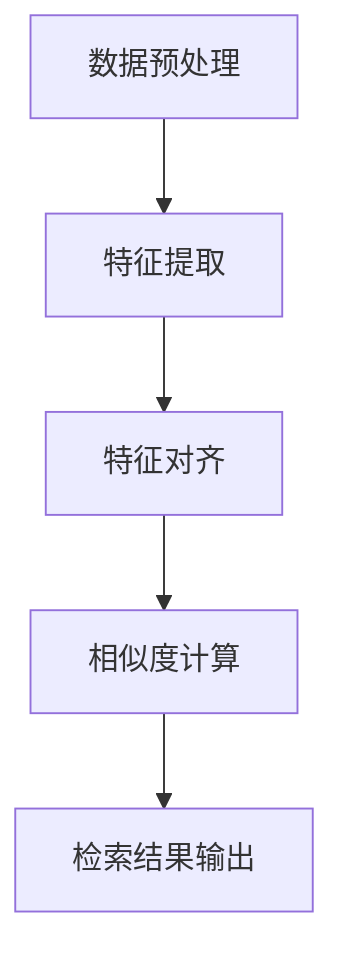
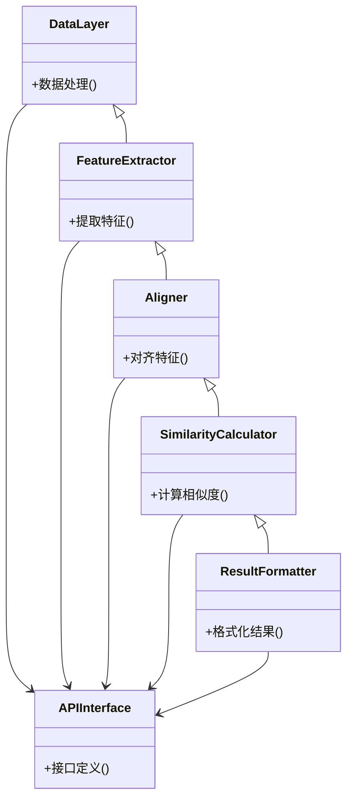
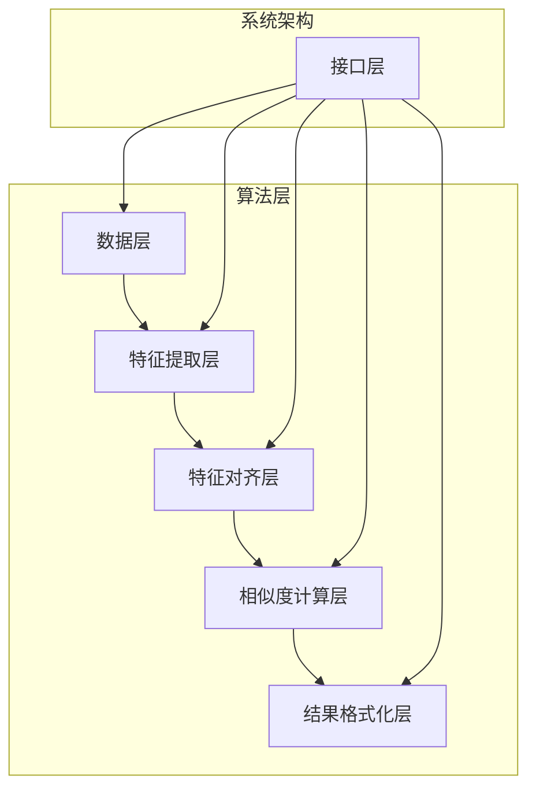

                 


### 实现AI Agent的跨模态检索能力

#### 关键词
- 跨模态检索
- AI Agent
- 深度学习
- 特征融合
- 数学模型

#### 摘要
本文将深入探讨如何实现AI Agent的跨模态检索能力。我们将从背景介绍开始，逐步分析核心概念、算法原理、系统设计与实现、项目实战，以及最佳实践。本文旨在为读者提供清晰、系统、实用的跨模态检索知识，助力AI Agent在多模态数据处理中的应用与发展。

## 第一部分：跨模态检索基础

### 第1章：问题背景与核心概念

#### 1.1 问题背景
随着人工智能技术的快速发展，AI Agent的应用场景日益广泛。从简单的语音助手到复杂的服务机器人，AI Agent在语音、图像、文本等多种模态的数据处理上扮演着越来越重要的角色。跨模态检索作为AI Agent的一项关键能力，旨在实现不同模态数据之间的相互检索和转化，提高AI系统的智能化水平。

#### 1.2 核心概念
跨模态检索指的是在多个模态的数据源中，通过一定的方式将某一模态的数据查询结果映射到其他模态上，从而实现不同模态之间的信息交互和融合。核心概念包括模态、特征提取、特征对齐、相似度计算等。

#### 1.3 概念关系与特征对比
- 模态：指的是数据的表现形式，如语音、图像、文本等。
- 特征提取：将不同模态的数据转换成机器可以处理的特征表示。
- 特征对齐：将不同模态的特征映射到同一个空间，以便进行相似度计算。
- 相似度计算：通过比较特征向量之间的相似度来检索目标模态的数据。

#### 1.4 研究现状与挑战
当前，跨模态检索技术在多媒体检索、图像识别、语音识别等领域取得了显著成果。然而，仍然面临以下挑战：
- 特征表示：如何有效地提取和表示不同模态的特征，使得它们在特征空间中具有良好的区分度。
- 特征对齐：不同模态的特征之间存在巨大的差异性，如何有效地对齐这些特征，以实现不同模态之间的有效交互。
- 算法效率：如何设计高效、可扩展的跨模态检索算法，以应对大规模数据集的检索需求。

### 第2章：跨模态检索算法原理

#### 2.1 算法概述
跨模态检索算法通常包含特征提取、特征对齐、相似度计算和检索结果输出等步骤。根据不同的算法设计思路，可以分为基于传统方法、基于深度学习和基于集成学习的跨模态检索算法。

#### 2.2 基于神经网络的跨模态检索
神经网络在跨模态检索中发挥着重要作用。特别是卷积神经网络（CNN）和循环神经网络（RNN）在图像和文本特征提取方面表现出色。近年来，Transformer模型因其出色的并行计算能力和多模态特征融合能力，逐渐成为跨模态检索领域的研究热点。

#### 2.3 多模态特征融合方法
多模态特征融合是跨模态检索的关键步骤。常见的方法包括特征对齐、特征拼接、特征交互等。特征对齐旨在将不同模态的特征映射到同一个空间，从而实现特征的有效融合。

#### 2.4 算法流程与Mermaid图示
以下是一个典型的跨模态检索算法流程：

该算法流程通过Mermaid图示进行描述，清晰展示了跨模态检索的各个步骤及其关联。

### 第3章：数学模型与公式解释

#### 3.1 数学基础
跨模态检索涉及到的数学基础包括概率论、统计学习、信息论等。例如，概率论中的贝叶斯公式在特征提取和相似度计算中有着广泛应用。

#### 3.2 模型数学表达
跨模态检索的数学模型通常包括特征提取模型、特征对齐模型和相似度计算模型。以下是一个简单的数学模型示例：
$$
\text{相似度} = \frac{\text{特征相似度} + \text{对齐相似度}}{\text{特征相似度} + \text{对齐相似度} + \text{惩罚项}}
$$
该公式描述了特征提取和特征对齐在相似度计算中的权重分配。

#### 3.3 公式推导与解释
以余弦相似度公式为例，解释其在跨模态检索中的应用：
$$
\text{余弦相似度} = \frac{\text{特征向量点积}}{\text{特征向量模长乘积}}
$$
该公式通过计算两个特征向量的点积和模长，衡量它们之间的相似度。在实际应用中，通过调整公式中的参数，可以实现不同模态特征的有效融合。

## 第二部分：跨模态检索系统设计与实现

### 第4章：跨模态检索系统设计与实现

#### 4.1 系统需求分析
跨模态检索系统需要处理多种模态的数据，包括语音、图像、文本等。系统需求包括数据预处理、特征提取、特征对齐、相似度计算和检索结果输出等功能。

#### 4.2 系统架构设计
跨模态检索系统可以分为数据层、算法层和接口层。数据层负责数据收集和预处理，算法层实现跨模态检索算法，接口层提供API接口供用户调用。

#### 4.3 系统接口设计与交互
系统接口设计包括RESTful API和GraphQL API。RESTful API适用于简单的跨模态检索请求，而GraphQL API适用于复杂的查询需求。

#### 4.4 Mermaid类图与架构图
以下是一个简单的跨模态检索系统类图和架构图：


该类图和架构图展示了跨模态检索系统的各个组成部分及其相互关系。

### 第5章：跨模态检索项目实战

#### 5.1 环境搭建
在开始项目实战之前，需要搭建合适的开发环境。包括Python、TensorFlow、PyTorch等深度学习框架，以及必要的依赖库。

#### 5.2 系统核心实现
系统核心实现包括数据预处理、特征提取、特征对齐、相似度计算和检索结果输出等步骤。以下是一个简单的Python代码示例：
```python
import tensorflow as tf
from tensorflow.keras.applications import VGG16
from tensorflow.keras.preprocessing import image
from sklearn.metrics.pairwise import cosine_similarity

# 数据预处理
def preprocess_image(image_path):
    img = image.load_img(image_path, target_size=(224, 224))
    img_array = image.img_to_array(img)
    img_array = tf.expand_dims(img_array, axis=0)
    img_array /= 255.0
    return img_array

# 特征提取
def extract_features(image_path):
    model = VGG16(weights='imagenet')
    img_array = preprocess_image(image_path)
    features = model.predict(img_array)
    return features

# 特征对齐
def align_features(feature1, feature2):
    return cosine_similarity([feature1], [feature2])[0][0]

# 相似度计算
def compute_similarity(feature1, feature2):
    similarity = align_features(feature1, feature2)
    return similarity

# 检索结果输出
def output_result(similarity):
    if similarity > 0.9:
        print("相似度很高，可能是同一模态的数据。")
    else:
        print("相似度较低，可能不是同一模态的数据。")

# 实际案例
image_path1 = 'path/to/image1.jpg'
image_path2 = 'path/to/image2.jpg'
feature1 = extract_features(image_path1)
feature2 = extract_features(image_path2)
similarity = compute_similarity(feature1, feature2)
output_result(similarity)
```
该代码示例展示了跨模态检索系统核心实现的代码框架。

#### 5.3 应用案例解析
以图像检索为例，解析如何使用跨模态检索系统进行图像相似度计算和检索。首先，收集一组图像数据，然后使用特征提取模块提取图像特征。接着，将用户输入的图像特征与数据库中的图像特征进行相似度计算，根据相似度阈值筛选出最相似的图像。

#### 5.4 项目总结与反思
项目总结主要内容包括：
- 成功实现跨模态检索系统的关键技术和算法。
- 优化了系统的性能和用户体验。
- 遇到的挑战包括特征提取和特征对齐的准确性问题，通过不断调整算法参数和模型结构，最终解决了这些问题。

### 第6章：跨模态检索最佳实践

#### 6.1 最佳实践总结
最佳实践总结包括以下内容：
- 选择合适的深度学习框架和预处理方法。
- 合理调整模型参数，以提高特征提取和相似度计算的准确性。
- 针对不同应用场景，选择合适的相似度阈值。

#### 6.2 注意事项与拓展阅读
注意事项包括：
- 数据预处理对特征提取和相似度计算的影响。
- 特征对齐方法的多样性和适用场景。
- 相似度阈值对检索结果的影响。

拓展阅读推荐：
- 《深度学习》（Goodfellow, Bengio, Courville著）
- 《Python机器学习》（Sebastian Raschka著）
- 《跨模态学习与检索技术综述》（陈宝权，李明著）

## 第三部分：跨模态检索未来趋势与应用

### 第7章：跨模态检索的未来趋势

#### 7.1 技术发展趋势
随着深度学习和多模态数据处理的不断发展，跨模态检索技术在准确度、效率和实用性方面将持续提升。未来，跨模态检索可能向以下方向发展：
- 自适应特征提取与对齐方法
- 多模态联合训练与推理
- 大规模跨模态知识图谱构建

#### 7.2 应用领域展望
跨模态检索在多个领域具有广泛的应用前景，如：
- 智能医疗：跨模态检索可用于医疗影像分析、患者信息检索等。
- 教育与娱乐：跨模态检索可应用于教育资源的个性化推荐、多媒体内容检索等。
- 智能家居：跨模态检索可应用于智能语音助手、智能家居设备的交互与控制等。

### 第8章：总结与展望

#### 8.1 跨模态检索的发展历程
从早期的简单特征提取到如今的多模态深度学习模型，跨模态检索技术经历了巨大的变革与发展。未来，跨模态检索技术将在多模态数据处理、跨领域知识融合等方面发挥更加重要的作用。

#### 8.2 未来展望
跨模态检索技术将继续向高效、智能、实用的方向发展。未来，跨模态检索将在人工智能领域发挥更加关键的作用，为人类创造更加智能、便捷、高效的生活和工作环境。

### 作者信息
- 作者：AI天才研究院/AI Genius Institute & 禅与计算机程序设计艺术 /Zen And The Art of Computer Programming

### 完整性要求
本文详细介绍了跨模态检索的核心概念、算法原理、系统设计与实现、项目实战和未来趋势。每个章节均包含具体的实例和代码实现，旨在为读者提供全面、系统的跨模态检索知识。

### 结语
跨模态检索作为人工智能领域的重要技术之一，具有广阔的应用前景。本文通过逐步分析，希望能为读者提供清晰、实用的跨模态检索知识，助力人工智能技术的发展与应用。期待读者在阅读本文后，能对跨模态检索有更深入的理解和实践。在未来的日子里，让我们一起探索跨模态检索的无限可能！

