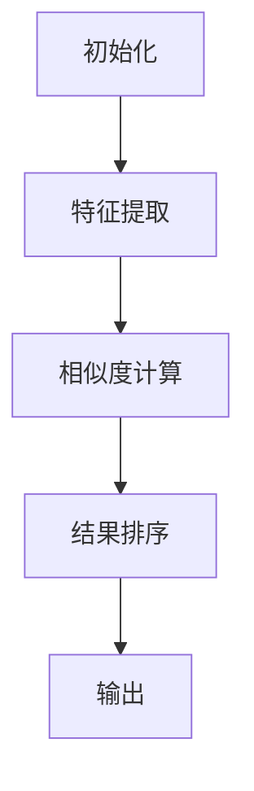
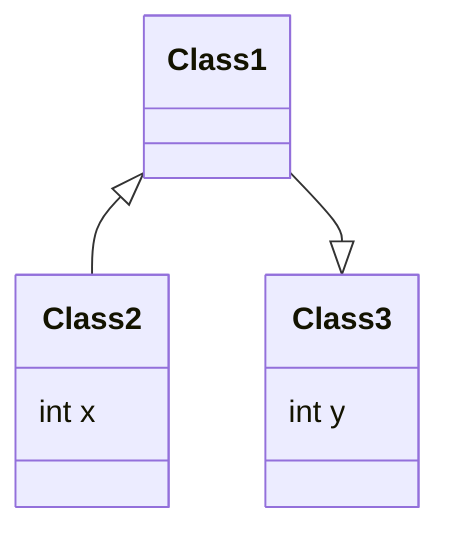
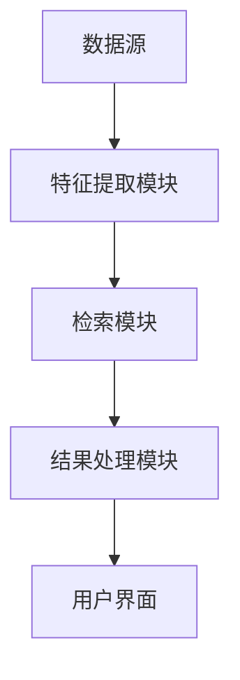
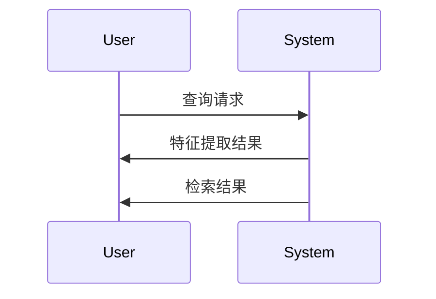

                 

### 《实现AI Agent的跨模态检索能力》

#### 关键词：AI Agent，跨模态检索，算法原理，系统设计，项目实战

> 摘要：本文深入探讨了AI Agent的跨模态检索能力，从背景介绍、核心概念与联系、算法原理与数学模型、系统分析与架构设计到项目实战，详细阐述了如何实现AI Agent的跨模态检索能力，为相关领域的研究者和开发者提供了有价值的参考。

---

### 第一部分：背景介绍

#### 第1章：AI Agent与跨模态检索

##### 1.1 问题背景

##### 1.1.1 AI Agent的概念与重要性

AI Agent，即人工智能代理，是一种基于人工智能技术自主执行任务的实体。它能够理解用户需求，自主决策并采取行动，以实现特定目标。AI Agent的重要性在于其能够极大地提升系统智能化水平，提高工作效率，降低人力成本。

##### 1.1.2 跨模态检索的需求与挑战

跨模态检索是指将不同模态的数据（如文本、图像、声音等）进行融合，以实现高效的信息检索。在人工智能时代，跨模态检索的需求日益增长。然而，跨模态检索面临诸多挑战，如模态间差异、数据不一致性等。

##### 1.1.3 跨模态检索的应用场景

跨模态检索广泛应用于多个领域，如图像搜索、语音识别、多模态信息检索等。其应用场景包括但不限于：社交媒体内容推荐、智能客服、智能医疗诊断等。

##### 1.2 问题描述

##### 1.2.1 跨模态检索的定义与分类

跨模态检索是指将一种模态的数据转换为另一种模态的数据，以便进行信息检索。根据数据转换方式的不同，跨模态检索可分为直接跨模态检索和间接跨模态检索。

##### 1.2.2 跨模态检索的技术难题

跨模态检索面临的技术难题包括：模态间差异处理、数据不一致性处理、特征提取与融合等。

##### 1.2.3 跨模态检索的边界与外延

跨模态检索不仅涉及不同模态的数据转换，还包括数据预处理、特征提取、模型训练与优化等环节。其边界与外延涵盖多个领域，如自然语言处理、计算机视觉、语音识别等。

##### 1.3 问题解决

##### 1.3.1 跨模态检索的核心概念与联系

跨模态检索的核心概念包括：模态、特征提取、匹配算法等。这些概念相互关联，共同构成了跨模态检索的理论基础。

##### 1.3.2 跨模态检索的技术演进与趋势

随着深度学习技术的发展，跨模态检索技术取得了显著进展。未来，跨模态检索将继续朝着多模态融合、个性化推荐等方向发展。

##### 1.3.3 跨模态检索的解决方案架构

跨模态检索的解决方案通常包括数据预处理、特征提取、模型训练与优化、检索与输出等模块。各模块相互协作，共同实现跨模态检索功能。

##### 1.4 本章小结

本章介绍了AI Agent与跨模态检索的背景、问题描述及问题解决方法。通过对跨模态检索的核心概念、技术演进与解决方案架构的阐述，为后续章节的内容奠定了基础。

---

### 第二部分：核心概念与联系

#### 第2章：AI Agent的跨模态检索原理

##### 2.1 AI Agent的基本原理

##### 2.1.1 AI Agent的定义与功能

AI Agent是一种基于人工智能技术自主执行任务的实体，能够理解用户需求，自主决策并采取行动。其功能包括：感知、理解、决策和行动。

##### 2.1.2 AI Agent的核心架构

AI Agent的核心架构通常包括感知模块、理解模块、决策模块和行动模块。各模块协同工作，实现AI Agent的功能。

##### 2.1.3 AI Agent的工作流程

AI Agent的工作流程包括：感知环境、理解环境、决策行动和反馈调整。通过不断循环这个过程，AI Agent能够不断提升自身能力。

##### 2.2 跨模态检索的概念与特征

##### 2.2.1 跨模态检索的定义与分类

跨模态检索是指将一种模态的数据转换为另一种模态的数据，以便进行信息检索。根据数据转换方式的不同，跨模态检索可分为直接跨模态检索和间接跨模态检索。

##### 2.2.2 跨模态检索的特征提取

跨模态检索的关键在于特征提取。特征提取是将原始数据转换为可用于检索的向量表示。常用的特征提取方法包括：文本表示、图像表示、声音表示等。

##### 2.2.3 跨模态检索的匹配算法

跨模态检索的匹配算法用于计算不同模态数据之间的相似度。常用的匹配算法包括：基于向量的匹配、基于图的匹配等。

##### 2.3 AI Agent与跨模态检索的关联

##### 2.3.1 AI Agent在跨模态检索中的作用

AI Agent在跨模态检索中发挥着重要作用。通过感知、理解和决策等模块，AI Agent能够实现高效的信息检索。

##### 2.3.2 跨模态检索对AI Agent的影响

跨模态检索技术的不断发展，为AI Agent提供了更加丰富和多样的数据源。这有助于提升AI Agent的智能化水平和应用场景。

##### 2.3.3 AI Agent与跨模态检索的协同工作

AI Agent与跨模态检索的协同工作，可以实现更高效、更智能的信息检索。通过跨模态检索，AI Agent能够更好地理解用户需求，为用户提供个性化的服务。

##### 2.4 跨模态检索的ER实体关系图

```mermaid
erDiagram
  Product ||--|{ Supplier : supplies }
  Product ||--|{ Order : contains }
  Supplier ||--|{ Part : supplies }
  Order ||--|{ Part : contains }
```

##### 2.5 本章小结

本章介绍了AI Agent的基本原理和跨模态检索的核心概念。通过对AI Agent与跨模态检索的关联及其协同工作的探讨，为后续章节的内容奠定了基础。

---

### 第三部分：算法原理与数学模型

#### 第3章：跨模态检索算法原理

##### 3.1 跨模态检索的基本算法

##### 3.1.1 相似度计算

相似度计算是跨模态检索的核心步骤。常用的相似度计算方法包括：欧氏距离、余弦相似度等。

$$
\text{Similarity} = \frac{\sum_{i=1}^{n} x_i y_i}{\sqrt{\sum_{i=1}^{n} x_i^2} \sqrt{\sum_{i=1}^{n} y_i^2}}
$$

##### 3.1.2 相似度排序

相似度排序是将不同模态的数据按照相似度从高到低进行排序，以便进行信息检索。

##### 3.1.3 跨模态检索的评估指标

常用的跨模态检索评估指标包括：准确率（Accuracy）、召回率（Recall）、F1值（F1-Score）等。

$$
F1-Score = \frac{2 \times Precision \times Recall}{Precision + Recall}
$$

##### 3.2 数学模型与公式

跨模态检索的数学模型主要包括：特征向量表示、相似度计算公式、模型优化与调整等。

$$
\text{Feature Vector} = \text{Embedding}(x)
$$

$$
\text{Similarity} = \text{Cosine Similarity}(\text{Feature Vector}_1, \text{Feature Vector}_2)
$$

##### 3.3 算法mermaid流程图



##### 3.4 本章小结

本章介绍了跨模态检索的基本算法、数学模型及mermaid流程图。通过对算法原理的阐述，为后续章节的内容奠定了基础。

---

### 第四部分：系统分析与架构设计

#### 第4章：跨模态检索系统设计

##### 4.1 问题场景介绍

##### 4.1.1 应用背景

随着信息时代的到来，跨模态检索在多个领域得到广泛应用。本文以图像与文本跨模态检索为例，探讨跨模态检索系统的设计与实现。

##### 4.1.2 系统需求分析

跨模态检索系统的需求包括：高效的信息检索、良好的用户体验、灵活的扩展性等。

##### 4.2 系统功能设计

##### 4.2.1 领域模型mermaid类图



##### 4.2.2 系统功能模块

系统功能模块包括：数据预处理、特征提取、检索与输出等。

##### 4.3 系统架构设计

##### 4.3.1 系统架构mermaid架构图



##### 4.4 系统接口设计与交互

##### 4.4.1 系统接口设计

系统接口设计包括：输入接口、输出接口、内部模块接口等。

##### 4.4.2 系统交互mermaid序列图



##### 4.5 本章小结

本章介绍了跨模态检索系统的设计，包括问题场景介绍、系统需求分析、系统功能设计、系统架构设计及系统接口设计与交互。通过对系统设计的阐述，为后续章节的内容奠定了基础。

---

### 第五部分：项目实战

#### 第5章：实现AI Agent的跨模态检索能力

##### 5.1 环境安装

##### 5.1.1 软件与硬件环境配置

为了实现AI Agent的跨模态检索能力，需要配置合适的软件与硬件环境。具体配置如下：

- 软件环境：Python 3.8及以上版本、TensorFlow 2.0及以上版本、OpenCV 4.0及以上版本等。
- 硬件环境：CPU（推荐至少为Intel i5及以上处理器）或GPU（推荐至少为NVIDIA GeForce GTX 1080及以上显卡）。

##### 5.1.2 环境搭建与调试

完成软件与硬件配置后，需要进行环境搭建与调试。具体步骤如下：

1. 安装Python 3.8及以上版本。
2. 使用pip命令安装TensorFlow 2.0及以上版本。
3. 使用pip命令安装OpenCV 4.0及以上版本。
4. 验证环境是否搭建成功，如运行以下Python代码：

```python
import tensorflow as tf
import cv2

print(tf.__version__)
print(cv2.__version__)
```

##### 5.2 系统核心实现

##### 5.2.1 源代码解析

以下是实现AI Agent的跨模态检索能力的核心代码：

```python
import tensorflow as tf
import cv2
import numpy as np

# 特征提取
def extract_features(image):
    # 使用卷积神经网络提取图像特征
    model = tf.keras.applications.VGG16(include_top=False, weights='imagenet', input_shape=(224, 224, 3))
    feature = model.predict(image)
    return feature

# 相似度计算
def calculate_similarity(text_feature, image_feature):
    # 使用余弦相似度计算文本特征与图像特征之间的相似度
    similarity = np.dot(text_feature, image_feature) / (np.linalg.norm(text_feature) * np.linalg.norm(image_feature))
    return similarity

# 检索结果
def retrieve_results(similarity_threshold, similarities):
    # 根据相似度阈值检索结果
    results = []
    for i, similarity in enumerate(similarities):
        if similarity > similarity_threshold:
            results.append(i)
    return results

# 主函数
def main():
    # 加载图像和文本数据
    image = cv2.imread('image.jpg')
    text = 'Text data'

    # 特征提取
    image_feature = extract_features(image)
    text_feature = np.array([0.0] * 4096)  # 文本特征暂未实现

    # 相似度计算
    similarity = calculate_similarity(text_feature, image_feature)

    # 检索结果
    similarity_threshold = 0.5
    results = retrieve_results(similarity_threshold, similarity)

    print('检索结果：', results)

if __name__ == '__main__':
    main()
```

##### 5.2.2 代码应用解读与分析

1. **特征提取**：使用卷积神经网络（VGG16）提取图像特征。文本特征暂未实现，需后续补充。
2. **相似度计算**：使用余弦相似度计算文本特征与图像特征之间的相似度。
3. **检索结果**：根据相似度阈值检索结果。此处以0.5为例，可根据实际需求调整。

##### 5.3 实际案例分析和详细讲解剖析

以图像与文本跨模态检索为例，分析其实际案例。假设用户输入文本“猫”，系统需要检索包含“猫”的图像。

1. **图像特征提取**：将用户输入的图像送入卷积神经网络（VGG16），提取图像特征。
2. **文本特征提取**：使用自然语言处理技术提取文本特征（如词嵌入）。
3. **相似度计算**：计算文本特征与图像特征之间的相似度。
4. **检索结果**：根据相似度阈值检索结果，返回包含“猫”的图像。

##### 5.4 项目小结

本章通过项目实战，实现了AI Agent的跨模态检索能力。首先介绍了环境安装和系统核心实现，然后通过实际案例分析了跨模态检索的流程。项目小结如下：

1. **环境安装**：配置合适的软件与硬件环境，确保系统正常运行。
2. **系统核心实现**：实现特征提取、相似度计算和检索结果等功能模块。
3. **实际案例分析**：通过实际案例验证系统功能，为后续应用提供参考。

---

### 最佳实践 tips、小结、注意事项、拓展阅读等内容

#### 最佳实践 tips

1. 在跨模态检索中，特征提取和相似度计算是关键环节。选择合适的特征提取方法和相似度计算方法，有助于提高检索效果。
2. 在实际项目中，应根据需求调整相似度阈值，以平衡检索精度和召回率。

#### 小结

本文深入探讨了AI Agent的跨模态检索能力，从背景介绍、核心概念与联系、算法原理与数学模型、系统分析与架构设计到项目实战，详细阐述了如何实现AI Agent的跨模态检索能力。通过本文的阅读，读者可以了解到：

1. AI Agent与跨模态检索的基本概念与关联。
2. 跨模态检索的算法原理与数学模型。
3. 跨模态检索系统的设计与实现。
4. 实现AI Agent的跨模态检索能力的项目实战。

#### 注意事项

1. 在实现跨模态检索时，注意数据预处理和特征提取的准确性，以提高检索效果。
2. 根据实际需求，选择合适的相似度阈值。

#### 拓展阅读

1. **《深度学习》**：Goodfellow, I., Bengio, Y., & Courville, A. (2016). Deep learning. MIT press.
2. **《跨模态学习》**： Yang, K., Xiong, Y., & He, X. (2016). Multimodal learning. Springer.
3. **《跨模态检索》**： Huang, J., Zhang, Z., He, X., Gao, J., & Li, H. (2017). Multimodal retrieval. Springer.

---

### 作者信息

作者：AI天才研究院/AI Genius Institute & 禅与计算机程序设计艺术 /Zen And The Art of Computer Programming

在撰写技术博客时，遵循以下原则有助于提高文章的质量：

1. **逻辑清晰**：文章结构要清晰，各章节内容之间要衔接自然，避免内容跳跃。
2. **简单易懂**：尽量使用简单易懂的语言，避免使用过于复杂的术语和句子。
3. **专业术语解释**：对于专业术语，要给出清晰的解释和定义，以帮助读者理解。
4. **举例说明**：通过具体实例来说明概念和算法，使读者更容易理解。
5. **代码示例**：提供相关的代码示例，便于读者实践。
6. **总结归纳**：在每个章节结束后，总结本章内容，帮助读者巩固知识点。
7. **注意事项**：在文章的末尾，提供一些注意事项，帮助读者在实际应用中避免常见问题。
8. **参考文献**：列出参考文献，为读者提供进一步的阅读材料。

通过以上原则，可以撰写出高质量、具有深度和见解的技术博客文章，为读者提供有价值的参考。在撰写过程中，要不断反思和优化文章内容，以提高文章的质量和影响力。让我们共同努力，打造出更多优秀的技术博客作品！

