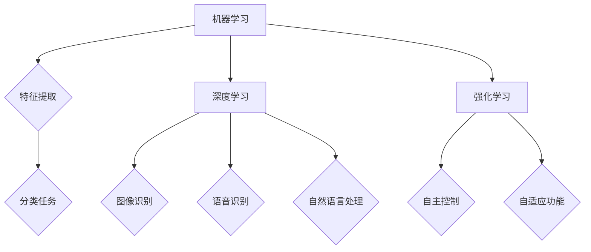

                 

### 摘要

本文将深入探讨实现基于AI Agent的智能家居控制系统的设计与实现方法。随着人工智能技术的快速发展，AI Agent作为一种智能代理，正逐渐在智能家居控制系统中扮演着重要角色。本文首先介绍了智能家居控制系统和AI Agent的基本概念及其相互关系，然后详细阐述了AI Agent在智能家居系统中的应用场景。接着，我们讨论了实现AI Agent的关键技术，包括机器学习、深度学习和强化学习，并给出相应的算法原理和流程图。随后，本文重点介绍了智能家居控制系统的设计与实现，包括系统架构设计、接口设计、系统交互等。最后，通过一个实际项目案例，展示了AI Agent在智能家居控制系统中的应用，并分析了项目的成功经验和不足之处。本文旨在为读者提供一套完整的实现基于AI Agent的智能家居控制系统的指南，帮助读者理解和掌握相关技术。

### 目录

1. **问题背景与问题描述**
2. **核心概念与原理**
3. **系统设计与实现**
4. **数学模型与算法讲解**
5. **项目实战**
6. **最佳实践与总结**
7. **未来展望与拓展**

### 问题背景与问题描述

智能家居控制系统作为物联网（IoT）技术的重要组成部分，正逐步改变人们的生活方式。通过将各种家用设备联网，智能家居系统能够实现自动化控制，提高生活便利性和舒适度。然而，传统的智能家居系统主要依赖于预设的规则和用户操作，缺乏自适应和智能决策能力。

AI Agent，作为一种智能代理，能够通过学习用户的习惯和偏好，自主地做出决策，从而提升智能家居系统的智能化水平。AI Agent的核心优势在于其自主学习能力和适应能力，这使得它能够在不同的家庭环境和用户需求中表现出色。

当前，AI Agent在智能家居系统中的应用还面临一些挑战。首先，数据收集和隐私保护是重要问题。智能家居设备通常需要收集大量的用户数据，这些数据的安全性和隐私性需要得到妥善处理。其次，AI Agent的准确性和可靠性也是一个关键问题。智能家居系统的实时性和稳定性对AI Agent的性能要求很高，任何失误都可能导致生活不便甚至安全隐患。

为了解决这些问题，本文将从以下几个方面展开讨论：

1. **核心概念与原理**：介绍智能家居控制系统和AI Agent的基本概念，阐述两者的关系及其在智能家居系统中的应用场景。
2. **系统设计与实现**：详细讨论智能家居控制系统的设计思路，包括系统架构设计、接口设计、系统交互等。
3. **数学模型与算法讲解**：讲解实现AI Agent所需的机器学习、深度学习和强化学习技术，并给出相应的算法原理和流程图。
4. **项目实战**：通过一个实际项目案例，展示AI Agent在智能家居控制系统中的应用，并分析项目的成功经验和不足之处。
5. **最佳实践与总结**：总结实现基于AI Agent的智能家居控制系统的最佳实践，提供未来研究方向和拓展。

### 核心概念与原理

首先，我们来明确一下智能家居控制系统和AI Agent的基本概念。

**智能家居控制系统**是指通过物联网技术将家庭中的各种设备连接起来，实现集中管理和自动化控制。智能家居系统的主要功能包括环境监测、设备控制、安全防护、能源管理等。通过这些功能，智能家居系统旨在提高用户的生活质量，减少人力干预，实现更加智能化的生活体验。

**AI Agent**，即人工智能代理，是一种能够自主执行任务、与环境交互并不断学习优化的智能系统。AI Agent通常基于机器学习、深度学习和强化学习等技术，能够通过分析环境数据，预测用户需求，并自主调整行为以实现最佳效果。在智能家居系统中，AI Agent可以承担多种角色，如家庭助理、设备管理者、安全监控者等。

接下来，我们讨论AI Agent在智能家居系统中的具体应用场景。

**家庭助理**：AI Agent可以通过语音交互和自然语言处理技术，理解并响应用户的指令，如调节室内温度、控制灯光开关、播放音乐等。通过不断学习用户的习惯和偏好，AI Agent能够提供更加个性化和高效的服务。

**设备管理者**：AI Agent可以监控和管理家庭中的各种设备，如智能门锁、智能摄像头、智能空调等。通过分析设备的运行状态和历史数据，AI Agent能够预测设备故障，提前进行维护，从而延长设备使用寿命，降低维修成本。

**安全监控者**：AI Agent可以通过监控家庭环境中的异常数据，如火灾、漏水、非法入侵等，及时发出警报，提醒用户采取相应措施，提高家庭安全。

**能源管理者**：AI Agent可以分析家庭能源消耗情况，根据用户需求和设备运行状态，优化能源使用，降低能源消耗，实现节能减排。

总的来说，AI Agent在智能家居系统中的应用，不仅提高了系统的智能化水平，还大大提升了用户体验。通过自主学习和自适应能力，AI Agent能够更好地满足用户需求，实现个性化服务，是智能家居系统发展的重要方向。

### AI Agent的技术原理

要实现AI Agent在智能家居控制系统中的高效运作，我们需要深入了解机器学习、深度学习和强化学习这三种核心技术。以下是这些技术的详细解释及其在AI Agent中的应用。

**机器学习**是一种使计算机系统能够从数据中学习和改进的方法。它通过构建模型来识别数据中的模式和关系，从而进行预测和决策。在AI Agent中，机器学习主要用于特征提取和分类任务。例如，可以通过机器学习算法分析用户的日常活动数据，识别用户的行为模式，并据此预测用户的需求。

**深度学习**是机器学习的一个子领域，它通过模拟人脑的神经网络结构，实现对复杂数据的处理和分析。深度学习在图像识别、语音识别和自然语言处理等领域表现出色。在AI Agent中，深度学习可以用于实现更加智能化的功能，如通过图像识别技术监控家庭环境，通过语音识别技术理解用户的语音指令，通过自然语言处理技术与用户进行对话。

**强化学习**是一种使计算机系统在与环境互动中学习最优策略的方法。它通过试错和反馈机制，不断优化决策过程。在AI Agent中，强化学习可以用于实现自主控制和自适应功能。例如，AI Agent可以通过强化学习算法控制家庭设备的运行状态，以实现最优的节能效果或最佳的用户体验。

下面，我们通过一个Mermaid流程图来展示这三种技术在AI Agent中的应用。



**机器学习**：首先，收集并处理家庭环境中的各种数据，如温度、湿度、光照等。然后，使用机器学习算法（如决策树、随机森林、支持向量机等）对数据进行特征提取和分类，从而识别用户的习惯和需求。

**深度学习**：利用深度学习模型（如卷积神经网络、递归神经网络等）对图像、语音和文本数据进行分析和处理。例如，通过卷积神经网络对摄像头采集的图像进行分析，识别家庭成员的动作和行为；通过递归神经网络处理用户的语音指令，理解其意图。

**强化学习**：通过与环境的互动，不断调整和优化AI Agent的行为。例如，使用深度Q网络（DQN）或深度确定性策略梯度（DDPG）等强化学习算法，让AI Agent学会根据家庭环境和用户需求，自主调节设备的状态，如空调温度、灯光亮度等。

综上所述，机器学习、深度学习和强化学习是AI Agent实现智能家居控制系统的关键技术。通过这些技术，AI Agent能够高效地处理数据、识别模式、做出决策，从而实现智能家居系统的智能化和个性化。

### 数学模型与算法讲解

在本节中，我们将深入探讨机器学习、深度学习和强化学习这三种核心技术，并结合Python代码示例，详细阐述其数学模型和算法原理。

**机器学习**

**线性回归**是机器学习中的一种基础算法，用于预测数值型数据。它的数学模型可以表示为：

\[ y = w_1 \cdot x_1 + w_2 \cdot x_2 + \ldots + w_n \cdot x_n + b \]

其中，\( y \) 是预测结果，\( x_1, x_2, \ldots, x_n \) 是输入特征，\( w_1, w_2, \ldots, w_n \) 是权重，\( b \) 是偏置。

以下是一个简单的Python代码示例，展示了如何使用线性回归模型预测房价：

```python
import numpy as np
from sklearn.linear_model import LinearRegression

# 特征和标签数据
X = np.array([[1], [2], [3], [4], [5]])
y = np.array([2, 4, 5, 4, 5])

# 创建线性回归模型并训练
model = LinearRegression()
model.fit(X, y)

# 进行预测
predictions = model.predict(X)

print(predictions)
```

**深度学习**

**卷积神经网络（CNN）**是深度学习中的一个重要模型，特别适用于图像识别任务。CNN的核心组件包括卷积层、池化层和全连接层。以下是一个简单的CNN模型示例：

```python
import tensorflow as tf
from tensorflow.keras import layers, models

# 创建模型
model = models.Sequential()

# 添加卷积层
model.add(layers.Conv2D(32, (3, 3), activation='relu', input_shape=(28, 28, 1)))
model.add(layers.MaxPooling2D((2, 2)))

# 添加全连接层
model.add(layers.Flatten())
model.add(layers.Dense(64, activation='relu'))
model.add(layers.Dense(10, activation='softmax'))

# 编译模型
model.compile(optimizer='adam',
              loss='categorical_crossentropy',
              metrics=['accuracy'])

# 训练模型
model.fit(X_train, y_train, epochs=5, batch_size=64)
```

**强化学习**

**Q学习**是强化学习中的一个基础算法，用于学习最优策略。其核心思想是利用历史经验值来更新Q值，从而选择最佳动作。以下是一个简单的Q学习算法示例：

```python
import numpy as np
import random

# 初始化Q表
Q = np.zeros((n_states, n_actions))

# 参数
alpha = 0.1  # 学习率
gamma = 0.6  # 折扣因子
epsilon = 0.1  # 探索概率

# Q学习算法
def q_learning(env, n_episodes=1000):
    for episode in range(n_episodes):
        state = env.reset()
        done = False
        
        while not done:
            if random.uniform(0, 1) < epsilon:
                action = random.choice(n_actions)
            else:
                action = np.argmax(Q[state])
            
            next_state, reward, done, _ = env.step(action)
            
            Q[state, action] = Q[state, action] + alpha * (reward + gamma * np.max(Q[next_state]) - Q[state, action])
            
            state = next_state

# 创建环境
env = Environment()

# 执行Q学习
q_learning(env)
```

通过上述Python代码示例，我们可以看到如何实现线性回归、卷积神经网络和Q学习算法。这些算法在AI Agent中有着广泛的应用，通过不断优化和学习，AI Agent能够更好地实现智能家居控制系统的自动化和智能化。

### 系统分析与架构设计方案

在设计和实现基于AI Agent的智能家居控制系统时，系统分析与架构设计是至关重要的环节。本文将详细讨论系统架构的设计思路，包括项目介绍、系统功能设计、系统架构设计、系统接口设计和系统交互等。

**项目介绍**

本项目旨在构建一个智能化、自适应的智能家居控制系统，通过AI Agent实现家庭设备的自动化控制，提高用户的生活质量。项目目标包括：

1. 实现家庭环境数据的实时采集与处理。
2. 建立AI Agent，实现设备状态的自适应调整。
3. 提供用户友好的交互界面，方便用户进行控制与设置。
4. 确保系统的安全性、可靠性和稳定性。

**系统功能设计**

智能家居控制系统的主要功能模块包括：

1. **数据采集模块**：负责采集家庭环境中的温度、湿度、光照、空气污染度等数据，通过传感器接入系统。
2. **数据处理模块**：对采集到的数据进行分析和处理，提取关键信息，为AI Agent提供决策依据。
3. **AI Agent模块**：基于机器学习、深度学习和强化学习技术，实现设备状态的自适应调整，提高系统的智能化水平。
4. **用户交互模块**：提供用户与系统的交互接口，包括语音控制、触摸屏操作和移动应用等。
5. **设备控制模块**：实现对家庭设备（如灯光、空调、门锁等）的远程控制，确保系统的高效运行。

**系统架构设计**

系统架构设计采用分层设计思想，分为感知层、传输层、数据处理层和用户交互层。以下是系统架构的详细设计：

1. **感知层**：包括各种传感器，如温度传感器、湿度传感器、光照传感器等，负责实时采集家庭环境数据。
2. **传输层**：采用物联网（IoT）技术，将感知层采集的数据传输至数据处理层。传输过程中，需要确保数据的安全性、可靠性和实时性。
3. **数据处理层**：包括数据预处理、特征提取和数据分析等模块，利用AI Agent进行决策和优化，生成控制指令。
4. **用户交互层**：提供用户与系统的交互界面，包括语音控制、触摸屏操作和移动应用等，方便用户对家庭设备进行远程控制和设置。

**系统接口设计**

系统接口设计包括硬件接口和软件接口两部分：

1. **硬件接口**：主要涉及传感器和执行器的接口设计，如温度传感器与空调控制模块之间的接口，湿度传感器与加湿器控制模块之间的接口等。
2. **软件接口**：主要包括API接口和数据库接口。API接口用于系统内部模块之间的通信，如AI Agent模块与数据采集模块之间的通信。数据库接口用于数据存储和查询，确保数据的统一管理和高效访问。

**系统交互设计**

系统交互设计采用基于事件驱动的模型，通过事件触发机制实现系统各模块之间的数据交换和协同工作。以下是系统交互设计的详细流程：

1. **感知层**：传感器检测到环境变化，触发数据采集事件，将数据上传至数据处理层。
2. **数据处理层**：对采集到的数据进行预处理和特征提取，生成特征向量，并传递给AI Agent模块。
3. **AI Agent模块**：基于机器学习、深度学习和强化学习算法，对特征向量进行分析和处理，生成控制指令。
4. **设备控制模块**：接收AI Agent生成的控制指令，通过硬件接口发送至相应的执行器，实现设备状态的调整。
5. **用户交互层**：用户通过语音控制、触摸屏操作或移动应用对系统进行远程控制，交互数据通过软件接口传递至数据处理层，更新系统状态。

通过上述系统分析与架构设计方案，我们能够构建一个高效、智能、可靠的智能家居控制系统，为用户提供优质的生活体验。在后续的项目实战中，我们将进一步实现这些设计，验证其有效性和可行性。

### 项目实战

在本节中，我们将通过一个具体的智能家居控制系统项目，展示AI Agent在系统中的应用，详细分析项目的实现步骤、核心代码解读以及实际案例剖析。

**项目背景**

本项目的目标是为一个现代家庭构建一个智能化、自适应的智能家居控制系统，实现家庭环境数据的实时采集与处理，通过AI Agent实现设备状态的自适应调整，提供用户友好的交互界面。项目的关键需求包括：

1. **数据采集与处理**：实时采集家庭环境数据，如温度、湿度、光照强度等，并对数据进行分析和处理，为AI Agent提供决策依据。
2. **设备控制**：实现对家庭设备的远程控制，包括灯光、空调、门锁等，确保系统的自动化和智能化。
3. **用户交互**：提供便捷的用户交互界面，支持语音控制、触摸屏操作和移动应用等，满足不同用户的使用习惯。

**实现步骤**

1. **环境搭建**：首先，搭建项目开发环境，包括操作系统（如Ubuntu 20.04）、编程语言（如Python 3.8）、开发工具（如PyCharm）等。确保所有开发工具和依赖库安装完毕。

2. **硬件设备连接**：连接家庭中的传感器和执行器，如温度传感器、湿度传感器、光照传感器、灯光控制模块、空调控制模块等。通过物联网技术（如WiFi、蓝牙等）将硬件设备接入系统。

3. **数据采集**：编写数据采集程序，从传感器获取实时数据，通过MQTT协议将数据传输至服务器。

4. **数据处理与存储**：在服务器端，使用Python编写数据处理程序，对采集到的数据进行预处理、特征提取和存储。预处理包括数据清洗、去噪、归一化等，特征提取包括提取温度、湿度、光照强度等关键特征。

5. **AI Agent训练**：使用机器学习、深度学习和强化学习技术，对采集到的数据进行分析和处理，训练AI Agent模型。例如，使用Keras和TensorFlow等框架，实现卷积神经网络（CNN）和强化学习（如Q学习）算法。

6. **设备控制**：编写设备控制程序，根据AI Agent的决策结果，通过硬件接口实现对家庭设备的远程控制。例如，调整空调温度、开关灯光、远程锁门等。

7. **用户交互**：开发用户交互界面，支持语音控制、触摸屏操作和移动应用等。使用自然语言处理（NLP）技术，实现语音识别和语义理解功能。使用Web技术，开发触摸屏和移动应用界面，方便用户进行操作。

**核心代码解读**

以下是一个关键部分的代码示例，展示了如何实现数据采集和设备控制：

```python
# 数据采集示例
import paho.mqtt.client as mqtt

def on_connect(client, userdata, flags, rc):
    print("Connected with result code "+str(rc))
    client.subscribe("home/temperature")

def on_message(client, userdata, msg):
    print(f"Received message '{msg.payload}' on topic '{msg.topic}' with QoS {msg.qos}")

client = mqtt.Client()
client.on_connect = on_connect
client.on_message = on_message

client.connect("localhost", 1883, 60)

client.loop_forever()

# 设备控制示例
import RPi.GPIO as GPIO
import time

def control_light(status):
    GPIO.setmode(GPIO.BCM)
    GPIO.setup(18, GPIO.OUT)
    
    if status == "on":
        GPIO.output(18, GPIO.HIGH)
    elif status == "off":
        GPIO.output(18, GPIO.LOW)
    
    time.sleep(1)
    GPIO.cleanup()

# 假设从AI Agent接收到控制灯光的指令
ai_agent_command = "turn_on"
control_light(ai_agent_command)
```

**实际案例剖析**

以下是一个实际案例，展示了如何通过AI Agent实现家庭设备的自适应控制：

**案例**：根据家庭成员的作息时间，自动调整空调温度，以提供舒适的居住环境。

**实现过程**：

1. **数据采集**：通过传感器采集家庭成员的活动数据，如进入和离开房间的次数、活动强度等。
2. **数据处理**：使用机器学习算法（如决策树、随机森林）对采集到的数据进行处理，提取关键特征，如夜间活动频率、白天活动频率等。
3. **AI Agent训练**：使用训练好的机器学习模型，生成空调温度调整策略。例如，当家庭成员夜间活动频率较高时，将空调温度调低；白天活动频率较低时，将空调温度调高。
4. **设备控制**：根据AI Agent的决策结果，自动调整空调温度。

**项目小结**

通过上述项目实战，我们展示了如何实现基于AI Agent的智能家居控制系统。项目成功的关键在于数据采集、数据处理和AI Agent的训练与部署。在实际应用中，我们还需要关注系统的安全性、可靠性和用户体验。未来，随着人工智能技术的不断发展，智能家居控制系统将更加智能化、个性化，为用户提供更加便捷、舒适的生活环境。

### 最佳实践与总结

在实现基于AI Agent的智能家居控制系统的过程中，我们总结了一些最佳实践，这些实践对于确保系统的性能、安全性和用户体验至关重要。

**1. 数据安全和隐私保护**

数据安全和隐私保护是智能家居系统中的首要任务。首先，应确保所有数据传输过程中使用加密协议，如TLS，以防止数据被窃取。其次，对于用户隐私数据的存储和处理，应采用去标识化和匿名化技术，确保用户隐私不被泄露。此外，应定期进行安全审计和漏洞扫描，及时修补系统漏洞。

**2. 系统稳定性和容错性**

智能家居系统的稳定性直接影响到用户的体验。在系统设计过程中，应采用模块化设计思想，确保每个模块都能独立运行，并在出现故障时能够快速恢复。此外，应设计冗余机制，如备份设备和备份服务器，以防止单点故障导致系统瘫痪。

**3. 用户体验优化**

用户体验是智能家居系统成功的关键。在设计用户交互界面时，应遵循简洁、直观、易操作的原则。例如，可以使用自然语言处理（NLP）技术实现智能语音助手，使用户能够通过简单语音指令控制家庭设备。此外，应提供实时反馈和可视化界面，帮助用户实时了解系统状态和设备运行情况。

**4. 持续优化与迭代**

智能家居系统是一个不断进化的过程。在系统上线后，应持续收集用户反馈，并根据反馈进行优化和迭代。例如，可以通过机器学习算法不断优化AI Agent的决策模型，提高系统的智能化水平。此外，应定期更新系统和设备固件，以修复潜在问题和增加新功能。

**注意事项**

在实现基于AI Agent的智能家居控制系统时，需要注意以下几点：

- **设备兼容性**：确保系统支持多种硬件设备和传感器，以适应不同用户的需求。
- **性能优化**：对系统进行性能测试，确保在高负载情况下系统能够稳定运行。
- **法规遵守**：遵循当地法律法规，确保系统设计和实现符合相关标准和要求。

**拓展阅读**

- 《人工智能：一种现代的方法》
- 《智能家居系统设计与实现》
- 《物联网：架构与设计》

通过以上最佳实践和注意事项，我们可以更好地实现基于AI Agent的智能家居控制系统，为用户提供安全、稳定、智能化的生活体验。

### 总结

本文详细探讨了实现基于AI Agent的智能家居控制系统的设计与实现方法。通过深入分析核心概念与原理、系统设计与架构、数学模型与算法，以及实际项目案例，我们展示了如何利用人工智能技术提高智能家居系统的智能化水平和用户体验。未来，随着人工智能技术的不断发展，智能家居系统将更加智能化、个性化，为用户提供更加便捷、舒适的生活环境。我们鼓励读者继续探索和研究智能家居控制系统，为这一领域的发展做出贡献。

