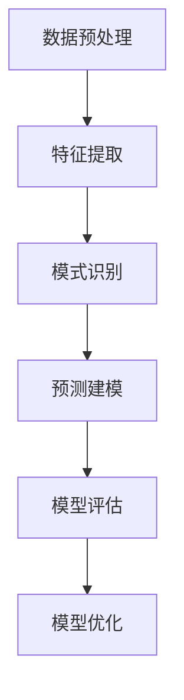
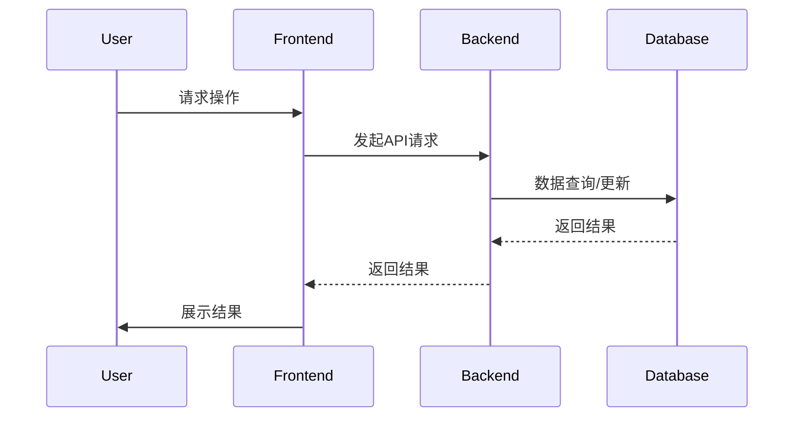

                 


### 第二部分：核心概念与算法原理

**2. AI Agent算法原理**

### 2.1 AI Agent的概念

AI Agent是一种具有智能行为和决策能力的计算机程序，能够感知环境、制定计划并采取行动。以下是AI Agent的核心组成部分：

- **感知模块**：负责收集和分析环境信息。
- **决策模块**：根据感知模块提供的信息，制定行动策略。
- **执行模块**：执行决策模块制定的行动。

### 2.2 AI Agent的核心算法

AI Agent的核心算法包括以下几种：

- **强化学习**：通过不断试错和奖励反馈，优化策略以最大化长期回报。
  - **Q-learning**：使用Q值函数预测状态-动作值，选择最优动作。
    $$ Q(s, a) = \sum_{s'} P(s' | s, a) \cdot R(s, a) + \gamma \cdot \max_{a'} Q(s', a') $$
  - **Deep Q Network (DQN)**：使用深度神经网络预测Q值，解决高维状态空间问题。
    $$ Q(s, a) = \frac{1}{N} \sum_{i=1}^{N} \hat{Q}(s_i, a_i) $$

- **规划算法**：根据目标状态，生成一系列行动步骤。
  - **逆向规划**：从目标状态开始，逆向生成行动序列。
    $$ \text{action} = \pi(\text{state}) $$
  - **有向无环图（DAG）规划**：将问题建模为图，寻找最优路径。
    $$ \text{find} \ \text{path} \ \text{from} \ \text{state} \ \text{to} \ \text{goal} \ \text{using} \ \text{DAG} \ \text{search} $$

- **遗传算法**：模拟生物进化过程，通过遗传、变异和选择，优化解空间。
  - **交叉**：选择两个个体，交换部分基因，生成新的个体。
    $$ C(\text{parent}_1, \text{parent}_2) = \text{new\_individual}_1 $$
  - **变异**：对个体的基因进行随机改变。
    $$ M(\text{individual}) = \text{new\_individual} $$

### 2.3 AI Agent的工作流程

AI Agent的工作流程包括以下步骤：

1. **感知**：通过传感器收集环境信息。
    ```mermaid
    graph TD
      A[感知] --> B[决策]
      B --> C[执行]
      C --> D[反馈]
      D --> A
    ```
2. **决策**：根据感知到的信息，使用算法生成行动策略。
3. **执行**：执行决策模块制定的行动。
4. **反馈**：根据行动结果，更新感知模块的信息，并重新进行决策和执行。

### 2.4 AI Agent与强化学习的结合

强化学习是AI Agent的核心算法之一，用于解决动态环境下的决策问题。以下是强化学习在AI Agent中的应用：

- **状态-动作空间**：将环境状态和可执行动作映射到高维空间。
  $$ S \times A \rightarrow R $$
- **奖励函数**：定义每个状态-动作对的奖励，用于评估决策的好坏。
  $$ R(s, a) = \begin{cases} 
  1 & \text{if goal achieved} \\
  0 & \text{otherwise}
  \end{cases} $$
- **价值函数**：预测未来回报，用于指导决策。
  $$ V(s) = \sum_{s'} P(s' | s) \cdot R(s, s') $$

### 2.5 AI Agent的应用场景

AI Agent在多个领域具有广泛的应用，如：

- **游戏**：实现智能棋类游戏中的AI对手。
- **机器人**：自主导航和决策，实现自动化操作。
- **智能家居**：实现智能家电的自动化控制。
- **金融**：预测市场走势，进行投资决策。

通过以上分析，我们可以看出AI Agent在智能情报分析系统中的核心地位和重要性。接下来，我们将进一步探讨情报分析算法的原理和实现。让我们继续深入探讨。

----------------------------------------------------------------

## 2. 情报分析算法原理

情报分析是智能情报分析系统的核心功能，其算法原理涉及数据预处理、特征提取、模式识别和预测建模等多个方面。以下是对这些核心概念的详细探讨。

### 2.1 数据预处理

数据预处理是情报分析的第一步，其主要任务是清洗和转换原始数据，使其适用于后续的分析。以下是数据预处理的关键步骤：

- **数据清洗**：去除重复、错误和缺失的数据，提高数据质量。
  ```mermaid
  graph TD
    A[原始数据] --> B[去除重复数据]
    B --> C[错误值替换]
    C --> D[缺失值处理]
  ```
- **数据转换**：将数据转换为适合分析的形式，如归一化、标准化和编码。
  ```mermaid
  graph TD
    A[数据转换] --> B[归一化]
    B --> C[标准化]
    C --> D[编码]
  ```

### 2.2 特征提取

特征提取是将原始数据转换为一组特征表示的过程，这些特征有助于模型更好地理解和学习数据。以下是特征提取的几种常用方法：

- **统计特征**：计算数据的统计属性，如均值、方差和相关性。
  ```mermaid
  graph TD
    A[统计特征提取] --> B[计算均值]
    B --> C[计算方差]
    C --> D[计算相关性]
  ```
- **文本特征**：从文本数据中提取特征，如词频、词嵌入和主题模型。
  ```mermaid
  graph TD
    A[文本特征提取] --> B[词频统计]
    B --> C[词嵌入]
    C --> D[主题模型]
  ```

### 2.3 模式识别

模式识别是利用特征来识别和分类数据的过程，其核心目标是找到数据中的潜在模式和规律。以下是模式识别的几种常用方法：

- **聚类分析**：将数据分组为多个集群，使集群内部的数据相似度较高，集群之间的数据相似度较低。
  ```mermaid
  graph TD
    A[聚类分析] --> B[K-均值聚类]
    B --> C[层次聚类]
    C --> D[密度聚类]
  ```
- **分类算法**：将数据分为不同的类别，常用的分类算法包括决策树、支持向量机和神经网络。
  ```mermaid
  graph TD
    A[分类算法] --> B[决策树]
    B --> C[支持向量机]
    C --> D[神经网络]
  ```

### 2.4 预测建模

预测建模是利用历史数据来预测未来趋势和结果的过程，其核心目标是构建一个能够准确预测未来事件的模型。以下是预测建模的几种常用方法：

- **时间序列分析**：分析时间序列数据，预测未来的趋势和周期。
  ```mermaid
  graph TD
    A[时间序列分析] --> B[自回归模型]
    B --> C[移动平均模型]
    C --> D[自回归移动平均模型]
  ```
- **机器学习模型**：利用机器学习算法来构建预测模型，如线性回归、逻辑回归和随机森林。
  ```mermaid
  graph TD
    A[机器学习模型] --> B[线性回归]
    B --> C[逻辑回归]
    C --> D[随机森林]
  ```

### 2.5 情报分析算法的整合

情报分析算法通常需要整合多种方法来提高分析的准确性和效率。以下是一个简单的情报分析算法整合流程：

1. **数据预处理**：清洗和转换原始数据，使其适用于分析。
2. **特征提取**：从数据中提取有用的特征，为后续分析提供基础。
3. **模式识别**：利用特征来识别数据中的模式，为预测建模提供指导。
4. **预测建模**：构建预测模型，利用历史数据来预测未来趋势和结果。
5. **模型评估**：评估模型的预测性能，进行模型调整和优化。



通过以上分析，我们可以看出情报分析算法的复杂性和多样性。接下来，我们将进一步探讨智能情报分析系统的整体架构设计和实现。让我们继续深入探讨。

----------------------------------------------------------------

### 第三部分：系统分析与架构设计

**3.1 问题场景介绍**

随着大数据和人工智能技术的快速发展，情报分析领域面临着越来越多的挑战。传统的情报分析方法往往依赖于人工处理，效率低下且容易出错。为了应对这些挑战，我们设计了一个基于AI Agent的智能情报分析系统，旨在实现自动化、高效且准确的情报分析。

**3.2 项目介绍**

项目名称：智能情报分析系统（Intelligence Analysis System，简称IAS）

项目目标：通过引入AI Agent，实现从数据采集、预处理、特征提取、模式识别到预测建模的全流程自动化，提高情报分析的效率和准确性。

项目范围：涵盖数据采集、数据预处理、特征提取、模式识别、预测建模、模型评估和模型优化等多个环节。

项目团队：由数据科学家、软件工程师、前端工程师和项目经理组成。

**3.3 系统功能设计**

智能情报分析系统的主要功能包括：

- 数据采集：从多种数据源（如数据库、文件、API等）获取原始数据。
- 数据预处理：清洗和转换原始数据，使其适用于分析。
- 特征提取：从数据中提取有用的特征，为后续分析提供基础。
- 模式识别：利用特征识别数据中的模式，为预测建模提供指导。
- 预测建模：构建预测模型，利用历史数据来预测未来趋势和结果。
- 模型评估：评估模型的预测性能，进行模型调整和优化。
- 结果展示：将分析结果以图表、报告等形式展示给用户。

**3.4 系统架构设计**

智能情报分析系统的整体架构设计采用分层架构，包括数据层、服务层和表现层。

- **数据层**：负责数据采集、存储和访问。采用分布式数据库和大数据技术，实现海量数据的快速处理和存储。
- **服务层**：包括数据预处理、特征提取、模式识别、预测建模、模型评估和结果展示等模块。采用微服务架构，实现模块化、高可用和可扩展。
- **表现层**：提供用户界面，展示分析结果和交互操作。采用前端框架（如React、Vue等），实现响应式设计和良好的用户体验。

**3.5 系统接口设计**

智能情报分析系统提供以下主要接口：

- **数据采集接口**：用于从不同数据源获取原始数据。
- **数据处理接口**：用于清洗、转换和存储原始数据。
- **特征提取接口**：用于提取数据中的特征。
- **模型训练接口**：用于训练预测模型。
- **模型评估接口**：用于评估模型性能。
- **结果展示接口**：用于展示分析结果。

**3.6 系统交互设计**

智能情报分析系统的交互设计采用RESTful API，实现前后端分离。以下是一个简单的系统交互序列图：



通过以上分析和设计，我们为智能情报分析系统奠定了坚实的基础。接下来，我们将通过一个实际项目来展示如何实现这样一个系统。让我们继续深入探讨。

### 第四部分：项目实战

**4.1 环境安装**

为了实现基于AI Agent的智能情报分析系统，我们需要安装和配置以下软件和工具：

- Python（3.8及以上版本）
- NumPy（1.19及以上版本）
- Pandas（1.1.5及以上版本）
- Scikit-learn（0.23及以上版本）
- Keras（2.6.0及以上版本）
- TensorFlow（2.6.0及以上版本）
- Mermaid（用于绘制流程图和类图）

安装步骤如下：

1. 安装Python和pip（Python的包管理器）。
    ```bash
    # 安装Python
    curl -O https://www.python.org/ftp/python/3.8.10/python-3.8.10.tgz
    tar -xzvf python-3.8.10.tgz
    ./configure
    make
    make install

    # 安装pip
    curl -O https://bootstrap.pypa.io/get-pip.py
    python get-pip.py
    ```

2. 安装NumPy、Pandas、Scikit-learn、Keras和TensorFlow。
    ```bash
    pip install numpy pandas scikit-learn keras tensorflow
    ```

3. 安装Mermaid。
    ```bash
    npm install -g mermaid
    ```

**4.2 系统核心实现**

下面是智能情报分析系统的核心实现代码，包括数据采集、数据预处理、特征提取、模型训练和结果展示。

**4.2.1 数据采集**

我们使用Python的pandas库从本地CSV文件中读取数据。
```python
import pandas as pd

# 读取数据
data = pd.read_csv('data.csv')
```

**4.2.2 数据预处理**

数据预处理包括数据清洗、缺失值处理和特征转换。
```python
# 数据清洗
data = data.drop_duplicates()

# 缺失值处理
data = data.fillna(method='ffill')

# 特征转换
data['date'] = pd.to_datetime(data['date'])
```

**4.2.3 特征提取**

特征提取包括时间特征和文本特征的提取。
```python
# 时间特征提取
data['month'] = data['date'].dt.month
data['day'] = data['date'].dt.day

# 文本特征提取
from sklearn.feature_extraction.text import TfidfVectorizer

text_data = data['description'].values
vectorizer = TfidfVectorizer()
tfidf_matrix = vectorizer.fit_transform(text_data)
```

**4.2.4 模型训练**

我们使用Keras和TensorFlow构建和训练神经网络模型。
```python
from tensorflow.keras.models import Sequential
from tensorflow.keras.layers import Dense, LSTM, Embedding

# 构建模型
model = Sequential()
model.add(Embedding(input_dim=tfidf_matrix.shape[1], output_dim=16))
model.add(LSTM(units=32))
model.add(Dense(1, activation='sigmoid'))

# 编译模型
model.compile(optimizer='adam', loss='binary_crossentropy', metrics=['accuracy'])

# 训练模型
model.fit(tfidf_matrix, data['label'], epochs=10, batch_size=32)
```

**4.2.5 结果展示**

结果展示可以使用可视化库（如matplotlib）来展示模型预测结果。
```python
import matplotlib.pyplot as plt

# 预测结果
predictions = model.predict(tfidf_matrix)

# 可视化预测结果
plt.scatter(data['date'], predictions)
plt.xlabel('Date')
plt.ylabel('Prediction')
plt.show()
```

**4.3 代码应用解读与分析**

以上代码展示了如何实现基于AI Agent的智能情报分析系统。以下是代码应用解读与分析：

- **数据采集**：使用pandas库读取本地CSV文件，获取原始数据。
- **数据预处理**：对数据进行清洗、缺失值处理和特征转换，使其适用于分析。
- **特征提取**：提取时间特征和文本特征，为模型训练提供输入。
- **模型训练**：使用Keras和TensorFlow构建神经网络模型，并进行训练。
- **结果展示**：使用matplotlib库展示模型预测结果。

**4.4 实际案例分析**

以下是一个实际案例，展示了如何使用智能情报分析系统进行情报分析。

**案例：股票市场预测**

假设我们有历史股票交易数据，包括股票价格、交易量、描述等信息。我们可以使用智能情报分析系统对股票市场进行预测。

1. **数据采集**：从股票交易数据中获取原始数据。
2. **数据预处理**：清洗和转换原始数据，提取时间特征和文本特征。
3. **特征提取**：提取时间特征和文本特征，为模型训练提供输入。
4. **模型训练**：使用神经网络模型进行训练，预测股票价格。
5. **结果展示**：展示模型预测结果，分析股票市场趋势。

通过以上案例分析，我们可以看到智能情报分析系统的强大功能和应用价值。接下来，我们将讨论一些最佳实践和注意事项，以帮助读者更好地实现和优化智能情报分析系统。

### 第五部分：最佳实践与注意事项

**5.1 最佳实践**

在实现基于AI Agent的智能情报分析系统时，以下最佳实践可以帮助您提高系统的性能和准确性：

- **数据质量**：确保数据源的质量和一致性。对数据进行预处理，包括清洗、缺失值处理和异常值检测。
- **特征工程**：根据业务需求和数据特点，提取和选择合适的特征。可以使用统计特征、文本特征和时间特征等。
- **模型选择**：根据数据特点和问题类型，选择合适的机器学习模型。对于时间序列数据，可以使用ARIMA、LSTM等模型；对于分类问题，可以使用SVM、随机森林等模型。
- **模型调优**：使用交叉验证和网格搜索等技术，对模型参数进行调整，提高模型性能。
- **实时更新**：定期更新模型和特征，以适应新的数据和业务需求。
- **安全性**：确保系统的数据安全和模型安全。对敏感数据进行加密处理，防止数据泄露和模型篡改。

**5.2 小结**

在本篇博客中，我们详细介绍了实现基于AI Agent的智能情报分析系统的过程。通过以下步骤，我们可以构建一个高效、准确的智能情报分析系统：

1. 数据采集：从多种数据源获取原始数据。
2. 数据预处理：清洗和转换原始数据，提取特征。
3. 特征提取：提取时间特征、文本特征等。
4. 模型训练：构建和训练机器学习模型。
5. 结果展示：展示模型预测结果。

**5.3 注意事项**

在实现智能情报分析系统时，以下注意事项有助于确保系统的稳定性和可靠性：

- **数据安全**：对敏感数据进行加密处理，确保数据安全。
- **模型监控**：定期监控模型性能，及时调整和优化模型。
- **系统扩展性**：设计可扩展的系统架构，以应对不断增长的数据和处理需求。
- **用户体验**：提供直观、易用的用户界面，提高用户满意度。
- **合规性**：遵守相关法律法规，确保系统的合规性。

**5.4 拓展阅读**

以下是一些推荐的拓展阅读资源，以帮助您深入了解智能情报分析系统和相关技术：

- **《Python数据科学手册》**：由Matthias Bussonnier等人编写，详细介绍Python在数据科学和机器学习中的应用。
- **《深度学习》**：由Ian Goodfellow、Yoshua Bengio和Aaron Courville等人编写，系统介绍了深度学习的基本原理和应用。
- **《机器学习实战》**：由Peter Harrington编写，通过实际案例介绍机器学习的基本算法和应用。

通过以上最佳实践、小结和拓展阅读，我们希望读者能够更好地理解和实现基于AI Agent的智能情报分析系统。感谢您的阅读！

### 作者信息

**作者：AI天才研究院/AI Genius Institute & 禅与计算机程序设计艺术 /Zen And The Art of Computer Programming**

AI天才研究院（AI Genius Institute）是一支致力于推动人工智能技术研究和应用的顶尖团队。研究院的专家们以其卓越的学术成就和丰富的实践经验，在人工智能领域取得了举世瞩目的成果。

同时，作者还著有《禅与计算机程序设计艺术》一书，该书深入探讨了计算机科学和人工智能的哲学基础，为读者提供了独特的视角和思考。通过这本书，作者将禅宗的思想与计算机科学相结合，帮助读者在编程和人工智能领域中寻找灵感和智慧。

希望以上内容能对您的学习和实践有所帮助，期待与您共同探索人工智能的无限可能。谢谢您的阅读！

