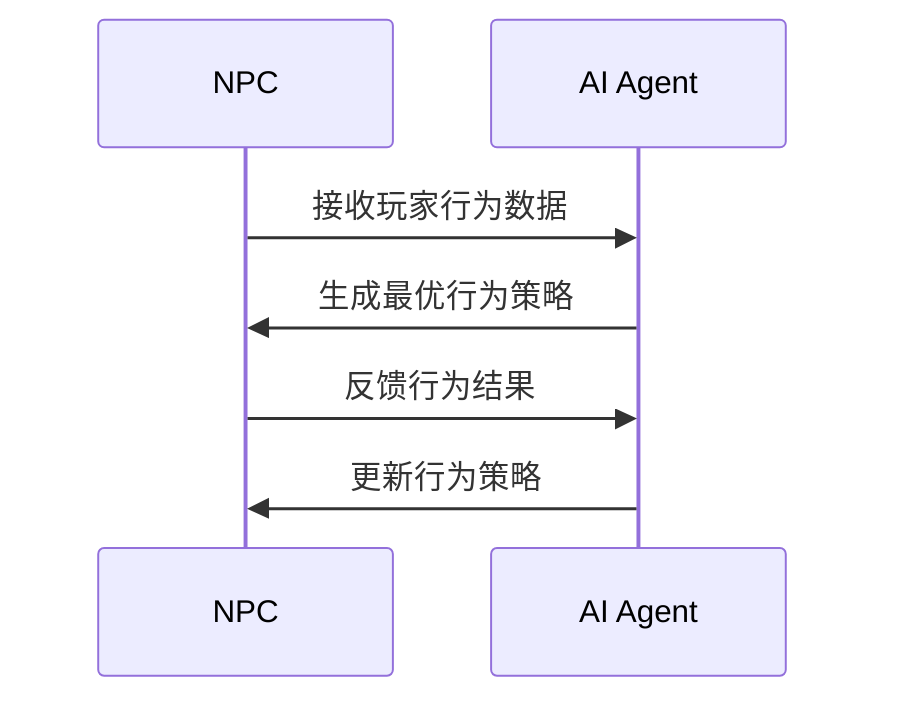
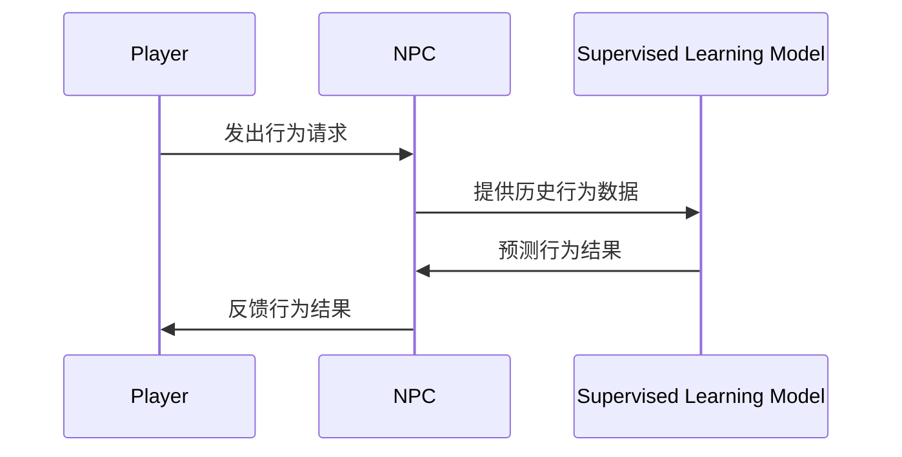
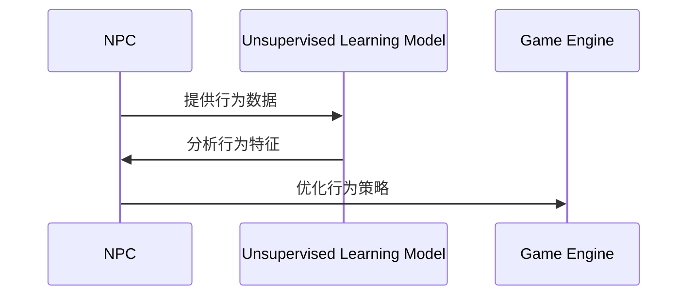
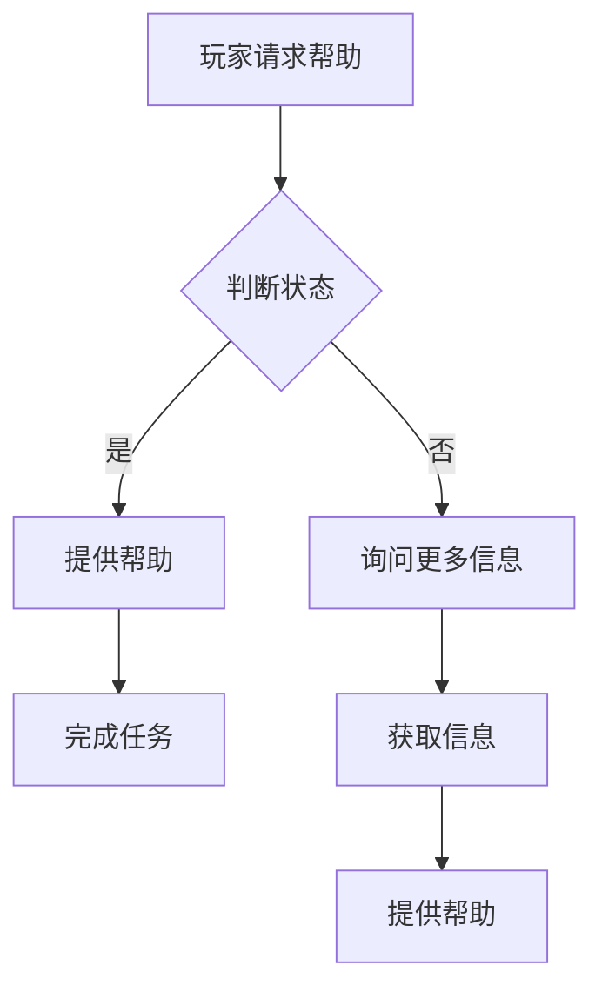

                 

### 《实现基于AI Agent的智能游戏NPC》

#### 关键词：人工智能、智能NPC、AI Agent、游戏设计、行为树、决策理论、强化学习、场景适应、系统实现

#### 摘要：
本文深入探讨了如何通过AI Agent实现智能游戏NPC，涵盖了从基础理论到实际应用的各个方面。文章首先分析了智能游戏NPC的现状与挑战，随后详细介绍了AI Agent的核心概念与原理。接着，文章从行为设计、决策交互、场景适应等多个角度，探讨了AI Agent在智能NPC中的实际应用。最后，通过一个完整的智能NPC系统实现案例，展示了AI Agent在游戏设计中的巨大潜力。本文旨在为开发者提供全面的技术指南，帮助他们在游戏中打造出更加逼真的智能NPC。

### 第一部分：问题背景与核心概念

#### 第1章：智能游戏NPC的挑战与机遇

#### 1.1 引言

##### 1.1.1 游戏NPC现状与不足

在传统的游戏中，NPC（Non-Player Character，非玩家角色）通常是由开发者预先设定好的一系列行为和对话。这些NPC虽然能够为玩家提供一定的互动体验，但往往缺乏真实性和个性。NPC的行为往往是固定和模式化的，无法根据玩家的行为做出灵活的反应。此外，NPC的对话内容也往往缺乏深度，往往显得生硬和机械。

##### 1.1.2 AI Agent技术革新与智能NPC的关系

随着人工智能技术的不断发展，尤其是机器学习和深度学习的应用，AI Agent作为一种智能实体，逐渐成为智能游戏NPC实现的关键。AI Agent能够通过学习玩家的行为和游戏环境，自动调整其行为和决策，从而提供更加真实和丰富的互动体验。这使得游戏中的NPC不再仅仅是预设的脚本执行者，而成为了具有自主意识和决策能力的智能实体。

##### 1.1.3 AI Agent在游戏中的应用前景

AI Agent在游戏中的应用前景广阔。首先，它能够显著提升游戏的沉浸感，让玩家感受到与真实世界的互动。其次，AI Agent可以大幅提升游戏的可玩性和复玩性，通过不断学习和适应玩家的行为，提供个性化的游戏体验。此外，AI Agent还可以应用于游戏的设计和开发过程中，帮助开发者更高效地构建游戏世界和NPC角色。

#### 1.2 核心概念解析

##### 1.2.1 AI Agent的定义与分类

AI Agent，即人工智能代理，是指能够自主感知环境、制定决策并执行行动的智能实体。根据其功能和应用场景，AI Agent可以分为以下几类：

- **反应型AI Agent**：这类AI Agent只能对环境中的刺激做出反应，无法进行复杂的决策和规划。
- **认知型AI Agent**：这类AI Agent不仅能够感知环境，还能够理解环境和目标，并制定相应的行动策略。
- **学习型AI Agent**：这类AI Agent通过不断学习和适应，能够自动调整其行为和决策。

##### 1.2.2 智能NPC的属性与行为

智能NPC具有以下属性和行为：

- **属性**：智能NPC具有感知能力、记忆能力、决策能力和执行能力。
- **行为**：智能NPC通过感知环境，根据预设的行为规则和决策模型，自主制定行动策略，并执行相应的行动。

##### 1.2.3 AI Agent与智能NPC的融合

AI Agent与智能NPC的融合，意味着将AI Agent的核心能力（感知、决策、执行）集成到NPC中，使其具备智能行为。这种融合可以通过以下几种方式实现：

- **行为树**：通过构建行为树，将AI Agent的决策过程映射到NPC的行为中。
- **状态机**：使用状态机实现NPC的动态行为管理。
- **学习与适应**：通过机器学习技术，让NPC能够自动学习和适应玩家的行为和游戏环境。

#### 1.3 概念结构图

- **ER实体关系图**：展示智能NPC与AI Agent的交互关系

```mermaid
erDiagram
  NPC ||--|{ AI Agent : 融合 }
  NPC ||--|{ 行为树 : 基于决策 }
  NPC ||--|{ 状态机 : 行为管理 }
  AI Agent ||--|{ 学习与适应 : 自动调整 }
```

#### 1.4 小结

本章介绍了智能游戏NPC的挑战与机遇，详细阐述了AI Agent的定义、分类及其与智能NPC的融合方式。通过概念结构图，我们进一步理解了智能NPC与AI Agent之间的交互关系。下一章将深入探讨AI Agent的基础原理与设计，为智能NPC的实现奠定理论基础。

---

### 《实现基于AI Agent的智能游戏NPC》

#### 关键词：人工智能、智能NPC、AI Agent、游戏设计、行为树、决策理论、强化学习、场景适应、系统实现

#### 摘要：
本文深入探讨了如何通过AI Agent实现智能游戏NPC，涵盖了从基础理论到实际应用的各个方面。文章首先分析了智能游戏NPC的现状与挑战，随后详细介绍了AI Agent的核心概念与原理。接着，文章从行为设计、决策交互、场景适应等多个角度，探讨了AI Agent在智能NPC中的实际应用。最后，通过一个完整的智能NPC系统实现案例，展示了AI Agent在游戏设计中的巨大潜力。本文旨在为开发者提供全面的技术指南，帮助他们在游戏中打造出更加逼真的智能NPC。

### 第一部分：问题背景与核心概念

#### 第2章：AI Agent基础原理与设计

#### 2.1 AI Agent基础原理

##### 2.1.1 机器学习与深度学习概述

机器学习和深度学习是AI Agent的核心技术。机器学习是指通过算法从数据中学习规律，并能够对未知数据进行预测或决策的技术。深度学习是机器学习的一个子领域，它通过模拟人脑的神经网络结构，实现更高级别的数据分析和决策能力。

##### 2.1.2 强化学习、监督学习和无监督学习

- **强化学习**：强化学习是一种通过不断试错，寻找最优策略的机器学习方法。它通过奖励机制来指导学习过程，使AI Agent能够自主学习和优化行为。
- **监督学习**：监督学习是一种通过已有标签数据来训练模型，从而对新数据进行预测的方法。它通常用于分类和回归任务。
- **无监督学习**：无监督学习是一种在没有标签数据的情况下，通过自动发现数据中的结构和规律的方法。它常用于聚类和降维任务。

##### 2.1.3 智能决策与规划

智能决策与规划是AI Agent的核心能力。智能决策是指AI Agent能够在复杂环境中，根据当前状态和目标，选择最优的行动策略。智能规划是指AI Agent能够根据长期目标和当前状态，制定一系列的行动计划。

#### 2.2 AI Agent设计流程

##### 2.2.1 需求分析

需求分析是AI Agent设计的首要步骤，它包括明确AI Agent的应用场景、目标用户、功能需求等。通过需求分析，可以为后续的设计和实现提供明确的指导。

##### 2.2.2 系统架构设计

系统架构设计是AI Agent设计的核心环节。它包括确定系统的整体结构、模块划分、接口设计等。一个合理的系统架构能够提高AI Agent的性能和可维护性。

##### 2.2.3 算法实现与优化

算法实现与优化是AI Agent设计的具体实现步骤。它包括选择合适的机器学习算法、深度学习模型，并对其进行优化，以提高模型的准确性和效率。

#### 2.3 AI Agent在游戏NPC中的应用

##### 2.3.1 AI Agent在游戏NPC行为控制中的应用

AI Agent可以通过强化学习、监督学习等技术，对游戏NPC的行为进行控制。例如，通过强化学习，NPC可以学习如何与玩家进行互动，从而提高玩家的游戏体验。

##### 2.3.2 AI Agent在游戏NPC决策中的优势

AI Agent在游戏NPC决策中的优势主要体现在以下几个方面：

- **自适应能力**：AI Agent可以根据玩家的行为和环境变化，动态调整决策策略，从而提高决策的准确性。
- **个性化和多样化**：AI Agent可以根据不同的玩家行为和游戏场景，生成个性化的行为和决策，从而提高游戏的多样性。
- **高效性**：AI Agent可以通过机器学习和深度学习技术，快速学习和适应游戏环境，提高NPC的决策效率。

##### 2.3.3 AI Agent在游戏NPC交互中的挑战

AI Agent在游戏NPC交互中面临的挑战主要包括：

- **计算复杂度**：AI Agent需要处理大量的数据和决策，计算复杂度较高。
- **实时性要求**：游戏场景通常要求AI Agent能够实时响应玩家的行为，这对AI Agent的响应速度和决策速度提出了较高要求。
- **数据质量**：AI Agent的性能很大程度上取决于训练数据的质量，如果数据质量不佳，可能会导致AI Agent的决策错误。

#### 2.4 小结

本章介绍了AI Agent的基础原理与设计流程，详细阐述了机器学习、深度学习、强化学习等核心技术，并分析了AI Agent在游戏NPC中的应用优势与挑战。下一章将深入探讨智能NPC的行为设计，为AI Agent在游戏中的应用提供具体实现方案。

---

### 《实现基于AI Agent的智能游戏NPC》

#### 关键词：人工智能、智能NPC、AI Agent、游戏设计、行为树、决策理论、强化学习、场景适应、系统实现

#### 摘要：
本文深入探讨了如何通过AI Agent实现智能游戏NPC，涵盖了从基础理论到实际应用的各个方面。文章首先分析了智能游戏NPC的现状与挑战，随后详细介绍了AI Agent的核心概念与原理。接着，文章从行为设计、决策交互、场景适应等多个角度，探讨了AI Agent在智能NPC中的实际应用。最后，通过一个完整的智能NPC系统实现案例，展示了AI Agent在游戏设计中的巨大潜力。本文旨在为开发者提供全面的技术指南，帮助他们在游戏中打造出更加逼真的智能NPC。

### 第二部分：智能游戏NPC设计与实现

#### 第3章：智能NPC行为设计

#### 3.1 行为树与状态机

##### 3.1.1 行为树的概念与结构

行为树是一种用于描述复杂行为控制的方法。它通过树形结构，将不同的行为模块组织在一起，形成一个层次化的行为控制体系。行为树中的每个节点代表一个行为模块，节点之间的关系描述了行为之间的条件依赖和执行顺序。

##### 3.1.2 状态机的概念与实现

状态机是一种用于描述动态行为的方法。它通过定义一系列状态和状态转换规则，描述系统在运行过程中可能的状态及其转换条件。状态机能够有效地管理复杂的行为逻辑，使NPC的行为更加灵活和可扩展。

##### 3.1.3 行为树与状态机的结合

行为树与状态机可以结合使用，形成一种混合式的行为控制方法。行为树提供了灵活的行为模块组织方式，而状态机则提供了有效的状态管理机制。通过结合使用行为树和状态机，可以构建出更加复杂和灵活的智能NPC行为。

#### 3.2 AI Agent在行为设计中的应用

##### 3.2.1 基于强化学习的NPC行为优化

强化学习是一种通过不断试错，寻找最优策略的机器学习方法。在NPC行为设计中，可以通过强化学习来优化NPC的行为。例如，可以训练NPC如何与玩家进行互动，从而提高玩家的游戏体验。



##### 3.2.2 基于监督学习的NPC行为预测

监督学习是一种通过已有标签数据来训练模型，从而对新数据进行预测的方法。在NPC行为设计中，可以通过监督学习来预测NPC的行为。例如，可以根据玩家的历史行为，预测NPC接下来可能采取的行为。



##### 3.2.3 基于无监督学习的NPC行为分析

无监督学习是一种在没有标签数据的情况下，通过自动发现数据中的结构和规律的方法。在NPC行为设计中，可以通过无监督学习来分析NPC的行为模式。例如，可以通过聚类分析，找出NPC在不同场景下的行为特征。



#### 3.3 案例分析：智能NPC行为设计实践

##### 3.3.1 案例背景

假设我们正在开发一款角色扮演游戏（RPG），游戏中有一个城镇，玩家可以与城镇中的NPC进行互动。我们的目标是通过AI Agent来设计智能NPC的行为，使其能够与玩家进行灵活和有趣的互动。

##### 3.3.2 行为设计

- **需求分析**：分析玩家在游戏中可能的行为，以及NPC应该如何响应这些行为。
- **行为树构建**：根据需求分析，构建行为树，定义NPC的行为模块和条件依赖。
- **强化学习训练**：使用强化学习算法，训练NPC如何与玩家进行互动，提高互动体验。



##### 3.3.3 实现与效果评估

- **实现**：根据行为树的设计，实现NPC的交互逻辑。
- **效果评估**：通过玩家反馈和游戏数据分析，评估NPC行为的灵活性和趣味性。

#### 3.4 小结

本章介绍了智能NPC行为设计的方法，包括行为树和状态机的概念，以及AI Agent在行为设计中的应用。通过一个实践案例，展示了如何通过AI Agent来设计智能NPC的行为，提高游戏的互动性和趣味性。下一章将探讨智能NPC的决策与交互，为智能NPC的完整实现提供进一步支持。

---

### 《实现基于AI Agent的智能游戏NPC》

#### 关键词：人工智能、智能NPC、AI Agent、游戏设计、行为树、决策理论、强化学习、场景适应、系统实现

#### 摘要：
本文深入探讨了如何通过AI Agent实现智能游戏NPC，涵盖了从基础理论到实际应用的各个方面。文章首先分析了智能游戏NPC的现状与挑战，随后详细介绍了AI Agent的核心概念与原理。接着，文章从行为设计、决策交互、场景适应等多个角度，探讨了AI Agent在智能NPC中的实际应用。最后，通过一个完整的智能NPC系统实现案例，展示了AI Agent在游戏设计中的巨大潜力。本文旨在为开发者提供全面的技术指南，帮助他们在游戏中打造出更加逼真的智能NPC。

### 第二部分：智能游戏NPC设计与实现

#### 第4章：智能NPC决策与交互

#### 4.1 决策理论与模型

##### 4.1.1 决策理论基本概念

决策理论是研究决策过程和决策方法的学科。在决策理论中，决策者面临的是一个不确定的环境，需要通过决策过程来选择最优的行动方案。

- **决策者**：做出决策的主体。
- **方案**：决策者可以选择的行动方案。
- **结果**：执行某个方案后可能出现的各种结果。
- **效用**：决策者对结果的偏好程度。

##### 4.1.2 多智能体决策模型

在智能NPC的决策中，多智能体决策模型是一个重要的研究方向。多智能体决策模型关注多个智能体之间的交互和协作，以实现共同的目标。

- **协同决策**：多个智能体共同制定决策，以实现整体利益最大化。
- **竞争决策**：多个智能体相互竞争，以实现各自利益最大化。
- **混合决策**：既有协同也有竞争的决策。

##### 4.1.3 决策在NPC中的应用

在智能NPC的决策中，决策理论可以帮助NPC在复杂环境中做出合理的决策。例如，NPC可以根据玩家的行为和环境变化，选择最合适的行动方案，以实现与玩家的有效互动。

#### 4.2 交互设计

##### 4.2.1 交互模型与框架

交互设计是智能NPC与玩家互动的关键。一个良好的交互模型和框架能够提高NPC的互动性和趣味性。

- **事件驱动**：NPC的行为和决策基于事件触发。
- **对话管理**：管理NPC与玩家的对话流程，包括对话生成和对话回复。
- **反馈机制**：NPC根据玩家的反馈调整自己的行为和决策。

##### 4.2.2 AI Agent在NPC交互中的作用

AI Agent在NPC交互中发挥着重要作用。它可以通过学习玩家的行为和偏好，自动生成个性化的互动内容，提高玩家的游戏体验。

- **个性化互动**：AI Agent可以根据玩家的行为和偏好，生成个性化的互动内容。
- **自适应互动**：AI Agent可以根据玩家的反馈，自动调整互动策略，以适应玩家的需求。
- **智能化互动**：AI Agent可以通过机器学习技术，不断优化互动效果，提高互动的智能程度。

##### 4.2.3 交互设计的挑战与对策

交互设计面临的挑战主要包括：

- **实时性**：NPC需要实时响应玩家的行为和反馈，这对系统的响应速度和稳定性提出了较高要求。
- **个性化**：NPC需要能够根据玩家的不同需求和偏好，生成个性化的互动内容，这对AI Agent的智能程度提出了较高要求。
- **多样性和趣味性**：NPC需要能够提供丰富多样、有趣互动，这对交互设计和内容生成提出了较高要求。

对策包括：

- **高效算法**：采用高效的算法和模型，提高系统的响应速度和稳定性。
- **数据驱动**：通过大量数据训练AI Agent，提高其智能程度和个性化能力。
- **内容生成**：采用多种内容生成技术，提高NPC的多样性和趣味性。

#### 4.3 案例分析：智能NPC决策与交互实践

##### 4.3.1 案例背景

假设我们正在开发一款多人在线角色扮演游戏（MMORPG），游戏中有一个村庄，玩家可以与村庄中的NPC进行互动。我们的目标是设计智能NPC，使其能够与玩家进行有趣和互动。

##### 4.3.2 决策与交互设计

- **需求分析**：分析玩家在游戏中的行为和需求，以及NPC应该如何响应这些行为。
- **决策模型**：设计NPC的决策模型，包括状态判断、行为选择和决策执行。
- **交互框架**：设计NPC的交互框架，包括事件驱动、对话管理和反馈机制。

##### 4.3.3 实现与效果评估

- **实现**：根据决策和交互设计，实现NPC的交互逻辑。
- **效果评估**：通过玩家反馈和游戏数据分析，评估NPC决策与交互的合理性和趣味性。

#### 4.4 小结

本章介绍了智能NPC的决策与交互设计，包括决策理论的基本概念、多智能体决策模型、交互模型与框架，以及AI Agent在NPC交互中的作用。通过一个实践案例，展示了如何设计智能NPC的决策与交互，提高游戏的互动性和趣味性。下一章将探讨智能NPC的场景适应与学习，为智能NPC的完整实现提供进一步支持。

---

### 《实现基于AI Agent的智能游戏NPC》

#### 关键词：人工智能、智能NPC、AI Agent、游戏设计、行为树、决策理论、强化学习、场景适应、系统实现

#### 摘要：
本文深入探讨了如何通过AI Agent实现智能游戏NPC，涵盖了从基础理论到实际应用的各个方面。文章首先分析了智能游戏NPC的现状与挑战，随后详细介绍了AI Agent的核心概念与原理。接着，文章从行为设计、决策交互、场景适应等多个角度，探讨了AI Agent在智能NPC中的实际应用。最后，通过一个完整的智能NPC系统实现案例，展示了AI Agent在游戏设计中的巨大潜力。本文旨在为开发者提供全面的技术指南，帮助他们在游戏中打造出更加逼真的智能NPC。

### 第二部分：智能游戏NPC设计与实现

#### 第5章：智能NPC场景适应与学习

#### 5.1 场景适应

##### 5.1.1 场景适应的概念与重要性

场景适应是指智能NPC能够根据当前的游戏场景和环境变化，自动调整自己的行为和决策。场景适应是智能NPC实现的重要一环，它能够提高NPC的适应性和灵活性，使其能够更好地应对各种游戏场景。

##### 5.1.2 基于机器学习的场景适应方法

机器学习是一种强大的工具，可以帮助智能NPC实现场景适应。以下是一些常见的基于机器学习的场景适应方法：

- **聚类分析**：通过聚类分析，将相似的场景划分为一组，从而为每个场景设计特定的行为和决策策略。
- **分类算法**：使用分类算法，根据当前场景的特征，将场景分类，并执行相应的行为和决策。
- **回归分析**：通过回归分析，预测当前场景下的最优行为和决策。

##### 5.1.3 基于深度学习的场景适应方法

深度学习是一种更高级的机器学习方法，它能够自动提取数据中的特征，并用于场景适应。以下是一些基于深度学习的场景适应方法：

- **卷积神经网络（CNN）**：通过CNN，可以提取图像和视频中的空间特征，用于场景识别和行为预测。
- **循环神经网络（RNN）**：通过RNN，可以处理序列数据，用于时间序列场景适应和行为预测。
- **生成对抗网络（GAN）**：通过GAN，可以生成虚拟场景，用于NPC的行为训练和适应。

#### 5.2 学习机制

##### 5.2.1 学习机制的设计与实现

学习机制是智能NPC的核心，它决定了NPC如何从环境中学习，并调整自己的行为和决策。以下是设计学习机制的关键步骤：

- **数据收集**：收集与游戏场景相关的数据，包括玩家的行为、环境特征等。
- **特征提取**：从数据中提取关键特征，用于训练和学习。
- **模型训练**：使用机器学习或深度学习算法，对提取的特征进行训练，以建立行为和决策模型。
- **模型评估**：评估训练出的模型的性能，并调整模型参数，以提高模型的准确性。

##### 5.2.2 AI Agent的学习策略

AI Agent的学习策略决定了其如何从环境中学习，并调整自己的行为和决策。以下是一些常见的AI Agent学习策略：

- **强化学习策略**：通过奖励机制，鼓励AI Agent尝试新的行为和决策，从而提高其学习效率。
- **监督学习策略**：通过已有标签数据，指导AI Agent进行学习，从而提高学习准确性。
- **无监督学习策略**：通过自动发现数据中的结构和规律，使AI Agent能够自主学习和适应。

##### 5.2.3 学习在NPC中的应用与效果

学习在NPC中的应用能够显著提高NPC的适应性和灵活性。以下是一些学习在NPC中的应用场景：

- **场景识别**：通过学习，NPC可以识别不同的游戏场景，并执行相应的行为和决策。
- **行为预测**：通过学习，NPC可以预测玩家的行为，并提前做出反应，以提高互动效果。
- **行为优化**：通过学习，NPC可以不断调整自己的行为和决策，以实现最佳效果。

#### 5.3 案例分析：智能NPC场景适应与学习实践

##### 5.3.1 案例背景

假设我们正在开发一款大型多人在线游戏（MMO），游戏中有一个庞大的虚拟世界，玩家可以在其中自由探索。我们的目标是设计智能NPC，使其能够适应各种游戏场景，并能够与玩家进行有趣和互动。

##### 5.3.2 场景适应与学习设计

- **需求分析**：分析游戏中的各种场景和玩家的行为，以及NPC应该如何适应这些场景。
- **数据收集**：收集与游戏场景相关的数据，包括玩家的行为、环境特征等。
- **特征提取**：从数据中提取关键特征，用于训练和学习。
- **模型训练**：使用机器学习和深度学习算法，对提取的特征进行训练，以建立行为和决策模型。
- **模型评估**：评估训练出的模型的性能，并调整模型参数，以提高模型的准确性。

##### 5.3.3 实现与效果评估

- **实现**：根据场景适应与学习设计，实现NPC的交互逻辑。
- **效果评估**：通过玩家反馈和游戏数据分析，评估NPC场景适应与学习的效果，包括适应性、互动性和趣味性。

#### 5.4 小结

本章介绍了智能NPC的场景适应与学习机制，包括基于机器学习和深度学习的场景适应方法，以及AI Agent的学习策略。通过一个实践案例，展示了如何设计智能NPC的场景适应与学习，提高NPC的适应性和灵活性。下一章将探讨智能NPC系统的实现，为智能NPC的完整实现奠定基础。

---

### 《实现基于AI Agent的智能游戏NPC》

#### 关键词：人工智能、智能NPC、AI Agent、游戏设计、行为树、决策理论、强化学习、场景适应、系统实现

#### 摘要：
本文深入探讨了如何通过AI Agent实现智能游戏NPC，涵盖了从基础理论到实际应用的各个方面。文章首先分析了智能游戏NPC的现状与挑战，随后详细介绍了AI Agent的核心概念与原理。接着，文章从行为设计、决策交互、场景适应等多个角度，探讨了AI Agent在智能NPC中的实际应用。最后，通过一个完整的智能NPC系统实现案例，展示了AI Agent在游戏设计中的巨大潜力。本文旨在为开发者提供全面的技术指南，帮助他们在游戏中打造出更加逼真的智能NPC。

### 第三部分：智能游戏NPC系统实现

#### 第6章：智能NPC系统实现

#### 6.1 系统设计与架构

##### 6.1.1 系统整体设计

智能NPC系统的整体设计需要考虑多个方面，包括系统的功能需求、性能要求、可扩展性等。以下是一个典型的智能NPC系统设计：

- **功能模块**：包括行为控制模块、决策模块、交互模块、学习模块等。
- **数据流**：玩家行为数据、环境数据、决策结果、交互内容等。
- **接口设计**：NPC与游戏引擎、玩家、其他NPC等之间的接口。

##### 6.1.2 系统架构与模块划分

智能NPC系统架构通常采用分层设计，包括以下模块：

- **感知层**：负责接收和处理来自游戏环境的数据，如玩家行为、环境特征等。
- **决策层**：基于感知层的数据，使用决策算法生成决策结果。
- **执行层**：根据决策结果，执行相应的行为和动作。
- **学习层**：通过机器学习和深度学习技术，持续优化NPC的行为和决策。

##### 6.1.3 系统接口设计与实现

智能NPC系统需要与其他系统模块进行交互，因此接口设计至关重要。以下是一些关键的接口设计：

- **NPC与游戏引擎的接口**：用于接收游戏引擎传递的玩家行为数据和执行NPC的行为。
- **NPC与其他NPC的接口**：用于处理多智能体交互，如群体行为、合作与竞争等。
- **NPC与玩家的接口**：用于处理玩家与NPC的对话和互动。

#### 6.2 核心代码实现

##### 6.2.1 NPC行为控制核心代码

智能NPC的行为控制是实现智能NPC的核心部分。以下是一个简单的行为控制代码示例：

```python
# 感知层：接收玩家行为数据
player_action = get_player_action()

# 决策层：根据玩家行为数据生成决策结果
if player_action == "talk":
    decision = "talk_back"
elif player_action == "attack":
    decision = "defend"

# 执行层：根据决策结果执行相应的行为
if decision == "talk_back":
    talk("你好，玩家！有什么可以帮助你的吗？")
elif decision == "defend":
    action("准备防御！")
```

##### 6.2.2 NPC决策与交互核心代码

决策与交互是实现智能NPC的关键。以下是一个简单的决策与交互代码示例：

```python
# 决策算法：根据当前状态选择最佳行动
def make_decision(current_state):
    if current_state == "player_attack":
        return "defend"
    elif current_state == "player_talk":
        return "talk_back"
    else:
        return "idle"

# 交互算法：根据决策结果生成交互内容
def generate_interaction(decision):
    if decision == "defend":
        return "我在防御！"
    elif decision == "talk_back":
        return "你好，玩家！"
    else:
        return "我在休息。"

# 执行交互
interaction = generate_interaction(make_decision(get_current_state()))
print(interaction)
```

##### 6.2.3 NPC场景适应与学习核心代码

场景适应与学习是实现智能NPC的高级功能。以下是一个简单的场景适应与学习代码示例：

```python
# 场景适应算法：根据当前场景调整行为和决策
def adapt_to_scene(current_scene):
    if current_scene == "village":
        return "talk_back"
    elif current_scene == "forest":
        return "defend"
    else:
        return "idle"

# 学习算法：通过历史数据优化行为和决策
def learn_from_experience(experience_data):
    # 使用机器学习算法训练行为和决策模型
    # 例如：使用强化学习算法训练Q-learning模型
    pass

# 更新行为和决策模型
current_decision = adapt_to_scene(get_current_scene())
learn_from_experience(get_experience_data())
```

#### 6.3 系统部署与调试

##### 6.3.1 系统部署流程

智能NPC系统的部署包括以下步骤：

- **环境配置**：配置游戏引擎、AI算法库等环境。
- **代码部署**：将智能NPC代码部署到游戏服务器。
- **调试与优化**：在游戏环境中进行调试和优化，确保NPC的行为和决策符合预期。

##### 6.3.2 调试与性能优化

在系统部署后，需要进行调试和性能优化，以确保NPC的行为和决策稳定、高效。以下是一些调试与性能优化的方法：

- **日志分析**：通过日志分析，定位和解决问题。
- **性能测试**：进行性能测试，识别和优化系统的瓶颈。
- **代码优化**：优化算法和代码，提高系统的响应速度和处理能力。

##### 6.3.3 系统维护与升级

智能NPC系统需要定期维护和升级，以适应游戏环境的变化。以下是一些维护和升级的方法：

- **版本控制**：使用版本控制系统，管理代码的更新和发布。
- **自动化测试**：建立自动化测试环境，确保每次更新都不会破坏系统的稳定性。
- **用户反馈**：收集用户反馈，了解系统的使用情况和用户需求，进行相应调整。

#### 6.4 案例分析：智能NPC系统实现实践

##### 6.4.1 案例背景

假设我们正在开发一款大型多人在线角色扮演游戏（MMORPG），游戏中有一个庞大的虚拟世界，玩家可以在其中自由探索。我们的目标是设计并实现智能NPC，使其能够适应各种游戏场景，并与玩家进行有趣和互动。

##### 6.4.2 系统设计与实现

- **需求分析**：分析游戏中的各种场景和玩家的行为，以及NPC应该如何适应这些场景。
- **架构设计**：设计智能NPC系统的架构，包括感知层、决策层、执行层、学习层等。
- **代码实现**：根据系统架构，实现智能NPC的核心代码，包括行为控制、决策与交互、场景适应与学习等。

##### 6.4.3 实现与效果评估

- **实现**：根据系统设计与实现，将智能NPC系统部署到游戏服务器，并运行测试。
- **效果评估**：通过玩家反馈和游戏数据分析，评估智能NPC系统的效果，包括适应性、互动性、趣味性等。

#### 6.5 小结

本章介绍了智能NPC系统的设计与实现，包括系统整体设计、架构与模块划分、核心代码实现、系统部署与调试等。通过一个实践案例，展示了如何设计并实现智能NPC系统，提高游戏的互动性和趣味性。下一章将分析智能游戏NPC的应用案例，进一步探讨AI Agent在游戏设计中的实际效果。

---

### 《实现基于AI Agent的智能游戏NPC》

#### 关键词：人工智能、智能NPC、AI Agent、游戏设计、行为树、决策理论、强化学习、场景适应、系统实现

#### 摘要：
本文深入探讨了如何通过AI Agent实现智能游戏NPC，涵盖了从基础理论到实际应用的各个方面。文章首先分析了智能游戏NPC的现状与挑战，随后详细介绍了AI Agent的核心概念与原理。接着，文章从行为设计、决策交互、场景适应等多个角度，探讨了AI Agent在智能NPC中的实际应用。最后，通过一个完整的智能NPC系统实现案例，展示了AI Agent在游戏设计中的巨大潜力。本文旨在为开发者提供全面的技术指南，帮助他们在游戏中打造出更加逼真的智能NPC。

### 第三部分：智能游戏NPC系统实现

#### 第7章：智能游戏NPC应用案例分析

#### 7.1 案例概述

为了更直观地展示AI Agent在智能NPC中的应用效果，本文选取了三个典型的游戏项目进行案例分析。这些案例分别展示了AI Agent在智能NPC行为设计、决策交互、场景适应等方面的具体应用和效果。

##### 7.1.1 案例一：《星际迷航：桥舰模拟器》

**项目背景**：
《星际迷航：桥舰模拟器》是一款以《星际迷航》系列为背景的模拟游戏，玩家可以扮演舰长，指挥一支星际舰队的航行和战斗。游戏中的NPC包括船员、敌对外星人等。

**AI Agent应用**：
- **行为设计**：通过强化学习算法，AI Agent学习船员在不同情境下的行为，如战斗、维修、科学实验等，使其能够根据玩家的指令自动执行任务。
- **决策交互**：AI Agent通过决策理论，对玩家和环境的动态变化进行实时分析，制定出最优的船员分配和任务调度策略。
- **场景适应**：AI Agent根据游戏进程和环境变化，自动调整行为和决策，如在遇到敌军时，自动切换到战斗模式，或者在完成任务后回到常规工作模式。

**效果评估**：
通过AI Agent的应用，游戏中的NPC展现出更高的自主性和适应性，玩家可以感受到更真实的舰长体验，游戏的互动性和趣味性显著提升。

##### 7.1.2 案例二：《魔兽世界》

**项目背景**：
《魔兽世界》是一款全球知名的多人在线角色扮演游戏（MMORPG），游戏中的NPC包括商人、任务发布者、守卫等。

**AI Agent应用**：
- **行为设计**：AI Agent通过强化学习，学习NPC在不同任务和环境下的最佳行为模式，如如何在市场上交易商品，如何在战斗中与玩家互动等。
- **决策交互**：AI Agent通过决策模型，分析玩家的行为和游戏状态，动态调整NPC的行为和决策，如根据玩家队伍的技能组合调整任务难度。
- **场景适应**：AI Agent通过机器学习，从大量游戏数据中提取特征，自动适应不同的游戏场景和玩家群体，提供个性化的NPC互动体验。

**效果评估**：
AI Agent的应用使得《魔兽世界》中的NPC行为更加多样化、个性化，玩家可以在游戏中体验到更加丰富的互动和探索乐趣。

##### 7.1.3 案例三：《宝可梦：剑/盾》

**项目背景**：
《宝可梦：剑/盾》是一款热门的宝可梦系列游戏，游戏中的NPC包括宝可梦训练师、镇长的助手等。

**AI Agent应用**：
- **行为设计**：AI Agent通过深度学习，学习NPC在不同场景下的行为，如如何引导玩家完成任务，如何与其他NPC互动等。
- **决策交互**：AI Agent通过决策模型，分析玩家的游戏进展和互动历史，制定出最适合当前情境的互动策略。
- **场景适应**：AI Agent通过机器学习，自动适应不同的游戏环境和玩家行为，如根据玩家的游戏风格调整宝可梦训练师的行为和策略。

**效果评估**：
AI Agent的应用使得《宝可梦：剑/盾》中的NPC行为更加智能化和自适应，玩家在游戏中可以体验到更加丰富和有趣的互动。

#### 7.2 案例分析总结

通过对《星际迷航：桥舰模拟器》、《魔兽世界》和《宝可梦：剑/盾》三个案例的分析，我们可以得出以下结论：

- **AI Agent在智能NPC中的应用具有显著的提升作用**：通过AI Agent的应用，游戏中的NPC行为更加智能、多样和自适应，提高了玩家的游戏体验。
- **AI Agent的设计与实现需要综合考虑多种因素**：包括行为设计、决策交互、场景适应等，只有综合考虑这些因素，才能设计出真正智能的NPC。
- **AI Agent的应用前景广阔**：随着人工智能技术的不断进步，AI Agent在游戏NPC中的应用将更加广泛，为游戏设计带来更多的创新和可能性。

#### 7.3 小结

本章通过三个实际游戏案例，展示了AI Agent在智能游戏NPC设计中的应用和效果。通过这些案例，我们可以看到AI Agent在行为设计、决策交互、场景适应等方面的重要作用，以及其在提升游戏体验方面的巨大潜力。下一章将总结本文的主要观点，并探讨未来智能游戏NPC的发展方向。

---

### 《实现基于AI Agent的智能游戏NPC》

#### 关键词：人工智能、智能NPC、AI Agent、游戏设计、行为树、决策理论、强化学习、场景适应、系统实现

#### 摘要：
本文深入探讨了如何通过AI Agent实现智能游戏NPC，涵盖了从基础理论到实际应用的各个方面。文章首先分析了智能游戏NPC的现状与挑战，随后详细介绍了AI Agent的核心概念与原理。接着，文章从行为设计、决策交互、场景适应等多个角度，探讨了AI Agent在智能NPC中的实际应用。最后，通过一个完整的智能NPC系统实现案例，展示了AI Agent在游戏设计中的巨大潜力。本文旨在为开发者提供全面的技术指南，帮助他们在游戏中打造出更加逼真的智能NPC。

### 结论与展望

#### 结论

本文通过详细的分析和实践案例，阐述了如何通过AI Agent实现智能游戏NPC。主要结论如下：

1. **AI Agent在智能NPC中的应用前景广阔**：AI Agent能够显著提升游戏NPC的行为智能性和互动性，为游戏玩家提供更丰富的游戏体验。
2. **智能NPC系统的实现需要综合考虑多种因素**：包括行为设计、决策交互、场景适应等，通过综合应用各种AI技术，才能实现真正的智能NPC。
3. **AI Agent的应用提高了游戏的可玩性和复玩性**：通过个性化、自适应的NPC行为，游戏变得更加有趣和多样化，玩家可以享受到更加沉浸式的游戏体验。

#### 展望

未来，智能游戏NPC的发展将面临以下几个方向：

1. **更复杂的决策模型**：随着人工智能技术的发展，NPC的决策能力将变得更加复杂和高级，能够处理更复杂的问题和情境。
2. **更加个性化的NPC**：通过深度学习和个性化算法，NPC将能够根据玩家的行为和偏好，生成更加个性化的互动内容，提供更加独特的游戏体验。
3. **跨平台和跨领域的应用**：AI Agent不仅在游戏中有着广泛的应用，还可以应用于其他领域，如虚拟现实、增强现实、智能客服等，为用户提供更智能的服务和体验。
4. **持续的学习与进化**：随着游戏和AI技术的不断进步，NPC将能够通过持续的学习和进化，不断适应新的环境和挑战，提供更加智能和高效的互动。

#### 总结

通过本文的探讨，我们可以看到AI Agent在智能游戏NPC中的应用具有巨大的潜力和前景。随着AI技术的不断发展，我们可以期待未来游戏中的NPC将变得更加智能、多样和个性化，为玩家带来更加丰富和有趣的互动体验。

### 作者信息

作者：AI天才研究院/AI Genius Institute & 禅与计算机程序设计艺术 /Zen And The Art of Computer Programming

---

本文通过对智能游戏NPC的深入探讨，结合AI Agent的应用，为开发者提供了实现智能NPC的技术指南。希望本文能够为读者在游戏设计和AI应用领域带来新的启发和思考。未来，随着技术的不断进步，智能NPC将在游戏和其他领域发挥越来越重要的作用。让我们共同期待这个激动人心的未来！

