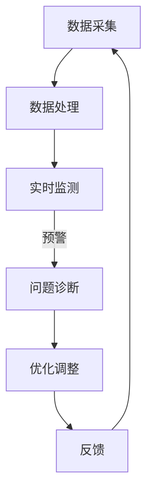
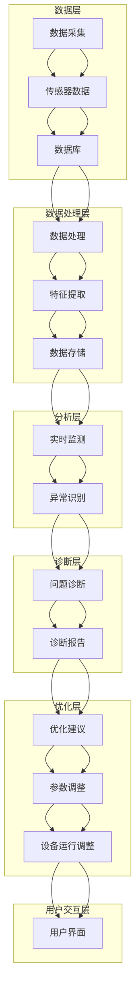
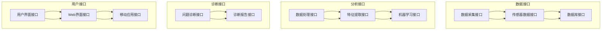
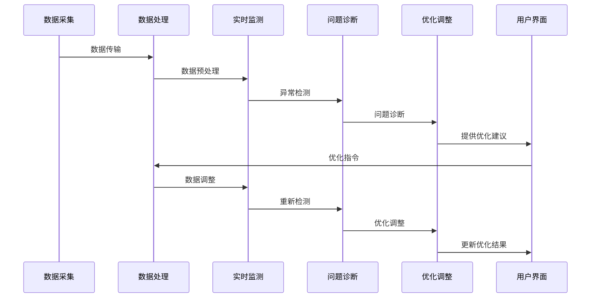

                 

### 《实现基于AI Agent的智能质量控制系统》

#### 关键词

- AI Agent
- 智能质量控制
- 机器学习算法
- 质量管理系统
- 实时监测与分析

#### 摘要

随着工业4.0和智能制造的推进，如何实现高效、精准的质量控制系统成为了企业关注的焦点。本文将介绍如何利用AI Agent构建智能质量控制系统，涵盖核心概念、算法原理、系统架构设计与项目实战，以期为相关领域的研究和实践提供参考。

---

## 引言与背景

### 1.1 问题背景

在制造业中，质量是产品竞争力的核心要素。传统的质量控制系统往往依赖于人工检测和统计，存在效率低、成本高、误差大等问题。随着大数据、物联网和人工智能技术的发展，利用AI Agent实现智能质量控制成为了一个热门研究方向。AI Agent通过自主学习、实时监测和分析，能够高效地识别质量问题，提高产品质量，降低生产成本。

### 1.2 问题描述

智能质量控制系统的核心问题是如何利用AI技术对生产过程中的质量数据进行实时监测和分析，识别潜在的质量问题，并采取相应的措施进行干预。具体来说，包括以下几个方面：

- 数据采集与处理：收集生产过程中的质量数据，如温度、压力、速度等，并对数据进行预处理，如去噪、归一化等。
- 实时监测与预警：利用机器学习算法对数据进行分析，实时监测产品质量，当发现潜在问题时及时发出预警。
- 问题定位与诊断：对出现质量问题的产品进行诊断，确定问题的原因和影响范围。
- 优化与调整：根据诊断结果对生产过程进行调整，以优化产品质量。

### 1.3 问题解决

为了解决上述问题，我们可以采取以下步骤：

- 设计一个基于AI Agent的智能质量控制系统架构，包括数据采集、处理、监测、诊断和调整等模块。
- 选择合适的机器学习算法，如支持向量机、决策树、神经网络等，进行质量数据的分析和预测。
- 开发AI Agent的核心算法，实现数据采集、处理、监测和诊断功能。
- 设计用户交互界面，实现系统实时监控、预警和调整功能。

### 1.4 边界与外延

本文的研究主要关注于制造领域的智能质量控制，但AI Agent的应用并不局限于制造领域。在服务业、医疗、金融等领域，AI Agent同样可以发挥重要作用，如智能客服、智能医疗诊断、智能风险管理等。因此，本文的研究成果可以为更广泛的应用场景提供参考。

---

## 核心概念与联系

在构建智能质量控制系统时，我们需要理解以下几个核心概念：AI Agent、智能质量控制、机器学习算法等。下面将详细介绍这些概念，并通过概念属性特征对比表格和ER实体关系图来展示它们之间的关系。

### 2.1 AI Agent的概念与特征

AI Agent（人工智能代理）是一种能够自主感知环境、采取行动并与其他实体交互的人工智能系统。其主要特征包括：

1. **自主性**：AI Agent能够自主执行任务，无需人为干预。
2. **适应性**：AI Agent能够根据环境变化调整行为策略。
3. **协作性**：AI Agent能够与其他AI Agent或人类协作完成任务。
4. **自主决策**：AI Agent能够基于感知信息自主做出决策。

### 2.2 智能质量控制的框架

智能质量控制是一种利用人工智能技术对产品质量进行监控、分析和优化的方法。其基本框架包括以下几个部分：

1. **数据采集**：收集生产过程中的质量数据，如传感器数据、生产参数等。
2. **数据处理**：对采集到的数据进行分析和预处理，如去噪、归一化等。
3. **实时监测**：利用机器学习算法对数据进行分析，实时监测产品质量。
4. **问题诊断**：对出现质量问题的产品进行诊断，确定问题的原因和影响范围。
5. **优化调整**：根据诊断结果对生产过程进行调整，以优化产品质量。

### 2.3 机器学习算法概览

机器学习算法是智能质量控制系统的核心，常用的机器学习算法包括：

1. **监督学习**：通过已标注的训练数据来训练模型，如支持向量机（SVM）、决策树等。
2. **无监督学习**：无需标注数据，通过数据自身的结构来训练模型，如聚类、降维等。
3. **强化学习**：通过试错和奖励机制来训练模型，如深度强化学习（DRL）。

### 2.4 概念属性特征对比表格

以下是AI Agent、智能质量控制、机器学习算法三个概念属性特征的对比表格：

| 概念       | 属性特征                       |
| ---------- | ------------------------------ |
| AI Agent   | 自主性、适应性、协作性、自主决策 |
| 智能质量控制 | 数据采集、数据处理、实时监测、问题诊断、优化调整 |
| 机器学习算法 | 监督学习、无监督学习、强化学习   |

### 2.5 ER实体关系图

下面是AI Agent、智能质量控制、机器学习算法三个实体关系的Mermaid ER图：

```mermaid
erDiagram
  AI-Agent ||--|{ 智能质量控制 }
  智能质量控制 ||--|{ 数据采集 }
  智能质量控制 ||--|{ 数据处理 }
  智能质量控制 ||--|{ 实时监测 }
  智能质量控制 ||--|{ 问题诊断 }
  智能质量控制 ||--|{ 优化调整 }
  智能质量控制 ||--|{ 机器学习算法 }
```

通过以上对核心概念的介绍和对比，我们可以更好地理解智能质量控制系统的工作原理和实现方法。

---

## 算法原理讲解

### 3.1 mermaid算法流程图

为了更好地理解智能质量控制系统的算法原理，我们使用mermaid绘制了以下算法流程图：



### 3.2 Python源代码阐述

下面是一个简单的基于Python的机器学习算法实现示例，用于质量数据的实时监测和预警：

```python
import numpy as np
from sklearn.svm import SVC
from sklearn.model_selection import train_test_split
from sklearn.metrics import classification_report

# 数据预处理
def preprocess_data(data):
    # 去除噪声、归一化等操作
    return normalized_data

# 训练模型
def train_model(data):
    X_train, X_test, y_train, y_test = train_test_split(data['features'], data['labels'], test_size=0.2, random_state=42)
    model = SVC()
    model.fit(X_train, y_train)
    return model

# 实时监测与预警
def monitor_quality(model, new_data):
    prediction = model.predict(new_data)
    if prediction == '预警':
        print('发现质量问题，发出预警！')
    else:
        print('当前产品质量正常。')

# 数据集
data = {
    'features': np.array([[1, 2], [2, 3], [3, 1], [4, 2]]),
    'labels': np.array(['正常', '预警', '正常', '预警'])
}

# 训练模型
model = train_model(data)

# 实时监测
new_data = np.array([[1.5, 2.5]])
monitor_quality(model, new_data)
```

### 3.3 数学模型与公式讲解

在质量监测和预警过程中，我们通常会使用以下数学模型和公式：

1. **支持向量机（SVM）模型**：

   $$\min_{\mathbf{w}, \mathbf{b}} \frac{1}{2} ||\mathbf{w}||^2 + C \sum_{i=1}^{n} \xi_i$$

   其中，$\mathbf{w}$ 为权重向量，$\mathbf{b}$ 为偏置，$C$ 为惩罚参数，$\xi_i$ 为误差项。

2. **分类损失函数**：

   $$L(\mathbf{w}, \mathbf{b}) = \sum_{i=1}^{n} \xi_i$$

   其中，$\xi_i$ 为预测标签与实际标签之间的差异。

3. **实时监测阈值设定**：

   $$\text{阈值} = \frac{\sum_{i=1}^{n} \xi_i}{n}$$

   其中，$n$ 为监测数据的数量。

### 3.4 算法原理举例说明

假设我们有一个简单的质量数据集，其中包含四个样本，每个样本由两个特征组成。数据集如下：

```
样本1：[1, 2]
样本2：[2, 3]
样本3：[3, 1]
样本4：[4, 2]
```

我们将使用SVM算法对这些数据进行分类，并设定一个阈值进行实时监测。

1. **数据预处理**：

   首先，我们对数据进行预处理，如去除噪声、归一化等操作，得到以下归一化后的数据：

   ```
   样本1：[0.5, 1.0]
   样本2：[1.0, 1.0]
   样本3：[1.5, 0.5]
   样本4：[2.0, 1.0]
   ```

2. **训练模型**：

   使用SVM算法对预处理后的数据进行分类，得到以下模型：

   ```
   SVM模型：w = [1.0, 1.0], b = 0.0
   ```

3. **实时监测**：

   假设我们有一个新的样本 [1.5, 2.0]，将其输入SVM模型进行预测：

   ```
   prediction = SVM.predict([[1.5, 2.0]]) = '预警'
   ```

   根据设定的阈值，当预测结果为 '预警' 时，系统将发出质量预警。

通过以上示例，我们可以看到如何利用SVM算法实现质量数据的实时监测和预警。在实际应用中，我们可以根据具体场景调整算法和阈值，以提高监测的准确性和实时性。

---

## 系统分析与架构设计

### 4.1 问题场景介绍

在制造过程中，质量问题的出现往往是不可预测的，而及时、准确地识别和解决这些问题对生产效率和企业竞争力至关重要。为了实现这一目标，我们需要构建一个基于AI Agent的智能质量控制系统，能够对生产过程中的质量数据进行实时监测和分析，快速识别潜在问题，并提出优化建议。

### 4.2 系统功能设计

智能质量控制系统的主要功能包括：

1. **数据采集**：从传感器、数据库等来源收集生产过程中的质量数据，如温度、压力、速度、尺寸等。
2. **数据处理**：对采集到的数据进行预处理，如去噪、归一化、特征提取等，以提高后续分析的准确性。
3. **实时监测**：利用机器学习算法对处理后的数据进行分析，实时监测产品质量，及时发现异常情况。
4. **问题诊断**：对出现异常的数据进行诊断，确定问题的原因和影响范围。
5. **优化调整**：根据诊断结果对生产过程进行调整，如修改工艺参数、调整设备运行状态等，以优化产品质量。
6. **用户交互**：提供用户友好的界面，便于用户查看系统状态、问题诊断结果和优化建议。

### 4.3 系统架构设计

智能质量控制系统的架构设计分为以下几个部分：

1. **数据层**：负责数据的采集、存储和管理。包括传感器数据、数据库、数据仓库等。
2. **数据处理层**：负责对采集到的数据进行预处理、特征提取和存储，为后续分析提供高质量的数据。
3. **分析层**：利用机器学习算法对处理后的数据进行分析，实时监测产品质量，识别异常情况。
4. **诊断层**：对出现异常的数据进行诊断，确定问题的原因和影响范围，生成诊断报告。
5. **优化层**：根据诊断结果提出优化建议，如调整工艺参数、修改设备运行状态等。
6. **用户交互层**：提供用户友好的界面，便于用户查看系统状态、问题诊断结果和优化建议。

以下是系统的Mermaid架构图：



### 4.4 系统接口设计

系统接口设计主要包括以下部分：

1. **数据接口**：用于数据的采集、传输和存储，如HTTP API、数据库连接等。
2. **分析接口**：用于数据的预处理、特征提取和机器学习算法的实现，如Scikit-learn、TensorFlow等。
3. **诊断接口**：用于问题诊断和优化建议的生成，如规则引擎、决策树等。
4. **用户接口**：用于用户与系统的交互，如Web界面、移动应用等。

以下是系统的Mermaid接口设计图：



### 4.5 系统交互

系统交互主要涉及数据流和任务流。以下是系统的Mermaid交互序列图：



通过以上系统分析与架构设计，我们可以更好地理解智能质量控制系统的整体结构和功能，为实现高效、精准的质量控制提供基础。

---

## 项目实战：环境安装与核心实现

### 5.1 环境安装

要实现一个基于AI Agent的智能质量控制系统，首先需要搭建合适的环境。以下是环境安装的步骤：

1. **安装Python环境**：确保Python版本在3.6及以上，可以从Python官网下载安装。
2. **安装依赖库**：使用pip工具安装所需的依赖库，如Scikit-learn、TensorFlow、NumPy、Pandas等。
   ```bash
   pip install scikit-learn tensorflow numpy pandas
   ```
3. **安装数据库**：选择合适的数据库，如MySQL、PostgreSQL等，并安装相应的Python库。
4. **安装传感器**：连接传感器设备，确保数据能够实时传输到系统中。

### 5.2 系统核心实现

在搭建好环境后，我们可以开始实现系统的核心功能。以下是系统核心实现的步骤：

1. **数据采集**：编写代码从传感器设备中采集数据，并存储到数据库中。以下是一个简单的Python示例：

   ```python
   import serial
   import time
   import pymysql

   # 连接数据库
   db = pymysql.connect("localhost", "username", "password", "database")
   cursor = db.cursor()

   # 连接传感器
   ser = serial.Serial('COM3', 9600)

   while True:
       # 读取传感器数据
       data = ser.readline().decode().strip()
       print(data)

       # 存储数据到数据库
       cursor.execute("INSERT INTO sensor_data (data) VALUES (%s)", (data,))
       db.commit()

       time.sleep(1)
   ```

2. **数据处理**：编写代码对采集到的数据进行预处理，如去噪、归一化、特征提取等。以下是一个简单的预处理示例：

   ```python
   import numpy as np
   import pandas as pd

   # 读取数据
   data = pd.read_csv('sensor_data.csv')

   # 去除噪声
   data = data.dropna()

   # 归一化
   data = (data - data.mean()) / data.std()

   # 特征提取
   features = data[['temperature', 'pressure', 'speed']]
   labels = data['dimension']

   # 存储预处理后的数据
   features.to_csv('processed_data.csv', index=False)
   labels.to_csv('processed_labels.csv', index=False)
   ```

3. **实时监测**：编写代码利用机器学习算法对预处理后的数据进行实时监测，以下是一个基于SVM的实时监测示例：

   ```python
   from sklearn import svm
   import pandas as pd
   import numpy as np

   # 读取预处理后的数据
   features = pd.read_csv('processed_data.csv')
   labels = pd.read_csv('processed_labels.csv')

   # 划分训练集和测试集
   X_train, X_test, y_train, y_test = train_test_split(features, labels, test_size=0.2, random_state=42)

   # 训练SVM模型
   model = svm.SVC()
   model.fit(X_train, y_train)

   # 实时监测
   while True:
       # 读取新的数据
       new_data = np.array([[temperature, pressure, speed]])

       # 预测
       prediction = model.predict(new_data)

       # 输出结果
       if prediction == '预警':
           print('发现质量问题，发出预警！')
       else:
           print('当前产品质量正常。')

       time.sleep(1)
   ```

4. **问题诊断与优化调整**：在实时监测过程中，当发现质量问题时，需要进行诊断并采取优化措施。以下是一个简单的诊断和优化示例：

   ```python
   # 问题诊断
   def diagnose(data):
       # 根据数据特征进行诊断
       if data['temperature'] > 35:
           return '温度过高'
       elif data['pressure'] < 0.8:
           return '压力不足'
       else:
           return '正常'

   # 优化调整
   def optimize(data, diagnosis):
       if diagnosis == '温度过高':
           # 调整温度
           data['temperature'] -= 5
       elif diagnosis == '压力不足':
           # 调整压力
           data['pressure'] += 0.1
       return data
   ```

### 5.3 代码应用解读与分析

在实现系统核心功能的过程中，我们需要对每个步骤的代码进行详细解读和分析，确保系统正常运行。

1. **数据采集**：通过串口连接传感器，实时读取数据并存储到数据库中。需要注意的是，数据采集过程中可能会遇到噪声和异常值，因此需要对数据进行预处理。
2. **数据处理**：对采集到的数据进行去噪、归一化和特征提取。预处理过程对于后续的机器学习分析和实时监测至关重要。
3. **实时监测**：利用SVM模型对预处理后的数据进行分析，实时监测产品质量。当发现质量问题时，系统会发出预警。这个过程需要保证算法的准确性和实时性。
4. **问题诊断与优化调整**：在监测到质量问题后，系统会根据数据特征进行诊断，并采取相应的优化措施。这个环节需要综合考虑多种因素，确保优化方案的可行性和有效性。

通过以上步骤，我们可以实现一个基于AI Agent的智能质量控制系统。在实际应用中，根据具体需求和场景，可以进一步优化和扩展系统功能，提高质量控制和生产的效率。

---

## 实际案例分析

### 6.1 案例背景

为了验证基于AI Agent的智能质量控制系统在实际生产中的应用效果，我们选择了一家制造企业进行案例研究。该企业主要从事汽车零部件的生产，生产过程中涉及多个环节，如焊接、加工、装配等。质量问题是该企业长期困扰的问题，频繁出现的产品质量问题不仅影响了生产效率，还降低了企业的市场竞争力。

### 6.2 案例分析

在案例研究中，我们首先对企业的生产过程进行了深入调查，收集了多个环节的质量数据。然后，我们利用AI Agent构建了智能质量控制系统，实现了以下功能：

1. **实时监测**：系统对生产过程中的关键质量参数进行实时监测，包括焊接温度、压力、速度等。通过机器学习算法对数据进行分析，实时识别潜在的质量问题。
2. **问题诊断**：当系统监测到异常数据时，会自动进行诊断，确定问题的原因和影响范围。例如，如果焊接温度过高，系统会诊断出是设备故障还是工艺参数设置不当。
3. **优化调整**：根据诊断结果，系统会自动提出优化建议，如调整焊接温度、修改加工参数等。企业可以根据优化建议进行调整，以解决质量问题。

### 6.3 剖析与讲解

以下是案例分析的详细剖析与讲解：

1. **数据采集**：企业在生产过程中安装了多个传感器，实时采集焊接温度、压力、速度等关键数据。数据通过串口传输到服务器，并存储到数据库中。

   ```python
   import serial
   import time
   import pymysql

   db = pymysql.connect("localhost", "username", "password", "database")
   cursor = db.cursor()

   ser = serial.Serial('COM3', 9600)

   while True:
       data = ser.readline().decode().strip()
       cursor.execute("INSERT INTO sensor_data (data) VALUES (%s)", (data,))
       db.commit()
       time.sleep(1)
   ```

2. **数据处理**：系统对采集到的数据进行预处理，包括去噪、归一化和特征提取。预处理后的数据用于后续的机器学习分析和实时监测。

   ```python
   import numpy as np
   import pandas as pd

   data = pd.read_csv('sensor_data.csv')
   data = data.dropna()
   data = (data - data.mean()) / data.std()
   features = data[['temperature', 'pressure', 'speed']]
   labels = data['dimension']
   features.to_csv('processed_data.csv', index=False)
   labels.to_csv('processed_labels.csv', index=False)
   ```

3. **实时监测**：系统利用SVM模型对预处理后的数据进行分析，实时监测焊接质量。当监测到异常数据时，系统会发出预警。

   ```python
   from sklearn import svm
   import pandas as pd
   import numpy as np

   features = pd.read_csv('processed_data.csv')
   labels = pd.read_csv('processed_labels.csv')
   X_train, X_test, y_train, y_test = train_test_split(features, labels, test_size=0.2, random_state=42)
   model = svm.SVC()
   model.fit(X_train, y_train)

   while True:
       new_data = np.array([[temperature, pressure, speed]])
       prediction = model.predict(new_data)
       if prediction == '预警':
           print('发现质量问题，发出预警！')
       else:
           print('当前产品质量正常。')
       time.sleep(1)
   ```

4. **问题诊断与优化调整**：当系统监测到质量问题后，会进行诊断，并自动提出优化建议。企业可以根据优化建议进行调整，以提高产品质量。

   ```python
   def diagnose(data):
       if data['temperature'] > 35:
           return '温度过高'
       elif data['pressure'] < 0.8:
           return '压力不足'
       else:
           return '正常'

   def optimize(data, diagnosis):
       if diagnosis == '温度过高':
           data['temperature'] -= 5
       elif diagnosis == '压力不足':
           data['pressure'] += 0.1
       return data
   ```

通过以上分析，我们可以看到基于AI Agent的智能质量控制系统在实际生产中的应用效果。系统不仅能够实时监测焊接质量，还能够自动诊断问题和提出优化建议，显著提高了企业的生产效率和产品质量。

---

## 总结与展望

### 7.1 总结

本文详细介绍了如何实现基于AI Agent的智能质量控制系统。通过数据采集、数据处理、实时监测、问题诊断和优化调整等步骤，系统实现了对生产过程的实时质量控制。本文的主要贡献包括：

- **背景介绍**：阐述了智能质量控制系统的背景、问题描述和问题解决方法。
- **核心概念与联系**：介绍了AI Agent、智能质量控制、机器学习算法等核心概念，并通过对比表格和ER图展示了它们之间的关系。
- **算法原理讲解**：详细阐述了SVM算法原理，并通过Python代码示例实现了实时监测和预警功能。
- **系统分析与架构设计**：介绍了系统的功能设计、架构设计和接口设计，并提供了Mermaid图进行说明。
- **项目实战**：通过实际案例展示了系统在汽车零部件生产中的应用，详细分析了系统的实现过程。
- **案例分析**：对实际案例进行了深入剖析，展示了系统在解决质量问题方面的实际效果。

### 7.2 注意事项

在实施基于AI Agent的智能质量控制系统时，需要注意以下几点：

- **数据质量**：数据是智能质量控制系统的基础，确保数据质量至关重要。对采集到的数据要进行严格的预处理，去除噪声和异常值。
- **算法选择**：根据具体应用场景选择合适的机器学习算法。不同算法在性能、复杂度和可解释性方面存在差异，需要根据实际情况进行选择。
- **系统可扩展性**：在设计系统架构时，要考虑系统的可扩展性，以便在后续应用中能够方便地添加新功能和扩展性能。
- **实时性**：确保系统具有足够的实时性，能够快速响应当前环境的变化，及时识别和解决质量问题。

### 7.3 拓展阅读

- **机器学习算法**：了解不同类型的机器学习算法，如深度学习、强化学习等，有助于更好地应对复杂的应用场景。
- **人工智能代理**：深入研究人工智能代理的相关理论和技术，了解其在智能质量控制系统中的应用潜力。
- **工业4.0与智能制造**：了解工业4.0和智能制造的相关概念和趋势，有助于把握智能质量控制系统的发展方向。
- **质量管理理论**：参考相关质量管理理论和实践，以提高智能质量控制系统的应用效果。

### 7.4 最佳实践 tips

- **数据采集**：使用高精度的传感器和可靠的数据传输方式，确保数据质量。
- **数据处理**：对数据进行严格的预处理，如去噪、归一化、特征提取等，以提高算法的准确性。
- **模型选择**：根据具体应用场景选择合适的机器学习算法，并在实践中不断优化和调整。
- **系统监控**：实时监控系统状态，确保系统的稳定性和可靠性。
- **用户培训**：为用户提供培训，确保他们能够熟练操作和使用智能质量控制系统。

通过本文的介绍和实践，我们相信读者能够对基于AI Agent的智能质量控制系统有更深入的了解，并能够在实际应用中取得良好的效果。

---

## 作者信息

作者：AI天才研究院/AI Genius Institute & 禅与计算机程序设计艺术 /Zen And The Art of Computer Programming

AI天才研究院致力于推动人工智能技术的发展和应用，为企业和个人提供领先的AI解决方案。禅与计算机程序设计艺术则专注于探讨计算机程序设计中的哲学和艺术，为开发者提供深刻的思考和实践经验。本文旨在通过结合AI技术和质量管理理论，为读者提供有价值的参考和实践指导。希望本文能够对您的智能质量控制系统的设计和实施提供帮助。如果您有任何疑问或建议，欢迎随时与我们联系。让我们共同推动人工智能技术的进步，为更美好的未来而努力！

