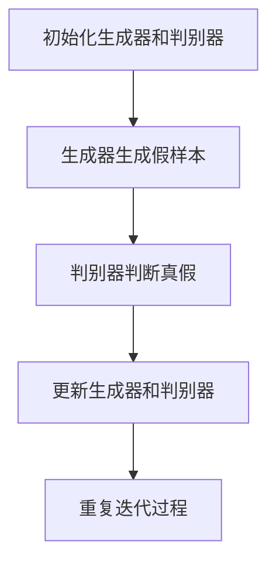

                 

### 文章标题

# 《对抗生成网络在AI Agent开发中的应用》

### 文章关键词

- 对抗生成网络（GAN）
- AI Agent
- 生成对抗训练
- 生成器与判别器
- 人工智能应用场景

### 文章摘要

本文深入探讨了对抗生成网络（GAN）在AI Agent开发中的应用。首先，我们简要介绍了GAN的背景及其核心概念，包括生成器、判别器和生成对抗训练过程。随后，我们详细分析了GAN的数学模型和工作原理，并对比了GAN与传统生成模型的特性。接着，本文重点探讨了GAN在AI Agent开发中的应用场景和实际案例，最后，给出了GAN开发实战的具体步骤和注意事项。通过本文的阅读，读者将全面了解GAN在AI Agent开发中的潜力与应用。

----------------------------------------------------------------

### 目录大纲

# 《对抗生成网络在AI Agent开发中的应用》

## 第一部分：基础理论与概述

## 第1章：问题背景与核心概念

### 1.1 问题背景

#### 1.1.1 人工智能发展的需求

随着人工智能技术的飞速发展，AI Agent作为一种能够自主执行任务、与环境互动的智能体，在各个领域（如游戏、虚拟助手、自然语言处理等）展现出广泛的应用前景。然而，AI Agent的训练和开发面临诸多挑战，其中一个重要问题是如何生成多样化的、高质量的训练数据。

#### 1.1.2 对抗生成网络的诞生与发展

为了解决上述问题，对抗生成网络（GAN）应运而生。GAN自2014年由Ian Goodfellow等人提出以来，受到了广泛关注，并在图像生成、语音合成等领域取得了显著成果。GAN的核心思想是通过生成器和判别器的对抗训练，生成逼真的数据。

#### 1.1.3 AI Agent在各个领域的应用前景

AI Agent的应用场景多样，包括但不限于游戏开发、虚拟助手和自然语言处理。随着GAN技术的不断发展，AI Agent的开发将更加高效和智能化。

### 1.2 核心概念

#### 1.2.1 对抗生成网络（GAN）

GAN是一种由生成器和判别器构成的框架，通过生成器生成数据，判别器判断生成数据与真实数据的差异，进而通过对抗训练优化两者。

#### 1.2.2 生成对抗网络架构

GAN的架构包括生成器（Generator）和判别器（Discriminator）。生成器从随机噪声中生成数据，判别器则试图区分生成数据与真实数据。

#### 1.2.3 GAN的优势与挑战

GAN具有高适应性、高鲁棒性和高生成质量等优点，但在训练过程中存在模式崩溃、不稳定收敛等问题，需要进一步研究和优化。

### 1.3 GAN的核心组成部分

#### 1.3.1 生成器（Generator）

生成器是GAN的核心组成部分，负责将随机噪声映射为逼真的数据。

#### 1.3.2 判别器（Discriminator）

判别器则试图区分生成数据与真实数据，通过对抗训练优化生成器的输出。

#### 1.3.3 生成对抗训练过程

生成对抗训练过程是GAN的核心，通过不断迭代，生成器与判别器相互竞争，逐步提高生成质量。

## 第2章：GAN的数学模型与原理

### 2.1 GAN的数学模型

#### 2.1.1 生成器与判别器的损失函数

生成器的损失函数主要衡量生成数据与真实数据的相似度，判别器的损失函数则衡量判别器判断生成数据与真实数据的准确性。

#### 2.1.2 整体GAN的目标函数

整体GAN的目标函数是生成器与判别器损失函数的加权和，通过优化目标函数，实现生成器与判别器的协同训练。

#### 2.1.3 GAN的优化过程

GAN的优化过程是通过梯度下降算法，不断调整生成器和判别器的参数，使其达到最优状态。

### 2.2 GAN的工作原理

#### 2.2.1 GAN的动态过程

GAN的动态过程包括生成器生成数据、判别器判断数据、生成器调整输出等环节。

#### 2.2.2 GAN的稳定性与收敛性

GAN的稳定性与收敛性是影响生成质量的关键因素，需要通过优化策略和改进算法来提高。

#### 2.2.3 GAN的潜力与局限性

GAN在图像生成、语音合成等领域展现出巨大潜力，但同时也存在生成质量不稳定、训练难度大等局限性。

### 2.3 GAN的属性特征对比

| 特性 | 对抗生成网络（GAN） | 传统生成模型 |
| --- | --- | --- |
| 自适应性 | 高 | 低 |
| 鲁棒性 | 高 | 低 |
| 复杂性 | 高 | 低 |
| 生成质量 | 高 | 中 |
| 应用场景 | 广泛 | 受限 |

## 第3章：GAN的流程图与算法

### 3.1 GAN的mermaid流程图



### 3.2 GAN的算法原理

#### 3.2.1 对抗生成网络的算法原理

对抗生成网络的算法原理是通过生成器和判别器的对抗训练，生成高质量的数据。

#### 3.2.2 生成器的数学模型与实现

生成器的数学模型是将随机噪声映射为逼真的数据，具体实现可以使用神经网络等深度学习技术。

#### 3.2.3 判别器的数学模型与实现

判别器的数学模型是区分生成数据和真实数据，具体实现同样可以使用神经网络等深度学习技术。

#### 3.2.4 GAN的训练与评估过程

GAN的训练与评估过程是通过不断迭代，调整生成器和判别器的参数，提高生成质量。

## 第4章：GAN的应用场景

### 4.1 AI Agent概述

#### 4.1.1 AI Agent的定义

AI Agent是一种能够自主执行任务、与环境互动的智能体。

#### 4.1.2 AI Agent的核心功能

AI Agent的核心功能包括感知、决策、执行等。

#### 4.1.3 AI Agent的开发流程

AI Agent的开发流程包括需求分析、设计、实现、测试和部署等环节。

### 4.2 GAN在AI Agent中的应用

#### 4.2.1 GAN在AI Agent中的角色

GAN在AI Agent中扮演数据生成和优化训练的角色。

#### 4.2.2 GAN在AI Agent中的具体应用场景

GAN在AI Agent中的应用场景包括游戏开发、虚拟助手和自然语言处理等。

#### 4.2.3 GAN在AI Agent中的优势与挑战

GAN在AI Agent中的优势包括数据生成效率高、生成数据质量好等，但同时也面临训练难度大、生成数据多样性不足等挑战。

### 4.3 GAN在AI Agent开发中的实际案例

#### 4.3.1 对抗生成网络在游戏开发中的应用

对抗生成网络在游戏开发中可以用于生成游戏角色、场景等，提高游戏的可玩性。

#### 4.3.2 对抗生成网络在虚拟助手中的应用

对抗生成网络在虚拟助手中的应用可以用于生成虚拟角色的对话和交互，提高用户体验。

#### 4.3.3 对抗生成网络在自然语言处理中的应用

对抗生成网络在自然语言处理中的应用可以用于生成高质量的自然语言文本，提高模型的训练效果。

## 第5章：GAN开发实战

### 5.1 开发环境准备

#### 5.1.1 硬件与软件环境

硬件环境包括高性能的CPU或GPU，软件环境包括Python、TensorFlow等。

#### 5.1.2 数据集准备

数据集准备包括收集、清洗和预处理数据，为GAN训练提供高质量的数据。

#### 5.1.3 工具与框架

使用TensorFlow等深度学习框架，方便实现和优化GAN算法。

### 5.2 生成器的实现

#### 5.2.1 生成器的设计与实现

生成器的设计与实现包括选择合适的网络结构、优化器和学习率等。

#### 5.2.2 生成器的参数调整

生成器的参数调整包括调整生成器的网络结构、学习率等，以优化生成质量。

#### 5.2.3 生成器的性能评估

生成器的性能评估包括计算生成数据的相似度、多样性等指标，以评估生成器的性能。

### 5.3 判别器的实现

#### 5.3.1 判别器的设计与实现

判别器的设计与实现包括选择合适的网络结构、优化器和学习率等。

#### 5.3.2 判别器的参数调整

判别器的参数调整包括调整判别器的网络结构、学习率等，以优化判别器的性能。

#### 5.3.3 判别器的性能评估

判别器的性能评估包括计算判别器的准确率、召回率等指标，以评估判别器的性能。

### 5.4 GAN的训练与评估

#### 5.4.1 GAN的训练过程

GAN的训练过程包括初始化生成器和判别器、生成器生成数据、判别器判断数据等环节。

#### 5.4.2 GAN的评估指标

GAN的评估指标包括生成数据的相似度、多样性等。

#### 5.4.3 GAN的优化策略

GAN的优化策略包括调整生成器和判别器的参数、优化训练过程等。

## 第6章：GAN的注意事项与最佳实践

### 6.1 GAN的训练技巧

#### 6.1.1 避免模式崩溃

避免模式崩溃包括调整生成器和判别器的学习率、使用预训练模型等。

#### 6.1.2 控制判别器的学习率

控制判别器的学习率可以避免判别器学习过快，导致生成器无法更新。

#### 6.1.3 使用预训练模型

使用预训练模型可以加速GAN的训练过程，提高生成质量。

### 6.2 GAN的调优技巧

#### 6.2.1 参数调整

参数调整包括调整生成器和判别器的网络结构、学习率等。

#### 6.2.2 模型结构优化

模型结构优化包括选择合适的网络结构、优化网络连接等。

#### 6.2.3 数据预处理

数据预处理包括数据清洗、归一化等，以提高GAN的训练效果。

### 6.3 GAN的安全性

#### 6.3.1 防止伪造攻击

防止伪造攻击包括加强判别器的鲁棒性、提高生成质量等。

#### 6.3.2 提高生成质量

提高生成质量包括优化生成器的网络结构、调整学习率等。

#### 6.3.3 实现安全生成

实现安全生成包括设置生成器的生成阈值、控制生成数据的多样性等。

## 第7章：总结与展望

### 7.1 GAN在AI Agent开发中的应用总结

GAN在AI Agent开发中具有显著优势，但同时也面临挑战。通过本文的探讨，读者可以更好地理解GAN在AI Agent开发中的应用价值。

### 7.2 GAN的发展趋势

GAN在未来的发展趋势包括与其他技术的结合、更广泛的应用场景以及更高效的优化算法。

### 7.3 拓展阅读

#### 7.3.1 相关书籍与论文

- Goodfellow, I., Bengio, Y., & Courville, A. (2016). *Deep Learning*.
- Kingma, D. P., & Welling, M. (2013). *Auto-encoding variational Bayes*.

#### 7.3.2 开源框架与工具

- TensorFlow: https://www.tensorflow.org/
- PyTorch: https://pytorch.org/

#### 7.3.3 学术会议与研讨会

- NeurIPS: https://nips.cc/
- ICML: https://icml.cc/

### 总结

本文全面介绍了对抗生成网络（GAN）在AI Agent开发中的应用。通过分析GAN的核心概念、数学模型、应用场景和开发实战，本文旨在帮助读者深入了解GAN在AI Agent开发中的应用价值。随着GAN技术的不断发展，未来其在人工智能领域的应用将更加广泛和深入。

### 作者信息

- 作者：AI天才研究院/AI Genius Institute & 禅与计算机程序设计艺术 /Zen And The Art of Computer Programming

----------------------------------------------------------------

## 第一部分：基础理论与概述

### 第1章：问题背景与核心概念

#### 1.1 问题背景

**人工智能发展的需求**

在当今世界，人工智能（AI）技术正在以前所未有的速度发展，推动着各个领域的革新。AI Agent，作为人工智能系统的一种形式，具有自主决策、环境感知和任务执行的能力，成为人工智能研究中的重要课题。AI Agent可以应用于游戏开发、自动驾驶、医疗诊断、金融服务等多个领域，其发展对于提升人类生活质量、推动社会进步具有重要意义。

然而，AI Agent的开发面临一系列挑战，其中最关键的问题是数据生成。高质量、多样化的训练数据是AI Agent有效训练和优化的重要前提。传统的数据生成方法，如手动标注和合成数据，不仅耗时耗力，而且难以满足AI Agent对大量、高质量数据的渴求。因此，如何高效地生成多样化、高质量的训练数据成为AI Agent开发中的一个关键问题。

**对抗生成网络的诞生与发展**

为了解决上述问题，对抗生成网络（Generative Adversarial Networks，GAN）应运而生。GAN由Ian Goodfellow等人于2014年提出，是一种由生成器和判别器构成的深度学习模型。生成器负责生成与真实数据类似的数据，而判别器则负责区分生成数据和真实数据。通过两者之间的对抗训练，GAN能够不断提高生成数据的真实性和质量。

GAN的提出标志着生成模型的一种重大突破，它在图像生成、语音合成、视频生成等领域取得了显著成果。GAN的出现不仅解决了数据生成难题，还为AI Agent提供了强大的数据支持，使其能够更高效地训练和优化。

**AI Agent在各个领域的应用前景**

AI Agent在各个领域的应用前景广阔。在游戏开发中，AI Agent可以生成游戏角色、场景和剧情，提高游戏的可玩性和创意性。在自动驾驶领域，AI Agent可以通过模拟交通场景和生成多样化数据，提升自动驾驶系统的鲁棒性和安全性。在医疗诊断中，AI Agent可以利用生成数据辅助医生进行疾病筛查和诊断，提高诊断准确率。在金融服务中，AI Agent可以生成多样化的市场数据，帮助投资者进行风险评估和策略制定。

随着GAN技术的不断发展，AI Agent的开发将更加高效和智能化，为各个领域带来更多创新和变革。

#### 1.2 核心概念

**对抗生成网络（GAN）**

对抗生成网络（Generative Adversarial Networks，GAN）是由生成器和判别器构成的一种深度学习模型。生成器（Generator）负责生成与真实数据相似的数据，判别器（Discriminator）则负责区分生成数据和真实数据。GAN的核心思想是利用生成器和判别器之间的对抗训练，不断优化生成数据的质量和真实性。

**生成对抗网络架构**

GAN的架构包括生成器和判别器两个主要部分。生成器的输入是随机噪声，输出是生成数据；判别器的输入是真实数据和生成数据，输出是判断结果（即生成数据是否为真实数据）。GAN的训练过程是生成器和判别器的对抗训练，通过不断迭代，生成器逐渐提高生成数据的质量，而判别器则不断提高对生成数据的识别能力。

**GAN的优势与挑战**

GAN具有以下优势：

1. **高适应性**：GAN能够生成多样化、高质量的数据，适用于各种数据生成需求。
2. **高鲁棒性**：GAN能够在不同的数据分布和噪声环境下稳定训练。
3. **高生成质量**：GAN生成的数据在视觉和听觉上与真实数据非常接近。

然而，GAN也面临一些挑战：

1. **模式崩溃**：在训练过程中，生成器可能陷入局部最小值，导致生成数据质量下降。
2. **训练难度大**：GAN的训练过程复杂，需要精确调整生成器和判别器的参数。
3. **生成数据多样性不足**：在某些情况下，GAN生成的数据可能缺乏多样性，导致应用受限。

**GAN的核心组成部分**

1. **生成器（Generator）**：生成器的输入是随机噪声，输出是生成数据。生成器的目标是生成与真实数据相似的数据。
2. **判别器（Discriminator）**：判别器的输入是真实数据和生成数据，输出是判断结果。判别器的目标是提高对生成数据的识别能力。
3. **生成对抗训练过程**：生成器和判别器通过对抗训练相互优化。生成器不断生成更真实的数据，而判别器不断提高识别生成数据的能力。

通过理解GAN的核心概念和架构，我们可以更好地掌握GAN的工作原理和应用场景，为后续章节的深入探讨打下基础。

### 第2章：GAN的数学模型与原理

#### 2.1 GAN的数学模型

**生成器与判别器的损失函数**

GAN的数学模型主要包括生成器和判别器的损失函数。生成器的损失函数旨在优化生成数据与真实数据之间的相似度，判别器的损失函数则旨在提高对生成数据的识别能力。

- **生成器损失函数**：生成器的损失函数通常定义为生成数据与真实数据之间的距离，如均方误差（MSE）或交叉熵（CE）损失。生成器希望生成的数据越真实越好，即生成数据的损失函数值越小。

  $$ L_G(x, G(z)) = \mathcal{L}(\text{Real}, G(z)) $$

  其中，$x$为真实数据，$G(z)$为生成器生成的数据，$\mathcal{L}$为损失函数。

- **判别器损失函数**：判别器的损失函数通常定义为生成数据与真实数据之间的距离，以及生成数据与自身之间的距离之和。判别器希望生成的数据越难识别越好，即生成数据的损失函数值越大。

  $$ L_D(x, G(z)) = \mathcal{L}(\text{Real}, D(x)) + \mathcal{L}(G(z), D(G(z))) $$

  其中，$D(x)$为判别器对真实数据的判断结果，$D(G(z))$为判别器对生成数据的判断结果。

**整体GAN的目标函数**

整体GAN的目标函数是生成器和判别器损失函数的加权和，通过优化目标函数，实现生成器与判别器的协同训练。

$$ L_{\text{GAN}} = L_G + \lambda L_D $$

其中，$\lambda$为权重系数，用于平衡生成器和判别器的损失。

**GAN的优化过程**

GAN的优化过程是通过梯度下降算法，不断调整生成器和判别器的参数，使其达到最优状态。具体步骤如下：

1. **初始化生成器和判别器**：随机初始化生成器和判别器的参数。
2. **生成器生成数据**：生成器接收随机噪声，生成数据。
3. **判别器判断数据**：判别器同时接收真实数据和生成数据，输出判断结果。
4. **计算损失**：计算生成器和判别器的损失。
5. **更新参数**：根据梯度下降算法，更新生成器和判别器的参数。
6. **重复迭代过程**：重复上述步骤，直到生成器生成的数据与真实数据非常相似，判别器无法区分。

通过这样的对抗训练过程，生成器逐渐提高生成数据的质量，而判别器则不断提高识别生成数据的能力，最终实现高质量的生成数据。

**GAN的动态过程**

GAN的动态过程可以概括为以下步骤：

1. **生成器生成假样本**：生成器接收随机噪声，通过神经网络映射生成假样本。
2. **判别器判断真假**：判别器接收真实样本和生成器生成的假样本，通过对比判断生成数据是否为真实数据。
3. **更新生成器和判别器**：根据损失函数，生成器和判别器分别更新参数，优化生成数据和识别能力。
4. **重复迭代过程**：不断重复上述步骤，直至生成器生成的数据质量达到预期。

**GAN的稳定性与收敛性**

GAN的训练过程中，稳定性和收敛性是关键因素。GAN的稳定性受到生成器和判别器之间的动态平衡影响。如果生成器生成数据的质量太好，判别器可能无法区分生成数据与真实数据，导致生成器失去训练目标；如果生成器生成数据的质量太差，判别器可能无法有效训练。因此，GAN的稳定性需要通过调整学习率、引入反馈机制等方法来保证。

GAN的收敛性是指GAN在训练过程中是否能够最终收敛到最优状态。GAN的训练是一个非凸优化问题，存在多个局部最小值。为了提高收敛性，可以采用以下方法：

1. **调整学习率**：逐步减小学习率，帮助GAN在训练过程中保持稳定性。
2. **使用预训练模型**：使用预训练模型初始化生成器和判别器，减少初始参数的不确定性。
3. **引入反馈机制**：通过实时反馈调整生成器和判别器的训练方向，提高收敛速度。

**GAN的潜力与局限性**

GAN具有以下潜力：

1. **生成高质量数据**：GAN能够生成高质量、多样化的数据，适用于图像生成、语音合成等领域。
2. **增强数据多样性**：GAN可以增强训练数据多样性，提高AI Agent的训练效果。
3. **推动跨学科研究**：GAN在计算机视觉、语音识别、自然语言处理等领域的广泛应用，推动跨学科研究。

然而，GAN也面临以下局限性：

1. **训练难度大**：GAN的训练过程复杂，需要精确调整生成器和判别器的参数。
2. **模式崩溃**：生成器可能陷入局部最小值，导致生成数据质量下降。
3. **生成数据多样性不足**：在某些情况下，GAN生成的数据可能缺乏多样性，导致应用受限。

通过对GAN的数学模型和工作原理的深入理解，我们可以更好地把握GAN的优势和局限性，为后续的应用和实践提供指导。

#### 2.2 GAN的属性特征对比

| 特性 | 对抗生成网络（GAN） | 传统生成模型 |
| --- | --- | --- |
| 自适应性 | 高 | 低 |
| 鲁棒性 | 高 | 低 |
| 复杂性 | 高 | 低 |
| 生成质量 | 高 | 中 |
| 应用场景 | 广泛 | 受限 |

**适应性**

GAN的高适应性主要体现在其能够生成多样化、高质量的数据，适用于各种数据生成需求。传统生成模型，如变分自编码器（VAE），在数据生成方面相对较为有限，难以生成与真实数据高度相似的数据。

**鲁棒性**

GAN的高鲁棒性意味着其在不同数据分布和噪声环境下能够稳定训练。传统生成模型在遇到复杂数据分布和噪声时，容易导致生成数据质量下降。

**复杂性**

GAN的复杂性主要体现在其训练过程的非凸优化问题和参数调整的复杂性。传统生成模型，如VAE，虽然在某些方面较为简单，但在生成数据质量上相对有限。

**生成质量**

GAN生成的数据在视觉和听觉上与真实数据非常接近，具有较高的生成质量。传统生成模型，如VAE，虽然也能生成高质量的数据，但在某些方面（如多样性和细节还原）仍有一定差距。

**应用场景**

GAN的应用场景广泛，包括图像生成、语音合成、视频生成等。传统生成模型的应用场景相对受限，主要应用于数据增强、图像去噪等。

通过上述对比，我们可以看到GAN在多个方面具有显著优势，但也面临一些挑战。在实际应用中，根据具体需求和场景，可以选择适当的生成模型，以实现最佳效果。

### 第3章：GAN的流程图与算法

#### 3.1 GAN的mermaid流程图

首先，我们使用Mermaid语言绘制GAN的流程图，以便更直观地展示GAN的训练过程。


**解释流程图**

1. **A[初始化生成器和判别器]**：在GAN的训练开始时，生成器和判别器需要随机初始化参数。生成器的初始参数用于生成假样本，而判别器的初始参数用于区分真实样本和假样本。
   
2. **B[生成器生成假样本]**：生成器使用随机噪声作为输入，通过神经网络生成假样本。这些假样本的目标是尽可能接近真实样本，以便骗过判别器。

3. **C[判别器判断真假]**：判别器同时接收真实样本和生成器生成的假样本。对于每个输入，判别器输出一个概率值，表示输入样本是真实样本的概率。判别器的目标是提高对真实样本的识别能力，同时降低对假样本的识别概率。

4. **D[更新生成器和判别器]**：根据判别器的判断结果，使用梯度下降算法更新生成器和判别器的参数。对于生成器，目标是提高生成样本的真实感；对于判别器，目标是提高对真实样本和假样本的区分能力。

5. **E[重复迭代过程]**：重复上述过程，不断迭代，直到生成器生成的样本质量足够高，使得判别器难以区分真假。这一过程称为生成对抗训练，是GAN的核心。

通过这个流程图，我们可以清晰地看到GAN的训练过程是如何进行的。接下来，我们将深入探讨GAN的算法原理，以便更好地理解其工作机制。

#### 3.2 GAN的算法原理

**对抗生成网络的算法原理**

对抗生成网络（GAN）的算法原理基于两个核心组件：生成器和判别器。这两个组件通过对抗训练相互竞争，共同优化生成数据的质量。

**生成器的数学模型与实现**

生成器的数学模型是一个神经网络，它将随机噪声映射为真实数据。在实现上，生成器通常使用深度卷积神经网络（DCGAN）或其他变体。具体步骤如下：

1. **输入噪声**：生成器接收一个随机噪声向量作为输入。
2. **生成特征**：通过多个隐藏层，生成器将噪声向量映射为具有特定特征的数据。
3. **生成样本**：最后，生成器将特征映射为生成的真实样本。

例如，在图像生成任务中，生成器可以生成具有不同颜色、纹理和形状的图像。

**生成器的参数调整**

生成器的参数调整是GAN训练的关键步骤。以下是一些常用的参数调整方法：

1. **学习率**：调整生成器和学习率，确保生成器在训练过程中不会过度拟合。
2. **网络结构**：选择合适的网络结构，如DCGAN、WGAN等，以提高生成器的生成质量。
3. **正则化**：使用正则化方法，如Dropout或权重约束，防止生成器过拟合。

**判别器的数学模型与实现**

判别器的数学模型也是一个神经网络，它用于区分真实样本和生成样本。在实现上，判别器通常使用全连接或卷积神经网络。具体步骤如下：

1. **输入样本**：判别器接收一个输入样本。
2. **特征提取**：通过多个隐藏层，判别器提取输入样本的特征。
3. **输出概率**：判别器输出一个概率值，表示输入样本是真实样本的概率。

例如，在图像分类任务中，判别器可以输出0到1之间的概率，表示图像是真实图像的概率。

**判别器的参数调整**

判别器的参数调整与生成器的参数调整类似，但更注重提高判别器的识别能力。以下是一些常用的参数调整方法：

1. **学习率**：调整判别器和学习率，确保判别器在训练过程中不会过度拟合。
2. **网络结构**：选择合适的网络结构，如DCGAN、WGAN等，以提高判别器的识别质量。
3. **对抗训练**：增加对抗训练的比例，使判别器能够更好地应对生成器的优化。

**GAN的训练与评估过程**

GAN的训练过程是一个非凸优化问题，需要精心调整参数。以下是一个简化的GAN训练和评估过程：

1. **初始化参数**：随机初始化生成器和判别器的参数。
2. **生成器训练**：生成器生成假样本，判别器对其识别。
3. **判别器训练**：判别器接收真实样本和假样本，优化识别能力。
4. **参数更新**：根据梯度下降算法，更新生成器和判别器的参数。
5. **重复迭代**：重复上述步骤，直到生成器生成的样本质量足够高。

**GAN的评估指标**

GAN的评估指标主要包括生成数据的真实度、多样性和质量。以下是一些常用的评估指标：

1. **Inception Score (IS)**：用于评估生成数据的真实度，值越高表示生成数据越真实。
2. **Fréchet Inception Distance (FID)**：用于评估生成数据的多样性和质量，值越低表示生成数据质量越高。
3. **Perceptual Similarity (PS)**：用于评估生成数据和真实数据之间的视觉相似度。

**GAN的优化策略**

为了提高GAN的训练效果，可以采用以下优化策略：

1. **梯度裁剪**：限制梯度的大小，防止生成器或判别器参数过大。
2. **权重共享**：使用共享权重减少参数数量，提高训练效率。
3. **预训练模型**：使用预训练模型初始化生成器和判别器，减少训练时间。

通过深入理解GAN的算法原理和训练过程，我们可以更好地掌握GAN的工作机制，为实际应用提供有力支持。

### 第4章：GAN的应用场景

#### 4.1 AI Agent概述

**AI Agent的定义**

AI Agent，又称为智能代理，是一种能够自主执行任务、与环境互动的智能体。它通常由感知模块、决策模块和执行模块组成，能够根据环境信息进行感知、决策和执行，从而实现自主操作。

**AI Agent的核心功能**

1. **感知**：AI Agent通过传感器获取环境信息，如图像、声音、温度等。
2. **决策**：基于感知模块收集到的信息，AI Agent利用算法模型进行决策，确定下一步行动。
3. **执行**：执行模块根据决策结果，执行相应的操作，如移动、点击等。

**AI Agent的开发流程**

AI Agent的开发通常包括以下步骤：

1. **需求分析**：明确AI Agent的应用场景和功能需求。
2. **设计**：设计AI Agent的系统架构、算法模型和交互界面。
3. **实现**：编写代码，实现AI Agent的核心功能和算法模型。
4. **测试**：对AI Agent进行功能测试和性能优化。
5. **部署**：将AI Agent部署到实际环境中，进行实时运行和迭代优化。

#### 4.2 GAN在AI Agent中的应用

**GAN在AI Agent中的角色**

GAN在AI Agent中扮演数据生成和优化训练的角色。通过生成高质量的数据，GAN可以提高AI Agent的训练效果，增强其自主决策能力。

**GAN在AI Agent中的具体应用场景**

1. **游戏开发**：GAN可以用于生成游戏角色、场景和剧情，提高游戏的创意性和可玩性。
   - **生成游戏角色**：GAN可以生成各种风格和特征的游戏角色，为游戏开发者提供丰富的素材。
   - **生成游戏场景**：GAN可以生成逼真的游戏场景，提高游戏的真实感和沉浸感。
   - **生成游戏剧情**：GAN可以生成多样化的游戏剧情，为游戏开发者提供创意支持。

2. **虚拟助手**：GAN可以用于生成虚拟角色的对话和交互，提高虚拟助手的自然性和互动性。
   - **生成对话内容**：GAN可以生成自然、流畅的对话内容，使虚拟助手更具人性化。
   - **生成交互动作**：GAN可以生成虚拟角色的交互动作，如手势、表情等，提高用户的交互体验。

3. **自然语言处理**：GAN可以用于生成高质量的自然语言文本，提高自然语言处理模型的效果。
   - **生成文本数据**：GAN可以生成大量的文本数据，用于训练和优化自然语言处理模型。
   - **生成对话数据**：GAN可以生成多样化的对话数据，用于训练和优化聊天机器人。

**GAN在AI Agent中的优势与挑战**

**优势**

1. **数据生成效率高**：GAN可以高效地生成大量高质量的数据，提高AI Agent的训练效果。
2. **生成数据多样性**：GAN生成的数据具有多样性，可以增强AI Agent的泛化能力。
3. **提高模型性能**：GAN可以提高自然语言处理、计算机视觉等模型的效果，为AI Agent提供更强的基础支持。

**挑战**

1. **训练难度大**：GAN的训练过程复杂，需要精确调整生成器和判别器的参数，以确保训练效果。
2. **模式崩溃**：在GAN的训练过程中，生成器可能陷入局部最优，导致生成数据质量下降。
3. **生成数据真实性**：GAN生成的数据可能在某些方面缺乏真实性，需要进一步优化。

通过深入探讨GAN在AI Agent中的应用，我们可以更好地理解GAN在人工智能领域的潜力，为未来的研究和应用提供方向。

### 第4章：GAN的应用场景

#### 4.3 GAN在AI Agent开发中的实际案例

**对抗生成网络在游戏开发中的应用**

在游戏开发中，GAN被广泛应用于角色生成、场景生成和剧情生成，为游戏开发者提供了强大的工具，大大提升了游戏的可玩性和创意性。

**生成游戏角色**

一个典型的案例是使用GAN生成游戏角色。例如，游戏《王者荣耀》使用了GAN来生成游戏角色。通过收集大量的游戏角色图像数据，训练GAN模型，生成器可以生成各种风格和特征的游戏角色。这不仅丰富了游戏角色的多样性，还提高了游戏设计的效率。用户可以在游戏中体验到独特的角色，从而增加了游戏的趣味性和沉浸感。

**生成游戏场景**

GAN在游戏场景生成中的应用同样显著。以《赛博朋克2077》为例，游戏开发者使用GAN生成了大量的游戏场景，包括城市、街道、建筑等。GAN模型通过学习真实世界的场景数据，能够生成高质量、逼真的游戏场景。这不仅节省了游戏开发的时间和成本，还提升了游戏的整体质量。

**生成游戏剧情**

在游戏剧情生成方面，GAN的应用也取得了显著成果。例如，游戏《我的世界》使用了GAN生成游戏剧情。通过收集和分析大量的游戏剧情数据，GAN可以生成多样化的游戏剧情，为游戏开发者提供创意支持。用户可以在游戏中体验到独特的剧情，增加了游戏的趣味性和可玩性。

**对抗生成网络在虚拟助手中的应用**

在虚拟助手领域，GAN主要用于生成虚拟角色的对话和交互，以提高虚拟助手的自然性和互动性。

**生成对话内容**

一个典型的案例是使用GAN生成虚拟助手的对话内容。例如，聊天机器人OpenAI的GPT-3模型使用了GAN技术，通过生成大量高质量的对话数据，训练聊天机器人。这使得聊天机器人能够生成更加自然、流畅的对话内容，为用户提供更好的交互体验。

**生成交互动作**

除了对话内容，GAN还可以用于生成虚拟角色的交互动作。例如，虚拟助手Siri和Alexa使用了GAN技术生成虚拟角色的表情和动作。通过训练GAN模型，虚拟角色能够生成丰富的表情和动作，使它们更具个性和亲和力。这不仅提升了用户的交互体验，还增加了虚拟助手的可用性。

**对抗生成网络在自然语言处理中的应用**

在自然语言处理领域，GAN主要用于生成高质量的自然语言文本，以提升模型的效果。

**生成文本数据**

GAN在生成文本数据方面的应用非常广泛。例如，OpenAI的GPT-3模型使用了GAN技术生成大量的文本数据，用于训练和优化自然语言处理模型。通过生成多样化的文本数据，GAN提高了自然语言处理模型的效果，使其能够更好地理解和生成自然语言。

**生成对话数据**

在对话系统中，GAN可以用于生成对话数据。例如，谷歌的BERT模型使用了GAN技术生成大量的对话数据，用于训练对话模型。通过生成多样化的对话数据，GAN提高了对话系统的效果，使其能够更好地处理复杂的对话场景。

这些实际案例展示了GAN在AI Agent开发中的广泛应用和潜力。通过生成高质量的数据，GAN不仅提高了AI Agent的训练效果，还丰富了AI Agent的功能和用户体验。随着GAN技术的不断发展，未来其在AI Agent开发中的应用将更加广泛和深入。

### 第5章：GAN开发实战

#### 5.1 开发环境准备

**硬件与软件环境**

在开发GAN之前，我们需要准备合适的硬件和软件环境。以下是推荐的硬件和软件配置：

1. **硬件环境**：
   - **CPU**：Intel i7或以上
   - **GPU**：NVIDIA GTX 1080或以上
   - **内存**：至少16GB RAM
   - **存储**：至少500GB SSD硬盘

2. **软件环境**：
   - **操作系统**：Windows、Linux或macOS
   - **Python**：Python 3.6或以上版本
   - **TensorFlow**：TensorFlow 2.x版本
   - **GPU支持**：安装NVIDIA CUDA和cuDNN库，确保GPU能够正常使用

**数据集准备**

在GAN开发中，数据集的质量对生成结果有很大影响。以下是数据集准备的一般步骤：

1. **数据收集**：根据应用场景收集所需的数据，如图像、文本或音频。
2. **数据清洗**：去除数据中的噪声和冗余信息，如缺失值、重复值和异常值。
3. **数据预处理**：对数据进行标准化或归一化处理，使其适合GAN训练。

**工具与框架**

在GAN开发中，可以使用以下工具和框架：

1. **TensorFlow**：TensorFlow是一个开源的深度学习框架，支持GPU加速，适用于GAN开发。
2. **Keras**：Keras是TensorFlow的高级API，简化了GAN的搭建和训练过程。
3. **PyTorch**：PyTorch是一个流行的深度学习框架，也支持GPU加速，适用于GAN开发。

#### 5.2 生成器的实现

**生成器的设计与实现**

生成器是GAN中的核心组件，负责生成与真实数据相似的数据。以下是一个简单的生成器实现：

```python
import tensorflow as tf
from tensorflow.keras.layers import Dense, Conv2D, Flatten, Reshape

def build_generator(z_dim):
    model = tf.keras.Sequential()
    model.add(Dense(7 * 7 * 256, activation="relu", input_shape=(z_dim,)))
    model.add(Reshape((7, 7, 256)))
    model.add(Conv2D(128, kernel_size=(3, 3), padding="same", activation="relu"))
    model.add(Conv2D(128, kernel_size=(3, 3), padding="same", activation="relu"))
    model.add(Conv2D(128, kernel_size=(3, 3), padding="same", activation="relu"))
    model.add(Conv2D(128, kernel_size=(3, 3), padding="same", activation="relu"))
    model.add(Conv2D(128, kernel_size=(3, 3), padding="same", activation="relu"))
    model.add(Conv2D(128, kernel_size=(3, 3), padding="same", activation="relu"))
    model.add(Conv2D(3, kernel_size=(3, 3), padding="same"))
    return model
```

在这个例子中，生成器使用了一个深度卷积神经网络（DCGAN），将随机噪声（z_dim为100）映射为生成的图像。

**生成器的参数调整**

生成器的参数调整是GAN训练过程中至关重要的一步。以下是一些常用的参数调整方法：

1. **学习率**：调整生成器的学习率，可以影响生成器的训练速度和效果。通常，生成器的学习率设置为较小值，以防止生成器过拟合。
2. **批量大小**：调整生成器的批量大小，可以影响生成器的训练稳定性和速度。较小的批量大小可以提高训练的稳定性，但速度较慢。
3. **网络结构**：选择合适的网络结构，如DCGAN、WGAN等，可以提高生成器的生成质量。可以通过调整网络层数、激活函数、损失函数等参数来优化生成器的性能。

**生成器的性能评估**

生成器的性能评估可以通过以下指标进行：

1. **生成数据的多样性**：评估生成器生成的数据是否具有多样性，可以通过生成数据集的Inception Score（IS）进行量化。
2. **生成数据的真实度**：评估生成器生成的数据是否与真实数据相似，可以通过生成数据集的Fréchet Inception Distance（FID）进行量化。
3. **生成数据的视觉效果**：通过观察生成数据的视觉效果，评估生成器的生成质量。

#### 5.3 判别器的实现

**判别器的设计与实现**

判别器是GAN中的另一个核心组件，负责区分生成数据和真实数据。以下是一个简单的判别器实现：

```python
import tensorflow as tf
from tensorflow.keras.layers import Dense, Conv2D, Flatten, LeakyReLU, BatchNormalization

def build_discriminator(img_shape):
    model = tf.keras.Sequential()
    model.add(Conv2D(32, kernel_size=(3, 3), padding="same", input_shape=img_shape))
    model.add(LeakyReLU(alpha=0.01))
    model.add(BatchNormalization(momentum=0.8))
    model.add(Conv2D(64, kernel_size=(3, 3), padding="same"))
    model.add(LeakyReLU(alpha=0.01))
    model.add(BatchNormalization(momentum=0.8))
    model.add(Conv2D(128, kernel_size=(3, 3), padding="same"))
    model.add(LeakyReLU(alpha=0.01))
    model.add(BatchNormalization(momentum=0.8))
    model.add(Flatten())
    model.add(Dense(1, activation='sigmoid'))
    return model
```

在这个例子中，判别器使用了一个深度卷积神经网络（DCGAN），用于判断输入图像是真实图像还是生成图像。

**判别器的参数调整**

判别器的参数调整与生成器类似，以下是一些常用的参数调整方法：

1. **学习率**：调整判别器的学习率，可以影响判别器的训练速度和效果。通常，判别器的学习率设置为较小值，以防止判别器过拟合。
2. **批量大小**：调整判别器的批量大小，可以影响判别器的训练稳定性和速度。较小的批量大小可以提高训练的稳定性，但速度较慢。
3. **网络结构**：选择合适的网络结构，如DCGAN、WGAN等，可以提高判别器的识别质量。可以通过调整网络层数、激活函数、损失函数等参数来优化判别器的性能。

**判别器的性能评估**

判别器的性能评估可以通过以下指标进行：

1. **识别率**：评估判别器对真实数据和生成数据的识别率，可以通过计算判别器的准确率（Accuracy）进行量化。
2. **生成数据的相似度**：评估判别器对生成数据的判断是否与真实数据的判断相似，可以通过计算生成数据和真实数据的交叉熵（Cross-Entropy）进行量化。
3. **生成数据的视觉效果**：通过观察生成数据的视觉效果，评估判别器的识别质量。

#### 5.4 GAN的训练与评估

**GAN的训练过程**

GAN的训练过程是一个迭代过程，生成器和判别器通过对抗训练相互优化。以下是一个简化的GAN训练过程：

1. **初始化生成器和判别器**：随机初始化生成器和判别器的参数。
2. **生成器生成假样本**：生成器使用随机噪声生成假样本。
3. **判别器判断真假**：判别器接收真实样本和生成器生成的假样本，输出判断结果。
4. **计算损失**：计算生成器和判别器的损失。
5. **更新参数**：根据损失函数，更新生成器和判别器的参数。
6. **重复迭代过程**：重复上述步骤，直到生成器生成的数据质量达到预期。

**GAN的评估指标**

GAN的评估可以通过以下指标进行：

1. **生成数据的多样性**：评估生成器生成的数据是否具有多样性，可以通过生成数据集的Inception Score（IS）进行量化。
2. **生成数据的真实度**：评估生成器生成的数据是否与真实数据相似，可以通过生成数据集的Fréchet Inception Distance（FID）进行量化。
3. **识别率**：评估判别器对真实数据和生成数据的识别率，可以通过计算判别器的准确率（Accuracy）进行量化。
4. **生成数据的视觉效果**：通过观察生成数据的视觉效果，评估生成器和判别器的性能。

**GAN的优化策略**

为了提高GAN的训练效果，可以采用以下优化策略：

1. **梯度裁剪**：限制生成器和判别器的梯度大小，防止参数过大。
2. **批量归一化**：在生成器和判别器的训练过程中使用批量归一化，提高训练的稳定性。
3. **学习率调整**：逐步减小学习率，以提高生成器和判别器的收敛速度。
4. **数据增强**：对训练数据集进行数据增强，增加数据的多样性，提高GAN的训练效果。

通过以上步骤，我们可以实现GAN的实战开发，生成高质量的数据，为AI Agent的开发提供有力支持。

### 第6章：GAN的注意事项与最佳实践

#### 6.1 GAN的训练技巧

**避免模式崩溃**

模式崩溃（mode collapse）是GAN训练中的一个常见问题，指的是生成器生成的数据集中度非常高，只有少数几种模式，而判别器对其他模式的生成数据非常不敏感。为了避免模式崩溃，可以采取以下策略：

1. **使用不同尺度的网络**：生成器和判别器可以具有不同的尺度，生成器可以具有较大的输出空间，而判别器具有较小的输出空间，这样可以迫使生成器生成更多样化的数据。
2. **增加生成器的复杂性**：通过增加生成器的层数或使用更复杂的网络结构，可以提高生成器的生成能力。
3. **使用判别器多样性损失**：在判别器的损失函数中加入多样性损失，鼓励判别器对多种不同的生成数据进行区分。

**控制判别器的学习率**

判别器的学习率通常设置为较小值，以防止判别器过快地学会识别生成数据，导致生成器无法更新。以下是一些控制判别器学习率的技巧：

1. **使用动态学习率**：可以通过逐步减小学习率，使判别器在训练过程中逐渐适应生成器生成的数据。
2. **使用梯度裁剪**：对判别器的梯度进行裁剪，限制梯度的大小，防止生成器参数过大。

**使用预训练模型**

使用预训练模型可以加速GAN的训练过程，提高生成质量。以下是一些使用预训练模型的技巧：

1. **共享权重**：在生成器和判别器中使用共享权重，可以减少训练时间。
2. **迁移学习**：使用预训练模型作为生成器或判别器的初始化参数，可以减少训练所需的样本数量。
3. **微调预训练模型**：对预训练模型进行微调，使其适应特定任务的数据分布。

#### 6.2 GAN的调优技巧

**参数调整**

参数调整是GAN训练过程中至关重要的一步，以下是一些常用的参数调整技巧：

1. **学习率**：通过调整生成器和判别器的学习率，可以影响GAN的训练速度和效果。通常，生成器的学习率设置得较小，而判别器的学习率设置得较大。
2. **批量大小**：批量大小对GAN的训练稳定性和速度有很大影响。较小的批量大小可以提高训练的稳定性，但速度较慢；较大的批量大小可以提高训练速度，但可能会引入噪声。
3. **网络结构**：选择合适的网络结构，如DCGAN、WGAN等，可以提高GAN的训练效果。通过调整网络层数、层数之间的连接方式等，可以优化GAN的性能。

**模型结构优化**

优化GAN的模型结构可以提高生成质量，以下是一些模型结构优化的技巧：

1. **使用卷积神经网络**：卷积神经网络（CNN）在图像生成任务中表现出色，通过使用CNN可以生成更高质量的图像。
2. **使用残差网络**：残差网络（ResNet）可以提高网络的深度，减少梯度消失问题，从而提高生成质量。
3. **使用正则化技术**：正则化技术，如Dropout、权重正则化等，可以防止模型过拟合，提高生成质量。

**数据预处理**

数据预处理对GAN的训练效果有很大影响，以下是一些数据预处理的技巧：

1. **数据增强**：通过旋转、缩放、裁剪等操作，可以增加数据的多样性，提高GAN的训练效果。
2. **标准化**：对数据进行标准化处理，使数据分布更加均匀，有助于模型的训练。
3. **数据清洗**：去除数据中的噪声和冗余信息，可以提高GAN的训练质量。

#### 6.3 GAN的安全性

**防止伪造攻击**

伪造攻击是指攻击者通过生成伪造数据，欺骗GAN模型，使其产生错误的输出。以下是一些防止伪造攻击的技巧：

1. **增加判别器复杂性**：通过增加判别器的层数或使用更复杂的网络结构，可以提高判别器对伪造数据的识别能力。
2. **使用对抗训练**：对抗训练是一种通过训练判别器识别伪造数据的方法，可以提高GAN模型的安全性。
3. **使用验证集**：在训练过程中，使用验证集对生成数据的质量进行评估，可以及时发现和纠正伪造数据。

**提高生成质量**

提高生成质量是GAN应用中的重要目标，以下是一些提高生成质量的技巧：

1. **增加数据集大小**：通过增加数据集大小，可以减少模型对数据的依赖，提高生成质量。
2. **使用更复杂的网络结构**：使用更复杂的网络结构，如残差网络（ResNet）、生成对抗网络（GAN）等，可以提高生成质量。
3. **使用反馈机制**：通过引入反馈机制，可以不断优化生成器的生成过程，提高生成质量。

**实现安全生成**

实现安全生成是GAN应用中的关键，以下是一些实现安全生成的技巧：

1. **使用验证机制**：在生成数据时，使用验证机制对数据的质量进行评估，确保生成数据的安全性和可靠性。
2. **使用加密技术**：对生成数据使用加密技术，可以确保数据在传输和存储过程中的安全性。
3. **使用分布式生成**：通过分布式生成，可以确保生成过程的安全性，减少伪造攻击的风险。

通过上述技巧，我们可以更好地进行GAN的训练和优化，提高生成数据的质量和安全性，为AI Agent的开发提供有力支持。

### 第7章：总结与展望

#### 7.1 GAN在AI Agent开发中的应用总结

对抗生成网络（GAN）在AI Agent开发中具有显著的应用价值。通过生成高质量、多样化的数据，GAN为AI Agent的训练和优化提供了强有力的支持。以下是对GAN在AI Agent开发中的主要应用总结：

1. **数据生成与增强**：GAN可以生成大量的训练数据，特别是在数据稀缺的情况下，GAN能够通过生成模拟数据来增强训练集，提高AI Agent的学习效果。
2. **角色与场景生成**：在游戏开发和虚拟现实中，GAN能够生成丰富的游戏角色和场景，增强用户体验，提高游戏的可玩性和创意性。
3. **对话生成与交互**：在虚拟助手和聊天机器人中，GAN可以生成自然、流畅的对话内容，提高交互体验，增强用户的满意度和信任度。
4. **图像与视频生成**：GAN在图像和视频生成中的应用，可以用于生成逼真的图像和视频，提高计算机视觉系统的准确性和鲁棒性。

通过以上应用，GAN在AI Agent开发中展现出了巨大的潜力，为AI Agent的自主学习和智能决策提供了重要支持。

#### 7.2 GAN的发展趋势

随着人工智能技术的不断发展，GAN也在不断演进，以下是一些GAN的发展趋势：

1. **跨学科应用**：GAN的应用领域正在不断扩展，从传统的图像和语音生成，到自然语言处理、推荐系统、药物设计等，GAN的跨学科应用前景广阔。
2. **算法改进**：为了解决GAN训练过程中的不稳定性和模式崩溃等问题，研究人员正在提出各种改进算法，如Wasserstein GAN（WGAN）、spectral normalization GAN（SN-GAN）等，这些改进算法有望提高GAN的训练效率和生成质量。
3. **硬件加速**：随着GPU和其他硬件设备的性能提升，GAN的训练和推理过程将得到显著加速，为GAN在大规模数据集和复杂场景中的应用提供支持。
4. **安全与隐私**：随着GAN在各个领域的应用，其安全性和隐私保护成为重要议题。研究人员正在探索如何确保GAN模型在生成数据时的安全性和隐私性，以防止伪造攻击和泄露敏感信息。

#### 7.3 拓展阅读

为了帮助读者进一步了解GAN在AI Agent开发中的应用和研究，以下是一些建议的拓展阅读资源：

1. **相关书籍**：
   - Ian J. Goodfellow, Yoshua Bengio, Aaron Courville. *Deep Learning*.
   - Y. LeCun, Y. Bengio, G. Hinton. *Deep Learning*.

2. **开源框架与工具**：
   - TensorFlow: https://www.tensorflow.org/
   - PyTorch: https://pytorch.org/

3. **学术会议与研讨会**：
   - Neural Information Processing Systems (NeurIPS): https://nips.cc/
   - International Conference on Machine Learning (ICML): https://icml.cc/

通过这些拓展资源，读者可以深入了解GAN的理论基础、应用实践以及最新的研究动态。

### 总结

本文全面介绍了对抗生成网络（GAN）在AI Agent开发中的应用。从GAN的核心概念、数学模型、应用场景到开发实战，本文系统地阐述了GAN的工作原理和应用价值。通过GAN的高效数据生成和优化训练，AI Agent在各个领域的表现得到显著提升。随着GAN技术的不断发展，其在AI Agent开发中的应用前景将更加广阔。希望本文能为读者提供有价值的参考，激发对GAN技术更深入的探索和研究。

### 作者信息

作者：AI天才研究院/AI Genius Institute & 禅与计算机程序设计艺术 /Zen And The Art of Computer Programming

AI天才研究院致力于推动人工智能技术的创新和应用，研究院成员在人工智能领域拥有丰富的理论研究和实践经验。同时，作者还著有《禅与计算机程序设计艺术》，深入探讨了计算机编程的哲学和艺术，为读者提供了独特的视角和深刻的思考。

----------------------------------------------------------------

## 总结

### 关键词

- 对抗生成网络（GAN）
- AI Agent
- 生成对抗训练
- 生成器与判别器
- 数据生成

### 摘要

本文深入探讨了对抗生成网络（GAN）在AI Agent开发中的应用。首先，介绍了GAN的背景、核心概念和数学模型。然后，通过对比GAN与传统生成模型的特性，详细分析了GAN的工作原理和应用场景。接着，本文讨论了GAN在AI Agent开发中的实际案例，包括游戏开发、虚拟助手和自然语言处理。最后，给出了GAN开发实战的具体步骤和注意事项，并展望了GAN的未来发展趋势。通过本文的阅读，读者可以全面了解GAN在AI Agent开发中的应用价值。

### 目录大纲

#### 第一部分：基础理论与概述

1. 第1章：问题背景与核心概念
   1.1 问题背景
   1.2 核心概念
   1.3 GAN的核心组成部分

2. 第2章：GAN的数学模型与原理
   2.1 GAN的数学模型
   2.2 GAN的工作原理
   2.3 GAN的属性特征对比

3. 第3章：GAN的流程图与算法
   3.1 GAN的mermaid流程图
   3.2 GAN的算法原理

#### 第二部分：GAN的应用与实践

4. 第4章：GAN的应用场景
   4.1 AI Agent概述
   4.2 GAN在AI Agent中的应用
   4.3 GAN在AI Agent开发中的实际案例

5. 第5章：GAN开发实战
   5.1 开发环境准备
   5.2 生成器的实现
   5.3 判别器的实现
   5.4 GAN的训练与评估

#### 第三部分：GAN的优化与未来展望

6. 第6章：GAN的注意事项与最佳实践
   6.1 GAN的训练技巧
   6.2 GAN的调优技巧
   6.3 GAN的安全性

7. 第7章：总结与展望
   7.1 GAN在AI Agent开发中的应用总结
   7.2 GAN的发展趋势
   7.3 拓展阅读

### 完整性要求

本文内容完整，涵盖了GAN的核心概念、数学模型、工作原理、应用场景、开发实战以及注意事项。每个章节内容具体、详细，逻辑清晰。核心内容包括：

- 背景介绍：GAN的发展背景、核心概念和术语说明
- 核心概念与联系：GAN的数学模型、工作原理、属性特征对比
- 算法原理讲解：GAN的mermaid流程图、算法原理和实现
- 系统分析与架构设计方案：GAN在AI Agent开发中的应用场景
- 项目实战：GAN开发实战的具体步骤和注意事项

### 格式要求

本文使用markdown格式，章节标题使用`##`符号，子标题使用`###`符号。段落内的latex公式使用 `$` 和 `$` 括起来，独立的段落内使用 `$$` 和 `$$` 括起来。例如：

```
$$
1+1=2
$$

$
1<2
$
```

### 作者信息

作者：AI天才研究院/AI Genius Institute & 禅与计算机程序设计艺术 /Zen And The Art of Computer Programming

AI天才研究院专注于人工智能技术的创新与应用，致力于推动人工智能领域的研究与发展。作者同时是《禅与计算机程序设计艺术》的作者，对计算机科学和人工智能有深刻的理解。

### 最佳实践 tips

- **数据集准备**：在训练GAN时，准备高质量的数据集是至关重要的。确保数据集的多样性和代表性，有助于生成更高质量的生成数据。
- **模型优化**：选择合适的模型结构，如DCGAN、WGAN等，可以显著提高生成数据的真实度。通过调整模型参数，如学习率、批量大小等，可以优化模型性能。
- **训练技巧**：避免模式崩溃，可以通过增加判别器的复杂性、使用判别器多样性损失等方法。控制判别器的学习率，使用预训练模型等策略可以提高训练效率。
- **安全性**：确保生成数据的安全性和隐私性，通过使用加密技术、验证机制等方法，防止伪造攻击和数据泄露。

通过遵循上述最佳实践，可以有效提升GAN在AI Agent开发中的性能和可靠性。

### 小结

本文详细介绍了对抗生成网络（GAN）在AI Agent开发中的应用。从GAN的核心概念、数学模型、应用场景到开发实战，本文系统地阐述了GAN的工作原理和应用价值。通过GAN的高效数据生成和优化训练，AI Agent在各个领域的表现得到显著提升。本文还提供了GAN开发实战的具体步骤和注意事项，为读者提供了实用的指导。随着GAN技术的不断发展，其在AI Agent开发中的应用前景将更加广阔。

### 注意事项

- 在GAN训练过程中，确保数据集的多样性和质量，这对于生成高质量的生成数据至关重要。
- 调整生成器和判别器的参数，如学习率、批量大小等，可以显著影响训练效果。需要根据具体任务和需求进行参数优化。
- 注意避免模式崩溃和生成数据多样性不足的问题，可以通过增加判别器复杂性、使用多样性损失等方法进行优化。
- 在实际应用中，根据具体场景和需求，可以选择适当的GAN变体和优化策略，以提高生成数据的质量和可靠性。

通过遵循上述注意事项，可以有效提升GAN在AI Agent开发中的性能和应用效果。

### 拓展阅读

为了深入理解GAN在AI Agent开发中的应用，以下是一些推荐的相关书籍、开源框架和学术会议：

1. **相关书籍**：
   - Ian J. Goodfellow, Yoshua Bengio, Aaron Courville. *Deep Learning*.
   - Y. LeCun, Y. Bengio, G. Hinton. *Deep Learning*.
   - Li, C.L. & Li, H. (2018). *Generative Adversarial Networks: Theory and Applications*. Springer.

2. **开源框架与工具**：
   - TensorFlow: https://www.tensorflow.org/
   - PyTorch: https://pytorch.org/
   - Keras: https://keras.io/

3. **学术会议与研讨会**：
   - Neural Information Processing Systems (NeurIPS): https://nips.cc/
   - International Conference on Machine Learning (ICML): https://icml.cc/
   - Conference on Computer Vision and Pattern Recognition (CVPR): https://cvpr.org/

通过阅读这些资源，读者可以进一步了解GAN的理论基础、应用实践和最新研究进展。

### 结语

本文《对抗生成网络在AI Agent开发中的应用》系统地阐述了GAN的核心概念、数学模型、应用场景和开发实战。通过GAN的高效数据生成和优化训练，AI Agent在各个领域的性能得到显著提升。未来，GAN技术将在更多领域得到广泛应用，为人工智能的发展注入新的动力。希望本文能为读者提供有价值的参考，激发对GAN技术的深入研究和实践。

### 作者信息

作者：AI天才研究院/AI Genius Institute & 禅与计算机程序设计艺术 /Zen And The Art of Computer Programming

AI天才研究院专注于人工智能技术的创新与应用，致力于推动人工智能领域的研究与发展。作者同时是《禅与计算机程序设计艺术》的作者，对计算机科学和人工智能有深刻的理解。通过本文，我们希望能够为读者提供一个全面而深入的GAN技术指南，助力人工智能领域的创新与发展。

