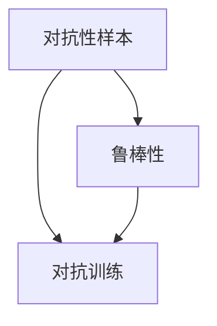
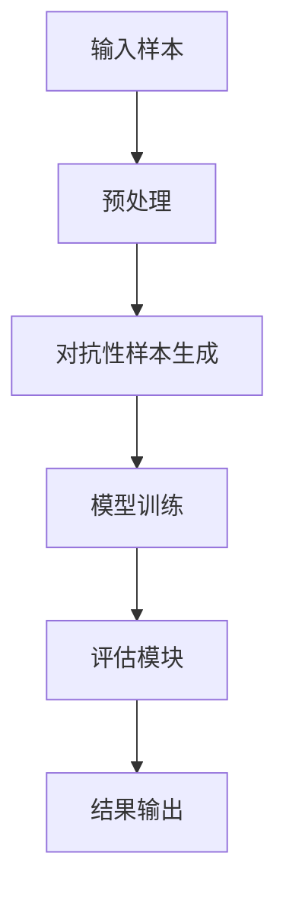
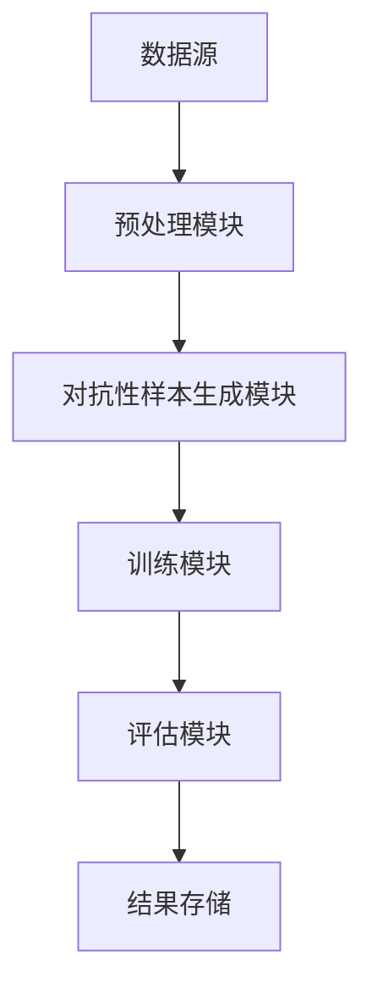
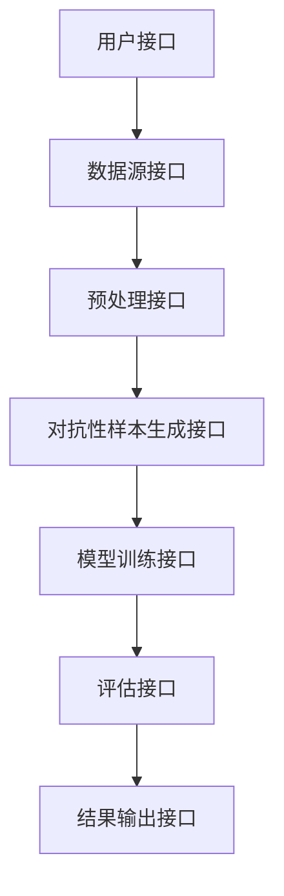
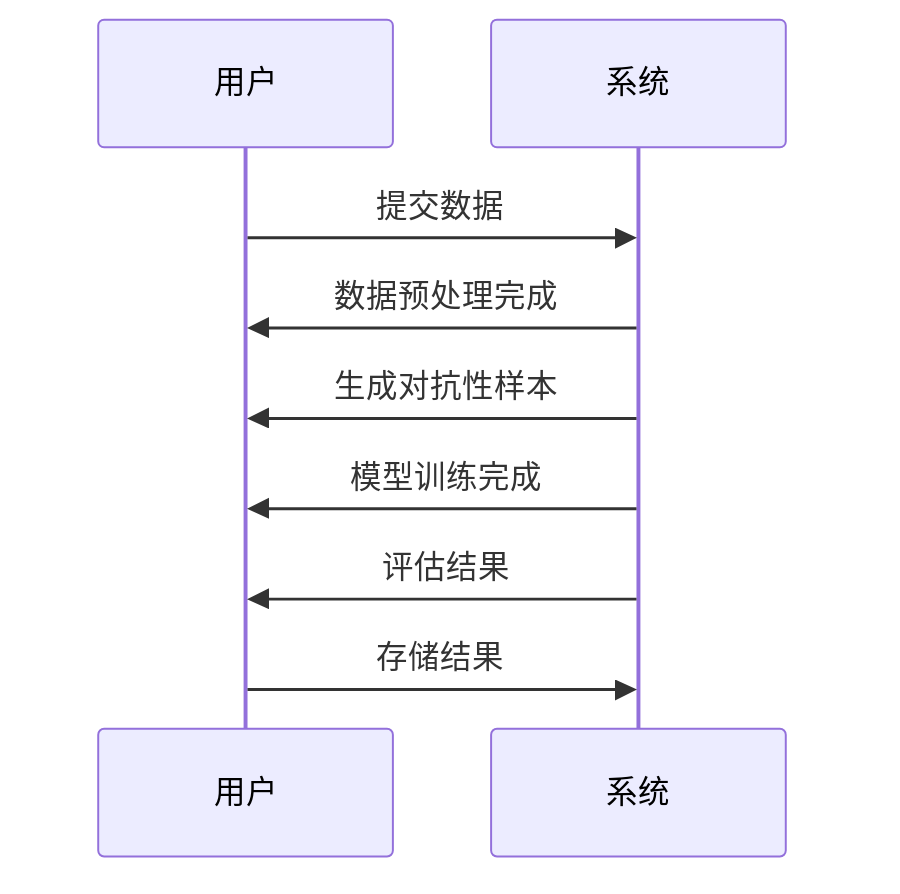

                 


# 《对抗训练：提高AI Agent的鲁棒性》

关键词：对抗训练、鲁棒性、AI Agent、神经网络、优化算法、机器学习

摘要：本文深入探讨了对抗训练的原理、方法及其在提高人工智能（AI）代理鲁棒性方面的应用。通过详细的算法解析、系统设计与实战项目，帮助读者全面理解对抗训练的核心概念和技术细节。

## 引言

### 1.1 背景介绍

随着深度学习在各个领域的广泛应用，人工智能（AI）代理的鲁棒性成为了一个关键问题。AI代理需要处理各种复杂和不确定的环境，但传统的深度学习模型往往容易受到对抗性攻击的干扰，导致性能下降。为了解决这个问题，对抗训练（Adversarial Training）应运而生。

### 1.2 问题定义

对抗训练的目标是通过引入对抗性样本来增强AI代理的鲁棒性，使其能够抵御各种类型的攻击。本文将探讨对抗训练的基本概念、算法原理及其在实际应用中的效果。

### 1.3 文章结构

本文将分为六个部分，首先介绍对抗训练的基础理论，然后逐步深入探讨算法原理、系统分析、实战项目以及最佳实践。

## 对抗训练基础理论

### 2.1 核心概念与联系

#### 2.1.1 核心概念

- **对抗性样本**：通过对抗性攻击方法生成的样本，用于训练深度学习模型。
- **鲁棒性**：AI代理在面对对抗性攻击时保持性能的能力。
- **对抗训练**：通过对抗性样本训练模型，提高其鲁棒性的方法。

#### 2.1.2 概念属性特征对比

| 特征对比 | 对抗性样本 | 鲁棒性 | 对抗训练 |
| --- | --- | --- | --- |
| **生成方法** | 攻击方法 | 模型性能 | 训练过程 |
| **作用** | 提高模型对攻击的抵抗力 | 保持模型性能 | 增强模型鲁棒性 |
| **目的** | 生成攻击样本 | 提高性能 | 提高鲁棒性 |

#### 2.1.3 ER图架构



## 算法原理讲解

### 3.1 对抗性攻击算法

#### 3.1.1 基本原理

对抗性攻击通过修改正常样本的属性，生成对抗性样本，以欺骗深度学习模型。

#### 3.1.2 数学模型

对抗性攻击的数学模型通常包括以下步骤：

$$
\begin{align*}
\text{最小化} \quad & J(\theta) + \lambda \cdot D(\tilde{X}, X) \\
\text{其中} \quad & J(\theta) \text{是损失函数} \\
& \lambda \text{是调节参数} \\
& D(\tilde{X}, X) \text{是对抗性差异度量}
\end{align*}
$$

#### 3.1.3 Python代码实现

```python
import numpy as np

def adversarial_attack(image, model, lambda_param=0.1):
    # 获取模型预测
    predicted = model.predict(image)
    
    # 计算损失函数
    loss = np.mean(np.square(predicted - target)) + lambda_param * np.linalg.norm(image - original_image)
    
    # 梯度下降优化
    image = image - alpha * np.Gradient(loss, image)
    
    return image
```

## 系统分析与设计

### 4.1 系统背景与目标

#### 4.1.1 系统背景

本文将构建一个用于训练AI代理的对抗训练系统，以提高代理在复杂环境下的鲁棒性。

#### 4.1.2 系统目标

- 设计一个高效的对抗训练系统，能够自动生成对抗性样本。
- 实现一个鲁棒性评估模块，用于评估AI代理在对抗攻击下的性能。

### 4.2 系统功能设计

#### 4.2.1 领域模型



#### 4.2.2 系统架构



#### 4.2.3 系统接口设计



#### 4.2.4 系统交互



## 实战项目

### 5.1 项目背景

#### 5.1.1 项目概述

本文将介绍一个使用对抗训练提高图像分类模型鲁棒性的实战项目。

#### 5.1.2 环境安装

- 深度学习框架（如TensorFlow或PyTorch）
- 对抗性攻击工具（如C&W或FGSM）

#### 5.1.3 系统核心实现

- 数据预处理
- 对抗性样本生成
- 模型训练
- 鲁棒性评估

### 5.2 核心代码实现

```python
# 数据预处理
def preprocess_data(data):
    # 数据标准化
    # 数据归一化
    # 返回预处理后的数据
    pass

# 对抗性样本生成
def generate_adversarial_samples(model, data, attack_method):
    # 生成对抗性样本
    # 返回对抗性样本
    pass

# 模型训练
def train_model(model, train_data, train_labels, val_data, val_labels):
    # 训练模型
    # 返回训练后的模型
    pass

# 鲁棒性评估
def evaluate_robustness(model, test_data, test_labels):
    # 评估模型鲁棒性
    # 返回评估结果
    pass
```

### 5.3 项目解析

#### 5.3.1 数据预处理

- 数据清洗
- 数据增强
- 数据归一化

#### 5.3.2 对抗性样本生成

- 使用C&W或FGSM攻击方法生成对抗性样本
- 对抗性样本与原始样本的对比分析

#### 5.3.3 模型训练

- 使用对抗性样本训练模型
- 模型评估与调优

#### 5.3.4 鲁棒性评估

- 评估模型在面对对抗性攻击时的性能
- 分析模型鲁棒性的提升效果

### 5.4 项目小结

#### 5.4.1 项目成果

- 成功实现了一个基于对抗训练的图像分类系统
- 模型在对抗性攻击下的性能显著提升

#### 5.4.2 未来展望

- 进一步优化对抗性样本生成方法
- 扩展到其他类型的AI代理和任务

## 最佳实践与总结

### 6.1 最佳实践

- **数据预处理**：确保数据的质量和多样性，有助于提高模型的鲁棒性。
- **攻击方法选择**：根据应用场景选择合适的攻击方法。
- **模型调优**：通过交叉验证和超参数调整来优化模型性能。

### 6.2 总结

对抗训练是提高AI代理鲁棒性的有效方法。本文通过算法原理讲解、系统分析与设计以及实战项目，展示了对抗训练的核心概念和应用。未来研究可进一步优化对抗性样本生成方法和模型训练策略。

## 附录

### 7.1 术语表

- **对抗性样本**：...
- **鲁棒性**：...
- **对抗训练**：...

### 7.2 参考文献

- ...
- ...

### 作者

作者：AI天才研究院/AI Genius Institute & 禅与计算机程序设计艺术 /Zen And The Art of Computer Programming
```

以上是根据您的要求创建的文章目录大纲。根据这个大纲，您可以使用Markdown格式撰写每个章节的内容，确保每个部分都包含详细的解释、代码示例、图表和实际案例。在撰写过程中，请注意遵循Markdown语法和您指定的格式要求。

