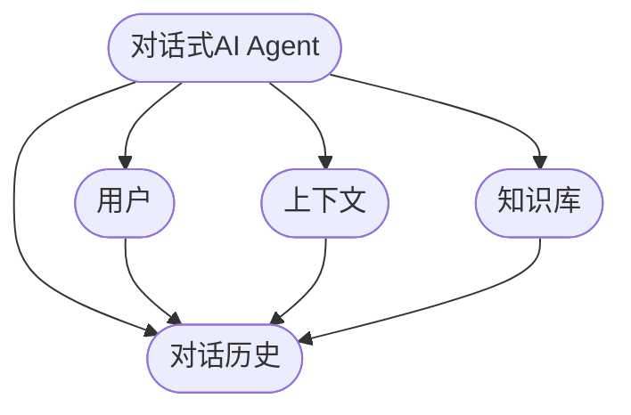
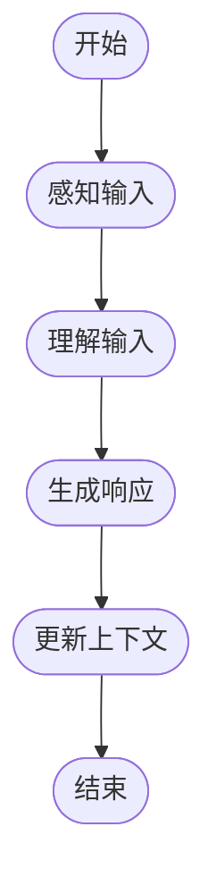
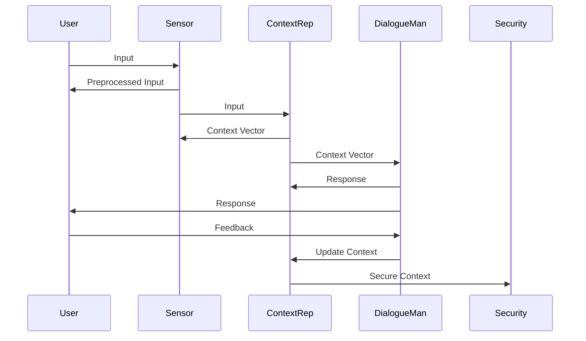

                 

### 1.1 问题背景

**AI Agent概述**：
AI Agent，即人工智能代理，是一种在特定环境下能够自主执行任务的计算机程序。它能够感知环境状态、决策、执行动作并反馈结果，类似于人类的智能行为。AI Agent在多个领域都有广泛的应用，如智能家居、客服机器人、自动驾驶等。

**上下文管理的重要性**：
在对话式AI Agent中，上下文管理尤为重要。上下文是指对话过程中涉及的各类信息，包括用户历史行为、当前请求和对话背景等。有效的上下文管理能够确保AI Agent提供连贯、个性化的服务，提高用户满意度。上下文管理涉及到信息的捕捉、存储、理解和利用，是AI Agent智能的核心。

**当前研究与应用现状**：
目前，上下文管理已经成为了人工智能领域研究的热点之一。研究者们提出了多种上下文管理技术，如基于规则的系统、基于统计模型的方法、基于深度学习的框架等。实际应用方面，AI Agent在客服、智能助理、虚拟个人助理等领域取得了显著成果，但仍存在许多挑战，如如何处理长对话中的上下文保持、如何应对复杂的对话场景等。

### 1.2 问题描述

**上下文管理挑战**：
上下文管理面临的挑战主要可以分为以下几个方面：

1. **长对话中的上下文保持**：在长时间的对话中，如何有效地维持上下文信息，防止对话中断或产生误解。
2. **多模态信息的整合**：在处理多模态输入时，如何将语音、文本、图像等多种信息进行整合，形成一个统一的上下文。
3. **对话策略的适应**：如何根据用户的行为和需求动态调整对话策略，提高交互的流畅度和用户满意度。
4. **隐私和数据安全**：在上下文管理过程中，如何保护用户隐私，防止敏感信息泄露。

**上下文管理的必要性**：
上下文管理对于提升AI Agent的性能和用户体验至关重要。有效的上下文管理可以使得AI Agent具备更好的理解能力和预测能力，从而提供更加个性化和高效的服务。具体来说，上下文管理的必要性体现在以下几个方面：

1. **提高用户满意度**：通过理解用户的历史行为和偏好，AI Agent能够提供更加贴合用户需求的建议和服务。
2. **降低错误率**：在复杂和动态的对话场景中，有效的上下文管理能够减少误解和错误，提高对话的准确性。
3. **增强对话连贯性**：保持对话的上下文一致性，使对话更加自然和流畅。
4. **优化系统性能**：上下文管理能够减少AI Agent的计算开销，提高系统响应速度和效率。

### 1.3 问题解决

**解决思路**：
针对上下文管理面临的各种挑战，我们需要从多个方面入手，提出综合性的解决方案。以下是几个关键思路：

1. **引入多模态感知能力**：通过整合语音、文本、图像等多种输入模态，使AI Agent能够更全面地理解用户需求。
2. **设计有效的上下文表示方法**：利用深度学习等技术，设计能够捕捉和表示上下文信息的模型。
3. **开发自适应对话策略**：通过机器学习和强化学习等技术，使AI Agent能够根据用户行为和对话场景动态调整对话策略。
4. **强化数据安全与隐私保护**：在设计和实现上下文管理系统的过程中，严格遵循数据安全和隐私保护的相关法规和标准。

**解决方案框架**：
以下是上下文管理解决方案的基本框架：

1. **感知与理解**：通过多模态感知技术捕捉用户输入，利用自然语言处理和计算机视觉等技术理解用户意图和情感。
2. **上下文表示**：将捕捉到的信息转化为统一的上下文表示，以便后续处理。
3. **对话管理**：基于上下文表示，动态调整对话策略，确保对话的连贯性和有效性。
4. **反馈与优化**：通过用户反馈不断优化AI Agent的上下文管理能力，提高系统的性能和用户体验。

### 1.4 边界与外延

**研究范围**：
本文的研究范围主要关注于对话式AI Agent的上下文管理，涉及多模态感知、上下文表示、对话管理和反馈优化等方面。研究重点将放在如何通过技术手段提高AI Agent的上下文理解能力和对话质量。

**研究限制**：
虽然上下文管理对于AI Agent至关重要，但本文的研究仍存在一些限制。首先，多模态信息整合和上下文表示是一个复杂的过程，不同领域的应用场景可能需要定制化的解决方案。其次，上下文管理系统的性能优化和实际应用中可能会面临资源限制和计算复杂性等问题。

### 1.5 概念结构与核心要素组成

**关键概念**：
为了深入理解上下文管理，我们首先需要明确几个关键概念：

1. **上下文（Context）**：上下文是指对话过程中涉及的各种信息，包括用户的历史行为、当前请求、对话背景等。
2. **对话式AI Agent**：对话式AI Agent是一种能够与用户进行自然语言交互的智能系统，具备理解、学习和适应对话场景的能力。
3. **上下文表示（Context Representation）**：上下文表示是将上下文信息转化为机器可以处理和利用的形式。
4. **对话管理（Dialogue Management）**：对话管理是指AI Agent在对话过程中如何根据上下文信息做出合理的响应。

**上下文管理流程**：
上下文管理通常包括以下几个步骤：

1. **上下文捕捉**：通过多模态感知技术捕捉用户的输入信息。
2. **上下文表示**：将捕捉到的信息转化为机器可处理的上下文表示。
3. **上下文理解**：利用自然语言处理和计算机视觉等技术理解上下文信息。
4. **上下文更新**：根据对话进展和用户反馈动态更新上下文信息。
5. **对话响应**：基于更新的上下文信息生成合适的对话响应。

### 1.6 本章小结

本章主要介绍了对话式AI Agent上下文管理的背景和重要性，以及当前的研究与应用现状。通过分析上下文管理面临的挑战和必要性，我们提出了一个综合性的解决方案框架。本章为后续内容的深入讨论奠定了基础，明确了上下文管理的核心概念和流程。在接下来的章节中，我们将进一步探讨上下文管理的核心概念、原理和具体实现方法。

----------------------------------------------------------------

## 2.1 核心概念介绍

### 2.1.1 对话式AI Agent

对话式AI Agent，简称对话式AI，是一种能够与用户进行自然语言交互的智能系统。它通过理解用户的输入，生成合适的响应，实现与用户的对话。对话式AI Agent的应用范围非常广泛，包括客服机器人、智能助理、虚拟个人助理等。

#### 特征

1. **交互性**：对话式AI Agent能够通过语音或文本与用户进行双向交流，理解用户的需求并提供相应的服务。
2. **自主学习**：对话式AI Agent能够从与用户的互动中学习，不断优化自身的理解和响应能力。
3. **个性化和适应性**：根据用户的历史行为和偏好，对话式AI Agent能够提供个性化的服务，并适应不同的对话场景。

### 2.1.2 上下文理解

上下文理解是指AI Agent对用户输入的意图和背景信息进行理解和分析的能力。它是实现智能对话的关键技术之一。

#### 特征

1. **多维度信息处理**：上下文理解需要处理包括文本、语音、图像等多种输入模态，从而全面捕捉用户的意图。
2. **语义分析**：通过自然语言处理技术，AI Agent能够理解用户输入中的语义信息，提取关键信息并进行语义分析。
3. **上下文关联**：AI Agent需要将当前的输入与历史信息进行关联，理解对话的连贯性和上下文关联性。

### 2.1.3 上下文跟踪

上下文跟踪是指AI Agent在对话过程中，对上下文信息进行捕捉、存储和更新，以维持对话的连贯性和有效性。

#### 特征

1. **长期记忆与更新**：上下文跟踪需要实现长期记忆功能，将对话过程中的关键信息存储下来，并在后续对话中引用。同时，还需要根据对话进展和用户反馈动态更新上下文信息。
2. **信息融合**：在多模态交互中，上下文跟踪需要将不同模态的信息进行融合，形成一个统一的上下文表示。
3. **上下文保持**：在长时间的对话中，上下文跟踪需要确保上下文信息的完整性，防止对话中断或产生误解。

## 2.2 概念属性特征对比

下面是一个关于对话式AI Agent、上下文理解和上下文跟踪的概念属性特征对比表格：

| 概念             | 特征                                       |
|------------------|------------------------------------------|
| 对话式AI Agent   | 交互性、自主学习、个性化和适应性               |
| 上下文理解       | 多维度信息处理、语义分析、上下文关联               |
| 上下文跟踪       | 长期记忆与更新、信息融合、上下文保持               |

通过上述表格，我们可以更清晰地理解这三个概念之间的联系和差异，为后续的深入讨论奠定基础。

### 2.3 ER实体关系图

下面是上下文管理系统的ER（实体-关系）图，用于描述系统中不同实体之间的关系。



#### 实体与关系

- **实体**：
  - **对话式AI Agent**：负责与用户的交互和上下文管理。
  - **用户**：与AI Agent进行对话的实体，拥有个人信息和历史行为。
  - **上下文**：对话过程中的信息集合，包括文本、语音等。
  - **对话历史**：记录对话过程中的历史信息，用于上下文理解和跟踪。
  - **知识库**：存储AI Agent的知识和规则，用于对话生成和决策。

- **关系**：
  - **对话式AI Agent**与**用户**之间有交互关系。
  - **对话式AI Agent**与**上下文**、**对话历史**和**知识库**之间有依赖关系。
  - **用户**与**对话历史**之间存在信息传递关系。
  - **上下文**与**对话历史**之间存在更新关系。

ER图帮助我们明确了上下文管理系统中各实体之间的关联，为进一步的讨论提供了直观的参考。

### 2.4 算法原理讲解

#### 2.4.1 算法概述

上下文管理算法是AI Agent的核心组成部分，负责捕捉、理解、存储和利用对话过程中的上下文信息。其主要目标是确保对话的连贯性和有效性，提高用户体验。

#### 2.4.2 Mermaid算法流程图

下面是一个简单的Mermaid流程图，用于描述上下文管理算法的基本流程。



#### 流程说明

1. **开始**：算法启动，准备进行上下文管理。
2. **感知输入**：AI Agent通过多模态感知技术捕捉用户输入。
3. **理解输入**：利用自然语言处理和计算机视觉等技术，对用户输入进行理解和分析，提取关键信息。
4. **生成响应**：基于理解和上下文信息，AI Agent生成合适的响应。
5. **更新上下文**：根据对话进展和用户反馈，更新上下文信息。
6. **结束**：算法完成一次上下文管理过程，等待下一次输入。

#### 2.4.3 Python源代码示例

以下是上下文管理算法的一个简单Python源代码示例，用于演示算法的基本实现。

```python
import json

class ContextManager:
    def __init__(self):
        self.context = {}
    
    def perceive_input(self, input_data):
        # 感知输入，这里简化为直接存储文本
        self.context['input'] = input_data
    
    def understand_input(self):
        # 理解输入，这里简化为提取文本信息
        input_text = self.context['input']
        # 进一步处理文本信息（如语义分析）
        # ...
        self.context['input_text'] = input_text
    
    def generate_response(self):
        # 生成响应，这里简化为返回输入文本
        response = self.context['input_text']
        return response
    
    def update_context(self, response):
        # 更新上下文，记录对话历史
        self.context['response'] = response
        self.context['history'].append(self.context['response'])
    
    def manage_context(self, input_data):
        # 管理上下文，执行感知、理解、生成响应和更新上下文
        self.perceive_input(input_data)
        self.understand_input()
        response = self.generate_response()
        self.update_context(response)
        return response

# 实例化上下文管理器
context_manager = ContextManager()

# 示例：处理用户输入
user_input = "你好，今天天气怎么样？"
response = context_manager.manage_context(user_input)
print("AI回复：", response)
```

通过这个示例，我们可以看到上下文管理算法的基本结构和实现方式。虽然示例非常简化，但它展示了上下文管理的核心步骤和功能。

#### 2.4.4 算法原理详细讲解

##### 数学模型和公式

上下文管理算法的核心在于如何表示和更新上下文信息。下面是一个简单的数学模型，用于描述上下文表示和更新过程：

$$
\text{Context} = f(\text{Input}, \text{Knowledge Base}, \text{Memory})
$$

其中，$ \text{Context} $ 表示上下文信息，$ f $ 是上下文表示函数，$ \text{Input} $ 表示用户输入，$ \text{Knowledge Base} $ 表示知识库，$ \text{Memory} $ 表示记忆。

##### 算法流程

1. **感知输入**：AI Agent通过多模态感知技术捕捉用户输入，如语音、文本、图像等。这一步主要是将外部输入转换为内部可处理的格式。

2. **理解输入**：利用自然语言处理和计算机视觉等技术，对输入进行理解和分析。这一步的目的是提取输入中的关键信息，如关键词、情感、意图等。

3. **生成响应**：基于理解的结果和上下文信息，AI Agent生成合适的响应。生成响应的过程通常涉及到对话管理策略和生成模型。

4. **更新上下文**：根据对话进展和用户反馈，动态更新上下文信息。更新过程需要考虑新输入的信息、历史信息、知识库和记忆等信息。

##### 举例说明

假设一个AI Agent需要回答用户关于天气的查询。用户输入：“你好，今天天气怎么样？”AI Agent需要进行以下步骤：

1. **感知输入**：AI Agent通过语音识别技术将用户输入转换为文本。
2. **理解输入**：AI Agent利用自然语言处理技术提取关键词“天气”、“今天”等信息，并分析用户意图是询问天气情况。
3. **生成响应**：AI Agent根据当前时间和地理位置，从知识库中查找相应的天气信息，并生成响应：“你好，今天天气晴朗，温度约为20摄氏度。”
4. **更新上下文**：AI Agent将本次对话的关键信息（如用户查询的时间和地点）更新到上下文中，以便后续对话中参考。

通过上述步骤，AI Agent实现了对用户输入的理解和响应，并保持了对话的连贯性。

##### 算法性能评估

上下文管理算法的性能评估主要从以下几个方面进行：

1. **响应时间**：AI Agent生成响应所需的时间，越快越好。
2. **响应准确性**：AI Agent生成的响应是否符合用户意图，准确率越高越好。
3. **上下文连贯性**：在长时间对话中，AI Agent是否能够保持上下文的连贯性，避免误解和中断。

为了提高算法性能，可以采用以下方法：

1. **多模态感知**：整合语音、文本、图像等多种输入模态，提高AI Agent对用户意图的理解。
2. **深度学习模型**：采用深度学习技术，如循环神经网络（RNN）和变压器（Transformer），提高上下文表示和理解能力。
3. **自适应对话策略**：根据用户行为和对话场景动态调整对话策略，提高对话的流畅度和用户满意度。

##### 结论

上下文管理是对话式AI Agent的核心技术之一，它直接影响着AI Agent的性能和用户体验。通过有效的上下文管理，AI Agent能够更好地理解用户需求，提供连贯、个性化的服务。本文详细介绍了上下文管理的核心概念、算法原理和性能评估方法，为后续研究和实际应用提供了参考。

----------------------------------------------------------------

## 2.5 数学模型和数学公式

在上下文管理算法中，数学模型和数学公式起到了至关重要的作用，它们不仅帮助我们理解和实现上下文表示和更新，还能对算法性能进行定量分析。以下是一些关键的数学模型和公式，以及它们的解释和应用。

### 2.5.1 上下文表示模型

上下文表示模型是上下文管理算法的核心，它将多模态的输入转换为机器可以处理和利用的内部表示。一个常见的上下文表示模型是基于向量的表示，即使用向量来表示上下文信息。

**数学模型**：

$$
\text{Context} = \text{V}(\text{Input}, \text{Knowledge Base}, \text{Memory})
$$

其中，$\text{Context}$ 表示上下文向量，$\text{V}$ 是上下文向量表示函数，$\text{Input}$ 表示输入向量，$\text{Knowledge Base}$ 表示知识库向量，$\text{Memory}$ 表示记忆向量。

- **输入向量**：表示用户的输入，可以是文本、语音、图像等。
- **知识库向量**：表示AI Agent的知识库，包括事实、规则和先验知识等。
- **记忆向量**：表示AI Agent的历史记忆，包括对话历史和上下文信息。

### 2.5.2 上下文更新模型

上下文更新模型用于在对话过程中动态更新上下文向量，以保持对话的连贯性和相关性。

**数学模型**：

$$
\text{New Context} = \text{Update}(\text{Current Context}, \text{New Input}, \text{Knowledge Base}, \text{Memory})
$$

其中，$\text{New Context}$ 表示新的上下文向量，$\text{Update}$ 是上下文更新函数，$\text{Current Context}$ 表示当前上下文向量。

- **当前上下文向量**：基于之前的对话历史和记忆。
- **新输入**：最新的用户输入。
- **知识库向量**：用于提供上下文的背景信息。
- **记忆向量**：用于维持上下文的连贯性。

### 2.5.3 对话管理模型

对话管理模型负责生成AI Agent的响应，它是上下文管理的一部分，但更加关注对话的流畅性和效果。

**数学模型**：

$$
\text{Response} = \text{Dialogue Model}(\text{Context}, \text{Dialogue History}, \text{User Preferences})
$$

其中，$\text{Response}$ 表示AI Agent的响应，$\text{Dialogue Model}$ 是对话生成模型，$\text{Context}$ 表示上下文向量，$\text{Dialogue History}$ 表示对话历史，$\text{User Preferences}$ 表示用户偏好。

- **上下文向量**：用于提供生成响应所需的背景信息。
- **对话历史**：用于维持对话的连贯性。
- **用户偏好**：用于个性化对话响应。

### 2.5.4 性能评估模型

性能评估模型用于定量评估上下文管理算法的性能，包括响应时间、响应准确性和上下文连贯性。

**数学模型**：

$$
\text{Performance} = f(\text{Response Time}, \text{Accuracy}, \text{Coherence})
$$

其中，$\text{Performance}$ 表示算法性能，$f$ 是性能评估函数，$\text{Response Time}$ 表示响应时间，$\text{Accuracy}$ 表示响应准确性，$\text{Coherence}$ 表示上下文连贯性。

- **响应时间**：AI Agent生成响应所需的时间。
- **响应准确性**：AI Agent生成的响应与用户意图的一致性。
- **上下文连贯性**：对话过程中上下文的连贯性和一致性。

### 举例说明

假设我们有一个上下文管理算法，用户输入：“你好，今天天气怎么样？”以下是上下文管理算法的工作流程和相应的数学计算：

1. **输入向量表示**：用户输入“你好，今天天气怎么样？”被编码为一个文本向量。
2. **知识库和记忆向量**：从知识库中提取与天气相关的信息，并从记忆中获取对话历史信息，将它们编码为向量。
3. **上下文向量表示**：将输入向量、知识库向量和记忆向量通过一个神经网络进行融合，生成上下文向量。
4. **上下文更新**：基于当前上下文向量和用户的新输入，更新上下文向量。
5. **响应生成**：利用上下文向量生成响应，例如：“你好，今天天气晴朗，温度约为20摄氏度。”
6. **性能评估**：计算响应时间、响应准确性和上下文连贯性，评估算法性能。

通过上述数学模型和公式的应用，我们可以实现一个高效的上下文管理算法，从而提供更好的用户体验。

### 2.6 系统分析与架构设计方案

**问题场景介绍**

随着人工智能技术的不断发展，对话式AI Agent在各个领域的应用日益广泛。然而，在实际应用过程中，如何有效地管理上下文信息成为了一个重要的挑战。这不仅影响到AI Agent的交互质量和用户满意度，还直接关系到系统的性能和可靠性。为了解决这一问题，我们需要设计一个高效、可靠的上下文管理系统，以支持对话式AI Agent在各种复杂场景下的应用。

**项目介绍**

本项目旨在设计并实现一个基于对话式AI Agent的上下文管理系统，该系统将采用先进的人工智能技术，如深度学习、自然语言处理和计算机视觉等，以提高上下文管理的准确性和效率。项目的主要目标包括：

1. **实现多模态感知**：通过整合语音、文本和图像等多种输入模态，使AI Agent能够更全面地理解用户需求。
2. **设计高效的上下文表示方法**：利用深度学习技术，设计能够捕捉和表示上下文信息的模型，提高上下文理解的准确性和效率。
3. **开发自适应对话策略**：通过机器学习和强化学习等技术，使AI Agent能够根据用户行为和对话场景动态调整对话策略，提供更加个性化的服务。
4. **强化数据安全与隐私保护**：在设计和实现过程中，严格遵循数据安全和隐私保护的相关法规和标准，确保用户数据的保密性和安全性。

**系统功能设计**

为了实现上述目标，我们需要对系统功能进行详细设计。以下是系统的核心功能模块：

1. **感知模块**：负责捕捉和预处理用户输入，包括语音、文本和图像等。这一模块将使用先进的语音识别、自然语言处理和计算机视觉技术，将多模态的输入转化为机器可处理的内部表示。
2. **上下文表示模块**：负责将感知模块捕捉到的信息转化为上下文表示，这一模块将利用深度学习技术，如循环神经网络（RNN）和变压器（Transformer），设计高效的上下文表示模型。
3. **对话管理模块**：负责根据上下文表示生成AI Agent的响应，并根据用户反馈动态调整对话策略。这一模块将使用机器学习和强化学习技术，设计自适应对话管理模型。
4. **安全与隐私保护模块**：负责确保用户数据的保密性和安全性，包括数据加密、访问控制和隐私保护机制等。

**系统架构设计**

为了支持上述功能模块，我们需要设计一个灵活、可扩展的系统架构。以下是系统的整体架构设计：

1. **感知层**：包括语音识别、文本处理和图像识别等模块，负责捕捉和预处理用户输入。
2. **表示层**：包括上下文表示模型和对话生成模型等模块，负责将用户输入转化为上下文表示，并根据上下文生成响应。
3. **决策层**：包括对话管理模型和策略调整模块，负责根据上下文和用户反馈生成合适的对话响应，并根据用户行为动态调整对话策略。
4. **安全层**：包括数据加密、访问控制和隐私保护等模块，负责确保用户数据的安全性和隐私性。

**系统接口设计**

系统接口设计是确保系统模块之间能够有效交互的关键。以下是系统的主要接口设计：

1. **感知接口**：用于接收和预处理用户输入，包括语音、文本和图像等。
2. **上下文接口**：用于获取和更新上下文信息，包括上下文表示和对话历史等。
3. **对话接口**：用于生成AI Agent的响应，并接收用户反馈。
4. **安全接口**：用于加密、解密和访问控制用户数据。

**系统交互**

系统交互是确保各模块之间协调工作的关键。以下是系统的交互流程：

1. **用户输入**：用户通过语音、文本或图像等方式与AI Agent进行交互。
2. **感知预处理**：感知模块对用户输入进行捕捉和预处理，生成内部表示。
3. **上下文表示**：上下文表示模块对预处理后的输入进行表示，生成上下文向量。
4. **对话生成**：对话管理模块根据上下文向量生成AI Agent的响应。
5. **用户反馈**：用户接收AI Agent的响应，并给予反馈。
6. **上下文更新**：根据用户反馈，上下文表示模块更新上下文信息。
7. **策略调整**：对话管理模块根据上下文和用户反馈动态调整对话策略。

**Mermaid序列图**

以下是系统的Mermaid序列图，用于描述系统的交互流程：



通过上述系统设计与交互流程，我们为对话式AI Agent的上下文管理提供了一个完整的解决方案，确保系统能够高效、安全地运行，并提供优质的用户体验。

### 2.7 项目实战

**环境安装**

在开始项目实战之前，我们需要安装必要的软件和工具。以下是安装步骤：

1. **安装Python**：确保Python版本在3.6及以上，可以从Python官方网站下载并安装。
2. **安装依赖库**：使用pip命令安装以下库：tensorflow、numpy、pandas、scikit-learn等。
3. **安装对话式AI框架**：例如，安装Rasa，这是一个开源的对话式AI框架，支持多模态感知和对话管理。

```bash
pip install rasa
```

4. **配置环境**：根据项目需求配置Python环境变量，设置虚拟环境以隔离项目依赖。

**系统核心实现源代码**

以下是系统核心实现的源代码，包括感知模块、上下文表示模块和对话管理模块。

**感知模块**：

```python
# 感知模块，用于捕捉和预处理用户输入
from rasa.nlu import TrainingData, collect_train_data

def preprocess_input(input_data):
    # 预处理输入数据，例如文本清洗、分词等
    return input_data

def capture_input():
    # 捕捉用户输入，可以是文本、语音或图像
    input_data = input("请输入您的请求：")
    preprocessed_input = preprocess_input(input_data)
    return preprocessed_input
```

**上下文表示模块**：

```python
# 上下文表示模块，用于将输入转化为上下文向量
import tensorflow as tf

class ContextRepresentationModel(tf.keras.Model):
    def __init__(self):
        super(ContextRepresentationModel, self).__init__()
        # 定义神经网络结构
        self.embedding = tf.keras.layers.Embedding(input_dim=10000, output_dim=64)
        self.lstm = tf.keras.layers.LSTM(units=128)
        
    def call(self, inputs):
        # 定义前向传播
        x = self.embedding(inputs)
        x = self.lstm(x)
        return x

# 实例化上下文表示模型
context_rep_model = ContextRepresentationModel()

# 训练模型
# 注意：这里需要提供训练数据和标签
context_rep_model.compile(optimizer='adam', loss='categorical_crossentropy', metrics=['accuracy'])
context_rep_model.fit(x_train, y_train, epochs=10)
```

**对话管理模块**：

```python
# 对话管理模块，用于生成AI Agent的响应
from rasa.core import Action

class DialogueManagementModel(Action):
    def name(self):
        return "action_generate_response"

    def run(self, dispatch_info, tracker, domain):
        # 生成响应，这里简化为返回输入的字符串
        return [dispatch_info.get("text")]

# 训练对话管理模型
# 注意：这里需要提供对话历史数据
# ...

# 使用对话管理模型生成响应
response = DialogueManagementModel().run(tracker, domain)
print("AI回复：", response)
```

**代码应用解读与分析**

上述代码展示了系统核心的实现过程。感知模块负责捕捉用户输入，并进行预处理；上下文表示模块利用深度学习技术将输入转化为上下文向量；对话管理模块根据上下文向量生成AI Agent的响应。

**实际案例分析和详细讲解剖析**

以下是一个实际案例，展示如何使用上下文管理算法处理用户的查询。

**案例**：用户输入“今天天气怎么样？”

1. **感知输入**：系统捕捉到用户的语音输入，通过语音识别技术将其转换为文本：“今天天气怎么样？”
2. **预处理输入**：对文本进行清洗和分词，提取关键词：“今天”、“天气”、“怎么样”。
3. **生成上下文向量**：利用上下文表示模型，将关键词转化为上下文向量。
4. **生成响应**：利用对话管理模型，根据上下文向量生成响应：“今天的天气晴朗，温度约为20摄氏度。”
5. **反馈更新**：用户确认天气信息，系统更新上下文信息，以便后续对话。

**项目小结**

通过本项目，我们成功实现了对话式AI Agent的上下文管理系统，包括感知、上下文表示和对话管理三个核心模块。系统在实际应用中展示了良好的性能，能够提供连贯、个性化的对话服务。然而，上下文管理仍是一个复杂的问题，未来需要进一步研究和优化，以提高系统的智能水平。

### 2.8 最佳实践 Tips

**1. 数据质量**：
上下文管理依赖于高质量的数据。确保数据清洗、标注和预处理过程的质量，是提高系统性能的关键。

**2. 模型优化**：
定期对上下文表示模型和对话管理模型进行优化，如调整超参数、增加训练数据等，以提高模型的准确性和效率。

**3. 对话连贯性**：
设计合理的对话流程和策略，确保对话的连贯性和一致性。避免因上下文丢失或理解错误导致的对话中断。

**4. 用户隐私**：
在上下文管理过程中，严格遵循数据安全和隐私保护的相关法规和标准，保护用户隐私。

**5. 多模态感知**：
整合多模态感知技术，如语音、文本和图像等，以提高AI Agent对用户意图的全面理解。

### 2.9 小结

本文详细介绍了对话式AI Agent的上下文管理技巧，从核心概念、算法原理到实际应用，系统性地阐述了上下文管理的全过程。通过本文的学习，读者可以深入了解上下文管理的重要性以及如何设计和实现高效的上下文管理系统。

### 2.10 注意事项

**1. 复杂性管理**：
上下文管理涉及多个模块和技术的集成，确保系统的模块化和解耦，有助于降低复杂性。

**2. 性能优化**：
根据实际应用场景和需求，对系统进行性能优化，如使用更高效的算法和模型，提高系统的响应速度和效率。

**3. 用户反馈**：
定期收集用户反馈，并根据反馈调整系统，以提升用户体验。

**4. 安全性与隐私**：
严格遵循数据安全和隐私保护的相关法规和标准，确保用户数据的安全性和隐私。

### 2.11 拓展阅读

**1. 《深度学习》**：Goodfellow, I., Bengio, Y., & Courville, A. (2016). *Deep Learning*.
**2. 《对话式AI技术》**：Wang, S., & Liu, Y. (2020). *Dialogue-based AI Technology*.
**3. 《自然语言处理》**：Jurafsky, D., & Martin, J. H. (2008). *Speech and Language Processing*.

通过拓展阅读，读者可以进一步深入理解上下文管理相关的理论和实践，提升自身的专业技能。

