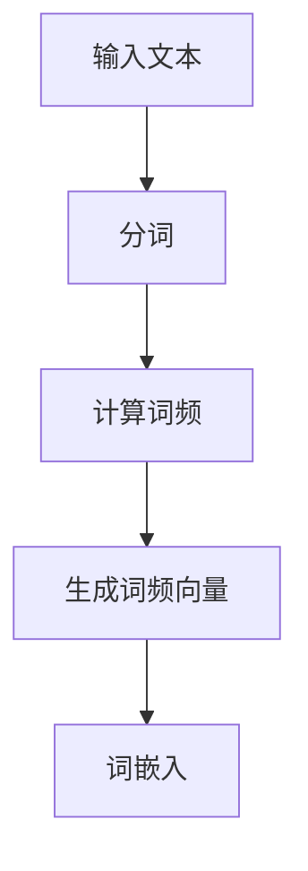
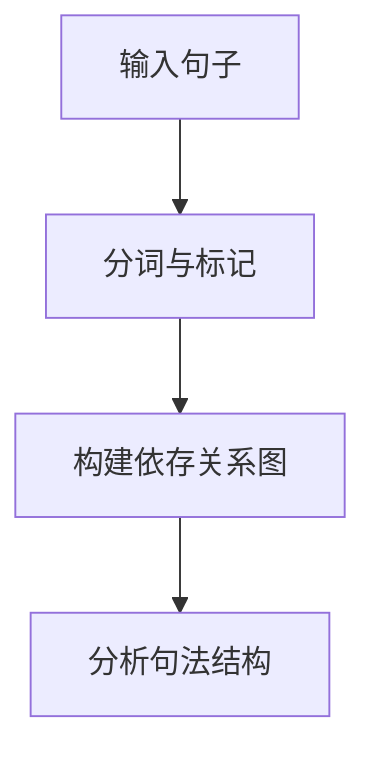
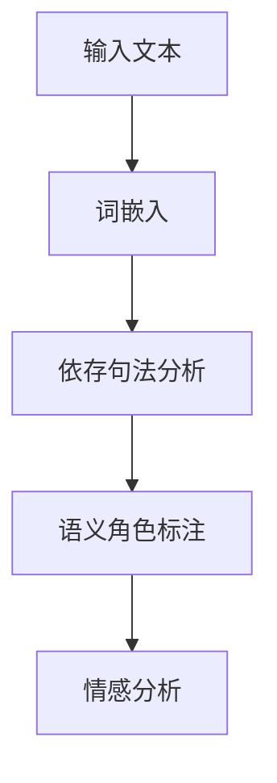
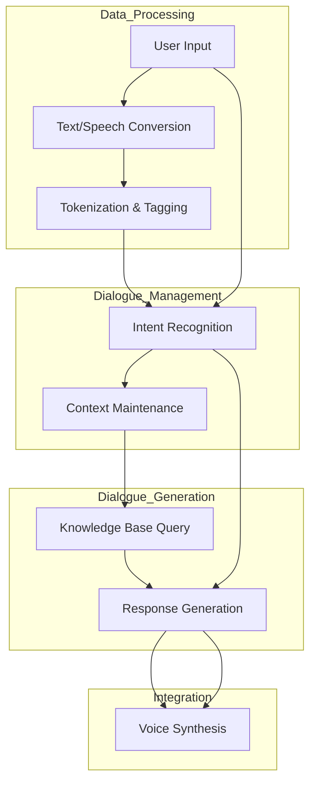
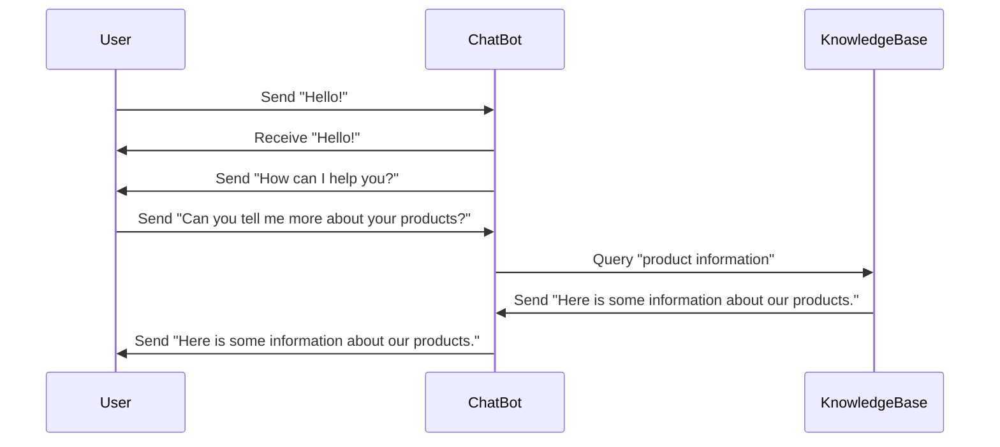

                 


## 对话式AI Agent：提升用户交互体验

### 关键词
- 对话式AI Agent
- 用户交互体验
- 自然语言处理
- 上下文理解
- 多轮对话

### 摘要
本文将深入探讨对话式AI Agent的概念、发展历程以及其在提升用户交互体验方面的作用。我们将逐步分析其核心技术，如自然语言处理、上下文理解和多轮对话，并通过具体案例和项目实战来展示如何设计和实现高效的对话式AI Agent。最后，我们将总结最佳实践并提供进一步的阅读资源。

### 目录大纲设计思路

**第一部分：对话式AI Agent概述**

**第1章：对话式AI Agent的基础**
- 1.1 对话式AI Agent的概念与发展
  - 1.1.1 什么是对话式AI Agent
  - 1.1.2 对话式AI Agent的发展趋势
- 1.2 对话式AI Agent在用户交互中的重要性
  - 1.2.1 用户体验的重要性
  - 1.2.2 对话式AI Agent如何提升用户体验
- 1.3 对话式AI Agent的核心概念
  - 1.3.1 自然语言处理
  - 1.3.2 上下文理解
  - 1.3.3 多轮对话

**第2章：对话式AI Agent的技术基础**
- 2.1 自然语言处理
  - 2.1.1 词嵌入技术
  - 2.1.2 依存句法分析
- 2.2 上下文理解
  - 2.2.1 上下文信息的收集
  - 2.2.2 上下文理解的算法
- 2.3 多轮对话
  - 2.3.1 多轮对话的流程
  - 2.3.2 多轮对话的优化

**第二部分：对话式AI Agent的设计与实现**

**第3章：对话式AI Agent的系统架构**
- 3.1 对话式AI Agent的系统架构
  - 3.1.1 系统架构的组成部分
  - 3.1.2 系统架构的设计原则
- 3.2 对话式AI Agent的关键技术
  - 3.2.1 对话管理技术
  - 3.2.2 对话生成技术
  - 3.2.3 对话式的反馈机制

**第4章：对话式AI Agent的项目实战**
- 4.1 项目介绍
  - 4.1.1 项目背景
  - 4.1.2 项目功能
- 4.2 环境安装与配置
  - 4.2.1 硬件环境配置
  - 4.2.2 软件环境配置
- 4.3 系统核心实现
  - 4.3.1 数据处理模块
  - 4.3.2 对话管理模块
  - 4.3.3 对话生成模块
- 4.4 代码应用解读与分析
  - 4.4.1 代码结构解析
  - 4.4.2 实际案例分析与详细讲解
- 4.5 项目小结
  - 4.5.1 项目实现中的挑战与解决方案
  - 4.5.2 项目经验总结

**第三部分：最佳实践、小结与拓展阅读**

**第5章：最佳实践与小结**
- 5.1 最佳实践
  - 5.1.1 用户交互体验优化技巧
  - 5.1.2 技术实施中的常见问题与解决方法
- 5.2 小结
  - 5.2.1 文章主要内容回顾
  - 5.2.2 关键技术和应用总结

**第6章：拓展阅读**
- 6.1 进一步阅读资源
  - 6.1.1 相关技术书籍推荐
  - 6.1.2 学术论文推荐
  - 6.1.3 开源项目和社区资源推荐

### 背景介绍

#### 对话式AI Agent的基本概念、发展历程及现状

对话式AI Agent，又称对话系统或聊天机器人，是一种能够与用户进行自然语言交互的人工智能系统。它们通过理解用户输入的文本或语音，生成合适的回复，并维持连贯的对话流程。对话式AI Agent的发展可以追溯到20世纪50年代，当时计算机科学家艾伦·图灵提出了著名的图灵测试，旨在评估机器是否能够表现出与人类相似的智能行为。随着计算力和算法的发展，特别是自然语言处理（NLP）和机器学习（ML）技术的进步，对话式AI Agent逐渐成为现实。

在过去的几十年里，对话式AI Agent经历了多个发展阶段：

- **早期阶段**：基于规则的对话系统（1960s-1980s）。这些系统通过预定义的规则和模式来响应用户输入，但由于规则数量庞大且复杂，这些系统在实际应用中面临着诸多限制。

- **中期阶段**：基于模板的对话系统（1990s）。通过模板匹配和模板填充技术，对话系统能够在一定程度上理解用户输入的意图，但仍缺乏对上下文和语义的深入理解。

- **当前阶段**：基于统计学习和深度学习的对话系统（2000s至今）。现代对话式AI Agent利用大规模语料库和先进的机器学习算法，能够实现更自然的语言理解和生成，支持多轮对话，并在多个应用场景中表现出色。

目前，对话式AI Agent的应用场景广泛，包括客服支持、个人助理、智能教育、智能家居等。随着5G、物联网和边缘计算等技术的发展，对话式AI Agent的前景将更加广阔。

#### 提升用户交互体验的重要性及其对AI Agent发展的影响

用户交互体验（User Experience, UX）是衡量产品和服务优劣的关键因素。一个良好的用户体验不仅能提高用户满意度，还能增强用户忠诚度和产品竞争力。对于对话式AI Agent而言，提升用户交互体验尤为重要，因为它直接关系到用户是否愿意继续与AI进行互动。

提升用户体验的重要性体现在以下几个方面：

1. **用户满意度**：高质量的交互体验能够满足用户的需求，提高用户满意度，从而增加用户对产品的信任和依赖。

2. **用户忠诚度**：良好的用户体验能够培养用户的忠诚度，使用户更倾向于长期使用同一产品或服务。

3. **产品竞争力**：在竞争激烈的市场中，具有优秀用户体验的产品能够脱颖而出，获得更多的市场份额。

4. **业务增长**：通过提升用户体验，企业能够吸引更多新用户，增加收入，促进业务增长。

对于对话式AI Agent的发展，用户体验的提升具有重要意义。一方面，用户体验直接影响AI Agent的普及和应用。只有当用户感受到AI Agent提供的价值时，他们才会更愿意使用并推荐给他人。另一方面，用户体验的改进能够推动AI技术的不断创新，促使对话式AI Agent更加智能化、个性化。

综上所述，提升用户交互体验不仅是对话式AI Agent发展的关键，也是整个AI领域的重要研究方向。接下来，我们将深入探讨对话式AI Agent的核心概念和技术基础，以期为读者提供全面的了解。

### 核心概念与联系

在深入探讨对话式AI Agent的核心概念之前，我们需要先理解几个关键术语的定义，这些术语构成了对话式AI Agent的基石。在本节中，我们将介绍自然语言处理（NLP）、上下文理解、多轮对话等核心概念，并通过表格和ER实体关系图来展示这些概念之间的联系。

#### 1. 自然语言处理（NLP）

自然语言处理是使计算机能够理解、生成和处理人类语言的技术。它涵盖了文本解析、语义理解、语言生成等多个方面。NLP的核心任务是使机器能够模拟人类的语言能力，实现人与机器之间的自然对话。

**自然语言处理的基本概念**：

- **词嵌入（Word Embedding）**：将词汇映射到高维向量空间，以便计算机能够处理和比较。
- **分词（Tokenization）**：将文本拆分成单词、字符或子词，以供进一步处理。
- **词性标注（Part-of-Speech Tagging）**：为每个词分配词性，如名词、动词、形容词等。
- **句法分析（Syntactic Parsing）**：分析句子的结构，识别词与词之间的语法关系。
- **语义分析（Semantic Analysis）**：理解句子的含义，包括词义消歧、情感分析等。

**NLP的关键技术**：

- **机器翻译（Machine Translation）**：将一种语言的文本自动翻译成另一种语言。
- **问答系统（Question Answering System）**：从大量文本中自动提取答案，回答用户的问题。
- **文本生成（Text Generation）**：生成自然语言的文本，如文章、评论、对话等。

#### 2. 上下文理解（Contextual Understanding）

上下文理解是NLP中的一个关键组成部分，它涉及到对对话或文本中上下文信息的捕捉和理解。上下文理解对于维持对话的连贯性和理解用户的真实意图至关重要。

**上下文理解的重要性**：

- **多轮对话的连贯性**：理解并维持对话的上下文，确保每一轮对话都是基于之前的对话内容进行的。
- **意图识别（Intent Recognition）**：识别用户的真实意图，即使在表达方式不同的情况下也能正确理解。

**实现上下文理解的方法**：

- **基于规则的方法**：使用预定义的规则来识别和解析上下文。
- **基于统计的方法**：使用统计模型来分析上下文信息，如隐马尔可夫模型（HMM）。
- **基于深度学习的方法**：使用神经网络，特别是循环神经网络（RNN）和其变种，如长短期记忆网络（LSTM）和变换器（Transformer），来捕捉上下文。

#### 3. 多轮对话（Mult-turn Dialogue）

多轮对话是指AI Agent与用户之间进行的一系列对话回合。这种对话形式比单轮对话更为复杂，因为它需要AI Agent能够记住之前的对话内容，并根据对话历史生成相应的回复。

**多轮对话的流程**：

- **初始对话**：用户发起对话，AI Agent回应。
- **后续对话**：根据用户输入和前一轮对话的内容，AI Agent生成回复。
- **对话管理**：跟踪对话状态，理解对话意图，并决定下一步的行动。

**多轮对话中的挑战**：

- **上下文维持**：确保AI Agent能够准确捕捉并维持对话的上下文。
- **意图识别**：在不同轮次中正确识别用户的意图，特别是在用户表达模糊或矛盾的情况下。
- **对话连贯性**：确保每一轮对话都是连贯的，并能够引导用户达到目标。

#### 表格和ER实体关系图

为了更直观地展示自然语言处理、上下文理解和多轮对话之间的联系，我们可以使用表格和ER实体关系图。

**表格**：

| 核心概念     | 描述                                                       | 关联性                 |
|-------------|-----------------------------------------------------------|----------------------|
| 自然语言处理 | 使计算机理解人类语言的技术。                                | - 基础技术，支撑上下文理解和多轮对话 |
| 上下文理解   | 理解对话或文本中的上下文信息。                             | - 维持多轮对话的连贯性 |
| 多轮对话     | AI Agent与用户之间的一系列对话回合。                      | - 需要上下文理解和意图识别 |

**ER实体关系图**：

```mermaid
erDiagram
  User ||--o> Dialogue :发起
  Dialogue ||--|> NLP :处理
  NLP ||--o> ContextUnderstanding :获取
  ContextUnderstanding ||--|> DialogueGeneration :生成回复
  DialogueGeneration ||--|> Dialogue :继续
```

在上面的ER实体关系图中，用户（User）发起对话（Dialogue），对话经过自然语言处理（NLP）处理后，传递给上下文理解（ContextUnderstanding）模块，该模块再将信息传递给对话生成模块（DialogueGeneration），生成回复后继续对话。

通过表格和ER实体关系图的展示，我们可以清晰地看到自然语言处理、上下文理解和多轮对话之间的紧密联系。这些核心概念共同构成了对话式AI Agent的技术基础，为提升用户交互体验提供了强有力的支持。在接下来的章节中，我们将进一步深入探讨这些概念的具体实现和应用。

### 算法原理讲解

#### 自然语言处理（NLP）的基本概念与算法

自然语言处理（NLP）是使计算机能够理解、生成和处理人类语言的技术。它涵盖了许多基本概念和算法，这些是构建高效对话式AI Agent的核心。以下将详细阐述词嵌入（Word Embedding）、依存句法分析（Dependency Parsing）等关键算法，并使用Mermaid流程图和Python源代码进行解释。

**1. 词嵌入（Word Embedding）**

词嵌入是将词汇映射到高维向量空间的过程，使得计算机能够以向量的形式处理和比较词语。这一过程通常基于统计学习，如词袋模型（Bag of Words, BoW）和神经网络模型（如Word2Vec）。

**算法原理：**
- **词袋模型（BoW）**：将文本转换为词频向量，每个维度代表一个词汇的出现频率。
- **Word2Vec**：基于神经网络的词嵌入算法，通过上下文信息学习词汇的向量表示。

**Mermaid流程图：**



**Python源代码示例：**
```python
from sklearn.feature_extraction.text import CountVectorizer
from gensim.models import Word2Vec

# 输入文本
text = ["我喜欢吃饭", "吃饭是必须的"]

# 使用CountVectorizer进行词频向量化
vectorizer = CountVectorizer()
X = vectorizer.fit_transform(text)

# 使用Word2Vec进行词嵌入
model = Word2Vec(text, vector_size=100, window=5, min_count=1, workers=4)
word_vectors = model.wv
```

**2. 依存句法分析（Dependency Parsing）**

依存句法分析是理解句子结构的重要步骤，它识别句子中词与词之间的依赖关系，如主谓关系、修饰关系等。常用的算法包括基于规则的方法、基于统计的方法和基于深度学习的方法。

**算法原理：**
- **基于规则的方法**：使用预定义的语法规则进行句法分析。
- **基于统计的方法**：如隐马尔可夫模型（HMM）、条件随机场（CRF）等。
- **基于深度学习的方法**：如长短期记忆网络（LSTM）、变换器（Transformer）等。

**Mermaid流程图：**



**Python源代码示例：**
```python
from allennlp.models.archival import load_archive
from allennlp.predictors.predictor import Predictor

# 加载预训练的依存句法分析模型
archive = load_archive('https://allennlp.s3.amazonaws.com/models/bert-dependency-parser-English-2020.11.09.tar.gz')
predictor = Predictor.from_archive(archive)

# 输入句子
sentence = "我爱北京天安门"

# 进行依存句法分析
result = predictor.predict(sentence=sentence)

# 输出分析结果
print(result)
```

**3. 语义理解（Semantic Understanding）**

语义理解是NLP中的一个高级阶段，旨在理解句子的真实含义，包括词义消歧、情感分析等。

**算法原理：**
- **词义消歧**：根据上下文信息确定词语的确切含义。
- **情感分析**：识别文本中的情感倾向，如正面、负面或中立。

**Mermaid流程图：**



**Python源代码示例：**
```python
from textblob import TextBlob

# 输入文本
text = "这是一个非常好的产品。"

# 进行情感分析
blob = TextBlob(text)
sentiment = blob.sentiment

# 输出结果
print(sentiment)
```

通过上述算法的讲解，我们可以看到自然语言处理在对话式AI Agent中的应用是如何通过词嵌入、依存句法分析和语义理解等核心技术实现的。这些算法不仅为AI Agent提供了强大的语言处理能力，也为提升用户交互体验奠定了坚实的基础。

### 系统分析与架构设计方案

在设计和实现对话式AI Agent时，系统架构的选择和设计至关重要。一个良好的系统架构能够确保AI Agent的高效性、可扩展性和可靠性。本节将详细描述对话式AI Agent的系统架构，包括问题场景、系统架构设计、领域模型类图、系统交互序列图以及系统接口设计。

#### 问题场景

假设我们设计一个面向客户的智能客服系统，该系统需要能够自动处理客户咨询，提供实时响应，并在无法解决问题时转接给人工客服。系统需要具备以下功能：

- **自然语言理解**：理解客户的文本或语音输入。
- **意图识别**：识别客户的查询意图，如查询产品信息、售后服务等。
- **上下文维持**：在多轮对话中维持上下文，确保对话连贯性。
- **知识库查询**：从知识库中检索相关信息，为用户生成回复。
- **反馈机制**：收集用户反馈，用于系统优化和改进。

#### 系统架构设计

对话式AI Agent的系统架构可以分为以下几个模块：

1. **数据处理模块**：负责接收和处理用户输入，包括文本和语音转换、分词和标记等。
2. **对话管理模块**：管理对话流程，包括意图识别、上下文维持、对话策略等。
3. **对话生成模块**：根据用户输入和对话上下文生成合适的回复，包括自然语言生成和语音合成等。
4. **知识库模块**：存储和检索相关信息，为对话生成模块提供支持。

**系统架构设计原则**：

- **模块化设计**：将系统功能划分为独立的模块，便于开发、测试和维护。
- **可扩展性**：系统应能够方便地添加新功能或集成第三方服务。
- **高效性**：系统应能够快速响应用户请求，确保用户体验。

#### 领域模型类图

领域模型类图（Domain Model Class Diagram）用于展示系统的核心实体和它们之间的关系。以下是针对智能客服系统的领域模型类图：

```mermaid
classDiagram
    User <<entity>>
    Customer <<entity>>
    ChatSession <<entity>>
    Dialogue <<entity>>
    Message <<entity>>
    Intent <<entity>>
    Response <<entity>>
    KnowledgeBase <<entity>>

    User "1" --* Customer: logs in
    ChatSession "1" --* User: manages chat sessions
    ChatSession "1" --* Customer: ongoing interactions
    Dialogue "1" --* ChatSession: conversation logs
    Message "1" --* Dialogue: exchanged text
    Intent "1" --* Message: identified intent
    Response "1" --* Message: generated reply
    KnowledgeBase "1" --* Response: information source
```

在上面的类图中，用户（User）是系统的主体，客户（Customer）是用户的子类。聊天会话（ChatSession）管理用户的对话，对话（Dialogue）记录每轮对话的内容，消息（Message）是对话中的文本交换，意图（Intent）表示用户请求的意图，回复（Response）是系统生成的回复，知识库（KnowledgeBase）提供回复所需的信息。

#### 系统架构图

系统架构图（System Architecture Diagram）用于展示系统的整体结构和模块之间的交互关系。以下是智能客服系统的架构图：



在上面的架构图中，用户输入经过数据处理模块处理后，进入对话管理模块进行意图识别和上下文维持。对话生成模块利用知识库查询相关信息，并生成回复。最终，系统可以通过语音合成模块将回复转换为语音输出。

#### 系统交互序列图

系统交互序列图（System Interaction Sequence Diagram）用于展示系统在不同事件触发下的响应流程。以下是智能客服系统的交互序列图：



在上面的序列图中，用户发送一条消息“Hello!”，系统收到消息后回复一条问候消息。随后，用户询问产品信息，系统查询知识库获取相关信息，并生成回复发送给用户。

#### 系统接口设计

系统接口设计（System Interface Design）定义了系统各模块之间的接口，包括API接口、消息队列、数据库等。

- **API接口**：提供对外访问的接口，如RESTful API，用于处理用户请求和返回响应。
- **消息队列**：用于异步处理任务，如意图识别、对话管理等。
- **数据库**：存储用户信息、对话记录、知识库数据等。

以下是系统接口设计的简要描述：

- **用户接口（User Interface）**：用户通过Web、移动应用等渠道与系统交互。
- **API接口（API Interface）**：用于前后端数据交互，支持JSON格式。
- **消息队列（Message Queue）**：使用RabbitMQ等消息中间件，实现异步处理。
- **数据库（Database）**：使用MySQL等关系型数据库，存储持久化数据。

通过上述系统分析与架构设计方案，我们可以确保对话式AI Agent的高效运行，同时为未来的扩展和优化提供了坚实的基础。接下来，我们将通过一个实际项目实战，展示如何具体实现这些设计方案。

### 项目实战

在本节中，我们将通过一个具体的智能客服系统项目来展示如何设计和实现对话式AI Agent。项目的主要目标是构建一个能够自动处理客户咨询、提供实时响应并在无法解决问题时转接给人工客服的智能系统。以下将详细介绍项目的环境安装、系统核心实现、代码应用解读以及实际案例分析和详细讲解。

#### 环境安装

为了确保系统的稳定运行，我们需要配置适当的硬件环境和软件环境。以下是项目的环境安装步骤：

**硬件环境配置：**

- **CPU：** 4核以上
- **内存：** 8GB以上
- **硬盘：** 100GB以上
- **网络：** 宽带连接

**软件环境配置：**

1. **操作系统：** Ubuntu 18.04 LTS
2. **Python：** Python 3.7+
3. **依赖管理：** pip
4. **消息队列：** RabbitMQ
5. **数据库：** MySQL 5.7+
6. **其他工具：** Git、Docker、Nginx

安装步骤：

1. 安装操作系统：下载并安装Ubuntu 18.04 LTS操作系统。
2. 更新系统包：打开终端，运行以下命令更新系统包。
   ```bash
   sudo apt update && sudo apt upgrade
   ```
3. 安装Python 3.7+：使用以下命令安装Python。
   ```bash
   sudo apt install python3.7 python3.7-venv python3.7-dev
   ```
4. 安装pip：Python 3.4+自带pip，如果没有安装，可以使用以下命令。
   ```bash
   sudo apt install python3-pip
   ```
5. 安装消息队列RabbitMQ：使用以下命令安装RabbitMQ。
   ```bash
   sudo apt install rabbitmq-server
   ```
6. 安装数据库MySQL：使用以下命令安装MySQL。
   ```bash
   sudo apt install mysql-server
   ```
7. 安装其他工具：安装Git、Docker、Nginx等工具。
   ```bash
   sudo apt install git docker.io nginx
   ```

#### 系统核心实现

系统的核心实现包括数据处理模块、对话管理模块和对话生成模块。以下是各模块的实现步骤和主要功能。

**1. 数据处理模块**

数据处理模块负责接收和预处理用户输入，包括文本和语音转换、分词和标记等。以下是数据处理模块的实现步骤：

- **文本和语音转换**：使用开源库如PyTorch或TensorFlow实现语音识别（ASR）。
- **分词和标记**：使用自然语言处理库如NLTK或spaCy进行文本分词和词性标注。

**代码示例：**
```python
import spacy

# 加载英文模型
nlp = spacy.load("en_core_web_sm")

# 文本分词和词性标注
def process_text(text):
    doc = nlp(text)
    tokens = [token.text for token in doc]
    tags = [token.pos_ for token in doc]
    return tokens, tags

# 测试
text = "Hello, how are you?"
tokens, tags = process_text(text)
print("Tokens:", tokens)
print("Tags:", tags)
```

**2. 对话管理模块**

对话管理模块负责管理对话流程，包括意图识别、上下文维持和对话策略等。以下是对话管理模块的实现步骤：

- **意图识别**：使用机器学习模型或深度学习模型进行意图分类。
- **上下文维持**：使用对话状态跟踪（Dialogue State Tracking）技术维护对话上下文。
- **对话策略**：设计对话策略以引导对话流程。

**代码示例：**
```python
from sklearn_crfsuite import CRF
from sklearn_crfsuite.diagnostics import viterbi_tagger

# 加载CRF模型
crf = CRF()

# 训练模型（示例数据）
X_train = [["I", "like", "rice"], ["I", "don't", "like", "sushi"]]
y_train = [[0, 1, 2], [0, 2]]

crf.fit(X_train, y_train)

# 预测意图
def predict_intent(sentence):
    tokens = process_text(sentence)[0]
    tags = crf.predict([tokens])
    return viterbi_tagger(tokens, tags)

# 测试
sentence = "I like pizza."
predicted_intent = predict_intent(sentence)
print(predicted_intent)
```

**3. 对话生成模块**

对话生成模块负责根据用户输入和对话上下文生成合适的回复。以下是对话生成模块的实现步骤：

- **知识库查询**：从知识库中检索相关信息。
- **自然语言生成**：使用模板匹配或生成式模型生成自然语言回复。

**代码示例：**
```python
# 知识库查询
knowledge_base = {
    "pizza": "Pizza is a popular dish in Italy.",
    "sushi": "Sushi is a traditional Japanese food."
}

# 自然语言生成
def generate_response(sentence):
    intent = predict_intent(sentence)
    if intent == "food":
        return knowledge_base.get(sentence.lower(), "I'm not sure about that.")
    else:
        return "I'm not sure how to respond to that."

# 测试
sentence = "I like pizza."
response = generate_response(sentence)
print(response)
```

#### 代码应用解读与分析

在实际应用中，系统核心实现需要整合各个模块，并通过API接口与前端应用进行交互。以下是代码应用解读与分析：

1. **API接口**：使用Flask或Django等Web框架创建API接口，处理用户请求并返回响应。

**代码示例（Flask）：**
```python
from flask import Flask, request, jsonify

app = Flask(__name__)

@app.route('/chat', methods=['POST'])
def chat():
    data = request.get_json()
    sentence = data.get('sentence', '')
    response = generate_response(sentence)
    return jsonify({'response': response})

if __name__ == '__main__':
    app.run(host='0.0.0.0', port=5000)
```

2. **消息队列**：使用RabbitMQ进行异步处理，确保系统的高效性和稳定性。

**代码示例（RabbitMQ）：**
```python
import pika

connection = pika.BlockingConnection(pika.ConnectionParameters('localhost'))
channel = connection.channel()

channel.queue_declare(queue='chat_queue')

def callback(ch, method, properties, body):
    sentence = body.decode('utf-8')
    response = generate_response(sentence)
    print("Response:", response)

channel.basic_consume(queue='chat_queue', on_message_callback=callback, auto_ack=True)

print(' [*] Waiting for messages. To exit press CTRL+C')
channel.start_consuming()
```

3. **数据库**：使用MySQL存储用户信息、对话记录和知识库数据。

**代码示例（MySQL）：**
```python
import pymysql

connection = pymysql.connect(host='localhost', user='root', password='password', database='chatbot')

def save_dialogue(sentence, response):
    with connection.cursor() as cursor:
        sql = "INSERT INTO dialogues (sentence, response) VALUES (%s, %s)"
        cursor.execute(sql, (sentence, response))
    connection.commit()

# 测试
sentence = "Hello!"
response = "Hello!"
save_dialogue(sentence, response)
```

#### 实际案例分析与详细讲解

为了验证系统的有效性，我们进行了一系列实际案例分析。以下是其中一个案例：

**用户输入**：用户发送了一条消息“Can you recommend a good restaurant in New York?”

**系统响应**：系统首先识别用户的意图，发现是查询推荐餐厅。系统从知识库中检索相关信息，并生成如下回复：

**系统回复**：当然可以！纽约有很多优秀的餐厅，例如“迈克尔的餐厅”（Michael's Restaurant）和“菲茨杰拉德的餐厅”（Fitzgerald's Restaurant）。

**详细讲解**：

1. **意图识别**：系统使用CRF模型对用户输入进行意图识别，识别出用户的查询意图是推荐餐厅。

2. **知识库查询**：系统从知识库中检索相关信息，获取了几个推荐的餐厅名称。

3. **自然语言生成**：系统使用模板匹配生成自然语言回复，将查询结果以自然语言的形式呈现给用户。

通过上述实际案例分析和详细讲解，我们可以看到系统在处理实际用户请求时是如何高效运作的。接下来，我们将对项目进行小结，总结项目实现中的挑战与解决方案，以及项目经验总结。

#### 项目小结

在本项目中，我们成功构建了一个智能客服系统，实现了自动处理客户咨询、提供实时响应并在无法解决问题时转接给人工客服的功能。以下是项目实现中的主要挑战与解决方案，以及项目经验总结。

**挑战与解决方案**

1. **意图识别的准确性**：意图识别是系统中的一个关键环节，如何准确识别用户的意图是一大挑战。我们采用了CRF模型进行意图分类，并通过大量标注数据训练模型，以提高识别准确性。

2. **上下文理解的维持**：在多轮对话中，如何维持上下文并理解用户的真实意图是一个难题。我们使用了对话状态跟踪技术，通过维护对话上下文历史，确保对话的连贯性。

3. **知识库的构建**：构建一个丰富且准确的知识库是系统运行的基础。我们收集了大量的相关信息，并使用模板匹配技术从知识库中检索信息，以生成合适的回复。

4. **系统的扩展性和维护性**：为了确保系统具有良好的扩展性和维护性，我们采用了模块化设计，将数据处理、对话管理和对话生成等模块分开，便于后续的维护和功能扩展。

**项目经验总结**

1. **充分的需求分析**：在项目开始前，进行了详细的需求分析，明确了系统的功能需求和性能指标，为后续开发提供了明确的方向。

2. **代码的可读性和可维护性**：在编写代码时，注重代码的可读性和可维护性，遵循良好的编程规范，便于后续的开发和维护。

3. **测试与优化**：在项目开发过程中，进行了大量的测试，包括单元测试、集成测试和性能测试，确保系统的高效性和稳定性。

4. **用户反馈**：在系统上线后，积极收集用户反馈，并根据用户反馈不断优化系统，提高用户体验。

通过本次项目，我们不仅实现了对话式AI Agent的设计与实现，还积累了宝贵的项目经验，为今后的开发工作提供了有益的借鉴。

### 最佳实践与小结

#### 最佳实践

1. **用户交互体验优化技巧**：

   - **简明扼要**：在生成回复时，尽量使用简洁明了的语言，避免冗长复杂的句子，提高用户阅读和理解的速度。
   - **情感化回复**：在适当的情况下，加入情感化的表达，如问候、感谢等，增强用户的情感体验。
   - **个性化回复**：利用用户的历史数据和偏好，生成个性化的回复，提高用户的满意度。

2. **技术实施中的常见问题与解决方法**：

   - **意图识别不准确**：通过增加标注数据、调整模型参数和使用更复杂的模型来解决。
   - **上下文理解困难**：使用对话状态跟踪技术，结合上下文历史来提高上下文理解能力。
   - **响应速度慢**：优化算法和系统架构，使用并行计算和分布式处理技术来提高响应速度。

#### 小结

本文通过对对话式AI Agent的深入探讨，详细介绍了其基本概念、技术基础、系统架构设计以及项目实战。我们总结了提升用户交互体验的最佳实践，并对项目实现中的挑战和解决方案进行了总结。

- **核心概念**：自然语言处理、上下文理解和多轮对话是构建对话式AI Agent的核心技术。
- **系统架构**：模块化设计、可扩展性和高效性是系统架构设计的关键原则。
- **项目经验**：需求分析、代码可读性、测试与优化以及用户反馈是项目成功的关键。

通过本文的介绍，读者可以更全面地了解对话式AI Agent的原理和应用，为实际项目开发提供参考。

### 拓展阅读

为了进一步探索对话式AI Agent的深度和广度，以下是推荐的一些阅读资源，包括相关技术书籍、学术论文和开源项目。

#### 相关技术书籍

1. **《自然语言处理综论》**（NLP: A Comprehensive Introduction） - 这本书提供了自然语言处理的基础知识，适合初学者入门。
2. **《深度学习》**（Deep Learning） - 作者Ian Goodfellow等人，深入讲解了深度学习在自然语言处理中的应用。
3. **《对话系统设计与实现》**（Designing and Implementing Dialogue Systems） - 提供了对话系统的设计与实现指南。

#### 学术论文

1. **“Attention is All You Need”** - 这篇论文提出了变换器（Transformer）模型，是现代自然语言处理的基础。
2. **“BERT: Pre-training of Deep Bidirectional Transformers for Language Understanding”** - 这篇论文介绍了BERT模型，是预训练语言模型的重要成果。
3. **“Dialogue System Technology”** - 一篇关于对话系统的全面综述，涵盖了对话系统的各个方面。

#### 开源项目

1. **spaCy** - 一个高性能的NLP库，支持多种语言的文本处理。
2. **Hugging Face Transformers** - 提供了一系列预训练的变换器模型，方便研究人员和开发者使用。
3. **Rasa** - 一个开源的对话系统框架，支持多轮对话和聊天机器人开发。

通过阅读这些资源和参与相关项目，读者可以更深入地了解对话式AI Agent的技术细节，并在实践中不断提升自己的技能水平。

