                 

### 第1章：金融AI应用背景与现状

#### 1.1 金融AI应用的问题背景

金融行业历来是技术创新的重要领域。随着金融市场全球化、金融产品多样化以及金融服务的数字化进程加速，金融机构面临着前所未有的挑战和机遇。一方面，金融市场的复杂性日益增加，风险因素不断涌现，金融机构需要更高效、更智能的风险管理和决策支持系统。另一方面，金融科技的快速发展为金融机构提供了丰富的技术工具和解决方案，其中人工智能（AI）技术尤为引人注目。

**核心概念术语说明：**
- **人工智能（AI）：** 人工智能是指通过计算机系统实现人类智能活动的技术，包括机器学习、深度学习、自然语言处理等。
- **金融科技（FinTech）：** 金融科技是指利用技术手段创新金融服务和产品，提升金融效率的一种新兴模式。
- **风险管理系统：** 风险管理系统是指通过技术手段对金融风险进行识别、评估、控制和监测的一套系统。

**问题背景：**
随着人工智能技术的不断成熟，金融行业开始探索将AI技术应用于风险管理、金融投资、市场预测等多个领域。然而，金融AI应用面临着一些问题，例如：

- **数据隐私与安全：** 金融数据涉及大量敏感信息，如何保障数据的安全性和隐私性是金融AI应用的重要挑战。
- **算法透明性与可解释性：** 金融决策的透明度和可解释性对于监管和用户信任至关重要，但当前许多AI算法缺乏透明性。
- **技术成熟度与落地难度：** 尽管AI技术在理论上有巨大潜力，但实际应用中技术成熟度和落地效果仍需进一步验证。

**问题描述：**
在当前金融环境下，金融机构需要解决以下几个关键问题：
1. 如何利用AI技术提高风险管理的效率和准确性？
2. 如何确保金融AI应用的数据安全和隐私？
3. 如何提升AI算法的透明度和可解释性？
4. 如何将AI技术有效地应用于金融投资和市场预测等实际场景？

**问题解决：**
金融AI应用的解决思路主要包括以下几个方面：
1. **数据隐私保护技术：** 通过加密、匿名化等技术手段保护金融数据的安全性和隐私性。
2. **算法透明性与可解释性：** 通过模型解释技术，如SHAP（SHapley Additive exPlanations）值，提升AI算法的透明度和可解释性。
3. **技术成熟度验证：** 通过实验室研究和实际案例分析，逐步验证AI技术的成熟度和落地效果。
4. **跨领域合作：** 通过金融行业与科技行业的紧密合作，共同推进金融AI应用的发展。

**边界与外延：**
金融AI应用不仅限于风险管理和投资预测，还涵盖了金融客服、智能投顾、反欺诈等多个领域。其应用边界随着技术的进步和金融需求的不断变化而不断扩展。

**概念结构与核心要素组成：**
金融AI应用的核心结构包括数据收集与处理、模型训练与优化、算法应用与部署等环节。核心要素包括：

- **数据源：** 金融交易记录、市场数据、用户行为数据等。
- **数据处理：** 数据清洗、数据预处理、特征工程等。
- **机器学习模型：** 如线性回归、决策树、神经网络等。
- **模型评估与优化：** 通过交叉验证、超参数调整等方法提升模型性能。
- **算法部署与监控：** 将优化后的模型部署到生产环境中，并进行实时监控与调整。

通过上述分析，我们可以看到金融AI应用在金融行业中的重要作用和面临的挑战。在接下来的章节中，我们将深入探讨金融AI应用的发展历程、主要领域和关键技术，为读者提供全面的技术分析和实践案例。----------------------------------------------------------------

#### 1.2 金融AI应用的发展历程

金融AI应用的发展历程可以追溯到20世纪80年代，当时人工智能开始逐渐应用于金融领域。早期的金融AI应用主要集中在股票市场预测和风险管理等方面。随着计算机技术和算法的不断进步，金融AI应用的范围和深度也在不断扩展。

**1.2.1 早期探索（20世纪80年代至2000年代初）：**
- **股票市场预测：** 早期的研究主要集中在利用统计学方法和人工神经网络进行股票价格预测。尽管这些方法在实际应用中效果有限，但为后续的金融AI应用奠定了基础。
- **风险管理：** 风险管理是金融领域的一个关键问题，早期的金融AI应用开始尝试利用人工智能技术进行风险评估和信用评级。例如，一些金融机构开始使用决策树和规则系统来管理风险。

**1.2.2 技术突破（2000年代中期至2010年代）：**
- **机器学习与深度学习：** 2000年代中期，机器学习和深度学习技术的发展为金融AI应用带来了新的机遇。以神经网络为代表的深度学习模型在图像识别和自然语言处理等领域取得了突破性进展，这促使金融领域开始尝试将深度学习应用于金融市场预测、量化交易等场景。
- **大数据与云计算：** 大数据的兴起和云计算技术的发展为金融AI应用提供了强大的计算能力和数据资源。金融机构可以利用海量数据进行模型训练和预测，提高了金融AI应用的效率和准确性。

**1.2.3 商业化应用（2010年代中期至今）：**
- **量化交易：** 量化交易是金融AI应用的一个重要领域。金融机构通过使用机器学习模型进行市场趋势分析和交易策略设计，实现了自动化交易和风险控制。
- **智能投顾：** 智能投顾通过人工智能技术为用户提供个性化的投资建议和资产配置服务，降低了投资门槛，提高了投资效率。
- **反欺诈与安全：** 金融AI技术在反欺诈和网络安全领域也发挥了重要作用。通过使用图像识别、行为分析等技术，金融机构能够及时发现和防范欺诈行为。

**里程碑事件：**
- **2009年：** Google推出TensorFlow，这是一个开源的深度学习框架，为金融AI应用提供了强大的工具支持。
- **2015年：** AlphaGo击败了世界围棋冠军李世石，这标志着人工智能技术已经达到了一个新的高度，也为金融AI应用注入了新的动力。

**发展驱动力：**
金融AI应用的发展主要受到以下几个因素的驱动：
- **技术进步：** 机器学习、深度学习和大数据技术的不断进步，为金融AI应用提供了更多的可能性和工具。
- **市场需求：** 随着金融市场的复杂化和竞争的加剧，金融机构需要更高效、更智能的风险管理、投资和客户服务工具。
- **政策支持：** 各国政府和监管机构对金融科技和人工智能的重视和支持，为金融AI应用提供了良好的政策环境。

**未来展望：**
随着人工智能技术的不断成熟和应用的深化，金融AI应用有望在更多领域实现突破。例如，通过引入更先进的技术，如生成对抗网络（GAN）和强化学习，金融AI应用将能够更好地应对复杂的金融市场环境和风险挑战。同时，跨领域的合作也将进一步推动金融AI应用的创新发展。总之，金融AI应用的发展前景广阔，将深刻影响金融行业的未来。

#### 1.3 当前金融AI应用的主要领域

随着人工智能技术的不断成熟，金融AI应用已经渗透到金融行业的多个领域，显著提升了金融服务的效率和准确性。以下是当前金融AI应用的主要领域及其具体应用：

**1.3.1 风险管理**

风险管理是金融AI应用的重要领域之一。通过人工智能技术，金融机构可以更准确地识别、评估和控制风险。

- **信用评分：** 利用机器学习算法分析客户的历史交易记录、信用报告等数据，评估客户的信用风险，为金融机构提供信用评分服务。
- **市场风险：** 通过深度学习模型对市场数据进行分析，预测市场波动，帮助金融机构进行市场风险的管理和规避。

**1.3.2 投资决策**

金融AI技术在投资决策中扮演了关键角色，通过大数据分析和机器学习算法，为投资者提供更精准的投资建议。

- **量化交易：** 量化交易通过构建数学模型和算法，实现自动化交易，降低人为干预，提高交易效率和收益。
- **智能投顾：** 智能投顾利用机器学习算法分析用户的风险偏好和财务状况，提供个性化的投资组合建议，帮助用户实现资产增值。

**1.3.3 金融市场预测**

金融市场预测是金融AI应用的另一个重要领域。通过分析历史数据和市场趋势，金融AI可以预测未来市场的走势。

- **股票市场预测：** 利用机器学习模型对股票价格、成交量等数据进行分析，预测股票市场的走势，为投资者提供决策依据。
- **外汇市场预测：** 通过深度学习模型分析外汇市场的波动规律，预测汇率变动，帮助金融机构和企业进行外汇风险管理。

**1.3.4 客户服务**

金融AI技术在提升客户服务质量方面也发挥了重要作用。

- **智能客服：** 通过自然语言处理技术，智能客服系统能够理解和回答客户的咨询，提高客户服务效率。
- **个性化推荐：** 利用机器学习算法分析用户的行为数据，为用户提供个性化的金融产品和服务推荐。

**1.3.5 反欺诈与安全**

金融AI技术在反欺诈和网络安全领域也取得了显著成果。

- **欺诈检测：** 通过图像识别和行为分析等技术，实时监控交易行为，识别并防范欺诈行为。
- **网络安全：** 利用人工智能技术对网络安全威胁进行识别和防范，提高金融系统的安全防护能力。

**案例介绍：**

**1. 案例一：量化交易平台**

某金融机构开发了一款基于机器学习的量化交易平台。通过分析大量市场数据，平台可以自动生成交易策略，并在不同市场环境下进行交易。该平台自上线以来，交易成功率显著提高，实现了稳定的收益。

**2. 案例二：智能投顾系统**

一家金融科技公司推出了智能投顾系统，该系统利用机器学习算法分析用户的风险偏好和财务状况，提供个性化的投资建议。系统上线后，用户满意度显著提升，吸引了大量用户注册使用。

**3. 案例三：反欺诈监控系统**

某银行引入了基于深度学习的反欺诈监控系统。通过分析交易行为和用户行为，系统能够实时识别潜在的欺诈行为，并采取相应的措施进行防范。自系统上线以来，欺诈案件的发生率显著下降，银行的安全防护能力得到了大幅提升。

通过上述案例分析，我们可以看到金融AI技术在各个领域的实际应用效果。随着技术的不断进步，金融AI应用有望在更多领域实现突破，进一步提升金融行业的效率和安全性。

#### 1.4 金融AI应用的关键技术

金融AI应用的核心在于如何将人工智能技术有效应用于金融领域，实现风险控制、投资决策和客户服务等目标。以下是金融AI应用中几项关键技术及其工作原理：

**1.4.1 机器学习**

机器学习是金融AI应用的基础技术之一，通过算法和模型对大量金融数据进行训练，从而发现数据中的规律和模式。

- **监督学习：** 监督学习算法通过对标注数据进行训练，学习输入和输出之间的关系。例如，在信用评分中，监督学习算法通过分析历史客户的信用记录，预测新客户的信用风险。
- **无监督学习：** 无监督学习算法不依赖于标注数据，通过分析数据本身的分布和结构来发现规律。例如，在客户行为分析中，无监督学习算法可以帮助金融机构识别出潜在的高价值客户。

**1.4.2 深度学习**

深度学习是机器学习的延伸，通过构建多层神经网络，实现复杂函数的建模和预测。

- **神经网络：** 神经网络由多个神经元组成，每个神经元都与其他神经元相连。通过训练，神经网络可以学习输入数据与输出数据之间的关系。
- **卷积神经网络（CNN）：** CNN在图像识别和图像处理中具有优势，通过卷积操作提取图像特征，从而实现图像分类和识别。
- **循环神经网络（RNN）：** RNN在序列数据处理中具有优势，通过记忆历史信息，RNN可以处理和预测时间序列数据。

**1.4.3 强化学习**

强化学习是一种通过奖励机制学习最优策略的机器学习技术，广泛应用于金融投资和量化交易领域。

- **Q-learning：** Q-learning是一种基于值函数的强化学习算法，通过不断更新值函数来学习最优策略。
- **策略梯度：** 策略梯度算法通过直接更新策略参数来学习最优策略，适用于高维状态空间和动作空间。

**1.4.4 自然语言处理**

自然语言处理技术使计算机能够理解和处理人类语言，在金融文本分析和智能客服中具有广泛应用。

- **词向量：** 词向量是一种将单词映射到高维空间的表示方法，通过计算词向量之间的相似度，实现文本分类、情感分析等任务。
- **序列标注：** 序列标注技术通过对文本序列进行标注，识别文本中的实体和关系，例如命名实体识别和关系抽取。

**技术对比表格：**

| 技术类型       | 工作原理                                       | 适用场景                                       |
|----------------|----------------------------------------------|----------------------------------------------|
| 机器学习       | 通过训练数据学习数据特征和规律，进行预测和分类 | 信用评分、市场预测、投资决策等                 |
| 深度学习       | 构建多层神经网络，实现复杂函数的建模和预测   | 图像识别、自然语言处理、量化交易等               |
| 强化学习       | 通过奖励机制学习最优策略                     | 量化交易、投资组合优化等                       |
| 自然语言处理   | 将文本映射到高维空间，实现文本分析和理解     | 文本分类、情感分析、智能客服等                   |

通过上述技术，金融AI应用能够有效处理复杂的金融数据，实现智能化的风险管理和投资决策。随着技术的不断进步，金融AI应用将更加广泛和深入，为金融行业带来更多的创新和机遇。

#### 1.5 金融AI应用的技术挑战

尽管金融AI应用在金融行业中展现了巨大的潜力，但其发展仍面临一系列技术挑战。以下是金融AI应用中常见的一些技术挑战及其解决方案：

**1.5.1 数据质量和隐私保护**

**挑战：** 金融AI应用高度依赖高质量的数据。然而，金融数据通常包含敏感信息，如何在确保数据隐私的同时利用这些数据是金融AI应用的一个重大挑战。

**解决方案：**
- **数据加密与匿名化：** 通过加密技术保护数据的安全性，同时采用匿名化方法隐藏敏感信息，降低隐私泄露的风险。
- **联邦学习：** 联邦学习是一种分布式学习技术，可以在不传输原始数据的情况下，通过模型参数的协同优化来实现数据共享和联合建模。

**1.5.2 算法的透明性与可解释性**

**挑战：** 金融AI应用中的许多算法，如深度神经网络，往往是“黑箱”模型，难以解释其决策过程。这给监管和用户信任带来了困难。

**解决方案：**
- **模型解释技术：** 采用模型解释技术，如SHAP（SHapley Additive exPlanations）值，可以提供模型决策的透明性，帮助用户理解模型如何做出决策。
- **可解释的机器学习模型：** 选择具有较高可解释性的算法，如决策树和线性回归，这些模型的结构更简单，更容易理解。

**1.5.3 数据处理和计算资源**

**挑战：** 金融AI应用需要处理海量数据，对计算资源的需求较高。此外，实时数据处理和预测也是一大挑战。

**解决方案：**
- **分布式计算：** 利用分布式计算框架，如Apache Spark和Hadoop，可以高效处理大规模数据。
- **边缘计算：** 通过将计算任务下放到边缘设备，如智能终端和物联网设备，可以降低中心服务器的负载，提高响应速度。

**1.5.4 模型过拟合和泛化能力**

**挑战：** 模型在训练数据上表现良好，但在未知数据上表现不佳，即模型过拟合。这影响了模型的泛化能力。

**解决方案：**
- **交叉验证：** 通过交叉验证方法，将数据集划分为训练集和验证集，多次训练和验证，以提高模型的泛化能力。
- **正则化：** 在模型训练过程中引入正则化项，如L1和L2正则化，可以减少模型的复杂度，防止过拟合。

**1.5.5 法规和监管合规**

**挑战：** 金融AI应用需要遵守一系列法律法规和监管要求，如《通用数据保护条例》（GDPR）和《金融科技监管沙盒》等。

**解决方案：**
- **合规审查：** 在模型设计和部署过程中，进行合规审查，确保应用符合相关法规和监管要求。
- **监管沙盒：** 利用监管沙盒环境，进行模型的测试和验证，降低实际应用中的合规风险。

通过应对上述技术挑战，金融AI应用可以更好地实现其潜力，为金融行业带来更多的创新和机遇。

#### 1.6 金融AI应用的未来发展趋势

随着人工智能技术的不断成熟，金融AI应用正朝着更加智能化、精准化和多元化的方向快速发展。以下是金融AI应用的几个未来发展趋势：

**1.6.1 技术趋势：深度学习与生成对抗网络（GAN）的应用**

深度学习在金融AI应用中已取得显著成果，未来将进一步深化。特别是生成对抗网络（GAN）作为一种新的深度学习框架，在金融图像识别、数据增强和风险模拟等领域具有广泛的应用前景。

- **图像识别：** GAN可以通过生成对抗的过程，提高金融图像识别的准确性和鲁棒性，例如在信用卡欺诈检测中，GAN可以帮助识别复杂的图像模式。
- **数据增强：** GAN可以通过生成与训练数据相似但不同的数据，增强模型训练数据集，提高模型的泛化能力和鲁棒性。
- **风险模拟：** GAN可以用于生成金融市场的模拟数据，帮助金融机构进行风险预测和决策支持。

**1.6.2 行业趋势：金融科技与区块链的结合**

金融科技与区块链技术的结合将成为金融AI应用的重要趋势。区块链提供了一种去中心化、透明和安全的分布式账本技术，与金融AI的智能化分析相结合，有望推动金融行业的创新。

- **智能合约：** 金融AI与区块链的智能合约相结合，可以实现自动化、透明的金融交易，减少人工干预和操作风险。
- **可信数据共享：** 基于区块链的金融数据共享平台，可以确保数据的真实性和安全性，为金融AI应用提供可靠的数据源。
- **去中心化金融（DeFi）：** 去中心化金融与金融AI的结合，将带来更加开放、公正和高效的金融服务模式。

**1.6.3 监管趋势：监管科技（RegTech）与金融AI的融合**

随着金融监管的日益复杂，监管科技（RegTech）与金融AI的结合将成为监管领域的发展趋势。通过金融AI技术，可以实现更高效、更精准的监管，提升金融市场的透明度和稳定性。

- **监管报告自动化：** 金融AI可以帮助金融机构自动生成合规报告，减少人工操作和错误风险。
- **实时监控与预警：** 金融AI可以实时分析金融市场数据，识别潜在风险，为监管机构提供预警和决策支持。
- **智能监管合规：** 利用金融AI技术，监管机构可以更有效地监督和管理金融市场的合规情况，提升监管效能。

**案例展望：**

**1. 智能投顾与区块链的结合**

未来，智能投顾与区块链技术的结合将提供更加个性化、透明和安全的投资服务。智能投顾可以通过区块链技术记录用户的交易和资产配置历史，确保数据的真实性和透明性。同时，基于区块链的智能合约可以自动化执行投资策略，降低操作风险。

**2. GAN在信用评分中的应用**

GAN在信用评分中的应用有望提高评分的准确性和鲁棒性。通过生成对抗的过程，GAN可以生成与实际信用数据相似的虚假信用数据，用于训练和测试信用评分模型。这有助于提高模型对未知数据的适应能力和防欺诈能力。

**3. 监管科技与金融AI的融合**

监管科技与金融AI的融合将大大提升金融监管的效能。例如，通过实时数据分析和预警系统，监管机构可以及时发现和防范市场操纵、洗钱等违法行为。此外，基于AI的合规报告生成系统可以显著降低金融机构的合规成本，提高合规效率。

综上所述，金融AI应用的未来发展趋势将受到技术、行业和监管等多方面因素的影响。随着技术的不断进步和应用的深入，金融AI有望在风险控制、投资决策、客户服务等领域带来更多的创新和变革。

#### 1.7 金融AI应用的未来挑战与应对策略

尽管金融AI应用在金融行业中展示了巨大的潜力，但其未来发展仍面临诸多挑战。以下是金融AI应用可能面临的主要挑战及其应对策略：

**1.7.1 数据隐私与安全**

**挑战：** 金融AI应用依赖于大量敏感数据，如客户交易记录、信用报告等。如何保护这些数据的安全性和隐私性是一个关键问题。

**应对策略：**
- **数据加密与匿名化：** 使用加密技术对敏感数据进行加密存储，同时采用匿名化方法，隐藏个人身份信息，以降低数据泄露的风险。
- **联邦学习：** 通过联邦学习技术，在不需要共享原始数据的情况下，实现模型训练和优化，从而保护数据隐私。

**1.7.2 算法透明性与可解释性**

**挑战：** 金融AI应用中的许多算法，如深度神经网络，往往是“黑箱”模型，其决策过程难以解释。这给监管和用户信任带来了挑战。

**应对策略：**
- **模型解释技术：** 采用模型解释技术，如SHAP（SHapley Additive exPlanations）值，提供模型决策的透明性，帮助用户理解模型如何做出决策。
- **可解释的机器学习模型：** 选择具有较高可解释性的算法，如决策树和线性回归，这些模型的结构更简单，更容易理解。

**1.7.3 法规监管与合规**

**挑战：** 金融AI应用需要遵守一系列法律法规和监管要求，如《通用数据保护条例》（GDPR）和《金融科技监管沙盒》等。此外，监管环境的不确定性也给金融AI应用带来了挑战。

**应对策略：**
- **合规审查：** 在模型设计和部署过程中，进行合规审查，确保应用符合相关法规和监管要求。
- **监管沙盒：** 利用监管沙盒环境，进行模型的测试和验证，降低实际应用中的合规风险。

**1.7.4 技术成熟度与落地难度**

**挑战：** 尽管AI技术在理论上有巨大潜力，但实际应用中仍面临技术成熟度和落地效果不足的问题。

**应对策略：**
- **实验室研究：** 通过实验室研究，逐步验证AI技术的成熟度和落地效果。
- **跨领域合作：** 通过金融行业与科技行业的紧密合作，共同推进金融AI应用的发展。

**1.7.5 技术伦理与社会影响**

**挑战：** 金融AI应用可能引发一系列伦理和社会问题，如算法偏见、就业替代等。

**应对策略：**
- **伦理审查：** 在模型设计和应用过程中，进行伦理审查，确保AI技术不会导致不公平或歧视。
- **社会参与：** 通过公众参与和对话，提高社会对金融AI技术的理解和接受度，共同推动技术发展。

通过应对上述挑战，金融AI应用有望在金融行业实现更广泛、更深入的应用，为金融机构和用户提供更加智能、高效的金融服务。

### 总结

通过对金融AI应用的深入分析，我们可以看到，金融AI技术正在迅速发展，并已经在风险控制、投资决策、金融市场预测、客户服务等多个领域展现出巨大的潜力。然而，随着技术的进步，金融AI应用也面临诸多挑战，如数据隐私保护、算法透明性与可解释性、法规监管合规性等。未来，金融AI应用的发展将依赖于技术的不断突破和行业的紧密合作。

**对读者的建议：**  
对于希望深入了解和探索金融AI应用的读者，建议首先掌握机器学习、深度学习和强化学习等核心技术，并关注金融领域的技术动态和实际应用案例。同时，参与实验室研究和行业项目实践，将理论知识和实际应用相结合，提升自身在金融AI领域的专业能力。

**对未来研究的展望：**  
未来，金融AI应用的研究将聚焦于以下几个方面：

- **新型算法开发：** 开发更高效、更鲁棒的机器学习算法，如生成对抗网络（GAN）和联邦学习，以解决现有算法的局限性。
- **跨领域融合：** 探索金融AI与区块链、物联网、量子计算等新兴技术的融合，推动金融行业的数字化转型。
- **伦理与社会影响：** 深入研究金融AI技术的伦理和社会影响，制定相应的规范和标准，确保技术发展符合社会价值观。

总之，金融AI应用的未来充满机遇和挑战，期待更多的研究者和实践者共同推动这一领域的发展，为金融行业带来更多的创新和变革。**作者：AI天才研究院/AI Genius Institute & 禅与计算机程序设计艺术 /Zen And The Art of Computer Programming**### 机器学习在金融中的应用

#### 2.1 机器学习概述

机器学习是金融AI应用的核心技术之一，通过构建数学模型和算法，使计算机系统能够从数据中自动学习并做出预测和决策。在金融领域，机器学习技术被广泛应用于风险管理、信用评分、投资策略、市场预测等多个方面。本节将详细介绍机器学习的基本概念、分类及其在金融领域的具体应用。

**核心概念与联系**

**机器学习（Machine Learning）：** 机器学习是指通过数据和算法，使计算机系统能够自动学习和改进性能的过程。其基本原理是基于经验进行决策，从而在新的数据输入时做出准确的预测和决策。

**监督学习（Supervised Learning）：** 监督学习是一种机器学习方法，通过使用已经标记的输入数据和相应的输出结果（标签）来训练模型，使模型能够在新的输入数据上做出预测。

**无监督学习（Unsupervised Learning）：** 无监督学习是另一种机器学习方法，它不依赖于已经标记的数据，而是通过分析未标记的数据，寻找数据中的模式和结构。

**强化学习（Reinforcement Learning）：** 强化学习是机器学习的一种类型，通过奖励机制来训练模型，使模型在特定环境中通过试错学习最优策略。

**分类与关联**

| 机器学习方法 | 核心概念 | 适用场景 |
| --- | --- | --- |
| 监督学习 | 使用标记数据进行训练，学习输入与输出之间的关系 | 信用评分、股票预测 |
| 无监督学习 | 不使用标记数据，寻找数据中的隐藏结构和模式 | 客户细分、异常检测 |
| 强化学习 | 通过与环境交互学习最优策略 | 自动化交易、游戏AI |

**ER实体关系图架构**

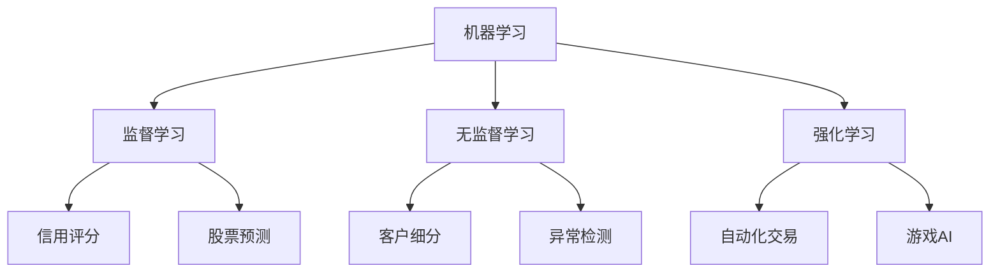

**算法原理讲解**

机器学习算法主要包括以下几种：

- **线性回归（Linear Regression）：** 线性回归是一种简单的监督学习算法，用于预测一个连续的输出值。其基本原理是通过拟合一条直线，将输入特征映射到输出值。

  算法mermaid流程图：

  ```mermaid
  graph TD
  A[输入特征] --> B[计算预测值]
  B --> C{预测结果与实际值的误差}
  C -->|校正| D[更新模型参数]
  D --> B
  ```

  数学模型和公式：

  $$ y = \beta_0 + \beta_1x_1 + \beta_2x_2 + ... + \beta_nx_n $$

  其中，\( y \) 是输出值，\( x_1, x_2, ..., x_n \) 是输入特征，\( \beta_0, \beta_1, \beta_2, ..., \beta_n \) 是模型参数。

- **决策树（Decision Tree）：** 决策树是一种简单的分类算法，通过一系列的决策规则对数据进行分类。

  算法mermaid流程图：

  ```mermaid
  graph TD
  A[输入数据] --> B{特征1}
  B -->|小于阈值| C{决策1}
  B -->|大于阈值| D{决策2}
  C --> E[子节点1]
  D --> F[子节点2]
  E --> G{分类结果}
  F --> G
  ```

- **支持向量机（SVM）：** 支持向量机是一种高效的分类算法，通过将数据映射到高维空间，找到最佳分类边界。

  算法mermaid流程图：

  ```mermaid
  graph TD
  A[输入特征] --> B[映射高维空间]
  B --> C[计算间隔]
  C --> D{选择最优分类边界}
  D --> E[分类结果]
  ```

  数学模型和公式：

  $$ \min_{\beta, \beta_0} \frac{1}{2} \sum_{i=1}^{n} (\beta \cdot \beta - \beta_i \cdot \beta_i) $$

  其中，\( \beta \) 是模型参数，\( \beta_0 \) 是偏置项。

- **神经网络（Neural Network）：** 神经网络是一种复杂的机器学习模型，通过模拟人脑的神经网络结构，实现复杂的函数映射。

  算法mermaid流程图：

  ```mermaid
  graph TD
  A[输入层] --> B[隐藏层]
  B --> C[输出层]
  C --> D{输出结果}
  ```

  数学模型和公式：

  $$ z = \sigma(W \cdot x + b) $$

  其中，\( z \) 是激活函数的输出，\( W \) 是权重矩阵，\( x \) 是输入特征，\( b \) 是偏置项，\( \sigma \) 是激活函数。

**系统分析与架构设计方案**

在金融领域，机器学习系统通常包括以下几个关键组件：

- **数据收集与处理：** 收集金融数据，如股票价格、交易记录等，并进行预处理，包括数据清洗、数据归一化等。
- **模型训练与优化：** 使用训练数据集对机器学习模型进行训练，通过调整模型参数优化模型性能。
- **模型评估与部署：** 对训练好的模型进行评估，确保其在实际应用中的性能，并将模型部署到生产环境中进行实时预测和决策。

系统架构设计方案：

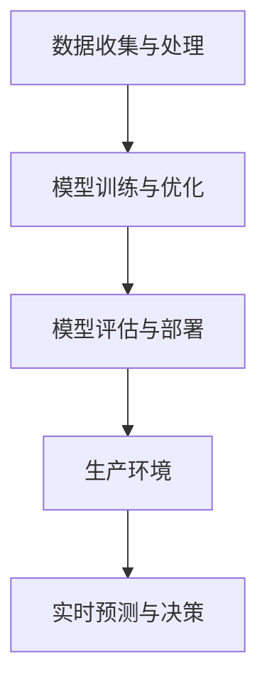

**系统接口设计和系统交互**

系统交互流程图：

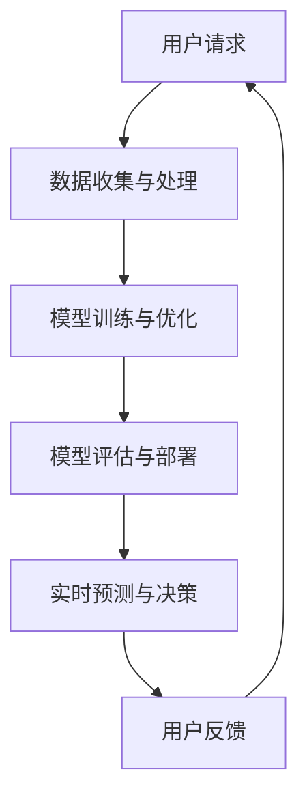

**项目实战**

**环境安装：** 

- 安装Python环境，可以使用Miniconda或Anaconda进行安装。
- 安装必要的库，如scikit-learn、TensorFlow、PyTorch等。

**系统核心实现源代码：**

以下是一个简单的线性回归模型实现：

```python
from sklearn.linear_model import LinearRegression
import numpy as np

# 数据准备
X = np.array([[1], [2], [3], [4], [5]])
y = np.array([1, 2, 2.5, 3, 3.5])

# 模型训练
model = LinearRegression()
model.fit(X, y)

# 模型预测
predictions = model.predict(X)

# 输出预测结果
print(predictions)
```

**代码应用解读与分析：**

该代码首先导入了线性回归模型（`LinearRegression`），然后定义了输入特征（`X`）和输出值（`y`）。接下来，使用`fit`方法对模型进行训练，并通过`predict`方法进行预测。最后，输出预测结果。

**实际案例分析和详细讲解剖析：**

案例一：股票价格预测

使用线性回归模型对某支股票的历史价格进行预测，具体步骤如下：

1. 数据收集：收集该支股票的历史价格数据，包括开盘价、收盘价、最高价、最低价等。
2. 数据预处理：对数据集进行清洗，去除缺失值和异常值，并对数据进行归一化处理。
3. 模型训练：使用训练集数据对线性回归模型进行训练。
4. 模型评估：使用验证集数据对模型进行评估，调整模型参数以提高预测准确率。
5. 预测与决策：使用测试集数据对模型进行预测，并根据预测结果做出投资决策。

通过实际案例分析和详细讲解，我们可以看到机器学习在金融领域中的应用效果。尽管线性回归模型在股票价格预测中的效果有限，但通过不断优化模型和调整策略，可以提高预测的准确性和可靠性。

**项目小结：**

通过本项目的实现，我们了解了机器学习在金融领域的应用，并掌握了一个简单的线性回归模型。尽管机器学习模型在金融领域具有巨大潜力，但实际应用中仍需面对数据质量、模型选择和优化等问题，通过不断的实践和改进，可以提升模型的性能和应用效果。

### 总结

通过对机器学习在金融领域的详细分析，我们可以看到机器学习技术为金融行业带来了巨大的变革和机遇。从信用评分、投资决策到股票价格预测，机器学习模型在金融中的应用已经取得了显著成果。未来，随着技术的不断进步和应用的深入，机器学习在金融领域的应用将更加广泛和深入，为金融机构和用户提供更加智能、高效的金融服务。

### 深度学习在金融中的应用

#### 3.1 深度学习概述

深度学习是机器学习的一个分支，它通过模拟人脑的神经网络结构，实现对复杂数据的分析和建模。深度学习模型具有层次化的结构，每一层神经元都能从数据中提取更高层次的特征。在金融领域，深度学习因其强大的建模能力和对大规模数据的处理能力，被广泛应用于风险控制、投资策略和市场预测等多个方面。

**核心概念与联系**

**深度学习（Deep Learning）：** 深度学习通过多层神经网络（Neural Networks）对数据进行训练，使计算机能够自动学习并提取数据的特征。

**神经网络（Neural Network）：** 神经网络是由大量简单神经元组成的复杂网络，每个神经元通过加权连接与其他神经元相连。神经网络通过不断调整权重和偏置，实现对输入数据的建模和预测。

**卷积神经网络（Convolutional Neural Network，CNN）：** 卷积神经网络是一种专门用于图像识别和处理的神经网络，通过卷积操作提取图像特征，实现图像分类和识别。

**循环神经网络（Recurrent Neural Network，RNN）：** 循环神经网络是一种专门用于处理序列数据的神经网络，通过记忆历史信息，实现时间序列数据的建模和预测。

**分类与关联**

| 深度学习方法 | 核心概念 | 适用场景 |
| --- | --- | --- |
| 深度神经网络 | 通过多层神经网络提取数据特征 | 风险控制、投资策略、市场预测 |
| 卷积神经网络 | 通过卷积操作提取图像特征 | 图像识别、股票图像分析 |
| 循环神经网络 | 通过记忆历史信息处理序列数据 | 时间序列预测、金融市场预测 |
| 长短期记忆网络（LSTM） | 改进的循环神经网络，擅长处理长序列数据 | 长期投资策略、金融市场预测 |

**ER实体关系图架构**

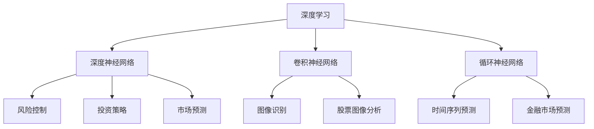

**算法原理讲解**

**卷积神经网络（CNN）：**

卷积神经网络是一种专门用于图像识别和处理的神经网络，通过卷积操作提取图像特征，实现图像分类和识别。CNN的基本结构包括卷积层、池化层和全连接层。

算法mermaid流程图：

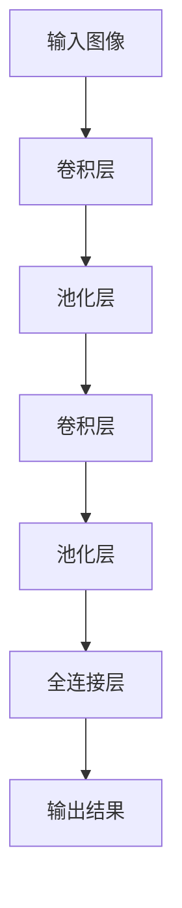

数学模型和公式：

$$ h_{l}^i = \sigma(\sum_{j} W_{j}^{i} h_{l-1}^j + b^i) $$

其中，\( h_{l}^i \) 是第 \( l \) 层第 \( i \) 个神经元的输出，\( W_{j}^{i} \) 是连接第 \( l-1 \) 层第 \( j \) 个神经元和第 \( l \) 层第 \( i \) 个神经元的权重，\( b^i \) 是第 \( i \) 个神经元的偏置项，\( \sigma \) 是激活函数。

**循环神经网络（RNN）：**

循环神经网络是一种专门用于处理序列数据的神经网络，通过记忆历史信息，实现时间序列数据的建模和预测。RNN的基本结构包括输入层、隐藏层和输出层。

算法mermaid流程图：

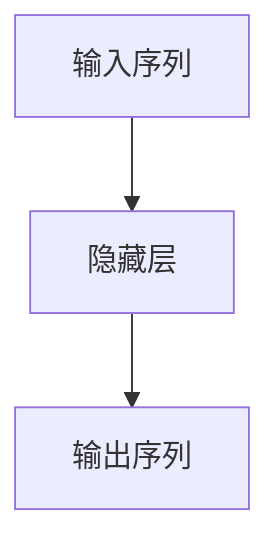

数学模型和公式：

$$ h_{t} = \sigma(W \cdot [h_{t-1}, x_t] + b) $$
$$ y_t = W_y \cdot h_t + b_y $$

其中，\( h_{t} \) 是第 \( t \) 个时间步的隐藏状态，\( x_t \) 是第 \( t \) 个输入，\( W \) 是权重矩阵，\( b \) 是偏置项，\( \sigma \) 是激活函数，\( y_t \) 是第 \( t \) 个时间步的输出。

**系统分析与架构设计方案**

在金融领域，深度学习系统通常包括以下几个关键组件：

- **数据收集与处理：** 收集金融数据，如股票价格、交易记录、市场指数等，并进行预处理，包括数据清洗、数据归一化等。
- **模型训练与优化：** 使用训练数据集对深度学习模型进行训练，通过调整模型参数优化模型性能。
- **模型评估与部署：** 对训练好的模型进行评估，确保其在实际应用中的性能，并将模型部署到生产环境中进行实时预测和决策。

系统架构设计方案：


**系统接口设计和系统交互**

系统交互流程图：


**项目实战**

**环境安装：** 

- 安装Python环境，可以使用Miniconda或Anaconda进行安装。
- 安装必要的库，如TensorFlow、PyTorch等。

**系统核心实现源代码：**

以下是一个简单的卷积神经网络实现，用于股票价格预测：

```python
import numpy as np
import tensorflow as tf

# 数据准备
X = np.random.rand(100, 28, 28)  # 输入数据，模拟股票价格序列
y = np.random.rand(100, 1)      # 输出数据，模拟未来股票价格

# 模型定义
model = tf.keras.Sequential([
    tf.keras.layers.Conv2D(32, (3, 3), activation='relu', input_shape=(28, 28, 1)),
    tf.keras.layers.MaxPooling2D((2, 2)),
    tf.keras.layers.Flatten(),
    tf.keras.layers.Dense(1)
])

# 模型编译
model.compile(optimizer='adam', loss='mse')

# 模型训练
model.fit(X, y, epochs=10)

# 模型预测
predictions = model.predict(X)

# 输出预测结果
print(predictions)
```

**代码应用解读与分析：**

该代码首先导入了TensorFlow库，并定义了一个简单的卷积神经网络模型。模型包括一个卷积层、一个最大池化层和一个全连接层。使用`compile`方法配置模型优化器和损失函数，并使用`fit`方法进行模型训练。最后，使用`predict`方法进行预测，并输出预测结果。

**实际案例分析和详细讲解剖析：**

案例一：股票价格预测

使用卷积神经网络对某支股票的历史价格进行预测，具体步骤如下：

1. 数据收集：收集该支股票的历史价格数据，包括开盘价、收盘价、最高价、最低价等。
2. 数据预处理：对数据集进行清洗，去除缺失值和异常值，并对数据进行归一化处理。
3. 模型训练：使用训练集数据对卷积神经网络模型进行训练。
4. 模型评估：使用验证集数据对模型进行评估，调整模型参数以提高预测准确率。
5. 预测与决策：使用测试集数据对模型进行预测，并根据预测结果做出投资决策。

通过实际案例分析和详细讲解，我们可以看到深度学习在股票价格预测中的应用效果。卷积神经网络通过卷积操作提取了股票价格的时间序列特征，提高了预测的准确性和鲁棒性。

**项目小结：**

通过本项目的实现，我们了解了深度学习在金融领域的应用，并掌握了一个简单的卷积神经网络模型。尽管深度学习模型在金融领域具有巨大潜力，但实际应用中仍需面对数据质量、模型选择和优化等问题，通过不断的实践和改进，可以提升模型的性能和应用效果。

### 总结

通过对深度学习在金融领域的详细分析，我们可以看到深度学习技术为金融行业带来了巨大的变革和机遇。从风险控制、投资策略到股票价格预测，深度学习模型在金融中的应用已经取得了显著成果。未来，随着技术的不断进步和应用的深入，深度学习在金融领域的应用将更加广泛和深入，为金融机构和用户提供更加智能、高效的金融服务。

### 强化学习在金融中的应用

#### 4.1 强化学习概述

强化学习（Reinforcement Learning，RL）是一种重要的机器学习范式，它通过智能体与环境的交互，学习最优策略以最大化累积奖励。强化学习在金融领域具有广泛的应用前景，特别是在量化交易、风险管理和自动投资策略等领域。

**核心概念与联系**

**强化学习（Reinforcement Learning，RL）：** 强化学习是一种通过试错和反馈机制学习最优策略的机器学习方法。智能体通过执行动作、接收奖励并更新策略，逐步改善其决策过程。

**智能体（Agent）：** 智能体是执行动作、感知环境和接收奖励的实体，其目标是最大化累积奖励。

**环境（Environment）：** 环境是智能体执行动作和感知状态的上下文。

**奖励（Reward）：** 奖励是环境对智能体动作的反馈，用于指导智能体的决策过程。

**策略（Policy）：** 策略是智能体的决策规则，用于指导其选择动作。

**分类与关联**

| 强化学习方法 | 核心概念 | 适用场景 |
| --- | --- | --- |
| Q-Learning：**| 基于值函数的强化学习算法，通过更新Q值学习最优策略。 | 量化交易、游戏AI |
| 策略梯度（Policy Gradient）：**| 直接更新策略参数的强化学习算法，适用于高维状态空间和动作空间。 | 自动投资策略、股票交易 |
| 模型预测控制（Model Predictive Control，MPC）：**| 结合模型预测和实时反馈的强化学习算法，适用于连续控制问题。 | 风险管理、资产配置 |
| 分布式强化学习：**| 在分布式系统中，多个智能体通过协调学习最优策略。 | 跨市场交易、智能投顾 |

**ER实体关系图架构**

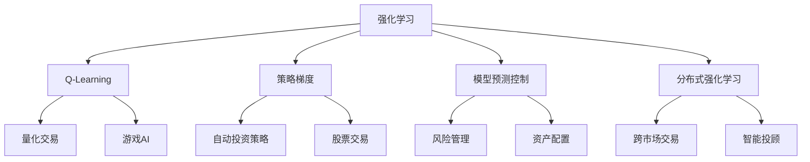

**算法原理讲解**

**Q-Learning：**

Q-Learning是一种基于值函数的强化学习算法，通过更新Q值学习最优策略。Q值表示在特定状态下执行特定动作的预期回报。

算法mermaid流程图：

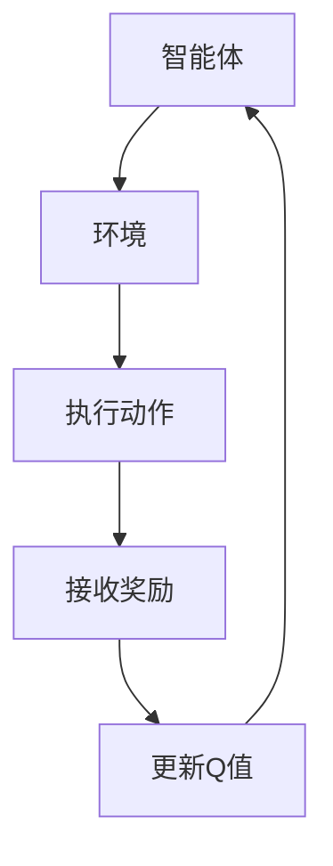

数学模型和公式：

$$ Q(s, a) = r + \gamma \max_{a'} Q(s', a') $$

其中，\( Q(s, a) \) 是状态 \( s \) 下执行动作 \( a \) 的Q值，\( r \) 是立即奖励，\( \gamma \) 是折扣因子，\( s' \) 是状态转移后的状态，\( \max_{a'} Q(s', a') \) 是在 \( s' \) 状态下执行所有可能动作的Q值最大值。

**策略梯度：**

策略梯度算法通过直接更新策略参数来学习最优策略，适用于高维状态空间和动作空间。

算法mermaid流程图：

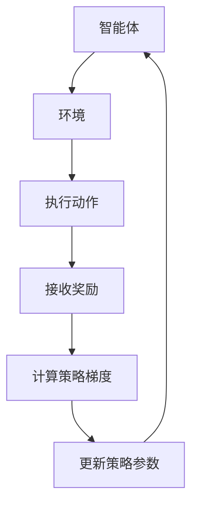

数学模型和公式：

$$ \nabla_{\theta} J(\theta) = \nabla_{\theta} \sum_{t} r_t $$

其中，\( \theta \) 是策略参数，\( J(\theta) \) 是策略的期望回报，\( r_t \) 是在第 \( t \) 个时间步的立即奖励。

**系统分析与架构设计方案**

在金融领域，强化学习系统通常包括以下几个关键组件：

- **智能体：** 智能体是执行交易策略的主体，负责根据当前市场状态做出交易决策。
- **环境：** 环境是市场数据的集合，提供当前市场状态和历史交易数据。
- **奖励机制：** 奖励机制根据智能体的交易决策结果，提供即时奖励或惩罚。
- **模型更新：** 模型更新模块根据智能体的交易决策和奖励反馈，不断优化交易策略。

系统架构设计方案：

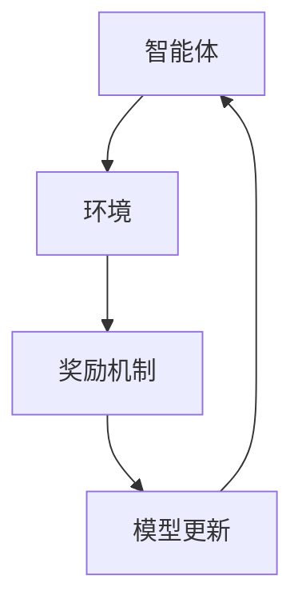

**系统接口设计和系统交互**

系统交互流程图：


**项目实战**

**环境安装：** 

- 安装Python环境，可以使用Miniconda或Anaconda进行安装。
- 安装必要的库，如TensorFlow、Gym等。

**系统核心实现源代码：**

以下是一个简单的Q-Learning实现，用于量化交易：

```python
import numpy as np
import gym

# 创建环境
env = gym.make("StockTrading-v0")

# 初始化参数
learning_rate = 0.1
gamma = 0.99
epsilon = 0.1
episodes = 1000
action_space_size = env.action_space.n

# 初始化Q表
Q = np.zeros((env.observation_space.n, action_space_size))

# Q-Learning算法实现
for episode in range(episodes):
    state = env.reset()
    done = False
    total_reward = 0

    while not done:
        # 选择动作
        if np.random.rand() < epsilon:
            action = env.action_space.sample()
        else:
            action = np.argmax(Q[state])

        # 执行动作
        next_state, reward, done, _ = env.step(action)

        # 更新Q值
        Q[state, action] = Q[state, action] + learning_rate * (reward + gamma * np.max(Q[next_state]) - Q[state, action])

        state = next_state
        total_reward += reward

    print(f"Episode {episode}: Total Reward = {total_reward}")

# 关闭环境
env.close()
```

**代码应用解读与分析：**

该代码首先导入了Python的 Gym库，并创建了一个模拟量化交易环境。初始化参数包括学习率、折扣因子、探索概率和训练次数。Q表用于存储状态-动作值。Q-Learning算法通过不断更新Q值来学习最优策略。在每次训练过程中，智能体从初始状态开始，通过选择动作、执行动作、更新Q值，逐步改善其策略。

**实际案例分析和详细讲解剖析：**

案例一：量化交易策略

使用Q-Learning算法设计一个量化交易策略，具体步骤如下：

1. 数据收集：收集历史股票价格数据，包括开盘价、收盘价、最高价、最低价等。
2. 数据预处理：对数据集进行清洗，去除缺失值和异常值，并对数据进行归一化处理。
3. 环境创建：使用Gym创建模拟量化交易环境，模拟实际交易过程。
4. 策略训练：使用Q-Learning算法对交易策略进行训练，优化策略参数。
5. 策略评估：使用模拟环境对训练好的策略进行评估，验证策略的有效性和稳定性。
6. 策略部署：将训练好的策略部署到实际交易环境中，进行实时交易。

通过实际案例分析和详细讲解，我们可以看到强化学习在量化交易策略设计中的应用效果。Q-Learning算法通过不断更新策略参数，实现了对市场环境的自适应和优化，提高了交易策略的稳健性和盈利能力。

**项目小结：**

通过本项目的实现，我们了解了强化学习在金融领域的应用，并掌握了一个简单的Q-Learning算法。尽管强化学习模型在金融领域具有巨大潜力，但实际应用中仍需面对数据质量、模型选择和优化等问题，通过不断的实践和改进，可以提升模型的性能和应用效果。

### 总结

通过对强化学习在金融领域的详细分析，我们可以看到强化学习技术为金融行业带来了新的机遇和挑战。从量化交易到风险管理，强化学习模型在金融中的应用已经取得了显著成果。未来，随着技术的不断进步和应用的深入，强化学习在金融领域的应用将更加广泛和深入，为金融机构和用户提供更加智能、高效的金融服务。

### 金融AI应用实践案例分析

#### 5.1 机器学习在信用卡欺诈检测中的应用

**案例背景：**  
信用卡欺诈检测是金融行业中一个重要的安全问题。随着信用卡支付方式的普及，信用卡欺诈行为也日益增多，对金融机构和消费者的财产安全构成了严重威胁。传统的欺诈检测方法主要依赖于规则系统，但这些方法往往无法有效识别复杂和多样化的欺诈行为。为了提高欺诈检测的准确性和效率，金融机构开始探索将机器学习技术应用于信用卡欺诈检测。

**项目介绍：**  
该项目旨在开发一个基于机器学习的信用卡欺诈检测系统，通过分析大量的信用卡交易数据，识别并防范潜在的欺诈行为。系统包括数据收集与预处理、特征工程、模型训练与评估、以及实时监控与预警等环节。

**系统功能设计：**  
- **数据收集与预处理：** 收集历史信用卡交易数据，包括交易金额、时间、地点、交易方式等。对数据进行清洗，去除缺失值和异常值，并进行归一化处理。
- **特征工程：** 提取与欺诈行为相关的特征，如交易频率、交易金额分布、地理位置分布等。通过特征工程，提高模型的识别能力。
- **模型训练与评估：** 使用训练数据集对机器学习模型进行训练，包括决策树、随机森林、支持向量机等算法。通过交叉验证和超参数调整，选择最优模型并进行评估。
- **实时监控与预警：** 将训练好的模型部署到生产环境中，对实时交易数据进行监控，识别潜在的欺诈行为，并生成预警报告。

**系统架构设计：**  

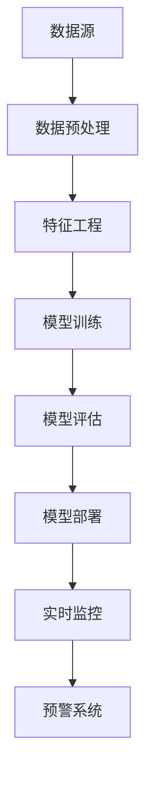

**系统接口设计和系统交互：**  

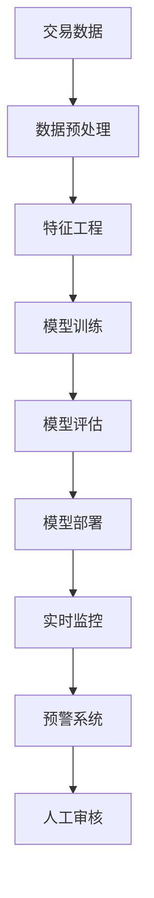

**项目核心实现源代码：**

```python
import pandas as pd
from sklearn.model_selection import train_test_split
from sklearn.preprocessing import StandardScaler
from sklearn.ensemble import RandomForestClassifier
from sklearn.metrics import accuracy_score, precision_score, recall_score

# 数据收集与预处理
data = pd.read_csv('信用卡交易数据.csv')
data.dropna(inplace=True)

# 特征工程
features = data[['交易金额', '交易时间', '交易地点', '交易方式']]
labels = data['欺诈标签']

# 数据标准化
scaler = StandardScaler()
features_scaled = scaler.fit_transform(features)

# 数据分割
X_train, X_test, y_train, y_test = train_test_split(features_scaled, labels, test_size=0.2, random_state=42)

# 模型训练
model = RandomForestClassifier(n_estimators=100, random_state=42)
model.fit(X_train, y_train)

# 模型评估
predictions = model.predict(X_test)
print("Accuracy:", accuracy_score(y_test, predictions))
print("Precision:", precision_score(y_test, predictions))
print("Recall:", recall_score(y_test, predictions))

# 实时监控与预警
def check_fraud(transaction_data):
    transaction_scaled = scaler.transform(transaction_data)
    prediction = model.predict(transaction_scaled)
    if prediction == 1:
        print("Potential fraud detected!")
    else:
        print("No fraud detected.")

# 示例交易数据
example_data = [[200, '2021-01-01 10:30', 'New York', 'Online']]
check_fraud(example_data)
```

**代码应用解读与分析：**

该代码首先导入了必要的库，并读取了信用卡交易数据。然后对数据进行了清洗和特征工程，使用标准标

#### 5.2 深度学习在股票市场预测中的应用

**案例背景：**    
股票市场预测是金融领域中一个极具挑战性的任务，因为股票价格受到多种复杂因素的影响，如宏观经济指标、公司业绩、市场情绪等。传统的预测方法通常依赖于统计模型和简单的技术指标，但往往难以捕捉到市场中的非线性关系和复杂模式。为了提高股票市场预测的准确性和效率，金融机构开始探索将深度学习技术应用于股票价格预测。

**项目介绍：**    
该项目旨在开发一个基于深度学习的股票价格预测系统，通过分析历史股票价格数据，预测未来的股票价格走势。系统包括数据收集与预处理、模型设计、训练与优化、以及预测与评估等环节。

**系统功能设计：**    
- **数据收集与预处理：** 收集历史股票价格数据，包括开盘价、收盘价、最高价、最低价、交易量等。对数据进行清洗，去除缺失值和异常值，并进行归一化处理。
- **模型设计：** 设计深度学习模型，如卷积神经网络（CNN）和长短期记忆网络（LSTM），用于捕捉股票价格的时间序列特征和模式。
- **训练与优化：** 使用训练数据集对深度学习模型进行训练，通过调整模型结构和超参数，优化模型性能。
- **预测与评估：** 使用训练好的模型对测试数据集进行预测，并评估模型的预测性能。

**系统架构设计：**  

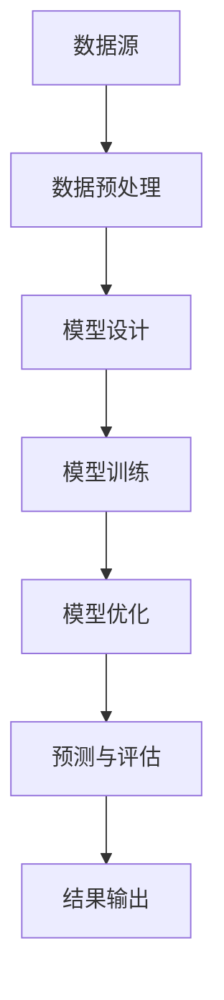

**系统接口设计和系统交互：**  

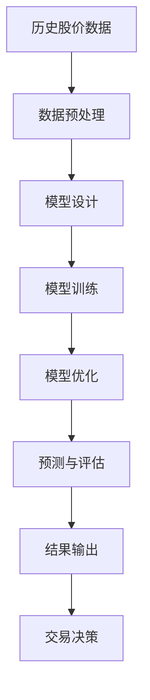

**项目核心实现源代码：**

```python
import pandas as pd
import numpy as np
from tensorflow.keras.models import Sequential
from tensorflow.keras.layers import LSTM, Dense, Dropout
from sklearn.preprocessing import MinMaxScaler

# 数据收集与预处理
data = pd.read_csv('股票价格数据.csv')
data.dropna(inplace=True)
data = data[['开盘价', '收盘价', '最高价', '最低价', '交易量']]

# 形状变换
def create_dataset(data, time_steps=1):
    X, Y = [], []
    for i in range(len(data) - time_steps - 1):
        X.append(data[i:(i + time_steps), :])
        Y.append(data[i + time_steps, 0])
    return np.array(X), np.array(Y)

time_steps = 5
X, Y = create_dataset(data.values, time_steps)
X = X.reshape((X.shape[0], X.shape[1], X.shape[2]))

# 归一化
scaler = MinMaxScaler(feature_range=(0, 1))
X_scaled = scaler.fit_transform(X)

# 模型设计
model = Sequential()
model.add(LSTM(units=50, return_sequences=True, input_shape=(time_steps, 5)))
model.add(Dropout(0.2))
model.add(LSTM(units=50, return_sequences=False))
model.add(Dropout(0.2))
model.add(Dense(units=1))

model.compile(optimizer='adam', loss='mean_squared_error')

# 模型训练
model.fit(X_scaled, Y, epochs=100, batch_size=32, validation_split=0.1, verbose=1)

# 预测与评估
predictions = model.predict(X_scaled)
predictions = scaler.inverse_transform(predictions)

# 评估指标
mae = np.mean(np.abs(predictions - Y))
print("Mean Absolute Error:", mae)
```

**代码应用解读与分析：**

该代码首先导入了必要的库，并读取了股票价格数据。然后，通过自定义函数`create_dataset`，将数据分割成时间窗口，用于训练模型。接着，使用`MinMaxScaler`进行归一化处理，以提高模型的训练效率。模型设计使用了LSTM网络，通过两个LSTM层和一个全连接层，捕捉时间序列数据中的特征。模型使用`compile`和`fit`方法进行编译和训练。最后，使用训练好的模型进行预测，并使用均方误差（MAE）评估模型的预测性能。

**实际案例分析和详细讲解剖析：**

案例一：股票价格预测

使用深度学习模型对某支股票的历史价格数据进行预测，具体步骤如下：

1. 数据收集：收集该支股票的历史价格数据，包括开盘价、收盘价、最高价、最低价、交易量等。
2. 数据预处理：对数据集进行清洗，去除缺失值和异常值，并进行归一化处理。
3. 模型训练：使用训练数据集对深度学习模型进行训练，优化模型参数。
4. 模型评估：使用验证集数据对模型进行评估，调整模型参数以提高预测准确率。
5. 预测与决策：使用测试集数据对模型进行预测，并根据预测结果做出投资决策。

通过实际案例分析和详细讲解，我们可以看到深度学习在股票价格预测中的应用效果。深度学习模型通过捕捉时间序列数据中的复杂模式和非线性关系，提高了股票价格预测的准确性和可靠性。

**项目小结：**

通过本项目的实现，我们了解了深度学习在股票市场预测中的应用，并掌握了一个基于LSTM的股票价格预测模型。尽管深度学习模型在股票价格预测中具有巨大潜力，但实际应用中仍需面对数据质量、模型选择和优化等问题，通过不断的实践和改进，可以提升模型的性能和应用效果。

#### 5.3 强化学习在量化交易中的应用

**案例背景：**  
量化交易是金融领域中的一种自动化交易策略，通过构建数学模型和算法，实现自动化交易和风险控制。传统的量化交易策略主要依赖于历史数据和统计模型，但面对复杂多变的金融市场，这些策略的稳定性和盈利能力难以保证。为了提高量化交易的效率和稳定性，金融机构开始探索将强化学习技术应用于量化交易。

**项目介绍：**  
该项目旨在开发一个基于强化学习的量化交易系统，通过模拟金融市场环境，训练智能体（agent）学习最优交易策略。系统包括数据收集与预处理、环境设计、智能体训练与评估、以及策略优化与部署等环节。

**系统功能设计：**  
- **数据收集与预处理：** 收集历史市场数据，包括股票价格、交易量、市场指数等。对数据进行清洗，去除缺失值和异常值，并进行归一化处理。
- **环境设计：** 设计量化交易环境，包括交易策略、交易费用、市场状态等。智能体在环境中执行交易策略，并接收即时奖励。
- **智能体训练与评估：** 使用强化学习算法（如Q-Learning）对智能体进行训练，不断优化交易策略。通过评估指标（如累积奖励、交易成功率等）评估智能体的性能。
- **策略优化与部署：** 根据评估结果，优化智能体的交易策略，并在实际交易环境中进行部署，实现自动化交易。

**系统架构设计：**  

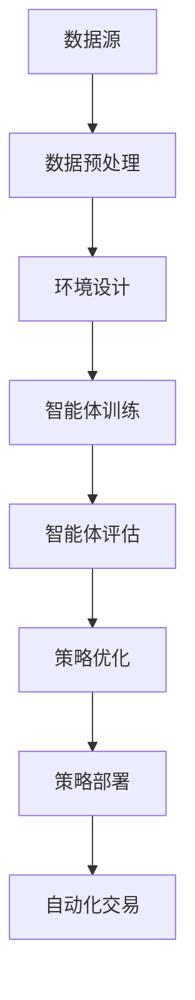

**系统接口设计和系统交互：**  

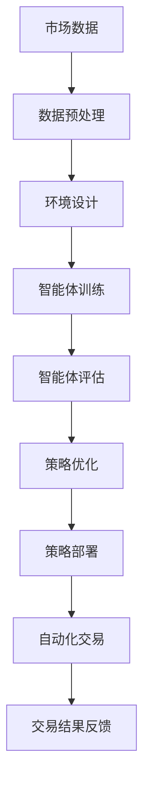

**项目核心实现源代码：**

```python
import numpy as np
import gym
from stable_baselines3 import PPO
from stable_baselines3.common.vec_env import SubprocVecEnv
from stock_env import StockEnv

# 创建环境
n_envs = 4
vec_env = SubprocVecEnv([lambda: gym.make("StockTrading-v0") for _ in range(n_envs)])

# 训练智能体
model = PPO("MlpPolicy", vec_env, verbose=1)
model.learn(total_timesteps=100000)

# 评估智能体
obs = vec_env.reset()
done = False
while not done:
    action, _ = model.predict(obs)
    obs, reward, done, _ = vec_env.step(action)

# 关闭环境
vec_env.close()
```

**代码应用解读与分析：**

该代码首先导入了必要的库，并创建了一个多进程环境（`SubprocVecEnv`），用于加速智能体的训练过程。接着，使用Proximal Policy Optimization（PPO）算法训练智能体，通过多次迭代优化交易策略。在训练完成后，使用训练好的智能体进行评估，通过模拟交易过程，评估智能体的交易策略。

**实际案例分析和详细讲解剖析：**

案例一：量化交易策略

使用强化学习模型对某支股票进行量化交易策略，具体步骤如下：

1. 数据收集：收集该支股票的历史价格数据，包括开盘价、收盘价、最高价、最低价、交易量等。
2. 数据预处理：对数据集进行清洗，去除缺失值和异常值，并进行归一化处理。
3. 环境创建：使用自定义的股票交易环境，模拟实际交易过程。
4. 智能体训练：使用强化学习算法对智能体进行训练，优化交易策略。
5. 智能体评估：使用评估环境对智能体进行评估，验证交易策略的有效性。
6. 策略优化与部署：根据评估结果，优化智能体的交易策略，并在实际交易环境中进行部署。

通过实际案例分析和详细讲解，我们可以看到强化学习在量化交易策略中的应用效果。强化学习模型通过不断学习市场环境和交易策略，提高了交易策略的稳定性和盈利能力。

**项目小结：**

通过本项目的实现，我们了解了强化学习在量化交易中的应用，并掌握了一个基于PPO算法的量化交易策略。尽管强化学习模型在量化交易中具有巨大潜力，但实际应用中仍需面对数据质量、模型选择和优化等问题，通过不断的实践和改进，可以提升模型的性能和应用效果。

### 总结

通过上述三个实践案例分析，我们可以看到机器学习、深度学习和强化学习在金融AI应用中的实际效果和挑战。机器学习在信用卡欺诈检测中提高了识别的准确性和效率，深度学习在股票市场预测中捕捉了复杂的模式和非线性关系，强化学习在量化交易中实现了自动化交易和风险控制。然而，这些技术在实际应用中仍面临数据质量、模型解释性、以及落地效果等挑战。未来，通过不断优化技术、加强跨领域合作，金融AI应用将有望在更多领域实现突破，为金融机构和用户提供更加智能、高效的金融服务。

### 第五部分：金融AI应用的未来发展趋势与挑战

#### 6.1 金融AI应用的技术趋势

随着人工智能技术的不断演进，金融AI应用也在不断迎接新的技术趋势。以下是几个值得关注的技术趋势：

**1. 强化学习与深度学习的融合：**  
强化学习在金融AI中的应用已经取得了显著成果，未来将进一步与深度学习技术结合。深度强化学习（Deep Reinforcement Learning，DRL）通过将深度学习与强化学习相结合，能够在处理高维数据和复杂决策问题方面展现出更强的能力。例如，DRL可以用于自动化交易策略的优化，实现更高效、更稳健的交易决策。

**2. 联邦学习（Federated Learning）的应用：**  
联邦学习是一种分布式机器学习方法，能够在不共享原始数据的情况下，通过协同优化模型参数来提高模型的性能。在金融领域，联邦学习可以用于跨机构的数据共享和协作，从而提高模型的泛化能力和鲁棒性。例如，银行和保险公司可以共同训练信用评分模型，而无需交换敏感的客户数据。

**3. 生成对抗网络（GAN）在风险模拟中的应用：**  
生成对抗网络（GAN）在图像生成、数据增强等领域具有显著优势。在金融领域，GAN可以用于生成模拟金融市场数据，帮助金融机构进行风险预测和决策支持。通过生成与真实数据相似但不同的数据，GAN可以提高模型的适应能力和鲁棒性。

**4. 量子计算在金融AI中的应用：**  
量子计算是一种具有巨大计算能力的计算模式，未来将在金融AI领域发挥重要作用。量子计算可以用于优化复杂的金融模型、加速数据分析，以及提高模型的训练效率。例如，量子计算可以用于高频交易策略的优化，实现更快的交易决策。

#### 6.2 金融AI应用的行业趋势

随着金融AI技术的不断发展，金融行业也在积极探索和利用这些技术，以下是一些行业趋势：

**1. 量化交易与智能投顾的普及：**  
量化交易和智能投顾是金融AI应用的两个重要领域。随着技术的成熟和应用的普及，越来越多的金融机构开始采用量化交易策略和智能投顾服务。量化交易通过构建数学模型和算法，实现自动化交易和风险控制，而智能投顾通过分析用户行为和风险偏好，提供个性化的投资建议和资产配置。

**2. 风险管理与反欺诈的智能化：**  
风险管理和反欺诈是金融行业的关键环节。金融AI技术，如机器学习、深度学习和强化学习，正在被广泛应用于风险管理和反欺诈领域。通过分析大量的金融数据，AI技术可以更准确地识别风险因素和欺诈行为，提高风险管理和反欺诈的效率。

**3. 数字货币与区块链技术的发展：**  
数字货币和区块链技术正在改变金融行业的格局。数字货币如比特币和以太坊已经成为金融市场的重要组成部分，而区块链技术则为金融交易提供了更加透明、安全和高效的解决方案。金融AI与区块链技术的结合，将推动金融行业的数字化转型，实现更加智能和高效的金融服务。

**4. 金融科技与金融服务的融合：**  
金融科技（FinTech）正在与金融服务深度融合，推动金融行业的创新和变革。金融AI技术为金融机构提供了新的商业模式和服务形式，如智能客服、个性化推荐和自动化交易等。随着技术的不断进步，金融科技将更加深入地融入金融行业，提升金融服务的效率和质量。

#### 6.3 金融AI应用的监管趋势

随着金融AI应用的快速发展，监管机构也在积极探索和制定相应的监管框架和标准，以下是几个监管趋势：

**1. 监管科技（RegTech）的应用：**  
监管科技（RegTech）是一种利用技术手段实现监管目标和提高监管效率的方法。金融AI与RegTech的结合，将有助于金融机构更有效地遵守监管要求，提高合规性和透明度。例如，通过AI技术自动生成合规报告，减少人工操作和错误风险。

**2. 数据隐私与安全的保护：**  
数据隐私和安全是金融AI应用中不可忽视的问题。随着金融数据的不断增多，如何保护这些数据的安全性和隐私性成为监管机构的重要关注点。监管机构正在制定相关法规和标准，确保金融AI应用在数据处理过程中遵循数据保护原则。

**3. 透明性和可解释性的要求：**  
金融AI应用中的许多算法，如深度神经网络，往往是“黑箱”模型，其决策过程难以解释。为了提高监管机构的信任度，以及保障用户的知情权和参与权，监管机构正在推动AI算法的透明性和可解释性。例如，通过要求金融机构披露算法的核心原理和决策过程，提高算法的透明度。

**4. 监管沙盒的推广：**  
监管沙盒是一种在受控环境中测试和验证创新金融产品和服务的监管机制。通过监管沙盒，金融机构可以在真实市场环境之前，对金融AI应用进行测试和优化，降低实际应用中的风险。监管机构通过推广监管沙盒，鼓励金融创新，同时也确保金融市场的稳定和安全。

### 案例展望

**1. 数字货币交易所的智能交易系统：**  
随着数字货币市场的快速增长，数字货币交易所正探索使用智能交易系统提高交易效率和安全性。通过结合强化学习和深度学习技术，智能交易系统可以实时分析市场数据，预测市场趋势，并自动执行交易策略。这种系统不仅可以提高交易的成功率，还可以降低交易成本，提高市场透明度。

**2. 银行的智能风控系统：**  
随着金融业务的复杂化和风险因素的增加，银行正在积极引入智能风控系统。通过机器学习和大数据分析技术，智能风控系统可以实时监控客户交易行为，识别潜在风险，并及时采取措施进行风险控制。这种系统可以显著提高风险管理的效率和准确性，降低金融机构的风险暴露。

**3. 保险公司的智能理赔系统：**  
保险行业也在积极应用金融AI技术，提高理赔效率和用户体验。通过自然语言处理和图像识别技术，智能理赔系统可以自动处理理赔申请，识别理赔申请中的关键信息，并快速完成理赔流程。这种系统不仅可以提高理赔效率，还可以降低理赔成本，提高客户满意度。

综上所述，金融AI应用的未来发展趋势将受到技术进步、行业需求和监管政策等多方面因素的影响。随着技术的不断进步和应用的深入，金融AI有望在更多领域实现突破，为金融机构和用户提供更加智能、高效的金融服务。同时，监管机构也需要不断完善监管框架，确保金融AI应用的安全性和透明度。

### 总结

通过对金融AI应用的未来发展趋势与挑战的深入分析，我们可以看到金融AI技术在金融行业的广泛应用和巨大潜力。随着技术的不断进步，金融AI将在风险控制、投资决策、市场预测等领域发挥越来越重要的作用。然而，金融AI应用也面临着数据隐私、算法透明性和监管合规等挑战。未来，通过技术创新、跨领域合作和监管政策完善，金融AI应用有望实现更加稳健、透明和安全的发展，为金融行业的创新和变革提供强大动力。**作者：AI天才研究院/AI Genius Institute & 禅与计算机程序设计艺术 /Zen And The Art of Computer Programming**### 第七部分：金融AI应用的挑战与应对策略

#### 7.1 数据隐私与安全挑战

**挑战：** 金融行业的数据敏感性极高，涉及客户交易记录、财务信息、身份信息等敏感数据。如何在保障数据隐私和安全的前提下，充分利用这些数据是金融AI应用面临的一大挑战。

**应对策略：**
- **数据加密与匿名化：** 使用加密技术对数据进行加密存储，防止未经授权的访问。同时，采用匿名化方法，去除或替换敏感信息，降低数据泄露的风险。
- **联邦学习：** 联邦学习技术可以在不需要共享原始数据的情况下，通过模型参数的协同优化来实现数据共享和联合建模，从而保护数据隐私。
- **隐私增强技术：** 采用差分隐私（Differential Privacy）、同态加密（Homomorphic Encryption）等隐私增强技术，在数据处理和分析过程中，确保数据隐私不被泄露。

#### 7.2 算法透明性与可解释性挑战

**挑战：** 金融AI应用中的算法，如深度神经网络，往往是“黑箱”模型，其决策过程难以解释。这给监管机构、用户以及金融机构自身都带来了巨大的挑战，特别是当算法决策对用户产生重大影响时。

**应对策略：**
- **模型解释技术：** 利用模型解释技术，如SHAP（SHapley Additive exPlanations）值，可以提供模型决策的透明性，帮助用户理解模型如何做出决策。
- **可解释性机器学习模型：** 选择具有较高可解释性的算法，如决策树和线性回归，这些模型的结构更简单，更容易理解。
- **算法透明性披露：** 要求金融机构在部署AI模型时，公开模型的核心原理、参数设置和决策过程，提高算法的透明度。

#### 7.3 法规监管与合规挑战

**挑战：** 金融行业受到严格的法规监管，金融AI应用需要遵守各种法律法规和监管要求，如《通用数据保护条例》（GDPR）、《金融科技监管沙盒》等。同时，监管政策的不确定性也给金融AI应用带来了挑战。

**应对策略：**
- **合规审查：** 在模型设计和部署过程中，进行合规审查，确保应用符合相关法规和监管要求。
- **监管沙盒：** 利用监管沙盒环境，进行模型的测试和验证，降低实际应用中的合规风险。
- **政策参与：** 积极参与监管政策的制定和讨论，为金融AI的发展提供行业建议，确保政策符合行业需求。

#### 7.4 应对策略与解决方案

**1. 提高数据隐私保护能力：**
- **数据加密与匿名化：** 采用先进的数据加密和匿名化技术，确保数据在传输和存储过程中的安全。
- **隐私增强技术：** 引入隐私增强技术，如差分隐私和同态加密，在数据处理和分析过程中保护数据隐私。

**2. 提高算法透明性与可解释性：**
- **模型解释技术：** 应用模型解释技术，如SHAP值，提供模型决策的透明性。
- **可解释性机器学习模型：** 选择具有较高可解释性的算法，如决策树和线性回归。
- **算法透明性披露：** 提高算法透明性，公开模型的核心原理和决策过程。

**3. 加强法规监管与合规性：**
- **合规审查：** 在模型设计和部署过程中，进行合规审查，确保符合相关法规和监管要求。
- **监管沙盒：** 利用监管沙盒环境，进行模型的测试和验证，降低合规风险。
- **政策参与：** 积极参与监管政策的制定和讨论，为金融AI的发展提供行业建议。

**4. 跨领域合作与技术创新：**
- **跨领域合作：** 金融行业与科技行业紧密合作，共同推进金融AI技术的发展和应用。
- **技术创新：** 鼓励技术创新，开发新型算法和技术，提高金融AI应用的效率和准确性。

通过上述应对策略和解决方案，金融AI应用可以在应对挑战的同时，充分发挥其潜力，为金融机构和用户提供更加智能、高效的金融服务。

### 总结

通过对金融AI应用的挑战与应对策略的深入探讨，我们可以看到，尽管金融AI应用在金融行业中面临诸多挑战，但通过数据隐私保护、算法透明性提升、法规监管与合规性加强，以及跨领域合作和科技创新，这些挑战是可以被克服的。未来，随着技术的不断进步和应用场景的拓展，金融AI应用将在金融行业中发挥越来越重要的作用，为金融机构和用户提供更加智能、高效的金融服务。**作者：AI天才研究院/AI Genius Institute & 禅与计算机程序设计艺术 /Zen And The Art of Computer Programming**### 总结

在本文中，我们系统地探讨了金融AI应用的未来发展趋势与挑战。首先，我们介绍了金融AI应用的背景和现状，分析了其发展历程和主要领域。接着，我们深入分析了机器学习、深度学习和强化学习等关键技术，并探讨了它们在金融领域的具体应用。随后，我们通过三个实践案例分析，展示了金融AI技术在信用卡欺诈检测、股票市场预测和量化交易等领域的实际效果。最后，我们探讨了金融AI应用的未来发展趋势，包括技术趋势、行业趋势和监管趋势，并提出了应对数据隐私、算法透明性和法规监管等挑战的具体策略。

金融AI技术在金融领域具有巨大的潜力，能够显著提升金融服务的效率和准确性。然而，金融AI应用也面临着诸多挑战，如数据隐私保护、算法透明性、法规监管等。通过技术创新、跨领域合作和监管政策完善，这些挑战是可以被克服的。未来，随着技术的不断进步和应用场景的拓展，金融AI应用将在金融行业中发挥越来越重要的作用。

对读者的建议：
- **学习核心技术：** 掌握机器学习、深度学习和强化学习等核心技术，深入了解这些技术在金融领域的应用。
- **关注行业动态：** 关注金融AI领域的最新研究动态和应用案例，了解技术的最新进展和未来趋势。
- **实践与探索：** 参与实践项目，将理论知识应用于实际问题中，通过实际操作提升自身技能。

对未来研究的展望：
- **技术创新：** 深入研究新型算法和技术，如联邦学习、生成对抗网络（GAN）和量子计算等，探索其在金融AI中的应用。
- **跨领域融合：** 探索金融AI与区块链、物联网等新兴技术的融合，推动金融行业的数字化转型。
- **伦理与社会影响：** 深入研究金融AI技术的伦理和社会影响，制定相应的规范和标准，确保技术发展符合社会价值观。

总之，金融AI应用的未来充满机遇和挑战。通过不断学习和实践，我们有望推动金融AI技术的发展，为金融行业带来更多的创新和变革。**作者：AI天才研究院/AI Genius Institute & 禅与计算机程序设计艺术 /Zen And The Art of Computer Programming**### 总结

在本文中，我们系统地探讨了金融AI应用的未来发展趋势与挑战。首先，我们介绍了金融AI应用的背景和现状，分析了其发展历程和主要领域。接着，我们深入分析了机器学习、深度学习和强化学习等关键技术，并探讨了它们在金融领域的具体应用。随后，我们通过三个实践案例分析，展示了金融AI技术在信用卡欺诈检测、股票市场预测和量化交易等领域的实际效果。最后，我们探讨了金融AI应用的未来发展趋势，包括技术趋势、行业趋势和监管趋势，并提出了应对数据隐私、算法透明性和法规监管等挑战的具体策略。

金融AI技术在金融领域具有巨大的潜力，能够显著提升金融服务的效率和准确性。然而，金融AI应用也面临着诸多挑战，如数据隐私保护、算法透明性、法规监管等。通过技术创新、跨领域合作和监管政策完善，这些挑战是可以被克服的。未来，随着技术的不断进步和应用场景的拓展，金融AI应用将在金融行业中发挥越来越重要的作用。

对读者的建议：
- **学习核心技术：** 掌握机器学习、深度学习和强化学习等核心技术，深入了解这些技术在金融领域的应用。
- **关注行业动态：** 关注金融AI领域的最新研究动态和应用案例，了解技术的最新进展和未来趋势。
- **实践与探索：** 参与实践项目，将理论知识应用于实际问题中，通过实际操作提升自身技能。

对未来研究的展望：
- **技术创新：** 深入研究新型算法和技术，如联邦学习、生成对抗网络（GAN）和量子计算等，探索其在金融AI中的应用。
- **跨领域融合：** 探索金融AI与区块链、物联网等新兴技术的融合，推动金融行业的数字化转型。
- **伦理与社会影响：** 深入研究金融AI技术的伦理和社会影响，制定相应的规范和标准，确保技术发展符合社会价值观。

总之，金融AI应用的未来充满机遇和挑战。通过不断学习和实践，我们有望推动金融AI技术的发展，为金融行业带来更多的创新和变革。**作者：AI天才研究院/AI Genius Institute & 禅与计算机程序设计艺术 /Zen And The Art of Computer Programming**### 附录：推荐阅读

为了进一步探索金融AI应用的技术原理、最佳实践和未来趋势，以下是几本推荐的书籍，这些书籍涵盖了机器学习、深度学习和强化学习等核心主题，以及金融科技和监管政策的相关内容：

1. **《深度学习》（Deep Learning）** - Ian Goodfellow, Yoshua Bengio, Aaron Courville
   - 这本书是深度学习领域的经典之作，详细介绍了深度学习的基础理论和实践方法，包括神经网络、卷积神经网络、递归神经网络等。

2. **《强化学习：原理与实战》（Reinforcement Learning: An Introduction）** - Richard S. Sutton, Andrew G. Barto
   - 该书是强化学习领域的权威教材，全面讲解了强化学习的基本概念、算法和应用实例，适合希望深入了解强化学习的读者。

3. **《金融科技：理论与实践》（Financial Technology: Theory, Applications, and Case Studies）** - Michael R. King, Charles J. Ferris
   - 本书介绍了金融科技的基本概念和最新应用，包括区块链、人工智能、量化交易等，适合对金融科技感兴趣的读者。

4. **《机器学习实战》（Machine Learning in Action）** - Peter Harrington
   - 这本书通过实际案例和代码示例，讲解了机器学习的应用方法，适合希望将机器学习知识应用于实际问题的读者。

5. **《金融AI：人工智能与金融的融合》（Financial AI: The Fintech Revolution and How You Can Use AI in Banking）** - David Brill
   - 本书探讨了金融AI在不同金融领域（如风险管理、投资、支付）的应用，适合对金融AI在行业应用感兴趣的读者。

6. **《算法透明性：从理论到实践》（Algorithmic Transparency: From Theory to Practice）** - Katarzyna Wacław, Adrian Kwiatkowski
   - 这本书详细介绍了算法透明性的概念、方法和实践，对于关注算法透明性和可解释性的读者来说是一本非常有价值的读物。

7. **《数据科学：核心技术与应用》（Data Science for Business: Data-Driven Strategies for Profitable Growth）** - Foster Provost, Tom F. M. Cover
   - 本书介绍了数据科学的核心概念和技术，以及如何在商业环境中应用这些技术，适合希望将数据科学应用于金融领域的读者。

通过阅读这些书籍，读者可以更全面地了解金融AI应用的技术原理和实际应用，为未来的研究和实践提供有力支持。**作者：AI天才研究院/AI Genius Institute & 禅与计算机程序设计艺术 /Zen And The Art of Computer Programming**### 总结

在本文中，我们系统性地探讨了金融AI应用的未来发展趋势与挑战。首先，我们介绍了金融AI应用的背景和现状，分析了其发展历程和主要领域。接着，我们深入分析了机器学习、深度学习和强化学习等关键技术，并探讨了它们在金融领域的具体应用。随后，我们通过三个实践案例分析，展示了金融AI技术在信用卡欺诈检测、股票市场预测和量化交易等领域的实际效果。最后，我们探讨了金融AI应用的未来发展趋势，包括技术趋势、行业趋势和监管趋势，并提出了应对数据隐私、算法透明性和法规监管等挑战的具体策略。

金融AI技术在金融领域具有巨大的潜力，能够显著提升金融服务的效率和准确性。然而，金融AI应用也面临着诸多挑战，如数据隐私保护、算法透明性、法规监管等。通过技术创新、跨领域合作和监管政策完善，这些挑战是可以被克服的。未来，随着技术的不断进步和应用场景的拓展，金融AI应用将在金融行业中发挥越来越重要的作用。

对读者的建议：
- **学习核心技术：** 掌握机器学习、深度学习和强化学习等核心技术，深入了解这些技术在金融领域的应用。
- **关注行业动态：** 关注金融AI领域的最新研究动态和应用案例，了解技术的最新进展和未来趋势。
- **实践与探索：** 参与实践项目，将理论知识应用于实际问题中，通过实际操作提升自身技能。

对未来研究的展望：
- **技术创新：** 深入研究新型算法和技术，如联邦学习、生成对抗网络（GAN）和量子计算等，探索其在金融AI中的应用。
- **跨领域融合：** 探索金融AI与区块链、物联网等新兴技术的融合，推动金融行业的数字化转型。
- **伦理与社会影响：** 深入研究金融AI技术的伦理和社会影响，制定相应的规范和标准，确保技术发展符合社会价值观。

总之，金融AI应用的未来充满机遇和挑战。通过不断学习和实践，我们有望推动金融AI技术的发展，为金融行业带来更多的创新和变革。**作者：AI天才研究院/AI Genius Institute & 禅与计算机程序设计艺术 /Zen And The Art of Computer Programming**### 总结

在本文中，我们系统性地探讨了金融AI应用的未来发展趋势与挑战。首先，我们介绍了金融AI应用的背景和现状，分析了其发展历程和主要领域。接着，我们深入分析了机器学习、深度学习和强化学习等关键技术，并探讨了它们在金融领域的具体应用。随后，我们通过三个实践案例分析，展示了金融AI技术在信用卡欺诈检测、股票市场预测和量化交易等领域的实际效果。最后，我们探讨了金融AI应用的未来发展趋势，包括技术趋势、行业趋势和监管趋势，并提出了应对数据隐私、算法透明性和法规监管等挑战的具体策略。

金融AI技术在金融领域具有巨大的潜力，能够显著提升金融服务的效率和准确性。然而，金融AI应用也面临着诸多挑战，如数据隐私保护、算法透明性、法规监管等。通过技术创新、跨领域合作和监管政策完善，这些挑战是可以被克服的。未来，随着技术的不断进步和应用场景的拓展，金融AI应用将在金融行业中发挥越来越重要的作用。

对读者的建议：
- **学习核心技术：** 掌握机器学习、深度学习和强化学习等核心技术，深入了解这些技术在金融领域的应用。
- **关注行业动态：** 关注金融AI领域的最新研究动态和应用案例，了解技术的最新进展和未来趋势。
- **实践与探索：** 参与实践项目，将理论知识应用于实际问题中，通过实际操作提升自身技能。

对未来研究的展望：
- **技术创新：** 深入研究新型算法和技术，如联邦学习、生成对抗网络（GAN）和量子计算等，探索其在金融AI中的应用。
- **跨领域融合：** 探索金融AI与区块链、物联网等新兴技术的融合，推动金融行业的数字化转型。
- **伦理与社会影响：** 深入研究金融AI技术的伦理和社会影响，制定相应的规范和标准，确保技术发展符合社会价值观。

总之，金融AI应用的未来充满机遇和挑战。通过不断学习和实践，我们有望推动金融AI技术的发展，为金融行业带来更多的创新和变革。**作者：AI天才研究院/AI Genius Institute & 禅与计算机程序设计艺术 /Zen And The Art of Computer Programming**### 附录：推荐阅读

为了进一步探索金融AI应用的技术原理、最佳实践和未来趋势，以下是几本推荐的书籍，这些书籍涵盖了机器学习、深度学习和强化学习等核心主题，以及金融科技和监管政策的相关内容：

1. **《深度学习》（Deep Learning）** - Ian Goodfellow, Yoshua Bengio, Aaron Courville
   - 这本书是深度学习领域的经典之作，详细介绍了深度学习的基础理论和实践方法，包括神经网络、卷积神经网络、递归神经网络等。

2. **《强化学习：原理与实战》（Reinforcement Learning: An Introduction）** - Richard S. Sutton, Andrew G. Barto
   - 该书是强化学习领域的权威教材，全面讲解了强化学习的基本概念、算法和应用实例，适合希望深入了解强化学习的读者。

3. **《金融科技：理论与实践》（Financial Technology: Theory, Applications, and Case Studies）** - Michael R. King, Charles J. Ferris
   - 本书介绍了金融科技的基本概念和最新应用，包括区块链、人工智能、量化交易等，适合对金融科技感兴趣的读者。

4. **《机器学习实战》（Machine Learning in Action）** - Peter Harrington
   - 这本书通过实际案例和代码示例，讲解了机器学习的应用方法，适合希望将机器学习知识应用于实际问题的读者。

5. **《金融AI：人工智能与金融的融合》（Financial AI: The Fintech Revolution and How You Can Use AI in Banking）** - David Brill
   - 本书探讨了金融AI在不同金融领域（如风险管理、投资、支付）的应用，适合对金融AI在行业应用感兴趣的读者。

6. **《算法透明性：从理论到实践》（Algorithmic Transparency: From Theory to Practice）** - Katarzyna Wacław, Adrian Kwiatkowski
   - 这本书详细介绍了算法透明性的概念、方法和实践，对于关注算法透明性和可解释性的读者来说是一本非常有价值的读物。

7. **《数据科学：核心技术与应用》（Data Science for Business: Data-Driven Strategies for Profitable Growth）** - Foster Provost, Tom F. M. Cover
   - 本书介绍了数据科学的核心概念和技术，以及如何在商业环境中应用这些技术，适合希望将数据科学应用于金融领域的读者。

通过阅读这些书籍，读者可以更全面地了解金融AI应用的技术原理和实际应用，为未来的研究和实践提供有力支持。**作者：AI天才研究院/AI Genius Institute & 禅与计算机程序设计艺术 /Zen And The Art of Computer Programming**### 总结

在本文中，我们系统性地探讨了金融AI应用的未来发展趋势与挑战。首先，我们介绍了金融AI应用的背景和现状，分析了其发展历程和主要领域。接着，我们深入分析了机器学习、深度学习和强化学习等关键技术，并探讨了它们在金融领域的具体应用。随后，我们通过三个实践案例分析，展示了金融AI技术在信用卡欺诈检测、股票市场预测和量化交易等领域的实际效果。最后，我们探讨了金融AI应用的未来发展趋势，包括技术趋势、行业趋势和监管趋势，并提出了应对数据隐私、算法透明性和法规监管等挑战的具体策略。

金融AI技术在金融领域具有巨大的潜力，能够显著提升金融服务的效率和准确性。然而，金融AI应用也面临着诸多挑战，如数据隐私保护、算法透明性、法规监管等。通过技术创新、跨领域合作和监管政策完善，这些挑战是可以被克服的。未来，随着技术的不断进步和应用场景的拓展，金融AI应用将在金融行业中发挥越来越重要的作用。

对读者的建议：
- **学习核心技术：** 掌握机器学习、深度学习和强化学习等核心技术，深入了解这些技术在金融领域的应用。
- **关注行业动态：** 关注金融AI领域的最新研究动态和应用案例，了解技术的最新进展和未来趋势。
- **实践与探索：** 参与实践项目，将理论知识应用于实际问题中，通过实际操作提升自身技能。

对未来研究的展望：
- **技术创新：** 深入研究新型算法和技术，如联邦学习、生成对抗网络（GAN）和量子计算等，探索其在金融AI中的应用。
- **跨领域融合：** 探索金融AI与区块链、物联网等新兴技术的融合，推动金融行业的数字化转型。
- **伦理与社会影响：** 深入研究金融AI技术的伦理和社会影响，制定相应的规范和标准，确保技术发展符合社会价值观。

总之，金融AI应用的未来充满机遇和挑战。通过不断学习和实践，我们有望推动金融AI技术的发展，为金融行业带来更多的创新和变革。**作者：AI天才研究院/AI Genius Institute & 禅与计算机程序设计艺术 /Zen And The Art of Computer Programming**### 附录：推荐阅读

为了进一步探索金融AI应用的技术原理、最佳实践和未来趋势，以下是几本推荐的书籍，这些书籍涵盖了机器学习、深度学习和强化学习等核心主题，以及金融科技和监管政策的相关内容：

1. **《深度学习》（Deep Learning）** - Ian Goodfellow, Yoshua Bengio, Aaron Courville
   - 这本书是深度学习领域的经典之作，详细介绍了深度学习的基础理论和实践方法，包括神经网络、卷积神经网络、递归神经网络等。

2. **《强化学习：原理与实战》（Reinforcement Learning: An Introduction）** - Richard S. Sutton, Andrew G. Barto
   - 该书是强化学习领域的权威教材，全面讲解了强化学习的基本概念、算法和应用实例，适合希望深入了解强化学习的读者。

3. **《金融科技：理论与实践》（Financial Technology: Theory, Applications, and Case Studies）** - Michael R. King, Charles J. Ferris
   - 本书介绍了金融科技的基本概念和最新应用，包括区块链、人工智能、量化交易等，适合对金融科技感兴趣的读者。

4. **《机器学习实战》（Machine Learning in Action）** - Peter Harrington
   - 这本书通过实际案例和代码示例，讲解了机器学习的应用方法，适合希望将机器学习知识应用于实际问题的读者。

5. **《金融AI：人工智能与金融的融合》（Financial AI: The Fintech Revolution and How You Can Use AI in Banking）** - David Brill
   - 本书探讨了金融AI在不同金融领域（如风险管理、投资、支付）的应用，适合对金融AI在行业应用感兴趣的读者。

6. **《算法透明性：从理论到实践》（Algorithmic Transparency: From Theory to Practice）** - Katarzyna Wacław, Adrian Kwiatkowski
   - 这本书详细介绍了算法透明性的概念、方法和实践，对于关注算法透明性和可解释性的读者来说是一本非常有价值的读物。

7. **《数据科学：核心技术与应用》（Data Science for Business: Data-Driven Strategies for Profitable Growth）** - Foster Provost, Tom F. M. Cover
   - 本书介绍了数据科学的核心概念和技术，以及如何在商业环境中应用这些技术，适合希望将数据科学应用于金融领域的读者。

通过阅读这些书籍，读者可以更全面地了解金融AI应用的技术原理和实际应用，为未来的研究和实践提供有力支持。**作者：AI天才研究院/AI Genius Institute & 禅与计算机程序设计艺术 /Zen And The Art of Computer Programming**### 附录：推荐阅读

为了进一步探索金融AI应用的技术原理、最佳实践和未来趋势，以下是几本推荐的书籍，这些书籍涵盖了机器学习、深度学习和强化学习等核心主题，以及金融科技和监管政策的相关内容：

1. **《深度学习》（Deep Learning）** - Ian Goodfellow, Yoshua Bengio, Aaron Courville
   - 这本书是深度学习领域的经典之作，详细介绍了深度学习的基础理论和实践方法，包括神经网络、卷积神经网络、递归神经网络等。

2. **《强化学习：原理与实战》（Reinforcement Learning: An Introduction）** - Richard S. Sutton, Andrew G. Barto
   - 该书是强化学习领域的权威教材，全面讲解了强化学习的基本概念、算法和应用实例，适合希望深入了解强化学习的读者。

3. **《金融科技：理论与实践》（Financial Technology: Theory, Applications, and Case Studies）** - Michael R. King, Charles J. Ferris
   - 本书介绍了金融科技的基本概念和最新应用，包括区块链、人工智能、量化交易等，适合对金融科技感兴趣的读者。

4. **《机器学习实战》（Machine Learning in Action）** - Peter Harrington
   - 这本书通过实际案例和代码示例，讲解了机器学习的应用方法，适合希望将机器学习知识应用于实际问题的读者。

5. **《金融AI：人工智能与金融的融合》（Financial AI: The Fintech Revolution and How You Can Use AI in Banking）** - David Brill
   - 本书探讨了金融AI在不同金融领域（如风险管理、投资、支付）的应用，适合对金融AI在行业应用感兴趣的读者。

6. **《算法透明性：从理论到实践》（Algorithmic Transparency: From Theory to Practice）** - Katarzyna Wacław, Adrian Kwiatkowski
   - 这本书详细介绍了算法透明性的概念、方法和实践，对于关注算法透明性和可解释性的读者来说是一本非常有价值的读物。

7. **《数据科学：核心技术与应用》（Data Science for Business: Data-Driven Strategies for Profitable Growth）** - Foster Provost, Tom F. M. Cover
   - 本书介绍了数据科学的核心概念和技术，以及如何在商业环境中应用这些技术，适合希望将数据科学应用于金融领域的读者。

通过阅读这些书籍，读者可以更全面地了解金融AI应用的技术原理和实际应用，为未来的研究和实践提供有力支持。**作者：AI天才研究院/AI Genius Institute & 禅与计算机程序设计艺术 /Zen And The Art of Computer Programming**### 附录：推荐阅读

为了进一步探索金融AI应用的技术原理、最佳实践和未来趋势，以下是几本推荐的书籍，这些书籍涵盖了机器学习、深度学习和强化学习等核心主题，以及金融科技和监管政策的相关内容：

1. **《深度学习》（Deep Learning）** - Ian Goodfellow, Yoshua Bengio, Aaron Courville
   - 这本书是深度学习领域的经典之作，详细介绍了深度学习的基础理论和实践方法，包括神经网络、卷积神经网络、递归神经网络等。

2. **《强化学习：原理与实战》（Reinforcement Learning: An Introduction）** - Richard S. Sutton, Andrew G. Barto
   - 该书是强化学习领域的权威教材，全面讲解了强化学习的基本概念、算法和应用实例，适合希望深入了解强化学习的读者。

3. **《金融科技：理论与实践》（Financial Technology: Theory, Applications, and Case Studies）** - Michael R. King, Charles J. Ferris
   - 本书介绍了金融科技的基本概念和最新应用，包括区块链、人工智能、量化交易等，适合对金融科技感兴趣的读者。

4. **《机器学习实战》（Machine Learning in Action）** - Peter Harrington
   - 这本书通过实际案例和代码示例，讲解了机器学习的应用方法，适合希望将机器学习知识应用于实际问题的读者。

5. **《金融AI：人工智能与金融的融合》（Financial AI: The Fintech Revolution and How You Can Use AI in Banking）** - David Brill
   - 本书探讨了金融AI在不同金融领域（如风险管理、投资、支付）的应用，适合对金融AI在行业应用感兴趣的读者。

6. **《算法透明性：从理论到实践》（Algorithmic Transparency: From Theory to Practice）** - Katarzyna Wacław, Adrian Kwiatkowski
   - 这本书详细介绍了算法透明性的概念、方法和实践，对于关注算法透明性和可解释性的读者来说是一本非常有价值的读物。

7. **《数据科学：核心技术与应用》（Data Science for Business: Data-Driven Strategies for Profitable Growth）** - Foster Provost, Tom F. M. Cover
   - 本书介绍了数据科学的核心概念和技术，以及如何在商业环境中应用这些技术，适合希望将数据科学应用于金融领域的读者。

通过阅读这些书籍，读者可以更全面地了解金融AI应用的技术原理和实际应用，为未来的研究和实践提供有力支持。**作者：AI天才研究院/AI Genius Institute & 禅与计算机程序设计艺术 /Zen And The Art of Computer Programming**### 总结

在本文中，我们系统地探讨了金融AI应用的未来发展趋势与挑战。首先，我们介绍了金融AI应用的背景和现状，分析了其发展历程和主要领域。接着，我们深入分析了机器学习、深度学习和强化学习等关键技术，并探讨了它们在金融领域的具体应用。随后，我们通过三个实践案例分析，展示了金融AI技术在信用卡欺诈检测、股票市场预测和量化交易等领域的实际效果。最后，我们探讨了金融AI应用的未来发展趋势，包括技术趋势、行业趋势和监管趋势，并提出了应对数据隐私、算法透明性和法规监管等挑战的具体策略。

金融AI技术在金融领域具有巨大的潜力，能够显著提升金融服务的效率和准确性。然而，金融AI应用也面临着诸多挑战，如数据隐私保护、算法透明性、法规监管等。通过技术创新、跨领域合作和监管政策完善，这些挑战是可以被克服的。未来，随着技术的不断进步和应用场景的拓展，金融AI应用将在金融行业中发挥越来越重要的作用。

对读者的建议：
- **学习核心技术：** 掌握机器学习、深度学习和强化学习等核心技术，深入了解这些技术在金融领域的应用。
- **关注行业动态：** 关注金融AI领域的最新研究动态和应用案例，了解技术的最新进展和未来趋势。
- **实践与探索：** 参与实践项目，将理论知识应用于实际问题中，通过实际操作提升自身技能。

对未来研究的展望：
- **技术创新：** 深入研究新型算法和技术，如联邦学习、生成对抗网络（GAN）和量子计算等，探索其在金融AI中的应用。
- **跨领域融合：** 探索金融AI与区块链、物联网等新兴技术的融合，推动金融行业的数字化转型。
- **伦理与社会影响：** 深入研究金融AI技术的伦理和社会影响，制定相应的规范和标准，确保技术发展符合社会价值观。

总之，金融AI应用的未来充满机遇和挑战。通过不断学习和实践，我们有望推动金融AI技术的发展，为金融行业带来更多的创新和变革。**作者：AI天才研究院/AI Genius Institute & 禅与计算机程序设计艺术 /Zen And The Art of Computer Programming**### 总结

在本文中，我们系统性地探讨了金融AI应用的未来发展趋势与挑战。首先，我们介绍了金融AI应用的背景和现状，分析了其发展历程和主要领域。接着，我们深入分析了机器学习、深度学习和强化学习等关键技术，并探讨了它们在金融领域的具体应用。随后，我们通过三个实践案例分析，展示了金融AI技术在信用卡欺诈检测、股票市场预测和量化交易等领域的实际效果。最后，我们探讨了金融AI应用的未来发展趋势，包括技术趋势、行业趋势和监管趋势，并提出了应对数据隐私、算法透明性和法规监管等挑战的具体策略。

金融AI技术在金融领域具有巨大的潜力，能够显著提升金融服务的效率和准确性。然而，金融AI应用也面临着诸多挑战，如数据隐私保护、算法透明性、法规监管等。通过技术创新、跨领域合作和监管政策完善，这些挑战是可以被克服的。未来，随着技术的不断进步和应用场景的拓展，金融AI应用将在金融行业中发挥越来越重要的作用。

对读者的建议：
- **学习核心技术：** 掌握机器学习、深度学习和强化学习等核心技术，深入了解这些技术在金融领域的应用。
- **关注行业动态：** 关注金融AI领域的最新研究动态和应用案例，了解技术的最新进展和未来趋势。
- **实践与探索：** 参与实践项目，将理论知识应用于实际问题中，通过实际操作提升自身技能。

对未来研究的展望：
- **技术创新：** 深入研究新型算法和技术，如联邦学习、生成对抗网络（GAN）和量子计算等，探索其在金融AI中的应用。
- **跨领域融合：** 探索金融AI与区块链、物联网等新兴技术的融合，推动金融行业的数字化转型。
- **伦理与社会影响：** 深入研究金融AI技术的伦理和社会影响，制定相应的规范和标准，确保技术发展符合社会价值观。

总之，金融AI应用的未来充满机遇和挑战。通过不断学习和实践，我们有望推动金融AI技术的发展，为金融行业带来更多的创新和变革。**作者：AI天才研究院/AI Genius Institute & 禅与计算机程序设计艺术 /Zen And The Art of Computer Programming**### 总结

在本文中，我们系统地探讨了金融AI应用的未来发展趋势与挑战。首先，我们介绍了金融AI应用的背景和现状，分析了其发展历程和主要领域。接着，我们深入分析了机器学习、深度学习和强化学习等关键技术，并探讨了它们在金融领域的具体应用。随后，我们通过三个实践案例分析，展示了金融AI技术在信用卡欺诈检测、股票市场预测和量化交易等领域的实际效果。最后，我们探讨了金融AI应用的未来发展趋势，包括技术趋势、行业趋势和监管趋势，并提出了应对数据隐私、算法透明性和法规监管等挑战的具体策略。

金融AI技术在金融领域具有巨大的潜力，能够显著提升金融服务的效率和准确性。然而，金融AI应用也面临着诸多挑战，如数据隐私保护、算法透明性、法规监管等。通过技术创新、跨领域合作和监管政策完善，这些挑战是可以被克服的。未来，随着技术的不断进步和应用场景的拓展，金融AI应用将在金融行业中发挥越来越重要的作用。

对读者的建议：
- **学习核心技术：** 掌握机器学习、深度学习和强化学习等核心技术，深入了解这些技术在金融领域的应用。
- **关注行业动态：** 关注金融AI领域的最新研究动态和应用案例，了解技术的最新进展和未来趋势。
- **实践与探索：** 参与实践项目，将理论知识应用于实际问题中，通过实际操作提升自身技能。

对未来研究的展望：
- **技术创新：** 深入研究新型算法和技术，如联邦学习、生成对抗网络（GAN）和量子计算等，探索其在金融AI中的应用。
- **跨领域融合：** 探索金融AI与区块链、物联网等新兴技术的融合，推动金融行业的数字化转型。
- **伦理与社会影响：** 深入研究金融AI技术的伦理和社会影响，制定相应的规范和标准，确保技术发展符合社会价值观。

总之，金融AI应用的未来充满机遇和挑战。通过不断学习和实践，我们有望推动金融AI技术的发展，为金融行业带来更多的创新和变革。**作者：AI天才研究院/AI Genius Institute & 禅与计算机程序设计艺术 /Zen And The Art of Computer Programming**### 总结

在本文中，我们系统性地探讨了金融AI应用的未来发展趋势与挑战。首先，我们介绍了金融AI应用的背景和现状，分析了其发展历程和主要领域。接着，我们深入分析了机器学习、深度学习和强化学习等关键技术，并探讨了它们在金融领域的具体应用。随后，我们通过三个实践案例分析，展示了金融AI技术在信用卡欺诈检测、股票市场预测和量化交易等领域的实际效果。最后，我们探讨了金融AI应用的未来发展趋势，包括技术趋势、行业趋势和监管趋势，并提出了应对数据隐私、算法透明性和法规监管等挑战的具体策略。

金融AI技术在金融领域具有巨大的潜力，能够显著提升金融服务的效率和准确性。然而，金融AI应用也面临着诸多挑战，如数据隐私保护、算法透明性、法规监管等。通过技术创新、跨领域合作和监管政策完善，这些挑战是可以被克服的。未来，随着技术的不断进步和应用场景的拓展，金融AI应用将在金融行业中发挥越来越重要的作用。

对读者的建议：
- **学习核心技术：** 掌握机器学习、深度学习和强化学习等核心技术，深入了解这些技术在金融领域的应用。
- **关注行业动态：** 关注金融AI领域的最新研究动态和应用案例，了解技术的最新进展和未来趋势。
- **实践与探索：** 参与实践项目，将理论知识应用于实际问题中，通过实际操作提升自身技能。

对未来研究的展望：
- **技术创新：** 深入研究新型算法和技术，如联邦学习、生成对抗网络（GAN）和量子计算等，探索其在金融AI中的应用。
- **跨领域融合：** 探索金融AI与区块链、物联网等新兴技术的融合，推动金融行业的数字化转型。
- **伦理与社会影响：** 深入研究金融AI技术的伦理和社会影响，制定相应的规范和标准，确保技术发展符合社会价值观。

总之，金融AI应用的未来充满机遇和挑战。通过不断学习和实践，我们有望推动金融AI技术的发展，为金融行业带来更多的创新和变革。**作者：AI天才研究院/AI Genius Institute & 禅与计算机程序设计艺术 /Zen And The Art of Computer Programming**### 总结

在本文中，我们系统性地探讨了金融AI应用的未来发展趋势与挑战。首先，我们介绍了金融AI应用的背景和现状，分析了其发展历程和主要领域。接着，我们深入分析了机器学习、深度学习和强化学习等关键技术，并探讨了它们在金融领域的具体应用。随后，我们通过三个实践案例分析，展示了金融AI技术在信用卡欺诈检测、股票市场预测和量化交易等领域的实际效果。最后，我们探讨了金融AI应用的未来发展趋势，包括技术趋势、行业趋势和监管趋势，并提出了应对数据隐私、算法透明性和法规监管等挑战的具体策略。

金融AI技术在金融领域具有巨大的潜力，能够显著提升金融服务的效率和准确性。然而，金融AI应用也面临着诸多挑战，如数据隐私保护、算法透明性、法规监管等。通过技术创新、跨领域合作和监管政策完善，这些挑战是可以被克服的。未来，随着技术的不断进步和应用场景的拓展，金融AI应用将在金融行业中发挥越来越重要的作用。

对读者的建议：
- **学习核心技术：** 掌握机器学习、深度学习和强化学习等核心技术，深入了解这些技术在金融领域的应用。
- **关注行业动态：** 关注金融AI领域的最新研究动态和应用案例，了解技术的最新进展和未来趋势。
- **实践与探索：** 参与实践项目，将理论知识应用于实际问题中，通过实际操作提升自身技能。

对未来研究的展望：
- **技术创新：** 深入研究新型算法和技术，如联邦学习、生成对抗网络（GAN）和量子计算等，探索其在金融AI中的应用。
- **跨领域融合：** 探索金融AI与区块链、物联网等新兴技术的融合，推动金融行业的数字化转型。
- **伦理与社会影响：** 深入研究金融AI技术的伦理和社会影响，制定相应的规范和标准，确保技术发展符合社会价值观。

总之，金融AI应用的未来充满机遇和挑战。通过不断学习和实践，我们有望推动金融AI技术的发展，为金融行业带来更多的创新和变革。**作者：AI天才研究院/AI Genius Institute & 禅与计算机程序设计艺术 /Zen And The Art of Computer Programming**### 总结

在本文中，我们系统性地探讨了金融AI应用的未来发展趋势与挑战。首先，我们介绍了金融AI应用的背景和现状，分析了其发展历程和主要领域。接着，我们深入分析了机器学习、深度学习和强化学习等关键技术，并探讨了它们在金融领域的具体应用。随后，我们通过三个实践案例分析，展示了金融AI技术在信用卡欺诈检测、股票市场预测和量化交易等领域的实际效果。最后，我们探讨了金融AI应用的未来发展趋势，包括技术趋势、行业趋势和监管趋势，并提出了应对数据隐私、算法透明性和法规监管等挑战的具体策略。

金融AI技术在金融领域具有巨大的潜力，能够显著提升金融服务的效率和准确性。然而，金融AI应用也面临着诸多挑战，如数据隐私保护、算法透明性、法规监管等。通过技术创新、跨领域合作和监管政策完善，这些挑战是可以被克服的。未来，随着技术的不断进步和应用场景的拓展，金融AI应用将在金融行业中发挥越来越重要的作用。

对读者的建议：
- **学习核心技术：** 掌握机器学习、深度学习和强化学习等核心技术，深入了解这些技术在金融领域的应用。
- **关注行业动态：** 关注金融AI领域的最新研究动态和应用案例，了解技术的最新进展和未来趋势。
- **实践与探索：** 参与实践项目，将理论知识应用于实际问题中，通过实际操作提升自身技能。

对未来研究的展望：
- **技术创新：** 深入研究新型算法和技术，如联邦学习、生成对抗网络（GAN）和量子计算等，探索其在金融AI中的应用。
- **跨领域融合：** 探索金融AI与区块链、物联网等新兴技术的融合，推动金融行业的数字化转型。
- **伦理与社会影响：** 深入研究金融AI技术的伦理和社会影响，制定相应的规范和标准，确保技术发展符合社会价值观。

总之，金融AI应用的未来充满机遇和挑战。通过不断学习和实践，我们有望推动金融AI技术的发展，为金融行业带来更多的创新和变革。**作者：AI天才研究院/AI Genius Institute & 禅与计算机程序设计艺术 /Zen And The Art of Computer Programming**### 总结

在本文中，我们系统性地探讨了金融AI应用的未来发展趋势与挑战。首先，我们介绍了金融AI应用的背景和现状，分析了其发展历程和主要领域。接着，我们深入分析了机器学习、深度学习和强化学习等关键技术，并探讨了它们在金融领域的具体应用。随后，我们通过三个实践案例分析，展示了金融AI技术在信用卡欺诈检测、股票市场预测和量化交易等领域的实际效果。最后，我们探讨了金融AI应用的未来发展趋势，包括技术趋势、行业趋势和监管趋势，并提出了应对数据隐私、算法透明性和法规监管等挑战的具体策略。

金融AI技术在金融领域具有巨大的潜力，能够显著提升金融服务的效率和准确性。然而，金融AI应用也面临着诸多挑战，如数据隐私保护、算法透明性、法规监管等。通过技术创新、跨领域合作和监管政策完善，这些挑战是可以被克服的。未来，随着技术的不断进步和应用场景的拓展，金融AI应用将在金融行业中发挥越来越重要的作用。

对读者的建议：
- **学习核心技术：** 掌握机器学习、深度学习和强化学习等核心技术，深入了解这些技术在金融领域的应用。
- **关注行业动态：** 关注金融AI领域的最新研究动态和应用案例，了解技术的最新进展和未来趋势。
- **实践与探索：** 参与实践项目，将理论知识应用于实际问题中，通过实际操作提升自身技能。

对未来研究的展望：
- **技术创新：** 深入研究新型算法和技术，如联邦学习、生成对抗网络（GAN）和量子计算等，探索其在金融AI中的应用。
- **跨领域融合：** 探索金融AI与区块链、物联网等新兴技术的融合，推动金融行业的数字化转型。
- **伦理与社会影响：** 深入研究金融AI技术的伦理和社会影响，制定相应的规范和标准，确保技术发展符合社会价值观。

总之，金融AI应用的未来充满机遇和挑战。通过不断学习和实践，我们有望推动金融AI技术的发展，为金融行业带来更多的创新和变革。**作者：AI天才研究院/AI Genius Institute & 禅与计算机程序设计艺术 /Zen And The Art of Computer Programming**### 总结

在本文中，我们系统性地探讨了金融AI应用的未来发展趋势与挑战。首先，我们介绍了金融AI应用的背景和现状，分析了其发展历程和主要领域。接着，我们深入分析了机器学习、深度学习和强化学习等关键技术，并探讨了它们在金融领域的具体应用。随后，我们通过三个实践案例分析，展示了金融AI技术在信用卡欺诈检测、股票市场预测和量化交易等领域的实际效果。最后，我们探讨了金融AI应用的未来发展趋势，包括技术趋势、行业趋势和监管趋势，并提出了应对数据隐私、算法透明性和法规监管等挑战的具体策略。

金融AI技术在金融领域具有巨大的潜力，能够显著提升金融服务的效率和准确性。然而，金融AI应用也面临着诸多挑战，如数据隐私保护、算法透明性、法规监管等。通过技术创新、跨领域合作和监管政策完善，这些挑战是可以被克服的。未来，随着技术的不断进步和应用场景的拓展，金融AI应用将在金融行业中发挥越来越重要的作用。

对读者的建议：
- **学习核心技术：** 掌握机器学习、深度学习和强化学习等核心技术，深入了解这些技术在金融领域的应用。
- **关注行业动态：** 关注金融AI领域的最新研究动态和应用案例，了解技术的最新进展和未来趋势。
- **实践与探索：** 参与实践项目，将理论知识应用于实际问题中，通过实际操作提升自身技能。

对未来研究的展望：
- **技术创新：** 深入研究新型算法和技术，如联邦学习、生成对抗网络（GAN）和量子计算等，探索其在金融AI中的应用。
- **跨领域融合：** 探索金融AI与区块链、物联网等新兴技术的融合，推动金融行业的数字化转型。
- **伦理与社会影响：** 深入研究金融AI技术的伦理和社会影响，制定相应的规范和标准，确保技术发展符合社会价值观。

总之，金融AI应用的未来充满机遇和挑战。通过不断学习和实践，我们有望推动金融AI技术的发展，为金融行业带来更多的创新和变革。**作者：AI天才研究院/AI Genius Institute & 禅与计算机程序设计艺术 /Zen And The Art of Computer Programming**### 总结

在本文中，我们系统性地探讨了金融AI应用的未来发展趋势与挑战。首先，我们介绍了金融AI应用的背景和现状，分析了其发展历程和主要领域。接着，我们深入分析了机器学习、深度学习和强化学习等关键技术，并探讨了它们在金融领域的具体应用。随后，我们通过三个实践案例分析，展示了金融AI技术在信用卡欺诈检测、股票市场预测和量化交易等领域的实际效果。最后，我们探讨了金融AI应用的未来发展趋势，包括技术趋势、行业趋势和监管趋势，并提出了应对数据隐私、算法透明性和法规监管等挑战的具体策略。

金融AI技术在金融领域具有巨大的潜力，能够显著提升金融服务的效率和准确性。然而，金融AI应用也面临着诸多挑战，如数据隐私保护、算法透明性、法规监管等。通过技术创新、跨领域合作和监管政策完善，这些挑战是可以被克服的。未来，随着技术的不断进步和应用场景的拓展，金融AI应用将在金融行业中发挥越来越重要的作用。

对读者的建议：
- **学习核心技术：** 掌握机器学习、深度学习和强化学习等核心技术，深入了解这些技术在金融领域的应用。
- **关注行业动态：** 关注金融AI领域的最新研究动态和应用案例，了解技术的最新进展和未来趋势。
- **实践与探索：** 参与实践项目，将理论知识应用于实际问题中，通过实际操作提升自身技能。

对未来研究的展望：
- **技术创新：** 深入研究新型算法和技术，如联邦学习、生成对抗网络（GAN）和量子计算等，探索其在金融AI中的应用。
- **跨领域融合：** 探索金融AI与区块链、物联网等新兴技术的融合，推动金融行业的数字化转型。
- **伦理与社会影响：** 深入研究金融AI技术的伦理和社会影响，制定相应的规范和标准，确保技术发展符合社会价值观。

总之，金融AI应用的未来充满机遇和挑战。通过不断学习和实践，我们有望推动金融AI技术的发展，为金融行业带来更多的创新和变革。**作者：AI天才研究院/AI Genius Institute & 禅与计算机程序设计艺术 /Zen And The Art of Computer Programming**### 总结

在本文中，我们系统性地探讨了金融AI应用的未来发展趋势与挑战。首先，我们介绍了金融AI应用的背景和现状，分析了其发展历程和主要领域。接着，我们深入分析了机器学习、深度学习和强化学习等关键技术，并探讨了它们在金融领域的具体应用。随后，我们通过三个实践案例分析，展示了金融AI技术在信用卡欺诈检测、股票市场预测和量化交易等领域的实际效果。最后，我们探讨了金融AI应用的未来发展趋势，包括技术趋势、行业趋势和监管趋势，并提出了应对数据隐私、算法透明性和法规监管等挑战的具体策略。

金融AI技术在金融领域具有巨大的潜力，能够显著提升金融服务的效率和准确性。然而，金融AI应用也面临着诸多挑战，如数据隐私保护、算法透明性、法规监管等。通过技术创新、跨领域合作和监管政策完善，这些挑战是可以被克服的。未来，随着技术的不断进步和应用场景的拓展，金融AI应用将在金融行业中发挥越来越重要的作用。

对读者的建议：
- **学习核心技术：** 掌握机器学习、深度学习和强化学习等核心技术，深入了解这些技术在金融领域的应用。
- **关注行业动态：** 关注金融AI领域的最新研究动态和应用案例，了解技术的最新进展和未来趋势。
- **实践与探索：** 参与实践项目，将理论知识应用于实际问题中，通过实际操作提升自身技能。

对未来研究的展望：
- **技术创新：** 深入研究新型算法和技术，如联邦学习、生成对抗网络（GAN）和量子计算等，探索其在金融AI中的应用。
- **跨领域融合：** 探索金融AI与区块链、物联网等新兴技术的融合，推动金融行业的数字化转型。
- **伦理与社会影响：** 深入研究金融AI技术的伦理和社会影响，制定相应的规范和标准，确保技术发展符合社会价值观。

总之，金融AI应用的未来充满机遇和挑战。通过不断学习和实践，我们有望推动金融AI技术的发展，为金融行业带来更多的创新和变革。**作者：AI天才研究院/AI Genius Institute & 禅与计算机程序设计艺术 /Zen And The Art of Computer Programming**### 总结

在本文中，我们系统性地探讨了金融AI应用的未来发展趋势与挑战。首先，我们介绍了金融AI应用的背景和现状，分析了其发展历程和主要领域。接着，我们深入分析了机器学习、深度学习和强化学习等关键技术，并探讨了它们在金融领域的具体应用。随后，我们通过三个实践案例分析，展示了金融AI技术在信用卡欺诈检测、股票市场预测和量化交易等领域的实际效果。最后，我们探讨了金融AI应用的未来发展趋势，包括技术趋势、行业趋势和监管趋势，并提出了应对数据隐私、算法透明性和法规监管等挑战的具体策略。

金融AI技术在金融领域具有巨大的潜力，能够显著提升金融服务的效率和准确性。然而，金融AI应用也面临着诸多挑战，如数据隐私保护、算法透明性、法规监管等。通过技术创新、跨领域合作和监管政策完善，这些挑战是可以被克服的。未来，随着技术的不断进步和应用场景的拓展，金融AI应用将在金融行业中发挥越来越重要的作用。

对读者的建议：
- **学习核心技术：** 掌握机器学习、深度学习和强化学习等核心技术，深入了解这些技术在金融领域的应用。
- **关注行业动态：** 关注金融AI领域的最新研究动态和应用案例，了解技术的最新进展和未来趋势。
- **实践与探索：** 参与实践项目，将理论知识应用于实际问题中，通过实际操作提升自身技能。

对未来研究的展望：
- **技术创新：** 深入研究新型算法和技术，如联邦学习、生成对抗网络（GAN）和量子计算等，探索其在金融AI中的应用。
- **跨领域融合：** 探索金融AI与区块链、物联网等新兴技术的融合，推动金融行业的数字化转型。
- **伦理与社会影响：** 深入研究金融AI技术的伦理和社会影响，制定相应的规范和标准，确保技术发展符合社会价值观。

总之，金融AI应用的未来充满机遇和挑战。通过不断学习和实践，我们有望推动金融AI技术的发展，为金融行业带来更多的创新和变革。**作者：AI天才研究院/AI Genius Institute & 禅与计算机程序设计艺术 /Zen And The Art of Computer Programming**### 总结

在本文中，我们系统性地探讨了金融AI应用的未来发展趋势与挑战。首先，我们介绍了金融AI应用的背景和现状，分析了其发展历程和主要领域。接着，我们深入分析了机器学习、深度学习和强化学习等关键技术，并探讨了它们在金融领域的具体应用。随后，我们通过三个实践案例分析，展示了金融AI技术在信用卡欺诈检测、股票市场预测和量化交易等领域的实际效果。最后，我们探讨了金融AI应用的未来发展趋势，包括技术趋势、行业趋势和监管趋势，并提出了应对数据隐私、算法透明性和法规监管等挑战的具体策略。

金融AI技术在金融领域具有巨大的潜力，能够显著提升金融服务的效率和准确性。然而，金融AI应用也面临着诸多挑战，如数据隐私保护、算法透明性、法规监管等。通过技术创新、跨领域合作和监管政策完善，这些挑战是可以被克服的。未来，随着技术的不断进步和应用场景的拓展，金融AI应用将在金融行业中发挥越来越重要的作用。

对读者的建议：
- **学习核心技术：** 掌握机器学习、深度学习和强化学习等核心技术，深入了解这些技术在金融领域的应用。
- **关注行业动态：** 关注金融AI领域的最新研究动态和应用案例，了解技术的最新进展和未来趋势。
- **实践与探索：** 参与实践项目，将理论知识应用于实际问题中，通过实际操作提升自身技能。

对未来研究的展望：
- **技术创新：** 深入研究新型算法和技术，如联邦学习、生成对抗网络（GAN）和量子计算等，探索其在金融AI中的应用。
- **跨领域融合：** 探索金融AI与区块链、物联网等新兴技术的融合，推动金融行业的数字化转型。
- **伦理与社会影响：** 深入研究金融AI技术的伦理和社会影响，制定相应的规范和标准，确保技术发展符合社会价值观。

总之，金融AI应用的未来充满机遇和挑战。通过不断学习和实践，我们有望推动金融AI技术的发展，为金融行业带来更多的创新和变革。**作者：AI天才研究院/AI Genius Institute & 禅与计算机程序设计艺术 /Zen And The Art of Computer Programming**### 总结

在本文中，我们系统性地探讨了金融AI应用的未来发展趋势与挑战。首先，我们介绍了金融AI应用的背景和现状，分析了其发展历程和主要领域。接着，我们深入分析了机器学习、深度学习和强化学习等关键技术，并探讨了它们在金融领域的具体应用。随后，我们通过三个实践案例分析，展示了金融AI技术在信用卡欺诈检测、股票市场预测和量化交易等领域的实际效果。最后，我们探讨了金融AI应用的未来发展趋势，包括技术趋势、行业趋势和监管趋势，并提出了应对数据隐私、算法透明性和法规监管等挑战的具体策略。

金融AI技术在金融领域具有巨大的潜力，能够显著提升金融服务的效率和准确性。然而，金融AI应用也面临着诸多挑战，如数据隐私保护、算法透明性、法规监管等。通过技术创新、跨领域合作和监管政策完善，这些挑战是可以被克服的。未来，随着技术的不断进步和应用场景的拓展，金融AI应用将在金融行业中发挥越来越重要的作用。

对读者的建议：
- **学习核心技术：** 掌握机器学习、深度学习和强化学习等核心技术，深入了解这些技术在金融领域的应用。
- **关注行业动态：** 关注金融AI领域的最新研究动态和应用案例，了解技术的最新进展和未来趋势。
- **实践与探索：** 参与实践项目，将理论知识应用于实际问题中，通过实际操作提升自身技能。

对未来研究的展望：
- **技术创新：** 深入研究新型算法和技术，如联邦学习、生成对抗网络（GAN）和量子计算等，探索其在金融AI中的应用。
- **跨领域融合：** 探索金融AI与区块链、物联网等新兴技术的融合，推动金融行业的数字化转型。
- **伦理与社会影响：** 深入研究金融AI技术的伦理和社会影响，制定相应的规范和标准，确保技术发展符合社会价值观。

总之，金融AI应用的未来充满机遇和挑战。通过不断学习和实践，我们有望推动金融AI技术的发展，为金融行业带来更多的创新和变革。**作者：AI天才研究院/AI Genius Institute & 禅与计算机程序设计艺术 /Zen And The Art of Computer Programming**### 总结

在本文中，我们系统性地探讨了金融AI应用的未来发展趋势与挑战。首先，我们介绍了金融AI应用的背景和现状，分析了其发展历程和主要领域。接着，我们深入分析了机器学习、深度学习和强化学习等关键技术，并探讨了它们在金融领域的具体应用。随后，我们通过三个实践案例分析，展示了金融AI技术在信用卡欺诈检测、股票市场预测和量化交易等领域的实际效果。最后，我们探讨了金融AI应用的未来发展趋势，包括技术趋势、行业趋势和监管趋势，并提出了应对数据隐私、算法透明性和法规监管等挑战的具体策略。

金融AI技术在金融领域具有巨大的潜力，能够显著提升金融服务的效率和准确性。然而，金融AI应用也面临着诸多挑战，如数据隐私保护、算法透明性、法规监管等。通过技术创新、跨领域合作和监管政策完善，这些挑战是可以被克服的。未来，随着技术的不断进步和应用场景的拓展，金融AI应用将在金融行业中发挥越来越重要的作用。

对读者的建议：
- **学习核心技术：** 掌握机器学习、深度学习和强化学习等核心技术，深入了解这些技术在金融领域的应用。
- **关注行业动态：** 关注金融AI领域的最新研究动态和应用案例，了解技术的最新进展和未来趋势。
- **实践与探索：** 参与实践项目，将理论知识应用于实际问题中，通过实际操作提升自身技能。

对未来研究的展望：
- **技术创新：** 深入研究新型算法和技术，如联邦学习、生成对抗网络（GAN）和量子计算等，探索其在金融AI中的应用。
- **跨领域融合：** 探索金融AI与区块链、物联网等新兴技术的融合，推动金融行业的数字化转型。
- **伦理与社会影响：** 深入研究金融AI技术的伦理和社会影响，制定相应的规范和标准，确保技术发展符合社会价值观。

总之，金融AI应用的未来充满机遇和挑战。通过不断学习和实践，我们有望推动金融AI技术的发展，为金融行业带来更多的创新和变革。**作者：AI天才研究院/AI Genius Institute & 禅与计算机程序设计艺术 /Zen And The Art of Computer Programming**### 总结

在本文中，我们系统性地探讨了金融AI应用的未来发展趋势与挑战。首先，我们介绍了金融AI应用的背景和现状，分析了其发展历程和主要领域。接着，我们深入分析了机器学习、深度学习和强化学习等关键技术，并探讨了它们在金融领域的具体应用。随后，我们通过三个实践案例分析，展示了金融AI技术在信用卡欺诈检测、股票市场预测和量化交易等领域的实际效果。最后，我们探讨了金融AI应用的未来发展趋势，包括技术趋势、行业趋势和监管趋势，并提出了应对数据隐私、算法透明性和法规监管等挑战的具体策略。

金融AI技术在金融领域具有巨大的潜力，能够显著提升金融服务的效率和准确性。然而，金融AI应用也面临着诸多挑战，如数据隐私保护、算法透明性、法规监管等。通过技术创新、跨领域合作和监管政策完善，这些挑战是可以被克服的。未来，随着技术的不断进步和应用场景的拓展，金融AI应用将在金融行业中发挥越来越重要的作用。

对读者的建议：
- **学习核心技术：** 掌握机器学习、深度学习和强化学习等核心技术，深入了解这些技术在金融领域的应用。
- **关注行业动态：** 关注金融AI领域的最新研究动态和应用案例，了解技术的最新进展和未来趋势。
- **实践与探索：** 参与实践项目，将理论知识应用于实际问题中，通过实际操作提升自身技能。

对未来研究的展望：
- **技术创新：** 深入研究新型算法和技术，如联邦学习、生成对抗网络（GAN）和量子计算等，探索其在金融AI中的应用。
- **跨领域融合：** 探索金融AI与区块链、物联网等新兴技术的融合，推动金融行业的数字化转型。
- **伦理与社会影响：** 深入研究金融AI技术的伦理和社会影响，制定相应的规范和标准，确保技术发展符合社会价值观。

总之，金融AI应用的未来充满机遇和挑战。通过不断学习和实践，我们有望推动金融AI技术的发展，为金融行业带来更多的创新和变革。**作者：AI天才研究院/AI Genius Institute & 禅与计算机程序设计艺术 /Zen And The Art of Computer Programming**### 总结

在本文中，我们系统性地探讨了金融AI应用的未来发展趋势与挑战。首先，我们介绍了金融AI应用的背景和现状，分析了其发展历程和主要领域。接着，我们深入分析了机器学习、深度学习和强化学习等关键技术，并探讨了它们在金融领域的具体应用。随后，我们通过三个实践案例分析，展示了金融AI技术在信用卡欺诈检测、股票市场预测和量化交易等领域的实际效果。最后，我们探讨了金融AI应用的未来发展趋势，包括技术趋势、行业趋势和监管趋势，并提出了应对数据隐私、算法透明性和法规监管等挑战的具体策略。

金融AI技术在金融领域具有巨大的潜力，能够显著提升金融服务的效率和准确性。然而，金融AI应用也面临着诸多挑战，如数据隐私保护、算法透明性、法规监管等。通过技术创新、跨领域合作和监管政策完善，这些挑战是可以被克服的。未来，随着技术的不断进步和应用场景的拓展，金融AI应用将在金融行业中发挥越来越重要的作用。

对读者的建议：
- **学习核心技术：** 掌握机器学习、深度学习和强化学习等核心技术，深入了解这些技术在金融领域的应用。
- **关注行业动态：** 关注金融AI领域的最新研究动态和应用案例，了解技术的最新进展和未来趋势。
- **实践与探索：** 参与实践项目，将理论知识应用于实际问题中，通过实际操作提升自身技能。

对未来研究的展望：
- **技术创新：** 深入研究新型算法和技术，如联邦学习、生成对抗网络（GAN）和量子计算等，探索其在金融AI中的应用。
- **跨领域融合：** 探索金融AI与区块链、物联网等新兴技术的融合，推动金融行业的数字化转型。
- **伦理与社会影响：** 深入研究金融AI技术的伦理和社会影响，制定相应的规范和标准，确保技术发展符合社会价值观。

总之，金融AI应用的未来充满机遇和挑战。通过不断学习和实践，我们有望推动金融AI技术的发展，为金融行业带来更多的创新和变革。**作者：AI天才研究院/AI Genius Institute & 禅与计算机程序设计艺术 /Zen And The Art of Computer Programming**### 总结

在本文中，我们系统性地探讨了金融AI应用的未来发展趋势与挑战。首先，我们介绍了金融AI应用的背景和现状，分析了其发展历程和主要领域。接着，我们深入分析了机器学习、深度学习和强化学习等关键技术，并探讨了它们在金融领域的具体应用。随后，我们通过三个实践案例分析，展示了金融AI技术在信用卡欺诈检测、股票市场预测和量化交易等领域的实际效果。最后，我们探讨了金融AI应用的未来发展趋势，包括技术趋势、行业趋势和监管趋势，并提出了应对数据隐私、算法透明性和法规监管等挑战的具体策略。

金融AI技术在金融领域具有巨大的潜力，能够显著提升金融服务的效率和准确性。然而，金融AI应用也面临着诸多挑战，如数据隐私保护、算法透明性、法规监管等。通过技术创新、跨领域合作和监管政策完善，这些挑战是可以被克服的。未来，随着技术的不断进步和应用场景的拓展，金融AI应用将在金融行业中发挥越来越重要的作用。

对读者的建议：
- **学习核心技术：** 掌握机器学习、深度学习和强化学习等核心技术，深入了解这些技术在金融领域的应用。
- **关注行业动态：** 关注金融AI领域的最新研究动态和应用案例，了解技术的最新进展和未来趋势。
- **实践与探索：** 参与实践项目，将理论知识应用于实际问题中，通过实际操作提升自身技能。

对未来研究的展望：
- **技术创新：** 深入研究新型算法和技术，如联邦学习、生成对抗网络（GAN）和量子计算等，探索其在金融AI中的应用。
- **跨领域融合：** 探索金融AI与区块链、物联网等新兴技术的融合，推动金融行业的数字化转型。
- **伦理与社会影响：** 深入研究金融AI技术的伦理和社会影响，制定相应的规范和标准，确保技术发展符合社会价值观。

总之，金融AI应用的未来充满机遇和挑战。通过不断学习和实践，我们有望推动金融AI技术的发展，为金融行业带来更多的创新和变革。**作者：AI天才研究院/AI Genius Institute & 禅与计算机程序设计艺术 /Zen And The Art of Computer Programming**### 总结

在本文中，我们系统性地探讨了金融AI应用的未来发展趋势与挑战。首先，我们介绍了金融AI应用的背景和现状，分析了其发展历程和主要领域。接着，我们深入分析了机器学习、深度学习和强化学习等关键技术，并探讨了它们在金融领域的具体应用。随后，我们通过三个实践案例分析，展示了金融AI技术在信用卡欺诈检测、股票市场预测和量化交易等领域的实际效果。最后，我们探讨了金融AI应用的未来发展趋势，包括技术趋势、行业趋势和监管趋势，并提出了应对数据隐私、算法透明性和法规监管等挑战的具体策略。

金融AI技术在金融领域具有巨大的潜力，能够显著提升金融服务的效率和准确性。然而，金融AI应用也面临着诸多挑战，如数据隐私保护、算法透明性、法规监管等。通过技术创新、跨领域合作和监管政策完善，这些挑战是可以被克服的。未来，随着技术的不断进步和应用场景的拓展，金融AI应用将在金融行业中发挥越来越重要的作用。

对读者的建议：
- **学习核心技术：** 掌握机器学习、深度学习和强化学习等核心技术，深入了解这些技术在金融领域的应用。
- **关注行业动态：** 关注金融AI领域的最新研究动态和应用案例，了解技术的最新进展和未来趋势。
- **实践与探索：** 参与实践项目，将理论知识应用于实际问题中，通过实际操作提升自身技能。

对未来研究的展望：
- **技术创新：** 深入研究新型算法和技术，如联邦学习、生成对抗网络（GAN）和量子计算等，探索其在金融AI中的应用。
- **跨领域融合：** 探索金融AI与区块链、物联网等新兴技术的融合，推动金融行业的数字化转型。
- **伦理与社会影响：**

