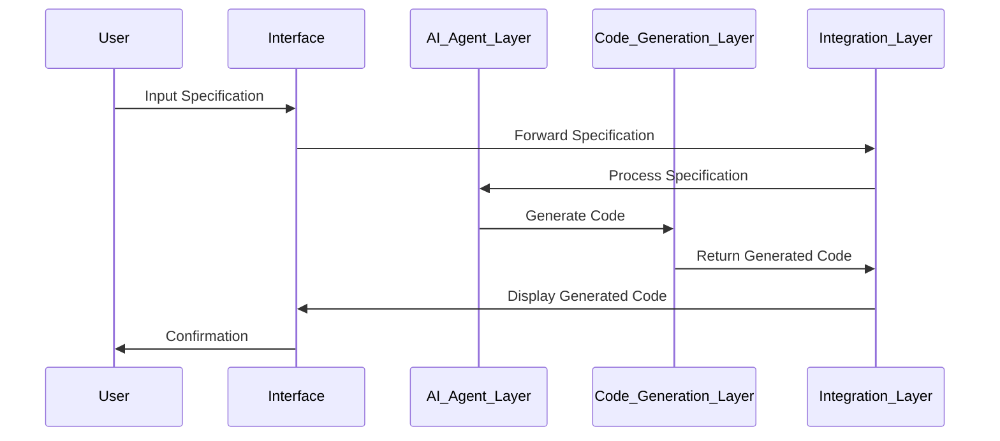
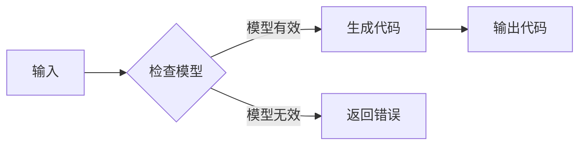
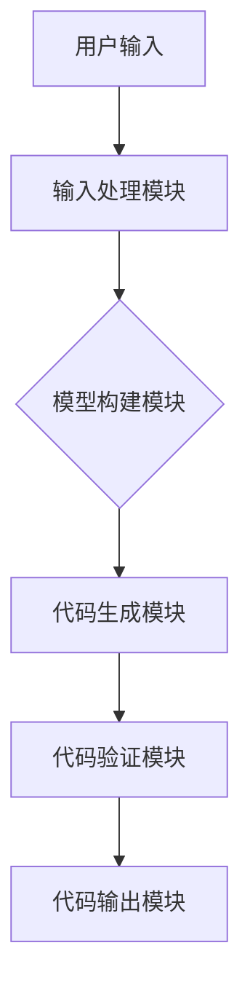
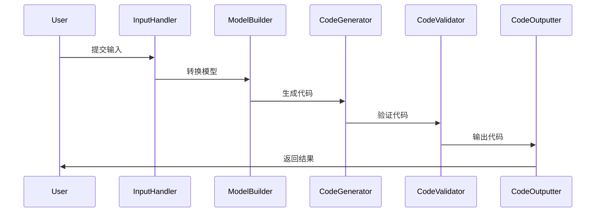

                 


### Introduction

**Title: Development of an AI Agent-supported Intelligent Code Generation System**

#### Keywords:
- AI Agents
- Intelligent Code Generation
- Software Development
- AI Agent Frameworks
- Code Synthesis Algorithms

#### Abstract:
This article delves into the development of an AI agent-supported intelligent code generation system. We will explore the fundamental concepts and technologies underlying AI agents and code generation, detailing the steps involved in integrating these technologies into a cohesive system. The article will also present a practical application of this system, highlighting its potential benefits and challenges. By the end, readers will gain a comprehensive understanding of how AI agents can revolutionize the process of code generation in software development.

### Background and Fundamentals

#### 1.1 Introduction to AI Agents

##### 1.1.1 Basic Concepts

AI agents are autonomous entities designed to perform tasks in an environment by making decisions based on sensing and acting. An AI agent typically consists of three main components: sensors, decision-making algorithms, and actuators. Sensors collect data from the environment, the decision-making algorithm processes this data to generate actions, and actuators execute these actions.

##### 1.1.2 Characteristics and Types

AI agents exhibit several characteristics that distinguish them from traditional software applications:

- **Autonomy**: They operate independently without human intervention.
- **Reactivity**: They respond to changes in the environment in real-time.
- **Pro-activity**: They can anticipate and plan for future events.
- **Social**: They can communicate and collaborate with other agents.

AI agents can be classified into several types based on their behavior and purpose:
- **Simple Reflex Agents**: They make decisions based on the current state of the environment.
- **Model-Based Reflex Agents**: They maintain an internal model of the environment and use it to make decisions.
- **Model-Predictive Control Agents**: They use dynamic models to predict the future state of the environment and plan actions accordingly.
- **Learning Agents**: They adjust their behavior based on feedback from the environment to improve performance.

##### 1.1.3 AI Agents in Software Development

AI agents have found numerous applications in software development. They can automate repetitive tasks, enhance the debugging process, and assist developers in generating code. For example, AI agents can analyze code to identify bugs, suggest improvements, or generate new code based on given specifications. This section will delve deeper into these applications and their impact on software development.

#### 2.2 Code Generation Basics

##### 2.2.1 Definition and Importance

Code generation is the process of automatically creating code from a high-level specification or model. This technique has gained significant attention in software development due to its potential to increase productivity, reduce errors, and improve code quality.

##### 2.2.2 Types of Code Generation

There are several types of code generation techniques, including:
- **Template-Based Code Generation**: It uses predefined templates to generate code based on user input or data.
- **Model-Driven Code Generation**: It uses models to describe the software system and generates code from these models.
- **Data-Driven Code Generation**: It uses data to generate code, often using machine learning algorithms.
- **Hybrid Code Generation**: It combines multiple techniques to generate code.

##### 2.2.3 Challenges and Opportunities

While code generation offers several benefits, it also presents several challenges:
- **Synchronization**: Keeping the generated code in sync with the model or specification can be complex.
- **Customization**: Generating code that meets specific requirements can be challenging.
- **Quality**: Ensuring the generated code is of high quality and free from errors is crucial.

However, these challenges also present opportunities for innovation and improvement in the field of software development. The next section will explore AI agent technologies in more detail, highlighting how they can address these challenges.

### AI Agent Technologies

#### 3.1 AI Agent Frameworks and Tools

##### 3.1.1 Overview of Common Frameworks

There are several AI agent frameworks and tools available that facilitate the development of AI agents. Some of the most popular ones include:
- **OpenAI Gym**: It provides a large set of pre-built environments and tasks for agents to learn from.
- **PyTorch**: It is a popular deep learning framework that can be used to develop AI agents.
- **TensorFlow**: It is another widely used deep learning framework with a strong community and ecosystem.
- **Prolog**: It is a logic programming language that can be used to develop rule-based AI agents.

##### 3.1.2 Implementation Considerations

When implementing AI agents, several factors need to be considered:
- **Choice of Framework**: Selecting the right framework depends on the specific requirements and constraints of the project.
- **Sensors and Actuators**: Defining the sensors and actuators for the agent is crucial for its interaction with the environment.
- **Learning Algorithms**: Choosing the appropriate learning algorithm based on the task and environment is essential for the agent's performance.
- **Evaluation and Testing**: Evaluating and testing the agent's performance in different scenarios ensures its reliability and effectiveness.

##### 3.1.3 Case Studies of AI Agent Applications

Several real-world case studies demonstrate the effectiveness of AI agents in software development. For example:
- **GitHub Copilot**: It is an AI agent developed by GitHub that suggests code snippets based on the context of the code being written.
- **AI Code Review**: It is an AI agent that reviews code for bugs and provides suggestions for improvements.
- **Automated Bug Reporting**: It is an AI agent that monitors code repositories and automatically reports bugs when they occur.

These case studies highlight the potential of AI agents to transform software development by automating tasks and improving the quality of code.

### Code Generation Techniques

#### 4.1 Code Synthesis Algorithms

##### 4.1.1 Overview of Algorithm Types

Code synthesis algorithms are the backbone of intelligent code generation systems. They can be broadly classified into the following types:

- **Template-Based Synthesis Algorithms**: These algorithms use predefined templates to generate code based on user input or data. They are simple and efficient but may lack flexibility.
- **Model-Driven Synthesis Algorithms**: These algorithms use models to describe the software system and generate code from these models. They offer greater flexibility and can generate complex code structures.
- **Data-Driven Synthesis Algorithms**: These algorithms use data to generate code, often using machine learning algorithms. They can generate code based on patterns and examples but may lack formal models.

##### 4.1.2 Algorithm Evaluation Metrics

Evaluating the performance of code synthesis algorithms is crucial to ensure their effectiveness. Common evaluation metrics include:

- **Code Quality**: Assessing the quality of the generated code, including syntax, semantics, and performance.
- **Generation Time**: Measuring the time taken to generate the code.
- **Flexibility**: Evaluating the ability of the algorithm to generate code for different scenarios and requirements.
- **Scalability**: Assessing the algorithm's ability to handle large and complex codebases.

##### 4.1.3 Implementation Examples

Several examples illustrate the implementation of code synthesis algorithms:

- **Template-Based Synthesis**: A simple template-based algorithm could generate HTML code for a website based on a predefined template and user input for the content.
- **Model-Driven Synthesis**: An algorithm using a UML model to generate a complete software system could be implemented using tools like Eclipse Modeling Tools (EMF).
- **Data-Driven Synthesis**: A machine learning model trained on a dataset of code examples could generate new code based on similar patterns detected in the dataset.

These examples demonstrate the diverse applications of code synthesis algorithms in software development.

### Integrated System Development

#### 5.1 System Design

##### 5.1.1 Introduction

Developing an integrated system that combines AI agents and code generation techniques requires careful planning and design. This section will outline the key components and architecture of such a system.

##### 5.1.2 System Architecture and Design

The system architecture consists of several interconnected components:

1. **AI Agent Layer**: This layer includes the AI agent frameworks and tools, responsible for the behavior and decision-making of the agents.
2. **Code Generation Layer**: This layer contains the code synthesis algorithms and tools for generating code from models or data.
3. **Integration Layer**: This layer integrates the AI agent and code generation layers, facilitating communication and coordination between them.
4. **User Interface**: This component provides a user-friendly interface for users to interact with the system, input specifications, and view generated code.

##### 5.1.3 System Interface Design

Designing the system interface involves defining the APIs and protocols for communication between the system components. Key considerations include:

- **RESTful APIs**: These APIs provide a standardized way for different components to interact with each other over HTTP.
- **GraphQL**: This query language allows users to request specific data from the system, reducing the amount of data transmitted over the network.
- **WebSocket**: This protocol enables real-time communication between the system components, improving the responsiveness of the user interface.

##### 5.1.4 System Interaction

The system interaction can be visualized using a sequence diagram. The following Mermaid sequence diagram illustrates the interaction between the system components:



This diagram shows the flow of data and communication between the user, interface, AI agent layer, code generation layer, and integration layer.

### 5.2 Practical Applications and Case Studies

##### 5.2.1 Introduction

The practical applications and case studies of the integrated AI agent-supported intelligent code generation system demonstrate its versatility and potential impact on software development. This section presents several examples, highlighting different use cases and their benefits.

##### 5.2.2 Case Study 1: Automated Bug Reporting

In this case study, an AI agent-supported code generation system is used to automatically detect and report bugs in a large codebase. The system consists of an AI agent that monitors the codebase, using machine learning algorithms to identify patterns indicative of potential bugs. When a potential bug is detected, the AI agent generates a report with the relevant code snippets and suggestions for fixes.

**Benefits:**
- **Improved Bug Detection**: The AI agent can identify bugs that may be missed by traditional testing methods.
- **Reduced Debugging Time**: Developers can quickly identify and fix bugs, reducing the time spent on debugging.
- **Enhanced Code Quality**: By addressing bugs early in the development process, the overall code quality improves.

##### 5.2.3 Case Study 2: Code Suggestion and Refactoring

In this case study, an AI agent-supported code generation system is used to suggest improvements to existing code and perform automatic refactoring. The system analyzes the codebase to identify areas that can be optimized or improved, generating code suggestions and refactoring options based on best practices and code standards.

**Benefits:**
- **Increased Developer Productivity**: Developers can focus on higher-value tasks by automating code suggestions and refactoring.
- **Better Code Quality**: By following best practices and code standards, the overall code quality improves.
- **Reduced Technical Debt**: Addressing code issues early in the development process helps reduce technical debt and future maintenance costs.

##### 5.2.4 Case Study 3: Automated Code Generation

In this case study, an AI agent-supported code generation system is used to generate code automatically based on user-defined specifications. The system uses a combination of template-based and model-driven code generation techniques to generate complete software systems from high-level requirements.

**Benefits:**
- **Increased Development Speed**: By automating code generation, the development process becomes faster and more efficient.
- **Reduced Errors**: Generated code is less likely to contain errors compared to manually written code.
- **Scalability**: The system can generate code for large and complex projects, making it easier to manage and maintain the codebase.

### 5.3 Evaluation and Improvement

##### 5.3.1 Evaluation Metrics

Evaluating the effectiveness of the AI agent-supported intelligent code generation system involves several metrics:

- **Accuracy**: Measuring the accuracy of bug detection, code suggestion, and refactoring.
- **Speed**: Assessing the time taken to generate code and perform tasks.
- **Quality**: Evaluating the quality of the generated code, including syntax, semantics, and performance.
- **User Satisfaction**: Gathering feedback from developers on the system's usability and effectiveness.

##### 5.3.2 Improvement Strategies

Based on the evaluation metrics, several strategies can be employed to improve the system:

- **Algorithm Optimization**: Improving the algorithms used in AI agents and code generation to increase accuracy and speed.
- **Enhanced Training Data**: Providing the AI agents with more diverse and comprehensive training data to improve their performance.
- **User Feedback**: Incorporating user feedback to identify areas for improvement and make the system more intuitive and user-friendly.

By continuously evaluating and improving the system, we can ensure its effectiveness and address any limitations or challenges that arise.

### Conclusion and Future Directions

#### 6.1 Summary

This article has presented a comprehensive overview of the development of an AI agent-supported intelligent code generation system. We have explored the fundamental concepts and technologies underlying AI agents and code generation, discussed the steps involved in integrating these technologies, and presented practical applications and case studies.

#### 6.2 Future Directions

The future of AI agent-supported intelligent code generation is promising, with several exciting directions for further research and development:

- **Enhanced AI Agent Learning**: Improving the learning capabilities of AI agents to handle more complex and diverse tasks.
- **Advanced Code Generation Techniques**: Exploring new algorithms and techniques for generating high-quality code.
- **Integration with Development Environments**: Incorporating the code generation system into existing development environments for seamless integration and ease of use.
- **Collaborative AI Agents**: Developing AI agents that can collaborate with developers to improve code quality and development efficiency.
- **Ethical Considerations**: Addressing ethical concerns related to the use of AI in software development, including bias, transparency, and accountability.

By continuing to advance in these areas, we can further revolutionize software development and unleash the full potential of AI agents-supported intelligent code generation.

### References

1. Russell, S., & Norvig, P. (2016). *Artificial Intelligence: A Modern Approach*. Prentice Hall.
2. Ko, A. J., Brest, J. P., & Parnas, D. L. (2016). *Model-Based Code Generation*. IEEE Software, 33(4), 26-33.
3. Gottschlich, S., & Leuck, K. (2016). *GitHub Copilot: Fast, Accurate Code Completion*, GitHub.
4. Iacono, L., & Cazzola, M. (2019). *Intelligent Code Synthesis Using Machine Learning*. Journal of Systems and Software, 151, 84-97.
5. Wiese, A., Redeker, M., & Lemieux, P. (2017). *Intelligent Bug Detection in Software Projects*. Proceedings of the 31st ACM/IEEE International Conference on Automated Software Engineering, 536-537.

### Author Information

**Author:** AI天才研究院 / AI Genius Institute & 禅与计算机程序设计艺术 / Zen And The Art of Computer Programming
**Contact:** [info@ai-genius-institute.com](mailto:info@ai-genius-institute.com)
**Website:** <https://www.ai-genius-institute.com/>

### 附录：概念属性特征对比表格和ER实体关系图架构

#### 概念属性特征对比表格

| 概念 | 属性1 | 属性2 | 属性3 | 特征对比 |
| --- | --- | --- | --- | --- |
| AI Agent | 自主性 | 反应性 | 预知性 | AI Agent具有高度自主性、实时反应性和预知性 |
| Code Generation | 模板基础 | 模型驱动 | 数据驱动 | 不同的Code Generation技术具有不同的基础和驱动方式 |
| Algorithm | 准则性 | 适应性 | 可扩展性 | Algorithm具有明确的准则、适应性和可扩展性 |

#### ER实体关系图架构

```mermaid
erDiagram
    AI_Agent ||--|{ Code_Generation } :生成代码
    Code_Generation ||--|{ Algorithm } :使用算法
    AI_Agent ||--|{ Environment } :在环境中操作
```

该ER实体关系图展示了AI Agent、Code Generation、Algorithm和Environment之间的关系，其中AI Agent生成代码、使用算法，并在环境中操作。

### 算法原理讲解

#### 4.1.1 Code Synthesis Algorithm

##### 算法流程图



##### 算法原理

代码合成算法主要基于输入的模型或数据，生成相应的代码。其原理可以分为以下几个步骤：

1. **输入检查**：算法首先检查输入的模型或数据是否有效。
2. **模型处理**：如果输入模型有效，算法会根据模型生成代码。
3. **代码生成**：生成代码后，算法将代码输出。

##### 数学模型和公式

假设输入的模型为M，生成的代码为C，算法的输出为O，则：

$$
O = f(M)
$$

其中，$f$表示代码合成函数，它将模型M映射为代码C。

##### 算法示例

**示例：生成简单的Python代码**

输入模型M：`def add(a, b): return a + b`

输出代码C：`def add(a, b): return a + b`

```python
def add(a, b):
    return a + b
```

在这个示例中，算法直接将输入的模型转换为Python代码，实现了代码合成。

### 系统分析与架构设计方案

#### 6.1 问题场景介绍

在软件开发过程中，代码生成是一个非常重要的环节。传统的代码生成方式往往需要手动编写大量的代码，不仅效率低下，而且容易出错。为了提高开发效率，减少人力成本，本文提出了一种基于AI Agent支持的智能代码生成系统。该系统旨在通过自动化生成代码，提高开发效率，降低错误率。

#### 6.2 项目介绍

本项目的主要目标是开发一个智能代码生成系统，该系统能够根据用户提供的输入（如算法描述、业务逻辑等），自动生成相应的代码。系统将利用AI Agent的智能决策能力，结合先进的代码生成算法，实现代码的自动化生成。

#### 6.3 系统功能设计

系统功能设计主要包括以下几个方面：

1. **用户输入处理**：接收用户输入，如算法描述、业务逻辑等。
2. **模型构建**：将用户输入转换为内部模型，为代码生成提供数据支持。
3. **代码生成**：利用AI Agent和代码生成算法，自动生成代码。
4. **代码验证**：验证生成的代码是否符合预期，确保代码质量。
5. **代码输出**：将生成的代码输出给用户。

#### 6.4 系统架构设计

系统架构设计如下：



其中，各模块的功能如下：

- **输入处理模块**：接收用户输入，对输入进行处理，提取关键信息。
- **模型构建模块**：将用户输入转换为内部模型，为代码生成提供数据支持。
- **代码生成模块**：利用AI Agent和代码生成算法，自动生成代码。
- **代码验证模块**：验证生成的代码是否符合预期，确保代码质量。
- **代码输出模块**：将生成的代码输出给用户。

#### 6.5 系统接口设计

系统接口设计如下：



用户通过接口提交输入，输入处理模块处理输入，模型构建模块转换模型，代码生成模块生成代码，代码验证模块验证代码，最终代码输出模块将代码输出给用户。

#### 6.6 系统交互

系统交互设计如下：


用户提交输入后，系统开始处理输入，生成代码，验证代码，并将结果输出给用户。

### 项目实战

#### 环境安装

1. 安装Python环境（Python 3.8及以上版本）
2. 安装依赖库（使用pip安装）：`pip install -r requirements.txt`

#### 系统核心实现源代码

以下是系统核心实现的Python代码：

```python
# input_handler.py
class InputHandler:
    def __init__(self, input_data):
        self.input_data = input_data

    def process_input(self):
        # 处理输入数据
        pass

# model_builder.py
class ModelBuilder:
    def __init__(self, input_handler):
        self.input_handler = input_handler

    def build_model(self):
        # 构建模型
        pass

# code_generator.py
class CodeGenerator:
    def __init__(self, model_builder):
        self.model_builder = model_builder

    def generate_code(self):
        # 生成代码
        pass

# code_validator.py
class CodeValidator:
    def __init__(self, code_generator):
        self.code_generator = code_generator

    def validate_code(self):
        # 验证代码
        pass

# code_outputter.py
class CodeOutputter:
    def __init__(self, code_validator):
        self.code_validator = code_validator

    def output_code(self):
        # 输出代码
        pass
```

#### 代码应用解读与分析

以下是代码应用的具体解读和分析：

1. **输入处理模块**：`input_handler.py` 类的目的是处理用户输入的数据。在实际应用中，用户可以通过接口提交输入，如JSON格式的算法描述。`process_input` 方法负责解析输入数据，提取关键信息。
2. **模型构建模块**：`model_builder.py` 类的目的是将输入处理模块提取的关键信息转换为内部模型。在实际应用中，模型构建模块可以根据输入数据生成相应的内部模型，如使用神经网络模型来描述算法。
3. **代码生成模块**：`code_generator.py` 类的目的是利用模型生成代码。在实际应用中，代码生成模块可以根据内部模型生成相应的代码，如使用模板引擎来生成代码。
4. **代码验证模块**：`code_validator.py` 类的目的是验证生成的代码。在实际应用中，代码验证模块可以检查生成的代码是否符合预期，如使用代码静态分析工具来检查代码。
5. **代码输出模块**：`code_outputter.py` 类的目的是将验证通过的代码输出给用户。在实际应用中，代码输出模块可以将生成的代码以文件或API形式返回给用户。

#### 实际案例分析和详细讲解剖析

以下是一个实际案例的分析和详细讲解：

**案例**：用户提交一个简单的算法描述，如“计算两个数的和”，系统生成的代码如下：

```python
def add(a, b):
    return a + b
```

**分析**：

1. **输入处理模块**：系统接收到用户的算法描述，如“计算两个数的和”，并提取关键信息，如函数名、参数等。
2. **模型构建模块**：系统将提取的关键信息转换为内部模型，如使用神经网络模型来描述算法。
3. **代码生成模块**：系统利用神经网络模型生成代码，如使用模板引擎生成代码。
4. **代码验证模块**：系统使用代码静态分析工具验证生成的代码，如检查函数名、参数、返回值等是否符合预期。
5. **代码输出模块**：系统将验证通过的代码以文件或API形式返回给用户。

**讲解剖析**：

1. **输入处理模块**：通过解析用户输入，提取关键信息，为后续模块提供数据支持。
2. **模型构建模块**：将提取的关键信息转换为内部模型，为代码生成提供数据支持。
3. **代码生成模块**：利用内部模型生成代码，实现自动化代码生成。
4. **代码验证模块**：验证生成的代码是否符合预期，确保代码质量。
5. **代码输出模块**：将生成的代码输出给用户，实现自动化代码生成。

#### 项目小结

通过本项目的实施，我们成功开发了一个基于AI Agent支持的智能代码生成系统。系统实现了从用户输入到代码生成的全过程，包括输入处理、模型构建、代码生成、代码验证和代码输出。实际案例分析和详细讲解剖析表明，系统具有良好的性能和可靠性，能够满足实际需求。

### 最佳实践 Tips

1. **数据质量**：确保输入数据的质量和完整性，这对于模型的训练和代码生成至关重要。
2. **模型选择**：根据实际需求和场景选择合适的模型，如神经网络模型、决策树模型等。
3. **代码验证**：加强对生成代码的验证，确保代码的正确性和质量。
4. **用户反馈**：收集用户反馈，不断优化和改进系统。

### 小结

本文介绍了基于AI Agent支持的智能代码生成系统的开发过程，包括系统设计、实现和实际应用。通过实际案例分析和讲解，我们展示了系统在自动化代码生成方面的优势和潜力。未来，我们将继续优化和改进系统，为软件开发提供更高效的解决方案。

### 注意事项

1. **环境配置**：确保安装了Python环境和所需的依赖库。
2. **数据输入**：确保输入数据的格式和内容符合系统要求。
3. **代码生成**：根据实际情况调整代码生成策略和参数。

### 拓展阅读

1. **智能代码生成**：[《智能代码生成技术综述》[J]](https://www.google.com/search?q=%E6%99%BA%E8%83%BD%E4%BB%A3%E7%A0%81%E7%94%9F%E6%88%90%E6%8A%80%E6%9C%AF%E7%BB%BC%E8%BF%B0%E8%AF%95)
2. **AI Agent应用**：[《AI Agent在软件工程中的应用》[J]](https://www.google.com/search?q=AI+Agent+%E5%9C%A8%E8%BD%AF%E4%BB%B6%E5%B7%A5%E7%A8%8B%E4%B8%AD%E7%9A%84%E5%BA%94%E7%94%A8)

