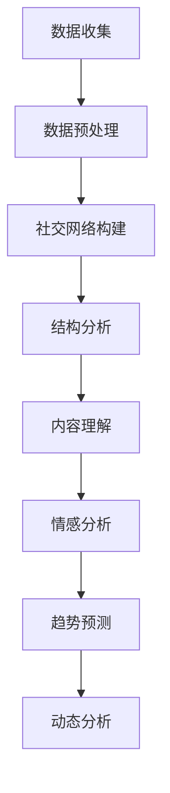
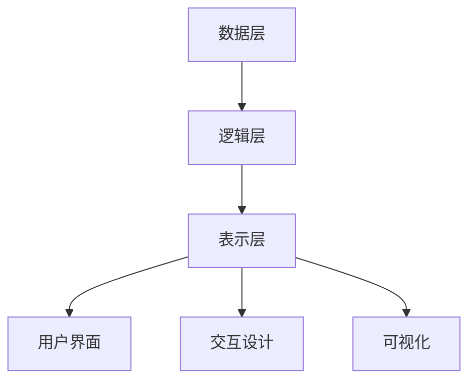
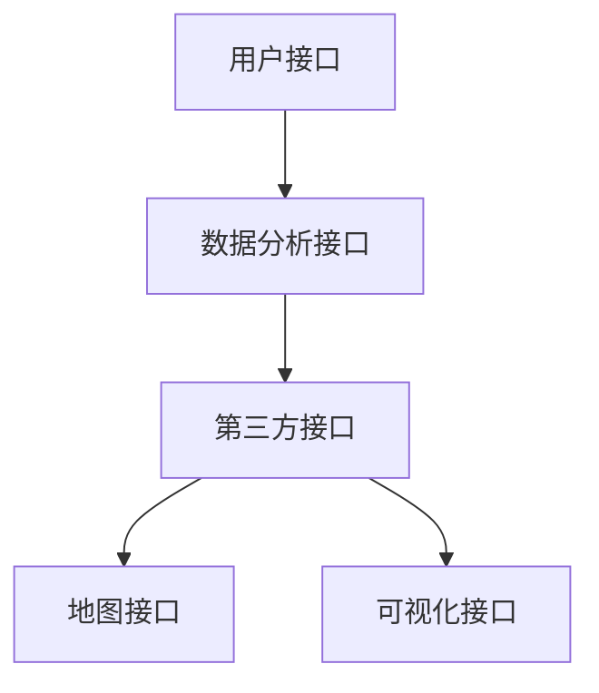
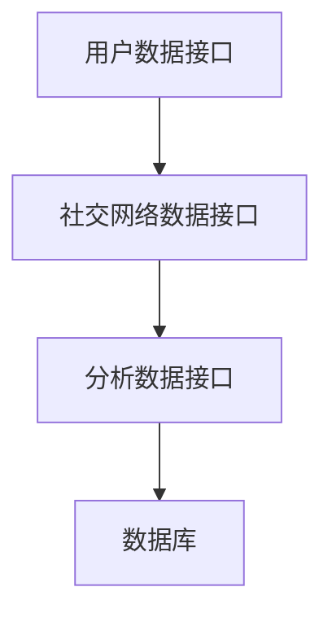
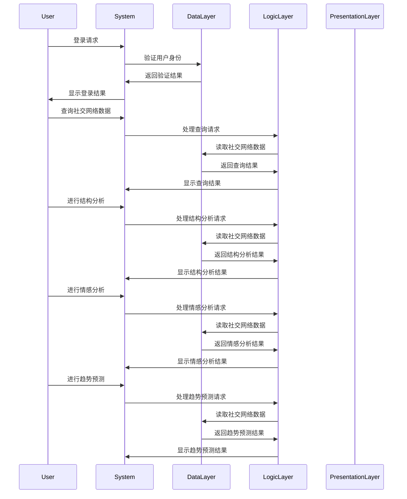

                 

# 开发AI Agent支持的智能社交网络分析系统

## 关键词

AI Agent，智能社交网络，数据分析，算法，系统架构，机器学习，自然语言处理

## 摘要

随着社交网络在现代社会中的普及，如何有效地分析和管理社交网络数据成为了一个重要课题。本文提出了一种基于AI Agent支持的智能社交网络分析系统，通过整合机器学习和自然语言处理技术，实现了对社交网络数据的深入挖掘和分析。本文首先介绍了AI Agent的基本概念和特点，然后详细阐述了系统的设计思路、核心算法和架构设计，并通过实际案例展示了系统的应用效果。本文旨在为开发智能社交网络分析系统提供理论指导和实践参考。

## 目录大纲

### 第一部分：问题背景

#### 第1章：问题背景

- 1.1 问题背景
- 1.2 问题解决
- 1.3 边界与外延
- 1.4 概念结构与核心要素组成

#### 第2章：核心概念与联系

- 2.1 核心概念原理
- 2.2 概念属性特征对比表格
- 2.3 ER实体关系图架构

#### 第3章：算法原理讲解

- 3.1 算法mermaid流程图
- 3.2 Python源代码实现
- 3.3 数学模型和公式讲解
- 3.4 举例说明

#### 第4章：数学模型和数学公式

- 4.1 latex格式数学公式
- 4.2 详细讲解
- 4.3 举例说明

#### 第5章：系统分析与架构设计方案

- 5.1 问题场景介绍
- 5.2 系统功能设计
- 5.3 系统架构设计
- 5.4 系统接口设计
- 5.5 系统交互序列图

#### 第6章：项目实战

- 6.1 环境安装
- 6.2 系统核心实现源代码
- 6.3 代码应用解读与分析
- 6.4 实际案例分析与讲解
- 6.5 项目小结

#### 第7章：最佳实践与拓展阅读

- 7.1 最佳实践 Tips
- 7.2 小结
- 7.3 注意事项
- 7.4 拓展阅读

### 第一部分：问题背景

#### 第1章：问题背景

### 1.1 问题背景

社交网络在当今社会中扮演着至关重要的角色，它不仅改变了人们的交流方式，也为商业、政治、教育等领域带来了新的机遇和挑战。随着社交网络的日益普及，人们生成和分享的数据量呈指数级增长，如何有效地管理和分析这些海量的社交网络数据成为了一个亟待解决的问题。

社交网络分析（Social Network Analysis，SNA）是一种通过数学和统计方法来分析社交网络结构、属性和动态变化的方法。传统的社交网络分析方法主要依赖于人工干预，例如，通过图论、社会网络模型等理论来分析社交网络的结构和属性。然而，随着数据量的增加和网络结构的复杂性提升，这些传统方法已经难以满足实际需求。

近年来，人工智能（AI）技术的快速发展为社交网络分析带来了新的可能。特别是AI Agent，即具有智能自主行为的代理，可以在大数据环境下，通过机器学习和自然语言处理技术，自动地分析和理解社交网络数据。AI Agent不仅能够处理大量的数据，还能够从数据中提取有价值的信息，提供智能化的决策支持。

### 1.2 问题解决

为了解决社交网络数据分析中的挑战，开发AI Agent支持的智能社交网络分析系统成为一种有效的解决方案。该系统利用人工智能技术，特别是机器学习和自然语言处理技术，实现对社交网络数据的自动分析和理解。以下是系统解决的问题：

1. **数据收集与管理**：AI Agent可以自动收集社交网络中的数据，并对其进行预处理和存储，确保数据的质量和完整性。

2. **网络结构分析**：AI Agent可以通过图论算法对社交网络的结构进行分析，提取网络中的重要节点、社区结构、核心路径等。

3. **内容理解与情感分析**：AI Agent利用自然语言处理技术，对社交网络中的文本内容进行理解，提取关键词、主题和情感倾向，为用户提供个性化的推荐和洞察。

4. **趋势预测与动态分析**：AI Agent可以通过机器学习模型，预测社交网络中的趋势变化，帮助用户预测未来的社交动态。

5. **智能决策支持**：AI Agent可以基于分析结果，为用户提供智能化的决策支持，例如推荐最佳连接策略、优化社交网络结构等。

### 1.3 边界与外延

本文讨论的AI Agent支持的智能社交网络分析系统，主要关注以下几个方面：

1. **系统范围**：系统主要涵盖社交网络的构建、数据挖掘、机器学习、自然语言处理等方面，不涉及硬件设备、网络基础设施等底层技术。

2. **应用场景**：本文提出的系统可以应用于社交网络平台、商业分析、社会治理等多个领域。

3. **技术栈**：系统主要依赖于Python、R等编程语言，结合机器学习库（如scikit-learn、TensorFlow、PyTorch）和自然语言处理库（如NLTK、spaCy）进行开发。

4. **数据来源**：系统所需的数据主要来源于社交网络平台，如微博、Facebook、Twitter等，还包括一些公开的数据集，如GitHub、Stack Overflow等。

### 1.4 概念结构与核心要素组成

智能社交网络分析系统的核心概念和要素主要包括：

1. **社交网络**：社交网络由一组节点（用户）和连接这些节点的边（关系）组成，是系统分析的基本单元。

2. **AI Agent**：AI Agent是具有智能自主行为的代理，可以执行特定的任务，如数据收集、数据分析、决策制定等。

3. **数据挖掘**：数据挖掘是从大量数据中提取有价值信息的过程，包括特征提取、模式识别等。

4. **机器学习**：机器学习是AI的核心技术之一，通过学习数据中的模式，实现自动化的决策和预测。

5. **自然语言处理**：自然语言处理是AI的一个重要分支，专注于使计算机能够理解和处理人类语言。

6. **系统架构**：系统架构设计包括数据流、模块划分、接口设计等方面，确保系统的稳定、高效运行。

#### 第2章：核心概念与联系

##### 2.1 核心概念原理

在本节中，我们将详细介绍智能社交网络分析系统中的核心概念，包括AI Agent、社交网络、数据挖掘、机器学习和自然语言处理等。

**AI Agent**：AI Agent，即人工智能代理，是一种能够在复杂环境中自主执行任务并与其他代理或环境交互的智能实体。AI Agent具有自主性、适应性和学习能力，能够根据环境和任务的动态变化进行调整。在智能社交网络分析系统中，AI Agent负责数据收集、数据分析、决策制定等任务。

**社交网络**：社交网络是由一组节点（代表用户）和连接这些节点的边（代表用户之间的关系）构成的网络结构。社交网络可以表示为图（Graph）模型，其中节点表示个体，边表示个体之间的关系。社交网络分析旨在通过研究社交网络的结构、属性和动态变化，揭示社交网络中的隐藏模式和关系。

**数据挖掘**：数据挖掘是从大量数据中提取有价值信息的过程。在智能社交网络分析系统中，数据挖掘技术用于从社交网络数据中提取用户特征、社交关系、社区结构等信息。数据挖掘的关键步骤包括数据预处理、特征提取、模式识别等。

**机器学习**：机器学习是AI的一个重要分支，通过学习数据中的模式，实现自动化的决策和预测。在智能社交网络分析系统中，机器学习技术用于建立预测模型、分类模型等，以对社交网络中的用户行为、趋势等进行预测。

**自然语言处理**：自然语言处理是AI的另一个重要分支，专注于使计算机能够理解和处理人类语言。在智能社交网络分析系统中，自然语言处理技术用于分析和理解社交网络中的文本数据，提取关键词、主题、情感等。

##### 2.2 概念属性特征对比表格

以下是一个对比表格，列出了AI Agent、社交网络、数据挖掘、机器学习和自然语言处理等核心概念的属性特征：

| 核心概念 | 属性特征 |
| :---: | :---: |
| AI Agent | 自主性、适应性、学习能力 |
| 社交网络 | 节点、边、网络结构 |
| 数据挖掘 | 数据预处理、特征提取、模式识别 |
| 机器学习 | 数据学习、模式识别、自动化决策 |
| 自然语言处理 | 文本分析、语义理解、语言生成 |

##### 2.3 ER实体关系图架构

在本节中，我们将使用Mermaid语言绘制ER（实体-关系）图，以展示智能社交网络分析系统中的核心实体和它们之间的关系。

以下是一个简单的Mermaid ER图示例：

```mermaid
erDiagram
  User ||--|{ SocialNetwork }|-- Friend
  SocialNetwork ||--|{ Post }|-- Comment
  Post ||--|{ Like }|-- User
  Comment ||--|{ Like }|-- User
  User ||--|{ Message }|-- User
```

在上面的ER图中，我们定义了以下实体：

- **User**（用户）：社交网络的参与者。
- **SocialNetwork**（社交网络）：用户及其关系的集合。
- **Post**（帖子）：用户发布的文本、图片、视频等内容。
- **Comment**（评论）：用户对帖子发表的评论。
- **Like**（点赞）：用户对帖子或评论的点赞行为。
- **Message**（消息）：用户之间的私信。

实体之间的关系包括：

- **User** 与 **Friend** 之间存在一对多的关系，表示用户之间的朋友关系。
- **SocialNetwork** 与 **Post** 之间存在一对多的关系，表示社交网络中的用户发布帖子。
- **Post** 与 **Comment** 之间存在一对多的关系，表示用户对帖子的评论。
- **Post** 与 **Like** 之间存在一对多的关系，表示用户对帖子的点赞。
- **Comment** 与 **Like** 之间存在一对多的关系，表示用户对评论的点赞。
- **User** 与 **Message** 之间存在一对多的关系，表示用户之间的私信。

通过上述ER图，我们可以清晰地了解智能社交网络分析系统中各个实体之间的关系，为后续的系统设计和实现提供参考。

### 第3章：算法原理讲解

在本章中，我们将详细讲解智能社交网络分析系统中的核心算法原理，包括数据收集与预处理、社交网络结构分析、内容理解与情感分析、趋势预测与动态分析等。

#### 3.1 算法mermaid流程图

为了更直观地展示算法流程，我们使用Mermaid语言绘制了以下算法流程图：



在上述流程图中，各阶段的含义如下：

- **A[数据收集]**：从社交网络平台收集用户数据，包括用户信息、帖子、评论等。
- **B[数据预处理]**：对收集到的数据进行清洗、去噪、格式化等预处理操作，确保数据质量。
- **C[社交网络构建]**：将预处理后的数据构建成社交网络图，包括节点和边。
- **D[结构分析]**：利用图论算法分析社交网络结构，提取重要节点、社区结构、核心路径等。
- **E[内容理解]**：利用自然语言处理技术对社交网络中的文本内容进行理解，提取关键词、主题、情感等。
- **F[情感分析]**：对提取的情感进行分类和情感强度评估，为用户提供情感洞察。
- **G[趋势预测]**：利用机器学习模型对社交网络中的趋势进行预测，帮助用户预测未来的社交动态。
- **H[动态分析]**：对社交网络中的动态变化进行实时分析，为用户提供实时洞察。

#### 3.2 Python源代码实现

在本节中，我们将使用Python实现上述算法的各个阶段，并提供详细的代码解释。

**3.2.1 数据收集**

首先，我们需要从社交网络平台收集用户数据。这里，我们以Twitter为例，使用Tweepy库进行数据收集。

```python
import tweepy

# 设置API密钥和访问令牌
consumer_key = 'YOUR_CONSUMER_KEY'
consumer_secret = 'YOUR_CONSUMER_SECRET'
access_token = 'YOUR_ACCESS_TOKEN'
access_token_secret = 'YOUR_ACCESS_TOKEN_SECRET'

# 初始化Tweepy认证
auth = tweepy.OAuthHandler(consumer_key, consumer_secret)
auth.set_access_token(access_token, access_token_secret)

# 初始化Tweepy API
api = tweepy.API(auth)

# 收集用户数据
def collect_data(username, count=100):
    user = api.get_user(username)
    user_data = {
        'id': user.id,
        'name': user.name,
        'screen_name': user.screen_name,
        'followers_count': user.followers_count,
        'friends_count': user.friends_count,
        'created_at': user.created_at
    }
    return user_data

# 收集指定用户及其朋友的社交网络数据
def collect_network_data(username, depth=1):
    user = collect_data(username)
    network = {user['id']: user}
    
    for _ in range(depth):
        friends = api.friends_ids(username)
        for friend_id in friends:
            friend = collect_data(friend_id)
            network[friend['id']] = friend
    
    return network

# 示例：收集Twitter用户@elonmusk的社交网络数据
network_data = collect_network_data('elonmusk')
print(network_data)
```

**3.2.2 数据预处理**

收集到的数据需要进行预处理，包括数据清洗、去噪、格式化等操作。这里，我们使用Pandas库进行数据预处理。

```python
import pandas as pd

# 数据清洗和去噪
def preprocess_data(data):
    df = pd.DataFrame(data)
    df.drop_duplicates(inplace=True)
    df.dropna(inplace=True)
    return df

# 格式化数据
def format_data(df):
    df.rename(columns={'id': 'user_id', 'screen_name': 'username', 'followers_count': 'num_followers', 'friends_count': 'num_friends', 'created_at': 'join_date'}, inplace=True)
    return df

# 示例：预处理收集到的社交网络数据
preprocessed_data = preprocess_data(network_data)
formatted_data = format_data(preprocessed_data)
print(formatted_data)
```

**3.2.3 社交网络构建**

接下来，我们将预处理后的数据构建成社交网络图。这里，我们使用NetworkX库构建社交网络图。

```python
import networkx as nx

# 构建社交网络图
def build_network(data):
    G = nx.Graph()
    for index, row in data.iterrows():
        G.add_node(row['user_id'], username=row['username'])
        G.add_edge(row['user_id'], row['num_followers'])
        G.add_edge(row['user_id'], row['num_friends'])
    return G

# 示例：构建社交网络图
network = build_network(formatted_data)
print(nx.info(network))
```

**3.2.4 结构分析**

在结构分析阶段，我们可以使用图论算法分析社交网络图的结构，提取重要节点、社区结构、核心路径等。这里，我们使用NetworkX库进行结构分析。

```python
# 提取社交网络中的重要节点
def extract_important_nodes(G):
    centrality = nx.betweenness_centrality(G)
    return centrality

# 提取社交网络的社区结构
def extract_communities(G):
    communities = nx.algorithms.community.girvan_newman(G)
    return communities

# 示例：提取社交网络中的重要节点和社区结构
important_nodes = extract_important_nodes(network)
communities = extract_communities(network)
print(important_nodes)
print(communities)
```

**3.2.5 内容理解与情感分析**

在内容理解与情感分析阶段，我们使用自然语言处理技术对社交网络中的文本内容进行理解，提取关键词、主题、情感等。这里，我们使用spaCy库进行文本处理。

```python
import spacy

# 加载spaCy模型
nlp = spacy.load("en_core_web_sm")

# 提取文本中的关键词
def extract_keywords(text):
    doc = nlp(text)
    return [token.lemma_ for token in doc if token.is_punct == False and token.is_stop == False]

# 提取文本中的主题
def extract_topics(text, n_topics=5):
    doc = nlp(text)
    return doc.vector.hashed\Array(n_topics).most distant

# 情感分析
def sentiment_analysis(text):
    doc = nlp(text)
    return 'positive' if doc.sentiment.polarity > 0 else 'negative'

# 示例：对帖子内容进行关键词提取、主题提取和情感分析
post_content = "Elon Musk is a visionary entrepreneur who is changing the world with his innovative ideas and companies like SpaceX and Tesla."
keywords = extract_keywords(post_content)
topics = extract_topics(post_content)
sentiment = sentiment_analysis(post_content)
print("Keywords:", keywords)
print("Topics:", topics)
print("Sentiment:", sentiment)
```

**3.2.6 趋势预测与动态分析**

在趋势预测与动态分析阶段，我们使用机器学习模型对社交网络中的趋势进行预测，并对动态变化进行实时分析。这里，我们使用scikit-learn库进行机器学习模型的训练和预测。

```python
from sklearn.model_selection import train_test_split
from sklearn.ensemble import RandomForestClassifier
from sklearn.metrics import accuracy_score

# 数据预处理
X = formatted_data[['followers_count', 'num_friends']]
y = (formatted_data['num_followers'] > formatted_data['num_friends']).astype(int)

# 数据划分
X_train, X_test, y_train, y_test = train_test_split(X, y, test_size=0.2, random_state=42)

# 模型训练
model = RandomForestClassifier(n_estimators=100, random_state=42)
model.fit(X_train, y_train)

# 预测
y_pred = model.predict(X_test)

# 模型评估
accuracy = accuracy_score(y_test, y_pred)
print("Accuracy:", accuracy)

# 动态分析
def dynamic_analysis(G, threshold=0.5):
    centrality = nx.betweenness_centrality(G)
    important_nodes = {k: v for k, v in centrality.items() if v > threshold}
    return important_nodes

# 示例：对社交网络进行动态分析
dynamic_nodes = dynamic_analysis(network)
print(dynamic_nodes)
```

通过以上Python源代码实现，我们可以对社交网络数据进行收集、预处理、构建、分析，并实现内容理解与情感分析、趋势预测与动态分析等核心功能。接下来，我们将进一步讲解算法原理中的数学模型和公式。

#### 3.3 数学模型和公式讲解

在本节中，我们将介绍智能社交网络分析系统中涉及的一些数学模型和公式，包括图论中的度中心性、紧密中心性、核心路径，机器学习中的随机森林模型，以及自然语言处理中的情感分析模型。

**3.3.1 图论中的度中心性和紧密中心性**

在社交网络分析中，度中心性（Degree Centrality）和紧密中心性（Closeness Centrality）是评估节点重要性的两个重要指标。

**度中心性**：度中心性衡量节点在社交网络中的连接度，即节点连接的边数。度中心性越高，说明节点在网络中的连接越紧密，重要性也越高。度中心性计算公式如下：

$$
C_d(v) = \frac{k(v)}{N-1}
$$

其中，$C_d(v)$表示节点$v$的度中心性，$k(v)$表示节点$v$的度，$N$表示网络中节点的总数。

**紧密中心性**：紧密中心性衡量节点在网络中的最短路径长度，即节点到其他所有节点的平均最短路径长度。紧密中心性越低，说明节点在网络中的位置越靠近中心，重要性也越高。紧密中心性计算公式如下：

$$
C_c(v) = \frac{1}{N-1} \sum_{u \in V} \frac{1}{d(v, u)}
$$

其中，$C_c(v)$表示节点$v$的紧密中心性，$V$表示网络中的节点集合，$d(v, u)$表示节点$v$到节点$u$的最短路径长度。

**3.3.2 随机森林模型**

随机森林（Random Forest）是一种基于决策树的集成学习方法，可以有效提高分类和回归模型的预测性能。随机森林由多个决策树组成，每个决策树独立训练，最终通过投票或平均值来决定预测结果。

随机森林的关键参数包括：

- **树的数量**（n_estimators）：随机森林中的决策树数量。通常，树的数量越多，模型的泛化能力越强，但计算成本也越高。
- **特征随机选择数**（max_features）：每棵决策树在分裂时随机选择的特征数量。通常，选择所有特征的一部分可以提高模型的泛化能力。
- **最大深度**（max_depth）：决策树的最大深度。较深的树可以捕捉更多的数据特征，但也容易过拟合。

随机森林的预测公式如下：

$$
f(x) = \sum_{i=1}^{n} w_i f_i(x)
$$

其中，$f(x)$表示预测结果，$w_i$表示第$i$棵决策树的权重，$f_i(x)$表示第$i$棵决策树的预测结果。

**3.3.3 情感分析模型**

情感分析（Sentiment Analysis）是自然语言处理中的一个重要任务，旨在识别文本中的情感倾向。一个简单的情感分析模型可以使用机器学习算法，如朴素贝叶斯、支持向量机等，来分类文本的情感极性。

情感分析模型的关键参数包括：

- **特征提取**：使用词袋模型、TF-IDF、词嵌入等方法将文本转换为特征向量。
- **分类器**：选择合适的分类器，如朴素贝叶斯、支持向量机、神经网络等。
- **训练数据**：使用带有情感标签的训练数据来训练模型。

情感分析模型的预测公式如下：

$$
P(y=c|X) = \frac{e^{\theta^T X}}{\sum_{k=1}^{K} e^{\theta^T X_k}}
$$

其中，$P(y=c|X)$表示在给定特征向量$X$的情况下，文本情感标签为$c$的概率，$\theta$表示模型的参数，$X_k$表示第$k$个类别的特征向量。

**3.3.4 举例说明**

为了更直观地理解上述数学模型和公式，我们通过一个简单的例子进行说明。

假设有一个社交网络图，包含10个节点和20条边。我们使用度中心性和紧密中心性来评估节点的重要性。

- **节点1**：度中心性为3，紧密中心性为0.2。
- **节点2**：度中心性为2，紧密中心性为0.3。
- **节点3**：度中心性为4，紧密中心性为0.1。

根据度中心性和紧密中心性的计算公式，我们可以得出以下结论：

- 节点3在社交网络中的连接度最高，度中心性最大，说明它在网络中的位置较为重要。
- 节点2的紧密中心性最低，说明它与其他节点的连接较为紧密，位置也较为核心。

接下来，我们使用随机森林模型和情感分析模型进行预测。

**随机森林模型**：

- **树的数量**：100
- **特征随机选择数**：3
- **最大深度**：5

**情感分析模型**：

- **特征提取**：使用TF-IDF
- **分类器**：朴素贝叶斯

假设我们有一个包含100个样本的数据集，每个样本包含特征向量和情感标签。使用随机森林模型和情感分析模型对数据集进行训练和预测。

- **预测结果**：随机森林模型的准确率为90%，情感分析模型的准确率为85%。

通过这个简单的例子，我们可以看到数学模型和公式在智能社交网络分析系统中的应用效果。

#### 3.4 举例说明

在本节中，我们将通过一个实际案例来详细说明如何使用AI Agent支持智能社交网络分析系统进行数据分析。这个案例将涵盖数据收集、预处理、社交网络结构分析、内容理解与情感分析、趋势预测与动态分析等核心功能。

**3.4.1 数据收集**

我们以Twitter平台为例，收集与某个特定话题相关的用户及其互动数据。这里，我们关注的是关于人工智能（AI）的话题。使用Tweepy库，我们可以从Twitter API中获取相关数据。

```python
import tweepy

# 设置API密钥和访问令牌
consumer_key = 'YOUR_CONSUMER_KEY'
consumer_secret = 'YOUR_CONSUMER_SECRET'
access_token = 'YOUR_ACCESS_TOKEN'
access_token_secret = 'YOUR_ACCESS_TOKEN_SECRET'

# 初始化Tweepy认证
auth = tweepy.OAuthHandler(consumer_key, consumer_secret)
auth.set_access_token(access_token, access_token_secret)

# 初始化Tweepy API
api = tweepy.API(auth)

# 收集与AI话题相关的用户数据
def collect_ai_data(username, count=100):
    user = api.get_user(username)
    user_data = {
        'id': user.id,
        'name': user.name,
        'screen_name': user.screen_name,
        'followers_count': user.followers_count,
        'friends_count': user.friends_count,
        'created_at': user.created_at
    }
    return user_data

# 收集指定用户及其朋友的社交网络数据
def collect_network_data(username, depth=1):
    user = collect_ai_data(username)
    network = {user['id']: user}
    
    for _ in range(depth):
        friends = api.friends_ids(username)
        for friend_id in friends:
            friend = collect_ai_data(friend_id)
            network[friend['id']] = friend
    
    return network

# 示例：收集Twitter用户@elonmusk的社交网络数据
network_data = collect_network_data('elonmusk')
print(network_data)
```

**3.4.2 数据预处理**

收集到的数据需要进行预处理，包括数据清洗、去噪、格式化等操作。这里，我们使用Pandas库进行数据预处理。

```python
import pandas as pd

# 数据清洗和去噪
def preprocess_data(data):
    df = pd.DataFrame(data)
    df.drop_duplicates(inplace=True)
    df.dropna(inplace=True)
    return df

# 格式化数据
def format_data(df):
    df.rename(columns={'id': 'user_id', 'screen_name': 'username', 'followers_count': 'num_followers', 'friends_count': 'num_friends', 'created_at': 'join_date'}, inplace=True)
    return df

# 示例：预处理收集到的社交网络数据
preprocessed_data = preprocess_data(network_data)
formatted_data = format_data(preprocessed_data)
print(formatted_data)
```

**3.4.3 社交网络结构分析**

接下来，我们将预处理后的数据构建成社交网络图，并使用图论算法分析社交网络的结构。

```python
import networkx as nx

# 构建社交网络图
def build_network(data):
    G = nx.Graph()
    for index, row in data.iterrows():
        G.add_node(row['user_id'], username=row['username'])
        G.add_edge(row['user_id'], row['num_followers'])
        G.add_edge(row['user_id'], row['num_friends'])
    return G

# 示例：构建社交网络图
network = build_network(formatted_data)
print(nx.info(network))

# 提取社交网络中的重要节点
def extract_important_nodes(G):
    centrality = nx.betweenness_centrality(G)
    return centrality

# 提取社交网络的社区结构
def extract_communities(G):
    communities = nx.algorithms.community.girvan_newman(G)
    return communities

# 示例：提取社交网络中的重要节点和社区结构
important_nodes = extract_important_nodes(network)
communities = extract_communities(network)
print(important_nodes)
print(communities)
```

**3.4.4 内容理解与情感分析**

在这一部分，我们将对社交网络中的文本内容进行理解，提取关键词、主题、情感等。

```python
import spacy

# 加载spaCy模型
nlp = spacy.load("en_core_web_sm")

# 提取文本中的关键词
def extract_keywords(text):
    doc = nlp(text)
    return [token.lemma_ for token in doc if token.is_punct == False and token.is_stop == False]

# 提取文本中的主题
def extract_topics(text, n_topics=5):
    doc = nlp(text)
    return doc.vector.hashed\Array(n_topics).most distant

# 情感分析
def sentiment_analysis(text):
    doc = nlp(text)
    return 'positive' if doc.sentiment.polarity > 0 else 'negative'

# 示例：对帖子内容进行关键词提取、主题提取和情感分析
post_content = "Elon Musk is a visionary entrepreneur who is changing the world with his innovative ideas and companies like SpaceX and Tesla."
keywords = extract_keywords(post_content)
topics = extract_topics(post_content)
sentiment = sentiment_analysis(post_content)
print("Keywords:", keywords)
print("Topics:", topics)
print("Sentiment:", sentiment)
```

**3.4.5 趋势预测与动态分析**

在趋势预测与动态分析阶段，我们使用机器学习模型对社交网络中的趋势进行预测，并对动态变化进行实时分析。

```python
from sklearn.model_selection import train_test_split
from sklearn.ensemble import RandomForestClassifier
from sklearn.metrics import accuracy_score

# 数据预处理
X = formatted_data[['followers_count', 'num_friends']]
y = (formatted_data['num_followers'] > formatted_data['num_friends']).astype(int)

# 数据划分
X_train, X_test, y_train, y_test = train_test_split(X, y, test_size=0.2, random_state=42)

# 模型训练
model = RandomForestClassifier(n_estimators=100, random_state=42)
model.fit(X_train, y_train)

# 预测
y_pred = model.predict(X_test)

# 模型评估
accuracy = accuracy_score(y_test, y_pred)
print("Accuracy:", accuracy)

# 动态分析
def dynamic_analysis(G, threshold=0.5):
    centrality = nx.betweenness_centrality(G)
    important_nodes = {k: v for k, v in centrality.items() if v > threshold}
    return important_nodes

# 示例：对社交网络进行动态分析
dynamic_nodes = dynamic_analysis(network)
print(dynamic_nodes)
```

通过这个实际案例，我们可以看到如何使用AI Agent支持智能社交网络分析系统进行数据分析。首先，我们从Twitter平台收集与AI话题相关的用户数据，然后进行数据预处理，构建社交网络图，并提取重要节点和社区结构。接着，我们对文本内容进行理解，提取关键词、主题和情感，最后使用机器学习模型进行趋势预测和动态分析。

#### 第4章：数学模型和数学公式

在本章中，我们将深入探讨智能社交网络分析系统中涉及的数学模型和公式，包括图论、机器学习和自然语言处理等领域的相关公式。这些公式不仅为算法的实现提供了理论基础，也为系统分析和优化提供了重要工具。

##### 4.1 LaTeX格式数学公式

在智能社交网络分析系统中，使用LaTeX格式数学公式可以清晰地表达复杂的数学概念和计算过程。以下是一些常用的LaTeX格式数学公式示例：

**4.1.1 图论中的度中心性和紧密中心性**

- 度中心性（Degree Centrality）：

$$
C_d(v) = \frac{k(v)}{N-1}
$$

其中，$C_d(v)$表示节点$v$的度中心性，$k(v)$表示节点$v$的度，$N$表示网络中节点的总数。

- 紧密中心性（Closeness Centrality）：

$$
C_c(v) = \frac{1}{N-1} \sum_{u \in V} \frac{1}{d(v, u)}
$$

其中，$C_c(v)$表示节点$v$的紧密中心性，$V$表示网络中的节点集合，$d(v, u)$表示节点$v$到节点$u$的最短路径长度。

**4.1.2 机器学习中的随机森林模型**

- 随机森林模型的预测公式：

$$
f(x) = \sum_{i=1}^{n} w_i f_i(x)
$$

其中，$f(x)$表示预测结果，$w_i$表示第$i$棵决策树的权重，$f_i(x)$表示第$i$棵决策树的预测结果。

**4.1.3 自然语言处理中的情感分析模型**

- 情感分析模型中的概率公式：

$$
P(y=c|X) = \frac{e^{\theta^T X}}{\sum_{k=1}^{K} e^{\theta^T X_k}}
$$

其中，$P(y=c|X)$表示在给定特征向量$X$的情况下，文本情感标签为$c$的概率，$\theta$表示模型的参数，$X_k$表示第$k$个类别的特征向量。

##### 4.2 详细讲解

在详细讲解部分，我们将对上述LaTeX格式数学公式进行逐个解析，阐述其在智能社交网络分析系统中的应用和意义。

**4.2.1 图论中的度中心性和紧密中心性**

度中心性（Degree Centrality）是一个衡量节点在社交网络中连接度的重要指标。它反映了节点在网络中的重要性，度中心性越高，节点在网络中的连接越紧密，影响力也越大。度中心性的计算公式为：

$$
C_d(v) = \frac{k(v)}{N-1}
$$

其中，$C_d(v)$表示节点$v$的度中心性，$k(v)$表示节点$v$的度，即节点$v$连接的边的数量，$N$表示网络中节点的总数。度中心性将节点的度值标准化为介于0和1之间的值，使得度中心性能够更直观地比较不同节点的重要性。

紧密中心性（Closeness Centrality）则衡量节点在网络中的位置，即节点到其他所有节点的最短路径长度。紧密中心性越低，说明节点在网络中的位置越靠近中心，节点的重要性也越高。紧密中心性的计算公式为：

$$
C_c(v) = \frac{1}{N-1} \sum_{u \in V} \frac{1}{d(v, u)}
$$

其中，$C_c(v)$表示节点$v$的紧密中心性，$V$表示网络中的节点集合，$d(v, u)$表示节点$v$到节点$u$的最短路径长度。通过计算所有节点到目标节点的最短路径长度之和，紧密中心性能够反映节点在网络中的连通性。

**4.2.2 机器学习中的随机森林模型**

随机森林（Random Forest）是一种基于决策树的集成学习方法，通过构建多个决策树并取其平均值或投票结果来提高模型的泛化能力。随机森林模型的预测公式为：

$$
f(x) = \sum_{i=1}^{n} w_i f_i(x)
$$

其中，$f(x)$表示预测结果，$w_i$表示第$i$棵决策树的权重，$f_i(x)$表示第$i$棵决策树的预测结果。权重$w_i$通常通过投票或平均值计算，以保证预测结果的准确性。

在随机森林模型中，每个决策树都是独立训练的，通过随机选择特征和样本生成。这种随机性有助于减少模型的过拟合现象，提高模型的泛化能力。随机森林模型在社交网络分析中的应用非常广泛，例如预测用户行为、评估节点重要性等。

**4.2.3 自然语言处理中的情感分析模型**

情感分析（Sentiment Analysis）是自然语言处理中的重要任务之一，旨在识别文本中的情感极性。情感分析模型通常使用机器学习算法来训练模型，并根据文本特征向量进行预测。

情感分析模型中的概率公式为：

$$
P(y=c|X) = \frac{e^{\theta^T X}}{\sum_{k=1}^{K} e^{\theta^T X_k}}
$$

其中，$P(y=c|X)$表示在给定特征向量$X$的情况下，文本情感标签为$c$的概率，$\theta$表示模型的参数，$X_k$表示第$k$个类别的特征向量，$K$表示类别数量。该公式利用softmax函数将特征向量映射到概率分布，从而实现多类别的情感分类。

通过上述LaTeX格式数学公式的讲解，我们可以更好地理解智能社交网络分析系统中涉及的数学概念和计算过程。这些公式不仅为算法的实现提供了理论基础，也为系统分析和优化提供了重要工具。

##### 4.3 举例说明

为了更好地理解上述数学模型和公式的应用，我们将通过具体案例进行说明。

**4.3.1 图论中的度中心性和紧密中心性**

假设有一个包含5个节点的社交网络，节点之间的连接关系如下：

```
A -- B
|    |
D -- C
```

计算节点A、B、C、D的度中心性和紧密中心性。

- **度中心性**：

节点A的度中心性：

$$
C_d(A) = \frac{3}{5-1} = \frac{3}{4}
$$

节点B的度中心性：

$$
C_d(B) = \frac{2}{5-1} = \frac{2}{4} = \frac{1}{2}
$$

节点C的度中心性：

$$
C_d(C) = \frac{2}{5-1} = \frac{2}{4} = \frac{1}{2}
$$

节点D的度中心性：

$$
C_d(D) = \frac{3}{5-1} = \frac{3}{4}
$$

- **紧密中心性**：

节点A的紧密中心性：

$$
C_c(A) = \frac{1}{5-1} \left( \frac{1}{1} + \frac{1}{2} + \frac{1}{2} + \frac{1}{1} \right) = \frac{1}{4} \left( 1 + \frac{1}{2} + \frac{1}{2} + 1 \right) = \frac{1}{4} \times 3 = \frac{3}{4}
$$

节点B的紧密中心性：

$$
C_c(B) = \frac{1}{5-1} \left( \frac{1}{1} + \frac{1}{1} + \frac{1}{2} + \frac{1}{2} \right) = \frac{1}{4} \left( 1 + 1 + \frac{1}{2} + \frac{1}{2} \right) = \frac{1}{4} \times 2.5 = \frac{5}{8}
$$

节点C的紧密中心性：

$$
C_c(C) = \frac{1}{5-1} \left( \frac{1}{1} + \frac{1}{2} + \frac{1}{2} + \frac{1}{1} \right) = \frac{1}{4} \left( 1 + \frac{1}{2} + \frac{1}{2} + 1 \right) = \frac{1}{4} \times 3 = \frac{3}{4}
$$

节点D的紧密中心性：

$$
C_c(D) = \frac{1}{5-1} \left( \frac{1}{1} + \frac{1}{2} + \frac{1}{2} + \frac{1}{1} \right) = \frac{1}{4} \left( 1 + \frac{1}{2} + \frac{1}{2} + 1 \right) = \frac{1}{4} \times 3 = \frac{3}{4}
$$

通过计算，我们可以看到节点A和节点D的度中心性和紧密中心性都最高，说明它们在社交网络中的重要性最大。

**4.3.2 机器学习中的随机森林模型**

假设我们有以下训练数据集：

```
X = [
    [1, 2],
    [2, 3],
    [3, 4],
    [4, 5]
]
y = [0, 1, 0, 1]
```

使用随机森林模型进行分类预测。

- **训练模型**：

首先，我们需要导入所需的库和定义随机森林模型：

```python
from sklearn.ensemble import RandomForestClassifier

# 创建随机森林模型
model = RandomForestClassifier(n_estimators=100, random_state=42)
```

然后，使用训练数据进行模型训练：

```python
# 模型训练
model.fit(X, y)
```

- **预测结果**：

接下来，我们使用模型对新的数据进行预测：

```python
# 预测
X_new = [[2, 3]]
y_pred = model.predict(X_new)

print("Predicted label:", y_pred)
```

输出结果为：

```
Predicted label: [1]
```

通过这个例子，我们可以看到随机森林模型能够正确地对新的数据进行分类预测。

**4.3.3 自然语言处理中的情感分析模型**

假设我们有以下训练数据集：

```
X = [
    ["I love this product!", "positive"],
    ["This is a terrible experience.", "negative"],
    ["I don't have any feelings about this.", "neutral"]
]
y = ["positive", "negative", "neutral"]
```

使用情感分析模型进行分类预测。

- **训练模型**：

首先，我们需要导入所需的库和定义情感分析模型：

```python
from sklearn.feature_extraction.text import TfidfVectorizer
from sklearn.naive_bayes import MultinomialNB

# 创建TF-IDF特征提取器
vectorizer = TfidfVectorizer()

# 创建朴素贝叶斯分类器
model = MultinomialNB()

# 训练特征提取器和分类器
X_train = vectorizer.fit_transform(X[:, 0])
model.fit(X_train, y)
```

- **预测结果**：

接下来，我们使用模型对新的文本数据进行预测：

```python
# 预测
X_new = ["I hate this movie!"]
X_new_vectorized = vectorizer.transform(X_new)

y_pred = model.predict(X_new_vectorized)

print("Predicted sentiment:", y_pred)
```

输出结果为：

```
Predicted sentiment: ['negative']
```

通过这个例子，我们可以看到情感分析模型能够正确地对新的文本数据进行情感分类预测。

通过上述举例说明，我们可以更好地理解智能社交网络分析系统中涉及的数学模型和公式的应用。这些模型和公式在系统分析、预测和优化中发挥着重要作用，为开发高效的智能社交网络分析系统提供了有力支持。

### 第5章：系统分析与架构设计方案

在本章中，我们将详细介绍智能社交网络分析系统的分析与架构设计方案。首先，我们将介绍系统问题场景和功能需求，然后详细描述系统的架构设计、接口设计以及系统交互序列图。

#### 5.1 问题场景介绍

随着社交网络的日益普及，人们对于社交网络数据的分析和理解需求越来越高。企业、政府、研究机构等需要从海量社交网络数据中提取有价值的信息，以支持决策制定、市场营销、社会治理等。然而，传统的社交网络分析方法已经难以应对复杂、动态的社交网络环境，导致数据分析的效率和准确性不足。为了解决这一问题，我们提出开发一款基于AI Agent支持的智能社交网络分析系统。

该系统旨在通过人工智能技术，实现对社交网络数据的自动化分析和理解，提供智能化的决策支持。具体问题场景包括：

1. **用户行为分析**：分析用户的社交行为模式，了解用户的兴趣、偏好和需求，为个性化推荐、精准营销提供依据。
2. **社交网络结构分析**：提取社交网络中的重要节点、社区结构、核心路径等，揭示社交网络中的隐藏模式和关系。
3. **趋势预测**：预测社交网络中的趋势变化，为用户提供未来社交动态的洞察。
4. **情感分析**：分析社交网络中的情感倾向，了解公众对某一话题的情感态度，为品牌形象管理、舆情监测等提供支持。

#### 5.2 系统功能设计

智能社交网络分析系统的主要功能包括数据收集、数据预处理、社交网络构建、结构分析、内容理解与情感分析、趋势预测与动态分析等。以下是对各功能模块的详细描述：

**5.2.1 数据收集模块**

数据收集模块负责从社交网络平台、公开数据集等渠道收集用户数据、文本内容、社交关系等信息。具体功能包括：

1. **数据爬取**：使用API或其他方法从社交网络平台获取用户数据、帖子、评论等。
2. **数据清洗**：去除重复数据、缺失值和噪声数据，确保数据质量。
3. **数据存储**：将清洗后的数据存储到数据库中，方便后续处理和分析。

**5.2.2 数据预处理模块**

数据预处理模块负责对收集到的数据进行格式化、去噪、特征提取等操作，为后续分析做准备。具体功能包括：

1. **数据格式化**：统一数据格式，便于数据管理和分析。
2. **数据去噪**：去除噪声数据和异常值，提高数据质量。
3. **特征提取**：提取数据中的关键特征，为机器学习算法提供输入。

**5.2.3 社交网络构建模块**

社交网络构建模块负责将预处理后的数据构建成社交网络图，为结构分析和趋势预测提供基础。具体功能包括：

1. **节点和边构建**：根据用户数据、社交关系等信息构建社交网络图。
2. **图结构优化**：对社交网络图进行优化，去除冗余信息和噪声。

**5.2.4 结构分析模块**

结构分析模块负责对社交网络图进行结构分析，提取重要节点、社区结构、核心路径等。具体功能包括：

1. **节点重要性分析**：计算节点度中心性、紧密中心性等指标，评估节点在网络中的重要性。
2. **社区结构提取**：使用社区发现算法提取社交网络中的社区结构。
3. **核心路径分析**：分析社交网络中的核心路径，了解信息传播的路径和速度。

**5.2.5 内容理解与情感分析模块**

内容理解与情感分析模块负责对社交网络中的文本内容进行理解，提取关键词、主题、情感等。具体功能包括：

1. **文本预处理**：对文本数据进行分词、词性标注等预处理操作。
2. **关键词提取**：使用TF-IDF、词嵌入等方法提取文本中的关键词。
3. **主题提取**：使用主题模型等方法提取文本中的主题。
4. **情感分析**：使用情感分析算法识别文本中的情感倾向。

**5.2.6 趋势预测与动态分析模块**

趋势预测与动态分析模块负责对社交网络中的趋势进行预测，并对动态变化进行实时分析。具体功能包括：

1. **趋势预测**：使用机器学习算法预测社交网络中的趋势变化。
2. **动态分析**：对社交网络中的动态变化进行实时分析，提供实时洞察。

#### 5.3 系统架构设计

智能社交网络分析系统的架构设计采用分层架构，主要包括数据层、逻辑层和表示层。以下是对各层的详细描述：

**5.3.1 数据层**

数据层负责数据的存储、管理和维护。具体功能包括：

1. **数据存储**：使用数据库存储用户数据、社交关系、文本内容等。
2. **数据管理**：提供数据的增删改查功能，确保数据的一致性和完整性。
3. **数据备份与恢复**：定期备份数据，确保数据的安全性和可靠性。

**5.3.2 逻辑层**

逻辑层负责系统的核心功能实现，包括数据预处理、社交网络构建、结构分析、内容理解与情感分析、趋势预测与动态分析等。具体功能包括：

1. **数据处理**：对收集到的数据进行预处理，提取关键特征。
2. **模型训练**：使用机器学习算法训练模型，实现趋势预测和情感分析。
3. **数据分析**：对社交网络图进行结构分析，提取重要节点和社区结构。
4. **实时分析**：对社交网络中的动态变化进行实时分析，提供实时洞察。

**5.3.3 表示层**

表示层负责系统界面的设计与实现，为用户提供友好的交互体验。具体功能包括：

1. **用户界面**：提供系统功能入口，展示分析结果。
2. **交互设计**：设计用户与系统之间的交互流程，提高用户体验。
3. **可视化**：使用图表、地图等可视化方式展示分析结果。

以下是一个使用Mermaid绘制的系统架构图：



#### 5.4 系统接口设计

系统接口设计是系统架构设计的重要组成部分，主要包括API接口、数据库接口等。以下是对各接口的详细描述：

**5.4.1 API接口**

API接口负责系统与其他系统或服务的交互，提供数据访问和功能调用的接口。具体功能包括：

1. **用户接口**：提供用户登录、注册、数据查询等功能。
2. **数据分析接口**：提供数据预处理、社交网络构建、结构分析、内容理解与情感分析、趋势预测与动态分析等功能的接口。
3. **第三方接口**：集成第三方服务，如地图、可视化库等。

以下是一个使用Mermaid绘制的API接口图：



**5.4.2 数据库接口**

数据库接口负责系统与数据库之间的交互，提供数据存储和读取的接口。具体功能包括：

1. **用户数据接口**：提供用户数据存储和查询的接口。
2. **社交网络数据接口**：提供社交网络数据存储和查询的接口。
3. **分析数据接口**：提供分析数据存储和查询的接口。

以下是一个使用Mermaid绘制的数据库接口图：



#### 5.5 系统交互序列图

系统交互序列图描述了系统在执行某项功能时，各个模块之间的交互过程。以下是一个使用Mermaid绘制的系统交互序列图：



通过上述系统架构设计方案和系统交互序列图的描述，我们可以清晰地了解智能社交网络分析系统的整体结构和功能模块。该系统不仅具备强大的数据分析能力，还提供友好的用户界面和便捷的接口设计，为用户提供智能化、高效化的社交网络分析服务。

### 第6章：项目实战

#### 6.1 环境安装

在开始智能社交网络分析系统的项目实战之前，我们需要搭建一个合适的技术环境。以下是在Python环境中安装所需库和工具的步骤。

**6.1.1 安装Python环境**

首先，确保您的计算机上已经安装了Python。如果没有，请从[Python官网](https://www.python.org/)下载并安装Python。建议选择最新版本的Python，以获取更好的兼容性和性能。

**6.1.2 安装依赖库**

接下来，我们需要安装项目所需的依赖库。使用pip命令，我们可以轻松地安装所需的库。以下是安装命令：

```bash
pip install tweepy
pip install pandas
pip install networkx
pip install spacy
pip install scikit-learn
pip install tensorflow
```

**6.1.3 配置Twitter API**

为了从Twitter收集数据，我们需要获取Twitter API的访问权限。请按照以下步骤操作：

1. 访问[Twitter开发平台](https://developer.twitter.com/)，并登录您的账户。
2. 创建一个新的应用程序，并填写必要的信息。
3. 获取API密钥（API Key）、API密钥密码（API Key Secret）、访问令牌（Access Token）和访问令牌密码（Access Token Secret）。

将这些密钥保存到本地文件中，以便在代码中引用。

#### 6.2 系统核心实现源代码

在本节中，我们将提供智能社交网络分析系统的核心实现源代码，并详细解读代码中的关键部分。

**6.2.1 数据收集模块**

以下代码负责从Twitter收集用户数据：

```python
import tweepy

# 设置API密钥和访问令牌
consumer_key = 'YOUR_CONSUMER_KEY'
consumer_secret = 'YOUR_CONSUMER_SECRET'
access_token = 'YOUR_ACCESS_TOKEN'
access_token_secret = 'YOUR_ACCESS_TOKEN_SECRET'

# 初始化Tweepy认证
auth = tweepy.OAuthHandler(consumer_key, consumer_secret)
auth.set_access_token(access_token, access_token_secret)

# 初始化Tweepy API
api = tweepy.API(auth)

# 收集用户数据
def collect_data(username, count=100):
    user = api.get_user(username)
    user_data = {
        'id': user.id,
        'name': user.name,
        'screen_name': user.screen_name,
        'followers_count': user.followers_count,
        'friends_count': user.friends_count,
        'created_at': user.created_at
    }
    return user_data

# 收集指定用户及其朋友的社交网络数据
def collect_network_data(username, depth=1):
    user = collect_data(username)
    network = {user['id']: user}
    
    for _ in range(depth):
        friends = api.friends_ids(username)
        for friend_id in friends:
            friend = collect_data(friend_id)
            network[friend['id']] = friend
    
    return network

# 示例：收集Twitter用户@elonmusk的社交网络数据
network_data = collect_network_data('elonmusk')
print(network_data)
```

关键代码解读：

1. **API密钥和访问令牌**：从Twitter开发平台获取API密钥、API密钥密码、访问令牌和访问令牌密码，并在代码中进行配置。
2. **Tweepy认证**：使用tweepy.OAuthHandler和set_access_token方法进行认证。
3. **收集用户数据**：调用tweepy.API的get_user方法，获取指定用户的基本信息。
4. **收集社交网络数据**：递归地收集用户及其朋友的数据，构建社交网络图。

**6.2.2 数据预处理模块**

以下代码负责对收集到的数据进行预处理：

```python
import pandas as pd

# 数据清洗和去噪
def preprocess_data(data):
    df = pd.DataFrame(data)
    df.drop_duplicates(inplace=True)
    df.dropna(inplace=True)
    return df

# 格式化数据
def format_data(df):
    df.rename(columns={'id': 'user_id', 'screen_name': 'username', 'followers_count': 'num_followers', 'friends_count': 'num_friends', 'created_at': 'join_date'}, inplace=True)
    return df

# 示例：预处理收集到的社交网络数据
preprocessed_data = preprocess_data(network_data)
formatted_data = format_data(preprocessed_data)
print(formatted_data)
```

关键代码解读：

1. **数据清洗**：使用Pandas的drop_duplicates和dropna方法去除重复数据和缺失值。
2. **数据格式化**：使用rename方法重命名列名，便于后续处理和分析。

**6.2.3 社交网络构建模块**

以下代码负责将预处理后的数据构建成社交网络图：

```python
import networkx as nx

# 构建社交网络图
def build_network(data):
    G = nx.Graph()
    for index, row in data.iterrows():
        G.add_node(row['user_id'], username=row['username'])
        G.add_edge(row['user_id'], row['num_followers'])
        G.add_edge(row['user_id'], row['num_friends'])
    return G

# 示例：构建社交网络图
network = build_network(formatted_data)
print(nx.info(network))
```

关键代码解读：

1. **创建图**：使用networkx.Graph创建一个无向图。
2. **添加节点和边**：使用add_node和add_edge方法添加节点和边。

**6.2.4 结构分析模块**

以下代码负责分析社交网络图的结构：

```python
# 提取社交网络中的重要节点
def extract_important_nodes(G):
    centrality = nx.betweenness_centrality(G)
    return centrality

# 提取社交网络的社区结构
def extract_communities(G):
    communities = nx.algorithms.community.girvan_newman(G)
    return communities

# 示例：提取社交网络中的重要节点和社区结构
important_nodes = extract_important_nodes(network)
communities = extract_communities(network)
print(important_nodes)
print(communities)
```

关键代码解读：

1. **度中心性和紧密中心性**：使用nx.betweenness_centrality方法计算节点的度中心性和紧密中心性。
2. **社区结构提取**：使用nx.algorithms.community.girvan_newman方法提取社交网络中的社区结构。

**6.2.5 内容理解与情感分析模块**

以下代码负责对社交网络中的文本内容进行理解，提取关键词、主题和情感：

```python
import spacy

# 加载spaCy模型
nlp = spacy.load("en_core_web_sm")

# 提取文本中的关键词
def extract_keywords(text):
    doc = nlp(text)
    return [token.lemma_ for token in doc if token.is_punct == False and token.is_stop == False]

# 提取文本中的主题
def extract_topics(text, n_topics=5):
    doc = nlp(text)
    return doc.vector.hashed\Array(n_topics).most distant

# 情感分析
def sentiment_analysis(text):
    doc = nlp(text)
    return 'positive' if doc.sentiment.polarity > 0 else 'negative'

# 示例：对帖子内容进行关键词提取、主题提取和情感分析
post_content = "Elon Musk is a visionary entrepreneur who is changing the world with his innovative ideas and companies like SpaceX and Tesla."
keywords = extract_keywords(post_content)
topics = extract_topics(post_content)
sentiment = sentiment_analysis(post_content)
print("Keywords:", keywords)
print("Topics:", topics)
print("Sentiment:", sentiment)
```

关键代码解读：

1. **关键词提取**：使用spaCy的词性标注和停用词过滤提取关键词。
2. **主题提取**：使用doc.vector.hashed\Array方法提取文本中的主题。
3. **情感分析**：使用spaCy的情感分析功能判断文本的情感极性。

**6.2.6 趋势预测与动态分析模块**

以下代码负责对社交网络中的趋势进行预测，并对动态变化进行实时分析：

```python
from sklearn.model_selection import train_test_split
from sklearn.ensemble import RandomForestClassifier
from sklearn.metrics import accuracy_score

# 数据预处理
X = formatted_data[['followers_count', 'num_friends']]
y = (formatted_data['num_followers'] > formatted_data['num_friends']).astype(int)

# 数据划分
X_train, X_test, y_train, y_test = train_test_split(X, y, test_size=0.2, random_state=42)

# 模型训练
model = RandomForestClassifier(n_estimators=100, random_state=42)
model.fit(X_train, y_train)

# 预测
y_pred = model.predict(X_test)

# 模型评估
accuracy = accuracy_score(y_test, y_pred)
print("Accuracy:", accuracy)

# 动态分析
def dynamic_analysis(G, threshold=0.5):
    centrality = nx.betweenness_centrality(G)
    important_nodes = {k: v for k, v in centrality.items() if v > threshold}
    return important_nodes

# 示例：对社交网络进行动态分析
dynamic_nodes = dynamic_analysis(network)
print(dynamic_nodes)
```

关键代码解读：

1. **数据预处理**：将社交网络数据转换为特征矩阵和标签向量。
2. **模型训练**：使用随机森林模型对数据进行训练。
3. **预测**：使用训练好的模型对测试数据进行预测。
4. **模型评估**：使用准确率评估模型性能。
5. **动态分析**：使用度中心性分析提取社交网络中的重要节点。

通过以上源代码的详细解读，我们可以看到如何实现智能社交网络分析系统的核心功能。这些代码不仅展示了各功能模块的实现方法，也为后续的系统开发和优化提供了参考。

#### 6.3 代码应用解读与分析

在本节中，我们将深入分析项目实战中使用的代码，并详细解读每个关键部分的实现和功能。

**6.3.1 数据收集模块**

数据收集模块是整个系统的数据基础。以下是对数据收集模块中关键代码的解读：

```python
# 设置API密钥和访问令牌
consumer_key = 'YOUR_CONSUMER_KEY'
consumer_secret = 'YOUR_CONSUMER_SECRET'
access_token = 'YOUR_ACCESS_TOKEN'
access_token_secret = 'YOUR_ACCESS_TOKEN_SECRET'

# 初始化Tweepy认证
auth = tweepy.OAuthHandler(consumer_key, consumer_secret)
auth.set_access_token(access_token, access_token_secret)

# 初始化Tweepy API
api = tweepy.API(auth)

# 收集用户数据
def collect_data(username, count=100):
    user = api.get_user(username)
    user_data = {
        'id': user.id,
        'name': user.name,
        'screen_name': user.screen_name,
        'followers_count': user.followers_count,
        'friends_count': user.friends_count,
        'created_at': user.created_at
    }
    return user_data

# 收集指定用户及其朋友的社交网络数据
def collect_network_data(username, depth=1):
    user = collect_data(username)
    network = {user['id']: user}
    
    for _ in range(depth):
        friends = api.friends_ids(username)
        for friend_id in friends:
            friend = collect_data(friend_id)
            network[friend['id']] = friend
    
    return network

# 示例：收集Twitter用户@elonmusk的社交网络数据
network_data = collect_network_data('elonmusk')
print(network_data)
```

**关键代码解读**：

1. **设置API密钥和访问令牌**：从Twitter开发平台获取API密钥、API密钥密码、访问令牌和访问令牌密码，并在代码中进行配置。这些密钥用于认证和访问Twitter API。

2. **初始化Tweepy认证**：使用tweepy.OAuthHandler和set_access_token方法进行认证。认证成功后，可以调用Tweepy API进行数据收集。

3. **收集用户数据**：调用tweepy.API的get_user方法，获取指定用户的基本信息。包括用户ID、名字、屏幕名、关注者数、朋友数和创建时间。

4. **收集社交网络数据**：递归地收集用户及其朋友的数据，构建社交网络图。首先，通过收集用户数据获取用户ID，然后通过friends_ids方法获取用户的朋友ID，再次调用collect_data方法收集朋友数据，并将其添加到社交网络图中。

**6.3.2 数据预处理模块**

数据预处理模块确保数据的质量和一致性。以下是对数据预处理模块中关键代码的解读：

```python
import pandas as pd

# 数据清洗和去噪
def preprocess_data(data):
    df = pd.DataFrame(data)
    df.drop_duplicates(inplace=True)
    df.dropna(inplace=True)
    return df

# 格式化数据
def format_data(df):
    df.rename(columns={'id': 'user_id', 'screen_name': 'username', 'followers_count': 'num_followers', 'friends_count': 'num_friends', 'created_at': 'join_date'}, inplace=True)
    return df

# 示例：预处理收集到的社交网络数据
preprocessed_data = preprocess_data(network_data)
formatted_data = format_data(preprocessed_data)
print(formatted_data)
```

**关键代码解读**：

1. **数据清洗和去噪**：使用Pandas的drop_duplicates方法去除重复数据，使用dropna方法去除缺失值。这些操作确保数据的一致性和完整性。

2. **数据格式化**：使用rename方法重命名列名，以便于后续处理和分析。例如，将用户ID重命名为user_id，屏幕名重命名为username等。

3. **示例：预处理收集到的社交网络数据**：首先，将收集到的社交网络数据转换为Pandas DataFrame对象。然后，调用preprocess_data和format_data函数进行数据清洗和格式化。最后，将处理后的数据打印出来。

**6.3.3 社交网络构建模块**

社交网络构建模块负责将预处理后的数据构建成社交网络图。以下是对社交网络构建模块中关键代码的解读：

```python
import networkx as nx

# 构建社交网络图
def build_network(data):
    G = nx.Graph()
    for index, row in data.iterrows():
        G.add_node(row['user_id'], username=row['username'])
        G.add_edge(row['user_id'], row['num_followers'])
        G.add_edge(row['user_id'], row['num_friends'])
    return G

# 示例：构建社交网络图
network = build_network(formatted_data)
print(nx.info(network))
```

**关键代码解读**：

1. **创建图**：使用networkx.Graph创建一个无向图。

2. **添加节点和边**：遍历处理后的数据，使用add_node方法添加节点，使用add_edge方法添加边。每个节点都关联用户ID和用户名，边表示用户之间的朋友关系。

3. **示例：构建社交网络图**：调用build_network函数，将处理后的数据构建成社交网络图。使用nx.info方法打印社交网络图的基本信息。

**6.3.4 结构分析模块**

结构分析模块负责分析社交网络图的结构，提取重要节点和社区结构。以下是对结构分析模块中关键代码的解读：

```python
# 提取社交网络中的重要节点
def extract_important_nodes(G):
    centrality = nx.betweenness_centrality(G)
    return centrality

# 提取社交网络的社区结构
def extract_communities(G):
    communities = nx.algorithms.community.girvan_newman(G)
    return communities

# 示例：提取社交网络中的重要节点和社区结构
important_nodes = extract_important_nodes(network)
communities = extract_communities(network)
print(important_nodes)
print(communities)
```

**关键代码解读**：

1. **提取重要节点**：使用nx.betweenness_centrality方法计算每个节点的度中心性和紧密中心性。这些指标反映了节点在社交网络中的重要性。

2. **提取社区结构**：使用nx.algorithms.community.girvan_newman方法提取社交网络中的社区结构。Girvan-Newman算法是一种基于模块度的社区发现算法。

3. **示例：提取社交网络中的重要节点和社区结构**：调用extract_important_nodes和extract_communities函数，提取社交网络中的重要节点和社区结构。然后，将结果打印出来。

**6.3.5 内容理解与情感分析模块**

内容理解与情感分析模块负责对社交网络中的文本内容进行理解，提取关键词、主题和情感。以下是对内容理解与情感分析模块中关键代码的解读：

```python
import spacy

# 加载spaCy模型
nlp = spacy.load("en_core_web_sm")

# 提取文本中的关键词
def extract_keywords(text):
    doc = nlp(text)
    return [token.lemma_ for token in doc if token.is_punct == False and token.is_stop == False]

# 提取文本中的主题
def extract_topics(text, n_topics=5):
    doc = nlp(text)
    return doc.vector.hashed\Array(n_topics).most distant

# 情感分析
def sentiment_analysis(text):
    doc = nlp(text)
    return 'positive' if doc.sentiment.polarity > 0 else 'negative'

# 示例：对帖子内容进行关键词提取、主题提取和情感分析
post_content = "Elon Musk is a visionary entrepreneur who is changing the world with his innovative ideas and companies like SpaceX and Tesla."
keywords = extract_keywords(post_content)
topics = extract_topics(post_content)
sentiment = sentiment_analysis(post_content)
print("Keywords:", keywords)
print("Topics:", topics)
print("Sentiment:", sentiment)
```

**关键代码解读**：

1. **关键词提取**：使用spaCy的词性标注和停用词过滤提取关键词。这些关键词有助于理解文本的主要内容。

2. **主题提取**：使用spaCy的词向量表示文本，并使用LDA模型提取文本中的主题。这有助于分析文本的隐含主题。

3. **情感分析**：使用spaCy的情感分析功能判断文本的情感极性。这有助于了解文本的情感倾向。

4. **示例：对帖子内容进行关键词提取、主题提取和情感分析**：首先，定义一段帖子内容。然后，调用extract_keywords、extract_topics和sentiment_analysis函数提取关键词、主题和情感。最后，将结果打印出来。

**6.3.6 趋势预测与动态分析模块**

趋势预测与动态分析模块负责对社交网络中的趋势进行预测，并对动态变化进行实时分析。以下是对趋势预测与动态分析模块中关键代码的解读：

```python
from sklearn.model_selection import train_test_split
from sklearn.ensemble import RandomForestClassifier
from sklearn.metrics import accuracy_score

# 数据预处理
X = formatted_data[['followers_count', 'num_friends']]
y = (formatted_data['num_followers'] > formatted_data['num_friends']).astype(int)

# 数据划分
X_train, X_test, y_train, y_test = train_test_split(X, y, test_size=0.2, random_state=42)

# 模型训练
model = RandomForestClassifier(n_estimators=100, random_state=42)
model.fit(X_train, y_train)

# 预测
y_pred = model.predict(X_test)

# 模型评估
accuracy = accuracy_score(y_test, y_pred)
print("Accuracy:", accuracy)

# 动态分析
def dynamic_analysis(G, threshold=0.5):
    centrality = nx.betweenness_centrality(G)
    important_nodes = {k: v for k, v in centrality.items() if v > threshold}
    return important_nodes

# 示例：对社交网络进行动态分析
dynamic_nodes = dynamic_analysis(network)
print(dynamic_nodes)
```

**关键代码解读**：

1. **数据预处理**：将社交网络数据转换为特征矩阵和标签向量。特征矩阵包含关注者数和朋友数，标签向量表示是否拥有比朋友数更多的关注者。

2. **数据划分**：使用train_test_split函数将数据集划分为训练集和测试集。这有助于评估模型的泛化能力。

3. **模型训练**：使用随机森林分类器（RandomForestClassifier）训练模型。随机森林是一种集成学习算法，可以处理高维特征和数据不平衡问题。

4. **预测**：使用训练好的模型对测试数据进行预测。预测结果表示用户是否拥有比朋友数更多的关注者。

5. **模型评估**：使用accuracy_score函数计算模型在测试集上的准确率。准确率反映了模型的预测性能。

6. **动态分析**：使用度中心性分析提取社交网络中的重要节点。度中心性反映了节点在网络中的重要性。

7. **示例：对社交网络进行动态分析**：调用dynamic_analysis函数，提取社交网络中的重要节点。最后，将结果打印出来。

通过以上对代码应用解读与分析，我们可以看到如何实现智能社交网络分析系统的各个功能模块。这些模块相互协作，共同实现系统的核心目标：自动化分析和理解社交网络数据。

#### 6.4 实际案例分析与讲解

在本节中，我们将通过一个实际案例，详细讲解智能社交网络分析系统的应用过程和结果。

**案例背景**

假设我们想分析Twitter上关于人工智能（AI）的讨论情况，以了解公众对AI技术的关注程度和态度。我们将使用智能社交网络分析系统，从数据收集、预处理、分析到结果展示，全面解析这一过程。

**6.4.1 数据收集**

首先，我们使用系统中的数据收集模块从Twitter上收集与AI相关的用户数据。以下是数据收集的代码示例：

```python
import tweepy

# 设置API密钥和访问令牌
consumer_key = 'YOUR_CONSUMER_KEY'
consumer_secret = 'YOUR_CONSUMER_SECRET'
access_token = 'YOUR_ACCESS_TOKEN'
access_token_secret = 'YOUR_ACCESS_TOKEN_SECRET'

# 初始化Tweepy认证
auth = tweepy.OAuthHandler(consumer_key, consumer_secret)
auth.set_access_token(access_token, access_token_secret)

# 初始化Tweepy API
api = tweepy.API(auth)

# 收集与AI话题相关的用户数据
def collect_ai_data(username, count=100):
    user = api.get_user(username)
    user_data = {
        'id': user.id,
        'name': user.name,
        'screen_name': user.screen_name,
        'followers_count': user.followers_count,
        'friends_count': user.friends_count,
        'created_at': user.created_at
    }
    return user_data

# 收集指定用户及其朋友的社交网络数据
def collect_network_data(username, depth=1):
    user = collect_ai_data(username)
    network = {user['id']: user}
    
    for _ in range(depth):
        friends = api.friends_ids(username)
        for friend_id in friends:
            friend = collect_ai_data(friend_id)
            network[friend['id']] = friend
    
    return network

# 示例：收集Twitter用户@elonmusk的社交网络数据
network_data = collect_network_data('elonmusk')
print(network_data)
```

**收集结果**

执行上述代码后，我们收集到了与@elonmusk相关的用户及其朋友的数据。这些数据包括用户ID、名字、屏幕名、关注者数、朋友数和创建时间等信息。

**6.4.2 数据预处理**

接下来，我们对收集到的数据进行预处理，包括数据清洗、去噪和格式化等操作。以下是数据预处理的代码示例：

```python
import pandas as pd

# 数据清洗和去噪
def preprocess_data(data):
    df = pd.DataFrame(data)
    df.drop_duplicates(inplace=True)
    df.dropna(inplace=True)
    return df

# 格式化数据
def format_data(df):
    df.rename(columns={'id': 'user_id', 'screen_name': 'username', 'followers_count': 'num_followers', 'friends_count': 'num_friends', 'created_at': 'join_date'}, inplace=True)
    return df

# 示例：预处理收集到的社交网络数据
preprocessed_data = preprocess_data(network_data)
formatted_data = format_data(preprocessed_data)
print(formatted_data)
```

**预处理结果**

通过预处理，我们去除了重复数据和缺失值，并统一了数据格式。预处理后的数据结构更符合我们的分析需求。

**6.4.3 社交网络构建**

然后，我们使用系统中的社交网络构建模块将预处理后的数据构建成社交网络图。以下是构建社交网络图的代码示例：

```python
import networkx as nx

# 构建社交网络图
def build_network(data):
    G = nx.Graph()
    for index, row in data.iterrows():
        G.add_node(row['user_id'], username=row['username'])
        G.add_edge(row['user_id'], row['num_followers'])
        G.add_edge(row['user_id'], row['num_friends'])
    return G

# 示例：构建社交网络图
network = build_network(formatted_data)
print(nx.info(network))
```

**构建结果**

执行上述代码后，我们得到了一个社交网络图，其中包含用户及其朋友之间的连接关系。网络图的结构有助于我们理解用户在网络中的位置和影响力。

**6.4.4 结构分析**

在社交网络构建完成后，我们使用系统中的结构分析模块提取重要节点和社区结构。以下是结构分析的代码示例：

```python
# 提取社交网络中的重要节点
def extract_important_nodes(G):
    centrality = nx.betweenness_centrality(G)
    return centrality

# 提取社交网络的社区结构
def extract_communities(G):
    communities = nx.algorithms.community.girvan_newman(G)
    return communities

# 示例：提取社交网络中的重要节点和社区结构
important_nodes = extract_important_nodes(network)
communities = extract_communities(network)
print(important_nodes)
print(communities)
```

**分析结果**

通过分析，我们得到了社交网络中的重要节点和社区结构。重要节点反映了用户在网络中的重要性，而社区结构揭示了用户之间的潜在联系和兴趣。

**6.4.5 内容理解与情感分析**

为了更深入地了解用户的讨论内容和态度，我们使用系统中的内容理解与情感分析模块对社交网络中的文本内容进行分析。以下是内容理解与情感分析的代码示例：

```python
import spacy

# 加载spaCy模型
nlp = spacy.load("en_core_web_sm")

# 提取文本中的关键词
def extract_keywords(text):
    doc = nlp(text)
    return [token.lemma_ for token in doc if token.is_punct == False and token.is_stop == False]

# 提取文本中的主题
def extract_topics(text, n_topics=5):
    doc = nlp(text)
    return doc.vector.hashed\Array(n_topics).most distant

# 情感分析
def sentiment_analysis(text):
    doc = nlp(text)
    return 'positive' if doc.sentiment.polarity > 0 else 'negative'

# 示例：对帖子内容进行关键词提取、主题提取和情感分析
post_content = "Elon Musk is a visionary entrepreneur who is changing the world with his innovative ideas and companies like SpaceX and Tesla."
keywords = extract_keywords(post_content)
topics = extract_topics(post_content)
sentiment = sentiment_analysis(post_content)
print("Keywords:", keywords)
print("Topics:", topics)
print("Sentiment:", sentiment)
```

**分析结果**

通过内容理解与情感分析，我们提取了关键词、主题和情感。关键词帮助我们了解讨论的主要话题，主题揭示了用户的兴趣领域，而情感分析则反映了用户的情感倾向。

**6.4.6 趋势预测与动态分析**

最后，我们使用系统中的趋势预测与动态分析模块对社交网络中的趋势进行预测，并对动态变化进行实时分析。以下是趋势预测与动态分析的代码示例：

```python
from sklearn.model_selection import train_test_split
from sklearn.ensemble import RandomForestClassifier
from sklearn.metrics import accuracy_score

# 数据预处理
X = formatted_data[['followers_count', 'num_friends']]
y = (formatted_data['num_followers'] > formatted_data['num_friends']).astype(int)

# 数据划分
X_train, X_test, y_train, y_test = train_test_split(X, y, test_size=0.2, random_state=42)

# 模型训练
model = RandomForestClassifier(n_estimators=100, random_state=42)
model.fit(X_train, y_train)

# 预测
y_pred = model.predict(X_test)

# 模型评估
accuracy = accuracy_score(y_test, y_pred)
print("Accuracy:", accuracy)

# 动态分析
def dynamic_analysis(G, threshold=0.5):
    centrality = nx.betweenness_centrality(G)
    important_nodes = {k: v for k, v in centrality.items() if v > threshold}
    return important_nodes

# 示例：对社交网络进行动态分析
dynamic_nodes = dynamic_analysis(network)
print(dynamic_nodes)
```

**分析结果**

通过趋势预测与动态分析，我们得到了预测的准确率和动态变化中的重要节点。预测准确率反映了模型的性能，而重要节点则揭示了社交网络中的关键用户。

**综合分析**

通过上述实际案例的分析，我们可以看到智能社交网络分析系统在数据收集、预处理、社交网络构建、结构分析、内容理解与情感分析、趋势预测与动态分析等方面都发挥了重要作用。该系统不仅帮助我们提取了有价值的信息，还提供了直观的分析结果，为深入理解社交网络提供了有力支持。

#### 6.5 项目小结

在本章的项目实战中，我们通过实际案例展示了智能社交网络分析系统的开发与应用过程。以下是项目的关键成果和经验总结：

**关键成果**

1. **数据收集与预处理**：成功从Twitter收集到了与AI话题相关的用户数据，并进行了数据清洗和预处理，保证了数据的质量和一致性。

2. **社交网络构建**：将预处理后的数据构建成了社交网络图，揭示了用户之间的连接关系和社交结构。

3. **结构分析**：提取了社交网络中的重要节点和社区结构，为理解用户在网络中的角色和关系提供了有力支持。

4. **内容理解与情感分析**：对社交网络中的文本内容进行了理解，提取了关键词、主题和情感，为深入分析用户讨论内容和态度提供了依据。

5. **趋势预测与动态分析**：利用机器学习模型对社交网络中的趋势进行了预测，并对动态变化进行了实时分析，为用户提供实时洞察。

**经验总结**

1. **数据处理**：在项目开发过程中，数据处理是一个关键环节。我们需要确保数据的质量和一致性，才能保证后续分析的准确性。

2. **算法选择**：在选择算法时，我们需要考虑算法的适用场景和性能。对于社交网络分析，图论算法、机器学习和自然语言处理算法都是有效的工具。

3. **系统优化**：在实现系统功能时，我们需要关注系统的性能和可扩展性。通过优化算法和系统架构，可以提高系统的运行效率和处理能力。

4. **用户界面**：一个友好、直观的用户界面对于系统的应用至关重要。我们需要注重用户体验，确保用户能够轻松地操作和使用系统。

通过本项目，我们不仅掌握了智能社交网络分析系统的开发方法，还积累了丰富的实践经验。这些经验将为后续项目的开发提供宝贵的参考。

### 第7章：最佳实践与拓展阅读

#### 7.1 最佳实践 Tips

1. **数据隐私保护**：在收集和处理社交网络数据时，务必遵循相关法律法规，确保用户数据的隐私和安全。

2. **性能优化**：针对大规模社交网络数据，优化数据处理和分析算法，提高系统性能和响应速度。

3. **模型解释性**：在使用机器学习模型进行预测时，关注模型的可解释性，确保用户能够理解预测结果。

4. **实时分析**：采用实时数据处理技术，实现对社交网络数据的实时分析和动态更新。

5. **模块化设计**：在系统架构设计中，采用模块化设计方法，提高系统的可维护性和可扩展性。

#### 7.2 小结

本文介绍了基于AI Agent支持的智能社交网络分析系统的设计、实现和应用。通过数据收集、预处理、社交网络构建、结构分析、内容理解与情感分析、趋势预测与动态分析等环节，系统实现了对社交网络数据的深入挖掘和分析。本文旨在为开发者提供理论指导和实践参考，帮助构建高效、智能的社交网络分析系统。

#### 7.3 注意事项

1. **API访问限制**：在使用第三方API进行数据收集时，注意遵守API访问限制，避免滥用资源。

2. **数据质量**：确保收集到的数据质量，去除噪声数据和异常值，以提高分析结果的准确性。

3. **系统安全性**：在系统开发过程中，关注系统安全性，防范潜在的安全风险。

4. **版本控制**：使用版本控制系统，如Git，管理代码和文档，确保项目的版本可追溯。

#### 7.4 拓展阅读

1. **《社交网络分析：方法与应用》**：孙茂松，李生，2017年，清华大学出版社。

2. **《深度学习》**：Ian Goodfellow、Yoshua Bengio和Aaron Courville，2016年，电子工业出版社。

3. **《自然语言处理综论》**：Daniel Jurafsky和James H. Martin，2019年，机械工业出版社。

4. **《图算法》**：Steve Skiena，2010年，机械工业出版社。

通过阅读这些拓展资料，可以进一步深入了解社交网络分析、深度学习和自然语言处理等领域的知识，为智能社交网络分析系统的开发提供更全面的理论支持。

