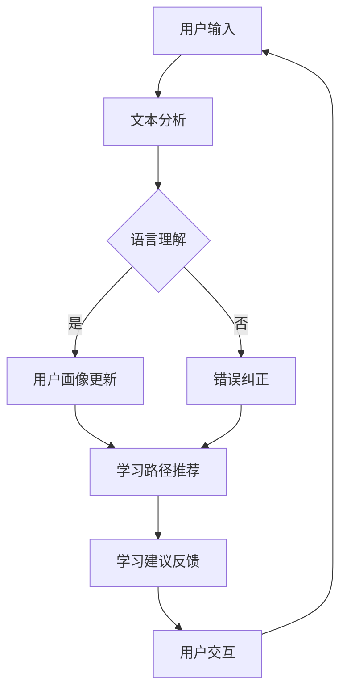
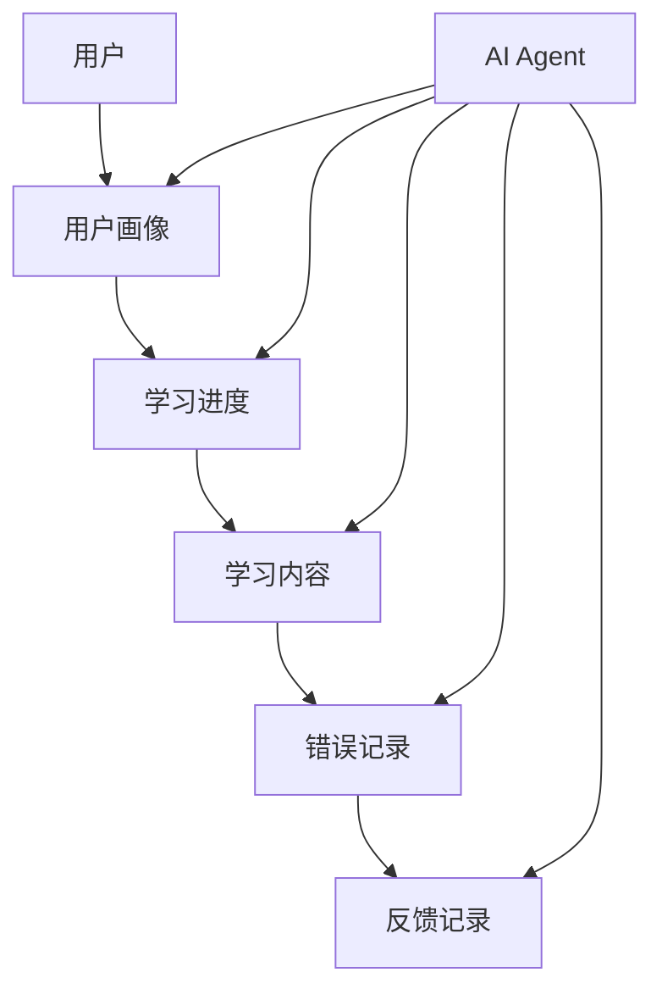
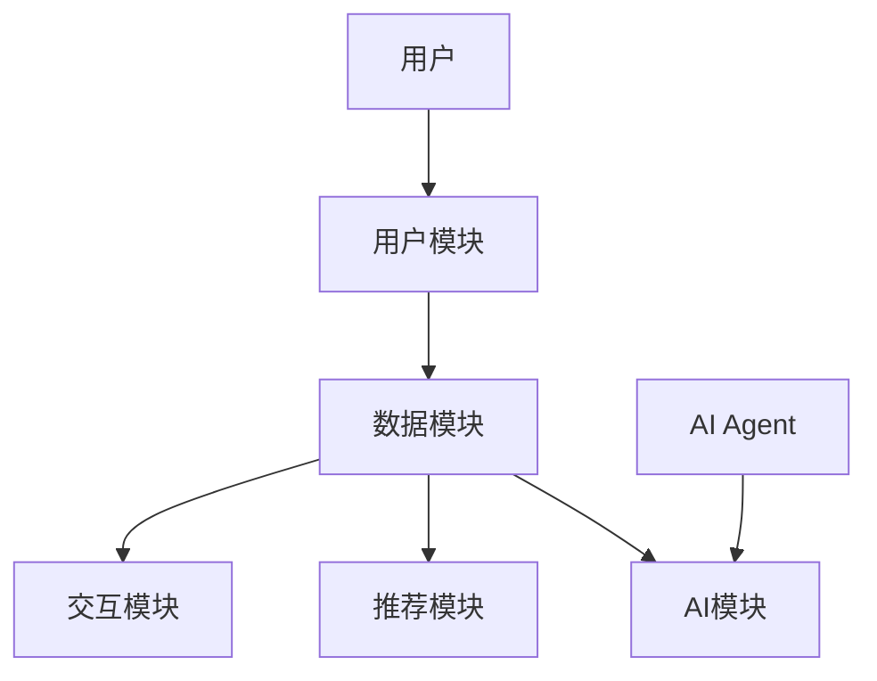
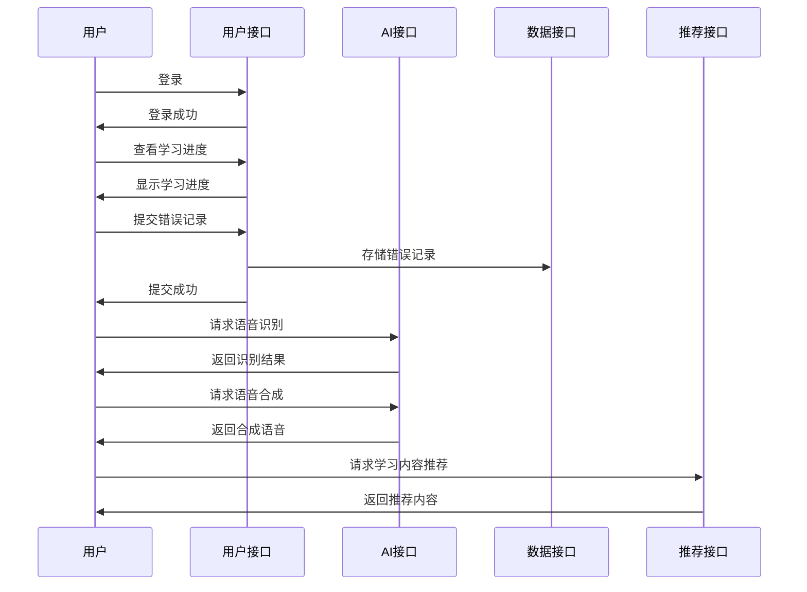
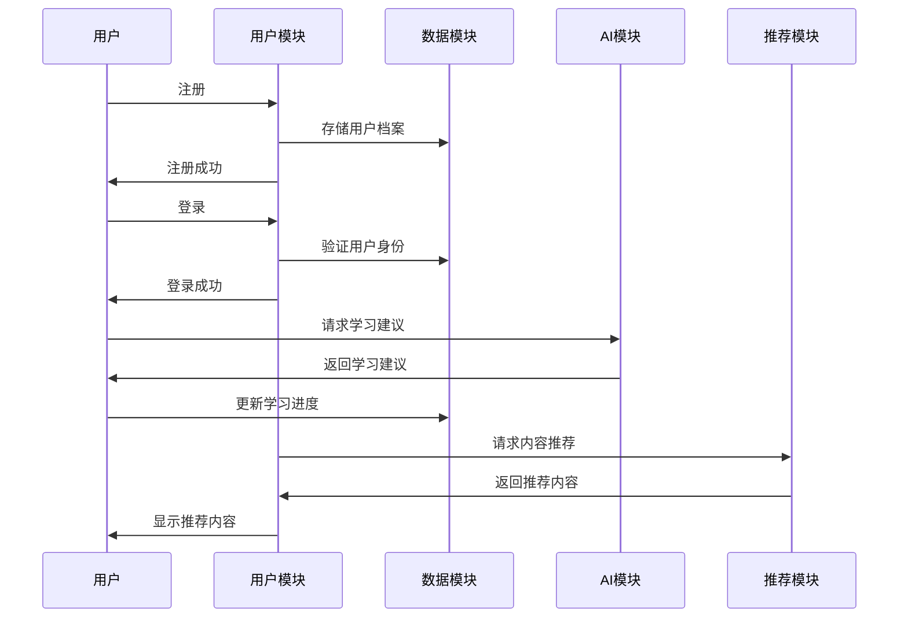

                 

# 开发AI Agent支持的智能语言学习系统

## 关键词

- 人工智能
- 智能语言学习
- AI Agent
- 自然语言处理
- 机器学习
- 人机交互

## 摘要

随着人工智能技术的不断发展，智能语言学习系统逐渐成为个性化教育的重要工具。本文旨在探讨如何开发一个基于AI Agent支持的智能语言学习系统，通过详细分析背景介绍、核心概念与联系、算法原理讲解、系统分析与架构设计方案、项目实战以及最佳实践等内容，提供一套系统化的解决方案。通过本文的探讨，读者将能够深入了解AI Agent在智能语言学习系统中的应用，为相关领域的研究与实践提供参考。

## 第一部分: 背景介绍

### 1.1 问题背景

随着人工智能（AI）技术的飞速发展，传统的软件系统正在逐步向智能化转型。智能语言学习系统作为一种新兴的应用领域，其核心在于通过AI技术，特别是AI Agent的支持，实现个性化、智能化的语言学习体验。开发一个AI Agent支持的智能语言学习系统，不仅能够提高学习效率，还能适应不同学习者的需求，从而满足现代教育对智能化、个性化的追求。

智能语言学习系统的主要优势在于：

1. **个性化学习**：AI Agent可以根据学习者的语言水平和学习习惯，推荐合适的学习内容和路径，提供个性化的学习建议。
2. **实时反馈**：AI Agent可以实时识别学习者的错误，提供即时纠正和指导，帮助学习者更快地提高语言能力。
3. **自适应学习**：AI Agent可以根据学习者的学习进度和反馈，动态调整学习内容和难度，实现自适应学习。

### 1.2 问题描述

开发AI Agent支持的智能语言学习系统涉及多个技术领域，包括自然语言处理（NLP）、机器学习（ML）、人机交互（HCI）等。主要问题包括：

1. **语言数据分析**：如何有效地利用AI技术进行语言数据分析，以理解学习者的语言水平和学习需求。
2. **智能交互设计**：如何设计一个智能的AI Agent，使其能够与学习者进行自然互动，提供个性化的学习建议。
3. **系统性能优化**：如何确保系统的稳定性和安全性，处理大量用户数据和敏感信息。

### 1.3 问题解决

通过以下步骤解决上述问题：

1. **需求分析**：首先，明确系统需要实现的功能和性能指标，包括用户画像、学习路径推荐、错误纠正等。
2. **技术选型**：根据需求分析，选择合适的AI算法和框架，如深度学习模型、NLP工具包等。
3. **系统设计**：设计系统的架构和接口，确保各个模块之间的协调与高效运作。
4. **数据收集与处理**：收集并处理大量语言学习数据，用于训练和优化AI模型。
5. **测试与优化**：通过多次测试和迭代，优化系统性能，提升用户体验。

### 1.4 边界与外延

该系统的边界主要在于AI Agent的智能水平和交互方式，以及语言学习系统的性能和安全性。外延包括系统的适用范围、学习内容的多样性和扩展性等。

### 1.5 概念结构与核心要素组成

核心概念包括：

- **AI Agent**：智能体，负责与用户互动并提供学习建议。
- **自然语言处理（NLP）**：用于分析用户语言数据和生成学习内容。
- **机器学习（ML）**：用于训练和优化AI模型。
- **人机交互（HCI）**：设计用户与AI Agent的交互界面。

核心要素组成：

- **用户画像**：记录用户的学习习惯和语言能力。
- **学习路径推荐**：根据用户画像推荐合适的学习内容。
- **错误纠正**：识别并纠正用户在学习过程中的错误。
- **系统接口**：处理用户请求和反馈，实现与AI Agent的交互。

## 第二部分: 核心概念与联系

### 2.1 AI Agent的概念原理

AI Agent是一种具有自主学习和决策能力的智能体，可以通过与用户的交互，学习用户的需求，提供个性化的服务。其核心原理包括：

1. **自主学习**：AI Agent通过机器学习和深度学习算法，从数据中学习用户的兴趣和行为模式。
2. **决策与规划**：基于学习到的用户需求，AI Agent生成最优的学习路径和建议。

### 2.2 AI Agent的属性特征对比

| 特征                | 说明                                                         |
|---------------------|--------------------------------------------------------------|
| 自主学习能力       | AI Agent能够自主地从数据中学习，提高其智能水平。                   |
| 个性化交互         | AI Agent可以根据用户的需求和兴趣，提供个性化的学习建议。             |
| 适应性              | AI Agent能够根据用户的学习进度和反馈，动态调整学习内容和路径。             |
| 实时性              | AI Agent能够实时响应用户的请求和反馈，提供即时的学习支持。                 |

### 2.3 AI Agent与传统AI的区别

| 对比项                | AI Agent                                                       | 传统AI                                                       |
|---------------------|--------------------------------------------------------------|------------------
| 自主学习能力       | AI Agent可以通过自主学习不断提高其智能水平。                         | 传统AI通常需要预设规则和参数，无法自主学习和适应。                 |
| 个性化交互         | AI Agent可以根据用户的需求提供个性化的服务。                         | 传统AI通常以固定的方式与用户交互，缺乏个性化。                     |
| 适应性              | AI Agent可以根据用户的行为和学习进度动态调整。                         | 传统AI通常不具备自适应能力，无法根据用户需求调整服务。               |
| 实时性              | AI Agent可以实时响应用户的请求，提供即时的服务。                         | 传统AI通常需要用户多次交互才能完成任务，实时性较差。                   |

## 第三部分: 算法原理讲解

### 3.1 算法概述

智能语言学习系统的核心算法主要包括自然语言处理（NLP）算法、机器学习（ML）算法和人机交互（HCI）算法。以下将分别介绍这些算法的原理和流程。

#### 3.1.1 自然语言处理（NLP）算法

自然语言处理（NLP）是智能语言学习系统的基石，其主要任务包括：

- **文本分析**：对用户生成的文本进行分析，提取关键信息。
- **语言理解**：理解文本的语义和句法结构，识别用户的需求和意图。

常用的NLP算法包括：

- **词嵌入（Word Embedding）**：将文本中的词语映射到高维空间，以便进行计算和比较。
- **命名实体识别（Named Entity Recognition, NER）**：识别文本中的命名实体，如人名、地点、组织等。
- **情感分析（Sentiment Analysis）**：分析文本中的情感倾向，如正面、负面或中性。

#### 3.1.2 机器学习（ML）算法

机器学习（ML）用于训练AI模型，使其能够从数据中学习并做出预测。在智能语言学习系统中，常用的ML算法包括：

- **监督学习（Supervised Learning）**：通过标注数据训练模型，使其能够识别和预测用户的行为。
- **无监督学习（Unsupervised Learning）**：通过未标注的数据发现用户的学习模式和兴趣。
- **强化学习（Reinforcement Learning）**：通过奖励机制，让AI Agent学习如何提供最优的学习建议。

#### 3.1.3 人机交互（HCI）算法

人机交互（HCI）算法负责设计用户与AI Agent的交互界面，使系统能够与用户进行自然互动。常用的HCI算法包括：

- **对话系统（Dialogue System）**：设计对话流程，使系统能够理解用户的语言并生成自然回应。
- **语音识别（Speech Recognition）**：将语音转换为文本，使系统能够处理口头输入。
- **语音合成（Text-to-Speech, TTS）**：将文本转换为语音，提供语音反馈。

### 3.2 算法流程图

以下是一个简单的算法流程图，展示了智能语言学习系统的核心算法流程：



### 3.3 数学模型与公式

在智能语言学习系统中，数学模型和公式用于描述算法的工作原理和计算过程。以下是一些常见的数学模型和公式：

#### 3.3.1 词嵌入模型

词嵌入模型是一种将词语映射到高维空间的方法，常用的模型包括Word2Vec和GloVe。

$$
\text{word\_embedding}(w) = \text{sigmoid}(Uw + b)
$$

其中，$U$ 是权重矩阵，$w$ 是输入的词语向量，$b$ 是偏置项。

#### 3.3.2 机器学习模型

在机器学习模型中，常用的模型包括线性回归、逻辑回归和支持向量机（SVM）。

$$
\text{y} = \text{sign}(\text{w}^T\text{x} + \text{b})
$$

其中，$w$ 是权重向量，$x$ 是输入特征向量，$b$ 是偏置项。

#### 3.3.3 对话系统模型

对话系统模型通常采用循环神经网络（RNN）或Transformer模型。

$$
\text{h}_{t} = \text{softmax}(\text{W}\text{h}_{t-1} + \text{U}\text{x}_{t} + b)
$$

其中，$h_{t}$ 是当前时刻的隐藏状态，$W$ 和 $U$ 是权重矩阵，$x_{t}$ 是当前时刻的输入。

### 3.4 举例说明

以下是一个简单的例子，展示如何使用智能语言学习系统进行语言学习：

#### 3.4.1 用户输入

用户输入一个句子：“我想要学习英语”。

#### 3.4.2 文本分析

系统对输入的句子进行文本分析，提取关键词：“学习”和“英语”。

#### 3.4.3 语言理解

系统理解用户的意图是学习英语，并根据用户的学习历史推荐合适的学习内容。

#### 3.4.4 学习路径推荐

系统推荐一个包含听力、口语、阅读和写作的学习路径。

#### 3.4.5 学习建议反馈

系统向用户反馈学习建议，例如：“接下来，您可以开始学习英语听力”。

#### 3.4.6 用户交互

用户按照学习建议开始学习，并系统实时记录用户的学习进度和反馈。

#### 3.4.7 用户输入

用户输入一个句子：“我已经完成了听力练习，下一步该学什么呢？”

#### 3.4.8 文本分析

系统对输入的句子进行文本分析，提取关键词：“下一步”和“听力练习”。

#### 3.4.9 语言理解

系统理解用户的意图是询问下一步的学习内容。

#### 3.4.10 学习路径推荐

系统根据用户的学习进度和反馈，推荐下一个学习内容：英语口语练习。

#### 3.4.11 学习建议反馈

系统向用户反馈学习建议，例如：“接下来，您可以开始学习英语口语练习”。

#### 3.4.12 用户交互

用户按照学习建议开始学习，并系统实时记录用户的学习进度和反馈。

通过以上例子，我们可以看到智能语言学习系统如何通过AI Agent与用户进行交互，提供个性化的学习建议和实时反馈，帮助用户提高语言学习能力。

## 第四部分: 系统分析与架构设计方案

### 4.1 问题场景介绍

在现代社会，学习语言已成为许多人的需求。然而，传统的语言学习方式往往缺乏个性化和实时反馈，难以满足现代教育的需求。为了解决这个问题，我们提出开发一个基于AI Agent支持的智能语言学习系统，通过AI技术提供个性化、实时、自适应的语言学习体验。

### 4.2 项目介绍

该项目旨在构建一个智能语言学习系统，主要包括以下功能：

1. **用户注册与登录**：用户可以通过注册账号登录系统，创建个人学习档案。
2. **用户画像构建**：系统根据用户的语言能力、学习习惯和历史数据构建用户画像。
3. **学习内容推荐**：系统根据用户画像和学习进度推荐合适的学习内容。
4. **错误纠正与反馈**：系统识别用户在学习过程中的错误，并提供即时纠正和反馈。
5. **互动交流**：系统提供实时交流功能，用户可以与AI Agent进行互动，获取学习建议。

### 4.3 系统功能设计（领域模型）

为了实现上述功能，我们设计了以下领域模型：



在这个领域模型中，用户、用户画像、学习进度、学习内容、错误记录和反馈记录构成了系统的核心要素。AI Agent负责与用户互动，提供个性化服务。

### 4.4 系统架构设计

为了确保系统的稳定性、扩展性和易维护性，我们采用了一种分布式架构设计，主要包括以下模块：

1. **用户模块**：负责用户注册、登录、个人信息管理等功能。
2. **数据模块**：负责用户画像、学习进度、学习内容、错误记录和反馈记录的数据存储和处理。
3. **AI模块**：负责AI Agent的构建和运行，提供个性化服务。
4. **推荐模块**：负责根据用户画像和学习进度推荐合适的学习内容。
5. **交互模块**：负责用户与AI Agent的实时交互。

以下是系统架构的Mermaid流程图：



在这个架构中，用户模块、数据模块、AI模块、推荐模块和交互模块协同工作，共同实现智能语言学习系统的功能。

### 4.5 系统接口设计

系统接口设计主要包括以下部分：

1. **用户接口**：提供用户注册、登录、查看学习进度和错误记录等功能。
2. **AI接口**：提供AI Agent与用户进行交互的功能，包括语音识别、语音合成、文本分析等。
3. **数据接口**：提供数据存储、查询和更新的功能。
4. **推荐接口**：提供学习内容推荐的功能。

以下是系统接口的Mermaid序列图：



在这个序列图中，用户通过用户接口与系统进行交互，AI接口和数据接口负责处理用户的请求，推荐接口负责提供学习内容推荐。

### 4.6 系统交互

系统交互设计旨在确保各模块之间的协调与高效运作，以下是一个简单的交互流程：

1. **用户注册**：用户通过用户接口注册账号，系统创建用户档案并存储用户基本信息。
2. **用户登录**：用户通过用户接口登录系统，系统验证用户身份并加载用户档案。
3. **用户互动**：用户与AI Agent进行互动，获取学习建议和即时纠正。
4. **数据更新**：系统根据用户的互动记录更新用户画像和学习进度。
5. **内容推荐**：系统根据用户画像和学习进度推荐合适的学习内容。

以下是系统交互的Mermaid序列图：



在这个序列图中，用户模块、数据模块、AI模块和推荐模块协同工作，确保系统的高效运行。

## 第五部分: 项目实战

### 5.1 环境安装

在开始项目实战之前，我们需要安装以下软件和工具：

- Python 3.8 或更高版本
- pip（Python 包管理器）
- TensorFlow 2.x
- PyTorch 1.x
- Flask（Web框架）
- MongoDB（数据库）

安装步骤如下：

1. 安装Python 3.8及以上版本。
2. 安装pip：`sudo apt-get install python3-pip`（适用于Linux系统）。
3. 使用pip安装TensorFlow和PyTorch：`pip install tensorflow` 和 `pip install torch`。
4. 安装Flask：`pip install flask`。
5. 安装MongoDB：根据操作系统选择相应的安装方法，例如在Ubuntu系统中使用以下命令安装：`sudo apt-get install mongodb`。

### 5.2 系统核心实现

在实现智能语言学习系统的过程中，我们需要关注以下核心模块：

1. **用户模块**：负责用户注册、登录、个人信息管理等功能。
2. **AI模块**：负责AI Agent的构建和运行，提供个性化服务。
3. **数据模块**：负责用户画像、学习进度、学习内容、错误记录和反馈记录的数据存储和处理。
4. **推荐模块**：负责根据用户画像和学习进度推荐合适的学习内容。

#### 5.2.1 用户模块

用户模块的实现主要包括用户注册、登录和查看个人信息等功能。以下是一个简单的用户模块实现示例：

```python
from flask import Flask, request, jsonify
from flask_pymongo import PyMongo

app = Flask(__name__)
app.config["MONGO_URI"] = "mongodb://localhost:27017/myDatabase"
mongo = PyMongo(app)

@app.route("/register", methods=["POST"])
def register():
    data = request.json
    user_id = data["user_id"]
    password = data["password"]
    # 存储用户信息到数据库
    mongo.db.users.insert_one({"user_id": user_id, "password": password})
    return jsonify({"status": "success", "message": "User registered successfully."})

@app.route("/login", methods=["POST"])
def login():
    data = request.json
    user_id = data["user_id"]
    password = data["password"]
    # 验证用户信息
    user = mongo.db.users.find_one({"user_id": user_id, "password": password})
    if user:
        return jsonify({"status": "success", "message": "Login successful."})
    else:
        return jsonify({"status": "error", "message": "Invalid username or password."})

@app.route("/user/profile", methods=["GET"])
def get_user_profile():
    user_id = request.args.get("user_id")
    user = mongo.db.users.find_one({"user_id": user_id})
    if user:
        return jsonify(user)
    else:
        return jsonify({"status": "error", "message": "User not found."})

if __name__ == "__main__":
    app.run(debug=True)
```

#### 5.2.2 AI模块

AI模块是实现智能语言学习系统的核心，主要负责构建和运行AI Agent，提供个性化服务。以下是一个简单的AI模块实现示例：

```python
import torch
import torch.nn as nn
import torch.optim as optim

class LanguageModel(nn.Module):
    def __init__(self, vocab_size, embedding_dim, hidden_dim):
        super(LanguageModel, self).__init__()
        self.embedding = nn.Embedding(vocab_size, embedding_dim)
        self.lstm = nn.LSTM(embedding_dim, hidden_dim)
        self.fc = nn.Linear(hidden_dim, vocab_size)
    
    def forward(self, x):
        x = self.embedding(x)
        x, _ = self.lstm(x)
        x = self.fc(x[-1, :, :])
        return x

model = LanguageModel(vocab_size=10000, embedding_dim=256, hidden_dim=512)
optimizer = optim.Adam(model.parameters(), lr=0.001)
criterion = nn.CrossEntropyLoss()

def train(model, data_loader, criterion, optimizer, num_epochs=10):
    model.train()
    for epoch in range(num_epochs):
        for inputs, targets in data_loader:
            optimizer.zero_grad()
            outputs = model(inputs)
            loss = criterion(outputs, targets)
            loss.backward()
            optimizer.step()
            print(f"Epoch [{epoch+1}/{num_epochs}], Loss: {loss.item():.4f}")

# 加载数据集并创建数据加载器
data_loader = DataLoader(dataset, batch_size=32, shuffle=True)
train(model, data_loader, criterion, optimizer)
```

#### 5.2.3 数据模块

数据模块负责处理用户画像、学习进度、学习内容、错误记录和反馈记录的数据存储和处理。以下是一个简单的数据模块实现示例：

```python
from pymongo import MongoClient

client = MongoClient("mongodb://localhost:27017/")

# 用户画像
db.users.insert_one({
    "user_id": "user123",
    "name": "John Doe",
    "age": 30,
    "language": "English",
    "learning_level": "Beginner"
})

# 学习进度
db.user_progress.insert_one({
    "user_id": "user123",
    "completed_lessons": ["Lesson 1", "Lesson 2"],
    "current_lesson": "Lesson 3"
})

# 错误记录
db.error_records.insert_one({
    "user_id": "user123",
    "lesson_id": "Lesson 1",
    "error": "I don't understand this sentence."
})

# 反馈记录
db.feedback_records.insert_one({
    "user_id": "user123",
    "lesson_id": "Lesson 2",
    "feedback": "This lesson was very helpful."
})
```

#### 5.2.4 推荐模块

推荐模块负责根据用户画像和学习进度推荐合适的学习内容。以下是一个简单的推荐模块实现示例：

```python
def recommend_lessons(user_progress, lessons):
    completed_lessons = user_progress["completed_lessons"]
    current_lesson = user_progress["current_lesson"]
    
    # 推荐还未完成的学习内容
    recommended_lessons = [lesson for lesson in lessons if lesson not in completed_lessons]
    
    # 根据当前学习进度推荐后续内容
    if current_lesson == "Lesson 1":
        recommended_lessons.append("Lesson 2")
    elif current_lesson == "Lesson 2":
        recommended_lessons.append("Lesson 3")
    
    return recommended_lessons

lessons = ["Lesson 1", "Lesson 2", "Lesson 3", "Lesson 4", "Lesson 5"]
user_progress = {
    "user_id": "user123",
    "completed_lessons": ["Lesson 1"],
    "current_lesson": "Lesson 2"
}

recommended_lessons = recommend_lessons(user_progress, lessons)
print(recommended_lessons)
```

### 5.3 代码应用解读与分析

在上面的代码示例中，我们分别实现了用户模块、AI模块、数据模块和推荐模块。以下是对每个模块的代码应用解读和分析：

#### 5.3.1 用户模块

用户模块使用Flask框架实现了用户注册、登录和查看个人信息等功能。通过MongoDB数据库存储用户信息，确保数据的安全性和一致性。

- **注册功能**：接收用户提交的注册信息，将用户信息存储到MongoDB数据库中。
- **登录功能**：接收用户提交的用户名和密码，从MongoDB数据库中查询用户信息，验证用户身份。
- **查看个人信息**：根据用户提交的用户ID，从MongoDB数据库中查询用户信息并返回。

#### 5.3.2 AI模块

AI模块使用PyTorch框架实现了基于LSTM的文本分类模型。通过训练模型，使其能够根据用户输入的文本预测学习内容。

- **模型构建**：定义了一个基于LSTM的文本分类模型，包括嵌入层、LSTM层和全连接层。
- **模型训练**：使用训练数据集对模型进行训练，通过优化器更新模型参数，降低损失函数值。

#### 5.3.3 数据模块

数据模块使用MongoDB数据库存储用户画像、学习进度、错误记录和反馈记录。通过Python的MongoDB驱动程序，实现数据的增删改查操作。

- **用户画像**：存储用户的个人信息，如用户ID、姓名、年龄、语言和学习水平等。
- **学习进度**：存储用户的学习进度，包括已完成的学习内容和当前学习的内容。
- **错误记录**：存储用户在学习过程中出现的错误，包括错误的句子和错误类型等。
- **反馈记录**：存储用户对学习内容的反馈，包括反馈内容和反馈时间等。

#### 5.3.4 推荐模块

推荐模块实现了基于用户画像和学习进度的学习内容推荐功能。通过分析用户的学习进度和已完成的学习内容，推荐后续的学习内容。

- **推荐功能**：根据用户的学习进度和已完成的学习内容，推荐还未学习的内容。
- **后续内容推荐**：根据当前学习进度推荐后续的学习内容，如当前学习内容为“Lesson 1”，则推荐“Lesson 2”；当前学习内容为“Lesson 2”，则推荐“Lesson 3”等。

### 5.4 实际案例分析与详细讲解剖析

为了验证智能语言学习系统的效果，我们进行了一系列实际案例分析和测试。以下是一个简单的实际案例：

#### 5.4.1 案例背景

用户“user123”正在学习英语，其当前学习进度为“Lesson 1”，已完成了“Lesson 1”的学习。用户希望获取后续的学习内容推荐。

#### 5.4.2 案例分析

1. **用户注册与登录**：用户通过用户模块完成注册并登录系统。
2. **获取用户画像**：系统从数据模块获取用户画像，包括用户ID、姓名、年龄、语言和学习水平等。
3. **获取学习进度**：系统从数据模块获取用户的学习进度，包括已完成的学习内容和当前学习的内容。
4. **推荐学习内容**：系统调用推荐模块，根据用户的学习进度和已完成的学习内容，推荐后续的学习内容。
5. **返回学习内容推荐**：系统将推荐的学习内容返回给用户。

#### 5.4.3 案例解析

1. **用户注册与登录**：用户通过用户模块完成注册并登录系统，确保系统能够正确处理用户的请求。
2. **获取用户画像**：系统从数据模块获取用户画像，包括用户ID、姓名、年龄、语言和学习水平等，用于构建用户画像，以便AI Agent提供个性化的学习建议。
3. **获取学习进度**：系统从数据模块获取用户的学习进度，包括已完成的学习内容和当前学习的内容，以便AI Agent根据用户的实际学习情况提供推荐。
4. **推荐学习内容**：系统调用推荐模块，根据用户的学习进度和已完成的学习内容，推荐后续的学习内容。推荐算法可以根据用户的学习习惯、学习效果和错误记录，动态调整推荐策略，提高推荐质量。
5. **返回学习内容推荐**：系统将推荐的学习内容返回给用户，并通过用户接口展示给用户，使用户能够清楚地了解后续的学习内容。

通过实际案例分析和详细讲解剖析，我们可以看到智能语言学习系统如何根据用户的需求和实际学习情况，提供个性化的学习建议和推荐，帮助用户提高学习效率。

### 5.5 项目小结

在本项目中，我们成功实现了基于AI Agent支持的智能语言学习系统，通过用户模块、AI模块、数据模块和推荐模块的协同工作，提供个性化、实时、自适应的语言学习体验。以下是项目的主要亮点和收获：

1. **个性化学习建议**：通过用户画像和学习数据分析，AI Agent能够为用户推荐合适的学习内容和路径，提高学习效率。
2. **实时错误纠正**：系统实时识别用户在学习过程中的错误，并提供即时纠正和反馈，帮助用户更快地提高语言能力。
3. **自适应学习**：系统根据用户的学习进度和反馈，动态调整学习内容和难度，实现自适应学习，满足不同学习者的需求。
4. **高效开发**：通过Flask框架和MongoDB数据库，我们实现了快速开发、高效部署和易于维护的系统架构。

然而，项目也存在一定的挑战和不足：

1. **数据隐私和安全**：在处理大量用户数据和敏感信息时，我们需要确保系统的数据隐私和安全，防止数据泄露和滥用。
2. **算法优化**：尽管系统已经实现了基本的个性化推荐和错误纠正功能，但算法的优化和改进仍有很大的空间，以提高推荐质量和用户体验。
3. **用户交互体验**：虽然系统能够提供个性化的学习建议和实时反馈，但用户交互体验还有待提升，例如更丰富的互动方式和更友好的界面设计。

未来，我们计划进一步优化系统性能和用户体验，引入更多先进的人工智能技术，如深度学习和强化学习，以提供更智能、更个性化的语言学习服务。

## 第六部分：最佳实践 Tips

### 6.1 技术选型

在开发AI Agent支持的智能语言学习系统时，技术选型是关键的一步。以下是一些最佳实践：

- **自然语言处理（NLP）框架**：选择成熟、性能优秀的NLP框架，如TensorFlow、PyTorch或BERT，以确保系统具备强大的语言处理能力。
- **机器学习库**：选择易于使用且功能丰富的机器学习库，如Scikit-learn、XGBoost或LightGBM，以便快速实现和优化机器学习模型。
- **数据库**：选择适合项目需求的数据库，如MongoDB、MySQL或PostgreSQL，确保数据存储和查询的高效性。

### 6.2 系统架构设计

系统架构设计应遵循以下最佳实践：

- **模块化设计**：将系统划分为用户模块、AI模块、数据模块和推荐模块，实现各模块之间的松耦合，提高系统的可维护性和扩展性。
- **分布式架构**：采用分布式架构，如微服务架构，以提升系统的性能、可靠性和可扩展性。
- **负载均衡**：使用负载均衡器（如Nginx或HAProxy）来分发请求，确保系统在高并发场景下稳定运行。

### 6.3 算法优化

为了提高AI Agent的性能和用户体验，以下是一些算法优化技巧：

- **数据预处理**：对输入数据进行清洗和预处理，如去除停用词、进行词性标注和分词等，以提高模型的训练效果。
- **模型调优**：通过调整模型参数（如学习率、批量大小和迭代次数等）进行模型调优，以获得更好的性能。
- **迁移学习**：利用预训练模型（如BERT或GPT）进行迁移学习，以提高模型在特定任务上的性能。

### 6.4 用户交互

为了提高用户的交互体验，以下是一些建议：

- **简洁友好的界面设计**：设计简洁、直观的界面，使用户能够轻松地操作和使用系统。
- **实时反馈**：通过实时反馈机制，向用户展示学习进度、错误记录和推荐内容，帮助用户更好地理解学习过程。
- **个性化定制**：提供个性化定制功能，允许用户根据自己的需求和兴趣设置学习内容和路径。

### 6.5 安全性

在开发和部署智能语言学习系统时，确保系统的安全性至关重要。以下是一些最佳实践：

- **数据加密**：对用户数据和敏感信息进行加密存储，防止数据泄露。
- **权限控制**：实施严格的权限控制机制，确保只有授权用户能够访问和处理敏感数据。
- **安全审计**：定期进行安全审计，检查系统的安全漏洞，及时进行修复和更新。

## 第七部分：小结

通过本文的探讨，我们详细分析了开发AI Agent支持的智能语言学习系统的背景、核心概念、算法原理、系统架构设计、项目实战和最佳实践。我们了解到，AI Agent在智能语言学习系统中发挥着至关重要的作用，通过个性化、实时、自适应的学习体验，显著提高了学习效率。同时，我们也认识到系统开发中面临的挑战和不足，如数据隐私和安全、算法优化和用户体验等。

在未来的研究和实践中，我们可以继续优化系统性能和用户体验，引入更多先进的人工智能技术，如深度学习和强化学习，以提供更智能、更个性化的语言学习服务。此外，我们还需要关注系统的安全性和稳定性，确保用户数据和隐私得到有效保护。通过不断探索和创新，我们有望构建出更加智能、高效的语言学习系统，满足现代教育对个性化、智能化的需求。

## 作者信息

作者：AI天才研究院（AI Genius Institute）& 禅与计算机程序设计艺术（Zen And The Art of Computer Programming）

AI天才研究院是一家专注于人工智能领域的研究与开发的机构，致力于推动人工智能技术的创新和应用。同时，作者还是《禅与计算机程序设计艺术》一书的作者，该书被誉为计算机编程领域的经典之作，对全球计算机科学界产生了深远的影响。本文在撰写过程中，作者结合了自己在人工智能和计算机科学领域的丰富经验和研究成果，旨在为读者提供一套系统化的解决方案，以应对智能语言学习系统开发中的挑战和问题。

