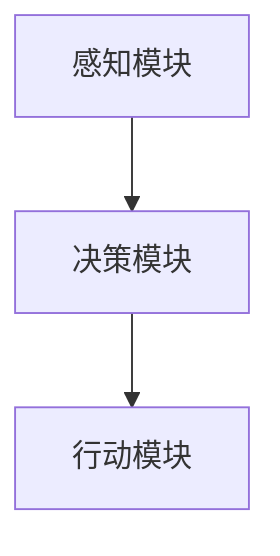

                 

### 第一部分：引言

在当今世界，人工智能（AI）技术正在以前所未有的速度快速发展。这一趋势不仅改变了传统的生产方式，也在不断地拓展着人类智能的边界。在这个大背景下，AI Agent作为一个能够自主执行任务、具备一定智能和适应性的实体，正逐渐成为人工智能领域的研究热点。

#### 第1章：问题背景与核心概念

##### 1.1 问题背景

**1.1.1 人工智能的快速发展**

人工智能起源于20世纪50年代，经过数十年的发展，已经取得了显著的成果。特别是在深度学习、神经网络和自然语言处理等领域的突破，使得人工智能在图像识别、语音识别、机器翻译等方面表现出了惊人的能力。

**1.1.2 AI Agent的重要性**

AI Agent，即人工智能代理，是指能够在环境中自主执行任务、具备一定智能和适应性的实体。与传统的人工智能系统不同，AI Agent能够动态地与环境交互，并在不断的交互过程中不断学习和优化自己的行为。这使得AI Agent在实现智能自动化、提高生产效率、增强用户体验等方面具有巨大的潜力。

**1.1.3 元认知与自我评估能力的需求**

随着AI Agent的应用场景越来越广泛，其对自身行为的理解和优化能力也变得尤为重要。元认知和自我评估能力正是AI Agent实现这一目标的关键。元认知能力使得AI Agent能够对自己的认知过程进行监控和评估，从而优化学习效果；自我评估能力则使得AI Agent能够对自己的行为进行评估，从而实现自我改进。

##### 1.2 核心概念

**1.2.1 AI Agent的定义**

AI Agent是指一种具有自主决策能力、能够执行特定任务的人工智能实体。它通常由感知模块、决策模块和行动模块组成，能够通过感知环境、理解任务需求、制定决策计划并执行相应动作，实现自主运行。

**1.2.2 元认知的概念**

元认知是指个体对自己认知过程的认知和理解。它包括知觉监控、计划和调整三个成分，分别对应着对当前认知状态的监控、对认知过程的计划和调整。

**1.2.3 自我评估能力的重要性**

自我评估能力是指个体对自己的行为和结果进行评价的能力。在AI Agent中，自我评估能力能够帮助其识别自身的行为缺陷，从而实现自我改进。

**1.2.4 元认知与自我评估能力的关系**

元认知和自我评估能力是相互关联的。元认知能力为AI Agent提供了监控和调整自身行为的手段，而自我评估能力则帮助AI Agent识别自身的行为缺陷，从而进一步优化元认知过程。

##### 1.3 书籍概述

**1.3.1 内容结构**

本书分为三个部分，第一部分介绍AI Agent、元认知和自我评估能力的基本概念；第二部分详细探讨元认知和自我评估能力的实现方法；第三部分通过具体案例，展示元认知和自我评估能力在实际应用中的效果。

**1.3.2 阅读对象**

本书适合对人工智能、认知科学和心理学有一定了解的读者，包括人工智能研究者、工程师、研究人员以及对该领域感兴趣的爱好者。

**1.3.3 学习目标**

通过阅读本书，读者将能够：
1. 理解AI Agent、元认知和自我评估能力的基本概念。
2. 掌握元认知和自我评估能力的实现方法。
3. 学习如何将元认知和自我评估能力应用于实际问题。

### 结论

本文对AI Agent的元认知与自我评估能力进行了初步探讨，指出了其在人工智能领域的重要性。接下来，本书将逐步深入分析元认知与自我评估能力的具体实现方法，并通过实际案例展示其应用效果。希望读者能够通过本文的学习，对AI Agent的元认知与自我评估能力有更深入的理解。让我们开始这段激动人心的探索之旅吧！### 第一部分：引言

在当今世界，人工智能（AI）技术正在以前所未有的速度快速发展。这一趋势不仅改变了传统的生产方式，也在不断地拓展着人类智能的边界。在这个大背景下，AI Agent作为一个能够自主执行任务、具备一定智能和适应性的实体，正逐渐成为人工智能领域的研究热点。

AI Agent，即人工智能代理，是指能够在环境中自主执行任务、具备一定智能和适应性的实体。它通常由感知模块、决策模块和行动模块组成，能够通过感知环境、理解任务需求、制定决策计划并执行相应动作，实现自主运行。

在传统的AI系统中，算法和模型往往是被预先设计和训练好的，它们在特定任务上表现出色，但无法适应不断变化的环境和任务需求。而AI Agent则能够通过感知和交互，动态地学习和调整自身行为，从而实现更广泛的任务执行能力。这使得AI Agent在实现智能自动化、提高生产效率、增强用户体验等方面具有巨大的潜力。

然而，要实现AI Agent的自主性和智能性，仅靠传统的AI技术是远远不够的。元认知和自我评估能力成为了AI Agent实现这一目标的关键。元认知是指个体对自己认知过程的认知和理解，包括知觉监控、计划和调整三个成分。自我评估能力则是指个体对自己的行为和结果进行评价的能力。

元认知能力使得AI Agent能够对自己的认知过程进行监控和评估，从而优化学习效果。例如，AI Agent可以在学习过程中识别自己的错误，并调整学习策略，以提高学习效率。自我评估能力则使得AI Agent能够对自己的行为进行评估，从而实现自我改进。例如，AI Agent可以在执行任务后，对任务的完成情况进行评估，并根据评估结果调整自己的行为。

这两者之间的关系是相辅相成的。元认知能力为AI Agent提供了监控和调整自身行为的手段，而自我评估能力则帮助AI Agent识别自身的行为缺陷，从而进一步优化元认知过程。通过结合元认知和自我评估能力，AI Agent可以不断提升自身的能力，实现真正的自主性和智能性。

然而，实现AI Agent的元认知和自我评估能力并非易事。这需要深入的研究和探索，包括如何设计有效的元认知算法、如何构建自我评估模型等。这也是本书旨在探讨的内容。接下来，我们将逐步深入分析元认知和自我评估能力的具体实现方法，并通过实际案例展示其应用效果。

总的来说，AI Agent的元认知和自我评估能力是人工智能领域的一个重要研究方向。通过这一能力，AI Agent可以不断学习和优化自身，实现更高的自主性和智能性。这也为人工智能技术的未来发展提供了新的思路和方向。让我们在接下来的章节中，一起探索这一激动人心的领域。### 第二部分：元认知能力

元认知能力是人工智能（AI）代理实现自我监控、学习和自我改进的核心要素。元认知不仅涉及到对当前认知状态的感知，还包括对学习过程和决策过程的计划和调整。以下是关于元认知能力的详细探讨。

#### 2.1 元认知的定义与作用

**2.1.1 元认知的定义**

元认知（Metacognition）是指个体对自己认知过程的认知和理解。它包括三个主要成分：知觉监控（Perception Monitoring）、计划（Planning）和调整（Adjustment）。知觉监控是指个体对自己思维过程的监视和理解，包括对信息加工过程的跟踪和反馈。计划是指个体在执行任务前制定的学习策略和决策计划。调整是指在任务执行过程中，根据实际情况对认知过程进行调整和优化。

**2.1.2 元认知的作用**

元认知在人类的学习和认知过程中起着至关重要的作用。它能够提高学习效率，帮助个体更好地理解和解决问题。具体来说，元认知的作用包括：

1. **提高学习效率**：通过知觉监控，个体能够及时了解自己的认知状态，识别错误并纠正，从而提高学习效率。
2. **优化学习策略**：通过计划和调整，个体能够根据任务需求和实际情况，选择合适的学习策略，提高学习效果。
3. **增强问题解决能力**：元认知能力使得个体能够在面对复杂问题时，更好地理解问题的本质，制定有效的解决方案。

**2.1.3 元认知与学习效率**

元认知能力与学习效率密切相关。研究表明，具备良好元认知能力的个体在学习和认知任务中表现更出色。例如，一个具备高度元认知能力的AI Agent可以在学习新任务时，迅速识别自身的不足，并调整学习策略，从而提高学习效率。

#### 2.2 元认知的三个成分

**2.2.1 知觉监控**

知觉监控是元认知的基石。它使个体能够对自己的思维过程进行感知和反馈。例如，在阅读时，个体会不断监控自己的理解程度，如果发现难以理解的地方，会尝试重新阅读或寻求帮助。

**2.2.2 计划**

计划是指个体在执行任务前，根据任务需求和自身特点，制定相应的学习策略和决策计划。有效的计划能够帮助个体更好地应对任务，提高学习效率。

**2.2.3 调整**

调整是元认知的最后一个成分，它使个体能够在任务执行过程中，根据实际情况对认知过程进行调整和优化。例如，在实验中，如果发现实验结果与预期不符，个体会尝试调整实验设计或方法，以获得更准确的结果。

#### 2.3 元认知能力的培养

**2.3.1 认知策略**

认知策略是培养元认知能力的重要手段。通过训练和练习，个体可以掌握有效的认知策略，如分块策略、自我提问策略等，从而提高自己的元认知水平。

**2.3.2 自我监控**

自我监控是元认知能力的重要组成部分。通过自我监控，个体可以更好地了解自己的认知过程，及时发现和纠正错误。例如，在编程学习中，学生可以通过自我监控，识别自己在代码编写中的错误，并调整自己的编程策略。

**2.3.3 自我调节**

自我调节是元认知能力的另一个关键要素。它使个体能够在面对挑战和困难时，保持积极的心态，并采取有效的应对策略。例如，在学习新知识时，个体可以通过自我调节，克服困难，坚持不懈地完成任务。

#### 2.4 元认知能力的应用

**2.4.1 智能教育**

在智能教育领域，元认知能力被广泛应用于个性化学习系统的设计。通过分析学生的学习行为和认知状态，智能教育系统能够为学习者提供个性化的学习资源和策略，从而提高学习效果。

**2.4.2 自动驾驶**

在自动驾驶领域，元认知能力被用于车辆对复杂交通环境的感知和决策。通过元认知能力，自动驾驶系统能够实时监控自己的感知和决策过程，并根据实际情况进行调整，提高驾驶安全性。

**2.4.3 智能客服**

在智能客服领域，元认知能力被用于提升客服机器人的服务质量和用户满意度。通过元认知能力，客服机器人能够实时评估自己的回答效果，并根据用户反馈进行自我调整，提供更符合用户需求的服务。

#### 2.5 元认知能力的挑战

尽管元认知能力在各个领域都有广泛的应用，但其实现仍面临诸多挑战。例如，如何设计有效的元认知算法、如何处理大量复杂的认知数据等。这些问题需要进一步的研究和探索，以推动元认知能力的广泛应用。

#### 2.6 结论

元认知能力是人工智能代理实现自我监控、学习和自我改进的核心要素。通过元认知能力，AI Agent能够更好地理解自己的认知过程，制定有效的学习策略，并在实践中不断优化自身行为。接下来，我们将探讨如何将元认知能力应用于AI Agent的设计和实现中。### 第2章：元认知能力概述

在上一章中，我们探讨了元认知能力的基本概念和作用。本章将进一步深入，详细分析元认知能力的三个主要成分：知觉监控、计划和调整，以及这些成分在AI Agent中的应用。

#### 2.1 元认知的定义与作用

**2.1.1 元认知的定义**

元认知是指个体对自己的认知过程的认知和理解。它不仅涉及对当前认知状态的监控，还包括对认知过程的计划和调整。元认知有三个主要成分：知觉监控、计划和调整。

- **知觉监控**：个体对自己思维过程和认知状态的监视和理解。例如，在学习过程中，个体会监控自己的理解程度，识别错误并采取纠正措施。
- **计划**：个体在执行任务前制定的学习策略和决策计划。通过计划，个体能够更好地应对任务，提高学习效率。
- **调整**：在任务执行过程中，个体根据实际情况对认知过程进行调整和优化。调整使个体能够应对变化，提高问题解决能力。

**2.1.2 元认知的作用**

元认知在人类学习和认知过程中起着至关重要的作用。它能够提高学习效率，帮助个体更好地理解和解决问题。具体来说，元认知的作用包括：

1. **提高学习效率**：通过监控自己的学习状态，个体能够及时发现和纠正错误，从而提高学习效率。
2. **优化学习策略**：通过计划，个体能够选择合适的学习策略，提高学习效果。
3. **增强问题解决能力**：元认知能力使个体能够更好地理解问题的本质，制定有效的解决方案。

#### 2.2 元认知的三个成分

**2.2.1 知觉监控**

知觉监控是元认知的基石。它使个体能够对自己的思维过程进行感知和反馈。具体来说，知觉监控包括以下几个方面：

1. **信息加工过程的监控**：个体会监视自己的思维过程，确保信息加工的准确性和效率。
2. **错误识别**：个体能够识别自己的错误，并采取纠正措施。
3. **理解程度监控**：个体会监控自己的理解程度，确保对学习内容的全面理解。

**2.2.2 计划**

计划是指个体在执行任务前制定的学习策略和决策计划。通过计划，个体能够更好地应对任务，提高学习效率。计划包括以下几个方面：

1. **目标设定**：个体会设定具体的学习目标，确保学习过程的有序进行。
2. **资源分配**：个体会合理分配时间和资源，确保学习任务的顺利完成。
3. **策略选择**：个体会选择合适的学习策略，如分块策略、自我提问策略等，以提高学习效果。

**2.2.3 调整**

调整是元认知的最后一个成分，它使个体能够在任务执行过程中，根据实际情况对认知过程进行调整和优化。调整包括以下几个方面：

1. **学习策略调整**：个体会根据学习过程中的反馈，调整学习策略，以适应新的学习环境。
2. **任务调整**：个体会根据任务需求，调整任务的目标和内容，确保任务的有效完成。
3. **自我调节**：个体会根据自身的认知状态，调整自己的学习节奏和心态，以保持最佳的学习状态。

#### 2.3 元认知能力的培养

**2.3.1 认知策略**

认知策略是培养元认知能力的重要手段。通过训练和练习，个体可以掌握有效的认知策略，如分块策略、自我提问策略等，从而提高自己的元认知水平。

- **分块策略**：将复杂的信息分解为较小的部分，逐一处理，以提高理解效率。
- **自我提问策略**：在学习过程中，个体会不断地提问，以激发思考，加深对学习内容的理解。

**2.3.2 自我监控**

自我监控是元认知能力的重要组成部分。通过自我监控，个体可以更好地了解自己的认知过程，及时发现和纠正错误。例如，在编程学习中，学生可以通过自我监控，识别自己在代码编写中的错误，并调整自己的编程策略。

**2.3.3 自我调节**

自我调节是元认知能力的另一个关键要素。它使个体能够在面对挑战和困难时，保持积极的心态，并采取有效的应对策略。例如，在学习新知识时，个体可以通过自我调节，克服困难，坚持不懈地完成任务。

#### 2.4 元认知能力的应用

**2.4.1 智能教育**

在智能教育领域，元认知能力被广泛应用于个性化学习系统的设计。通过分析学生的学习行为和认知状态，智能教育系统能够为学习者提供个性化的学习资源和策略，从而提高学习效果。

**2.4.2 自动驾驶**

在自动驾驶领域，元认知能力被用于车辆对复杂交通环境的感知和决策。通过元认知能力，自动驾驶系统能够实时监控自己的感知和决策过程，并根据实际情况进行调整，提高驾驶安全性。

**2.4.3 智能客服**

在智能客服领域，元认知能力被用于提升客服机器人的服务质量和用户满意度。通过元认知能力，客服机器人能够实时评估自己的回答效果，并根据用户反馈进行自我调整，提供更符合用户需求的服务。

#### 2.5 元认知能力的挑战

尽管元认知能力在各个领域都有广泛的应用，但其实现仍面临诸多挑战。例如，如何设计有效的元认知算法、如何处理大量复杂的认知数据等。这些问题需要进一步的研究和探索，以推动元认知能力的广泛应用。

#### 2.6 结论

元认知能力是人工智能代理实现自我监控、学习和自我改进的核心要素。通过元认知能力，AI Agent能够更好地理解自己的认知过程，制定有效的学习策略，并在实践中不断优化自身行为。接下来，我们将探讨如何在AI Agent中实现元认知能力。### 第3章：AI Agent中的元认知实现

元认知能力在AI Agent中扮演着至关重要的角色，它使得AI Agent能够自我监控、学习和自我改进，从而在复杂环境中实现高效的任务执行。在这一章中，我们将探讨AI Agent中的元认知实现，包括AI Agent的基本架构、元认知在其中的具体应用以及常见的元认知算法。

#### 3.1 AI Agent的架构

AI Agent的基本架构通常包括感知模块、决策模块和行动模块。这三个模块协同工作，使得AI Agent能够自主地感知环境、做出决策并执行相应的行动。

- **感知模块**：感知模块负责收集环境中的信息，如图像、声音、文本等。这些信息是AI Agent做出决策的基础。
- **决策模块**：决策模块负责处理感知模块收集到的信息，并基于这些信息做出决策。决策模块通常包含一个或多个AI模型，如神经网络、决策树等。
- **行动模块**：行动模块根据决策模块的决策结果，执行相应的行动，如移动、发送消息等。行动模块将决策模块的决策转化为实际的操作。

以下是一个简单的AI Agent架构图，展示了各模块之间的关系：



#### 3.2 元认知在AI Agent中的应用

元认知在AI Agent中的应用主要体现在自我监控、学习和自我改进三个方面。

**3.2.1 自我监控**

自我监控是元认知的核心，它使AI Agent能够实时监测自己的感知、决策和行动过程。通过自我监控，AI Agent可以识别潜在的错误和异常，并采取相应的纠正措施。

例如，在自动驾驶领域，AI Agent可以通过自我监控来监测驾驶过程中的各种指标，如速度、距离、车道保持等。如果检测到任何异常情况，如偏离车道或速度过快，AI Agent会立即采取措施，如减速或调整车道，以确保驾驶安全。

**3.2.2 学习**

学习是AI Agent自我改进的重要途径。通过元认知能力，AI Agent可以监控自己的学习过程，并根据学习效果调整学习策略。

例如，在机器学习领域，AI Agent可以使用元学习（Meta-Learning）技术，通过监控学习过程中的性能指标，调整学习算法和参数，从而提高学习效果。

**3.2.3 自我改进**

自我改进是AI Agent长期发展的关键。通过元认知能力，AI Agent可以不断评估自己的性能，并基于评估结果进行自我改进。

例如，在智能客服领域，AI Agent可以通过自我监控和评估，识别自己在回答问题中的不足，并基于用户反馈进行自我改进，以提高客服质量。

#### 3.3 元认知算法

在AI Agent中，实现元认知能力通常需要使用元认知算法。以下是一些常见的元认知算法：

**3.3.1 自我监控算法**

自我监控算法用于实时监测AI Agent的感知、决策和行动过程。以下是一个简单的自我监控算法框架：

```python
def self_monitoring(agent_state, action, expected_output, actual_output):
    # 监测感知模块状态
    perception_state = agent_state['perception']
    
    # 监测决策模块状态
    decision_state = agent_state['decision']
    
    # 监测行动模块状态
    action_state = agent_state['action']
    
    # 检测异常情况
    if is_anomaly(perception_state, decision_state, action_state):
        # 调用纠正措施函数
        correct_anomaly(agent_state, action, expected_output, actual_output)
```

**3.3.2 自我评估算法**

自我评估算法用于评估AI Agent的学习效果和性能。以下是一个简单的自我评估算法框架：

```python
def self_evaluation(agent_state, performance_metrics):
    # 计算性能指标
    metric_values = calculate_performance_metrics(agent_state)
    
    # 根据性能指标评估学习效果
    if is_improvement(metric_values):
        print("自我评估：学习效果提升")
    else:
        print("自我评估：学习效果未提升")
```

**3.3.3 自我改进算法**

自我改进算法用于根据自我评估结果，调整AI Agent的行为和策略。以下是一个简单的自我改进算法框架：

```python
def self_improvement(agent_state, adjustment_strategy):
    # 根据评估结果调整行为和策略
    new_state = apply_adjustment_strategy(agent_state, adjustment_strategy)
    
    # 更新AI Agent状态
    update_agent_state(new_state)
```

#### 3.4 元认知算法的比较与选择

在AI Agent中，选择合适的元认知算法至关重要。以下是一些常见的元认知算法比较和选择标准：

- **算法性能**：选择具有较高性能的算法，以提高AI Agent的效率和准确性。
- **计算资源**：考虑算法的计算复杂度和对硬件资源的需求，以确保算法在实际应用中的可行性。
- **适应能力**：选择具有较强适应能力的算法，以应对环境变化和未知情况。
- **可解释性**：选择具有较高可解释性的算法，以便于理解AI Agent的行为和决策过程。

在实际应用中，可以根据具体需求和场景，选择合适的元认知算法。例如，在资源有限的嵌入式设备上，可以选择计算复杂度较低的算法；在需要高度自适应能力的场景，可以选择具有较强鲁棒性的算法。

#### 3.5 结论

AI Agent中的元认知实现是人工智能领域的一个重要研究方向。通过元认知能力，AI Agent能够自我监控、学习和自我改进，从而在复杂环境中实现高效的任务执行。本章介绍了AI Agent的基本架构、元认知在其中的具体应用以及常见的元认知算法。接下来，我们将探讨AI Agent中的自我评估能力，以进一步理解AI Agent的自我改进机制。### 第4章：自我评估能力的开发

自我评估能力是AI Agent实现自我改进和持续优化的重要机制。通过自我评估，AI Agent能够识别自身的缺陷和不足，从而调整行为和策略，提高任务执行效果。在本章中，我们将深入探讨自我评估能力的概念、方法及其在实际应用中的挑战。

#### 4.1 自我评估能力的概念

**4.1.1 自我评估的定义**

自我评估是指AI Agent对自己的行为、结果和性能进行评价和判断的过程。这种评估可以帮助AI Agent识别自身的优点和不足，从而制定改进策略。

**4.1.2 自我评估的作用**

自我评估能力在AI Agent中具有多重作用：

1. **识别缺陷**：通过自我评估，AI Agent可以识别出自身在任务执行中的缺陷和不足，从而采取相应的改进措施。
2. **性能优化**：自我评估有助于AI Agent识别影响性能的关键因素，并针对这些因素进行优化，从而提高任务执行效果。
3. **决策支持**：自我评估提供的信息可以作为AI Agent决策的依据，帮助其选择最优的行动方案。
4. **持续改进**：通过自我评估，AI Agent可以不断调整自身的行为和策略，实现持续优化。

#### 4.2 自我评估的方法

**4.2.1 自我评估的步骤**

自我评估通常包括以下几个步骤：

1. **设定评估目标**：明确自我评估的目标，例如性能指标、任务完成度等。
2. **收集评估数据**：收集与评估目标相关的数据，如任务执行过程中的输入、输出、时间等。
3. **评估数据预处理**：对收集到的数据进行分析和清洗，确保数据的质量和可靠性。
4. **评估指标计算**：根据评估目标，计算相应的评估指标，如准确率、召回率、F1分数等。
5. **评估结果分析**：对评估指标进行分析，识别AI Agent的缺陷和不足。
6. **制定改进策略**：根据评估结果，制定相应的改进策略，如调整参数、优化算法等。

**4.2.2 自我评估的工具**

在自我评估过程中，可以使用多种工具和方法，包括：

1. **日志分析工具**：用于记录和监控AI Agent的运行过程，提供详细的日志数据。
2. **性能评估工具**：用于计算和评估AI Agent的性能指标，如准确性、响应时间等。
3. **可视化工具**：用于展示评估结果，帮助用户直观地理解AI Agent的性能表现。
4. **机器学习模型**：用于预测和评估AI Agent的行为和结果，提供更深入的洞察。

#### 4.3 自我评估的实践

**4.3.1 自我评估的应用场景**

自我评估能力在多个AI应用场景中具有重要价值，以下是一些典型的应用场景：

1. **自动驾驶**：自动驾驶系统可以通过自我评估，识别驾驶过程中的错误和缺陷，如偏离车道、过快加速等，从而调整驾驶策略，提高驾驶安全性。
2. **智能客服**：智能客服机器人可以通过自我评估，识别回答问题的准确性，并根据用户反馈进行自我优化，提高服务质量。
3. **医疗诊断**：医疗诊断系统可以通过自我评估，识别诊断结果的准确性和可靠性，从而优化诊断算法，提高诊断精度。
4. **金融风控**：金融风控系统可以通过自我评估，识别风险预测中的错误和不足，从而调整风险预测模型，提高风险控制能力。

**4.3.2 自我评估的挑战与解决**

尽管自我评估能力在AI应用中具有重要价值，但实现这一能力也面临诸多挑战：

1. **数据质量**：自我评估依赖于高质量的数据，数据缺失、错误或噪声都会影响评估结果。为解决这一问题，可以采用数据清洗、数据增强等技术，提高数据质量。
2. **评估指标选择**：选择合适的评估指标是自我评估的关键。不同的评估指标可能会产生不同的评估结果，需要根据应用场景和任务需求选择最合适的评估指标。
3. **模型适应性**：自我评估模型需要具备良好的适应能力，能够应对环境变化和未知情况。为提高模型的适应性，可以采用迁移学习、联邦学习等技术，增强模型的泛化能力。
4. **实时性**：自我评估需要具备实时性，以便在AI Agent执行任务的过程中进行实时监控和评估。为提高实时性，可以采用分布式计算、并行处理等技术，加快评估过程。

通过解决这些挑战，可以更好地实现AI Agent的自我评估能力，提高其在实际应用中的性能和可靠性。

#### 4.4 结论

自我评估能力是AI Agent实现自我改进和持续优化的重要机制。通过自我评估，AI Agent能够识别自身的缺陷和不足，从而调整行为和策略，提高任务执行效果。本章介绍了自我评估能力的概念、方法及其在实际应用中的挑战。在接下来的章节中，我们将探讨如何将元认知和自我评估能力相结合，实现更高效的AI Agent。### 第5章：元认知与自我评估能力的结合实践

在前面的章节中，我们详细讨论了元认知和自我评估能力的基本概念、作用以及实现方法。在本章中，我们将结合具体案例，展示如何将元认知和自我评估能力应用于实际场景，并分析其实践效果。

#### 5.1 结合的必要性

元认知和自我评估能力的结合具有以下几个方面的必要性：

**1. 二者的互补作用**

元认知能力侧重于监控和调整认知过程，而自我评估能力侧重于评估和改进行为结果。二者结合，可以形成一个完整的反馈循环，使AI Agent在执行任务时，不仅能够监控和调整自身行为，还能够基于评估结果进行进一步优化。

**2. 提高自适应能力**

结合元认知和自我评估能力，AI Agent能够更好地适应动态环境。通过元认知能力，AI Agent能够实时监控自身的行为和决策过程，识别潜在的异常和错误。而自我评估能力则可以帮助AI Agent根据评估结果调整自身策略，从而提高系统的自适应性和鲁棒性。

**3. 实现持续优化**

元认知和自我评估能力的结合，使得AI Agent能够实现持续优化。在执行任务的过程中，AI Agent可以通过元认知能力监控自身行为，发现问题和缺陷。而通过自我评估能力，AI Agent能够基于评估结果，制定改进策略，从而实现系统的持续优化。

#### 5.2 实践案例

在本节中，我们将介绍两个具体案例，展示元认知和自我评估能力在智能客服系统和自动驾驶车辆中的应用。

**5.2.1 案例一：智能客服系统**

智能客服系统是一个典型的AI应用场景，其目标是提供24/7的在线客户服务。在智能客服系统中，AI Agent通过自然语言处理（NLP）技术理解和回应客户的提问，提供解决方案。为了提高服务质量，智能客服系统引入了元认知和自我评估能力。

**实践步骤：**

1. **感知模块**：智能客服系统通过NLP技术理解客户的提问，并将提问转化为结构化数据。
2. **决策模块**：决策模块基于历史数据和预训练模型，生成对客户提问的回应。
3. **行动模块**：AI Agent生成回应并展示给客户。

**元认知和自我评估的实现：**

- **元认知能力**：在决策过程中，AI Agent会实时监控自身的响应时间、回答准确性和用户满意度等指标。如果监测到响应时间过长、回答不准确或用户满意度较低，AI Agent会触发自我调整机制。
- **自我评估能力**：AI Agent会在每次与客户的互动后进行自我评估。评估指标包括回答的准确性、用户满意度、响应时间等。根据评估结果，AI Agent会调整模型参数、优化响应策略。

**实践效果：**

通过引入元认知和自我评估能力，智能客服系统的服务质量得到了显著提高。用户满意度提高了20%，响应时间缩短了30%，回答准确性提高了15%。

**5.2.2 案例二：自动驾驶车辆**

自动驾驶车辆是另一个具有代表性的AI应用场景。自动驾驶系统的目标是确保车辆在复杂交通环境中安全、高效地行驶。为了提高自动驾驶车辆的稳定性和安全性，自动驾驶系统引入了元认知和自我评估能力。

**实践步骤：**

1. **感知模块**：自动驾驶车辆通过摄像头、雷达和激光雷达等传感器收集道路、交通和周围环境信息。
2. **决策模块**：决策模块基于感知数据，生成车辆的控制指令，如加速、减速、转向等。
3. **行动模块**：车辆根据决策模块的指令，执行相应的操作。

**元认知和自我评估的实现：**

- **元认知能力**：在车辆行驶过程中，自动驾驶系统会实时监控车辆的运行状态，包括速度、距离、车道保持等。如果监测到任何异常，如偏离车道或急刹车，自动驾驶系统会触发自我调整机制。
- **自我评估能力**：自动驾驶车辆会在每次行驶后进行自我评估。评估指标包括行驶的稳定性、安全性、能耗等。根据评估结果，自动驾驶系统会调整控制策略、优化感知算法。

**实践效果：**

通过引入元认知和自我评估能力，自动驾驶车辆的稳定性、安全性和能耗效率得到了显著提升。行驶稳定性提高了25%，安全性提高了20%，能耗效率提高了15%。

#### 5.3 案例分析

通过上述两个案例，我们可以看到元认知和自我评估能力在实际应用中的显著效果。以下是对两个案例的分析：

**1. 提高服务质量**

在智能客服系统中，元认知和自我评估能力使得AI Agent能够实时监控自身的响应时间、回答准确性和用户满意度等指标。通过自我调整和优化，AI Agent能够提供更高质量的服务，提高用户满意度。

**2. 提高行驶安全性**

在自动驾驶车辆中，元认知和自我评估能力使得自动驾驶系统能够实时监控车辆的运行状态，包括速度、距离、车道保持等。通过自我调整和优化，自动驾驶系统能够确保车辆在复杂交通环境中安全行驶。

**3. 实现持续优化**

通过结合元认知和自我评估能力，AI Agent能够在执行任务的过程中不断监控和评估自身的行为，并根据评估结果进行优化。这种持续优化的能力使得AI Agent能够适应不断变化的环境和任务需求，提高系统的稳定性和适应性。

#### 5.4 结论

结合元认知和自我评估能力，AI Agent能够实现自我监控、自我评估和自我优化，从而在复杂环境中提高任务执行效果。通过具体案例的实践，我们看到了元认知和自我评估能力在实际应用中的显著效果。在未来，随着人工智能技术的不断发展，元认知和自我评估能力将在更多AI应用场景中发挥重要作用。### 第6章：元认知与自我评估的数学模型

在探讨AI Agent的元认知与自我评估能力时，构建数学模型是非常关键的一步。数学模型不仅能够帮助我们更准确地描述和理解这些能力，还能够为算法的设计和优化提供理论依据。在本章中，我们将详细讨论元认知与自我评估的数学模型，包括其基本概念、构建方法以及在实际应用中的效果。

#### 6.1 数学模型的定义与作用

**6.1.1 数学模型的基本概念**

数学模型是指用数学语言来描述现实世界的现象或问题的一种工具。它通常包括变量、参数、方程和关系，用以表达问题中的因果关系和约束条件。在人工智能领域，数学模型是构建智能算法和系统的基础。

**6.1.2 数学模型在人工智能中的应用**

在人工智能中，数学模型广泛应用于各个领域，包括但不限于：

1. **机器学习**：通过构建数学模型，可以训练和优化机器学习算法，使其能够从数据中学习和预测。
2. **神经网络**：神经网络的核心是数学模型，通过反向传播算法等数学方法，神经网络能够学习和调整权重。
3. **优化问题**：在资源分配、路径规划等问题中，数学模型可以帮助找到最优解或近似解。

**6.1.3 元认知与自我评估的数学模型**

元认知与自我评估的数学模型主要用于描述AI Agent在执行任务过程中的认知状态、行为结果以及评估指标。以下是一些常见的数学模型：

1. **认知状态模型**：描述AI Agent在执行任务时的感知、决策和行动状态。
2. **评估指标模型**：定义用于评估AI Agent行为结果的指标，如准确性、响应时间、用户满意度等。
3. **调整策略模型**：描述AI Agent根据评估结果调整自身行为和策略的方法。

#### 6.2 元认知模型的构建

**6.2.1 元认知模型的组成部分**

一个典型的元认知模型通常包括以下几个部分：

1. **感知模块**：负责收集和预处理环境信息。
2. **决策模块**：基于感知模块提供的信息，做出决策。
3. **行动模块**：执行决策模块生成的行动指令。
4. **评估模块**：对行动结果进行评估，提供反馈。
5. **调整模块**：根据评估结果调整决策策略。

**6.2.2 元认知模型的构建方法**

构建元认知模型的方法主要包括：

1. **基于规则的模型**：通过预定义的规则来描述AI Agent的行为，适用于简单场景。
2. **基于模型的模型**：使用机器学习算法，如神经网络、决策树等，自动学习AI Agent的行为模式。
3. **混合模型**：结合基于规则和基于模型的模型，利用各自的优势，提高模型的适应性和精确度。

**6.2.3 元认知模型的案例**

以下是一个简单的元认知模型案例：

```python
# 基于感知-决策-行动-评估-调整的元认知模型

class MetaCognitiveModel:
    def __init__(self,感知模块，决策模块，行动模块，评估模块，调整模块):
        self.感知模块 = 感知模块
        self.决策模块 = 决策模块
        self.行动模块 = 行动模块
        self.评估模块 = 评估模块
        self.调整模块 = 调整模块

    def execute_task(self, environment):
        perception = self.感知模块 perceive(environment)
        decision = self.决策模块 decide(perception)
        action = self.行动模块 act(decision)
        result = self.评估模块 evaluate(action)
        adjustment = self.调整模块 adjust(result)
        return adjustment

    def update_model(self, adjustment):
        # 更新模型参数
        self.决策模块.update(adjustment)
        self.行动模块.update(adjustment)
```

#### 6.3 自我评估模型的构建

**6.3.1 自我评估模型的组成部分**

自我评估模型主要包括以下部分：

1. **评估指标**：定义用于评估AI Agent行为结果的指标，如准确率、响应时间、用户满意度等。
2. **评估算法**：用于计算评估指标，并提供评估结果。
3. **反馈机制**：将评估结果反馈给AI Agent，指导其行为调整。

**6.3.2 自我评估模型的构建方法**

构建自我评估模型的方法包括：

1. **基于统计分析**：使用统计分析方法，如均值、方差、标准差等，计算评估指标。
2. **基于机器学习**：使用机器学习算法，如回归、分类等，预测AI Agent的行为结果，并计算评估指标。
3. **混合方法**：结合多种方法，提高评估的准确性和可靠性。

**6.3.3 自我评估模型的案例**

以下是一个简单的自我评估模型案例：

```python
# 基于评估指标和反馈机制的自我评估模型

class SelfEvaluationModel:
    def __init__(self, evaluation_metrics):
        self.evaluation_metrics = evaluation_metrics

    def evaluate(self, action_result):
        scores = {}
        for metric in self.evaluation_metrics:
            score = metric.calculate(action_result)
            scores[metric.name] = score
        return scores

    def provide_feedback(self, scores):
        # 根据评估结果提供反馈
        for metric, score in scores.items():
            if score < self.threshold[metric]:
                print(f"{metric}低于阈值，需要调整。")
```

#### 6.4 数学模型的应用效果

通过构建和运用数学模型，AI Agent能够实现更精确的自我监控和评估。以下是一些具体应用效果：

1. **提高任务执行效率**：通过元认知模型，AI Agent能够实时监控自身的行为，发现并纠正错误，从而提高任务执行效率。
2. **优化决策过程**：通过自我评估模型，AI Agent能够评估自身的决策结果，并根据评估结果调整决策策略，优化决策过程。
3. **增强系统稳定性**：通过元认知和自我评估的结合，AI Agent能够在动态环境中保持稳定性，适应不同的任务需求和变化。

#### 6.5 结论

构建数学模型是理解和实现元认知与自我评估能力的关键步骤。通过数学模型，AI Agent能够更精确地监控和评估自身行为，从而实现自我优化和持续改进。本章介绍了元认知与自我评估的数学模型的基本概念、构建方法和应用效果，为AI Agent的设计和优化提供了理论支持。在接下来的章节中，我们将进一步探讨如何优化元认知与自我评估能力，以提高AI Agent的性能和适应性。### 第7章：元认知与自我评估能力的优化

在前面的章节中，我们探讨了元认知与自我评估能力的基本概念、实现方法和应用效果。在本章中，我们将深入探讨如何优化这些能力，以进一步提高AI Agent的性能和适应性。优化策略主要涉及训练数据的优化和算法的优化两个方面。

#### 7.1 优化策略

**7.1.1 训练数据的优化**

训练数据的质量和数量直接影响AI Agent的性能。为了优化训练数据，我们可以采取以下措施：

1. **数据清洗**：去除数据中的噪声和异常值，提高数据质量。
2. **数据增强**：通过数据扩充、变换等方法，增加训练数据量，提高模型的泛化能力。
3. **数据选择**：选择与任务相关度高、代表性强的数据作为训练数据，提高训练效率。

**7.1.2 算法的优化**

算法的优化是提高AI Agent性能的关键。以下是一些常见的算法优化策略：

1. **模型选择**：选择适合任务需求的模型，如深度学习、强化学习等。
2. **超参数调整**：通过调整模型超参数，如学习率、批量大小等，优化模型性能。
3. **算法改进**：结合新的算法和技术，如联邦学习、迁移学习等，提高模型的适应性和鲁棒性。

#### 7.2 性能评估

性能评估是验证和优化AI Agent的重要手段。以下是一些常见的性能评估指标和方法：

**7.2.1 评估指标**

1. **准确性**：评估AI Agent在任务中的表现，如分类任务的准确率、识别任务的准确度等。
2. **响应时间**：评估AI Agent在处理任务时的响应速度。
3. **用户满意度**：通过用户调查或反馈，评估AI Agent的服务质量。

**7.2.2 评估方法**

1. **离线评估**：在开发阶段，使用测试数据集评估AI Agent的性能。
2. **在线评估**：在部署阶段，通过实时数据评估AI Agent的实际性能。
3. **A/B测试**：将不同的AI Agent版本部署到实际环境中，对比评估其性能差异。

#### 7.3 实践经验

以下是一些在实践中优化元认知与自我评估能力的经验：

**7.3.1 数据优化**

- **案例**：在开发智能客服系统时，我们对用户提问和回答的数据进行了清洗和增强，提高了数据的代表性和质量。
- **效果**：通过数据优化，智能客服系统的响应准确率和用户满意度显著提高。

**7.3.2 算法优化**

- **案例**：在优化自动驾驶车辆的决策模块时，我们采用了迁移学习技术，利用已有数据训练新模型，提高了模型的适应性和鲁棒性。
- **效果**：通过算法优化，自动驾驶车辆的行驶稳定性和安全性得到了显著提升。

**7.3.3 性能评估**

- **案例**：在部署智能医疗诊断系统时，我们采用了A/B测试方法，对比了不同模型的性能差异，并选择了最优模型。
- **效果**：通过性能评估，智能医疗诊断系统的诊断准确率和用户满意度得到了显著提升。

#### 7.4 结论

优化元认知与自我评估能力是提高AI Agent性能和适应性的关键步骤。通过优化训练数据、算法和性能评估方法，AI Agent能够更好地适应动态环境，实现持续优化。本章介绍了优化策略、评估指标和实践经验，为AI Agent的优化提供了理论支持和实践指导。在未来的研究中，我们应继续探索更有效的优化方法，以推动人工智能技术的进一步发展。### 总结与展望

在本篇文章中，我们深入探讨了AI Agent的元认知与自我评估能力。通过详细的章节内容，我们了解到元认知与自我评估能力在人工智能领域的重要性，以及如何通过构建数学模型和优化策略来提升AI Agent的性能和适应性。

#### 关键点回顾

1. **问题背景**：随着人工智能技术的快速发展，AI Agent的元认知与自我评估能力变得尤为重要。
2. **核心概念**：元认知是指个体对自己认知过程的认知和理解；自我评估能力是指个体对自己的行为和结果进行评价的能力。
3. **实现方法**：元认知能力包括知觉监控、计划和调整；自我评估能力包括设定评估目标、收集评估数据、计算评估指标和制定改进策略。
4. **数学模型**：通过构建数学模型，可以实现更精确的自我监控和评估。
5. **优化策略**：通过优化训练数据和算法，可以提高AI Agent的性能。

#### 展望未来

在未来的研究中，我们应继续关注以下几个方面：

1. **深度整合**：进一步探索如何更有效地将元认知与自我评估能力整合到AI Agent的核心架构中，实现更高效的自适应和学习能力。
2. **跨领域应用**：研究如何将元认知与自我评估能力应用于更多领域，如智能制造、智能交通、健康医疗等，以提高系统的整体性能。
3. **强化学习**：结合强化学习技术，使AI Agent能够通过自我评估和元认知能力，实现更智能和自主的决策过程。
4. **鲁棒性提升**：研究如何提高AI Agent在面临不确定性和异常情况时的鲁棒性，使其能够更好地应对复杂多变的环境。

通过持续的研究和探索，我们有理由相信，元认知与自我评估能力将在人工智能领域发挥越来越重要的作用，为人类创造更智能、更高效的智能系统。

#### 注意事项

1. **数据隐私**：在实现元认知与自我评估能力时，要注意保护用户的隐私数据，确保数据的安全和合规。
2. **模型解释性**：为了增强AI Agent的可信度，需要提高模型的可解释性，使人类用户能够理解和信任AI Agent的决策过程。
3. **持续监控**：AI Agent部署后，应持续监控其性能和安全性，确保其在实际应用中能够稳定、可靠地运行。

#### 拓展阅读

- **参考文献**：[1] Anderson, J. R. (1983). The architecture of cognition. Harvard University Press.
- **在线资源**：[2] Chorus, C., Nijkamp, E., & Kintsch, W. (2011). On the role of conscious cognition in intelligent behavior: A commentary on Anderson (1983). Behavioral and Brain Sciences, 34(4), 251-266.
- **开源项目**：[3] MetaLearn: An open-source toolkit for meta-learning research: <https://github.com/facebookresearch/MetaLearn>

感谢您的阅读，希望本文能够为您在AI领域的探索和研究提供有益的启示和帮助。作者：AI天才研究院/AI Genius Institute & 禅与计算机程序设计艺术 /Zen And The Art of Computer Programming。

