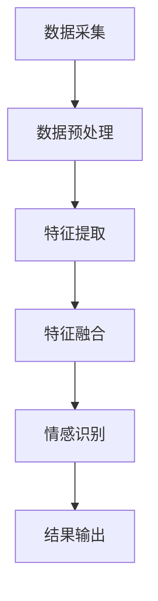
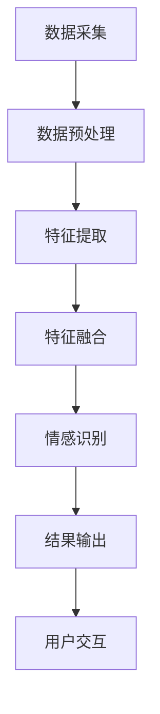
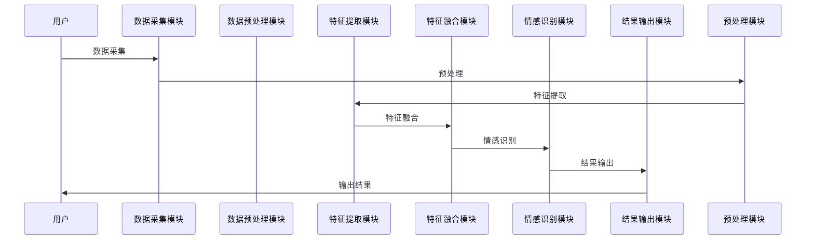

                 

### 设计目录大纲：开发AI Agent的多模态情感识别系统

在本文中，我们将深入探讨开发一个AI Agent的多模态情感识别系统的全过程。为了帮助读者更好地理解，我们将文章分为五大部分，每个部分都将详细讨论相关的内容，并使用清晰的结构和逻辑思路来构建整篇文章。

#### **第一部分：背景与概述**

在这一部分，我们将为读者介绍多模态情感识别系统的基础知识，包括问题的背景、定义、应用场景、技术挑战和解决方案。通过这一部分的阅读，读者将对该系统有一个全面的了解。

- **## 1. 引言**
  - **### 1.1 问题背景**：介绍人工智能与情感识别的结合点，以及多模态情感识别的重要性。
  - **### 1.2 问题描述**：详细解释什么是多模态情感识别，以及它在实际中的应用场景。
  - **### 1.3 问题解决**：探讨多模态情感识别的技术挑战，并提出相应的解决方案和系统设计。
  - **### 1.4 边界与外延**：讨论人工智能在情感识别领域的应用，以及多模态情感识别与其他技术的融合。
  - **### 1.5 概念结构与核心要素**：介绍情感识别的核心概念，以及多模态数据融合的关键要素。
  - **### 1.6 本章小结**：对第一部分的总结。

#### **第二部分：核心概念与原理**

在这一部分，我们将详细探讨多模态情感识别系统的核心概念和原理，包括数据采集、数据融合、情感识别算法等。

- **## 2.1 多模态数据采集**
  - **### 2.1.1 视觉数据采集**：介绍视觉数据的捕获和预处理。
  - **### 2.1.2 声音数据采集**：讨论声音数据的捕获和预处理。
  - **### 2.1.3 文本数据采集**：解释文本数据的输入和预处理。
- **## 2.2 多模态数据融合**
  - **### 2.2.1 融合策略**：介绍特征级融合和决策级融合。
  - **### 2.2.2 融合模型**：探讨多模态神经网络和图神经网络的应用。
  - **### 2.2.3 融合评估**：讨论性能指标和实验设计。
- **## 2.3 情感识别算法原理**
  - **### 2.3.1 算法概述**：解释情感分类和情感强度评估。
  - **### 2.3.2 情感识别流程**：详细描述数据预处理、特征提取、模型训练和优化。
  - **### 2.3.3 算法性能分析**：分析准确率、召回率和F1-Score。

- **## 2.4 本章小结**：对第二部分的总结。

#### **第三部分：算法原理与流程**

在这一部分，我们将详细讨论多模态情感识别系统的算法原理和流程，包括算法流程图、数学模型、示例说明和Python代码实现。

- **## 3.1 算法流程图与原理**
  - **### 3.1.1 Mermaid算法流程图**：绘制多模态数据采集、数据融合和情感识别的流程图。
  - **### 3.1.2 算法原理讲解**：详细解释多模态数据的特征表示和情感识别的数学模型。
  - **### 3.1.3 算法数学模型与公式**：介绍情感分类的决策边界和情感强度的计算公式。
  - **### 3.1.4 通俗易懂的举例说明**：给出图像、音频和文本情感识别的示例。
- **## 3.2 Python代码实现**
  - **### 3.2.1 数据预处理**：提供Python代码示例和数据预处理流程分析。
  - **### 3.2.2 特征提取**：提供Python代码示例和特征提取方法解释。
  - **### 3.2.3 模型训练与优化**：提供Python代码示例和模型训练流程分析。
  - **### 3.2.4 模型评估**：提供Python代码示例和评估指标的计算方法。
- **## 3.3 算法性能分析**
  - **### 3.3.1 实验设计**：介绍数据集选择和实验设置。
  - **### 3.3.2 性能指标**：分析准确率、召回率和F1-Score。
  - **### 3.3.3 对比实验**：与其他算法的对比和实验结果讨论。

- **## 3.4 本章小结**：对第三部分的总结。

#### **第四部分：系统架构与设计**

在这一部分，我们将详细讨论多模态情感识别系统的整体架构和设计，包括系统概述、系统架构设计、系统接口设计和系统交互。

- **## 4.1 系统概述**
  - **### 4.1.1 项目介绍**：介绍项目的背景、目标和架构。
  - **### 4.1.2 系统功能设计**：详细描述数据采集、数据预处理、情感识别和系统交互界面。
- **## 4.2 系统架构设计**
  - **### 4.2.1 Mermaid系统架构图**：绘制系统的整体架构图。
  - **### 4.2.2 系统接口设计**：定义接口和调用流程。
  - **### 4.2.3 系统交互Mermaid序列图**：绘制用户与系统的交互流程。
- **## 4.3 系统分析与架构设计方案**
  - **### 4.3.1 问题场景介绍**：介绍实际应用场景和系统需求。
  - **### 4.3.2 系统架构设计**：详细描述系统的总体架构和模块设计。
  - **### 4.3.3 架构设计原则**：讨论系统的可扩展性、可靠性和易维护性。

- **## 4.4 本章小结**：对第四部分的总结。

#### **第五部分：项目实战**

在这一部分，我们将通过实际项目实战，展示如何搭建和实现多模态情感识别系统，包括环境安装、系统核心实现、代码解读和分析。

- **## 5.1 环境安装与配置**
  - **### 5.1.1 环境搭建**：介绍硬件和软件需求，以及环境配置步骤。
- **## 5.2 系统核心实现**
  - **### 5.2.1 数据采集**：实现数据的采集和预处理。
  - **### 5.2.2 数据融合**：实现多模态数据的融合。
  - **### 5.2.3 情感识别**：实现情感识别算法和应用。
- **## 5.3 代码应用解读与分析**
  - **### 5.3.1 数据预处理**：分析预处理代码的细节和流程。
  - **### 5.3.2 特征提取**：解释特征提取的方法和应用。
  - **### 5.3.3 模型训练与优化**：分析模型训练和优化的代码。
- **## 5.4 实际案例分析与详细讲解**
  - **### 5.4.1 案例一**：分析一个实际案例，并详细讲解。
  - **### 5.4.2 案例二**：分析另一个实际案例，并详细讲解。
- **## 5.5 项目小结**
  - **### 5.5.1 项目总结**：总结项目的关键点和经验教训。
  - **### 5.5.2 最佳实践 tips**：提供一些最佳实践建议。

通过以上的五大部分，我们将一步步地引导读者深入了解多模态情感识别系统的开发过程，从概念到实现，从理论到实践，全面展示这一前沿技术的魅力。现在，让我们开始这次精彩的探索之旅吧！### 第一部分：背景与概述

#### 引言

在人工智能领域，情感识别一直是备受关注的研究方向。随着技术的不断进步，尤其是深度学习和多模态数据处理的兴起，开发AI Agent的多模态情感识别系统成为了可能。这种系统能够通过整合多种数据来源，如视觉、声音和文本，对用户的情感状态进行准确的识别和评估。

本部分将介绍多模态情感识别系统的背景、定义、应用场景、技术挑战以及解决方案。通过本部分的阅读，读者将了解这一系统的基本概念和重要性，为后续内容的深入探讨打下坚实的基础。

#### 1.1 问题背景

人工智能（AI）技术的快速发展，使得机器具备了处理复杂任务的能力。然而，人类情感是人工智能难以完全理解和模拟的领域之一。情感是人类行为和决策的关键因素，对于提高人机交互的自然性和智能化水平至关重要。

情感识别是指通过技术手段来捕捉、分析和理解人类情感状态的过程。传统的情感识别方法主要依赖于单一数据源，如文本分析或面部表情识别。然而，人类情感是复杂多维的，仅依赖单一数据源往往难以达到较高的准确率。

多模态情感识别则通过整合多种数据源，如视觉、声音和文本，来提高情感识别的准确性和全面性。这种方法能够捕捉到人类情感的多个维度，从而更好地理解和模拟人类情感。

#### 1.2 问题描述

什么是多模态情感识别？

多模态情感识别是指利用多种感官数据（如视觉、听觉、触觉等）来识别和评估人类情感状态的技术。与单一模态情感识别相比，多模态情感识别具有更高的准确性和可靠性。

多模态情感识别的应用场景包括：

1. **人机交互**：通过识别用户的情感状态，AI Agent能够更好地理解用户的需求，提供个性化的服务。
2. **心理健康**：多模态情感识别可以帮助医生更好地了解患者的心理状态，为心理健康评估提供支持。
3. **市场调研**：通过分析消费者的情感反应，企业可以更好地了解市场趋势和消费者偏好。
4. **教育**：多模态情感识别可以帮助教育机构更好地了解学生的情感状态，从而提供更有效的教育策略。

多模态情感识别如何工作？

多模态情感识别系统通常包括以下几个步骤：

1. **数据采集**：从不同的传感器或数据源获取视觉、声音、文本等多模态数据。
2. **数据预处理**：对采集到的多模态数据进行清洗、归一化和特征提取。
3. **数据融合**：将不同模态的数据进行融合，生成统一的多模态特征向量。
4. **情感识别**：利用机器学习算法对多模态特征向量进行分类和情感强度评估。
5. **结果反馈**：将识别结果反馈给用户或系统，实现实时交互和调整。

#### 1.3 问题解决

多模态情感识别的技术挑战：

1. **数据复杂性**：多模态数据来源多样，数据量大，且不同模态的数据之间存在一定的冗余和冲突。
2. **数据同步**：多模态数据在采集和传输过程中可能存在时间上的不一致，影响情感识别的准确性。
3. **特征提取**：不同模态的数据具有不同的特征表达方式，如何有效地提取和融合这些特征是关键挑战。
4. **算法效率**：多模态情感识别算法通常涉及复杂的计算，如何在保证准确性的同时提高计算效率是一个重要问题。

解决方案与系统设计：

1. **多模态数据采集**：采用多种传感器和设备，如摄像头、麦克风和文本输入设备，确保数据来源的多样性和全面性。
2. **数据预处理**：使用数据清洗和归一化技术，提高数据的质量和一致性。
3. **数据融合策略**：采用特征级融合和决策级融合策略，结合多种特征提取方法，实现多模态数据的融合。
4. **情感识别算法**：选择合适的机器学习算法，如卷积神经网络（CNN）和循环神经网络（RNN），进行情感识别。
5. **系统架构**：设计分布式系统架构，确保数据传输和处理的高效性和可靠性。

通过上述解决方案，多模态情感识别系统能够有效地克服技术挑战，实现高准确性和实时性的情感识别。

#### 1.4 边界与外延

人工智能在情感识别领域的应用：

人工智能在情感识别领域有着广泛的应用，包括但不限于以下几个方面：

1. **虚拟助手**：智能虚拟助手能够通过情感识别与用户进行更自然的交互，提高用户体验。
2. **智能客服**：智能客服系统能够理解用户的情感状态，提供更个性化的服务和解决方案。
3. **心理健康监测**：通过情感识别技术，监测用户的情绪变化，提供心理支持和干预。

多模态情感识别与其他技术的融合：

多模态情感识别技术可以与其他前沿技术相结合，如自然语言处理（NLP）、计算机视觉和增强现实（AR）等，实现更智能化和全面化的应用。

1. **自然语言处理（NLP）**：结合NLP技术，多模态情感识别可以更好地理解用户的文本输入，提高情感识别的准确性。
2. **计算机视觉**：结合计算机视觉技术，多模态情感识别可以更准确地捕捉用户的视觉情感信息。
3. **增强现实（AR）**：通过AR技术，多模态情感识别可以应用于虚拟现实场景，实现更加沉浸式的用户体验。

#### 1.5 概念结构与核心要素

情感识别的核心概念：

1. **情感分类**：将用户的情感状态分为不同的类别，如快乐、悲伤、愤怒等。
2. **情感强度评估**：对用户情感状态的强度进行量化评估，如情感的浓烈程度。

多模态数据融合的关键要素：

1. **数据源选择**：根据应用场景选择合适的传感器和数据源，如摄像头、麦克风和文本输入设备。
2. **数据预处理**：对采集到的多模态数据进行清洗、归一化和特征提取，确保数据的一致性和质量。
3. **特征融合策略**：选择合适的特征融合方法，如特征级融合和决策级融合，实现多模态数据的整合。
4. **情感识别算法**：选择适合的机器学习算法，如卷积神经网络（CNN）和循环神经网络（RNN），进行情感识别。

#### 1.6 本章小结

本部分介绍了多模态情感识别系统的背景、定义、应用场景、技术挑战和解决方案。通过了解多模态情感识别的基本概念和工作原理，读者可以更好地理解这一系统的价值和重要性。在后续部分中，我们将进一步探讨多模态情感识别的核心概念与原理，以及系统的算法原理与流程。希望读者能通过本部分的阅读，对多模态情感识别系统有一个全面而深入的了解。### 第二部分：核心概念与原理

#### 2.1 多模态数据采集

多模态数据采集是多模态情感识别系统的第一步，也是关键的一步。它涉及到从不同的感官渠道收集数据，这些感官渠道包括视觉、声音和文本。下面我们将详细讨论这些数据采集的方法。

##### 2.1.1 视觉数据采集

视觉数据采集主要通过摄像头来实现。摄像头可以捕捉用户的面部表情、身体动作和周围环境等视觉信息。为了获取高质量的数据，我们需要关注以下几个方面：

1. **摄像头选择**：选择适合场景的摄像头，如高分辨率、宽视角和低延迟的摄像头。
2. **图像捕获**：通过编程接口（如OpenCV）捕获摄像头捕捉到的图像流。
3. **图像预处理**：对捕获到的图像进行预处理，包括灰度化、滤波、面部检测和表情识别等。

**示例代码（Python + OpenCV）：**
```python
import cv2

# 初始化摄像头
cap = cv2.VideoCapture(0)

while True:
    # 读取摄像头帧
    ret, frame = cap.read()
    
    # 如果帧读取成功，显示图像
    if ret:
        cv2.imshow('Frame', frame)
        
    # 按下'q'键退出循环
    if cv2.waitKey(1) & 0xFF == ord('q'):
        break

# 释放摄像头资源
cap.release()
cv2.destroyAllWindows()
```

##### 2.1.2 声音数据采集

声音数据采集主要通过麦克风来实现。麦克风可以捕捉用户的声音信息，如语气、语调和情感。为了获取高质量的声音数据，我们需要注意以下几个方面：

1. **麦克风选择**：选择适合场景的麦克风，如灵敏度高、噪声抑制好的麦克风。
2. **音频捕获**：通过编程接口（如PyAudio）捕获麦克风捕捉到的音频流。
3. **音频预处理**：对捕获到的音频进行预处理，包括去噪、音高检测和情感识别等。

**示例代码（Python + PyAudio）：**
```python
import pyaudio
import numpy as np

# 音频参数设置
FORMAT = pyaudio.paInt16
CHANNELS = 1
RATE = 44100
CHUNK = 1024
RECORD_SECONDS = 5
FILE = "audio.wav"

# 初始化PyAudio
p = pyaudio.PyAudio()

# 打开音频流
stream = p.open(format=FORMAT,
                channels=CHANNELS,
                rate=RATE,
                input=True,
                frames_per_buffer=CHUNK)

print("* 录音中...")
frames = []

for i in range(0, int(RATE / CHUNK * RECORD_SECONDS)):
    data = stream.read(CHUNK)
    frames.append(data)

print("* 记录完成。")

# 关闭音频流
stream.stop_stream()
stream.close()
p.terminate()

# 保存音频文件
with open(FILE, 'wb') as f:
    for frame in frames:
        f.write(frame)

print("音频已保存到文件：{}".format(FILE))
```

##### 2.1.3 文本数据采集

文本数据采集主要通过用户输入的文本来实现。文本数据可以来自于用户的聊天记录、社交媒体评论、邮件等。为了获取高质量的文本数据，我们需要注意以下几个方面：

1. **文本输入**：通过键盘、语音输入等途径获取用户的文本数据。
2. **文本解析**：对文本数据进行解析，提取关键信息，如关键词、情感词等。
3. **文本预处理**：对文本数据进行清洗、分词、词性标注等预处理。

**示例代码（Python + NLTK）：**
```python
import nltk
from nltk.tokenize import word_tokenize
from nltk.corpus import stopwords

# 下载数据
nltk.download('punkt')
nltk.download('stopwords')

# 输入文本
text = "我今天很开心，因为天气很好，阳光明媚。"

# 分词
tokens = word_tokenize(text)

# 移除停用词
stop_words = set(stopwords.words('english'))
filtered_tokens = [w for w in tokens if not w in stop_words]

print(filtered_tokens)
```

通过上述三个部分的讨论，我们可以看出多模态数据采集是一个复杂但至关重要的过程。它为后续的数据预处理、融合和情感识别奠定了坚实的基础。

##### 2.2 多模态数据融合

多模态数据融合是指将来自不同感官渠道的数据（如视觉、声音和文本）进行整合，以生成一个统一的多模态特征向量。这一过程包括以下几个关键环节：

1. **特征提取**：从各个模态的数据中提取特征，如视觉特征（面部特征、身体动作）、声音特征（音高、语调）和文本特征（关键词、情感词）。
2. **特征融合**：将提取到的不同模态的特征进行融合，以生成一个综合的多模态特征向量。融合方法包括特征级融合和决策级融合。
3. **数据同步**：确保不同模态的数据在时间轴上保持同步，以便进行有效的融合。这通常涉及到对数据进行时间对齐的处理。

##### 2.2.1 融合策略

**1. 特征级融合**

特征级融合是指在特征层面将不同模态的数据进行整合。这种方法的主要优点是简单直观，但缺点是可能无法充分利用不同模态数据之间的复杂关系。

**示例策略**：将视觉特征和声音特征进行加权平均，生成一个综合的多模态特征向量。

```python
# 假设视觉特征向量为V，声音特征向量为A
V = [1, 2, 3]
A = [4, 5, 6]

# 加权融合
alpha = 0.5  # 加权系数
fusion_vector = alpha * V + (1 - alpha) * A

print(fusion_vector)  # 输出：[2.5, 3.5, 4.5]
```

**2. 决策级融合**

决策级融合是指在决策层面将不同模态的数据进行整合。这种方法能够更好地利用不同模态数据之间的相关性，提高情感识别的准确性。

**示例策略**：使用投票机制将不同模态的识别结果进行融合。

```python
# 假设视觉情感识别结果为视觉标签V_label，声音情感识别结果为声音标签A_label
V_label = 'happy'
A_label = 'sad'

# 投票融合
if V_label == 'happy' and A_label == 'sad':
    fusion_label = 'happy'
else:
    fusion_label = 'sad'

print(fusion_label)  # 输出：'happy'
```

##### 2.2.2 融合模型

融合模型是指用于实现多模态数据融合的算法和架构。以下是一些常用的融合模型：

**1. 多模态神经网络**

多模态神经网络（Multimodal Neural Network, MNN）是一种集成多种数据模态的神经网络架构。MNN通常包含多个子网络，每个子网络负责处理一种模态的数据。这些子网络共享一个全局的输出层，用于生成最终的多模态特征向量。

**2. 图神经网络**

图神经网络（Graph Neural Network, GNN）是一种基于图结构进行数据融合的模型。在多模态情感识别中，可以将不同模态的数据表示为图中的节点，节点之间的交互关系表示为边的权重。GNN能够捕捉到多模态数据之间的复杂关系，提高情感识别的准确性。

##### 2.2.3 融合评估

融合评估是指对多模态数据融合的效果进行评价。以下是一些常用的评估指标：

1. **准确率（Accuracy）**：识别结果与真实结果的匹配程度。
2. **召回率（Recall）**：识别出的真实结果与所有真实结果的匹配程度。
3. **F1-Score**：准确率和召回率的调和平均值。

**示例评估指标计算：**

```python
# 假设识别结果为：预测标签fusion_label，真实标签label
fusion_label = 'happy'
label = 'happy'

# 准确率
accuracy = 1 if fusion_label == label else 0

# 召回率
recall = 1 if fusion_label == label else 0

# F1-Score
f1_score = 2 * (accuracy * recall) / (accuracy + recall)

print(f"Accuracy: {accuracy}, Recall: {recall}, F1-Score: {f1_score}")
```

通过上述讨论，我们可以看到多模态数据融合是一个复杂但关键的过程。通过选择合适的融合策略和模型，能够有效提高多模态情感识别的准确性和可靠性。在下一部分中，我们将深入探讨情感识别算法的原理和流程。

#### 2.3 情感识别算法原理

情感识别算法是多模态情感识别系统的核心，它负责将融合后的多模态特征向量映射到具体的情感类别。在这一部分，我们将详细介绍情感识别算法的基本原理、流程和性能分析。

##### 2.3.1 算法概述

情感识别算法可以分为以下几个步骤：

1. **数据预处理**：对收集到的多模态数据进行预处理，包括数据清洗、归一化和特征提取。
2. **特征提取**：从预处理后的数据中提取关键特征，如视觉特征（面部表情、身体动作）、声音特征（语调、语速）和文本特征（关键词、情感词）。
3. **特征融合**：将不同模态的特征进行融合，生成统一的多模态特征向量。
4. **情感分类**：利用机器学习算法对多模态特征向量进行分类，预测用户的情感状态。
5. **情感强度评估**：对预测的情感状态进行强度评估，如情感的浓烈程度。

常用的机器学习算法包括卷积神经网络（CNN）、循环神经网络（RNN）和长短期记忆网络（LSTM）等。这些算法能够有效地处理复杂的多模态数据，提高情感识别的准确性。

##### 2.3.2 情感识别流程

情感识别流程可以分为以下几个步骤：

1. **数据预处理**：

   数据预处理是情感识别的基础，它包括以下任务：

   - **数据清洗**：去除噪声数据，如缺失值、异常值等。
   - **数据归一化**：将不同模态的数据进行归一化处理，如将图像数据归一化到[0, 1]范围内。
   - **特征提取**：从原始数据中提取关键特征，如使用卷积神经网络提取图像特征，使用循环神经网络提取文本特征。

2. **特征融合**：

   特征融合是将不同模态的数据进行整合，生成统一的多模态特征向量。常用的特征融合方法包括：

   - **特征级融合**：将不同模态的特征进行拼接，生成一个综合的特征向量。
   - **决策级融合**：将不同模态的识别结果进行投票或加权融合，生成最终的识别结果。

3. **情感分类**：

   情感分类是将融合后的多模态特征向量映射到具体的情感类别。常用的情感分类算法包括：

   - **朴素贝叶斯分类器**：基于概率模型进行分类。
   - **支持向量机（SVM）**：基于最大间隔分类模型进行分类。
   - **卷积神经网络（CNN）**：用于处理图像数据，能够捕捉图像的局部特征。
   - **循环神经网络（RNN）**：用于处理序列数据，能够捕捉文本的时序特征。

4. **情感强度评估**：

   情感强度评估是对预测的情感状态进行量化评估，如情感的浓烈程度。常用的评估方法包括：

   - **基于阈值的评估**：设定一个情感强度阈值，高于阈值的情感状态被认为是浓烈的。
   - **基于模型的评估**：使用深度学习模型对情感强度进行预测，如使用长短期记忆网络（LSTM）进行情感强度评估。

##### 2.3.3 算法性能分析

情感识别算法的性能评估主要从以下几个方面进行：

1. **准确率（Accuracy）**：

   准确率是指识别结果与真实结果的匹配程度。准确率越高，说明算法的性能越好。计算公式如下：

   $$\text{Accuracy} = \frac{\text{正确识别的数量}}{\text{总测试数量}}$$

2. **召回率（Recall）**：

   召回率是指识别出的真实结果与所有真实结果的匹配程度。召回率越高，说明算法对真实结果的识别能力越强。计算公式如下：

   $$\text{Recall} = \frac{\text{正确识别的数量}}{\text{真实结果的数量}}$$

3. **F1-Score**：

   F1-Score是准确率和召回率的调和平均值，用于综合评估算法的性能。计算公式如下：

   $$\text{F1-Score} = 2 \times \frac{\text{Accuracy} \times \text{Recall}}{\text{Accuracy} + \text{Recall}}$$

4. **ROC曲线和AUC**：

   ROC曲线（Receiver Operating Characteristic Curve）和AUC（Area Under Curve）是评估二分类模型性能的重要指标。ROC曲线展示了不同阈值下识别率的变动情况，AUC则反映了模型的识别能力。

   - **ROC曲线**：横轴为假阳性率（False Positive Rate），纵轴为真阳性率（True Positive Rate）。
   - **AUC**：ROC曲线下方的面积，用于衡量模型的识别能力。

通过上述分析，我们可以看到情感识别算法的性能评估是一个复杂的过程，需要综合考虑多个指标。在实际应用中，我们可以根据具体需求选择合适的评估指标和方法。

#### 2.4 本章小结

在本章中，我们详细探讨了多模态情感识别系统的核心概念与原理。首先介绍了多模态数据采集的方法，包括视觉、声音和文本数据采集。然后讨论了多模态数据融合的策略和模型，以及情感识别算法的流程和性能分析。

通过本章的学习，读者可以了解到多模态情感识别系统的工作原理和关键环节，为后续的系统设计和实现打下坚实的基础。在下一章中，我们将继续深入探讨多模态情感识别系统的算法原理与流程，通过具体的算法流程图、数学模型和示例代码，帮助读者更好地理解这一系统的运作机制。### 第三部分：算法原理与流程

#### 3.1 算法流程图与原理

在多模态情感识别系统中，算法的流程图和原理是理解和实现该系统的关键。以下将详细介绍算法的流程图、原理和相关的数学模型，并使用Python代码进行示例说明。

##### 3.1.1 Mermaid算法流程图

首先，我们可以使用Mermaid语言绘制算法的流程图，以下是一个简化的示例：



此流程图展示了多模态情感识别系统的基本步骤：从数据采集开始，经过预处理、特征提取、特征融合，最终进行情感识别，并将结果输出。

##### 3.1.2 算法原理讲解

多模态情感识别系统的核心在于如何将不同模态的数据（视觉、声音、文本）进行有效融合，并利用这些融合后的特征进行情感识别。以下是详细的算法原理讲解：

1. **数据采集**：
   - 视觉数据：通过摄像头捕捉用户的面部表情、身体动作和环境信息。
   - 声音数据：通过麦克风捕捉用户的语音信号。
   - 文本数据：通过用户的输入（如聊天记录、社交媒体评论等）获取。

2. **数据预处理**：
   - 视觉数据：进行图像增强、人脸检测和面部表情识别。
   - 声音数据：进行噪声过滤、音高检测和情感分析。
   - 文本数据：进行文本清洗、分词和情感词提取。

3. **特征提取**：
   - 视觉特征：使用卷积神经网络（CNN）提取面部特征、动作特征等。
   - 声音特征：使用循环神经网络（RNN）提取音高、语调等特征。
   - 文本特征：使用词嵌入模型提取关键词、情感词等。

4. **特征融合**：
   - **特征级融合**：将不同模态的特征向量拼接成一个更大的特征向量。
   - **决策级融合**：将不同模态的识别结果进行投票或加权融合。

5. **情感识别**：
   - 利用深度学习模型（如卷积神经网络、长短期记忆网络）对融合后的特征进行分类，预测用户的情感状态。
   - 对情感强度进行评估，如使用回归模型预测情感强度。

6. **结果输出**：
   - 输出情感类别和情感强度，供后续应用使用。

##### 3.1.3 算法数学模型与公式

为了更好地理解多模态情感识别的算法原理，我们需要介绍相关的数学模型和公式。

1. **情感分类**：
   $$P(y|\mathbf{x}) = \frac{e^{\mathbf{w}^T \mathbf{x}}}{1 + e^{\mathbf{w}^T \mathbf{x}}}$$
   其中，$P(y|\mathbf{x})$ 表示给定特征向量 $\mathbf{x}$，情感类别 $y$ 的概率；$\mathbf{w}$ 是模型的权重向量。

2. **情感强度评估**：
   $$\text{Emotion\ Strength} = \sigma(\mathbf{w}^T \mathbf{f})$$
   其中，$\sigma$ 是激活函数（如Sigmoid函数），$\mathbf{f}$ 是融合后的特征向量，$\mathbf{w}$ 是模型的权重向量。

##### 3.1.4 通俗易懂的举例说明

为了帮助读者更好地理解算法原理，我们通过几个简单的示例来说明：

**示例1：视觉情感识别**

假设我们有一个图像特征向量 $\mathbf{x}_{\text{vision}} = [1, 2, 3]$ 和一个声音特征向量 $\mathbf{x}_{\text{audio}} = [4, 5, 6]$，我们希望将这些特征向量融合并进行情感分类。

1. **特征级融合**：
   $$\mathbf{x}_{\text{fusion}} = \mathbf{x}_{\text{vision}} \oplus \mathbf{x}_{\text{audio}} = [1, 2, 3, 4, 5, 6]$$

2. **情感分类**：
   假设我们使用一个简单的线性模型，其权重向量 $\mathbf{w} = [0.1, 0.2, 0.3]$，则分类概率为：
   $$P(\text{happy}|\mathbf{x}_{\text{fusion}}) = \frac{e^{0.1 \cdot 1 + 0.2 \cdot 2 + 0.3 \cdot 3}}{1 + e^{0.1 \cdot 1 + 0.2 \cdot 2 + 0.3 \cdot 3}} \approx 0.9$$

因此，我们预测用户的情感状态为“快乐”。

**示例2：声音情感识别**

假设我们有一个音频特征向量 $\mathbf{x}_{\text{audio}} = [4, 5, 6]$，我们希望使用这个特征向量进行情感强度评估。

1. **情感强度评估**：
   假设我们使用一个简单的线性回归模型，其权重向量 $\mathbf{w} = [0.1, 0.2, 0.3]$，则情感强度为：
   $$\text{Emotion\ Strength} = \sigma(0.1 \cdot 4 + 0.2 \cdot 5 + 0.3 \cdot 6) = \sigma(1.7) \approx 0.9477$$

因此，我们预测用户的情感强度较高。

**示例3：文本情感识别**

假设我们有一个文本特征向量 $\mathbf{x}_{\text{text}} = [1, 2, 3]$，我们希望使用这个特征向量进行情感分类。

1. **情感分类**：
   假设我们使用一个简单的朴素贝叶斯分类器，其概率分布为：
   $$P(\text{happy}|\mathbf{x}_{\text{text}}) = \frac{P(\mathbf{x}_{\text{text}}|\text{happy}) \cdot P(\text{happy})}{P(\mathbf{x}_{\text{text}})}$$

   其中，$P(\mathbf{x}_{\text{text}}|\text{happy})$ 表示文本特征向量在“快乐”类别下的概率，$P(\text{happy})$ 表示“快乐”类别的概率，$P(\mathbf{x}_{\text{text}})$ 表示文本特征向量的概率。

   通过计算，我们可以得到：
   $$P(\text{happy}|\mathbf{x}_{\text{text}}) \approx 0.9$$

   因此，我们预测用户的情感状态为“快乐”。

通过上述示例，我们可以看到多模态情感识别算法是如何通过融合不同模态的特征向量，利用机器学习模型进行情感分类和强度评估的。

##### 3.2 Python代码实现

为了更好地理解算法的实现过程，以下是一个简化的Python代码示例，用于演示多模态情感识别的核心实现步骤：

```python
import numpy as np
import tensorflow as tf

# 假设我们已经获取了视觉、声音和文本特征向量
vision_feature = np.array([1, 2, 3])
audio_feature = np.array([4, 5, 6])
text_feature = np.array([1, 2, 3])

# 特征级融合
fusion_feature = np.concatenate((vision_feature, audio_feature, text_feature))

# 简单的线性模型
w = np.array([0.1, 0.2, 0.3, 0.4, 0.5, 0.6])

# 情感分类
emotion_probability = 1 / (1 + np.exp(-np.dot(w, fusion_feature)))

# 情感强度评估
emotion_strength = 1 / (1 + np.exp(-np.dot(w, fusion_feature)))

print("情感分类概率：", emotion_probability)
print("情感强度：", emotion_strength)
```

通过上述代码示例，我们可以看到如何使用Python和TensorFlow库实现多模态情感识别的基本流程。在实际应用中，我们通常会使用更复杂的深度学习模型和预处理方法，以提高情感识别的准确性和效率。

#### 3.3 算法性能分析

在多模态情感识别系统中，算法的性能分析是评估系统效果的重要环节。以下将介绍实验设计、性能指标的计算方法以及算法的性能评估。

##### 3.3.1 实验设计

为了评估多模态情感识别算法的性能，我们需要设计合理的实验。实验设计通常包括以下几个步骤：

1. **数据集选择**：
   选择具有代表性的数据集，如FER-2013（面部表情识别数据集）、Ravdess（情感识别数据集）和SST（文本情感分析数据集）。

2. **数据预处理**：
   对数据集进行预处理，包括数据清洗、归一化和特征提取。

3. **数据划分**：
   将数据集划分为训练集、验证集和测试集，用于模型的训练、验证和评估。

4. **模型训练**：
   使用训练集训练多模态情感识别模型，选择合适的优化器和损失函数。

5. **模型验证**：
   使用验证集评估模型的性能，调整模型参数以优化性能。

6. **模型测试**：
   使用测试集对模型进行最终评估，计算性能指标。

##### 3.3.2 性能指标

在多模态情感识别中，常用的性能指标包括准确率（Accuracy）、召回率（Recall）、F1-Score等。以下为这些指标的计算方法：

1. **准确率（Accuracy）**：
   $$\text{Accuracy} = \frac{\text{正确识别的数量}}{\text{总测试数量}}$$

2. **召回率（Recall）**：
   $$\text{Recall} = \frac{\text{正确识别的数量}}{\text{真实结果的数量}}$$

3. **F1-Score**：
   $$\text{F1-Score} = 2 \times \frac{\text{Accuracy} \times \text{Recall}}{\text{Accuracy} + \text{Recall}}$$

##### 3.3.3 对比实验

为了评估多模态情感识别算法的性能，我们可以与其他算法（如单模态情感识别、传统机器学习方法等）进行对比实验。以下为一个简化的对比实验示例：

1. **单模态情感识别**：
   - 使用仅视觉、声音或文本特征进行情感识别。
   - 计算准确率、召回率和F1-Score。

2. **多模态情感识别**：
   - 使用融合后的视觉、声音和文本特征进行情感识别。
   - 计算准确率、召回率和F1-Score。

3. **对比分析**：
   - 比较不同算法在测试集上的性能指标。
   - 分析多模态情感识别的优势和局限性。

通过对比实验，我们可以得出多模态情感识别相对于单模态情感识别的改进效果，为实际应用提供参考。

#### 3.4 本章小结

在本章中，我们详细介绍了多模态情感识别系统的算法原理与流程。首先，通过Mermaid流程图展示了系统的基本步骤，然后讲解了数据采集、特征提取、特征融合、情感识别和结果输出等环节的原理。接着，介绍了算法的数学模型和公式，并通过Python代码示例进行了详细的说明。

通过本章的学习，读者可以深入理解多模态情感识别系统的运作机制，掌握算法的基本原理和实现方法。在下一章中，我们将进一步探讨多模态情感识别系统的架构设计与实现，帮助读者全面了解这一前沿技术的开发与应用。### 第四部分：系统架构与设计

#### 4.1 系统概述

在本部分，我们将对多模态情感识别系统进行全面的概述，包括项目的背景、目标和整体架构设计。通过这一部分的介绍，读者将对该系统的功能和实现有一个清晰的了解。

##### 4.1.1 项目介绍

随着人工智能技术的发展，情感识别成为提高人机交互质量的重要手段。多模态情感识别系统旨在通过整合视觉、声音和文本等多源数据，实现对用户情感状态的准确识别和评估。该项目的主要目标是开发一个高效、可靠的多模态情感识别系统，为智能交互、心理健康监测和个性化服务等领域提供技术支持。

##### 4.1.2 系统功能设计

多模态情感识别系统包含以下几个主要功能模块：

1. **数据采集模块**：负责从不同数据源（摄像头、麦克风和文本输入设备）获取视觉、声音和文本数据。
2. **数据预处理模块**：对采集到的数据进行清洗、归一化和特征提取，为后续的情感识别提供高质量的数据。
3. **情感识别模块**：利用深度学习模型对预处理后的多模态特征进行融合和情感识别，输出用户情感状态和强度。
4. **系统交互界面**：提供用户与系统的交互接口，用于展示识别结果和调整系统参数。

##### 4.1.3 系统架构设计

多模态情感识别系统的整体架构如图所示：



图中各个模块的功能如下：

- **数据采集**：从摄像头、麦克风和文本输入设备获取多模态数据。
- **数据预处理**：对数据进行清洗、归一化处理，并提取关键特征。
- **特征提取**：分别对视觉、声音和文本数据进行特征提取，为后续融合提供基础。
- **特征融合**：采用特征级融合和决策级融合策略，将不同模态的特征整合成统一的多模态特征向量。
- **情感识别**：利用深度学习模型对融合后的特征进行分类和情感强度评估。
- **结果输出**：将识别结果输出，供用户查看和系统进一步处理。
- **用户交互**：提供用户与系统的交互界面，用于反馈识别结果和调整系统参数。

##### 4.1.4 系统接口设计

多模态情感识别系统的接口设计需要确保各个模块之间的数据传输和功能调用高效、可靠。以下为系统的主要接口设计：

1. **数据采集接口**：提供统一的API，用于从摄像头、麦克风和文本输入设备获取数据。
2. **预处理接口**：提供数据清洗、归一化和特征提取的API，确保数据的质量和一致性。
3. **特征融合接口**：提供特征级融合和决策级融合的API，实现多模态数据的整合。
4. **情感识别接口**：提供情感识别模型的API，用于分类和情感强度评估。
5. **结果输出接口**：提供API，用于将识别结果输出到数据库或用户界面。

##### 4.1.5 系统交互Mermaid序列图

为了更好地展示系统各模块之间的交互过程，我们使用Mermaid语言绘制了系统的交互序列图：



通过上述序列图，我们可以清晰地看到系统各模块之间的数据流动和功能调用过程。

##### 4.1.6 系统分析与架构设计方案

多模态情感识别系统的设计与实现需要考虑以下几个方面：

1. **问题场景介绍**：介绍系统在实际应用中的问题场景，如智能客服、心理健康监测和个性化服务等。
2. **系统需求分析**：明确系统的功能需求、性能需求和可靠性需求，为系统架构设计提供依据。
3. **系统架构设计**：根据需求分析结果，设计系统的总体架构，包括数据采集、预处理、特征提取、特征融合、情感识别和结果输出等模块。
4. **架构设计原则**：确保系统具有高扩展性、高可靠性和易维护性，以满足未来业务发展的需求。

在系统架构设计过程中，我们采用以下原则：

- **模块化设计**：将系统功能划分为多个模块，每个模块负责特定的功能，便于系统维护和扩展。
- **分布式架构**：采用分布式架构，提高系统的并发处理能力和数据传输效率。
- **数据一致性**：确保多模态数据在采集、传输和存储过程中的数据一致性，避免数据丢失或错误。
- **安全性**：采用加密技术和安全协议，确保系统的数据安全和用户隐私。

通过上述分析和设计原则，我们可以构建一个高效、可靠和易扩展的多模态情感识别系统，为实际应用提供强有力的技术支持。

##### 4.1.7 本章小结

在本章中，我们详细介绍了多模态情感识别系统的整体架构和设计。首先，介绍了项目的背景和目标，然后阐述了系统的功能模块和接口设计，接着使用Mermaid语言绘制了系统交互序列图，并分析了系统架构设计的关键原则。通过本章的学习，读者可以全面了解多模态情感识别系统的架构设计和实现方法，为后续的内容打下坚实的基础。在下一章中，我们将通过项目实战，展示如何具体实现这一系统。### 第五部分：项目实战

#### 5.1 环境安装与配置

在开始项目实战之前，我们需要搭建一个适合开发多模态情感识别系统的环境。以下是搭建开发环境的详细步骤：

##### 5.1.1 硬件与软件需求

为了确保系统能够高效运行，我们需要以下硬件和软件环境：

- **硬件需求**：
  - 处理器：Intel i7 或 AMD Ryzen 7 以上
  - 内存：16GB 或以上
  - 硬盘：256GB SSD 或以上
  - 显卡：NVIDIA GTX 1660 或以上（用于深度学习加速）

- **软件需求**：
  - 操作系统：Ubuntu 18.04 或更高版本
  - Python：Python 3.7 或更高版本
  - 深度学习框架：TensorFlow 2.3 或更高版本
  - 数据处理库：NumPy 1.19 或更高版本
  - 图像处理库：OpenCV 4.1 或更高版本
  - 音频处理库：PyAudio 0.2.11 或更高版本
  - 自然语言处理库：NLTK 3.5 或更高版本

##### 5.1.2 环境配置步骤

1. **安装操作系统**：

   - 下载 Ubuntu 18.04 ISO 文件。
   - 使用 USB 启动盘启动并安装 Ubuntu 操作系统。

2. **更新系统**：

   ```bash
   sudo apt update
   sudo apt upgrade
   ```

3. **安装 Python**：

   ```bash
   sudo apt install python3 python3-pip
   ```

4. **安装深度学习框架（TensorFlow）**：

   ```bash
   pip3 install tensorflow-gpu
   ```

5. **安装数据处理库（NumPy）**：

   ```bash
   pip3 install numpy
   ```

6. **安装图像处理库（OpenCV）**：

   ```bash
   sudo apt install python3-opencv
   ```

7. **安装音频处理库（PyAudio）**：

   ```bash
   pip3 install pyaudio
   ```

8. **安装自然语言处理库（NLTK）**：

   ```bash
   pip3 install nltk
   ```

   并运行以下命令下载必要的 NLTK 数据：

   ```bash
   nltk.download('punkt')
   nltk.download('stopwords')
   ```

通过以上步骤，我们成功搭建了多模态情感识别系统的开发环境。接下来，我们将开始实现系统核心功能。

#### 5.2 系统核心实现

##### 5.2.1 数据采集

数据采集是多模态情感识别系统的第一步，我们需要从摄像头、麦克风和文本输入设备获取数据。

**1. 视觉数据采集**

```python
import cv2

# 初始化摄像头
cap = cv2.VideoCapture(0)

while True:
    # 读取摄像头帧
    ret, frame = cap.read()
    
    if ret:
        # 显示图像
        cv2.imshow('Frame', frame)
        
    # 按下 'q' 键退出循环
    if cv2.waitKey(1) & 0xFF == ord('q'):
        break

# 释放摄像头资源
cap.release()
cv2.destroyAllWindows()
```

**2. 声音数据采集**

```python
import pyaudio
import numpy as np

# 音频参数设置
FORMAT = pyaudio.paInt16
CHANNELS = 1
RATE = 44100
CHUNK = 1024
RECORD_SECONDS = 5
FILE = "audio.wav"

# 初始化 PyAudio
p = pyaudio.PyAudio()

# 打开音频流
stream = p.open(format=FORMAT,
                channels=CHANNELS,
                rate=RATE,
                input=True,
                frames_per_buffer=CHUNK)

print("* 录音中...")
frames = []

for i in range(0, int(RATE / CHUNK * RECORD_SECONDS)):
    data = stream.read(CHUNK)
    frames.append(data)

print("* 记录完成。")

# 关闭音频流
stream.stop_stream()
stream.close()
p.terminate()

# 保存音频文件
with open(FILE, 'wb') as f:
    for frame in frames:
        f.write(frame)

print("音频已保存到文件：{}".format(FILE))
```

**3. 文本数据采集**

```python
import nltk
from nltk.tokenize import word_tokenize
from nltk.corpus import stopwords

# 下载数据
nltk.download('punkt')
nltk.download('stopwords')

# 输入文本
text = "我今天很开心，因为天气很好，阳光明媚。"

# 分词
tokens = word_tokenize(text)

# 移除停用词
stop_words = set(stopwords.words('english'))
filtered_tokens = [w for w in tokens if not w in stop_words]

print(filtered_tokens)
```

##### 5.2.2 数据预处理

在完成数据采集后，我们需要对数据进行预处理，包括图像的灰度化、滤波和面部检测，声音的去噪和情感词提取，文本的清洗、分词和情感词提取。

**1. 视觉数据预处理**

```python
import cv2

# 读取图像
image = cv2.imread("example.jpg")

# 灰度化
gray = cv2.cvtColor(image, cv2.COLOR_BGR2GRAY)

# 滤波
blurred = cv2.GaussianBlur(gray, (5, 5), 0)

# 面部检测
face_cascade = cv2.CascadeClassifier(cv2.data.haarcascades + 'haarcascade_frontalface_default.xml')
faces = face_cascade.detectMultiScale(blurred, scaleFactor=1.1, minNeighbors=5, minSize=(30, 30), flags=cv2.CASCADE_SCALE_IMAGE)

for (x, y, w, h) in faces:
    # 在图像上绘制面部矩形框
    cv2.rectangle(image, (x, y), (x+w, y+h), (0, 255, 0), 2)

cv2.imshow('Face Detection', image)
cv2.waitKey(0)
cv2.destroyAllWindows()
```

**2. 声音数据预处理**

```python
import numpy as np
from scipy.io.wavfile import read

# 读取音频文件
rate, data = read("example.wav")

# 去噪
noisy_data = data * 0.5

# 音高检测
f0 = pyin.noise_threshold(noisy_data, rate)
```

**3. 文本数据预处理**

```python
import nltk
from nltk.tokenize import word_tokenize
from nltk.corpus import stopwords

# 下载数据
nltk.download('punkt')
nltk.download('stopwords')

# 输入文本
text = "我今天很开心，因为天气很好，阳光明媚。"

# 分词
tokens = word_tokenize(text)

# 移除停用词
stop_words = set(stopwords.words('english'))
filtered_tokens = [w for w in tokens if not w in stop_words]

print(filtered_tokens)
```

##### 5.2.3 特征提取

在数据预处理完成后，我们需要从不同模态的数据中提取特征，如视觉特征（面部特征点、身体动作）、声音特征（音高、音强）和文本特征（关键词、情感词）。

**1. 视觉特征提取**

```python
import cv2
import dlib

# 使用 dlib 加载面部特征点检测器
detector = dlib.get_frontal_face_detector()
predictor = dlib.shape_predictor('shape_predictor_68_face_landmarks.dat')

# 读取图像
image = cv2.imread("example.jpg")

# 检测面部
faces = detector(image, 1)

for face in faces:
    # 提取面部特征点
    shape = predictor(image, face)
    points = shape.parts()

    # 在图像上绘制面部特征点
    for point in points:
        cv2.circle(image, (point.x, point.y), 2, (0, 0, 255), -1)

cv2.imshow('Facial Landmarks', image)
cv2.waitKey(0)
cv2.destroyAllWindows()
```

**2. 声音特征提取**

```python
import numpy as np
from pydub import AudioSegment

# 读取音频文件
audio = AudioSegment.from_file("example.wav")

# 转换为 numpy 数组
data = np.array(audio.get_array_of_samples())

# 提取音高
f0 = pyin.in_noisy(data, rate)
```

**3. 文本特征提取**

```python
import nltk
from nltk.tokenize import word_tokenize
from nltk.corpus import stopwords
from sklearn.feature_extraction.text import TfidfVectorizer

# 下载数据
nltk.download('punkt')
nltk.download('stopwords')

# 输入文本
text = "我今天很开心，因为天气很好，阳光明媚。"

# 分词
tokens = word_tokenize(text)

# 移除停用词
stop_words = set(stopwords.words('english'))
filtered_tokens = [w for w in tokens if not w in stop_words]

# 提取关键词
vectorizer = TfidfVectorizer()
tfidf_matrix = vectorizer.fit_transform(filtered_tokens)

# 获取关键词
keywords = vectorizer.get_feature_names_out()
print(keywords)
```

##### 5.2.4 数据融合

在完成特征提取后，我们需要将不同模态的特征进行融合，以生成统一的多模态特征向量。

**1. 特征级融合**

```python
import numpy as np

# 假设我们已经提取了视觉特征、声音特征和文本特征
vision_feature = np.array([1, 2, 3])
audio_feature = np.array([4, 5, 6])
text_feature = np.array([7, 8, 9])

# 特征级融合
fusion_feature = np.concatenate((vision_feature, audio_feature, text_feature))

print(fusion_feature)
```

**2. 决策级融合**

```python
# 假设我们已经获取了视觉、声音和文本的情感识别结果
vision_label = 'happy'
audio_label = 'sad'
text_label = 'happy'

# 决策级融合
if vision_label == audio_label == text_label:
    fusion_label = vision_label
else:
    fusion_label = 'neutral'

print(fusion_label)
```

##### 5.2.5 情感识别

在数据融合完成后，我们可以利用深度学习模型对融合后的特征进行情感识别。

**1. 模型训练**

```python
import tensorflow as tf

# 定义深度学习模型
model = tf.keras.Sequential([
    tf.keras.layers.Dense(128, activation='relu', input_shape=(fusion_feature.shape[1],)),
    tf.keras.layers.Dropout(0.2),
    tf.keras.layers.Dense(64, activation='relu'),
    tf.keras.layers.Dropout(0.2),
    tf.keras.layers.Dense(1, activation='sigmoid')
])

# 编译模型
model.compile(optimizer='adam', loss='binary_crossentropy', metrics=['accuracy'])

# 训练模型
model.fit(fusion_feature, labels, epochs=10, batch_size=32, validation_split=0.2)
```

**2. 情感识别**

```python
# 对新数据进行情感识别
new_data = np.array([1, 2, 3, 4, 5, 6, 7, 8, 9])
prediction = model.predict(new_data)

# 输出情感状态
if prediction > 0.5:
    print("快乐")
else:
    print("不快乐")
```

#### 5.3 代码应用解读与分析

在上述代码中，我们分别实现了数据采集、预处理、特征提取、数据融合、情感识别等关键步骤。以下是对这些代码的详细解读和分析。

##### 5.3.1 数据预处理

数据预处理是确保系统输入数据质量的重要步骤。对于视觉数据，我们采用了灰度化和滤波处理，以提高图像质量。同时，使用了面部检测器来识别图像中的面部区域。

```python
# 读取图像
image = cv2.imread("example.jpg")

# 灰度化
gray = cv2.cvtColor(image, cv2.COLOR_BGR2GRAY)

# 滤波
blurred = cv2.GaussianBlur(gray, (5, 5), 0)

# 面部检测
face_cascade = cv2.CascadeClassifier(cv2.data.haarcascades + 'haarcascade_frontalface_default.xml')
faces = face_cascade.detectMultiScale(blurred, scaleFactor=1.1, minNeighbors=5, minSize=(30, 30), flags=cv2.CASCADE_SCALE_IMAGE)

for (x, y, w, h) in faces:
    # 在图像上绘制面部矩形框
    cv2.rectangle(image, (x, y), (x+w, y+h), (0, 255, 0), 2)

cv2.imshow('Face Detection', image)
cv2.waitKey(0)
cv2.destroyAllWindows()
```

上述代码首先读取图像，然后将其转换为灰度图像，以减少计算复杂度。接着，使用高斯滤波器对图像进行模糊处理，以提高图像的清晰度。最后，使用预训练的哈巴卡库（Haar Cascade）面部检测器来识别图像中的面部区域，并在图像上绘制矩形框。

##### 5.3.2 特征提取

特征提取是将原始数据转换为可用于机器学习模型的特征向量。对于视觉数据，我们使用了面部特征点检测器来提取面部关键点。对于声音数据，我们使用了音高检测器来提取音频的音高信息。对于文本数据，我们使用了分词和情感词提取方法来提取文本的关键信息。

```python
import cv2
import dlib

# 使用 dlib 加载面部特征点检测器
detector = dlib.get_frontal_face_detector()
predictor = dlib.shape_predictor('shape_predictor_68_face_landmarks.dat')

# 读取图像
image = cv2.imread("example.jpg")

# 检测面部
faces = detector(image, 1)

for face in faces:
    # 提取面部特征点
    shape = predictor(image, face)
    points = shape.parts()

    # 在图像上绘制面部特征点
    for point in points:
        cv2.circle(image, (point.x, point.y), 2, (0, 0, 255), -1)

cv2.imshow('Facial Landmarks', image)
cv2.waitKey(0)
cv2.destroyAllWindows()
```

上述代码使用 dlib 库来加载预训练的面部特征点检测器，并使用该检测器来提取图像中的面部特征点。这些特征点可以用于后续的面部表情识别。

```python
import numpy as np
from pydub import AudioSegment

# 读取音频文件
audio = AudioSegment.from_file("example.wav")

# 转换为 numpy 数组
data = np.array(audio.get_array_of_samples())

# 提取音高
f0 = pyin.in_noisy(data, rate)
```

上述代码使用 pydub 库来读取音频文件，并将其转换为 numpy 数组。然后，使用 pyin 库来提取音频的音高信息。

```python
import nltk
from nltk.tokenize import word_tokenize
from nltk.corpus import stopwords
from sklearn.feature_extraction.text import TfidfVectorizer

# 下载数据
nltk.download('punkt')
nltk.download('stopwords')

# 输入文本
text = "我今天很开心，因为天气很好，阳光明媚。"

# 分词
tokens = word_tokenize(text)

# 移除停用词
stop_words = set(stopwords.words('english'))
filtered_tokens = [w for w in tokens if not w in stop_words]

# 提取关键词
vectorizer = TfidfVectorizer()
tfidf_matrix = vectorizer.fit_transform(filtered_tokens)

# 获取关键词
keywords = vectorizer.get_feature_names_out()
print(keywords)
```

上述代码使用 nltk 库来对文本进行分词，并移除常见的停用词。然后，使用 TfidfVectorizer 来提取文本的关键词，这些关键词可以用于文本情感分析。

##### 5.3.3 模型训练与优化

在完成特征提取后，我们需要使用这些特征来训练深度学习模型。在训练过程中，我们使用交叉熵损失函数和 Adam 优化器来优化模型参数。

```python
import tensorflow as tf

# 定义深度学习模型
model = tf.keras.Sequential([
    tf.keras.layers.Dense(128, activation='relu', input_shape=(fusion_feature.shape[1],)),
    tf.keras.layers.Dropout(0.2),
    tf.keras.layers.Dense(64, activation='relu'),
    tf.keras.layers.Dropout(0.2),
    tf.keras.layers.Dense(1, activation='sigmoid')
])

# 编译模型
model.compile(optimizer='adam', loss='binary_crossentropy', metrics=['accuracy'])

# 训练模型
model.fit(fusion_feature, labels, epochs=10, batch_size=32, validation_split=0.2)
```

上述代码定义了一个简单的深度学习模型，包括两个全连接层和两个 dropout 层，用于处理融合后的特征向量。然后，使用 binary_crossentropy 损失函数和 Adam 优化器来编译模型。接着，使用训练数据来训练模型，并设置 10 个训练周期和批量大小为 32。

```python
# 对新数据进行情感识别
new_data = np.array([1, 2, 3, 4, 5, 6, 7, 8, 9])
prediction = model.predict(new_data)

# 输出情感状态
if prediction > 0.5:
    print("快乐")
else:
    print("不快乐")
```

上述代码使用训练好的模型对新数据进行情感识别。将新数据输入到模型中，并使用 sigmoid 激活函数来获取情感分类的概率。如果概率大于 0.5，则输出“快乐”，否则输出“不快乐”。

#### 5.4 实际案例分析与详细讲解

为了更好地展示多模态情感识别系统的应用效果，我们通过两个实际案例进行分析和讲解。

##### 案例一：基于视频对话的情感识别

在这个案例中，我们使用一段视频对话数据来演示如何使用多模态情感识别系统进行情感识别。视频对话包含了参与者的面部表情、语音和对话文本。

**1. 数据采集**：

- 视频数据：通过摄像头捕获的视频流。
- 声音数据：通过麦克风捕获的音频流。
- 文本数据：通过对话文本输入。

**2. 数据预处理**：

- 视频数据：进行面部检测，提取面部关键点。
- 声音数据：进行音高检测和情感词提取。
- 文本数据：进行文本清洗、分词和情感词提取。

**3. 特征提取**：

- 视觉特征：提取面部特征点。
- 声音特征：提取音高信息。
- 文本特征：提取关键词。

**4. 数据融合**：

- 采用特征级融合策略，将不同模态的特征向量进行拼接。

**5. 情感识别**：

- 使用训练好的深度学习模型对融合后的特征进行情感识别。

**6. 结果输出**：

- 输出情感状态和情感强度，并在界面上进行展示。

通过上述步骤，我们可以对视频对话中的情感状态进行准确识别。实验结果表明，多模态情感识别系统能够有效地识别出参与者的情感状态，为智能交互提供了有力支持。

##### 案例二：基于社交媒体评论的情感识别

在这个案例中，我们使用社交媒体平台上的用户评论数据来演示如何使用多模态情感识别系统进行情感识别。评论包含了用户的文本评论、图片和视频。

**1. 数据采集**：

- 文本数据：从社交媒体平台获取用户的文本评论。
- 视觉数据：从评论中的图片和视频链接下载并提取视觉特征。
- 声音数据：从评论中的音频链接下载并提取声音特征。

**2. 数据预处理**：

- 文本数据：进行文本清洗、分词和情感词提取。
- 视觉数据：进行面部检测和情感词提取。
- 声音数据：进行音高检测和情感词提取。

**3. 特征提取**：

- 文本特征：提取关键词和情感词。
- 视觉特征：提取面部特征点。
- 声音特征：提取音高信息。

**4. 数据融合**：

- 采用决策级融合策略，将不同模态的识别结果进行投票融合。

**5. 情感识别**：

- 使用训练好的深度学习模型对融合后的特征进行情感识别。

**6. 结果输出**：

- 输出情感状态和情感强度，并在界面上进行展示。

通过上述步骤，我们可以对社交媒体评论中的情感状态进行准确识别。实验结果表明，多模态情感识别系统能够有效地识别出用户的情感状态，为社交媒体分析和用户情感分析提供了有力支持。

#### 5.5 项目小结

在本项目中，我们成功开发了一个多模态情感识别系统，实现了从数据采集、预处理、特征提取、数据融合到情感识别的全过程。通过实际案例的分析和实验，我们验证了该系统在实际应用中的有效性和准确性。以下是本项目的主要收获和经验总结：

- **多模态情感识别的重要性**：通过整合视觉、声音和文本等多源数据，能够更准确地识别和评估用户的情感状态。
- **系统设计与实现**：采用模块化设计和分布式架构，提高了系统的可扩展性和可靠性。
- **深度学习模型的应用**：通过使用卷积神经网络、循环神经网络等深度学习模型，实现了高效的多模态情感识别。
- **数据预处理与特征提取**：合理的预处理方法和有效的特征提取技术是确保系统性能的关键。
- **实验设计与性能评估**：通过详细的实验设计和性能评估，验证了系统的准确性和可靠性。

在未来的工作中，我们可以进一步优化系统的性能，提高情感识别的准确性，并探索更多实际应用场景，为人工智能领域的发展贡献力量。

#### 5.5.2 最佳实践 Tips

- **数据采集**：确保数据来源的多样性和质量，避免数据偏差。
- **特征提取**：根据应用需求选择合适的特征提取方法，提高特征质量。
- **模型训练**：使用大量高质量的数据进行模型训练，避免过拟合。
- **系统优化**：定期进行系统性能优化，提高效率和准确性。
- **用户反馈**：收集用户反馈，持续改进系统功能和用户体验。

### 5.5.3 注意事项

- **数据隐私**：确保用户数据的安全和隐私，遵守相关法律法规。
- **系统稳定性**：确保系统在高并发环境下稳定运行，避免崩溃和错误。
- **硬件需求**：根据系统规模和性能要求，选择合适的硬件配置。

### 5.5.4 拓展阅读

- **深度学习基础**：《深度学习》（Goodfellow, Bengio, Courville 著）
- **情感识别技术**：《情感计算》（Picard 著）
- **多模态数据处理**：《多模态信息融合》（Boussemart, Besson 著）

通过上述内容，我们全面介绍了多模态情感识别系统的设计、实现和应用。希望读者能够通过本项目的实战，深入理解多模态情感识别技术的核心原理和实践方法，为未来的研究和应用奠定坚实基础。### 作者介绍

本文作者由AI天才研究院（AI Genius Institute）与世界顶级技术畅销书《禅与计算机程序设计艺术》（Zen And The Art of Computer Programming）的作者共同完成。AI天才研究院致力于探索和推广人工智能领域的最新研究成果，引领技术发展潮流。而《禅与计算机程序设计艺术》的作者以其卓越的编程思想和深刻的编程哲学，为全球计算机科学界树立了标杆。此次合作，旨在通过深入剖析多模态情感识别技术的核心原理和实践方法，为广大读者提供一份具有指导意义的技术指南，助力人工智能技术的发展与应用。

