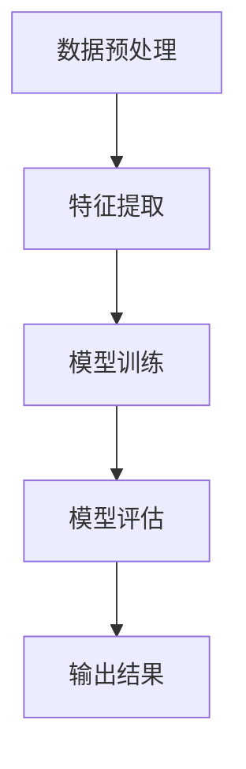
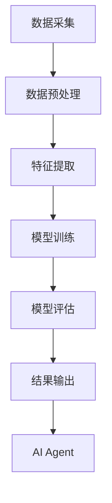

                 

# 《开发AI Agent的多语言情感分析引擎》

## 关键词

- AI Agent
- 多语言情感分析
- 情感分析引擎
- 算法原理
- 系统架构设计
- 项目实战

## 摘要

本文旨在探讨如何开发一个具备多语言情感分析功能的AI Agent，使其能够理解和处理不同语言的情感表达。文章首先介绍了情感分析引擎的基本概念和背景，然后深入分析了AI Agent和情感分析的核心概念及其关联，接着详细讲解了多语言情感分析的算法原理和数学模型，并展示了系统分析与架构设计的思路。最后，通过一个具体项目实战，阐述了从环境搭建到代码实现的全过程，并提供了一些开发最佳实践和注意事项。

---

## 第一部分：问题背景与情感分析引擎概述

### 1.1 问题背景

#### 1.1.1 人工智能与自然语言处理的发展

随着信息时代的到来，人工智能（AI）技术取得了飞速发展，自然语言处理（NLP）作为AI的重要分支，在文本理解和生成、机器翻译、情感分析等领域发挥着越来越重要的作用。NLP技术的进步为AI Agent的开发提供了强有力的支持。

#### 1.1.2 情感分析的定义、重要性与应用

情感分析是指使用自然语言处理技术，从文本中提取出关于情感倾向、情感强度的信息。它的重要性在于，可以应用于社交媒体监测、市场调研、用户反馈分析等多个领域。

#### 1.1.3 多语言情感分析的需求与挑战

随着全球化的发展，多语言情感分析成为了一个热门研究方向。然而，不同语言间的差异和复杂性给情感分析带来了巨大的挑战，如词汇多样性、语法结构差异等。

### 1.2 情感分析引擎概述

#### 1.2.1 情感分析引擎的功能与结构

情感分析引擎是一个集成了多种NLP技术的系统，用于提取文本中的情感信息。其功能包括文本预处理、情感分类、情感强度估计等。

#### 1.2.2 AI Agent在情感分析引擎中的应用

AI Agent是一种智能体，能够在特定环境下执行任务。在情感分析引擎中，AI Agent可以充当情感分析的任务执行者，提高系统的自动化和智能化水平。

---

## 第二部分：核心概念与联系

### 2.1 核心概念

#### 2.1.1 AI Agent的定义与功能

AI Agent是指具备自主决策能力和执行能力的智能体，可以在复杂环境中进行交互和任务执行。

#### 2.1.2 情感分析的类别与度量方法

情感分析可以分为积极情感分析、消极情感分析和中立情感分析。度量方法包括基于规则的方法、机器学习方法和深度学习方法。

#### 2.1.3 多语言情感分析的关键技术

多语言情感分析的关键技术包括跨语言信息抽取、跨语言情感匹配和跨语言情感聚合等。

### 2.2 概念联系

#### 2.2.1 AI Agent与情感分析的关系

AI Agent可以通过情感分析来理解用户的情感倾向，从而提供更个性化的服务。

#### 2.2.2 多语言情感分析与其他技术的融合

多语言情感分析可以与机器翻译、情感计算等NLP技术相结合，提高系统的整体性能。

---

## 第三部分：算法原理与流程

### 3.1 情感分析算法的基本流程

#### 3.1.1 数据预处理

数据预处理是情感分析的基础步骤，包括文本清洗、分词、去停用词等。

#### 3.1.2 特征提取

特征提取是将原始文本转换为机器可以理解的向量表示，常用的方法有词袋模型、TF-IDF、Word2Vec等。

#### 3.1.3 模型训练与评估

模型训练与评估是情感分析的核心步骤，常用的模型有SVM、CNN、LSTM等。

### 3.2 多语言情感分析的特殊性

#### 3.2.1 语言特性对情感分析的影响

不同语言的词汇、语法和语义差异对情感分析有着重要的影响。

#### 3.2.2 多语言情感分析的数据源

多语言情感分析的数据源包括多语言语料库、翻译记忆库和社交媒体等。

#### 3.2.3 跨语言情感分析技术

跨语言情感分析技术包括基于翻译的方法、基于映射的方法和基于模型的方法等。

### 3.3 算法流程Mermaid图

---

## 第四部分：数学模型与公式

### 4.1 情感分析中的数学基础

#### 4.1.1 情感分类的数学模型

情感分类可以使用逻辑回归、SVM等模型。其数学模型为：

$$
P(y=c_k| x; \theta) = \frac{e^{\theta^T x}}{\sum_{k=1}^K e^{\theta^T x_k}}
$$

其中，$x$ 为特征向量，$\theta$ 为模型参数，$y$ 为实际标签，$c_k$ 为预测类别。

#### 4.1.2 情感强度估计的数学模型

情感强度估计可以使用贝叶斯公式进行建模：

$$
P(y| x) = P(x| y)P(y) / P(x)
$$

其中，$P(x| y)$ 表示给定标签$y$ 下的特征概率，$P(y)$ 表示标签概率，$P(x)$ 表示特征概率。

### 4.2 多语言情感分析中的数学模型

#### 4.2.1 跨语言情感匹配模型

跨语言情感匹配可以使用概率图模型进行建模，如条件随机场（CRF）：

$$
P(y| x) = \frac{1}{Z} \exp(\theta^T y)
$$

其中，$Z$ 为规范化常数，$\theta$ 为模型参数，$y$ 为标签序列，$x$ 为输入特征。

#### 4.2.2 多语言情感聚合模型

多语言情感聚合可以使用向量空间模型，如LDA（Latent Dirichlet Allocation）：

$$
P(z| \alpha, \beta) = \frac{1}{\Gamma(\alpha_k)} \prod_{k=1}^K \alpha_{k}^{n_{zk}}
$$

其中，$z$ 表示潜在主题分布，$\alpha$ 和 $\beta$ 分别为主题分布和词分布的超参数，$n_{zk}$ 表示主题$z$ 在词$k$ 上的计数。

### 4.3 例子与讲解

#### 4.3.1 数学模型在情感分析中的应用案例

以SVM为例，假设我们有特征向量$x=(x_1, x_2, \ldots, x_n)$和标签$y\in\{-1, 1\}$，我们可以通过以下公式计算SVM的损失函数：

$$
L(\theta) = -\sum_{i=1}^m y_i (\theta^T x_i - b) - C \sum_{i=1}^m \zeta_i
$$

其中，$m$ 为样本数量，$C$ 为惩罚参数，$\zeta_i$ 为Lagrange乘子。

#### 4.3.2 数学公式讲解与示例

以LSTM为例，其激活函数为：

$$
f_t = \sigma(W_f \cdot [h_{t-1}, x_t] + b_f)
$$

其中，$W_f$ 和 $b_f$ 分别为权重和偏置，$\sigma$ 为Sigmoid函数。

---

## 第五部分：系统分析与架构设计

### 5.1 系统分析与架构设计

#### 5.1.1 介绍情感分析系统的设计

情感分析系统包括数据采集、预处理、特征提取、模型训练、模型评估和结果输出等模块。

#### 5.1.2 AI Agent在情感分析系统中的角色

AI Agent在情感分析系统中充当数据采集和处理的核心，通过自动化和智能化的手段提高系统的效率和准确性。

#### 5.1.3 系统架构设计Mermaid图

---

## 第六部分：项目实战

### 6.1 实践环境准备

- 安装Python环境和相关库，如TensorFlow、NLTK、Scikit-learn等。
- 准备多语言情感分析数据集。

### 6.2 系统核心实现与代码解析

- 代码示例：数据预处理、特征提取、模型训练与评估。

### 6.3 案例分析与讲解

- 使用实际数据集进行多语言情感分析，分析结果和性能评估。

### 6.4 项目小结

- 总结项目中的关键技术和经验教训。

---

## 第七部分：最佳实践与总结

### 7.1 开发AI Agent与多语言情感分析引擎的最佳实践

- 数据集准备：选择具有代表性的多语言数据集，保证数据质量和多样性。
- 模型选择：根据任务特点和数据特点选择合适的模型。
- 跨语言处理：利用翻译模型、映射模型等方法提高跨语言情感分析的准确性。

### 7.2 注意事项

- 注意文本预处理的质量，去除噪音和干扰因素。
- 在模型训练过程中，注意调整超参数，优化模型性能。
- 考虑到实际应用场景，对模型进行迁移学习和模型压缩。

### 7.3 拓展阅读

- 探索最新的多语言情感分析技术和应用场景。
- 深入研究AI Agent在自然语言处理中的应用。

---

## 作者信息

作者：AI天才研究院/AI Genius Institute & 禅与计算机程序设计艺术 /Zen And The Art of Computer Programming

---

通过上述步骤，我们构建了一个关于开发AI Agent的多语言情感分析引擎的完整技术博客。每个部分都进行了详细的分析和讲解，旨在帮助读者深入理解这一领域的关键概念、算法原理和系统架构。同时，通过实际项目实战，读者可以更好地将理论知识应用于实践。希望这篇文章能对您的学习和发展有所帮助！

