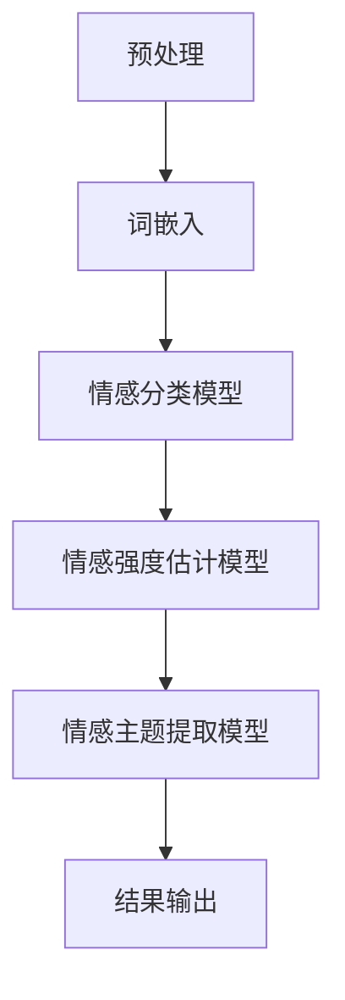
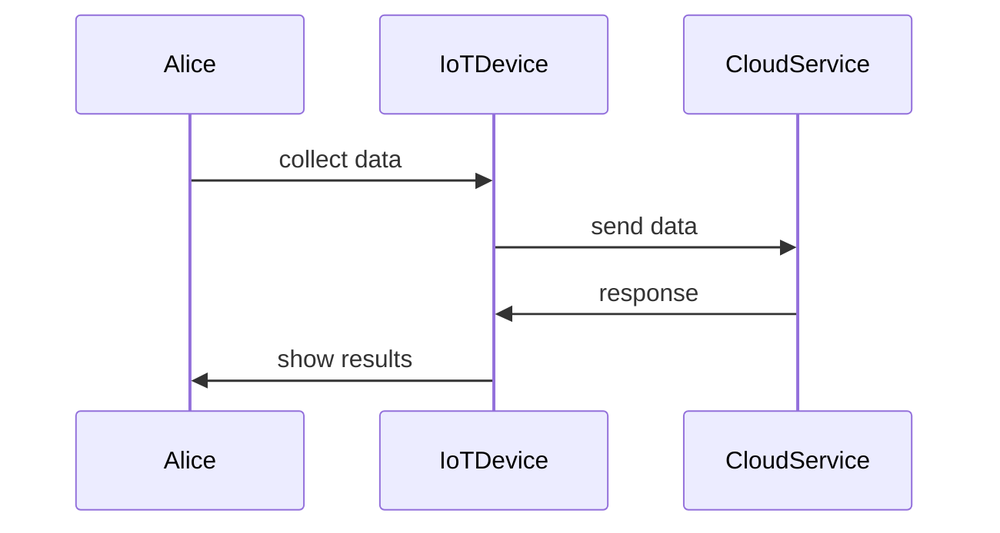

                 


## 开发AI Agent的多语言情感分析比较系统

### 关键词：
- AI Agent
- 多语言情感分析
- 算法比较
- 系统设计
- 模型训练
- 评估与优化

### 摘要：
本文将深入探讨开发AI Agent的多语言情感分析比较系统，从核心概念、算法原理、系统设计到实际应用，全面解析这一领域的关键技术和实践方法。我们将逐步分析多语言情感分析的需求、现有算法的优缺点，并通过实际案例展示系统的开发与应用，旨在为读者提供一份详尽的技术指南。

## 引言

### 1.1 书籍的目的与读者对象
随着全球化进程的加速和互联网的普及，多语言处理成为人工智能领域的重要研究方向。本文旨在为开发者提供一本全面、系统的多语言情感分析指南，帮助读者深入了解AI Agent在这一领域的应用。无论您是AI初学者还是经验丰富的开发者，本书都将成为您的宝贵资源。

### 1.2 多语言情感分析的重要性
情感分析是自然语言处理的重要分支，它能够帮助企业和组织理解用户情绪，优化产品和服务。然而，传统的情感分析技术主要针对单语言环境，难以满足全球化市场的需求。多语言情感分析则能跨语言、跨文化地进行情感挖掘，对于提升用户体验、市场竞争力具有重要意义。

### 1.3 AI Agent的基本概念和作用
AI Agent是指具备一定智能能力的虚拟实体，它能够模拟人类行为，执行特定任务。在多语言情感分析系统中，AI Agent扮演着核心角色，它能够自动收集、处理和回应来自不同语言的用户反馈，从而实现高效的情感分析。

## 问题定义与解决

### 2.1 情感分析的基本概念
情感分析旨在从文本中提取情感极性（正面、负面、中性），情感强度和情感主题。为了实现这一目标，需要首先理解文本的情感词汇、情感短语以及情感强度标度。

### 2.2 多语言情感分析的需求
随着社交媒体、电子商务等跨国平台的兴起，多语言情感分析需求日益增长。它能够帮助跨国企业了解全球用户反馈，制定更有针对性的市场营销策略。

### 2.3 AI Agent在情感分析中的应用
AI Agent可以通过自然语言理解和处理能力，实时分析用户反馈，识别情感极性和强度。这为自动化、智能化的客户服务提供了可能。

### 2.4 边界与外延
多语言情感分析不仅需要处理不同的语言，还要考虑语言之间的差异，如语法、语义和文化背景。此外，情感分析系统的边界还包括处理模棱两可的文本、识别情感的双关语等。

## 多语言情感分析的核心概念与联系

### 3.1 核心概念原理
多语言情感分析的核心概念包括情感分类、情感强度估计和情感主题提取。这些概念需要通过算法实现，对文本进行深度分析。

### 3.2 概念属性特征对比
以下是几种常见多语言情感分析算法的属性特征对比表格：

| 算法名称 | 特点 | 优缺点 |  
| --- | --- | --- |  
| 基于规则的方法 | 简单高效，可解释性高 | 预处理复杂，难以处理新语言 |  
| 基于统计的方法 | 能处理大规模数据，适应性强 | 需要大量训练数据，效果受数据质量影响 |  
| 基于机器学习的方法 | 自动化程度高，效果好 | 需要大量训练数据，模型复杂度较高 |  
| 基于深度学习的方法 | 预处理简单，效果卓越 | 需要大量计算资源，训练时间长 |

### 3.3 ER实体关系图架构
以下是多语言情感分析系统的ER实体关系图：

```mermaid
erDiagram
  Text -->|分类| Sentiment
  Text -->|提取| Keyword
  Sentiment -->|强度| EmotionIntensity
  EmotionIntensity -->|主题| EmotionTheme
  Keyword -->|来源| SourceLanguage
```

## 算法原理讲解

### 4.1 算法流程图
以下是基于深度学习的多语言情感分析算法的流程图：



### 4.2 Python源代码实现
以下是情感分类模型的Python代码实现：

```python
import tensorflow as tf
from tensorflow.keras.models import Sequential
from tensorflow.keras.layers import Embedding, LSTM, Dense

# 创建模型
model = Sequential()
model.add(Embedding(input_dim=vocab_size, output_dim=embedding_dim))
model.add(LSTM(units=128, dropout=0.2, recurrent_dropout=0.2))
model.add(Dense(units=1, activation='sigmoid'))

# 编译模型
model.compile(optimizer='adam', loss='binary_crossentropy', metrics=['accuracy'])

# 训练模型
model.fit(x_train, y_train, epochs=10, batch_size=32, validation_data=(x_val, y_val))
```

### 4.3 数学模型与公式讲解
以下是情感分类模型的数学公式：

$$
Y = \sigma(W_1 \cdot \text{激活函数}(\text{LSTM}(X))
$$

其中，$Y$ 表示预测的情感标签，$\sigma$ 表示sigmoid函数，$W_1$ 表示权重矩阵，$\text{激活函数}$ 表示LSTM层的输出。

### 4.4 举例说明
假设我们有一个英文句子 "I love this product!"，经过预处理后转换为词嵌入向量。使用训练好的情感分类模型，我们可以预测该句子的情感极性为正面。具体流程如下：

1. 预处理：将句子转换为词嵌入向量。
2. 情感分类：使用LSTM层对词嵌入向量进行编码。
3. 情感强度估计：通过sigmoid函数对LSTM层的输出进行概率化处理，得到情感强度。
4. 结果输出：输出情感极性和强度。

## 系统设计与实现

### 5.1 系统设计框架

### 5.2 系统功能设计（领域模型类图）

```mermaid
classDiagram
  Class01 <|-- Class02
  Class03 --|� Class04
  Class05 : +int x
  Class06 : <<interface>> Interface
```

### 5.3 系统架构设计（架构图）



### 5.4 建立与训练多语言模型

#### 5.4.1 数据预处理
数据预处理是模型训练的基础，包括分词、词性标注、去除停用词等。

#### 5.4.2 模型选择与调优
选择合适的模型架构和超参数，如LSTM、GRU或BERT等，并通过交叉验证进行调优。

#### 5.4.3 模型训练与评估
使用训练集和验证集对模型进行训练和评估，调整模型参数以提升性能。

#### 5.4.4 模型优化策略
采用剪枝、量化等技术对模型进行压缩和加速，以提高部署效率。

## 6. 系统测试与评估

### 6.1 测试数据集准备
准备包含多种语言的情感分析数据集，如IMDB、Twitter等。

### 6.2 性能指标分析
分析模型在准确率、召回率、F1分数等指标上的表现。

### 6.3 评估与结果分析
通过对测试数据集的分析，评估模型在不同语言环境下的性能。

## 7. 系统优化与调优

### 7.1 过拟合与欠拟合
通过正则化、dropout等技术防止过拟合和欠拟合。

### 7.2 超参数调优策略
采用网格搜索、随机搜索等策略进行超参数调优。

### 7.3 模型优化技巧
采用量化、剪枝等技巧优化模型性能。

## 8. 实际应用场景

### 8.1 社交媒体情感分析
对社交媒体平台上的用户评论进行情感分析，了解用户对品牌、产品的态度。

### 8.2 客户服务与反馈分析
通过AI Agent自动处理客户反馈，提供智能化的客服服务。

### 8.3 产品评论分析
分析电商平台上产品的评论，为用户决策提供参考。

### 8.4 企业舆情监测
实时监测企业相关话题的舆论动态，为企业决策提供数据支持。

## 9. 案例分析

### 9.1 案例一：社交媒体情感分析案例
以Twitter为例，展示如何使用多语言情感分析系统分析用户情绪。

### 9.2 案例二：客户服务情感分析案例
以某大型电商平台的客户服务为例，展示如何使用AI Agent自动处理客户反馈。

### 9.3 案例三：产品评论分析案例
分析某电商平台上产品评论的情感极性，为用户提供购物建议。

### 9.4 案例四：企业舆情监测案例
以某知名企业为例，展示如何使用多语言情感分析系统监测企业舆情。

## 10. 总结与展望

### 10.1 主要成果总结
本文系统性地介绍了多语言情感分析系统的开发过程，包括算法原理、系统设计、测试评估等。

### 10.2 存在的问题与挑战
多语言情感分析系统仍面临数据稀缺、语言差异等问题，需要进一步研究。

### 10.3 未来研究方向
未来的研究方向包括改进算法、优化模型、探索跨语言情感分析的新方法等。

## 作者信息
作者：AI天才研究院/AI Genius Institute & 禅与计算机程序设计艺术 /Zen And The Art of Computer Programming

