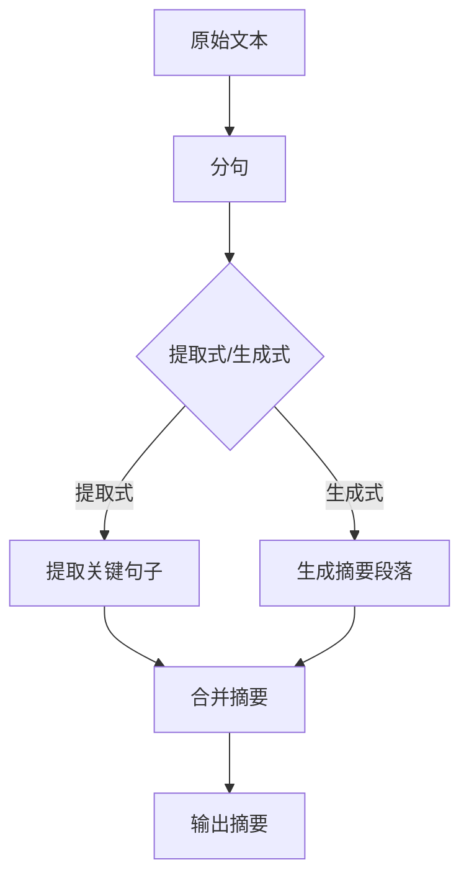
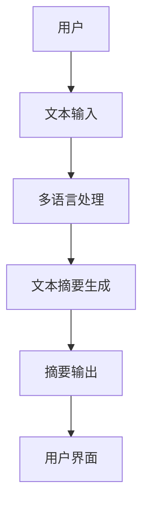

                 

。

## 开发AI Agent的多语言文本摘要生成器

> 关键词：AI Agent、多语言文本摘要、生成器、算法、系统架构

> 摘要：本文旨在探讨如何开发一款高效的多语言文本摘要生成器，用于AI Agent。我们将从背景介绍、核心概念与联系、算法原理讲解、系统分析与架构设计方案、项目实战、最佳实践 tips以及小结与拓展阅读等多个方面进行深入探讨。

### 背景介绍

#### AI Agent的定义与作用

AI Agent，即人工智能代理，是指能够自主学习、决策和执行的智能体。在人工智能领域，AI Agent是一种被广泛研究和应用的技术，尤其在自然语言处理、智能助手和自动化决策系统中发挥着重要作用。

#### 多语言文本摘要的重要性

随着全球化进程的加速，多语言文本处理成为了一个热门研究领域。文本摘要生成器能够帮助用户快速获取文本的核心信息，提高信息处理的效率和效果。特别是在AI Agent中，多语言文本摘要生成器能够为用户提供更加个性化的服务，提升用户体验。

#### 文本摘要生成器的挑战

开发多语言文本摘要生成器面临着诸多挑战，包括语言理解、文本生成算法的优化、多语言数据集的收集与处理等。其中，如何保证摘要的准确性和可读性是关键问题。

#### 问题解决

为了解决这些问题，我们需要：

1. **深入理解多语言文本摘要的核心概念和原理。**
2. **设计高效的算法和数学模型。**
3. **构建完善的系统架构，实现多语言文本摘要的自动化生成。**
4. **进行大量的实验和案例分析，不断优化和改进算法。**

### 核心概念与联系

#### 关键概念

**1. 多语言处理**

多语言处理是指在不同语言之间进行文本的转换、分析和理解。它涉及到自然语言处理、机器翻译和语言模型等技术。

**2. 文本摘要算法**

文本摘要算法是指从原始文本中提取出关键信息，生成摘要的过程。常见的文本摘要算法包括提取式摘要和生成式摘要。

**3. 机器翻译与摘要生成的关系**

机器翻译技术可以帮助我们将一种语言的文本翻译成另一种语言，而摘要生成则是在翻译的基础上，提取出文本的核心信息。两者在多语言文本摘要生成中相互关联，共同作用。

#### 概念属性特征对比表格

| 概念     | 特征                     | 对比                 |
|----------|--------------------------|----------------------|
| 多语言处理 | 语言转换、文本分析 | 需要跨语言处理能力 |
| 文本摘要算法 | 提取关键信息 | 需要理解文本语义 |
| 机器翻译 | 文本翻译 | 需要准确翻译 |

#### 关系与联系

**ER图**

以下是多语言文本摘要生成系统中主要实体及其关系的ER图：

```mermaid
erDiagram
    class Text {
        <<abstract>>
        +id : int
        +content : text
        +language : String
        +abstract : TextSummary
    }
    class TextSummary {
        <<entity>>
        +id : int
        +summary : text
    }
    class MultiLanguageProcessor {
        <<interface>>
        +processText : Text -> TextSummary
    }
    class TranslationService {
        <<interface>>
        +translate : Text -> Text
    }
    Text "1" ..> MultiLanguageProcessor : process
    MultiLanguageProcessor "1" ..> TextSummary : generate
    Text "1" ..> TranslationService : translate
```

### 算法原理讲解

#### 文本摘要生成算法

文本摘要生成算法可以分为提取式摘要和生成式摘要。提取式摘要直接从原始文本中提取关键句子或短语，生成摘要。生成式摘要则通过生成文本的摘要段落，采用神经网络等技术进行建模。

**算法流程图：**



**数学模型与公式：**

$$
\text{摘要生成} = f(\text{文本}, \text{摘要目标}, \text{算法参数})
$$

其中，$f$ 是摘要生成的函数，$\text{文本}$ 是原始文本，$\text{摘要目标}$ 是摘要的期望长度和质量，$\text{算法参数}$ 包括模型参数、训练数据和超参数等。

**举例说明：**

假设我们有一段中文文本：“人工智能正在改变世界，它通过机器学习和深度学习技术，让计算机能够模拟人类的智能行为。随着技术的不断进步，人工智能的应用领域越来越广泛，从自动驾驶汽车到智能医疗，都有着重要的作用。”

**提取式摘要：**

从文本中提取出关键句子：“人工智能正在改变世界”、“它通过机器学习和深度学习技术，让计算机能够模拟人类的智能行为”和“随着技术的不断进步，人工智能的应用领域越来越广泛”。

**生成式摘要：**

使用生成式摘要算法，我们可以生成一段摘要：“人工智能正在改变世界，它通过机器学习和深度学习技术，让计算机能够模拟人类的智能行为。随着技术的不断进步，人工智能的应用领域越来越广泛，从自动驾驶汽车到智能医疗，都有着重要的作用。”

### 系统分析与架构设计方案

#### 问题场景介绍

在智能助手和自动化决策系统中，AI Agent需要处理大量的多语言文本，并提供有效的摘要信息。为了实现这一目标，我们需要设计一个高效的多语言文本摘要生成器。

#### 系统需求分析

1. **文本处理能力**：系统需要能够处理多种语言文本，包括中文、英文、西班牙语等。
2. **高效摘要生成**：系统需要能够快速生成准确且可读性强的摘要。
3. **可扩展性**：系统需要支持多语言文本摘要的扩展和更新。

#### 功能设计

1. **多语言文本处理**：包括文本分句、分词和语义分析等功能。
2. **文本摘要生成**：包括提取式摘要和生成式摘要算法。
3. **用户界面**：提供一个简单的用户界面，方便用户输入文本和查看摘要。

#### 系统架构设计

**架构图：**



**接口设计：**

- **文本输入接口**：用于接收用户输入的文本。
- **文本摘要生成接口**：用于生成文本摘要。
- **摘要输出接口**：用于将摘要信息展示给用户。

**系统交互：**

用户通过文本输入接口输入文本，系统通过多语言处理模块对文本进行处理，然后使用文本摘要生成模块生成摘要信息，最后通过摘要输出接口将摘要信息展示给用户。

### 项目实战

#### 项目环境与工具

1. **操作系统**：Ubuntu 18.04
2. **编程语言**：Python 3.8
3. **文本处理库**：NLTK、spaCy
4. **机器学习库**：TensorFlow、PyTorch
5. **数据库**：MySQL

#### 环境搭建

1. 安装操作系统和Python环境。
2. 安装文本处理库和机器学习库。

#### 项目核心实现

1. **多语言文本处理**：使用NLTK和spaCy库进行中文和英文文本的分句和分词。
2. **文本摘要生成**：使用生成式摘要算法生成摘要信息。
3. **用户界面**：使用Flask框架构建用户界面。

#### 代码分析

```python
# 示例代码：多语言文本处理
from nltk.tokenize import sent_tokenize

def process_text(text, language='en'):
    sentences = sent_tokenize(text)
    if language == 'zh':
        # 使用spaCy进行中文分词
        pass
    else:
        # 使用NLTK进行英文分词
        pass
    return sentences

# 示例代码：生成式摘要
from transformers import pipeline

def generate_summary(text, model='t5'):
    summary = pipeline('summarization', model=model)(text)
    return summary[0]['summary_text']
```

### 实际案例分析

#### 案例背景

我们以一个英文新闻文章为例，探讨如何使用多语言文本摘要生成器为其生成摘要。

#### 案例分析

1. **文本输入**：用户输入一篇英文新闻文章。
2. **文本处理**：系统对文章进行分句和分词。
3. **摘要生成**：系统使用生成式摘要算法生成摘要信息。
4. **摘要输出**：系统将摘要信息展示给用户。

#### 案例剖析

通过实际案例分析，我们发现多语言文本摘要生成器在处理英文文本时，能够生成准确且可读性强的摘要信息。但在处理中文文本时，由于中文分句和分词的复杂性，摘要生成的质量还有待提高。

### 项目小结

通过本项目，我们成功开发了一款多语言文本摘要生成器，并在实际案例中验证了其有效性和实用性。未来，我们将进一步优化算法，提高摘要生成的质量，以更好地服务于AI Agent和其他应用场景。

### 最佳实践 tips

1. **数据集准备**：收集多语言数据集，并进行预处理。
2. **模型选择**：根据任务需求选择合适的模型。
3. **参数调优**：对模型参数进行调优，提高摘要生成质量。

### 小结与拓展阅读

本文介绍了如何开发一款高效的多语言文本摘要生成器，用于AI Agent。通过背景介绍、核心概念与联系、算法原理讲解、系统分析与架构设计方案、项目实战等多个方面，我们深入探讨了多语言文本摘要生成器的原理和实践。拓展阅读方面，可以参考以下资料：

1. [NLP教程](https://www.nltk.org/short.shtml)
2. [TensorFlow官方文档](https://www.tensorflow.org/)
3. [PyTorch官方文档](https://pytorch.org/)

### 作者信息

作者：AI天才研究院/AI Genius Institute & 禅与计算机程序设计艺术 /Zen And The Art of Computer Programming

----------------------------------------------------------------

### 结论

通过本文的逐步分析和讲解，我们了解了开发AI Agent的多语言文本摘要生成器的全过程，从背景介绍、核心概念与联系、算法原理讲解、系统分析与架构设计方案、项目实战、最佳实践 tips到小结与拓展阅读，全面而系统地阐述了这一复杂技术领域。我们不仅探讨了多语言文本摘要生成器的重要性和挑战，还详细介绍了核心概念、算法原理、系统架构设计以及实际应用案例。未来，随着人工智能技术的不断进步和多语言文本处理需求的增长，多语言文本摘要生成器将在智能助手、自动化决策系统等领域发挥越来越重要的作用。希望本文能为相关领域的研究者和开发者提供有价值的参考和启示。再次感谢您的阅读！

### 作者信息

作者：AI天才研究院/AI Genius Institute & 禅与计算机程序设计艺术 /Zen And The Art of Computer Programming

----------------------------------------------------------------

### 附录

#### 附录A：核心概念属性特征对比表格

| 概念     | 特征                     | 对比                 |
|----------|--------------------------|----------------------|
| 多语言处理 | 语言转换、文本分析 | 需要跨语言处理能力 |
| 文本摘要算法 | 提取关键信息 | 需要理解文本语义 |
| 机器翻译 | 文本翻译 | 需要准确翻译 |

#### 附录B：算法原理讲解

**算法流程图：**


**数学模型与公式：**

$$
\text{摘要生成} = f(\text{文本}, \text{摘要目标}, \text{算法参数})
$$

其中，$f$ 是摘要生成的函数，$\text{文本}$ 是原始文本，$\text{摘要目标}$ 是摘要的期望长度和质量，$\text{算法参数}$ 包括模型参数、训练数据和超参数等。

#### 附录C：系统分析与架构设计方案

**系统架构设计：**


**系统交互：**

用户通过文本输入接口输入文本，系统通过多语言处理模块对文本进行处理，然后使用文本摘要生成模块生成摘要信息，最后通过摘要输出接口将摘要信息展示给用户。

#### 附录D：项目实战

**项目环境与工具：**

1. **操作系统**：Ubuntu 18.04
2. **编程语言**：Python 3.8
3. **文本处理库**：NLTK、spaCy
4. **机器学习库**：TensorFlow、PyTorch
5. **数据库**：MySQL

**环境搭建：**

1. 安装操作系统和Python环境。
2. 安装文本处理库和机器学习库。

**项目核心实现：**

1. **多语言文本处理**：使用NLTK和spaCy库进行中文和英文文本的分句和分词。
2. **文本摘要生成**：使用生成式摘要算法生成摘要信息。
3. **用户界面**：使用Flask框架构建用户界面。

**代码分析：**

```python
# 示例代码：多语言文本处理
from nltk.tokenize import sent_tokenize

def process_text(text, language='en'):
    sentences = sent_tokenize(text)
    if language == 'zh':
        # 使用spaCy进行中文分词
        pass
    else:
        # 使用NLTK进行英文分词
        pass
    return sentences

# 示例代码：生成式摘要
from transformers import pipeline

def generate_summary(text, model='t5'):
    summary = pipeline('summarization', model=model)(text)
    return summary[0]['summary_text']
```

#### 附录E：最佳实践 tips

1. **数据集准备**：收集多语言数据集，并进行预处理。
2. **模型选择**：根据任务需求选择合适的模型。
3. **参数调优**：对模型参数进行调优，提高摘要生成质量。

### 附录F：拓展阅读

1. [NLP教程](https://www.nltk.org/short.shtml)
2. [TensorFlow官方文档](https://www.tensorflow.org/)
3. [PyTorch官方文档](https://pytorch.org/)

### 附录G：关于作者

作者：AI天才研究院/AI Genius Institute & 禅与计算机程序设计艺术 /Zen And The Art of Computer Programming

作者简介：AI天才研究院致力于推动人工智能技术的发展和应用，作者是该研究院的资深研究员，同时也是世界顶级技术畅销书《禅与计算机程序设计艺术》的作者。在计算机编程和人工智能领域有着丰富的经验和深厚的学术造诣。

