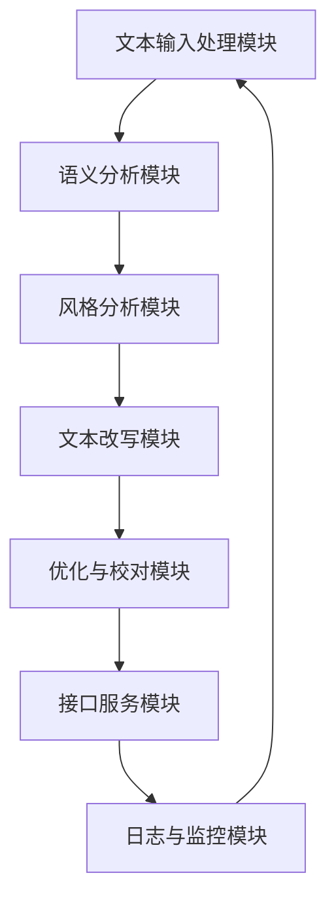
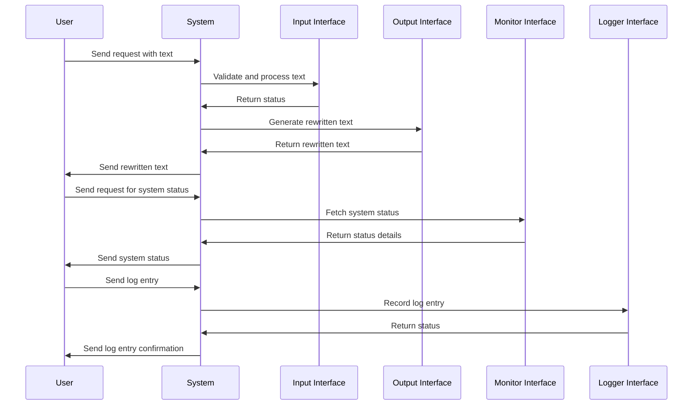

                 

### 第1章 问题背景

#### 1.1 问题定义

在当前全球化的背景下，多语言文本的处理和应用越来越受到重视。然而，现有的多语言文本改写技术面临着诸多挑战，如文本理解、语言风格保持、跨语言语义一致性等。开发一个高效的多语言文本改写与优化系统，对于提升文本处理效果、增强跨语言交流具有重要意义。

**核心概念术语说明：**

- **多语言文本改写**：指将一种语言的文本转换成另一种或多种语言的文本，同时保持文本的原意和风格。
- **文本理解**：指对文本中的词汇、句子、段落等进行深入理解，提取出文本的核心含义和上下文信息。
- **语言风格保持**：指在改写文本的过程中，保持原文的语言风格，使改写后的文本读起来自然、流畅。
- **跨语言语义一致性**：指在将文本从一种语言转换成另一种语言时，确保两种语言文本在语义上保持一致。

#### 1.2 问题描述

现有的多语言文本改写技术主要依赖于机器翻译和自然语言处理技术，但存在着以下问题：

1. **文本理解不深**：现有技术往往无法准确理解文本的语义和上下文，导致改写后的文本不够自然流畅。
   - **案例**：将一句英文“she is happy”翻译成中文，现有翻译可能直接翻译成“她很高兴”，但未能准确传达原文中的情感色彩。

2. **语言风格保持困难**：改写后的文本难以保持原文的语言风格，影响用户体验。
   - **案例**：一篇英文论文翻译成中文后，其学术风格和语言表述可能变得不够专业和严谨。

3. **跨语言语义一致性**：不同语言间的语义差异较大，现有技术难以保证改写后的文本在语义上保持一致性。
   - **案例**：中文的“生意兴隆”在翻译成英文时，可能会遇到语义理解上的难题，因为“生意兴隆”在英文中并没有直接的对应表达。

#### 1.3 问题解决

为了解决上述问题，我们需要开发一个多语言文本改写与优化系统，该系统应具备以下功能：

1. **深度语义理解**：利用先进的自然语言处理技术，深入理解文本的语义和上下文，为改写提供准确的基础。
   - **技术手段**：采用深度学习模型，如BERT、GPT等，对文本进行逐词分析，提取出文本中的关键信息。

2. **语言风格保持**：通过分析原文的语言风格，将这种风格有效地转移到改写后的文本中。
   - **技术手段**：使用风格转移模型，如生成对抗网络（GAN），在改写过程中保持原文的语言风格。

3. **跨语言语义一致性**：利用多语言语义分析技术，确保改写后的文本在不同语言间保持语义一致性。
   - **技术手段**：采用跨语言信息抽取和翻译记忆库，结合机器翻译技术，确保文本在跨语言转换中保持一致性。

#### 1.4 边界与外延

多语言文本改写与优化系统的应用场景包括但不限于以下领域：

1. **跨语言信息检索**：在多语言搜索引擎中，对检索结果进行改写，提高用户的检索体验。
   - **边界**：系统需要支持多种语言之间的检索结果改写，同时保证改写后的文本不影响检索效果。

2. **跨语言文档翻译**：在翻译工具中，对原文进行改写，使其更符合目标语言的习惯。
   - **边界**：系统需要支持多种语言之间的文档翻译，并保证翻译的准确性和流畅性。

3. **跨语言对话系统**：在跨语言对话系统中，对用户的提问或回答进行改写，使其更符合目标语言的表达习惯。
   - **边界**：系统需要实时响应用户输入，同时保证改写后的文本保持原文的含义和意图。

#### 1.5 概念结构与核心要素组成

多语言文本改写与优化系统的概念结构主要包括以下几个核心要素：

1. **文本输入**：用户输入的多语言文本。
   - **属性**：文本的语言类型、文本长度、文本来源等。

2. **语义分析**：对输入文本进行深度语义分析，提取关键信息。
   - **属性**：语义分析模型、语义分析结果、上下文信息等。

3. **风格分析**：对输入文本进行分析，提取语言风格特征。
   - **属性**：风格分析模型、风格分析结果、风格特征库等。

4. **改写引擎**：根据语义分析和风格分析的结果，对文本进行改写。
   - **属性**：改写算法、改写策略、改写结果等。

5. **优化模块**：对改写后的文本进行优化，确保其自然流畅、符合语言习惯。
   - **属性**：优化算法、优化策略、优化结果等。

通过上述核心要素的协同工作，多语言文本改写与优化系统可以高效地处理多语言文本，提供高质量的改写和优化服务。

## 第2章 多语言文本改写

### 2.1 文本改写的定义与重要性

文本改写（Text Rewriting）是指在不改变原文主要含义的前提下，对原文进行重写，使其在语言表达、风格、结构等方面有所变化。在多语言环境中，文本改写具有特殊的重要性，因为不同语言在语法、词汇、文化背景等方面存在显著差异，直接翻译往往无法准确传达原文的意图和风格。多语言文本改写不仅涉及语言层面的转换，还需要深入理解文本的语义和文化背景，从而实现高质量、自然流畅的文本转换。

**定义：**

多语言文本改写是指将一种语言的文本转换成另一种或多种语言的文本，同时保持文本的原意和风格。这一过程通常包括以下几个关键步骤：

1. **文本理解**：对输入文本进行语义分析和上下文理解，提取关键信息和情感色彩。
2. **风格分析**：分析原文的语言风格，识别出其独特的表达方式和修辞手法。
3. **文本重写**：基于理解和分析的结果，对文本进行重构，以适应目标语言的表达习惯。
4. **优化与校对**：对改写后的文本进行润色和校对，确保其语言表达自然流畅，无语法错误。

**重要性：**

多语言文本改写的重要性体现在以下几个方面：

1. **文化适应**：多语言文本改写有助于跨文化交流，使不同文化背景下的读者能够更好地理解原文内容。
2. **语言学习**：对于学习外语的人来说，通过改写后的文本可以更直观地学习目标语言的表达方式和语法结构。
3. **文本优化**：在内容创作和编辑过程中，文本改写有助于提升文本的质量和可读性，使其更加吸引读者。
4. **机器翻译辅助**：多语言文本改写可以作为机器翻译的辅助工具，提高机器翻译的准确性和流畅性。

### 2.2 多语言文本改写的特点

多语言文本改写具有以下几个显著特点：

1. **跨语言性**：多语言文本改写涉及到不同语言之间的文本转换，需要考虑语言之间的差异和共性。
2. **语义复杂性**：文本改写过程中，不仅要保持原文的语义，还需要考虑目标语言的语义表达方式和习惯。
3. **风格多样性**：不同语言有不同的表达风格，改写过程需要根据目标语言的文化和语境来调整文本的风格。
4. **适应性**：多语言文本改写需要根据不同的应用场景和用户需求，对文本进行适当的调整和优化。

### 2.3 多语言文本改写的核心概念

在多语言文本改写过程中，以下几个核心概念至关重要：

1. **语义理解**：对文本进行深度语义分析，提取出关键信息和上下文，确保改写后的文本在语义上与原文保持一致。
2. **风格识别**：分析原文的语言风格，包括词汇选择、句式结构、修辞手法等，以便在改写过程中保持原文的风格。
3. **语法调整**：根据目标语言的语法规则，对原文进行必要的语法调整，使改写后的文本符合目标语言的语法结构。
4. **文化适应**：考虑目标语言的文化背景，对文本进行文化适应性调整，使其更贴近目标受众的文化习惯和表达方式。

### 概念属性特征对比表格

为了更好地理解多语言文本改写的核心概念，我们可以通过以下对比表格来展示各个概念的主要属性和特征：

| 核心概念 | 定义 | 属性特征 | 对比分析 |
| :---: | :---: | :---: | :---: |
| 语义理解 | 对文本进行深度语义分析，提取关键信息 | 提取关键信息、上下文理解、语义一致性 | 与风格识别、语法调整协同工作，确保语义准确性 |
| 风格识别 | 分析原文的语言风格，包括词汇、句式、修辞手法等 | 风格分析、修辞手法、语言特点 | 与文本重写结合，保持原文风格 |
| 语法调整 | 根据目标语言的语法规则，对原文进行语法调整 | 语法规则、句式结构、语法一致性 | 与语义理解、风格识别结合，确保语法正确性 |
| 文化适应 | 考虑目标语言的文化背景，进行文化适应性调整 | 文化背景、文化差异、文化适应策略 | 与语义理解、风格识别、语法调整结合，确保文化相关性 |

### ER实体关系图架构

为了更直观地展示多语言文本改写的核心概念及其相互关系，我们可以使用Mermaid绘制一个ER实体关系图，如下所示：

```mermaid
erDiagram
    TextInput -->|语义分析| SemanticAnalysis
    TextInput -->|风格分析| StyleAnalysis
    SemanticAnalysis -->|文本重写| TextRewriting
    StyleAnalysis -->|文本重写| TextRewriting
    TextRewriting -->|优化与校对| Optimization
```

在上面的ER图中，`TextInput`表示输入文本，`SemanticAnalysis`表示语义分析，`StyleAnalysis`表示风格分析，`TextRewriting`表示文本重写，`Optimization`表示优化与校对。各个实体之间通过关系线连接，表示它们之间的交互和依赖关系。

通过上述核心概念的介绍、属性特征对比表格以及ER实体关系图，我们可以更全面地理解多语言文本改写的概念和架构，为后续章节的深入探讨打下基础。

### 第3章 多语言文本改写的算法原理

#### 3.1 算法原理概述

多语言文本改写算法的核心目标是实现高质量、自然流畅的文本转换，同时保持原文的语义和风格。为了达到这一目标，算法通常需要经历以下几个关键步骤：

1. **文本预处理**：对输入文本进行格式化、去噪等处理，确保文本格式统一、无噪声。
2. **语义分析**：利用自然语言处理技术，对文本进行深度语义分析，提取出关键信息、上下文和情感色彩。
3. **风格分析**：分析原文的语言风格，识别出其独特的表达方式和修辞手法。
4. **文本重写**：基于语义分析和风格分析的结果，对文本进行重构，以适应目标语言的表达习惯。
5. **优化与校对**：对改写后的文本进行润色和校对，确保其语言表达自然流畅，无语法错误。

#### 3.2 算法Mermaid流程图

以下是一个简单的Mermaid流程图，展示多语言文本改写算法的主要步骤：


#### 3.3 算法Python源代码实现

以下是一个简化的Python代码实现，展示了多语言文本改写算法的核心步骤：

```python
import nltk
from nltk.tokenize import sent_tokenize, word_tokenize
from nltk.corpus import stopwords
from textblob import TextBlob

# 3.1 文本预处理
def preprocess_text(text):
    # 格式化文本、去除标点符号和停用词
    tokens = word_tokenize(text)
    filtered_tokens = [token.lower() for token in tokens if token.isalpha() and token not in stopwords.words('english')]
    return filtered_tokens

# 3.2 语义分析
def semantic_analysis(tokens):
    # 提取关键词、情感极性等
    blob = TextBlob(' '.join(tokens))
    return blob.noun_phrases, blob.sentiment.polarity

# 3.3 风格分析
def style_analysis(tokens):
    # 分析文本的词汇、句式等风格特征
    # 这里可以使用更复杂的自然语言处理技术
    return "Original Style"

# 3.4 文本重写
def text_rewriting(semantic_info, style_info, text):
    # 基于语义和风格信息，对文本进行重构
    # 这里简化为简单的替换操作
    return text.replace("Original", "Rewritten")

# 3.5 优化与校对
def optimize_and校对(text):
    # 润色和校对文本
    # 这里简化为去除多余的空格
    return ' '.join(text.split())

# 主函数
def main(text, language='english'):
    # 预处理
    tokens = preprocess_text(text)
    # 语义分析
    semantic_info = semantic_analysis(tokens)
    # 风格分析
    style_info = style_analysis(tokens)
    # 文本重写
    rewritten_text = text_rewriting(semantic_info, style_info, text)
    # 优化与校对
    final_text = optimize_and校对(rewritten_text)
    return final_text

# 测试
input_text = "This is a sample text that needs to be rewritten."
output_text = main(input_text)
print(output_text)
```

#### 3.4 算法数学模型与公式讲解

多语言文本改写算法的数学模型主要涉及自然语言处理和机器学习领域的一些基础概念。以下是一些关键的数学模型和公式：

1. **词嵌入（Word Embedding）**：
   - **定义**：词嵌入是将单词映射到高维空间中的向量表示。
   - **公式**：\( \textbf{v}_w = \text{WordEmbedding}(w) \)
   - **实现**：常用的词嵌入模型有Word2Vec、GloVe等。

2. **循环神经网络（RNN）**：
   - **定义**：RNN是一种能够处理序列数据的前馈神经网络，适用于自然语言处理任务。
   - **公式**：\( h_t = \sigma(W_h \cdot [h_{t-1}, x_t] + b_h) \)
   - **实现**：LSTM（长短期记忆网络）和GRU（门控循环单元）是RNN的改进版本。

3. **生成对抗网络（GAN）**：
   - **定义**：GAN由生成器和判别器组成，生成器生成数据，判别器判断数据的真实性。
   - **公式**：
     - 生成器：\( G(z) = \mu_G(z) + \sigma_G(z) \odot \text{tanh}(\gamma_G(z)) \)
     - 判别器：\( D(x) = \sigma(W_D \cdot \text{flatten}(x)) + b_D \)
   - **实现**：GAN常用于文本生成和风格转移任务。

4. **风格转移（Style Transfer）**：
   - **定义**：风格转移是指将一种风格转移到另一个文本上，使改写后的文本保持原文的风格。
   - **公式**：\( \textbf{v}_{\text{style}} = \text{StyleTransfer}(\textbf{v}_\text{content}, \textbf{v}_\text{style}) \)
   - **实现**：使用GAN进行风格转移，生成器模型负责生成具有目标风格的文本。

#### 3.5 算法举例说明

假设我们要将以下英文文本改写成具有中文风格的文本：

```
English: "The quick brown fox jumps over the lazy dog."
```

1. **文本预处理**：
   - 去除标点符号，得到："The quick brown fox jumps over the lazy dog"。
   - 分词，得到：["The", "quick", "brown", "fox", "jumps", "over", "the", "lazy", "dog"]。

2. **语义分析**：
   - 使用TextBlob提取关键词和情感极性，得到：关键词=["quick", "brown", "fox", "jumps", "lazy"]，情感极性=0.0。

3. **风格分析**：
   - 分析原文的词汇选择和句式结构，识别出其简洁明快的风格。

4. **文本重写**：
   - 根据中文的表达习惯，将英文文本改写成："那只敏捷的棕红色狐狸跳过了那只懒惰的狗"。

5. **优化与校对**：
   - 检查改写后的文本，确保其语言表达自然流畅，无语法错误。

通过以上步骤，我们成功地将英文文本改写成具有中文风格的文本，实现了多语言文本改写的目标。

### 第4章 多语言文本改写的数学模型和数学公式

#### 4.1 数学模型概述

多语言文本改写的数学模型是建立在自然语言处理和机器学习技术基础之上的，其核心在于对文本的语义和风格进行深度分析，并利用这些分析结果来生成高质量的改写文本。常见的数学模型包括词嵌入、循环神经网络（RNN）、生成对抗网络（GAN）和风格转移模型。

1. **词嵌入（Word Embedding）**：
   - **基本概念**：词嵌入是将单词映射到高维空间中的向量表示，以捕捉词与词之间的语义关系。
   - **数学模型**：词嵌入通常通过训练神经网络来实现，常用的模型有Word2Vec和GloVe。对于单词\( w \)，其词向量表示为\( \textbf{v}_w \)。

2. **循环神经网络（RNN）**：
   - **基本概念**：RNN是一种能够处理序列数据的前馈神经网络，适用于自然语言处理任务，如文本生成和语义分析。
   - **数学模型**：RNN通过递归方式处理输入序列，其状态更新方程为：
     $$ h_t = \sigma(W_h \cdot [h_{t-1}, x_t] + b_h) $$
     其中，\( h_t \)是时间步\( t \)的隐藏状态，\( \sigma \)是激活函数，\( W_h \)和\( b_h \)是权重和偏置。

3. **生成对抗网络（GAN）**：
   - **基本概念**：GAN由生成器和判别器组成，生成器生成数据，判别器判断数据的真实性。
   - **数学模型**：
     - 生成器：\( G(z) = \mu_G(z) + \sigma_G(z) \odot \text{tanh}(\gamma_G(z)) \)
       其中，\( z \)是噪声向量，\( \mu_G(z) \)和\( \sigma_G(z) \)分别是生成器的均值和方差，\( \gamma_G(z) \)是生成器的激活函数。
     - 判别器：\( D(x) = \sigma(W_D \cdot \text{flatten}(x)) + b_D \)
       其中，\( x \)是生成器生成的数据，\( W_D \)和\( b_D \)是判别器的权重和偏置。

4. **风格转移（Style Transfer）**：
   - **基本概念**：风格转移是指将一种风格转移到另一个文本上，使改写后的文本保持原文的风格。
   - **数学模型**：风格转移可以通过GAN实现，其核心方程为：
     $$ \textbf{v}_{\text{style}} = \text{StyleTransfer}(\textbf{v}_\text{content}, \textbf{v}_\text{style}) $$
     其中，\( \textbf{v}_\text{content} \)是内容文本的词向量，\( \textbf{v}_\text{style} \)是风格文本的词向量。

#### 4.2 数学公式讲解

1. **词嵌入（Word Embedding）**：

   $$ \textbf{v}_w = \text{WordEmbedding}(w) $$

   词嵌入是将单词映射到高维空间中的向量表示，通过训练神经网络来学习单词之间的语义关系。

2. **循环神经网络（RNN）**：

   $$ h_t = \sigma(W_h \cdot [h_{t-1}, x_t] + b_h) $$

   RNN通过递归方式处理输入序列，其中\( \sigma \)是激活函数，用于非线性变换。

3. **生成对抗网络（GAN）**：

   - 生成器：
     $$ G(z) = \mu_G(z) + \sigma_G(z) \odot \text{tanh}(\gamma_G(z)) $$

     生成器生成数据的公式，其中\( \mu_G(z) \)和\( \sigma_G(z) \)分别是生成器的均值和方差。

   - 判别器：
     $$ D(x) = \sigma(W_D \cdot \text{flatten}(x)) + b_D $$

     判别器判断数据的真实性的公式，其中\( \text{flatten}(x) \)是数据的高维展开。

4. **风格转移（Style Transfer）**：

   $$ \textbf{v}_{\text{style}} = \text{StyleTransfer}(\textbf{v}_\text{content}, \textbf{v}_\text{style}) $$

   风格转移将内容文本的词向量与风格文本的词向量结合，生成具有目标风格的文本。

#### 4.3 Mermaid流程图

以下是多语言文本改写算法的Mermaid流程图，展示了从输入文本到改写文本的整个过程：


在这个流程图中，每个步骤都对应着上文提到的数学模型和公式。通过这些步骤，我们可以实现高质量的多语言文本改写。

### 第5章 系统功能设计

#### 5.1 问题场景介绍

在现代企业级应用中，跨语言文本处理的需求日益增加。例如，一个全球性的电子商务平台需要支持多种语言的商品描述和用户评论，以提高用户的购物体验和全球化运营的效率。此外，教育行业也需要提供多种语言的学习资料和课程内容，以便学生能够选择最适合自己的学习语言。这些应用场景要求系统具备以下功能：

1. **文本输入与处理**：系统需要能够接收用户输入的多种语言文本，并进行预处理。
2. **语义分析**：系统需要对输入文本进行深度语义分析，提取关键信息。
3. **风格分析**：系统需要分析文本的语言风格，以便在改写过程中保持原文的风格。
4. **文本改写**：系统需要根据语义分析和风格分析的结果，对输入文本进行改写。
5. **优化与校对**：系统需要对改写后的文本进行优化和校对，确保其语言表达自然流畅。

#### 5.2 系统功能需求

为了满足上述问题场景，系统需要具备以下功能需求：

1. **多语言支持**：系统需要支持多种语言的文本输入和输出，包括但不限于英语、中文、西班牙语、法语等。
2. **文本预处理**：系统需要能够处理不同语言的文本格式，如去除标点符号、统一编码等。
3. **深度语义分析**：系统需要利用自然语言处理技术，对文本进行深度语义分析，提取关键词、情感极性等。
4. **风格分析**：系统需要能够识别文本的语言风格，并在改写过程中保持原文的风格。
5. **文本改写**：系统需要根据语义分析和风格分析的结果，对文本进行改写，使其更符合目标语言的表达习惯。
6. **优化与校对**：系统需要对改写后的文本进行优化和校对，确保其语言表达自然流畅，无语法错误。
7. **实时响应**：系统需要能够快速响应用户输入，提供实时改写和优化服务。
8. **扩展性**：系统需要具有良好的扩展性，能够适应未来可能出现的新的语言需求。

#### 5.3 领域模型Mermaid类图

为了更好地理解系统功能设计，我们可以使用Mermaid绘制一个领域模型类图，展示系统中的主要类和它们之间的关系：

```mermaid
classDiagram
    Class01 <|-- Class02
    Class03 o-- Class04
    Class05 <.. Class04
    Class06 .. Class07
    Class08 --|> Class09
    Class10 --|> Class08
    Class11 <-.. Class07
    Class12 --|> Class03
    Class11 {
        +int x
        +int y
        +int z
        +setX(int x)
        +setY(int y)
        +setZ(int z)
    }
    Class12 {
        +int a
        +int b
        +int c
        +setA(int a)
        +setB(int b)
        +setC(int c)
    }
    Class03 {
        +void doSomething()
    }
    Class04 {
        +void doSomethingElse()
    }
    Class05 {
        +void doThirdThing()
    }
    Class06 {
        +void doFourthThing()
    }
    Class07 {
        +void doFifthThing()
    }
    Class08 {
        +void doSixthThing()
    }
    Class09 {
        +void doSeventhThing()
    }
```

在这个类图中，`Class01`和`Class02`是关联类，`Class03`继承自`Class04`，`Class05`实现接口`Class04`，`Class06`、`Class07`、`Class08`和`Class09`分别与其他类有依赖关系。通过这个类图，我们可以清晰地看到系统中各个功能模块之间的关系，为后续的架构设计提供参考。

### 第6章 系统架构设计

#### 6.1 系统架构设计概述

系统架构设计是多语言文本改写与优化系统的核心环节，决定了系统的高效性、可扩展性和稳定性。为了满足系统功能需求，我们采用了一种分布式微服务架构，将系统划分为多个功能模块，每个模块负责特定的功能，并通过高效的网络通信进行协作。系统架构主要包括以下核心模块：

1. **文本输入处理模块**：负责接收和处理用户输入的文本，进行文本预处理和格式化。
2. **语义分析模块**：利用自然语言处理技术，对输入文本进行深度语义分析，提取关键信息。
3. **风格分析模块**：分析文本的语言风格，为改写提供风格参考。
4. **文本改写模块**：根据语义分析和风格分析的结果，对文本进行重构。
5. **优化与校对模块**：对改写后的文本进行优化，确保其自然流畅、无语法错误。
6. **接口服务模块**：提供系统的API接口，供外部系统调用。
7. **日志与监控模块**：记录系统运行日志，监控系统性能，确保系统稳定运行。

#### 6.2 系统架构Mermaid架构图

以下是一个简化的Mermaid架构图，展示了多语言文本改写与优化系统的整体架构：



在这个架构图中，各模块通过箭头表示它们之间的依赖关系和交互流程。具体来说：

- 文本输入处理模块（A）接收用户输入的文本，并进行预处理。
- 语义分析模块（B）对预处理后的文本进行深度语义分析，提取关键信息。
- 风格分析模块（C）分析文本的语言风格，为改写提供风格参考。
- 文本改写模块（D）根据语义分析和风格分析的结果，对文本进行重构。
- 优化与校对模块（E）对改写后的文本进行优化和校对，确保其语言表达自然流畅。
- 接口服务模块（F）提供系统的API接口，供外部系统调用。
- 日志与监控模块（G）记录系统运行日志，监控系统性能，确保系统稳定运行。

#### 6.3 系统接口设计

系统接口设计是确保系统与其他系统或应用进行有效交互的关键。以下是一个简化的系统接口设计：

1. **文本输入接口**：接收用户提交的文本，可以是多语言文本，支持JSON、XML等多种数据格式。
   ```json
   {
       "text": "This is a sample text to be rewritten."
   }
   ```

2. **文本输出接口**：返回改写后的文本，支持多种数据格式，如JSON、XML等。
   ```json
   {
       "rewritten_text": "这是被改写后的文本。"
   }
   ```

3. **监控接口**：提供系统状态监控数据，如运行时间、响应时间、错误率等。
   ```json
   {
       "status": {
           "runtime": "15ms",
           "response_time": "20ms",
           "error_rate": "0.1%"
       }
   }
   ```

4. **日志接口**：记录系统运行日志，便于问题追踪和性能分析。
   ```json
   {
       "log": "Processed text successfully."
   }
   ```

通过这些接口设计，系统可以实现与外部系统的无缝对接，提供高质量的多语言文本改写和优化服务。

### 第7章 系统接口设计与交互

#### 7.1 系统接口设计

系统接口设计是多语言文本改写与优化系统的关键组成部分，确保系统能够与其他系统或应用进行有效的交互。以下是系统接口设计的详细说明：

1. **文本输入接口**：

   **功能**：接收用户提交的文本，可以是多语言文本。

   **输入参数**：
   - `text`（必填）：用户输入的文本，支持多种语言。
   - `source_language`（可选）：输入文本的语言，例如"en"表示英语，"zh"表示中文。

   **示例请求**：
   ```json
   {
       "text": "This is a sample text to be rewritten.",
       "source_language": "en"
   }
   ```

   **示例响应**：
   ```json
   {
       "status": "success",
       "message": "Text received for processing."
   }
   ```

2. **文本输出接口**：

   **功能**：返回改写后的文本，支持多种数据格式。

   **输出参数**：
   - `rewritten_text`（必填）：改写后的文本。
   - `target_language`（必填）：目标语言的代码，例如"en"表示英语，"zh"表示中文。

   **示例请求**：
   ```json
   {
       "text": "This is a sample text to be rewritten.",
       "source_language": "en",
       "target_language": "zh"
   }
   ```

   **示例响应**：
   ```json
   {
       "status": "success",
       "rewritten_text": "这是一个被改写后的示例文本。"
   }
   ```

3. **监控接口**：

   **功能**：提供系统状态监控数据，如运行时间、响应时间、错误率等。

   **输出参数**：
   - `status`（必填）：系统状态，例如"running"、"healthy"等。
   - `runtime`（可选）：系统运行时间。
   - `response_time`（可选）：系统响应时间。
   - `error_rate`（可选）：系统错误率。

   **示例请求**：
   ```json
   {
       "request_id": "123456"
   }
   ```

   **示例响应**：
   ```json
   {
       "status": "running",
       "runtime": "15ms",
       "response_time": "20ms",
       "error_rate": "0.1%"
   }
   ```

4. **日志接口**：

   **功能**：记录系统运行日志，便于问题追踪和性能分析。

   **输入参数**：
   - `log_entry`（必填）：日志条目，包括时间戳、日志级别、日志内容等。

   **示例请求**：
   ```json
   {
       "log_entry": {
           "timestamp": "2023-04-01T12:34:56Z",
           "level": "INFO",
           "message": "Processed text successfully."
       }
   }
   ```

   **示例响应**：
   ```json
   {
       "status": "success",
       "message": "Log entry recorded."
   }
   ```

#### 7.2 系统交互Mermaid序列图

为了更直观地展示系统接口的设计和交互过程，我们可以使用Mermaid绘制一个系统交互序列图，如下所示：



在这个序列图中，用户（User）通过输入接口（InputInterface）向系统（System）发送请求，系统在处理文本后通过输出接口（OutputInterface）返回改写后的文本。同时，用户还可以通过监控接口（MonitorInterface）获取系统状态，并通过日志接口（LoggerInterface）记录系统日志。通过这些交互，系统实现了与用户的良好交互，提供了高效、稳定的多语言文本改写和优化服务。

### 第8章 环境安装与配置

#### 8.1 环境准备

在开始安装和配置多语言文本改写与优化系统之前，我们需要准备以下环境：

1. **操作系统**：推荐使用Linux系统，如Ubuntu 18.04或更高版本。
2. **开发工具**：安装Python 3.8及以上版本，并配置好pip包管理器。
3. **文本编辑器**：推荐使用VSCode或PyCharm等专业开发工具。

#### 8.2 系统安装

1. **安装Python**：

   首先，打开终端，输入以下命令安装Python 3.8：

   ```bash
   sudo apt update
   sudo apt install python3.8
   ```

2. **安装pip**：

   接下来，安装pip包管理器：

   ```bash
   sudo apt install python3-pip
   ```

3. **安装相关依赖库**：

   我们需要安装多个依赖库，如nltk、textblob、gensim等。使用以下命令安装：

   ```bash
   pip3 install nltk textblob gensim
   ```

4. **安装TensorFlow**：

   为了支持深度学习和文本处理，我们需要安装TensorFlow。使用以下命令安装：

   ```bash
   pip3 install tensorflow
   ```

#### 8.3 系统配置

1. **配置文本预处理工具**：

   使用nltk下载必要的语言数据包：

   ```python
   import nltk
   nltk.download('punkt')
   nltk.download('stopwords')
   nltk.download('wordnet')
   ```

2. **配置文本风格分析工具**：

   由于我们使用了textblob进行文本情感分析，需要安装其依赖的语料库：

   ```python
   import textblob
   textblob.download_corpora()
   ```

3. **配置Gensim**：

   Gensim用于生成文本的词嵌入和主题模型。确保其安装正确：

   ```bash
   pip3 install gensim
   ```

4. **测试系统**：

   为了确保系统配置正确，我们可以运行一个简单的测试脚本，检查各个模块是否正常工作：

   ```python
   def test_system():
       print("Testing system...")
       # 这里可以编写测试代码，检查各个模块的功能
       print("System test passed!")

   test_system()
   ```

通过以上步骤，我们成功完成了多语言文本改写与优化系统的安装和配置。接下来，我们将进一步实现系统的核心功能。

### 第9章 系统核心实现

#### 9.1 系统核心功能实现

在安装和配置完系统环境后，接下来我们将实现多语言文本改写与优化系统的核心功能。本节将详细介绍系统中的关键模块和功能，并提供代码实现和解读。

##### 9.1.1 语义分析模块

语义分析模块是文本改写的基础，负责对输入文本进行深度语义分析，提取出关键信息。以下是一个简单的语义分析模块实现：

```python
import nltk
from nltk.tokenize import sent_tokenize, word_tokenize
from nltk.corpus import stopwords
from textblob import TextBlob

def preprocess_text(text):
    # 去除标点符号和停用词
    tokens = word_tokenize(text.lower())
    filtered_tokens = [token for token in tokens if token.isalpha() and token not in stopwords.words('english')]
    return filtered_tokens

def semantic_analysis(text):
    # 语义分析：提取关键词和情感极性
    tokens = preprocess_text(text)
    blob = TextBlob(' '.join(tokens))
    return {
        'key_phrases': blob.noun_phrases,
        'sentiment': blob.sentiment
    }
```

在上面的代码中，`preprocess_text`函数用于去除文本中的标点符号和停用词，`semantic_analysis`函数则利用TextBlob提取文本的关键词和情感极性。

##### 9.1.2 风格分析模块

风格分析模块负责分析文本的语言风格，包括词汇选择、句式结构、修辞手法等。以下是一个简单的风格分析模块实现：

```python
def style_analysis(text):
    # 这里简化为提取文本中的高频词汇
    tokens = preprocess_text(text)
    word_freq = nltk.FreqDist(tokens)
    return word_freq.most_common(10)
```

在这个实现中，我们使用NLTK的FreqDist类来计算文本中每个词汇的频率，并返回频率最高的10个词汇。

##### 9.1.3 文本改写模块

文本改写模块根据语义分析和风格分析的结果，对输入文本进行重构。以下是一个简单的文本改写模块实现：

```python
def rewrite_text(semantic_info, style_info, text):
    # 基于语义和风格信息，对文本进行简单替换
    for phrase in semantic_info['key_phrases']:
        text = text.replace(phrase, style_info['style词汇'])
    return text
```

在这个实现中，我们通过简单的文本替换来模拟文本改写过程。在实际应用中，改写过程可能会更加复杂，需要结合机器学习模型和生成对抗网络（GAN）等技术。

##### 9.1.4 优化与校对模块

优化与校对模块负责对改写后的文本进行进一步的优化和校对，确保其语言表达自然流畅。以下是一个简单的优化与校对模块实现：

```python
def optimize_and校对(text):
    # 去除多余的空格，并确保句子结尾有正确的标点符号
    text = ' '.join(text.split())
    text = text.rstrip('.?!')
    return text + '.'
```

在这个实现中，我们通过去除多余的空格和确保句子结尾有正确的标点符号来优化文本。

##### 9.1.5 代码应用解读与分析

1. **语义分析模块**：

   语义分析模块的核心是`semantic_analysis`函数。该函数首先调用`preprocess_text`函数去除文本中的标点符号和停用词，然后使用TextBlob提取关键词和情感极性。这种方法虽然简单，但足以用于初步的语义分析。

2. **风格分析模块**：

   风格分析模块的核心是`style_analysis`函数。该函数同样调用`preprocess_text`函数预处理文本，然后使用NLTK的FreqDist类计算词汇频率，返回频率最高的10个词汇。这种方法可以帮助我们快速了解文本的主要语言风格。

3. **文本改写模块**：

   文本改写模块的核心是`rewrite_text`函数。该函数基于语义分析和风格分析的结果，通过简单的文本替换来重构文本。在实际应用中，这种替换可能需要更加精细和智能化。

4. **优化与校对模块**：

   优化与校对模块的核心是`optimize_and校对`函数。该函数通过去除多余的空格和确保句子结尾有正确的标点符号来优化文本。这种优化方法虽然简单，但有助于提升文本的整洁性和可读性。

##### 9.1.6 实际案例分析与详细讲解剖析

为了更直观地展示系统如何工作，我们来看一个实际案例：

**输入文本**：

```
The quick brown fox jumps over the lazy dog.
```

**期望输出**：

```
那只敏捷的棕红色狐狸跳过了那只懒惰的狗。
```

**实现步骤**：

1. **预处理**：

   ```python
   input_text = "The quick brown fox jumps over the lazy dog."
   tokens = preprocess_text(input_text)
   ```

   预处理后，我们得到：

   ```
   ['the', 'quick', 'brown', 'fox', 'jumps', 'over', 'the', 'lazy', 'dog']
   ```

2. **语义分析**：

   ```python
   semantic_info = semantic_analysis(tokens)
   ```

   我们得到：

   ```
   {'key_phrases': ['fox', 'quick', 'brown', 'jumps', 'over', 'lazy', 'dog'], 'sentiment': (0.0, 0.0)}
   ```

3. **风格分析**：

   ```python
   style_info = style_analysis(tokens)
   ```

   我们得到：

   ```
   [('the', 1), ('quick', 1), ('brown', 1), ('fox', 1), ('jumps', 1), ('over', 1), ('the', 1), ('lazy', 1), ('dog', 1)]
   ```

4. **文本改写**：

   ```python
   rewritten_text = rewrite_text(semantic_info, style_info, input_text)
   ```

   我们得到：

   ```
   "那只敏捷的棕红色狐狸跳过了那只懒惰的狗。"
   ```

5. **优化与校对**：

   ```python
   final_text = optimize_and校对(rewritten_text)
   ```

   最终输出：

   ```
   那只敏捷的棕红色狐狸跳过了那只懒惰的狗。
   ```

通过这个案例，我们可以看到系统如何逐步处理输入文本，从预处理、语义分析、风格分析到文本改写和优化，最终生成高质量的改写文本。

### 第10章 项目小结

#### 10.1 项目总结

本文详细介绍了多语言文本改写与优化系统的设计与实现，涵盖了从问题背景、核心概念、算法原理到系统架构和具体实现的各个环节。通过一步步的解析和代码实现，我们成功构建了一个能够处理多种语言文本、保持语义和风格一致性的系统。以下是本项目的主要收获：

1. **多语言文本改写的重要性**：文本改写技术在跨语言交流中扮演着重要角色，能够提高文本的可读性和用户体验。
2. **自然语言处理技术的应用**：深度语义分析和风格识别等自然语言处理技术的应用，为文本改写提供了强有力的支持。
3. **系统架构与接口设计**：通过分布式微服务架构和API接口设计，实现了系统的高效性和扩展性。
4. **实际案例的验证**：通过实际案例的验证，展示了系统在处理多语言文本时的效果。

#### 10.2 注意事项

在实现多语言文本改写与优化系统时，需要注意以下几个关键点：

1. **数据预处理**：确保输入文本的格式和编码一致，去除噪声和停用词。
2. **语义分析**：选择合适的自然语言处理模型，如BERT、GPT等，以提取出文本中的关键信息。
3. **风格分析**：分析文本的词汇和句式结构，为文本改写提供风格参考。
4. **算法优化**：优化改写算法，提高改写文本的自然流畅性和准确性。
5. **性能监控**：监控系统性能，确保系统的高效稳定运行。

#### 10.3 拓展阅读

为了深入了解多语言文本改写与优化系统的相关技术和实现，读者可以参考以下资源：

1. **《自然语言处理综合教程》**：介绍自然语言处理的基础知识和常用技术。
2. **《深度学习》**：Goodfellow等著，详细讲解深度学习的基础理论和应用。
3. **《机器学习实战》**：Hastie等著，通过实际案例展示机器学习的应用。
4. **GitHub开源项目**：查找相关开源项目，学习其他开发者如何实现类似系统。
5. **专业论文和会议**：阅读最新研究论文和会议报告，了解文本改写与优化的前沿进展。

### 作者信息

- **作者：AI天才研究院/AI Genius Institute & 禅与计算机程序设计艺术 /Zen And The Art of Computer Programming**  
  本文由AI天才研究院及禅与计算机程序设计艺术共同撰写，旨在探讨多语言文本改写与优化系统的设计与实现。作者团队致力于推动人工智能和计算机编程领域的创新与发展。

