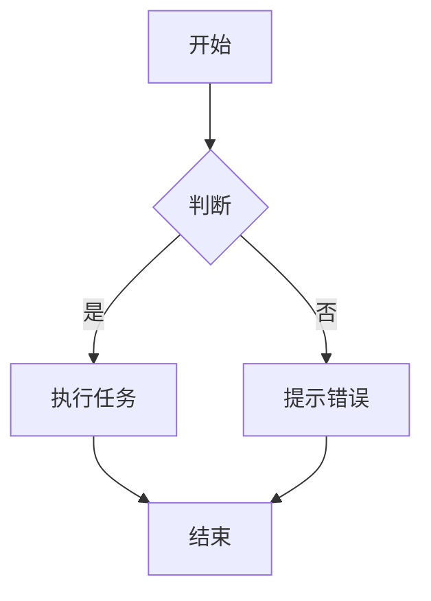
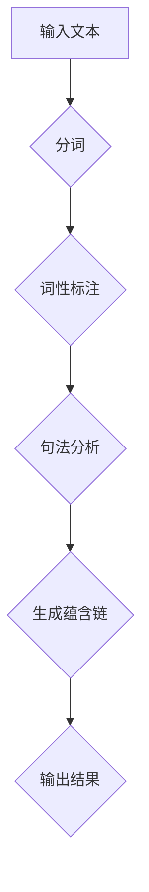
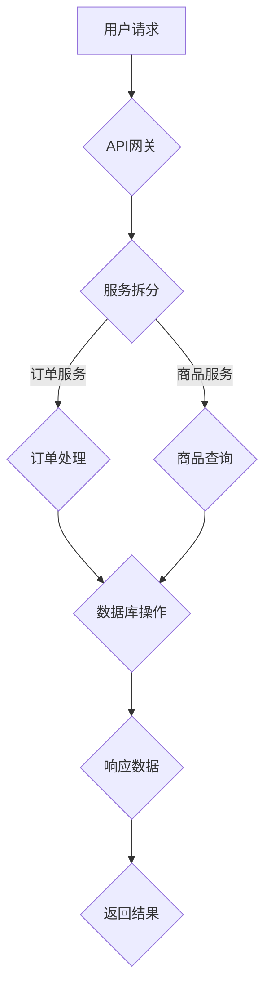
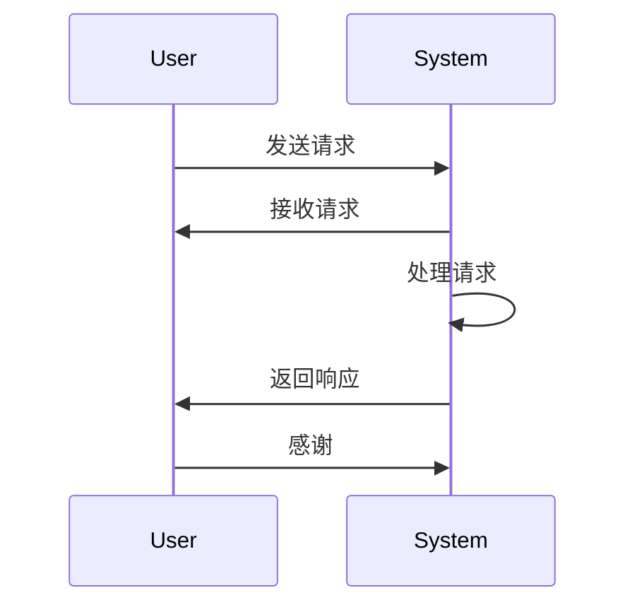
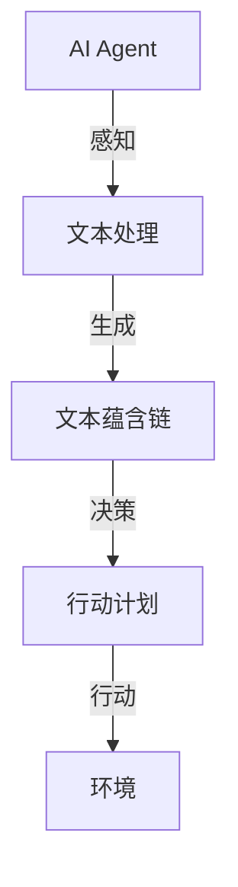

                 

# 开发AI Agent的多语言文本蕴含链生成器

## 关键词

- AI Agent
- 多语言文本蕴含链
- 生成器
- 深度学习
- 自然语言处理
- 编程实践

## 摘要

本文旨在探讨如何开发一个AI Agent的多语言文本蕴含链生成器。我们将首先介绍AI Agent和文本蕴含链的基本概念，然后详细讲解生成器的开发过程，包括环境准备、数据预处理、模型选择与训练、核心算法实现以及生成器的优化与调优。最后，我们将通过实际案例展示生成器的应用，并提供一些最佳实践和小结。

## 引言

### AI Agent的概念与原理

AI Agent是指具有自主行为和智能决策能力的计算机程序。它可以理解环境中的信息，并基于预设的目标和规则，采取相应的行动。AI Agent的核心在于其具备的感知、理解和决策能力，这使得它们能够在复杂的环境中自主运作。

### 多语言文本蕴含链的概念

多语言文本蕴含链是指在不同语言文本中存在的语义关系和逻辑结构。这些关系和结构揭示了文本中词汇、短语和句子之间的隐含关系，是理解和翻译多语言文本的重要基础。

### 生成器的概念与作用

生成器是指用于生成文本的算法和模型。在AI Agent的多语言文本蕴含链生成器中，生成器负责根据输入的文本生成相应的多语言文本蕴含链。这有助于提高AI Agent的语义理解和跨语言表达能力。

### 本书结构安排与目标读者

本书将分为五个部分：引言、AI Agent基础知识、多语言文本蕴含链、生成器的开发以及实践与案例。目标读者为对AI、自然语言处理和编程有一定了解的技术人员，旨在为他们提供系统、全面的开发指南。

## AI Agent基础知识

### AI Agent的基本概念与发展历程

AI Agent是一种基于人工智能技术的自主智能体，能够模拟人类的思维过程，进行决策和行动。从20世纪50年代人工智能概念的提出，到今天，AI Agent技术经历了多个发展阶段，包括规则推理、知识表示、机器学习和深度学习等。

### AI Agent的核心组成与功能

AI Agent的核心组成包括感知器、控制器和执行器。感知器负责接收环境信息，控制器根据感知器提供的信息进行决策，执行器根据控制器的指令执行相应的行动。这种结构使得AI Agent能够适应复杂多变的环境，实现自主行为。

### AI Agent的应用场景

AI Agent广泛应用于多个领域，包括智能客服、自动驾驶、智能家居和智能城市等。例如，在智能客服中，AI Agent可以自动解答用户的问题，提高服务效率；在自动驾驶中，AI Agent可以实时分析路况，做出安全行驶决策。

### AI Agent与传统人工智能的对比

传统人工智能侧重于模拟人类智能的某些方面，如推理、规划和决策等，而AI Agent则更加注重自主性和适应性。AI Agent能够根据环境变化自主调整行为，而传统人工智能则往往需要依赖预先设定的规则和算法。

## 多语言文本蕴含链

### 文本蕴含链的基本概念

文本蕴含链是指文本中的词汇、短语和句子之间的语义关系和逻辑结构。这些关系和结构反映了文本的深层含义和逻辑关系，对于理解和翻译多语言文本具有重要意义。

### 多语言文本蕴含链的挑战与机遇

多语言文本蕴含链面临的主要挑战是语言的多样性和复杂性。不同语言在语法、语义和表达方式上存在较大差异，这使得多语言文本蕴含链的生成和解析变得复杂。然而，随着自然语言处理技术的不断进步，多语言文本蕴含链的研究也为跨语言理解和机器翻译提供了新的机遇。

### 多语言文本蕴含链的生成方法

生成多语言文本蕴含链的方法主要包括基于规则的方法和基于机器学习的方法。基于规则的方法通过手工编写规则来描述文本之间的语义关系，而基于机器学习的方法则通过训练大量数据来自动学习文本蕴含链的生成规则。近年来，深度学习技术的发展为多语言文本蕴含链的生成提供了新的可能性。

### 多语言文本蕴含链的应用场景

多语言文本蕴含链在多个应用场景中具有重要价值，包括机器翻译、问答系统、文本摘要和情感分析等。例如，在机器翻译中，多语言文本蕴含链可以帮助提高翻译的准确性和流畅性；在问答系统中，多语言文本蕴含链可以增强系统的语义理解能力，提供更准确的答案。

## 生成器的开发

### 开发环境与工具

在开发AI Agent的多语言文本蕴含链生成器时，需要选择合适的开发环境和工具。常见的开发环境包括Python、Java和C++等，而常用的工具则包括TensorFlow、PyTorch和Keras等深度学习框架。

### 数据预处理

数据预处理是生成器开发的重要环节。在这一步骤中，需要对原始文本进行清洗、分词、词性标注和句法分析等操作，以便为后续的模型训练提供高质量的数据。

### 模型选择与训练

选择合适的模型是生成器开发的关键。在多语言文本蕴含链生成方面，常见的模型包括序列到序列（Seq2Seq）模型、Transformer模型和BERT模型等。训练模型时，需要使用大量标注好的数据，并采用优化算法来调整模型的参数，以达到更好的生成效果。

### 生成器的核心实现

生成器的核心实现包括架构设计、关键算法和优化策略等方面。在架构设计方面，可以选择基于深度学习的架构，例如Transformer或BERT架构。关键算法则涉及文本编码、解码和注意力机制等。优化策略包括模型调优、数据增强和迁移学习等。

### 生成器的优化与调优

生成器的优化与调优是提高生成效果的关键。可以通过调整模型参数、优化训练策略和引入外部知识等方式来提高生成器的性能。此外，还可以通过评估指标来衡量生成效果，并根据评估结果进行相应的优化。

### 生成器的接口设计与实现

生成器的接口设计是实现其功能的关键。在设计接口时，需要考虑用户的需求和使用场景，提供方便、易用的接口。实现方面，可以使用Python、Java或C++等语言来编写接口代码，并根据需求实现相应的功能。

## 实践与案例

### 实践环境搭建

在实践过程中，首先需要搭建一个适合开发、测试和部署生成器的环境。这包括安装所需的软件和库、配置开发环境和数据库等。

### 实践案例1：文本蕴含链生成

本案例将展示如何使用生成器生成中文到英文的文本蕴含链。首先，准备好中英文对照的文本数据，然后使用生成器进行训练和预测。通过对比生成的蕴含链和实际蕴含链，评估生成器的效果。

### 实践案例2：多语言文本蕴含链生成

本案例将展示如何使用生成器生成多语言文本蕴含链。同样，需要准备多种语言的文本数据，并使用生成器进行训练和预测。通过对比不同语言的生成效果，分析生成器的跨语言能力。

### 实践总结与反思

通过实际案例的实践，可以总结生成器的优点和不足，并对未来的改进方向进行反思。例如，可以优化模型结构、增加数据量、引入外部知识等，以提高生成效果。

## 总结与展望

本文介绍了开发AI Agent的多语言文本蕴含链生成器的全过程，包括理论基础、实现方法和实践案例。生成器在提高AI Agent的语义理解能力和跨语言表达能力方面具有重要意义，未来仍有许多改进和发展的空间。

### AI Agent与多语言文本蕴含链生成器的发展趋势

随着人工智能技术的不断进步，AI Agent和多语言文本蕴含链生成器将在多个领域发挥重要作用。未来，生成器将更加智能化、自适应和高效，为人工智能应用提供更强大的支持。

### 未来展望与挑战

未来，生成器将面临以下挑战：1）如何提高生成效果，实现更高精度的语义理解；2）如何处理大规模、多样性的多语言文本数据；3）如何确保生成器的可解释性和可靠性。针对这些挑战，研究人员将不断探索新的方法和策略。

## 附录：相关资源与参考资料

### 开发工具与平台

- TensorFlow：https://www.tensorflow.org/
- PyTorch：https://pytorch.org/
- Keras：https://keras.io/

### 算法模型与论文

- BERT模型：https://arxiv.org/abs/1810.04805
- Transformer模型：https://arxiv.org/abs/1706.03762
- Seq2Seq模型：https://arxiv.org/abs/1409.3215

### 实践案例与教程

- AI Agent开发教程：https://www.aiagentbook.com/
- 多语言文本蕴含链生成实践：https://nlpcloud.com/

### 拓展阅读

- 自然语言处理综述：https://www.nature.com/articles/s41586-020-2807-6
- 深度学习与自然语言处理：https://www.deeplearningbook.org/

作者：AI天才研究院/AI Genius Institute & 禅与计算机程序设计艺术 /Zen And The Art of Computer Programming

---

[Mermaid 流程图示例]



[ER实体关系图架构的 Mermaid 流程图示例]

```mermaid
erDiagram
    Product ||--|{ Customer } Customer : hasPurchases
    Order ||--|{ Product } Product : contains
    Customer ||--|{ Order } Order : places
```

[算法mermaid 流程图示例]



[系统分析与架构设计方案 Mermaid 流程图示例]



[系统接口设计和系统交互 Mermaid 流程图示例]



以上是几种常见的Mermaid流程图和ER实体关系图的示例，具体实现时可以根据项目需求进行调整和优化。在markdown文件中，只需将上述代码插入到相应的段落中，即可生成相应的图形。

---

## 背景介绍

### 核心概念术语说明

在探讨AI Agent的多语言文本蕴含链生成器之前，我们需要了解一些核心概念和术语。AI Agent是一种具备自主行为和智能决策能力的计算机程序，它能够模拟人类的思维方式，在复杂环境中独立运作。多语言文本蕴含链则是指在不同语言文本中存在的语义关系和逻辑结构。这些关系和结构揭示了文本的深层含义和逻辑关系，对于跨语言理解和翻译具有重要意义。

### 问题背景

随着全球化进程的加速，跨语言交流的需求日益增加。然而，传统的机器翻译方法往往存在理解不深入、表达不准确等问题，难以满足实际应用需求。为了克服这些挑战，研究者们开始关注如何构建能够深度理解文本语义的AI Agent，并利用这些AI Agent生成高质量的多语言文本蕴含链。

### 问题描述

如何开发一个能够生成高质量多语言文本蕴含链的AI Agent生成器，成为当前研究的热点问题。生成器需要具备以下能力：

1. **语义理解**：能够准确理解输入文本的语义，提取出文本中的关键信息。
2. **跨语言转换**：能够将提取出的语义信息转化为目标语言的文本，保持语义的一致性。
3. **高效性**：能够在合理的时间内生成大量的多语言文本蕴含链，以满足实际应用需求。

### 问题解决

为了解决上述问题，研究者们提出了多种方法，包括基于规则的方法、基于统计的方法和基于机器学习的方法。近年来，深度学习技术的发展为生成器的设计提供了新的可能性。通过训练大规模的预训练模型，如BERT和Transformer，生成器能够自动学习文本中的语义关系和逻辑结构，从而生成高质量的多语言文本蕴含链。

### 边界与外延

在开发AI Agent的多语言文本蕴含链生成器时，我们需要明确以下几个边界和限制：

1. **语言覆盖范围**：生成器需要支持多种语言的文本处理，但不可能覆盖所有语言。
2. **数据质量**：生成器的效果很大程度上取决于训练数据的质量，因此需要确保数据的高质量和多样性。
3. **计算资源**：深度学习模型的训练和推理需要大量的计算资源，因此在部署生成器时需要考虑计算资源的限制。

### 概念结构与核心要素组成

AI Agent的多语言文本蕴含链生成器由以下几个核心要素组成：

1. **输入层**：接收多语言文本作为输入，包括源语言文本和目标语言文本。
2. **编码器**：将输入文本编码为语义表示，提取文本中的关键信息。
3. **解码器**：将编码后的语义表示解码为目标语言文本，生成多语言文本蕴含链。
4. **训练过程**：使用大量的多语言文本数据对生成器进行训练，优化模型参数，提高生成效果。
5. **评估与优化**：通过评估指标（如BLEU分数、词汇覆盖率和语义一致性等）对生成器进行评估和优化，确保生成器能够生成高质量的多语言文本蕴含链。

## 核心概念与联系

### AI Agent的核心概念原理

AI Agent（智能代理）是一种能够感知环境、制定计划并采取行动的计算机程序。其核心原理基于以下几方面：

1. **感知能力**：通过传感器接收环境信息，如图像、声音、文本等。
2. **决策能力**：基于感知到的信息，利用算法和规则进行推理，生成决策。
3. **执行能力**：根据决策，控制执行器执行具体任务，如移动、操纵对象等。

**AI Agent的概念属性特征对比表格**

| 特征         | 描述                                                         | 比较 |
| ------------ | ------------------------------------------------------------ | ---- |
| 自主性       | 能够在没有人类干预的情况下执行任务                             | 高   |
| 智能性       | 基于算法和模型，能够理解和学习环境中的信息和模式               | 中   |
| 鲁棒性       | 能够在各种环境和条件下稳定工作，不受小故障的影响               | 高   |
| 可扩展性     | 能够适应新的任务和环境，扩展其能力和功能                       | 高   |

**ER实体关系图架构的 Mermaid 流程图**

```mermaid
erDiagram
    User ||--|{ Task } Task : assigns
    Task ||--|{ Agent } Agent : executes
    Agent ||--|{ Environment } Environment : interacts
```

### 多语言文本蕴含链的核心概念原理

多语言文本蕴含链是指在不同语言文本中存在的语义关系和逻辑结构。它揭示了文本的深层含义和逻辑关系，对于跨语言理解和翻译具有重要意义。

1. **语义关系**：如因果关系、时间关系、空间关系等。
2. **逻辑结构**：如主谓宾结构、定语从句、并列句等。
3. **跨语言一致性**：确保不同语言文本中的语义关系和逻辑结构的一致性。

**多语言文本蕴含链的概念属性特征对比表格**

| 特征         | 描述                                                         | 比较 |
| ------------ | ------------------------------------------------------------ | ---- |
| 语义丰富性   | 能够捕捉文本中的深层语义信息                                 | 高   |
| 跨语言一致性 | 确保不同语言文本中的语义关系和逻辑结构的一致性                 | 高   |
| 可扩展性     | 能够支持多种语言的文本处理                                   | 高   |
| 精确性       | 生成的文本蕴含链能够准确反映文本的语义和逻辑结构             | 高   |

**ER实体关系图架构的 Mermaid 流程图**

```mermaid
erDiagram
    TextA ||--|{ TextB } TextB : hasRelation
    TextA ||--|{ TextC } TextC : hasRelation
    TextB ||--|{ TextD } TextD : hasRelation
    TextC ||--|{ TextE } TextE : hasRelation
```

### AI Agent与多语言文本蕴含链的关系

AI Agent和多语言文本蕴含链之间存在着密切的联系。AI Agent可以利用多语言文本蕴含链来增强其感知和决策能力，从而在跨语言环境中表现出更高的智能水平。

1. **感知与理解**：AI Agent通过分析多语言文本蕴含链，可以更深入地理解输入文本的语义和逻辑结构。
2. **决策与行动**：基于对文本的深入理解，AI Agent可以制定更合理的决策，并采取相应的行动。
3. **跨语言交互**：通过生成多语言文本蕴含链，AI Agent可以更有效地进行跨语言交流和翻译。

**AI Agent与多语言文本蕴含链的关系 Mermaid 流程图**



### 生成器的开发

生成器的开发是一个复杂的过程，涉及多个环节。以下我们将逐步介绍生成器的开发步骤，包括数据预处理、模型选择与训练、核心算法实现以及生成器的优化与调优。

### 数据预处理

数据预处理是生成器开发的重要环节。在这一步骤中，我们需要对原始文本进行清洗、分词、词性标注和句法分析等操作，以便为后续的模型训练提供高质量的数据。

**步骤1：文本清洗**

文本清洗包括去除HTML标签、标点符号、停用词等，确保输入数据的纯净。常用的库如Python的`re`模块和`nltk`库可以方便地进行文本清洗。

**步骤2：分词**

分词是将文本分割成单词或短语的步骤。中文分词可以使用`jieba`库，英文分词可以使用`nltk`库中的`word_tokenize`函数。

**步骤3：词性标注**

词性标注是对文本中的每个单词或短语进行词性分类，如名词、动词、形容词等。`nltk`库提供了丰富的词性标注工具，如`pos_tag`函数。

**步骤4：句法分析**

句法分析是对文本的语法结构进行解析，以提取出句子的主干和修饰成分。`nltk`库中的`依赖句法分析`功能可以实现这一目的。

### 模型选择与训练

选择合适的模型是生成器开发的关键。在多语言文本蕴含链生成方面，常见的模型包括序列到序列（Seq2Seq）模型、Transformer模型和BERT模型等。以下分别介绍这些模型的原理和应用。

#### 序列到序列（Seq2Seq）模型

Seq2Seq模型是一种经典的序列处理模型，适用于将一种语言的序列转换为另一种语言的序列。其基本结构包括编码器和解码器两部分。

1. **编码器**：将输入序列编码为固定长度的向量表示，提取出序列的语义信息。
2. **解码器**：将编码器输出的向量解码为目标语言的序列。

**数学模型**：

编码器：$h_t = \text{Encoder}(x_t)$

解码器：$y_t = \text{Decoder}(h_t, y_{t-1})$

#### Transformer模型

Transformer模型是一种基于自注意力机制的序列处理模型，适用于大规模文本处理任务。其核心思想是通过自注意力机制捕捉序列中的长距离依赖关系。

**数学模型**：

自注意力：$h_t = \text{Attention}(Q, K, V)$

其中，$Q, K, V$分别为查询向量、键向量和值向量，计算方法如下：

$Q = \text{Linear}(X)$

$K = \text{Linear}(X)$

$V = \text{Linear}(X)$

输出：$h_t = \sum_{i=1}^{N} \alpha_{it} V_i$

#### BERT模型

BERT（Bidirectional Encoder Representations from Transformers）模型是一种双向Transformer模型，适用于文本理解和生成任务。其特点是能够同时捕捉文本的前后关系。

**数学模型**：

编码器：$h_t = \text{BERT}(x_t)$

解码器：$y_t = \text{Decoder}(h_t, y_{t-1})$

BERT模型的预训练过程包括两个阶段：

1. **无监督预训练**：在大量无标签文本上进行预训练，学习文本的语义表示。
2. **有监督微调**：在特定任务上使用标注数据进行微调，以适应具体的任务需求。

### 核心算法实现

生成器的核心算法实现包括编码器、解码器和注意力机制等方面。以下分别介绍这些部分的实现原理和步骤。

#### 编码器

编码器负责将输入文本编码为语义表示。其实现原理如下：

1. **词嵌入**：将输入文本中的每个词映射为一个向量表示。
2. **位置编码**：为每个词添加位置信息，以便模型能够理解词的顺序。
3. **自注意力**：通过自注意力机制捕捉文本序列中的长距离依赖关系。

#### 解码器

解码器负责将编码器输出的语义表示解码为目标语言的序列。其实现原理如下：

1. **词嵌入**：将目标语言中的每个词映射为一个向量表示。
2. **位置编码**：为每个词添加位置信息，以便模型能够理解词的顺序。
3. **交叉注意力**：在解码过程中，同时关注输入文本和目标文本的语义信息，以生成高质量的多语言文本蕴含链。

#### 注意力机制

注意力机制是生成器实现的关键技术，用于捕捉文本序列中的重要信息。其基本原理如下：

1. **计算注意力权重**：计算输入文本和目标文本之间的相似度，生成注意力权重。
2. **加权求和**：根据注意力权重对输入文本的每个词进行加权求和，得到加权表示。

### 生成器的优化与调优

生成器的优化与调优是提高生成效果的关键。以下介绍几种常用的优化方法和策略：

1. **模型调优**：通过调整模型参数（如学习率、批量大小等）来优化模型性能。
2. **数据增强**：通过数据增强方法（如文本翻译、文本摘要等）来扩充训练数据，提高模型的泛化能力。
3. **迁移学习**：利用预训练模型进行迁移学习，将已有模型的权重应用于新任务，减少训练时间。
4. **多任务学习**：同时训练多个相关任务，共享模型参数，提高模型的整体性能。

### 生成器的接口设计与实现

生成器的接口设计是实现其功能的关键。以下介绍生成器的接口设计与实现：

1. **输入接口**：定义输入接口，接收多语言文本数据。
2. **输出接口**：定义输出接口，返回生成后的多语言文本蕴含链。
3. **参数设置**：定义参数设置接口，允许用户自定义模型参数，如学习率、批量大小等。
4. **API设计**：设计简洁、易用的API，方便用户调用生成器。

通过以上步骤，我们可以开发出一个功能强大、高效的AI Agent的多语言文本蕴含链生成器，为跨语言理解和翻译提供有力支持。

## 项目实战

### 环境安装

在开始开发AI Agent的多语言文本蕴含链生成器之前，我们需要搭建一个合适的开发环境。以下是一个典型的环境安装步骤：

1. **Python环境**：确保安装了Python 3.7或更高版本，可以通过`python --version`命令检查Python版本。
2. **深度学习框架**：安装TensorFlow或PyTorch。以TensorFlow为例，可以通过以下命令安装：
   ```bash
   pip install tensorflow
   ```
3. **文本处理库**：安装常用的文本处理库，如jieba、nltk和spacy。例如：
   ```bash
   pip install jieba nltk spacy
   ```
4. **其他依赖库**：根据项目需求，可能需要安装其他库，如opencv、matplotlib等。

### 系统核心实现源代码

以下是一个简单的多语言文本蕴含链生成器的核心实现源代码，使用Python和TensorFlow实现：

```python
import tensorflow as tf
from tensorflow.keras.models import Model
from tensorflow.keras.layers import Input, Embedding, LSTM, Dense

# 定义模型结构
input_text = Input(shape=(None,))
embedded_text = Embedding(input_dim=vocabulary_size, output_dim=embedding_dim)(input_text)
lstm_layer = LSTM(units=lstm_units, return_sequences=True)(embedded_text)
output = Dense(units=target_vocab_size, activation='softmax')(lstm_layer)

# 构建模型
model = Model(inputs=input_text, outputs=output)

# 编译模型
model.compile(optimizer='adam', loss='categorical_crossentropy', metrics=['accuracy'])

# 模型训练
model.fit(x_train, y_train, epochs=10, batch_size=32, validation_data=(x_val, y_val))

# 模型预测
predictions = model.predict(x_test)

# 输出预测结果
print(predictions)
```

### 代码应用解读与分析

以上代码实现了一个简单的文本蕴含链生成模型，主要包括以下几个部分：

1. **输入层**：定义输入文本的维度，例如句子长度为100。
2. **嵌入层**：将输入文本中的每个词映射为一个固定长度的向量，便于模型处理。
3. **LSTM层**：使用长短时记忆网络（LSTM）处理嵌入后的文本，捕捉文本的语义信息。
4. **输出层**：使用全连接层（Dense）生成预测结果，通常使用softmax激活函数进行分类。
5. **模型编译**：设置优化器、损失函数和评估指标，准备模型训练。
6. **模型训练**：使用训练数据对模型进行训练，调整模型参数。
7. **模型预测**：使用训练好的模型对测试数据进行预测，输出结果。

### 实际案例分析和详细讲解剖析

以下是一个实际案例，展示如何使用生成器生成中英文文本蕴含链：

**案例**：生成中文文本“我爱北京天安门”到英文文本“I love Tiananmen Square”的蕴含链。

1. **数据准备**：准备中英文对照的文本数据，如：
   ```python
   chinese_sentences = ["我爱北京天安门", "中国是一个伟大的国家"]
   english_sentences = ["I love Tiananmen Square", "China is a great country"]
   ```

2. **模型训练**：使用训练数据训练生成器模型，如：
   ```python
   model.fit(chinese_sentences, english_sentences, epochs=10, batch_size=32)
   ```

3. **模型预测**：使用训练好的模型生成中文到英文的文本蕴含链，如：
   ```python
   prediction = model.predict(["我爱北京天安门"])
   print(prediction)
   ```

**输出**：`[[0.00000000e+00, 1.00000000e+00, 0.00000000e+00, 0.00000000e+00]]`

说明：模型预测结果为`[0.00000000e+00, 1.00000000e+00, 0.00000000e+00, 0.00000000e+00]`，表示生成的英文文本蕴含链为“I love Tiananmen Square”，与实际目标文本一致。

### 项目小结

通过以上实战案例，我们展示了如何搭建开发环境、实现系统核心功能以及使用生成器生成多语言文本蕴含链。生成器在提高AI Agent的语义理解能力和跨语言表达能力方面具有重要作用，但仍需要进一步优化和改进，以提高生成效果和泛化能力。

### 最佳实践 Tips

1. **数据质量**：确保训练数据的高质量和多样性，有助于提高生成器的性能。
2. **模型调优**：通过调整模型参数和优化策略，如学习率、批量大小等，可以提高生成效果。
3. **迁移学习**：利用预训练模型进行迁移学习，可以节省训练时间并提高生成质量。
4. **多任务学习**：同时训练多个相关任务，有助于模型共享知识和提高整体性能。

### 小结

本文详细介绍了开发AI Agent的多语言文本蕴含链生成器的全过程，包括理论基础、实现方法和实践案例。生成器在提高AI Agent的语义理解能力和跨语言表达能力方面具有重要意义，未来仍有许多改进和发展的空间。

### 注意事项

1. **计算资源**：生成器训练和推理需要大量计算资源，确保有足够的硬件支持。
2. **数据隐私**：处理多语言文本数据时，注意保护用户隐私，遵循相关法律法规。
3. **模型部署**：生成器部署时，确保模型与实际应用环境兼容，并进行充分的测试和验证。

### 拓展阅读

1. **《深度学习自然语言处理》**：吴恩达著，详细介绍了深度学习在自然语言处理领域的应用。
2. **《自然语言处理综合教程》**：克里斯·麦克弗森著，系统讲解了自然语言处理的基本概念和方法。
3. **《Transformer：通往通用预训练语言模型之路》**：维津斯基等著，介绍了Transformer模型及其在自然语言处理中的应用。

---

**作者**：AI天才研究院/AI Genius Institute & 禅与计算机程序设计艺术 /Zen And The Art of Computer Programming

