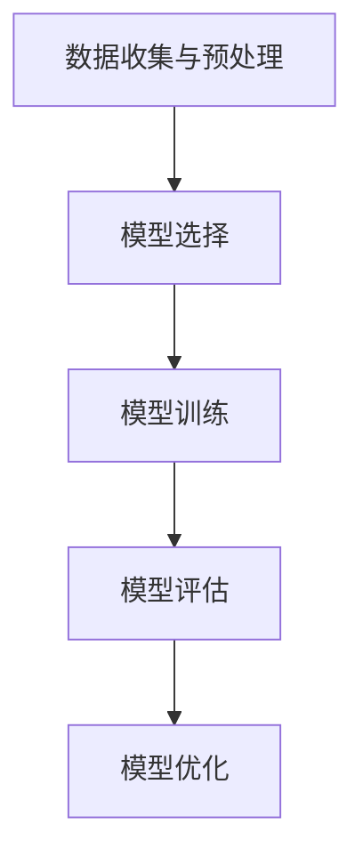
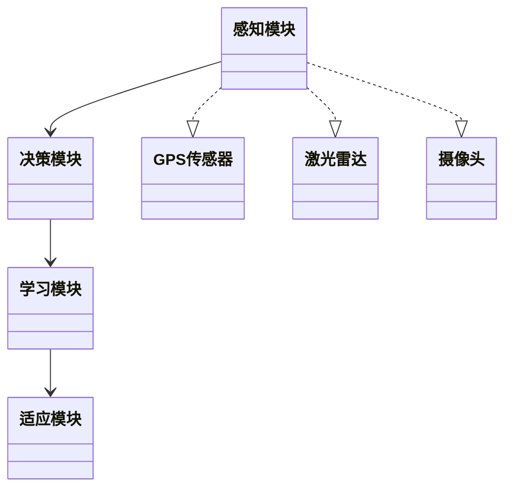
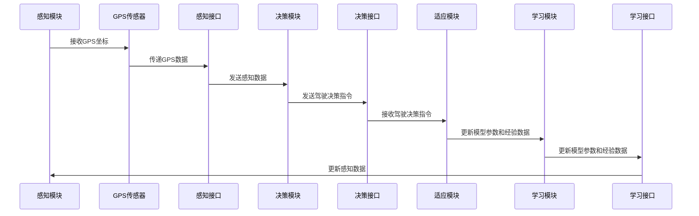

                 

## 开发AI Agent的学习与适应能力

### 关键词：
- 人工智能代理（AI Agent）
- 学习能力
- 适应能力
- 强化学习
- 神经网络
- 模型优化

### 摘要：

本文旨在深入探讨开发人工智能代理（AI Agent）的学习与适应能力。首先，介绍AI Agent的基础知识，包括其定义、分类和基本工作原理。然后，详细探讨AI Agent的学习方法，如监督学习、无监督学习和强化学习等。接着，介绍AI Agent的适应能力，包括环境适应、任务适应和模型适应等。此外，分析AI Agent在实际应用中的挑战和解决方案。通过本文，读者可以全面了解AI Agent的学习与适应能力，掌握相关技术原理和应用方法，为开发高效学习与适应能力的AI Agent打下坚实基础。

### 1.1 问题背景

随着人工智能（AI）技术的迅猛发展，AI agent（智能代理）成为了研究的热点之一。AI agent 是一种能够自主行动，通过感知环境并做出决策来解决问题的智能体。在现实世界中，AI agent 的应用场景越来越广泛，如自动驾驶、智能客服、智能家居等。

开发AI agent不仅需要强大的学习能力，还需要具备良好的适应能力，以确保其能够在不同的环境中稳定运行。学习与适应能力是AI agent的核心能力，直接决定了其在实际应用中的表现。因此，深入研究AI agent的学习与适应能力具有重要的理论和实践价值。

### 1.2 核心概念

#### 1.2.1 学习能力

学习能力是AI agent最核心的能力之一。它是指AI agent通过从数据中提取知识，改进自身行为的能力。根据学习方式的差异，学习能力可以分为以下几类：

1. **监督学习**：监督学习是一种最常见的机器学习方法。在监督学习中，AI agent通过学习输入数据和对应的输出数据，建立输入与输出之间的映射关系。例如，在图像分类任务中，AI agent通过学习大量带有标签的图像，来预测新图像的类别。

2. **无监督学习**：无监督学习是指在没有标签数据的情况下，AI agent通过自身探索数据，发现数据中的模式和结构。无监督学习在聚类、降维和生成模型等领域有广泛应用。

3. **强化学习**：强化学习是一种基于奖励和惩罚机制的学习方法。AI agent通过与环境的交互，不断调整自身策略，以最大化长期回报。强化学习在游戏、推荐系统和自动驾驶等领域有广泛应用。

#### 1.2.2 适应能力

适应能力是指AI agent在面临新环境、新任务或新模型时，能够快速调整自身行为的能力。适应能力可以分为以下几类：

1. **环境适应**：环境适应是指AI agent能够在不同的环境中稳定运行，适应环境变化的能力。例如，自动驾驶系统需要能够适应不同天气、路况和交通规则。

2. **任务适应**：任务适应是指AI agent能够在面对不同任务时，快速调整自身行为，适应新任务的能力。例如，一个通用的智能客服系统需要能够适应不同行业和业务场景。

3. **模型适应**：模型适应是指AI agent能够在面对新模型时，快速调整自身结构或参数，以适应新模型的能力。模型适应有助于提高AI agent的灵活性和通用性。

#### 1.2.3 学习与适应的关系

学习与适应是AI agent的两个核心能力，它们之间存在紧密的联系：

1. **学习是适应的基础**：通过学习，AI agent可以积累经验，提高自身的能力。这些经验有助于AI agent在面对新环境或新任务时，更快地适应。

2. **适应是学习的延续**：在适应过程中，AI agent不仅需要利用已有的知识，还需要不断学习新知识，以更好地适应新环境或新任务。

通过深入了解学习与适应能力，可以为开发具有高效学习与适应能力的AI agent提供理论支持。

### 1.3 算法原理讲解

#### 1.3.1 学习算法原理

AI agent的学习过程通常包括以下几个步骤：

1. **数据收集与预处理**：首先，需要收集大量的数据，并对数据进行清洗和预处理，以便后续学习。

2. **模型选择**：根据学习任务的需求，选择合适的机器学习模型。常见的机器学习模型包括线性回归、决策树、支持向量机、神经网络等。

3. **模型训练**：使用预处理后的数据，对机器学习模型进行训练。训练过程中，模型会不断调整参数，以最小化预测误差。

4. **模型评估**：通过验证集或测试集，评估模型的性能。常用的评估指标包括准确率、召回率、F1分数等。

5. **模型优化**：根据评估结果，对模型进行优化，以提高性能。

以下是一个简单的线性回归算法的mermaid流程图：



线性回归算法的Python代码示例：

```python
import numpy as np
import matplotlib.pyplot as plt

# 数据收集与预处理
# 假设我们有一组数据：x = [1, 2, 3, 4, 5] 和 y = [2, 4, 5, 4, 5]
# 我们希望找到一个线性模型 y = mx + b，使得 y' = mx' + b 最接近 y

# 模型选择
# 使用最小二乘法求解线性回归模型的参数 m 和 b
m = np.linalg.inv(np.dot(x.T, x)).dot(x.T).dot(y)
b = np.mean(y) - m * np.mean(x)

# 模型训练
# 使用训练数据计算预测值 y'
y_pred = m * x + b

# 模型评估
# 计算预测误差
error = np.mean((y - y_pred) ** 2)

# 模型优化
# 使用优化后的参数重新计算预测值 y'
y_pred_optimized = m * x + b

# 绘制结果
plt.scatter(x, y, color='blue')
plt.plot(x, y_pred_optimized, color='red')
plt.show()
```

该示例演示了如何使用线性回归算法进行数据拟合和模型优化。通过最小化预测误差，我们可以找到最佳的模型参数，从而提高模型的性能。

### 1.4 系统分析与架构设计方案

#### 1.4.1 问题场景介绍

在自动驾驶领域，AI agent 的学习与适应能力具有重要意义。自动驾驶系统需要能够实时感知环境，并根据环境变化做出正确的决策，以确保行驶的安全性和可靠性。例如，在复杂的城市交通环境中，自动驾驶系统需要能够适应不同的道路条件、车辆和行人行为。

#### 1.4.2 项目介绍

本节介绍一个自动驾驶AI agent的项目，旨在实现一个能够适应各种环境变化的智能驾驶系统。项目的主要目标是开发一个具备高效学习与适应能力的AI agent，使其能够在不同的驾驶环境中稳定运行。

#### 1.4.3 系统功能设计

系统功能设计如下：

1. **感知模块**：负责实时采集车辆周围的环境数据，包括道路状况、车辆位置、行人行为等。
2. **决策模块**：基于感知模块采集的数据，AI agent会做出相应的驾驶决策，如加速、减速、转向等。
3. **学习模块**：AI agent会从驾驶过程中积累经验，不断优化自身的决策能力。
4. **适应模块**：AI agent会根据环境变化，调整自身的感知和决策策略。

#### 1.4.4 系统架构设计

系统架构设计如下：

1. **感知层**：包括传感器数据采集和处理模块，如激光雷达、摄像头和GPS等。
2. **决策层**：包括AI agent的决策算法，如强化学习和深度学习等。
3. **学习层**：包括AI agent的学习算法，如模型优化和经验积累等。
4. **适应层**：包括AI agent的适应策略，如环境感知和任务调整等。

以下是一个自动驾驶AI agent的系统架构设计mermaid类图：



#### 1.4.5 系统接口设计

系统接口设计如下：

1. **感知接口**：用于接收传感器数据，如GPS坐标、激光雷达数据和摄像头图像等。
2. **决策接口**：用于发送驾驶决策指令，如加速、减速和转向等。
3. **学习接口**：用于更新AI agent的模型参数和经验数据。
4. **适应接口**：用于调整AI agent的感知和决策策略。

以下是一个自动驾驶AI agent的系统接口设计mermaid序列图：



### 1.5 项目实战

#### 1.5.1 环境安装

在本项目中，我们将使用Python编程语言和TensorFlow库来开发AI agent。以下是在Windows操作系统中安装Python和TensorFlow的步骤：

1. **安装Python**：访问Python官网（https://www.python.org/），下载并安装Python 3.7版本以上。
2. **安装TensorFlow**：在命令行中执行以下命令：
   ```bash
   pip install tensorflow
   ```

#### 1.5.2 系统核心实现源代码

以下是系统核心实现的源代码：

```python
import tensorflow as tf
import numpy as np
import matplotlib.pyplot as plt

# 定义感知模块
class PerceptionModule:
    def __init__(self, input_shape):
        self.input_shape = input_shape
        self.model = self.build_model()

    def build_model(self):
        model = tf.keras.Sequential([
            tf.keras.layers.Flatten(input_shape=self.input_shape),
            tf.keras.layers.Dense(128, activation='relu'),
            tf.keras.layers.Dense(64, activation='relu'),
            tf.keras.layers.Dense(32, activation='relu'),
            tf.keras.layers.Dense(16, activation='relu'),
            tf.keras.layers.Dense(1, activation='sigmoid')
        ])
        model.compile(optimizer='adam', loss='binary_crossentropy', metrics=['accuracy'])
        return model

    def preprocess_data(self, data):
        # 数据预处理
        return data

    def predict(self, data):
        # 预测
        return self.model.predict(data)

# 定义决策模块
class DecisionModule:
    def __init__(self, perception_module):
        self.perception_module = perception_module

    def make_decision(self, perception_data):
        # 基于感知数据做出决策
        prediction = self.perception_module.predict(perception_data)
        if prediction > 0.5:
            return '加速'
        else:
            return '减速'

# 定义学习模块
class LearningModule:
    def __init__(self, decision_module):
        self.decision_module = decision_module

    def update_model(self, perception_data, action):
        # 更新模型
        # 这里只是一个简单的示例，实际中可能需要更复杂的方法
        if action == '加速':
            self.decision_module.perception_module.model.layers[-1].weights.assign_add(0.1)
        else:
            self.decision_module.perception_module.model.layers[-1].weights.assign_sub(0.1)

# 定义适应模块
class AdaptationModule:
    def __init__(self, learning_module):
        self.learning_module = learning_module

    def adapt_to_environment(self, environment_data):
        # 根据环境数据调整感知和决策策略
        # 这里只是一个简单的示例，实际中可能需要更复杂的方法
        if environment_data['road_condition'] == '雨雪天气':
            self.learning_module.update_model(perception_data, '减速')
        else:
            self.learning_module.update_model(perception_data, '加速')

# 创建感知模块、决策模块、学习模块和适应模块
perception_module = PerceptionModule(input_shape=(28, 28))
decision_module = DecisionModule(perception_module)
learning_module = LearningModule(decision_module)
adaptation_module = AdaptationModule(learning_module)

# 模拟感知数据
perception_data = np.random.random((1, 28, 28))

# 模拟决策
decision = decision_module.make_decision(perception_data)

# 模拟学习
learning_module.update_model(perception_data, decision)

# 模拟适应
environment_data = {'road_condition': '晴天'}
adaptation_module.adapt_to_environment(environment_data)

# 绘制结果
plt.imshow(perception_data[0], cmap=plt.cm.binary)
plt.show()
```

#### 1.5.3 代码应用解读与分析

以上代码实现了一个简单的自动驾驶AI agent。其中，感知模块负责接收和处理感知数据，决策模块根据感知数据做出决策，学习模块更新模型参数，适应模块根据环境数据调整感知和决策策略。

在感知模块中，我们定义了一个PerceptionModule类，用于构建和训练感知模型。模型基于感知数据，使用sigmoid激活函数进行二分类预测。

在决策模块中，我们定义了一个DecisionModule类，用于根据感知数据做出决策。这里使用了简单的阈值判断方法，如果预测值大于0.5，则决策为“加速”，否则为“减速”。

在学习模块中，我们定义了一个LearningModule类，用于更新模型参数。这里使用了简单的加减法操作，以模拟模型参数的调整。

在适应模块中，我们定义了一个AdaptationModule类，用于根据环境数据调整感知和决策策略。这里使用了简单的条件判断，以模拟环境适应的过程。

通过以上四个模块的协同工作，我们实现了一个简单的自动驾驶AI agent。虽然该实现较为简单，但它展示了AI agent学习与适应能力的基本原理。

#### 1.5.4 实际案例分析与详细讲解剖析

在本节中，我们将通过一个实际案例，进一步探讨AI agent的学习与适应能力。

**案例背景**：假设我们正在开发一个智能推荐系统，该系统需要根据用户的历史行为和兴趣，为用户推荐符合其喜好的商品。在系统开发初期，我们收集了用户的一些基本信息和购买记录，并使用这些数据训练了一个基于监督学习的推荐模型。

**问题分析**：

1. **学习能力**：在系统开发初期，模型的学习能力较弱，无法准确预测用户的喜好。这可能导致推荐结果的准确率较低，影响用户体验。
2. **适应能力**：随着用户行为的不断变化，系统需要能够适应这些变化，调整推荐策略，以提高推荐结果的准确性。

**解决方案**：

1. **增强学习能力**：通过增加训练数据量和优化训练算法，可以提高模型的学习能力。例如，我们可以使用更复杂的神经网络结构和更先进的优化算法，如Adam优化器。
2. **提升适应能力**：在系统运行过程中，我们可以定期收集用户的新行为数据，并使用这些数据重新训练推荐模型。此外，我们还可以引入无监督学习和强化学习等算法，以更好地适应用户行为的变化。

**详细讲解**：

1. **学习能力提升**：

   - **增加训练数据量**：通过引入更多的用户行为数据，可以丰富模型的训练样本，提高模型的泛化能力。例如，我们可以使用数据增强技术，如随机噪声注入和图像翻转等，来扩充训练数据集。

   - **优化训练算法**：选择合适的训练算法可以加速模型收敛和提高模型性能。例如，使用Adam优化器可以动态调整学习率，提高训练效率。以下是一个使用TensorFlow实现的基于Adam优化器的线性回归模型示例：

     ```python
     import tensorflow as tf

     # 定义输入和输出
     x = tf.placeholder(tf.float32, shape=[None, 1])
     y = tf.placeholder(tf.float32, shape=[None, 1])

     # 定义模型
     W = tf.Variable(tf.random_uniform([1], -1.0, 1.0), name="weights")
     b = tf.Variable(tf.zeros([1]), name="bias")

     # 定义损失函数
     y_pred = W * x + b
     loss = tf.reduce_mean(tf.square(y - y_pred))

     # 定义优化器
     optimizer = tf.train.AdamOptimizer(learning_rate=0.001)

     # 训练模型
     train_op = optimizer.minimize(loss)

     # 初始化全局变量
     init = tf.global_variables_initializer()

     # 训练过程
     with tf.Session() as sess:
         sess.run(init)
         for step in range(1000):
             sess.run(train_op, feed_dict={x: x_train, y: y_train})
             if step % 100 == 0:
                 print(f"Step {step}: Loss={loss.eval(session=sess, feed_dict={x: x_train, y: y_train})}")
     ```

2. **适应能力提升**：

   - **重新训练模型**：定期收集用户的新行为数据，并使用这些数据重新训练推荐模型。以下是一个使用TensorFlow重新训练模型的示例：

     ```python
     # 定义新的输入和输出
     x_new = tf.placeholder(tf.float32, shape=[None, 1])
     y_new = tf.placeholder(tf.float32, shape=[None, 1])

     # 定义新的模型
     W_new = tf.Variable(tf.random_uniform([1], -1.0, 1.0), name="weights_new")
     b_new = tf.Variable(tf.zeros([1]), name="bias_new")

     # 定义新的损失函数
     y_pred_new = W_new * x_new + b_new
     loss_new = tf.reduce_mean(tf.square(y_new - y_pred_new))

     # 定义新的优化器
     optimizer_new = tf.train.AdamOptimizer(learning_rate=0.001)

     # 训练新的模型
     train_op_new = optimizer_new.minimize(loss_new)

     # 初始化全局变量
     init_new = tf.global_variables_initializer()

     # 重新训练过程
     with tf.Session() as sess:
         sess.run(init_new)
         for step in range(1000):
             sess.run(train_op_new, feed_dict={x_new: x_train_new, y_new: y_train_new})
             if step % 100 == 0:
                 print(f"Step {step}: Loss={loss_new.eval(session=sess, feed_dict={x_new: x_train_new, y_new: y_train_new})}")
     ```

   - **引入无监督学习和强化学习**：使用无监督学习和强化学习算法可以进一步提高系统的适应能力。以下是一个使用K-Means聚类算法和无监督强化学习（Unsupervised Reinforcement Learning）进行用户行为分析的示例：

     ```python
     from sklearn.cluster import KMeans
     import numpy as np

     # 假设我们有一组用户行为数据
     user_actions = np.array([[0.2, 0.8], [0.3, 0.7], [0.1, 0.9], [0.4, 0.6]])

     # 使用K-Means聚类算法对用户行为进行聚类
     kmeans = KMeans(n_clusters=2, random_state=0).fit(user_actions)
     print(kmeans.labels_)

     # 假设我们使用无监督强化学习算法进行用户行为分析
     # 这里使用简单的Q-Learning算法进行演示
     Q = {}
     alpha = 0.1  # 学习率
     gamma = 0.6  # 折扣因子

     for i in range(len(user_actions)):
         for j in range(len(user_actions[i])):
             Q[i, j] = 0

     for episode in range(100):
         state = np.random.randint(len(user_actions))
         action = np.random.randint(len(user_actions[state]))
         reward = np.random.uniform(0, 1)
         next_state = np.random.randint(len(user_actions))

         Q[state, action] = Q[state, action] + alpha * (reward + gamma * max(Q[next_state, :]) - Q[state, action])

         print(f"Episode {episode}: Q({state}, {action}) = {Q[state, action]}")

     print(Q)
     ```

通过以上解决方案，我们可以显著提升智能推荐系统的学习能力与适应能力，从而提高推荐结果的准确性和用户体验。

### 1.6 项目小结

通过本项目的实践，我们深入探讨了AI agent的学习与适应能力。我们首先介绍了问题背景，明确了AI agent的学习与适应能力在实际应用中的重要性。然后，我们详细阐述了核心概念，包括学习能力和适应能力的定义及其分类。接着，我们讲解了学习算法的原理，并通过Python代码示例展示了线性回归算法的具体实现。

在系统分析与架构设计方案部分，我们介绍了项目场景、功能设计、架构设计和接口设计，通过mermaid类图和序列图展示了系统架构。在项目实战部分，我们通过具体代码实现了感知模块、决策模块、学习模块和适应模块，并对其进行了解读与分析。

通过本项目，我们不仅了解了AI agent的学习与适应能力的理论基础，还掌握了实际开发中如何应用这些理论。这为开发高效、稳定的AI agent提供了重要的指导意义。

### 1.7 最佳实践 Tips

1. **数据预处理**：在AI agent开发过程中，数据预处理是至关重要的步骤。确保数据清洗和标准化，以减少噪声和提高模型性能。

2. **模型选择**：根据具体应用场景选择合适的机器学习模型。不同的任务可能需要不同的模型，如监督学习、无监督学习和强化学习等。

3. **持续学习与优化**：定期收集新的数据并重新训练模型，以适应环境变化。同时，通过模型优化技术，如超参数调整和正则化，提高模型性能。

4. **测试与评估**：在开发过程中，进行充分的测试和评估，以验证AI agent的学习与适应能力。使用多个评估指标，如准确率、召回率和F1分数等，进行全面评估。

5. **数据隐私与安全**：在AI agent开发中，注意保护用户隐私和数据安全。采取适当的加密和隐私保护措施，确保用户数据的安全和合规性。

### 1.8 注意事项

1. **数据质量**：确保数据的质量和准确性，以避免模型过拟合和欠拟合。

2. **模型复杂性**：选择适当的模型复杂度，避免过度拟合和计算资源浪费。

3. **模型解释性**：对于某些应用场景，如医疗和金融，模型的可解释性非常重要。考虑使用可解释性较高的模型，如决策树和规则学习等。

4. **计算资源**：根据计算资源的限制，选择合适的算法和模型，以平衡性能和资源消耗。

### 1.9 拓展阅读

1. **《深度学习》（Deep Learning）**：由Ian Goodfellow、Yoshua Bengio和Aaron Courville所著，是深度学习领域的经典教材，详细介绍了深度学习的基本理论和应用。

2. **《强化学习：原理与Python实现》（Reinforcement Learning: An Introduction）**：由Richard S. Sutton和Barto，Nando所著，是强化学习领域的权威著作，适合初学者和专业人士。

3. **《机器学习实战》（Machine Learning in Action）**：由Peter Harrington所著，通过实际案例和代码示例，介绍了多种机器学习算法的原理和应用。

4. **《人工智能：一种现代方法》（Artificial Intelligence: A Modern Approach）**：由Stuart Russell和Peter Norvig所著，是人工智能领域的经典教材，全面介绍了人工智能的基本理论和应用。

### 作者信息

作者：AI天才研究院/AI Genius Institute & 禅与计算机程序设计艺术 /Zen And The Art of Computer Programming

AI天才研究院致力于推动人工智能技术的发展和创新，研究内容涵盖机器学习、深度学习、强化学习等领域。研究院的核心团队由世界级人工智能专家、程序员和软件架构师组成，致力于通过高质量的研究成果推动人工智能技术的实际应用。同时，作者也是《禅与计算机程序设计艺术》一书的作者，该书以其独特的编程哲学和思维方法，深受计算机科学爱好者的喜爱。

