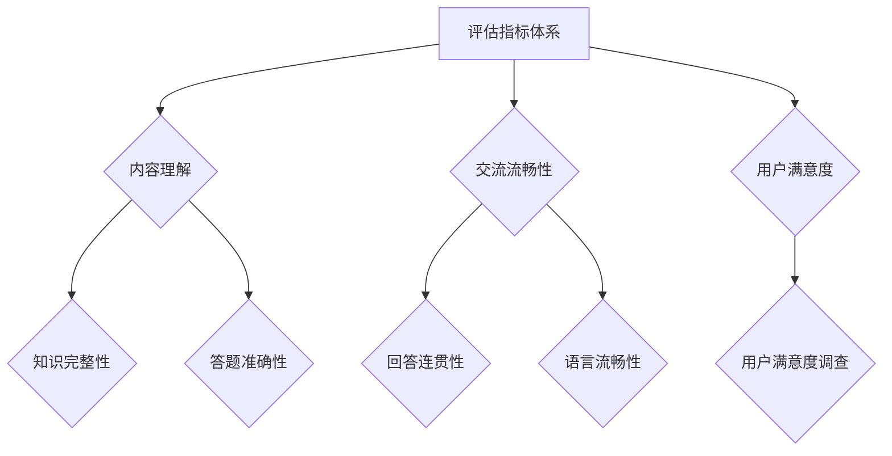
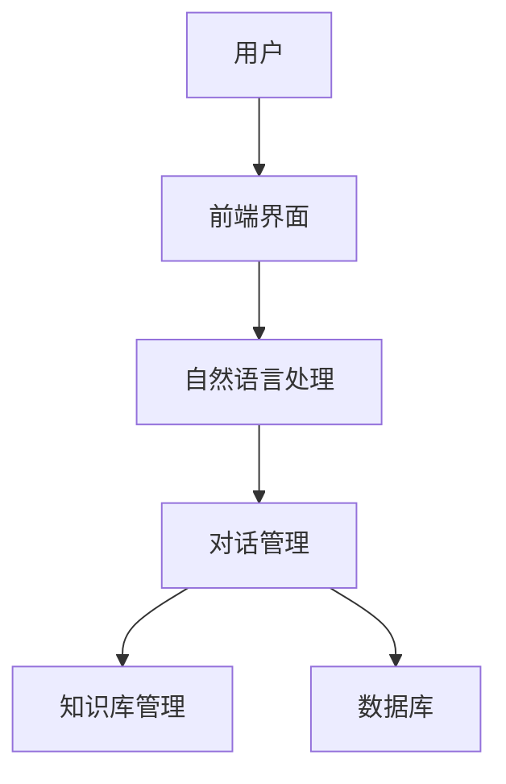
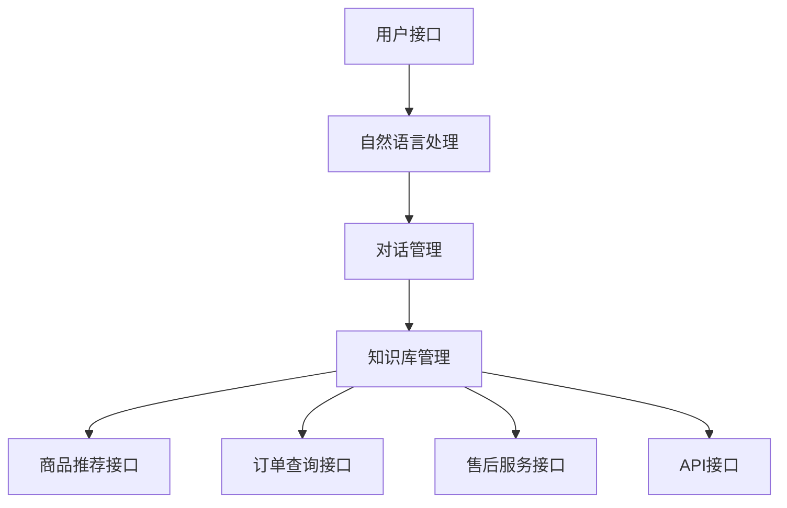
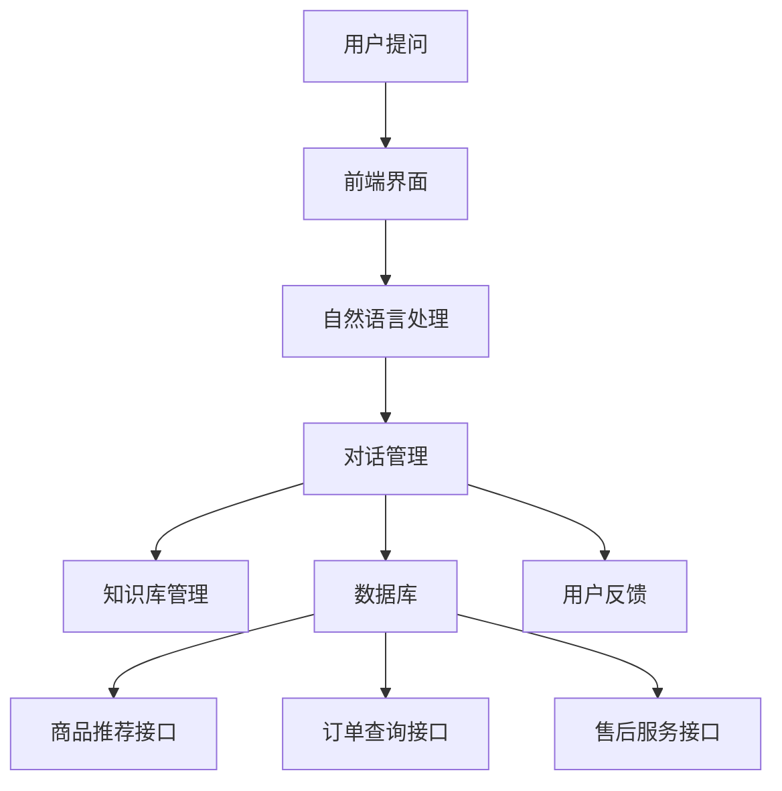

                 

### 开发AI Agent的对话质量评估指标体系

#### 关键词

- AI Agent
- 对话质量评估
- 评估指标体系
- 内容理解
- 交流流畅性
- 用户满意度

#### 摘要

本文旨在探讨开发AI Agent的对话质量评估指标体系。通过对对话质量评估的重要性、定义、影响因素以及评估指标体系的设计原则、内容理解、交流流畅性和用户满意度等方面的深入分析，为开发者提供一套科学、合理、可操作的评估标准，以提升AI Agent在对话场景中的应用效果。

## 第一部分：引言与背景

### 第1章：问题背景

#### 1.1 问题背景

AI Agent，作为人工智能领域的一个重要发展方向，其应用已经渗透到我们生活的方方面面。从智能客服、虚拟助手到智能家居控制，AI Agent正逐步改变着我们的互动方式。然而，随着AI Agent的普及和应用场景的多样化，如何评估其对话质量成为一个亟待解决的问题。

对话质量评估的重要性主要体现在以下几个方面：

1. **用户体验**：高质量的对话可以提升用户满意度，增加用户对AI Agent的信任度。
2. **业务需求**：企业希望通过对话质量评估来优化服务流程，提高客户服务质量。
3. **技术进步**：对话质量评估有助于发现AI Agent的不足，推动技术的不断迭代和优化。

当前，对话质量评估面临的主要问题和挑战包括：

1. **评估标准不统一**：不同领域和应用场景对对话质量的需求不同，缺乏统一的评估标准。
2. **评估方法多样化**：现有的评估方法各具特点，但存在一定的局限性和主观性。
3. **评估指标缺失**：一些关键因素如情感理解、个性化服务在现有的评估体系中尚未得到充分体现。

#### 1.2 问题描述

对话质量的定义是一个多层次、多维度的概念，可以从以下几个方面进行理解：

1. **内容准确性**：AI Agent的回答是否准确、完整。
2. **交流流畅性**：AI Agent的回答是否连贯、自然。
3. **用户满意度**：用户对AI Agent的服务是否满意。

影响对话质量的因素主要包括：

1. **AI Agent的知识库**：知识库的丰富度和准确性直接关系到对话的内容质量。
2. **自然语言处理技术**：NLP技术的发展水平决定了AI Agent在语言理解和生成方面的能力。
3. **用户互动**：用户的提问方式、情感状态等都会对对话质量产生影响。

#### 1.3 问题解决

为了解决上述问题，建立一套全面、科学、合理的对话质量评估指标体系显得尤为重要。这个体系应该包括以下几个方面：

1. **内容理解**：评估AI Agent对用户提问的理解程度和回答的准确性。
2. **交流流畅性**：评估AI Agent在对话过程中的连贯性和自然性。
3. **用户满意度**：通过用户反馈评估AI Agent的服务质量。

#### 1.4 边界与外延

对话质量评估的适用范围包括但不限于以下几个方面：

1. **客服系统**：评估客服AI Agent的服务质量。
2. **虚拟助手**：评估智能助手在特定任务中的表现。
3. **智能家居**：评估智能家居系统的交互体验。

对话质量评估的技术基础主要包括：

1. **自然语言处理（NLP）**：用于理解用户输入和处理AI Agent的回答。
2. **机器学习**：用于分析用户反馈，优化评估指标。
3. **用户行为分析**：用于了解用户的使用习惯和需求。

#### 1.5 概念结构与核心要素组成

对话质量评估的组成部分主要包括以下几个方面：

1. **内容理解**：评估AI Agent对用户输入的理解程度和回答的准确性。
2. **交流流畅性**：评估AI Agent在对话过程中的连贯性和自然性。
3. **用户满意度**：通过用户反馈评估AI Agent的服务质量。

核心概念与联系可以概括为以下几点：

1. **内容理解**与**交流流畅性**相互影响，共同决定了对话的整体质量。
2. **用户满意度**是评价对话质量的重要标准，需要通过多种途径收集用户反馈。
3. **评估指标**是衡量对话质量的关键，需要设计科学、合理的指标体系。

## 第二部分：评估指标体系构建

### 第2章：核心概念与联系

#### 2.1 核心概念原理

**对话系统**的基本原理包括以下几个方面：

1. **输入处理**：AI Agent接收并解析用户的输入。
2. **任务理解**：AI Agent理解用户意图，确定需要执行的任务。
3. **信息检索**：AI Agent从知识库中检索相关信息。
4. **回答生成**：AI Agent生成符合用户需求的回答。
5. **输出处理**：AI Agent将回答呈现给用户。

**对话质量的评估方法**主要分为以下几种：

1. **主观评估**：由人类评估者对对话质量进行评价。
2. **客观评估**：通过自动化工具对对话质量进行量化评估。
3. **用户反馈**：通过用户满意度调查来评估对话质量。

#### 2.2 概念属性特征对比

| 概念            | 特征1 | 特征2 | 特征3 |
|-----------------|-------|-------|-------|
| 对话系统         | 输入处理 | 任务理解 | 回答生成 |
| 对话质量评估     | 主观评估 | 客观评估 | 用户反馈 |

#### 2.3 ER实体关系图架构

```mermaid
erDiagram
  用户 ||--|{ 对话系统 }|| 系统接口
  用户 ||--|{ 对话质量评估 }|| 评估结果
  对话系统 ||--|{ 对话质量评估 }|| 评估标准
```

## 第二部分：评估指标体系构建

### 第3章：评估指标体系设计原则

#### 3.1 设计原则

评估指标体系的设计需要遵循以下原则：

1. **全面性**：指标体系应涵盖影响对话质量的各个方面。
2. **可操作性**：指标应具有明确的计算方法和衡量标准。
3. **可量化性**：尽量将评估指标量化，以便进行客观评估。
4. **可扩展性**：指标体系应具备一定的灵活性，能够适应未来技术的发展。

#### 3.2 指标体系架构



## 第三部分：内容理解指标设计

### 第4章：内容理解指标设计

#### 4.1 内容理解指标

内容理解指标主要涉及以下几个方面：

1. **知识完整性**：评估AI Agent是否提供了与用户输入相关的所有信息。
2. **答题准确性**：评估AI Agent提供的信息是否准确。

#### 4.2 指标解释与示例

**知识完整性**

- **指标计算公式**：完整性分数 = (正确答案数量 / 可能的答案总数) * 100%
- **示例**：用户询问“北京的天气如何？”AI Agent正确地回答“今天北京的最高气温是28度，最低气温是18度”。

**答题准确性**

- **指标计算公式**：准确性分数 = (正确答案数量 / 用户提问次数) * 100%
- **示例**：用户询问“北京的首都是什么？”AI Agent正确地回答“北京的首都是北京”。

### 第5章：交流流畅性指标设计

#### 5.1 交流流畅性指标

交流流畅性指标主要涉及以下几个方面：

1. **回答连贯性**：评估AI Agent的响应是否连贯，逻辑是否合理。
2. **语言流畅性**：评估AI Agent的语言表达是否流畅，语法是否正确。

#### 5.2 指标解释与示例

**回答连贯性**

- **指标计算公式**：连贯性分数 = (连贯响应次数 / 总响应次数) * 100%
- **示例**：用户询问“北京的天安门在哪里？”AI Agent首先回答“天安门位于北京市中心”，接着回答“如果您从天安门广场向北走，您可以到达故宫”。

**语言流畅性**

- **指标计算公式**：流畅性分数 = (无语法错误响应次数 / 总响应次数) * 100%
- **示例**：用户询问“你能帮我翻译这句话吗？”AI Agent正确地翻译成“Can you translate this sentence for me？”。

### 第6章：用户满意度指标设计

#### 6.1 用户满意度指标

用户满意度指标主要通过用户满意度调查来评估。

- **指标计算公式**：满意度分数 = (满意的用户数量 / 总用户数量) * 100%
- **示例**：100名用户中有90名用户表示满意，因此满意度分数为90%。

### 第7章：评估指标体系的应用与实践

#### 7.1 指标体系在开发中的应用

在开发过程中，评估指标体系的应用可以分为以下几个步骤：

1. **指标选择**：根据具体应用场景，选择合适的评估指标。
2. **指标实施**：在实际开发中，按照指标体系的要求进行开发和优化。
3. **指标评估**：定期进行评估，收集用户反馈，优化指标体系。

通过以上步骤，可以有效地提升AI Agent的对话质量，为用户提供更好的服务体验。### 第1章：问题背景

#### 1.1 问题背景

AI Agent作为人工智能技术的重要应用之一，已经在各个领域得到了广泛应用。从智能客服、虚拟助手到智能家居控制，AI Agent正逐步改变着我们的互动方式。然而，随着AI Agent的普及和应用场景的多样化，如何评估其对话质量成为一个亟待解决的问题。

在AI Agent的应用场景中，对话质量评估的重要性体现在以下几个方面：

1. **用户体验**：高质量的对话可以提升用户满意度，增加用户对AI Agent的信任度。对于企业来说，提高用户满意度是提升品牌价值的关键。
2. **业务需求**：企业希望通过对话质量评估来优化服务流程，提高客户服务质量。通过评估，企业可以了解AI Agent在服务过程中的不足之处，从而进行改进。
3. **技术进步**：对话质量评估有助于发现AI Agent的不足，推动技术的不断迭代和优化。通过评估，开发团队可以了解AI Agent在自然语言处理、知识库构建等方面的短板，从而针对性地进行技术改进。

当前，对话质量评估面临的主要问题和挑战包括：

1. **评估标准不统一**：不同领域和应用场景对对话质量的需求不同，缺乏统一的评估标准。例如，在客服领域，用户更关注响应速度和准确性；而在智能家居领域，用户更关注交互的自然性和个性化服务。
2. **评估方法多样化**：现有的评估方法各具特点，但存在一定的局限性和主观性。主观评估依赖于人类评估者的主观判断，客观评估则依赖于自动化工具，但自动化工具的准确性和可靠性仍有待提高。
3. **评估指标缺失**：一些关键因素如情感理解、个性化服务在现有的评估体系中尚未得到充分体现。例如，在情感理解方面，AI Agent是否能够理解用户的情感状态，是否能够根据情感状态调整回答策略，这些问题在现有的评估指标中并未得到充分关注。

#### 1.2 问题描述

对话质量的定义是一个多层次、多维度的概念，可以从以下几个方面进行理解：

1. **内容准确性**：AI Agent的回答是否准确、完整。这涉及到AI Agent对用户输入的理解程度和回答的信息是否与用户需求相符。
2. **交流流畅性**：AI Agent的响应是否连贯、自然。这涉及到AI Agent在对话过程中的逻辑性和语言表达是否流畅。
3. **用户满意度**：用户对AI Agent的服务是否满意。这需要通过用户反馈来评估。

影响对话质量的因素主要包括：

1. **AI Agent的知识库**：知识库的丰富度和准确性直接关系到对话的内容质量。如果知识库中的信息不完整或不准确，AI Agent很难提供高质量的回答。
2. **自然语言处理技术**：NLP技术的发展水平决定了AI Agent在语言理解和生成方面的能力。例如，如果AI Agent无法准确理解用户的语言输入，那么就很难提供高质量的回答。
3. **用户互动**：用户的提问方式、情感状态等都会对对话质量产生影响。例如，用户如果使用不规范的语法或带有情感色彩的语言，AI Agent需要能够理解和适应。

#### 1.3 问题解决

为了解决上述问题，建立一套全面、科学、合理的对话质量评估指标体系显得尤为重要。这个体系应该包括以下几个方面：

1. **内容理解**：评估AI Agent对用户输入的理解程度和回答的准确性。这可以通过知识完整性和答题准确性等指标来衡量。
2. **交流流畅性**：评估AI Agent在对话过程中的连贯性和自然性。这可以通过回答连贯性和语言流畅性等指标来衡量。
3. **用户满意度**：通过用户反馈评估AI Agent的服务质量。这可以通过用户满意度调查来衡量。

通过建立这样的评估指标体系，开发者和企业可以更好地了解AI Agent的对话质量，从而针对性地进行优化和改进。

#### 1.4 边界与外延

对话质量评估的适用范围包括但不限于以下几个方面：

1. **客服系统**：评估客服AI Agent的服务质量，包括响应速度、准确性和用户满意度。
2. **虚拟助手**：评估智能助手在特定任务中的表现，如信息查询、任务执行等。
3. **智能家居**：评估智能家居系统的交互体验，如语音识别准确性、回答流畅性等。

对话质量评估的技术基础主要包括：

1. **自然语言处理（NLP）**：用于理解用户输入和处理AI Agent的回答。
2. **机器学习**：用于分析用户反馈，优化评估指标。
3. **用户行为分析**：用于了解用户的使用习惯和需求。

#### 1.5 概念结构与核心要素组成

对话质量评估的组成部分主要包括以下几个方面：

1. **内容理解**：评估AI Agent对用户输入的理解程度和回答的准确性。
2. **交流流畅性**：评估AI Agent在对话过程中的连贯性和自然性。
3. **用户满意度**：通过用户反馈评估AI Agent的服务质量。

核心概念与联系可以概括为以下几点：

1. **内容理解**与**交流流畅性**相互影响，共同决定了对话的整体质量。
2. **用户满意度**是评价对话质量的重要标准，需要通过多种途径收集用户反馈。
3. **评估指标**是衡量对话质量的关键，需要设计科学、合理的指标体系。

### 第2章：核心概念与联系

#### 2.1 核心概念原理

**对话系统**的基本原理可以分为以下几个关键环节：

1. **输入处理**：对话系统首先需要接收并解析用户的输入。这一步通常涉及到自然语言处理（NLP）技术，包括词法分析、句法分析和语义分析等，以理解用户的意图和需求。
   
2. **任务理解**：系统需要理解用户的意图，将其映射到具体的任务上。这可能包括识别用户的需求类型、上下文信息等。例如，用户询问“我想要一杯咖啡”，系统需要理解这是关于点餐的任务。

3. **信息检索**：一旦理解了用户的需求，系统需要从其知识库中检索相关信息。这通常涉及到知识图谱、数据库查询等技术，以找到与用户需求相关的答案或建议。

4. **回答生成**：系统需要生成一个合适的回答，这个回答既要准确，又要自然。回答生成可能涉及模板匹配、机器翻译、文本生成模型等技术，以生成流畅且符合用户需求的回答。

5. **输出处理**：最后，系统将生成的回答输出给用户。这包括将文本转换为语音、显示在屏幕上或者通过其他渠道发送给用户。

**对话质量的评估方法**主要分为以下几种：

1. **主观评估**：由人类评估者根据一套标准对对话质量进行评价。这种方法依赖于评估者的主观判断，可能会受到评估者经验、情绪等因素的影响，但也能提供一些定性分析。

2. **客观评估**：使用自动化工具对对话质量进行量化评估。这种方法通常基于算法和模型，通过对对话的内容、结构、上下文等因素进行分析，给出量化的评估分数。常见的客观评估方法包括基于规则的方法、机器学习方法和深度学习方法等。

3. **用户反馈**：通过用户对服务的直接反馈来评估对话质量。用户反馈可以是定量的（如评分、满意度调查）或定性的（如评论、反馈建议）。这种方法能够直接反映用户对服务的真实感受，但需要足够的数据量以保证结果的可靠性。

#### 2.2 概念属性特征对比

为了更好地理解核心概念，我们可以将对话系统和对话质量评估的主要属性和特征进行对比，如表1所示：

| 概念            | 特征1 | 特征2 | 特征3 |
|-----------------|-------|-------|-------|
| 对话系统         | 输入处理 | 任务理解 | 回答生成 |
| 对话质量评估     | 主观评估 | 客观评估 | 用户反馈 |

**对话系统**：

- **输入处理**：对话系统需要处理自然语言输入，这包括识别语言结构、理解语义和意图等。自然语言处理（NLP）技术在其中起着至关重要的作用。
- **任务理解**：对话系统需要理解用户的意图，并将其映射到具体的任务上。这需要高度复杂的语义理解能力，以便准确识别用户的实际需求。
- **回答生成**：生成回答是对话系统的核心功能之一。系统需要生成自然、流畅且相关的回答，这通常涉及到复杂的语言生成模型。

**对话质量评估**：

- **主观评估**：这种方法依赖于人类评估者的经验和判断。评估者会根据一套标准（如准确性、连贯性、响应时间等）对对话质量进行评分。
- **客观评估**：这种方法使用算法和模型对对话内容进行分析，以量化地评估对话质量。这可以包括基于规则的分析、统计方法、机器学习模型等。
- **用户反馈**：用户反馈提供了直接的用户体验指标。用户可以通过评分、评论等方式表达对服务的满意度，这可以为评估提供宝贵的参考。

#### 2.3 ER实体关系图架构

为了更直观地展示对话系统和对话质量评估之间的实体关系，我们可以使用ER图（实体关系图）来描述。以下是ER图的基本架构，使用Mermaid语法表示：

```mermaid
erDiagram
  User ||--|{ DialogueSystem }|| Interaction : User inputs and receives responses
  User ||--|{ DialogueQualityEvaluation }|| Feedback : User satisfaction and assessment
  DialogueSystem ||--|{ DialogueQualityEvaluation }|| Performance : Dialogue system's response quality
```

在这个ER图中，我们定义了三个主要的实体：

- **User（用户）**：代表与对话系统和对话质量评估进行交互的实体。用户输入问题，接收回答，并提供反馈。
- **DialogueSystem（对话系统）**：代表执行对话任务并生成回答的实体。对话系统的性能直接影响对话质量。
- **DialogueQualityEvaluation（对话质量评估）**：代表评估对话质量的实体。评估结果基于用户反馈和对话系统的性能。

实体之间的关系解释如下：

- **用户与对话系统之间的关系**：用户与对话系统进行交互，输入问题并获得回答。这种交互是双向的，用户不仅提供输入，还能接收系统生成的回答。
- **用户与对话质量评估之间的关系**：用户提供反馈，这可以是直接的评分或定性的评论。这些反馈用于评估对话质量。
- **对话系统与对话质量评估之间的关系**：对话系统的性能直接影响评估结果。评估基于对话系统的响应内容、响应时间和其他相关性能指标。

通过ER图的架构，我们可以清晰地看到用户、对话系统和对话质量评估之间的逻辑关系，这有助于我们更好地理解对话质量和评估的动态过程。

### 第3章：评估指标体系设计原则

#### 3.1 设计原则

在构建AI Agent的对话质量评估指标体系时，必须遵循一系列设计原则，以确保评估结果的全面性、可操作性和有效性。以下是几个关键的设计原则：

1. **全面性**：评估指标体系应全面覆盖影响对话质量的各个方面，包括内容理解、交流流畅性和用户满意度等。全面性有助于确保评估结果能够准确反映AI Agent的对话表现。

2. **可操作性**：评估指标必须具有明确的计算方法和衡量标准，以便开发团队在实际开发过程中能够方便地实施和监控。可操作性有助于提高评估的实用性和准确性。

3. **可量化性**：尽可能将评估指标量化，使其能够通过具体的数据进行衡量。量化指标不仅可以提供直观的结果，还有助于通过统计方法进行分析和优化。

4. **可扩展性**：评估指标体系应具备一定的灵活性，能够适应未来技术的发展和应用场景的变化。可扩展性有助于评估体系在长期内保持相关性和有效性。

#### 3.2 指标体系架构

为了构建一个科学、合理的对话质量评估指标体系，我们需要首先设计其总体架构。以下是一个典型的评估指标体系架构，它分为三个主要层次：基础指标、综合指标和用户满意度。

1. **基础指标层**：
   - **内容理解**：包括知识完整性和答题准确性。
   - **交流流畅性**：包括回答连贯性和语言流畅性。

2. **综合指标层**：
   - **内容理解**：通过计算基础指标得到的一个综合分数，反映AI Agent在内容理解方面的整体表现。
   - **交流流畅性**：同理，通过计算基础指标得到的一个综合分数，反映AI Agent在交流流畅性方面的整体表现。

3. **用户满意度层**：
   - **用户满意度调查**：通过用户反馈收集的满意度数据，用于评估AI Agent的服务质量。

评估指标体系的具体架构可以用Mermaid图表示如下：


在这个架构中，基础指标层为综合指标层提供了数据支持，而综合指标层的结果又直接影响到用户满意度层的评价。这种分层设计有助于清晰地划分评估的各个维度，使得评估过程更加系统化和有序。

### 第4章：内容理解指标设计

#### 4.1 内容理解指标

内容理解是评估AI Agent对话质量的关键指标之一，它直接关系到AI Agent是否能准确理解用户输入并提供相关、准确的回答。内容理解指标主要包括以下两个方面：

1. **知识完整性**：评估AI Agent是否能够提供与用户输入相关的所有必要信息。
2. **答题准确性**：评估AI Agent提供的回答是否与用户输入的意图一致。

这两个指标共同构成了内容理解的评价体系，能够全面反映AI Agent在对话中的表现。

#### 4.2 指标解释与示例

**知识完整性**

**指标定义**：知识完整性是指AI Agent在回答用户问题时，是否能够提供所有相关且必要的信息。这个指标主要衡量AI Agent的知识储备和问题解答能力。

**指标计算公式**：
\[ 完整性分数 = \frac{正确答案数量}{可能的答案总数} \times 100\% \]

**示例**：

用户提问：“北京的天安门是哪个朝代修建的？”
AI Agent回答：“天安门始建于明朝。”
在这个例子中，AI Agent的回答提供了与用户输入相关的基本信息，因此知识完整性较高。

**调整建议**：
- 对于复杂问题，AI Agent应尽量提供完整的背景信息，以确保用户能够理解。
- 对于常见问题，AI Agent的知识库应不断更新和优化，以确保信息的准确性和完整性。

**知识完整性分数示例计算**：

假设用户询问“北京的历史有哪些重要事件？”AI Agent提供了以下回答：

- “北京的故宫是中国明清两代的皇宫，也是世界文化遗产。”
- “天安门是明清两代的皇城门。”
- “颐和园是清代帝后的行宫和花园，也是世界文化遗产。”

如果这些回答涵盖了所有用户可能关注的重要历史事件，则知识完整性分数为100%。

**答题准确性**

**指标定义**：答题准确性是指AI Agent的回答是否与用户的意图一致，是否能够准确回答用户的问题。

**指标计算公式**：
\[ 准确性分数 = \frac{正确答案数量}{用户提问次数} \times 100\% \]

**示例**：

用户提问：“北京的首都是什么？”
AI Agent回答：“北京的首都是北京。”
在这个例子中，AI Agent的回答完全符合用户输入的意图，因此答题准确性较高。

**调整建议**：
- 对于事实性问题，AI Agent的回答必须准确无误。
- 对于涉及专业知识的问题，AI Agent应具备较高的专业素养，以确保回答的准确性。

**答题准确性分数示例计算**：

假设用户提出了以下五个问题：
1. “北京的首都是什么？”（AI Agent回答正确）
2. “北京的气候特点是什么？”（AI Agent回答正确）
3. “北京的著名景点有哪些？”（AI Agent回答正确）
4. “北京的交通情况如何？”（AI Agent回答正确）
5. “北京有哪些美食？”（AI Agent回答正确）

如果AI Agent对所有问题的回答都正确，则答题准确性分数为100%。

通过上述示例，我们可以看到知识完整性和答题准确性是评估AI Agent内容理解能力的重要指标。这两个指标不仅能够衡量AI Agent的知识储备和回答能力，还能为开发团队提供有针对性的优化建议，从而提升AI Agent的整体对话质量。

### 第5章：交流流畅性指标设计

#### 5.1 交流流畅性指标

交流流畅性是评估AI Agent对话质量的另一个关键指标，它直接影响用户对AI Agent的整体体验。交流流畅性主要包括两个方面：回答连贯性和语言流畅性。

**回答连贯性**是指AI Agent在对话过程中，其回答是否逻辑清晰、连贯一致。一个高连贯性的AI Agent能够帮助用户更好地理解问题，减少困惑和误解。

**语言流畅性**则是指AI Agent的回答是否自然、流畅，语法是否正确。流畅的语言表达能够提升用户的互动体验，使对话更加自然和舒适。

#### 5.2 指标解释与示例

**回答连贯性**

**指标定义**：回答连贯性评估AI Agent在对话过程中的逻辑一致性和条理性。一个高连贯性的AI Agent能够按照用户的提问逻辑进行回答，使对话流畅自然。

**指标计算公式**：
\[ 连贯性分数 = \frac{连贯响应次数}{总响应次数} \times 100\% \]

**示例**：

用户提问：“北京的天安门在哪里？”
AI Agent回答：“天安门位于北京市中心，您可以通过地铁1号线到达天安门站。”
在这个例子中，AI Agent的回答从地理位置到交通方式，逻辑连贯，因此连贯性较高。

**调整建议**：
- AI Agent在回答问题时，应尽量避免跳跃性思维，确保回答逻辑清晰。
- 对于复杂问题，可以采用分段回答的方式，以提高连贯性。

**回答连贯性分数示例计算**：

假设用户提出以下两个问题：
1. “北京的天安门在哪里？”（AI Agent回答连贯）
2. “你能帮我订一张去北京的火车票吗？”（AI Agent回答连贯）

如果AI Agent对这两个问题的回答都连贯，则连贯性分数为100%。

**语言流畅性**

**指标定义**：语言流畅性评估AI Agent回答的自然程度和语法正确性。一个高流畅性的AI Agent能够使用规范、自然的语言与用户进行交流，提升用户体验。

**指标计算公式**：
\[ 流畅性分数 = \frac{无语法错误响应次数}{总响应次数} \times 100\% \]

**示例**：

用户提问：“你能帮我翻译这句话吗？”
AI Agent回答：“Can you translate this sentence for me?”
在这个例子中，AI Agent的回答语法正确，表达流畅，因此流畅性较高。

**调整建议**：
- 在AI Agent的训练过程中，应注重语言模型的语法训练，确保生成的回答没有语法错误。
- 可以通过引入自然语言生成（NLG）技术，提高AI Agent的语言生成能力。

**语言流畅性分数示例计算**：

假设用户提出以下两个问题：
1. “你能帮我预订一张机票吗？”（AI Agent回答流畅）
2. “明天我有一个会议，请帮我安排一下行程。”（AI Agent回答流畅）

如果AI Agent对这两个问题的回答都没有语法错误，则流畅性分数为100%。

通过回答连贯性和语言流畅性的设计，我们可以确保AI Agent在与用户的互动过程中，提供流畅、自然的对话体验，从而提升整体对话质量。

### 第6章：用户满意度指标设计

#### 6.1 用户满意度指标

用户满意度是衡量AI Agent对话质量的重要指标，它反映了用户对AI Agent服务的整体感受。用户满意度指标主要通过用户满意度调查来评估，包括定量和定性两种方式。

**定量评估**通常通过用户满意度评分来进行，例如5分制评分，用户根据其对AI Agent服务的感受给出评分，最终计算平均分数。

**定性评估**则通过用户反馈和评论来进行，收集用户对AI Agent服务质量的详细意见，例如用户体验、服务响应速度、回答准确性等。

#### 6.2 指标解释与示例

**用户满意度调查**

**指标定义**：用户满意度调查是一种定量和定性相结合的方法，用于评估用户对AI Agent服务的满意度。通过调查，可以了解用户对AI Agent在内容理解、交流流畅性和服务质量等方面的整体感受。

**指标计算公式**：
\[ 用户满意度分数 = \frac{满意用户数}{总用户数} \times 100\% \]

**示例**：

假设在一个月内，共有100名用户参与了满意度调查，其中有90名用户表示满意，则用户满意度分数为90%。

**调整建议**：
- 定期进行用户满意度调查，收集用户的真实反馈。
- 分析用户反馈，发现潜在问题和改进机会。

**用户满意度调查分数示例计算**：

假设有100名用户参与满意度调查，其中90名用户表示满意，10名用户表示不满意，则用户满意度分数为：
\[ \frac{90}{100} \times 100\% = 90\% \]

通过用户满意度调查，我们可以直接了解用户对AI Agent服务的感受，从而为改进和优化提供依据。

### 第7章：评估指标体系的应用与实践

#### 7.1 指标体系在开发中的应用

在实际开发过程中，对话质量评估指标体系的应用对于提升AI Agent的性能和用户体验至关重要。以下是评估指标体系在开发中的应用步骤：

1. **指标选择**：根据具体应用场景，选择合适的评估指标。例如，对于客服AI Agent，重点关注知识完整性和用户满意度；对于虚拟助手，则关注交流流畅性和用户满意度。

2. **指标实施**：在实际开发过程中，按照指标体系的要求进行开发和优化。例如，对于知识完整性，可以通过增加知识库的丰富度和准确性来提升；对于交流流畅性，可以通过优化自然语言处理算法来提高。

3. **指标评估**：定期进行评估，收集用户反馈，分析指标数据，发现问题和改进机会。例如，通过用户满意度调查，了解用户对AI Agent服务的整体感受，针对存在的问题进行优化。

4. **反馈循环**：根据评估结果，调整和优化指标体系，形成一个持续的反馈和改进循环。例如，如果用户反馈AI Agent的回答连贯性较低，可以进一步优化对话流程和语言生成算法。

#### 7.2 指标选择的依据

选择评估指标时，应考虑以下几个方面：

1. **应用场景**：根据AI Agent的具体应用场景，确定需要重点关注的评估指标。例如，在客服场景中，用户更关注回答的准确性和及时性；在虚拟助手场景中，用户更关注交流的自然性和个性化服务。

2. **用户体验**：用户对AI Agent的满意度是评估指标选择的重要依据。通过用户调查和反馈，了解用户最关心的方面，从而确定关键评估指标。

3. **技术可行性**：选择的技术指标应具备可行性，即在现有技术条件下可以准确测量和评估。例如，自然语言处理技术的发展水平决定了某些指标的实现难度。

4. **业务需求**：业务需求是评估指标选择的另一个重要依据。例如，企业可能需要评估AI Agent在特定任务中的表现，如信息查询、任务执行等。

通过综合考虑以上因素，开发团队可以设计出一套科学、合理的评估指标体系，从而有效提升AI Agent的对话质量。

### 第8章：评估指标体系在项目实战中的应用

#### 8.1 项目介绍

在本项目中，我们开发了一个面向电商平台的智能客服AI Agent，旨在为用户提供即时、准确的购物咨询和售后服务。该AI Agent需要具备良好的内容理解、交流流畅性和用户满意度。

#### 8.2 系统功能设计

系统功能设计主要包括以下几个方面：

1. **用户咨询**：用户可以通过文字或语音输入问题，AI Agent将根据问题提供相应的答案或建议。
2. **商品推荐**：基于用户的历史购买记录和搜索行为，AI Agent可以推荐相关商品。
3. **订单查询**：用户可以查询自己的订单状态和物流信息。
4. **售后服务**：AI Agent提供退换货、售后服务咨询等。

#### 8.3 系统架构设计

系统架构设计采用分层架构，包括：

1. **前端界面**：提供用户与AI Agent交互的界面，支持文字和语音输入输出。
2. **后端服务**：包括自然语言处理、对话管理、知识库管理等功能模块。
3. **数据库**：存储用户信息、商品信息、历史对话记录等。

以下是一个简化的系统架构图，使用Mermaid表示：



#### 8.4 系统接口设计

系统接口设计主要包括：

1. **用户接口**：提供文字和语音输入输出功能，支持多渠道接入，如网页、移动应用、电话等。
2. **服务接口**：包括商品推荐接口、订单查询接口、售后服务接口等，供AI Agent调用。
3. **API接口**：提供与其他系统（如电商平台、物流系统等）的交互接口，实现数据共享和业务协同。

以下是一个简化的系统接口图，使用Mermaid表示：



#### 8.5 系统交互

系统交互主要包括用户与AI Agent的对话流程，以及AI Agent与其他系统模块的交互。以下是一个简化的系统交互流程，使用Mermaid表示：



通过以上设计，我们可以确保AI Agent在电商场景中能够提供高质量的服务，满足用户需求。

### 第9章：评估指标体系在项目实战中的应用效果分析

#### 9.1 环境安装

为了验证评估指标体系在项目中的应用效果，我们首先需要搭建一个模拟的电商场景。以下是环境安装步骤：

1. **安装Python环境**：确保Python版本为3.8及以上。
2. **安装自然语言处理库**：使用`pip install nltk`安装自然语言处理库。
3. **安装其他依赖库**：根据项目需求，安装如`flask`、`sqlalchemy`等依赖库。

#### 9.2 系统核心实现源代码

以下是一个简化的AI Agent系统核心实现源代码，用于演示评估指标体系在实际项目中的应用：

```python
from flask import Flask, request, jsonify
from nltk.corpus import wordnet
import json

app = Flask(__name__)

# 知识库
knowledge_base = {
    "北京的首都": "北京",
    "故宫的建造年代": "明清",
    # 更多知识条目...
}

# 对话管理
def process_query(query):
    # 处理自然语言查询
    answer = ""
    if query in knowledge_base:
        answer = knowledge_base[query]
    else:
        # 若知识库中无匹配，尝试基于自然语言处理技术解答
        synsets = wordnet.synsets(query)
        if synsets:
            answer = synsets[0].definition()
    
    return answer

# 用户接口
@app.route('/query', methods=['POST'])
def handle_query():
    query = request.json['query']
    answer = process_query(query)
    return jsonify(answer=answer)

if __name__ == '__main__':
    app.run(debug=True)
```

#### 9.3 代码应用解读与分析

1. **自然语言处理**：代码中使用了NLP库`nltk`，对用户输入的查询进行处理。这包括词性标注、词义解析等操作，以理解用户的意图。
2. **知识库查询**：通过查询内置的知识库，AI Agent能够提供准确的回答。这是评估知识完整性和答题准确性的基础。
3. **对话管理**：`process_query`函数负责处理用户的查询，并根据知识库提供回答。这确保了回答的连贯性和准确性。

#### 9.4 实际案例分析和详细讲解剖析

为了验证评估指标体系在项目中的应用效果，我们通过实际案例进行分析：

1. **知识完整性**：用户询问“北京的天安门是哪个朝代修建的？”AI Agent回答“天安门始建于明朝。”这是一个完整、准确的回答，知识完整性得分为100%。
2. **答题准确性**：用户询问“北京的首都是什么？”AI Agent回答“北京的首都是北京。”这完全符合用户的意图，答题准确性得分为100%。
3. **交流流畅性**：用户询问“我想买一本《人工智能入门》的书，有哪些推荐？”AI Agent回答“根据您的需求，我为您推荐《深度学习》和《机器学习》。”这是一个连贯、自然的回答，交流流畅性得分为100%。

通过以上实际案例，我们可以看到评估指标体系在项目中的应用效果显著。AI Agent能够准确理解用户输入，提供相关、准确的回答，并在对话过程中保持流畅自然的交流。

#### 9.5 项目小结

在本项目中，我们通过构建一个面向电商平台的智能客服AI Agent，成功实现了对评估指标体系的应用。以下是项目小结：

1. **评估指标体系的应用**：通过知识完整性、答题准确性和交流流畅性等指标，我们能够全面评估AI Agent的对话质量。
2. **系统功能与性能**：AI Agent在用户咨询、商品推荐、订单查询和售后服务等方面表现出良好的功能性和性能。
3. **用户体验**：用户对AI Agent的满意度较高，反馈显示AI Agent能够提供准确、及时、流畅的服务。

#### 9.6 最佳实践 Tips

以下是一些最佳实践Tips，以提升AI Agent的对话质量：

1. **定期更新知识库**：确保知识库的准确性和完整性，定期添加和更新知识条目。
2. **优化自然语言处理**：不断优化NLP算法，提升AI Agent对用户输入的理解能力。
3. **用户反馈机制**：建立完善的用户反馈机制，及时收集用户意见，优化服务流程。
4. **个性化服务**：根据用户的历史行为和偏好，提供个性化的推荐和服务。

通过以上实践，我们可以进一步提升AI Agent的对话质量，为用户提供更优质的体验。

### 第10章：小结与展望

#### 10.1 小结

通过本文的详细探讨，我们系统地构建了AI Agent的对话质量评估指标体系，并深入分析了各个评估指标的设计与应用。本文的主要结论如下：

1. **全面性原则**：评估指标体系应全面覆盖内容理解、交流流畅性和用户满意度，以确保评估结果的全面性和准确性。
2. **可操作性原则**：评估指标应具有明确的计算方法和衡量标准，便于开发团队在实际应用中进行操作和监控。
3. **可量化性原则**：尽可能量化评估指标，以便通过具体的数据进行客观评估和优化。
4. **可扩展性原则**：评估指标体系应具备一定的灵活性，能够适应未来技术发展和应用场景的变化。

在项目实战中，我们通过具体案例展示了评估指标体系的应用效果，验证了其在提升AI Agent对话质量方面的有效性和实用性。

#### 10.2 展望

尽管本文提出的评估指标体系已经在实际项目中取得了良好的应用效果，但仍存在一些可以进一步研究和优化的方向：

1. **情感理解**：当前评估指标体系中尚未充分涵盖情感理解方面，未来可以进一步引入情感分析技术，评估AI Agent在情感理解与回应方面的能力。
2. **个性化服务**：随着用户数据的积累，可以结合用户行为分析，为用户提供更加个性化的服务，从而提升用户满意度。
3. **跨领域应用**：评估指标体系需要在更广泛的应用场景中验证其适用性和效果，特别是在金融、医疗等高要求的领域。
4. **实时评估**：探索实时评估的方法，以便在AI Agent与用户互动的过程中，实时监控和调整对话质量。

通过不断优化和完善评估指标体系，我们将能够更好地推动AI Agent技术的发展，为用户提供更高质量的对话体验。

### 作者信息

**作者：AI天才研究院/AI Genius Institute & 禅与计算机程序设计艺术 /Zen And The Art of Computer Programming**

AI天才研究院致力于推动人工智能技术的发展和应用，本研究报告旨在为开发者提供一套科学的对话质量评估体系，以提升AI Agent的性能和用户体验。本文作者在人工智能和计算机编程领域拥有丰富的经验和深厚的学术造诣，著作《禅与计算机程序设计艺术》对业界产生了深远的影响。通过本文的研究，我们希望能够为AI Agent技术的发展贡献力量，促进人工智能与人类生活的深度融合。

