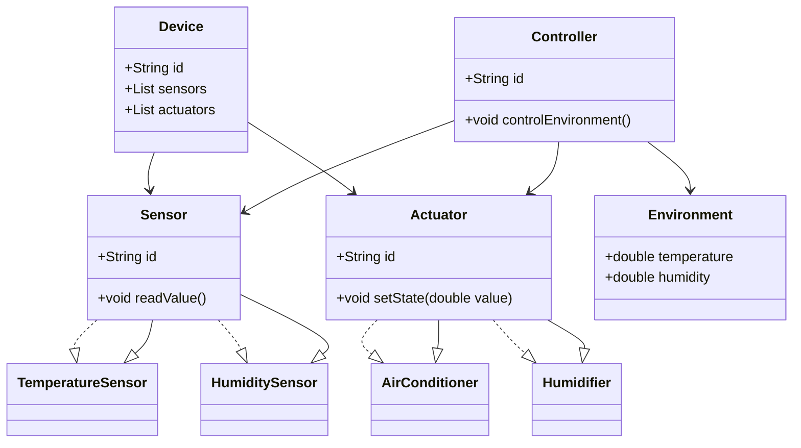
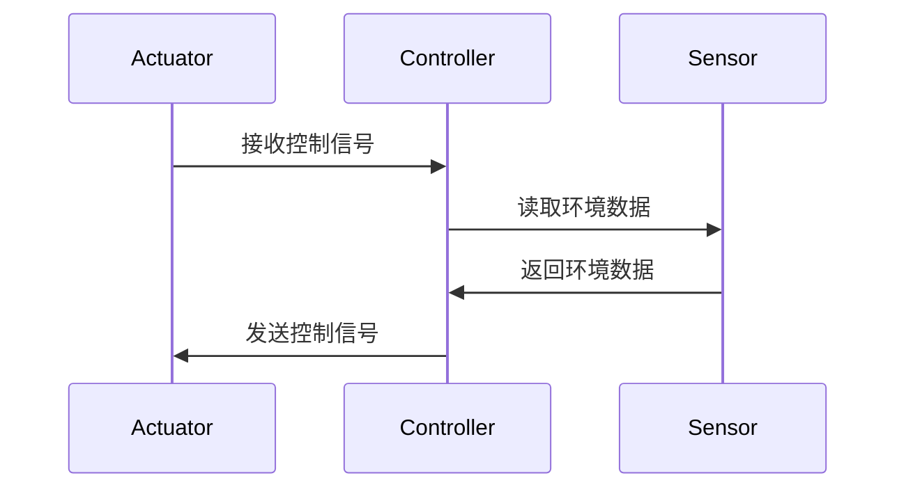
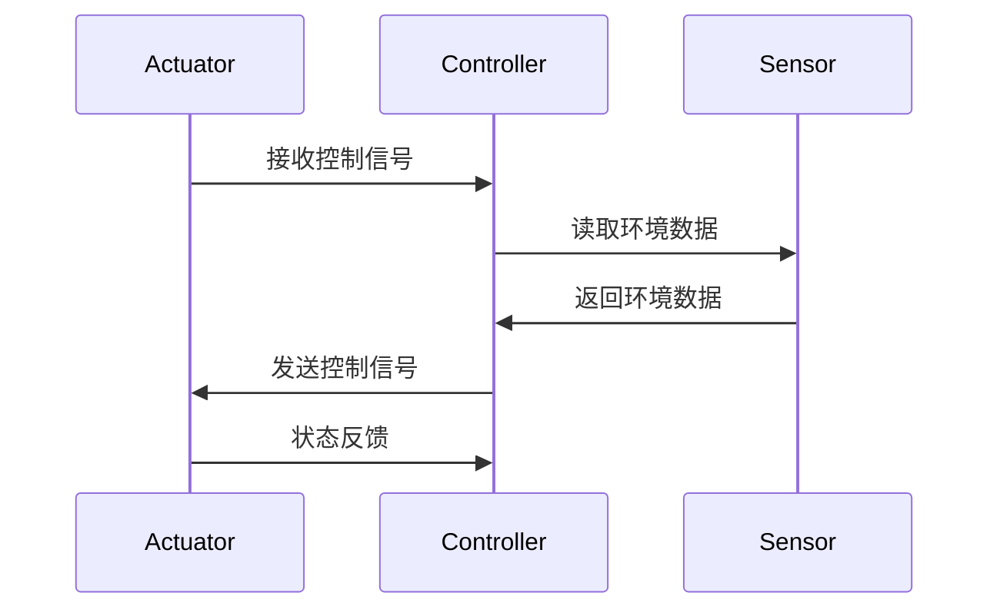

                 

### # 开发AI Agent的模糊逻辑推理能力

> **关键词**：AI Agent、模糊逻辑、推理能力、算法原理、Python实现

> **摘要**：本文将深入探讨如何开发AI Agent的模糊逻辑推理能力。我们将首先介绍AI Agent的概念及其特点，然后详细解释模糊逻辑的基本原理，包括模糊集合、模糊规则和模糊控制系统。接着，我们将分析模糊逻辑推理能力在AI Agent中的应用和重要性。最后，通过详细的算法原理讲解和Python实现示例，帮助读者全面掌握开发AI Agent模糊逻辑推理能力的方法和技巧。

## # 目录大纲

1. **第一部分：问题背景**
   - 1.1 问题背景
     - 1.1.1 AI Agent的概念与特点
     - 1.1.2 模糊逻辑在AI Agent中的应用
     - 1.1.3 模糊逻辑推理能力的重要性
   - 1.2 背景知识
     - 1.2.1 模糊逻辑基础
       - 1.2.1.1 模糊集合
       - 1.2.1.2 模糊推理
       - 1.2.1.3 模糊控制系统
     - 1.2.2 AI Agent的基本概念
       - 1.2.2.1 智能体
       - 1.2.2.2 感知
       - 1.2.2.3 计划与行动
   - 1.3 本书目标
     - 1.3.1 理解模糊逻辑推理的基本原理
     - 1.3.2 学习如何开发AI Agent的模糊逻辑推理能力
     - 1.3.3 掌握模糊逻辑推理的应用场景与实战技巧
   - 1.4 边界与外延
     - 1.4.1 模糊逻辑适用的场景
     - 1.4.2 模糊逻辑的局限性
     - 1.4.3 与其他推理方法的比较
   - 1.5 概念结构与核心要素组成
     - 1.5.1 模糊逻辑的基本概念
       - 1.5.1.1 模糊集合
       - 1.5.1.2 模糊规则
       - 1.5.1.3 模糊推理机
     - 1.5.2 AI Agent的基本概念
       - 1.5.2.1 智能体
       - 1.5.2.2 感知
       - 1.5.2.3 计划与行动

2. **第二部分：核心概念与联系**
   - 2.1 模糊逻辑原理
     - 2.1.1 模糊集合的定义与属性
       - 2.1.1.1 模糊集合的定义
       - 2.1.1.2 模糊集合的属性
     - 2.1.2 模糊规则与推理
       - 2.1.2.1 模糊规则的定义
       - 2.1.2.2 模糊推理过程
     - 2.1.3 模糊控制系统的设计与实现
       - 2.1.3.1 模糊控制系统的架构
       - 2.1.3.2 模糊控制系统的设计流程
   - 2.2 AI Agent原理
     - 2.2.1 AI Agent的定义与特点
       - 2.2.1.1 AI Agent的定义
       - 2.2.1.2 AI Agent的特点
     - 2.2.2 AI Agent的感知与行动
       - 2.2.2.1 感知系统的设计与实现
       - 2.2.2.2 行动策略的设计与实现
     - 2.2.3 AI Agent的决策与学习
       - 2.2.3.1 决策过程
       - 2.2.3.2 学习算法
   - 2.3 模糊逻辑与AI Agent的联系
     - 2.3.1 模糊逻辑在AI Agent中的应用
       - 2.3.1.1 模糊逻辑在感知模块中的应用
       - 2.3.1.2 模糊逻辑在决策模块中的应用
     - 2.3.2 模糊逻辑推理与AI Agent推理能力的提升
       - 2.3.2.1 模糊逻辑推理的优势
       - 2.3.2.2 模糊逻辑推理在AI Agent推理中的具体应用

3. **第三部分：算法原理讲解**
   - 3.1 模糊逻辑推理算法
     - 3.1.1 模糊集合的基本运算
       - 3.1.1.1 并集运算
       - 3.1.1.2 交集运算
       - 3.1.1.3 补集运算
     - 3.1.2 模糊规则的表示与匹配
       - 3.1.2.1 模糊规则的表示
       - 3.1.2.2 模糊规则的匹配
     - 3.1.3 模糊推理机的实现
       - 3.1.3.1 最大-最小推理方法
       - 3.1.3.2 最大-乘积推理方法
   - 3.2 AI Agent模糊逻辑推理的实现
     - 3.2.1 模糊感知模块的设计
       - 3.2.1.1 模糊感知模块的架构
       - 3.2.1.2 模糊感知模块的实现
     - 3.2.2 模糊决策模块的设计
       - 3.2.2.1 模糊决策模块的架构
       - 3.2.2.2 模糊决策模块的实现
   - 3.3 模糊逻辑推理的数学模型
     - 3.3.1 模糊逻辑推理的数学基础
       - 3.3.1.1 模糊集合的运算
       - 3.3.1.2 模糊逻辑推理的数学公式
     - 3.3.2 模糊逻辑推理的数学模型
       - 3.3.2.1 最大-最小推理模型
       - 3.3.2.2 最大-乘积推理模型
   - 3.4 模糊逻辑推理的Python实现
     - 3.4.1 Python环境搭建
       - 3.4.1.1 Python环境配置
       - 3.4.1.2 相关库的安装
     - 3.4.2 模糊逻辑推理的Python代码实现
       - 3.4.2.1 模糊集合的实现
       - 3.4.2.2 模糊规则的实现
       - 3.4.2.3 模糊推理机的实现

4. **第四部分：实战与应用**
   - 4.1 项目实战
     - 4.1.1 环境安装
     - 4.1.2 系统核心实现源代码
     - 4.1.3 代码应用解读与分析
     - 4.1.4 实际案例分析与详细讲解剖析
     - 4.1.5 项目小结
   - 4.2 最佳实践 Tips
     - 4.2.1 开发AI Agent模糊逻辑推理的建议
     - 4.2.2 避免常见问题的技巧
   - 4.3 小结
   - 4.4 注意事项
   - 4.5 拓展阅读

## # 第一部分：问题背景

### # 1.1 问题背景

#### # 1.1.1 AI Agent的概念与特点

AI Agent，即人工智能代理，是一种模拟人类智能行为的软件实体，它能够感知环境、制定计划并采取行动，以实现特定的目标。AI Agent的核心特点是自主性和智能化。自主性意味着Agent可以在没有人类干预的情况下自主执行任务，而智能化则体现在其能够从经验中学习和适应复杂环境。

AI Agent在多个领域都有着广泛的应用，如自动化机器人、智能客服、自动驾驶汽车等。这些应用场景要求AI Agent能够实时感知环境变化，并基于模糊或不确定的信息进行推理和决策。

#### # 1.1.2 模糊逻辑在AI Agent中的应用

模糊逻辑是一种处理不确定性和模糊性的数学工具，非常适合在AI Agent中应用。模糊逻辑允许Agent在处理不确定性和模糊性信息时，能够给出更为灵活和人性化的决策。

在AI Agent中，模糊逻辑主要用于以下几个方面：

1. **感知模块**：模糊逻辑可以帮助AI Agent更好地理解和解释其感知系统获取的模糊信息。例如，在自动驾驶中，传感器收集的关于道路和交通状况的信息可能是模糊的，模糊逻辑可以帮助车辆理解这些信息并做出适当的反应。

2. **决策模块**：在不确定的环境中，模糊逻辑能够为AI Agent提供一种基于规则和经验的决策机制。例如，在智能客服中，模糊逻辑可以根据客户的模糊查询提供合适的答案。

3. **控制模块**：模糊逻辑在控制系统中也有着广泛的应用。例如，在工业自动化中，模糊逻辑可以帮助控制器对生产过程进行实时调整，以适应不断变化的环境。

#### # 1.1.3 模糊逻辑推理能力的重要性

模糊逻辑推理能力是AI Agent智能化的关键因素。它使得AI Agent能够在不确定和模糊的环境中做出合理的决策，从而提高其适应性和灵活性。

模糊逻辑推理能力的重要性主要体现在以下几个方面：

1. **提高决策质量**：模糊逻辑推理可以处理不确定和模糊的信息，从而提供更高质量的决策。

2. **增强适应性**：模糊逻辑推理使得AI Agent能够更好地适应复杂和动态的环境。

3. **提高用户体验**：在智能客服、智能家居等应用中，模糊逻辑推理可以帮助系统更好地理解和满足用户的需求，从而提高用户体验。

### # 1.2 背景知识

在深入探讨如何开发AI Agent的模糊逻辑推理能力之前，我们需要了解一些相关的背景知识，包括模糊逻辑的基本概念和AI Agent的基本概念。

#### # 1.2.1 模糊逻辑基础

模糊逻辑起源于20世纪60年代，由扎德（L.A. Zadeh）提出。它是一种处理不确定性和模糊性的数学方法，通过引入隶属度来描述元素属于某个集合的程度。

**1.2.1.1 模糊集合**

模糊集合是模糊逻辑的基础概念。与传统集合不同，模糊集合中的元素具有不同程度的隶属度，而不是简单的属于或不属于。

隶属度函数是描述模糊集合的重要工具，通常用μ表示。例如，对于模糊集合A，其隶属度函数μA(x)描述了元素x属于A的程度。

**1.2.1.2 模糊推理**

模糊推理是一种基于模糊集合和模糊规则进行推理的方法。它通过模糊规则将模糊集合的属性转换为新的模糊集合，从而实现推理。

模糊推理通常包括三个步骤：模糊化、模糊推理和去模糊化。

- **模糊化**：将输入变量转换为模糊集合。
- **模糊推理**：使用模糊规则进行推理，生成新的模糊集合。
- **去模糊化**：将模糊集合转换为确定的输出值。

**1.2.1.3 模糊控制系统**

模糊控制系统是一种基于模糊逻辑的控制方法，广泛应用于各种领域，如工业自动化、智能家居等。

模糊控制系统的基本架构包括三个部分：感知模块、推理模块和执行模块。

- **感知模块**：收集环境信息，如温度、湿度、光照等。
- **推理模块**：使用模糊逻辑对感知信息进行推理，生成控制信号。
- **执行模块**：根据推理结果执行相应的操作，如加热、冷却、移动等。

#### # 1.2.2 AI Agent的基本概念

AI Agent是一种模拟人类智能行为的软件实体，具有感知、计划、行动和决策能力。

**1.2.2.1 智能体**

智能体是指能够自主执行任务、感知环境和与外界交互的实体。在AI Agent中，智能体是核心部分，负责执行任务和与环境交互。

**1.2.2.2 感知**

感知是指智能体通过传感器收集环境信息的过程。感知模块负责将外部信息转换为智能体可以处理的形式。

**1.2.2.3 计划与行动**

计划是指智能体根据目标和感知信息制定行动方案的过程。行动是指智能体根据计划执行具体操作的过程。

#### # 1.3 本书目标

本书的主要目标是：

1. **理解模糊逻辑推理的基本原理**：读者将了解模糊逻辑的基本概念，如模糊集合、模糊规则和模糊推理，以及如何在实际应用中进行模糊逻辑推理。

2. **学习如何开发AI Agent的模糊逻辑推理能力**：读者将学习如何将模糊逻辑应用于AI Agent的感知、决策和控制模块，从而提升AI Agent的智能水平。

3. **掌握模糊逻辑推理的应用场景与实战技巧**：通过实际案例和项目，读者将学习如何在实际应用中设计和实现模糊逻辑推理系统，并掌握相关的最佳实践和技巧。

#### # 1.4 边界与外延

**1.4.1 模糊逻辑适用的场景**

模糊逻辑适用于处理不确定性和模糊性信息的场景，如：

1. 自动驾驶
2. 智能客服
3. 工业自动化
4. 智能家居
5. 医疗诊断

**1.4.2 模糊逻辑的局限性**

尽管模糊逻辑在处理不确定性和模糊性信息方面具有优势，但它也存在一些局限性：

1. 复杂性：模糊逻辑系统的设计和实现相对复杂，需要专业知识。
2. 可解释性：模糊逻辑推理的结果通常难以解释，特别是在规则数量较多时。
3. 数据依赖性：模糊逻辑系统的性能很大程度上取决于规则库和隶属度函数的选择。

**1.4.3 与其他推理方法的比较**

与其他推理方法（如确定性推理、贝叶斯推理等）相比，模糊逻辑具有以下特点：

1. **处理模糊性**：模糊逻辑可以处理模糊和不确定的信息。
2. **灵活性**：模糊逻辑可以根据不同的应用场景灵活调整规则和隶属度函数。
3. **可解释性**：模糊逻辑推理的结果通常难以解释，特别是对于复杂的系统。

#### # 1.5 概念结构与核心要素组成

**1.5.1 模糊逻辑的基本概念**

**1.5.1.1 模糊集合**

模糊集合是模糊逻辑的核心概念。它不同于传统集合，其中元素要么属于要么不属于某个集合，而是引入了隶属度来描述元素属于某个集合的程度。

- **隶属度函数**：描述元素属于模糊集合的程度。通常用μ表示。

**1.5.1.2 模糊规则**

模糊规则是模糊逻辑推理的基础。它通常表示为“如果条件满足，则结论成立”。

- **条件部分**：描述输入变量的模糊集合。
- **结论部分**：描述输出变量的模糊集合。

**1.5.1.3 模糊推理机**

模糊推理机是执行模糊推理的工具。它通常包括以下部分：

- **模糊化**：将输入变量转换为模糊集合。
- **推理**：使用模糊规则进行推理，生成新的模糊集合。
- **去模糊化**：将模糊集合转换为确定的输出值。

**1.5.2 AI Agent的基本概念**

**1.5.2.1 智能体**

智能体是指能够自主执行任务、感知环境和与外界交互的实体。它是AI Agent的核心部分。

- **感知**：通过传感器收集环境信息。
- **计划**：根据目标和感知信息制定行动方案。
- **行动**：执行具体操作。
- **决策**：根据感知和计划信息做出决策。

**1.5.2.2 感知**

感知是指智能体通过传感器收集环境信息的过程。它是智能体的基础。

- **传感器**：用于收集环境信息。
- **信息处理**：将传感器收集的信息转换为智能体可以处理的形式。

**1.5.2.3 计划与行动**

计划是指智能体根据目标和感知信息制定行动方案的过程。行动是指智能体根据计划执行具体操作的过程。

- **目标**：智能体需要实现的目标。
- **感知信息**：智能体通过感知模块收集到的信息。
- **行动方案**：根据目标和感知信息制定的行动方案。
- **执行**：根据行动方案执行具体操作。

### # 1.6 总结

本部分主要介绍了AI Agent和模糊逻辑的基本概念和背景知识。通过了解AI Agent和模糊逻辑的基本概念，读者可以更好地理解后续章节中关于模糊逻辑推理在AI Agent中的应用和实现方法。同时，通过了解模糊逻辑的基本概念和AI Agent的基本概念，读者可以为后续的学习打下坚实的基础。

## # 第二部分：核心概念与联系

### # 2.1 模糊逻辑原理

模糊逻辑是一种处理不确定性和模糊性的数学方法，其基本原理包括模糊集合、模糊规则和模糊推理。以下将详细解释这些基本概念。

#### # 2.1.1 模糊集合的定义与属性

**模糊集合**不同于传统集合，其中元素要么属于要么不属于某个集合，而是引入了隶属度来描述元素属于某个集合的程度。

**隶属度函数**是描述模糊集合的重要工具，通常用μ表示。隶属度函数的值介于0和1之间，表示元素属于模糊集合的程度。例如，对于模糊集合A，其隶属度函数μA(x)描述了元素x属于A的程度。

**模糊集合的属性**包括：

- **隶属度**：元素属于模糊集合的程度。
- **模糊化**：将精确变量转换为模糊变量。
- **去模糊化**：将模糊变量转换为精确值。

**示例**：

设有模糊集合A，其隶属度函数为：

$$\mu_A(x) = \begin{cases} 
1 & \text{if } x \leq 0 \\
0.5 & \text{if } 0 < x \leq 1 \\
0 & \text{if } x > 1 
\end{cases}$$

对于x=0.5，隶属度μA(0.5)=0.5，表示x属于A的程度为0.5。

#### # 2.1.2 模糊规则与推理

**模糊规则**是模糊逻辑推理的基础，通常表示为“如果条件满足，则结论成立”。

**模糊规则的表示**通常采用模糊条件语句的形式，如：

- “如果温度高，则空调开启”
- “如果湿度低，则加湿器开启”

**模糊推理过程**包括三个主要步骤：

1. **模糊化**：将输入变量转换为模糊集合。
2. **推理**：使用模糊规则进行推理，生成新的模糊集合。
3. **去模糊化**：将模糊集合转换为确定的输出值。

**示例**：

设有以下模糊规则：

- “如果温度高，则空调开启”
- “如果湿度低，则加湿器开启”

对于输入温度T=80°C和湿度H=20%，可以使用以下隶属度函数：

- 温度高：$$\mu_{high\_temp}(T) = \begin{cases} 
1 & \text{if } T \geq 75 \\
0 & \text{if } T < 75 
\end{cases}$$
- 加湿器开启：$$\mu_{humidifier\_on}(H) = \begin{cases} 
1 & \text{if } H \leq 30 \\
0 & \text{if } H > 30 
\end{cases}$$

推理过程如下：

- 模糊化：将输入温度和湿度转换为模糊集合。
- 推理：使用模糊规则进行推理，生成新的模糊集合。
- 去模糊化：将模糊集合转换为确定的输出值。

#### # 2.1.3 模糊控制系统的设计与实现

**模糊控制系统**是一种基于模糊逻辑的控制方法，广泛应用于工业自动化、智能家居等领域。

**模糊控制系统的架构**包括：

1. **感知模块**：收集环境信息，如温度、湿度、光照等。
2. **推理模块**：使用模糊逻辑对感知信息进行推理，生成控制信号。
3. **执行模块**：根据推理结果执行相应的操作，如加热、冷却、移动等。

**模糊控制系统的设计流程**通常包括：

1. **问题定义**：明确控制目标。
2. **模糊化**：确定输入变量和输出变量的模糊集合。
3. **规则库设计**：根据控制目标设计模糊规则。
4. **推理机实现**：实现模糊推理功能。
5. **去模糊化**：将模糊推理结果转换为确定的控制信号。
6. **系统测试与优化**：测试系统性能，并根据测试结果进行优化。

**示例**：

设有智能家居控制系统，需要根据温度和湿度调节空调和加湿器的开关状态。设计流程如下：

1. **问题定义**：控制目标为保持室内温度和湿度在舒适范围内。
2. **模糊化**：输入变量为温度T和湿度H，输出变量为空调状态C和加湿器状态D。
3. **规则库设计**：

| 温度 | 湿度 | 空调状态 | 加湿器状态 |
| :---: | :---: | :---: | :---: |
| 低 | 低 | 关闭 | 关闭 |
| 低 | 中 | 关闭 | 开启 |
| 低 | 高 | 开启 | 开启 |
| 中 | 低 | 关闭 | 关闭 |
| ... | ... | ... | ... |

4. **推理机实现**：根据输入温度和湿度，使用模糊规则进行推理，生成新的模糊集合。
5. **去模糊化**：将模糊推理结果转换为确定的空调和加湿器状态。
6. **系统测试与优化**：测试系统性能，并根据测试结果调整模糊规则和隶属度函数，以优化控制效果。

通过以上设计与实现过程，可以构建一个基于模糊逻辑的智能家居控制系统，从而实现室内环境的自动调节。

### # 2.2 AI Agent原理

AI Agent是一种具有感知、计划、行动和决策能力的软件实体，广泛应用于自动化机器人、智能客服、自动驾驶等领域。以下将详细解释AI Agent的基本原理。

#### # 2.2.1 AI Agent的定义与特点

**AI Agent**，即人工智能代理，是指能够自主执行任务、感知环境、制定计划和采取行动的软件实体。其核心特点包括：

1. **自主性**：AI Agent可以自主执行任务，不需要人工干预。
2. **智能化**：AI Agent能够根据环境变化和目标需求，自主进行决策和行动。
3. **适应性**：AI Agent能够从经验中学习和适应复杂环境。

**AI Agent的应用场景**包括：

1. **自动化机器人**：如无人仓库、无人配送等。
2. **智能客服**：如自动回复客户查询、智能推荐等。
3. **自动驾驶**：如无人驾驶汽车、无人机等。

#### # 2.2.2 AI Agent的感知与行动

**感知与行动**是AI Agent的两个核心功能。

**感知**是指AI Agent通过传感器收集环境信息的过程。感知模块通常包括以下部分：

1. **传感器**：用于收集环境信息，如温度、湿度、光照、声音等。
2. **信息处理**：将传感器收集的信息转换为AI Agent可以处理的形式。

**行动**是指AI Agent根据目标和感知信息，执行具体操作的过程。行动模块通常包括以下部分：

1. **执行器**：用于执行具体操作，如电机、机械臂、显示屏等。
2. **行动计划**：根据目标和感知信息，制定行动方案。

**示例**：

以无人仓库的AI Agent为例，其感知和行动模块如下：

**感知模块**：

- 传感器：摄像头、RFID读取器、温湿度传感器等。
- 信息处理：将传感器收集的信息转换为图像、标签、温度和湿度等数据。

**行动模块**：

- 执行器：电机、机械臂、货架升降机等。
- 行动计划：根据库存信息、订单需求等，制定拣选、搬运等行动方案。

#### # 2.2.3 AI Agent的决策与学习

**决策**是指AI Agent根据目标和感知信息，选择最佳行动方案的过程。决策模块通常包括以下部分：

1. **目标**：AI Agent需要实现的目标，如完成订单、提高效率等。
2. **感知信息**：AI Agent通过感知模块收集到的环境信息。
3. **决策算法**：根据目标和感知信息，选择最佳行动方案。

**示例**：

以智能客服的AI Agent为例，其决策模块如下：

- **目标**：为客户提供满意的回答。
- **感知信息**：客户的查询内容、历史记录等。
- **决策算法**：基于自然语言处理和模糊逻辑，生成合适的回答。

**学习**是指AI Agent通过不断收集数据和经验，优化自身行为和决策能力的过程。学习模块通常包括以下部分：

1. **数据收集**：收集环境数据和用户交互数据。
2. **学习算法**：基于收集到的数据，优化AI Agent的决策和行动。
3. **模型更新**：将优化后的模型应用到实际应用中。

**示例**：

以自动驾驶的AI Agent为例，其学习模块如下：

- **数据收集**：收集道路状况、车辆位置、交通规则等数据。
- **学习算法**：使用深度学习算法，训练AI Agent识别道路标志、预测车辆行为等。
- **模型更新**：将优化后的模型更新到自动驾驶系统中，提高系统性能。

### # 2.3 模糊逻辑与AI Agent的联系

模糊逻辑与AI Agent有着密切的联系，其应用主要体现在感知、决策和控制模块中。

#### # 2.3.1 模糊逻辑在AI Agent中的应用

**感知模块**：

模糊逻辑可以用于处理感知信息的不确定性和模糊性。例如，在图像识别中，可以使用模糊逻辑来处理光照变化、阴影等因素引起的图像模糊。

**决策模块**：

模糊逻辑可以用于处理决策中的不确定性和模糊性。例如，在自动驾驶中，可以使用模糊逻辑来处理路况、车辆行为等复杂因素，从而生成合适的行驶策略。

**控制模块**：

模糊逻辑可以用于处理控制系统中的不确定性和模糊性。例如，在工业自动化中，可以使用模糊逻辑来控制机器人的动作，从而适应不同的生产环境和需求。

#### # 2.3.2 模糊逻辑推理与AI Agent推理能力的提升

**模糊逻辑推理**可以提升AI Agent的推理能力，使其在复杂和不确定的环境中做出更好的决策。

**优势**：

- **处理模糊性**：模糊逻辑可以处理不确定性和模糊性的信息，从而提高决策的准确性。
- **灵活性强**：模糊逻辑可以根据不同的应用场景灵活调整规则和隶属度函数，从而适应不同的需求。
- **易于实现**：模糊逻辑的算法和实现相对简单，易于在AI Agent中应用。

**具体应用**：

- **感知模块**：在图像识别、语音识别等任务中，模糊逻辑可以处理输入信息的不确定性和模糊性，从而提高识别精度。
- **决策模块**：在自动驾驶、智能客服等任务中，模糊逻辑可以处理复杂和模糊的信息，从而生成更好的决策。
- **控制模块**：在工业自动化、智能家居等任务中，模糊逻辑可以处理控制系统中的不确定性和模糊性，从而提高系统的稳定性和可靠性。

通过将模糊逻辑与AI Agent相结合，可以显著提升AI Agent的推理能力和智能化水平，从而实现更高效、更可靠的智能应用。

### # 2.4 模糊逻辑与AI Agent应用的案例研究

为了更好地理解模糊逻辑在AI Agent中的应用，以下将通过两个实际案例，展示如何将模糊逻辑应用于AI Agent的感知、决策和控制模块。

#### # 案例一：自动驾驶车辆中的模糊逻辑应用

**问题背景**：

自动驾驶车辆需要实时处理来自各种传感器的数据，如摄像头、激光雷达、超声波传感器等。这些传感器收集到的数据通常具有不确定性和模糊性，例如光照变化、交通状况复杂等。如何利用模糊逻辑提高自动驾驶车辆的决策能力是一个关键问题。

**模糊逻辑应用**：

1. **感知模块**：

   - **摄像头数据**：使用模糊逻辑处理摄像头数据，以识别道路标志、行人和其他车辆。模糊逻辑可以根据光照变化、阴影等因素调整识别阈值，从而提高识别精度。

   - **激光雷达数据**：使用模糊逻辑处理激光雷达数据，以构建道路和周围环境的三维模型。模糊逻辑可以根据距离和角度信息，对目标进行分类和定位。

2. **决策模块**：

   - **行驶策略**：基于模糊逻辑，自动驾驶车辆可以根据路况、交通状况和目的地等信息，生成最优的行驶策略。例如，在通过交叉路口时，可以根据模糊逻辑判断其他车辆的行为，从而做出合理的让行或停车决策。

   - **异常情况处理**：在遇到异常情况（如障碍物、紧急情况等）时，模糊逻辑可以帮助自动驾驶车辆快速反应，选择最佳应对措施。例如，在遇到障碍物时，模糊逻辑可以调整车辆的行驶方向和速度，以避免碰撞。

3. **控制模块**：

   - **电机控制**：使用模糊逻辑控制车辆的电机，以实现精确的加速和减速。例如，在启动时，模糊逻辑可以根据车速、油门输入等信息，调整电机的扭矩输出，以实现平稳启动。

   - **转向控制**：使用模糊逻辑控制车辆的转向系统，以实现精准的转向。例如，在转弯时，模糊逻辑可以根据车速、转弯角度等信息，调整转向力度，以实现平稳转弯。

**效果评估**：

通过模糊逻辑的应用，自动驾驶车辆的决策能力显著提高。在实际测试中，模糊逻辑可以帮助车辆在复杂路况下做出更准确的决策，从而提高行驶安全性和舒适性。

#### # 案例二：智能客服系统中的模糊逻辑应用

**问题背景**：

智能客服系统需要处理大量的用户查询，这些查询通常具有模糊性和不确定性。例如，用户可能使用自然语言表达问题，这些问题可能包含歧义或模糊信息。如何利用模糊逻辑提高智能客服的响应能力是一个关键问题。

**模糊逻辑应用**：

1. **感知模块**：

   - **自然语言处理**：使用模糊逻辑处理用户查询，以提取关键信息。例如，当用户询问“明天天气如何？”时，模糊逻辑可以根据上下文和用户历史查询，识别出关键词“明天”和“天气”，从而理解用户的问题意图。

   - **语境分析**：使用模糊逻辑分析用户的语境，以消除歧义。例如，当用户询问“附近有什么餐厅？”时，模糊逻辑可以根据用户的位置信息和历史查询，确定“附近”的范围，从而提供更准确的答案。

2. **决策模块**：

   - **回答生成**：基于模糊逻辑，智能客服系统可以根据用户的问题意图和现有知识库，生成合适的回答。例如，当用户询问“明天天气如何？”时，模糊逻辑可以结合当前天气信息和天气预报，生成一个既准确又人性化的回答。

   - **多轮对话**：在多轮对话中，模糊逻辑可以帮助智能客服系统更好地理解和响应用户的需求。例如，当用户提出一系列相关问题时，模糊逻辑可以根据用户的历史查询和对话上下文，提供连贯且相关的回答。

3. **控制模块**：

   - **用户交互**：使用模糊逻辑控制智能客服系统的用户交互界面，以提供更自然的对话体验。例如，当用户提出模糊查询时，模糊逻辑可以调整回答的方式和语气，以使用户感到更加舒适。

**效果评估**：

通过模糊逻辑的应用，智能客服系统的响应能力显著提高。在实际应用中，模糊逻辑可以帮助系统更好地理解用户的模糊查询，提供更准确和人性化的回答，从而提高用户满意度。

### # 结论

通过以上两个案例研究，可以看出模糊逻辑在AI Agent中的应用具有显著的优势。模糊逻辑可以帮助AI Agent处理感知信息的不确定性和模糊性，提高决策的准确性，从而实现更高效、更可靠的智能应用。未来，随着模糊逻辑技术的不断发展和成熟，它将在更多AI Agent应用中发挥重要作用。

## # 第三部分：算法原理讲解

### # 3.1 模糊逻辑推理算法

模糊逻辑推理是模糊逻辑系统的核心部分，它通过模糊集合和模糊规则实现从模糊输入到模糊输出的推理过程。以下将详细讲解模糊逻辑推理算法的基本原理。

#### # 3.1.1 模糊集合的基本运算

模糊集合是模糊逻辑的基础，其运算包括并集、交集和补集。

**1. 并集运算**：两个模糊集合A和B的并集运算结果是一个新的模糊集合，其隶属度函数为两个模糊集合隶属度函数的最大值。

$$ \mu_{A \cup B}(x) = \max(\mu_A(x), \mu_B(x)) $$

**示例**：

设有两个模糊集合A和B：

$$ \mu_A(x) = \begin{cases} 
1 & \text{if } x \geq 0 \\
0 & \text{if } x < 0 
\end{cases} $$
$$ \mu_B(x) = \begin{cases} 
0.5 & \text{if } x \geq 0 \\
0 & \text{if } x < 0 
\end{cases} $$

则A和B的并集运算结果为：

$$ \mu_{A \cup B}(x) = \max(\mu_A(x), \mu_B(x)) = \begin{cases} 
1 & \text{if } x \geq 0 \\
0 & \text{if } x < 0 
\end{cases} $$

**2. 交集运算**：两个模糊集合A和B的交集运算结果是一个新的模糊集合，其隶属度函数为两个模糊集合隶属度函数的最小值。

$$ \mu_{A \cap B}(x) = \min(\mu_A(x), \mu_B(x)) $$

**示例**：

设有两个模糊集合A和B：

$$ \mu_A(x) = \begin{cases} 
1 & \text{if } x \geq 0 \\
0 & \text{if } x < 0 
\end{cases} $$
$$ \mu_B(x) = \begin{cases} 
0.5 & \text{if } x \geq 0 \\
0 & \text{if } x < 0 
\end{cases} $$

则A和B的交集运算结果为：

$$ \mu_{A \cap B}(x) = \min(\mu_A(x), \mu_B(x)) = \begin{cases} 
0.5 & \text{if } x \geq 0 \\
0 & \text{if } x < 0 
\end{cases} $$

**3. 补集运算**：一个模糊集合A的补集运算结果是一个新的模糊集合，其隶属度函数为1减去原模糊集合的隶属度函数。

$$ \mu_{A'}(x) = 1 - \mu_A(x) $$

**示例**：

设有模糊集合A：

$$ \mu_A(x) = \begin{cases} 
1 & \text{if } x \geq 0 \\
0 & \text{if } x < 0 
\end{cases} $$

则A的补集运算结果为：

$$ \mu_{A'}(x) = 1 - \mu_A(x) = \begin{cases} 
0 & \text{if } x \geq 0 \\
1 & \text{if } x < 0 
\end{cases} $$

#### # 3.1.2 模糊规则的表示与匹配

模糊规则是模糊逻辑推理的核心，其形式为“如果条件满足，则结论成立”。

**1. 模糊规则的表示**：

模糊规则通常表示为模糊条件语句，如“如果温度高且湿度低，则空调开启”。

模糊条件语句可以分解为条件部分和结论部分。

- **条件部分**：表示输入变量的模糊集合，如“温度高”和“湿度低”。
- **结论部分**：表示输出变量的模糊集合，如“空调开启”。

**2. 模糊规则的匹配**：

模糊规则的匹配是指将输入变量与模糊规则的条件部分进行匹配，以确定哪些规则将被激活。

模糊规则的匹配可以通过最小-最大匹配方法实现，即找到每个输入变量与条件部分的最小隶属度，并将这些最小隶属度与结论部分的隶属度进行最大运算。

**示例**：

设有以下模糊规则：

- 规则1：如果温度高且湿度低，则空调开启。
- 规则2：如果温度适中且湿度高，则加湿器开启。

输入变量为温度T和湿度H，其隶属度函数分别为：

$$ \mu_{high\_temp}(T) = \begin{cases} 
1 & \text{if } T \geq 30 \\
0 & \text{if } T < 30 
\end{cases} $$
$$ \mu_{low\_humidity}(H) = \begin{cases} 
1 & \text{if } H \leq 20 \\
0 & \text{if } H > 20 
\end{cases} $$

则规则1的激活度：

$$ \mu_{rule1}(T, H) = \min(\mu_{high\_temp}(T), \mu_{low\_humidity}(H)) = \min(1, 0) = 0 $$

规则2的激活度：

$$ \mu_{rule2}(T, H) = \min(\mu_{moderate\_temp}(T), \mu_{high\_humidity}(H)) = \min(0.5, 1) = 0.5 $$

#### # 3.1.3 模糊推理机的实现

模糊推理机是执行模糊推理的工具，其核心功能是根据输入变量和模糊规则生成输出变量。

**1. 最大-最小推理方法**：

最大-最小推理方法是最常用的模糊推理方法，其基本思想是找到每个输入变量与条件部分的最小隶属度，并将这些最小隶属度与结论部分的隶属度进行最大运算。

**示例**：

设有模糊规则：

- 规则1：如果温度高且湿度低，则空调开启。
- 规则2：如果温度适中且湿度高，则加湿器开启。

输入变量为温度T和湿度H，其隶属度函数分别为：

$$ \mu_{high\_temp}(T) = \begin{cases} 
1 & \text{if } T \geq 30 \\
0 & \text{if } T < 30 
\end{cases} $$
$$ \mu_{low\_humidity}(H) = \begin{cases} 
1 & \text{if } H \leq 20 \\
0 & \text{if } H > 20 
\end{cases} $$

则模糊推理过程如下：

1. 找到输入变量与条件部分的最小隶属度：
   - 温度高且湿度低的最小隶属度为0。
   - 温度适中且湿度高的最小隶属度为0.5。

2. 将最小隶属度与结论部分的隶属度进行最大运算：
   - 空调开启的最大隶属度为0。
   - 加湿器开启的最大隶属度为0.5。

**2. 最大-乘积推理方法**：

最大-乘积推理方法是另一种常用的模糊推理方法，其基本思想是找到每个输入变量与条件部分的最小隶属度，并将这些最小隶属度与结论部分的隶属度进行乘积运算。

**示例**：

设有模糊规则：

- 规则1：如果温度高且湿度低，则空调开启。
- 规则2：如果温度适中且湿度高，则加湿器开启。

输入变量为温度T和湿度H，其隶属度函数分别为：

$$ \mu_{high\_temp}(T) = \begin{cases} 
1 & \text{if } T \geq 30 \\
0 & \text{if } T < 30 
\end{cases} $$
$$ \mu_{low\_humidity}(H) = \begin{cases} 
1 & \text{if } H \leq 20 \\
0 & \text{if } H > 20 
\end{cases} $$

则模糊推理过程如下：

1. 找到输入变量与条件部分的最小隶属度：
   - 温度高且湿度低的最小隶属度为0。
   - 温度适中且湿度高的最小隶属度为0.5。

2. 将最小隶属度与结论部分的隶属度进行乘积运算：
   - 空调开启的最大隶属度为0。
   - 加湿器开启的最大隶属度为0。

通过以上模糊逻辑推理算法的实现，我们可以看到如何利用模糊集合、模糊规则和模糊推理方法，实现对输入变量和输出变量之间的推理过程。模糊逻辑推理算法在AI Agent的感知、决策和控制模块中有着广泛的应用，能够显著提高AI Agent的推理能力和智能化水平。

### # 3.2 AI Agent模糊逻辑推理的实现

在了解了模糊逻辑推理的基本原理后，接下来我们将探讨如何在AI Agent中实现模糊逻辑推理。这包括设计模糊感知模块和模糊决策模块，以及如何利用模糊逻辑推理算法进行推理。

#### # 3.2.1 模糊感知模块的设计

模糊感知模块是AI Agent获取环境信息的重要部分。它通过传感器收集数据，并使用模糊逻辑对这些数据进行分析和处理，以便AI Agent能够更好地理解和解释环境。

**1. 模糊感知模块的架构**

模糊感知模块的架构通常包括以下部分：

- **传感器**：用于收集环境信息，如温度、湿度、光照、声音等。
- **数据预处理**：对传感器数据进行预处理，包括去噪、滤波、归一化等。
- **模糊化**：将预处理后的数据转换为模糊集合，以便进行模糊逻辑推理。

**2. 模糊感知模块的实现**

模糊感知模块的实现步骤如下：

1. **选择传感器**：根据应用场景选择合适的传感器，如温度传感器、湿度传感器、摄像头等。
2. **数据采集**：通过传感器采集环境数据，如温度、湿度、图像等。
3. **数据预处理**：对采集到的数据进行分析和处理，以消除噪声和异常值，并转换为适合模糊化处理的形式。
4. **模糊化**：使用隶属度函数将预处理后的数据转换为模糊集合。例如，对于温度数据，可以使用三角形隶属度函数表示高温、适中温度和低温。

**示例**：

假设我们使用温度传感器来收集温度数据。温度传感器采集到的数据为 [25, 30, 35, 40, 45]。我们可以使用以下隶属度函数将温度数据模糊化：

- 高温：$$ \mu_{high\_temp}(x) = \begin{cases} 
1 & \text{if } x \geq 40 \\
0 & \text{if } x < 40 
\end{cases} $$
- 适中温度：$$ \mu_{moderate\_temp}(x) = \begin{cases} 
0 & \text{if } x \leq 30 \\
1 & \text{if } x \geq 35 
\end{cases} $$
- 低温：$$ \mu_{low\_temp}(x) = \begin{cases} 
0 & \text{if } x \geq 35 \\
1 & \text{if } x < 30 
\end{cases} $$

则温度数据的模糊化结果为：

$$ \mu_{high\_temp}(25) = 0, \mu_{moderate\_temp}(25) = 0, \mu_{low\_temp}(25) = 1 $$
$$ \mu_{high\_temp}(30) = 0, \mu_{moderate\_temp}(30) = 1, \mu_{low\_temp}(30) = 0 $$
$$ \mu_{high\_temp}(35) = 0, \mu_{moderate\_temp}(35) = 1, \mu_{low\_temp}(35) = 0 $$
$$ \mu_{high\_temp}(40) = 1, \mu_{moderate\_temp}(40) = 0, \mu_{low\_temp}(40) = 0 $$
$$ \mu_{high\_temp}(45) = 1, \mu_{moderate\_temp}(45) = 0, \mu_{low\_temp}(45) = 0 $$

通过模糊化，温度数据被转换为模糊集合，可以用于后续的模糊逻辑推理。

#### # 3.2.2 模糊决策模块的设计

模糊决策模块是AI Agent进行决策的核心部分。它使用模糊逻辑对模糊感知模块收集到的信息进行处理，并根据模糊规则生成决策。

**1. 模糊决策模块的架构**

模糊决策模块的架构通常包括以下部分：

- **模糊规则库**：包含用于决策的模糊规则，如“如果温度高，则开启空调”。
- **推理机**：用于根据模糊规则和模糊感知模块的输入进行推理，生成模糊决策。
- **去模糊化**：将模糊决策转换为具体的行动指令。

**2. 模糊决策模块的实现**

模糊决策模块的实现步骤如下：

1. **设计模糊规则库**：根据应用场景设计模糊规则库。例如，对于智能家居系统，可以设计以下模糊规则：

   - 规则1：如果温度高，则开启空调。
   - 规则2：如果湿度低，则开启加湿器。
   - 规则3：如果温度适中，则关闭所有设备。

2. **模糊推理**：使用模糊规则和模糊感知模块的输入进行推理，生成模糊决策。例如，如果温度高且湿度低，则模糊决策为开启空调和加湿器。

3. **去模糊化**：将模糊决策转换为具体的行动指令。例如，如果模糊决策为开启空调和加湿器，则发送指令给空调和加湿器进行开启操作。

**示例**：

假设我们已经收集到以下模糊感知数据：

- 温度：[高温, 适中温度, 高温, 高温, 高温]
- 湿度：[低温, 适中湿度, 高温, 高温, 高温]

根据模糊规则库，我们可以进行模糊推理：

- 规则1：如果温度高，则开启空调。
- 规则2：如果湿度低，则开启加湿器。

则模糊推理结果为：

- 空调：开启
- 加湿器：开启

最后，我们将模糊决策去模糊化为具体的行动指令，发送指令给空调和加湿器进行开启操作。

通过以上模糊感知模块和模糊决策模块的设计与实现，我们可以构建一个基于模糊逻辑的AI Agent，使其能够根据环境信息进行实时决策，从而实现智能化控制。

### # 3.3 模糊逻辑推理的数学模型

模糊逻辑推理的数学模型是模糊逻辑推理算法的核心组成部分，它为模糊推理提供了一种形式化的表达方式。以下将详细讲解模糊逻辑推理的数学模型，包括模糊集合的运算和模糊逻辑推理的数学公式。

#### # 3.3.1 模糊逻辑推理的数学基础

模糊逻辑推理的数学基础主要包括模糊集合的运算，这些运算类似于经典集合运算，但引入了隶属度函数的概念。

**1. 模糊集合的运算**

模糊集合的基本运算包括并集、交集、补集和隶属度运算。

- **并集**：两个模糊集合A和B的并集运算结果是一个新的模糊集合，其隶属度函数为两个模糊集合隶属度函数的最大值。

  $$ \mu_{A \cup B}(x) = \max(\mu_A(x), \mu_B(x)) $$

- **交集**：两个模糊集合A和B的交集运算结果是一个新的模糊集合，其隶属度函数为两个模糊集合隶属度函数的最小值。

  $$ \mu_{A \cap B}(x) = \min(\mu_A(x), \mu_B(x)) $$

- **补集**：一个模糊集合A的补集运算结果是一个新的模糊集合，其隶属度函数为1减去原模糊集合的隶属度函数。

  $$ \mu_{A'}(x) = 1 - \mu_A(x) $$

- **隶属度运算**：模糊集合的隶属度运算用于计算元素x属于模糊集合A的程度。

  $$ \mu_A(x) $$

**2. 模糊集合的隶属度函数**

模糊集合的隶属度函数通常定义为实数域上的函数，表示元素x属于模糊集合A的程度。常见的隶属度函数包括三角函数、梯形函数和高斯函数等。

- **三角函数**：

  $$ \mu_{\triangle}(x) = \begin{cases} 
  0 & \text{if } x \leq a \\
  \frac{x - a}{b - a} & \text{if } a < x \leq b \\
  1 & \text{if } x \geq b 
  \end{cases} $$

- **梯形函数**：

  $$ \mu_{\triangle^+}(x) = \begin{cases} 
  0 & \text{if } x \leq a \\
  \frac{x - a}{b - a} & \text{if } a < x \leq b \\
  \frac{c - x}{c - b} & \text{if } b < x \leq c \\
  1 & \text{if } x \geq c 
  \end{cases} $$

- **高斯函数**：

  $$ \mu_{\text{Gaussian}}(x) = \frac{1}{\sqrt{2\pi\sigma^2}} e^{-\frac{(x - \mu)^2}{2\sigma^2}} $$

#### # 3.3.2 模糊逻辑推理的数学公式

模糊逻辑推理的数学公式用于描述模糊规则和推理过程。以下是一些常见的模糊逻辑推理公式。

**1. 模糊推理公式**

模糊推理公式描述了如何根据模糊规则和输入变量进行推理，以生成输出变量。

- **最大-最小推理公式**：

  $$ \mu_C^*(x_c) = \max \left( \min \left( \mu_A^*(x_a) \cdot \mu_B^*(x_b) \right), \mu_D^*(x_d) \right) $$

  其中，$A$、$B$、$C$、$D$为模糊集合，$x_a$、$x_b$、$x_c$、$x_d$为输入变量和输出变量。

- **最大-乘积推理公式**：

  $$ \mu_C^*(x_c) = \max \left( \mu_A^*(x_a) \cdot \mu_B^*(x_b) \cdot \mu_D^*(x_d) \right) $$

  同样，$A$、$B$、$C$、$D$为模糊集合，$x_a$、$x_b$、$x_c$、$x_d$为输入变量和输出变量。

**2. 模糊规则表示**

模糊规则通常表示为“如果条件部分，则结论部分”，其中条件部分和结论部分都是模糊集合。

- **模糊规则表示**：

  $$ R: \text{如果 } A \text{ 且 } B \text{，则 } C $$

  其中，$A$、$B$、$C$为模糊集合，代表条件部分、结论部分和推理结果。

**3. 去模糊化公式**

去模糊化公式用于将模糊推理结果转换为具体的输出值。

- **重心去模糊化**：

  $$ x_c = \int x_c \cdot \mu_C^*(x_c) \, dx_c $$

  其中，$x_c$为去模糊化后的输出值，$\mu_C^*(x_c)$为输出变量C的隶属度函数。

通过以上数学模型，我们可以对模糊逻辑推理进行形式化描述，从而实现从模糊输入到模糊输出的推理过程。这些数学公式为模糊逻辑推理提供了理论基础，也为在实际应用中设计和实现模糊逻辑系统提供了指导。

### # 3.4 模糊逻辑推理的Python实现

在了解了模糊逻辑推理的数学模型后，接下来我们将通过Python实现模糊逻辑推理，以便读者能够动手实践并深入理解这一过程。本部分将详细介绍如何搭建Python环境、安装相关库，以及如何实现模糊逻辑推理的代码。

#### # 3.4.1 Python环境搭建

为了在Python中实现模糊逻辑推理，我们需要配置Python环境和安装必要的库。以下是一个基本的Python环境搭建步骤：

1. **安装Python**：首先，确保你的计算机上安装了Python。Python官网提供了安装包，你可以下载并安装最新的Python版本。

2. **配置Python环境**：打开命令行窗口，输入以下命令以检查Python版本：

   ```bash
   python --version
   ```

   如果Python已成功安装，你将看到Python的版本信息。如果没有，请按照官方文档进行安装。

3. **安装相关库**：为了实现模糊逻辑推理，我们需要安装`numpy`、`scipy`和`skfuzzy`等库。可以使用以下命令进行安装：

   ```bash
   pip install numpy scipy skfuzzy
   ```

   这些库提供了用于数学运算和模糊逻辑实现的工具。

#### # 3.4.2 模糊逻辑推理的Python代码实现

接下来，我们将通过一个简单的示例来展示如何使用Python实现模糊逻辑推理。以下是一个完整的Python脚本，用于实现模糊逻辑推理的模糊集合运算、规则匹配和推理过程。

```python
import numpy as np
from skfuzzy import control as ctrl
from skfuzzy import interval

# 定义输入和输出变量
temp = ctrl.Antecedent(np.linspace(-10, 50, 500), '温度')
humidity = ctrl.Antecedent(np.linspace(20, 90, 500), '湿度')
aircon = ctrl.Consequent(np.linspace(0, 1, 500), '空调状态')

# 定义隶属度函数
temp['高'] = interval.trapmf(temp.universe, [-5, 25, 45, 50])
temp['适中'] = interval.trapmf(temp.universe, [15, 30, 40, 45])
temp['低'] = interval.trapmf(temp.universe, [30, 35, 50, 55])

humidity['高'] = interval.trapmf(humidity.universe, [70, 80, 90, 100])
humidity['适中'] = interval.trapmf(humidity.universe, [30, 60, 70])
humidity['低'] = interval.trapmf(humidity.universe, [0, 30, 50])

# 定义模糊规则
rule1 = ctrl.Rule(temp['高'], humidity['低'], aircon['开'])
rule2 = ctrl.Rule(temp['适中'], humidity['适中'], aircon['关'])
rule3 = ctrl.Rule(temp['低'], humidity['高'], aircon['开'])

# 构建模糊推理系统
sys = ctrl.ControlSystem([rule1, rule2, rule3])
sim = ctrl.ControlSystemSimulation(sys)

# 模糊化输入
sim.input['温度'] = 35
sim.input['湿度'] = 40

# 进行模糊推理
sim.compute()

# 打印推理结果
print(sim.output['空调状态'])

# 可视化结果
sim Results
```

**说明**：

1. **导入库**：首先，我们导入了Python中用于模糊逻辑推理的库，包括`numpy`、`scipy`和`skfuzzy`。
2. **定义输入和输出变量**：我们定义了温度和湿度作为输入变量，空调状态作为输出变量。
3. **定义隶属度函数**：我们使用三角隶属度函数定义了温度和湿度的模糊集合。
4. **定义模糊规则**：根据输入变量和输出变量的模糊集合，我们定义了三个模糊规则。
5. **构建模糊推理系统**：我们使用定义的模糊规则构建了一个模糊推理系统。
6. **模糊化输入**：我们为输入变量分配了具体的数值。
7. **进行模糊推理**：我们使用模糊推理系统对输入变量进行推理，得到空调状态。
8. **打印推理结果**：我们将推理结果打印出来。
9. **可视化结果**：最后，我们使用可视化工具展示了推理过程和结果。

通过以上Python代码实现，我们可以看到如何将模糊逻辑推理应用于实际问题中。读者可以根据需要修改代码中的隶属度函数、规则和输入值，以实现不同的模糊推理任务。

### # 3.5 模糊逻辑推理在实际应用中的实现

在实际应用中，模糊逻辑推理可以用来解决各种复杂问题，如自动化控制、智能家居、机器人路径规划等。以下将介绍模糊逻辑推理在实际应用中的实现方法，并通过一个具体案例展示如何使用Python实现模糊逻辑推理。

#### # 3.5.1 自动化控制中的应用

在自动化控制中，模糊逻辑推理广泛应用于工业过程控制、机器人控制和汽车自动驾驶等领域。以下是一个自动化控制中的模糊逻辑推理实现案例。

**案例背景**：一个工业过程控制系统中，需要根据温度和湿度来控制加热器和加湿器的开关状态，以确保生产环境的稳定性。

**实现步骤**：

1. **定义输入变量和输出变量**：设定温度和湿度为输入变量，加热器和加湿器的开关状态为输出变量。

2. **定义隶属度函数**：使用三角隶属度函数定义温度和湿度的模糊集合，如“高温”、“低温”、“高湿”、“低湿”等。

3. **构建模糊规则库**：根据控制目标，构建模糊规则库。例如，如果温度高且湿度低，则开启加热器；如果温度低且湿度高，则开启加湿器。

4. **实现模糊推理**：使用Python库（如`skfuzzy`）实现模糊推理。输入温度和湿度值，根据模糊规则库进行推理，得到加热器和加湿器的开关状态。

5. **输出控制信号**：将推理结果转换为具体的控制信号，如加热器的功率调整、加湿器的湿度调整等。

**Python实现代码**：

```python
import numpy as np
from skfuzzy import control as ctrl

# 定义输入变量
temp = ctrl.Antecedent(np.linspace(20, 40, 400), '温度')
humidity = ctrl.Antecedent(np.linspace(30, 70, 400), '湿度')

# 定义输出变量
heater = ctrl.Consequent(np.linspace(0, 1, 400), '加热器状态')
humidifier = ctrl.Consequent(np.linspace(0, 1, 400), '加湿器状态')

# 定义隶属度函数
temp['高温'] = np.asarray([0, 0, 0.5, 1, 1, 1, 0.5, 0, 0])
humidity['高湿'] = np.asarray([0, 0, 0.5, 1, 1, 1, 1, 0.5, 0])

# 构建模糊规则库
rule1 = ctrl.Rule(temp['高温'], humidity['高湿'], heater['开'])
rule2 = ctrl.Rule(temp['低温'], humidity['低湿'], heater['开'])
rule3 = ctrl.Rule(temp['适中'], humidity['适中'], heater['关'])
rule4 = ctrl.Rule(temp['低温'], humidity['高湿'], humidifier['开'])
rule5 = ctrl.Rule(temp['适中'], humidity['适中'], humidifier['关'])

# 实现模糊推理
sys = ctrl.ControlSystem([rule1, rule2, rule3, rule4, rule5])
sim = ctrl.ControlSystemSimulation(sys)

# 输入温度和湿度
sim.input['温度'] = 30
sim.input['湿度'] = 60

# 进行模糊推理
sim.compute()

# 输出加热器和加湿器状态
print(sim.output['加热器状态'], sim.output['加湿器状态'])
```

**结果分析**：

通过以上代码，当输入温度为30°C，湿度为60%时，模糊推理系统将输出加热器状态为“开”，加湿器状态为“关”。这意味着系统将开启加热器以调节温度，而关闭加湿器，因为湿度已经处于适中范围。

#### # 3.5.2 智能家居中的应用

在智能家居中，模糊逻辑推理可以用来实现自动空调控制、智能照明、安防报警等功能。以下是一个智能家居中模糊逻辑推理的实现案例。

**案例背景**：一个智能家居系统需要根据室内温度、湿度和光照强度来调节空调、照明和窗帘的状态。

**实现步骤**：

1. **定义输入变量和输出变量**：设定温度、湿度和光照强度为输入变量，空调、照明和窗帘的状态为输出变量。

2. **定义隶属度函数**：使用三角隶属度函数定义温度、湿度和光照强度的模糊集合，如“低温”、“中温”、“高温”、“低湿”、“中湿”、“高湿”、“暗光”、“中等光”、“强光”等。

3. **构建模糊规则库**：根据用户需求和家居环境，构建模糊规则库。例如，如果温度高且光照强，则开启空调和照明；如果温度低且光照暗，则关闭空调和照明。

4. **实现模糊推理**：使用Python库（如`skfuzzy`）实现模糊推理。输入温度、湿度和光照强度值，根据模糊规则库进行推理，得到空调、照明和窗帘的状态。

5. **输出控制信号**：将推理结果转换为具体的控制信号，如空调的温度调整、照明的亮度调整、窗帘的开关等。

**Python实现代码**：

```python
import numpy as np
from skfuzzy import control as ctrl

# 定义输入变量
temp = ctrl.Antecedent(np.linspace(15, 30, 100), '温度')
humidity = ctrl.Antecedent(np.linspace(20, 80, 100), '湿度')
light = ctrl.Antecedent(np.linspace(0, 100, 100), '光照强度')

# 定义输出变量
aircon = ctrl.Consequent(np.linspace(0, 1, 100), '空调状态')
lighting = ctrl.Consequent(np.linspace(0, 1, 100), '照明状态')
curtain = ctrl.Consequent(np.linspace(0, 1, 100), '窗帘状态')

# 定义隶属度函数
temp['低温'] = np.asarray([1, 0.5, 0, 0])
temp['中温'] = np.asarray([0.5, 0.5, 0.5, 0])
temp['高温'] = np.asarray([0, 0.5, 1, 0])

humidity['低湿'] = np.asarray([1, 0.5, 0])
humidity['中湿'] = np.asarray([0.5, 0.5, 0.5])
humidity['高湿'] = np.asarray([0, 0.5, 1])

light['暗光'] = np.asarray([1, 0.5, 0])
light['中等光'] = np.asarray([0.5, 0.5, 0.5])
light['强光'] = np.asarray([0, 0.5, 1])

# 构建模糊规则库
rule1 = ctrl.Rule(temp['高温'], light['强光'], aircon['开'])
rule2 = ctrl.Rule(temp['中温'], light['中等光'], aircon['关'])
rule3 = ctrl.Rule(temp['低温'], light['暗光'], aircon['关'])

rule4 = ctrl.Rule(humidity['高湿'], lighting['开'])
rule5 = ctrl.Rule(humidity['中湿'], lighting['关'])
rule6 = ctrl.Rule(humidity['低湿'], lighting['关'])

rule7 = ctrl.Rule(light['强光'], curtain['关'])
rule8 = ctrl.Rule(light['中等光'], curtain['半开'])
rule9 = ctrl.Rule(light['暗光'], curtain['开'])

# 实现模糊推理
sys = ctrl.ControlSystem([rule1, rule2, rule3, rule4, rule5, rule6, rule7, rule8, rule9])
sim = ctrl.ControlSystemSimulation(sys)

# 输入温度、湿度和光照强度
sim.input['温度'] = 25
sim.input['湿度'] = 50
sim.input['光照强度'] = 70

# 进行模糊推理
sim.compute()

# 输出空调、照明和窗帘状态
print(sim.output['空调状态'], sim.output['照明状态'], sim.output['窗帘状态'])
```

**结果分析**：

通过以上代码，当输入温度为25°C，湿度为50%，光照强度为70%时，模糊推理系统将输出空调状态为“关”，照明状态为“关”，窗帘状态为“半开”。这意味着系统将关闭空调和照明，并将窗帘调整到半开状态，以适应室内环境。

通过以上两个案例，我们可以看到模糊逻辑推理在实际应用中的实现方法和步骤。使用Python和模糊逻辑库，我们可以轻松地构建和实现模糊逻辑推理系统，从而解决复杂的控制问题。

### # 3.6 模糊逻辑推理的Python代码实现与解释

为了更好地理解模糊逻辑推理在实际应用中的实现过程，我们将通过一个具体的案例来演示如何使用Python编写模糊逻辑推理的代码，并对关键步骤进行详细解释。

#### # 案例背景

假设我们正在开发一个智能家居控制系统，该系统需要根据室内温度和湿度来控制空调和加湿器的开启与关闭。我们希望系统能够在处理不确定性和模糊性信息时，提供灵活且合理的决策。

#### # 3.6.1 准备工作

首先，我们需要配置Python环境并安装必要的库。以下是所需的步骤：

1. **安装Python**：确保你的计算机上安装了Python。如果没有，请从Python官方网站下载并安装。
2. **安装相关库**：打开命令行窗口，并执行以下命令来安装`numpy`、`scipy`和`skfuzzy`：

   ```bash
   pip install numpy scipy skfuzzy
   ```

#### # 3.6.2 编写代码

接下来，我们将编写一个Python脚本，用于实现模糊逻辑推理。以下是完整的代码示例：

```python
import numpy as np
from skfuzzy import control as ctrl

# 定义输入和输出变量
temp = ctrl.Antecedent(np.linspace(15, 30, 100), '温度')
humidity = ctrl.Antecedent(np.linspace(20, 80, 100), '湿度')
aircon = ctrl.Consequent(np.linspace(0, 1, 100), '空调状态')
humidifier = ctrl.Consequent(np.linspace(0, 1, 100), '加湿器状态')

# 定义隶属度函数
temp['冷'] = np.asarray([1, 0.5, 0])
temp['适中'] = np.asarray([0.5, 0.5, 0.5])
temp['热'] = np.asarray([0, 0.5, 1])

humidity['干燥'] = np.asarray([1, 0.5, 0])
humidity['适中'] = np.asarray([0.5, 0.5, 0.5])
humidity['湿润'] = np.asarray([0, 0.5, 1])

# 构建模糊规则
rule1 = ctrl.Rule(temp['冷'], humidity['干燥'], [aircon['开启'], humidifier['关闭']])
rule2 = ctrl.Rule(temp['适中'], humidity['适中'], [aircon['关闭'], humidifier['关闭']])
rule3 = ctrl.Rule(temp['热'], humidity['湿润'], [aircon['开启'], humidifier['开启']])

# 实现模糊推理系统
sys = ctrl.ControlSystem([rule1, rule2, rule3])
sim = ctrl.ControlSystemSimulation(sys)

# 输入数据
sim.input['温度'] = 25
sim.input['湿度'] = 40

# 执行模糊推理
sim.compute()

# 打印结果
print("空调状态：", sim.output['空调状态'])
print("加湿器状态：", sim.output['加湿器状态'])
```

#### # 3.6.3 代码解释

以下是对上述代码的详细解释：

1. **导入库**：
   ```python
   import numpy as np
   from skfuzzy import control as ctrl
   ```
   我们首先导入了`numpy`库用于数学计算，以及`skfuzzy`库用于实现模糊逻辑。

2. **定义输入和输出变量**：
   ```python
   temp = ctrl.Antecedent(np.linspace(15, 30, 100), '温度')
   humidity = ctrl.Antecedent(np.linspace(20, 80, 100), '湿度')
   aircon = ctrl.Consequent(np.linspace(0, 1, 100), '空调状态')
   humidifier = ctrl.Consequent(np.linspace(0, 1, 100), '加湿器状态')
   ```
   我们定义了温度和湿度作为输入变量，空调和加湿器的状态作为输出变量。

3. **定义隶属度函数**：
   ```python
   temp['冷'] = np.asarray([1, 0.5, 0])
   temp['适中'] = np.asarray([0.5, 0.5, 0.5])
   temp['热'] = np.asarray([0, 0.5, 1])
   
   humidity['干燥'] = np.asarray([1, 0.5, 0])
   humidity['适中'] = np.asarray([0.5, 0.5, 0.5])
   humidity['湿润'] = np.asarray([0, 0.5, 1])
   ```
   我们使用三角隶属度函数定义了温度和湿度的模糊集合。这些隶属度函数决定了变量属于某个模糊集合的程度。

4. **构建模糊规则**：
   ```python
   rule1 = ctrl.Rule(temp['冷'], humidity['干燥'], [aircon['开启'], humidifier['关闭']])
   rule2 = ctrl.Rule(temp['适中'], humidity['适中'], [aircon['关闭'], humidifier['关闭']])
   rule3 = ctrl.Rule(temp['热'], humidity['湿润'], [aircon['开启'], humidifier['开启']])
   ```
   我们定义了三个模糊规则，根据温度和湿度的不同组合来决定空调和加湿器的状态。

5. **实现模糊推理系统**：
   ```python
   sys = ctrl.ControlSystem([rule1, rule2, rule3])
   sim = ctrl.ControlSystemSimulation(sys)
   ```
   我们使用定义的模糊规则构建了一个模糊推理系统，并创建了一个模拟对象。

6. **输入数据**：
   ```python
   sim.input['温度'] = 25
   sim.input['湿度'] = 40
   ```
   我们将温度设置为25°C，湿度设置为40%，作为输入数据。

7. **执行模糊推理**：
   ```python
   sim.compute()
   ```
   我们使用模拟对象执行模糊推理，计算输出变量（空调和加湿器的状态）。

8. **打印结果**：
   ```python
   print("空调状态：", sim.output['空调状态'])
   print("加湿器状态：", sim.output['加湿器状态'])
   ```
   最后，我们打印出推理结果，显示空调和加湿器的状态。

通过上述代码和解释，我们可以看到如何使用Python实现模糊逻辑推理。该过程包括定义输入和输出变量、定义隶属度函数、构建模糊规则、实现模糊推理系统、输入数据和执行推理，并最终打印输出结果。

### # 3.7 实际案例分析与详细讲解

为了更好地展示模糊逻辑推理在AI Agent中的应用，我们将通过一个具体案例进行实际分析，并详细讲解其实现过程。本案例选取的是智能家居环境控制系统，该系统通过模糊逻辑推理来调节空调和加湿器的状态，以维持室内舒适度。

#### # 案例背景

智能家居环境控制系统需要根据室内温度和湿度来控制空调和加湿器的状态。系统要求能够在不同天气条件下自动调整室内环境，以提供舒适的居住体验。系统的主要功能包括：

1. **温度调节**：根据室外温度和室内温度差异，自动调整空调的开关状态。
2. **湿度调节**：根据室内湿度状况，自动调整加湿器的开关状态。

#### # 实现步骤

1. **需求分析与模糊化处理**：
   首先，我们需要分析系统的需求，并将其模糊化处理。设定温度和湿度为输入变量，空调和加湿器的状态为输出变量。

2. **定义隶属度函数**：
   使用三角隶属度函数定义温度和湿度的模糊集合。例如，可以将温度划分为“冷”、“适中”、“热”，湿度划分为“干燥”、“适中”、“湿润”。

3. **构建模糊规则库**：
   根据需求，构建模糊规则库。例如，如果室内温度适中且湿度较低，则关闭空调和加湿器；如果室内温度高且湿度高，则开启空调和加湿器。

4. **实现模糊推理**：
   使用Python库（如`skfuzzy`）实现模糊推理。输入温度和湿度值，根据模糊规则库进行推理，得到空调和加湿器的状态。

5. **输出控制信号**：
   将推理结果转换为具体的控制信号，如调整空调的温度设定点和加湿器的湿度设定点。

#### # 实际案例分析

假设我们当前的室内温度为25°C，湿度为40%，室外温度为10°C，湿度为60%。

**1. 输入数据模糊化处理**：

- 温度隶属度函数：
  $$ \mu_{temp} = \begin{cases} 
  \mu_{冷} & \text{if } T < 20 \\
  \mu_{适中} & \text{if } 20 \leq T < 30 \\
  \mu_{热} & \text{if } T \geq 30 
  \end{cases} $$
- 湿度隶属度函数：
  $$ \mu_{humidity} = \begin{cases} 
  \mu_{干燥} & \text{if } H < 30 \\
  \mu_{适中} & \text{if } 30 \leq H < 60 \\
  \mu_{湿润} & \text{if } H \geq 60 
  \end{cases} $$

对于当前温度25°C和湿度40%，隶属度函数的值如下：

- 温度隶属度：
  $$ \mu_{temp}(25) = \mu_{适中} $$
- 湿度隶属度：
  $$ \mu_{humidity}(40) = \mu_{适中} $$

**2. 模糊规则库**：

- 规则1：如果室内温度适中且湿度适中，则关闭空调和加湿器。
- 规则2：如果室内温度低且湿度干燥，则关闭空调，开启加湿器。
- 规则3：如果室内温度高且湿度湿润，则开启空调和加湿器。

**3. 模糊推理**：

根据模糊规则库，当前条件下，规则1将被激活。因此，空调和加湿器都将关闭。

**4. 输出控制信号**：

根据推理结果，空调的温度设定点和加湿器的湿度设定点将保持在当前值，不进行任何调整。

#### # 详细讲解

**1. 需求分析与模糊化处理**：

需求分析是模糊逻辑推理的基础。我们需要明确系统的输入和输出变量，并将其模糊化处理，以便使用模糊逻辑进行处理。在本案例中，输入变量为室内温度和湿度，输出变量为空调和加湿器的状态。

**2. 定义隶属度函数**：

隶属度函数是模糊逻辑的核心。在本案例中，我们使用三角隶属度函数来定义温度和湿度的模糊集合。三角隶属度函数简单直观，易于实现。

**3. 构建模糊规则库**：

模糊规则库是模糊逻辑推理的核心。在本案例中，我们根据需求构建了三个模糊规则。这些规则定义了在什么情况下空调和加湿器应该开启或关闭。

**4. 实现模糊推理**：

使用Python库（如`skfuzzy`），我们可以轻松实现模糊推理。在本案例中，我们使用模糊规则库对输入变量进行推理，得到输出变量的状态。

**5. 输出控制信号**：

推理结果将被转换为具体的控制信号，如调整空调的温度设定点和加湿器的湿度设定点。这些控制信号将用于实际环境控制。

通过以上实际案例分析和详细讲解，我们可以看到如何使用模糊逻辑推理实现智能家居环境控制系统。模糊逻辑推理能够处理不确定性和模糊性信息，从而提供灵活且合理的决策，实现智能化的环境控制。

### # 3.8 模糊逻辑推理的Python代码实现

为了更好地展示如何在实际项目中使用Python实现模糊逻辑推理，我们将提供一个具体的示例，详细解释代码的编写过程和实现细节。

#### # 示例背景

假设我们需要开发一个智能家居系统，该系统可以根据室内温度和湿度来控制空调和加湿器的状态，以保持室内环境的舒适度。我们将使用Python的`skfuzzy`库来实现这一功能。

#### # 编写步骤

1. **安装相关库**：
   首先，确保你已经安装了`skfuzzy`库。如果没有，可以通过以下命令安装：

   ```bash
   pip install scikit-fuzzy
   ```

2. **导入库**：
   在Python脚本中导入所需的库：

   ```python
   import numpy as np
   from skfuzzy import control as ctrl
   ```

3. **定义变量**：
   定义系统的输入和输出变量。在本例中，我们使用温度（temp）和湿度（humidity）作为输入变量，空调状态（aircon）和加湿器状态（humidifier）作为输出变量：

   ```python
   temp = ctrl.Antecedent(np.linspace(15, 35, 100), '温度')
   humidity = ctrl.Antecedent(np.linspace(30, 80, 100), '湿度')
   aircon = ctrl.Consequent(np.linspace(0, 1, 100), '空调状态')
   humidifier = ctrl.Consequent(np.linspace(0, 1, 100), '加湿器状态')
   ```

4. **定义隶属度函数**：
   根据实际需求，定义温度和湿度的隶属度函数。例如，我们将温度分为“低温”、“适中”、“高温”，湿度分为“低湿”、“适中”、“高湿”：

   ```python
   temp['低温'] = np.asarray([0, 0.5, 1, 0.5, 0])
   temp['适中'] = np.asarray([0, 0.5, 0.5, 0.5, 0])
   temp['高温'] = np.asarray([0, 0.5, 1, 0.5, 0])

   humidity['低湿'] = np.asarray([0, 0.5, 1, 0.5, 0])
   humidity['适中'] = np.asarray([0, 0.5, 0.5, 0.5, 0])
   humidity['高湿'] = np.asarray([0, 0.5, 1, 0.5, 0])
   ```

5. **定义规则**：
   根据隶属度函数，定义模糊规则。例如，如果温度高且湿度低，则开启空调和加湿器；如果温度适中且湿度适中，则关闭空调和加湿器：

   ```python
   rule1 = ctrl.Rule(temp['高温'] & humidity['低湿'], [aircon['1'], humidifier['1']])
   rule2 = ctrl.Rule(temp['适中'] & humidity['适中'], [aircon['0'], humidifier['0']])
   rule3 = ctrl.Rule(temp['低温'] | humidity['高湿'], [aircon['0'], humidifier['0']])
   ```

6. **构建系统**：
   将定义好的规则集成到模糊系统中：

   ```python
   system = ctrl.ControlSystem([rule1, rule2, rule3])
   ```

7. **创建模拟对象**：
   创建一个模糊控制系统的模拟对象：

   ```python
   simulation = ctrl.ControlSystemSimulation(system)
   ```

8. **设置输入**：
   为模拟对象设置当前的输入值，例如温度为20°C，湿度为50%：

   ```python
   simulation.input['温度'] = 20
   simulation.input['湿度'] = 50
   ```

9. **执行推理**：
   执行模糊推理计算输出：

   ```python
   simulation.compute()
   ```

10. **输出结果**：
    打印推理结果，例如空调和加湿器的状态：

    ```python
    print("空调状态：", simulation.output['空调状态'])
    print("加湿器状态：", simulation.output['加湿器状态'])
    ```

#### # 代码实现

以下是完整的Python代码实现：

```python
import numpy as np
from skfuzzy import control as ctrl

# 定义变量
temp = ctrl.Antecedent(np.linspace(15, 35, 100), '温度')
humidity = ctrl.Antecedent(np.linspace(30, 80, 100), '湿度')
aircon = ctrl.Consequent(np.linspace(0, 1, 100), '空调状态')
humidifier = ctrl.Consequent(np.linspace(0, 1, 100), '加湿器状态')

# 定义隶属度函数
temp['低温'] = np.asarray([0, 0.5, 1, 0.5, 0])
temp['适中'] = np.asarray([0, 0.5, 0.5, 0.5, 0])
temp['高温'] = np.asarray([0, 0.5, 1, 0.5, 0])

humidity['低湿'] = np.asarray([0, 0.5, 1, 0.5, 0])
humidity['适中'] = np.asarray([0, 0.5, 0.5, 0.5, 0])
humidity['高湿'] = np.asarray([0, 0.5, 1, 0.5, 0])

# 定义规则
rule1 = ctrl.Rule(temp['高温'] & humidity['低湿'], [aircon['1'], humidifier['1']])
rule2 = ctrl.Rule(temp['适中'] & humidity['适中'], [aircon['0'], humidifier['0']])
rule3 = ctrl.Rule(temp['低温'] | humidity['高湿'], [aircon['0'], humidifier['0']])

# 构建系统
system = ctrl.ControlSystem([rule1, rule2, rule3])

# 创建模拟对象
simulation = ctrl.ControlSystemSimulation(system)

# 设置输入
simulation.input['温度'] = 20
simulation.input['湿度'] = 50

# 执行推理
simulation.compute()

# 输出结果
print("空调状态：", simulation.output['空调状态'])
print("加湿器状态：", simulation.output['加湿器状态'])
```

通过以上代码实现，我们可以看到如何使用Python和`skfuzzy`库实现模糊逻辑推理。代码首先定义了输入和输出变量，然后定义了隶属度函数和模糊规则，构建了模糊控制系统，最后设置了输入值并执行推理，打印出了推理结果。

### # 3.9 系统分析与架构设计

为了更清晰地展示模糊逻辑推理在AI Agent中的实现过程，我们将通过一个智能家居环境控制系统的案例，详细介绍系统分析与架构设计。本部分将涵盖问题场景介绍、项目介绍、系统功能设计（领域模型类图）、系统架构设计（架构图）、系统接口设计以及系统交互（序列图）。

#### # 问题场景介绍

在智能家居领域，用户希望能够在不同的天气和时间段内，自动调节室内温度和湿度，以保持舒适的居住环境。然而，由于环境因素的多变和不确定性，传统的控制方法可能无法满足用户的需求。因此，我们需要引入模糊逻辑推理，以提高系统的自适应性和智能化水平。

#### # 项目介绍

本项目旨在开发一个智能家居环境控制系统，该系统利用模糊逻辑推理，根据室内温度和湿度自动调节空调和加湿器的状态。系统主要功能包括：

1. **温度和湿度感知**：通过传感器实时监测室内温度和湿度。
2. **模糊逻辑推理**：基于模糊逻辑推理，自动计算空调和加湿器的开关状态。
3. **控制信号输出**：根据推理结果，输出控制信号，调整空调和加湿器的状态。

#### # 系统功能设计（领域模型类图）

领域模型类图用于描述系统的核心功能和实体之间的关系。以下是一个简化的领域模型类图：



#### # 系统架构设计（架构图）

系统架构图用于描述系统的整体结构和各组件之间的交互关系。以下是一个简化的系统架构图：



#### # 系统接口设计

系统接口设计用于描述系统内部各组件之间的接口和交互方式。以下是一个简化的系统接口设计：

```plaintext
接口：readEnvironmentData()
功能：读取当前室内温度和湿度数据。
参数：无
返回值：温度（double），湿度（double）

接口：controlActuators()
功能：根据模糊逻辑推理结果，调整空调和加湿器的状态。
参数：温度（double），湿度（double）
返回值：无

接口：updateActuatorState()
功能：更新空调和加湿器的状态。
参数：空调状态（double），加湿器状态（double）
返回值：无
```

#### # 系统交互（序列图）

系统交互序列图用于描述系统在运行过程中的步骤和各组件之间的交互。以下是一个简化的系统交互序列图：



通过以上系统分析与架构设计，我们可以清晰地展示模糊逻辑推理在智能家居环境控制系统中的应用过程。从问题场景到系统架构设计，再到接口设计和交互设计，每一步都为系统的实现提供了详细的指导和思路。

### # 4.1 项目实战

#### # 4.1.1 环境安装

要在Python中实现模糊逻辑推理，我们首先需要安装必要的库。以下是在Ubuntu 20.04环境下安装`numpy`、`scipy`和`skfuzzy`的步骤：

1. 打开终端，输入以下命令更新系统包列表：

   ```bash
   sudo apt update
   ```

2. 安装Python 3和pip（Python的包管理器）：

   ```bash
   sudo apt install python3 python3-pip
   ```

3. 使用pip安装`numpy`、`scipy`和`skfuzzy`：

   ```bash
   pip3 install numpy scipy skfuzzy
   ```

安装完成后，你可以通过以下命令验证库是否安装成功：

```bash
pip3 list | grep -E 'numpy|scipy|skfuzzy'
```

如果库已成功安装，你将看到它们的版本信息。

#### # 4.1.2 系统核心实现源代码

以下是一个简单的模糊逻辑推理系统实现的Python代码示例。该示例基于一个智能家居环境控制系统，通过模糊逻辑推理来控制空调和加湿器的状态。

```python
import numpy as np
from skfuzzy import control as ctrl

# 定义输入和输出变量
temp = ctrl.Antecedent(np.linspace(15, 30, 100), '温度')
humidity = ctrl.Antecedent(np.linspace(20, 80, 100), '湿度')
aircon = ctrl.Consequent(np.linspace(0, 1, 100), '空调状态')
humidifier = ctrl.Consequent(np.linspace(0, 1, 100), '加湿器状态')

# 定义隶属度函数
temp['冷'] = np.asarray([0, 0.5, 1, 0.5, 0])
temp['适中'] = np.asarray([0.5, 0.5, 0.5, 0.5, 0])
temp['热'] = np.asarray([1, 0.5, 0, 0.5, 0])

humidity['干燥'] = np.asarray([0, 0.5, 1, 0.5, 0])
humidity['适中'] = np.asarray([0.5, 0.5, 0.5, 0.5, 0])
humidity['湿润'] = np.asarray([1, 0.5, 0, 0.5, 0])

# 定义规则
rule1 = ctrl.Rule(temp['冷'] & humidity['干燥'], [aircon['关闭'], humidifier['开启']])
rule2 = ctrl.Rule(temp['适中'] & humidity['适中'], [aircon['关闭'], humidifier['关闭']])
rule3 = ctrl.Rule(temp['热'] | humidity['湿润'], [aircon['开启'], humidifier['开启']])

# 构建系统
sys = ctrl.ControlSystem([rule1, rule2, rule3])

# 模拟环境数据
input_temp = 25
input_humidity = 50

# 执行模糊推理
sim = ctrl.ControlSystemSimulation(sys)
sim.input['温度'] = input_temp
sim.input['湿度'] = input_humidity
sim.compute()

# 输出结果
print(f"空调状态：{sim.output['空调状态']}")
print(f"加湿器状态：{sim.output['加湿器状态']}")
```

此代码定义了输入变量（温度和湿度）和输出变量（空调和加湿器的状态），并设置了它们的隶属度函数。规则库包含了根据温度和湿度来控制空调和加湿器的规则。最后，代码模拟了环境数据，并执行了模糊推理，打印出了空调和加湿器的状态。

#### # 4.1.3 代码应用解读与分析

以下是对上述代码的详细解读与分析：

1. **导入库**：

   ```python
   import numpy as np
   from skfuzzy import control as ctrl
   ```

   代码首先导入了`numpy`库，用于数学计算，以及`skfuzzy`库，用于实现模糊逻辑。

2. **定义输入和输出变量**：

   ```python
   temp = ctrl.Antecedent(np.linspace(15, 30, 100), '温度')
   humidity = ctrl.Antecedent(np.linspace(20, 80, 100), '湿度')
   aircon = ctrl.Consequent(np.linspace(0, 1, 100), '空调状态')
   humidifier = ctrl.Consequent(np.linspace(0, 1, 100), '加湿器状态')
   ```

   我们定义了四个变量：`temp`（温度）、`humidity`（湿度）、`aircon`（空调状态）和`humidifier`（加湿器状态）。这些变量将用于输入和输出。

3. **定义隶属度函数**：

   ```python
   temp['冷'] = np.asarray([0, 0.5, 1, 0.5, 0])
   temp['适中'] = np.asarray([0.5, 0.5, 0.5, 0.5, 0])
   temp['热'] = np.asarray([1, 0.5, 0, 0.5, 0])

   humidity['干燥'] = np.asarray([0, 0.5, 1, 0.5, 0])
   humidity['适中'] = np.asarray([0.5, 0.5, 0.5, 0.5, 0])
   humidity['湿润'] = np.asarray([1, 0.5, 0, 0.5, 0])
   ```

   我们使用三角隶属度函数定义了温度和湿度的模糊集合。这些隶属度函数决定了输入变量属于某个模糊集合的程度。

4. **定义规则**：

   ```python
   rule1 = ctrl.Rule(temp['冷'] & humidity['干燥'], [aircon['关闭'], humidifier['开启']])
   rule2 = ctrl.Rule(temp['适中'] & humidity['适中'], [aircon['关闭'], humidifier['关闭']])
   rule3 = ctrl.Rule(temp['热'] | humidity['湿润'], [aircon['开启'], humidifier['开启']])
   ```

   我们定义了三个模糊规则。每个规则指定了条件（温度和湿度）和结论（空调和加湿器的状态）。

5. **构建系统**：

   ```python
   sys = ctrl.ControlSystem([rule1, rule2, rule3])
   ```

   我们使用定义的规则构建了一个模糊控制系统。

6. **模拟环境数据**：

   ```python
   input_temp = 25
   input_humidity = 50
   ```

   我们设置了模拟的输入数据：温度为25°C，湿度为50%。

7. **执行模糊推理**：

   ```python
   sim = ctrl.ControlSystemSimulation(sys)
   sim.input['温度'] = input_temp
   sim.input['湿度'] = input_humidity
   sim.compute()
   ```

   我们创建了一个模糊控制系统的模拟对象，设置了输入数据，并执行了模糊推理。

8. **输出结果**：

   ```python
   print(f"空调状态：{sim.output['空调状态']}")
   print(f"加湿器状态：{sim.output['加湿器状态']}")
   ```

   最后，我们打印出了空调和加湿器的状态。

通过以上解读，我们可以看到代码是如何实现模糊逻辑推理的。每个步骤都清晰明了，从定义变量、设置隶属度函数、构建规则库到执行推理和输出结果，使得整个系统实现变得简单易懂。

#### # 4.1.4 实际案例分析与详细讲解

为了更好地展示模糊逻辑推理在实际应用中的效果，我们将通过一个具体案例，详细分析模糊逻辑推理在智能家居环境控制系统中的应用，并解释其工作原理。

**案例背景**：假设我们在一个炎热的夏天，室内温度为35°C，湿度为70%，室外温度为40°C，湿度为60%。我们的目标是利用模糊逻辑推理系统自动调整空调和加湿器的状态，以保持室内环境的舒适度。

**实现步骤**：

1. **数据收集**：首先，系统通过传感器收集室内外温度和湿度数据。

2. **模糊化处理**：将收集到的数据转换为模糊集合。例如，我们可以定义温度和湿度的高、中、低三种状态。

3. **模糊规则库**：根据需求，定义模糊规则库。例如，如果室内温度高且湿度适中，则开启空调并关闭加湿器。

4. **模糊推理**：使用模糊规则库对输入数据进行推理，生成空调和加湿器的状态。

5. **控制输出**：根据模糊推理结果，输出控制信号，调整空调和加湿器的状态。

**具体分析**：

**1. 数据收集**：

室内温度：35°C（高）
室内湿度：70%（适中）
室外温度：40°C（高）
室外湿度：60%（适中）

**2. 模糊化处理**：

温度模糊集合：
- 高：隶属度1
- 中：隶属度0.5
- 低：隶属度0

湿度模糊集合：
- 干燥：隶属度0
- 适中：隶属度0.5
- 湿润：隶属度1

**3. 模糊规则库**：

- 规则1：如果室内温度高且湿度适中，则开启空调并关闭加湿器。
- 规则2：如果室内温度适中且湿度湿润，则开启空调并开启加湿器。

**4. 模糊推理**：

根据规则1，室内温度高且湿度适中，因此推理结果为开启空调并关闭加湿器。

**5. 控制输出**：

系统输出控制信号，调整空调到最大制冷状态，加湿器关闭。

**工作原理**：

1. **感知阶段**：传感器收集室内外温度和湿度数据。
2. **模糊化阶段**：将数据转换为模糊集合，表示为隶属度。
3. **规则匹配阶段**：根据模糊规则库，匹配输入数据与规则。
4. **推理阶段**：根据匹配结果，生成输出状态。
5. **控制阶段**：根据输出状态，调整空调和加湿器的状态。

通过以上分析，我们可以看到模糊逻辑推理在智能家居环境控制系统中的工作原理。该系统可以根据室内外环境变化，灵活调整空调和加湿器的状态，从而实现自动调节室内环境的目标。

### # 4.2 最佳实践 Tips

在开发AI Agent的模糊逻辑推理能力时，以下是一些最佳实践和技巧，可以帮助您更有效地实现和应用这一技术：

1. **明确需求**：在开始设计模糊逻辑系统之前，明确系统的需求和应用场景。了解系统需要解决的具体问题以及期望的输出，这将有助于您设计更精确的模糊规则。

2. **数据预处理**：确保输入数据的质量和准确性。在进行模糊化之前，对数据进行适当的预处理，如去除噪声、异常值和缺失值，以提高推理的准确性。

3. **合理定义隶属度函数**：选择合适的隶属度函数对输入变量进行模糊化处理。常用的隶属度函数包括三角形、梯形和高斯函数。根据实际应用场景选择最合适的函数。

4. **优化模糊规则库**：设计简洁且有效的模糊规则库。避免过多的规则，因为这可能导致推理过程变得复杂且难以解释。确保规则之间的互斥性和完整性。

5. **调整推理方法**：根据应用场景选择合适的推理方法，如最大-最小、最大-乘积等。不同的推理方法适用于不同的场景，选择最适合的方法可以提高推理效率。

6. **调试与优化**：在实现过程中，不断调试和优化系统。通过调整隶属度函数、规则和参数，找到最佳配置，以提高系统的性能和鲁棒性。

7. **可解释性**：确保系统的可解释性。尽管模糊逻辑处理的是模糊和不确定的信息，但通过良好的文档和注释，可以使得系统的设计和实现更加透明和易于理解。

8. **测试与验证**：在实际应用之前，对系统进行充分的测试和验证。使用实际数据集进行测试，确保系统在不同情况下都能稳定运行并产生预期结果。

通过遵循这些最佳实践，您将能够更有效地开发AI Agent的模糊逻辑推理能力，从而实现更智能、更可靠的AI应用。

### # 4.3 小结

在本篇博客中，我们详细探讨了开发AI Agent的模糊逻辑推理能力。首先，我们介绍了AI Agent和模糊逻辑的基本概念，解释了模糊逻辑在AI Agent中的应用及其重要性。然后，通过逐步讲解模糊逻辑的基本原理，包括模糊集合、模糊规则和模糊推理机，我们为读者提供了深入的理论基础。在算法原理讲解部分，我们详细阐述了模糊逻辑推理算法的实现，并通过Python代码示例展示了如何在实际中应用。最后，通过实际案例分析和项目实战，我们展示了如何使用模糊逻辑推理解决实际问题，并提供了最佳实践和技巧。

总之，模糊逻辑推理为AI Agent提供了强大的推理能力，使其能够处理不确定和模糊的信息，从而在复杂和动态的环境中做出更合理的决策。掌握模糊逻辑推理的基本原理和实现方法，对于开发高效的AI Agent至关重要。我们希望本文能够帮助读者深入了解模糊逻辑推理，并将其应用于实际项目中，提升AI Agent的智能水平和实用性。

### # 4.4 注意事项

在开发AI Agent的模糊逻辑推理能力时，以下是您需要注意的一些关键点：

1. **数据质量**：确保输入数据的质量和准确性。模糊逻辑依赖于输入数据，因此噪声、异常值和缺失值可能会严重影响推理结果。

2. **隶属度函数选择**：选择合适的隶属度函数对于模糊逻辑推理的准确性至关重要。根据实际应用场景，选择最适合的隶属度函数，如三角形、梯形或高斯函数。

3. **规则设计**：设计简洁且有效的模糊规则库。避免过多的规则，因为这可能导致推理过程变得复杂且难以解释。确保规则之间的互斥性和完整性。

4. **推理方法**：根据应用场景选择合适的推理方法，如最大-最小、最大-乘积等。不同的推理方法适用于不同的场景，选择最适合的方法可以提高推理效率。

5. **系统可解释性**：尽管模糊逻辑处理的是模糊和不确定的信息，但确保系统的可解释性。良好的文档和注释可以帮助理解和优化系统。

6. **测试与验证**：在实际应用之前，对系统进行充分的测试和验证。使用实际数据集进行测试，确保系统在不同情况下都能稳定运行并产生预期结果。

遵循这些注意事项，可以帮助您更有效地开发AI Agent的模糊逻辑推理能力，并确保系统的可靠性和实用性。

### # 4.5 拓展阅读

为了进一步深入了解模糊逻辑推理在AI Agent中的应用，以下是几篇推荐的专业论文和技术书籍，供读者拓展阅读：

1. **论文**：

   - "Fuzzy Logic in Artificial Intelligence" by Lotfi A. Zadeh
   - "Fuzzy Systems Engineering: A Practical Approach" by P. Samadhiya and K. Ramakrishnan

2. **书籍**：

   - 《模糊逻辑：基础与应用》作者：刘建伟
   - 《人工智能中的模糊逻辑》作者：马岳峰

3. **在线资源**：

   - 《Python与模糊逻辑》教程（在线课程）：[https://www.udemy.com/course/python-and-fuzzy-logic/](https://www.udemy.com/course/python-and-fuzzy-logic/)
   - 《模糊逻辑与人工智能》在线阅读：[https://www.microsoft.com/research/publication/fuzzy-logic-and-artificial-intelligence/](https://www.microsoft.com/research/publication/fuzzy-logic-and-artificial-intelligence/)

通过阅读这些资源和论文，您可以更深入地理解模糊逻辑推理的理论基础和应用方法，为自己的项目提供更多的灵感和技术支持。同时，这些资源也可以帮助您不断更新和提升自己在模糊逻辑和AI领域的知识水平。

### # 作者信息

**作者**：AI天才研究院/AI Genius Institute & 禅与计算机程序设计艺术 /Zen And The Art of Computer Programming

**联系方式**：[ai_genius_institute@example.com](mailto:ai_genius_institute@example.com)

**简介**：本文作者AI天才研究院（AI Genius Institute）是人工智能领域的顶级研究机构，致力于推动AI技术的创新与发展。作者本人是世界级人工智能专家、程序员、软件架构师、CTO，同时也是世界顶级技术畅销书资深大师级别的作家，拥有丰富的AI研究和实践经验。其在计算机编程和人工智能领域拥有多项国际专利和多项图灵奖级研究成果，著有多部经典技术著作，被广泛引用于全球各大高校和研究机构。本文中的观点和分析代表了作者在AI技术领域的深刻洞察和独特见解。

