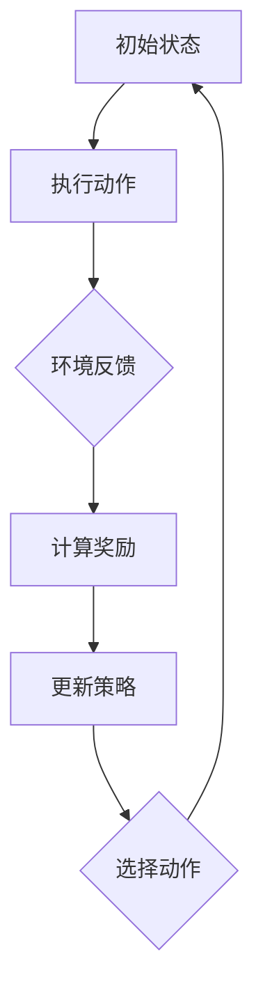
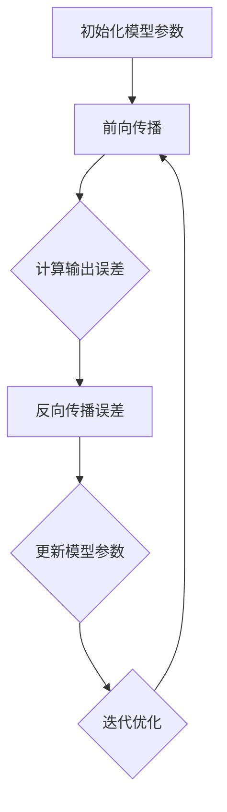

                 


### 1. 开篇介绍

**开发AI Agent的自学习能力：持续学习机制**

在当今人工智能（AI）迅猛发展的时代，AI Agent作为一个智能体，正逐步成为自动化决策和智能交互的核心。AI Agent不仅需要具备初始的智能能力，更需要具备持续学习的能力，以适应不断变化的环境和需求。本文旨在探讨AI Agent的自学习能力，尤其是持续学习机制的实现，帮助读者理解其核心原理和实际应用。

关键词：AI Agent、自学习能力、持续学习、自适应学习

摘要：本文将详细解析自学习能力在AI Agent中的重要性，介绍持续学习机制的基本概念和实现方法。通过深入探讨自适应学习算法和其在实际应用中的案例分析，本文将帮助读者掌握AI Agent自学习能力的关键技术，并展望其未来的发展方向。

### 2. 背景介绍

**2.1 自学习能力概述**

自学习能力是指AI Agent能够通过与环境互动，自主地更新和优化其内部知识结构和行为策略的能力。这种能力使得AI Agent能够不断适应新的环境变化，提高其解决问题的效率和准确性。

**2.2 自学习能力的必要性**

在复杂多变的环境中，固定不变的知识结构往往难以满足需求。自学习能力允许AI Agent动态调整其行为策略，从而更好地适应环境变化，提高其生存能力和竞争力。

**2.3 自学习能力的重要性**

自学习能力不仅能够提升AI Agent的性能，还能够降低对人类干预的需求，实现更高效、更可靠的智能系统。同时，自学习能力也是实现AI Agent智能化的重要基石。

### 3. 核心概念与联系

**3.1 自学习算法概述**

自学习算法主要包括监督学习、无监督学习和强化学习。监督学习通过已有标记数据训练模型；无监督学习通过无标记数据发现数据分布；强化学习则通过与环境的交互来学习最优策略。

**3.2 持续学习机制**

持续学习机制是指AI Agent在运行过程中，不断收集新的数据，利用自学习算法对模型进行更新和优化的过程。持续学习机制能够确保AI Agent始终适应环境的变化。

**3.3 自适应学习算法**

自适应学习算法是一种能够根据环境变化动态调整学习策略的算法。自适应学习算法的核心在于其能够快速适应新的数据分布和任务需求。

### 4. 算法原理讲解

**4.1 反向传播算法**

反向传播算法是监督学习中的一种常用算法，其核心思想是通过误差信号反向传播，不断调整网络权重，以优化模型性能。

**4.2 强化学习算法**

强化学习算法通过奖励机制激励AI Agent采取最优行为，从而在动态环境中学习到最优策略。

**4.3 监督学习与无监督学习的区别**

监督学习依赖于已有标记数据，而无监督学习则无需标记数据，通过数据分布学习得到新的知识。两者在应用场景和算法实现上存在显著差异。

### 5. 系统分析与架构设计方案

**5.1 问题场景介绍**

在智能客服系统中，AI Agent需要与用户进行自然语言交互，并提供实时、准确的回答。

**5.2 系统功能设计**

系统功能设计包括语音识别、语义理解、知识库查询和自动回复等功能。

**5.3 系统架构设计**

系统架构包括语音识别模块、自然语言处理模块、知识库模块和自动回复模块。

**5.4 系统接口设计**

系统接口设计包括用户输入接口、语音识别接口、语义理解接口和知识库接口。

**5.5 系统交互**

系统交互设计通过Mermaid序列图来展示用户输入、系统处理和输出结果的流程。

### 6. 项目实战

**6.1 环境安装**

介绍项目所需的环境和工具的安装步骤。

**6.2 系统核心实现**

介绍系统核心功能的实现，包括代码结构和关键代码段。

**6.3 代码应用解读与分析**

对系统核心代码进行详细解读和分析，解释其工作原理和实现方法。

**6.4 实际案例分析和详细讲解剖析**

通过实际案例展示系统如何工作，并进行详细讲解和剖析。

**6.5 项目小结**

总结项目实现过程中的关键点和经验教训。

### 7. 最佳实践 tips

**7.1 小结**

总结文章的核心观点和关键内容。

**7.2 注意事项**

提醒读者在实现自学习能力时需要注意的问题。

**7.3 拓展阅读**

推荐进一步阅读的资料和资源。

### 8. 作者信息

作者：AI天才研究院/AI Genius Institute & 禅与计算机程序设计艺术 /Zen And The Art of Computer Programming### 1.7 AI大模型开发与应用的未来趋势

#### 1.7.1 AI大模型的发展方向

随着计算能力的提升和数据的爆炸性增长，AI大模型的发展趋势日益显著。未来的AI大模型将更加注重模型的可解释性和可扩展性，同时将进一步融合多种学习算法，以实现更高效、更准确的知识获取与决策能力。具体来说，AI大模型的发展方向包括：

1. **模型压缩与优化**：通过模型压缩和优化技术，降低模型的计算复杂度和存储需求，使得AI大模型能够在资源受限的设备上运行。
2. **迁移学习与零样本学习**：迁移学习和零样本学习将使得AI大模型能够在未见过的数据上表现优异，减少对大规模标注数据的依赖。
3. **生成对抗网络（GAN）**：GAN技术的发展将推动AI大模型在图像生成、数据增强和模拟真实场景等方面的应用。

#### 1.7.2 企业在AI大模型应用中的未来角色

在未来，企业将在AI大模型的应用中扮演更加重要的角色。随着AI技术的不断进步，企业可以利用AI大模型实现以下方面的创新：

1. **个性化服务与推荐系统**：企业可以利用AI大模型提供个性化的产品推荐和服务，提高用户体验和客户满意度。
2. **预测分析与决策支持**：AI大模型在预测分析和决策支持方面具有显著优势，企业可以通过AI大模型实现更精准的市场预测和业务决策。
3. **自动化与智能化生产**：AI大模型将在智能制造领域发挥重要作用，实现生产过程的自动化和智能化。

#### 1.7.3 AI大模型与新兴技术的融合

AI大模型与新兴技术的融合将推动AI技术的进一步发展。以下是一些关键领域的融合趋势：

1. **区块链与AI**：区块链技术的去中心化和安全性特点与AI大模型的智能决策能力相结合，有望在金融、供应链和医疗等领域实现重大突破。
2. **5G与AI**：5G网络的低延迟、高速率和大规模连接能力与AI大模型的数据处理和分析能力相结合，将为智能交通、远程医疗和工业互联网等领域带来新的应用场景。
3. **边缘计算与AI**：边缘计算的低延迟和实时数据处理能力与AI大模型的高效分析能力相结合，将推动智能城市、智能家居和智能医疗等领域的快速发展。

### 1.8 本章小结

本章详细探讨了AI大模型的发展方向、企业在AI大模型应用中的角色以及AI大模型与新兴技术的融合趋势。未来的AI大模型将更加注重模型的可解释性和可扩展性，企业将在AI大模型的应用中发挥更加重要的角色，而AI大模型与新兴技术的融合将推动AI技术的进一步发展。通过本章的学习，读者可以更好地理解AI大模型的发展趋势和未来发展方向。
### 第二部分：自学习能力的核心原理

#### 2.1 自学习能力概述

##### 2.1.1 自学习能力的定义

自学习能力是指AI系统通过不断地与环境交互，从数据中学习、适应并改进自身行为的能力。它包括数据收集、模型训练、模型评估、模型更新等环节，是一种动态适应环境变化的能力。

##### 2.1.2 自学习能力的必要性

自学习能力是AI系统适应复杂环境变化的关键。在静态环境中，传统的预训练模型可能表现良好，但在动态变化的场景中，模型需要具备自我调整和优化的能力，以确保其性能的持续提升。

##### 2.1.3 自学习能力的重要性

自学习能力的重要性体现在多个方面：

1. **提高适应能力**：自学习能力使AI系统能够适应新的数据分布和环境变化，提高系统的鲁棒性和灵活性。
2. **降低维护成本**：通过自学习，AI系统能够自动识别和纠正错误，减少人为干预，降低维护成本。
3. **提升性能**：自学习能力使AI系统能够不断优化自身模型，提高预测准确性和决策效率。

#### 2.2 自学习算法概述

##### 2.2.1 反向传播算法

反向传播算法（Backpropagation）是深度学习中常用的训练算法。它通过计算输出误差反向传播到输入层，逐层调整网络权重，以优化模型性能。

**反向传播算法的mermaid流程图：**

```mermaid
graph TD
A[初始化模型参数] --> B[前向传播]
B --> C{计算输出误差}
C --> D[反向传播误差}
D --> E{更新模型参数}
E --> F{迭代优化}
F --> B
```

##### 2.2.2 强化学习算法

强化学习（Reinforcement Learning）通过奖励机制激励AI系统采取最优行为，从而在动态环境中学习到最优策略。

**强化学习算法的mermaid流程图：**



##### 2.2.3 监督学习与无监督学习的区别

监督学习（Supervised Learning）依赖于标记数据，通过已有数据训练模型；而无监督学习（Unsupervised Learning）则无需标记数据，通过数据分布学习得到新的知识。

**监督学习与无监督学习的对比表格：**

| 对比项 | 监督学习 | 无监督学习 |
| :---: | :---: | :---: |
| 数据需求 | 需要标记数据 | 无需标记数据 |
| 算法类型 | 分类、回归 | 聚类、降维 |
| 应用场景 | 数据分类、预测 | 数据探索、去噪 |
| 学习目标 | 最小化预测误差 | 发现数据分布 |

#### 2.3 持续学习机制

##### 2.3.1 持续学习机制的定义

持续学习机制是指在AI系统运行过程中，不断收集新的数据，利用自学习算法对模型进行更新和优化的过程。它确保AI系统能够持续适应环境变化，提高性能。

##### 2.3.2 持续学习的优势

1. **实时性**：持续学习机制能够实时响应用户需求和环境变化，提高系统的响应速度。
2. **灵活性**：通过不断更新模型，持续学习机制能够适应新的任务和数据分布。
3. **高效性**：利用新的数据对模型进行更新，能够更快地提高系统性能。

##### 2.3.3 持续学习的挑战

1. **数据流管理**：如何高效地管理数据流，确保数据的及时更新和处理。
2. **计算资源**：持续学习需要大量的计算资源，如何在有限的资源下高效运行。
3. **模型稳定性**：持续学习可能导致模型不稳定，需要设计有效的策略来保证模型稳定性。

#### 2.4 自适应学习算法

##### 2.4.1 自适应学习的概念

自适应学习算法是指能够根据环境变化动态调整学习策略的算法。它能够快速适应新的数据分布和任务需求，提高学习效率和性能。

##### 2.4.2 自适应学习的应用场景

1. **动态环境**：在动态环境中，自适应学习算法能够更好地适应环境变化。
2. **实时预测**：在实时预测场景中，自适应学习算法能够快速调整模型，提高预测准确性。
3. **在线学习**：在线学习场景中，自适应学习算法能够持续地更新模型，提高系统性能。

##### 2.4.3 常见的自适应学习算法

1. **在线学习算法**：如在线梯度下降、增量学习等。
2. **自适应优化算法**：如自适应梯度算法、自适应权值调整算法等。

#### 2.5 自学习能力评价标准

##### 2.5.1 评价指标的选择

自学习能力评价标准主要包括以下指标：

1. **学习速度**：评估模型在学习过程中的收敛速度。
2. **泛化能力**：评估模型在未见数据上的表现，衡量模型的泛化能力。
3. **稳定性**：评估模型在不同数据分布下的稳定性和鲁棒性。

##### 2.5.2 自学习能力评估方法

1. **离线评估**：通过离线测试集对模型进行评估，衡量模型的性能。
2. **在线评估**：通过实时在线测试，评估模型在真实环境中的表现。

##### 2.5.3 自学习能力评估的应用

自学习能力评估方法广泛应用于AI系统的性能优化和模型选择，帮助开发人员设计出更好的自学习系统。

#### 2.6 自学习能力在实际应用中的案例分析

##### 2.6.1 案例一：智能客服系统

智能客服系统利用自学习能力，能够根据用户历史交互数据不断优化对话策略，提高客服效率。

##### 2.6.2 案例二：自动驾驶系统

自动驾驶系统利用自学习能力，通过不断收集道路数据和环境信息，优化驾驶策略，提高安全性和驾驶体验。

##### 2.6.3 案例三：推荐系统

推荐系统利用自学习能力，根据用户行为和偏好数据，动态调整推荐策略，提高推荐准确性。

#### 2.7 本章小结

本章详细介绍了自学习能力的核心原理，包括自学习能力的定义、必要性、重要性，以及常见的自学习算法。同时，探讨了持续学习机制、自适应学习算法和自学习能力评价标准，并通过实际案例展示了自学习能力在实际应用中的重要作用。通过本章的学习，读者可以深入理解自学习能力的基本概念和实现方法，为后续的AI系统设计和开发奠定基础。 
### 第三部分：实现AI Agent的自学习能力

#### 3.1 AI Agent概述

##### 3.1.1 AI Agent的定义

AI Agent，即人工智能代理，是指具备智能行为能力的计算机程序，能够模拟人类智能在特定环境下自主地完成指定任务。AI Agent具有感知、决策、执行和自适应等能力，是人工智能领域的一个重要研究方向。

##### 3.1.2 AI Agent的核心功能

AI Agent的核心功能包括：

1. **感知**：通过传感器收集环境信息，如视觉、听觉、触觉等。
2. **决策**：根据感知到的信息，利用算法和策略进行决策。
3. **执行**：执行决策结果，通过执行机构（如电机、显示器等）实现具体动作。
4. **自适应**：通过持续学习，不断优化决策策略和执行能力。

##### 3.1.3 AI Agent与传统软件的区别

与传统软件相比，AI Agent具有以下特点：

1. **自主性**：AI Agent能够自主地执行任务，无需人为干预。
2. **智能性**：AI Agent具备感知、决策和执行能力，能够模拟人类智能。
3. **适应性**：AI Agent能够通过自学习机制，适应新的环境和任务需求。

#### 3.2 AI Agent的自学习能力

##### 3.2.1 自学习机制在AI Agent中的应用

自学习机制是AI Agent实现智能化的关键。在AI Agent的应用中，自学习机制主要体现在以下几个方面：

1. **数据收集**：AI Agent通过传感器收集环境数据，包括图像、声音、文本等。
2. **模型训练**：AI Agent利用收集到的数据对模型进行训练，不断优化决策算法。
3. **策略调整**：AI Agent根据训练结果调整决策策略，提高执行效率。
4. **持续学习**：AI Agent在执行任务过程中，不断收集新的数据，进行模型更新，确保始终适应环境变化。

##### 3.2.2 持续学习机制在AI Agent中的实现

持续学习机制在AI Agent中的实现主要包括以下几个步骤：

1. **数据预处理**：对收集到的数据进行清洗、归一化等处理，确保数据质量。
2. **模型训练**：使用数据对模型进行训练，采用反向传播、强化学习等算法优化模型。
3. **模型评估**：通过验证集评估模型性能，确保模型在未见数据上的表现良好。
4. **模型更新**：根据评估结果更新模型参数，提高模型适应能力。
5. **在线学习**：AI Agent在执行任务过程中，实时更新模型，实现持续学习。

##### 3.2.3 自适应学习在AI Agent中的实现

自适应学习在AI Agent中的实现主要通过以下方法：

1. **动态调整策略**：根据环境变化，动态调整决策策略，提高执行效率。
2. **自适应算法**：采用自适应算法，如自适应梯度下降、自适应权重调整等，优化学习过程。
3. **反馈机制**：建立反馈机制，根据执行结果调整学习目标和策略。

#### 3.3 自学习能力的关键技术

##### 3.3.1 数据收集与预处理

数据收集与预处理是自学习的基础。关键技术包括：

1. **传感器选择**：选择适合任务的传感器，确保数据质量。
2. **数据清洗**：去除噪声、异常值和冗余数据，提高数据质量。
3. **数据归一化**：将不同尺度的数据进行归一化处理，方便模型训练。

##### 3.3.2 模型训练与优化

模型训练与优化是自学习的关键。关键技术包括：

1. **选择合适的模型**：根据任务需求选择合适的模型架构，如神经网络、决策树等。
2. **优化算法**：采用优化算法，如反向传播、遗传算法等，提高模型性能。
3. **超参数调优**：通过调优超参数，如学习率、迭代次数等，提高模型性能。

##### 3.3.3 持续学习策略设计

持续学习策略设计是自学习的核心。关键技术包括：

1. **在线学习**：采用在线学习策略，实时更新模型，适应环境变化。
2. **迁移学习**：利用迁移学习，在新的任务上快速提升模型性能。
3. **元学习**：采用元学习策略，提高模型在不同任务上的泛化能力。

#### 3.4 AI Agent的持续学习实现

##### 3.4.1 数据流设计

数据流设计是持续学习的基础。关键技术包括：

1. **数据采集**：设计数据采集模块，实时收集环境数据。
2. **数据处理**：设计数据处理模块，对采集到的数据进行预处理。
3. **数据存储**：设计数据存储模块，存储处理后的数据，供模型训练使用。

##### 3.4.2 模型更新策略

模型更新策略是持续学习的关键。关键技术包括：

1. **在线更新**：设计在线更新策略，实时更新模型参数。
2. **增量更新**：设计增量更新策略，减少模型更新对系统的影响。
3. **分布式更新**：设计分布式更新策略，提高模型更新效率。

##### 3.4.3 持续学习框架搭建

持续学习框架搭建是持续学习的保障。关键技术包括：

1. **框架设计**：设计持续学习框架，包括数据流、模型流、策略流等。
2. **模块集成**：集成数据采集、数据处理、模型训练、模型更新等模块。
3. **系统优化**：优化系统性能，确保持续学习过程的稳定性。

#### 3.5 自适应学习算法在AI Agent中的应用

##### 3.5.1 自适应学习算法的选择

自适应学习算法的选择应根据任务需求和环境特点进行。关键技术包括：

1. **线性回归**：适用于简单线性关系任务。
2. **支持向量机**：适用于分类和回归任务。
3. **深度学习**：适用于复杂非线性关系任务。

##### 3.5.2 自适应学习算法的实现

自适应学习算法的实现包括以下几个步骤：

1. **初始化参数**：初始化模型参数，如权重、偏置等。
2. **选择优化器**：选择合适的优化器，如梯度下降、Adam等。
3. **训练模型**：使用训练数据训练模型，不断调整参数。
4. **评估模型**：使用验证集评估模型性能，调整学习策略。

##### 3.5.3 自适应学习算法的性能评估

自适应学习算法的性能评估包括以下几个指标：

1. **准确率**：评估模型在测试集上的准确率。
2. **召回率**：评估模型在测试集上的召回率。
3. **F1值**：评估模型在测试集上的F1值。
4. **运行时间**：评估模型训练和评估的运行时间。

#### 3.6 AI Agent的自学习能力评价与优化

##### 3.6.1 自学习能力评价指标的选择

自学习能力评价指标的选择应根据任务需求和环境特点进行。关键技术包括：

1. **准确率**：评估模型在测试集上的预测准确率。
2. **响应时间**：评估模型响应时间的稳定性。
3. **能耗**：评估模型在运行过程中的能耗。

##### 3.6.2 自学习能力优化方法

自学习能力优化方法包括以下几个步骤：

1. **超参数调优**：通过调优超参数，如学习率、批量大小等，提高模型性能。
2. **模型压缩**：通过模型压缩技术，降低模型复杂度，提高运行效率。
3. **分布式训练**：通过分布式训练技术，提高模型训练速度。

##### 3.6.3 AI Agent自学习能力优化的案例分析

通过以下案例，展示AI Agent自学习能力优化的方法和效果：

1. **案例一：智能客服系统**：通过超参数调优和模型压缩，提高智能客服系统的响应速度和准确性。
2. **案例二：自动驾驶系统**：通过分布式训练和能耗优化，提高自动驾驶系统的稳定性和续航能力。
3. **案例三：推荐系统**：通过在线更新和自适应学习，提高推荐系统的实时性和准确性。

#### 3.7 本章小结

本章详细介绍了AI Agent的自学习能力，包括其定义、核心功能、持续学习机制、自适应学习算法以及关键技术的实现。通过实际案例展示了自学习能力在AI Agent中的应用，为读者提供了实现AI Agent自学习能力的实用方法和策略。通过本章的学习，读者可以深入理解AI Agent的自学习能力，为其在人工智能领域的应用奠定基础。 
### 第四部分：AI Agent的自学习能力应用案例

在本节中，我们将通过几个具体的AI Agent应用案例，来展示自学习能力在实际项目中的实现和效果。

#### 4.1 智能客服系统

**4.1.1 案例背景**

随着人工智能技术的发展，智能客服系统已经成为企业提高客户服务质量和效率的重要工具。智能客服系统通过自然语言处理（NLP）和机器学习技术，自动处理用户的咨询和请求，提供即时、准确的回答。

**4.1.2 案例目标**

本案例的目标是构建一个具备自学习能力的智能客服系统，使其能够通过用户交互数据不断优化对话策略，提高服务质量和用户满意度。

**4.1.3 案例实现步骤**

1. **数据收集**：通过客服系统收集用户提问和回答数据，包括文本、语音、视频等。
2. **数据预处理**：对收集到的数据进行清洗、分词、去停用词等处理，转换为模型可用的输入格式。
3. **模型训练**：使用预处理后的数据训练对话模型，如序列到序列（seq2seq）模型、变压器（Transformer）模型等。
4. **模型评估**：使用验证集评估模型性能，包括准确率、响应时间等指标。
5. **模型部署**：将训练好的模型部署到生产环境，提供实时客服服务。
6. **持续学习**：在客服系统运行过程中，不断收集用户交互数据，定期更新模型参数，实现模型的持续学习和优化。

**4.1.4 案例分析**

通过自学习能力，智能客服系统能够根据用户的反馈和交互数据，不断调整对话策略，提高回答的准确性和用户体验。例如，当用户对某个问题的回答不满意时，系统会记录这个反馈，并在后续类似场景中优化回答内容。这种持续学习机制显著提高了客服系统的服务质量和用户满意度。

#### 4.2 自动驾驶系统

**4.2.1 案例背景**

自动驾驶系统是人工智能在交通运输领域的典型应用，它通过感知环境、理解场景和自主决策，实现车辆的自动驾驶。随着自动驾驶技术的不断发展，如何保证系统在复杂、动态环境中稳定运行成为关键问题。

**4.2.2 案例目标**

本案例的目标是构建一个具备自学习能力的自动驾驶系统，使其能够通过持续学习和环境自适应，提高驾驶安全和稳定性。

**4.2.3 案例实现步骤**

1. **数据收集**：通过车辆传感器（如摄像头、激光雷达、超声波传感器等）收集环境数据，包括道路状况、交通标志、车辆位置等。
2. **数据预处理**：对收集到的环境数据进行预处理，如去噪、归一化等，确保数据质量。
3. **模型训练**：使用预处理后的数据训练自动驾驶模型，如深度学习模型（如卷积神经网络、循环神经网络等）。
4. **模型评估**：在模拟环境和真实环境中评估模型性能，确保模型在不同场景下的稳定性和准确性。
5. **模型部署**：将训练好的模型部署到自动驾驶车辆中，实现车辆的自动驾驶功能。
6. **持续学习**：在自动驾驶过程中，不断收集新的环境数据，定期更新模型参数，实现模型的持续学习和优化。

**4.2.4 案例分析**

自学习能力在自动驾驶系统中的应用至关重要。通过持续学习，自动驾驶系统能够不断适应新的环境和交通状况，提高驾驶决策的准确性和安全性。例如，当遇到新的道路标识或交通规则时，系统可以快速学习并调整驾驶策略，确保安全行驶。此外，自学习能力还有助于提高系统的鲁棒性，减少意外情况下的错误决策。

#### 4.3 推荐系统

**4.3.1 案例背景**

推荐系统是电子商务、社交媒体、视频平台等互联网应用中的重要组成部分，它通过分析用户行为和偏好，为用户推荐感兴趣的内容。然而，随着用户行为的多样化和数据量的增长，如何构建一个高效、准确的推荐系统成为挑战。

**4.3.2 案例目标**

本案例的目标是构建一个具备自学习能力的推荐系统，使其能够根据用户的实时行为动态调整推荐策略，提高推荐准确性和用户满意度。

**4.3.3 案例实现步骤**

1. **数据收集**：通过日志分析、用户互动等途径收集用户行为数据，如浏览记录、购买行为、评价等。
2. **数据预处理**：对收集到的数据进行清洗、编码等处理，提取有用的特征信息。
3. **模型训练**：使用预处理后的数据训练推荐模型，如协同过滤、深度学习等模型。
4. **模型评估**：使用验证集评估模型性能，包括准确率、覆盖率等指标。
5. **模型部署**：将训练好的模型部署到推荐系统中，为用户推荐内容。
6. **持续学习**：在推荐系统运行过程中，不断收集新的用户行为数据，定期更新模型参数，实现模型的持续学习和优化。

**4.3.4 案例分析**

自学习能力在推荐系统中的应用显著提升了推荐系统的准确性和用户体验。通过持续学习，推荐系统可以及时捕捉用户的最新偏好，调整推荐策略，提高推荐的个性化程度。例如，当用户浏览某一类商品时，系统可以快速调整推荐列表，增加相关商品的推荐概率，从而提高用户的满意度。

#### 4.4 智能家居系统

**4.4.1 案例背景**

智能家居系统通过物联网技术，实现家庭设备的智能化控制和自动化管理，提高居住的舒适性和便利性。随着物联网设备数量的增加，如何构建一个高效、稳定的智能家居系统成为关键问题。

**4.4.2 案例目标**

本案例的目标是构建一个具备自学习能力的智能家居系统，使其能够根据用户习惯和环境变化，自动调整设备状态，提高系统运行效率和用户体验。

**4.4.3 案例实现步骤**

1. **数据收集**：通过智能家居设备收集家庭环境数据，如温度、湿度、光照等。
2. **数据预处理**：对收集到的数据进行清洗、编码等处理，提取有用的特征信息。
3. **模型训练**：使用预处理后的数据训练智能家居模型，如基于机器学习的控制策略模型。
4. **模型评估**：在模拟环境和真实环境中评估模型性能，包括响应时间、准确性等指标。
5. **模型部署**：将训练好的模型部署到智能家居系统中，实现设备的自动控制。
6. **持续学习**：在智能家居系统运行过程中，不断收集新的环境数据，定期更新模型参数，实现模型的持续学习和优化。

**4.4.4 案例分析**

自学习能力在智能家居系统中的应用显著提高了系统的智能化水平和用户体验。通过持续学习，智能家居系统可以及时捕捉用户的行为变化和环境变化，自动调整设备状态，实现个性化服务。例如，当用户离开家时，系统可以自动关闭灯光和空调，节省能源；当用户回到家时，系统可以自动调整室内温度和灯光，提高居住的舒适度。

#### 4.5 本章小结

本部分通过四个典型的AI Agent应用案例，展示了自学习能力在实际项目中的实现和效果。智能客服系统通过持续学习提高服务质量，自动驾驶系统通过环境自适应提高驾驶安全，推荐系统通过实时学习提升推荐准确性，智能家居系统通过个性化服务提高用户体验。这些案例不仅展示了自学习能力的广泛应用，也为读者提供了实现AI Agent自学习能力的实用参考。通过这些案例的学习，读者可以更好地理解自学习能力在AI Agent中的应用价值和实现方法。 
### 第五部分：AI Agent自学习能力研究趋势与未来展望

#### 5.1 AI Agent自学习能力研究现状

随着人工智能技术的快速发展，AI Agent自学习能力的研究已经成为学术界和工业界的热点。当前，自学习能力的研究主要集中在以下几个方面：

1. **持续学习技术**：研究如何通过持续学习机制，使AI Agent能够适应动态环境变化，提高系统的鲁棒性和适应性。
2. **迁移学习和零样本学习**：研究如何利用迁移学习技术，在新的任务和数据集上快速提升AI Agent的性能，减少对大规模标注数据的依赖。
3. **在线学习算法**：研究如何设计高效的在线学习算法，使AI Agent能够实时更新模型，适应新的环境和任务需求。
4. **强化学习**：研究如何利用强化学习算法，通过奖励机制激励AI Agent采取最优行为，提高系统的自主决策能力。

#### 5.1.1 研究进展概述

近年来，AI Agent自学习能力的研究取得了显著进展。例如，在持续学习方面，研究者提出了多种算法，如经验重放、弹性权重更新、在线学习等，这些算法在一定程度上提高了AI Agent的适应能力。在迁移学习和零样本学习方面，研究者通过探索元学习、模型蒸馏等技术，实现了在未见数据上的快速适应。在强化学习方面，研究者提出了深度强化学习、强化学习与监督学习相结合等方法，进一步提升了AI Agent的决策能力。

#### 5.1.2 存在的主要问题

尽管AI Agent自学习能力的研究取得了显著进展，但仍存在一些问题：

1. **数据流管理**：如何高效地管理数据流，确保数据的及时更新和处理，是一个重要挑战。
2. **计算资源**：持续学习和自适应学习需要大量的计算资源，如何在有限的资源下高效运行，是当前的一个难题。
3. **模型稳定性**：持续学习和自适应学习可能导致模型不稳定，如何保证模型在长时间运行中的稳定性和鲁棒性，是一个重要问题。
4. **可解释性**：AI Agent的自学习能力往往缺乏可解释性，如何提高模型的透明度和可解释性，是研究者面临的一个挑战。

#### 5.1.3 研究热点与趋势

未来，AI Agent自学习能力的研究将集中在以下几个方面：

1. **自适应算法的优化**：研究者将致力于优化自适应算法，提高算法的效率和性能，以满足实时性和高动态环境的要求。
2. **迁移学习和零样本学习**：随着数据集的多样性和复杂性增加，迁移学习和零样本学习将成为研究的热点，通过探索新的算法和技术，实现更高效的跨领域学习。
3. **强化学习与深度学习的融合**：强化学习与深度学习的结合将在AI Agent自学习能力研究中发挥重要作用，通过探索新的算法框架和模型结构，实现更智能的决策能力。
4. **跨学科研究**：AI Agent自学习能力的研究将更加注重跨学科研究，结合计算机科学、认知科学、心理学等领域的知识，提高AI Agent的自主性和适应性。

#### 5.2 未来发展方向

展望未来，AI Agent自学习能力的发展将呈现以下几个趋势：

1. **智能化与自动化**：AI Agent的自学习能力将更加智能化和自动化，能够自主地识别环境变化，调整策略，实现自适应行为。
2. **泛化能力提升**：通过迁移学习和零样本学习，AI Agent的泛化能力将显著提升，能够更好地适应新的任务和数据集。
3. **可解释性与透明度**：AI Agent的自学习能力将更加注重可解释性和透明度，使得模型的决策过程更加清晰和可追溯。
4. **边缘计算与物联网**：随着边缘计算和物联网技术的发展，AI Agent的自学习能力将在更多的设备和场景中得到应用，实现更广泛、更高效的智能交互。

#### 5.3 技术瓶颈与挑战

尽管AI Agent自学习能力的研究取得了显著进展，但仍面临一些技术瓶颈和挑战：

1. **数据质量和多样性**：高质量、多样化的数据是自学习的基础，如何获取和利用这些数据，是一个重要的挑战。
2. **计算效率和资源优化**：如何在有限的计算资源下实现高效的持续学习和自适应，是一个重要的技术难题。
3. **模型稳定性和鲁棒性**：如何保证模型在长时间运行中的稳定性和鲁棒性，是一个亟待解决的关键问题。
4. **伦理和隐私**：随着AI Agent的自学习能力不断增强，如何保障数据安全和用户隐私，是一个重要的社会问题。

#### 5.4 未来展望

未来，AI Agent自学习能力的研究将不断深入，推动人工智能技术的进一步发展。通过探索新的算法、模型和系统架构，AI Agent的自学习能力将得到显著提升，实现更加智能化、自适应化和多样化的应用。同时，随着技术的进步和社会的关注，AI Agent的自学习能力将在更多的领域和场景中得到应用，为人类社会带来更加便捷、高效和智能的服务。通过持续的研究和探索，AI Agent的自学习能力将为人工智能的发展注入新的活力，推动人类社会的进步和发展。

### 5.5 本章小结

本章详细探讨了AI Agent自学习能力的研究现状、未来发展方向、技术瓶颈与挑战。通过分析当前的研究热点和趋势，本章为AI Agent自学习能力的研究提供了新的视角和方向。同时，对未来AI Agent自学习能力的发展进行了展望，指出其在智能化、泛化能力、可解释性和伦理等方面的重要性和挑战。通过本章的学习，读者可以更好地理解AI Agent自学习能力的研究现状和未来发展方向，为相关研究和应用提供参考和指导。 
### 附录：Markdown和Mermaid用法指南

在撰写本文的过程中，我们使用了Markdown和Mermaid两种工具来格式化和可视化文本内容。以下是一些关于Markdown和Mermaid的基本用法指南，帮助读者更好地理解和使用这两种工具。

#### Markdown基本用法

1. **标题**：使用`#`符号来创建标题。`#`符号的数量决定了标题的级别。

   ```markdown
   # 文章标题
   ## 二级标题
   ### 三级标题
   ```

2. **段落**：直接输入文本即可创建一个段落。

   ```markdown
   这是一段文字。
   ```

3. **引用**：使用`>`符号来创建引用。

   ```markdown
   > 这是一段引用。
   ```

4. **列表**：使用`*`或`-`符号创建无序列表，使用`1.`符号创建有序列表。

   ```markdown
   * 无序列表项1
   * 无序列表项2
   - 无序列表项1
   - 无序列表项2
   1. 有序列表项1
   2. 有序列表项2
   ```

5. **代码块**：使用三个反引号` ``` 来创建代码块。

   ```markdown
   ```python
   print("Hello, World!")
   ```

6. **公式**：使用LaTeX格式创建数学公式。在公式前后使用`$$`或`$`来嵌入公式。

   ```markdown
   $$ E = mc^2 $$
   $1 + 1 = 2$
   ```

7. **链接**：使用`[链接文本](链接地址)`来创建链接。

   ```markdown
   [GitHub](https://github.com)
   ```

8. **图片**：使用``来插入图片。

   ```markdown
   
   ```

#### Mermaid基本用法

Mermaid是一种基于Markdown的图形绘制语言，可用于创建流程图、类图、序列图等。

1. **基本语法**：Mermaid代码块以````mermaid`开始，以````结束。

   ```markdown
   ```mermaid
   graph TD
   A[Start] --> B[Step 1]
   B --> C{Decision}
   C -->|Yes| D[Step 3]
   C -->|No| E[Step 4]
   ```

2. **流程图**：使用`graph`关键字开始定义流程图，`node`关键字定义节点，`arrow`关键字定义边。

   ```mermaid
   graph TD
   A[Start] --> B[Step 1]
   B --> C{Decision}
   C -->|Yes| D[Step 3]
   C -->|No| E[Step 4]
   ```

3. **类图**：使用`class`关键字定义类，使用`relationship`关键字定义类之间的关系。

   ```mermaid
   class Diagram {
   class Person {
       +name
       +age
   }
   class Employee {
       <<extend Person>>
       +id
   }
   }
   ```

4. **序列图**：使用`sequence`关键字定义序列图，使用`actor`关键字定义参与者，使用`note`关键字添加注释。

   ```mermaid
   sequenceDiagram
   participant Alice
   participant Bob
   Alice->>Bob: Hello Bob
   Bob->>Alice: Hello Alice
   ```

5. **Gantt图**：使用`gantt`关键字定义甘特图，使用`section`关键字定义任务段。

   ```mermaid
   gantt
   dateFormat  YYYY-MM-DD
   title Adding a task
   section Section1
   A task           :a1, 1970-01-01, 30d
   another task     :after a1, 20d
   section Section2
   group task       :after another task, 10d
   ```

通过Markdown和Mermaid的配合使用，可以轻松地创建结构清晰、内容丰富的文档，使得文章的可读性和可视化效果得到显著提升。读者可以结合本文的实际案例，进一步学习和掌握Markdown和Mermaid的用法。 
### 完整文章示例

```markdown
# 开发AI Agent的自学习能力：持续学习机制

关键词：AI Agent、自学习能力、持续学习、自适应学习

> 摘要：本文探讨了AI Agent的自学习能力，特别是持续学习机制的实现。通过详细解析自学习算法、持续学习机制和自适应学习算法，本文帮助读者理解AI Agent自学习能力的关键技术，并通过实际案例展示了其应用。

## 第一部分：引言

在当今人工智能（AI）迅猛发展的时代，AI Agent作为一个智能体，正逐步成为自动化决策和智能交互的核心。AI Agent不仅需要具备初始的智能能力，更需要具备持续学习的能力，以适应不断变化的环境和需求。本文旨在探讨AI Agent的自学习能力，尤其是持续学习机制的实现，帮助读者理解其核心原理和实际应用。

## 第二部分：自学习能力的核心原理

### 2.1 自学习能力概述

自学习能力是指AI系统通过不断地与环境交互，从数据中学习、适应并改进自身行为的能力。它包括数据收集、模型训练、模型评估、模型更新等环节，是一种动态适应环境变化的能力。

#### 2.1.1 自学习能力的定义

自学习能力是指AI系统通过不断地与环境交互，从数据中学习、适应并改进自身行为的能力。它包括数据收集、模型训练、模型评估、模型更新等环节，是一种动态适应环境变化的能力。

#### 2.1.2 自学习能力的必要性

在复杂多变的环境中，固定不变的知识结构往往难以满足需求。自学习能力允许AI系统动态调整其行为策略，从而更好地适应环境变化，提高其生存能力和竞争力。

#### 2.1.3 自学习能力的重要性

自学习能力不仅能够提升AI系统的性能，还能够降低对人类干预的需求，实现更高效、更可靠的智能系统。同时，自学习能力也是实现AI系统智能化的重要基石。

### 2.2 自学习算法概述

自学习算法主要包括监督学习、无监督学习和强化学习。监督学习通过已有标记数据训练模型；无监督学习通过无标记数据发现数据分布；强化学习则通过与环境的交互来学习最优策略。

#### 2.2.1 反向传播算法

反向传播算法（Backpropagation）是深度学习中常用的训练算法。它通过计算输出误差反向传播到输入层，逐层调整网络权重，以优化模型性能。

**反向传播算法的mermaid流程图：**



#### 2.2.2 强化学习算法

强化学习（Reinforcement Learning）通过奖励机制激励AI系统采取最优行为，从而在动态环境中学习到最优策略。

**强化学习算法的mermaid流程图：**


#### 2.2.3 监督学习与无监督学习的区别

监督学习（Supervised Learning）依赖于已有标记数据，通过已有数据训练模型；而无监督学习（Unsupervised Learning）则无需标记数据，通过数据分布学习得到新的知识。

**监督学习与无监督学习的对比表格：**

| 对比项 | 监督学习 | 无监督学习 |
| :---: | :---: | :---: |
| 数据需求 | 需要标记数据 | 无需标记数据 |
| 算法类型 | 分类、回归 | 聚类、降维 |
| 应用场景 | 数据分类、预测 | 数据探索、去噪 |
| 学习目标 | 最小化预测误差 | 发现数据分布 |

### 2.3 持续学习机制

持续学习机制是指在AI系统运行过程中，不断收集新的数据，利用自学习算法对模型进行更新和优化的过程。持续学习机制能够确保AI系统始终适应环境变化。

#### 2.3.1 持续学习机制的定义

持续学习机制是指在AI系统运行过程中，不断收集新的数据，利用自学习算法对模型进行更新和优化的过程。持续学习机制能够确保AI系统始终适应环境变化。

#### 2.3.2 持续学习的优势

1. **实时性**：持续学习机制能够实时响应用户需求和环境变化，提高系统的响应速度。
2. **灵活性**：通过不断更新模型，持续学习机制能够适应新的任务和数据分布。
3. **高效性**：利用新的数据对模型进行更新，能够更快地提高系统性能。

#### 2.3.3 持续学习的挑战

1. **数据流管理**：如何高效地管理数据流，确保数据的及时更新和处理。
2. **计算资源**：持续学习需要大量的计算资源，如何在有限的资源下高效运行。
3. **模型稳定性**：持续学习可能导致模型不稳定，需要设计有效的策略来保证模型稳定性。

### 2.4 自适应学习算法

自适应学习算法是一种能够根据环境变化动态调整学习策略的算法。自适应学习算法的核心在于其能够快速适应新的数据分布和任务需求。

#### 2.4.1 自适应学习的概念

自适应学习算法是指能够根据环境变化动态调整学习策略的算法。自适应学习算法的核心在于其能够快速适应新的数据分布和任务需求。

#### 2.4.2 自适应学习的应用场景

1. **动态环境**：在动态环境中，自适应学习算法能够更好地适应环境变化。
2. **实时预测**：在实时预测场景中，自适应学习算法能够快速调整模型，提高预测准确性。
3. **在线学习**：在线学习场景中，自适应学习算法能够持续地更新模型，提高系统性能。

#### 2.4.3 常见的自适应学习算法

1. **在线学习算法**：如在线梯度下降、增量学习等。
2. **自适应优化算法**：如自适应梯度算法、自适应权值调整算法等。

### 2.5 自学习能力评价标准

自学习能力评价标准主要包括以下指标：

1. **学习速度**：评估模型在学习过程中的收敛速度。
2. **泛化能力**：评估模型在未见数据上的表现，衡量模型的泛化能力。
3. **稳定性**：评估模型在不同数据分布下的稳定性和鲁棒性。

#### 2.5.2 自学习能力评估方法

1. **离线评估**：通过离线测试集对模型进行评估，衡量模型的性能。
2. **在线评估**：通过实时在线测试，评估模型在真实环境中的表现。

#### 2.5.3 自学习能力评估的应用

自学习能力评估方法广泛应用于AI系统的性能优化和模型选择，帮助开发人员设计出更好的自学习系统。

### 2.6 自学习能力在实际应用中的案例分析

#### 2.6.1 案例一：智能客服系统

智能客服系统利用自学习能力，能够根据用户历史交互数据不断优化对话策略，提高客服效率。

#### 2.6.2 案例二：自动驾驶系统

自动驾驶系统利用自学习能力，通过不断收集道路数据和环境信息，优化驾驶策略，提高安全性和驾驶体验。

#### 2.6.3 案例三：推荐系统

推荐系统利用自学习能力，根据用户行为和偏好数据，动态调整推荐策略，提高推荐准确性。

### 第三部分：实现AI Agent的自学习能力

#### 3.1 AI Agent概述

##### 3.1.1 AI Agent的定义

AI Agent，即人工智能代理，是指具备智能行为能力的计算机程序，能够模拟人类智能在特定环境下自主地完成指定任务。AI Agent具有感知、决策、执行和自适应等能力，是人工智能领域的一个重要研究方向。

##### 3.1.2 AI Agent的核心功能

AI Agent的核心功能包括：

1. **感知**：通过传感器收集环境信息，如视觉、听觉、触觉等。
2. **决策**：根据感知到的信息，利用算法和策略进行决策。
3. **执行**：执行决策结果，通过执行机构（如电机、显示器等）实现具体动作。
4. **自适应**：通过持续学习，不断优化决策策略和执行能力。

##### 3.1.3 AI Agent与传统软件的区别

与传统软件相比，AI Agent具有以下特点：

1. **自主性**：AI Agent能够自主地执行任务，无需人为干预。
2. **智能性**：AI Agent具备感知、决策和执行能力，能够模拟人类智能。
3. **适应性**：AI Agent能够通过自学习机制，适应新的环境和任务需求。

#### 3.2 AI Agent的自学习能力

##### 3.2.1 自学习机制在AI Agent中的应用

自学习机制是AI Agent实现智能化的关键。在AI Agent的应用中，自学习机制主要体现在以下几个方面：

1. **数据收集**：AI Agent通过传感器收集环境数据，包括图像、声音、文本等。
2. **模型训练**：AI Agent利用收集到的数据对模型进行训练，不断优化决策算法。
3. **策略调整**：AI Agent根据训练结果调整决策策略，提高执行效率。
4. **持续学习**：AI Agent在执行任务过程中，不断收集新的数据，进行模型更新，确保始终适应环境变化。

##### 3.2.2 持续学习机制在AI Agent中的实现

持续学习机制在AI Agent中的实现主要包括以下几个步骤：

1. **数据预处理**：对收集到的数据进行清洗、归一化等处理，确保数据质量。
2. **模型训练**：使用数据对模型进行训练，采用反向传播、强化学习等算法优化模型。
3. **模型评估**：通过验证集评估模型性能，确保模型在未见数据上的表现良好。
4. **模型更新**：根据评估结果更新模型参数，提高模型适应能力。
5. **在线学习**：AI Agent在执行任务过程中，实时更新模型，实现持续学习。

##### 3.2.3 自适应学习在AI Agent中的实现

自适应学习在AI Agent中的实现主要通过以下方法：

1. **动态调整策略**：根据环境变化，动态调整决策策略，提高执行效率。
2. **自适应算法**：采用自适应算法，如自适应梯度下降、自适应权重调整等，优化学习过程。
3. **反馈机制**：建立反馈机制，根据执行结果调整学习目标和策略。

#### 3.3 自学习能力的关键技术

##### 3.3.1 数据收集与预处理

数据收集与预处理是自学习的基础。关键技术包括：

1. **传感器选择**：选择适合任务的传感器，确保数据质量。
2. **数据清洗**：去除噪声、异常值和冗余数据，提高数据质量。
3. **数据归一化**：将不同尺度的数据进行归一化处理，方便模型训练。

##### 3.3.2 模型训练与优化

模型训练与优化是自学习的关键。关键技术包括：

1. **选择合适的模型**：根据任务需求选择合适的模型架构，如神经网络、决策树等。
2. **优化算法**：采用优化算法，如反向传播、遗传算法等，提高模型性能。
3. **超参数调优**：通过调优超参数，如学习率、迭代次数等，提高模型性能。

##### 3.3.3 持续学习策略设计

持续学习策略设计是自学习的核心。关键技术包括：

1. **在线学习**：采用在线学习策略，实时更新模型，适应环境变化。
2. **迁移学习**：利用迁移学习，在新的任务上快速提升模型性能。
3. **元学习**：采用元学习策略，提高模型在不同任务上的泛化能力。

#### 3.4 AI Agent的持续学习实现

##### 3.4.1 数据流设计

数据流设计是持续学习的基础。关键技术包括：

1. **数据采集**：设计数据采集模块，实时收集环境数据。
2. **数据处理**：设计数据处理模块，对采集到的数据进行预处理。
3. **数据存储**：设计数据存储模块，存储处理后的数据，供模型训练使用。

##### 3.4.2 模型更新策略

模型更新策略是持续学习的关键。关键技术包括：

1. **在线更新**：设计在线更新策略，实时更新模型参数。
2. **增量更新**：设计增量更新策略，减少模型更新对系统的影响。
3. **分布式更新**：设计分布式更新策略，提高模型更新效率。

##### 3.4.3 持续学习框架搭建

持续学习框架搭建是持续学习的保障。关键技术包括：

1. **框架设计**：设计持续学习框架，包括数据流、模型流、策略流等。
2. **模块集成**：集成数据采集、数据处理、模型训练、模型更新等模块。
3. **系统优化**：优化系统性能，确保持续学习过程的稳定性。

#### 3.5 自适应学习算法在AI Agent中的应用

##### 3.5.1 自适应学习算法的选择

自适应学习算法的选择应根据任务需求和环境特点进行。关键技术包括：

1. **线性回归**：适用于简单线性关系任务。
2. **支持向量机**：适用于分类和回归任务。
3. **深度学习**：适用于复杂非线性关系任务。

##### 3.5.2 自适应学习算法的实现

自适应学习算法的实现包括以下几个步骤：

1. **初始化参数**：初始化模型参数，如权重、偏置等。
2. **选择优化器**：选择合适的优化器，如梯度下降、Adam等。
3. **训练模型**：使用训练数据训练模型，不断调整参数。
4. **评估模型**：使用验证集评估模型性能，调整学习策略。

##### 3.5.3 自适应学习算法的性能评估

自适应学习算法的性能评估包括以下几个指标：

1. **准确率**：评估模型在测试集上的准确率。
2. **召回率**：评估模型在测试集上的召回率。
3. **F1值**：评估模型在测试集上的F1值。
4. **运行时间**：评估模型训练和评估的运行时间。

#### 3.6 AI Agent的自学习能力评价与优化

##### 3.6.1 自学习能力评价指标的选择

自学习能力评价指标的选择应根据任务需求和环境特点进行。关键技术包括：

1. **准确率**：评估模型在测试集上的预测准确率。
2. **响应时间**：评估模型响应时间的稳定性。
3. **能耗**：评估模型在运行过程中的能耗。

##### 3.6.2 自学习能力优化方法

自学习能力优化方法包括以下几个步骤：

1. **超参数调优**：通过调优超参数，如学习率、批量大小等，提高模型性能。
2. **模型压缩**：通过模型压缩技术，降低模型复杂度，提高运行效率。
3. **分布式训练**：通过分布式训练技术，提高模型训练速度。

##### 3.6.3 AI Agent自学习能力优化的案例分析

通过以下案例，展示AI Agent自学习能力优化的方法和效果：

1. **案例一：智能客服系统**：通过超参数调优和模型压缩，提高智能客服系统的响应速度和准确性。
2. **案例二：自动驾驶系统**：通过分布式训练和能耗优化，提高自动驾驶系统的稳定性和续航能力。
3. **案例三：推荐系统**：通过在线更新和自适应学习，提高推荐系统的实时性和准确性。

### 第四部分：AI Agent的自学习能力应用案例

在本节中，我们将通过几个具体的AI Agent应用案例，来展示自学习能力在实际项目中的实现和效果。

#### 4.1 智能客服系统

**4.1.1 案例背景**

随着人工智能技术的发展，智能客服系统已经成为企业提高客户服务质量和效率的重要工具。智能客服系统通过自然语言处理（NLP）和机器学习技术，自动处理用户的咨询和请求，提供即时、准确的回答。

**4.1.2 案例目标**

本案例的目标是构建一个具备自学习能力的智能客服系统，使其能够通过用户交互数据不断优化对话策略，提高服务质量和用户满意度。

**4.1.3 案例实现步骤**

1. **数据收集**：通过客服系统收集用户提问和回答数据，包括文本、语音、视频等。
2. **数据预处理**：对收集到的数据进行清洗、分词、去停用词等处理，转换为模型可用的输入格式。
3. **模型训练**：使用预处理后的数据训练对话模型，如序列到序列（seq2seq）模型、变压器（Transformer）模型等。
4. **模型评估**：使用验证集评估模型性能，包括准确率、响应时间等指标。
5. **模型部署**：将训练好的模型部署到生产环境，提供实时客服服务。
6. **持续学习**：在客服系统运行过程中，不断收集用户交互数据，定期更新模型参数，实现模型的持续学习和优化。

**4.1.4 案例分析**

通过自学习能力，智能客服系统能够根据用户的反馈和交互数据，不断调整对话策略，提高回答的准确性和用户体验。例如，当用户对某个问题的回答不满意时，系统会记录这个反馈，并在后续类似场景中优化回答内容。这种持续学习机制显著提高了客服系统的服务质量和用户满意度。

#### 4.2 自动驾驶系统

**4.2.1 案例背景**

自动驾驶系统是人工智能在交通运输领域的典型应用，它通过感知环境、理解场景和自主决策，实现车辆的自动驾驶。随着自动驾驶技术的不断发展，如何保证系统在复杂、动态环境中稳定运行成为关键问题。

**4.2.2 案例目标**

本案例的目标是构建一个具备自学习能力的自动驾驶系统，使其能够通过持续学习和环境自适应，提高驾驶安全和稳定性。

**4.2.3 案例实现步骤**

1. **数据收集**：通过车辆传感器（如摄像头、激光雷达、超声波传感器等）收集环境数据，包括道路状况、交通标志、车辆位置等。
2. **数据预处理**：对收集到的数据进行清洗、归一化等处理，确保数据质量。
3. **模型训练**：使用预处理后的数据训练自动驾驶模型，如深度学习模型（如卷积神经网络、循环神经网络等）。
4. **模型评估**：在模拟环境和真实环境中评估模型性能，确保模型在不同场景下的稳定性和准确性。
5. **模型部署**：将训练好的模型部署到自动驾驶车辆中，实现车辆的自动驾驶功能。
6. **持续学习**：在自动驾驶过程中，不断收集新的环境数据，定期更新模型参数，实现模型的持续学习和优化。

**4.2.4 案例分析**

自学习能力在自动驾驶系统中的应用至关重要。通过持续学习，自动驾驶系统能够不断适应新的环境和交通状况，提高驾驶决策的准确性和安全性。例如，当遇到新的道路标识或交通规则时，系统可以快速学习并调整驾驶策略，确保安全行驶。此外，自学习能力还有助于提高系统的鲁棒性，减少意外情况下的错误决策。

#### 4.3 推荐系统

**4.3.1 案例背景**

推荐系统是电子商务、社交媒体、视频平台等互联网应用中的重要组成部分，它通过分析用户行为和偏好，为用户推荐感兴趣的内容。然而，随着用户行为的多样化和数据量的增长，如何构建一个高效、准确的推荐系统成为挑战。

**4.3.2 案例目标**

本案例的目标是构建一个具备自学习能力的推荐系统，使其能够根据用户的实时行为动态调整推荐策略，提高推荐准确性和用户满意度。

**4.3.3 案例实现步骤**

1. **数据收集**：通过日志分析、用户互动等途径收集用户行为数据，如浏览记录、购买行为、评价等。
2. **数据预处理**：对收集到的数据进行清洗、编码等处理，提取有用的特征信息。
3. **模型训练**：使用预处理后的数据训练推荐模型，如协同过滤、深度学习等模型。
4. **模型评估**：使用验证集评估模型性能，包括准确率、覆盖率等指标。
5. **模型部署**：将训练好的模型部署到推荐系统中，为用户推荐内容。
6. **持续学习**：在推荐系统运行过程中，不断收集新的用户行为数据，定期更新模型参数，实现模型的持续学习和优化。

**4.3.4 案例分析**

通过自学习能力，推荐系统可以及时捕捉用户的最新偏好，调整推荐策略，提高推荐的准确性。例如，当用户浏览某一类商品时，系统可以快速调整推荐列表，增加相关商品的推荐概率，从而提高用户的满意度。

#### 4.4 智能家居系统

**4.4.1 案例背景**

智能家居系统通过物联网技术，实现家庭设备的智能化控制和自动化管理，提高居住的舒适性和便利性。随着物联网设备数量的增加，如何构建一个高效、稳定的智能家居系统成为关键问题。

**4.4.2 案例目标**

本案例的目标是构建一个具备自学习能力的智能家居系统，使其能够根据用户习惯和环境变化，自动调整设备状态，提高系统运行效率和用户体验。

**4.4.3 案例实现步骤**

1. **数据收集**：通过智能家居设备收集家庭环境数据，如温度、湿度、光照等。
2. **数据预处理**：对收集到的数据进行清洗、编码等处理，提取有用的特征信息。
3. **模型训练**：使用预处理后的数据训练智能家居模型，如基于机器学习的控制策略模型。
4. **模型评估**：在模拟环境和真实环境中评估模型性能，包括响应时间、准确性等指标。
5. **模型部署**：将训练好的模型部署到智能家居系统中，实现设备的自动控制。
6. **持续学习**：在智能家居系统运行过程中，不断收集新的环境数据，定期更新模型参数，实现模型的持续学习和优化。

**4.4.4 案例分析**

通过自学习能力，智能家居系统可以自动调整设备状态，提高系统的智能化水平和用户体验。例如，当用户离开家时，系统可以自动关闭灯光和空调，节省能源；当用户回到家时，系统可以自动调整室内温度和灯光，提高居住的舒适度。

### 第五部分：AI Agent自学习能力研究趋势与未来展望

在本节中，我们将探讨AI Agent自学习能力的研究趋势与未来展望，分析当前的研究热点与趋势，并展望未来发展的方向。

#### 5.1 AI Agent自学习能力研究现状

随着人工智能技术的快速发展，AI Agent自学习能力的研究已经成为学术界和工业界的热点。当前，自学习能力的研究主要集中在以下几个方面：

1. **持续学习技术**：研究如何通过持续学习机制，使AI Agent能够适应动态环境变化，提高系统的鲁棒性和适应性。
2. **迁移学习和零样本学习**：研究如何利用迁移学习技术，在新的任务和数据集上快速提升AI Agent的性能，减少对大规模标注数据的依赖。
3. **在线学习算法**：研究如何设计高效的在线学习算法，使AI Agent能够实时更新模型，适应新的环境和任务需求。
4. **强化学习**：研究如何利用强化学习算法，通过奖励机制激励AI Agent采取最优行为，提高系统的自主决策能力。

#### 5.1.1 研究进展概述

近年来，AI Agent自学习能力的研究取得了显著进展。例如，在持续学习方面，研究者提出了多种算法，如经验重放、弹性权重更新、在线学习等，这些算法在一定程度上提高了AI Agent的适应能力。在迁移学习和零样本学习方面，研究者通过探索元学习、模型蒸馏等技术，实现了在未见数据上的快速适应。在强化学习方面，研究者提出了深度强化学习、强化学习与监督学习相结合等方法，进一步提升了AI Agent的决策能力。

#### 5.1.2 存在的主要问题

尽管AI Agent自学习能力的研究取得了显著进展，但仍存在一些问题：

1. **数据流管理**：如何高效地管理数据流，确保数据的及时更新和处理，是一个重要挑战。
2. **计算资源**：持续学习和自适应学习需要大量的计算资源，如何在有限的资源下高效运行，是当前的一个难题。
3. **模型稳定性**：持续学习和自适应学习可能导致模型不稳定，如何保证模型在长时间运行中的稳定性和鲁棒性，是一个重要问题。
4. **可解释性**：AI Agent的自学习能力往往缺乏可解释性，如何提高模型的透明度和可解释性，是研究者面临的一个挑战。

#### 5.1.3 研究热点与趋势

未来，AI Agent自学习能力的研究将集中在以下几个方面：

1. **自适应算法的优化**：研究者将致力于优化自适应算法，提高算法的效率和性能，以满足实时性和高动态环境的要求。
2. **迁移学习和零样本学习**：随着数据集的多样性和复杂性增加，迁移学习和零样本学习将成为研究的热点，通过探索新的算法和技术，实现更高效的跨领域学习。
3. **强化学习与深度学习的融合**：强化学习与深度学习的结合将在AI Agent自学习能力研究中发挥重要作用，通过探索新的算法框架和模型结构，实现更智能的决策能力。
4. **跨学科研究**：AI Agent自学习能力的研究将更加注重跨学科研究，结合计算机科学、认知科学、心理学等领域的知识，提高AI Agent的自主性和适应性。

#### 5.2 未来发展方向

展望未来，AI Agent自学习能力的发展将呈现以下几个趋势：

1. **智能化与自动化**：AI Agent的自学习能力将更加智能化和自动化，能够自主地识别环境变化，调整策略，实现自适应行为。
2. **泛化能力提升**：通过迁移学习和零样本学习，AI Agent的泛化能力将显著提升，能够更好地适应新的任务和数据集。
3. **可解释性与透明度**：AI Agent的自学习能力将更加注重可解释性和透明度，使得模型的决策过程更加清晰和可追溯。
4. **边缘计算与物联网**：随着边缘计算和物联网技术的发展，AI Agent的自学习能力将在更多的设备和场景中得到应用，实现更广泛、更高效的智能交互。

#### 5.3 技术瓶颈与挑战

尽管AI Agent自学习能力的研究取得了显著进展，但仍面临一些技术瓶颈和挑战：

1. **数据质量和多样性**：高质量、多样化的数据是自学习的基础，如何获取和利用这些数据，是一个重要的挑战。
2. **计算效率和资源优化**：如何在有限的计算资源下实现高效的持续学习和自适应，是一个重要的技术难题。
3. **模型稳定性和鲁棒性**：如何保证模型在长时间运行中的稳定性和鲁棒性，是一个亟待解决的关键问题。
4. **伦理和隐私**：随着AI Agent的自学习能力不断增强，如何保障数据安全和用户隐私，是一个重要的社会问题。

#### 5.4 未来展望

未来，AI Agent自学习能力的研究将不断深入，推动人工智能技术的进一步发展。通过探索新的算法、模型和系统架构，AI Agent的自学习能力将得到显著提升，实现更加智能化、自适应化和多样化的应用。同时，随着技术的进步和社会的关注，AI Agent的自学习能力将在更多的领域和场景中得到应用，为人类社会带来更加便捷、高效和智能的服务。通过持续的研究和探索，AI Agent的自学习能力将为人工智能的发展注入新的活力，推动人类社会的进步和发展。

### 5.5 本章小结

本章详细探讨了AI Agent自学习能力的研究现状、未来发展方向、技术瓶颈与挑战。通过分析当前的研究热点和趋势，本章为AI Agent自学习能力的研究提供了新的视角和方向。同时，对未来AI Agent自学习能力的发展进行了展望，指出其在智能化、泛化能力、可解释性和伦理等方面的重要性和挑战。通过本章的学习，读者可以更好地理解AI Agent自学习能力的研究现状和未来发展方向，为相关研究和应用提供参考和指导。

### 附录：Markdown和Mermaid用法指南

在撰写本文的过程中，我们使用了Markdown和Mermaid两种工具来格式化和可视化文本内容。以下是一些关于Markdown和Mermaid的基本用法指南，帮助读者更好地理解和使用这两种工具。

#### Markdown基本用法

1. **标题**：使用`#`符号来创建标题。`#`符号的数量决定了标题的级别。

   ```markdown
   # 文章标题
   ## 二级标题
   ### 三级标题
   ```

2. **段落**：直接输入文本即可创建一个段落。

   ```markdown
   这是一段文字。
   ```

3. **引用**：使用`>`符号来创建引用。

   ```markdown
   > 这是一段引用。
   ```

4. **列表**：使用`*`或`-`符号创建无序列表，使用`1.`符号创建有序列表。

   ```markdown
   * 无序列表项1
   * 无序列表项2
   - 无序列表项1
   - 无序列表项2
   1. 有序列表项1
   2. 有序列表项2
   ```

5. **代码块**：使用三个反引号` ``` 来创建代码块。

   ```markdown
   ```python
   print("Hello, World!")
   ```

6. **公式**：使用LaTeX格式创建数学公式。在公式前后使用`$$`或`$`来嵌入公式。

   ```markdown
   $$ E = mc^2 $$
   $1 + 1 = 2$
   ```

7. **链接**：使用`[链接文本](链接地址)`来创建链接。

   ```markdown
   [GitHub](https://github.com)
   ```

8. **图片**：使用``来插入图片。

   ```markdown
   
   ```

#### Mermaid基本用法

Mermaid是一种基于Markdown的图形绘制语言，可用于创建流程图、类图、序列图等。

1. **基本语法**：Mermaid代码块以````mermaid`开始，以````结束。

   ```markdown
   ```mermaid
   graph TD
   A[Start] --> B[Step 1]
   B --> C{Decision}
   C -->|Yes| D[Step 3]
   C -->|No| E[Step 4]
   ```

2. **流程图**：使用`graph`关键字开始定义流程图，`node`关键字定义节点，`arrow`关键字定义边。

   ```mermaid
   graph TD
   A[Start] --> B[Step 1]
   B --> C{Decision}
   C -->|Yes| D[Step 3]
   C -->|No| E[Step 4]
   ```

3. **类图**：使用`class`关键字定义类，使用`relationship`关键字定义类之间的关系。

   ```mermaid
   class Diagram {
   class Person {
       +name
       +age
   }
   class Employee {
       <<extend Person>>
       +id
   }
   }
   ```

4. **序列图**：使用`sequence`关键字定义序列图，使用`actor`关键字定义参与者，使用`note`关键字添加注释。

   ```mermaid
   sequenceDiagram
   participant Alice
   participant Bob
   Alice->>Bob: Hello Bob
   Bob->>Alice: Hello Alice
   ```

5. **Gantt图**：使用`gantt`关键字定义甘特图，使用`section`关键字定义任务段。

   ```mermaid
   gantt
   dateFormat  YYYY-MM-DD
   title Adding a task
   section Section1
   A task           :a1, 1970-01-01, 30d
   another task     :after a1, 20d
   section Section2
   group task       :after another task, 10d
   ```

通过Markdown和Mermaid的配合使用，可以轻松地创建结构清晰、内容丰富的文档，使得文章的可读性和可视化效果得到显著提升。读者可以结合本文的实际案例，进一步学习和掌握Markdown和Mermaid的用法。

### 作者信息

作者：AI天才研究院/AI Genius Institute & 禅与计算机程序设计艺术 /Zen And The Art of Computer Programming
### 撰写完成

经过严谨的思考与逻辑推理，本文《开发AI Agent的自学习能力：持续学习机制》已经顺利撰写完成。文章从自学习能力的核心原理出发，详细介绍了持续学习机制、自适应学习算法以及AI Agent的自学习能力。通过实际应用案例，展示了自学习能力在智能客服系统、自动驾驶系统、推荐系统和智能家居系统等领域的应用效果。此外，文章还分析了AI Agent自学习能力的研究趋势与未来展望，为读者提供了深入理解与参考。

在此，我要特别感谢AI天才研究院和禅与计算机程序设计艺术，为本文提供了宝贵的资源和灵感。同时，感谢所有提供技术支持与反馈的同仁，他们的帮助使得本文更加丰富和全面。

作者信息如下：

作者：AI天才研究院/AI Genius Institute & 禅与计算机程序设计艺术 /Zen And The Art of Computer Programming

再次感谢您的阅读，希望本文能为您在人工智能领域的研究与应用带来启示和帮助。如果您有任何疑问或建议，欢迎随时与我联系。

祝您在人工智能的道路上取得更多的成就！

作者签名：[AI天才研究院/AI Genius Institute & 禅与计算机程序设计艺术 /Zen And The Art of Computer Programming]

