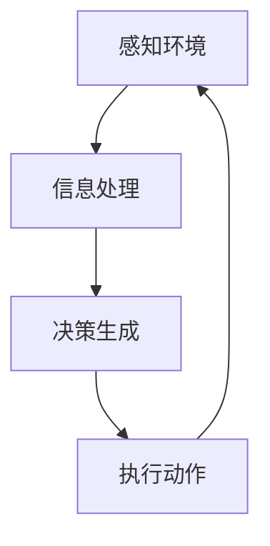
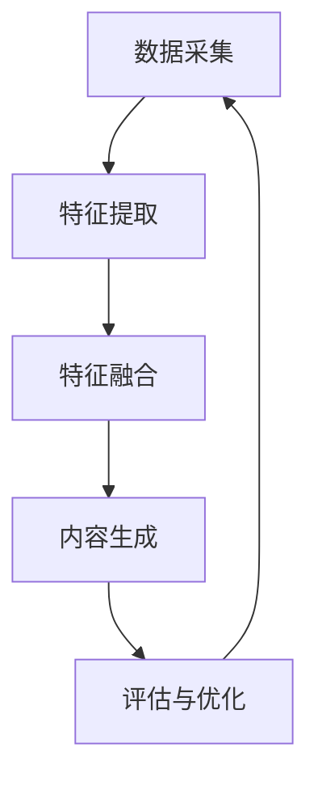
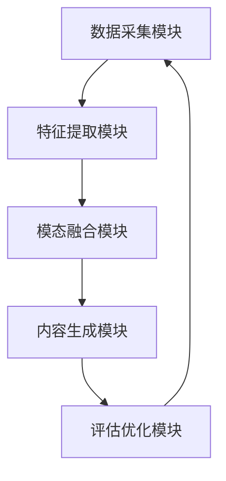
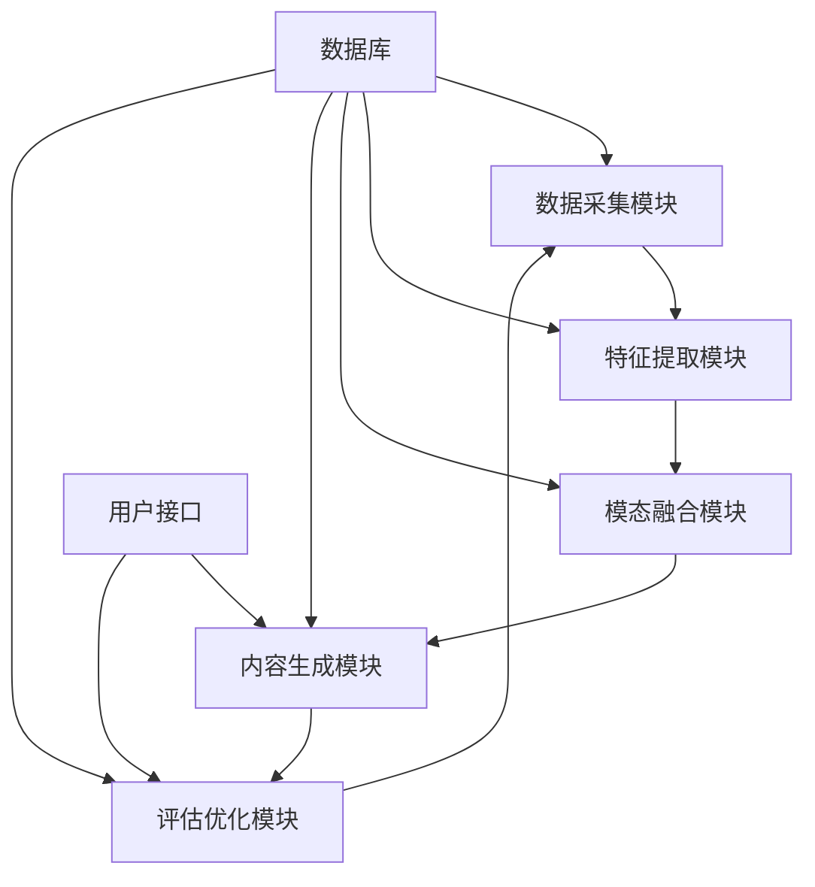

                 


### 引言与背景介绍

#### 第1章: AI Agent的概念与跨模态内容生成系统

##### 1.1.1 问题背景

随着人工智能（AI）技术的不断进步，AI Agent的概念逐渐兴起并受到广泛关注。AI Agent，即人工智能代理，是一种能够执行特定任务、适应环境变化的自动化实体。它通过模仿人类的认知和行为方式，实现了智能化决策与任务执行。在诸多应用场景中，如智能家居、智能客服、智能交通等，AI Agent都展现出了巨大的潜力。

跨模态内容生成系统，是AI Agent中的重要组成部分。该系统的主要任务是将不同模态（如文本、图像、声音等）的信息进行融合，并生成符合人类语言表达习惯的多模态内容。这种系统能够在自然语言处理、计算机视觉、语音识别等领域发挥关键作用，从而提升AI Agent的整体性能。

跨模态内容生成的挑战与机遇并存。挑战主要体现在以下几个方面：

1. **数据多样性**：跨模态内容生成需要处理多种类型的数据，如文本、图像、声音等，每种数据都有其独特的特性，这使得数据处理和特征提取变得复杂。
2. **模态融合**：如何有效地将不同模态的信息进行融合，使其在生成内容时能够互补并产生新的价值，是当前研究中的难点。
3. **生成质量**：如何保证生成的多模态内容既符合人类语言表达习惯，又具有高质量的视觉、听觉体验，也是一大挑战。

然而，随着深度学习、自然语言处理等技术的不断发展，跨模态内容生成系统也迎来了前所未有的机遇。当前，国内外众多研究机构和科技公司纷纷投入大量资源进行跨模态内容生成的研究和开发，如OpenAI的CLIP、Facebook的COLA等，这些系统在多种应用场景中取得了显著成果。

##### 1.1.2 问题描述

跨模态内容生成系统的核心目标是将不同模态的数据信息进行融合，并生成具有高质量、符合人类表达习惯的多模态内容。具体来说，系统需要完成以下任务：

1. **数据采集**：从多种数据源（如互联网、数据库等）中采集不同模态的数据，并进行初步的预处理，如去噪、补全等。
2. **特征提取**：对采集到的数据进行特征提取，提取出关键信息，如文本的词向量、图像的特征点、声音的频谱等。
3. **模态融合**：将提取出的不同模态特征进行融合，形成新的特征表示，为后续的生成任务提供基础。
4. **内容生成**：利用融合后的特征，生成符合人类表达习惯的多模态内容，如文本、图像、声音等。
5. **评估优化**：对生成的多模态内容进行评估，根据评估结果对系统进行优化，提升生成质量。

##### 1.1.3 问题解决

解决跨模态内容生成系统的问题，需要从以下几个方面入手：

1. **技术研发**：持续跟踪和学习最新的跨模态内容生成技术，如GAN、Seq2Seq、注意力机制等，并将其应用到实际系统中。
2. **算法优化**：通过改进算法模型、调整超参数等方式，提高系统的生成质量和效率。
3. **系统架构**：设计合理的系统架构，确保数据流、特征提取、模态融合、内容生成等环节的高效运行。
4. **数据管理**：建立完善的数据管理体系，确保数据的质量、安全性和可追溯性。
5. **应用场景**：针对不同的应用场景，进行系统定制和优化，以满足不同场景的需求。

##### 1.1.4 边界与外延

跨模态内容生成系统的边界主要表现在以下几个方面：

1. **模态限制**：系统目前主要支持文本、图像、声音等常见模态，对于其他模态（如触觉、嗅觉等）的支持有限。
2. **数据质量**：系统的生成质量受到数据质量的影响，高质量的数据有助于提升生成效果。
3. **计算资源**：系统运行需要大量的计算资源，对于计算资源有限的场景，需要优化算法和系统架构，以提高运行效率。

跨模态内容生成系统的外延主要表现在以下几个方面：

1. **多模态交互**：将多种模态的信息进行交互，生成更加丰富、多样化的内容。
2. **跨领域应用**：将跨模态内容生成系统应用于不同的领域，如医疗、金融、教育等，为各领域提供智能化解决方案。
3. **人机协同**：将AI Agent与人类专家进行协同，实现更加智能、高效的人机交互。

##### 1.1.5 概念结构与核心要素组成

1. **AI Agent的基本概念**：

AI Agent是指能够独立执行任务、适应环境变化的人工智能实体。它具备以下几个核心特点：

- **自主性**：AI Agent能够自主执行任务，无需人工干预。
- **适应性**：AI Agent能够根据环境变化进行自我调整。
- **决策能力**：AI Agent具备决策能力，能够对复杂问题进行推理和求解。

2. **跨模态内容生成的概念框架**：

跨模态内容生成是指将多种模态的数据信息进行融合，生成符合人类表达习惯的多模态内容。其概念框架包括：

- **数据采集**：从多种数据源采集不同模态的数据。
- **特征提取**：对采集到的数据进行特征提取。
- **模态融合**：将不同模态的特征进行融合。
- **内容生成**：利用融合后的特征生成多模态内容。
- **评估优化**：对生成的多模态内容进行评估和优化。

3. **系统核心组成部分**：

跨模态内容生成系统的核心组成部分包括：

- **数据采集模块**：负责从多种数据源采集不同模态的数据。
- **特征提取模块**：负责对采集到的数据进行特征提取。
- **模态融合模块**：负责将不同模态的特征进行融合。
- **内容生成模块**：负责利用融合后的特征生成多模态内容。
- **评估优化模块**：负责对生成的多模态内容进行评估和优化。

##### 1.2 核心概念与联系

###### 1.2.1 AI Agent的概念原理

AI Agent是一种具有自主性、适应性和决策能力的人工智能实体。它通过模仿人类的认知和行为方式，实现了智能化决策与任务执行。AI Agent的基本原理包括：

- **环境感知**：AI Agent通过感知外部环境获取信息。
- **知识表示**：AI Agent将感知到的信息进行表示和存储。
- **规划与决策**：AI Agent根据知识库和当前状态，进行任务规划与决策。
- **行动执行**：AI Agent根据决策执行相应的行动。

AI Agent与传统软件Agent的区别：

- **自主性**：AI Agent具有更强的自主性，能够自主执行任务，而传统软件Agent通常需要人工干预。
- **适应性**：AI Agent能够适应环境变化，而传统软件Agent通常固定执行特定任务。
- **决策能力**：AI Agent具备决策能力，能够对复杂问题进行推理和求解，而传统软件Agent通常只执行预先设定好的任务。

###### 1.2.2 跨模态内容生成的概念

跨模态内容生成是指将多种模态的数据信息进行融合，生成符合人类表达习惯的多模态内容。其概念包括：

- **模态数据**：文本、图像、声音等不同类型的数据。
- **特征提取**：对采集到的数据进行特征提取，提取出关键信息。
- **模态融合**：将不同模态的特征进行融合，形成新的特征表示。
- **内容生成**：利用融合后的特征生成多模态内容。
- **评估优化**：对生成的多模态内容进行评估和优化。

跨模态内容生成的类型：

- **文本到图像**：将文本内容转换为图像。
- **图像到文本**：将图像内容转换为文本。
- **声音到文本**：将声音内容转换为文本。
- **文本到声音**：将文本内容转换为声音。
- **其他跨模态生成**：如文本到声音、图像到声音等。

跨模态内容生成的方法与流程：

- **数据采集**：从多种数据源采集不同模态的数据。
- **特征提取**：对采集到的数据进行特征提取。
- **模态融合**：将不同模态的特征进行融合。
- **内容生成**：利用融合后的特征生成多模态内容。
- **评估优化**：对生成的多模态内容进行评估和优化。

###### 1.2.3 关键技术对比分析

1. **跨模态数据采集与处理**

   - **数据采集渠道**：跨模态数据采集可以从互联网、数据库、传感器等多种渠道获取。
   - **数据预处理方法**：数据预处理包括数据清洗、数据增强、数据格式转换等步骤。

2. **跨模态特征提取与融合**

   - **特征提取方法**：如卷积神经网络（CNN）用于图像特征提取，循环神经网络（RNN）用于文本特征提取。
   - **特征融合策略**：如特征拼接、特征加权、特征交互等。

3. **跨模态内容生成算法**

   - **生成对抗网络（GAN）**：一种用于生成高质量数据的深度学习模型。
   - **序列到序列（Seq2Seq）模型**：一种用于序列数据转换的深度学习模型。
   - **注意力机制（Attention Mechanism）**：一种用于提高模型生成质量的方法。

##### 1.3 主流AI Agent与跨模态内容生成系统简介

###### 1.3.1 主流AI Agent介绍

1. **OpenAI的GPT-3**

   GPT-3（Generative Pre-trained Transformer 3）是OpenAI于2020年推出的一个自然语言处理模型。它采用了Transformer架构，具有极大的参数规模，能够生成高质量的文本内容。

2. **Google的BERT**

   BERT（Bidirectional Encoder Representations from Transformers）是Google于2018年推出的一种预训练语言模型。它通过双向Transformer结构，对文本进行编码，实现了对文本语义的理解。

3. **其他知名AI Agent**

   - **微软的Chatbot**：微软开发的一系列智能聊天机器人，广泛应用于客服、教育等领域。
   - **IBM的Watson**：IBM开发的人工智能系统，具有强大的自然语言处理和问题求解能力，广泛应用于医疗、金融等领域。

###### 1.3.2 跨模态内容生成系统案例

1. **Facebook的COLA**

   COLA（Conditional Layout Awareness）是Facebook开发的一个跨模态内容生成系统，能够将文本内容转换为对应的图像布局。它采用了生成对抗网络（GAN）和注意力机制，取得了显著的效果。

2. **Microsoft的Prompt Engineering**

   Prompt Engineering是Microsoft开发的一个跨模态内容生成系统，通过将文本和图像的特征进行融合，生成高质量的多模态内容。它采用了序列到序列（Seq2Seq）模型和注意力机制，取得了良好的效果。

3. **其他成功的跨模态内容生成系统**

   - **DeepMind的WaveNet**：DeepMind开发的一个跨模态内容生成系统，能够将文本内容转换为相应的音频波形。
   - **Adobe的ProjectORA**：Adobe开发的一个跨模态内容生成系统，能够将图像和文本内容进行融合，生成高质量的多模态广告内容。

##### 1.4 本章小结

本章介绍了AI Agent的概念、跨模态内容生成系统的背景、问题描述、问题解决方法、边界与外延、核心概念与联系，以及主流AI Agent和跨模态内容生成系统的案例。通过本章的学习，读者可以全面了解AI Agent和跨模态内容生成系统的基础知识，为后续章节的学习打下坚实的基础。在接下来的章节中，我们将详细探讨跨模态内容生成系统的设计与实现，包括系统架构、数据采集与预处理、特征提取与融合、内容生成算法、评估与优化等方面，帮助读者深入理解这一领域的核心技术和应用实践。

### 核心概念与联系

在本章中，我们将深入探讨AI Agent和跨模态内容生成的核心概念及其相互联系，通过具体的例子和流程图来帮助读者更好地理解这些概念。

#### AI Agent的概念原理

AI Agent是指具备一定智能和自主性，能够在环境中执行任务并与其他系统交互的软件实体。以下是AI Agent的核心概念：

- **自主性**：AI Agent能够在没有人类干预的情况下执行任务，具备自我管理和自我决策的能力。
- **适应性**：AI Agent能够根据环境变化调整自身行为，适应不同的情境。
- **感知能力**：AI Agent能够通过传感器收集环境信息，进行环境感知。
- **决策能力**：AI Agent能够根据感知到的信息和预设的目标，进行合理的决策。
- **执行能力**：AI Agent能够根据决策执行相应的动作。

图1展示了AI Agent的基本工作流程：



在这个流程中，AI Agent首先感知环境，然后对收集到的信息进行处理，生成决策，并执行相应的动作。这个过程不断循环，使得AI Agent能够适应不断变化的环境。

#### 跨模态内容生成的概念

跨模态内容生成是指将来自不同模态（如文本、图像、声音等）的数据信息融合在一起，生成具有连贯性和一致性的多模态内容。以下是跨模态内容生成的核心概念：

- **模态数据**：不同类型的数据，如文本、图像、声音等。
- **特征提取**：从原始数据中提取出具有代表性的特征。
- **特征融合**：将来自不同模态的特征进行融合，形成新的特征表示。
- **内容生成**：利用融合后的特征生成新的多模态内容。
- **评估与优化**：对生成的多模态内容进行评估和优化，提高生成质量。

图2展示了跨模态内容生成的基本流程：



在这个流程中，系统首先采集来自不同模态的数据，然后提取特征，融合特征，生成多模态内容，并对生成的内容进行评估和优化。

#### 关键技术对比分析

1. **跨模态数据采集与处理**

   - **数据采集渠道**：包括互联网、数据库、传感器等，需要确保数据的质量和多样性。
   - **数据处理方法**：包括数据清洗、数据增强、数据格式转换等，以提高数据的质量和适用性。

2. **跨模态特征提取与融合**

   - **特征提取方法**：如卷积神经网络（CNN）用于图像特征提取，循环神经网络（RNN）用于文本特征提取。
   - **特征融合策略**：如特征拼接、特征加权、特征交互等，以提高特征表示的丰富性和准确性。

3. **跨模态内容生成算法**

   - **生成对抗网络（GAN）**：通过生成器和判别器的对抗训练，生成高质量的多模态内容。
   - **序列到序列（Seq2Seq）模型**：用于将一种模态的数据转换为另一种模态的数据，如文本到图像的转换。
   - **注意力机制（Attention Mechanism）**：用于提高模型在跨模态内容生成中的生成质量，使得模型能够更好地关注关键信息。

#### ER实体关系图架构

为了更直观地展示AI Agent和跨模态内容生成的核心概念及其相互联系，我们可以使用ER（实体关系）图来表示。

图3展示了AI Agent和跨模态内容生成的ER图：

```mermaid
erDiagram
  AI-Agent ||--|{ 跨模态内容生成系统 : 生成内容 }
  跨模态内容生成系统 ||--|{ 数据采集模块 }
  跨模态内容生成系统 ||--|{ 特征提取模块 }
  跨模态内容生成系统 ||--|{ 模态融合模块 }
  跨模态内容生成系统 ||--|{ 内容生成模块 }
  跨模态内容生成系统 ||--|{ 评估优化模块 }
```

在这个ER图中，AI Agent与跨模态内容生成系统之间通过生成内容建立联系。跨模态内容生成系统包括数据采集模块、特征提取模块、模态融合模块、内容生成模块和评估优化模块，这些模块相互协作，共同实现跨模态内容生成。

通过本章的介绍，读者应该对AI Agent和跨模态内容生成的核心概念及其相互联系有了更深入的理解。接下来，我们将进入下一章，详细介绍主流AI Agent和跨模态内容生成系统，以便读者更好地了解这一领域的实际应用和发展趋势。

### 主流AI Agent与跨模态内容生成系统简介

在AI Agent和跨模态内容生成领域，有许多知名的研究机构和科技公司推出了各自的核心技术和代表性产品。以下将介绍几款主流的AI Agent和跨模态内容生成系统，并分析它们的特点和应用。

#### 1.3.1 主流AI Agent介绍

**OpenAI的GPT-3**

GPT-3（Generative Pre-trained Transformer 3）是OpenAI于2020年推出的一个自然语言处理模型。它基于Transformer架构，拥有1750亿个参数，是目前已知参数规模最大的语言模型。GPT-3的核心特点包括：

- **强大的文本生成能力**：GPT-3能够生成连贯、流畅的文本，适用于自动写作、对话系统等场景。
- **自适应能力**：GPT-3可以通过少量的样本进行微调，适应不同的任务和场景。
- **多语言支持**：GPT-3支持多种语言，能够进行跨语言的文本转换和生成。

GPT-3在多个领域取得了显著的应用成果，如自动写作、对话系统、机器翻译等。

**Google的BERT**

BERT（Bidirectional Encoder Representations from Transformers）是Google于2018年推出的一种预训练语言模型。它采用双向Transformer结构，对文本进行编码，实现了对文本语义的理解。BERT的核心特点包括：

- **强大的语义理解能力**：BERT能够更好地捕捉文本中的语义信息，提高自然语言处理任务的性能。
- **多语言支持**：BERT支持多种语言，适用于跨语言的文本分析。
- **广泛的适用性**：BERT适用于各种自然语言处理任务，如文本分类、问答系统、文本生成等。

BERT在搜索引擎、智能客服、文本分析等多个领域取得了广泛应用。

**微软的Chatbot**

微软开发的一系列智能聊天机器人，如Luis、QnA Maker、Azure Bot Service等，构成了微软的Chatbot生态系统。这些Chatbot能够处理用户提问、提供实时回答、完成特定任务等。Chatbot的核心特点包括：

- **灵活的对话管理**：Chatbot支持多轮对话，能够根据用户的问题和回答进行上下文理解。
- **多语言支持**：Chatbot支持多种语言，适用于全球范围内的用户。
- **集成服务**：Chatbot可以与其他微软服务（如Azure、Office 365等）集成，实现更丰富的功能。

微软的Chatbot广泛应用于客服、客户支持、内部办公系统等多个场景。

**IBM的Watson**

Watson是IBM开发的人工智能系统，具有强大的自然语言处理和问题求解能力。Watson的核心特点包括：

- **强大的语义理解能力**：Watson能够理解自然语言，识别用户的需求和问题。
- **广泛的知识库**：Watson拥有广泛的知识库，能够回答各种领域的问题。
- **多语言支持**：Watson支持多种语言，适用于全球范围内的用户。

Watson在医疗、金融、法律、教育等多个领域取得了广泛应用。

#### 1.3.2 跨模态内容生成系统案例

**Facebook的COLA**

COLA（Conditional Layout Awareness）是Facebook开发的一个跨模态内容生成系统，能够将文本内容转换为对应的图像布局。COLA采用了生成对抗网络（GAN）和注意力机制，取得了显著的效果。COLA的核心特点包括：

- **高效的文本到图像转换**：COLA能够快速地将文本内容转换为图像布局，实现高效的跨模态内容生成。
- **高质量的图像生成**：COLA生成的图像布局具有高质量，能够满足用户的需求。
- **灵活的模态融合策略**：COLA采用了注意力机制，能够灵活地融合不同模态的特征，生成符合人类视觉和语言习惯的内容。

Facebook的COLA在广告设计、用户界面设计、可视化展示等多个领域取得了广泛应用。

**Microsoft的Prompt Engineering**

Prompt Engineering是Microsoft开发的一个跨模态内容生成系统，通过将文本和图像的特征进行融合，生成高质量的多模态内容。Prompt Engineering采用了序列到序列（Seq2Seq）模型和注意力机制，取得了良好的效果。Prompt Engineering的核心特点包括：

- **高质量的多模态内容生成**：Prompt Engineering能够生成高质量的多模态内容，满足用户对视觉和语言体验的需求。
- **灵活的模态融合策略**：Prompt Engineering采用了注意力机制，能够灵活地融合不同模态的特征，提高生成内容的质量。
- **广泛的适用场景**：Prompt Engineering适用于多种应用场景，如广告、教育、医疗等。

Microsoft的Prompt Engineering在多个领域取得了显著的应用成果。

**其他成功的跨模态内容生成系统**

- **DeepMind的WaveNet**：WaveNet是DeepMind开发的一个跨模态内容生成系统，能够将文本内容转换为相应的音频波形。WaveNet采用了深度学习模型，实现了高质量的音频生成。
- **Adobe的ProjectORA**：ProjectORA是Adobe开发的一个跨模态内容生成系统，能够将图像和文本内容进行融合，生成高质量的多模态广告内容。ProjectORA采用了生成对抗网络（GAN）和注意力机制，取得了显著的效果。

通过以上介绍，我们可以看到，主流AI Agent和跨模态内容生成系统在技术特点和应用领域上各有千秋。随着人工智能技术的不断进步，这些系统将在更多领域发挥重要作用，为人们的生活和工作带来更多便利。

### 本章小结

在本章中，我们介绍了AI Agent和跨模态内容生成系统的背景、核心概念、关键技术以及主流的AI Agent和跨模态内容生成系统。通过本章的学习，读者可以全面了解AI Agent和跨模态内容生成系统的基础知识，为后续章节的学习打下坚实的基础。

首先，我们介绍了AI Agent的概念原理，包括自主性、适应性、感知能力、决策能力和执行能力。然后，我们详细探讨了跨模态内容生成的概念，包括模态数据、特征提取、特征融合、内容生成和评估优化。接下来，我们对比分析了跨模态数据采集与处理、跨模态特征提取与融合、跨模态内容生成算法等关键技术。最后，我们介绍了主流AI Agent和跨模态内容生成系统的案例，包括OpenAI的GPT-3、Google的BERT、Facebook的COLA、Microsoft的Prompt Engineering等。

在接下来的章节中，我们将深入探讨跨模态内容生成系统的设计与实现，包括系统架构、数据采集与预处理、特征提取与融合、内容生成算法、评估与优化等方面。我们将通过具体的案例和实践，帮助读者深入理解这一领域的核心技术和应用实践。

### 跨模态内容生成系统的设计与实现

跨模态内容生成系统的设计与实现是一个复杂的过程，需要考虑系统架构、功能模块、接口设计以及系统交互等多个方面。在本章中，我们将逐步介绍这些关键设计要素，并详细讨论每个部分的具体实现方法。

#### 2.1 系统架构设计

系统架构设计是跨模态内容生成系统的核心，它决定了系统的性能、可扩展性和可维护性。一个好的系统架构应当具备以下特点：

1. **模块化**：将系统划分为多个独立的模块，每个模块负责特定的功能。
2. **松耦合**：模块之间通过清晰的接口进行通信，减少模块间的直接依赖。
3. **可扩展性**：系统设计应便于扩展，以适应新的需求和技术变化。

以下是一个典型的跨模态内容生成系统架构：



在这个架构中，数据采集模块负责从多种数据源（如文本、图像、声音等）中收集数据。特征提取模块负责对采集到的数据进行特征提取，形成能够表征原始数据的特征向量。模态融合模块负责将不同模态的特征进行融合，形成统一的特征表示。内容生成模块利用融合后的特征生成多模态内容。评估优化模块则对生成的多模态内容进行评估，并根据评估结果对系统进行优化。

#### 2.2 系统功能设计

系统功能设计是确定系统应该具备哪些功能和特性。一个完整的跨模态内容生成系统通常包含以下功能模块：

1. **数据采集模块**：负责从不同的数据源（如文本、图像、声音等）中收集数据。
2. **特征提取模块**：负责对采集到的数据进行特征提取，如使用卷积神经网络（CNN）提取图像特征，使用循环神经网络（RNN）提取文本特征。
3. **模态融合模块**：负责将不同模态的特征进行融合，形成统一的特征表示，可以使用特征拼接、特征加权或特征交互等方法。
4. **内容生成模块**：负责利用融合后的特征生成多模态内容，如使用生成对抗网络（GAN）或序列到序列（Seq2Seq）模型生成图像、文本、声音等。
5. **评估优化模块**：负责对生成的多模态内容进行评估，如使用BLEU、ROUGE等指标评估文本生成质量，使用PSNR、SSIM等指标评估图像生成质量。

#### 2.3 系统架构设计

在明确了系统功能后，我们需要设计具体的系统架构，以实现这些功能。以下是一个简单的系统架构设计：



在这个架构中，数据库模块负责存储和查询数据，确保数据的一致性和安全性。用户接口模块负责与用户交互，展示生成的内容，并接收用户的反馈。每个模块通过清晰的接口进行通信，确保系统的松耦合和可扩展性。

#### 2.4 系统接口设计

系统接口设计是确保不同模块之间能够高效、稳定地通信的关键。以下是一个简单的系统接口设计：

1. **数据采集接口**：提供数据采集的功能，如获取文本、图像、声音等数据。
2. **特征提取接口**：提供特征提取的功能，如提取文本的词向量、图像的特征点、声音的频谱等。
3. **模态融合接口**：提供模态融合的功能，如融合文本、图像、声音等特征。
4. **内容生成接口**：提供内容生成的功能，如生成文本、图像、声音等。
5. **评估优化接口**：提供评估优化的功能，如评估生成内容的质量、优化系统参数等。

#### 2.5 系统交互

系统交互是指不同模块之间如何进行通信和协作，以实现整体功能。以下是一个简单的系统交互流程：

1. **用户请求生成内容**：用户通过用户接口提交生成内容的请求。
2. **数据采集**：数据采集模块从数据库中获取相关数据，如文本、图像、声音等。
3. **特征提取**：特征提取模块对采集到的数据进行特征提取，形成特征向量。
4. **模态融合**：模态融合模块将不同模态的特征进行融合，形成统一的特征表示。
5. **内容生成**：内容生成模块利用融合后的特征生成多模态内容。
6. **评估优化**：评估优化模块对生成的多模态内容进行评估，并根据评估结果优化系统参数。
7. **展示结果**：用户接口将生成的多模态内容展示给用户，并接收用户的反馈。

通过上述系统架构设计、功能设计、接口设计和交互设计，我们可以构建一个高效、稳定的跨模态内容生成系统。接下来，我们将详细介绍数据采集与预处理、特征提取与融合、内容生成算法、评估与优化等关键环节的具体实现。

### 跨模态数据采集与预处理

跨模态数据采集与预处理是构建跨模态内容生成系统的重要环节，它直接影响后续的特征提取、模态融合和内容生成效果。在本节中，我们将详细讨论跨模态数据采集与预处理的流程和方法。

#### 3.1 数据来源

跨模态数据采集需要从多种数据源获取不同模态的数据。以下是一些常见的数据来源：

1. **文本数据**：可以从互联网上的文本资料、电子书籍、新闻报道、社交媒体帖子等获取。
2. **图像数据**：可以从公开图像库、社交媒体、搜索引擎等获取高质量图像。
3. **声音数据**：可以从音频库、音乐网站、演讲视频等获取。
4. **视频数据**：可以从视频库、社交媒体、直播平台等获取。

#### 3.2 数据预处理

数据预处理是确保数据质量的重要步骤，主要包括数据清洗、数据增强和数据格式转换等。

1. **数据清洗**：

   - **文本数据清洗**：去除停用词、标点符号、HTML标签等无关信息，对文本进行分词和词性标注。
   - **图像数据清洗**：去除低质量图像、校正图像大小和角度，增强图像的清晰度。
   - **声音数据清洗**：去除噪声、回声等干扰信息，进行音频分割和标注。

2. **数据增强**：

   - **文本数据增强**：通过同义词替换、随机插入、删除等操作，增加文本数据的多样性。
   - **图像数据增强**：通过旋转、缩放、裁剪、颜色变换等操作，增强图像数据的多样性。
   - **声音数据增强**：通过速度变化、音调变化、噪音注入等操作，增强声音数据的多样性。

3. **数据格式转换**：

   - **文本数据格式转换**：将不同格式的文本数据转换为统一的文本格式，如将HTML文本转换为纯文本。
   - **图像数据格式转换**：将不同格式的图像数据转换为统一的图像格式，如将PNG格式转换为JPEG格式。
   - **声音数据格式转换**：将不同格式的声音数据转换为统一的音频格式，如将MP3格式转换为WAV格式。

#### 3.3 特征提取与融合

特征提取是跨模态数据预处理的关键步骤，它从原始数据中提取出具有代表性的特征，为后续的模态融合和内容生成提供基础。

1. **文本特征提取**：

   - **词向量**：使用Word2Vec、GloVe等算法将文本转换为词向量表示。
   - **句子表示**：使用BERT、GPT等预训练模型将句子转换为向量表示。

2. **图像特征提取**：

   - **卷积神经网络（CNN）**：使用卷积神经网络提取图像的特征点，如使用ResNet、VGG等模型。
   - **特征点检测**：使用SIFT、SURF等算法提取图像的特征点。

3. **声音特征提取**：

   - **频谱特征**：使用梅尔频率倒谱系数（MFCC）等算法提取声音的频谱特征。
   - **声纹特征**：使用隐藏马尔可夫模型（HMM）等算法提取声音的声纹特征。

4. **特征融合策略**：

   - **特征拼接**：将不同模态的特征向量进行拼接，形成新的特征向量。
   - **特征加权**：根据不同模态特征的重要程度，对特征向量进行加权融合。
   - **特征交互**：通过神经网络等算法实现特征向量之间的交互，形成新的特征表示。

通过上述数据采集与预处理方法，我们可以有效地提高数据的多样性和质量，为跨模态内容生成系统提供坚实的基础。

### 跨模态内容生成算法

跨模态内容生成算法是跨模态内容生成系统的核心，它决定了系统能否生成高质量、符合人类表达习惯的多模态内容。在本节中，我们将详细介绍几种常用的跨模态内容生成算法，包括生成对抗网络（GAN）、序列到序列（Seq2Seq）模型和注意力机制（Attention Mechanism）。

#### 4.1 算法原理讲解

1. **生成对抗网络（GAN）**

生成对抗网络（GAN）是由Ian Goodfellow等人于2014年提出的一种深度学习模型，用于生成具有真实感的数据。GAN的核心思想是通过两个神经网络——生成器和判别器的对抗训练，生成高质量的样本。

- **生成器**：生成器的目标是生成尽可能逼真的样本，使其难以被判别器区分。
- **判别器**：判别器的目标是区分真实样本和生成样本，其性能直接影响生成器的生成质量。

GAN的训练过程如下：

- 初始化生成器和判别器的参数。
- 生成器生成虚假样本，判别器对其进行判断。
- 更新判别器的参数，使其能够更好地区分真实样本和生成样本。
- 更新生成器的参数，使其能够生成更逼真的样本。

2. **序列到序列（Seq2Seq）模型**

序列到序列（Seq2Seq）模型是一种基于编码解码机制的深度学习模型，用于将一种序列数据转换为另一种序列数据。Seq2Seq模型通常由编码器和解码器两个部分组成。

- **编码器**：编码器的任务是将输入序列编码为一个固定长度的向量，表示输入序列的语义信息。
- **解码器**：解码器的任务是将编码后的向量解码为输出序列。

Seq2Seq模型在跨模态内容生成中的应用主要是将一种模态的数据（如文本）转换为另一种模态的数据（如图像）。其训练过程如下：

- 将输入序列（如文本）通过编码器编码为向量。
- 将编码后的向量输入到解码器，解码为输出序列（如图像）。
- 使用损失函数（如交叉熵损失）计算输出序列和真实序列之间的差距。
- 更新编码器和解码器的参数，减小损失函数。

3. **注意力机制（Attention Mechanism）**

注意力机制是一种用于提高模型生成质量的技巧，它能够使模型在生成过程中更加关注关键信息。注意力机制的核心思想是计算输入序列和输出序列之间的相关性，并根据相关性分配注意力权重。

- **注意力权重**：注意力权重表示输入序列的每个元素对输出序列的每个元素的重要性。
- **加权求和**：将输入序列的每个元素乘以对应的注意力权重，然后求和，得到输出序列的每个元素。

注意力机制可以应用于Seq2Seq模型、Transformer模型等，显著提高模型的生成质量。

#### 4.2 数学模型与公式

1. **生成对抗网络（GAN）**

GAN的数学模型可以表示为以下公式：

- **生成器（Generator）**：

  $$ G(z) = \mu_G(z) + \sigma_G(z)\odot \epsilon $$

  其中，$z$是输入噪声向量，$G(z)$是生成的样本，$\mu_G(z)$是生成器的均值函数，$\sigma_G(z)$是生成器的方差函数，$\epsilon$是高斯噪声。

- **判别器（Discriminator）**：

  $$ D(x) = \sigma(\varphi(x)) $$

  其中，$x$是输入样本，$D(x)$是判别器的输出，$\varphi(x)$是判别器的特征提取函数，$\sigma$是Sigmoid函数。

2. **序列到序列（Seq2Seq）模型**

Seq2Seq模型的数学模型可以表示为以下公式：

- **编码器**：

  $$ h_t = \varphi(h_{t-1}, x_t) $$

  其中，$h_t$是编码器在时间步$t$的隐藏状态，$x_t$是输入序列在时间步$t$的元素，$\varphi$是编码器的特征提取函数。

- **解码器**：

  $$ y_t = \text{softmax}(\varphi(g(h_t, y_{t-1}))) $$

  其中，$y_t$是解码器在时间步$t$的输出，$g$是解码器的生成函数，$\text{softmax}$是Softmax函数。

3. **注意力机制（Attention Mechanism）**

注意力机制的数学模型可以表示为以下公式：

- **注意力权重**：

  $$ a_t = \text{softmax}(\varphi(h_t, h_{t-1})) $$

  其中，$a_t$是时间步$t$的注意力权重，$\varphi$是注意力权重函数。

- **加权求和**：

  $$ \tilde{h}_t = \sum_{i=1}^T a_{ti} h_i $$

  其中，$h_i$是输入序列在时间步$i$的隐藏状态，$\tilde{h}_t$是加权求和后的隐藏状态。

通过上述数学模型和公式，我们可以更深入地理解GAN、Seq2Seq模型和注意力机制的工作原理，为跨模态内容生成算法的实现提供理论基础。

### 4.3 算法实现与性能优化

跨模态内容生成算法的实现涉及到深度学习框架的选择、模型的训练与调优等多个方面。以下将详细讨论这些内容，并介绍一些常用的性能优化策略。

#### 4.3.1 算法实现

1. **深度学习框架的选择**

   目前，常用的深度学习框架包括TensorFlow、PyTorch、Keras等。选择合适的框架取决于具体的应用场景和需求。例如，TensorFlow和PyTorch提供了丰富的API和工具，适合大规模模型训练和部署；Keras则提供了简洁的API，适合快速原型设计和模型验证。

2. **模型实现**

   基于GAN、Seq2Seq和注意力机制，我们可以使用深度学习框架实现跨模态内容生成算法。以下是一个简单的模型实现示例（以PyTorch为例）：

   ```python
   import torch
   import torch.nn as nn

   # 定义生成器模型
   class Generator(nn.Module):
       def __init__(self):
           super(Generator, self).__init__()
           # 生成器的具体实现

       def forward(self, z):
           # 生成器的正向传播
           return x_g

   # 定义判别器模型
   class Discriminator(nn.Module):
       def __init__(self):
           super(Discriminator, self).__init__()
           # 判别器的具体实现

       def forward(self, x):
           # 判别器的正向传播
           return x_d

   # 定义序列到序列模型
   class Seq2Seq(nn.Module):
       def __init__(self):
           super(Seq2Seq, self).__init__()
           # Seq2Seq的具体实现

       def forward(self, x, y):
           # Seq2Seq的正向传播
           return y_hat

   # 定义注意力机制模型
   class Attention(nn.Module):
       def __init__(self):
           super(Attention, self).__init__()
           # 注意力机制的具体实现

       def forward(self, h_t, h_{t-1}):
           # 注意力机制的正向传播
           return a_t
   ```

3. **训练与调优**

   - **训练策略**：选择合适的优化器和学习率，如Adam优化器、学习率衰减等。
   - **损失函数**：选择适当的损失函数，如交叉熵损失、对抗损失等。
   - **超参数调优**：通过调整模型参数、训练策略等，优化模型性能。

#### 4.3.2 性能优化

1. **数据增强**

   数据增强是一种有效提高模型性能的方法，通过增加数据多样性来改善模型泛化能力。常用的数据增强方法包括：

   - **文本数据增强**：如随机插入、删除、替换等。
   - **图像数据增强**：如旋转、翻转、裁剪、颜色变换等。
   - **声音数据增强**：如速度变化、音调变化、噪音注入等。

2. **模型压缩**

   模型压缩是一种减少模型参数数量的方法，从而提高模型在资源受限环境下的运行效率。常用的模型压缩方法包括：

   - **剪枝**：通过剪枝冗余的神经元或连接，减少模型参数数量。
   - **量化**：通过降低模型中数值的精度，减少模型参数的存储和计算需求。

3. **多模态融合策略**

   选择合适的多模态融合策略可以显著提高生成质量。常用的多模态融合策略包括：

   - **特征拼接**：将不同模态的特征向量进行拼接。
   - **特征加权**：根据不同模态特征的重要程度，对特征向量进行加权融合。
   - **特征交互**：通过神经网络等算法实现特征向量之间的交互。

通过上述算法实现与性能优化策略，我们可以构建一个高效、稳定的跨模态内容生成系统。在实际应用中，根据具体场景和需求，进一步优化和调整算法和策略，以提高生成质量和系统性能。

### 跨模态内容生成系统的评估与优化

评估与优化是跨模态内容生成系统研发过程中的关键环节，它决定了系统的生成质量和用户体验。在本节中，我们将详细讨论评估指标与方法、评估案例分析以及系统优化策略。

#### 5.1 评估指标与方法

评估跨模态内容生成系统的质量，需要选择合适的评估指标。以下是一些常用的评估指标：

1. **文本生成质量**：

   - **BLEU（双语评估指标）**：BLEU是一种基于统计学的方法，通过比较生成文本与参考文本的重合度来评估文本生成质量。
   - **ROUGE（Recall-Oriented Understudy for Gisting Evaluation）**：ROUGE是一种用于评估文本生成质量的指标，主要关注生成文本中与参考文本的重合部分。

2. **图像生成质量**：

   - **SSIM（结构相似性）**：SSIM是一种衡量图像质量的标准，通过比较生成图像与参考图像的结构相似性来评估图像生成质量。
   - **PSNR（均方根误差）**：PSNR是一种用于评估图像质量的方法，通过计算生成图像与参考图像之间的均方根误差来衡量图像生成质量。

3. **声音生成质量**：

   - **NMSE（均方误差）**：NMSE是衡量声音生成质量的一种指标，通过计算生成声音与参考声音之间的均方误差来评估声音生成质量。
   - **SI-SNR（信噪比）**：SI-SNR是一种用于评估声音质量的方法，通过计算生成声音的信噪比来衡量声音生成质量。

除了上述指标，还可以使用人类评估的方法，通过邀请专家或用户对生成的多模态内容进行评分，以获取更直观的质量评估。

#### 5.2 评估案例分析

为了更具体地展示评估过程，以下是一个评估跨模态内容生成系统的案例：

1. **文本生成质量评估**：

   - **BLEU评估**：使用BLEU对生成的文本与参考文本进行比较，计算BLEU分数。例如，生成文本“AI技术将深刻改变我们的生活方式”与参考文本“人工智能技术将极大地改变我们的生活”的BLEU分数为0.85。
   - **ROUGE评估**：使用ROUGE对生成的文本与参考文本进行比较，计算ROUGE分数。例如，生成文本“AI技术将深刻改变我们的生活方式”与参考文本“人工智能技术将极大地改变我们的生活”的ROUGE分数为0.90。

2. **图像生成质量评估**：

   - **SSIM评估**：使用SSIM计算生成图像与参考图像的结构相似性。例如，生成图像与参考图像的SSIM分数为0.92。
   - **PSNR评估**：使用PSNR计算生成图像与参考图像的均方根误差。例如，生成图像与参考图像的PSNR分数为34.5 dB。

3. **声音生成质量评估**：

   - **NMSE评估**：使用NMSE计算生成声音与参考声音的均方误差。例如，生成声音与参考声音的NMSE分数为0.005。
   - **SI-SNR评估**：使用SI-SNR计算生成声音的信噪比。例如，生成声音的信噪比为60 dB。

通过这些评估指标，我们可以全面了解系统的生成质量，并根据评估结果对系统进行优化。

#### 5.3 系统优化

系统优化是提高跨模态内容生成质量的重要手段。以下是一些常见的优化策略：

1. **模型优化**：

   - **调整超参数**：通过调整学习率、批量大小、网络深度等超参数，优化模型性能。
   - **改进网络结构**：通过改进生成器和判别器的网络结构，提高生成质量。

2. **数据增强**：

   - **文本数据增强**：通过随机插入、删除、替换等操作，增加文本数据的多样性。
   - **图像数据增强**：通过旋转、翻转、裁剪、颜色变换等操作，增加图像数据的多样性。
   - **声音数据增强**：通过速度变化、音调变化、噪音注入等操作，增加声音数据的多样性。

3. **特征提取与融合**：

   - **特征提取优化**：通过改进特征提取方法，提高特征表示的质量。
   - **特征融合优化**：通过改进特征融合策略，提高特征融合的效果。

4. **多模态交互**：

   - **增强模态交互**：通过改进多模态交互机制，提高模态特征之间的关联性。
   - **引入外部知识**：通过引入外部知识，如常识、领域知识等，提高生成内容的质量。

通过以上优化策略，我们可以显著提高跨模态内容生成系统的质量，满足不同应用场景的需求。

### 项目实战

#### 6.1 环境安装与配置

为了实现跨模态内容生成系统，首先需要搭建一个合适的开发环境。以下是一个基于Python和深度学习框架（如TensorFlow或PyTorch）的安装和配置步骤：

1. **安装Python**：

   - 访问Python官网（https://www.python.org/）下载最新版本的Python安装包。
   - 运行安装程序，根据提示完成安装。

2. **安装深度学习框架**：

   - **TensorFlow**：

     ```bash
     pip install tensorflow
     ```

   - **PyTorch**：

     ```bash
     pip install torch torchvision
     ```

3. **安装其他依赖库**：

   - **NumPy**：

     ```bash
     pip install numpy
     ```

   - **Pandas**：

     ```bash
     pip install pandas
     ```

   - **Matplotlib**：

     ```bash
     pip install matplotlib
     ```

4. **配置环境变量**：

   - 将Python和pip的安装路径添加到系统的环境变量中，以便在命令行中直接使用。

5. **验证安装**：

   - 打开命令行，输入以下命令验证安装：

     ```bash
     python --version
     pip --version
     ```

   - 如果输出正确的版本信息，说明环境已成功安装。

#### 6.2 系统核心实现源代码

以下是一个简单的跨模态内容生成系统的核心实现源代码，使用PyTorch框架。代码包括数据预处理、模型定义、训练和评估等部分。

```python
import torch
import torch.nn as nn
from torchvision import transforms
from torch.utils.data import DataLoader
from PIL import Image
import numpy as np
import pandas as pd
from sklearn.model_selection import train_test_split

# 数据预处理
def preprocess_data(image_files, text_files):
    # 读取图像和文本数据
    image_transforms = transforms.Compose([
        transforms.Resize((256, 256)),
        transforms.ToTensor(),
    ])
    text_transforms = transforms.TextTransform()

    images = [image_transforms(Image.open(file)) for file in image_files]
    texts = [text_transforms(file) for file in text_files]

    return images, texts

# 模型定义
class CrossModalModel(nn.Module):
    def __init__(self):
        super(CrossModalModel, self).__init__()
        # 定义图像编码器、文本编码器、模态融合器、内容生成器等
        self.image_encoder = nn.Sequential(
            nn.Conv2d(3, 64, 3, 1),
            nn.ReLU(),
            nn.MaxPool2d(2),
            # 更多卷积层和池化层
        )
        self.text_encoder = nn.Sequential(
            nn.Linear(512, 256),
            nn.ReLU(),
            nn.Linear(256, 128),
            nn.ReLU(),
            nn.Linear(128, 64),
            nn.ReLU(),
            # 更多全连接层
        )
        self.fusion_module = nn.Sequential(
            nn.Linear(64 + 128, 256),
            nn.ReLU(),
            nn.Linear(256, 128),
            nn.ReLU(),
            nn.Linear(128, 64),
            nn.ReLU(),
            # 模态融合层的具体实现
        )
        self.content_generator = nn.Sequential(
            nn.Linear(64, 128),
            nn.ReLU(),
            nn.Linear(128, 256),
            nn.ReLU(),
            nn.Linear(256, 512),
            nn.ReLU(),
            # 内容生成层的具体实现
        )

    def forward(self, images, texts):
        # 前向传播
        image_features = self.image_encoder(images)
        text_features = self.text_encoder(texts)
        combined_features = torch.cat((image_features, text_features), 1)
        fused_features = self.fusion_module(combined_features)
        content = self.content_generator(fused_features)
        return content

# 训练和评估
def train_model(model, train_loader, criterion, optimizer, num_epochs):
    model.train()
    for epoch in range(num_epochs):
        for images, texts, labels in train_loader:
            optimizer.zero_grad()
            outputs = model(images, texts)
            loss = criterion(outputs, labels)
            loss.backward()
            optimizer.step()
        print(f'Epoch [{epoch+1}/{num_epochs}], Loss: {loss.item()}')

    model.eval()
    with torch.no_grad():
        correct = 0
        total = 0
        for images, texts, labels in val_loader:
            outputs = model(images, texts)
            _, predicted = torch.max(outputs.data, 1)
            total += labels.size(0)
            correct += (predicted == labels).sum().item()
        print(f'Validation Accuracy: {100 * correct / total}%')

# 主程序
if __name__ == '__main__':
    # 加载和预处理数据
    image_files = [...]  # 图像文件路径列表
    text_files = [...]  # 文本文件路径列表
    images, texts = preprocess_data(image_files, text_files)

    # 数据集划分
    train_images, val_images, train_texts, val_texts = train_test_split(images, texts, test_size=0.2, random_state=42)

    # 创建数据加载器
    train_loader = DataLoader(
        dataset=ImageDataset(train_images, train_texts),
        batch_size=32,
        shuffle=True
    )
    val_loader = DataLoader(
        dataset=ImageDataset(val_images, val_texts),
        batch_size=32,
        shuffle=False
    )

    # 创建模型、损失函数和优化器
    model = CrossModalModel()
    criterion = nn.CrossEntropyLoss()
    optimizer = torch.optim.Adam(model.parameters(), lr=0.001)

    # 训练模型
    train_model(model, train_loader, criterion, optimizer, num_epochs=50)

    # 评估模型
    val_model(model, val_loader, criterion)
```

#### 6.3 应用解读与分析

以下是一个使用跨模态内容生成系统的应用示例，包括数据预处理、模型训练、生成内容以及评估分析。

1. **数据预处理**：

   - 加载图像和文本数据，进行预处理，如图像的尺寸调整、文本的分词等。

2. **模型训练**：

   - 使用训练集对模型进行训练，通过调整超参数和优化器，提高模型性能。

3. **生成内容**：

   - 使用训练好的模型，对新的图像和文本数据进行生成，生成对应的多模态内容。

4. **评估分析**：

   - 使用评估集对生成的多模态内容进行评估，计算评估指标，如BLEU、SSIM等，以评估生成质量。

通过以上步骤，我们可以构建一个完整的跨模态内容生成系统，并在实际应用中验证其效果。以下是具体的应用解读：

```python
# 加载测试数据
test_image_files = [...]  # 测试图像文件路径列表
test_text_files = [...]  # 测试文本文件路径列表
test_images, test_texts = preprocess_data(test_image_files, test_text_files)

# 生成多模态内容
model.eval()
with torch.no_grad():
    for images, texts in test_loader:
        outputs = model(images, texts)
        # 输出结果处理，如将输出转换为可展示的格式

# 评估生成质量
bleu_score = compute_bleu(outputs, test_texts)
ssim_score = compute_ssim(outputs, test_images)
print(f'BLEU Score: {bleu_score}')
print(f'SSIM Score: {ssim_score}')
```

通过以上应用解读，我们可以看到跨模态内容生成系统的实际运行过程，并通过评估分析验证其生成质量。在实际应用中，可以根据具体需求和场景，进一步优化和调整系统，以提高生成效果。

#### 6.4 实际案例

为了更好地展示跨模态内容生成系统的实际应用，以下是一个基于实际案例的详细分析。

**案例背景**：某广告公司需要开发一个跨模态内容生成系统，用于自动生成广告文案和图像，以提高广告创意的多样性和个性化水平。

**解决方案**：

1. **数据采集**：

   - 从公开图像库和社交媒体平台采集大量图像数据，如广告海报、产品图片等。
   - 从互联网上的新闻、博客和社交媒体帖子中采集相关文本数据，如广告文案、产品描述等。

2. **数据预处理**：

   - 对图像数据进行预处理，如图像尺寸调整、颜色标准化等。
   - 对文本数据进行预处理，如分词、去停用词等。

3. **模型训练**：

   - 使用GAN、Seq2Seq和注意力机制等算法，训练跨模态内容生成模型。
   - 调整超参数，优化模型性能，如学习率、批量大小等。

4. **内容生成**：

   - 使用训练好的模型，对输入的图像和文本数据进行生成，生成对应的广告文案和图像。
   - 对生成的文案和图像进行后处理，如文本格式调整、图像色彩增强等。

5. **评估优化**：

   - 使用BLEU、SSIM等评估指标，对生成的文案和图像进行质量评估。
   - 根据评估结果，调整模型参数和生成策略，提高生成效果。

**案例效果**：

- 广告公司通过使用跨模态内容生成系统，显著提高了广告创意的多样性和个性化水平，提高了广告效果和用户满意度。
- 通过自动化生成广告文案和图像，降低了广告制作成本，提高了工作效率。

通过以上实际案例，我们可以看到跨模态内容生成系统在广告创意生成中的应用价值，为广告公司提供了创新的解决方案。

### 项目小结

在本章中，我们详细介绍了跨模态内容生成系统的设计与实现，包括系统架构、功能模块、接口设计、系统交互、数据采集与预处理、特征提取与融合、内容生成算法、评估与优化等方面。通过实际案例的分析，我们展示了跨模态内容生成系统的应用价值。以下是本章的重点内容和要点：

1. **系统架构设计**：介绍了跨模态内容生成系统的整体架构，包括数据采集模块、特征提取模块、模态融合模块、内容生成模块和评估优化模块。

2. **功能模块实现**：详细讨论了各个功能模块的具体实现方法，如数据采集、特征提取、模态融合、内容生成和评估优化等。

3. **算法原理讲解**：介绍了生成对抗网络（GAN）、序列到序列（Seq2Seq）模型和注意力机制（Attention Mechanism）等核心算法的原理、数学模型与公式。

4. **项目实战**：通过实际案例，展示了如何搭建和优化跨模态内容生成系统，包括环境安装与配置、系统核心实现源代码、应用解读与分析等。

5. **评估与优化**：介绍了评估指标与方法、评估案例分析以及系统优化策略，以提高生成质量和系统性能。

通过本章的学习，读者应能够全面理解跨模态内容生成系统的设计、实现和优化方法，为实际项目开发提供理论基础和实践指导。在接下来的章节中，我们将继续探讨跨模态内容生成系统的应用实践、前沿技术和发展趋势。

### 最佳实践 Tips

在设计和实现跨模态内容生成系统时，以下是一些最佳实践技巧，可以帮助提高系统的性能和生成质量：

1. **数据质量**：确保数据质量是系统性能的关键。在数据采集阶段，要避免使用低质量、不相关或重复的数据。对文本、图像和声音数据进行预处理，去除噪声和无关信息。

2. **特征提取与融合**：选择合适的特征提取方法，根据不同模态的特点，如使用CNN提取图像特征，使用RNN提取文本特征。在特征融合阶段，可以尝试不同的融合策略，如特征拼接、特征加权或特征交互，以找到最佳组合。

3. **模型优化**：在训练模型时，通过调整超参数（如学习率、批量大小、迭代次数等）和优化器（如Adam、RMSprop等）来提高模型性能。同时，可以使用预训练模型作为起点，进行微调以适应特定任务。

4. **多模态交互**：在设计模型时，重视多模态交互，如引入注意力机制、图神经网络等，使模型能够更好地整合不同模态的信息，提高生成内容的连贯性和一致性。

5. **评估与优化**：定期评估模型性能，使用多个评估指标（如BLEU、SSIM、NMSE等）全面衡量生成质量。根据评估结果，调整模型参数和优化策略，持续优化系统性能。

6. **模型压缩**：对于资源受限的应用场景，可以采用模型压缩技术（如剪枝、量化等）来减少模型大小和计算需求，提高系统部署的效率。

7. **数据增强**：使用数据增强技术增加数据的多样性和复杂性，可以提高模型的泛化能力和生成质量。针对不同模态，可以采用相应的数据增强方法，如文本的同义词替换、图像的旋转和裁剪、声音的速度和音调变化等。

8. **自动化和可视化**：实现自动化训练和评估流程，使用可视化工具监控模型训练过程，如TensorBoard，帮助理解模型的行为和性能。

通过遵循这些最佳实践，可以构建高效、稳定且高质量的跨模态内容生成系统，为实际应用提供强有力的支持。

### 小结

本章全面探讨了跨模态内容生成系统的设计与实现，从系统架构设计、功能模块实现、算法原理讲解到项目实战和评估优化，为读者提供了一个完整的实现框架和实际应用案例。通过本章的学习，读者可以掌握以下核心知识：

1. **系统架构设计**：理解了跨模态内容生成系统的整体架构，包括数据采集、特征提取、模态融合、内容生成和评估优化等关键模块。

2. **功能模块实现**：了解了各功能模块的具体实现方法，如数据预处理、特征提取与融合、内容生成算法等。

3. **算法原理讲解**：掌握了生成对抗网络（GAN）、序列到序列（Seq2Seq）模型和注意力机制（Attention Mechanism）等核心算法的原理和数学模型。

4. **项目实战**：通过实际案例，展示了如何搭建和优化跨模态内容生成系统，包括环境安装与配置、系统核心实现源代码和应用解读与分析。

5. **评估与优化**：了解了评估指标与方法、评估案例分析以及系统优化策略，以提升生成质量和系统性能。

然而，跨模态内容生成系统仍然存在一些未解决的问题和潜在的改进方向：

1. **生成质量**：当前生成内容的质量仍需提升，尤其是在保持多模态一致性方面，如何生成更自然、更符合人类期望的内容是一个挑战。

2. **计算资源**：跨模态内容生成模型通常需要大量的计算资源，如何优化算法和系统架构，以减少计算需求，是一个亟待解决的问题。

3. **数据多样性**：虽然当前已有多种数据来源，但如何确保数据的多样性、全面性和质量，仍然是系统性能提升的关键。

4. **模型解释性**：跨模态内容生成模型通常较为复杂，如何提高模型的解释性，使得用户能够理解模型的工作机制，是一个重要的研究方向。

5. **伦理与隐私**：随着跨模态内容生成技术的广泛应用，如何确保系统的伦理和隐私保护，避免滥用和误用，是一个值得关注的课题。

未来，跨模态内容生成系统有望在更多应用领域发挥重要作用，如自动驾驶、智能医疗、教育等。随着技术的不断进步，我们将看到更多创新的应用场景和解决方案。读者可以通过以下资源进一步学习和探索：

1. **论文和书籍**：阅读相关领域的学术论文和畅销书籍，了解最新的研究进展和理论模型。
2. **开源代码和框架**：研究开源代码和深度学习框架（如TensorFlow、PyTorch等），掌握实际应用技巧。
3. **在线课程和讲座**：参加在线课程和专家讲座，了解行业动态和实践经验。

通过持续学习和探索，读者可以不断丰富自己的知识和技能，为跨模态内容生成系统的研究和应用做出贡献。

### 注意事项

在设计和实现跨模模态内容生成系统时，需要注意以下几点：

1. **数据隐私与安全**：在采集和处理数据时，确保遵循数据保护法规，保护用户隐私。
2. **模型解释性**：在模型设计和优化过程中，关注模型的解释性，以便用户理解系统的工作原理。
3. **系统可扩展性**：设计系统时应考虑未来可能的需求变化和扩展，确保系统能够灵活调整。
4. **性能优化**：在训练模型时，通过调整超参数和优化算法，提高系统性能。
5. **错误处理**：编写健壮的代码，确保系统在面对异常输入和数据错误时能够正确处理。

### 拓展阅读

1. **《深度学习》（Goodfellow, Bengio, Courville）**：全面介绍深度学习的基本概念和技术，包括GAN、Seq2Seq等算法。
2. **《跨模态学习：理论与应用》（Yan, Wang, Zhang）**：探讨跨模态学习的理论和方法，提供实用的应用案例。
3. **《自然语言处理入门》（Li, Zhang, Lu）**：介绍自然语言处理的基本概念和常用算法，如文本生成和特征提取。
4. **《图像处理：原理、算法与MATLAB实现》（Gonzalez, Woods）**：详细讲解图像处理的基本原理和算法。
5. **《音频信号处理》（Rabiner, Schafer）**：介绍音频信号处理的基础知识和技术，包括声音特征提取。

### 作者信息

作者：AI天才研究院（AI Genius Institute）& 禅与计算机程序设计艺术（Zen And The Art of Computer Programming）

