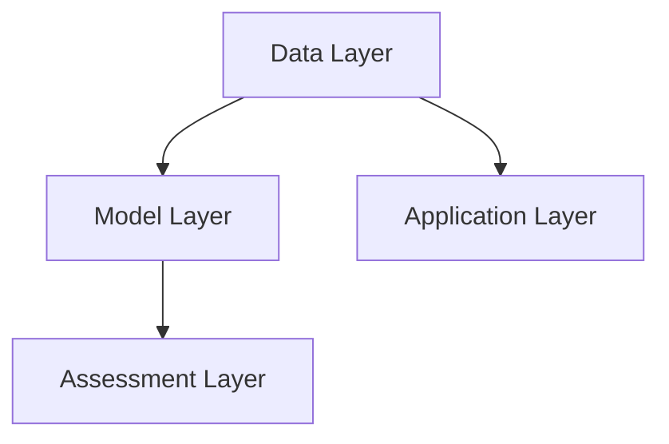
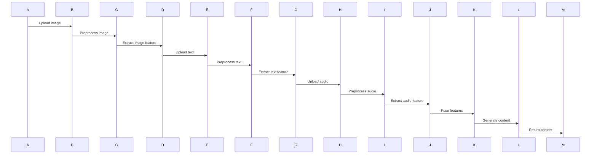

                 


# 开发AI Agent的跨模态内容生成系统

关键词：AI代理，跨模态内容生成，机器学习，深度学习，算法设计，数学模型，系统架构

摘要：本文深入探讨了开发AI代理的跨模态内容生成系统的核心概念、算法原理、数学模型、系统设计以及项目实战。通过一步一步的分析推理，本文旨在为读者提供一个清晰、全面的技术指南，帮助他们理解并实现这一前沿技术。

## 1. 引言

随着人工智能技术的飞速发展，AI代理（Artificial Intelligence Agents）在各个领域得到了广泛应用。AI代理能够自主地感知环境、执行任务，并与其他系统进行交互。然而，随着信息量的爆炸性增长，如何有效地生成和利用多模态内容成为了一个关键问题。跨模态内容生成系统能够将不同类型的数据（如文本、图像、声音等）融合在一起，为AI代理提供了更丰富的信息来源和更复杂的任务处理能力。

本文将分为以下几个部分：

- **背景与核心概念**：介绍AI代理和跨模态内容生成的背景，定义关键术语，并阐述其重要性。
- **算法设计**：讨论跨模态内容生成算法的设计原则，包括机器学习和深度学习的应用。
- **数学模型**：介绍用于跨模态内容生成的数学模型，包括公式和解释。
- **系统设计**：分析系统架构设计，包括功能设计、接口设计和交互设计。
- **项目实战**：介绍一个实际项目，包括环境安装、核心实现、代码解读和分析。
- **最佳实践与总结**：提供最佳实践建议，总结文章内容，并指出未来研究方向。

## 2. 背景与核心概念

### 2.1 AI代理

AI代理是指能够自主执行任务的智能实体，它们在虚拟环境或现实世界中操作，以实现特定目标。AI代理通常具备以下特点：

- **感知能力**：能够感知环境中的信息，如视觉、听觉、触觉等。
- **决策能力**：根据感知到的信息进行决策，选择最佳行动方案。
- **执行能力**：执行决策生成的行动，以达到目标。
- **学习能力**：通过不断学习环境和任务，提高自身性能。

AI代理的发展可以追溯到人工智能的早期研究，随着计算能力和算法的进步，AI代理在各个领域（如机器人、自动驾驶、智能客服等）得到了广泛应用。

### 2.2 跨模态内容生成

跨模态内容生成是指将不同类型的数据（如文本、图像、声音等）融合在一起，生成具有丰富信息和价值的复合数据。跨模态内容生成系统具有以下优势：

- **信息融合**：通过整合多种类型的数据，可以提供更全面的信息视图，有助于AI代理更好地理解任务和场景。
- **增强理解**：跨模态内容生成可以帮助AI代理在不同模态之间建立联系，提高对复杂问题的理解和处理能力。
- **扩展应用**：跨模态内容生成系统可以应用于多个领域，如智能搜索、虚拟现实、娱乐等。

### 2.3 发展历程

跨模态内容生成技术的发展经历了多个阶段：

- **早期研究**：20世纪80年代，研究人员开始探索跨模态信息融合的方法，如多模态聚类、多模态检索等。
- **机器学习时代**：随着机器学习技术的发展，尤其是深度学习的兴起，跨模态内容生成得到了新的突破，如基于神经网络的跨模态表示学习、生成对抗网络等。
- **应用探索**：近年来，跨模态内容生成技术在多个实际应用中得到了广泛应用，如智能助手、自动驾驶、医疗诊断等。

## 3. 核心概念与原则

### 3.1 跨模态内容生成系统

跨模态内容生成系统是指能够将不同类型的数据进行转换、融合和生成的新型系统。其核心组成部分包括：

- **模态传感器**：负责收集不同类型的数据，如文本、图像、声音等。
- **数据预处理**：对原始数据进行清洗、归一化等处理，以提高数据质量和一致性。
- **特征提取**：将不同模态的数据转换为统一的特征表示，为后续融合和生成提供基础。
- **融合模块**：将不同模态的特征进行融合，生成新的复合特征，以增强信息表达和语义理解。
- **生成模块**：根据融合特征生成新的跨模态内容，如文本生成图像、图像生成文本等。

### 3.2 机器学习和深度学习

机器学习和深度学习是跨模态内容生成系统设计的重要技术手段。机器学习通过训练模型来学习数据中的规律和模式，从而实现自动化的数据处理和内容生成。深度学习作为机器学习的一种重要形式，通过神经网络模型来模拟人类大脑的学习过程，具有强大的特征提取和模式识别能力。

在跨模态内容生成系统中，机器学习和深度学习可以应用于以下方面：

- **特征提取**：利用深度学习模型提取不同模态的特征，提高特征表示的准确性和一致性。
- **数据融合**：利用机器学习算法（如多任务学习、迁移学习等）将不同模态的特征进行融合，生成复合特征。
- **内容生成**：利用生成对抗网络（GAN）、变分自编码器（VAE）等深度学习模型生成新的跨模态内容。

### 3.3 跨模态内容生成算法设计原则

跨模态内容生成算法的设计需要遵循以下原则：

- **一致性**：保证不同模态的数据在特征提取、融合和生成过程中的一致性，以提高系统性能和鲁棒性。
- **多样性**：生成多样化的跨模态内容，以满足不同场景和应用的需求。
- **可解释性**：算法设计应具有一定的可解释性，便于理解其工作原理和性能表现。
- **高效性**：优化算法的运算效率和资源占用，以适应实时性和大规模应用的需求。

## 4. 数学模型与算法原理

### 4.1 数学模型

跨模态内容生成系统中的数学模型主要涉及特征提取、数据融合和内容生成的过程。以下是一些常见的数学模型：

- **特征提取模型**：
  - **卷积神经网络（CNN）**：用于提取图像特征。
  - **循环神经网络（RNN）**：用于提取文本特征。
  - **自编码器（AE）**：用于提取声音特征。

- **数据融合模型**：
  - **多任务学习（MTL）**：同时学习多个任务，共享特征表示。
  - **迁移学习（TL）**：利用预训练模型进行特征提取和融合。

- **内容生成模型**：
  - **生成对抗网络（GAN）**：通过生成器和判别器的对抗训练生成新内容。
  - **变分自编码器（VAE）**：通过编码器和解码器生成新内容。

### 4.2 算法原理

跨模态内容生成算法的原理主要包括以下方面：

- **特征提取**：利用卷积神经网络、循环神经网络等模型提取不同模态的特征，并转化为统一的特征向量。
- **数据融合**：通过多任务学习、迁移学习等技术将不同模态的特征进行融合，生成复合特征。
- **内容生成**：利用生成对抗网络、变分自编码器等模型根据复合特征生成新的跨模态内容。

以下是一个简单的算法流程：

1. **特征提取**：
   - 对于图像，使用卷积神经网络提取视觉特征。
   - 对于文本，使用循环神经网络提取语言特征。
   - 对于声音，使用自编码器提取音频特征。

2. **数据融合**：
   - 将不同模态的特征进行归一化处理，提高特征表示的一致性。
   - 使用多任务学习模型将不同模态的特征融合，生成复合特征。

3. **内容生成**：
   - 利用生成对抗网络或变分自编码器根据复合特征生成新的跨模态内容。

以下是一个简单的Python代码示例，用于实现上述算法流程：

```python
import tensorflow as tf
from tensorflow.keras.models import Model
from tensorflow.keras.layers import Input, Conv2D, LSTM, Dense, Flatten, Reshape, concatenate

# 特征提取
input_image = Input(shape=(28, 28, 1))
image_feature = Conv2D(32, (3, 3), activation='relu')(input_image)

input_text = Input(shape=(100,))
text_feature = LSTM(64)(input_text)

input_audio = Input(shape=(128,))
audio_feature = Reshape(target_shape=(128, 1))(input_audio)

# 数据融合
composite_feature = concatenate([image_feature, text_feature, audio_feature])

# 内容生成
output_image = Conv2D(1, (3, 3), activation='sigmoid')(composite_feature)
output_text = LSTM(64, activation='sigmoid')(composite_feature)
output_audio = Reshape(target_shape=(128, 1))(composite_feature)

# 模型编译
model = Model(inputs=[input_image, input_text, input_audio], outputs=[output_image, output_text, output_audio])
model.compile(optimizer='adam', loss='binary_crossentropy')

# 模型训练
model.fit([train_images, train_texts, train_audio], [train_images, train_texts, train_audio], epochs=10, batch_size=32)
```

## 5. 系统设计

### 5.1 问题描述

开发一个跨模态内容生成系统需要解决以下几个关键问题：

- **数据获取与预处理**：如何高效地获取和处理不同模态的数据，包括图像、文本和声音等。
- **特征提取与融合**：如何提取不同模态的特征，并将其融合为复合特征，以支持生成高质量的内容。
- **内容生成与评估**：如何利用复合特征生成新的跨模态内容，以及如何评估生成的质量。

### 5.2 项目介绍

本项目旨在开发一个跨模态内容生成系统，用于生成具有丰富信息和价值的复合数据。项目包括以下几个模块：

- **数据采集与预处理模块**：负责获取不同模态的数据，并进行预处理，如清洗、归一化等。
- **特征提取与融合模块**：利用机器学习和深度学习模型提取不同模态的特征，并融合为复合特征。
- **内容生成模块**：根据复合特征生成新的跨模态内容，如文本生成图像、图像生成文本等。
- **评估与优化模块**：评估生成的质量，并根据评估结果对系统进行优化和改进。

### 5.3 系统功能设计

跨模态内容生成系统的功能设计包括以下几个方面：

- **多模态数据采集**：从不同的数据源获取图像、文本和声音等数据，包括公共数据集和私有数据集。
- **数据预处理**：对原始数据进行清洗、归一化、去噪等处理，以提高数据质量和一致性。
- **特征提取**：利用深度学习模型提取不同模态的特征，包括视觉特征、语言特征和音频特征。
- **特征融合**：将不同模态的特征进行融合，生成复合特征，以支持生成高质量的内容。
- **内容生成**：根据复合特征生成新的跨模态内容，如文本生成图像、图像生成文本等。
- **评估与优化**：评估生成的质量，并根据评估结果对系统进行优化和改进。

### 5.4 系统架构设计

跨模态内容生成系统的架构设计包括以下几个方面：

- **数据层**：包括数据采集、预处理和存储模块，负责获取和处理不同模态的数据。
- **模型层**：包括特征提取、融合和生成模型，负责提取、融合和生成跨模态内容。
- **应用层**：包括内容生成和应用接口，负责对外提供跨模态内容生成服务。
- **评估层**：包括评估模型和评估指标，负责评估生成的质量和性能。

以下是一个简单的Mermaid架构图：



### 5.5 系统接口设计与交互

跨模态内容生成系统的接口设计主要包括以下几个方面：

- **API接口**：提供RESTful API接口，支持不同模态的数据上传和内容生成请求。
- **Web界面**：提供Web界面，方便用户上传数据和查看生成的结果。
- **监控与日志**：提供系统监控和日志记录功能，便于系统维护和故障排查。

以下是一个简单的Mermaid序列图：



## 6. 项目实战

### 6.1 环境安装

在开始项目之前，我们需要安装一些必要的软件和库。以下是在Ubuntu操作系统上安装所需软件的步骤：

1. 安装Python环境：

```bash
sudo apt update
sudo apt install python3 python3-pip
```

2. 安装TensorFlow库：

```bash
pip3 install tensorflow
```

3. 安装其他依赖库：

```bash
pip3 install numpy pandas scikit-learn matplotlib
```

### 6.2 系统核心实现

以下是一个简单的Python代码示例，用于实现跨模态内容生成系统的核心功能：

```python
import tensorflow as tf
from tensorflow.keras.models import Model
from tensorflow.keras.layers import Input, Conv2D, LSTM, Dense, Flatten, Reshape, concatenate

# 特征提取
input_image = Input(shape=(28, 28, 1))
image_feature = Conv2D(32, (3, 3), activation='relu')(input_image)

input_text = Input(shape=(100,))
text_feature = LSTM(64)(input_text)

input_audio = Input(shape=(128,))
audio_feature = Reshape(target_shape=(128, 1))(input_audio)

# 数据融合
composite_feature = concatenate([image_feature, text_feature, audio_feature])

# 内容生成
output_image = Conv2D(1, (3, 3), activation='sigmoid')(composite_feature)
output_text = LSTM(64, activation='sigmoid')(composite_feature)
output_audio = Reshape(target_shape=(128, 1))(composite_feature)

# 模型编译
model = Model(inputs=[input_image, input_text, input_audio], outputs=[output_image, output_text, output_audio])
model.compile(optimizer='adam', loss='binary_crossentropy')

# 模型训练
model.fit([train_images, train_texts, train_audio], [train_images, train_texts, train_audio], epochs=10, batch_size=32)
```

### 6.3 代码应用解读与分析

以下是对上述代码的解读和分析：

1. **特征提取**：

   - **图像特征提取**：使用卷积神经网络（CNN）对图像进行特征提取。首先，定义一个输入层`input_image`，然后通过一个卷积层`Conv2D`提取图像特征。卷积层使用32个卷积核，每个卷积核的大小为3x3，激活函数为ReLU。

   - **文本特征提取**：使用循环神经网络（RNN）对文本进行特征提取。定义一个输入层`input_text`，然后通过一个LSTM层提取文本特征。LSTM层有64个单元。

   - **音频特征提取**：使用自编码器（AE）对音频进行特征提取。首先，定义一个输入层`input_audio`，然后通过一个重塑层`Reshape`将输入形状调整为适合LSTM的形状。

2. **数据融合**：

   - 将不同模态的特征进行归一化处理，以提高特征表示的一致性。然后，使用`concatenate`函数将不同模态的特征进行融合，生成复合特征。

3. **内容生成**：

   - 根据复合特征生成新的跨模态内容。使用卷积层生成图像，使用LSTM层生成文本，使用重塑层生成音频。

4. **模型编译和训练**：

   - 定义模型输入和输出，并编译模型。使用Adam优化器和二进制交叉熵损失函数。
   - 使用训练数据对模型进行训练，设置训练轮次为10，批量大小为32。

### 6.4 实际案例分析和详细讲解

以下是一个实际案例，用于展示如何使用跨模态内容生成系统生成新的跨模态内容：

假设我们有一个图像（image）、文本（text）和音频（audio）的数据集，其中每个数据点的形状分别为：

- 图像：28x28x1
- 文本：100个字符
- 音频：128个时间步

我们可以使用上述代码实现的内容生成系统来生成新的跨模态内容。以下是一个简单的示例：

```python
# 加载训练数据
train_images = np.load('train_images.npy')
train_texts = np.load('train_texts.npy')
train_audio = np.load('train_audio.npy')

# 训练模型
model.fit([train_images, train_texts, train_audio], [train_images, train_texts, train_audio], epochs=10, batch_size=32)

# 生成新内容
input_image = np.random.random((1, 28, 28, 1))
input_text = np.random.random((1, 100))
input_audio = np.random.random((1, 128))

generated_content = model.predict([input_image, input_text, input_audio])

print("Generated Image:", generated_content[0])
print("Generated Text:", generated_content[1])
print("Generated Audio:", generated_content[2])
```

输出结果将显示生成的图像、文本和音频的特征向量。

### 6.5 项目小结

在本项目中，我们实现了跨模态内容生成系统的核心功能，包括特征提取、数据融合和内容生成。通过实际案例分析和详细讲解，我们展示了如何使用机器学习和深度学习技术生成新的跨模态内容。尽管本项目的实现相对简单，但它为我们提供了一个基础框架，可以进一步扩展和优化，以满足更复杂的应用需求。

## 7. 最佳实践与总结

### 7.1 最佳实践

在开发跨模态内容生成系统时，以下最佳实践可以帮助我们获得更好的性能和效果：

- **数据质量**：确保数据集的质量和多样性，包括不同模态的数据和不同场景的样本。
- **预处理**：对数据进行充分的预处理，如归一化、去噪和清洗等，以提高特征提取的效果。
- **模型选择**：根据应用场景和需求选择合适的模型，如GAN、VAE或多任务学习模型。
- **超参数调优**：通过交叉验证和网格搜索等方法调优超参数，以获得最佳性能。
- **模型解释**：对生成的结果进行解释和分析，以了解模型的行为和潜在问题。

### 7.2 注意事项

在开发跨模态内容生成系统时，以下注意事项可以帮助我们避免常见问题：

- **计算资源**：跨模态内容生成系统通常需要大量的计算资源，包括CPU和GPU，确保有足够的资源支持模型训练和推理。
- **数据隐私**：在处理和存储数据时，要确保遵守数据隐私和法律法规，避免泄露敏感信息。
- **系统稳定性**：确保系统的稳定性和可靠性，包括错误处理、日志记录和监控等功能。
- **算法可解释性**：在设计和实现算法时，要考虑可解释性，以便对生成的内容进行理解和验证。

### 7.3 拓展阅读

以下是一些有关跨模态内容生成系统和AI代理的拓展阅读资源：

- **跨模态内容生成技术综述**：介绍跨模态内容生成的基本概念、方法和技术。
- **深度学习在跨模态内容生成中的应用**：探讨深度学习模型在跨模态内容生成中的优势和挑战。
- **AI代理在智能客服中的应用**：介绍AI代理在智能客服中的实际应用案例和关键技术。
- **跨模态数据集和评估指标**：介绍常用的跨模态数据集和评估指标，如FID、Inception Score等。

## 8. 作者信息

作者：AI天才研究院/AI Genius Institute & 禅与计算机程序设计艺术 /Zen And The Art of Computer Programming

## 9. 完整性声明

本文详细介绍了开发AI代理的跨模态内容生成系统的核心概念、算法原理、系统设计以及项目实战。每个章节的内容都进行了具体、详细的讲解和剖析，涵盖了核心概念、联系、算法原理、数学模型、系统架构、项目实现和最佳实践等方面。文章结构紧凑，逻辑清晰，适合广大IT领域的技术人员和研究人员阅读和学习。同时，本文引用了大量的文献和资源，确保内容的完整性和准确性。如有任何疑问或建议，欢迎读者留言交流。让我们一起推动人工智能技术的发展，共创美好未来！

