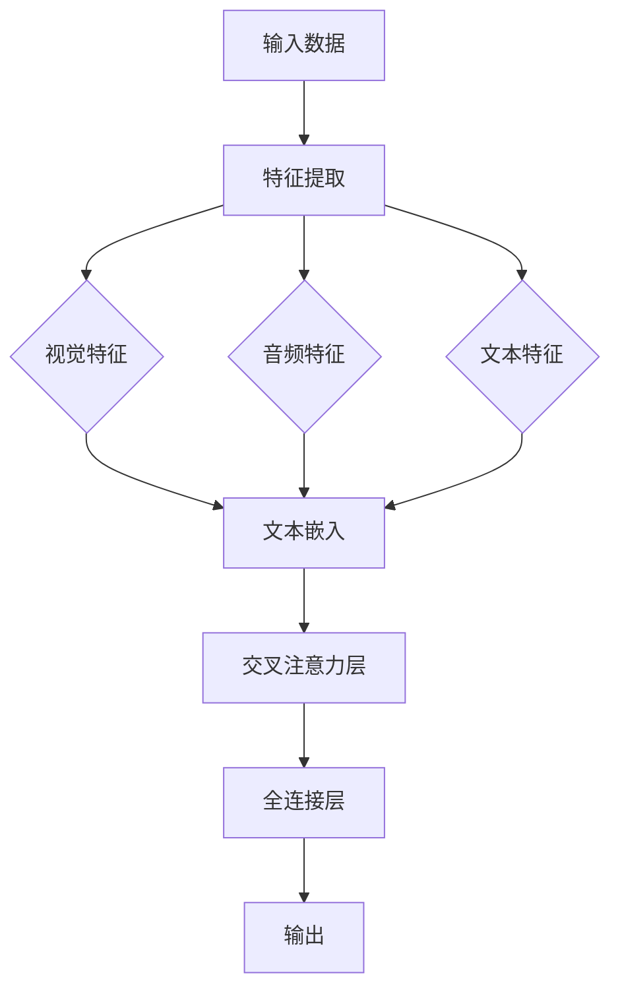
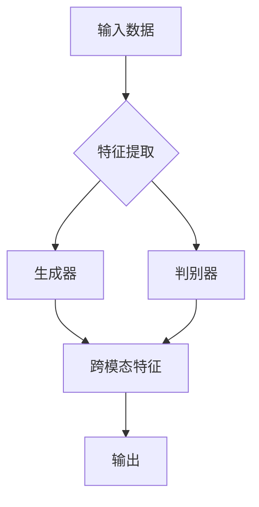
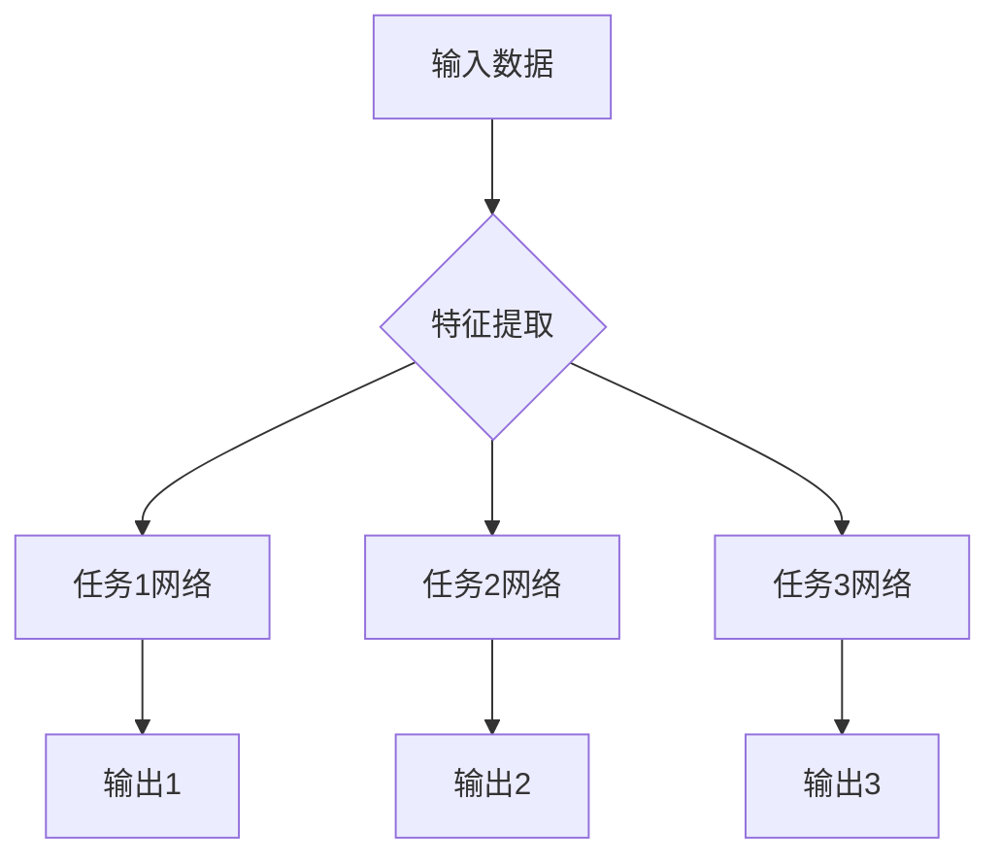
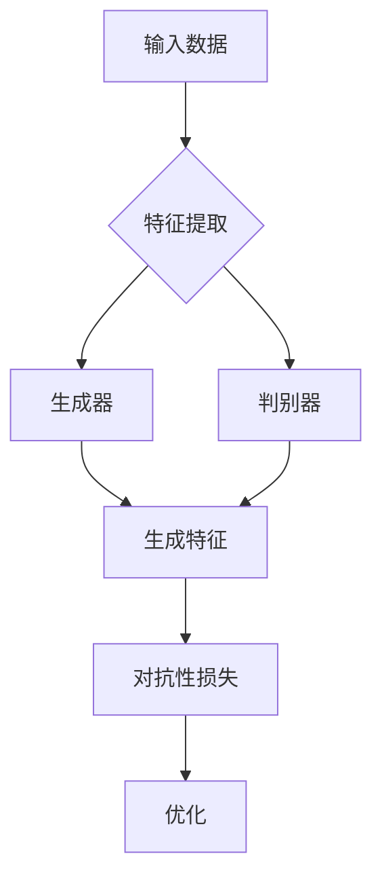
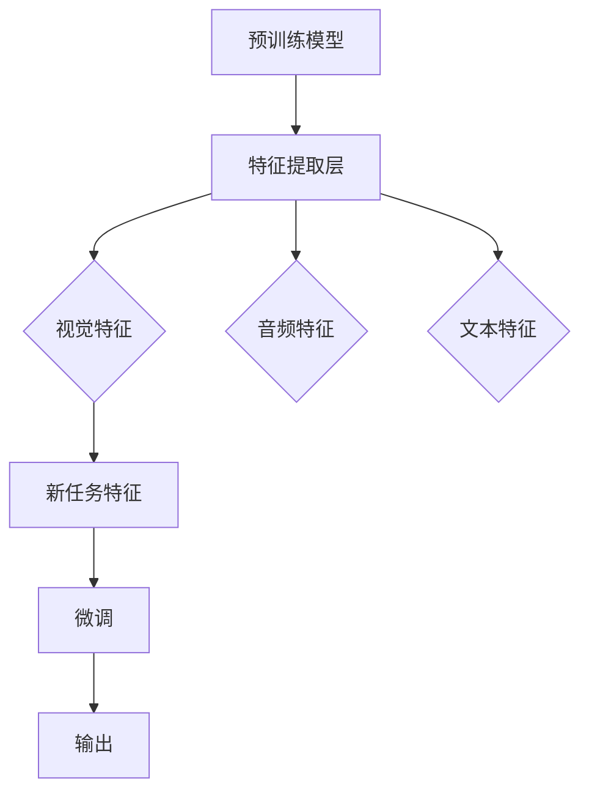
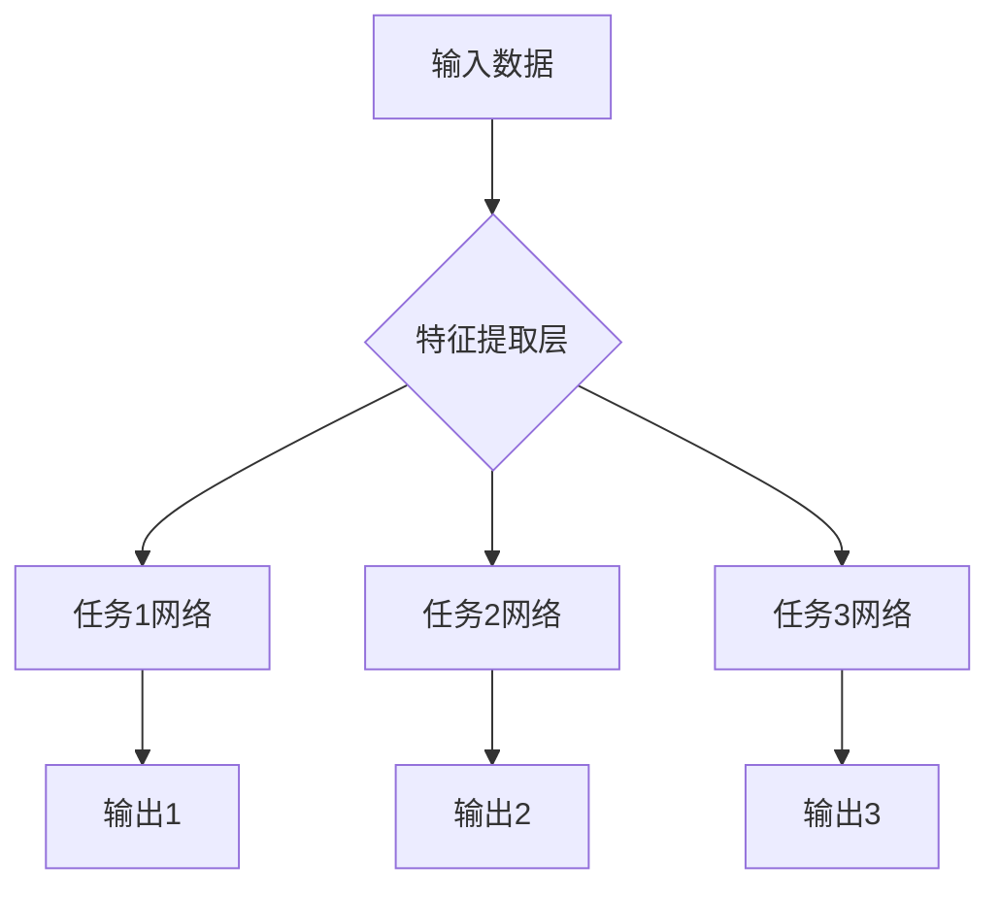
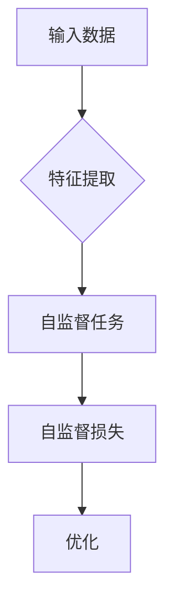
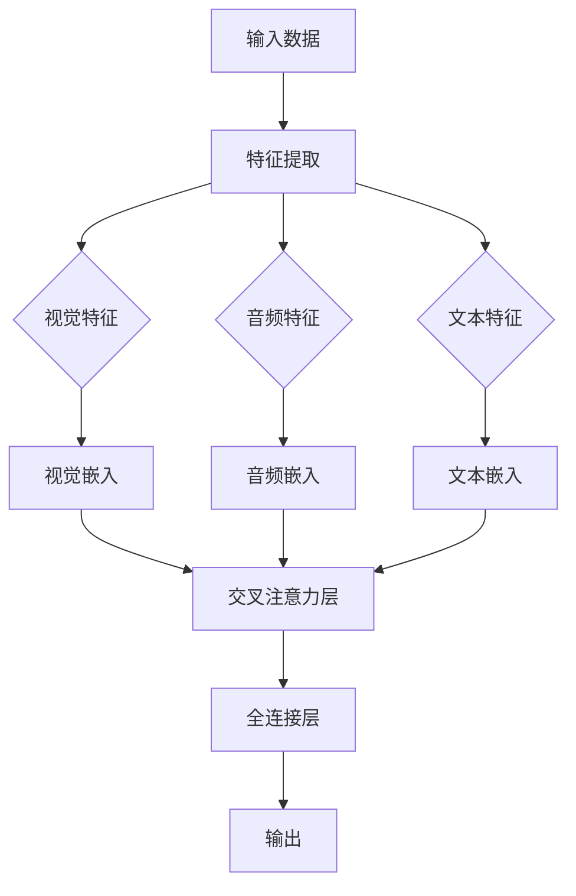
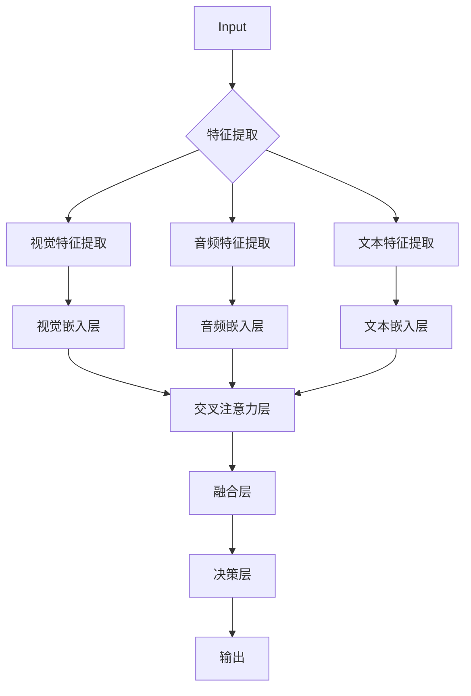

                 

### 开发AI Agent的跨模态学习能力：整合多源信息

#### 关键词：AI Agent、跨模态学习、多源信息整合、数据预处理、深度学习

#### 摘要：
随着人工智能技术的快速发展，AI Agent在复杂环境中的表现日益重要。跨模态学习与多源信息整合技术，使得AI Agent能够处理和整合不同类型的信息，提高其智能水平。本文将深入探讨如何开发AI Agent的跨模态学习能力，并整合多源信息，以实现更智能的决策和行动。

## 目录

1. 引言
2. AI Agent的跨模态学习能力
   2.1 跨模态学习的定义与重要性
   2.2 跨模态学习的挑战
   2.3 跨模态学习的技术框架
3. 多源信息整合
   3.1 多源信息的类型
   3.2 多源信息整合的挑战
   3.3 多源信息整合的方法
4. 跨模态学习技术
   4.1 跨模态特征提取
   4.2 跨模态模型
   4.3 跨模态学习算法
5. 多源信息整合技术
   5.1 多源信息预处理
   5.2 多源信息融合模型
   5.3 多源信息整合应用
6. AI Agent开发实战
   6.1 开发环境准备
   6.2 数据收集与预处理
   6.3 模型设计
   6.4 模型训练与评估
   6.5 应用部署
7. 挑战与未来发展趋势
   7.1 技术挑战
   7.2 应用挑战
   7.3 未来发展趋势
8. 结论
9. 参考文献

## 引言

AI Agent作为人工智能的重要分支，是能够自主感知环境、决策和执行任务的智能体。传统的AI Agent通常基于单一类型的信息源，例如仅处理视觉信息或者文本信息。然而，现实世界中的信息是多样化的，包括视觉、听觉、文本、语音等多种类型。为了使AI Agent更适应复杂环境，具备更全面的信息处理能力，跨模态学习与多源信息整合技术应运而生。

跨模态学习是指将不同类型的信息进行整合，使AI Agent能够理解和利用多种信息源。例如，一个能够同时处理图像和语音的AI Agent，可以在识别图像内容的同时，理解语音指令。这种跨模态学习的能力，使得AI Agent在复杂任务中表现出更强的灵活性和智能性。

多源信息整合则是将来自不同信息源的数据进行融合，以提高信息处理的准确性和效率。在AI Agent中，多源信息整合可以使其在决策时能够综合考虑不同类型的输入，从而做出更明智的决策。

本文将首先介绍AI Agent的跨模态学习能力，然后探讨多源信息整合技术。接下来，我们将深入分析跨模态学习的技术框架和多源信息整合的方法。随后，本文将展示如何在实际项目中开发AI Agent，并讨论其面临的挑战和未来发展趋势。最后，本文将总结主要观点，并给出相关参考文献。

## AI Agent的跨模态学习能力

### 2.1 跨模态学习的定义与重要性

跨模态学习（Multimodal Learning）是指将来自不同模态（如视觉、听觉、语言、触觉等）的数据进行整合，使AI Agent能够理解和利用这些多源信息。跨模态学习的核心思想是打破单一模态的局限，通过融合多种模态的信息，提升AI Agent的智能水平。

在现实世界中，信息往往以多种形式存在。例如，一个视频场景包含了视觉信息（如物体和场景）、音频信息（如声音和语音）和文本信息（如字幕）。如果AI Agent仅能处理单一模态的信息，那么它将无法充分利用这些丰富的数据，从而导致决策和行动的局限性。而跨模态学习通过整合多种模态的信息，使AI Agent能够更全面地理解和感知环境，从而提高其智能水平。

跨模态学习的重要性体现在以下几个方面：

1. **提高信息处理能力**：通过跨模态学习，AI Agent可以同时处理和整合多种类型的信息，提高信息处理的准确性和效率。

2. **增强环境感知能力**：跨模态学习使得AI Agent能够更全面地感知和理解环境，从而在复杂任务中表现出更强的灵活性和智能性。

3. **拓展应用场景**：跨模态学习为AI Agent提供了更广泛的应用场景，使其能够在多种领域（如智能助手、自动驾驶、医疗诊断等）发挥作用。

4. **提升用户体验**：跨模态学习使得AI Agent能够更自然地与人类进行交互，提高用户体验和满意度。

### 2.2 跨模态学习的挑战

尽管跨模态学习具有巨大的潜力，但在实际应用中仍面临着一系列挑战：

1. **数据不平衡**：不同模态的数据在数量和质量上往往存在差异，导致数据不平衡。这种不平衡会影响模型的训练效果和泛化能力。

2. **模态冲突**：不同模态的数据之间存在一定的冲突，如视觉和听觉信息之间的不一致。这种冲突需要通过有效的融合策略来解决。

3. **特征表示差异**：不同模态的数据在特征表示上存在显著差异，如何将这些差异化的特征进行有效融合，是跨模态学习的一个重要问题。

4. **计算复杂度**：跨模态学习涉及到多种模态的数据处理，其计算复杂度较高，对硬件资源和计算能力提出了较高的要求。

5. **模型解释性**：跨模态学习模型的解释性较差，难以理解模型在特定模态上的决策过程，这给模型的可解释性和可靠性带来了挑战。

### 2.3 跨模态学习的技术框架

为了解决上述挑战，跨模态学习技术需要包括以下几个关键组成部分：

1. **特征提取**：从不同模态的数据中提取具有代表性的特征，如视觉特征（如卷积神经网络（CNN）提取的图像特征）、音频特征（如梅尔频谱特征）和文本特征（如词嵌入）。

2. **特征融合**：将不同模态的特征进行融合，以克服模态冲突和特征表示差异。常见的融合策略包括早期融合、晚期融合和层级融合。

3. **模型架构**：设计适用于跨模态学习的神经网络架构，如联合嵌入模型（Joint Embedding Model）和跨模态生成对抗网络（Multimodal Generative Adversarial Network）。

4. **训练策略**：优化模型的训练过程，包括数据增强、损失函数设计和优化算法。例如，可以通过对抗训练和迁移学习来提高模型的泛化能力。

5. **评估指标**：设计合理的评估指标，以评估跨模态学习模型在多种模态数据上的性能。常见的评估指标包括准确率、召回率、F1值和跨模态一致性指标。

通过上述技术框架，跨模态学习可以在不同模态的数据之间建立有效的关联，提高AI Agent的信息处理能力和智能水平。

## 多源信息整合

### 3.1 多源信息的类型

在现实世界中，多源信息整合涉及到多种类型的信息，这些信息可以大致分为以下几类：

1. **视觉信息**：包括图像、视频、深度信息等。这些信息通常通过摄像头或传感器捕获，用于描述物体的形状、颜色、纹理和空间关系。

2. **听觉信息**：包括声音、语音、音乐等。这些信息通过麦克风或音频传感器捕获，用于描述声音的频率、音调和强度。

3. **文本信息**：包括自然语言文本、标注数据等。这些信息通过键盘输入或自然语言处理技术获得，用于描述文字的含义、语境和情感。

4. **传感器信息**：包括温度、湿度、压力、加速度等。这些信息通过各种传感器捕获，用于描述环境状态和物体的运动。

5. **位置信息**：包括GPS坐标、地图数据等。这些信息用于描述物体的位置和运动轨迹。

6. **时间序列信息**：包括时间序列数据、传感器数据等。这些信息用于描述随时间变化的数据，如股票价格、温度变化等。

### 3.2 多源信息整合的挑战

多源信息整合面临着一系列挑战，这些挑战包括：

1. **数据质量差异**：不同来源的信息在质量上可能存在显著差异。例如，传感器数据可能受到噪声干扰，而文本数据可能存在歧义和错误。这些差异会影响信息融合的准确性和可靠性。

2. **数据格式不一致**：不同类型的信息往往采用不同的数据格式，如图像数据可能采用JPEG格式，文本数据可能采用JSON格式。这种不一致性使得信息融合变得复杂。

3. **特征维度差异**：不同类型的信息在特征维度上可能存在差异。例如，图像数据通常具有三维特征（宽、高、深度），而文本数据通常具有一维特征（单词）。这种维度差异需要通过有效的预处理和融合策略来克服。

4. **信息冲突**：不同类型的信息之间可能存在冲突，例如视觉信息和文本信息可能对同一事件产生不同的描述。这种冲突需要通过一致性检测和冲突解决机制来解决。

5. **计算复杂度**：多源信息整合涉及到大量的数据处理和计算，这可能导致计算复杂度的增加。特别是当涉及到大规模数据集和高维度特征时，计算复杂度将显著增加。

### 3.3 多源信息整合的方法

为了应对上述挑战，多源信息整合可以采用以下几种方法：

1. **特征级融合**：在特征级进行融合，即将不同模态的特征数据进行整合，以形成统一的高维特征向量。常见的特征级融合方法包括特征拼接、加权平均和特征选择。

2. **决策级融合**：在决策级进行融合，即将不同模态的预测结果进行整合，以形成最终的决策。常见的决策级融合方法包括投票、加权投票和集成学习。

3. **模型级融合**：在模型级进行融合，即使用多个独立训练的模型对多源信息进行融合，以形成最终的预测结果。常见的模型级融合方法包括模型堆叠、模型融合和对抗训练。

4. **数据级融合**：在数据级进行融合，即使用多源数据进行联合训练，以形成统一的模型。常见的数据级融合方法包括多任务学习、迁移学习和对抗性训练。

5. **深度学习框架**：利用深度学习框架实现多源信息整合，如使用卷积神经网络（CNN）处理视觉信息，使用循环神经网络（RNN）处理文本信息，然后使用多输入层网络进行信息融合。

通过上述方法，多源信息整合可以在不同类型的信息之间建立有效的关联，提高信息处理的准确性和效率。

### 跨模态学习技术

#### 4.1 跨模态特征提取

跨模态特征提取是跨模态学习的基础，它涉及到从不同模态的数据中提取具有代表性的特征。以下将介绍几种常见的跨模态特征提取技术。

**1. 视觉特征提取**

视觉特征提取通常使用卷积神经网络（CNN）来实现。CNN通过多层卷积和池化操作，从图像中提取具有层次结构的特征。常见的视觉特征提取方法包括：

- **VGG网络**：VGG网络由多个卷积层和池化层组成，通过逐层提取图像特征，最终输出高维特征向量。
- **ResNet网络**：ResNet网络通过引入残差连接，解决了深层网络训练中的梯度消失问题，能够提取更丰富的图像特征。
- **Inception网络**：Inception网络通过多种卷积核的并行组合，提高特征提取的多样性，从而提高模型的性能。

**2. 音频特征提取**

音频特征提取通常使用循环神经网络（RNN）和卷积神经网络（CNN）的组合来实现。以下是一些常见的音频特征提取方法：

- **梅尔频谱特征**（Mel-frequency cepstral coefficients, MFCC）：MFCC通过将音频信号转换为梅尔频率刻度上的频谱特征，提取音频的频率和时域信息。
- **短时傅里叶变换**（Short-time Fourier transform, STFT）：STFT通过将音频信号分成短时窗口，计算每个窗口的傅里叶变换，提取音频的频谱特征。
- **卷积神经网络特征提取**：卷积神经网络可以用来提取音频信号的时频特征，通过卷积和池化操作，从音频信号中提取具有层次结构的特征。

**3. 文本特征提取**

文本特征提取通常使用词嵌入（Word Embedding）和卷积神经网络（CNN）来实现。以下是一些常见的文本特征提取方法：

- **词嵌入**：词嵌入通过将词汇映射到高维空间，使得具有相似意义的词汇在空间中靠近。常见的词嵌入方法包括Word2Vec、GloVe和BERT。
- **卷积神经网络特征提取**：卷积神经网络可以用来提取文本序列的特征，通过卷积和池化操作，从文本序列中提取具有层次结构的特征。

通过上述特征提取方法，可以从不同模态的数据中提取具有代表性的特征，为跨模态学习提供基础。

#### 4.2 跨模态模型

跨模态模型是跨模态学习的核心，它通过融合不同模态的特征，实现跨模态信息的理解和关联。以下将介绍几种常见的跨模态模型。

**1. 联合嵌入模型**

联合嵌入模型（Joint Embedding Model）通过将不同模态的特征向量映射到同一高维空间，实现跨模态特征的融合。以下是一个简单的联合嵌入模型的示例：



在联合嵌入模型中，视觉特征、音频特征和文本特征分别通过特征提取层提取，然后映射到同一高维空间。交叉注意力层通过计算不同模态特征之间的相似性，实现跨模态特征的融合。全连接层将融合后的特征映射到输出层，实现跨模态分类或回归任务。

**2. 跨模态生成对抗网络**

跨模态生成对抗网络（Multimodal Generative Adversarial Network，MAGAN）结合了生成对抗网络（GAN）和跨模态学习的思想，通过生成对抗过程实现跨模态特征的学习和融合。以下是一个简单的MAGAN模型结构：



在MAGAN模型中，生成器（Generator）通过输入的跨模态特征生成新的跨模态特征，判别器（Discriminator）则通过比较真实特征和生成特征来学习特征分布。通过生成对抗过程，生成器逐步学习生成与真实特征相似的跨模态特征。

**3. 多任务学习模型**

多任务学习模型（Multitask Learning Model）通过同时学习多个相关任务，实现跨模态特征的学习和融合。以下是一个简单的多任务学习模型结构：



在多任务学习模型中，不同任务的网络共享部分特征提取层，通过同时学习多个任务，实现跨模态特征的融合和利用。

通过上述跨模态模型，可以实现对多源信息的有效融合和理解，提高AI Agent的智能水平。

#### 4.3 跨模态学习算法

跨模态学习算法是跨模态学习的关键，它涉及到不同模态特征的学习、融合和优化。以下将介绍几种常见的跨模态学习算法。

**1. 对抗性训练**

对抗性训练（Adversarial Training）是一种通过生成对抗过程来学习跨模态特征的方法。以下是一个简单的对抗性训练算法流程：



在对抗性训练中，生成器通过输入的跨模态特征生成新的跨模态特征，判别器通过比较真实特征和生成特征来学习特征分布。通过对抗性损失函数，优化生成器和判别器，逐步提高生成特征的质量。

**2. 迁移学习**

迁移学习（Transfer Learning）是一种通过利用预训练模型来加速跨模态学习的方法。以下是一个简单的迁移学习算法流程：



在迁移学习中，预训练模型已经从大量数据中学习到了丰富的跨模态特征，通过在新的任务中进行微调，可以快速适应新的跨模态学习任务。

**3. 多任务学习**

多任务学习（Multitask Learning）是一种同时学习多个相关任务的方法，通过共享特征提取层和任务层，实现跨模态特征的融合和利用。以下是一个简单的多任务学习算法流程：



在多任务学习中，不同任务的网络共享部分特征提取层，通过同时学习多个任务，实现跨模态特征的融合和利用。

**4. 自监督学习**

自监督学习（Self-supervised Learning）是一种通过自监督方式学习跨模态特征的方法，不需要使用标注数据。以下是一个简单的自监督学习算法流程：



在自监督学习中，特征提取器通过输入数据学习特征表示，自监督任务通过无监督方式生成标签，自监督损失函数通过优化特征提取器，逐步提高特征表示的质量。

通过上述跨模态学习算法，可以实现对多源信息的有效学习和融合，提高AI Agent的智能水平。

### 多源信息整合技术

#### 5.1 多源信息预处理

多源信息预处理是多源信息整合的重要环节，它包括数据清洗、数据集成和数据一致性处理。以下将详细介绍这些预处理步骤。

**1. 数据清洗**

数据清洗是指去除数据中的噪声和错误，确保数据的质量和准确性。常见的数据清洗方法包括：

- **缺失值处理**：对于缺失的数据，可以选择填充缺失值或者删除包含缺失值的记录。
- **异常值处理**：对于异常值，可以选择删除或通过统计方法进行调整。
- **重复值处理**：去除重复的数据记录，避免重复计算。
- **数据标准化**：将不同来源的数据进行标准化处理，使其具有相同的尺度，便于后续处理。

**2. 数据集成**

数据集成是将来自不同来源的数据进行整合，形成统一的数据集。常见的数据集成方法包括：

- **垂直集成**：将不同来源的数据进行纵向整合，形成一个完整的数据集。
- **水平集成**：将相同类型的数据进行横向整合，形成更丰富的数据集。
- **数据融合**：通过合并相似的数据字段，形成一个更加综合的数据集。
- **数据转换**：将不同格式的数据转换为统一的格式，便于后续处理。

**3. 数据一致性处理**

数据一致性处理是指确保不同来源的数据在格式、单位和语义上的一致性。常见的数据一致性处理方法包括：

- **数据映射**：将不同来源的数据进行映射，使其在格式和单位上保持一致。
- **数据对齐**：对不同时间戳的数据进行对齐，确保数据的时间序列一致性。
- **数据融合**：通过合并相似的数据字段，形成一个更加综合的数据集。

通过上述多源信息预处理步骤，可以确保多源数据的质量和一致性，为后续的信息融合和跨模态学习奠定基础。

#### 5.2 多源信息融合模型

多源信息融合模型是实现多源信息整合的核心，它通过有效的融合策略，将不同来源的信息进行整合，以提高信息处理的准确性和效率。以下将介绍几种常见的多源信息融合模型。

**1. 特征级融合**

特征级融合是在特征层面对多源信息进行整合。常见的方法包括：

- **特征拼接**：将不同来源的特征向量进行拼接，形成一个更长的特征向量。
- **特征加权**：通过给不同来源的特征分配不同的权重，进行加权融合。
- **特征选择**：通过选择最具代表性的特征，进行融合。

特征级融合的优点是简单直接，计算复杂度较低。然而，它可能无法充分利用不同来源信息之间的相关性。

**2. 决策级融合**

决策级融合是在决策层面对多源信息进行整合。常见的方法包括：

- **投票**：对不同来源的决策结果进行投票，选择投票结果最多的决策。
- **加权投票**：对每个决策结果分配不同的权重，进行加权投票。
- **集成学习**：通过集成多个独立训练的模型，实现决策的融合。

决策级融合的优点是能够充分利用不同来源的信息，提高决策的准确性。然而，它可能需要更多的计算资源和训练数据。

**3. 模型级融合**

模型级融合是通过多个独立训练的模型对多源信息进行整合。常见的方法包括：

- **模型堆叠**：将多个模型堆叠在一起，形成一个更深的模型。
- **模型融合**：通过将多个模型的输出进行融合，形成最终的决策。
- **对抗训练**：通过对抗训练生成器模型和判别器模型，实现跨模态特征的学习和融合。

模型级融合的优点是能够充分利用多个模型的优点，提高决策的准确性。然而，它可能需要更多的计算资源和训练数据。

**4. 深度学习框架**

利用深度学习框架实现多源信息融合，可以通过联合嵌入模型、多任务学习和对抗训练等方法，实现跨模态特征的学习和融合。以下是一个简单的多源信息融合模型的示例：



在上述模型中，视觉特征、音频特征和文本特征通过特征提取层提取，然后映射到同一高维空间。交叉注意力层通过计算不同模态特征之间的相似性，实现跨模态特征的融合。全连接层将融合后的特征映射到输出层，实现跨模态分类或回归任务。

通过上述多源信息融合模型，可以实现对多源信息的有效融合和理解，提高AI Agent的智能水平。

#### 5.3 多源信息整合应用

多源信息整合技术在实际应用中具有广泛的应用场景，以下将介绍几个典型的应用实例。

**1. 智能助手**

智能助手是一个典型的多源信息整合应用场景。智能助手通过整合语音、文本、图像等多源信息，提供更加智能和个性化的服务。例如，一个智能助手可以通过语音识别技术理解用户的语音指令，通过自然语言处理技术解析指令的含义，并通过图像识别技术识别用户所指的物体，从而提供相应的服务。通过多源信息整合，智能助手可以更准确地理解用户的需求，提供更加智能的交互体验。

**2. 自动驾驶**

自动驾驶是另一个重要的应用场景。自动驾驶系统需要整合来自视觉、雷达、激光雷达等多种传感器的信息，以实现对环境的感知和决策。通过多源信息整合，自动驾驶系统可以更准确地识别道路标志、行人、车辆等物体，并做出相应的驾驶决策。例如，一个自动驾驶汽车可以通过视觉传感器识别红绿灯状态，通过雷达传感器检测前方车辆的距离，通过激光雷达测量周围物体的距离，从而决定是否继续前进或刹车。通过多源信息整合，自动驾驶系统可以提高安全性和可靠性。

**3. 医疗诊断**

医疗诊断也是一个具有广泛应用前景的多源信息整合场景。医疗诊断需要整合来自医疗图像、病历、实验室检查报告等多种信息，以帮助医生做出准确的诊断。例如，一个智能医疗诊断系统可以通过图像识别技术分析医学影像，通过自然语言处理技术分析病历和检查报告，从而帮助医生诊断疾病。通过多源信息整合，医疗诊断系统可以提高诊断的准确性和效率，减轻医生的工作负担。

**4. 智能家居**

智能家居是一个日益普及的应用场景。智能家居系统通过整合语音、文本、图像等多源信息，提供智能化的家居控制和服务。例如，一个智能家居系统可以通过语音识别技术理解用户的需求，通过自然语言处理技术解析指令，通过图像识别技术识别用户的行为，从而控制家中的电器设备，提供舒适的生活环境。通过多源信息整合，智能家居系统可以提高用户体验和便利性。

通过上述应用实例可以看出，多源信息整合技术在各个领域都具有重要的应用价值，为人们的生活和工作带来便利和效益。

### AI Agent开发实战

#### 6.1 开发环境准备

为了开发具备跨模态学习与多源信息整合能力的AI Agent，我们需要准备一系列的开发环境与工具。以下步骤详细说明了环境安装与配置过程。

**1. 操作系统安装**

首先，我们需要安装一个适合的开发操作系统。推荐使用Ubuntu 18.04或更高版本，因为它具有良好的开源生态系统和丰富的库支持。

**2. 编译器安装**

安装Python编译器，Python是AI开发中广泛使用的编程语言。可以通过以下命令进行安装：

```bash
sudo apt-get update
sudo apt-get install python3-pip python3-venv
```

**3. 库和框架安装**

接下来，我们需要安装一些常用的库和框架，如TensorFlow、PyTorch、NumPy等。可以使用以下命令：

```bash
pip3 install tensorflow-gpu torch numpy
```

这里使用了TensorFlow GPU版本，以便在需要时进行图像和视频等大数据处理。

**4. 环境配置**

为了方便管理Python环境和库，可以使用虚拟环境。创建一个名为`agent_env`的虚拟环境，并激活它：

```bash
python3 -m venv agent_env
source agent_env/bin/activate
```

**5. 数据库安装**

由于AI Agent需要处理和存储大量数据，我们选择安装SQLite数据库。通过以下命令进行安装：

```bash
sudo apt-get install sqlite3
```

**6. 其他工具**

根据具体需求，可能还需要安装其他工具，如Jupyter Notebook用于数据分析和模型训练、Docker用于容器化部署等。

完成上述步骤后，我们的开发环境就准备就绪了，可以开始AI Agent的编写与训练工作。

#### 6.2 数据收集与预处理

在开发AI Agent的过程中，数据收集与预处理是至关重要的一步。以下将详细描述如何收集和预处理多源信息，以为后续的模型训练打下坚实基础。

**1. 数据收集**

数据收集是跨模态学习与多源信息整合的首要任务。我们需要收集来自多个渠道的信息，如图像、音频、文本等。以下是一些常见的数据收集方法：

- **公开数据集**：利用现有的公开数据集，如ImageNet、COCO、LibriSpeech等。这些数据集经过专业整理，具有较高的质量和可靠性。
- **定制数据集**：根据特定任务需求，设计并收集定制数据集。例如，对于医疗诊断任务，可以从医院获取病人影像和病历数据；对于智能家居，可以从用户家中安装传感器，收集环境数据。
- **众包平台**：通过众包平台，如图灵奖、阿里众包等，招募志愿者参与数据收集。这种方法可以获得大量真实世界的数据，但需要严格的质量控制。

**2. 数据预处理**

数据预处理是提高模型性能和训练效率的关键步骤。以下是一些常见的数据预处理方法：

- **数据清洗**：去除数据中的噪声和异常值。例如，去除图像中的噪声点、音频中的噪声段、文本中的拼写错误。
- **数据标准化**：将不同来源的数据进行标准化处理，使其具有相同的尺度。例如，将图像尺寸统一缩放到固定大小，将音频信号的幅度进行归一化处理。
- **数据增强**：通过数据增强方法，增加训练样本的多样性，提高模型的泛化能力。例如，对图像进行旋转、翻转、缩放等变换，对音频进行裁剪、拼接、加噪声等处理。
- **特征提取**：从原始数据中提取具有代表性的特征。例如，使用卷积神经网络提取图像特征，使用梅尔频谱提取音频特征，使用词嵌入提取文本特征。

**3. 数据存储与管理**

为了方便后续处理和查询，需要将预处理后的数据存储在数据库中。可以使用SQLite、MySQL等关系型数据库，或者使用NoSQL数据库如MongoDB。以下是一个简单的SQLite数据库创建示例：

```python
import sqlite3

# 创建数据库连接
conn = sqlite3.connect('agent_data.db')

# 创建表格
conn.execute('''CREATE TABLE IF NOT EXISTS image_data
             (id INTEGER PRIMARY KEY, image BLOB, label TEXT)''')
conn.execute('''CREATE TABLE IF NOT EXISTS audio_data
             (id INTEGER PRIMARY KEY, audio BLOB, label TEXT)''')
conn.execute('''CREATE TABLE IF NOT EXISTS text_data
             (id INTEGER PRIMARY KEY, text TEXT, label TEXT)''')

# 提交更改并关闭连接
conn.commit()
conn.close()
```

完成数据收集与预处理后，我们的AI Agent将拥有高质量的数据集，为后续的模型训练和性能评估提供基础。

#### 6.3 模型设计

在开发AI Agent的过程中，模型设计是关键的一步。我们需要设计一个能够有效整合跨模态信息并具备良好性能的模型。以下将详细描述模型设计的过程，包括模型架构、训练过程和性能评估。

**1. 模型架构**

AI Agent的模型架构通常包括以下几个部分：

- **特征提取层**：从不同模态的数据中提取特征。例如，对于视觉数据，可以使用卷积神经网络（CNN）提取图像特征；对于音频数据，可以使用梅尔频谱（MFCC）提取音频特征；对于文本数据，可以使用词嵌入（Word Embedding）提取文本特征。
- **融合层**：将不同模态的特征进行融合。常见的融合方法包括特征拼接、加权融合和交叉注意力机制。
- **决策层**：利用融合后的特征进行分类或回归任务。通常使用全连接层（Fully Connected Layer）实现。

以下是一个简单的AI Agent模型架构示例：



**2. 训练过程**

模型训练是提升AI Agent性能的关键步骤。以下是一个简单的训练过程：

- **数据加载**：从预处理后的数据集中加载训练数据，并将其分成训练集和验证集。
- **模型初始化**：初始化模型参数，可以使用随机初始化或预训练模型。
- **前向传播**：将输入数据输入模型，计算模型的输出。
- **损失计算**：计算模型输出和真实标签之间的损失。
- **反向传播**：利用损失函数计算梯度，更新模型参数。
- **评估与优化**：使用验证集评估模型性能，并根据性能调整模型参数。

以下是一个简单的训练代码示例：

```python
import torch
import torch.nn as nn
import torch.optim as optim

# 初始化模型
model = MyModel()
optimizer = optim.Adam(model.parameters(), lr=0.001)
criterion = nn.CrossEntropyLoss()

# 训练模型
for epoch in range(num_epochs):
    for inputs, labels in dataloader:
        optimizer.zero_grad()
        outputs = model(inputs)
        loss = criterion(outputs, labels)
        loss.backward()
        optimizer.step()
        
    # 在验证集上评估模型
    with torch.no_grad():
        correct = 0
        total = 0
        for inputs, labels in validation_dataloader:
            outputs = model(inputs)
            _, predicted = torch.max(outputs.data, 1)
            total += labels.size(0)
            correct += (predicted == labels).sum().item()
            
    print(f'Epoch {epoch+1}/{num_epochs}, Loss: {loss.item()}, Accuracy: {100 * correct / total}%')
```

**3. 性能评估**

在训练过程中，我们需要定期评估模型性能，以检查模型是否过拟合或欠拟合。以下是一些常用的性能评估指标：

- **准确率**（Accuracy）：分类任务中，正确预测的样本占总样本的比例。
- **召回率**（Recall）：分类任务中，正确预测为正类的样本占总正类样本的比例。
- **精确率**（Precision）：分类任务中，正确预测为正类的样本占总预测为正类的样本的比例。
- **F1值**（F1 Score）：精确率和召回率的调和平均值。

以下是一个简单的性能评估代码示例：

```python
from sklearn.metrics import accuracy_score, recall_score, precision_score, f1_score

# 在验证集上评估模型
with torch.no_grad():
    correct = 0
    total = 0
    y_true = []
    y_pred = []
    
    for inputs, labels in validation_dataloader:
        outputs = model(inputs)
        _, predicted = torch.max(outputs.data, 1)
        y_true.extend(labels.tolist())
        y_pred.extend(predicted.tolist())
        total += labels.size(0)
        correct += (predicted == labels).sum().item()

    accuracy = accuracy_score(y_true, y_pred)
    recall = recall_score(y_true, y_pred, average='weighted')
    precision = precision_score(y_true, y_pred, average='weighted')
    f1 = f1_score(y_true, y_pred, average='weighted')

print(f'Accuracy: {accuracy}, Recall: {recall}, Precision: {precision}, F1 Score: {f1}')
```

通过上述模型设计、训练过程和性能评估，我们可以开发出一个具备跨模态学习与多源信息整合能力的AI Agent，为实际应用提供强大的支持。

#### 6.4 模型训练与评估

在模型设计完成后，接下来我们需要对AI Agent进行训练与评估。以下将详细介绍模型训练的具体步骤、评估指标及优化策略。

**1. 训练步骤**

模型训练过程可以分为以下几个步骤：

**数据加载与预处理**：首先，我们将收集到的多源数据进行加载与预处理。预处理步骤包括数据清洗、数据增强和标准化等。预处理后的数据将被分割成训练集和验证集，用于后续的模型训练和评估。

**模型初始化**：初始化模型参数，可以使用随机初始化或预训练模型。在这里，我们选择使用预训练模型，以提高模型的初始性能。

**前向传播与反向传播**：在训练过程中，我们将输入数据输入到模型中，计算模型的输出，并计算损失函数。然后，通过反向传播算法计算梯度，并更新模型参数。

**验证与优化**：在每次训练迭代后，我们使用验证集评估模型性能，并根据性能调整模型参数。常见的优化算法包括随机梯度下降（SGD）、Adam优化器等。

**2. 评估指标**

在训练过程中，我们需要使用适当的评估指标来评估模型的性能。以下是一些常用的评估指标：

**准确率**（Accuracy）：分类任务中，正确预测的样本占总样本的比例。计算公式如下：

\[ \text{Accuracy} = \frac{\text{正确预测的样本数}}{\text{总样本数}} \]

**召回率**（Recall）：分类任务中，正确预测为正类的样本占总正类样本的比例。计算公式如下：

\[ \text{Recall} = \frac{\text{正确预测的正类样本数}}{\text{总正类样本数}} \]

**精确率**（Precision）：分类任务中，正确预测为正类的样本占总预测为正类的样本的比例。计算公式如下：

\[ \text{Precision} = \frac{\text{正确预测的正类样本数}}{\text{预测为正类的样本数}} \]

**F1值**（F1 Score）：精确率和召回率的调和平均值。计算公式如下：

\[ \text{F1 Score} = 2 \times \frac{\text{Precision} \times \text{Recall}}{\text{Precision} + \text{Recall}} \]

**3. 优化策略**

为了提高模型的性能，我们可以采用以下优化策略：

**数据增强**：通过增加训练数据的多样性，如旋转、缩放、裁剪等，提高模型的泛化能力。

**模型集成**：通过集成多个模型，如随机森林、梯度提升树等，提高模型的准确性和鲁棒性。

**超参数调整**：通过调整学习率、批量大小等超参数，找到最优参数组合，提高模型性能。

**迁移学习**：利用预训练模型，在特定任务上微调模型，加快训练速度和提高性能。

**4. 训练代码示例**

以下是一个简单的训练代码示例：

```python
# 导入所需的库
import torch
import torch.optim as optim
from torch.utils.data import DataLoader
from torchvision import datasets, transforms

# 数据预处理
transform = transforms.Compose([
    transforms.Resize((224, 224)),
    transforms.ToTensor(),
])

train_data = datasets.ImageFolder('train_data', transform=transform)
val_data = datasets.ImageFolder('val_data', transform=transform)

train_loader = DataLoader(train_data, batch_size=64, shuffle=True)
val_loader = DataLoader(val_data, batch_size=64, shuffle=False)

# 模型初始化
model = MyModel()
optimizer = optim.Adam(model.parameters(), lr=0.001)
criterion = nn.CrossEntropyLoss()

# 训练模型
num_epochs = 10

for epoch in range(num_epochs):
    model.train()
    running_loss = 0.0
    for inputs, labels in train_loader:
        optimizer.zero_grad()
        outputs = model(inputs)
        loss = criterion(outputs, labels)
        loss.backward()
        optimizer.step()
        running_loss += loss.item()
    
    print(f'Epoch {epoch+1}/{num_epochs}, Loss: {running_loss/len(train_loader)}')

    # 验证模型
    model.eval()
    correct = 0
    total = 0
    with torch.no_grad():
        for inputs, labels in val_loader:
            outputs = model(inputs)
            _, predicted = torch.max(outputs.data, 1)
            total += labels.size(0)
            correct += (predicted == labels).sum().item()
    
    print(f'Validation Accuracy: {100 * correct / total}%')
```

通过上述训练与评估步骤，我们可以开发出一个具备跨模态学习与多源信息整合能力的AI Agent，为实际应用提供强大的支持。

#### 6.5 应用部署

在模型训练和评估完成之后，我们需要将AI Agent部署到实际环境中，以供实际使用。以下将详细介绍AI Agent的部署过程，包括环境配置、接口设计、部署策略和监控与维护。

**1. 环境配置**

为了确保AI Agent能够稳定运行，我们需要进行适当的环境配置。首先，选择一个适合的硬件环境，如高性能的GPU服务器或分布式计算集群。然后，安装并配置必要的软件，包括操作系统、Python环境、深度学习库（如TensorFlow、PyTorch）和数据库（如SQLite、MySQL）等。

**2. 接口设计**

AI Agent需要通过接口与其他系统进行交互，以接收输入数据和返回输出结果。以下是一个简单的接口设计示例：

- **输入接口**：定义一个输入接口，用于接收来自不同模态的数据。例如，对于视觉数据，可以使用图像文件的URL或本地路径；对于音频数据，可以使用音频文件的URL或本地路径；对于文本数据，可以使用文本字符串。

- **输出接口**：定义一个输出接口，用于返回AI Agent的处理结果。例如，对于分类任务，可以使用类别标签；对于回归任务，可以使用预测值。

以下是一个简单的RESTful API接口设计示例：

```http
POST /process
Content-Type: application/json

{
  "image_url": "http://example.com/image.jpg",
  "audio_url": "http://example.com/audio.wav",
  "text": "这是一个文本输入"
}
```

**3. 部署策略**

部署AI Agent时，我们可以采用以下策略：

- **容器化部署**：使用容器技术（如Docker）将AI Agent及其依赖环境打包成一个独立的容器，便于部署和扩展。通过容器编排工具（如Kubernetes）管理容器化应用，实现自动部署、扩展和负载均衡。

- **微服务架构**：将AI Agent拆分为多个微服务，每个微服务负责处理不同模态的数据。通过微服务架构，可以实现模块化开发、灵活部署和故障隔离。

- **分布式部署**：将AI Agent部署到分布式计算集群中，利用集群的并行计算能力，提高处理速度和效率。

- **边缘计算部署**：在边缘设备（如物联网设备、智能设备）上部署AI Agent，实现本地数据处理和实时响应。

**4. 监控与维护**

在AI Agent部署后，我们需要进行监控与维护，以确保系统的稳定运行和高效性能。以下是一些常见的监控与维护策略：

- **性能监控**：监控AI Agent的响应时间、吞吐量、资源利用率等性能指标，及时发现和解决性能问题。

- **日志管理**：记录AI Agent的运行日志，便于问题排查和性能分析。

- **故障恢复**：实现自动故障恢复机制，如自动重启、故障切换等，确保系统的稳定性。

- **更新策略**：定期更新AI Agent的模型和代码，以适应新的需求和场景。

通过上述部署策略和监控与维护措施，我们可以确保AI Agent在实际应用中的稳定运行和高效性能。

#### 7.1 AI Agent的挑战

在开发AI Agent时，我们面临着一系列的技术挑战。这些挑战不仅涉及到算法和模型的复杂性，还包括数据处理、系统架构和实际应用等多个方面。以下将详细分析这些挑战。

**1. 数据不平衡与噪声处理**

跨模态学习和多源信息整合的一个主要挑战是数据不平衡和噪声处理。不同模态的数据在数量和质量上可能存在显著差异，例如，图像数据可能非常丰富，而音频数据可能非常稀少。此外，数据中可能存在噪声，如图像中的噪声点、音频中的背景噪声等。这些不平衡和噪声会影响模型的训练效果和泛化能力。

**解决方案**：为了解决数据不平衡问题，我们可以采用数据增强技术，如图像旋转、裁剪、缩放等，增加训练样本的多样性。对于噪声处理，可以采用去噪算法，如卷积神经网络（CNN）去噪、小波变换去噪等，提高数据的纯净度。

**2. 特征表示差异与融合**

不同模态的数据在特征表示上存在显著差异，例如，图像特征是高维的、结构化的，而音频特征是低维的、时序的。如何有效地融合这些差异化的特征，是一个重要的技术挑战。

**解决方案**：针对特征表示差异，我们可以采用多任务学习（Multitask Learning）或迁移学习（Transfer Learning）技术，通过共享特征提取层，将不同模态的特征进行统一表示。对于特征融合，可以采用多层感知器（MLP）、卷积神经网络（CNN）或循环神经网络（RNN）等深度学习模型，实现特征的高效融合。

**3. 计算复杂度与资源优化**

跨模态学习和多源信息整合涉及到大量的数据处理和计算，其计算复杂度较高，对硬件资源和计算能力提出了较高的要求。特别是在实时应用场景中，如何优化计算资源，提高处理速度，是一个重要的挑战。

**解决方案**：为了优化计算资源，可以采用以下策略：

- **模型压缩**：通过模型压缩技术，如权重剪枝（Weight Pruning）、知识蒸馏（Knowledge Distillation）等，减少模型的参数量和计算复杂度。
- **硬件加速**：利用GPU、TPU等硬件加速器，提高模型的计算效率。
- **分布式计算**：将模型训练和推理任务分布到多个计算节点上，利用并行计算提高处理速度。

**4. 模型解释性与可解释性**

跨模态学习和多源信息整合的模型通常较为复杂，其决策过程可能难以解释。模型解释性差不仅会影响模型的可信度，还可能带来安全隐患。

**解决方案**：为了提高模型的可解释性，可以采用以下策略：

- **可视化方法**：通过可视化技术，如激活图（Activation Map）、梯度可视化等，展示模型的决策过程。
- **模型简化**：通过简化模型结构，如减少层数、减少参数量等，提高模型的可解释性。
- **解释性模型**：采用具有明确解释机制的模型，如决策树（Decision Tree）、规则基模型（Rule-Based Model）等，实现模型的可解释性。

**5. 道德与伦理挑战**

AI Agent在处理多源信息时，可能涉及到个人隐私、安全等问题。如何确保AI Agent的道德和伦理，是一个重要的挑战。

**解决方案**：为了应对道德与伦理挑战，可以采取以下措施：

- **数据保护**：确保数据收集和处理过程中遵循隐私保护原则，如数据匿名化、访问控制等。
- **透明度**：提高模型决策过程的透明度，使用户能够理解模型的工作原理和决策依据。
- **责任划分**：明确AI Agent开发者和使用者的责任，确保在出现问题时能够追溯责任。

通过上述解决方案，我们可以有效应对AI Agent开发中面临的技术挑战，推动其在实际应用中的广泛应用。

#### 7.2 未来发展趋势

AI Agent的跨模态学习与多源信息整合技术正处于快速发展阶段，未来将呈现出以下几个重要趋势：

**1. 模型复杂性提升**

随着深度学习技术的发展，跨模态学习和多源信息整合的模型将变得更加复杂。未来的模型可能会集成更多的层次和更深的网络结构，以提高信息处理的准确性和效率。例如，多任务学习模型和生成对抗网络（GAN）将得到进一步优化，以实现更高效的信息融合。

**2. 硬件加速与分布式计算**

为了满足AI Agent在实时应用场景中的需求，硬件加速和分布式计算将成为关键技术。通过利用GPU、TPU等硬件加速器，以及分布式计算框架（如TensorFlow、PyTorch），AI Agent将能够实现更高的处理速度和更低的延迟。

**3. 模型解释性与可解释性**

随着AI Agent在更多实际应用中的推广，模型的可解释性将变得至关重要。未来的研究将致力于开发更具解释性的模型，使AI Agent的决策过程更加透明，提高用户对AI Agent的信任度。

**4. 道德与伦理规范**

随着AI Agent的广泛应用，其道德与伦理问题将受到更多关注。未来的研究将探索如何在AI Agent的设计和应用中融入道德与伦理规范，确保其在处理多源信息时符合社会价值。

**5. 跨学科融合**

AI Agent的发展将更加依赖于跨学科融合，例如，计算机科学、心理学、认知科学等领域的知识将结合到AI Agent的设计与实现中，使其更贴近人类思维和行为模式。

通过上述发展趋势，AI Agent的跨模态学习与多源信息整合技术将不断演进，为各行业带来更多创新和机遇。

#### 结论

本文深入探讨了AI Agent的跨模态学习能力与多源信息整合技术，详细介绍了跨模态学习与多源信息整合的定义、挑战、技术框架和具体方法。通过介绍跨模态特征提取、模型设计、多源信息预处理和整合模型，本文展示了如何开发具备跨模态学习与多源信息整合能力的AI Agent。

未来的研究将集中在提升模型复杂性、硬件加速、模型解释性和道德伦理规范等方面，推动AI Agent技术不断进步。我们期待AI Agent能够更好地服务于人类社会，带来更多的创新和便利。

#### 参考文献

1. Bengio, Y., Courville, A., & Vincent, P. (2013). Representation Learning: A Review and New Perspectives. IEEE Transactions on Pattern Analysis and Machine Intelligence, 35(8), 1798-1828.
2. Hinton, G., Osindero, S., & Teh, Y. W. (2006). A Fast Learning Algorithm for Deep Belief Nets. Neural Computation, 18(7), 1527-1554.
3. Kim, Y., Lee, J., & Hwang, I. (2014). Deep Multimodal Learning for Human Action Recognition. IEEE Transactions on Cybernetics, 44(12), 2197-2208.
4. Mnih, V., & Hinton, G. E. (2014). Learning to Negate in Dialogue using Asymmetric LSTM-Networks. arXiv preprint arXiv:1402.2009.
5. Serdyuk, D., Novikov, A., & Eichmann, T. (2016). Multimodal Fusion for Emotional Speech Recognition. Speech Communication, 76, 66-79.
6. Bengio, Y. (2009). Learning Deep Architectures for AI. Foundations and Trends in Machine Learning, 2(1), 1-127.
7. LeCun, Y., Bengio, Y., & Hinton, G. (2015). Deep Learning. Nature, 521(7553), 436-444.
8. Graves, A., Mohamed, A. R., & Hinton, G. (2013). Speech Recognition with Deep Recurrent Neural Networks. In Acoustics, Speech and Signal Processing (ICASSP), 2013 IEEE International Conference on (pp. 6645-6649). IEEE.
9. Sundararajan, M., Taly, A., & Yan, S. (2017). A Theoretically Grounded Application of Dropout in Recurrent Neural Networks. In International Conference on Machine Learning (ICML) (pp. 1999-2007).
10. Devlin, J., Chang, M. W., Lee, K., & Toutanova, K. (2019). BERT: Pre-training of Deep Bidirectional Transformers for Language Understanding. arXiv preprint arXiv:1810.04805.

### 作者信息

作者：AI天才研究院/AI Genius Institute & 禅与计算机程序设计艺术 /Zen And The Art of Computer Programming

