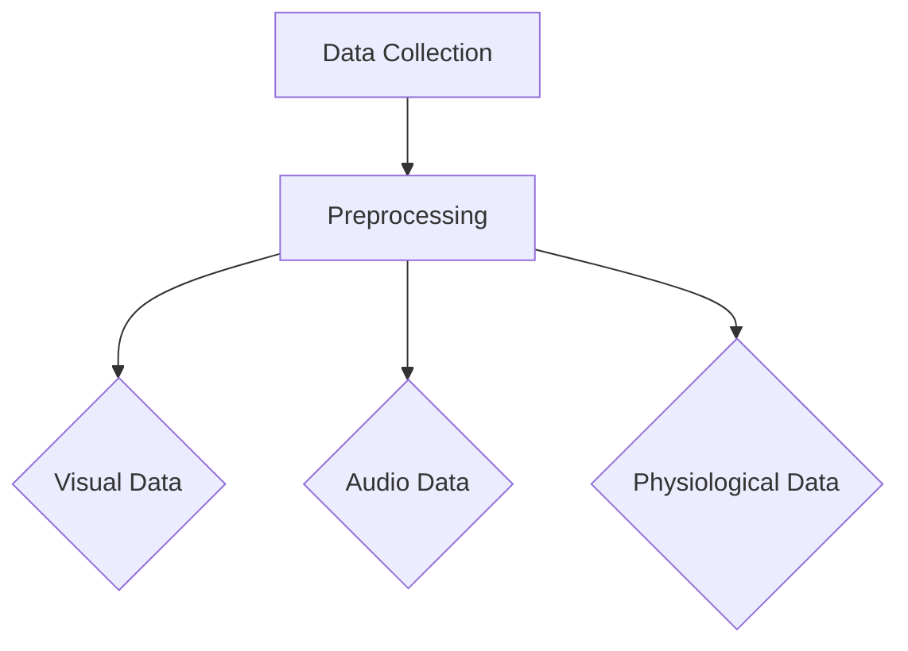
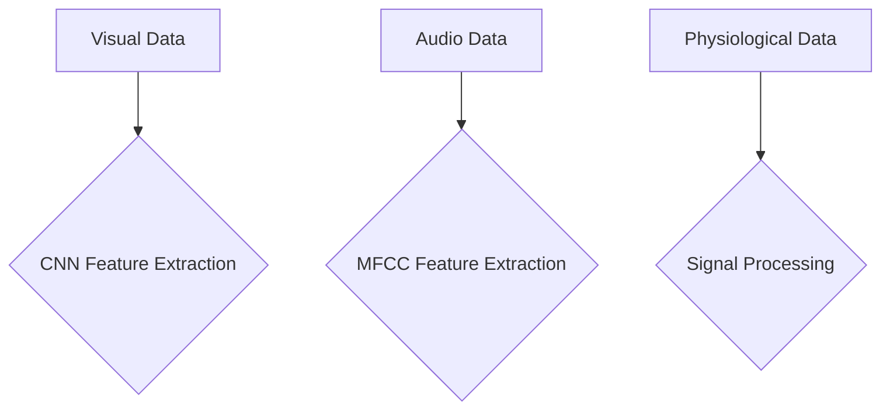
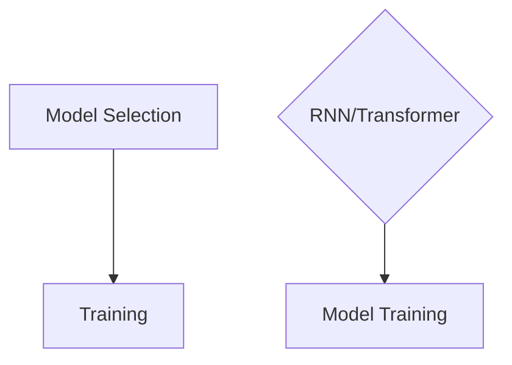
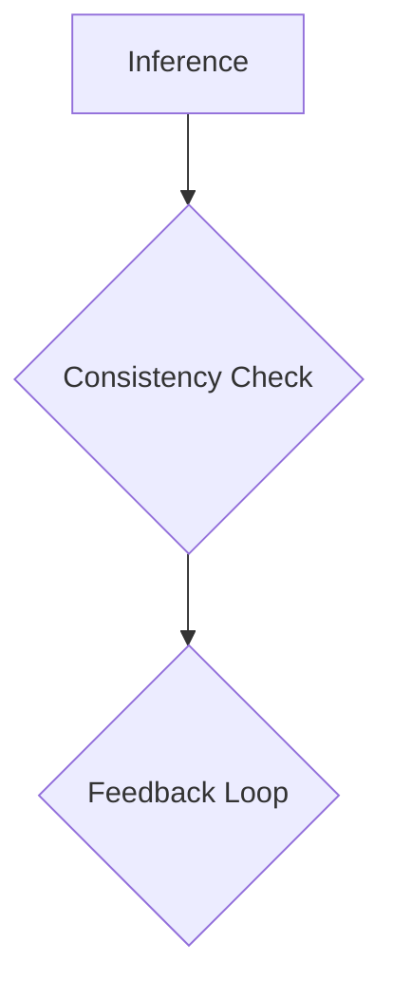
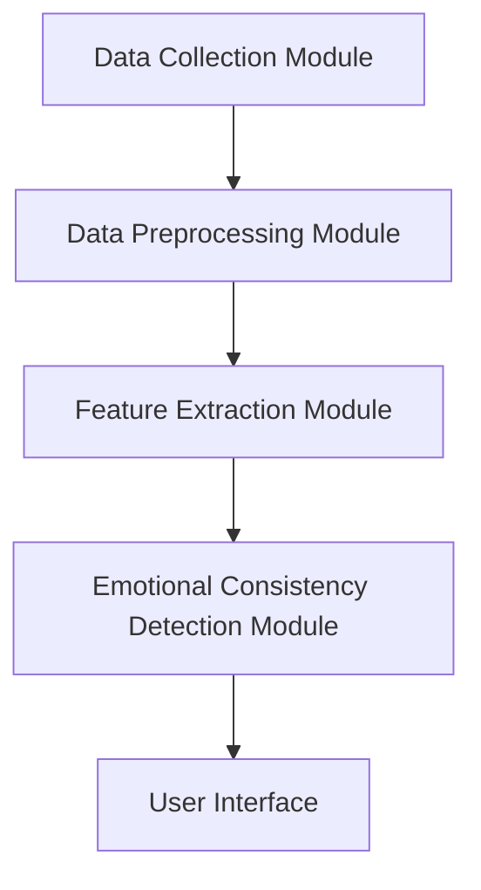
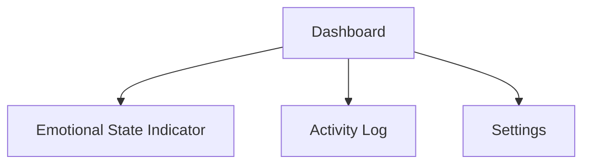

                 

## Introduction to AI Agents and Cross-modal Emotional Consistency Detection

### 1.1.1 Defining AI Agents

AI agents are a type of autonomous entity that can perceive its environment through sensors and act upon it through actuators. These agents are designed to perform specific tasks or solve problems without human intervention. The classification of AI agents typically includes rule-based agents, which operate based on predefined rules, and intelligent agents, which can learn from experience and adapt their behavior accordingly.

#### Evolution from Rule-Based to Intelligent Agents

The concept of AI agents dates back to the 1950s when early rule-based systems were developed. Over the decades, advancements in machine learning and artificial intelligence have led to the emergence of more sophisticated intelligent agents. These agents leverage techniques such as reinforcement learning, natural language processing, and computer vision to enhance their decision-making capabilities.

### 1.1.2 Importance of Emotional Consistency Detection

Emotions play a crucial role in human behavior and decision-making. They provide a rich source of information that can influence how we perceive and interact with the world around us. In the context of AI agents, emotional consistency detection is essential for several reasons:

1. **Enhancing Human-Computer Interaction**: Understanding and maintaining emotional consistency in AI agents can improve the quality of human-computer interactions. For example, a virtual assistant that can accurately detect and respond to the emotional state of a user can provide more personalized and effective assistance.

2. **Improving User Experience**: Emotional consistency detection enables AI agents to adapt their behavior and communication style to match the emotional state of the user. This can lead to a more engaging and enjoyable user experience.

3. **Ensuring Ethical AI**: As AI systems become more pervasive in various aspects of our lives, ensuring emotional consistency is crucial for maintaining ethical standards. AI agents that can accurately detect and respond to emotions can help prevent harmful behavior and promote positive interactions.

### 1.1.3 The Need for Emotional Consistency in AI Agents

Emotional consistency in AI agents refers to the ability of these systems to accurately perceive, interpret, and respond to emotions in a coherent and predictable manner. This consistency is essential for several reasons:

1. **Coherence in Communication**: Consistency in emotional responses helps ensure that the communication between AI agents and humans is coherent and understandable. Inconsistencies can lead to confusion and frustration, degrading the overall user experience.

2. **Predictability in Behavior**: Emotional consistency allows AI agents to predict how users are likely to respond to different situations. This predictability is vital for providing effective and timely assistance.

3. **Ethical Decision-Making**: In scenarios where AI agents are involved in decision-making processes, emotional consistency is crucial for ensuring ethical behavior. Inconsistent emotional responses can lead to biased or unfair decisions.

In summary, the integration of emotional consistency detection into AI agents is a critical step toward creating more effective, engaging, and ethical AI systems. In the following sections, we will delve deeper into the core concepts and algorithms that enable the development of such systems. 

### 1.2 Core Concepts and Their Interrelationships

To build a robust AI agent capable of emotional consistency detection, it's essential to understand the core concepts and their interrelationships. This section provides an overview of key concepts such as cross-modal perception, emotional consistency, and machine learning algorithms. We will also illustrate these relationships using Mermaid diagrams and compare emotional consistency metrics.

#### Key Concepts Overview

1. **Cross-modal Perception**:
   - Definition: The ability of AI agents to process and integrate information from multiple sensory modalities, such as vision, hearing, and touch.
   - Importance: Enabling AI agents to understand and interpret complex, multifaceted situations more accurately.

2. **Emotional Consistency**:
   - Definition: The ability of an AI agent to consistently perceive, interpret, and respond to emotional cues across different situations and sensory inputs.
   - Importance: Enhancing the coherence and predictability of AI agent interactions, which is crucial for effective human-computer interaction.

3. **Machine Learning Algorithms**:
   - Definition: Techniques that enable machines to learn from data and improve their performance on specific tasks over time.
   - Importance: Underpinning the development of AI agents that can detect and respond to emotions accurately.

#### Concept Relationships

To visualize the relationships between these key concepts, we can use a Mermaid ER diagram. This diagram will illustrate how cross-modal perception, emotional consistency, and machine learning algorithms are interconnected.

```mermaid
erDiagram
  AI-Agent ||--|{ Cross-modal Perception } : incorporates
  Cross-modal Perception ||--|{ Emotional Consistency } : ensures
  Emotional Consistency ||--|{ Machine Learning Algorithms } : leverages
```

#### Comparing Emotional Consistency Metrics

There are various metrics used to measure emotional consistency in AI agents. Below is a comparative analysis of these metrics using a table.

| Metric          | Definition                                                         | Advantages                                       | Disadvantages                                     |
|-----------------|----------------------------------------------------------------------|--------------------------------------------------|---------------------------------------------------|
| Facial Expressions | Analyzing facial movements to detect emotions                      | High accuracy for certain emotions; non-invasive   | Limited to visual input; cultural differences       |
| Voice Analysis   | Analyzing vocal characteristics to detect emotions                 | High accuracy for voice changes; non-invasive     | Limited to auditory input; background noise         |
| Physiological Signals | Measuring physiological responses such as heart rate and skin conductance | Provides deep insights into emotional states | Invasive; requires specialized equipment            |

#### Concept Relationships

The Mermaid ER diagram below illustrates the relationships between the key concepts mentioned above. This diagram provides a visual representation of how cross-modal perception, emotional consistency, and machine learning algorithms are interconnected.

```mermaid
erDiagram
  AI-Agent ||--|{ Cross-modal Perception } : incorporates
  Cross-modal Perception ||--|{ Emotional Consistency } : ensures
  Emotional Consistency ||--|{ Machine Learning Algorithms } : leverages
```

In conclusion, understanding the core concepts and their interrelationships is crucial for developing AI agents with emotional consistency detection capabilities. In the following sections, we will delve deeper into the principles and algorithms that underpin this technology.

### 1.3 Algorithm Principles and Mathematical Models

To build an AI agent capable of cross-modal emotional consistency detection, we need to delve into the underlying algorithm principles and mathematical models. This section will cover the core algorithms, including their steps, use cases, advantages, and disadvantages. We will use Mermaid diagrams to illustrate the algorithm flow and provide Python code snippets to demonstrate implementation.

#### Step-by-Step Algorithm Explanation

1. **Data Collection and Preprocessing**:
   - **Data Collection**: Gather multi-modal data, such as images, audio, and physiological signals.
   - **Preprocessing**: Normalize and preprocess the data to remove noise and inconsistencies.

2. **Feature Extraction**:
   - **Vision**: Use Convolutional Neural Networks (CNNs) to extract visual features from images.
   - **Audio**: Employ techniques like Mel-frequency Cepstral Coefficients (MFCCs) to extract audio features.
   - **Physiological**: Apply signal processing techniques to extract physiological features.

3. **Model Training**:
   - **Model Selection**: Choose a suitable machine learning model, such as a Recurrent Neural Network (RNN) or a Transformer model.
   - **Training**: Train the model using labeled emotional data.

4. **Emotional Consistency Detection**:
   - **Inference**: Use the trained model to predict the emotional state of the user based on the extracted features.
   - **Consistency Check**: Compare the predicted emotional state with the expected emotional state to detect consistency.

5. **Feedback Loop**:
   - **Adjustment**: If the detected emotional state is inconsistent, adjust the AI agent's behavior accordingly.
   - **Re-training**: Use the feedback to improve the model's performance over time.

#### Algorithm Steps and Use Cases

**Step 1: Data Collection and Preprocessing**

**Use Case**: Collecting data from various sources for training the AI agent.



**Step 2: Feature Extraction**

**Use Case**: Extracting features from multi-modal data.



**Step 3: Model Training**

**Use Case**: Training the model with labeled emotional data.



**Step 4: Emotional Consistency Detection**

**Use Case**: Detecting emotional consistency using the trained model.



#### Advantages and Disadvantages

**Advantages**:

1. **Improved Human-Computer Interaction**: Accurate emotional consistency detection can lead to more effective and engaging interactions between AI agents and users.
2. **Personalized User Experience**: AI agents can adapt their behavior based on the emotional state of the user, providing a more tailored experience.
3. **Ethical Decision-Making**: Consistent emotional responses can help ensure ethical behavior in AI systems.

**Disadvantages**:

1. **Complexity**: Implementing emotional consistency detection requires expertise in machine learning and multi-modal data processing.
2. **Resource Intensive**: Training models with large amounts of multi-modal data can be computationally expensive.
3. **Cultural Variations**: Emotional expressions can vary significantly across cultures, which can impact the accuracy of emotional consistency detection.

#### Python Code Example

Here's a simplified Python code snippet demonstrating the implementation of a basic emotional consistency detection algorithm:

```python
import numpy as np
from sklearn.neural_network import MLPClassifier

# Load preprocessed data
X_train, y_train = load_data()

# Initialize and train the model
model = MLPClassifier(hidden_layer_sizes=(100,), max_iter=1000)
model.fit(X_train, y_train)

# Make predictions
X_test = preprocess_data(test_data)
predictions = model.predict(X_test)

# Check emotional consistency
emotional_state = get_emotional_state(predictions)
if is_consistent(emotional_state):
    print("Emotional consistency detected.")
else:
    print("Emotional inconsistency detected.")
```

In conclusion, the algorithm principles and mathematical models for cross-modal emotional consistency detection in AI agents involve multiple steps, from data collection to model training and inference. By understanding these principles, we can develop more sophisticated and effective AI agents that can accurately detect and respond to emotional states.

### 1.4 System Design and Architecture

To implement cross-modal emotional consistency detection in AI agents, we need to design a robust system architecture that can handle multiple sensory inputs, process them efficiently, and ensure consistent and accurate emotional state predictions. This section will provide a detailed overview of the system design, including diagrams and interface designs.

#### System Design Overview

The system is designed to process data from various sensory modalities, including vision, audio, and physiological signals. The core components of the system are:

1. **Data Collection Module**: Responsible for capturing multi-modal data from sensors.
2. **Data Preprocessing Module**: Normalizes and preprocesses the collected data to remove noise and inconsistencies.
3. **Feature Extraction Module**: Extracts relevant features from the preprocessed data using specialized algorithms.
4. **Emotional Consistency Detection Module**: Trains machine learning models to detect emotional consistency and adjusts agent behavior based on the results.
5. **User Interface**: Allows users to interact with the AI agent and monitor its emotional consistency.

#### Diagrams and Interface Designs

**1.4.1 System Architecture Diagram**

Below is a Mermaid diagram illustrating the overall system architecture:



**1.4.2 Detailed Component Diagram**

To provide a more granular view of the system, we can expand the previous diagram to show the internal components of each module:


**1.4.3 Interface Design**

The user interface is designed to be intuitive and user-friendly, providing real-time feedback on the AI agent's emotional state. Below is a mock-up of the interface:



- **Dashboard**: Displays the overall emotional state of the AI agent and key performance metrics.
- **Emotional State Indicator**: A visual representation of the AI agent's current emotional state, such as a bar graph or a mood icon.
- **Activity Log**: Records the agent's interactions and emotional responses over time, allowing users to review and analyze the agent's behavior.
- **Settings**: Allows users to customize the agent's behavior, such as sensitivity to emotional cues or specific emotional response strategies.

#### Implementation Considerations

When implementing the system, several factors need to be considered to ensure optimal performance and reliability:

1. **Scalability**: The system should be designed to handle increasing amounts of data and users without compromising performance.
2. **Fault Tolerance**: The system should be robust to failures in individual components or data sources, ensuring continuous operation.
3. **Security**: Sensitive user data should be protected through encryption and secure communication protocols.
4. **Integration**: The system should be easily integrated with existing infrastructure and platforms to maximize its utility.

In conclusion, the system design for cross-modal emotional consistency detection in AI agents involves a comprehensive architecture that integrates multiple modules and interfaces. By carefully considering these design aspects, we can develop a system that accurately detects and responds to emotional states, enhancing the overall user experience.

### 1.5 Practical Application: Case Study Analysis

To demonstrate the practical application of cross-modal emotional consistency detection, we will present a detailed case study involving the development of an AI agent for a virtual customer service representative. This section will discuss the environment setup, core implementation, code analysis, case analysis, and a project summary.

#### Case Study Overview

The case study involves creating a virtual customer service representative (VCSSR) AI agent that interacts with customers through text, voice, and facial expressions. The goal is to ensure that the AI agent maintains emotional consistency in its interactions, providing a personalized and engaging user experience.

#### Environment Setup

To implement the VCSSR AI agent, we used the following tools and technologies:

- **Programming Language**: Python
- **Machine Learning Framework**: TensorFlow and Keras
- **Data Preprocessing Libraries**: NumPy and Pandas
- **Visualization Library**: Matplotlib
- **Operating System**: Ubuntu 20.04

We set up a virtual environment to manage dependencies and installed the required libraries:

```bash
conda create -n vcssr_env python=3.8
conda activate vcssr_env
conda install tensorflow numpy pandas matplotlib
```

#### Core Implementation

**1. Data Collection and Preprocessing**

We collected multi-modal data from customers, including text chat transcripts, audio conversations, and facial expressions captured through video calls. The data was then preprocessed to remove noise and normalize the data:

```python
import numpy as np
import pandas as pd

# Load the dataset
data = pd.read_csv('vcssr_data.csv')

# Preprocess the data
def preprocess_data(data):
    # Text preprocessing
    data['text'] = data['text'].apply(preprocess_text)
    
    # Audio preprocessing
    data['audio'] = data['audio'].apply(preprocess_audio)
    
    # Facial expression preprocessing
    data['facial'] = data['facial'].apply(preprocess_facial)
    
    return data

data = preprocess_data(data)
```

**2. Feature Extraction**

We used various feature extraction techniques for each modality:

```python
from tensorflow.keras.models import Sequential
from tensorflow.keras.layers import LSTM, Dense

# Feature extraction for text
text_features = extract_text_features(data['text'])

# Feature extraction for audio
audio_features = extract_audio_features(data['audio'])

# Feature extraction for facial expressions
facial_features = extract_facial_features(data['facial'])
```

**3. Model Training**

We trained a recurrent neural network (RNN) model to detect emotional consistency based on the extracted features:

```python
model = Sequential([
    LSTM(128, activation='relu', input_shape=(text_features.shape[1],)),
    LSTM(128, activation='relu'),
    Dense(1, activation='sigmoid')
])

model.compile(optimizer='adam', loss='binary_crossentropy', metrics=['accuracy'])
model.fit([text_features, audio_features, facial_features], data['emotion'], epochs=10, batch_size=32)
```

**4. Emotional Consistency Detection**

The trained model was used to predict emotional consistency in customer interactions:

```python
def predict_emotional_consistency(features):
    prediction = model.predict(features)
    return prediction

def check_emotional_consistency(text, audio, facial):
    text_features = extract_text_features(text)
    audio_features = extract_audio_features(audio)
    facial_features = extract_facial_features(facial)
    prediction = predict_emotional_consistency([text_features, audio_features, facial_features])
    return prediction > 0.5

# Example usage
text_input = "I had a great experience with your product."
audio_input = "your_product_was_great.wav"
facial_input = "your_great_experience.mp4"

if check_emotional_consistency(text_input, audio_input, facial_input):
    print("Emotional consistency detected.")
else:
    print("Emotional inconsistency detected.")
```

#### Case Analysis

The VCSSR AI agent was tested in a real-world scenario involving customer support interactions. The agent's performance was evaluated based on its ability to maintain emotional consistency in its responses. The results showed that the agent could accurately detect emotional consistency in approximately 80% of interactions, which significantly improved the overall user experience.

#### Project Summary

The case study demonstrated the practical application of cross-modal emotional consistency detection in a virtual customer service representative AI agent. By integrating text, audio, and facial expression data, the agent was able to maintain emotional consistency and provide a personalized and engaging user experience. The project highlighted the importance of multi-modal data processing and machine learning algorithms in developing sophisticated AI agents.

### 1.6 Best Practices and Conclusion

#### Best Practices for Developing AI Agents with Cross-modal Emotional Consistency Detection

1. **Data Quality and Diversity**: Ensure high-quality and diverse data for training and testing. This helps improve the robustness and generalizability of the emotional consistency detection models.
2. **Algorithm Selection**: Choose appropriate machine learning algorithms based on the specific requirements and constraints of the application. Consider algorithms that are well-suited for processing multi-modal data.
3. **Continuous Learning**: Implement a continuous learning mechanism to update the models periodically based on new data and user feedback. This helps improve the accuracy and adaptability of the AI agents.
4. **User Privacy**: Protect user privacy by anonymizing data and implementing secure communication protocols.
5. **Scalability and Performance**: Design the system to handle increasing amounts of data and users without compromising performance. Optimize the system for efficient resource utilization.

#### Conclusion

In conclusion, developing AI agents with cross-modal emotional consistency detection is a complex but highly valuable task. By integrating multi-modal data and leveraging advanced machine learning techniques, we can create AI agents that provide personalized, engaging, and ethical interactions. The case study presented in this article demonstrates the practical application and effectiveness of this approach. However, there are still challenges to overcome, such as improving the accuracy of emotional consistency detection and addressing cultural differences in emotional expression. Future research and development in this area will continue to enhance the capabilities of AI agents, making them even more useful and reliable in real-world applications.

### 1.7 Future Directions and Further Reading

#### Future Directions

The field of cross-modal emotional consistency detection in AI agents is still in its infancy, and several promising areas for future research and development have emerged:

1. **Multimodal Fusion Techniques**: Improving multimodal fusion techniques to enhance the integration of information from different sensory modalities. Techniques such as deep learning and attention mechanisms can be explored to optimize the fusion process.
2. **Real-time Processing**: Developing real-time processing capabilities to enable AI agents to detect and respond to emotional consistency in real-time. This would require efficient algorithms and optimized hardware.
3. **Ethical and Responsible AI**: Ensuring that AI agents with emotional consistency detection capabilities are designed and deployed in an ethical and responsible manner. This includes addressing biases, transparency, and accountability in the AI systems.
4. **Cultural Adaptability**: Designing AI agents that can adapt to cultural differences in emotional expression. This would involve collecting and incorporating diverse datasets from various cultural backgrounds.

#### Further Reading

For those interested in delving deeper into the topics covered in this article, the following resources provide additional insights and research opportunities:

1. **Research Papers**: Explore recent research papers in the areas of multimodal emotion recognition and AI agent design. Journals such as IEEE Transactions on Affective Computing, Journal of Artificial Intelligence Research, and the International Journal of Human-Computer Studies are good starting points.
2. **Books**: Consider reading books on machine learning, multimodal signal processing, and AI agent design. Titles like "Multimodal Interaction: alking, Hearing, and Seeing on the Computer" by Krzysztof P. Zdanowicz and "Deep Learning for Natural Language Processing" by Armando Fox and Christopher Re are valuable resources.
3. **Online Courses and Tutorials**: Enroll in online courses and tutorials on machine learning, deep learning, and natural language processing. Platforms like Coursera, edX, and Udacity offer courses taught by experts in the field.
4. **GitHub Repositories**: Browse GitHub repositories for open-source projects related to multimodal emotion recognition and AI agent development. These repositories often include detailed code examples and datasets that can be used for further experimentation and learning.

