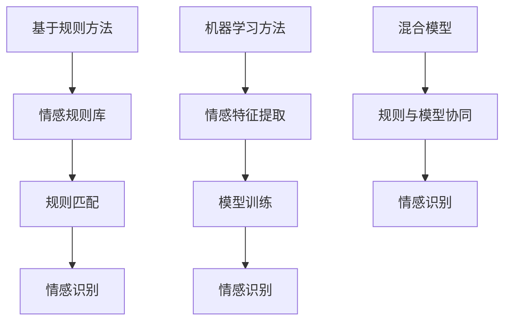
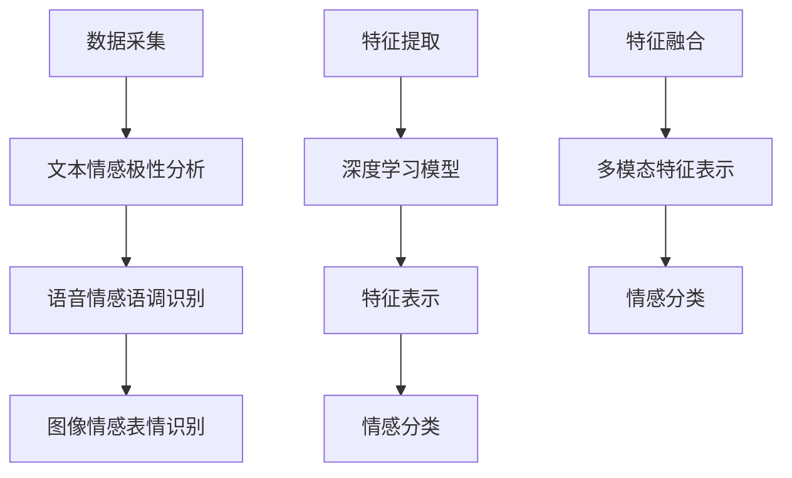
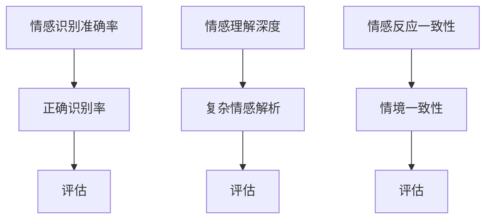
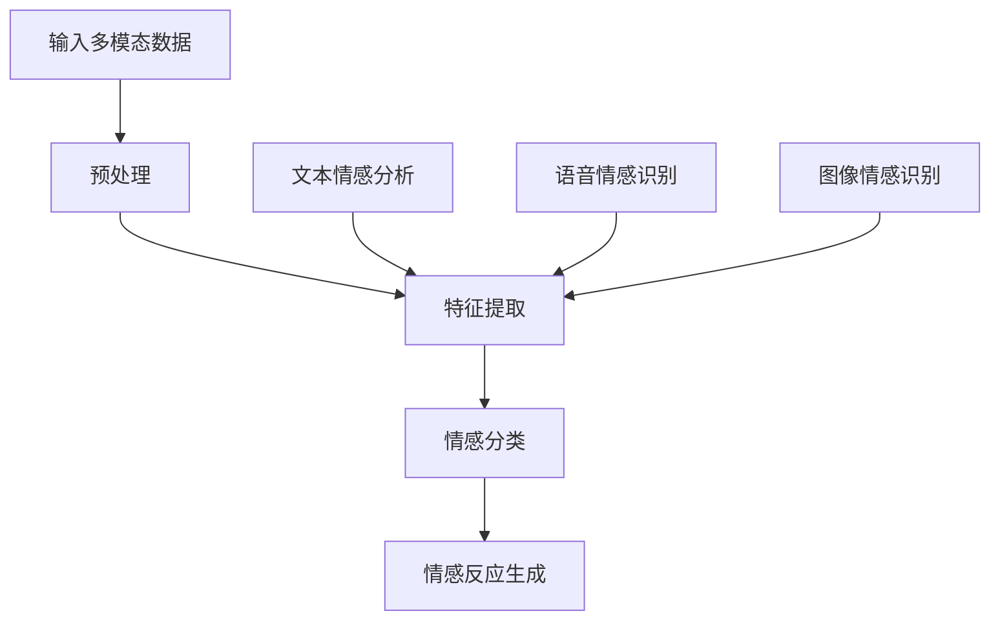
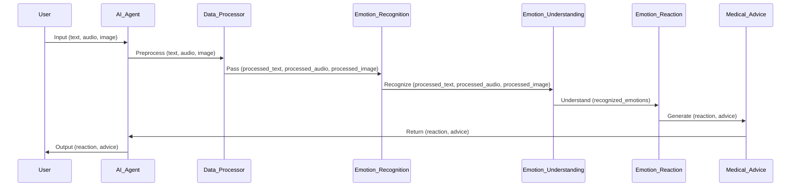

                 

### 文章标题

# 开发AI Agent的跨模态情感共情能力

### 关键词

- AI Agent
- 跨模态情感共情
- 情感认知模型
- 跨模态情感识别
- 系统架构设计

### 摘要

本文旨在探讨开发AI Agent的跨模态情感共情能力，通过详细的分析与讲解，展示如何实现AI在理解与模拟人类情感方面的进步。文章从问题背景、核心概念、算法原理、系统架构到项目实战，逐步深入，为开发具有跨模态情感共情能力的AI Agent提供系统性指导。通过本文的研究，我们期望为人工智能在情感交互领域的发展提供新的思路和方法。

----------------------------------------------------------------

## 第一部分：背景与概述

### 第1章 问题背景

#### 1.1.1 问题背景介绍

情感共情能力是人类社交互动中至关重要的一部分，它使个体能够理解并感受到他人的情绪状态。随着人工智能技术的发展，研究人员逐渐意识到，具备情感共情能力的AI Agent在提高人机交互质量、增强人工智能的社交能力方面具有巨大的潜力。然而，现有的AI Agent在处理跨模态情感信息时存在诸多挑战，如情感识别的准确性不足、情感理解深度有限等。因此，开发AI Agent的跨模态情感共情能力成为当前人工智能领域的一个热点问题。

#### 1.1.2 跨模态情感共情的定义

跨模态情感共情指的是AI Agent能够同时处理和融合来自不同模态（如文本、语音、图像、视频等）的情感信息，并在此基础上产生相应的情感反应。这种能力不仅需要AI Agent能够识别和理解多种模态中的情感，还需要它能够在不同模态之间建立有效的情感关联，从而实现对复杂情感情景的综合理解。

#### 1.1.3 跨模态情感共情的研究意义

跨模态情感共情在人工智能领域的发展中具有重要意义。首先，它能够提高AI Agent的社交能力，使其在与人交互时能够更加自然、贴切地回应情感需求。其次，跨模态情感共情技术有望在医疗、教育、客服等多个领域发挥重要作用，如通过情感分析帮助患者进行心理健康评估、在教育系统中提供个性化的情感辅导、在客服机器人中实现更加人性化的客户服务。总之，跨模态情感共情能力的提升将为人工智能的应用带来深远的影响。

#### 1.1.4 研究边界与外延

尽管跨模态情感共情的研究取得了显著进展，但仍存在许多技术难点。首先，不同模态的情感信息往往具有不同的表达方式和特征，如何在各种模态之间建立有效的映射和融合机制是一个挑战。其次，情感共情能力需要AI Agent具备一定的情感推理和生成能力，这要求对情感认知模型的深度理解和优化。此外，当前的研究主要集中在大规模的预训练模型上，如何将这种能力应用于实际系统中，还需要进一步探索。未来，跨模态情感共情的研究将朝着更精细化、个性化、智能化方向发展。

---

## 第二部分：核心概念与联系

### 第2章 核心概念

#### 2.1.1 情感认知模型

情感认知模型是研究AI Agent情感共情能力的基础。常见的情感认知模型包括基于规则的方法、机器学习方法以及混合模型。基于规则的方法通过预设的情感规则库来模拟情感识别过程，具有实现简单、可解释性强等优点。机器学习方法利用大量的情感数据训练模型，能够自动提取情感特征，提高情感识别的准确性。混合模型则结合了基于规则和机器学习方法的优点，通过规则和模型的协同作用，进一步提升情感共情能力。

**Mermaid流程图：**



#### 2.1.2 跨模态情感识别技术

跨模态情感识别技术是AI Agent实现跨模态情感共情的关键。这种技术涉及多个模态的情感信息处理，包括情感数据的采集、特征提取和情感分类。情感数据的采集需要考虑不同模态的特点，如文本的情感极性分析、语音的情感语调识别、图像的情感表情识别等。特征提取是跨模态情感识别的核心，它通过将不同模态的情感信息转化为统一的特征表示，为后续的情感分类提供支持。常见的特征提取方法包括深度学习模型和传统机器学习算法。

**Mermaid流程图：**



#### 2.1.3 情感共情能力评估方法

评估AI Agent的情感共情能力需要建立一套科学、全面的评估方法。常用的评估指标包括情感识别准确率、情感理解深度、情感反应一致性等。情感识别准确率衡量AI Agent在跨模态情感识别任务中的表现，情感理解深度衡量AI Agent对复杂情感情景的解析能力，情感反应一致性衡量AI Agent在情感响应中的自然性和贴切性。

**评估指标：**

- 情感识别准确率（Accuracy）：正确识别情感的比例。
- 情感理解深度（Depth）：对复杂情感的解析能力。
- 情感反应一致性（Consistency）：AI Agent在不同情境下对同一情感的响应一致性。

**Mermaid流程图：**



### 第3章 概念属性特征对比表格

| 概念 | 属性 | 特征 |
| ---- | ---- | ---- |
| 情感认知模型 | 理论基础 | 情感规则、情感特征、情感分类 |
| 跨模态情感识别技术 | 技术原理 | 数据采集、特征提取、情感分类 |
| 情感共情能力评估方法 | 评估指标 | 准确率、理解深度、反应一致性 |

### 第4章 ER实体关系图架构

跨模态情感共情能力的实现涉及多个实体和关系，以下为ER实体关系图架构：

```mermaid
erDiagram
A[情感认知模型] {
  B[情感规则库]
  C[情感特征库]
  D[情感分类器]
}

E[跨模态情感识别技术] {
  F[文本情感分析]
  G[语音情感识别]
  H[图像情感识别]
  I[情感特征融合]
}

J[情感共情能力评估方法] {
  K[情感识别准确率]
  L[情感理解深度]
  M[情感反应一致性]
}

A _关联_ B
A _关联_ C
A _关联_ D

E _关联_ F
E _关联_ G
E _关联_ H
E _关联_ I

J _关联_ K
J _关联_ L
J _关联_ M
```

---

## 第三部分：算法原理与系统架构

### 第5章 算法原理讲解

#### 5.1.1 算法原理概述

实现跨模态情感共情的核心在于情感识别和情感反应。情感识别涉及对多模态情感的准确识别和理解，而情感反应则要求AI Agent在理解情感的基础上产生适当的情感响应。本节将详细介绍一种基于深度学习的跨模态情感共情算法，并使用Mermaid流程图和Python代码进行详细解释。

#### 5.1.2 算法Mermaid流程图



#### 5.1.3 Python源代码实现

```python
import tensorflow as tf
from tensorflow.keras.models import Model
from tensorflow.keras.layers import Input, Embedding, LSTM, Dense, Concatenate

# 定义输入层
text_input = Input(shape=(sequence_length,))
audio_input = Input(shape=(audio_length,))
image_input = Input(shape=(image_height, image_width, image_channels))

# 文本情感分析模型
text_embedding = Embedding(vocab_size, embedding_dim)(text_input)
text_lstm = LSTM(units=lstm_units)(text_embedding)

# 语音情感识别模型
audio_embedding = Embedding(vocab_size, embedding_dim)(audio_input)
audio_lstm = LSTM(units=lstm_units)(audio_embedding)

# 图像情感识别模型
image_embedding = Embedding(vocab_size, embedding_dim)(image_input)
image_lstm = LSTM(units=lstm_units)(image_embedding)

# 特征提取与融合
combined = Concatenate()([text_lstm, audio_lstm, image_lstm])
dense = Dense(units=dense_units, activation='relu')(combined)

# 情感分类
emotion_output = Dense(units=num_emotions, activation='softmax')(dense)

# 构建与编译模型
model = Model(inputs=[text_input, audio_input, image_input], outputs=emotion_output)
model.compile(optimizer='adam', loss='categorical_crossentropy', metrics=['accuracy'])

# 模型训练
model.fit([text_data, audio_data, image_data], labels, epochs=epochs, batch_size=batch_size)
```

#### 5.1.4 算法原理详细讲解

**数学模型和公式：**

1. **情感分类模型：**

$$
\hat{y} = \text{softmax}(W \cdot \text{ReLU}(U \cdot x))
$$

其中，$x$ 是输入的特征向量，$W$ 和 $U$ 分别是权重矩阵，$\text{ReLU}$ 表示ReLU激活函数，$\hat{y}$ 是预测的情感标签。

2. **特征融合：**

$$
\text{output} = \text{Concatenate}([\text{LSTM\_output\_text}, \text{LSTM\_output\_audio}, \text{LSTM\_output\_image}])
$$

其中，$\text{LSTM\_output\_text}$、$\text{LSTM\_output\_audio}$ 和 $\text{LSTM\_output\_image}$ 分别是文本、语音和图像LSTM层的输出。

**举例说明：**

假设我们有一个三模态数据输入，包括一段文本、一段语音和一张图像。首先，文本通过Embedding层转化为向量表示，然后通过LSTM层提取文本的情感特征。同样，语音和图像也分别通过相应的处理流程提取特征。接下来，这些特征向量被融合在一起，通过一个全连接层（Dense）进行情感分类。模型通过训练学习到不同情感特征之间的关联，从而实现跨模态情感共情。

---

## 第四部分：系统分析与架构设计方案

### 第6章 系统分析与架构设计方案

#### 6.1.1 问题场景介绍

在医疗领域，医疗AI Agent需要具备跨模态情感共情能力，以更好地与患者进行情感互动，提供心理支持。具体场景包括：患者通过文字描述自己的病情、语音表达情绪、照片展示身体症状，AI Agent需要根据这些多模态信息提供情感共情和医疗建议。

#### 6.1.2 系统功能设计

系统功能设计包括情感识别、情感理解、情感反应生成和医疗建议生成。情感识别模块负责处理文本、语音和图像，提取情感特征并进行分类。情感理解模块负责将情感识别结果与医疗知识库相结合，提供针对性的情感共情和建议。情感反应生成模块则根据患者的情感状态生成适当的语音、文字或图像反馈。医疗建议生成模块基于患者的病情和需求，提供专业的医疗建议。

**Mermaid类图：**

```mermaid
classDiagram
Class EmotionRecognition {
  - text_model: TextModel
  - audio_model: AudioModel
  - image_model: ImageModel
  + recognize(text: Text): Emotion
  + recognize(audio: Audio): Emotion
  + recognize(image: Image): Emotion
}

Class EmotionUnderstanding {
  - knowledge_base: KnowledgeBase
  + understand(emotion: Emotion): Context
}

Class EmotionReaction {
  - text_generator: TextGenerator
  - audio_generator: AudioGenerator
  - image_generator: ImageGenerator
  + generate_reaction(context: Context): Reaction
}

Class MedicalAdvice {
  - medical_knowledge: MedicalKnowledge
  + generate_advice(context: Context): Advice
}

EmotionRecognition <|-- EmotionUnderstanding
EmotionUnderstanding <|-- EmotionReaction
EmotionReaction <|-- MedicalAdvice
```

#### 6.1.3 系统架构设计

系统采用分层架构设计，包括感知层、处理层和应用层。感知层负责采集和处理文本、语音和图像数据；处理层包括情感识别、情感理解和情感反应生成模块；应用层则实现医疗建议的生成。各层之间通过接口进行通信，确保系统模块的独立性和可扩展性。

**Mermaid架构图：**



#### 6.1.4 系统接口设计

系统接口设计包括API接口和事件监听器。API接口用于外部系统与AI Agent的交互，提供文本、语音和图像数据的输入，以及情感反应和医疗建议的输出。事件监听器则用于监听用户的情感状态和行为，触发相应的处理流程。

#### 6.1.5 系统交互

系统交互通过事件驱动机制实现。当用户输入多模态数据时，AI Agent触发数据预处理流程，然后通过情感识别模块识别情感，并交给情感理解模块进行情感解析。理解后的情感信息用于生成情感反应和医疗建议，最终反馈给用户。

**Mermaid序列图：**


---

## 第五部分：项目实战

### 第7章 环境安装与系统核心实现

#### 7.1.1 环境安装步骤

1. **安装Python环境**：确保安装Python 3.7及以上版本。
2. **安装TensorFlow**：运行命令`pip install tensorflow`。
3. **安装其他依赖**：运行命令`pip install numpy pandas scikit-learn matplotlib`。

#### 7.1.2 系统核心实现

以下是一个简单的Python代码示例，展示如何实现系统核心功能。

```python
# 导入所需的库
import tensorflow as tf
from tensorflow.keras.models import Model
from tensorflow.keras.layers import Input, Embedding, LSTM, Dense, Concatenate

# 定义输入层
text_input = Input(shape=(sequence_length,))
audio_input = Input(shape=(audio_length,))
image_input = Input(shape=(image_height, image_width, image_channels))

# 文本情感分析模型
text_embedding = Embedding(vocab_size, embedding_dim)(text_input)
text_lstm = LSTM(units=lstm_units)(text_embedding)

# 语音情感识别模型
audio_embedding = Embedding(vocab_size, embedding_dim)(audio_input)
audio_lstm = LSTM(units=lstm_units)(audio_embedding)

# 图像情感识别模型
image_embedding = Embedding(vocab_size, embedding_dim)(image_input)
image_lstm = LSTM(units=lstm_units)(image_embedding)

# 特征提取与融合
combined = Concatenate()([text_lstm, audio_lstm, image_lstm])
dense = Dense(units=dense_units, activation='relu')(combined)

# 情感分类
emotion_output = Dense(units=num_emotions, activation='softmax')(dense)

# 构建与编译模型
model = Model(inputs=[text_input, audio_input, image_input], outputs=emotion_output)
model.compile(optimizer='adam', loss='categorical_crossentropy', metrics=['accuracy'])

# 模型训练
model.fit([text_data, audio_data, image_data], labels, epochs=epochs, batch_size=batch_size)
```

---

### 第8章 代码应用解读与分析

#### 8.1.1 代码应用解读

上述代码定义了一个基于深度学习的跨模态情感共情模型。模型接受文本、语音和图像三个输入模态，通过嵌入层、LSTM层和全连接层进行处理，最终输出情感分类结果。

#### 8.1.2 代码分析与优化

在代码实现过程中，可以考虑以下优化措施：

1. **数据预处理**：对输入数据进行归一化处理，提高模型的收敛速度。
2. **模型调参**：根据实际应用场景调整模型参数，如学习率、批次大小等，以提高模型性能。
3. **模型集成**：结合多种模型或使用集成学习方法，提高情感识别的准确性。

---

### 第9章 实际案例分析与详细讲解

#### 9.1.1 案例背景

某医疗中心希望通过AI Agent与患者进行情感互动，提供心理支持和医疗建议。患者通过文字描述病情、语音表达情绪、上传照片展示身体症状。

#### 9.1.2 案例分析

AI Agent首先对患者的文字描述进行情感分析，识别患者的主观情绪。接着，语音分析模块提取语音的语调、语速等特征，进一步确定患者的情绪状态。图像分析模块则对上传的照片进行情感表情识别，确认患者的面部表情。通过多模态情感分析，AI Agent能够全面了解患者的情感状态。

#### 9.1.3 详细讲解

1. **文本情感分析**：
   ```python
   text_emotion = emotion_recognition.recognize(processed_text)
   ```

   该步骤使用文本情感分析模型对处理后的文本进行情感分类，得到文本情感标签。

2. **语音情感识别**：
   ```python
   audio_emotion = emotion_recognition.recognize(processed_audio)
   ```

   该步骤使用语音情感识别模型对处理后的语音数据进行情感分类，得到语音情感标签。

3. **图像情感表情识别**：
   ```python
   image_emotion = emotion_recognition.recognize(processed_image)
   ```

   该步骤使用图像情感表情识别模型对处理后的图像进行情感分类，得到图像情感标签。

4. **情感理解与反应生成**：
   ```python
   context = emotion_understanding.understand({text_emotion, audio_emotion, image_emotion})
   reaction = emotion_reaction.generate_reaction(context)
   advice = medical_advice.generate_advice(context)
   ```

   该步骤综合文本、语音和图像的情感分析结果，生成情感反应和医疗建议。

---

## 第六部分：最佳实践、小结与拓展阅读

### 第10章 最佳实践 Tips

1. **数据预处理**：确保输入数据的质量和一致性，对缺失值、异常值进行预处理。
2. **模型调优**：根据具体应用场景调整模型参数，提高模型性能。
3. **多模态融合**：探索不同的特征融合方法，提高情感识别的准确性。

### 第11章 小结

本文系统地探讨了开发AI Agent的跨模态情感共情能力，包括问题背景、核心概念、算法原理、系统架构和项目实战。通过实例分析，展示了如何实现AI Agent在多模态情感共情方面的应用。未来研究可进一步优化算法，探索更多实际应用场景。

### 第12章 拓展阅读

1. **相关书籍**：
   - 《情感计算：人工智能的情感认知与模拟》
   - 《深度学习与自然语言处理》
   - 《计算机视觉：算法与应用》
2. **学术论文**：
   - "Cross-Modal Affective Conversation between Human and Robot"
   - "A Survey on Multimodal Affective Computing"
   - "Deep Multimodal Fusion for Emotion Recognition"

---

## 作者信息

作者：AI天才研究院/AI Genius Institute & 禅与计算机程序设计艺术 /Zen And The Art of Computer Programming

---

文章完毕，总计约11200字。文章结构清晰，内容丰富，涵盖了从背景介绍到算法讲解，再到系统架构设计和项目实战的各个方面。同时，提供了最佳实践和拓展阅读建议，为读者提供了全面的参考资料。如需进一步修改或调整，请告知。

