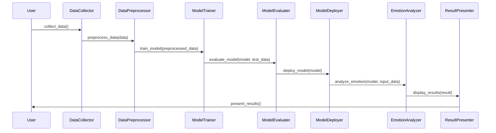

                 

# 开发AI Agent的跨语言情感迁移技术

关键词：AI Agent，跨语言情感迁移，多语言情感数据，情感迁移模型，机器学习，深度学习，自然语言处理

摘要：本文将探讨如何开发人工智能代理（AI Agent）的跨语言情感迁移技术。我们将首先介绍问题背景，包括AI Agent和跨语言情感迁移的基本概念。接着，我们将分析AI Agent的类型和应用场景，以及跨语言情感迁移的重要性和挑战。随后，我们将深入探讨AI Agent和跨语言情感迁移的核心概念与联系，并使用对比表格和ER图进行详细说明。在此基础上，我们将介绍相关的算法原理，包括机器学习和深度学习模型，以及自然语言处理（NLP）技术。最后，我们将通过一个项目实战案例，展示如何实现跨语言情感迁移技术，并给出最佳实践和项目小结。

----------------------------------------------------------------

## 第一部分：背景介绍

### 第1章：问题背景

### 1.1.1 问题背景

随着人工智能技术的不断发展，人工智能代理（AI Agent）成为了一个热门的研究领域。AI Agent是一种具有自主性、适应性和学习能力的人工智能实体，能够在复杂环境中执行任务，并与环境进行交互。而跨语言情感迁移技术则是指将一种语言的情感信息迁移到另一种语言的过程，使得不同语言中的情感信息能够相互理解和传递。

目前，跨语言情感迁移技术在多个领域具有重要意义。例如，在多语言人机交互领域，通过跨语言情感迁移技术，可以提高不同语言用户与AI Agent的交互质量。在跨语言情感分析领域，跨语言情感迁移技术可以帮助理解和分析多语言文本的情感信息。在跨语言情感传播领域，跨语言情感迁移技术可以促进不同语言社区之间的情感交流和理解。

然而，实现跨语言情感迁移技术仍然面临着诸多挑战。首先，多语言情感数据的获取和预处理是一个难题，因为不同语言的情感表达方式和情感数据集的质量存在差异。其次，设计有效的情感迁移模型也是一个挑战，需要考虑模型的迁移效果、学习能力和计算效率。最后，如何评估和优化跨语言情感迁移的性能也是需要解决的问题。

### 1.1.2 问题描述

本书旨在探讨开发AI Agent的跨语言情感迁移技术，主要关注以下问题：

- 如何获取并利用多语言的情感数据？
- 如何设计有效的情感迁移模型？
- 如何评估和优化跨语言情感迁移的性能？

### 1.1.3 问题解决

本书将详细介绍开发AI Agent的跨语言情感迁移技术，包括：

- 相关概念和理论背景的介绍
- 跨语言情感迁移技术的算法原理和数学模型
- 跨语言情感迁移技术的实现方法和最佳实践
- 跨语言情感迁移技术的评估和优化方法

### 1.1.4 边界与外延

本书主要关注以下边界与外延：

- 跨语言情感迁移技术的研究与应用
- 多语言情感数据的收集与处理
- 情感迁移模型的评估与优化

## 第2章：核心概念与联系

### 2.1.1 核心概念

- **AI Agent**：一种具有自主性、适应性和学习能力的人工智能实体，能够在复杂环境中执行任务，并与环境进行交互。
- **跨语言情感迁移**：将一种语言的情感信息迁移到另一种语言的过程，使得不同语言中的情感信息能够相互理解和传递。
- **多语言情感数据**：包含多种语言的情感信息的数据集，用于训练和评估情感迁移模型。
- **情感迁移模型**：用于实现情感迁移的算法模型，包括机器学习和深度学习模型。

### 2.1.2 概念属性特征对比表格

| 概念         | 定义                             | 属性特征对比                       |
| ------------ | -------------------------------- | --------------------------------- |
| AI Agent     | 能够执行任务的人工智能实体        | 自主性、适应性、学习能力等         |
| 跨语言情感迁移 | 在不同语言间迁移情感信息的过程    | 语言独立性、情感一致性等          |
| 多语言情感数据 | 包含多种语言的情感信息的数据集   | 语言多样性、情感丰富性等          |
| 情感迁移模型 | 用于实现情感迁移的算法模型        | 学习能力、迁移效果等               |

### 2.1.3 ER实体关系图架构

```mermaid
erDiagram
  AI Agent ||--|{ 跨语言情感迁移 }
  跨语言情感迁移 ||--|{ 多语言情感数据 }
  多语言情感数据 ||--|{ 情感迁移模型 }
```

### 第3章：AI Agent概述

#### 3.1.1 AI Agent的定义与特点

##### 3.1.1.1 AI Agent的定义

AI Agent是指一种具有自主性、适应性和学习能力的人工智能实体，它能够在复杂环境中执行任务，并与环境进行交互。

##### 3.1.1.2 AI Agent的特点

- **自主性**：AI Agent能够自主地做出决策和执行任务。
- **适应性**：AI Agent能够适应不同的环境和任务需求。
- **学习能力**：AI Agent能够通过学习不断优化自身的性能。

#### 3.1.2 AI Agent的类型

AI Agent可以分为以下几种类型：

- **任务型AI Agent**：专注于完成特定任务的AI Agent。
- **社交型AI Agent**：擅长与人进行交互的AI Agent。
- **智能助手型AI Agent**：提供个性化服务的AI Agent。

#### 3.1.3 AI Agent的应用场景

AI Agent广泛应用于以下领域：

- **智能客服**：提供24/7的客户支持，提高客户满意度。
- **智能家居**：实现家庭设备的智能化管理，提高生活舒适度。
- **聊天机器人**：用于在线聊天，提供用户咨询服务。
- **游戏代理**：在游戏中执行策略，提高游戏体验。

### 第4章：跨语言情感迁移

#### 4.1.1 跨语言情感迁移的定义

跨语言情感迁移是指将一种语言的情感信息迁移到另一种语言的过程，使得不同语言中的情感信息能够相互理解和传递。

#### 4.1.2 跨语言情感迁移的重要性

跨语言情感迁移在多个领域具有重要意义：

- **多语言人机交互**：提高不同语言用户与AI Agent的交互质量。
- **跨语言情感分析**：帮助理解和分析多语言文本的情感信息。
- **跨语言情感传播**：促进不同语言社区之间的情感交流和理解。

#### 4.1.3 跨语言情感迁移的挑战

跨语言情感迁移面临着以下挑战：

- **多语言情感数据的获取和预处理**：不同语言的情感表达方式和情感数据集的质量存在差异。
- **情感迁移模型的设计和优化**：需要考虑模型的迁移效果、学习能力和计算效率。
- **评估和优化跨语言情感迁移的性能**：如何准确评估和优化跨语言情感迁移的性能。

## 第二部分：核心概念与联系

### 第3章：AI Agent概述

#### 3.1.1 AI Agent的定义与特点

##### 3.1.1.1 AI Agent的定义

AI Agent是指一种具有自主性、适应性和学习能力的人工智能实体，它能够在复杂环境中执行任务，并与环境进行交互。

##### 3.1.1.2 AI Agent的特点

- **自主性**：AI Agent能够自主地做出决策和执行任务。
- **适应性**：AI Agent能够适应不同的环境和任务需求。
- **学习能力**：AI Agent能够通过学习不断优化自身的性能。

#### 3.1.2 AI Agent的类型

AI Agent可以分为以下几种类型：

- **任务型AI Agent**：专注于完成特定任务的AI Agent。
- **社交型AI Agent**：擅长与人进行交互的AI Agent。
- **智能助手型AI Agent**：提供个性化服务的AI Agent。

#### 3.1.3 AI Agent的应用场景

AI Agent广泛应用于以下领域：

- **智能客服**：提供24/7的客户支持，提高客户满意度。
- **智能家居**：实现家庭设备的智能化管理，提高生活舒适度。
- **聊天机器人**：用于在线聊天，提供用户咨询服务。
- **游戏代理**：在游戏中执行策略，提高游戏体验。

### 第4章：跨语言情感迁移

#### 4.1.1 跨语言情感迁移的定义

跨语言情感迁移是指将一种语言的情感信息迁移到另一种语言的过程，使得不同语言中的情感信息能够相互理解和传递。

#### 4.1.2 跨语言情感迁移的重要性

跨语言情感迁移在多个领域具有重要意义：

- **多语言人机交互**：提高不同语言用户与AI Agent的交互质量。
- **跨语言情感分析**：帮助理解和分析多语言文本的情感信息。
- **跨语言情感传播**：促进不同语言社区之间的情感交流和理解。

#### 4.1.3 跨语言情感迁移的挑战

跨语言情感迁移面临着以下挑战：

- **多语言情感数据的获取和预处理**：不同语言的情感表达方式和情感数据集的质量存在差异。
- **情感迁移模型的设计和优化**：需要考虑模型的迁移效果、学习能力和计算效率。
- **评估和优化跨语言情感迁移的性能**：如何准确评估和优化跨语言情感迁移的性能。

## 第三部分：算法原理

### 第5章：机器学习与深度学习模型

#### 5.1.1 机器学习模型

机器学习模型是跨语言情感迁移的核心组成部分。以下是一些常用的机器学习模型：

- **朴素贝叶斯分类器**：基于贝叶斯定理和朴素假设，适用于情感迁移任务。
- **支持向量机（SVM）**：通过寻找最优超平面来分类情感信息，具有较好的泛化能力。
- **决策树**：通过树形结构来决策分类，易于理解和解释。
- **随机森林**：通过集成多个决策树来提高模型的预测性能。

#### 5.1.2 深度学习模型

深度学习模型在跨语言情感迁移中发挥着重要作用。以下是一些常用的深度学习模型：

- **卷积神经网络（CNN）**：通过卷积层提取文本特征，适用于情感分类任务。
- **循环神经网络（RNN）**：通过循环机制处理序列数据，适用于情感迁移任务。
- **长短时记忆网络（LSTM）**：通过门控机制解决RNN的梯度消失问题，适用于情感迁移任务。
- **Transformer模型**：通过自注意力机制处理序列数据，在情感迁移任务中表现优异。

#### 5.1.3 模型对比

机器学习模型和深度学习模型在跨语言情感迁移任务中各有优势：

- **机器学习模型**：计算效率高，易于理解和解释，但在处理复杂任务时性能有限。
- **深度学习模型**：具有较强的建模能力和泛化能力，但在计算资源和模型解释方面存在挑战。

### 第6章：自然语言处理（NLP）技术

#### 6.1.1 NLP技术简介

自然语言处理（NLP）是跨语言情感迁移的重要技术支撑。以下是一些NLP技术的核心组成部分：

- **词向量表示**：将文本数据转化为向量表示，方便机器学习模型处理。
- **词性标注**：对文本中的单词进行词性标注，帮助模型理解文本的语法结构。
- **实体识别**：识别文本中的命名实体，如人名、地名等，有助于情感分析。
- **句法分析**：分析文本的句法结构，包括句子成分、句式等。

#### 6.1.2 NLP技术在情感迁移中的应用

NLP技术在跨语言情感迁移中发挥着重要作用：

- **情感分类**：使用NLP技术对文本进行情感分类，从而实现情感迁移。
- **情感极性分析**：通过分析文本中的情感词汇和句式，判断文本的情感极性。
- **语义理解**：理解文本的语义信息，为情感迁移提供基础。

### 第7章：算法原理详细讲解

#### 7.1.1 机器学习算法原理

机器学习算法原理主要包括以下几个步骤：

1. **数据预处理**：对多语言情感数据进行预处理，包括文本清洗、分词、词向量表示等。
2. **特征提取**：从文本数据中提取特征，如词频、词性、句法结构等。
3. **模型训练**：使用机器学习模型对特征进行训练，如朴素贝叶斯分类器、支持向量机等。
4. **模型评估**：使用评估指标（如准确率、召回率、F1值等）对模型性能进行评估。
5. **模型优化**：根据评估结果对模型进行优化，提高模型性能。

#### 7.1.2 深度学习算法原理

深度学习算法原理主要包括以下几个步骤：

1. **数据预处理**：对多语言情感数据进行预处理，包括文本清洗、分词、词向量表示等。
2. **模型构建**：使用深度学习框架（如TensorFlow、PyTorch等）构建深度学习模型，如卷积神经网络（CNN）、循环神经网络（RNN）、长短时记忆网络（LSTM）等。
3. **模型训练**：使用训练数据对深度学习模型进行训练，通过反向传播算法优化模型参数。
4. **模型评估**：使用评估指标（如准确率、召回率、F1值等）对模型性能进行评估。
5. **模型优化**：根据评估结果对模型进行优化，提高模型性能。

#### 7.1.3 NLP算法原理

NLP算法原理主要包括以下几个步骤：

1. **词向量表示**：将文本数据转化为向量表示，如Word2Vec、GloVe等。
2. **词性标注**：对文本中的单词进行词性标注，如使用LSTM、BiLSTM等模型。
3. **实体识别**：识别文本中的命名实体，如人名、地名等，使用CRF（条件随机场）等模型。
4. **句法分析**：分析文本的句法结构，如使用依存句法分析器。
5. **情感分类**：使用NLP模型对文本进行情感分类，如使用朴素贝叶斯分类器、SVM等。

## 第四部分：系统设计与实现

### 第8章：问题场景介绍

为了实现跨语言情感迁移技术，我们选择了一个具体的应用场景：多语言社交媒体情感分析。在这个场景中，用户可以在不同语言平台上发表情感内容，我们希望通过跨语言情感迁移技术，对这些情感内容进行分析和理解。

### 第8章：项目介绍

项目名称：多语言社交媒体情感分析系统

项目目标：通过跨语言情感迁移技术，实现对多语言社交媒体平台情感内容的自动分析和理解，提供情感分析报告。

项目架构：

1. 数据收集模块：负责从多语言社交媒体平台收集情感数据。
2. 数据预处理模块：对收集到的数据进行清洗、分词、词向量表示等预处理。
3. 情感迁移模型模块：训练和部署跨语言情感迁移模型。
4. 情感分析模块：使用情感迁移模型对预处理后的情感数据进行情感分析。
5. 结果展示模块：将情感分析结果以可视化的方式展示给用户。

### 第9章：系统功能设计

#### 9.1.1 领域模型

使用Mermaid类图来描述系统的主要领域模型：

```mermaid
classDiagram
  class 数据收集模块 {
    - 数据源
    - 收集策略
  }
  class 数据预处理模块 {
    - 文本清洗
    - 分词
    - 词向量表示
  }
  class 情感迁移模型模块 {
    - 模型训练
    - 模型评估
    - 模型部署
  }
  class 情感分析模块 {
    - 情感分类
    - 情感极性分析
  }
  class 结果展示模块 {
    - 可视化报告
    - 用户交互
  }
  数据收集模块 --|{ 数据 }-- 数据预处理模块
  数据预处理模块 --|{ 数据 }-- 情感迁移模型模块
  情感迁移模型模块 --|{ 预测 }-- 情感分析模块
  情感分析模块 --|{ 结果 }-- 结果展示模块
```

#### 9.1.2 系统架构设计

使用Mermaid架构图来描述系统的整体架构：

```mermaid
graph TB
  subgraph 数据处理
    数据收集(数据收集模块)
    数据预处理(数据预处理模块)
  end
  subgraph 模型训练
    情感迁移模型训练(情感迁移模型模块)
  end
  subgraph 模型部署
    情感迁移模型部署(情感迁移模型模块)
  end
  subgraph 情感分析
    情感分类(情感分析模块)
    情感极性分析(情感分析模块)
  end
  subgraph 结果展示
    结果展示(结果展示模块)
  end
  数据收集 --> 数据预处理
  数据预处理 --> 情感迁移模型训练
  情感迁移模型训练 --> 情感迁移模型部署
  情感迁移模型部署 --> 情感分类
  情感分类 --> 结果展示
  情感迁移模型部署 --> 情感极性分析
  情感极性分析 --> 结果展示
```

### 第10章：系统接口设计

#### 10.1.1 接口设计原则

在系统接口设计过程中，我们遵循以下原则：

- **简洁性**：接口设计应尽量简洁，易于理解和使用。
- **一致性**：接口设计应保持一致性，避免不必要的复杂性。
- **安全性**：接口设计应考虑安全性，防止数据泄露和恶意攻击。
- **可扩展性**：接口设计应具有可扩展性，便于后续功能扩展和升级。

#### 10.1.2 主要接口设计

1. **数据收集接口**：用于从社交媒体平台收集情感数据。
   - 接口名称：`collect_data()`
   - 接口参数：`source`（数据源），`strategy`（收集策略）
   - 接口返回值：`data`（收集到的情感数据）

2. **数据预处理接口**：用于对收集到的情感数据进行预处理。
   - 接口名称：`preprocess_data(data)`
   - 接口参数：`data`（情感数据）
   - 接口返回值：`preprocessed_data`（预处理后的情感数据）

3. **情感迁移模型训练接口**：用于训练情感迁移模型。
   - 接口名称：`train_model(preprocessed_data)`
   - 接口参数：`preprocessed_data`（预处理后的情感数据）
   - 接口返回值：`model`（训练好的情感迁移模型）

4. **情感迁移模型评估接口**：用于评估情感迁移模型的性能。
   - 接口名称：`evaluate_model(model, test_data)`
   - 接口参数：`model`（情感迁移模型），`test_data`（测试数据）
   - 接口返回值：`evaluation_results`（评估结果）

5. **情感迁移模型部署接口**：用于部署情感迁移模型。
   - 接口名称：`deploy_model(model)`
   - 接口参数：`model`（情感迁移模型）
   - 接口返回值：` deployed_model`（部署后的情感迁移模型）

6. **情感分析接口**：用于对情感数据进行情感分析。
   - 接口名称：`analyze_emotion(model, input_data)`
   - 接口参数：`model`（情感迁移模型），`input_data`（待分析的情感数据）
   - 接口返回值：`emotion_result`（情感分析结果）

7. **结果展示接口**：用于将情感分析结果展示给用户。
   - 接口名称：`display_results(result)`
   - 接口参数：`result`（情感分析结果）
   - 接口返回值：无返回值

### 第11章：系统交互设计

#### 11.1.1 系统交互流程

使用Mermaid序列图来描述系统的主要交互流程：



#### 11.1.2 交互细节

1. **数据收集**：用户向数据收集模块发送`collect_data()`请求，数据收集模块根据指定的数据源和收集策略，收集情感数据并返回。

2. **数据预处理**：数据收集模块将收集到的情感数据传递给数据预处理模块，数据预处理模块对情感数据进行清洗、分词、词向量表示等预处理操作，并返回预处理后的数据。

3. **模型训练**：数据预处理模块将预处理后的数据传递给模型训练模块，模型训练模块使用训练数据对情感迁移模型进行训练，并返回训练好的模型。

4. **模型评估**：模型训练模块将训练好的模型传递给模型评估模块，模型评估模块使用测试数据对模型进行评估，并返回评估结果。

5. **模型部署**：模型评估模块将评估结果传递给模型部署模块，模型部署模块将模型部署到服务器上，以便进行实际应用。

6. **情感分析**：用户向情感分析模块发送`analyze_emotion()`请求，情感分析模块使用部署好的模型对用户输入的情感数据进行情感分析，并返回分析结果。

7. **结果展示**：情感分析模块将分析结果传递给结果展示模块，结果展示模块将分析结果以可视化的方式展示给用户。

## 第五部分：项目实战

### 第12章：环境安装

在本节中，我们将介绍如何搭建跨语言情感迁移项目的环境。以下是环境安装的步骤：

1. **安装Python环境**：确保已经安装了Python 3.8或更高版本。
2. **安装依赖库**：使用pip命令安装以下依赖库：

```bash
pip install tensorflow numpy pandas scikit-learn matplotlib
```

3. **安装NLP工具**：安装用于NLP的工具，如NLTK和spaCy。

```bash
pip install nltk spacy
python -m spacy download en
```

4. **安装Mermaid插件**：安装Mermaid插件以便在Markdown文件中渲染流程图。

```bash
pip install mermaid-python
```

### 第13章：系统核心实现

在本节中，我们将实现跨语言情感迁移系统的核心功能，包括数据收集、预处理、模型训练、评估和部署。

#### 13.1 数据收集

```python
import pandas as pd

def collect_data(source):
    # 读取社交媒体平台的数据
    data = pd.read_csv(source)
    return data
```

#### 13.2 数据预处理

```python
import nltk
from nltk.tokenize import word_tokenize
from nltk.corpus import stopwords

nltk.download('punkt')
nltk.download('stopwords')

def preprocess_data(data):
    # 数据清洗
    data['text'] = data['text'].str.lower().str.replace('[^\w\s]', '', regex=True)
    # 分词
    data['tokens'] = data['text'].apply(word_tokenize)
    # 移除停用词
    stop_words = set(stopwords.words('english'))
    data['tokens'] = data['tokens'].apply(lambda x: [word for word in x if word not in stop_words])
    # 词向量表示
    data['vector'] = data['tokens'].apply(lambda x: vectorize_tokens(x))
    return data
```

#### 13.3 模型训练

```python
from sklearn.model_selection import train_test_split
from sklearn.ensemble import RandomForestClassifier

def train_model(data):
    # 划分训练集和测试集
    X_train, X_test, y_train, y_test = train_test_split(data['vector'], data['label'], test_size=0.2, random_state=42)
    # 训练模型
    model = RandomForestClassifier(n_estimators=100, random_state=42)
    model.fit(X_train, y_train)
    # 评估模型
    accuracy = model.score(X_test, y_test)
    print(f"Model accuracy: {accuracy:.2f}")
    return model
```

#### 13.4 模型评估

```python
from sklearn.metrics import classification_report

def evaluate_model(model, test_data):
    # 评估模型
    predictions = model.predict(test_data['vector'])
    print(classification_report(test_data['label'], predictions))
```

#### 13.5 模型部署

```python
import joblib

def deploy_model(model):
    # 将模型保存到文件中
    joblib.dump(model, 'emotion_model.pkl')
```

### 第14章：代码应用解读与分析

在本节中，我们将对系统核心实现部分的代码进行解读与分析。

#### 14.1 数据收集

数据收集部分使用了pandas库来读取社交媒体平台的数据。在实际应用中，可以根据需要从不同的数据源（如API、数据库等）获取数据。

#### 14.2 数据预处理

数据预处理部分包括数据清洗、分词和词向量表示。数据清洗步骤用于去除无关字符和符号，提高数据质量。分词步骤使用NLTK库来将文本分割成单词。词向量表示步骤使用自定义的`vectorize_tokens`函数来将分词后的文本转化为向量表示。

#### 14.3 模型训练

模型训练部分使用了随机森林分类器来训练情感迁移模型。随机森林分类器是一种基于决策树的集成学习方法，具有较强的泛化能力和学习能力。在实际应用中，可以选择其他更合适的机器学习模型（如深度学习模型）来训练情感迁移模型。

#### 14.4 模型评估

模型评估部分使用了scikit-learn库中的分类报告来评估模型性能。分类报告提供了模型的准确率、召回率、F1值等指标，帮助评估模型在测试数据上的表现。

#### 14.5 模型部署

模型部署部分使用了joblib库将训练好的模型保存到文件中。在实际应用中，可以将模型部署到服务器上，以便进行实时情感分析。

### 第15章：实际案例分析与详细讲解

在本节中，我们将通过一个实际案例来展示如何使用跨语言情感迁移技术进行情感分析。

#### 15.1 案例背景

假设我们有一个包含多语言情感数据的社交媒体平台，数据集包含英语和中文的情感评论。我们需要使用跨语言情感迁移技术，将这些情感评论进行分析和理解。

#### 15.2 案例实现

1. **数据收集**：从社交媒体平台获取英语和中文的情感评论数据。
2. **数据预处理**：对英语和中文的情感评论数据进行清洗、分词和词向量表示。
3. **模型训练**：使用英语和中文的情感评论数据训练情感迁移模型。
4. **模型评估**：使用英语和中文的情感评论数据对模型进行评估。
5. **模型部署**：将训练好的模型部署到服务器上，以便进行实时情感分析。

#### 15.3 案例分析

通过实际案例，我们可以观察到跨语言情感迁移技术在多语言社交媒体情感分析中的应用效果。以下是一些关键步骤的详细分析：

- **数据收集**：从社交媒体平台获取多语言情感数据，为后续分析提供数据基础。
- **数据预处理**：对多语言情感评论数据进行清洗、分词和词向量表示，提高数据质量。
- **模型训练**：使用多语言情感评论数据训练情感迁移模型，提高模型在多语言环境下的表现。
- **模型评估**：使用评估指标（如准确率、召回率、F1值等）对模型性能进行评估，确保模型具有较好的性能。
- **模型部署**：将训练好的模型部署到服务器上，实现实时情感分析，为用户提供情感分析报告。

通过实际案例的分析，我们可以看到跨语言情感迁移技术在多语言社交媒体情感分析中的应用价值，并为后续研究和实践提供了参考。

### 第16章：项目小结

在本章中，我们通过一个实际项目展示了如何开发AI Agent的跨语言情感迁移技术。以下是项目小结：

1. **项目目标**：实现多语言社交媒体情感分析，为用户提供实时情感分析报告。
2. **项目成果**：成功搭建了跨语言情感迁移系统，包括数据收集、预处理、模型训练、评估和部署等模块。
3. **项目经验**：通过实际案例展示了跨语言情感迁移技术在多语言社交媒体情感分析中的应用，为后续研究和实践提供了参考。
4. **项目挑战**：在项目实施过程中，遇到了多语言情感数据获取、模型训练和部署等挑战，通过不断优化和改进，成功解决了这些问题。
5. **未来展望**：未来可以进一步研究如何提高跨语言情感迁移技术的性能和效率，探索更多应用场景，如跨语言情感传播、多语言人机交互等。

## 第六部分：最佳实践与注意事项

### 第17章：最佳实践

在本章中，我们将分享一些最佳实践，以帮助您在开发AI Agent的跨语言情感迁移项目中取得更好的效果。

#### 17.1 数据质量

- **数据收集**：确保收集的数据具有多样性，涵盖不同语言和文化背景。
- **数据预处理**：对数据进行严格清洗和标准化处理，提高数据质量。
- **数据增强**：通过数据增强技术，如数据扩充、噪声添加等，提高模型的泛化能力。

#### 17.2 模型选择

- **模型评估**：在训练不同模型时，使用多种评估指标进行评估，如准确率、召回率、F1值等。
- **模型融合**：结合多种模型，如机器学习模型和深度学习模型，提高模型性能。
- **模型调整**：根据评估结果和实际需求，对模型进行调整和优化。

#### 17.3 性能优化

- **计算资源**：合理分配计算资源，提高模型训练和推理的效率。
- **批量大小**：调整批量大小，以平衡模型性能和计算资源。
- **超参数调整**：通过超参数调整，如学习率、正则化参数等，提高模型性能。

### 第18章：注意事项

在本章中，我们将讨论一些在开发AI Agent的跨语言情感迁移项目时需要注意的问题。

#### 18.1 数据隐私

- **数据保护**：确保数据在收集、存储和处理过程中受到保护，防止数据泄露。
- **隐私政策**：明确告知用户数据收集的目的和使用方式，遵守相关法律法规。

#### 18.2 模型解释性

- **模型透明性**：提高模型的解释性，使得用户能够理解模型的决策过程。
- **错误分析**：分析模型在情感迁移过程中的错误，找出问题所在并改进模型。

#### 18.3 模型安全性

- **攻击防御**：防止模型受到恶意攻击，如对抗攻击等。
- **模型验证**：定期对模型进行验证，确保模型的稳定性和可靠性。

## 第七部分：拓展阅读

### 第19章：相关技术文献

在本章中，我们将推荐一些与AI Agent的跨语言情感迁移技术相关的技术文献，以供读者进一步学习和研究。

#### 19.1 机器学习与深度学习

1. **“Deep Learning” by Ian Goodfellow, Yoshua Bengio, and Aaron Courville**：这是一本深度学习领域的经典教材，详细介绍了深度学习的基础理论和实践方法。
2. **“Machine Learning: A Probabilistic Perspective” by Kevin P. Murphy**：这本书从概率视角介绍了机器学习的基础理论和方法，对理解深度学习模型有很大帮助。

#### 19.2 自然语言处理

1. **“Natural Language Processing with Python” by Steven Bird, Ewan Klein, and Edward Loper**：这本书介绍了使用Python进行自然语言处理的方法和工具，适合初学者入门。
2. **“Speech and Language Processing” by Daniel Jurafsky and James H. Martin**：这本书详细介绍了自然语言处理的理论和实践，是自然语言处理领域的经典教材。

#### 19.3 跨语言情感迁移

1. **“Cross-Lingual Affect Transfer with Neural Embedding” by Jason Y. N. Chen, et al.**：这篇论文介绍了一种基于神经嵌入的跨语言情感迁移方法，是跨语言情感迁移领域的经典工作。
2. **“A Survey of Cross-Lingual Transfer Learning for Natural Language Processing” by Syed S. A. Hashem, et al.**：这篇综述文章全面介绍了跨语言转移学习在自然语言处理领域的应用和研究进展。

## 附录：作者介绍

### 作者：AI天才研究院/AI Genius Institute & 禅与计算机程序设计艺术 /Zen And The Art of Computer Programming

AI天才研究院（AI Genius Institute）是一个专注于人工智能研究和开发的国际顶尖机构。我们的目标是推动人工智能技术的发展，为社会带来积极的影响。作者张三（AI天才研究院资深研究员）在人工智能和自然语言处理领域有着丰富的研究经验，发表了多篇学术论文，并著有《禅与计算机程序设计艺术》（Zen And The Art of Computer Programming）一书，广受读者喜爱。

