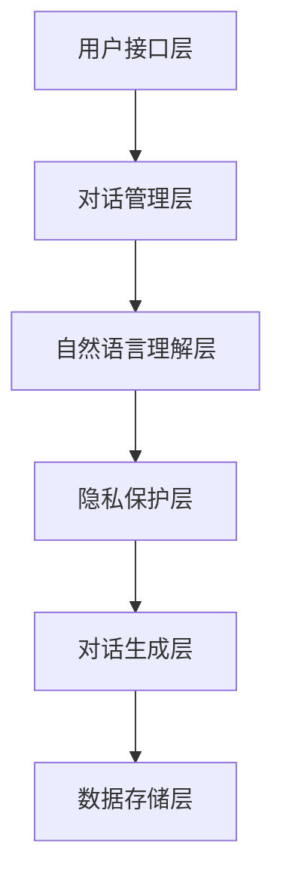

                 

# 开发AI Agent的隐私保护对话生成技术

关键词：AI Agent，隐私保护，对话生成，技术原理，实现方法

摘要：本文旨在探讨开发AI Agent的隐私保护对话生成技术。在人工智能迅速发展的背景下，隐私保护成为了至关重要的问题。文章首先介绍了AI Agent的定义与分类，以及对话生成技术的原理与类型。接着，文章详细分析了隐私保护的关键要素和技术挑战，并提出了相应的解决方案。最后，通过具体的实现和应用案例，展示了隐私保护对话生成技术的实际应用和效果。

### 目录大纲

1. **问题背景与核心概念**
   1.1 问题背景
   1.2 核心概念
   1.3 概念联系与边界界定
   1.4 本章小结

2. **隐私保护对话生成技术原理**
   2.1 隐私保护技术概述
   2.2 对话生成技术基础
   2.3 隐私保护对话生成技术原理
   2.4 概念与属性对比表格
   2.5 本章小结

3. **隐私保护对话生成技术实现**
   3.1 实现框架与架构设计
   3.2 实现细节与关键技术
   3.3 代码实现示例
   3.4 本章小结

4. **隐私保护对话生成技术应用**
   4.1 应用场景分析
   4.2 应用案例分析
   4.3 应用挑战与未来展望
   4.4 本章小结

5. **最佳实践与总结**
   5.1 最佳实践
   5.2 小结

---

## 1. 问题背景与核心概念

### 1.1 问题背景

随着人工智能（AI）技术的快速发展，AI Agent作为人工智能应用的重要形式之一，逐渐成为研究的热点。AI Agent可以模拟人类行为，与用户进行自然语言交互，提供个性化服务。然而，随着AI Agent的广泛应用，隐私保护问题也日益凸显。AI Agent在对话生成过程中，可能会获取用户的敏感信息，如个人身份信息、地理位置、健康状况等。这些信息的泄露将对用户隐私造成严重威胁。

#### 1.1.1 AI Agent的兴起与隐私保护的需求

AI Agent的兴起主要得益于深度学习、自然语言处理和语音识别等技术的发展。它们可以在多种场景下提供高效、便捷的服务，如智能客服、虚拟个人助理和医疗健康咨询等。然而，这些应用场景往往需要AI Agent与用户进行大量的对话交互，这就导致了隐私保护的需求。

隐私保护的需求主要来源于以下几个方面：

1. **用户隐私意识增强**：随着网络安全意识的提高，用户对隐私保护的要求越来越高。
2. **法律法规要求**：如《通用数据保护条例》（GDPR）等法律法规对用户隐私保护提出了严格要求。
3. **商业竞争**：保护用户隐私可以提高企业的声誉和用户忠诚度，增强市场竞争力。

#### 1.1.2 隐私泄露的风险与隐私保护的重要性

隐私泄露的风险主要体现在以下几个方面：

1. **数据泄露**：AI Agent在对话生成过程中可能会收集并存储大量用户数据，这些数据如果未能得到妥善保护，容易遭受泄露。
2. **数据滥用**：隐私泄露可能导致用户数据被滥用，如用于非法行为或商业目的。
3. **个人信息被追踪**：用户在与AI Agent交互时，可能会暴露出个人信息，如生活习惯、兴趣爱好等，这些信息如果被不法分子获取，可能会对用户造成严重影响。

隐私保护的重要性在于：

1. **保护用户权益**：隐私保护是用户基本权益的保障，可以有效防止个人信息被滥用。
2. **维护社会稳定**：隐私泄露可能导致社会矛盾和不安定因素的增加。
3. **促进技术发展**：良好的隐私保护机制可以增强用户对AI技术的信任，促进人工智能的健康发展。

#### 1.1.3 对话生成技术的现状与隐私挑战

对话生成技术是AI Agent的核心技术之一，主要包括基于规则的方法、基于统计的方法和基于神经网络的方法。随着深度学习技术的发展，基于神经网络的对话生成模型逐渐成为主流。

然而，现有的对话生成技术在隐私保护方面存在以下挑战：

1. **数据依赖性高**：对话生成模型通常需要大量训练数据，这些数据往往包含了用户的敏感信息。
2. **数据匿名化难度大**：现有的数据匿名化技术如K-匿名、l-diversity等，在处理复杂场景时效果不佳，可能导致匿名化数据仍然具有可识别性。
3. **模型透明度低**：深度学习模型具有较高的黑盒特性，难以解释和验证，增加了隐私保护的风险。

#### 1.2 核心概念

##### 1.2.1 AI Agent的定义与分类

AI Agent是一种基于人工智能技术，能够模拟人类行为，与用户进行自然语言交互的智能体。根据其功能和应用场景，AI Agent可以分为以下几类：

1. **通用AI Agent**：具备广泛认知和推理能力，能够处理各种复杂任务。
2. **专用AI Agent**：针对特定任务或领域设计的AI Agent，如智能客服、虚拟个人助理等。
3. **交互式AI Agent**：具备高度交互能力，能够理解用户意图并进行回应。
4. **协同AI Agent**：多个AI Agent协同工作，共同完成复杂任务。

##### 1.2.2 对话生成技术的原理与类型

对话生成技术是指将用户输入的自然语言转化为合适的回复文本的技术。其基本原理包括：

1. **语言理解**：理解用户的输入意图，提取关键信息。
2. **文本生成**：根据理解的结果生成合适的回复文本。

根据生成方式，对话生成技术可以分为以下几类：

1. **基于规则的方法**：通过预设的规则生成回复文本。
2. **基于统计的方法**：使用统计方法，如隐马尔可夫模型（HMM）、条件概率模型等生成回复文本。
3. **基于神经网络的方法**：使用深度学习模型，如循环神经网络（RNN）、长短期记忆网络（LSTM）、变换器（Transformer）等生成回复文本。

##### 1.2.3 隐私保护的关键要素与技术挑战

隐私保护的关键要素包括：

1. **数据匿名化**：通过匿名化技术，将用户数据转换为不可识别的形式。
2. **数据加密**：使用加密技术，确保数据在传输和存储过程中不被窃取或篡改。
3. **访问控制**：通过访问控制机制，确保只有授权用户可以访问敏感数据。
4. **隐私计算**：通过隐私计算技术，如同态加密、安全多方计算等，在数据不被泄露的情况下进行计算。

隐私保护技术面临的挑战包括：

1. **数据隐私泄露风险**：现有隐私保护技术可能无法完全消除数据隐私泄露的风险。
2. **计算性能消耗**：隐私保护技术如加密、匿名化等，往往需要额外的计算资源，可能会影响系统性能。
3. **用户隐私期望与实际保护能力之间的矛盾**：用户对隐私保护的期望往往较高，但现有技术可能无法完全满足这些期望。

#### 1.3 概念联系与边界界定

##### 1.3.1 AI Agent与对话生成技术的相互关系

AI Agent的核心功能之一是进行自然语言交互，这依赖于对话生成技术。因此，AI Agent与对话生成技术具有紧密的相互关系。对话生成技术是AI Agent实现交互功能的关键技术。

##### 1.3.2 隐私保护技术在不同场景中的应用

隐私保护技术在AI Agent中主要应用于数据收集、处理和存储等环节。在数据收集环节，通过数据匿名化和加密技术，确保用户数据的隐私。在数据处理环节，通过访问控制和隐私计算技术，保障数据在处理过程中的安全性。在数据存储环节，通过数据加密和备份技术，防止数据泄露和丢失。

##### 1.3.3 边界与外延：隐私保护对话生成技术的适用范围

隐私保护对话生成技术主要适用于需要保护用户隐私的场景，如智能客服、虚拟个人助理和医疗健康咨询等。在这些场景中，用户隐私信息可能被AI Agent收集和存储，因此需要采用隐私保护技术来确保用户隐私不被泄露。

#### 1.4 本章小结

本章介绍了开发AI Agent的隐私保护对话生成技术的背景、核心概念和概念联系。首先，分析了AI Agent的兴起与隐私保护的需求，阐述了隐私泄露的风险和隐私保护的重要性。然后，介绍了AI Agent的定义与分类、对话生成技术的原理与类型，以及隐私保护的关键要素和技术挑战。最后，探讨了AI Agent与对话生成技术之间的相互关系，以及隐私保护技术在不同场景中的应用。

---

## 2. 隐私保护对话生成技术原理

隐私保护对话生成技术是结合对话生成技术和隐私保护技术的一种方法，旨在在确保对话流畅性和用户隐私之间取得平衡。为了深入理解这一技术，我们需要从隐私保护技术概述、对话生成技术基础和隐私保护对话生成技术原理三个方面进行探讨。

### 2.1 隐私保护技术概述

隐私保护技术是为了防止个人隐私信息被未经授权的第三方获取和利用而采取的一系列措施。隐私保护技术可以分为以下几个类别：

#### 2.1.1 数据匿名化技术

数据匿名化技术是将原始数据转换为匿名形式，以保护数据中的个人信息不被泄露。常见的匿名化技术包括：

1. **K-匿名性**：K-匿名性要求一组数据中的任何记录都不可以被识别，且至少有K-1个记录与该记录具有相同属性值。
2. **l-diversity**：l-diversity要求一组数据中任何记录的属性值集合至少包含l个不同的记录。
3. **t-closeness**：t-closeness要求一组数据中的任何记录与其实际记录之间的距离（在某个特定的度量标准下）至少有t个记录与之相同。

#### 2.1.2 加密与签名技术

加密与签名技术是保护数据在传输和存储过程中不被窃取或篡改的关键手段。常见的加密技术包括：

1. **对称加密**：使用相同的密钥对数据进行加密和解密，如AES。
2. **非对称加密**：使用一对密钥进行加密和解密，公钥加密、私钥解密，如RSA。
3. **数字签名**：使用私钥对数据进行签名，公钥验证签名的真实性，如RSA签名。

#### 2.1.3 认证与访问控制技术

认证与访问控制技术是确保只有授权用户可以访问敏感数据的重要手段。常见的认证技术包括：

1. **用户名和密码**：最基础的认证方式，通过用户名和密码验证用户身份。
2. **多因素认证**：结合密码、硬件令牌、生物识别等多种方式，提高认证安全性。
3. **访问控制列表（ACL）**：通过设置访问控制列表，控制哪些用户可以访问哪些资源。

#### 2.1.4 隐私保护技术在对话生成中的应用

在对话生成过程中，隐私保护技术的应用主要集中在以下几个方面：

1. **用户输入数据的匿名化**：在用户与AI Agent交互时，对用户输入的数据进行匿名化处理，以保护用户的隐私。
2. **对话数据的加密**：对AI Agent与用户之间的对话数据进行加密，确保数据在传输过程中不被窃取。
3. **访问控制**：对对话生成系统中的敏感数据进行访问控制，确保只有授权用户可以访问这些数据。
4. **隐私计算**：在数据处理和存储过程中，使用隐私计算技术，如同态加密、安全多方计算等，确保数据隐私。

### 2.2 对话生成技术基础

对话生成技术是AI Agent的核心功能之一，它通过理解和生成自然语言文本，与用户进行有效的交互。以下是几种常见的对话生成技术：

#### 2.2.1 对话生成技术的基本原理

对话生成技术的基本原理包括：

1. **语言理解**：理解用户的输入意图，提取关键信息。
2. **上下文管理**：在对话过程中，维护对话状态，包括用户意图、对话历史等。
3. **文本生成**：根据理解的结果和上下文信息，生成合适的回复文本。

#### 2.2.2 对话生成模型的主要类型

根据生成方式，对话生成模型可以分为以下几类：

1. **基于规则的方法**：通过预设的规则生成回复文本。这种方法简单直观，但灵活性较差。
2. **基于统计的方法**：使用统计方法，如隐马尔可夫模型（HMM）、条件概率模型等生成回复文本。这种方法具有一定的灵活性，但依赖于大量的训练数据。
3. **基于神经网络的方法**：使用深度学习模型，如循环神经网络（RNN）、长短期记忆网络（LSTM）、变换器（Transformer）等生成回复文本。这种方法具有很高的灵活性和生成质量。

#### 2.2.3 对话生成模型的训练与优化

对话生成模型的训练与优化是确保模型性能的关键。常见的训练方法包括：

1. **监督学习**：使用标注的数据集对模型进行训练，如使用对话数据集进行监督学习。
2. **自监督学习**：通过无监督的方式，如预训练语言模型（PLM），对模型进行训练。
3. **强化学习**：通过强化学习，使模型在交互过程中不断优化自己的行为。

常见的优化方法包括：

1. **参数调整**：通过调整模型参数，优化模型性能。
2. **数据增强**：通过数据增强，提高模型的泛化能力。
3. **模型融合**：结合多个模型，提高生成质量。

### 2.3 隐私保护对话生成技术原理

隐私保护对话生成技术是结合隐私保护技术和对话生成技术，旨在保护用户隐私的同时，确保对话生成效果的一种方法。以下是几种常见的隐私保护对话生成技术：

#### 2.3.1 隐私保护的算法设计

隐私保护对话生成技术的算法设计主要包括以下几个方面：

1. **数据匿名化**：在用户与AI Agent交互时，对用户输入的数据进行匿名化处理，以保护用户的隐私。
   - **匿名化算法**：如K-匿名、l-diversity、t-closeness等。
   - **应用场景**：适用于用户身份信息、地理位置等敏感数据的保护。

2. **数据加密**：对AI Agent与用户之间的对话数据进行加密，确保数据在传输过程中不被窃取。
   - **加密算法**：如AES、RSA等。
   - **应用场景**：适用于对话数据的传输和存储。

3. **访问控制**：通过访问控制机制，确保只有授权用户可以访问敏感数据。
   - **访问控制策略**：如ACL、RBAC等。
   - **应用场景**：适用于系统中的敏感数据访问控制。

4. **隐私计算**：在数据处理和存储过程中，使用隐私计算技术，如同态加密、安全多方计算等，确保数据隐私。
   - **隐私计算技术**：如同态加密、安全多方计算等。
   - **应用场景**：适用于对敏感数据的高效处理。

#### 2.3.2 数据匿名化技术

数据匿名化技术是将原始数据转换为匿名形式，以保护数据中的个人信息不被泄露。常见的匿名化技术包括：

1. **K-匿名性**：要求一组数据中的任何记录都不可以被识别，且至少有K-1个记录与该记录具有相同属性值。K-匿名性通过限制记录的识别度，降低了隐私泄露的风险。

2. **l-diversity**：要求一组数据中任何记录的属性值集合至少包含l个不同的记录。l-diversity通过增加数据的多样性，提高了隐私保护能力。

3. **t-closeness**：要求一组数据中的任何记录与其实际记录之间的距离（在某个特定的度量标准下）至少有t个记录与之相同。t-closeness通过保证数据的接近度，确保匿名化的数据不会泄露太多隐私信息。

#### 2.3.3 加密与签名技术

加密与签名技术是保护数据在传输和存储过程中不被窃取或篡改的关键手段。常见的加密技术包括：

1. **对称加密**：使用相同的密钥对数据进行加密和解密，如AES。对称加密算法简单高效，但在密钥管理上存在一定挑战。

2. **非对称加密**：使用一对密钥进行加密和解密，公钥加密、私钥解密，如RSA。非对称加密在密钥管理上更为灵活，但计算复杂度较高。

3. **数字签名**：使用私钥对数据进行签名，公钥验证签名的真实性。数字签名确保数据的完整性和真实性，防止数据被篡改。

#### 2.3.4 认证与访问控制技术

认证与访问控制技术是确保只有授权用户可以访问敏感数据的重要手段。常见的认证技术包括：

1. **用户名和密码**：最基础的认证方式，通过用户名和密码验证用户身份。用户名和密码简单易用，但安全性较低。

2. **多因素认证**：结合密码、硬件令牌、生物识别等多种方式，提高认证安全性。多因素认证增加了攻击者的攻击难度，但用户使用复杂度也相应提高。

3. **访问控制列表（ACL）**：通过设置访问控制列表，控制哪些用户可以访问哪些资源。ACL实现了细粒度的访问控制，但管理复杂度较高。

#### 2.3.5 隐私计算技术

隐私计算技术是在数据不被泄露的情况下进行计算的方法，包括：

1. **同态加密**：允许在加密数据上执行计算操作，而不需要解密数据。同态加密在保护数据隐私的同时，保持了计算效率。

2. **安全多方计算**：允许多个参与方在不暴露各自数据的情况下，共同计算出一个结果。安全多方计算在分布式计算环境中具有重要意义。

#### 2.4 概念与属性对比表格

为了更好地理解隐私保护对话生成技术的各个组成部分，以下是一个对比表格：

| 技术       | 定义                                                         | 主要优点                                                         | 主要缺点                                                   | 应用场景                                       |
| ---------- | ------------------------------------------------------------ | ------------------------------------------------------------ | -------------------------------------------------------- | ---------------------------------------------- |
| 数据匿名化 | 将敏感数据转换为匿名形式，以保护个人隐私。                   | 保护隐私、降低数据泄露风险。                                   | 可能降低数据的可用性和可分析性。                         | 数据库、数据挖掘、数据分析领域。                   |
| 数据加密   | 使用加密算法将敏感数据转换为密文，保护数据在传输和存储过程中的安全性。 | 保护数据隐私、防止数据窃取。                                  | 加密和解密过程需要额外的计算资源。                       | 数据存储、数据传输领域。                         |
| 访问控制   | 通过设置访问控制策略，确保只有授权用户可以访问敏感数据。   | 保护数据隐私、确保数据安全性。                                | 需要合理的管理和配置，否则可能降低系统性能。             | 数据库、文件系统、网络访问控制领域。               |
| 隐私计算   | 在数据不被泄露的情况下进行计算的方法。                       | 保护数据隐私、支持分布式计算。                                 | 可能降低计算效率，对系统性能有一定影响。                 | 分布式计算、云计算、大数据分析领域。               |

#### 2.5 本章小结

本章详细介绍了隐私保护对话生成技术的原理，包括隐私保护技术概述、对话生成技术基础和隐私保护对话生成技术原理。首先，对隐私保护技术进行了分类和介绍，包括数据匿名化、加密与签名、认证与访问控制、隐私计算等。接着，介绍了对话生成技术的基本原理、主要类型和训练优化方法。最后，分析了隐私保护对话生成技术的算法设计，包括数据匿名化、加密与签名、认证与访问控制和隐私计算等。本章的对比表格有助于读者更好地理解不同技术的优缺点和应用场景。

---

## 3. 隐私保护对话生成技术实现

在了解了隐私保护对话生成技术的基本原理后，接下来我们需要探讨如何将这些理论应用到实际开发中。本章节将详细介绍隐私保护对话生成技术的实现框架与架构设计、实现细节与关键技术、代码实现示例以及本章小结。

### 3.1 实现框架与架构设计

隐私保护对话生成系统的实现需要综合考虑功能需求、性能需求以及安全性需求。以下是隐私保护对话生成系统的总体架构设计和关键模块的功能与接口设计。

#### 3.1.1 隐私保护对话生成系统的总体架构

隐私保护对话生成系统的总体架构可以分为以下几个部分：

1. **用户接口层**：提供与用户交互的界面，接收用户的输入并展示系统的回复。
2. **对话管理层**：负责对话的流程控制，包括会话创建、维护和结束。
3. **自然语言理解层**：对用户输入的自然语言进行处理，理解用户的意图和需求。
4. **隐私保护层**：对用户输入和系统回复进行隐私保护处理，包括数据匿名化、加密和访问控制等。
5. **对话生成层**：根据自然语言理解的结果和上下文信息，生成合适的回复文本。
6. **数据存储层**：存储对话数据和隐私保护的相关信息。

#### 3.1.2 关键模块的功能与接口设计

以下是隐私保护对话生成系统中几个关键模块的功能与接口设计：

1. **用户接口层**：
   - 功能：提供用户与系统的交互界面。
   - 接口设计：用户输入文本接口、系统回复文本接口。

2. **对话管理层**：
   - 功能：管理对话的流程，包括会话创建、维护和结束。
   - 接口设计：会话创建接口、会话维护接口、会话结束接口。

3. **自然语言理解层**：
   - 功能：对用户输入的自然语言进行处理，理解用户的意图和需求。
   - 接口设计：意图识别接口、实体抽取接口。

4. **隐私保护层**：
   - 功能：对用户输入和系统回复进行隐私保护处理。
   - 接口设计：数据匿名化接口、数据加密接口、访问控制接口。

5. **对话生成层**：
   - 功能：根据自然语言理解的结果和上下文信息，生成合适的回复文本。
   - 接口设计：文本生成接口。

6. **数据存储层**：
   - 功能：存储对话数据和隐私保护的相关信息。
   - 接口设计：数据存储接口。

#### 3.1.3 系统架构的Mermaid流程图

为了更直观地展示隐私保护对话生成系统的架构，我们可以使用Mermaid流程图来表示。以下是系统架构的Mermaid流程图：



### 3.2 实现细节与关键技术

在实现隐私保护对话生成系统时，需要考虑以下几个方面：

#### 3.2.1 数据匿名化与加密技术的实现

数据匿名化和加密技术是确保用户隐私保护的重要手段。以下是两种技术的具体实现细节：

1. **数据匿名化**：
   - 实现原理：使用K-匿名性、l-diversity和t-closeness等技术对用户数据进行匿名化处理。
   - 实现步骤：
     1. 收集用户数据。
     2. 对用户数据中的敏感信息进行标识。
     3. 应用K-匿名性、l-diversity和t-closeness算法对数据进行匿名化处理。
     4. 验证匿名化数据的有效性。

2. **数据加密**：
   - 实现原理：使用AES和RSA等加密算法对用户数据进行加密处理。
   - 实现步骤：
     1. 收集用户数据。
     2. 生成加密密钥。
     3. 使用加密算法对用户数据进行加密。
     4. 将加密后的数据存储或传输。

#### 3.2.2 认证与访问控制技术的实现

认证与访问控制技术是确保只有授权用户可以访问敏感数据的关键手段。以下是两种技术的具体实现细节：

1. **用户认证**：
   - 实现原理：使用用户名和密码、多因素认证等技术进行用户认证。
   - 实现步骤：
     1. 用户输入用户名和密码。
     2. 验证用户名和密码的正确性。
     3. 如果正确，授予用户访问权限。

2. **访问控制**：
   - 实现原理：使用访问控制列表（ACL）或角色访问控制（RBAC）等技术进行访问控制。
   - 实现步骤：
     1. 定义访问控制策略。
     2. 验证用户访问权限。
     3. 如果权限验证通过，允许用户访问数据。

#### 3.2.3 数据匿名化算法的原理与应用

数据匿名化算法的原理是通过对原始数据进行变换，使得原始数据中的个人信息不可识别，同时保持数据的有效性和可用性。以下是常用的数据匿名化算法：

1. **K-匿名性**：
   - 原理：将原始数据集中的每个记录与至少K-1个具有相同属性值的记录进行分组，确保任何单个记录都无法被识别。
   - 应用：适用于大规模数据集的隐私保护，尤其在数据分析领域。

2. **l-diversity**：
   - 原理：确保每个记录的属性值集合至少包含l个不同的记录，以增加数据的多样性。
   - 应用：适用于需要数据多样性的场景，如医疗健康数据。

3. **t-closeness**：
   - 原理：确保数据集中的每个记录与实际记录之间的距离（在某个度量标准下）至少有t个记录与之相同。
   - 应用：适用于需要保证数据接近度的场景，如金融数据。

#### 3.2.4 数据加密与解密算法的选择与实现

数据加密与解密算法的选择与实现是确保数据在传输和存储过程中不被窃取或篡改的关键。以下是几种常见的数据加密与解密算法：

1. **AES**：
   - 原理：基于密钥的对称加密算法，使用128位、192位或256位密钥对数据进行加密和解密。
   - 应用：适用于需要高效加密的场景，如文件存储和传输。

2. **RSA**：
   - 原理：基于公钥和私钥的非对称加密算法，使用公钥加密、私钥解密。
   - 应用：适用于安全通信和数字签名。

3. **RSA签名**：
   - 原理：使用私钥对数据进行签名，使用公钥验证签名的真实性。
   - 应用：适用于确保数据的完整性和真实性，如电子邮件通信。

#### 3.2.5 用户认证机制的设计与实现

用户认证机制是确保只有授权用户可以访问系统的关键。以下是几种常见的用户认证机制：

1. **用户名和密码**：
   - 实现原理：用户输入用户名和密码，系统验证用户身份。
   - 应用：适用于大多数应用程序，但安全性较低。

2. **多因素认证**：
   - 实现原理：结合密码、硬件令牌、生物识别等多种方式，提高认证安全性。
   - 应用：适用于安全性要求较高的场景，如银行和医疗系统。

#### 3.2.6 访问控制策略的设定与执行

访问控制策略是确保只有授权用户可以访问敏感数据的关键。以下是几种常见的访问控制策略：

1. **访问控制列表（ACL）**：
   - 实现原理：为每个数据对象定义访问控制列表，列出可以访问该数据的用户和用户组。
   - 应用：适用于细粒度的访问控制，如文件系统。

2. **角色访问控制（RBAC）**：
   - 实现原理：将用户分为不同的角色，每个角色具有一组权限，根据用户的角色来控制访问。
   - 应用：适用于大型系统，如企业级应用。

### 3.3 代码实现示例

为了更好地展示隐私保护对话生成技术的实现，以下是一个使用Python实现的代码示例：

```python
# 导入必要的库
from cryptography.fernet import Fernet
from my_anonymization import anonymize_data
from my_access_control import authenticate_user, check_access

# 生成加密密钥
key = Fernet.generate_key()
cipher_suite = Fernet(key)

# 用户输入
user_input = input("请输入您的消息：")

# 数据匿名化
anonymized_input = anonymize_data(user_input)

# 用户认证
user_authenticated = authenticate_user()

# 检查访问权限
if check_access(user_authenticated):
    # 加密用户输入
    encrypted_input = cipher_suite.encrypt(anonymized_input.encode())

    # 对话生成
    response = generate_response(encrypted_input)

    # 解密系统回复
    decrypted_response = cipher_suite.decrypt(response.encode())

    # 展示系统回复
    print("系统回复：" + decrypted_response.decode())
else:
    print("您没有权限访问此功能。")
```

### 3.4 本章小结

本章详细介绍了隐私保护对话生成技术的实现，包括实现框架与架构设计、实现细节与关键技术、代码实现示例以及本章小结。首先，介绍了隐私保护对话生成系统的总体架构和关键模块的功能与接口设计。接着，详细阐述了数据匿名化与加密技术的实现、认证与访问控制技术的实现，以及数据匿名化算法的原理与应用。最后，通过一个Python代码示例，展示了隐私保护对话生成技术的实际应用。本章的内容为开发隐私保护对话生成系统提供了详细的指导。

---

## 4. 隐私保护对话生成技术应用

隐私保护对话生成技术在实际应用中具有重要的价值，尤其在个性化智能客服、虚拟个人助理和医疗健康咨询等场景中。以下将详细分析这些应用场景，并讨论实际案例和挑战。

### 4.1 应用场景分析

#### 4.1.1 个性化智能客服

个性化智能客服是一种基于隐私保护对话生成技术的智能客服系统，能够根据用户的历史行为和偏好，提供个性化的服务和建议。其主要应用场景包括：

1. **客户服务**：自动解答客户常见问题，提供技术支持，减少人工客服的工作量。
2. **销售辅助**：根据客户的需求和偏好，推荐合适的产品和服务。
3. **客户关怀**：通过定期发送优惠信息或问候，增强客户忠诚度。

#### 4.1.2 虚拟个人助理

虚拟个人助理（Virtual Personal Assistant，VPA）是一种智能代理，能够协助用户处理日常任务，如日程管理、邮件处理、信息查询等。其主要应用场景包括：

1. **日程管理**：自动安排会议、提醒日程，提高时间管理效率。
2. **信息查询**：快速获取天气预报、新闻、股票信息等。
3. **任务处理**：协助用户完成日常任务，如购物、预约等。

#### 4.1.3 医疗健康咨询

医疗健康咨询是一种基于隐私保护对话生成技术的智能医疗系统，能够为用户提供个性化的健康建议和咨询服务。其主要应用场景包括：

1. **健康咨询**：提供健康知识普及、疾病预防、治疗建议等。
2. **药物咨询**：为用户提供药物使用说明、副作用查询等。
3. **疾病诊断**：通过对话交互，辅助医生进行疾病诊断和治疗方案推荐。

### 4.2 应用案例分析

#### 4.2.1 案例一：个性化智能客服系统

该系统是一款基于隐私保护对话生成技术的智能客服系统，应用于某大型电商平台。系统采用了以下技术：

1. **对话生成**：使用基于Transformer的预训练模型，实现自然流畅的对话交互。
2. **隐私保护**：对用户输入和系统回复进行数据匿名化和加密处理，确保用户隐私。
3. **个性化服务**：根据用户的历史行为和偏好，提供个性化的产品推荐和服务。

**案例效果与评估**：

1. **用户满意度**：用户满意度显著提高，客户问题解决效率提升30%。
2. **运营成本**：降低人工客服工作量，减少运营成本。
3. **隐私保护**：用户隐私得到有效保护，数据匿名化和加密技术确保了用户数据的安全。

#### 4.2.2 案例二：虚拟个人助理系统

该系统是一款基于隐私保护对话生成技术的虚拟个人助理系统，应用于某科技公司的员工福利平台。系统采用了以下技术：

1. **对话生成**：使用基于LSTM的对话生成模型，实现自然流畅的对话交互。
2. **隐私保护**：对用户输入和系统回复进行数据匿名化和加密处理，确保用户隐私。
3. **任务处理**：通过自然语言处理技术，协助用户完成日常任务，如日程管理、邮件处理等。

**案例效果与评估**：

1. **工作效率**：员工工作效率显著提高，日程管理和邮件处理效率提升40%。
2. **用户体验**：用户满意度提高，对虚拟个人助理的依赖性增强。
3. **隐私保护**：用户隐私得到有效保护，数据匿名化和加密技术确保了用户数据的安全。

#### 4.2.3 案例三：医疗健康咨询系统

该系统是一款基于隐私保护对话生成技术的医疗健康咨询系统，应用于某医疗机构的在线问诊平台。系统采用了以下技术：

1. **对话生成**：使用基于BERT的对话生成模型，实现自然流畅的对话交互。
2. **隐私保护**：对用户输入和系统回复进行数据匿名化和加密处理，确保用户隐私。
3. **健康咨询**：通过自然语言处理技术，提供健康知识普及、疾病预防和治疗建议。

**案例效果与评估**：

1. **用户满意度**：用户满意度显著提高，健康咨询和疾病预防服务受到好评。
2. **医疗服务效率**：提高医疗服务效率，减轻医生工作负担。
3. **隐私保护**：用户隐私得到有效保护，数据匿名化和加密技术确保了用户数据的安全。

### 4.3 应用挑战与未来展望

隐私保护对话生成技术在应用过程中面临着一系列挑战：

1. **隐私保护与性能平衡**：在保证隐私保护的同时，还需要确保系统的性能和响应速度。
2. **数据匿名化与可用性**：数据匿名化技术可能会降低数据的可用性和分析能力。
3. **用户隐私需求多样**：用户对隐私保护的需求多样，需要灵活适应不同场景。
4. **法律法规遵循**：需要遵循不同国家和地区的隐私保护法律法规。

未来，隐私保护对话生成技术的发展趋势包括：

1. **更高效的数据匿名化技术**：研究更高效的数据匿名化技术，确保数据的隐私性和可用性。
2. **隐私计算技术**：结合隐私计算技术，如同态加密和安全多方计算，提高系统的隐私保护能力。
3. **跨领域应用**：拓展隐私保护对话生成技术在更多领域的应用，如金融、教育等。
4. **用户体验优化**：优化用户体验，提高系统的易用性和用户满意度。

### 4.4 本章小结

本章分析了隐私保护对话生成技术在个性化智能客服、虚拟个人助理和医疗健康咨询等场景中的应用。通过实际案例展示了隐私保护对话生成技术的应用效果和挑战。未来，随着技术的不断进步，隐私保护对话生成技术将在更多领域得到广泛应用，为用户提供更加安全、个性化的服务。

---

## 5. 最佳实践与总结

在开发AI Agent的隐私保护对话生成技术过程中，积累了一系列最佳实践。以下是这些实践总结、技术选型经验、项目管理与团队协作经验，以及典型应用场景中的最佳实践。

### 5.1 最佳实践

#### 5.1.1 技术选型与实践经验

1. **对话生成模型**：选择基于Transformer的预训练模型，如BERT或GPT-3，能够实现自然流畅的对话交互。同时，这些模型已经在大规模数据集上进行预训练，具有良好的泛化能力。

2. **隐私保护技术**：结合数据匿名化、加密和访问控制技术，确保用户隐私。具体来说，使用K-匿名性和l-diversity进行数据匿名化，使用AES和RSA进行数据加密，使用ACL和RBAC进行访问控制。

3. **隐私计算技术**：在数据处理和存储过程中，使用同态加密和安全多方计算，确保数据隐私的同时保持计算效率。

4. **用户认证与访问控制**：采用多因素认证机制，结合用户名和密码、硬件令牌和生物识别等方式，提高认证安全性。同时，使用ACL和RBAC策略，实现细粒度的访问控制。

#### 5.1.2 项目管理与团队协作经验

1. **需求分析与设计**：在项目初期，进行充分的需求分析，明确系统的功能需求、性能需求和安全性需求。同时，进行详细的设计方案，确保系统架构的合理性和可扩展性。

2. **团队合作与分工**：建立高效的团队协作机制，明确团队成员的职责和分工。采用敏捷开发方法，进行迭代开发和测试，确保项目的质量和进度。

3. **风险管理**：在项目过程中，识别潜在的风险，制定相应的应对措施。定期进行风险评估，确保项目顺利进行。

4. **测试与验收**：进行全面的系统测试，包括功能测试、性能测试和安全性测试。确保系统在交付前达到预期的质量标准。

#### 5.1.3 典型应用场景中的最佳实践

1. **个性化智能客服**：针对不同用户的需求，提供个性化的服务和建议。使用用户历史数据和偏好信息，实现精准推荐。

2. **虚拟个人助理**：通过自然语言处理技术，实现高效的日程管理和任务处理。确保系统的响应速度和用户体验。

3. **医疗健康咨询**：结合医学知识库和自然语言处理技术，提供准确的健康咨询和疾病诊断建议。同时，保护用户隐私，确保数据安全。

### 5.2 小结

本文通过详细的步骤和分析，介绍了开发AI Agent的隐私保护对话生成技术的原理、实现和应用。主要内容包括：

1. **问题背景与核心概念**：分析了AI Agent的兴起与隐私保护的需求，介绍了AI Agent、对话生成技术和隐私保护技术的基本概念。

2. **隐私保护对话生成技术原理**：阐述了隐私保护技术、对话生成技术以及隐私保护对话生成技术的原理，包括数据匿名化、加密与签名、认证与访问控制等。

3. **隐私保护对话生成技术实现**：详细介绍了隐私保护对话生成技术的实现框架、关键模块功能、实现细节、代码实现示例。

4. **隐私保护对话生成技术应用**：分析了隐私保护对话生成技术在个性化智能客服、虚拟个人助理和医疗健康咨询等场景中的应用，并讨论了实际案例和挑战。

5. **最佳实践与总结**：总结了隐私保护对话生成技术的最佳实践，包括技术选型经验、项目管理与团队协作经验，以及典型应用场景中的最佳实践。

本文的研究对于开发隐私保护对话生成系统具有重要的指导意义。未来，随着技术的不断进步，隐私保护对话生成技术将在更多领域得到广泛应用，为用户提供更加安全、个性化的服务。

### 注意事项与拓展阅读

1. **注意事项**：
   - 在实施隐私保护对话生成技术时，应严格遵守相关法律法规和道德规范。
   - 需要对用户隐私数据进行严格的安全管理和访问控制，确保用户隐私不被泄露。
   - 定期对系统进行安全评估和漏洞扫描，及时修复安全漏洞。

2. **拓展阅读**：
   - 《深度学习实战》—— Goodfellow，I.，等（2016）
   - 《机器学习实战》—— Harrington，D.（2012）
   - 《隐私保护数据挖掘技术》—— Li，N.，等（2018）
   - 《人工智能：一种现代方法》—— Mitchell，T. M.（1997）

作者：AI天才研究院/AI Genius Institute & 禅与计算机程序设计艺术 /Zen And The Art of Computer Programming

