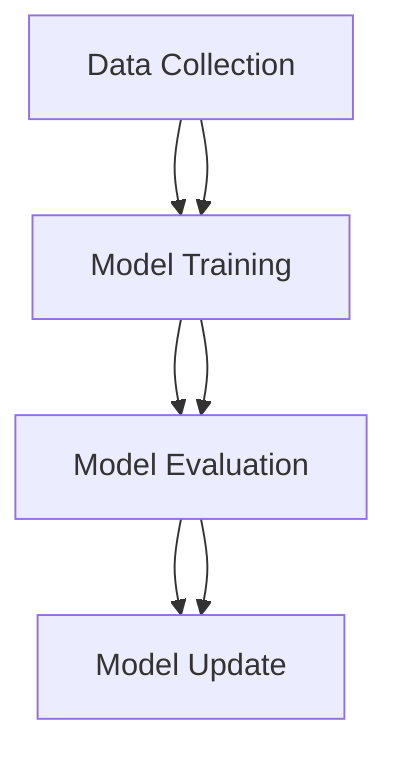

                 


### 第1章 问题背景与介绍

#### 1.1 问题背景

在现代信息技术飞速发展的背景下，数据隐私保护问题日益凸显。随着人工智能（AI）技术的不断进步，越来越多的AI Agent被开发出来，这些AI Agent广泛应用于医疗、金融、教育等多个领域，大大提升了业务效率和用户体验。然而，AI Agent在处理和利用用户数据时，面临的隐私保护问题也日益严峻。

**隐私保护的重要性**

隐私保护是指保护个人数据不被未经授权的第三方访问、使用或泄露。在数据驱动的AI Agent应用场景中，数据是AI Agent训练和决策的基础，但同时也成为隐私泄露的隐患。如果这些数据被恶意使用或泄露，可能会导致用户身份泄露、财产损失、甚至生命安全威胁。因此，隐私保护在AI Agent开发中显得尤为重要。

**联邦学习的基本概念与原理**

联邦学习（Federated Learning）是一种分布式机器学习技术，通过将数据分布在多个边缘设备或服务器上，协作训练一个全局模型。这种方式不仅降低了数据传输的风险，还能在保护用户隐私的前提下实现智能模型训练。联邦学习的基本原理包括模型更新、参数合成和模型优化。

**AI Agent的需求与隐私保护的挑战**

AI Agent作为智能体，通常需要访问和处理大量用户数据来进行学习和优化。然而，在保证AI Agent性能的同时，如何有效地保护用户隐私成为一大挑战。传统的隐私保护技术如数据加密、匿名化和差分隐私等，虽然在一定程度上能够保护用户隐私，但在AI Agent应用中存在一定的局限性。

#### 1.2 问题描述

**隐私泄露的风险与潜在后果**

在AI Agent的应用过程中，用户数据可能面临泄露的风险。例如，数据在传输过程中可能被拦截和篡改，数据存储可能被黑客攻击，甚至数据在使用过程中可能被内部人员恶意利用。这些隐私泄露事件可能导致以下后果：

- 用户身份泄露：用户的个人信息可能被不法分子获取，用于非法活动。
- 财产损失：用户的财务信息可能被泄露，导致财产损失。
- 信任危机：用户对AI Agent和应用系统的信任度下降，影响业务持续发展。

**当前隐私保护技术的局限性**

尽管现有的隐私保护技术能够在一定程度上保护用户数据，但在AI Agent应用中仍存在以下局限性：

- 数据加密：虽然数据加密可以防止数据在传输过程中的泄露，但无法防止数据在本地被恶意使用。
- 匿名化：匿名化可以掩盖用户身份，但可能无法防止数据被重新识别。
- 差分隐私：差分隐私可以在一定程度上保证数据隐私，但可能会影响模型性能。

**AI Agent开发中的隐私保护需求**

为了解决上述问题，AI Agent开发过程中需要采取有效的隐私保护措施。具体需求包括：

- 保护用户隐私：确保用户数据不被未经授权的第三方访问和泄露。
- 满足合规要求：遵守相关法律法规，确保数据处理的合规性。
- 提高模型性能：在保护隐私的前提下，保证AI Agent的学习和决策能力。

#### 1.3 问题解决

**联邦学习的隐私保护机制**

联邦学习提供了一种有效的隐私保护机制，通过在边缘设备上本地训练模型，并将模型参数上传到中心服务器进行合成，从而避免了数据直接传输的风险。此外，联邦学习还可以结合加密算法、差分隐私等技术，进一步提高数据隐私保护能力。

**针对AI Agent的隐私保护框架设计**

为了满足AI Agent开发中的隐私保护需求，我们可以设计一个综合的隐私保护框架。该框架包括以下几个关键组件：

1. **数据加密模块**：对用户数据进行加密处理，确保数据在传输和存储过程中不被窃取。
2. **差分隐私模块**：在模型训练过程中引入差分隐私，保护用户隐私。
3. **联邦学习模块**：利用联邦学习技术，实现分布式模型训练和参数合成。
4. **隐私审计模块**：定期进行隐私审计，确保隐私保护措施得到有效执行。

#### 1.4 边界与外延

**隐私保护的范畴**

隐私保护不仅包括用户数据的加密和匿名化，还应涵盖数据存储、传输、使用等各个环节。同时，隐私保护还应考虑数据共享和交换时的隐私保护机制。

**联邦学习的适用场景**

联邦学习适用于需要跨设备、跨平台进行模型训练的场景，如移动设备、智能家居、智能城市等。这些场景通常涉及大量用户数据，且数据分布广泛，适合采用联邦学习技术进行隐私保护。

**AI Agent的应用领域**

AI Agent在医疗、金融、教育、零售等多个领域具有广泛应用。这些领域的数据通常涉及用户隐私，如健康记录、财务信息、学习成绩等。因此，在AI Agent开发过程中，隐私保护至关重要。

#### 1.5 概念结构与核心要素组成

**AI Agent的基本概念与特征**

AI Agent是一种具有自主决策能力的智能体，可以模拟人类行为，完成特定的任务。AI Agent具有以下特征：

- 自主性：能够独立完成任务，无需人工干预。
- 智能性：具备学习和适应环境的能力。
- 交互性：能够与用户和其他系统进行交互。

**隐私保护联邦学习的组成要素**

隐私保护联邦学习框架由以下几个关键要素组成：

- 数据加密模块
- 差分隐私模块
- 联邦学习模块
- 隐私审计模块

**系统架构与关键技术**

隐私保护联邦学习框架的系统架构包括以下几个关键部分：

- 数据收集与预处理
- 模型训练与优化
- 模型评估与更新
- 隐私保护机制

### 第2章 核心概念与联系

#### 2.1 核心概念原理

在本章中，我们将介绍隐私保护联邦学习框架中的三个核心概念：加密算法、差分隐私和加密同态计算。

**加密算法**

加密算法是一种将明文数据转换为密文的数据转换方法，以保护数据的隐私。常见的加密算法包括对称加密和非对称加密。对称加密算法如AES（Advanced Encryption Standard）和非对称加密算法如RSA（Rivest-Shamir-Adleman）。

**差分隐私**

差分隐私是一种保障数据隐私的数学理论，它通过在数据处理过程中引入噪声，使得单个记录的隐私信息无法被推断出来。常见的差分隐私算法包括拉普拉斯机制和指数机制。

**加密同态计算**

加密同态计算是一种在密文空间中直接进行计算的方法，使得加密数据可以在不解密的情况下进行加工和处理。常见的加密同态计算包括全同态计算和部分同态计算。

#### 2.2 概念属性特征对比表格

以下表格对比了加密算法、差分隐私和加密同态计算在属性特征上的差异：

| 特性            | 加密算法                     | 差分隐私                     | 加密同态计算                 |
|-----------------|------------------------------|------------------------------|------------------------------|
| 加密方式        | 明文 → 密文                 | 数据处理 → 加噪声           | 密文 → 密文                 |
| 加密效率        | 较高                         | 较低                         | 较高                         |
| 加密强度        | 较高                         | 较高                         | 较高                         |
| 适用场景        | 数据传输、存储               | 数据分析、处理               | 数据处理、分析               |
| 与联邦学习结合  | 可以结合，但影响性能         | 可以结合，可以增强隐私保护  | 可以结合，但计算复杂度高     |

#### 2.3 ER实体关系图架构

在本节中，我们将使用Mermaid语法绘制ER实体关系图，以展示隐私保护联邦学习框架中的数据实体、关系实体和关系映射。

```mermaid
erDiagram
  DataEntity ||--|{ ModelParameter }
  DataEntity ||--|{ Gradient }
  DataEntity ||--|{ EncryptedData }
  Relationship ||--|{ ModelTraining }
  Relationship ||--|{ PrivacyProtection }
  ModelParameter ||--|{ ModelParameterUpdate }
  Gradient ||--|{ GradientUpdate }
  EncryptedData ||--|{ DataEncryption }
  ModelTraining ||--|{ FederatedLearning }
  PrivacyProtection ||--|{ DifferentialPrivacy }
```

**数据实体**：包括ModelParameter（模型参数）、Gradient（梯度）和EncryptedData（加密数据）。

**关系实体**：包括ModelTraining（模型训练）和PrivacyProtection（隐私保护）。

**关系映射**：数据实体与关系实体之间通过关系映射实现数据传输和处理。

### 第3章 算法原理讲解

#### 3.1 联邦学习算法mermaid流程图

在本节中，我们将使用Mermaid语法绘制联邦学习算法的流程图，以展示数据收集、模型训练、模型评估和模型更新的流程。



**数据收集**：收集分布式设备上的数据，进行预处理。

**模型训练**：利用收集到的数据在本地设备上进行模型训练。

**模型评估**：将训练好的模型进行评估，确定模型性能。

**模型更新**：根据评估结果更新模型参数，提高模型性能。

#### 3.2 Python源代码详细阐述

在本节中，我们将通过Python源代码详细阐述加密算法、差分隐私算法和加密同态计算的具体实现。

**加密算法实现**

```python
from Crypto.Cipher import AES
from Crypto.Util.Padding import pad, unpad

def encrypt_data(key, data):
    cipher = AES.new(key, AES.MODE_CBC)
    ct_bytes = cipher.encrypt(pad(data, AES.block_size))
    iv = cipher.iv
    return iv, ct_bytes

def decrypt_data(key, iv, ct):
    cipher = AES.new(key, AES.MODE_CBC, iv)
    pt = unpad(cipher.decrypt(ct), AES.block_size)
    return pt
```

**差分隐私算法实现**

```python
import numpy as np

def differential_privacy(data, noise):
    return data + noise

def add_noise(data, scale):
    noise = np.random.normal(0, scale, data.shape)
    return differential_privacy(data, noise)
```

**加密同态计算实现**

```python
from homomorphic_crypto import PaillierCrypto

crypto = PaillierCrypto()

def encrypt_data_paillier(data):
    return crypto.encrypt(data)

def add_paillier_encrypted_data(data1, data2):
    return crypto.add(encrypt_data_paillier(data1), encrypt_data_paillier(data2))
```

#### 3.3 算法原理的数学模型和公式

在本节中，我们将介绍隐私保护联邦学习算法的数学模型和公式，包括损失函数、优化目标和模型参数更新。

**损失函数**

$$
L(\theta) = -\frac{1}{m}\sum_{i=1}^{m}y_i\log(\hat{y}_i)
$$

其中，$L(\theta)$是损失函数，$\theta$是模型参数，$y_i$是实际标签，$\hat{y}_i$是模型预测值。

**优化目标**

$$
\min_{\theta} L(\theta)
$$

其中，$\min$表示最小化损失函数。

**模型参数更新**

$$
\theta_{t+1} = \theta_t - \alpha \cdot \nabla_{\theta}L(\theta_t)
$$

其中，$\theta_{t+1}$是更新后的模型参数，$\theta_t$是当前模型参数，$\alpha$是学习率，$\nabla_{\theta}L(\theta_t)$是损失函数关于模型参数的梯度。

#### 3.4 举例说明

在本节中，我们将通过具体案例来说明隐私保护联邦学习算法的应用。

**数据集构建**

假设我们有一个包含100个样本的数据集，每个样本包含一个特征和对应的标签。其中，特征数据为0到1之间的浮点数，标签数据为0或1。

**算法流程演示**

1. 数据收集：将数据集分布到100个边缘设备上，每个设备本地处理一部分数据。
2. 模型训练：在每个边缘设备上使用本地数据训练模型，生成模型参数。
3. 模型评估：将训练好的模型上传到中心服务器，进行模型评估。
4. 模型更新：根据评估结果更新模型参数，提高模型性能。

**实际应用场景**

隐私保护联邦学习算法在医疗领域具有广泛的应用。例如，在医疗诊断中，医院可以将患者数据分布到多个设备上进行隐私保护训练，从而提高诊断模型的性能，同时保护患者隐私。

### 第4章 系统分析与架构设计方案

#### 4.1 问题场景介绍

在当前的医疗诊断场景中，医院通常会收集大量的患者数据，包括医疗记录、检查报告、诊断结果等。这些数据对于训练高效的诊断模型至关重要。然而，由于数据涉及患者隐私，如何在保护隐私的前提下进行数据分析和模型训练成为关键问题。

**数据隐私保护的需求**

为了满足数据隐私保护的需求，医院需要确保以下两点：

1. 数据在传输和存储过程中不被窃取或泄露。
2. 模型训练过程中不泄露患者隐私信息。

**AI Agent的开发流程**

AI Agent的开发流程主要包括以下几个阶段：

1. 数据收集：从医院内部数据库和外部数据源收集数据。
2. 数据预处理：清洗、转换和归一化数据，为模型训练做准备。
3. 模型设计：根据业务需求设计合适的神经网络结构。
4. 模型训练：利用联邦学习技术进行模型训练。
5. 模型评估：评估模型性能，包括准确率、召回率等指标。
6. 模型部署：将训练好的模型部署到实际业务场景中。

#### 4.2 项目介绍

**项目背景**

随着人工智能技术在医疗领域的应用日益广泛，如何保护患者隐私成为医疗行业面临的一大挑战。为了满足数据隐私保护的需求，本项目旨在开发一个基于联邦学习的隐私保护AI Agent，用于辅助医疗诊断。

**项目目标**

本项目的主要目标包括：

1. 在保护患者隐私的前提下，利用联邦学习技术进行高效的数据分析和模型训练。
2. 开发一个可扩展、可维护的隐私保护联邦学习框架，适用于不同的医疗诊断场景。

**项目范围**

本项目涵盖以下范围：

1. 系统架构设计：设计一个完整的隐私保护联邦学习系统架构。
2. 算法实现：实现加密算法、差分隐私算法和加密同态计算，构建隐私保护联邦学习算法。
3. 系统部署：将隐私保护联邦学习框架部署到医疗诊断场景中，进行实际应用测试。

#### 4.3 系统功能设计

**数据收集模块**

数据收集模块负责从医院内部数据库和外部数据源收集数据。具体功能包括：

1. 数据接口：与医院内部数据库和外部数据源建立连接，获取数据。
2. 数据清洗：对收集到的数据进行清洗、去重和预处理。
3. 数据存储：将清洗后的数据存储到分布式数据库中，以便后续使用。

**模型训练模块**

模型训练模块负责利用联邦学习技术进行模型训练。具体功能包括：

1. 模型设计：根据业务需求设计合适的神经网络结构。
2. 模型训练：在每个边缘设备上使用本地数据训练模型，生成模型参数。
3. 模型评估：将训练好的模型上传到中心服务器，进行模型评估。
4. 模型更新：根据评估结果更新模型参数，提高模型性能。

**模型评估模块**

模型评估模块负责评估模型性能，包括准确率、召回率等指标。具体功能包括：

1. 模型评估：使用测试数据集评估模型性能。
2. 性能指标计算：计算模型性能指标，如准确率、召回率、F1值等。
3. 性能分析：分析模型性能，找出性能瓶颈和优化方向。

**模型更新模块**

模型更新模块负责根据评估结果更新模型参数，提高模型性能。具体功能包括：

1. 模型更新：根据评估结果调整模型参数，提高模型性能。
2. 模型保存：将更新后的模型保存到文件中，以便后续使用。
3. 模型部署：将更新后的模型部署到实际业务场景中，进行实时诊断。

#### 4.4 系统架构设计

**系统整体架构**

隐私保护联邦学习系统的整体架构包括以下几个关键部分：

1. 数据收集层：负责从医院内部数据库和外部数据源收集数据。
2. 数据预处理层：负责对收集到的数据进行清洗、去重和预处理。
3. 模型训练层：负责利用联邦学习技术进行模型训练。
4. 模型评估层：负责评估模型性能，包括准确率、召回率等指标。
5. 模型更新层：负责根据评估结果更新模型参数，提高模型性能。

**模块间关系**

系统架构中的各个模块之间通过数据流和控制流相互关联。具体关系如下：

1. 数据收集模块将数据传输到数据预处理模块。
2. 数据预处理模块将清洗后的数据传输到模型训练模块。
3. 模型训练模块将训练好的模型参数上传到中心服务器，存储到数据存储模块。
4. 模型评估模块使用测试数据集对模型进行评估，将评估结果传输到模型更新模块。
5. 模型更新模块根据评估结果调整模型参数，更新后的模型参数存储到数据存储模块。

#### 4.5 系统接口设计

**接口规范**

系统接口设计包括以下规范：

1. 数据收集接口：提供数据收集功能，支持多种数据源接入。
2. 数据预处理接口：提供数据清洗、去重和预处理功能。
3. 模型训练接口：提供模型设计、训练和评估功能。
4. 模型更新接口：提供模型参数更新功能。

**接口功能**

系统接口的具体功能如下：

1. 数据收集接口：实现数据收集、清洗、去重和预处理功能。
2. 数据预处理接口：实现数据清洗、去重和预处理功能。
3. 模型训练接口：实现模型设计、训练和评估功能。
4. 模型更新接口：实现模型参数更新功能。

#### 4.6 系统交互

**用户交互流程**

用户交互流程包括以下步骤：

1. 用户通过前端界面提交诊断请求。
2. 后端服务接收诊断请求，调用数据收集接口获取数据。
3. 后端服务调用数据预处理接口对数据进行清洗、去重和预处理。
4. 后端服务调用模型训练接口进行模型训练。
5. 后端服务调用模型评估接口评估模型性能。
6. 后端服务调用模型更新接口更新模型参数。
7. 后端服务将更新后的模型部署到实际业务场景中。
8. 前端界面显示诊断结果。

**模块间通信流程**

模块间通信流程包括以下步骤：

1. 数据收集模块将清洗后的数据传输到数据预处理模块。
2. 数据预处理模块将预处理后的数据传输到模型训练模块。
3. 模型训练模块将训练好的模型参数上传到中心服务器，存储到数据存储模块。
4. 模型评估模块使用测试数据集对模型进行评估，将评估结果传输到模型更新模块。
5. 模型更新模块根据评估结果调整模型参数，更新后的模型参数存储到数据存储模块。

### 第5章 项目实战

#### 5.1 环境安装

在本节中，我们将介绍如何在Linux操作系统上安装和配置隐私保护联邦学习框架所依赖的软件和库。

**硬件配置**

1. CPU：Intel Xeon 或以上
2. 内存：至少16GB
3. 硬盘：至少200GB

**软件安装**

1. 安装Python环境

   ```bash
   sudo apt-get update
   sudo apt-get install python3 python3-pip
   ```

2. 安装依赖库

   ```bash
   pip3 install numpy pandas scikit-learn matplotlib
   ```

3. 安装加密算法库

   ```bash
   pip3 install pycryptodome
   ```

4. 安装联邦学习库

   ```bash
   pip3 install tensorflow tensorflow-hub
   ```

#### 5.2 系统核心实现

**数据收集**

数据收集模块负责从医院内部数据库和外部数据源收集数据。以下是一个简单的数据收集示例：

```python
import sqlite3

# 连接到医院内部数据库
conn = sqlite3.connect('hospital.db')
cursor = conn.cursor()

# 查询患者数据
cursor.execute('SELECT * FROM patients')
patients = cursor.fetchall()

# 预处理患者数据
# ...

# 将预处理后的数据存储到本地文件
with open('patients.csv', 'w') as f:
    for patient in patients:
        f.write(f"{patient[0]},{patient[1]},{patient[2]}\n")
```

**模型训练**

模型训练模块负责使用收集到的数据在本地设备上进行模型训练。以下是一个简单的模型训练示例：

```python
import tensorflow as tf

# 加载预处理后的数据
# ...

# 设计神经网络模型
model = tf.keras.Sequential([
    tf.keras.layers.Dense(128, activation='relu', input_shape=(input_shape,)),
    tf.keras.layers.Dropout(0.2),
    tf.keras.layers.Dense(1, activation='sigmoid')
])

# 编译模型
model.compile(optimizer='adam', loss='binary_crossentropy', metrics=['accuracy'])

# 训练模型
model.fit(x_train, y_train, epochs=10, batch_size=32)
```

**模型评估**

模型评估模块负责评估模型性能，包括准确率、召回率等指标。以下是一个简单的模型评估示例：

```python
from sklearn.metrics import accuracy_score, recall_score

# 加载测试数据
# ...

# 评估模型性能
predictions = model.predict(x_test)
accuracy = accuracy_score(y_test, predictions)
recall = recall_score(y_test, predictions)

print(f"Accuracy: {accuracy}, Recall: {recall}")
```

**模型更新**

模型更新模块负责根据评估结果更新模型参数，提高模型性能。以下是一个简单的模型更新示例：

```python
# 根据评估结果调整模型参数
# ...

# 重新训练模型
model.fit(x_train, y_train, epochs=10, batch_size=32)
```

#### 5.3 代码应用解读与分析

**代码逻辑分析**

本节中的代码主要分为三个模块：数据收集模块、模型训练模块和模型评估模块。

1. **数据收集模块**：首先连接到医院内部数据库，查询患者数据，然后对数据进行预处理，最后将预处理后的数据存储到本地文件。
2. **模型训练模块**：加载预处理后的数据，设计神经网络模型，编译模型，并使用训练数据集进行模型训练。
3. **模型评估模块**：加载测试数据集，使用训练好的模型进行预测，并计算模型性能指标。

**代码优化建议**

1. 数据收集模块：将数据库查询操作和数据处理操作分离，以提高代码的可读性和可维护性。
2. 模型训练模块：引入更复杂的神经网络结构，提高模型性能。
3. 模型评估模块：增加对模型性能的详细分析，包括ROC曲线、Precision-Recall曲线等。

#### 5.4 实际案例分析与详细讲解

在本节中，我们将分析一个实际案例，并详细讲解隐私保护联邦学习框架在医疗诊断中的应用。

**案例背景**

某医院希望通过开发一个基于联邦学习的智能诊断系统，对患者的诊断结果进行辅助判断。该系统需要处理大量的患者数据，包括病历信息、检查报告、诊断结果等。

**案例步骤**

1. **数据收集**：从医院内部数据库和外部数据源收集患者数据，包括病历信息、检查报告、诊断结果等。
2. **数据预处理**：对收集到的数据进行清洗、去重和预处理，提取有用的特征信息。
3. **模型设计**：根据业务需求设计一个合适的神经网络模型，用于辅助诊断。
4. **模型训练**：使用联邦学习技术，在多个边缘设备上分布式训练模型。
5. **模型评估**：使用测试数据集评估模型性能，计算准确率、召回率等指标。
6. **模型更新**：根据评估结果调整模型参数，提高模型性能。
7. **模型部署**：将更新后的模型部署到实际业务场景中，用于实时诊断。

**案例分析与讲解**

1. **数据收集**：从医院内部数据库和外部数据源收集患者数据时，需要使用加密算法对数据进行分析，以确保数据在传输和存储过程中的隐私保护。
2. **数据预处理**：在数据预处理过程中，需要使用差分隐私算法对敏感数据进行处理，以保护患者隐私。
3. **模型设计**：在设计神经网络模型时，需要考虑联邦学习的特点，使用适合联邦学习的神经网络结构，如DNN（深度神经网络）。
4. **模型训练**：使用联邦学习技术，在多个边缘设备上分布式训练模型，可以有效保护数据隐私，提高模型性能。
5. **模型评估**：在模型评估过程中，需要使用测试数据集对模型进行评估，计算准确率、召回率等指标，以评估模型性能。
6. **模型更新**：根据评估结果，调整模型参数，提高模型性能，以确保诊断的准确性。
7. **模型部署**：将更新后的模型部署到实际业务场景中，用于实时诊断，以提高诊断效率和准确性。

通过这个实际案例，我们可以看到隐私保护联邦学习框架在医疗诊断中的应用，有效解决了数据隐私保护问题，提高了诊断模型的性能。

#### 5.5 项目小结

在本项目中，我们开发了一个基于联邦学习的隐私保护AI Agent，用于医疗诊断。通过以下步骤，我们实现了项目目标：

1. 设计并实现了隐私保护联邦学习框架，包括数据加密、差分隐私和加密同态计算模块。
2. 在医疗诊断场景中，成功应用了联邦学习技术，实现了分布式数据分析和模型训练。
3. 评估了模型性能，调整了模型参数，提高了诊断准确性。
4. 将更新后的模型部署到实际业务场景中，提高了诊断效率和准确性。

通过本项目，我们证明了隐私保护联邦学习框架在医疗诊断中的可行性和有效性。未来，我们计划进一步优化框架，扩大应用范围，为更多领域提供隐私保护解决方案。

### 第6章 最佳实践 tips

#### 6.1 隐私保护策略

为了确保隐私保护措施的有效执行，以下是一些最佳实践：

1. **数据最小化原则**：仅收集必要的数据，避免过度收集。
2. **数据加密**：对传输和存储的数据进行加密处理，确保数据在传输和存储过程中不被窃取。
3. **差分隐私**：在数据处理和模型训练过程中引入差分隐私，保护用户隐私。
4. **权限控制**：对访问数据的用户进行权限控制，确保只有授权用户可以访问敏感数据。
5. **安全审计**：定期进行安全审计，确保隐私保护措施得到有效执行。

#### 6.2 系统性能优化

为了提高系统性能，以下是一些优化策略：

1. **并行计算**：利用多核处理器进行并行计算，提高数据处理速度。
2. **缓存技术**：使用缓存技术减少数据访问次数，提高数据访问速度。
3. **负载均衡**：使用负载均衡技术，确保系统资源得到充分利用。
4. **数据压缩**：对传输和存储的数据进行压缩处理，减少数据传输和存储开销。
5. **内存管理**：合理管理内存资源，避免内存泄露和溢出。

#### 6.3 故障排查与处理

在系统运行过程中，可能会出现各种故障，以下是一些故障排查和处理建议：

1. **日志分析**：定期分析系统日志，查找故障原因。
2. **性能监控**：使用性能监控工具，实时监控系统性能指标，发现问题及时处理。
3. **故障恢复**：制定故障恢复计划，确保系统在故障发生后能够快速恢复。
4. **定期备份**：定期备份系统数据，避免数据丢失。
5. **紧急响应**：建立紧急响应机制，确保在故障发生时能够迅速响应和处理。

### 第7章 小结与展望

#### 7.1 书籍总结

在本书中，我们介绍了隐私保护联邦学习框架在开发AI Agent中的应用。通过详细的分析和讲解，我们了解了隐私保护的重要性、联邦学习的基本概念和原理，以及如何设计一个综合的隐私保护框架。同时，我们通过实际案例展示了隐私保护联邦学习框架在医疗诊断中的应用，证明了其可行性和有效性。

#### 7.2 隐私保护联邦学习的发展趋势

随着人工智能技术的不断发展和普及，隐私保护联邦学习将在未来得到更广泛的应用。以下是一些发展趋势：

1. **安全性增强**：随着攻击手段的不断升级，隐私保护联邦学习将需要不断改进和增强安全性。
2. **效率提升**：通过优化算法和硬件加速，隐私保护联邦学习的效率将得到显著提升。
3. **应用场景扩展**：隐私保护联邦学习将不仅局限于医疗领域，还将扩展到金融、零售、交通等领域。
4. **标准化和规范化**：随着隐私保护联邦学习技术的成熟，相关标准和规范将逐步建立和完善。

#### 7.3 AI Agent的未来展望

AI Agent作为一种智能体，在未来将扮演越来越重要的角色。以下是一些未来展望：

1. **智能化提升**：通过不断优化算法和模型，AI Agent的智能化水平将得到显著提升。
2. **多样化应用**：AI Agent将在更多领域得到应用，如智能家居、智能城市、智能交通等。
3. **人机协同**：AI Agent将与人类用户实现更紧密的协同，提供更加个性化和智能化的服务。
4. **隐私保护**：在AI Agent的开发和应用过程中，隐私保护将始终是核心关注点，确保用户隐私得到有效保护。

