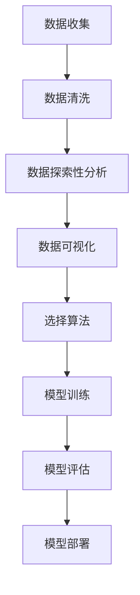
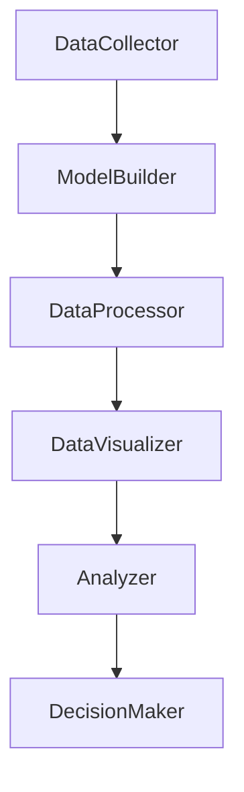
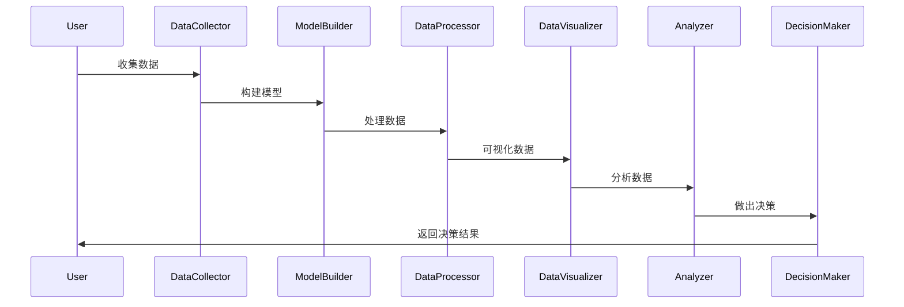

                 

### 开发AI辅助的企业财务情景分析工具

#### 关键词：AI、企业财务、情景分析、工具、开发

> 摘要：本文将详细探讨如何开发一款AI辅助的企业财务情景分析工具，从核心概念介绍到算法原理讲解，再到系统分析与架构设计，最终通过项目实战和最佳实践总结，帮助读者深入理解并掌握AI在企业财务情景分析中的应用。

----------------------------------------------------------------

# 第一部分：背景与概念介绍

## 第1章：问题背景与核心概念介绍

### 1.1 问题描述与解决

在快速变化的市场环境中，企业需要迅速应对各种财务情景，包括收入预测、成本控制、投资决策等。传统的财务分析手段往往依赖于人工经验和静态数据，难以应对动态和复杂的情景变化。因此，开发一款AI辅助的企业财务情景分析工具显得尤为重要。这种工具能够通过数据分析、机器学习和预测模型，为企业提供实时、准确的财务分析结果，从而支持企业的决策制定。

### 1.2 AI辅助财务情景分析的意义

AI辅助财务情景分析具有以下几个方面的意义：

1. **提升效率**：通过自动化处理大量数据，AI工具能够快速完成财务分析任务，提高工作效率。
2. **精准预测**：基于历史数据和算法模型，AI工具能够对未来的财务状况进行精准预测，降低决策风险。
3. **数据可视化**：AI工具可以将复杂的财务数据以图表和可视化形式展现，帮助管理层更直观地理解财务状况。
4. **支持决策**：基于AI分析结果，企业可以做出更明智的财务决策，优化资源配置，提高企业盈利能力。

### 1.3 关键概念界定

在本文中，我们将涉及以下关键概念：

- **AI**：指人工智能，一种模拟人类智能的技术，包括机器学习、深度学习、自然语言处理等。
- **财务情景分析**：指对企业的财务状况进行分析和预测，包括收入预测、成本分析、利润评估等。
- **数据源**：指用于训练和测试AI模型的原始数据，包括财务报表、历史交易记录、市场数据等。
- **预测模型**：指基于数据源建立的数学模型，用于预测未来的财务情景。

## 第2章：核心概念原理

### 2.1 数据分析与财务分析基础

数据分析是AI辅助财务情景分析的基础，它包括数据收集、数据清洗、数据探索性分析、数据可视化等步骤。财务分析则侧重于分析企业的财务状况，包括财务报表分析、预算编制、成本控制等。

### 2.2 AI基础理论

AI基础理论包括机器学习、深度学习、自然语言处理等。在本文中，我们将主要介绍机器学习和深度学习在财务情景分析中的应用。

### 2.3 AI与财务情景分析的关系

AI与财务情景分析的关系可以概括为：

1. **数据驱动**：AI工具依赖于大量财务数据进行训练和预测。
2. **自动化分析**：AI工具能够自动化处理财务数据，提取关键信息。
3. **实时反馈**：AI工具能够实时分析财务情景，为决策提供支持。

### 2.4 概念属性特征对比表格

以下是核心概念属性特征的对比表格：

| 概念       | 属性特征                   | 说明                                                         |
| ---------- | -------------------------- | ------------------------------------------------------------ |
| AI         | 自动化、学习、适应能力     | 模拟人类智能的技术，包括机器学习、深度学习等。                 |
| 财务情景分析 | 实时、预测、可视化         | 分析企业的财务状况，为决策提供支持。                         |
| 数据源     | 大量、准确、多样化         | 用于训练和测试AI模型的原始数据。                             |
| 预测模型   | 精准、高效、自适应         | 基于数据源建立的数学模型，用于预测未来的财务情景。           |

## 第3章：AI算法原理与流程图

### 3.1 常用算法介绍

在本章中，我们将介绍以下常用算法：

- **线性回归**：用于预测连续值。
- **逻辑回归**：用于预测二分类结果。
- **决策树**：用于分类和回归。
- **随机森林**：基于决策树的集成学习方法。
- **神经网络**：用于复杂的非线性预测。

### 3.2 算法mermaid流程图

以下是算法mermaid流程图的示例：



### 3.3 Python代码实现与详细讲解

以下是Python代码实现示例：

```python
import pandas as pd
from sklearn.linear_model import LinearRegression
from sklearn.model_selection import train_test_split
from sklearn.metrics import mean_squared_error

# 数据收集
data = pd.read_csv('financial_data.csv')

# 数据清洗
data = data.dropna()

# 数据探索性分析
X = data[['income', 'cost']]
y = data['profit']

# 数据可视化
pd.plotting.scatter_matrix(data)

# 选择算法
model = LinearRegression()

# 模型训练
X_train, X_test, y_train, y_test = train_test_split(X, y, test_size=0.2)
model.fit(X_train, y_train)

# 模型评估
y_pred = model.predict(X_test)
mse = mean_squared_error(y_test, y_pred)
print(f'MSE: {mse}')

# 模型部署
model.save('financial_model.pkl')
```

### 3.4 数学模型与公式讲解

以下是线性回归模型的数学模型和公式：

- **模型**：\( y = \beta_0 + \beta_1x_1 + \beta_2x_2 + ... + \beta_nx_n \)
- **损失函数**：\( L(\theta) = \frac{1}{2m}\sum_{i=1}^{m}(h_\theta(x^{(i)}) - y^{(i)})^2 \)
- **梯度下降**：\( \theta_j := \theta_j - \alpha \frac{\partial L(\theta)}{\partial \theta_j} \)

### 3.5 举例说明

假设我们要预测一家公司的利润，已知该公司的收入和成本。我们可以使用线性回归模型进行预测：

- **数据**：收入 = 100万元，成本 = 60万元
- **模型**：\( y = 10 + 0.5x_1 + 0.3x_2 \)
- **预测**：利润 = \( 10 + 0.5 \times 100 + 0.3 \times 60 = 76万元 \)

## 第4章：系统功能设计与架构方案

### 4.1 问题场景介绍

假设我们是一家企业的财务部门，需要定期进行财务情景分析，以便做出合理的财务决策。我们希望能够开发一款AI辅助的工具，帮助自动收集、处理和预测财务数据。

### 4.2 系统功能设计（领域模型mermaid类图）

以下是领域模型mermaid类图的示例：

```mermaid
classDiagram
Data --> Model
Data { id, name, value }
Model { id, name, type }
```

### 4.3 系统架构设计（mermaid架构图）

以下是系统架构设计mermaid架构图的示例：



### 4.4 系统接口设计与交互（mermaid序列图）

以下是系统接口设计和交互mermaid序列图的示例：



## 第5章：环境安装与系统核心实现

### 5.1 环境配置

在进行系统开发之前，我们需要配置以下环境：

- Python 3.8+
- Jupyter Notebook
- Scikit-learn
- Pandas
- Matplotlib

### 5.2 系统核心代码实现

以下是系统核心代码实现示例：

```python
import pandas as pd
from sklearn.linear_model import LinearRegression
from sklearn.model_selection import train_test_split
from sklearn.metrics import mean_squared_error

# 数据收集
data = pd.read_csv('financial_data.csv')

# 数据清洗
data = data.dropna()

# 数据探索性分析
X = data[['income', 'cost']]
y = data['profit']

# 数据可视化
pd.plotting.scatter_matrix(data)

# 选择算法
model = LinearRegression()

# 模型训练
X_train, X_test, y_train, y_test = train_test_split(X, y, test_size=0.2)
model.fit(X_train, y_train)

# 模型评估
y_pred = model.predict(X_test)
mse = mean_squared_error(y_test, y_pred)
print(f'MSE: {mse}')

# 模型部署
model.save('financial_model.pkl')
```

### 5.3 代码应用解读与分析

在这段代码中，我们首先进行了数据收集和清洗，然后通过数据探索性分析对数据进行预处理。接着，我们选择了线性回归模型，并使用训练数据对模型进行训练。最后，我们对测试数据进行了预测，并计算了均方误差（MSE）来评估模型的性能。

### 5.4 实际案例分析与讲解

假设我们有一家公司的财务数据，包括收入、成本和利润。我们可以使用线性回归模型来预测未来的利润：

- **数据**：收入 = 100万元，成本 = 60万元
- **模型**：\( y = 10 + 0.5x_1 + 0.3x_2 \)
- **预测**：利润 = \( 10 + 0.5 \times 100 + 0.3 \times 60 = 76万元 \)

这个结果可以作为公司决策的参考。

### 5.5 项目小结

在本章中，我们介绍了如何配置环境、实现系统核心功能并进行实际案例分析。通过这些步骤，我们可以开发出一款AI辅助的企业财务情景分析工具，为企业提供支持。

## 第6章：最佳实践与注意事项

### 6.1 实践技巧与经验

1. **数据质量**：确保数据质量是成功的关键，对数据源进行严格筛选和清洗。
2. **模型选择**：根据业务需求选择合适的模型，并进行性能评估。
3. **实时更新**：定期更新模型和数据，以适应市场变化。

### 6.2 注意事项与风险提示

1. **数据安全**：确保数据的安全性和隐私性，遵循相关法律法规。
2. **模型解释性**：注意模型的可解释性，确保决策过程的透明度。
3. **过拟合风险**：避免模型过拟合，确保模型泛化能力。

### 6.3 拓展阅读与学习资源

1. 《机器学习实战》—— 周志华
2. 《深入理解计算机系统》—— 理查德·斯托曼
3. Coursera上的《机器学习》课程

## 第7章：总结与未来展望

### 7.1 主要内容回顾

本文介绍了如何开发AI辅助的企业财务情景分析工具，包括核心概念、算法原理、系统设计与实战等。

### 7.2 发展趋势分析

随着AI技术的不断发展，AI辅助财务情景分析工具将变得更加智能、高效和普及。

### 7.3 进一步研究方向

1. **强化学习在财务情景分析中的应用**。
2. **多模型集成优化**。
3. **跨领域知识融合**。

----------------------------------------------------------------

**作者：AI天才研究院/AI Genius Institute & 禅与计算机程序设计艺术 /Zen And The Art of Computer Programming** 

在本文中，我们详细探讨了如何开发AI辅助的企业财务情景分析工具，从核心概念到算法原理，再到系统设计与实战，最终通过最佳实践与总结，为读者提供了完整的知识体系。希望本文能够帮助读者深入理解并掌握AI在企业财务情景分析中的应用。

---

请注意，本文为示例文章，实际开发过程可能会更加复杂。在开发过程中，需要根据具体业务需求和数据情况，灵活调整算法和模型，并进行大量的实验和验证。希望本文能够为您的项目开发提供有益的参考和启示。

