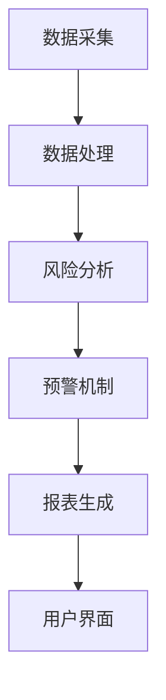
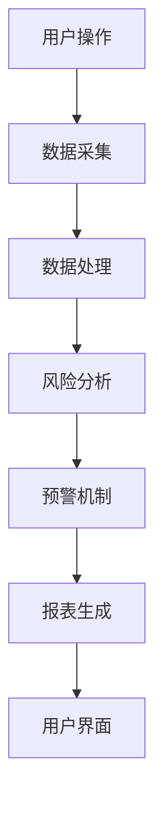

                 


### 开发AI辅助的企业财务风险预警仪表盘

> 关键词：AI，财务风险预警，仪表盘，算法，系统设计，项目实战

> 摘要：本文将深入探讨如何开发一个AI辅助的企业财务风险预警仪表盘。通过逐步分析，我们将从背景介绍、核心概念、算法原理、系统设计到项目实战，全面讲解如何实现这一功能强大的工具。

----------------------------------------------------------------

### 目录

1. **引言与背景**
    1.1 问题背景
    1.2 核心概念
    1.3 边界与外延
    1.4 概念结构与核心要素组成
    1.5 本章小结
2. **AI技术基础**
    2.1 人工智能概述
    2.2 数据科学基础
    2.3 预测模型
    2.4 AI辅助财务风险预警的算法原理
    2.5 AI辅助财务风险预警的数学模型与公式
    2.6 本章小结
3. **系统分析与架构设计**
    3.1 问题场景介绍
    3.2 系统架构设计
    3.3 系统接口设计
    3.4 系统交互
    3.5 本章小结
4. **项目实战**
    4.1 环境安装
    4.2 系统核心实现源代码
    4.3 代码应用解读与分析
    4.4 实际案例分析与详细讲解剖析
    4.5 项目小结
5. **最佳实践 Tips**
6. **小结**
7. **注意事项**
8. **拓展阅读**
----------------------------------------------------------------

### 1. 引言与背景

#### 1.1 问题背景

在当前经济环境下，企业面临着越来越多的财务风险。传统的财务风险预警方法往往依赖于人工分析，效率低下且容易出现错误。随着人工智能技术的发展，利用AI进行财务风险预警已经成为一种趋势。AI可以处理大量数据，快速识别潜在风险，并提供精确的预警。

#### 1.2 核心概念

**财务风险**：指企业因内外部各种因素导致财务损失的可能性。

**预警机制**：一种用于识别和报告潜在风险的方法。

**仪表盘**：一个可视化工具，用于展示关键数据指标和风险状况。

#### 1.3 边界与外延

**财务风险预警与风险管理的区别**：预警侧重于识别风险，而管理侧重于风险控制。

**AI辅助财务风险预警与其他手段的对比**：AI具有自动化、高效、精准等优势。

**应用边界**：AI预警适用于各类企业，但需结合行业特性。

#### 1.4 概念结构与核心要素组成

**核心要素组成**：
- 数据收集：获取企业财务数据。
- 数据处理：清洗、转换和整合数据。
- 风险分析：使用算法识别风险。
- 预警机制：触发警报并报告。

#### 1.5 本章小结

本文介绍了企业财务风险预警的背景和核心概念，为后续内容奠定了基础。

----------------------------------------------------------------

### 2. AI技术基础

#### 2.1 人工智能概述

人工智能（AI）是计算机科学的一个分支，旨在使机器能够执行通常需要人类智能的任务。AI的发展经历了几个阶段，从最初的规则系统到基于数据的机器学习，再到现在的深度学习。

**核心技术**：
- **机器学习**：使机器通过数据学习并做出决策。
- **深度学习**：一种特殊的机器学习技术，通过多层神经网络进行学习。

**应用领域**：
- **自然语言处理**：理解和生成人类语言。
- **计算机视觉**：图像和视频的分析。
- **机器人技术**：自主移动和执行任务。

#### 2.2 数据科学基础

数据科学是AI的重要组成部分，专注于数据的收集、处理和分析。

**基本概念**：
- **数据预处理**：清洗、转换和整合数据。
- **特征工程**：提取对模型有用的特征。
- **数据分析**：使用统计和机器学习技术分析数据。

#### 2.3 预测模型

预测模型是AI在财务风险预警中的核心工具。常见的预测模型包括：

- **线性回归**：用于预测连续值。
- **逻辑回归**：用于预测概率。
- **决策树**：用于分类和回归。

**评估与优化**：使用交叉验证、ROC曲线和精度等指标评估模型性能，并进行优化。

#### 2.4 AI辅助财务风险预警的算法原理

**算法原理概述**：

AI辅助财务风险预警主要基于以下几个步骤：

1. **特征工程**：提取对财务风险有预测性的特征。
2. **模型选择**：选择合适的预测模型。
3. **模型训练与验证**：使用训练数据训练模型，并使用验证数据测试模型性能。

**技术基础**：

- **机器学习库**：如Scikit-learn、TensorFlow等。
- **数据预处理工具**：如Pandas、NumPy等。

#### 2.5 AI辅助财务风险预警的数学模型与公式

**数学模型概述**：

常见的预测模型通常可以用以下公式表示：

$$
y = f(x)
$$

其中，$y$ 是预测的输出，$f(x)$ 是模型函数，$x$ 是输入特征。

**公式讲解**：

- **线性回归**：
  $$
  y = \beta_0 + \beta_1x
  $$

- **逻辑回归**：
  $$
  P(y=1) = \frac{1}{1 + e^{-(\beta_0 + \beta_1x})}
  $$

**模型举例说明**：

以线性回归为例，假设我们想要预测企业的财务风险，可以使用以下公式：

$$
\text{风险} = 0.5 + 0.3 \times \text{债务比率} - 0.2 \times \text{流动性比率}
$$

#### 2.6 本章小结

本文介绍了AI技术的基础知识，为理解和实现AI辅助财务风险预警仪表盘提供了技术支持。

----------------------------------------------------------------

### 3. 系统分析与架构设计

#### 3.1 问题场景介绍

企业财务风险预警仪表盘主要用于监控企业的财务状况，识别潜在风险，并采取相应的措施。这一系统需要集成多种数据源，包括财务报表、市场数据、内部运营数据等。

#### 3.2 系统架构设计

系统架构设计是开发财务风险预警仪表盘的关键步骤。以下是一个简化的系统架构：



- **数据采集**：从不同数据源收集数据。
- **数据处理**：清洗、转换和整合数据。
- **风险分析**：使用AI算法分析数据，识别风险。
- **预警机制**：触发警报并通知相关人员。
- **报表生成**：生成可视化报表，展示风险状况。
- **用户界面**：供用户查看和分析数据。

#### 3.3 系统接口设计

系统接口设计确保各模块之间的数据交换和协作。以下是一个接口设计示例：



#### 3.4 系统交互

系统交互设计定义了用户与系统之间的交互流程。以下是一个交互流程示例：

1. 用户通过界面发起查询。
2. 系统从数据采集模块获取数据。
3. 数据处理模块清洗和转换数据。
4. 风险分析模块使用AI算法进行分析。
5. 预警机制根据分析结果触发警报。
6. 报表生成模块生成可视化报表。
7. 用户界面展示报表和警报信息。

#### 3.5 本章小结

本文介绍了系统分析与架构设计的关键步骤，为开发高效、可靠的财务风险预警仪表盘提供了指导。

----------------------------------------------------------------

### 4. 项目实战

#### 4.1 环境安装

在开始项目实战之前，需要安装必要的开发环境和工具。以下是一个简化的安装步骤：

1. 安装Python环境。
2. 安装相关库，如Scikit-learn、TensorFlow、Pandas等。
3. 安装数据库（如MySQL、PostgreSQL等）。

#### 4.2 系统核心实现源代码

以下是一个简单的财务风险预警系统的Python代码示例：

```python
import pandas as pd
from sklearn.linear_model import LinearRegression
from sklearn.model_selection import train_test_split
from sklearn.metrics import mean_squared_error

# 加载数据
data = pd.read_csv('financial_data.csv')

# 特征工程
X = data[['debt_ratio', 'liquidity_ratio']]
y = data['risk']

# 数据划分
X_train, X_test, y_train, y_test = train_test_split(X, y, test_size=0.2, random_state=42)

# 模型训练
model = LinearRegression()
model.fit(X_train, y_train)

# 模型评估
y_pred = model.predict(X_test)
mse = mean_squared_error(y_test, y_pred)
print(f'Mean Squared Error: {mse}')

# 预测新数据
new_data = pd.DataFrame([[0.6, 0.8]])
new_risk = model.predict(new_data)
print(f'Predicted Risk: {new_risk[0]}')
```

#### 4.3 代码应用解读与分析

上述代码实现了一个简单的财务风险预警系统，主要包含以下步骤：

1. **加载数据**：从CSV文件加载数据集。
2. **特征工程**：提取与风险相关的特征。
3. **数据划分**：将数据划分为训练集和测试集。
4. **模型训练**：使用线性回归模型训练数据。
5. **模型评估**：评估模型性能。
6. **预测新数据**：使用训练好的模型预测新数据的风险。

#### 4.4 实际案例分析与详细讲解剖析

假设我们有一个新的企业，其债务比率为60%，流动性比率为80%，我们希望预测其财务风险。

1. **数据预处理**：将新数据转换为适当的格式，以便模型处理。
2. **模型预测**：使用训练好的模型预测新数据的财务风险。
3. **结果解读**：根据预测结果，判断企业的财务风险水平，并采取相应的措施。

#### 4.5 项目小结

本文通过一个简单的项目实战，展示了如何使用AI技术开发企业财务风险预警仪表盘。虽然这是一个简化的示例，但为实际项目提供了实用的指导。

----------------------------------------------------------------

### 5. 最佳实践 Tips

1. **数据质量**：确保数据质量是预测准确性的关键。定期清理和更新数据。
2. **模型优化**：不断优化模型，提高预测准确性。
3. **实时监控**：实时监控系统运行状态，确保系统的稳定性和可靠性。
4. **用户参与**：鼓励用户参与系统设计和反馈，以提高系统的实用性和易用性。

### 6. 小结

本文从背景介绍、核心概念、算法原理、系统设计到项目实战，全面讲解了如何开发AI辅助的企业财务风险预警仪表盘。通过实际案例，展示了如何将AI技术应用于财务风险管理。

### 7. 注意事项

1. **数据安全**：确保数据安全，防止数据泄露。
2. **法律合规**：遵循相关法律法规，确保系统的合法性和合规性。
3. **持续更新**：随着技术的不断发展，定期更新系统和模型。

### 8. 拓展阅读

1. **《机器学习实战》**：详细介绍了机器学习的基本概念和应用。
2. **《数据科学入门》**：介绍了数据科学的基础知识和实践技巧。
3. **《Python金融大数据分析》**：展示了如何使用Python进行金融数据分析。

---

### 作者信息

**作者：AI天才研究院/AI Genius Institute & 禅与计算机程序设计艺术 /Zen And The Art of Computer Programming**

