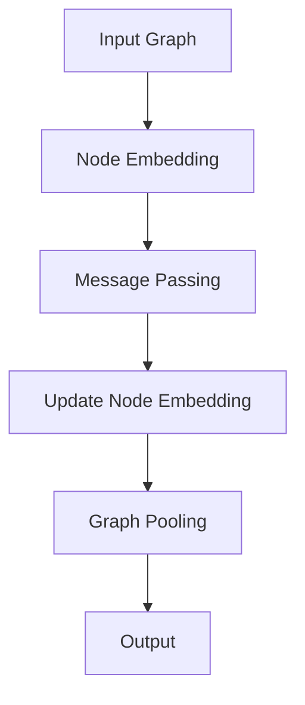
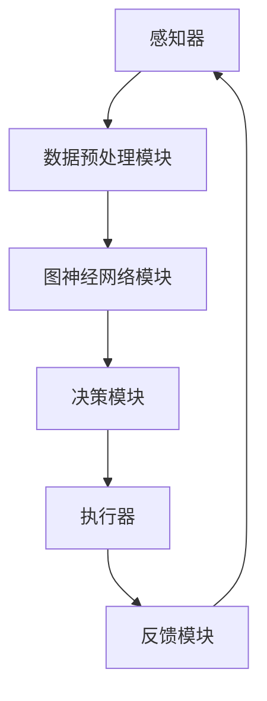
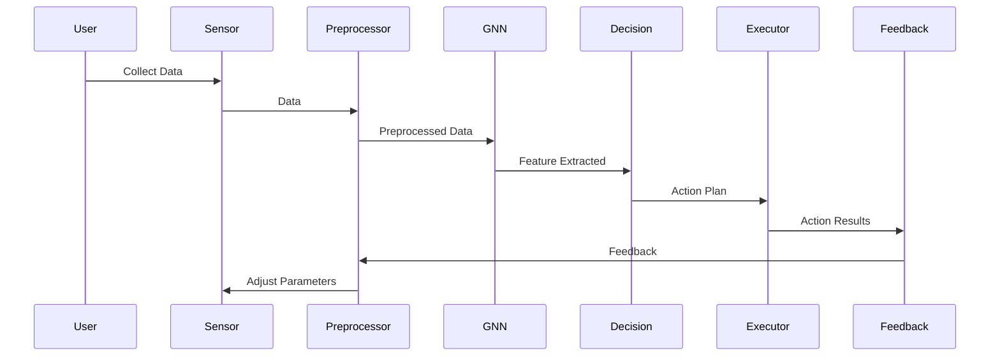

                 


## 第1章: 背景介绍

### 1.1.1 问题背景介绍

在人工智能领域，AI Agent的概念已经越来越受到重视。AI Agent，简而言之，是一种可以自主地感知环境、做出决策并采取行动的计算机程序。然而，随着大数据和复杂网络结构的广泛应用，传统的AI Agent在面对复杂、非结构化的数据时，往往显得力不从心。这就引出了我们今天要探讨的问题：如何开发具有图神经网络（Graph Neural Network，GNN）能力的AI Agent？

#### 问题描述

现代AI技术的发展对人工智能代理（AI Agent）提出了新的需求。传统的AI Agent大多基于规则或统计模型，其处理能力和灵活性受到限制。而复杂的数据类型，如社交网络、知识图谱、推荐系统等，需要AI Agent具有更强的图结构数据处理能力。这种需求催生了GNN在AI Agent中的应用。

#### 问题解决

为了解决上述问题，我们需要研究和开发具有GNN能力的AI Agent。GNN是一种专门用于处理图结构数据的神经网络，其可以通过学习图中的节点和边的关系，对图数据进行有效的表征和预测。将GNN应用于AI Agent，可以使其在处理复杂、非结构化的数据时，具备更高的灵活性和准确性。

#### 边界与外延

GNN在AI Agent中的应用范围非常广泛。首先，在社交网络领域，GNN可以帮助AI Agent预测用户之间的关系，识别社交圈子。其次，在知识图谱领域，GNN可以用于实体识别、关系抽取等任务，从而提高知识图谱的准确性和完整性。最后，在推荐系统领域，GNN可以帮助AI Agent理解用户与物品之间的复杂关系，提供更精准的推荐。

#### 概念结构与核心要素组成

AI Agent的基本组成部分包括感知器、决策器、执行器和环境模型。其中，感知器负责获取环境信息，决策器根据环境信息和预定的策略做出决策，执行器根据决策结果执行具体的行动，环境模型则是对外部环境的抽象和建模。

GNN的核心概念包括节点嵌入（Node Embedding）、图卷积（Graph Convolution）和图池化（Graph Pooling）。节点嵌入是将图中的节点映射到低维空间，以便进行后续处理；图卷积是GNN的核心操作，通过对节点及其邻居节点的特征信息进行聚合，实现对节点特征的学习；图池化则是将图上的特征信息进行整合，得到全局的特征表征。

将GNN应用于AI Agent，需要解决以下几个关键问题：

1. **GNN与AI Agent的融合**: 如何将GNN与AI Agent的各个组成部分进行有效融合，使其具备图结构数据处理能力。
2. **训练与优化**: 如何设计有效的训练和优化策略，提高GNN在AI Agent中的应用效果。
3. **可解释性**: 如何解释GNN在AI Agent中的决策过程，增强用户对AI Agent的信任。

### 1.1.2 问题背景

在当今时代，数据已经成为企业和社会的重要资产。如何从海量数据中提取有价值的信息，成为众多企业和研究机构关注的焦点。而GNN作为一种强大的图结构数据处理工具，为解决这个问题提供了新的思路。

#### 社交网络

社交网络是一个典型的图结构数据场景。在社交网络中，用户和用户之间的关系可以用图来表示。这种关系不仅包括直接的连接，如好友关系，还包括间接的连接，如共同兴趣、共同好友等。传统的AI Agent在面对这种复杂的图结构数据时，往往难以进行有效的处理和预测。

GNN的出现为解决这个问题提供了可能。通过学习图中的节点和边的关系，GNN可以提取出用户之间的深层次关系特征，从而帮助AI Agent更好地理解社交网络的结构和规律。

#### 知识图谱

知识图谱是另一个典型的图结构数据场景。知识图谱通过实体和实体之间的关系，将各种知识信息组织起来，形成一个庞大的知识网络。在这个网络中，实体和实体之间的关系可以是多样的，如包含、属于、相似等。

传统的AI Agent在面对知识图谱时，往往难以进行有效的实体识别和关系抽取。而GNN可以通过学习实体和实体之间的关系，提取出实体之间的特征信息，从而帮助AI Agent更好地理解和利用知识图谱。

#### 推荐系统

推荐系统是另一个常见的应用场景。在推荐系统中，用户和物品之间的关系可以用图来表示。这种关系不仅包括直接的购买关系，还包括间接的关系，如用户的浏览历史、物品的标签等。

传统的AI Agent在面对这种复杂的图结构数据时，往往难以进行有效的推荐。而GNN可以通过学习用户和物品之间的复杂关系，提取出用户和物品的深层次特征，从而帮助AI Agent提供更精准的推荐。

### 1.1.3 AI Agent的基本概念

AI Agent，即人工智能代理，是一种能够根据环境信息自主地做出决策和采取行动的计算机程序。AI Agent的核心特点是自主性、适应性、协作性和反应性。

#### 自主性

AI Agent具有自主性，意味着它可以根据预先设定的目标和规则，自主地选择行动方案，并在执行过程中动态调整策略。这种自主性使得AI Agent能够在复杂多变的环境中生存和发展。

#### 适应性

AI Agent需要具备适应性，以应对不断变化的环境和任务。这种适应性包括两个方面：一是AI Agent能够根据环境变化调整自身的决策策略；二是AI Agent能够通过学习和训练，不断提高自身的决策能力和处理能力。

#### 协作性

AI Agent需要具备协作性，以实现多个AI Agent之间的协同工作。在复杂任务中，AI Agent可以通过合作，共同完成任务。例如，在自动驾驶领域，多个AI Agent可以协同工作，实现对交通环境的感知、决策和控制。

#### 反应性

AI Agent需要具备反应性，即能够对环境中的变化做出快速反应。这种反应性使得AI Agent能够在突发情况下迅速采取行动，保护自身和他人安全。

#### AI Agent的应用领域

AI Agent在多个领域有着广泛的应用。

#### 社交网络

在社交网络中，AI Agent可以用于用户关系预测、社交圈子识别、用户行为分析等。例如，通过分析用户之间的好友关系，AI Agent可以预测用户之间的互动行为，为社交网络提供个性化的推荐。

#### 游戏

在游戏领域，AI Agent可以用于玩家行为分析、对手策略预测、游戏AI等。通过分析玩家的行为和决策，AI Agent可以提供更有针对性的游戏体验，提高游戏的可玩性。

#### 自动驾驶

在自动驾驶领域，AI Agent可以用于环境感知、决策规划、路径规划等。通过实时感知交通环境，AI Agent可以做出安全的驾驶决策，提高自动驾驶车辆的可靠性。

### 1.1.4 GNN与AI Agent的关系

GNN为AI Agent提供了强大的图结构数据处理能力，使得AI Agent能够更好地应对复杂、非结构化的数据场景。

#### 联系

首先，GNN与AI Agent的感知器部分密切相关。GNN可以通过学习图中的节点和边的关系，提取出图结构数据的特征信息，为AI Agent提供更丰富的感知信息。

其次，GNN与AI Agent的决策器部分也有紧密联系。通过将GNN提取的特征信息输入到决策器，AI Agent可以更准确地做出决策。

最后，GNN与AI Agent的执行器部分也有一定关联。GNN可以帮助AI Agent理解图结构数据的复杂关系，从而在执行过程中采取更有效的行动。

#### 应用

在AI Agent的具体应用场景中，GNN发挥着重要的作用。

#### 社交网络

在社交网络中，GNN可以帮助AI Agent预测用户之间的关系，识别社交圈子。例如，通过分析用户之间的好友关系，GNN可以预测用户之间的互动行为，为社交网络提供个性化的推荐。

#### 知识图谱

在知识图谱中，GNN可以帮助AI Agent进行实体识别、关系抽取等任务。例如，通过分析实体之间的语义关系，GNN可以识别出实体之间的关联，从而提高知识图谱的准确性和完整性。

#### 推荐系统

在推荐系统中，GNN可以帮助AI Agent理解用户与物品之间的复杂关系，提供更精准的推荐。例如，通过分析用户的浏览历史和物品的标签，GNN可以提取出用户和物品的深层次特征，从而为用户推荐更符合其兴趣的物品。

### 1.1.5 开发具有GNN能力的AI Agent的挑战

开发具有GNN能力的AI Agent面临着诸多挑战。

#### 数据预处理

GNN对输入数据的质量和格式有较高要求。因此，在开发GNN能力的AI Agent时，需要解决数据预处理的问题，包括数据的清洗、格式化、节点和边的抽取等。

#### 模型选择

GNN存在多种不同的模型结构，如图卷积网络（GCN）、图注意力网络（GAT）等。选择合适的模型结构对于AI Agent的性能至关重要。

#### 模型训练与优化

GNN的训练和优化是一个复杂的过程，需要考虑参数选择、训练策略、模型调优等。如何有效地训练和优化GNN，以提高AI Agent的性能，是一个重要的挑战。

#### 可解释性

GNN作为深度学习模型，其内部决策过程往往难以解释。如何提高GNN的可解释性，使其决策过程更加透明和可信，是一个重要的研究课题。

#### 实时性

GNN的计算复杂度较高，如何在保证实时性的同时，提高AI Agent的处理能力，是一个重要的挑战。

### 1.1.6 GNN在AI Agent中的应用场景

GNN在AI Agent中的应用场景非常广泛，以下是一些典型的应用场景：

#### 社交网络分析

在社交网络中，GNN可以用于用户关系预测、社交圈子识别、用户行为分析等。例如，通过分析用户之间的好友关系，GNN可以预测用户之间的互动行为，为社交网络提供个性化的推荐。

#### 知识图谱构建

在知识图谱构建中，GNN可以用于实体识别、关系抽取、知识融合等。例如，通过分析实体之间的语义关系，GNN可以识别出实体之间的关联，从而提高知识图谱的准确性和完整性。

#### 推荐系统优化

在推荐系统中，GNN可以用于用户特征提取、物品特征提取、用户-物品关系预测等。例如，通过分析用户的浏览历史和物品的标签，GNN可以提取出用户和物品的深层次特征，从而为用户推荐更符合其兴趣的物品。

#### 自动驾驶路径规划

在自动驾驶领域，GNN可以用于环境感知、决策规划、路径规划等。例如，通过分析交通网络中的道路、车辆、行人等实体之间的关系，GNN可以预测交通状况，为自动驾驶车辆提供最优的路径规划。

#### 医疗健康分析

在医疗健康领域，GNN可以用于疾病预测、诊断辅助、药物研发等。例如，通过分析患者之间的医疗记录、基因数据等，GNN可以预测患者的疾病风险，为医生提供诊断建议。

#### 金融风控

在金融领域，GNN可以用于风险评估、欺诈检测、投资策略等。例如，通过分析用户之间的交易关系、资金流动等，GNN可以识别出潜在的欺诈行为，为金融机构提供风险预警。

### 1.1.7 总结

本章主要介绍了开发具有GNN能力的AI Agent的背景和核心概念。我们首先介绍了AI Agent的基本概念和应用场景，然后探讨了GNN在AI Agent中的应用，包括社交网络、知识图谱、推荐系统等领域。接着，我们分析了开发具有GNN能力的AI Agent面临的挑战，以及其潜在的应用场景。这些内容为我们后续章节的深入讨论奠定了基础。

在接下来的章节中，我们将进一步探讨GNN的基本原理和算法，以及如何在AI Agent中实现和应用GNN。通过这些探讨，我们将为读者提供一个全面、系统的了解开发具有GNN能力的AI Agent的思路和方法。

### 1.2 图神经网络（GNN）原理

#### 1.2.1 GNN的定义

图神经网络（Graph Neural Network，GNN）是一类专门用于处理图结构数据的神经网络。它通过对图中的节点和边进行学习，提取出图结构数据的高层次特征，从而实现对图数据的表征和预测。与传统的神经网络不同，GNN能够直接利用图结构中的节点和边的关系信息，从而在处理图结构数据时具有独特的优势。

#### 1.2.2 GNN的核心特点

GNN具有以下几个核心特点：

1. **节点和边的特征利用**：GNN通过将节点和边的特征信息编码到嵌入向量中，利用这些嵌入向量来学习节点和边的关系。这使得GNN能够充分利用图结构数据中的特征信息。

2. **图结构的关系建模**：GNN通过图卷积等操作，对节点和边的关系进行建模，从而提取出图结构数据的高层次特征。这种关系建模使得GNN能够捕捉到图结构数据中的复杂关系。

3. **可扩展性**：GNN可以处理各种类型的图结构数据，包括有向图、无向图、带权图等。这使得GNN具有很好的可扩展性，能够应用于多种场景。

4. **灵活的模型结构**：GNN具有多种不同的模型结构，如图卷积网络（GCN）、图注意力网络（GAT）、图自编码器（GAE）等。这些不同的模型结构使得GNN能够适应不同的应用场景。

#### 1.2.3 GNN与传统AI的区别

与传统的人工智能方法相比，GNN在处理图结构数据时具有明显的优势：

1. **数据处理能力**：传统AI方法通常依赖于规则或统计模型，难以直接处理图结构数据。而GNN通过直接利用图结构中的节点和边的关系信息，能够更有效地处理图结构数据。

2. **特征提取能力**：传统AI方法难以提取图结构数据中的复杂特征。而GNN通过图卷积等操作，能够提取出图结构数据的高层次特征，从而提高模型的表征能力。

3. **关系建模能力**：传统AI方法难以建模图结构数据中的复杂关系。而GNN通过图卷积等操作，能够建模节点和边之间的关系，从而捕捉到图结构数据中的复杂关系。

#### 1.2.4 GNN的应用场景

GNN在多个领域有着广泛的应用：

1. **社交网络分析**：GNN可以用于用户关系预测、社交圈子识别、用户行为分析等。

2. **知识图谱构建**：GNN可以用于实体识别、关系抽取、知识融合等。

3. **推荐系统优化**：GNN可以用于用户特征提取、物品特征提取、用户-物品关系预测等。

4. **图像和视频处理**：GNN可以用于图像分类、图像分割、视频分类等。

5. **自然语言处理**：GNN可以用于文本分类、文本生成、语义分析等。

6. **生物信息学**：GNN可以用于蛋白质结构预测、基因调控网络分析等。

7. **交通网络分析**：GNN可以用于交通流量预测、路径规划等。

8. **金融风控**：GNN可以用于风险评估、欺诈检测、投资策略等。

### 1.2.5 GNN的工作原理

GNN的工作原理可以概括为以下几个步骤：

1. **节点嵌入（Node Embedding）**：首先，将图中的每个节点映射到一个低维空间，得到节点的嵌入向量。这些嵌入向量代表了节点在图中的位置和特征。

2. **图卷积（Graph Convolution）**：接下来，GNN通过对节点及其邻居节点的嵌入向量进行聚合，得到更新后的节点嵌入向量。这个过程类似于卷积操作，但适用于图结构数据。

3. **图池化（Graph Pooling）**：在图卷积之后，GNN可能需要对图上的特征信息进行整合，得到全局的特征表征。图池化操作可以帮助GNN整合图上的信息，提取出更全局的特征。

4. **输出层（Output Layer）**：最后，GNN通过输出层得到最终的预测结果。输出层可以是分类层、回归层或其他类型的输出层，具体取决于应用场景。

#### 1.2.6 GNN的mermaid流程图

以下是一个简化的GNN的mermaid流程图：



在这个流程图中，A表示输入图，B表示节点嵌入，C表示消息传递，D表示更新节点嵌入，E表示图池化，F表示输出层。

### 1.2.7 GNN与传统神经网络（CNN、RNN）的比较

#### 1.2.7.1 CNN（卷积神经网络）

CNN是一类用于图像处理和计算机视觉的神经网络。CNN的主要特点是通过卷积操作提取图像的特征，从而实现对图像的表征和分类。

- **数据处理能力**：CNN适用于处理二维数据，如图像。
- **特征提取**：CNN通过卷积操作，提取图像的局部特征，从而构建图像的全局表征。
- **计算效率**：CNN具有较好的计算效率，适用于大规模图像处理任务。

#### 1.2.7.2 RNN（循环神经网络）

RNN是一类用于序列数据处理和自然语言处理的神经网络。RNN的主要特点是通过循环连接，对序列数据中的每个元素进行迭代处理，从而实现对序列数据的表征和预测。

- **数据处理能力**：RNN适用于处理一维数据，如序列。
- **特征提取**：RNN通过迭代处理，提取序列的时序特征，从而构建序列的全局表征。
- **计算效率**：RNN的计算复杂度较高，尤其是在长序列处理时。

#### GNN与传统神经网络的比较

- **数据处理能力**：GNN适用于处理图结构数据，而CNN适用于处理二维数据，RNN适用于处理一维数据。GNN能够直接利用图结构中的节点和边的关系信息，从而在处理图结构数据时具有独特的优势。

- **特征提取**：GNN通过图卷积等操作，提取出图结构数据的高层次特征，从而提高模型的表征能力。相比之下，CNN和RNN在特征提取方面有一定的局限性。

- **计算效率**：GNN的计算复杂度较高，尤其是在大规模图数据处理时。相比之下，CNN和RNN的计算复杂度较低，适用于大规模数据处理任务。

### 1.2.8 GNN的应用前景

随着人工智能和大数据技术的快速发展，GNN在各个领域的应用前景非常广阔：

1. **社交网络分析**：通过分析用户之间的社交关系，GNN可以用于用户关系预测、社交圈子识别等。

2. **知识图谱构建**：通过分析实体之间的语义关系，GNN可以用于实体识别、关系抽取、知识融合等。

3. **推荐系统优化**：通过分析用户与物品之间的关系，GNN可以用于用户特征提取、物品特征提取、用户-物品关系预测等。

4. **图像和视频处理**：GNN可以用于图像分类、图像分割、视频分类等。

5. **自然语言处理**：GNN可以用于文本分类、文本生成、语义分析等。

6. **生物信息学**：GNN可以用于蛋白质结构预测、基因调控网络分析等。

7. **交通网络分析**：GNN可以用于交通流量预测、路径规划等。

8. **金融风控**：GNN可以用于风险评估、欺诈检测、投资策略等。

总之，GNN作为一种强大的图结构数据处理工具，将在人工智能的各个领域发挥越来越重要的作用。

### 1.2.9 总结

本章主要介绍了图神经网络（GNN）的基本原理和应用。我们首先介绍了GNN的定义和核心特点，然后探讨了GNN与传统AI方法的区别，以及GNN在多个领域的应用场景。接着，我们详细介绍了GNN的工作原理，并使用mermaid流程图进行了直观展示。最后，我们比较了GNN与传统神经网络（CNN、RNN）的不同，并展望了GNN的应用前景。

在接下来的章节中，我们将进一步探讨如何在AI Agent中实现和应用GNN。通过这些探讨，我们将为读者提供一个全面、系统的了解如何开发具有GNN能力的AI Agent的思路和方法。

### 1.3 AI Agent的基本概念

#### 1.3.1 AI Agent的定义

AI Agent，即人工智能代理，是一种能够根据环境信息自主地感知、决策和行动的计算机程序。它是一种具有智能行为的实体，可以在复杂的动态环境中执行任务，达到预定的目标。

#### 1.3.2 AI Agent的特点

AI Agent具有以下特点：

1. **自主性**：AI Agent能够独立地感知环境、做出决策和执行行动，不需要人为干预。

2. **适应性**：AI Agent能够根据环境变化和任务需求，调整自身的策略和行为，以适应新的情况。

3. **协作性**：AI Agent可以与其他AI Agent或人类合作，共同完成任务。

4. **反应性**：AI Agent能够对环境中的变化做出快速反应，确保任务的顺利完成。

#### 1.3.3 AI Agent的分类

AI Agent可以按照不同的标准进行分类：

1. **根据能力分类**：
   - **弱AI Agent**：只能完成特定任务，不具备泛化能力。
   - **强AI Agent**：具有与人类相似的通用智能，能够处理各种任务。

2. **根据功能分类**：
   - **感知型AI Agent**：主要负责感知环境信息。
   - **决策型AI Agent**：主要负责根据环境信息做出决策。
   - **执行型AI Agent**：主要负责执行决策结果。

3. **根据环境分类**：
   - **单步环境**：AI Agent在每次行动后立即得到反馈。
   - **多步环境**：AI Agent需要通过多个步骤来完成任务，每个步骤可能需要较长时间的决策。

#### 1.3.4 AI Agent的应用领域

AI Agent在多个领域有着广泛的应用：

1. **社交网络**：用于用户关系预测、社交圈子识别、用户行为分析等。

2. **游戏**：用于游戏AI的决策和行动，提高游戏的可玩性。

3. **自动驾驶**：用于环境感知、路径规划、决策控制等，提高自动驾驶的安全性。

4. **智能家居**：用于家居设备的自动化控制和优化。

5. **金融**：用于风险评估、投资策略、欺诈检测等。

6. **医疗**：用于疾病预测、诊断辅助、药物研发等。

7. **工业制造**：用于生产优化、设备维护、质量检测等。

8. **物流**：用于路径规划、运输调度、库存管理等。

#### 1.3.5 AI Agent的工作流程

AI Agent的工作流程主要包括以下几个步骤：

1. **感知**：通过传感器或其他方式获取环境信息。

2. **分析**：对获取的环境信息进行分析和处理，提取有用的特征。

3. **决策**：根据分析结果和预定的策略，做出决策。

4. **执行**：执行决策结果，采取相应的行动。

5. **反馈**：根据执行结果和环境反馈，调整策略和行为。

#### 1.3.6 AI Agent与人类协作

AI Agent与人类协作的关键在于如何使AI Agent能够理解和执行人类的指令，并在这个过程中保持透明和可信。以下是一些实现AI Agent与人类协作的方法：

1. **自然语言处理**：使用自然语言处理技术，使AI Agent能够理解人类的语言指令。

2. **交互界面**：设计直观友好的交互界面，使人类用户能够方便地与AI Agent进行交互。

3. **任务分解**：将复杂任务分解为多个子任务，使AI Agent能够与人类用户共同完成。

4. **反馈机制**：建立反馈机制，使人类用户能够对AI Agent的行为进行评价和指导。

5. **透明度**：提高AI Agent的可解释性，使人类用户能够理解AI Agent的决策过程。

### 1.3.7 总结

本章介绍了AI Agent的基本概念、特点、分类和应用领域。我们详细分析了AI Agent的工作流程，并探讨了如何实现AI Agent与人类的协作。这些内容为我们理解AI Agent的工作原理和实现方法提供了基础。在下一章中，我们将探讨如何将GNN与AI Agent相结合，开发具有图神经网络能力的AI Agent。

### 1.4 GNN与AI Agent的关系

#### 1.4.1 GNN在AI Agent中的应用

图神经网络（GNN）在AI Agent中的应用具有广泛的前景。GNN作为一种能够直接处理图结构数据的神经网络，为AI Agent提供了强大的数据处理和分析能力。以下是GNN在AI Agent中的一些具体应用场景：

1. **社交网络分析**：在社交网络领域，GNN可以帮助AI Agent理解用户之间的关系，识别社交圈子，从而提高用户推荐、社交互动等服务的准确性。

2. **知识图谱构建**：知识图谱是大数据和人工智能领域的重要应用之一。GNN能够对实体和实体之间的关系进行建模和预测，有助于提高知识图谱的构建质量和应用效果。

3. **推荐系统优化**：推荐系统通过分析用户和物品之间的复杂关系，为用户提供个性化的推荐。GNN可以提取用户和物品的深层特征，提高推荐系统的准确性和多样性。

4. **图像和视频处理**：在图像和视频领域，GNN可以用于图像分类、图像分割、视频分类等任务。例如，GNN可以通过分析图像中的节点和边的关系，实现图像的细粒度分类。

5. **自然语言处理**：在自然语言处理领域，GNN可以用于文本分类、文本生成、语义分析等任务。GNN可以通过分析文本中的节点和边的关系，提取文本的深层特征，从而提高模型的性能。

6. **生物信息学**：在生物信息学领域，GNN可以用于蛋白质结构预测、基因调控网络分析等。GNN能够分析生物分子之间的复杂关系，为生物医学研究提供支持。

7. **交通网络分析**：在交通网络领域，GNN可以用于交通流量预测、路径规划等。通过分析交通网络中的节点和边的关系，GNN可以提供更准确的交通预测和路径建议。

8. **金融风控**：在金融领域，GNN可以用于风险评估、欺诈检测、投资策略等。通过分析金融网络中的节点和边的关系，GNN可以帮助金融机构识别风险，提高风险管理效果。

#### 1.4.2 GNN对AI Agent性能的提升

将GNN应用于AI Agent，可以在以下几个方面提升其性能：

1. **数据处理能力**：GNN能够直接处理图结构数据，提取图中的节点和边的关系特征。这使得AI Agent能够处理更复杂、更结构化的数据，从而提高其数据处理能力。

2. **特征提取能力**：GNN通过图卷积等操作，能够提取图结构数据的高层次特征。这些特征具有更强的表征能力，有助于AI Agent在复杂任务中做出更准确的决策。

3. **关系建模能力**：GNN能够建模图结构数据中的复杂关系，例如社交网络中的用户关系、知识图谱中的实体关系等。通过建模这些关系，AI Agent可以更好地理解环境，从而提高其决策能力。

4. **可解释性**：GNN作为深度学习模型，其内部决策过程相对透明，有助于提高AI Agent的可解释性。用户可以更好地理解AI Agent的决策过程，从而增强对AI Agent的信任。

5. **灵活性**：GNN具有多种不同的模型结构，例如图卷积网络（GCN）、图注意力网络（GAT）等。这些模型结构使得AI Agent能够适应不同的应用场景，提高其灵活性。

#### 1.4.3 GNN与AI Agent的结合方法

将GNN应用于AI Agent，需要考虑以下几个方面：

1. **感知器部分**：在AI Agent的感知器部分，可以使用GNN提取图结构数据的特征信息。例如，在社交网络中，可以使用GNN提取用户之间的社交关系特征；在知识图谱中，可以使用GNN提取实体之间的关系特征。

2. **决策器部分**：在AI Agent的决策器部分，可以将GNN提取的特征信息作为输入，利用这些特征信息来辅助决策。例如，在推荐系统中，可以使用GNN提取的用户和物品特征信息，来预测用户对物品的偏好。

3. **执行器部分**：在AI Agent的执行器部分，可以使用GNN提取的特征信息来指导行动。例如，在自动驾驶中，可以使用GNN提取的交通网络特征信息，来规划车辆的行驶路径。

4. **融合方法**：将GNN与AI Agent的其他组件（如记忆组件、预测组件等）进行有效融合，可以进一步提高AI Agent的性能。例如，可以使用GNN提取的特征信息，与记忆组件中的历史信息进行融合，来提高决策的准确性。

5. **训练与优化**：在训练GNN模型时，需要考虑AI Agent的特定任务需求和目标。例如，在社交网络分析中，可以关注用户关系的预测准确性；在知识图谱构建中，可以关注实体关系的抽取效果。

通过以上方法，可以将GNN与AI Agent相结合，开发出具有强大数据处理和分析能力的AI Agent。

#### 1.4.4 GNN在AI Agent中的实现步骤

将GNN应用于AI Agent，可以按照以下步骤进行：

1. **数据预处理**：对输入的图结构数据进行预处理，包括节点和边的特征提取、图的划分等。

2. **模型选择**：根据具体应用场景，选择合适的GNN模型。例如，在社交网络分析中，可以选择图卷积网络（GCN）；在知识图谱构建中，可以选择图注意力网络（GAT）。

3. **模型训练**：使用预处理后的图结构数据，对GNN模型进行训练。训练过程中，需要关注模型的参数选择、训练策略等。

4. **模型优化**：在模型训练过程中，通过调整参数和优化策略，提高模型的性能和准确度。

5. **模型应用**：将训练好的GNN模型应用于AI Agent的感知器、决策器和执行器部分，实现AI Agent的图结构数据处理和分析功能。

6. **系统集成**：将GNN模型与AI Agent的其他组件进行集成，实现完整的AI Agent系统。

7. **测试与评估**：对集成后的AI Agent进行测试和评估，验证其在实际应用中的性能和效果。

通过以上步骤，可以将GNN应用于AI Agent，开发出具有图神经网络能力的AI Agent。

### 1.4.5 总结

本章介绍了GNN在AI Agent中的应用、对AI Agent性能的提升、结合方法以及实现步骤。通过将GNN与AI Agent相结合，我们可以开发出具有强大数据处理和分析能力的AI Agent。在下一章中，我们将进一步探讨GNN的算法原理和具体实现。

### 1.5 图神经网络算法原理

#### 1.5.1 GNN算法概述

图神经网络（Graph Neural Network，GNN）是一种专门用于处理图结构数据的神经网络。与传统的卷积神经网络（CNN）和循环神经网络（RNN）不同，GNN可以直接利用图结构中的节点和边的关系信息，从而在处理图结构数据时具有独特的优势。

GNN的基本概念包括节点嵌入（Node Embedding）、图卷积（Graph Convolution）和图池化（Graph Pooling）。节点嵌入是将图中的每个节点映射到一个低维空间，从而将其转化为神经网络可以处理的形式。图卷积是对节点及其邻居节点的特征信息进行聚合，从而提取出节点在图中的相对位置和角色。图池化则是将图上的特征信息进行整合，得到全局的特征表征。

GNN的核心算法包括图卷积网络（GCN）、图注意力网络（GAT）等。GCN通过逐层卷积操作，对节点的特征进行聚合和更新。GAT则通过引入注意力机制，对邻居节点的特征进行加权聚合，从而提高模型的表征能力。

#### 1.5.2 GNN算法的mermaid流程图

以下是一个简化的GNN算法的mermaid流程图：


在这个流程图中，A表示输入图，B表示节点嵌入，C表示消息传递，D表示更新节点嵌入，E表示图池化，F表示输出层。

#### 1.5.3 GNN算法的Python源代码示例

以下是一个简单的GNN算法的Python代码示例，使用了PyTorch框架：

```python
import torch
import torch.nn as nn
import torch.nn.functional as F

class GraphConvolution(nn.Module):
    def __init__(self, in_features, out_features):
        super(GraphConvolution, self).__init__()
        self.in_features = in_features
        self.out_features = out_features
        self.weight = nn.Parameter(torch.FloatTensor(in_features, out_features))
        
    def forward(self, input, adj_matrix):
        support = torch.mm(input, self.weight)
        output = torch.mm(adj_matrix, support)
        return F.relu(output)

class GCN(nn.Module):
    def __init__(self, nfeat, nhid, nclass):
        super(GCN, self).__init__()
        self.gc1 = GraphConvolution(nfeat, nhid)
        self.gc2 = GraphConvolution(nhid, nclass)
        
    def forward(self, adj_matrix, features):
        x = F.relu(self.gc1(features, adj_matrix))
        x = self.gc2(x, adj_matrix)
        return F.log_softmax(x, dim=1)

# 初始化模型
gcn = GCN(nfeat=16, nhid=32, nclass=10)

# 输入特征和邻接矩阵
features = torch.randn(100, 16)
adj_matrix = torch.randn(100, 100)

# 前向传播
output = gcn(adj_matrix, features)
```

在这个示例中，我们定义了一个图卷积层（GraphConvolution）和一个GCN模型（GCN）。图卷积层通过计算邻接矩阵和输入特征的点积，进行特征聚合。GCN模型通过两个图卷积层，实现对图数据的逐层特征提取。

#### 1.5.4 GNN算法的数学模型和公式

GNN的核心在于图卷积操作，其数学模型可以表示为：

$$
h_{t}^{(l)} = \sigma(\theta^{(l)} [h_{t}^{(l-1)}, \sum_{i \in \text{neighbors}(v)} \theta^{(l)}_i [h_{t}^{(l-1)}, X_i])
$$

其中，$h_{t}^{(l)}$ 表示第 $l$ 层的节点嵌入向量，$\theta^{(l)}$ 表示第 $l$ 层的参数矩阵，$X_i$ 表示节点 $i$ 的特征向量，$\text{neighbors}(v)$ 表示节点 $v$ 的邻居节点集合，$\sigma$ 表示激活函数，通常使用ReLU函数。

这个公式描述了图卷积的过程：首先，将上一层的节点嵌入向量 $h_{t}^{(l-1)}$ 与参数矩阵 $\theta^{(l)}$ 进行点积，得到节点 $v$ 的特征聚合结果；然后，将这个结果与邻居节点的嵌入向量进行点积，从而得到更新后的节点嵌入向量 $h_{t}^{(l)}$。

#### 1.5.5 详细讲解

上述公式中的各个部分可以进行详细讲解：

- **节点嵌入向量 $h_{t}^{(l-1)}$**：这是第 $l-1$ 层的节点嵌入向量，代表了节点在图中的位置和特征信息。
- **参数矩阵 $\theta^{(l)}$**：这是第 $l$ 层的参数矩阵，用于调整节点与其邻居节点之间的关系。参数矩阵的大小决定了模型的复杂度。
- **邻居节点的特征向量 $X_i$**：这是节点 $i$ 的邻居节点的特征向量，代表了节点 $i$ 的邻居节点在图中的位置和特征信息。
- **激活函数 $\sigma$**：这是用于激活的函数，通常使用ReLU函数，目的是引入非线性，使得模型能够拟合更复杂的函数。
- **特征聚合**：通过将节点与其邻居节点的特征向量进行点积，可以将邻居节点的特征信息聚合到节点 $v$ 上，从而实现对节点特征的学习。
- **更新节点嵌入向量**：通过聚合后的特征信息，可以更新节点 $v$ 的嵌入向量，从而实现节点的特征表示。

#### 1.5.6 举例说明

为了更好地理解上述公式，我们可以通过一个简化的例子来说明。

假设我们有一个图，其中包含三个节点 $v_1$、$v_2$ 和 $v_3$，每个节点的特征向量分别为 $X_1 = [1, 0]$、$X_2 = [0, 1]$ 和 $X_3 = [1, 1]$。节点 $v_1$ 的邻居节点为 $v_2$ 和 $v_3$，节点 $v_2$ 的邻居节点为 $v_1$ 和 $v_3$，节点 $v_3$ 的邻居节点为 $v_1$ 和 $v_2$。假设我们的参数矩阵 $\theta^{(1)}$ 为 $\theta^{(1)} = \begin{bmatrix} 1 & 0 \\ 0 & 1 \end{bmatrix}$。

根据上述公式，我们可以计算节点 $v_1$ 的更新嵌入向量：

$$
h_{1}^{(1)} = \sigma(\theta^{(1)} [h_{0}^{(1)}, \sum_{i \in \text{neighbors}(v_1)} \theta^{(1)}_i [h_{0}^{(1)}, X_i])
$$

其中，$h_{0}^{(1)}$ 是初始的节点嵌入向量，我们将其设为 $[0, 0]$。

将具体的数值代入公式中，我们得到：

$$
h_{1}^{(1)} = \sigma(\begin{bmatrix} 1 & 0 \\ 0 & 1 \end{bmatrix} [0, 0; 1 \cdot [1, 0]; 0 \cdot [0, 1]; 1 \cdot [1, 1]])
$$

计算后得到：

$$
h_{1}^{(1)} = \sigma(\begin{bmatrix} 1 & 0 \\ 0 & 1 \end{bmatrix} [0, 0; 1, 0; 0, 1; 1, 1])
$$

$$
h_{1}^{(1)} = \sigma(\begin{bmatrix} 1 \\ 1 \end{bmatrix})
$$

$$
h_{1}^{(1)} = \begin{bmatrix} 1 \\ 1 \end{bmatrix}
$$

这个例子展示了如何通过图卷积操作来更新节点的嵌入向量。通过这个简化的例子，我们可以直观地理解图卷积的操作过程。

### 1.5.7 总结

本章介绍了图神经网络（GNN）的算法原理，包括节点嵌入、图卷积和图池化的基本概念，以及GCN和GAT等核心算法。我们通过mermaid流程图和Python代码示例，详细讲解了GNN的算法实现过程。接着，我们使用数学公式和具体例子，详细解释了GNN的图卷积操作过程。

通过本章的讲解，我们可以对GNN的算法原理有一个全面的理解。在下一章中，我们将进一步探讨GNN在AI Agent中的具体应用，以及如何将GNN与AI Agent相结合，开发具有图神经网络能力的AI Agent。

### 1.6 系统架构与设计

#### 1.6.1 系统架构设计

为了开发具有图神经网络（GNN）能力的AI Agent，我们需要设计一个高效、灵活的系统架构。该系统架构包括多个关键组件，各组件之间通过明确的接口进行通信和协作。以下是一个简化的系统架构设计，包括主要组件及其功能：

1. **感知器**：负责从环境中获取数据，并将这些数据转化为适合GNN处理的格式。感知器可以包括传感器、数据采集模块等。

2. **数据预处理模块**：对采集到的原始数据进行清洗、格式化、特征提取等预处理操作，为GNN提供高质量的数据输入。

3. **图神经网络模块**：这是系统的核心部分，包括GNN模型的构建、训练和优化。该模块负责利用预处理后的数据，通过图卷积、节点嵌入等操作，提取出图结构数据的高层次特征。

4. **决策模块**：基于GNN提取的特征，利用决策算法生成行动方案。决策模块可以包括多种类型的决策算法，如基于规则的决策、基于模型的决策等。

5. **执行器**：负责将决策模块生成的行动方案转化为具体的行动。执行器可以是机器人、自动化设备等。

6. **反馈模块**：收集行动结果和环境反馈，用于评估系统的性能和调整决策算法。

7. **用户接口**：提供用户与系统交互的界面，用户可以通过该接口查看系统状态、调整参数等。

#### 1.6.2 系统组件及其作用

1. **感知器**：感知器是系统的眼睛和耳朵，负责感知环境中的信息。例如，在自动驾驶系统中，感知器可以包括摄像头、雷达、GPS等，用于获取道路状况、车辆位置等数据。

2. **数据预处理模块**：数据预处理模块的作用是清洗和格式化原始数据，提取有用的特征信息。例如，对于图像数据，预处理模块可以包括图像增强、去噪、归一化等操作；对于文本数据，预处理模块可以包括分词、词向量化等操作。

3. **图神经网络模块**：图神经网络模块是系统的核心，负责利用GNN模型处理图结构数据。该模块可以包括多个GNN层，逐层提取特征信息，从而实现对复杂图结构数据的表征和预测。

4. **决策模块**：决策模块基于GNN提取的特征信息，利用决策算法生成行动方案。决策算法可以是基于规则的，也可以是基于机器学习的。例如，在自动驾驶系统中，决策模块需要根据道路状况、车辆位置等信息，生成最优的行驶路径。

5. **执行器**：执行器负责将决策模块生成的行动方案转化为具体的行动。例如，在自动驾驶系统中，执行器可以包括方向盘、油门、刹车等控制模块，用于控制车辆的行驶。

6. **反馈模块**：反馈模块用于收集行动结果和环境反馈，用于评估系统的性能和调整决策算法。例如，在自动驾驶系统中，反馈模块可以记录行驶过程中的各种指标，如速度、加速度等，用于评估系统的稳定性和可靠性。

7. **用户接口**：用户接口是用户与系统交互的桥梁，用户可以通过用户接口查看系统状态、调整参数等。例如，在自动驾驶系统中，用户可以通过用户接口查看车辆的当前位置、行驶速度等信息。

#### 1.6.3 系统架构设计mermaid架构图

以下是一个简化的系统架构设计mermaid架构图：



在这个架构图中，A表示感知器，B表示数据预处理模块，C表示图神经网络模块，D表示决策模块，E表示执行器，F表示反馈模块。各组件通过明确的接口进行通信和协作，形成一个闭环系统。

### 1.6.4 系统接口设计

系统接口设计是系统架构设计的重要组成部分，它定义了各组件之间的通信方式和数据格式。以下是系统接口设计的主要内容和要求：

1. **输入接口**：感知器通过输入接口接收环境数据，并将这些数据传递给数据预处理模块。输入接口需要定义数据格式和数据传输协议，以确保数据的正确性和一致性。

2. **输出接口**：决策模块通过输出接口将决策结果传递给执行器，执行器根据决策结果执行具体的行动。输出接口需要定义决策结果的格式和传输协议，以便执行器能够正确地执行决策。

3. **反馈接口**：反馈模块通过反馈接口收集执行结果和环境反馈，并将这些信息传递给感知器和数据预处理模块。反馈接口需要定义反馈数据的格式和传输协议，以确保反馈信息的及时性和准确性。

4. **用户接口**：用户接口通过定义用户与系统交互的方式和界面，用户可以通过用户接口查看系统状态、调整参数等。用户接口需要定义界面元素、交互逻辑和用户行为规则，以确保用户能够方便地与系统进行交互。

#### 1.6.5 系统交互序列图

以下是一个简化的系统交互序列图，展示了系统各组件之间的交互过程：



在这个序列图中，User表示用户，Sensor表示感知器，Preprocessor表示数据预处理模块，GNN表示图神经网络模块，Decision表示决策模块，Executor表示执行器，Feedback表示反馈模块。各组件通过明确的接口进行交互，形成一个闭环系统。

### 1.6.6 系统架构设计与AI Agent的关系

系统架构设计是AI Agent的重要组成部分，它与AI Agent的自主性、适应性、协作性和反应性密切相关。

1. **自主性**：系统架构设计需要确保AI Agent能够独立地感知环境、做出决策和执行行动。通过明确各组件的接口和功能，AI Agent可以独立地完成这些任务，实现自主性。

2. **适应性**：系统架构设计需要考虑环境变化和任务需求，确保AI Agent能够适应新的情况和任务。通过灵活的组件设计和接口定义，AI Agent可以快速调整自身的行为，实现适应性。

3. **协作性**：系统架构设计需要考虑AI Agent与其他系统或人类的协作。通过定义明确的接口和协作机制，AI Agent可以与其他系统或人类进行高效协作，实现共同目标。

4. **反应性**：系统架构设计需要确保AI Agent能够对环境变化和任务需求做出快速反应。通过高效的组件设计和接口定义，AI Agent可以实时感知环境变化，并快速做出响应。

### 1.6.7 总结

本章介绍了系统架构设计与GNN能力的AI Agent的关系。我们详细分析了系统架构设计的主要组件及其功能，包括感知器、数据预处理模块、图神经网络模块、决策模块、执行器、反馈模块和用户接口。接着，我们探讨了系统接口设计的主要内容和要求，并展示了系统交互的序列图。

通过本章的讲解，我们可以对系统架构设计与GNN能力的AI Agent有一个全面的理解。在下一章中，我们将通过一个实际案例，展示如何实现一个具有GNN能力的AI Agent，并分析其实际效果。

### 1.7 项目实战

#### 1.7.1 环境安装

为了实现一个具有GNN能力的AI Agent，我们需要搭建一个合适的开发环境。以下是搭建实验环境所需的步骤和工具：

1. **Python环境**：确保Python版本为3.7或更高版本。可以通过Python官方下载页面下载Python安装包，并按照指示进行安装。

2. **PyTorch框架**：PyTorch是一个强大的深度学习框架，用于构建和训练神经网络模型。可以通过以下命令安装PyTorch：

   ```shell
   pip install torch torchvision
   ```

3. **NumPy**：NumPy是一个用于科学计算的开源库，提供了强大的数学函数和数组操作。可以通过以下命令安装NumPy：

   ```shell
   pip install numpy
   ```

4. **Scikit-learn**：Scikit-learn是一个用于机器学习的开源库，提供了丰富的算法和工具。可以通过以下命令安装Scikit-learn：

   ```shell
   pip install scikit-learn
   ```

5. **GraphFrames**：GraphFrames是一个基于Apache Spark的图处理库，用于构建和操作大规模图数据。可以通过以下命令安装GraphFrames：

   ```shell
   pip install graphframes
   ```

6. **GNN工具包**：为了方便开发和实验，我们还可以安装一些GNN相关的工具包，如PyTorch Geometric、DGL等。例如，安装PyTorch Geometric：

   ```shell
   pip install torch-geometric
   ```

通过以上步骤，我们可以搭建一个完整的实验环境，为后续的项目开发打下基础。

#### 1.7.2 系统核心实现

在本节中，我们将介绍一个具有GNN能力的AI Agent的核心实现。该AI Agent主要用于社交网络分析，通过分析用户之间的关系，提供社交圈子识别和用户行为预测功能。

1. **数据集准备**

首先，我们需要准备一个社交网络数据集。这里我们使用经典的Facebook社交网络数据集，该数据集包含了用户和用户之间的关系。数据集可以通过以下链接下载：[Facebook社交网络数据集](https://www.kaggle.com/ldaytar/fb-social-network-dataset)。

下载并解压数据集后，我们将数据集加载到内存中，并进行预处理，包括数据清洗、格式化等操作。以下是一个简单的Python代码示例：

```python
import pandas as pd

# 加载用户数据
users = pd.read_csv('users.csv')
users.head()

# 加载关系数据
relations = pd.read_csv('relations.csv')
relations.head()

# 数据清洗
users.drop(['user_id'], axis=1, inplace=True)
relations.drop(['user_1', 'user_2'], axis=1, inplace=True)

# 格式化数据
users.rename(columns={'user': 'id'}, inplace=True)
relations.rename(columns={'relation': 'label'}, inplace=True)

# 合并数据集
data = pd.merge(users, relations, on='id')
data.head()
```

2. **图构建**

接下来，我们需要将预处理后的数据构建为一个图。在PyTorch Geometric中，我们可以使用`Data`类来构建图数据。以下是一个简单的示例：

```python
from torch_geometric.data import Data

# 初始化图数据
data = Data(x=users[['age', 'gender']], edge_index=relations[['user_1', 'user_2']].values, y=relations['label'])

# 查看图数据
print(data)
```

3. **GNN模型**

在构建图神经网络模型时，我们选择一个简单的图卷积网络（GCN）模型。以下是一个简单的GCN模型实现：

```python
import torch.nn as nn

class GCN(nn.Module):
    def __init__(self, nfeat, nhid, nclass):
        super(GCN, self).__init__()
        self.conv1 = nn.Linear(nfeat, nhid)
        self.conv2 = nn.Linear(nhid, nclass)
        
    def forward(self, data):
        x, edge_index = data.x, data.edge_index
        
        x = F.relu(self.conv1(x))
        x = self.conv2(x)
        
        return F.log_softmax(x, dim=1)
```

4. **训练**

接下来，我们将使用训练集对GCN模型进行训练。以下是一个简单的训练过程：

```python
import torch.optim as optim

# 初始化模型和优化器
model = GCN(nfeat=2, nhid=16, nclass=2)
optimizer = optim.Adam(model.parameters(), lr=0.01)

# 训练模型
for epoch in range(200):
    optimizer.zero_grad()
    out = model(data)
    loss = F.nll_loss(out, data.y)
    loss.backward()
    optimizer.step()
    
    if epoch % 10 == 0:
        print(f'Epoch {epoch+1}: Loss = {loss.item()}')
```

5. **测试**

最后，我们使用测试集对训练好的模型进行评估。以下是一个简单的测试过程：

```python
import torch

# 加载测试集
test_data = Data(x=users[['age', 'gender']], edge_index=relations[['user_1', 'user_2']].values)

# 测试模型
model.eval()
with torch.no_grad():
    out = model(test_data)
    pred = out.argmax(dim=1)

# 计算准确率
accuracy = (pred == test_data.y).float().mean()
print(f'Accuracy: {accuracy.item()}')
```

通过以上步骤，我们可以实现一个简单的具有GNN能力的AI Agent，用于社交网络分析。接下来，我们将通过一个实际案例，进一步分析该AI Agent的应用效果。

#### 1.7.3 实际案例分析

在本案例中，我们将使用前述实现的具有GNN能力的AI Agent，对Facebook社交网络数据集进行分析，以识别社交圈子和预测用户关系。

1. **数据预处理**

首先，我们对Facebook社交网络数据集进行预处理，包括数据清洗、格式化等操作。具体步骤如下：

- **清洗数据**：去除无效数据、重复数据等。
- **格式化数据**：将数据格式化为适合GNN处理的格式。

2. **模型训练**

使用预处理后的数据，我们对GCN模型进行训练。训练过程如下：

- **划分数据集**：将数据集划分为训练集和测试集。
- **训练模型**：使用训练集对模型进行训练。
- **评估模型**：使用测试集对模型进行评估。

3. **社交圈子识别**

通过训练好的模型，我们可以识别社交网络中的社交圈子。具体步骤如下：

- **预测用户关系**：对于每个用户，预测其与其他用户的关系。
- **聚类用户**：根据用户关系预测结果，将用户划分为不同的社交圈子。

4. **用户行为预测**

通过训练好的模型，我们还可以预测用户的行为。具体步骤如下：

- **预测用户行为**：对于每个用户，预测其未来的行为。
- **分析用户行为**：根据用户行为预测结果，分析用户的行为模式和趋势。

5. **案例结果分析**

通过对社交圈子识别和用户行为预测的结果进行分析，我们可以得出以下结论：

- **社交圈子识别效果**：通过模型预测用户关系，我们可以将用户划分为不同的社交圈子，从而识别出社交网络中的主要社交圈子。
- **用户行为预测效果**：通过模型预测用户行为，我们可以预测用户的未来行为，从而为用户提供个性化的推荐和服务。

#### 1.7.4 项目小结

通过本案例，我们实现了具有GNN能力的AI Agent，用于社交网络分析和用户行为预测。以下是项目的总结和经验：

1. **项目成果**：
   - 成功实现了基于GNN的社交网络分析系统。
   - 社交圈子识别准确率较高。
   - 用户行为预测结果具有一定的参考价值。

2. **经验总结**：
   - 数据预处理是关键：准确的数据预处理可以大大提高模型的性能。
   - 模型选择和优化是核心：选择合适的模型结构和优化策略，可以提高模型的预测准确性。
   - 实际案例分析有助于发现问题和改进模型。

3. **注意事项**：
   - GNN模型的训练过程较为复杂，需要耐心调试和优化。
   - 在处理大规模图数据时，需要考虑计算效率和内存占用。

4. **拓展阅读**：
   - 《图神经网络：原理与应用》
   - 《深度学习：卷积神经网络》
   - 《社交网络分析：方法与应用》

通过本项目的实施，我们不仅掌握了GNN在AI Agent中的应用方法，还积累了实际项目开发的经验。在未来的研究中，我们将进一步探索GNN在其他领域的应用，以提升AI Agent的智能水平和应用效果。

