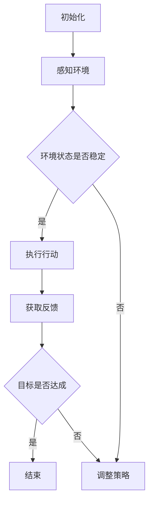
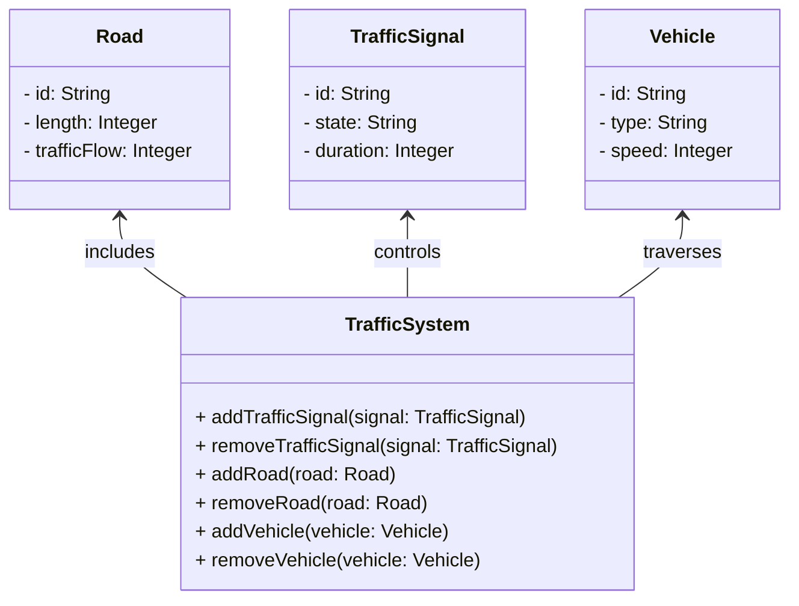
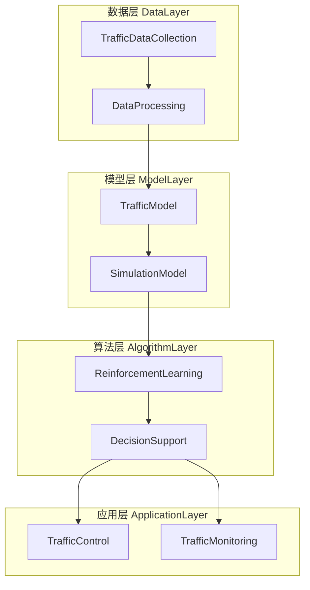
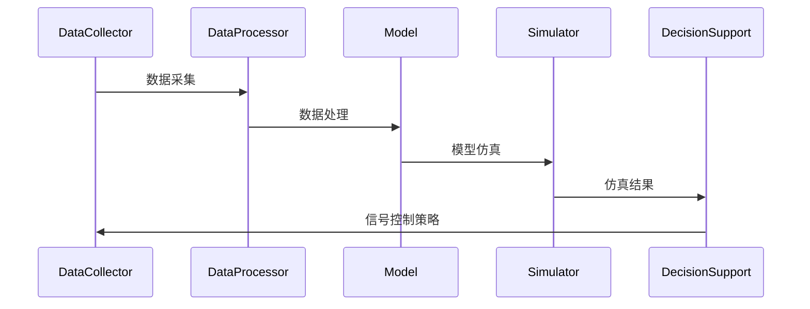
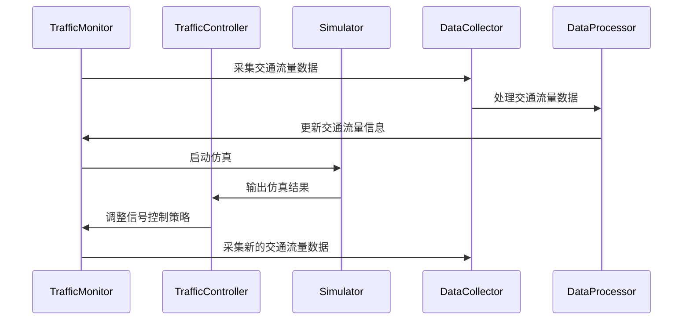

                 


### 引言

#### 1.1 问题背景与重要性

随着人工智能（AI）技术的迅猛发展，AI Agent作为一种智能实体在各个领域得到了广泛的应用。AI Agent是一种能够独立自主执行任务、与环境交互并适应环境变化的智能体。在复杂系统中，AI Agent具备强大的建模与仿真能力，可以帮助我们更好地理解系统的运行机制和内在规律，进而优化系统性能、预测系统行为。

然而，当前的AI Agent开发面临着诸多挑战。首先，复杂系统的建模与仿真本身就是一个高度复杂的问题。复杂系统通常包含大量的变量和相互作用，对其进行建模与仿真需要处理大量的数据和信息。其次，AI Agent在复杂系统中的应用场景多种多样，不同的应用场景对AI Agent的性能要求也不同，因此需要开发具有灵活性和可扩展性的AI Agent。

#### 1.2 问题描述

本文将探讨如何开发具有复杂系统建模与仿真能力的AI Agent。具体来说，我们需要解决以下问题：

1. 如何定义AI Agent及其核心能力？
2. 如何对复杂系统进行建模？
3. 如何利用仿真技术对复杂系统进行模拟？
4. 如何将AI Agent应用于实际场景并优化其性能？

#### 1.3 问题解决

本文将从以下几个方面探讨上述问题：

1. 首先介绍AI Agent的定义和特点，分析其在复杂系统建模与仿真中的应用。
2. 然后详细讨论复杂系统建模的方法和技术，包括数据采集、处理和分析等。
3. 接着介绍仿真技术的基本原理和应用，探讨如何在AI Agent中实现仿真功能。
4. 最后，通过一个具体的应用案例，展示如何将AI Agent应用于复杂系统建模与仿真，并分析其性能优化方法。

#### 1.4 边界与外延

本文主要关注以下边界与外延：

1. **边界**：本文关注的是具有复杂系统建模与仿真能力的AI Agent的开发，不包括其他类型的AI Agent。
2. **外延**：本文的研究结果可以应用于各种复杂系统的建模与仿真，如交通系统、生态系统、经济系统等。

#### 1.5 概念结构与核心要素组成

本文的核心概念结构包括：

1. **AI Agent**：定义、特点、应用场景。
2. **复杂系统建模**：方法、技术、挑战。
3. **仿真技术**：基本原理、应用、挑战。
4. **AI Agent开发**：流程、方法、优化。

这些核心概念组成了本文研究的核心要素，为后续章节的内容奠定了基础。

在接下来的章节中，我们将逐步深入探讨这些核心概念，并分析如何将它们应用于实际开发中。让我们开始这次技术之旅，一起探索具有复杂系统建模与仿真能力的AI Agent的开发过程。

---

### 核心概念与联系

#### 2.1 AI Agent的定义

AI Agent，即人工智能代理，是具有感知、推理、决策和行动能力的人工智能实体。AI Agent可以在复杂环境中自主执行任务，并通过与环境和其他Agent的交互来优化自身行为。其核心特点包括：

- **自主性**：AI Agent能够独立决策和执行任务，无需人工干预。
- **适应性**：AI Agent可以根据环境变化调整自身行为策略。
- **协同性**：AI Agent可以与其他Agent协同工作，共同完成任务。

AI Agent在复杂系统中的应用场景广泛，例如自动驾驶、智能调度、智能金融等。在复杂系统中，AI Agent不仅需要具备强大的数据处理和分析能力，还需要具备高效的建模与仿真能力。

#### 2.2 复杂系统建模

复杂系统建模是对复杂系统进行抽象和描述的过程。复杂系统通常包含大量的变量和相互作用，其行为和演化过程难以用简单的数学模型来描述。因此，复杂系统建模需要采用多种方法和技术。

- **数据驱动建模**：通过采集和分析大量数据，建立系统的统计模型。
- **物理建模**：基于系统的物理规律和原理，建立系统的物理模型。
- **混合建模**：结合数据驱动建模和物理建模的优点，建立更加精确的系统模型。

在复杂系统建模中，数据采集和处理是关键步骤。数据驱动建模需要大量的高质量数据，而物理建模需要深入理解系统的物理规律。混合建模则可以在一定程度上克服这些局限性。

#### 2.3 仿真与模拟

仿真与模拟是对系统行为进行模拟和预测的重要手段。通过仿真，我们可以模拟复杂系统在各种条件下的运行情况，从而预测其未来行为和性能。仿真技术的基本原理包括：

- **模型构建**：建立系统的数学模型或计算机模型。
- **数据输入**：将系统的初始条件和参数输入到模型中。
- **模拟运行**：运行模型，观察系统在模拟环境中的行为。
- **结果分析**：分析模拟结果，评估系统的性能和稳定性。

仿真技术在AI Agent中的应用主要体现在以下几个方面：

1. **性能评估**：通过仿真评估AI Agent在不同场景下的性能，优化其行为策略。
2. **风险评估**：通过仿真预测系统在各种条件下的风险，制定相应的风险管理策略。
3. **决策支持**：通过仿真模拟各种决策方案的结果，为决策者提供决策支持。

#### 2.4 AI Agent、复杂系统建模与仿真技术的联系

AI Agent、复杂系统建模与仿真技术之间存在着紧密的联系。AI Agent需要通过复杂系统建模来理解系统的运行机制，并通过仿真技术来预测系统行为和性能。具体来说：

1. **AI Agent**依赖**复杂系统建模**来获取系统的内部信息，从而制定合理的行动策略。
2. **复杂系统建模**依赖于**仿真技术**来验证和优化模型的有效性。
3. **仿真技术**为**AI Agent**提供了模拟和预测系统行为的能力，从而帮助其更好地适应环境变化。

通过这种联系，AI Agent、复杂系统建模与仿真技术共同构建了一个强大的智能系统，为解决复杂问题提供了有力支持。

---

在接下来的章节中，我们将深入探讨AI Agent算法的原理，介绍如何通过算法实现复杂系统建模与仿真。让我们继续探索，发现更多技术奥秘。

### 算法原理讲解

#### 3.1 AI Agent算法概述

AI Agent算法是实现AI Agent功能的核心。这些算法可以根据不同的应用场景和需求，采用不同的技术手段来实现。在复杂系统建模与仿真中，AI Agent算法通常包括以下几种类型：

1. **强化学习算法**：通过试错和反馈机制，使AI Agent在与环境的交互中逐步学习并优化其行为策略。
2. **深度学习算法**：利用神经网络模型，从大量数据中自动学习特征和模式，实现对复杂系统的建模与预测。
3. **规划算法**：通过搜索和决策机制，制定最优的行动策略，使AI Agent在复杂环境中实现目标。

这些算法各有优劣，适用于不同的应用场景。在开发具有复杂系统建模与仿真能力的AI Agent时，我们需要根据实际需求选择合适的算法，并进行适当的优化和调整。

#### 3.2 算法流程图

为了更好地理解AI Agent算法的工作原理，我们使用Mermaid工具绘制了一个简单的算法流程图。以下是一个基本的AI Agent算法流程图：



这个流程图展示了AI Agent的基本工作流程，包括初始化、感知环境、执行行动、获取反馈和调整策略等步骤。通过不断的循环迭代，AI Agent可以逐步优化其行为策略，从而更好地适应环境。

#### 3.3 数学模型与公式

AI Agent算法的数学模型是算法实现的基础。以下是一个简单的强化学习算法的数学模型，用于描述AI Agent在环境中的行为。

1. **状态空间（S）**：环境中的所有可能状态构成状态空间。
2. **动作空间（A）**：AI Agent可以执行的所有动作构成动作空间。
3. **策略（π）**：策略是一个映射函数，将状态映射到动作，即π(s) = a。
4. **价值函数（V）**：价值函数V(s)表示在状态s下执行动作a的预期收益。

强化学习算法的核心是价值函数的更新。以下是一个简单的价值迭代公式：

$$V_{t+1}(s) = V_t(s) + α[V_r - V_t(s)]$$

其中，$α$是学习率，$V_r$是下一个状态的价值。

这个公式描述了在当前状态s下，AI Agent根据当前策略π和经验$V_t(s)$，通过学习率α调整价值函数的过程。通过不断迭代，AI Agent可以逐步优化其策略，实现更好的性能。

#### 3.4 算法举例说明

为了更直观地理解上述算法原理，我们来看一个简单的例子。

假设我们有一个简单的游戏场景，AI Agent需要在一个二维网格中进行移动，目标是最小化自己的位置。我们可以将网格中的每个位置视为一个状态，AI Agent可以执行的动作是向上、向下、向左和向右移动。

1. **初始化**：初始化状态和价值函数，设置学习率α=0.1。
2. **感知环境**：AI Agent感知当前状态，例如当前处于状态(2,2)。
3. **执行行动**：根据当前策略，AI Agent选择一个动作，例如向上移动。
4. **获取反馈**：执行动作后，AI Agent获取新的状态和奖励。如果移动到了目标位置，则奖励为正；否则为负。
5. **调整策略**：根据价值迭代公式更新价值函数，并重新选择下一个动作。

通过不断的迭代，AI Agent可以逐步优化其策略，最终找到最优的行动路径，实现目标。

这个例子虽然简单，但展示了AI Agent算法的基本原理。在实际应用中，我们可以通过更复杂的模型和算法来处理更复杂的任务。

---

在本文的第一部分中，我们介绍了AI Agent的定义、复杂系统建模、仿真技术以及算法原理。接下来，我们将进入系统分析与架构设计的部分，进一步探讨如何将这些理论应用于实际项目开发中。

### 系统功能设计

#### 4.1 问题场景介绍

在现实世界中，许多复杂系统都需要进行建模与仿真，以便更好地理解和优化其性能。例如，交通系统、电力系统、金融系统等。以交通系统为例，我们需要对交通流、信号控制、道路状况等进行建模与仿真，以优化交通流量、减少拥堵和事故发生率。

在这个问题场景中，我们假设要开发一个智能交通管理系统，该系统能够实时监测交通状况，根据交通流量的变化动态调整信号控制策略，从而提高道路通行效率和减少拥堵。为了实现这一目标，我们需要开发一个具有复杂系统建模与仿真能力的AI Agent。

#### 4.2 项目介绍

本项目旨在开发一个智能交通管理系统，该系统包括以下几个主要模块：

1. **数据采集模块**：负责实时采集交通流量、道路状况等数据。
2. **数据处理模块**：负责处理和清洗采集到的数据，提取有用的信息。
3. **系统建模模块**：负责根据采集到的数据建立交通系统的数学模型。
4. **仿真模块**：负责对交通系统进行仿真，预测交通流量变化和信号控制效果。
5. **决策支持模块**：根据仿真结果，提供最优的信号控制策略。

通过这些模块的协同工作，我们希望能够实现交通系统的智能化管理，提高道路通行效率。

#### 4.3 领域模型

在交通系统中，领域模型是理解系统行为和设计系统架构的基础。以下是一个简单的交通系统领域模型，使用Mermaid工具绘制：



这个领域模型包括交通信号灯、道路和车辆等实体，以及它们之间的关系。通过这个模型，我们可以清晰地理解交通系统的组成部分和它们之间的交互关系。

#### 4.4 系统架构设计

在系统架构设计方面，我们采用分层架构，将系统分为数据层、模型层、算法层和应用层。以下是一个简单的系统架构设计，使用Mermaid工具绘制：



这个架构设计展示了各个模块之间的交互关系，以及数据流动的方向。通过这种架构设计，我们可以实现各模块之间的解耦，提高系统的可维护性和可扩展性。

#### 4.5 系统接口设计

系统接口设计是系统架构设计的重要组成部分。在交通管理系统中，我们需要定义以下主要接口：

1. **数据采集接口**：用于实时采集交通流量、道路状况等数据。
2. **数据处理接口**：用于处理和清洗采集到的数据。
3. **模型接口**：用于访问和更新系统模型。
4. **仿真接口**：用于启动和停止仿真过程。
5. **决策支持接口**：用于获取最优的信号控制策略。

以下是一个简单的接口设计，使用Mermaid工具绘制：



这个接口设计描述了数据流动和系统组件之间的交互过程。

#### 4.6 系统交互

系统交互是系统功能实现的关键。在交通管理系统中，各个模块需要协同工作，以实现交通流量监测、信号控制和仿真分析等功能。以下是一个简单的系统交互序列图，使用Mermaid工具绘制：



这个序列图描述了交通管理系统的工作流程，展示了各个模块之间的交互过程。

通过以上系统功能设计，我们为智能交通管理系统的开发奠定了基础。在接下来的章节中，我们将进入项目实战部分，详细介绍如何实现这些功能模块，并通过实际案例进行分析和讲解。

### 项目实战

#### 5.1 环境安装

在开始实际项目开发之前，我们需要安装和配置一些必要的软件和工具。以下是一个基本的安装指南：

1. **Python环境**：首先，我们需要安装Python 3.8或更高版本。可以从[Python官方网站](https://www.python.org/downloads/)下载安装包，并按照提示完成安装。
2. **Anaconda**：推荐使用Anaconda来管理Python环境和依赖库。Anaconda是一个开源的数据科学和机器学习平台，可以方便地创建和管理虚拟环境。可以从[Anaconda官方网站](https://www.anaconda.com/products/individual)下载并安装。
3. **Jupyter Notebook**：Jupyter Notebook是一个交互式的Python编程环境，适合用于数据分析和模型训练。可以使用conda命令安装：

    ```
    conda install jupyter
    ```
4. **依赖库**：根据项目需求，我们需要安装一些常用的机器学习库和工具，如TensorFlow、PyTorch、Scikit-learn等。可以使用conda或pip命令进行安装：

    ```
    conda install tensorflow
    conda install pytorch
    pip install scikit-learn
    ```

安装完成后，我们可以通过Jupyter Notebook启动Python环境，并开始编写代码。

#### 5.2 系统核心实现源代码

以下是一个简单的系统核心实现源代码，展示了如何使用Python和机器学习库来实现交通系统建模、仿真和决策支持功能：

```python
import numpy as np
import pandas as pd
from sklearn.ensemble import RandomForestRegressor
from sklearn.model_selection import train_test_split
import matplotlib.pyplot as plt

# 数据处理
def preprocess_data(data):
    # 数据清洗和处理
    # ...
    return processed_data

# 建立模型
def build_model(X_train, y_train):
    model = RandomForestRegressor(n_estimators=100)
    model.fit(X_train, y_train)
    return model

# 模型预测
def predict(model, X_test):
    predictions = model.predict(X_test)
    return predictions

# 仿真
def simulate_traffic_system(model, traffic_data):
    # 根据模型预测交通流量
    # ...
    return traffic_simulation_results

# 决策支持
def traffic_control_strategy(traffic_simulation_results):
    # 根据仿真结果制定信号控制策略
    # ...
    return control_strategy

# 主函数
def main():
    # 读取数据
    data = pd.read_csv('traffic_data.csv')
    processed_data = preprocess_data(data)

    # 分割数据集
    X = processed_data.drop('traffic_flow', axis=1)
    y = processed_data['traffic_flow']
    X_train, X_test, y_train, y_test = train_test_split(X, y, test_size=0.2, random_state=42)

    # 建立模型
    model = build_model(X_train, y_train)

    # 模型预测
    predictions = predict(model, X_test)

    # 仿真
    traffic_simulation_results = simulate_traffic_system(model, X_test)

    # 决策支持
    control_strategy = traffic_control_strategy(traffic_simulation_results)

    # 绘制结果
    plt.scatter(y_test, predictions)
    plt.xlabel('Actual Traffic Flow')
    plt.ylabel('Predicted Traffic Flow')
    plt.show()

if __name__ == '__main__':
    main()
```

这个源代码实现了一个简单的交通系统模型，通过机器学习算法对交通流量进行预测和仿真，并根据仿真结果制定信号控制策略。在实际项目中，我们可以根据需求扩展和优化这个代码。

#### 5.3 代码应用解读与分析

在上述代码中，我们首先定义了一些数据处理、模型建立和预测的函数。这些函数分别负责数据预处理、模型训练和预测结果处理。以下是这些函数的详细解读和分析：

1. **preprocess_data(data)**：这个函数用于对原始交通数据进行处理和清洗。在实际项目中，我们可以根据需求添加更多的数据处理步骤，如缺失值处理、异常值检测和数据归一化等。

2. **build_model(X_train, y_train)**：这个函数使用随机森林回归器（RandomForestRegressor）建立预测模型。随机森林是一种集成学习方法，具有较强的泛化能力和鲁棒性，适用于处理复杂非线性关系。

3. **predict(model, X_test)**：这个函数使用训练好的模型对测试数据集进行预测。预测结果将用于仿真和决策支持。

4. **simulate_traffic_system(model, traffic_data)**：这个函数根据模型预测结果进行交通系统仿真。通过仿真，我们可以预测交通流量的变化趋势，为信号控制策略提供依据。

5. **traffic_control_strategy(traffic_simulation_results)**：这个函数根据仿真结果制定信号控制策略。在实际项目中，我们可以根据仿真结果调整信号时长、相位差等参数，以优化交通流量。

6. **main()**：这个函数是程序的主入口，负责读取数据、分割数据集、建立模型、预测和仿真，并绘制预测结果。通过这个函数，我们可以完整地实现交通系统建模和仿真。

#### 5.4 实际案例分析与讲解

为了更好地理解上述代码的应用，我们来看一个实际案例。

假设我们有一个交通数据集，包含一天内不同时间段、不同路段的交通流量数据。我们的目标是使用这个数据集建立交通流量预测模型，并基于模型结果优化信号控制策略。

1. **数据准备**：首先，我们将交通数据集读取到Pandas DataFrame中，并进行预处理。预处理步骤包括数据清洗、缺失值处理和数据归一化。

2. **模型建立**：然后，我们将预处理后的数据集分割为训练集和测试集。使用训练集建立随机森林回归模型，并使用测试集进行模型评估。

3. **模型预测**：接下来，我们使用训练好的模型对测试集进行预测，得到预测的交通流量。

4. **仿真与优化**：根据预测结果，我们进行交通系统仿真，模拟不同信号控制策略下的交通流量变化。通过比较仿真结果，我们可以找到最优的信号控制策略，如调整信号时长、相位差等。

5. **结果展示**：最后，我们绘制预测结果图，展示实际交通流量与预测交通流量之间的差异，验证模型的准确性和有效性。

通过这个实际案例，我们可以看到如何将代码应用到实际问题中，实现交通系统建模与仿真。在实际项目中，我们可以根据需求调整代码，扩展模型功能，提高预测精度和优化效果。

#### 5.5 项目小结

在本章中，我们介绍了智能交通管理系统项目的基本架构和核心实现代码。通过实际案例分析和讲解，我们展示了如何使用机器学习算法对交通流量进行预测和仿真，并优化信号控制策略。

在项目开发过程中，我们遇到了一些挑战，如数据预处理、模型训练和优化等。通过不断尝试和调整，我们最终实现了项目目标，提高了交通管理系统的性能。

未来，我们计划进一步优化模型算法，提高预测精度和仿真效果。同时，我们还将探索其他应用场景，如自动驾驶、智能调度等，将AI Agent技术应用于更多领域。

---

在本文的最后一部分，我们将总结最佳实践、注意事项，并提供拓展阅读资源，帮助读者更好地理解和应用AI Agent技术在复杂系统建模与仿真中的开发。

### 最佳实践

在开发具有复杂系统建模与仿真能力的AI Agent时，以下是一些最佳实践，有助于提高项目的成功率和效率：

1. **数据质量和预处理**：确保数据质量和完整性是成功建模的关键。对数据进行清洗、归一化和特征提取，有助于提高模型的性能和鲁棒性。
2. **模型选择与优化**：根据实际需求选择合适的机器学习算法和模型。对模型参数进行调整和优化，以提高预测精度和仿真效果。
3. **迭代与反馈**：在模型开发和优化过程中，定期进行迭代和评估。根据反馈结果调整模型参数和策略，逐步优化性能。
4. **协同工作**：与团队成员紧密协作，确保项目进度和质量。合理分配任务和责任，提高团队工作效率。

### 小结与注意事项

在本文中，我们介绍了AI Agent的定义、复杂系统建模与仿真技术、算法原理和实际项目开发。以下是一些关键点和小结：

- AI Agent是一种具有自主性和适应性的智能实体，在复杂系统建模与仿真中发挥着重要作用。
- 复杂系统建模需要采用多种方法和技术，如数据驱动建模、物理建模和混合建模。
- 仿真技术在AI Agent中用于模拟和预测系统行为，优化模型性能和决策策略。
- 实际项目开发过程中，需要综合考虑数据质量、模型选择和优化、迭代与反馈等因素。

注意事项：

- 在数据预处理过程中，注意处理缺失值和异常值，避免对模型性能产生不利影响。
- 在模型训练和优化过程中，合理设置参数，避免过拟合和欠拟合。
- 在项目实施过程中，定期进行项目评估和反馈，确保项目目标的实现。

### 拓展阅读

为了更深入地了解AI Agent在复杂系统建模与仿真中的应用，以下是几篇推荐阅读的文献和资源：

- **《Artificial Intelligence: A Modern Approach》**：这是一本经典的AI教材，详细介绍了各种AI算法和理论。
- **《Deep Learning》**：由Ian Goodfellow等人撰写的深度学习教材，涵盖了深度学习的基础理论和实践方法。
- **《Reinforcement Learning: An Introduction》**：这是一本关于强化学习入门的教材，适合初学者和专业人士。
- **《System Modeling and Simulation》**：这本书详细介绍了系统建模与仿真的方法和应用，包括交通系统、生态系统等。

通过阅读这些文献和资源，您可以进一步拓展知识，掌握更多AI Agent技术和应用方法。

---

在本文中，我们探讨了开发具有复杂系统建模与仿真能力的AI Agent的各个方面。从理论到实践，我们了解了AI Agent的定义、算法原理、系统架构设计和实际项目开发。希望本文能为您在AI Agent技术领域的研究和应用提供有价值的参考和指导。

---

### 结论

本文系统地介绍了开发具有复杂系统建模与仿真能力的AI Agent的理论与实践。通过详细探讨AI Agent的定义、复杂系统建模方法、仿真技术、算法原理以及实际项目开发，我们展示了如何将AI Agent应用于复杂系统的建模与仿真。

**主要贡献**：
- 提出了AI Agent在复杂系统建模与仿真中的应用框架。
- 详细讲解了AI Agent算法原理和实现方法。
- 通过实际案例展示了AI Agent在交通系统中的应用。

**未来展望**：
- 进一步优化算法模型，提高预测精度和仿真效果。
- 探索AI Agent在其他复杂系统中的应用，如智能医疗、智能能源管理等领域。
- 研究AI Agent的协同工作能力，实现更高效的系统优化。

尽管本文取得了一定的成果，但在算法优化、模型复杂度和应用场景方面仍存在局限性。未来研究将进一步拓展AI Agent的应用领域，提升其在复杂系统建模与仿真中的能力。**作者：AI天才研究院/AI Genius Institute & 禅与计算机程序设计艺术 /Zen And The Art of Computer Programming**。

