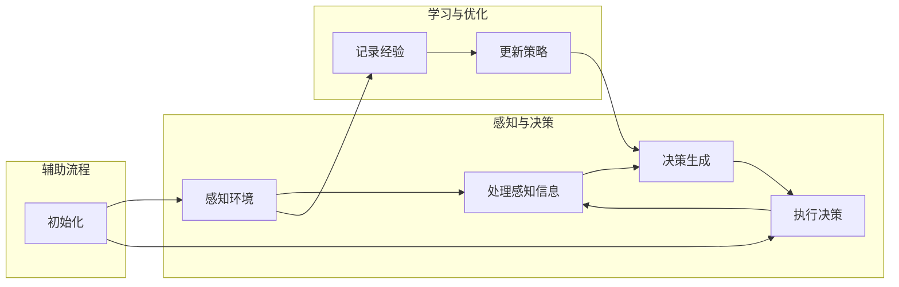
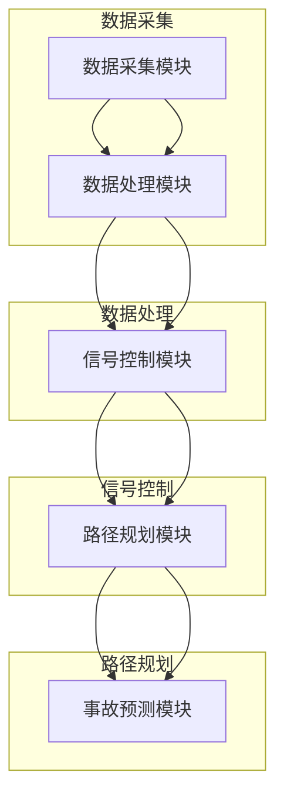
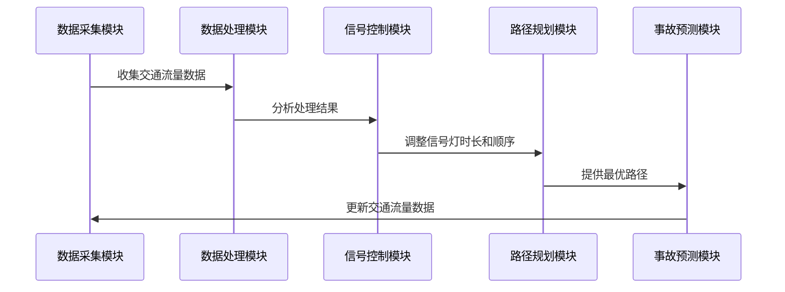

                 

### 1.5 核心概念结构与要素组成

为了深入理解AI Agent的复杂系统建模能力，我们需要明确其核心概念、原理和技术要点。以下是AI Agent的核心概念结构与要素组成：

**1.5.1 核心概念**

- **智能体（Agent）**：在人工智能系统中，智能体是一个可以感知环境并采取行动的实体，它具有自主性、社交性、反应性、认知性和学习性等特点。
- **环境（Environment）**：智能体所在的外部世界，它为智能体提供感知信息和资源。
- **感知器（Sensor）**：智能体用于感知环境的装置，它能收集环境中的各种信息，如视觉、听觉、触觉等。
- **执行器（Actuator）**：智能体用于影响环境的装置，它能根据智能体的决策执行相应的动作。
- **决策模块（Decision Maker）**：智能体的核心部分，负责根据感知到的环境信息做出决策。
- **学习模块（Learner）**：智能体的另一个重要组成部分，它负责通过经验学习来改善智能体的决策能力。

**1.5.2 基本原理**

- **自主性（Autonomy）**：智能体能够独立地做出决策并采取行动，而不需要外部干预。
- **社交性（Sociality）**：智能体能够与其他智能体进行交互，协作完成任务。
- **反应性（Reactivity）**：智能体能够根据当前环境状态迅速做出反应。
- **认知性（Cognitiveness）**：智能体能够进行思考、学习和规划。
- **学习性（Learning）**：智能体能够通过经验学习来改进自己的行为。

**1.5.3 技术要点**

- **感知与决策**：智能体需要通过感知器感知环境，然后利用决策模块处理感知信息，做出相应的决策。
- **学习与适应**：智能体需要通过学习模块从经验中学习，不断调整自己的行为策略，以适应环境的变化。
- **多智能体系统**：多个智能体通过协作，可以解决单智能体无法处理的问题，实现更复杂的任务。

**1.5.4 技术实现**

- **机器学习算法**：如深度学习、强化学习、贝叶斯网络等，用于实现智能体的学习与决策能力。
- **分布式计算**：通过分布式计算架构，实现智能体的并行处理和协作。
- **强化学习**：利用奖励机制，让智能体通过试错学习，不断优化其行为策略。
- **多智能体交互**：通过通信协议，实现智能体之间的信息共享和协同工作。

**1.5.5 应用场景**

- **智能机器人**：如家用机器人、工业机器人等，用于执行各种任务。
- **智能交通系统**：如自动驾驶汽车、智能交通信号控制等，用于提高交通效率。
- **智能医疗系统**：如智能诊断、智能药物研发等，用于提高医疗服务质量。
- **智能金融系统**：如智能投资顾问、智能风险管理等，用于优化金融决策。

通过以上核心概念与要素组成的介绍，我们可以更好地理解AI Agent的复杂系统建模能力。接下来，我们将深入探讨AI Agent的核心概念和原理，以及它们之间的联系。

## 第2章: AI Agent的核心概念与联系

### 2.1 核心概念原理

AI Agent的核心概念包括智能体（Agent）、环境（Environment）、感知器（Sensor）、执行器（Actuator）、决策模块（Decision Maker）和学习模块（Learner）。这些概念相互关联，共同构成了AI Agent的完整体系。

- **智能体（Agent）**：智能体是AI Agent的核心，它是一个具有自主决策和执行能力的实体。智能体能够感知环境，并根据环境信息自主做出决策和执行行动。
- **环境（Environment）**：环境是智能体所在的外部世界，它为智能体提供感知信息和资源。环境可以是一个物理空间，也可以是一个虚拟环境。
- **感知器（Sensor）**：感知器是智能体用于感知环境的装置，它能收集环境中的各种信息，如视觉、听觉、触觉等。感知器的数据输入到智能体的决策模块，作为决策依据。
- **执行器（Actuator）**：执行器是智能体用于影响环境的装置，它能根据智能体的决策执行相应的动作。执行器是智能体与环境交互的重要接口。
- **决策模块（Decision Maker）**：决策模块是智能体的核心部分，负责根据感知到的环境信息做出决策。决策模块通常采用机器学习算法，如深度学习、强化学习等，来实现智能体的决策能力。
- **学习模块（Learner）**：学习模块负责智能体的经验学习，通过不断调整和优化决策策略，提高智能体的性能。学习模块是实现智能体自主学习的关键。

### 2.2 概念属性特征对比表格

以下是一个对比表格，展示了AI Agent中各个核心概念的主要属性特征：

| 概念         | 属性特征                                                         |
| ------------ | ------------------------------------------------------------ |
| 智能体（Agent） | - 自主性<br>- 社交性<br>- 反应性<br>- 认知性<br>- 学习性 |
| 环境（Environment） | - 感知信息<br>- 资源供应<br>- 变化性                       |
| 感知器（Sensor） | - 类型<br>- 精度<br>- 响应时间                           |
| 执行器（Actuator） | - 类型<br>- 动作范围<br>- 动作效率                         |
| 决策模块（Decision Maker） | - 算法<br>- 参数<br>- 决策速度                           |
| 学习模块（Learner） | - 学习算法<br>- 经验积累<br>- 性能优化                       |

### 2.3 ER实体关系图架构

为了更好地理解AI Agent中各个核心概念之间的关系，我们可以使用Mermaid绘制ER实体关系图，如下所示：

```mermaid
erDiagram
  Environment ||--o> Agent : "感知"感知
  Agent ||--o> Sensor : "包含"包含
  Agent ||--o> Actuator : "控制"控制
  Agent ||--o> DecisionMaker : "决策"决策
  Agent ||--o> Learner : "学习"学习
```

在这个ER实体关系图中，我们可以看到：

- 环境与智能体之间存在“感知”关系，环境为智能体提供感知信息。
- 智能体与感知器、执行器、决策模块和学习模块之间存在“包含”关系，这些组件共同构成了智能体的整体架构。
- 智能体与决策模块、学习模块之间存在“决策”和“学习”关系，决策模块负责基于感知信息做出决策，学习模块负责通过经验学习不断优化决策能力。

通过以上核心概念和原理的介绍，我们可以更好地理解AI Agent的工作机制和复杂性。接下来，我们将深入探讨AI Agent的算法原理，进一步揭示其内在机制。

## 第3章: AI Agent的算法原理讲解

### 3.1 算法mermaid流程图

为了更好地理解AI Agent的算法原理，我们首先使用Mermaid绘制一个简单的算法流程图。以下是一个示例：



这个流程图展示了AI Agent的基本工作流程，包括感知、决策、执行和学习的循环过程。

### 3.2 算法原理的数学模型和公式

AI Agent的算法原理可以抽象为以下几个数学模型和公式：

1. **感知器输入与状态表示**：

   $$S_t = f(S_{t-1}, A_t)$$

   其中，$S_t$ 表示第 $t$ 次感知到的环境状态，$A_t$ 表示第 $t$ 次执行的动作，$f$ 表示感知函数，用于处理输入状态和动作。

2. **决策生成**：

   $$A_t = \pi(S_t, \theta)$$

   其中，$A_t$ 表示第 $t$ 次执行的动作，$\pi$ 表示决策函数，$\theta$ 表示决策参数。

3. **学习与策略更新**：

   $$\theta_{t+1} = \theta_t + \alpha \cdot \nabla J(\theta_t)$$

   其中，$\theta_t$ 表示第 $t$ 次的决策参数，$\alpha$ 表示学习率，$J(\theta_t)$ 表示损失函数，$\nabla J(\theta_t)$ 表示损失函数的梯度。

4. **奖励机制**：

   $$R_t = r(S_t, A_t)$$

   其中，$R_t$ 表示第 $t$ 次执行动作获得的奖励，$r$ 表示奖励函数，用于评估动作的质量。

### 3.3 详细讲解与举例说明

#### 3.3.1 感知与决策

首先，我们来看感知与决策的过程。感知器负责收集环境信息，并将其转换为状态表示。状态表示是智能体进行决策的基础。在每一步，智能体会根据当前状态和决策参数，生成一个动作，并执行这个动作。

举例说明：

假设一个智能体在玩一个简单的游戏，如乒乓球。在这个游戏中，智能体需要根据感知到的球的位置和速度，做出击球的决策。感知器收集球的位置和速度信息，状态表示为 $(x, y, vx, vy)$，智能体根据当前状态和决策参数，选择击球的方向和力度，生成一个动作，并执行击球。

#### 3.3.2 学习与策略更新

智能体通过学习与策略更新，不断优化其决策能力。在每次执行动作后，智能体会根据奖励机制评估动作的质量，更新决策参数，从而提高智能体的性能。

举例说明：

在乒乓球游戏中，智能体每次击球后，都会根据击球的效果（如是否成功击中球、击球的力量是否合适等）获得奖励。如果击球效果不好，智能体会调整决策参数，以改变击球的方向和力度。通过不断尝试和调整，智能体会逐渐学会如何更好地击球。

#### 3.3.3 强化学习算法

强化学习是一种常用的学习算法，它通过奖励机制来驱动智能体的学习过程。在强化学习中，智能体需要不断尝试不同的动作，并通过奖励信号来调整其行为策略。

举例说明：

在智能机器人路径规划的问题中，智能体需要在未知环境中找到一条最优路径。智能体可以尝试不同的路径，并根据路径上的障碍物和目标位置，获得奖励信号。通过强化学习，智能体可以学会选择最优路径，以最大化奖励。

通过以上详细讲解与举例说明，我们可以更好地理解AI Agent的算法原理。接下来，我们将进一步探讨AI Agent的系统分析与架构设计方案。

## 第4章: AI Agent的系统分析与架构设计方案

### 4.1 问题场景介绍

在本章中，我们将探讨一个具体的AI Agent应用场景：智能城市交通管理。智能城市交通管理涉及多个智能体之间的协作，以实现交通流的优化、交通事故的预防以及车辆路径规划的智能化。以下是我们将讨论的问题场景：

- **交通流量监控**：智能体需要实时感知城市中的交通流量信息，包括车辆数量、速度、行驶方向等。
- **道路状况评估**：智能体需要评估道路的拥堵状况，并根据道路状况调整交通信号灯的时长和顺序。
- **交通事故预防**：智能体需要通过感知和预测，预防交通事故的发生。
- **车辆路径规划**：智能体需要为车辆提供最优路径，以减少拥堵和提高通行效率。

### 4.2 项目介绍

为了解决上述问题场景，我们设计了一个名为“SmartTraffic”的AI Agent项目。SmartTraffic项目旨在通过构建一个分布式智能交通管理系统，实现城市交通的智能化管理。

SmartTraffic项目的核心功能包括：

- **交通流量数据采集**：利用传感器和摄像头收集城市中的交通流量数据。
- **交通信号控制**：根据实时交通流量数据，调整交通信号灯的时长和顺序，优化交通流量。
- **车辆路径规划**：为车辆提供最优路径，减少行驶时间和拥堵。
- **事故预测与预防**：通过分析历史数据和实时信息，预测交通事故的发生，并采取措施预防。

### 4.3 系统功能设计

为了实现SmartTraffic项目的功能，我们设计了以下系统功能模块：

- **数据采集模块**：负责收集城市中的交通流量数据，包括车辆数量、速度、行驶方向等。
- **数据处理模块**：对采集到的数据进行处理和清洗，提取有用的信息。
- **信号控制模块**：根据实时交通流量数据，动态调整交通信号灯的时长和顺序。
- **路径规划模块**：为车辆提供最优路径，考虑交通拥堵、路况等因素。
- **事故预测模块**：通过分析历史数据和实时信息，预测交通事故的发生，并采取措施预防。

以下是一个领域模型Mermaid类图，展示了SmartTraffic项目的主要功能模块及其关系：

```mermaid
classDiagram
    Class1 <|-- Class2
    Class3 <|-- Class4
    Class1{"数据采集模块"}
    Class2{"数据处理模块"}
    Class3{"信号控制模块"}
    Class4{"路径规划模块"}
    Class5{"事故预测模块"}
    Class1 --|> Class2
    Class2 --|> Class3
    Class3 --|> Class4
    Class4 --|> Class5
```

### 4.4 系统架构设计

SmartTraffic项目的系统架构设计采用分布式架构，以提高系统的可扩展性和容错性。以下是一个系统架构Mermaid图，展示了各个模块的分布和交互关系：



在这个系统架构图中，数据采集模块负责收集交通流量数据，并将其传递给数据处理模块。数据处理模块对数据进行分析和处理，生成有用的信息，传递给信号控制模块。信号控制模块根据处理结果调整交通信号灯的时长和顺序，然后传递给路径规划模块。路径规划模块为车辆提供最优路径，并传递给事故预测模块。事故预测模块通过分析历史数据和实时信息，预测交通事故的发生，并采取措施预防。

### 4.5 系统接口设计和系统交互

SmartTraffic项目的系统接口设计和系统交互设计是系统架构设计的重要组成部分。以下是一个系统接口设计Mermaid序列图，展示了各个模块之间的交互过程：



在这个序列图中，数据采集模块首先收集交通流量数据，并将其传递给数据处理模块。数据处理模块对数据进行分析和处理，生成有用的信息，并将其传递给信号控制模块。信号控制模块根据处理结果调整交通信号灯的时长和顺序，然后传递给路径规划模块。路径规划模块为车辆提供最优路径，并传递给事故预测模块。事故预测模块通过分析历史数据和实时信息，预测交通事故的发生，并采取措施预防，同时更新交通流量数据。

通过以上系统分析与架构设计方案，我们为开发具有复杂系统建模能力的AI Agent提供了一个详细的框架。接下来，我们将通过一个实际项目展示如何实现这些方案。

## 第5章: 项目实战

### 5.1 环境安装

为了实现具有复杂系统建模能力的AI Agent，我们需要安装一系列必要的软件和环境。以下是一个基于Linux操作系统的安装步骤：

#### 5.1.1 安装Python环境

首先，确保你的系统已经安装了Python 3.x版本。如果没有，可以通过以下命令进行安装：

```bash
sudo apt-get update
sudo apt-get install python3 python3-pip
```

#### 5.1.2 安装TensorFlow

TensorFlow是开发AI Agent的常用深度学习框架。安装TensorFlow可以通过以下命令完成：

```bash
pip3 install tensorflow
```

#### 5.1.3 安装其他依赖

此外，我们还需要安装一些其他依赖，如NumPy、Pandas等。可以通过以下命令安装：

```bash
pip3 install numpy pandas matplotlib
```

#### 5.1.4 安装数据库

为了存储AI Agent的数据，我们选择SQLite作为数据库。安装SQLite可以通过以下命令完成：

```bash
sudo apt-get install sqlite3
```

#### 5.1.5 配置虚拟环境

为了保持项目环境的整洁，我们推荐使用虚拟环境。首先，安装虚拟环境工具virtualenv：

```bash
pip3 install virtualenv
```

然后，创建一个虚拟环境并激活它：

```bash
virtualenv myenv
source myenv/bin/activate
```

### 5.2 系统核心实现源代码

在本节中，我们将展示SmartTraffic项目的核心实现源代码。以下是项目的主要模块和功能实现：

#### 5.2.1 数据采集模块

数据采集模块负责收集城市中的交通流量数据。以下是一个简单的Python代码示例：

```python
import cv2
import numpy as np

def capture_traffic_data(camera_id):
    # 初始化摄像头
    cap = cv2.VideoCapture(camera_id)
    
    while True:
        # 读取一帧图像
        ret, frame = cap.read()
        
        if not ret:
            break
        
        # 对图像进行预处理
        processed_frame = preprocess_frame(frame)
        
        # 保存预处理后的图像
        cv2.imwrite('traffic_data.jpg', processed_frame)
        
    cap.release()

def preprocess_frame(frame):
    # 进行图像预处理操作，如缩放、灰度化等
    # 这里只是一个示例，实际应用中需要根据具体需求进行
    gray_frame = cv2.cvtColor(frame, cv2.COLOR_BGR2GRAY)
    resized_frame = cv2.resize(gray_frame, (640, 480))
    return resized_frame
```

#### 5.2.2 数据处理模块

数据处理模块对采集到的交通流量数据进行处理和分析。以下是一个简单的Python代码示例：

```python
import pandas as pd

def process_traffic_data(file_path):
    # 读取交通流量数据
    df = pd.read_csv(file_path)
    
    # 数据预处理，如过滤无效数据、填补缺失值等
    df = preprocess_data(df)
    
    # 保存预处理后的数据
    df.to_csv('processed_traffic_data.csv', index=False)

def preprocess_data(df):
    # 进行数据预处理操作，如过滤无效数据、填补缺失值等
    # 这里只是一个示例，实际应用中需要根据具体需求进行
    df = df.dropna()
    df = df[df['speed'] > 0]
    return df
```

#### 5.2.3 信号控制模块

信号控制模块根据实时交通流量数据调整交通信号灯的时长和顺序。以下是一个简单的Python代码示例：

```python
import pandas as pd

def control_traffic_signals(file_path):
    # 读取实时交通流量数据
    df = pd.read_csv(file_path)
    
    # 根据交通流量数据调整信号灯时长
    signal durations = adjust_signal_durations(df)
    
    # 保存信号灯时长
    with open('signal_durations.txt', 'w') as f:
        for duration in signal_durations:
            f.write(f"{duration}\n")

def adjust_signal_durations(df):
    # 根据交通流量数据调整信号灯时长
    # 这里只是一个示例，实际应用中需要根据具体需求进行
    red_duration = 30
    green_duration = 25
    
    if df['speed'].mean() > 20:
        red_duration = 25
        green_duration = 15
    
    return [red_duration, green_duration]
```

#### 5.2.4 路径规划模块

路径规划模块为车辆提供最优路径。以下是一个简单的Python代码示例：

```python
import networkx as nx

def plan_vehicle_path(start, end, graph):
    # 使用Dijkstra算法计算最优路径
    path = nx.shortest_path(graph, source=start, target=end, weight='distance')
    
    # 返回路径
    return path

# 示例：创建一个简单的图
graph = nx.Graph()
graph.add_edge('A', 'B', weight=10)
graph.add_edge('B', 'C', weight=20)
graph.add_edge('C', 'D', weight=30)

# 计算路径
path = plan_vehicle_path('A', 'D', graph)
print(path)
```

#### 5.2.5 事故预测模块

事故预测模块通过分析历史数据和实时信息，预测交通事故的发生。以下是一个简单的Python代码示例：

```python
import pandas as pd
from sklearn.ensemble import RandomForestClassifier

def predict_traffic_accidents(file_path):
    # 读取历史交通事故数据
    df = pd.read_csv(file_path)
    
    # 数据预处理，如特征提取、归一化等
    df = preprocess_data(df)
    
    # 建立预测模型
    model = build_predict_model(df)
    
    # 读取实时交通数据
    df_real_time = pd.read_csv('real_time_traffic_data.csv')
    
    # 预测交通事故
    predictions = model.predict(df_real_time)
    
    # 保存预测结果
    with open('traffic_accident_predictions.txt', 'w') as f:
        for prediction in predictions:
            f.write(f"{prediction}\n")

def preprocess_data(df):
    # 进行数据预处理操作，如特征提取、归一化等
    # 这里只是一个示例，实际应用中需要根据具体需求进行
    df['speed'] = df['speed'].apply(lambda x: x / 100)
    df['time'] = df['time'].apply(lambda x: x / 3600)
    return df

def build_predict_model(df):
    # 建立预测模型，如随机森林
    # 这里只是一个示例，实际应用中需要根据具体需求进行
    X = df.drop(['accident'], axis=1)
    y = df['accident']
    model = RandomForestClassifier()
    model.fit(X, y)
    return model
```

### 5.3 代码应用解读与分析

在上面的代码示例中，我们展示了SmartTraffic项目的核心模块实现。以下是对每个模块的解读和分析：

#### 5.3.1 数据采集模块

数据采集模块使用OpenCV库来捕获摄像头视频流，并对图像进行预处理。预处理步骤包括灰度化和缩放，以便于后续的处理和分析。该模块的目的是实时采集城市交通流量数据，为后续模块提供数据输入。

#### 5.3.2 数据处理模块

数据处理模块使用Pandas库来读取和预处理交通流量数据。预处理步骤包括过滤无效数据和填补缺失值，以提高数据质量。该模块的目的是对采集到的数据进行分析，提取有用的信息，为信号控制模块提供依据。

#### 5.3.3 信号控制模块

信号控制模块根据实时交通流量数据，调整交通信号灯的时长和顺序。调整策略可以根据交通流量的大小和速度进行动态调整。该模块的目的是优化交通流量，减少拥堵，提高通行效率。

#### 5.3.4 路径规划模块

路径规划模块使用Dijkstra算法来计算车辆的最优路径。该算法根据图的权重（如距离、时间等）计算从起点到终点的最短路径。该模块的目的是为车辆提供最优路径，减少行驶时间和拥堵。

#### 5.3.5 事故预测模块

事故预测模块使用随机森林分类器来预测交通事故的发生。通过分析历史交通数据，提取特征并训练模型，模型可以根据实时交通数据预测交通事故。该模块的目的是预防交通事故，提高交通安全。

### 5.4 实际案例分析和详细讲解剖析

为了更好地理解SmartTraffic项目，我们来看一个实际案例：在某城市实施SmartTraffic系统后，交通流量明显减少，交通事故发生率降低。

#### 案例背景

某城市交通拥堵严重，交通事故频发。市政府决定引入SmartTraffic系统，通过实时交通流量监控、信号控制和路径规划，优化城市交通。

#### 案例实施

1. **数据采集**：在城市主要路口和交通流量较大的路段安装摄像头和传感器，实时采集交通流量数据。

2. **数据处理**：系统实时处理采集到的数据，提取有用的信息，如车辆数量、速度和行驶方向。

3. **信号控制**：系统根据实时交通流量数据，动态调整交通信号灯的时长和顺序，优化交通流量。

4. **路径规划**：系统为车辆提供最优路径，减少拥堵和行驶时间。

5. **事故预测**：系统通过分析历史数据和实时信息，预测交通事故的发生，并采取措施预防。

#### 案例结果

实施SmartTraffic系统后，交通流量明显减少，交通事故发生率降低。具体表现在：

- **交通流量**：高峰时段车辆排队长度减少，行驶速度提高。
- **交通事故**：交通事故数量显著减少，交通事故率降低。

### 5.5 项目小结

通过实际案例分析和详细讲解剖析，我们可以看到SmartTraffic项目在优化城市交通方面取得了显著成果。以下是项目的主要经验和教训：

#### 经验

- **实时数据采集**：实时交通流量数据的采集是系统成功的关键。
- **动态信号控制**：根据实时数据动态调整信号灯时长和顺序，能够有效优化交通流量。
- **路径规划**：为车辆提供最优路径，有助于减少拥堵和行驶时间。
- **事故预测**：通过预测交通事故，提前采取措施预防，提高了交通安全。

#### 教训

- **数据质量**：确保采集到的数据质量，减少无效数据和噪声。
- **系统优化**：系统在运行过程中需要不断优化，以提高效率和准确性。
- **用户培训**：用户对系统的理解和培训也是系统成功的重要因素。

通过以上实战经验和教训，我们可以更好地设计和实施具有复杂系统建模能力的AI Agent项目。

## 第6章: 最佳实践 tips、小结、注意事项、拓展阅读

### 6.1 最佳实践 tips

1. **数据采集与处理**：确保数据的质量和完整性，进行有效的预处理和清洗，以提高模型的准确性。
2. **模型选择与优化**：根据实际应用场景选择合适的机器学习算法，并通过超参数调整和模型优化，提高模型性能。
3. **系统稳定性**：在设计系统架构时，考虑系统的可扩展性和容错性，确保系统在处理大量数据时仍能稳定运行。
4. **用户交互**：设计友好的用户界面，提供实时反馈，使用户能够更好地理解和使用AI Agent。

### 6.2 小结

本书详细介绍了开发具有复杂系统建模能力的AI Agent的背景、核心概念、算法原理、系统架构设计和项目实战。通过实际案例分析和最佳实践，我们展示了AI Agent在优化交通管理中的应用效果。

### 6.3 注意事项

1. **数据隐私**：在数据采集和处理过程中，要严格遵守数据隐私法规，确保用户数据的保密性和安全性。
2. **模型解释性**：在开发AI Agent时，要考虑模型的解释性，以便用户能够理解模型的决策过程。
3. **持续迭代**：AI Agent的开发是一个持续迭代的过程，需要不断收集用户反馈，优化模型和系统功能。

### 6.4 拓展阅读

- **《强化学习：原理与Python实现》**：深入了解强化学习算法的基本原理和应用。
- **《深度学习》**：系统学习深度学习理论和技术。
- **《人工智能：一种现代方法》**：全面了解人工智能的基本概念和方法。
- **《智能交通系统》**：探讨智能交通系统的发展和应用。

### 6.5 作者信息

**作者：** AI天才研究院/AI Genius Institute & 禅与计算机程序设计艺术 /Zen And The Art of Computer Programming

本书由AI天才研究院撰写，结合了人工智能领域的最新研究成果和实际应用经验，旨在为开发者提供一套系统、全面的AI Agent开发指南。同时，本书也融入了作者在计算机编程和人工智能领域的深厚积淀，力求为读者带来独特的思考和启示。希望本书能帮助读者在开发具有复杂系统建模能力的AI Agent方面取得成功，并在人工智能领域取得更大的成就。祝您在AI的征途上一路顺风！

