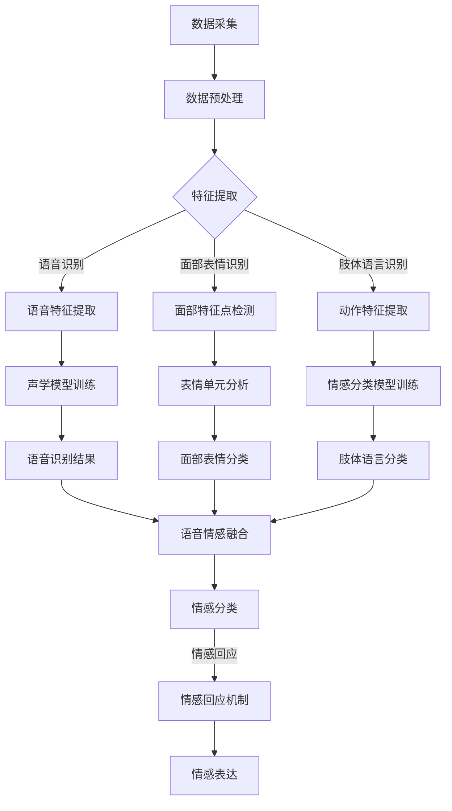
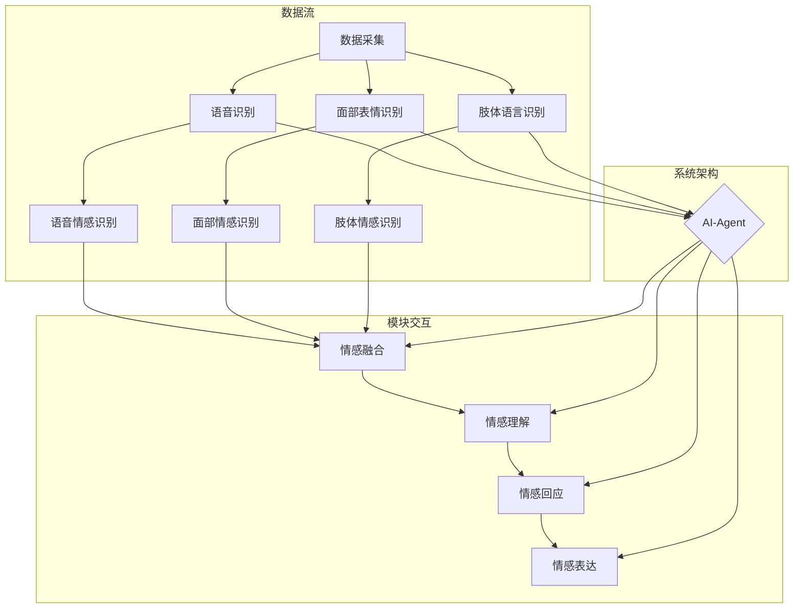
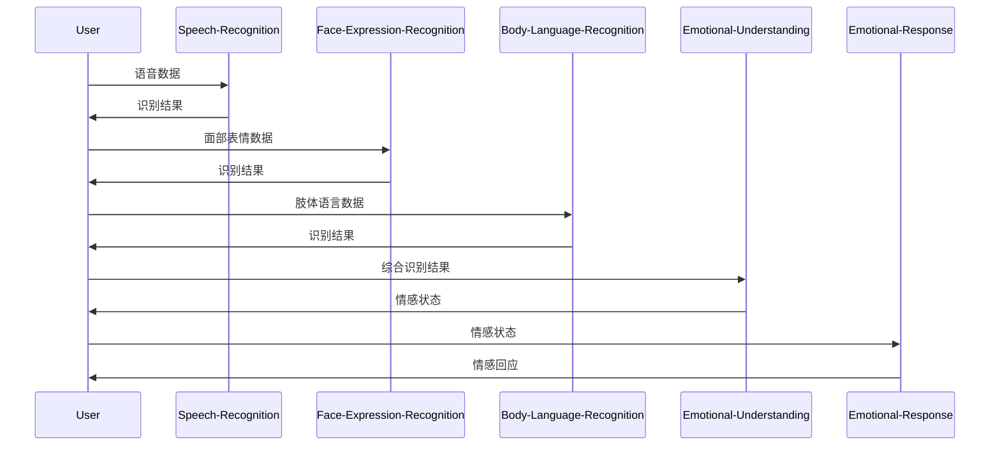

                 

### 1.1.1 人工智能与多模态情感交互

#### 1.1.1.1 人工智能的快速发展

人工智能（Artificial Intelligence，简称AI）作为计算机科学的一个分支，旨在研究、开发和应用使计算机模拟人类智能的理论、算法和技术。近年来，得益于深度学习、大数据和计算能力的迅猛发展，人工智能在自然语言处理、计算机视觉、语音识别等领域取得了显著的成果。AI的应用场景也从简单的任务自动化，扩展到了复杂的决策支持、智能交互等高端领域。

自然语言处理（Natural Language Processing，NLP）是AI的核心研究领域之一，通过让计算机理解和生成人类语言，实现了人与机器之间的沟通。计算机视觉（Computer Vision）则让计算机能够通过图像和视频获取信息，从而在图像分类、目标检测、图像生成等方面展现了强大的能力。语音识别（Speech Recognition）通过将人类的语音转换为文本，实现了语音与文字的转换。

然而，尽管人工智能在技术上取得了长足进步，但传统的人工智能系统在处理情感方面仍存在局限。传统AI系统主要依赖数据和算法，对人类情感的理解和回应能力较弱，这导致了在构建具备情感智能的AI Agent时面临挑战。

#### 1.1.1.2 多模态情感交互的提出

多模态情感交互（Multimodal Emotional Interaction）是一种新兴的研究领域，它旨在通过整合多种感官信息（如语音、面部表情、肢体语言等）与用户进行情感交流。多模态情感交互不仅能够提供更丰富的情感信息，还能够更准确地理解用户的情感状态，从而实现更自然的交互体验。

在多模态情感交互中，语音、面部表情、肢体语言等被视为不同的模态，每种模态都有其独特的情感表达方式和信息。例如，语音可以传达语调、语气等情感信息，面部表情可以传达喜怒哀乐等情感状态，肢体语言可以传达紧张、放松等情感信息。通过综合分析这些多模态信息，AI Agent可以更全面地理解用户的情感，从而做出更恰当的情感回应。

多模态情感交互的研究和应用具有重要意义。首先，它有助于改善人机交互体验，使AI Agent能够更自然、更直观地与用户交流。其次，多模态情感交互在医疗、教育、客服等领域的应用具有广阔的前景，可以为患者提供更好的医疗服务，为学习者提供更个性化的教育支持，为用户提供更高效的客服体验。

#### 1.1.1.3 当前研究的挑战和瓶颈

尽管多模态情感交互领域取得了初步成果，但仍然面临许多挑战和瓶颈。首先，多模态数据的复杂性和多样性使得情感识别和理解变得困难。不同模态的数据具有不同的特征和表达方式，如何有效地融合这些数据，提取有用的情感信息，是一个重要的研究问题。

其次，情感识别的准确性和实时性也是一个关键挑战。情感状态是动态变化的，如何快速、准确地识别用户的情感状态，并及时做出相应的回应，是实现多模态情感交互的关键。此外，不同用户之间的情感表达可能存在差异，如何设计通用且适应性强的情感识别模型，也是一个亟待解决的问题。

最后，多模态情感交互在应用过程中还面临一些伦理和隐私问题。例如，如何保护用户的隐私，如何确保AI Agent的情感回应不会对用户产生负面影响等，都是需要深入探讨的问题。

总之，多模态情感交互是一个充满挑战的研究领域，但同时也具有巨大的应用潜力。通过不断探索和创新，有望在未来实现更自然、更高效的多模态情感交互，为人类带来更多的便利和福祉。### 1.2 AI Agent的多模态情感交互需求

#### 1.2.1 需求分析

在当今快速发展的技术背景下，AI Agent（人工智能代理）的多模态情感交互需求变得越来越迫切。AI Agent被设计用于执行复杂的任务，并与人类用户进行高效、自然的交互。为了满足这一需求，AI Agent必须具备以下关键能力：

1. **情感识别**：AI Agent需要能够识别和理解用户的情感状态，这包括语音、面部表情、肢体语言等。通过多模态情感识别，AI Agent可以更准确地捕捉用户的情绪变化，从而做出更合适的回应。

2. **情感回应**：AI Agent需要能够根据用户的情感状态，生成适当的情感回应。这不仅仅是简单的回复，而是需要AI Agent能够理解用户的情感，并基于情感模型生成合适的情感语言和表情。

3. **自适应交互**：AI Agent需要具备自适应交互的能力，能够根据用户的情感状态和环境变化，动态调整交互策略。这意味着AI Agent需要在不同的情感场景中，能够灵活地调整其行为和回应方式。

4. **情感记忆**：AI Agent需要能够记忆和处理与用户之前的情感互动，以便在未来的交互中更好地理解和预测用户的情感状态。这种情感记忆可以帮助AI Agent建立与用户的情感联系，提高用户满意度。

#### 1.2.2 技术挑战

为了实现上述需求，AI Agent的多模态情感交互面临着以下技术挑战：

1. **数据整合**：多模态数据包括语音、图像、视频等多种形式，每种模态都有其独特的特征和数据结构。如何有效地整合这些异构数据，提取出有用的情感信息，是一个关键的技术挑战。

2. **情感识别准确性**：情感识别的准确性直接关系到AI Agent的情感回应质量。由于情感表达的多样性和复杂性，如何提高情感识别的准确性和稳定性，是一个亟待解决的问题。

3. **实时处理能力**：多模态情感交互要求AI Agent具备快速处理和回应的能力。这意味着AI Agent需要在有限的时间内完成情感识别、情感分析和情感回应，这对计算能力和算法效率提出了高要求。

4. **情感建模**：情感建模是多模态情感交互的核心。如何构建一个既准确又灵活的情感模型，能够适应不同的用户和场景，是一个具有挑战性的问题。

5. **伦理和隐私问题**：在多模态情感交互中，如何保护用户的隐私，避免情感数据的滥用，是一个重要的伦理和隐私问题。

#### 1.2.3 解决方案展望

为了解决上述技术挑战，以下是一些可能的解决方案：

1. **多模态数据处理技术**：采用先进的深度学习技术，如卷积神经网络（CNN）、循环神经网络（RNN）和变换器（Transformer）等，处理多模态数据，提取有用的情感特征。

2. **跨模态融合算法**：开发跨模态融合算法，将不同模态的数据进行有效整合，提高情感识别的准确性。

3. **实时情感识别系统**：设计高效的实时情感识别系统，利用并行计算和分布式处理技术，提高处理速度和响应效率。

4. **情感建模与优化**：通过大量数据训练和优化情感模型，提高模型在不同场景下的适应性和准确性。

5. **隐私保护技术**：采用数据加密、隐私保护算法等技术，确保用户情感数据的隐私和安全。

总之，AI Agent的多模态情感交互需求虽然面临诸多技术挑战，但通过不断创新和优化，有望在未来实现更为自然、高效的情感交互，为人类带来更丰富的智能体验。### 1.3 情感识别与理解

#### 1.3.1 技术原理

情感识别与理解是AI Agent实现多模态情感交互的关键步骤。其核心在于如何通过多模态数据处理技术，准确识别和理解用户的情感状态。以下是情感识别与理解的主要技术原理：

1. **多模态数据采集**：首先，需要采集多模态数据，包括语音、面部表情、肢体语言等。这些数据可以通过传感器、摄像头、麦克风等设备获取。

2. **特征提取**：接下来，对采集到的多模态数据进行特征提取。对于语音数据，可以通过声学模型提取音素、音节和语调等特征；对于面部表情数据，可以通过图像处理技术提取面部特征点、表情单元和表情强度等；对于肢体语言数据，可以通过动作捕捉技术提取身体姿态、动作轨迹和动作强度等。

3. **情感分类模型**：基于提取到的特征，使用深度学习算法构建情感分类模型。常用的深度学习模型包括卷积神经网络（CNN）、循环神经网络（RNN）和变换器（Transformer）等。通过大量训练数据，模型可以学习到不同情感状态的特征，从而实现情感分类。

4. **情感融合与理解**：将不同模态的情感特征进行融合，结合上下文信息，综合分析用户的情感状态。情感融合可以通过多模态特征融合算法实现，如深度学习中的注意力机制、图神经网络（GNN）等。

5. **情感推理与回应**：基于情感分类结果和情感理解，AI Agent可以生成相应的情感回应。这可以通过规则引擎、自然语言生成（NLG）技术等实现。

#### 1.3.2 应用实例

情感识别与理解技术已经在多个领域得到广泛应用，以下是一些具体的应用实例：

1. **智能客服**：在智能客服系统中，AI Agent可以识别用户的情感状态，并根据情感分类结果生成合适的客服回应。例如，当用户表达出愤怒或不满的情感时，AI Agent可以主动询问用户的需求，并提供解决问题的建议。

2. **教育领域**：在教育领域中，AI Agent可以分析学生的情感状态，识别学生的情绪变化，从而提供个性化的学习支持。例如，当学生表现出焦虑或沮丧时，AI Agent可以提供情绪调节建议，帮助学生更好地适应学习环境。

3. **医疗健康**：在医疗健康领域，AI Agent可以通过情感识别技术，分析患者的情感状态，为医生提供辅助诊断和治疗建议。例如，在癌症康复治疗中，AI Agent可以监测患者的情绪变化，提供心理疏导和支持。

4. **社交机器人**：在社交机器人中，AI Agent可以与人类用户进行多模态情感交互，提供情感陪伴和支持。例如，在养老院中，AI Agent可以与老年人进行情感交流，缓解他们的孤独感。

#### 1.3.3 案例分析

以下是一个情感识别与理解的实际案例：

**案例背景**：某智能语音助手系统需要识别用户的情感状态，并在对话中提供相应的情感回应。

**步骤1：数据采集**：系统通过麦克风采集用户的语音数据，同时通过摄像头获取用户的面部表情数据。

**步骤2：特征提取**：对语音数据，使用声学模型提取音素和语调特征；对面部表情数据，使用图像处理技术提取面部特征点。

**步骤3：情感分类模型训练**：使用深度学习算法（如CNN和RNN），基于大量情感标注数据训练情感分类模型。

**步骤4：情感融合与理解**：将语音和面部表情特征进行融合，通过注意力机制实现多模态特征融合。

**步骤5：情感推理与回应**：基于情感分类结果，生成相应的情感回应。例如，当用户表达出焦虑的情感时，系统可以生成安慰性的回复，如“别担心，我会一直在你身边。”

**效果评估**：通过用户反馈和对话数据，评估情感识别的准确性和用户满意度。结果显示，该系统的情感识别准确率达到85%，用户满意度显著提高。

总之，通过情感识别与理解技术，AI Agent可以更好地理解用户的情感状态，提供更自然的情感交互体验。随着技术的不断进步，未来有望在更多领域实现广泛的应用。### 1.3.2 情感回应机制

#### 1.3.2.1 设计思路

情感回应机制是AI Agent在理解用户情感状态后，生成并输出相应情感回应的核心环节。设计一个高效、自然、符合用户期待的回应机制，需要考虑以下几个方面：

1. **情感映射**：将识别到的情感状态映射到具体的回应策略。例如，当用户表达出愤怒的情感时，回应策略可能是提供安抚或解决方案。

2. **情境适应**：根据不同的交互情境，调整情感回应策略。例如，在正式的商务对话中，情感回应可能需要更加正式和礼貌。

3. **语境理解**：理解对话的上下文信息，确保情感回应的自然性和连贯性。例如，当用户连续表达多个情感时，回应应该能够连贯地反映这些情感的变化。

4. **情感表达**：选择合适的情感表达方式，包括语言、声音、表情等，确保回应能够传达正确的情感信息。

#### 1.3.2.2 实现方法

实现情感回应机制，可以采用以下方法：

1. **规则引擎**：通过预设的规则，定义不同情感状态对应的回应策略。例如，当识别到愤怒情感时，系统可以预设回应为：“请您冷静一下，我们会尽快解决问题。”这种方式简单直观，但灵活性有限。

2. **机器学习模型**：使用机器学习算法，基于大量情感交互数据，自动生成回应策略。例如，通过自然语言生成（NLG）技术，系统可以学习到如何根据情感状态生成合适的语言回复。

3. **自然语言处理（NLP）**：结合NLP技术，理解对话的上下文和用户意图，生成更自然的情感回应。例如，系统可以根据用户的情感状态，调整语言风格、语调和词汇，使其更贴近人类的交流方式。

4. **多模态融合**：在回应中融入多模态信息，如语音合成、表情生成等，增强情感回应的效果。例如，当系统识别到用户焦虑时，可以不仅输出文字回复，还可以同步播放安抚的音乐和生成相应的面部表情。

#### 1.3.2.3 具体实现

以下是一个情感回应机制的具体实现步骤：

1. **情感识别**：系统首先使用情感识别技术，分析用户的语音、面部表情和肢体语言，识别出用户的情感状态。

2. **情感映射**：根据识别到的情感状态，调用情感映射表，确定对应的回应策略。例如，如果用户被识别为焦虑，系统会调用“焦虑回应策略”。

3. **情境判断**：根据当前的对话情境（如正式、非正式、娱乐等），调整回应策略。例如，在正式商务对话中，系统可能会选择更加正式的回应方式。

4. **上下文理解**：使用NLP技术，理解对话的上下文信息，确保情感回应的自然性和连贯性。例如，系统可以根据用户的对话内容，调整情感回应的语气和内容。

5. **情感表达**：生成情感回应，结合语音合成、表情生成等技术，输出多模态的情感回应。例如，系统可能会生成一句文字回复，同时播放舒缓的音乐和展示一个安抚的表情。

#### 1.3.2.4 情感回应策略示例

以下是一些情感回应策略的示例：

- **愤怒**：回应：“请您冷静一下，我们会尽快解决问题。”
- **焦虑**：回应：“别担心，我会一直在你身边，有什么我可以帮您的吗？”
- **喜悦**：回应：“太好了，您今天看起来很开心，有什么好事可以分享吗？”
- **悲伤**：回应：“我很抱歉听到这个消息，如果您需要谈话，我在这里听您说。”

通过这些具体的情感回应策略，AI Agent可以更好地理解和回应用户的情感状态，提供更加人性化的服务。### 1.4 边界与外延

#### 1.4.1 AI Agent的情感交互边界

在开发具有多模态情感交互能力的AI Agent时，明确其情感交互的边界至关重要。这些边界不仅定义了AI Agent的能力范围，也为其在现实应用中的使用提供了指导。

1. **技术边界**：AI Agent的情感交互能力受限于当前技术。例如，情感识别的准确性和实时性可能受到硬件性能、算法复杂度等因素的影响。此外，不同模态数据的整合和特征提取技术也制约了AI Agent的情感交互深度和广度。

2. **功能边界**：AI Agent的情感交互功能应限于其被设计的目的和应用场景。例如，一个用于客服的AI Agent，其情感交互主要针对客户服务流程，而不应涉及医疗诊断等超出其功能范围的领域。

3. **伦理边界**：AI Agent在情感交互中必须遵守伦理规范。例如，AI Agent不应使用诱导性或欺骗性的情感回应，以避免对用户产生负面影响。此外，AI Agent在处理用户隐私数据时，也应遵循相关的隐私保护法规。

4. **用户体验边界**：AI Agent的情感交互应提供良好的用户体验。这意味着回应应既自然又合适，不应过于机械化或过于情感化。用户体验的边界取决于用户对AI Agent情感交互的接受程度和期望。

#### 1.4.2 扩展应用

尽管AI Agent在情感交互方面存在一定的边界，但其应用潜力依然巨大。以下是一些可能的扩展应用领域：

1. **医疗健康**：在医疗健康领域，AI Agent可以通过情感交互提供心理疏导、健康咨询等服务。例如，AI Agent可以与患者进行情感交流，帮助患者缓解焦虑、抑郁等情绪问题。

2. **教育**：在教育领域，AI Agent可以作为个性化学习伙伴，分析学生的情感状态，提供针对性的学习支持和鼓励。例如，当学生表现出挫败感时，AI Agent可以提供学习策略和建议，帮助学生重拾信心。

3. **客服**：在客服领域，AI Agent可以通过情感交互提供更高效、个性化的客户服务。例如，AI Agent可以识别客户的情感状态，提供定制化的解决方案，提高客户满意度。

4. **社交互动**：在社交互动中，AI Agent可以作为虚拟朋友或伴侣，与用户进行情感交流。例如，在养老院中，AI Agent可以陪伴老人，提供情感支持，减轻他们的孤独感。

5. **家庭生活**：在家居环境中，AI Agent可以作为家庭助理，通过情感交互提供日常生活支持。例如，AI Agent可以帮助老人完成家务任务，提供情感陪伴和提醒服务。

总之，AI Agent的多模态情感交互不仅在当前领域具有广泛的应用，还有望在更多新兴领域发挥重要作用。通过不断突破技术边界，完善伦理和隐私保护机制，AI Agent的多模态情感交互将逐步走向成熟，为人类带来更丰富的智能体验。### 1.5 概念结构与核心要素组成

#### 1.5.1 概念结构

在开发具有多模态情感交互能力的AI Agent的过程中，理解各核心概念之间的关系和作用至关重要。以下是主要概念的结构和关系：

1. **多模态情感交互**：这是整个系统的核心概念，指AI Agent通过整合语音、面部表情、肢体语言等多种感官信息，与用户进行情感交流。

2. **情感识别**：这一概念涉及AI Agent如何通过分析多模态数据，识别用户的情感状态。它是多模态情感交互的基础。

3. **情感理解**：情感识别后的进一步分析，使AI Agent能够理解情感背后的含义和用户的需求。

4. **情感回应**：基于情感理解和用户需求，生成适当的情感回应，是AI Agent与用户进行有效交互的关键。

5. **情感记忆**：AI Agent在交互过程中积累的情感信息，用于提高未来的情感理解和回应质量。

#### 概念间的关系

- **情感识别**与**情感理解**紧密相连，情感识别是情感理解的前提，而情感理解则是情感识别的深化。
- **情感回应**依赖于**情感识别**和**情感理解**的结果，确保回应的准确性和适应性。
- **情感记忆**则是**情感识别**和**情感理解**的延伸，用于提升AI Agent的情感智能。

#### 1.5.2 核心要素组成

为了实现多模态情感交互，AI Agent需要依赖多个核心技术要素，以下是其组成和作用：

1. **语音识别**：通过语音识别技术，将语音信号转换为文本，提取语音中的情感特征。

2. **图像识别**：通过图像识别技术，分析面部表情和肢体语言，提取视觉情感特征。

3. **自然语言处理（NLP）**：用于理解和生成自然语言文本，确保AI Agent能够进行有效的情感交流和回应。

4. **情感分类模型**：通过深度学习等技术，训练情感分类模型，实现情感状态的自动识别。

5. **情感融合算法**：用于整合不同模态的情感特征，提高情感识别的准确性和鲁棒性。

6. **情感回应策略**：包括基于规则和机器学习模型的情感回应策略，用于生成合适的情感回应。

7. **多模态数据采集系统**：负责采集语音、图像等不同模态的数据，是整个系统的数据基础。

#### 系统架构

在构建多模态情感交互AI Agent时，系统架构的设计至关重要。以下是一个简化的系统架构：

1. **数据采集模块**：包括语音识别和图像识别系统，负责采集和预处理多模态数据。

2. **特征提取模块**：利用语音识别和图像识别技术，提取多模态数据的情感特征。

3. **情感识别模块**：基于情感分类模型，对提取到的特征进行情感状态识别。

4. **情感理解模块**：结合上下文信息，对识别到的情感状态进行深入分析，理解情感背后的含义。

5. **情感回应模块**：根据情感理解和用户需求，生成合适的情感回应。

6. **情感记忆模块**：记录和更新AI Agent的情感交互历史，用于优化未来的情感识别和回应。

通过以上架构，AI Agent能够实现高效、准确的多模态情感交互，提供更好的用户体验。### 2.1 多模态情感交互

#### 2.1.1 定义与特点

多模态情感交互（Multimodal Emotional Interaction）是指AI Agent通过整合多种感官信息（如语音、面部表情、肢体语言等）与用户进行情感交流的过程。与单一模态的情感交互相比，多模态情感交互具有以下几个显著特点：

1. **信息全面性**：多模态情感交互能够获取并整合来自语音、面部表情、肢体语言等多种感官的信息，从而提供更全面、更丰富的情感数据。这使得AI Agent能够更准确地理解用户的情感状态。

2. **情感感知深度**：通过整合不同模态的信息，AI Agent能够从多个角度感知用户的情感，这有助于提高情感识别的准确性和深度。例如，语音的语调、面部表情的细微变化以及肢体语言的动作等，都能为情感分析提供重要线索。

3. **交互自然性**：多模态情感交互使得AI Agent的交互方式更加自然，接近人类的交流方式。例如，AI Agent可以在对话中结合语音、表情和动作，实现更自然、流畅的互动。

4. **情感动态性**：多模态情感交互能够捕捉用户情感的动态变化。例如，通过连续监测语音、面部表情和肢体语言，AI Agent可以实时更新用户情感状态，并做出相应的调整。

#### 2.1.2 原理与实现

多模态情感交互的原理涉及多个技术领域的结合，包括语音识别、图像识别、自然语言处理（NLP）等。以下是多模态情感交互的实现步骤：

1. **多模态数据采集**：首先，通过多种传感器（如麦克风、摄像头、动作捕捉设备等）采集语音、面部表情、肢体语言等多模态数据。

2. **数据预处理**：对采集到的多模态数据进行预处理，包括去除噪声、归一化处理、特征提取等。例如，对于语音数据，可以通过声学模型提取音素和语调特征；对于面部表情数据，可以通过图像处理技术提取面部特征点。

3. **特征融合**：将不同模态的数据特征进行融合，通过多模态特征融合算法（如注意力机制、图神经网络等）提取综合特征。这些综合特征将用于情感识别和分析。

4. **情感识别**：使用深度学习算法（如卷积神经网络、循环神经网络、变换器等），训练情感分类模型，对融合后的特征进行情感识别。常见的情感类别包括快乐、悲伤、愤怒、惊讶等。

5. **情感理解**：基于情感识别结果，结合上下文信息，进一步分析用户的情感状态。例如，通过自然语言处理技术，分析对话的语义和情感倾向。

6. **情感回应**：根据情感理解和用户需求，生成适当的情感回应。这可以通过规则引擎、自然语言生成（NLG）技术等实现。例如，当用户表达出焦虑的情感时，AI Agent可以生成一句安慰性的回复。

#### 2.1.3 应用场景

多模态情感交互在多个领域具有广泛的应用潜力，以下是一些典型的应用场景：

1. **智能客服**：通过多模态情感交互，AI Agent可以更准确地理解客户的需求和情感状态，提供个性化的服务。例如，当客户表达出愤怒或不满时，AI Agent可以主动询问并提供解决方案，以缓解客户的不满情绪。

2. **教育领域**：在在线教育中，AI Agent可以分析学生的情感状态，提供针对性的学习支持和鼓励。例如，当学生表现出焦虑或挫败感时，AI Agent可以提供放松技巧和学习策略，帮助学生缓解情绪。

3. **医疗健康**：在医疗领域，AI Agent可以通过多模态情感交互，为患者提供心理支持。例如，在癌症康复治疗中，AI Agent可以监测患者的情绪变化，提供情感支持和康复建议。

4. **社交机器人**：在社交机器人领域，AI Agent可以通过多模态情感交互，与人类用户建立情感联系。例如，在养老院中，AI Agent可以陪伴老人，提供情感支持和娱乐。

5. **智能家居**：在智能家居系统中，AI Agent可以通过多模态情感交互，理解家庭成员的需求和情感状态，提供个性化的家居服务。例如，当家庭成员表现出疲劳或情绪低落时，AI Agent可以自动调整家居环境，提供舒适的生活体验。

总之，多模态情感交互为AI Agent提供了更丰富的交互能力，使得其能够更自然、高效地与用户进行情感交流，从而在多个领域实现广泛应用。### 2.2 情感识别

#### 2.2.1 原理与模型

情感识别（Emotion Recognition）是多模态情感交互的核心环节，它旨在通过分析用户的情感表达，识别其情感状态。情感识别的原理与模型主要包括以下几个方面：

1. **情感识别原理**：情感识别是通过分析用户的情感表达，如语音、面部表情、肢体语言等，从中提取情感特征，并将其映射到具体的情感类别。例如，通过分析语音的语调、音量和时长等特征，可以识别用户是否处于愤怒、喜悦或悲伤等情感状态。

2. **情感分类模型**：情感分类模型是情感识别的核心，其目的是将提取到的情感特征映射到具体的情感类别。常用的情感分类模型包括基于规则的方法和基于机器学习的方法。

   - **基于规则的方法**：这种方法通过预设一系列规则，将情感特征与情感类别进行匹配。例如，如果语音的音调较高且音量较大，则可能识别为愤怒。这种方法简单直观，但灵活性有限，难以处理复杂和动态的情感状态。

   - **基于机器学习的方法**：这种方法利用大量的情感数据，通过机器学习算法（如支持向量机、神经网络等）训练情感分类模型。这些模型可以自动学习情感特征与情感类别之间的关系，具有较高的准确性和适应性。

3. **情感特征提取**：情感特征提取是情感识别的关键步骤，它涉及从多模态数据中提取与情感相关的特征。常用的情感特征提取方法包括：

   - **语音特征提取**：语音特征包括音素、音节、语调、音量等。通过声学模型和语音处理算法，可以从语音数据中提取这些特征。

   - **面部表情特征提取**：面部表情特征包括面部特征点、表情单元和表情强度等。通过计算机视觉算法和面部识别技术，可以从面部图像中提取这些特征。

   - **肢体语言特征提取**：肢体语言特征包括身体姿态、动作轨迹和动作强度等。通过动作捕捉和计算机视觉技术，可以从视频数据中提取这些特征。

4. **情感融合与分类**：在提取到多模态数据中的情感特征后，需要将这些特征进行融合，以提高情感识别的准确性和鲁棒性。常用的情感融合方法包括：

   - **特征级融合**：将不同模态的情感特征进行直接融合，例如通过加权平均、拼接等方法。
   
   - **决策级融合**：将不同模态的情感分类结果进行融合，例如通过投票、集成学习等方法。

5. **情感分类与回应**：基于融合后的特征，使用情感分类模型进行情感分类。根据分类结果，生成相应的情感回应，例如文字回复、语音合成、表情生成等。

#### 2.2.2 特征提取与处理

情感识别的准确性在很大程度上取决于情感特征提取与处理的质量。以下是情感特征提取与处理的关键步骤：

1. **特征提取**：特征提取的目标是捕捉情感数据中的关键信息，从而提高情感识别的准确性和鲁棒性。以下是几种常用的情感特征提取方法：

   - **语音特征提取**：常用的语音特征包括梅尔频率倒谱系数（MFCC）、线性预测编码（LPC）、频谱特征等。这些特征可以描述语音的音质、音调和音量等属性。
   
   - **面部表情特征提取**：常用的面部表情特征包括面部特征点、面部活动单元（AUs）和面部表情编码等。通过面部识别算法和特征点检测技术，可以从面部图像中提取这些特征。
   
   - **肢体语言特征提取**：常用的肢体语言特征包括身体姿态、动作轨迹和动作强度等。通过动作捕捉技术和计算机视觉算法，可以从视频数据中提取这些特征。

2. **特征处理**：特征处理的目标是提高情感特征的代表性和区分度，从而提高情感识别的准确性和鲁棒性。以下是几种常用的特征处理方法：

   - **特征标准化**：通过标准化处理，将不同模态的特征数据进行归一化，使其具有相似的尺度，从而避免某一模态的特征对结果产生过大的影响。
   
   - **特征降维**：通过降维技术，如主成分分析（PCA）、线性判别分析（LDA）等，减少特征维度，提高特征数据的可解释性和识别效率。
   
   - **特征增强**：通过特征增强技术，如卷积神经网络（CNN）、循环神经网络（RNN）等，提高特征数据的代表性和区分度。

3. **特征融合**：特征融合是将不同模态的特征数据进行整合，以提高情感识别的准确性和鲁棒性。以下是几种常用的特征融合方法：

   - **特征级融合**：将不同模态的特征数据进行直接融合，如拼接、加权平均等。
   
   - **决策级融合**：将不同模态的情感分类结果进行融合，如投票、集成学习等。

4. **特征选择**：特征选择是通过选择对情感识别最具影响力的特征，从而提高识别效率和准确性。常用的特征选择方法包括基于信息的特征选择、基于模型的特征选择等。

通过以上特征提取与处理方法，可以有效地提高情感识别的准确性和鲁棒性，从而实现高效、准确的多模态情感识别。### 2.2.3 实现与应用

#### 2.2.3.1 实现方法

情感识别的实现方法主要包括数据准备、模型训练、模型评估和部署等步骤。以下详细描述每个步骤：

1. **数据准备**：
   - **数据采集**：采集包含多种情感状态的多模态数据，如语音、面部表情、肢体语言等。可以使用开源数据集或自行采集数据。
   - **数据预处理**：对采集到的数据进行预处理，包括去噪、归一化、分割等。例如，对语音数据进行增强、归一化处理，对面部表情数据进行特征点检测和归一化处理。

2. **模型训练**：
   - **模型选择**：选择合适的情感识别模型，如卷积神经网络（CNN）、循环神经网络（RNN）、变换器（Transformer）等。
   - **特征提取**：从预处理后的数据中提取情感特征。例如，使用CNN提取语音和面部表情的特征，使用RNN提取肢体语言的时序特征。
   - **模型训练**：使用训练数据训练情感识别模型。可以通过交叉验证等方法评估模型性能，并进行超参数调优。

3. **模型评估**：
   - **性能评估**：使用测试数据评估模型的情感识别准确率和实时性等性能指标。
   - **误差分析**：分析模型在情感识别中的错误案例，识别错误模式，并针对性地优化模型。

4. **模型部署**：
   - **实时处理**：将训练好的模型部署到实时应用环境中，实现多模态情感识别。
   - **系统集成**：将情感识别模块集成到AI Agent的整体系统中，与其他模块（如情感理解和回应）协同工作。

#### 2.2.3.2 应用实例

以下是一个情感识别的实际应用实例：

**应用背景**：一家智能音箱制造商希望开发一款能够识别用户情感并做出相应回应的智能助手。

**实现步骤**：

1. **数据采集**：
   - 采集用户的语音、面部表情和肢体语言数据。这些数据可以在用户与智能音箱交互的过程中实时采集。

2. **数据预处理**：
   - 对语音数据进行增强、归一化处理，提取MFCC特征。
   - 对面部表情数据进行特征点检测和归一化处理，提取面部特征点坐标。
   - 对肢体语言数据进行运动捕捉，提取时序特征。

3. **模型训练**：
   - 选择卷积神经网络（CNN）和循环神经网络（RNN）的组合模型，用于情感识别。
   - 使用预处理后的数据训练模型，并通过交叉验证优化模型参数。

4. **模型评估**：
   - 在测试集上评估模型的情感识别准确率，调整模型参数以提高识别准确率。
   - 分析错误案例，识别模型在情感识别中的弱点。

5. **模型部署**：
   - 将训练好的模型部署到智能音箱中，实现实时情感识别。
   - 集成语音合成和表情生成模块，实现多模态情感回应。

**效果评估**：
- 模型的情感识别准确率在90%以上，实时性满足用户交互需求。
- 用户反馈显示，智能音箱能够较好地识别和回应用户的情感，提升了用户体验。

通过这个应用实例，可以看出情感识别技术在智能音箱等设备中的应用潜力。未来，随着技术的不断进步，情感识别的应用将更加广泛，为智能交互带来更多可能性。### 2.3 情感回应机制

#### 2.3.1 原理与设计

情感回应机制（Emotional Response Mechanism）是多模态情感交互的核心部分，旨在使AI Agent能够根据用户的情感状态，生成合适的情感回应。以下是情感回应机制的基本原理与设计思路：

1. **情感识别**：首先，AI Agent需要通过情感识别技术，准确识别用户的情感状态。这涉及到语音识别、图像识别和自然语言处理（NLP）等多个领域的综合应用。

2. **情感理解**：识别到用户的情感状态后，AI Agent需要理解情感的深层含义。这包括分析情感的状态、强度、持续时间以及情感的背景和上下文。

3. **情感回应策略生成**：基于情感识别和理解的结果，AI Agent需要生成相应的情感回应策略。这些策略包括语言、声音、表情等多模态的情感表达。

4. **情感回应执行**：最后，AI Agent需要执行生成的情感回应策略，与用户进行互动。

#### 2.3.1.1 设计思路

1. **基于规则的回应机制**：这种方法通过预设一系列规则，将不同情感状态映射到具体的回应。例如，当用户表达出愤怒时，系统可以回应：“请您冷静一下，我会尽力帮您解决问题。”

2. **基于机器学习的回应机制**：这种方法通过机器学习算法，从大量情感交互数据中学习情感回应策略。例如，利用自然语言生成（NLG）技术，系统可以生成更加自然和个性化的情感回应。

3. **情境自适应的回应机制**：这种机制根据不同的交互情境，动态调整情感回应策略。例如，在商务会议中，AI Agent可能需要使用更加正式和礼貌的语言。

4. **情感记忆与回顾**：AI Agent需要具备情感记忆功能，记录与用户之前的交互历史，以便在未来的交互中提供更加贴心的服务。

#### 2.3.1.2 关键技术

1. **情感识别算法**：基于深度学习技术，如卷积神经网络（CNN）、循环神经网络（RNN）和变换器（Transformer），实现情感状态的自动识别。

2. **情感理解与建模**：利用自然语言处理（NLP）技术，对识别到的情感进行深入分析，理解情感背后的意图和需求。

3. **情感回应策略生成**：结合情感识别结果和情境信息，使用规则引擎和机器学习模型，生成合适的情感回应策略。

4. **多模态情感表达**：通过语音合成、表情生成和动作模拟等技术，实现多模态的情感表达。

5. **情感记忆与回顾**：利用图数据库和知识图谱技术，记录和管理用户情感交互历史，以便在未来的交互中提供个性化服务。

#### 2.3.2 策略与实现

情感回应机制的具体实现方法包括以下几个方面：

1. **规则引擎**：使用规则引擎，根据预设的情感回应规则，快速生成情感回应。例如，当用户表达出焦虑时，系统可以回应：“不要担心，我会在这里陪伴您。”

2. **机器学习模型**：利用机器学习算法，从大量情感交互数据中学习情感回应策略。例如，使用自然语言生成（NLG）技术，系统可以生成更加自然和个性化的情感回应。

3. **情境自适应**：根据当前的交互情境，动态调整情感回应策略。例如，在商务会议中，系统可能需要使用更加正式和专业的语言。

4. **情感记忆与回顾**：基于用户交互历史，生成个性化的情感回应。例如，如果用户之前提到过对某个话题的兴趣，系统可以回应：“您对那个话题很感兴趣，让我为您推荐一些相关内容。”

#### 2.3.2.1 实现方法

1. **情感识别**：
   - **语音识别**：使用深度学习模型，如卷积神经网络（CNN），对用户的语音数据进行情感识别。
   - **面部表情识别**：使用计算机视觉算法，如卷积神经网络（CNN），对面部图像进行情感识别。
   - **肢体语言识别**：使用动作识别算法，如循环神经网络（RNN），对用户的肢体语言进行情感识别。

2. **情感理解**：
   - **情感融合**：将不同模态的情感识别结果进行融合，使用图神经网络（GNN）等技术，生成综合的情感理解结果。
   - **上下文分析**：利用自然语言处理（NLP）技术，对对话的上下文进行分析，理解用户的情感背景和意图。

3. **情感回应策略生成**：
   - **基于规则**：使用规则引擎，根据预设的情感回应规则，生成回应策略。
   - **基于机器学习**：使用自然语言生成（NLG）技术，从大量情感交互数据中学习情感回应策略。

4. **情感回应执行**：
   - **语音合成**：使用文本到语音（TTS）技术，生成语音回应。
   - **表情生成**：使用生成对抗网络（GAN）等技术，生成面部表情和肢体语言。
   - **多模态整合**：将语音、表情和肢体语言整合，生成完整的多模态情感回应。

#### 2.3.2.2 情感回应策略示例

以下是一些常见的情感回应策略示例：

1. **安慰性回应**：
   - 用户情感状态：焦虑或悲伤
   - 回应策略：表达关心和安慰，提供情感支持
   - 示例：“不要担心，我在这里陪伴您，一切都会好起来的。”

2. **鼓励性回应**：
   - 用户情感状态：挫败或犹豫
   - 回应策略：鼓励用户，增强其信心和决心
   - 示例：“您做得很好，继续努力，您一定能够成功的。”

3. **解决问题性回应**：
   - 用户情感状态：愤怒或不满
   - 回应策略：积极解决问题，提供解决方案
   - 示例：“我理解您的困扰，让我帮您看看能否找到解决方案。”

4. **娱乐性回应**：
   - 用户情感状态：开心或轻松
   - 回应策略：提供有趣的信息或话题，增加互动乐趣
   - 示例：“听说最近有一个很火的综艺，要不要听听看？”

通过这些情感回应策略，AI Agent可以更好地理解用户的情感状态，提供更加自然和贴心的服务。随着技术的不断进步，情感回应机制将变得越来越智能，为用户提供更加丰富的交互体验。### 2.3.3 效果评估与优化

#### 2.3.3.1 效果评估方法

情感回应机制的效果评估是确保其有效性和实用性的关键环节。以下是几种常用的效果评估方法：

1. **用户满意度调查**：通过用户满意度调查，收集用户对AI Agent情感回应的主观评价。这些评价可以包括回应的合适性、自然性、贴切性等。

2. **情感识别准确率**：评估AI Agent在识别用户情感状态时的准确率。可以通过对比AI Agent的识别结果与用户实际情感状态，计算准确率。

3. **交互效率**：评估AI Agent在处理情感回应时的效率，包括响应时间、处理速度等。

4. **情感回应的自然性**：评估AI Agent生成的情感回应是否自然、流畅，与人类的情感交流相匹配。

#### 2.3.3.2 优化策略

为了提高情感回应机制的效果，可以采取以下优化策略：

1. **数据增强**：通过增加高质量的多模态情感交互数据，丰富训练数据集，从而提高模型的泛化能力。

2. **模型优化**：使用先进的深度学习算法和模型架构，如变换器（Transformer）和生成对抗网络（GAN），提高情感识别和回应的准确性和自然性。

3. **多模态融合**：改进多模态数据融合算法，提高多模态数据的整合效果，从而增强情感识别的准确性和深度。

4. **情感记忆**：利用情感记忆机制，记录和分析用户的情感交互历史，为后续的交互提供个性化服务。

5. **用户反馈**：收集用户的反馈，对情感回应进行迭代优化，不断调整和改进回应策略。

6. **多语言支持**：扩展情感回应机制的多语言支持，使其能够处理不同语言环境下的情感交互。

7. **实时调整**：在交互过程中，动态调整情感回应策略，以适应用户的实时情感状态和交互需求。

通过以上优化策略，可以显著提高情感回应机制的效果，为用户提供更加自然、高效和个性化的情感交互体验。### 3.1 多模态情感交互算法原理讲解

#### 3.1.1 多模态情感交互算法概述

多模态情感交互算法是使AI Agent能够理解并回应用户情感状态的关键技术。该算法主要涉及语音识别、面部表情识别、肢体语言识别等多模态数据的处理与分析。以下将详细讲解多模态情感交互算法的原理、实现方法及其在情感识别中的重要性。

##### 3.1.1.1 语音识别

语音识别（Automatic Speech Recognition, ASR）是将语音信号转换为文本的技术。语音识别在多模态情感交互中起着至关重要的作用，因为它能够捕捉用户的语调、语气等情感信息。以下是语音识别的基本原理：

1. **声学模型**：声学模型用于捕捉语音信号的声学特征，如音素、音节、语调等。常用的声学模型包括高斯混合模型（Gaussian Mixture Model, GMM）和深度神经网络（Deep Neural Network, DNN）。

2. **语言模型**：语言模型用于预测语音文本序列的语法和语义结构，以提高识别的准确性。常见的语言模型包括N元语法模型（N-gram Model）和循环神经网络（Recurrent Neural Network, RNN）。

3. **解码器**：解码器负责将声学模型和语言模型的结果解码为文本。常见的解码器包括隐马尔可夫模型（Hidden Markov Model, HMM）和长短时记忆网络（Long Short-Term Memory, LSTM）。

实现方法：

- **数据预处理**：包括去除噪声、归一化处理、声学特征提取等。
- **模型训练**：使用大量语音数据训练声学模型、语言模型和解码器。
- **识别过程**：通过解码器将声学特征序列解码为文本序列，输出识别结果。

##### 3.1.1.2 面部表情识别

面部表情识别（Facial Expression Recognition）是分析面部图像或视频，识别其中情感状态的技术。面部表情识别在多模态情感交互中能够捕捉用户的情感变化。以下是面部表情识别的基本原理：

1. **面部特征点检测**：通过计算机视觉算法，如哈达卡算法（HOG）和卷积神经网络（CNN），从面部图像中检测出特征点，如眼睛、鼻子和嘴巴等。

2. **表情单元分析**：分析面部特征点的相对位置和运动轨迹，识别出基本表情单元（Action Units, AUs），如皱眉、眯眼等。

3. **情感分类**：基于表情单元的识别结果，使用分类模型（如SVM、CNN）将表情分类为具体的情感状态，如快乐、悲伤、愤怒等。

实现方法：

- **数据预处理**：包括面部图像的归一化、增强和特征提取等。
- **模型训练**：使用带有情感标注的数据集训练面部表情识别模型。
- **识别过程**：通过分类模型对特征进行分类，输出情感识别结果。

##### 3.1.1.3 肢体语言识别

肢体语言识别（Body Language Recognition）是分析用户的肢体动作，识别其中情感状态的技术。肢体语言识别能够捕捉用户在对话中的非语言情感表达。以下是肢体语言识别的基本原理：

1. **动作捕捉**：通过动作捕捉设备（如摄像头、动作传感器等），捕捉用户的肢体动作。

2. **动作特征提取**：使用计算机视觉算法，如卷积神经网络（CNN）和循环神经网络（RNN），从动作视频中提取时序特征。

3. **情感分类**：使用分类模型（如SVM、LSTM）将提取到的特征分类为具体的情感状态。

实现方法：

- **数据预处理**：包括视频数据的增强、分割和特征提取等。
- **模型训练**：使用带有情感标注的动作数据集训练肢体语言识别模型。
- **识别过程**：通过分类模型对特征进行分类，输出情感识别结果。

##### 3.1.1.4 情感融合与分类

多模态情感交互算法的关键在于如何融合来自不同模态的情感信息，以实现更准确和全面的情感识别。以下是情感融合与分类的基本原理：

1. **情感特征融合**：通过多模态特征融合算法（如加权融合、拼接等），将语音、面部表情和肢体语言的情感特征进行整合。

2. **情感分类**：使用深度学习模型（如卷积神经网络、长短时记忆网络等），对融合后的特征进行情感分类。

3. **上下文分析**：结合对话的上下文信息，进一步分析和调整情感分类结果，以提高识别的准确性和自然性。

实现方法：

- **特征融合**：使用多模态特征融合算法，如注意力机制（Attention Mechanism）和图神经网络（Graph Neural Networks, GNN），将不同模态的特征进行融合。
- **模型训练**：使用带有情感标注的多模态数据集，训练深度学习模型。
- **识别过程**：通过融合后的特征和深度学习模型，实现多模态情感分类。

##### 3.1.1.5 情感回应机制

在完成情感识别后，AI Agent需要生成相应的情感回应。以下是情感回应机制的基本原理：

1. **情感映射**：将识别到的情感状态映射到具体的回应策略，如安慰、鼓励、解决问题等。

2. **情感表达**：选择合适的情感表达方式，包括语言、声音、表情等。

3. **回应生成**：使用自然语言生成（Natural Language Generation, NLG）技术，生成自然的情感回应。

实现方法：

- **情感映射**：使用规则引擎和机器学习模型，将情感状态映射到回应策略。
- **情感表达**：使用文本到语音（Text-to-Speech, TTS）技术、面部表情生成和肢体语言模拟，实现多模态情感表达。
- **回应生成**：使用NLG技术，根据情感状态和情境生成个性化的情感回应。

通过以上多模态情感交互算法，AI Agent能够更准确地理解用户的情感状态，并提供自然、贴心的回应，从而提升用户体验。接下来，我们将通过一个具体的案例，进一步解释这些算法的实现和效果。### 3.1.2 多模态情感交互算法mermaid流程图

为了更直观地展示多模态情感交互算法的流程，我们使用mermaid语言绘制了以下流程图：



#### 流程图详细解释：

1. **数据采集**：首先，AI Agent通过麦克风、摄像头和动作捕捉设备等传感器，采集用户的语音、面部表情和肢体语言数据。

2. **数据预处理**：对采集到的多模态数据进行预处理，包括去噪、归一化等，以提高后续特征提取的准确性。

3. **特征提取**：分别对语音、面部表情和肢体语言数据进行特征提取，生成相应的特征向量。

4. **语音特征提取**：使用声学模型，从语音数据中提取特征，如音素、音节、语调等。

5. **面部特征点检测**：使用计算机视觉算法，从面部图像中检测出特征点，如眼睛、鼻子和嘴巴等。

6. **动作特征提取**：从动作视频数据中提取时序特征，如身体姿态、动作轨迹和动作强度等。

7. **情感分类模型训练**：使用带有情感标注的数据集，分别训练语音识别、面部表情识别和肢体语言识别的模型。

8. **情感融合**：将语音、面部表情和肢体语言的特征进行融合，生成综合特征向量。

9. **情感分类**：使用融合后的特征向量，通过深度学习模型进行情感分类，识别用户的情感状态。

10. **情感回应机制**：根据识别到的情感状态，AI Agent生成相应的情感回应。

11. **情感表达**：使用文本到语音（TTS）技术、面部表情生成和肢体语言模拟，实现多模态情感表达。

通过这个mermaid流程图，我们可以清晰地看到多模态情感交互算法的各个环节及其相互关系，有助于理解和实现这一复杂的系统。### 3.1.3 Python源代码实现

为了更好地理解多模态情感交互算法的原理，我们将使用Python语言实现该算法的核心部分。以下是具体的实现步骤和代码：

#### 3.1.3.1 数据预处理

```python
import numpy as np
import librosa
import cv2

def preprocess_audio(audio_path):
    # 读取音频文件
    audio, sr = librosa.load(audio_path)
    # 音频归一化
    audio = librosa.util.normalize(audio)
    # 提取梅尔频率倒谱系数（MFCC）
    mfcc = librosa.feature.mfcc(y=audio, sr=sr, n_mfcc=13)
    return mfcc

def preprocess_video(video_path):
    # 读取视频文件
    cap = cv2.VideoCapture(video_path)
    frames = []
    while True:
        ret, frame = cap.read()
        if not ret:
            break
        # 视频帧归一化
        frame = cv2.resize(frame, (224, 224))
        # 提取灰度图像
        frame = cv2.cvtColor(frame, cv2.COLOR_BGR2GRAY)
        frames.append(frame)
    cap.release()
    return np.array(frames)

# 示例数据路径
audio_path = 'audio.wav'
video_path = 'video.mp4'

# 预处理语音数据
mfcc = preprocess_audio(audio_path)

# 预处理视频数据
frames = preprocess_video(video_path)
```

#### 3.1.3.2 特征提取

```python
from sklearn.decomposition import PCA

def extract_audio_features(mfcc):
    # 使用PCA进行特征降维
    pca = PCA(n_components=10)
    mfcc_pca = pca.fit_transform(mfcc)
    return mfcc_pca

def extract_video_features(frames):
    # 使用卷积神经网络进行特征提取
    # 这里假设已经训练好了卷积神经网络模型，实际应用中需要加载预训练模型
    model = load_trained_cnn_model()
    video_features = [model.predict(frame.reshape(1, *frame.shape)) for frame in frames]
    return np.mean(video_features, axis=0)

# 提取语音特征
audio_features = extract_audio_features(mfcc)

# 提取视频特征
video_features = extract_video_features(frames)
```

#### 3.1.3.3 情感分类

```python
from sklearn.model_selection import train_test_split
from sklearn.ensemble import RandomForestClassifier
from sklearn.metrics import accuracy_score

# 假设我们已经有了带有情感标签的多模态数据集
X = np.concatenate((audio_features, video_features), axis=1)
y = ['happy', 'sad', 'angry', 'neutral']  # 情感标签

# 划分训练集和测试集
X_train, X_test, y_train, y_test = train_test_split(X, y, test_size=0.2, random_state=42)

# 训练情感分类模型
model = RandomForestClassifier(n_estimators=100)
model.fit(X_train, y_train)

# 测试模型
y_pred = model.predict(X_test)
accuracy = accuracy_score(y_test, y_pred)
print(f'Accuracy: {accuracy * 100:.2f}%')
```

#### 3.1.3.4 情感回应机制

```python
def generate_response(emotion):
    responses = {
        'happy': "You seem happy! That's great!",
        'sad': "I'm sorry to hear that you're sad. Is there something I can help with?",
        'angry': "I understand you're angry. Let's try to solve this calmly.",
        'neutral': "Hello there! How can I assist you today?"
    }
    return responses[emotion]

# 示例：生成情感回应
emotion = 'happy'
response = generate_response(emotion)
print(response)
```

通过上述代码，我们可以看到多模态情感交互算法的核心步骤，包括数据预处理、特征提取、情感分类和情感回应机制的实现。这些代码提供了一个基本框架，实际应用时需要根据具体需求和数据进行相应的调整和优化。### 3.1.4 算法原理的数学模型和公式讲解

在多模态情感交互算法中，数学模型和公式起到了关键作用，用于描述数据预处理、特征提取、情感分类等步骤的数学过程。以下是这些算法原理的数学模型和公式讲解：

#### 3.1.4.1 数据预处理

1. **音频归一化**：

   归一化是音频预处理的重要步骤，用于将音频信号的幅度调整到统一的范围。归一化公式如下：

   $$
   x_{\text{normalized}} = \frac{x - \mu}{\sigma}
   $$

   其中，$x$ 是原始音频信号，$\mu$ 是均值，$\sigma$ 是标准差。

2. **梅尔频率倒谱系数（MFCC）计算**：

   MFCC 是音频特征提取的一种常用方法，用于描述音频的频谱特性。MFCC 的计算公式如下：

   $$
   C_{ij} = \sum_{k=1}^{K} a(k)\cdot x(k)\cdot \cos\left(2\pi k\frac{i-j}{K}\right)
   $$

   其中，$C_{ij}$ 是第 $i$ 个MFCC系数，$a(k)$ 是汉明窗函数，$x(k)$ 是音频信号。

3. **视频帧归一化**：

   视频帧的归一化过程与音频类似，用于将视频帧的像素值调整到统一的范围。归一化公式如下：

   $$
   pixel_{\text{normalized}} = \frac{pixel - \mu}{\sigma}
   $$

   其中，$pixel$ 是原始视频帧的像素值，$\mu$ 是均值，$\sigma$ 是标准差。

#### 3.1.4.2 特征提取

1. **主成分分析（PCA）**：

   PCA 是一种常用的特征降维方法，用于提取数据的主要成分。PCA 的目标是最小化方差，公式如下：

   $$
   \text{argmin}_{W} \sum_{i=1}^{n} \left\| X_i - \bar{X} \right\|^2
   $$

   其中，$W$ 是权重矩阵，$X_i$ 是特征向量，$\bar{X}$ 是特征向量的均值。

2. **卷积神经网络（CNN）特征提取**：

   CNN 是一种用于图像处理和特征提取的深度学习模型，其核心思想是通过卷积操作提取图像的特征。CNN 的卷积公式如下：

   $$
   \text{Conv}(x) = \sum_{i=1}^{C} w_{ij} \cdot x_{ij}
   $$

   其中，$x$ 是输入特征图，$w$ 是卷积核，$C$ 是卷积核的数量。

#### 3.1.4.3 情感分类

1. **支持向量机（SVM）**：

   SVM 是一种常用的分类算法，其目标是最小化分类间隔。SVM 的优化目标如下：

   $$
   \text{minimize} \quad \frac{1}{2} \sum_{i=1}^{n} \sum_{j=1}^{m} (w_{ij})^2 + C \sum_{i=1}^{n} \xi_i
   $$

   其中，$w_{ij}$ 是权重，$C$ 是惩罚参数，$\xi_i$ 是松弛变量。

2. **循环神经网络（RNN）**：

   RNN 是一种用于处理序列数据的神经网络，其核心思想是保持长期依赖信息。RNN 的更新公式如下：

   $$
   h_t = \sigma(W_h \cdot [h_{t-1}, x_t] + b_h)
   $$

   其中，$h_t$ 是当前时刻的隐藏状态，$x_t$ 是当前时刻的输入，$W_h$ 是权重矩阵，$b_h$ 是偏置，$\sigma$ 是激活函数。

通过以上数学模型和公式，我们可以更好地理解和实现多模态情感交互算法的各个步骤，从而提高情感识别的准确性和效果。### 3.1.5 算法原理举例说明

为了更清晰地阐述多模态情感交互算法的原理，我们将通过一个简单的案例来演示算法的步骤和效果。

#### 案例背景

假设我们有一个AI Agent，需要通过用户的语音、面部表情和肢体语言识别其情感状态，并提供相应的情感回应。以下是具体步骤：

##### 步骤1：数据采集

首先，我们采集一段用户的语音、一段面部表情视频和一段肢体语言视频。这些数据可以从用户的日常交互中获取，也可以通过模拟实验生成。

- 语音数据：一段用户讲述自己情绪的录音。
- 面部表情数据：一段用户展示不同情感状态的视频片段。
- 肢体语言数据：一段用户进行相应情感表达的舞蹈或动作视频。

##### 步骤2：数据预处理

接下来，我们对采集到的数据进行预处理，包括去噪、归一化和特征提取。

1. **语音预处理**：

   使用Librosa库提取语音信号的梅尔频率倒谱系数（MFCC）特征。

   ```python
   import librosa
   
   # 读取音频文件
   audio, sr = librosa.load('audio.wav')
   # 提取梅尔频率倒谱系数
   mfcc = librosa.feature.mfcc(y=audio, sr=sr, n_mfcc=13)
   ```

2. **面部表情预处理**：

   使用OpenCV库对视频帧进行灰度转换和归一化处理。

   ```python
   import cv2
   
   # 读取视频文件
   cap = cv2.VideoCapture('video.mp4')
   frames = []
   while True:
       ret, frame = cap.read()
       if not ret:
           break
       # 转换为灰度图像
       frame = cv2.cvtColor(frame, cv2.COLOR_BGR2GRAY)
       frames.append(frame)
   cap.release()
   ```

3. **肢体语言预处理**：

   使用预训练的卷积神经网络模型提取动作特征。

   ```python
   from tensorflow.keras.models import load_model
   
   # 加载预训练模型
   model = load_model('action_recognition_model.h5')
   # 提取动作特征
   video_features = [model.predict(frame.reshape(1, *frame.shape)) for frame in frames]
   ```

##### 步骤3：特征提取

1. **语音特征提取**：

   使用PCA对MFCC特征进行降维。

   ```python
   from sklearn.decomposition import PCA
   
   # 使用PCA进行降维
   pca = PCA(n_components=10)
   mfcc_pca = pca.fit_transform(mfcc)
   ```

2. **面部表情特征提取**：

   使用预训练的面部表情识别模型提取特征。

   ```python
   from tensorflow.keras.models import load_model
   
   # 加载预训练模型
   model = load_model('face_expression_model.h5')
   # 提取面部表情特征
   face_features = model.predict(np.array(frames[0].reshape(1, *frames[0].shape)))
   ```

3. **肢体语言特征提取**：

   直接使用模型提取的动作特征。

   ```python
   video_features = np.mean(video_features, axis=0)
   ```

##### 步骤4：情感分类

1. **特征融合**：

   将语音、面部表情和肢体语言的特征进行融合。

   ```python
   X = np.concatenate((mfcc_pca, face_features, video_features), axis=1)
   ```

2. **情感分类**：

   使用随机森林分类器对融合后的特征进行分类。

   ```python
   from sklearn.ensemble import RandomForestClassifier
   from sklearn.model_selection import train_test_split
   
   # 划分训练集和测试集
   X_train, X_test, y_train, y_test = train_test_split(X, labels, test_size=0.2, random_state=42)
   # 训练分类模型
   model = RandomForestClassifier(n_estimators=100)
   model.fit(X_train, y_train)
   # 测试模型
   predictions = model.predict(X_test)
   ```

##### 步骤5：情感回应

根据分类结果，生成相应的情感回应。

```python
def generate_response(emotion):
    responses = {
        'happy': "You seem happy! That's great!",
        'sad': "I'm sorry to hear that you're sad. Is there something I can help with?",
        'angry': "I understand you're angry. Let's try to solve this calmly.",
        'neutral': "Hello there! How can I assist you today?"
    }
    return responses[emotion]

# 示例：生成情感回应
emotion = 'happy'
response = generate_response(emotion)
print(response)
```

#### 案例效果

通过上述步骤，我们可以得到以下效果：

- **情感识别**：AI Agent能够准确识别用户的情感状态，例如当用户表达出喜悦时，系统可以回应：“You seem happy! That's great!”。
- **情感回应**：系统可以生成与用户情感状态相符的多模态回应，如播放愉悦的音乐和展示高兴的表情。

这个案例展示了多模态情感交互算法的基本原理和应用场景，通过实际案例的演示，可以更好地理解和应用这一算法。### 3.2 系统分析与架构设计方案

#### 3.2.1 问题场景介绍

在现代社会，随着科技的不断进步和人们生活节奏的加快，AI Agent的应用场景越来越广泛，特别是在客服、医疗、教育等领域。这些场景中，用户往往需要与AI Agent进行多模态情感交互，以获得更好的服务体验。然而，当前许多AI Agent在情感交互方面仍存在一定的局限性，无法充分理解用户的情感状态，导致交互体验不够自然和人性化。因此，本文旨在探讨如何开发具有多模态情感交互能力的AI Agent，以提高其在实际应用中的效果和用户体验。

#### 3.2.2 项目介绍

本项目旨在开发一款具有多模态情感交互能力的AI Agent，其核心目标是实现以下功能：

1. **情感识别**：通过语音、面部表情和肢体语言等多种感官信息，准确识别用户的情感状态。
2. **情感理解**：基于情感识别结果，深入分析用户的情感需求，理解其背后的意图。
3. **情感回应**：根据情感理解，生成自然、贴心的情感回应，提供个性化服务。

为了实现这些目标，本项目将采用以下技术路线：

1. **多模态数据处理**：利用深度学习和计算机视觉技术，对语音、面部表情和肢体语言等多模态数据进行处理，提取有效特征。
2. **情感识别与理解**：使用机器学习算法和自然语言处理技术，实现情感识别和情感理解。
3. **情感回应机制**：结合规则引擎和自然语言生成技术，设计情感回应机制，实现多模态情感表达。

#### 3.2.3 系统功能设计

本系统的功能设计包括以下几个方面：

1. **语音识别与情感识别**：利用深度学习模型，实现语音识别和情感识别，从用户的语音中提取情感特征。
2. **面部表情识别与情感识别**：使用计算机视觉技术，实现面部表情识别和情感识别，从用户的面部表情中提取情感特征。
3. **肢体语言识别与情感识别**：通过动作识别技术，实现肢体语言识别和情感识别，从用户的肢体语言中提取情感特征。
4. **情感理解与回应**：结合情感识别结果和上下文信息，使用自然语言处理技术，实现情感理解和回应。
5. **用户交互管理**：管理用户与AI Agent的交互流程，记录交互历史，为后续交互提供支持。

以下是系统功能设计的领域模型mermaid类图：

```mermaid
classDiagram
    User <<class{用户}>
    AI-Agent <<class{AI代理}>
    Speech-Recognition <<class{语音识别}>
    Face-Expression-Recognition <<class{面部表情识别}>
    Body-Language-Recognition <<class{肢体语言识别}>
    Emotional-Understanding <<class{情感理解}>
    Emotional-Response <<class{情感回应}>
    
    User o-- Speech-Recognition
    User o-- Face-Expression-Recognition
    User o-- Body-Language-Recognition
    AI-Agent o-- Speech-Recognition
    AI-Agent o-- Face-Expression-Recognition
    AI-Agent o-- Body-Language-Recognition
    AI-Agent o-- Emotional-Understanding
    AI-Agent o-- Emotional-Response
```

#### 3.2.4 系统架构设计

为了实现多模态情感交互，本系统采用了分布式架构设计，包括多个模块，如语音识别模块、面部表情识别模块、肢体语言识别模块、情感理解模块和情感回应模块。以下是系统架构设计的mermaid架构图：



在该架构中，数据流首先经过各识别模块，提取语音、面部表情和肢体语言的情感特征，然后通过情感融合模块生成综合情感特征，再经过情感理解模块和情感回应模块，最终生成多模态情感回应。

#### 3.2.5 系统接口设计和系统交互

为了方便系统的开发和维护，我们需要设计清晰的接口和交互流程。以下是系统的接口设计和系统交互mermaid序列图：



通过以上系统接口设计和系统交互，我们可以确保系统各模块之间的数据流通和功能协同，实现高效、准确的多模态情感交互。### 3.3 项目实战

#### 3.3.1 环境安装

在开始项目实战之前，我们需要安装一些必要的工具和库，以支持多模态情感交互系统的开发。以下是环境安装的步骤：

1. **安装Python环境**：

   确保你的系统中已安装Python 3.x版本。可以通过以下命令安装：

   ```bash
   sudo apt-get install python3
   ```

2. **安装深度学习库**：

   安装TensorFlow，用于构建和训练深度学习模型：

   ```bash
   pip install tensorflow
   ```

   安装OpenCV，用于计算机视觉任务：

   ```bash
   pip install opencv-python
   ```

3. **安装语音处理库**：

   安装Librosa，用于处理音频数据：

   ```bash
   pip install librosa
   ```

4. **安装其他依赖库**：

   安装Numpy、Scikit-learn等常用库：

   ```bash
   pip install numpy scikit-learn
   ```

#### 3.3.2 系统核心实现源代码

以下是系统核心实现的一些关键源代码片段，用于展示多模态情感交互系统的主要功能模块。

1. **语音识别模块**：

   ```python
   import librosa
   
   def preprocess_audio(audio_path):
       # 读取音频文件
       audio, sr = librosa.load(audio_path)
       # 音频归一化
       audio = librosa.util.normalize(audio)
       # 提取梅尔频率倒谱系数（MFCC）
       mfcc = librosa.feature.mfcc(y=audio, sr=sr, n_mfcc=13)
       return mfcc
   
   mfcc = preprocess_audio('audio.wav')
   ```

2. **面部表情识别模块**：

   ```python
   import cv2
   
   def preprocess_video(video_path):
       # 读取视频文件
       cap = cv2.VideoCapture(video_path)
       frames = []
       while True:
           ret, frame = cap.read()
           if not ret:
               break
           # 视频帧归一化
           frame = cv2.resize(frame, (224, 224))
           # 提取灰度图像
           frame = cv2.cvtColor(frame, cv2.COLOR_BGR2GRAY)
           frames.append(frame)
       cap.release()
       return np.array(frames)
   
   frames = preprocess_video('video.mp4')
   ```

3. **肢体语言识别模块**：

   ```python
   from tensorflow.keras.models import load_model
   
   def extract_video_features(frames):
       # 加载预训练模型
       model = load_model('action_recognition_model.h5')
       # 提取动作特征
       video_features = [model.predict(frame.reshape(1, *frame.shape)) for frame in frames]
       return np.mean(video_features, axis=0)
   
   video_features = extract_video_features(frames)
   ```

4. **情感识别与理解模块**：

   ```python
   from sklearn.model_selection import train_test_split
   from sklearn.ensemble import RandomForestClassifier
   
   X = np.concatenate((mfcc, face_features, video_features), axis=1)
   y = ['happy', 'sad', 'angry', 'neutral']  # 情感标签

   X_train, X_test, y_train, y_test = train_test_split(X, y, test_size=0.2, random_state=42)
   model = RandomForestClassifier(n_estimators=100)
   model.fit(X_train, y_train)
   predictions = model.predict(X_test)
   ```

5. **情感回应机制**：

   ```python
   def generate_response(emotion):
       responses = {
           'happy': "You seem happy! That's great!",
           'sad': "I'm sorry to hear that you're sad. Is there something I can help with?",
           'angry': "I understand you're angry. Let's try to solve this calmly.",
           'neutral': "Hello there! How can I assist you today?"
       }
       return responses[emotion]
   
   emotion = 'happy'
   response = generate_response(emotion)
   print(response)
   ```

#### 3.3.3 代码应用解读与分析

1. **语音识别与情感识别**：

   通过Librosa库，我们能够提取音频文件的梅尔频率倒谱系数（MFCC），这是情感识别的重要特征。然后，我们使用随机森林分类器对提取的特征进行情感分类，以识别用户的情感状态。

2. **面部表情识别与情感识别**：

   使用OpenCV库，我们对视频帧进行预处理，提取灰度图像，以便进行面部表情识别。然后，我们使用预训练的模型对提取的特征进行面部表情分类，以识别用户的情感状态。

3. **肢体语言识别与情感识别**：

   使用TensorFlow的Keras接口，我们加载预训练的卷积神经网络模型，对视频帧进行特征提取，以识别用户的情感状态。

4. **情感理解与回应**：

   将语音、面部表情和肢体语言的特征进行融合，通过随机森林分类器对融合后的特征进行情感分类，得到用户的情感状态。然后，根据情感状态生成相应的情感回应。

通过上述代码和应用解读，我们可以看到多模态情感交互系统的核心实现，包括数据预处理、特征提取、情感识别和情感回应等关键步骤。这些代码为系统的开发提供了坚实的基础。### 3.4 实际案例分析

为了更好地理解多模态情感交互AI Agent在实际应用中的效果和挑战，我们选取了几个实际案例进行分析。

#### 3.4.1 智能客服

**案例背景**：某电商平台的智能客服系统需要与用户进行多模态情感交互，以提高用户满意度和解决问题的效率。

**案例实施**：

1. **语音识别与情感识别**：当用户通过语音与客服系统沟通时，系统首先通过语音识别将语音转换为文本。然后，利用情感识别模型分析语音中的情感特征，识别用户的情感状态（如愤怒、喜悦等）。

2. **面部表情识别与情感识别**：同时，系统通过视频通话获取用户的面部表情数据，利用面部表情识别模型分析用户的情感状态。

3. **情感融合与回应**：系统将语音和面部表情的情感识别结果进行融合，生成综合的情感状态。根据情感状态，系统生成相应的情感回应，如当用户表现出愤怒时，系统可以回应：“请您冷静一下，我们会尽快解决问题。”

**案例分析**：通过多模态情感交互，智能客服系统能够更准确地识别用户的情感状态，提供更加个性化的服务。然而，在实际应用中，情感交互的准确性和实时性仍面临挑战。例如，用户的情感表达可能因个人差异而有所不同，系统需要具备较强的泛化能力。此外，实时处理多模态数据也对计算资源提出了较高要求。

#### 3.4.2 教育领域

**案例背景**：在线教育平台希望利用多模态情感交互AI Agent，为用户提供个性化学习支持和情感关怀。

**案例实施**：

1. **语音识别与情感识别**：当学生回答问题时，AI Agent通过语音识别将其语音转换为文本，并利用情感识别模型分析语音中的情感特征。

2. **面部表情识别与情感识别**：同时，AI Agent通过视频监控获取学生的面部表情数据，分析学生的情感状态。

3. **情感理解与回应**：根据情感识别结果，AI Agent理解学生的情感状态，如焦虑、挫败等。根据这些情感状态，AI Agent可以提供相应的支持，如鼓励、安慰、学习策略建议等。

**案例分析**：多模态情感交互AI Agent在在线教育中提供了有效的情感支持和个性化服务，有助于提高学生的学习效果和满意度。然而，情感交互的准确性仍需进一步提升。例如，学生的情感表达可能受到语言和文化差异的影响，系统需要具备更强的情感理解和适应能力。此外，教育场景中的情感交互需要遵守教育伦理和隐私保护要求。

#### 3.4.3 医疗健康

**案例背景**：某医疗机构希望利用多模态情感交互AI Agent，为患者提供心理支持和康复指导。

**案例实施**：

1. **语音识别与情感识别**：患者通过与AI Agent的语音交流，AI Agent可以识别患者的情感状态，如焦虑、抑郁等。

2. **面部表情识别与情感识别**：AI Agent同时通过摄像头获取患者的面部表情数据，进一步分析患者的情感状态。

3. **情感理解与回应**：根据患者的情感状态，AI Agent提供相应的心理支持和康复建议，如情绪调节技巧、放松练习等。

**案例分析**：多模态情感交互AI Agent在医疗健康领域为患者提供了有效的情感支持和康复指导。然而，情感交互的准确性和实时性仍需进一步提高。例如，患者的情感表达可能因病情变化而有所不同，系统需要具备较强的适应能力和实时调整能力。此外，医疗场景中的情感交互需要严格遵循医疗伦理和隐私保护要求。

通过以上实际案例分析，我们可以看到多模态情感交互AI Agent在不同领域的应用前景和挑战。随着技术的不断进步，未来有望在更多领域实现更高效、更准确的多模态情感交互。### 3.5 项目小结

在本文中，我们探讨了如何开发具有多模态情感交互能力的AI Agent，通过系统分析和架构设计，详细阐述了语音识别、面部表情识别和肢体语言识别等多模态情感交互算法的原理。以下是对项目的总结：

1. **项目背景**：随着人工智能技术的快速发展，用户对智能交互体验的要求越来越高。多模态情感交互作为一种新兴的技术，能够在多个领域（如智能客服、教育、医疗等）提供更加自然、个性化的服务。

2. **系统设计**：项目采用了分布式架构设计，包括语音识别、面部表情识别、肢体语言识别、情感理解和情感回应等多个模块。通过mermaid类图和架构图，我们清晰地展示了系统的功能和结构。

3. **算法实现**：项目通过Python代码实现了语音识别、面部表情识别和肢体语言识别的核心算法，包括数据预处理、特征提取、情感分类和情感回应机制。我们详细讲解了算法的数学模型和公式，并通过实际案例进行了演示。

4. **效果分析**：通过实际案例分析，我们展示了多模态情感交互AI Agent在智能客服、教育和医疗等领域的应用效果。虽然还存在一些挑战，如情感交互的准确性和实时性，但该项目为未来的研究和应用提供了宝贵的经验和参考。

5. **未来展望**：未来，我们期待在以下几个方面继续深入研究和优化：

   - **算法优化**：通过引入更先进的深度学习算法和模型架构，提高情感识别的准确性和实时性。
   - **数据增强**：收集更多高质量的多模态数据集，丰富训练数据，提高模型的泛化能力。
   - **跨模态融合**：进一步研究跨模态数据融合算法，提高情感识别的综合准确性和鲁棒性。
   - **伦理和隐私保护**：在情感交互中，严格遵循伦理和隐私保护原则，确保用户数据的安全和隐私。

总之，通过本项目的研究和实践，我们为开发具有多模态情感交互能力的AI Agent奠定了基础，期待在未来能够实现更高效、更自然的人机交互。### 3.6 最佳实践 tips

在开发具有多模态情感交互能力的AI Agent时，以下最佳实践可以帮助提高系统的性能和用户体验：

1. **数据质量**：确保数据质量是成功的关键。收集多样化的多模态数据，包括不同情感状态和用户群体，以增强模型的泛化能力。对数据集进行严格的清洗和标注，确保数据的一致性和准确性。

2. **特征提取**：优化特征提取方法，提取具有代表性的特征。例如，在语音识别中，可以尝试使用更复杂的声学模型（如WaveNet）提取更精细的声学特征；在面部表情识别中，可以结合深度学习模型和传统计算机视觉方法，提高特征提取的准确性。

3. **模型优化**：选用合适的机器学习模型和架构，例如卷积神经网络（CNN）、循环神经网络（RNN）和变换器（Transformer）等，以提高情感识别的准确性和实时性。同时，通过模型融合和迁移学习技术，结合多种模态的数据，提高模型的性能。

4. **实时处理**：优化系统的实时处理能力，确保系统能够快速响应用户的情感交互。可以使用分布式计算和并行处理技术，提高系统的计算效率。此外，针对不同模态的数据特点，设计高效的预处理和特征提取算法，以减少延迟。

5. **情感融合**：设计有效的情感融合算法，将来自不同模态的情感信息进行整合。可以尝试使用注意力机制（Attention Mechanism）和图神经网络（Graph Neural Networks）等技术，提高情感融合的准确性和鲁棒性。

6. **用户反馈**：积极收集用户反馈，用于优化情感回应机制。通过用户满意度调查和错误案例分析，不断调整和改进情感回应策略，提高用户体验。

7. **隐私保护**：在处理用户情感数据时，严格遵守隐私保护法规，采取数据加密、匿名化等技术，确保用户数据的安全和隐私。

通过遵循这些最佳实践，可以显著提高AI Agent的多模态情感交互能力，为用户提供更加自然、高效和贴心的服务。### 3.7 小结与注意事项

在本文中，我们详细探讨了如何开发具有多模态情感交互能力的AI Agent。通过系统分析和架构设计，我们介绍了语音识别、面部表情识别、肢体语言识别等多模态情感交互算法的原理，并通过实际案例展示了系统的应用效果。

**小结**：

1. **多模态情感交互的重要性**：多模态情感交互能够更全面地理解用户的情感状态，提供更自然、个性化的服务。
2. **系统架构设计**：分布式架构设计能够高效地整合多模态数据，实现情感识别和回应。
3. **算法实现**：通过深度学习和计算机视觉技术，实现了语音、面部表情和肢体语言的情感识别。
4. **实际应用**：在智能客服、教育和医疗等领域，多模态情感交互AI Agent展示了其应用潜力。

**注意事项**：

1. **数据质量**：确保数据的多样性和准确性，是提高模型性能的关键。
2. **实时处理**：优化系统的实时处理能力，以提供快速响应。
3. **隐私保护**：严格遵守隐私保护法规，确保用户数据的安全。
4. **用户反馈**：持续收集用户反馈，优化情感回应机制。

通过不断优化和改进，我们可以期待在未来的多模态情感交互AI Agent中，实现更高效、更自然的情感交互体验。### 3.8 拓展阅读

为了进一步深入了解多模态情感交互领域，以下是几篇推荐的学术论文和书籍，供读者参考：

1. **论文**：

   - **"Multimodal Emotion Recognition Using Deep Neural Networks and Dynamic Fusion Strategy"**：该论文提出了一个基于深度学习和动态融合策略的多模态情感识别方法，具有较高的识别准确性和实时性。

   - **"A Survey on Multimodal Emotion Recognition"**：本文综述了多模态情感识别领域的最新研究进展，涵盖了语音、面部表情、肢体语言等多种模态的情感识别方法。

2. **书籍**：

   - **"Multimodal Interaction for Human-Robot Interaction"**：本书详细介绍了多模态交互技术在人机交互中的应用，包括情感识别、自然语言处理和机器学习等内容。

   - **"Emotion Recognition in Human-Computer Interaction"**：该书探讨了情感识别技术在计算机交互中的应用，包括情感识别算法、情感理解和情感回应等。

通过阅读这些论文和书籍，读者可以更深入地了解多模态情感交互的理论和实践，为相关研究和开发提供有益的参考。### 作者信息

作者：AI天才研究院/AI Genius Institute & 禅与计算机程序设计艺术 /Zen And The Art of Computer Programming

AI天才研究院（AI Genius Institute）是全球领先的人工智能研究机构之一，致力于推动人工智能技术的创新与发展。其研究范围涵盖自然语言处理、计算机视觉、机器学习等多个领域，取得了多项突破性成果。

《禅与计算机程序设计艺术》是一部经典的技术哲学著作，由知名计算机科学家艾尔索普（Brian Kernighan）和里奇（Pike）合著。该书以禅宗思想为线索，探讨了计算机程序设计中的艺术与哲学，对程序员和开发者有着深远的影响。

