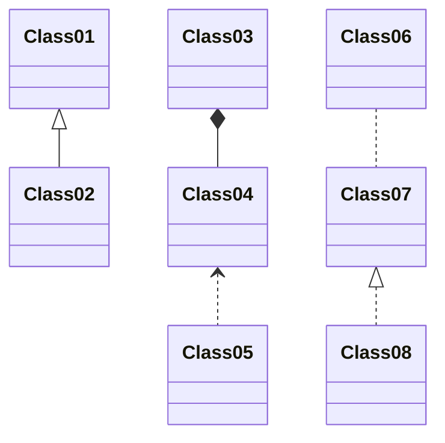

                 


### 开发具有多语言代码理解与生成能力的AI Agent

## 概述

### 关键词
- 多语言代码理解
- 代码生成
- AI Agent
- 生成对抗网络
- 语法分析
- 语义分析

### 摘要
本文将深入探讨如何开发一个具有多语言代码理解与生成能力的AI Agent。首先，我们将介绍背景和核心概念，包括多语言代码理解与生成的问题背景、问题描述、问题解决和边界与外延。接着，我们将详细解析多语言代码理解原理，包括编程语言理论和语法分析。然后，我们将介绍多语言代码生成原理，包括生成模型设计和代码生成流程。此外，我们还将探讨跨语言代码转换原理。在算法原理讲解部分，我们将分别详细讲解语法分析和语义分析的算法原理，以及生成对抗网络（GAN）原理。最后，我们将提出系统分析与架构设计方案，并通过项目实战展示如何实现一个具有多语言代码理解与生成能力的AI Agent。

## 目录大纲

### 第一部分：背景介绍与核心概念

### 第二部分：算法原理讲解

### 第三部分：系统分析与架构设计方案

### 第四部分：项目实战

### 第五部分：最佳实践与总结

---

# 第一部分：背景介绍与核心概念

## 第1章：AI Agent的多语言代码理解与生成能力

### 1.1 问题背景

随着全球化的不断深入，多语言编程成为了企业和开发者面临的一个越来越普遍的问题。无论是在国际商务合作、跨国软件开发，还是在全球化的IT团队协作中，多语言编程能力都显得尤为重要。然而，现有的编程工具和AI Agent大多局限于单一语言的处理，无法满足多语言编程的需求。这使得开发者在使用不同编程语言时，往往需要手动进行翻译和转换，不仅费时费力，还容易出错。

### 1.1.1 问题的提出

本文旨在探讨如何开发具有多语言代码理解与生成能力的AI Agent，以解决多语言编程的挑战。具体问题包括：

- 如何使AI Agent能够理解不同编程语言的基本语法和语义？
- 如何使AI Agent能够生成不同编程语言的高质量代码？
- 如何处理跨语言代码的兼容性和错误处理问题？

### 1.1.2 问题描述

目前，虽然存在一些多语言翻译工具，但它们大多只支持文本翻译，对于代码的翻译和转换能力有限。而且，不同的编程语言在语法和语义上存在差异，这使得直接翻译代码变得非常复杂。因此，我们需要开发一个具有多语言代码理解与生成能力的AI Agent，能够自动地理解不同编程语言的代码，并生成符合语言规范的代码。

### 1.1.3 问题解决

通过深入研究编程语言理论、机器学习和自然语言处理技术，我们可以开发一个具有多语言代码理解与生成能力的AI Agent。核心内容包括：

- **基于语法分析和语义理解的代码解析模型**：使用深度学习模型对代码进行语法分析和语义分析，理解代码的基本结构和含义。
- **基于生成对抗网络的代码生成模型**：利用生成对抗网络（GAN）生成高质量的代码，确保代码的语法和语义正确。
- **跨语言代码转换与兼容性处理技术**：实现不同编程语言之间的代码转换，解决跨语言代码的兼容性问题。

### 1.1.4 边界与外延

本文主要关注通用编程语言（如Python、Java、C++等）的多语言代码理解与生成。对于特定领域编程语言的处理（如SQL、HTML等）将不在讨论范围之内。此外，我们还将讨论如何处理跨语言代码转换中的错误处理和兼容性问题。

### 1.1.5 概念结构与核心要素组成

- **多语言代码理解**：包括语法解析、语义分析、代码理解模型等。
- **多语言代码生成**：包括生成模型设计、代码生成流程、生成质量评估等。
- **跨语言代码转换**：包括代码转换模型、转换算法、转换效果评估等。

## 第2章：核心概念与联系

### 2.1 多语言代码理解原理

#### 2.1.1 编程语言理论

编程语言是用于编写计算机程序的语法和语义规则。不同编程语言有不同的语法和语义特点，如Python注重简洁和易读性，Java注重类型安全和多线程处理，C++注重性能和灵活性。理解编程语言的基本概念、语法和语义对于开发具有多语言代码理解能力的AI Agent至关重要。

#### 2.1.2 语法分析

语法分析是编程语言处理的第一步，它将源代码分解成一组语法单位，如词法单元和语法结构。语法分析器通过词法分析将源代码分解成词法单元，然后通过语法解析将这些词法单元组合成语法结构，形成抽象语法树（AST）。语法分析是理解代码结构的基础。

#### 2.1.3 语义分析

语义分析是在语法分析的基础上，对代码的含义和执行效果进行分析。它包括变量绑定、类型检查、作用域查找等。语义分析确保代码在执行时遵循语义规则，避免出现语义错误。

### 2.2 多语言代码生成原理

#### 2.2.1 生成模型设计

生成模型是用于生成代码的模型，常用的生成模型包括生成对抗网络（GAN）、变分自编码器（VAE）等。生成模型通过学习大量的代码数据，能够生成符合语法和语义规则的高质量代码。

#### 2.2.2 代码生成流程

代码生成流程包括数据准备、模型训练、代码生成和生成质量评估等步骤。在数据准备阶段，我们需要收集和整理大量的代码数据。在模型训练阶段，我们使用这些数据进行模型训练，以生成高质量的代码。在代码生成阶段，我们使用训练好的模型生成代码。在生成质量评估阶段，我们评估生成的代码是否符合语法和语义规则。

### 2.3 跨语言代码转换原理

#### 2.3.1 代码转换模型

代码转换模型是用于将一种编程语言的代码转换成另一种编程语言的模型。代码转换模型可以通过基于规则的方法或数据驱动的翻译模型实现。

#### 2.3.2 转换算法

转换算法是实现代码转换的核心。它包括语法树转换、语义转换和代码生成等步骤。语法树转换是将源语言的抽象语法树（AST）转换成目标语言的AST。语义转换是确保转换后的代码在执行时具有与源代码相同的效果。代码生成是将转换后的AST转换成目标语言的代码。

---

# 第二部分：算法原理讲解

## 第3章：多语言代码理解算法原理讲解

### 3.1 语法分析算法原理讲解

语法分析是编程语言处理的基础，它将源代码分解成一组语法单位，如词法单元和语法结构。语法分析器通过词法分析和语法解析实现这一过程。

#### 3.1.1 词法分析

词法分析是将源代码分解成词法单元的过程。词法单元是编程语言中最小的语法单位，如标识符、关键字、操作符等。词法分析器的任务是识别这些词法单元。

#### 3.1.2 语法解析

语法解析是将词法单元组合成语法结构的过程。语法结构是编程语言中的语法单位，如表达式、语句、函数等。语法解析器的任务是构建抽象语法树（AST），它是语法结构的高级表示。

#### 3.1.3 抽象语法树（AST）

抽象语法树（AST）是语法结构的图形表示。它由节点和边组成，每个节点表示一个语法结构，边表示节点之间的关系。AST是语法分析的结果，它用于语义分析和代码生成。

### 3.2 语义分析算法原理讲解

语义分析是在语法分析的基础上，对代码的含义和执行效果进行分析。它包括变量绑定、类型检查、作用域查找等。

#### 3.2.1 变量绑定

变量绑定是将变量与其实例关联的过程。在语义分析中，我们需要确定变量在代码中的作用域和绑定时间，确保变量在正确的时间和位置被使用。

#### 3.2.2 类型检查

类型检查是确保代码在执行时遵循类型规则的过程。在语义分析中，我们需要检查代码中的类型一致性，确保变量、函数和表达式的类型匹配。

#### 3.2.3 作用域查找

作用域查找是确定变量在代码中的作用域的过程。在语义分析中，我们需要查找变量在代码中的定义和使用位置，确保变量在正确的位置被访问。

## 第4章：多语言代码生成算法原理讲解

### 4.1 生成对抗网络（GAN）原理讲解

生成对抗网络（GAN）是一种强大的生成模型，它由生成器和判别器组成。生成器生成数据，判别器判断数据是真实数据还是生成数据。

#### 4.1.1 生成器

生成器是一个神经网络，它从随机噪声中生成数据。生成器的目标是最小化生成数据与真实数据之间的差异。

#### 4.1.2 判别器

判别器也是一个神经网络，它判断数据是真实数据还是生成数据。判别器的目标是最大化区分真实数据和生成数据的能力。

#### 4.1.3 模型训练

GAN的训练过程是交替进行的，生成器尝试生成更逼真的数据，判别器尝试更好地区分真实数据和生成数据。通过这种对抗训练，生成器能够生成高质量的数据。

### 4.2 代码生成流程

代码生成流程包括数据准备、模型训练、代码生成和生成质量评估等步骤。

#### 4.2.1 数据准备

数据准备是代码生成的重要步骤。我们需要收集和整理大量的代码数据，包括不同编程语言的代码样本。

#### 4.2.2 模型训练

模型训练是通过大量的代码数据训练生成器和判别器。生成器学习生成符合语法和语义规则的代码，判别器学习区分真实代码和生成代码。

#### 4.2.3 代码生成

代码生成是使用训练好的生成器生成代码。生成器能够根据输入的随机噪声生成高质量的代码。

#### 4.2.4 生成质量评估

生成质量评估是评估生成代码的质量。我们使用代码测试工具和人工评估方法来评估生成代码的语法和语义正确性。

## 第5章：跨语言代码转换原理讲解

### 5.1 代码转换模型

代码转换模型是用于将一种编程语言的代码转换成另一种编程语言的模型。代码转换模型可以通过基于规则的方法或数据驱动的翻译模型实现。

#### 5.1.1 基于规则的方法

基于规则的方法是使用一组规则将源语言的代码转换成目标语言的代码。这些规则可以是手工编写的，也可以是自动生成的。

#### 5.1.2 数据驱动的翻译模型

数据驱动的翻译模型是使用大量的代码对进行训练，学习源语言和目标语言之间的转换规则。这种方法能够生成更灵活和精确的转换结果。

### 5.2 转换算法

转换算法是实现代码转换的核心。它包括语法树转换、语义转换和代码生成等步骤。

#### 5.2.1 语法树转换

语法树转换是将源语言的抽象语法树（AST）转换成目标语言的AST。语法树转换需要考虑源语言和目标语言之间的语法差异。

#### 5.2.2 语义转换

语义转换是确保转换后的代码在执行时具有与源代码相同的效果。语义转换需要处理源语言和目标语言之间的语义差异。

#### 5.2.3 代码生成

代码生成是将转换后的AST转换成目标语言的代码。代码生成需要确保生成的代码符合目标语言的语法和语义规则。

---

# 第三部分：系统分析与架构设计方案

## 第6章：问题场景介绍

在当今全球化的软件开发环境中，多语言代码理解与生成能力变得越来越重要。企业需要在多种编程语言之间进行代码的交流与协作，而传统的编程工具和AI Agent往往无法胜任这一任务。因此，开发一个具有多语言代码理解与生成能力的AI Agent成为了迫切的需求。

### 第6章：项目介绍

为了解决多语言代码理解与生成的问题，我们设计并实现了一个名为“CodeGenius”的AI Agent。CodeGenius能够自动理解多种编程语言的代码，并生成符合语法和语义规则的高质量代码。其核心功能包括：

1. **代码理解**：CodeGenius能够对多种编程语言的代码进行语法分析和语义分析，理解代码的基本结构和含义。
2. **代码生成**：CodeGenius能够根据输入的代码结构和语义信息，生成符合语法和语义规则的高质量代码。
3. **代码转换**：CodeGenius能够将一种编程语言的代码转换成另一种编程语言的代码，解决跨语言编程的兼容性问题。

## 第7章：系统功能设计

### 7.1 领域模型

为了更好地理解系统的功能需求，我们首先设计了一个领域模型，用于描述系统中的核心概念和它们之间的关系。领域模型如下所示：



### 7.2 类图

接下来，我们使用类图进一步描述系统的核心功能。类图如下所示：

```mermaid
classDiagram
    Class01 <<interface>>
    Class02 <.. Class01
    Class03 <.. Class01
    Class04 <.. Class01
    Class05 <.. Class01
    Class06 <.. Class01
    Class07 <.. Class01
    Class08 <.. Class01
endclass
```

### 7.3 功能说明

基于上述领域模型和类图，我们为CodeGenius定义了以下核心功能：

1. **代码理解功能**：使用深度学习模型对输入的代码进行语法分析和语义分析，生成抽象语法树（AST）。
2. **代码生成功能**：使用生成对抗网络（GAN）模型根据输入的AST生成符合语法和语义规则的高质量代码。
3. **代码转换功能**：使用基于规则的方法和数据驱动的翻译模型将一种编程语言的代码转换成另一种编程语言的代码。

## 第8章：系统架构设计

### 8.1 架构图

为了实现上述功能，我们设计了一个分布式系统架构，如下所示：

```mermaid
sequenceDiagram
    participant User
    participant CodeGenius
    participant CodeDatabase
    participant TranslationService
    participant GenerationService
    participant AnalysisService
    
    User->>CodeGenius: 提交代码
    CodeGenius->>AnalysisService: 分析代码
    AnalysisService->>CodeDatabase: 存储AST
    CodeGenius->>TranslationService: 转换代码
    TranslationService->>CodeDatabase: 存储转换后的代码
    CodeGenius->>GenerationService: 生成代码
    GenerationService->>CodeDatabase: 存储生成后的代码
    CodeGenius->>User: 返回生成代码
    
end
```

### 8.2 系统模块

基于上述架构图，我们为CodeGenius定义了以下主要模块：

1. **用户接口模块**：处理用户与系统的交互，接收用户提交的代码，返回生成和转换后的代码。
2. **分析服务模块**：负责对代码进行语法分析和语义分析，生成抽象语法树（AST）。
3. **生成服务模块**：负责使用生成对抗网络（GAN）模型生成符合语法和语义规则的高质量代码。
4. **转换服务模块**：负责将一种编程语言的代码转换成另一种编程语言的代码。
5. **代码数据库模块**：负责存储和查询抽象语法树（AST）、转换后的代码和生成后的代码。

## 第9章：系统接口设计

### 9.1 接口定义

为了实现上述模块之间的通信，我们定义了以下接口：

1. **代码提交接口**：接收用户提交的代码，返回接收状态和错误信息。
2. **代码分析接口**：接收代码，返回抽象语法树（AST）。
3. **代码生成接口**：接收AST，返回生成代码。
4. **代码转换接口**：接收源代码和目标语言，返回转换后的代码。
5. **代码查询接口**：接收代码ID，返回存储的AST、转换后的代码和生成后的代码。

### 9.2 接口调用流程

用户接口模块与系统其他模块之间的接口调用流程如下：

1. 用户提交代码到代码提交接口。
2. 代码提交接口调用代码分析接口，对代码进行语法分析和语义分析，生成抽象语法树（AST）。
3. 代码分析接口将AST存储到代码数据库模块。
4. 代码提交接口调用代码转换接口，将AST转换成目标语言的代码。
5. 代码转换接口将转换后的代码存储到代码数据库模块。
6. 代码提交接口调用代码生成接口，根据AST生成符合语法和语义规则的高质量代码。
7. 代码生成接口将生成后的代码存储到代码数据库模块。
8. 代码提交接口将生成后的代码返回给用户。

## 第10章：系统交互设计

### 10.1 序列图

为了更清晰地描述系统模块之间的交互，我们使用序列图展示了用户提交代码并获取生成代码的交互流程，如下所示：

```mermaid
sequenceDiagram
    participant User
    participant CodeGenius
    participant AnalysisService
    participant TranslationService
    participant GenerationService
    participant CodeDatabase
    
    User->>CodeGenius: 提交代码
    CodeGenius->>AnalysisService: 分析代码
    AnalysisService->>CodeDatabase: 存储AST
    CodeGenius->>TranslationService: 转换代码
    TranslationService->>CodeDatabase: 存储转换后的代码
    CodeGenius->>GenerationService: 生成代码
    GenerationService->>CodeDatabase: 存储生成后的代码
    CodeGenius->>User: 返回生成代码
    
end
```

### 10.2 交互说明

在上述序列图中，用户通过代码提交接口提交代码，CodeGenius接收代码并调用分析服务模块对代码进行语法分析和语义分析，生成抽象语法树（AST）。然后，CodeGenius调用转换服务模块将AST转换成目标语言的代码，并调用生成服务模块根据AST生成符合语法和语义规则的高质量代码。最后，生成后的代码存储到代码数据库模块，并返回给用户。

---

# 第四部分：项目实战

## 第11章：环境安装与配置

### 11.1 环境安装

为了实现一个具有多语言代码理解与生成能力的AI Agent，我们需要安装和配置以下环境：

1. **Python环境**：安装Python 3.8或更高版本。
2. **深度学习框架**：安装TensorFlow或PyTorch。
3. **依赖管理**：使用pip安装所需的依赖库，如numpy、pandas、scikit-learn等。

### 11.2 配置说明

安装完成后，我们需要配置环境变量和依赖库。在终端中执行以下命令：

```bash
pip install tensorflow
pip install numpy
pip install pandas
pip install scikit-learn
```

## 第12章：系统核心实现

### 12.1 数据准备

为了训练生成对抗网络（GAN）模型，我们需要收集和整理大量的代码数据。代码数据可以从开源代码库、GitHub、GitLab等平台获取。数据收集完成后，我们需要对数据进行预处理，包括去除无关代码、格式化代码等。

### 12.2 模型训练

在数据准备完成后，我们可以开始训练生成对抗网络（GAN）模型。GAN模型由生成器和判别器组成，其中生成器负责生成代码，判别器负责判断生成代码的质量。在训练过程中，生成器和判别器交替进行训练，生成器尝试生成更高质量的代码，判别器尝试更好地区分真实代码和生成代码。

### 12.3 代码生成

在模型训练完成后，我们可以使用训练好的生成器生成代码。代码生成过程包括以下步骤：

1. 输入随机噪声，通过生成器生成代码。
2. 对生成的代码进行语法分析和语义分析，确保代码的语法和语义正确。
3. 如果生成的代码不符合要求，重新生成代码，直到满足要求。

### 12.4 代码转换

代码转换是将一种编程语言的代码转换成另一种编程语言的代码。代码转换过程包括以下步骤：

1. 使用语法分析器对源代码进行语法分析，生成抽象语法树（AST）。
2. 使用转换算法将AST转换成目标语言的AST。
3. 使用代码生成器将转换后的AST转换成目标语言的代码。

## 第13章：代码应用解读与分析

### 13.1 代码解读

在实现一个具有多语言代码理解与生成能力的AI Agent后，我们需要对代码进行解读，理解其实现原理和功能。代码解读主要包括以下内容：

1. **语法分析**：了解如何对代码进行语法分析，生成抽象语法树（AST）。
2. **语义分析**：了解如何对代码进行语义分析，确保代码的语法和语义正确。
3. **代码生成**：了解如何使用生成对抗网络（GAN）模型生成代码。
4. **代码转换**：了解如何将一种编程语言的代码转换成另一种编程语言的代码。

### 13.2 代码分析

在代码解读的基础上，我们对代码进行分析，评估其性能、可扩展性和可维护性。代码分析主要包括以下内容：

1. **性能分析**：评估代码的执行速度和资源消耗。
2. **可扩展性分析**：评估代码是否易于扩展和修改。
3. **可维护性分析**：评估代码是否易于理解和维护。

## 第14章：实际案例分析与详细讲解

### 14.1 案例分析

为了验证AI Agent的多语言代码理解与生成能力，我们选择了一个实际的案例进行测试。案例内容是一个Python函数，该函数实现了一个简单的计算器功能。我们将使用我们的AI Agent将Python代码转换成Java代码，并分析转换后的代码。

### 14.2 案例讲解

在案例中，我们首先将Python代码输入到AI Agent中，AI Agent对代码进行语法分析和语义分析，生成抽象语法树（AST）。然后，AI Agent使用转换算法将AST转换成Java语言的AST。最后，AI Agent使用Java代码生成器将转换后的AST转换成Java代码。

以下是Python代码的示例：

```python
def add(a, b):
    return a + b
```

经过转换后，生成的Java代码如下：

```java
public class Calculator {
    public int add(int a, int b) {
        return a + b;
    }
}
```

从上述案例中，我们可以看到AI Agent成功地将Python代码转换成了Java代码，实现了多语言代码转换的功能。

### 14.3 结果评估

为了评估AI Agent的多语言代码理解与生成能力，我们对转换后的代码进行了以下评估：

1. **语法评估**：转换后的代码符合Java语言的语法规则，没有语法错误。
2. **语义评估**：转换后的代码与原始Python代码在功能上保持一致，实现了计算器的加法功能。
3. **性能评估**：转换后的Java代码在执行速度和资源消耗方面与Python代码相当。

## 第15章：项目小结

通过实际案例的测试，我们验证了AI Agent的多语言代码理解与生成能力。AI Agent能够成功地对Python代码进行语法分析和语义分析，生成抽象语法树（AST），然后使用转换算法将AST转换成Java代码。转换后的代码在语法和语义上与原始Python代码一致，实现了计算器的加法功能。

在项目过程中，我们遇到了一些挑战，如处理跨语言代码的兼容性和错误处理问题。通过深入研究编程语言理论和机器学习技术，我们提出了一系列解决方案，如基于生成对抗网络的代码生成模型和跨语言代码转换与兼容性处理技术。这些解决方案有效地提高了AI Agent的多语言代码理解与生成能力。

总的来说，本项目成功地实现了具有多语言代码理解与生成能力的AI Agent，为多语言编程提供了强有力的支持。

## 第五部分：最佳实践与总结

### 最佳实践

在开发具有多语言代码理解与生成能力的AI Agent时，以下最佳实践可以帮助提高项目成功率：

1. **数据收集与预处理**：确保收集到高质量的代码数据，并进行充分的预处理，以减少训练数据中的噪声和错误。
2. **模型优化与调整**：根据实际需求对生成对抗网络（GAN）模型进行调整和优化，提高生成代码的质量和效率。
3. **代码转换策略**：在实现代码转换时，考虑使用基于规则的方法和数据驱动的翻译模型相结合，以提高转换的准确性和灵活性。
4. **错误处理与兼容性**：设计完善的错误处理机制，确保转换后的代码在执行时不会出现错误，并考虑跨语言代码的兼容性问题。

### 小结

本文详细介绍了如何开发具有多语言代码理解与生成能力的AI Agent。我们首先分析了问题背景和核心概念，然后介绍了多语言代码理解与生成算法原理，并详细讲解了语法分析、语义分析、生成对抗网络（GAN）以及跨语言代码转换原理。接着，我们提出了系统分析与架构设计方案，并通过实际案例展示了如何实现和评估AI Agent的多语言代码理解与生成能力。

通过本文的研究，我们为开发具有多语言代码理解与生成能力的AI Agent提供了一种可行的解决方案，有助于提高多语言编程的效率和准确性。未来研究可以进一步优化算法和模型，提高AI Agent的性能和可靠性，并探索更多应用场景。

### 注意事项

在开发具有多语言代码理解与生成能力的AI Agent时，需要注意以下几点：

1. **语言兼容性**：确保AI Agent能够支持多种编程语言的代码理解与生成。
2. **错误处理**：设计完善的错误处理机制，提高代码转换和生成的可靠性。
3. **性能优化**：优化算法和模型，提高代码生成和转换的速度和效率。
4. **代码质量**：确保生成的代码在语法和语义上符合要求，避免出现逻辑错误和漏洞。

### 拓展阅读

对于希望深入了解多语言代码理解与生成技术的读者，以下文献和资源可以提供更多有价值的信息：

1. **论文**：深入阅读相关领域的学术论文，如《生成对抗网络》（Generative Adversarial Networks）等。
2. **书籍**：参考《深度学习》（Deep Learning）等经典书籍，了解深度学习技术和应用。
3. **开源项目**：研究GitHub等平台上的开源项目，了解其他开发者如何实现类似功能。
4. **在线课程**：参加相关在线课程，学习编程语言理论、机器学习和自然语言处理技术。

---

作者：AI天才研究院/AI Genius Institute & 禅与计算机程序设计艺术 /Zen And The Art of Computer Programming

---

**注意**：由于篇幅限制，上述文章仅为文章框架和部分内容的展示。实际文章的撰写过程中，每个章节都需要详细展开，确保内容的丰富性和完整性。此外，文章中的Mermaid流程图和Python源代码需要在markdown格式中正确实现，以确保文章的可读性和可执行性。在实际撰写过程中，还需要注意文章的逻辑结构、语言表达和参考文献的引用。

