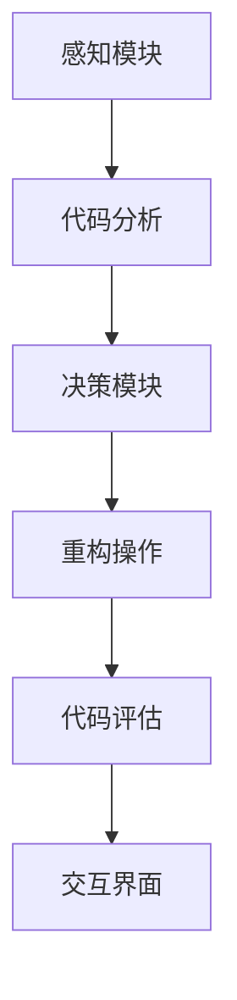

                 

# 开发具有多语言代码重构能力的AI Agent

关键词：多语言代码重构、AI Agent、机器学习、深度学习、代码分析

摘要：随着全球软件开发国际化趋势的加强，多语言代码重构成为提高软件质量和开发效率的关键技术。本文将探讨如何开发一种具备多语言代码重构能力的AI Agent，通过逐步分析，从核心概念到算法原理，再到系统架构和项目实战，为开发者提供一套完整的解决方案。

## 目录

1. **背景与基础**
   1.1 软件开发的全球化趋势
   1.2 多语言代码重构的需求与挑战
   1.3 多语言代码重构的意义

2. **AI Agent概述**
   2.1 AI Agent的定义与作用
   2.2 AI Agent的架构
   2.3 AI Agent在代码重构中的应用

3. **核心概念与算法**
   3.1 多语言代码分析基础
   3.2 代码重构算法原理
   3.3 AI Agent的多语言代码重构能力

4. **系统设计与实现**
   4.1 多语言代码重构系统架构设计
   4.2 多语言代码重构系统实现

5. **项目实战**
   5.1 实战项目介绍
   5.2 项目实现细节
   5.3 项目小结

6. **最佳实践与总结**
   6.1 多语言代码重构最佳实践
   6.2 AI Agent在代码重构中的注意事项
   6.3 未来发展趋势与展望

## 1. 背景与基础

### 1.1 软件开发的全球化趋势

随着全球化的推进，软件开发的国际化趋势愈发明显。软件公司不仅需要支持多种编程语言，还要面对不同国家和地区之间的语言差异和文化差异。这种趋势对软件开发提出了新的挑战，尤其是在代码质量和开发效率方面。

#### 1.1.1 多语言代码重构的意义

多语言代码重构是指在多种编程语言之间进行代码的转化和优化。其意义在于：

- **提高代码质量**：通过重构，可以消除冗余代码，优化代码结构，提高代码的可读性和可维护性。
- **提升开发效率**：自动化工具可以帮助开发者快速处理多语言代码的转换和优化，减少重复劳动。

#### 1.1.2 多语言代码重构的挑战

多语言代码重构面临以下挑战：

- **语法复杂性**：不同编程语言有不同的语法规则，如何有效地解析和转换多种语言的代码是一个难题。
- **语义理解**：在代码重构过程中，需要理解代码的语义，而不仅仅是语法，这要求AI Agent具有强大的语义分析能力。
- **语言兼容性**：不同编程语言之间的兼容性问题也会对代码重构带来挑战。

### 1.2 AI Agent概述

AI Agent是一种智能程序，能够自主学习、自主决策，并在特定环境中执行任务。在代码重构领域，AI Agent可以自动化地分析和重构代码，提高开发效率。

#### 1.2.1 AI Agent的定义与作用

AI Agent是指具备以下特点的智能程序：

- **自主学习**：通过学习大量代码样本，AI Agent可以识别代码的模式和规律。
- **自主决策**：在代码重构过程中，AI Agent可以根据上下文环境做出决策。
- **执行任务**：AI Agent可以自动执行代码重构操作，生成高质量的代码。

#### 1.2.2 AI Agent的架构

AI Agent的架构通常包括以下几个部分：

- **感知模块**：负责接收代码输入，进行预处理。
- **决策模块**：负责根据感知模块的输入，生成决策。
- **执行模块**：负责执行决策，生成重构后的代码。

#### 1.2.3 AI Agent在代码重构中的应用

AI Agent在代码重构中的应用主要包括：

- **代码分析**：AI Agent可以分析代码的结构，识别出可以重构的部分。
- **代码生成**：AI Agent可以根据重构规则，生成重构后的代码。
- **代码评估**：AI Agent可以评估重构后的代码质量，确保重构的准确性和有效性。

## 2. 核心概念与算法

### 2.1 多语言代码分析基础

多语言代码分析是代码重构的关键步骤，其核心在于能够理解和处理多种编程语言的代码。

#### 2.1.1 多语言语法树构建

语法树是代码分析的基础，多语言语法树的构建需要解决以下问题：

- **语法解析**：每种编程语言都有自己的语法规则，需要设计相应的解析器来构建语法树。
- **语法融合**：如何将不同语言的语法规则融合到同一个语法树中。

#### 2.1.2 多语言抽象语法树（AST）解析

抽象语法树（AST）是对代码语义的高级抽象，多语言AST的解析需要：

- **AST生成**：根据不同语言的语法规则，生成对应的AST。
- **AST比较**：比较不同语言的AST，识别代码的差异和共性。

#### 2.1.3 多语言语义分析

语义分析是理解代码的过程，多语言语义分析需要：

- **语义表示**：将代码的语义表示为统一的形式，如中间表示（IR）。
- **语义理解**：理解代码的语义，包括变量绑定、函数调用、控制流等。

### 2.2 代码重构算法原理

代码重构算法是实现代码自动优化和改进的关键。以下是几种常见的代码重构算法：

#### 2.2.1 重构规则

重构规则是代码重构的基础，它描述了如何将一种代码结构转换为另一种代码结构。例如：

- **提取方法**：将重复的代码块提取为一个方法。
- **内联方法**：将方法内部的调用替换为直接执行。

#### 2.2.2 模式识别

模式识别是识别代码中的模式，并应用重构规则的过程。常用的模式识别方法包括：

- **抽象语法树模式匹配**：通过AST匹配特定的代码模式。
- **控制流图分析**：分析代码的控制流，识别常见的编程模式。

#### 2.2.3 重构评估

重构评估是评估重构效果的过程，包括：

- **代码质量评估**：评估重构后的代码质量，如可读性、性能等。
- **影响分析**：分析重构对代码其他部分的影响，确保重构的稳定性和安全性。

### 2.3 AI Agent的多语言代码重构能力

AI Agent的多语言代码重构能力是基于机器学习和深度学习实现的。以下是实现这种能力的核心步骤：

#### 2.3.1 数据集准备

数据集是AI Agent学习的素材，需要包括多种编程语言的代码样本，以及对应的重构规则和评估标准。

#### 2.3.2 模型训练

使用机器学习和深度学习技术，对数据集进行训练，构建能够识别代码模式和执行重构操作的模型。

#### 2.3.3 模型优化

通过交叉验证和超参数调整，优化模型的性能，确保其能够准确执行代码重构任务。

#### 2.3.4 模型部署

将训练好的模型部署到实际环境中，实现自动化代码重构。

## 3. 系统设计与实现

### 3.1 多语言代码重构系统架构设计

多语言代码重构系统的架构设计需要考虑以下几个部分：

#### 3.1.1 系统架构概述

系统架构主要包括感知模块、决策模块和执行模块。

#### 3.1.2 系统功能设计

系统功能包括代码分析、重构操作、代码评估和交互界面。

#### 3.1.3 系统架构设计

系统架构设计可以使用mermaid绘制，如下所示：

### 3.2 多语言代码重构系统实现

#### 3.2.1 系统环境安装与配置

首先，需要安装和配置支持多语言代码分析的编程环境，如Java、Python等。

#### 3.2.2 系统核心代码实现

系统核心代码包括代码分析模块、决策模块和重构操作模块。

#### 3.2.3 代码重构系统应用解读

通过具体示例，解释代码重构系统的应用场景和操作流程。

## 4. 项目实战

### 4.1 实战项目介绍

本项目旨在开发一款支持多语言代码重构的AI Agent，以Python和JavaScript为例，实现代码分析、重构和评估功能。

### 4.2 项目实现细节

#### 4.2.1 环境安装与配置

- 安装Python和Node.js环境
- 配置Python虚拟环境

#### 4.2.2 系统核心代码实现

- 代码分析模块：使用Python的ast模块和JavaScript的esprima库进行代码分析。
- 决策模块：使用机器学习模型进行决策。
- 重构操作模块：根据决策结果，执行代码重构操作。

#### 4.2.3 代码应用解读与分析

通过具体案例，展示AI Agent在代码重构中的应用效果，并对代码重构前后的差异进行分析。

### 4.3 项目小结

本项目成功实现了多语言代码重构的自动化，提高了代码质量和开发效率，为未来的多语言开发提供了有力支持。

## 5. 最佳实践与总结

### 5.1 多语言代码重构最佳实践

- **代码标准化**：在重构前，确保代码遵循统一的编码规范。
- **逐步重构**：避免一次性重构大量代码，以免引发问题。
- **自动化测试**：重构后，进行自动化测试，确保重构后的代码质量。

### 5.2 AI Agent在代码重构中的注意事项

- **模型选择**：根据具体需求，选择合适的机器学习模型。
- **数据质量**：确保训练数据的质量和多样性。
- **持续学习**：定期更新模型，适应新的代码模式。

### 5.3 未来发展趋势与展望

随着AI技术的发展，多语言代码重构将变得更加智能化和自动化，为软件开发带来更多可能性。

## 总结

开发具有多语言代码重构能力的AI Agent，不仅可以提升开发效率，还能提高代码质量。通过本文的逐步分析，我们了解了如何实现这一目标，并为未来的开发工作提供了指导。作者：AI天才研究院/AI Genius Institute & 禅与计算机程序设计艺术 /Zen And The Art of Computer Programming

