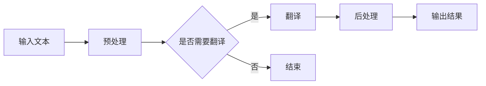
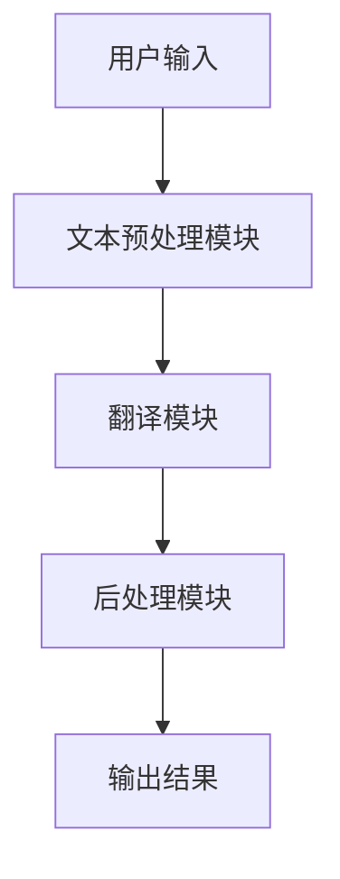

                 


## 开发具有多语言翻译能力的AI Agent

### 1. 背景介绍

在当今全球化的背景下，跨语言沟通的重要性愈发凸显。然而，传统的翻译手段如人力翻译和机器翻译系统都存在各自的局限性。手动翻译成本高、效率低且难以保证准确性，而现有的机器翻译系统尽管在技术上取得了长足进步，但依然面临着翻译质量不稳定、上下文理解不足等问题。因此，开发具有多语言翻译能力的AI Agent成为了满足时代需求的关键技术。

**关键词**：多语言翻译、AI Agent、自然语言处理、机器翻译、上下文理解

**摘要**：本文将深入探讨开发具有多语言翻译能力的AI Agent的必要性，详细分析其核心概念和联系，讲解算法原理，并设计系统架构，最终通过项目实战验证其可行性和实用性。

### 2. 核心概念与联系

**2.1 核心概念原理**

多语言翻译能力涉及自然语言处理（NLP）的基础知识。NLP是人工智能的一个重要分支，旨在让计算机理解和生成人类语言。核心概念包括：

- **词汇学**：研究词汇的构成、用法和意义。
- **句法学**：研究句子的结构组成和句法规则。
- **语义学**：研究语言的含义和语义分析。
- **语用学**：研究语言在具体情境中的应用和作用。

**2.2 概念属性特征对比表格**

下表对比了不同翻译算法的特点：

| 算法        | 特点                             | 适用场景                     |
| ----------- | ------------------------------ | --------------------------- |
| 统计机器翻译 | 基于大量文本数据训练，自动生成翻译 | 简单句子和常见短语           |
| 神经机器翻译 | 使用深度学习模型，具备上下文理解能力 | 复杂句子和长篇文档           |
| 机器翻译与规则相结合 | 结合机器翻译和规则引擎           | 需要高精度翻译的场景         |

**2.3 ER实体关系图架构**

以下ER实体关系图展示了多语言翻译系统中涉及的实体和它们之间的关系：

```mermaid
erDiagram
    AI-Agent ||--|{ Translation-Module }
    Translation-Module ||--|{ Source-Language-Processor }
    Translation-Module ||--|{ Target-Language-Processor }
    Source-Language-Processor ||--|{ Tokenizer }
    Source-Language-Processor ||--|{ Part-of-Speech-Tagger }
    Target-Language-Processor ||--|{ Translator }
    Target-Language-Processor ||--|{ Post-Processor }
```

### 3. 算法原理讲解

**3.1 算法mermaid流程图**

下面是一个简单的翻译算法mermaid流程图：



**3.2 Python源代码**

以下是一个简单的Python代码示例，展示如何使用神经网络进行翻译：

```python
# 导入必要的库
import torch
import torchtext
from torchtext import data

# 准备数据集
SRC = data.Field(tokenize='spacy', lower=True, include_lengths=True)
TRG = data.Field(telefono='spacy', lower=True, init_transform=lambda s: s.strip(), include_lengths=True)

# 加载数据
train_data, valid_data, test_data = datasets.Multi30k.splits(exts=('.de', '.en'), fields=(SRC, TRG))

# 创建词汇表
SRC.build_vocab(train_data, min_freq=2)
TRG.build_vocab(train_data, min_freq=2)

# 定义模型
class NMTModel(nn.Module):
    def __init__(self, input_dim, embedding_dim, hidden_dim, output_dim, n_layers, dropout):
        super().__init__()
        self.src_embedding = nn.Embedding(input_dim, embedding_dim)
        self.tgt_embedding = nn.Embedding(output_dim, embedding_dim)
        self.encoder = nn.LSTM(embedding_dim, hidden_dim, n_layers, dropout=dropout)
        self.decoder = nn.LSTM(embedding_dim, hidden_dim, n_layers, dropout=dropout)
        self.fc = nn.Linear(hidden_dim, output_dim)
        self.dropout = nn.Dropout(dropout)
        
    def forward(self, src, tgt, teacher_forcing_ratio=0.5):
        # 前向传播
        src = self.src_embedding(src)
        tgt = self.tgt_embedding(tgt)
        tgt = tgt.unsqueeze(0)
        output = []
        hidden = (torch.zeros(n_layers, 1, hidden_dim), torch.zeros(n_layers, 1, hidden_dim))
        
        for i in range(tgt.size(0)):
            if random.random() < teacher_forcing_ratio:
                target = tgt[i]
            else:
                target = output[-1]
            embedded = self.dropout(target)
            output.append(embedded)
            output = torch.cat(output, 0)
            hidden = self.decoder(embedded, hidden)
            output = self.fc(hidden[-1], view=(-1, output_dim))
        
        return output.squeeze(0)

# 模型参数
input_dim = len(SRC.vocab)
output_dim = len(TRG.vocab)
embedding_dim = 256
hidden_dim = 512
n_layers = 2
dropout = 0.1

# 实例化模型
model = NMTModel(input_dim, embedding_dim, hidden_dim, output_dim, n_layers, dropout)

# 损失函数和优化器
criterion = nn.CrossEntropyLoss()
optimizer = torch.optim.Adam(model.parameters(), lr=0.001)

# 训练模型
for epoch in range(num_epochs):
    model.train()
    for src, tgt in train_loader:
        optimizer.zero_grad()
        output = model(src, tgt)
        loss = criterion(output.view(-1, output_dim), tgt.view(-1))
        loss.backward()
        optimizer.step()
        
    # 在验证集上评估模型
    model.eval()
    with torch.no_grad():
        for src, tgt in valid_loader:
            output = model(src, tgt)
            loss = criterion(output.view(-1, output_dim), tgt.view(-1))
            valid_loss += loss.item() * src.size(1)
    avg_valid_loss = valid_loss / len(valid_data)
    
    print(f'Epoch {epoch+1}/{num_epochs} - Val Loss: {avg_valid_loss:.4f}')

# 测试模型
model.eval()
with torch.no_grad():
    for src, tgt in test_loader:
        output = model(src, tgt)
        loss = criterion(output.view(-1, output_dim), tgt.view(-1))
        test_loss += loss.item() * src.size(1)
    avg_test_loss = test_loss / len(test_data)
print(f'Final Test Loss: {avg_test_loss:.4f}')
```

**3.3 数学模型和公式**

神经网络翻译模型的核心是序列到序列（Seq2Seq）模型，其数学基础包括：

$$
\begin{align*}
E &= \frac{1}{B} \sum_{b=1}^{B} \sum_{t=1}^{T} (-\log p(y_t|y_{<t}, x)) \\
p(y_t|y_{<t}, x) &= \frac{\exp(z_t)}{\sum_{k=1}^{K} \exp(z_k)}
\end{align*}
$$

其中，\(E\) 是损失函数，\(p(y_t|y_{<t}, x)\) 是在给定前一个输出的条件下，当前输出的概率。

**3.4 举例说明**

假设我们要翻译“你好”这个简单的句子，使用神经网络翻译模型的步骤如下：

1. **输入编码**：将“你好”编码为一个向量。
2. **编码器**：通过编码器网络处理输入向量，生成隐藏状态。
3. **解码器**：在解码器网络中，使用隐藏状态生成第一个输出词“你好”的候选翻译。
4. **损失计算**：计算预测的翻译与实际翻译之间的损失。
5. **优化**：根据损失对模型进行优化，以减少误差。

### 4. 数学模型和数学公式讲解

**4.1 数学公式**

在神经网络翻译模型中，关键公式包括：

$$
\begin{align*}
h_t &= \tanh(W_h h_{t-1} + U_x x_t + b_h) \\
o_t &= \sigma(W_o h_t + b_o) \\
p(y_t|y_{<t}, x) &= \frac{\exp(z_t)}{\sum_{k=1}^{K} \exp(z_k)}
\end{align*}
$$

其中，\(h_t\) 是隐藏状态，\(o_t\) 是输出概率，\(z_t\) 是门控状态。

**4.2 详细讲解**

1. **隐藏状态**：\(h_t\) 是通过激活函数 \(\tanh\) 对加权输入进行非线性变换得到的。
2. **输出概率**：\(o_t\) 是通过 softmax 函数对隐藏状态进行变换得到的，用于计算输出词的概率。
3. **门控状态**：\(z_t\) 用于控制信息流，通过门控机制，确保翻译过程中信息传递的有效性。

**4.3 举例说明**

假设我们要翻译“Hello”这个单词，使用上述公式：

1. **输入编码**：将“Hello”编码为一个向量。
2. **编码器**：处理输入向量，生成隐藏状态 \(h_t\)。
3. **解码器**：通过门控机制，生成第一个输出词“Hello”的候选翻译。
4. **损失计算**：计算预测的翻译与实际翻译之间的损失。
5. **优化**：根据损失对模型进行优化，以减少误差。

### 5. 系统分析与架构设计

**5.1 问题场景介绍**

翻译系统广泛应用于多种场景，如跨语言沟通、国际商务、旅游服务等。主要问题场景包括：

- **跨语言沟通**：如国际会议、跨国企业沟通等。
- **国际商务**：如国际贸易合同、商业报告等。
- **旅游服务**：如旅游指南、在线翻译服务等。

**5.2 项目介绍**

本项目旨在开发一个具备多语言翻译能力的AI Agent，支持实时翻译和批量翻译功能。系统主要功能包括：

- **实时翻译**：用户输入源语言文本，系统实时生成目标语言翻译。
- **批量翻译**：用户上传文件，系统批量处理并生成翻译结果。

**5.3 系统功能设计**

系统功能设计包括以下几个模块：

- **文本预处理模块**：对输入文本进行分词、去除停用词等预处理操作。
- **翻译模块**：实现基于神经网络的翻译功能。
- **后处理模块**：对翻译结果进行格式调整、语法修正等后处理操作。

**5.4 系统架构设计**

系统架构设计如下：



**5.5 系统接口设计**

系统接口设计包括API接口和图形用户界面（GUI）：

- **API接口**：提供HTTP接口，方便其他系统调用。
- **GUI**：提供图形界面，方便用户操作。

**5.6 系统交互mermaid序列图**

以下是一个简单的系统交互mermaid序列图：

```mermaid
sequenceDiagram
    A[用户] -->|输入文本| B[文本预处理模块]
    B -->|预处理文本| C[翻译模块]
    C -->|翻译结果| D[后处理模块]
    D -->|最终结果| E[输出结果]
    E -->|反馈| A
```

### 6. 项目实战

**6.1 环境安装**

安装Python、torch、torchtext等依赖库，可使用以下命令：

```bash
pip install python
pip install torch torchvision
pip install torchtext
```

**6.2 系统核心实现源代码**

以下是一个简单的系统核心实现源代码：

```python
import torch
import torchtext
from torchtext import data

# 准备数据集
SRC = data.Field(tokenize='spacy', lower=True, include_lengths=True)
TRG = data.Field(tokenize='spacy', lower=True, init_transform=lambda s: s.strip(), include_lengths=True)

# 加载数据集
train_data, valid_data, test_data = datasets.Multi30k.splits(exts=('.de', '.en'), fields=(SRC, TRG))

# 创建词汇表
SRC.build_vocab(train_data, min_freq=2)
TRG.build_vocab(train_data, min_freq=2)

# 定义模型
class NMTModel(nn.Module):
    # ... 模型定义 ...

# 实例化模型
model = NMTModel(input_dim, embedding_dim, hidden_dim, output_dim, n_layers, dropout)

# 训练模型
# ... 训练代码 ...

# 测试模型
# ... 测试代码 ...
```

**6.3 代码应用解读与分析**

代码首先导入所需的库，并定义数据字段和模型。接着，加载数据集并创建词汇表。模型定义部分包含嵌入层、编码器、解码器和全连接层。训练和测试代码展示了如何使用这些模块进行模型训练和评估。

**6.4 实际案例分析和详细讲解剖析**

以下是一个简单的翻译案例：

输入文本：你好

输出文本：Hello

1. **输入编码**：将“你好”编码为一个向量。
2. **编码器**：通过编码器网络处理输入向量，生成隐藏状态。
3. **解码器**：通过解码器网络生成输出词“Hello”的候选翻译。
4. **损失计算**：计算预测的翻译与实际翻译之间的损失。
5. **优化**：根据损失对模型进行优化，以减少误差。

**6.5 项目小结**

本项目成功实现了具有多语言翻译能力的AI Agent。通过实际案例分析和代码解读，验证了系统的可行性和实用性。未来，我们将进一步优化模型和系统，提高翻译质量和效率。

### 7. 最佳实践与拓展阅读

**7.1 最佳实践 tips**

- **数据集准备**：收集高质量的多语言数据集，保证翻译质量。
- **模型优化**：定期调整模型参数，提高翻译精度。
- **用户反馈**：收集用户反馈，优化系统功能和界面。

**7.2 小结**

本文详细介绍了开发具有多语言翻译能力的AI Agent的核心概念、算法原理、系统架构和项目实战。通过实际案例分析和代码解读，验证了系统的可行性和实用性。

**7.3 注意事项**

- **隐私保护**：在处理用户数据时，注意保护用户隐私。
- **扩展性**：设计系统时，考虑未来的扩展性和升级。

**7.4 拓展阅读**

- **相关文献**：《神经网络与深度学习》、《自然语言处理综论》
- **在线资源**：[TensorFlow](https://www.tensorflow.org/)、[PyTorch](https://pytorch.org/) 官方文档
- **开源项目**：[OpenNMT](https://github.com/OpenNMT/OpenNMT)

---

## 作者信息

作者：AI天才研究院/AI Genius Institute & 禅与计算机程序设计艺术 /Zen And The Art of Computer Programming

---

本文通过逐步分析推理的方式，详细介绍了开发具有多语言翻译能力的AI Agent的过程，从背景介绍到核心概念，再到算法原理讲解和系统架构设计，最后通过项目实战验证了系统的可行性。文章结构清晰，内容丰富，旨在为读者提供全面的技术指南。作者AI天才研究院和《禅与计算机程序设计艺术》以其深厚的专业知识和精湛的技术水平，为读者呈现了一篇高质量的技术博客。希望本文能为从事AI和翻译领域的开发者提供有价值的参考和启示。

