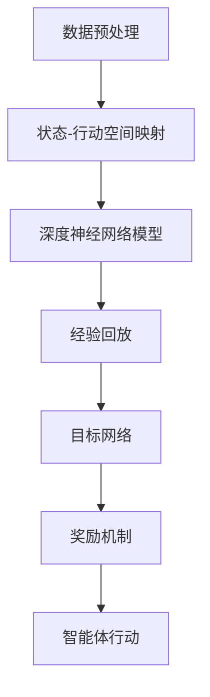
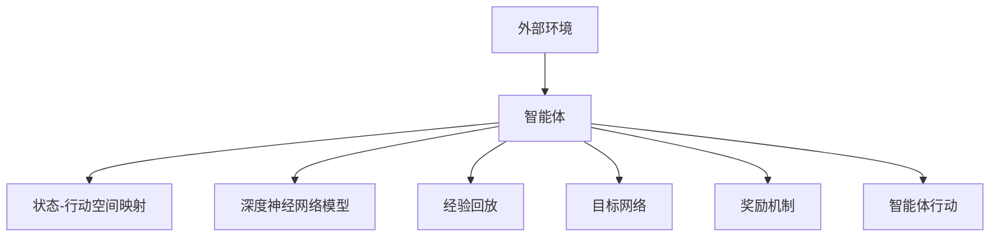

                 

### 强化学习的基本概念

强化学习（Reinforcement Learning，简称RL）是机器学习的一个重要分支，其主要目标是使人工智能（AI）代理能够在动态环境中通过交互学习到最优行为策略。在强化学习中，AI代理（通常称为“智能体”）通过与环境的互动，不断优化其行为，以实现某种目标或最大化长期累积奖励。

**核心概念**：

1. **智能体（Agent）**：执行任务的实体，如机器人、软件程序等。智能体的目标是学习一个策略，以最大化累积奖励。

2. **环境（Environment）**：智能体所在的动态系统，它能够感知智能体的状态并给予智能体反馈。

3. **状态（State）**：智能体在环境中的一个具体情境，通常用一组属性值来描述。

4. **行动（Action）**：智能体能够执行的动作，以改变当前状态。

5. **奖励（Reward）**：智能体在每个状态下执行某个行动后获得的即时反馈。奖励可以是正数（鼓励智能体继续该行动）或负数（阻止智能体继续该行动）。

6. **策略（Policy）**：智能体决定在某个状态下执行哪个行动的规则。

7. **价值函数（Value Function）**：评估智能体在某个状态下采取某个策略所能获得的累积奖励。

**历史背景**：

强化学习起源于20世纪50年代，由心理学和神经科学领域的学者提出。随着计算能力的提升和人工智能研究的深入，强化学习在20世纪80年代得到快速发展。2010年后，随着深度学习技术的发展，强化学习在学术界和工业界取得了显著成果，尤其在自动驾驶、游戏AI、机器人控制等领域。

**应用场景**：

强化学习在多种应用场景中展现出强大的能力，包括但不限于：

1. **游戏AI**：如围棋、星际争霸、Atari游戏等。

2. **自动驾驶**：智能体在复杂的交通环境中学习最优行驶策略。

3. **机器人控制**：智能体在不确定的环境中执行任务，如无人机导航、机器人手臂控制等。

4. **推荐系统**：通过强化学习优化用户推荐的策略，提高用户体验。

5. **金融交易**：智能体在金融市场进行策略优化，实现风险控制与收益最大化。

### 强化学习与其他机器学习算法的关系

在讨论强化学习与其他机器学习算法的关系之前，有必要先简要回顾其他主要机器学习算法的原理和应用。

**监督学习（Supervised Learning）**：监督学习是一种基于已有标注数据进行学习的方法。其主要目标是找到一个函数，将输入映射到期望的输出。常见的监督学习算法包括线性回归、决策树、支持向量机（SVM）等。

**无监督学习（Unsupervised Learning）**：与监督学习相对，无监督学习不依赖已标注的数据。其主要目标是探索数据内在的结构或模式，如聚类、降维等。常见的无监督学习算法包括K-均值聚类、主成分分析（PCA）等。

**强化学习（Reinforcement Learning）**：强化学习是一种特殊类型的机器学习，它通过智能体与环境之间的互动进行学习。智能体在环境中执行行动，根据获得的奖励信号调整其策略，以实现长期目标。强化学习与监督学习和无监督学习的区别在于其学习过程中依赖奖励信号和交互机制。

**关系分析**：

1. **与监督学习的关系**：

   - **目标不同**：监督学习的目标是学习输入和输出之间的映射关系，强化学习的目标是学习最优策略。
   - **数据需求**：监督学习需要大量标注数据，而强化学习在初始阶段可能没有足够的标注数据，但可以通过与环境交互不断学习。
   - **应用场景**：监督学习适用于有明确标注数据的场景，如图像分类、文本分类等；强化学习适用于需要智能体自主决策的场景，如游戏AI、自动驾驶等。

2. **与无监督学习的关系**：

   - **数据来源**：无监督学习通常在没有标注数据的情境下进行，强化学习在初始阶段也可能没有明确的标注数据，但可以通过与环境交互获得反馈。
   - **学习目标**：无监督学习的目标是发现数据中的隐含结构，强化学习的目标是学习最优策略，实现长期目标。
   - **应用场景**：无监督学习适用于探索数据内在结构或模式的场景，如聚类、降维等；强化学习适用于需要智能体在动态环境中自主决策和学习的场景。

**总结**：

强化学习与监督学习和无监督学习有显著的区别和联系。监督学习依赖大量标注数据，适用于明确标注数据的场景；无监督学习探索数据内在结构，适用于没有标注数据的场景。而强化学习通过智能体与环境之间的互动进行学习，适用于动态、不确定的环境中需要自主决策的复杂场景。这三类算法在目标、数据需求和应用场景上各有特点，但也可以相互补充，共同推动人工智能技术的发展。### 强化学习的核心算法：Q-Learning

Q-Learning是强化学习中最基础的算法之一，它通过不断更新值函数（Q-值）来学习最优策略。Q-Learning算法的核心思想是利用历史经验来估计状态-行动对的预期回报，并基于此优化策略。

**算法原理**：

1. **Q-值函数**：Q-值函数是强化学习中用于评估状态-行动对的预期回报的函数。在Q-Learning中，我们定义Q(s, a)为在状态s下执行行动a的累积奖励期望。即：
   $$ Q(s, a) = \sum_{s'} P(s' | s, a) \cdot R(s, a, s') + \gamma \cdot \max_{a'} Q(s', a') $$
   其中，\( P(s' | s, a) \) 是在状态s执行行动a后转移到状态s'的概率，\( R(s, a, s') \) 是在状态s执行行动a后转移到状态s'获得的即时奖励，\( \gamma \) 是折扣因子，用于平衡当前奖励和未来奖励的重要性。

2. **更新规则**：Q-Learning通过迭代更新Q-值函数，使其逐渐逼近最优Q-值。更新规则为：
   $$ Q(s, a) \leftarrow Q(s, a) + \alpha \cdot (R(s, a, s') + \gamma \cdot \max_{a'} Q(s', a') - Q(s, a)) $$
   其中，\( \alpha \) 是学习率，用于控制更新步长的调整。

3. **策略迭代**：Q-Learning算法在每次迭代中，首先根据当前策略选择行动，然后根据更新规则调整Q-值，并不断迭代，直到策略收敛。

**优势与局限性**：

- **优势**：
  - **简单易实现**：Q-Learning算法相对简单，容易实现和理解。
  - **适用于动态环境**：Q-Learning可以处理动态环境，适用于实时决策。
  - **无需明确奖励函数**：Q-Learning可以通过迭代学习Q-值，逐渐优化策略，不需要预先设计复杂的奖励函数。

- **局限性**：
  - **收敛速度慢**：Q-Learning在复杂环境中可能需要大量迭代才能收敛，收敛速度较慢。
  - **样本效率低**：Q-Learning依赖于大量样本进行学习，样本效率相对较低。

**应用场景**：

Q-Learning算法在许多实际应用中取得了显著成果，包括：

- **机器人控制**：在机器人路径规划、障碍物避免等任务中，Q-Learning可以用于学习最优行动策略。
- **游戏AI**：在Atari游戏、围棋等任务中，Q-Learning被广泛应用于学习最优游戏策略。
- **资源管理**：在资源分配、任务调度等任务中，Q-Learning可以用于学习最优决策策略。

**实例**：

考虑一个简单的机器人路径规划问题。机器人需要在二维网格世界中从初始位置移动到目标位置，每一步行动都会获得一定的奖励。我们可以使用Q-Learning算法来学习最优路径。

1. **状态空间**：状态空间由机器人在二维网格中的位置表示。
2. **行动空间**：行动空间包括“向上”、“向下”、“向左”、“向右”四种行动。
3. **奖励函数**：每一步行动后，如果机器人向目标位置靠近，则获得正奖励；如果离目标位置更远，则获得负奖励。

通过Q-Learning算法，机器人可以在不断试错的过程中，逐渐学习到最优路径。在实际应用中，我们可以通过增加探索机制（如ε-贪心策略）来提高Q-Learning的性能，避免过早陷入局部最优解。### SARSA算法

SARSA（State-Action-Reward-State-Action，状态-行动-奖励-状态-行动）算法是另一种重要的强化学习算法，它属于策略搜索算法，基于经验重放（Experience Replay）来提高学习效率和稳定性。SARSA算法在Q-Learning的基础上进行了一些改进，通过同时考虑当前状态和下一个状态的行动，以优化策略。

**算法原理**：

1. **SARSA更新规则**：SARSA算法的核心是利用经验数据进行更新。每个经验数据由五元组\( (s, a, r, s', a') \)表示，其中：
   - \( s \)：当前状态。
   - \( a \)：在状态s下执行的行动。
   - \( r \)：执行行动a后获得的即时奖励。
   - \( s' \)：执行行动a后转移到的新状态。
   - \( a' \)：在新状态s'下执行的行动。

   SARSA更新规则为：
   $$ Q(s, a) \leftarrow Q(s, a) + \alpha \cdot (r + \gamma \cdot Q(s', a') - Q(s, a)) $$
   其中，\( \alpha \) 是学习率，\( \gamma \) 是折扣因子。

2. **经验重放**：SARSA算法通过经验重放机制来利用过去的经验数据，以避免序列依赖问题。经验重放的过程是将过去的经验数据存储在一个经验池中，然后从经验池中随机抽取数据进行更新。这样，算法可以避免因为某些特定状态的频繁出现而导致学习效果变差。

**优势与局限性**：

- **优势**：
  - **避免序列依赖**：SARSA算法通过经验重放机制，减少了序列依赖问题，提高了学习效率和稳定性。
  - **适合复杂环境**：SARSA算法适用于动态、复杂的强化学习问题，特别是在状态和行动空间非常大的情况下。

- **局限性**：
  - **样本效率仍较低**：尽管SARSA算法通过经验重放提高了学习效率，但在某些情况下，样本效率仍然较低。

**应用场景**：

SARSA算法在多种实际应用中取得了成功，包括：

- **自动驾驶**：在自动驾驶系统中，SARSA算法可以用于学习最优驾驶策略，以应对复杂的交通环境。
- **机器人控制**：在机器人路径规划、任务执行等任务中，SARSA算法可以用于学习最优行动策略。
- **游戏AI**：在游戏AI中，SARSA算法可以用于学习游戏策略，以优化游戏性能。

**实例**：

考虑一个简单的网格世界问题，智能体需要在二维网格中从初始位置移动到目标位置，每一步行动都会获得一定的奖励。我们可以使用SARSA算法来学习最优路径。

1. **状态空间**：状态空间由智能体在二维网格中的位置表示。
2. **行动空间**：行动空间包括“向上”、“向下”、“向左”、“向右”四种行动。
3. **奖励函数**：每一步行动后，如果智能体向目标位置靠近，则获得正奖励；如果离目标位置更远，则获得负奖励。

通过SARSA算法，智能体可以在不断试错的过程中，逐渐学习到最优路径。在实际应用中，我们可以通过调整学习率和折扣因子等超参数，来优化SARSA算法的性能。同时，通过引入探索机制（如ε-贪心策略），可以进一步提高算法的适应性和鲁棒性。### Deep Q-Networks算法

Deep Q-Networks（DQN）是强化学习中的一种深度学习模型，它通过深度神经网络（DNN）来近似值函数（Q-值函数）。DQN的主要贡献在于将深度学习的优势与强化学习相结合，使得强化学习在处理高维状态空间时更加高效。DQN的核心思想是利用神经网络来估计状态-行动对的Q-值，并通过经验回放（Experience Replay）和目标网络（Target Network）来提高学习效率和稳定性。

**算法原理**：

1. **Q-值函数近似**：在DQN中，Q-值函数被表示为一个四层前馈神经网络，其输入为当前状态\( s \)，输出为每个可能行动的Q-值。即：
   $$ Q(s, a) = f_{\theta}(s) $$
   其中，\( f_{\theta}(s) \) 是一个参数化的神经网络函数，\( \theta \) 是神经网络的参数。

2. **经验回放**：经验回放（Experience Replay）是DQN的一个重要特性，它通过将过去的经验数据存储在一个经验池中，并在训练过程中随机抽取数据进行更新，以避免序列依赖问题。经验回放的过程如下：
   - 将新经验\( (s, a, r, s', a') \)添加到经验池。
   - 从经验池中随机抽取一批经验数据。
   - 使用抽取的经验数据进行梯度更新。

3. **目标网络**：为了提高DQN的稳定性和减少梯度消失问题，DQN引入了目标网络（Target Network）。目标网络是一个参数化的Q-值函数，它固定一段时间（如几步更新一次），用于生成目标值（Target Value）。目标值的计算公式为：
   $$ Q^*(s', a') = \max_a' Q(s', a') $$
   其中，\( Q^*(s', a') \) 是目标网络在状态\( s' \)下执行行动\( a' \)的Q-值。

4. **梯度更新**：DQN的梯度更新过程如下：
   $$ \nabla_{\theta} L = \nabla_{\theta} [y - Q(s, a)] $$
   其中，\( y \) 是期望的Q-值，计算公式为：
   $$ y = r + \gamma \cdot \max_{a'} Q^*(s', a') $$
   \( L \) 是损失函数，用于衡量预测Q-值与目标Q-值之间的差距。

**优势与局限性**：

- **优势**：
  - **处理高维状态空间**：DQN通过深度神经网络来近似Q-值函数，使得强化学习可以处理高维状态空间。
  - **自适应探索**：DQN通过自适应探索策略（如ε-贪心策略），使得智能体在探索和利用之间取得平衡。
  - **稳定性**：通过经验回放和目标网络，DQN提高了学习的稳定性和性能。

- **局限性**：
  - **样本效率低**：尽管DQN提高了学习效率，但在某些情况下，样本效率仍然较低。
  - **训练时间长**：DQN的训练过程需要大量数据和时间，特别是在处理复杂任务时。

**应用场景**：

DQN在许多实际应用中取得了显著成果，包括：

- **电子游戏**：DQN被广泛应用于电子游戏，如Atari游戏、围棋等，取得了令人瞩目的成绩。
- **机器人控制**：在机器人路径规划、任务执行等任务中，DQN可以用于学习最优行动策略。
- **资源管理**：在资源分配、任务调度等任务中，DQN可以用于学习最优决策策略。

**实例**：

考虑一个简单的电子游戏任务，智能体需要在游戏中从初始状态到达目标状态，每一步行动都会获得一定的奖励。我们可以使用DQN算法来学习最优游戏策略。

1. **状态空间**：状态空间由游戏环境中的像素表示，可以看作是一个高维状态空间。
2. **行动空间**：行动空间包括“向上”、“向下”、“向左”、“向右”四种行动。
3. **奖励函数**：每一步行动后，如果智能体向目标状态靠近，则获得正奖励；如果离目标状态更远，则获得负奖励。

通过DQN算法，智能体可以在不断试错的过程中，逐渐学习到最优游戏策略。在实际应用中，我们可以通过调整学习率、探索策略等超参数，来优化DQN的性能。同时，通过引入强化学习算法的变种（如Dueling DQN），可以进一步提高算法的性能。### 强化学习中的其他算法

除了Q-Learning、SARSA和DQN等核心算法外，强化学习中还有许多其他的算法，它们在特定场景中展现了独特的能力。以下将介绍几种常见的强化学习算法，并简要分析它们的原理和应用。

#### Policy Gradient方法

Policy Gradient方法是强化学习中一种基于策略的优化方法，它直接优化策略参数，以最大化累积奖励。Policy Gradient方法的核心思想是通过梯度上升法更新策略参数，使策略更加倾向于选择高回报的行动。

**算法原理**：

1. **策略梯度公式**：Policy Gradient方法的更新规则为：
   $$ \nabla_{\theta} J(\theta) = \nabla_{\theta} \sum_{t} \gamma^t r_t $$
   其中，\( J(\theta) \) 是策略的损失函数，\( r_t \) 是在时间步\( t \)获得的即时奖励，\( \gamma \) 是折扣因子。

2. **策略优化**：通过策略梯度公式，我们可以计算策略参数的梯度，并利用梯度上升法更新策略参数。具体更新公式为：
   $$ \theta \leftarrow \theta + \alpha \cdot \nabla_{\theta} J(\theta) $$
   其中，\( \alpha \) 是学习率。

**优势与局限性**：

- **优势**：
  - **不需要值函数**：Policy Gradient方法不需要估计值函数，直接优化策略参数。
  - **快速收敛**：在许多情况下，Policy Gradient方法可以快速收敛到最优策略。

- **局限性**：
  - **梯度消失和梯度爆炸**：Policy Gradient方法容易受到梯度消失和梯度爆炸问题的影响，特别是在高维状态空间中。
  - **样本效率低**：Policy Gradient方法在样本效率方面相对较低。

**应用场景**：

Policy Gradient方法在许多实际应用中取得了成功，包括：

- **强化学习控制**：在强化学习控制系统中，Policy Gradient方法可以用于优化控制策略。
- **自然语言处理**：在自然语言处理任务中，Policy Gradient方法可以用于生成文本、翻译等任务。

#### Actor-Critic方法

Actor-Critic方法是强化学习中一种结合了策略优化和价值估计的方法，它通过交替更新策略参数和价值函数，以实现优化目标。Actor-Critic方法的核心思想是利用价值函数来评估策略的好坏，并利用此评估结果来更新策略参数。

**算法原理**：

1. **Actor和Critic**：Actor负责选择行动，Critic负责评估策略的好坏。具体更新规则如下：
   - **Actor更新**：
     $$ \theta_{\text{actor}} \leftarrow \theta_{\text{actor}} + \alpha_{\text{actor}} \cdot \nabla_{\theta_{\text{actor}}} J(\theta_{\text{actor}}) $$
   - **Critic更新**：
     $$ \theta_{\text{critic}} \leftarrow \theta_{\text{critic}} + \alpha_{\text{critic}} \cdot \nabla_{\theta_{\text{critic}}} J(\theta_{\text{critic}}) $$
   其中，\( \alpha_{\text{actor}} \) 和 \( \alpha_{\text{critic}} \) 分别是Actor和Critic的学习率。

2. **策略优化**：通过交替更新Actor和Critic，策略参数和价值函数逐渐优化，最终实现优化目标。

**优势与局限性**：

- **优势**：
  - **稳定性**：Actor-Critic方法通过交替更新策略参数和价值函数，提高了算法的稳定性。
  - **适用于复杂任务**：Actor-Critic方法适用于复杂任务，尤其是在状态空间和行动空间较大的情况下。

- **局限性**：
  - **计算复杂度**：Actor-Critic方法计算复杂度较高，特别是在需要同时优化策略参数和价值函数时。

**应用场景**：

Actor-Critic方法在许多实际应用中取得了显著成果，包括：

- **强化学习控制**：在机器人控制和自动驾驶等领域，Actor-Critic方法可以用于优化控制策略。
- **强化学习游戏**：在游戏AI中，Actor-Critic方法可以用于优化游戏策略。

#### Deep Deterministic Policy Gradient（DDPG）

DDPG（Deep Deterministic Policy Gradient）是强化学习中一种基于深度学习的确定性策略梯度方法，它通过深度神经网络来近似策略和价值函数，并在无模型环境中进行学习。DDPG的核心思想是利用深度神经网络进行确定性策略搜索，并通过目标网络（Target Network）提高学习稳定性。

**算法原理**：

1. **确定性策略**：DDPG采用确定性策略，即给定当前状态，策略函数直接输出一个确定性的行动。确定性策略的优点是避免了随机策略带来的不确定性。

2. **目标网络**：DDPG引入目标网络，用于生成目标值（Target Value），以避免梯度消失问题。目标网络的更新规则为：
   $$ Q^*(s', a') = \max_a' Q^*(s', a') $$
   其中，\( Q^*(s', a') \) 是目标网络在状态\( s' \)下执行行动\( a' \)的Q-值。

3. **策略优化**：DDPG通过交替更新策略网络和价值网络，实现策略优化。具体更新规则为：
   - **策略网络更新**：
     $$ \theta_{\text{policy}} \leftarrow \theta_{\text{policy}} + \alpha_{\text{policy}} \cdot \nabla_{\theta_{\text{policy}}} J(\theta_{\text{policy}}) $$
   - **价值网络更新**：
     $$ \theta_{\text{value}} \leftarrow \theta_{\text{value}} + \alpha_{\text{value}} \cdot \nabla_{\theta_{\text{value}}} J(\theta_{\text{value}}) $$

**优势与局限性**：

- **优势**：
  - **适用于无模型环境**：DDPG适用于无模型环境，不需要对环境进行建模。
  - **稳定性**：通过目标网络和确定性策略，DDPG提高了算法的稳定性。

- **局限性**：
  - **计算复杂度高**：DDPG的计算复杂度较高，特别是在深度神经网络训练过程中。
  - **样本效率低**：DDPG在样本效率方面相对较低。

**应用场景**：

DDPG在许多实际应用中取得了成功，包括：

- **机器人控制**：在机器人路径规划、任务执行等领域，DDPG可以用于优化控制策略。
- **强化学习游戏**：在电子游戏、策略游戏等领域，DDPG可以用于优化游戏策略。

通过以上介绍，我们可以看到，强化学习中的算法种类繁多，每种算法都有其独特的原理和应用场景。在实际应用中，可以根据任务需求和环境特性选择合适的算法，以提高智能体的学习效率和性能。### 强化学习的数学模型

强化学习中的数学模型是理解其算法原理和设计实现的基础。在强化学习中，常用的数学模型包括Markov决策过程（MDP）、状态值函数、策略等。以下将对这些数学模型进行详细讲解。

#### Markov决策过程（MDP）

Markov决策过程（MDP）是强化学习中最基本的数学模型，它描述了智能体在不确定环境中进行决策的过程。一个MDP由五个元素组成：状态空间\( S \)、行动空间\( A \)、奖励函数\( R \)、状态转移概率\( P \)和策略\( \pi \)。

1. **状态空间\( S \)**：状态空间是一个有限的集合，表示智能体在环境中的所有可能状态。
2. **行动空间\( A \)**：行动空间也是一个有限的集合，表示智能体可以执行的所有可能行动。
3. **奖励函数\( R \)**：奖励函数是一个映射函数，它将状态-行动对映射到实数值。在每一步行动后，智能体会获得即时奖励，以指导其行为。
4. **状态转移概率\( P \)**：状态转移概率是一个映射函数，它将状态-行动对映射到状态空间上的概率分布。即对于任意状态\( s \)和行动\( a \)，状态转移概率\( P(s'|s,a) \)表示智能体在状态\( s \)下执行行动\( a \)后转移到状态\( s' \)的概率。
5. **策略\( \pi \)**：策略是智能体在状态空间上选择行动的决策规则。一个策略可以表示为概率分布，即对于任意状态\( s \)，策略\( \pi(a|s) \)表示在状态\( s \)下选择行动\( a \)的概率。

#### 状态值函数

状态值函数（Value Function）是强化学习中的一个重要概念，它用于评估智能体在特定状态下采取某个策略所能获得的累积奖励。状态值函数分为两个类型：状态值函数\( V(s) \)和动作值函数\( Q(s, a) \)。

1. **状态值函数\( V(s) \)**：状态值函数\( V(s) \)表示在状态\( s \)下采取最优策略所能获得的累积奖励。即：
   $$ V(s) = \sum_{a \in A} \pi(a|s) \cdot Q(s, a) $$
2. **动作值函数\( Q(s, a) \)**：动作值函数\( Q(s, a) \)表示在状态\( s \)下采取行动\( a \)所能获得的累积奖励。即：
   $$ Q(s, a) = \sum_{s' \in S} P(s'|s, a) \cdot [R(s, a, s') + \gamma \cdot V(s')] $$
   其中，\( \gamma \) 是折扣因子，用于平衡当前奖励和未来奖励的重要性。

#### 策略

策略（Policy）是智能体在环境中进行决策的规则。策略分为两种类型：确定性策略和随机性策略。

1. **确定性策略**：确定性策略是指智能体在特定状态下总是选择同一个行动。即对于任意状态\( s \)，都有一个唯一的行动\( a^* \)与之对应。
2. **随机性策略**：随机性策略是指智能体在特定状态下根据概率分布选择行动。即对于任意状态\( s \)，有一个概率分布\( \pi(a|s) \)来描述智能体选择行动的概率。

#### 拉格朗日乘子法

拉格朗日乘子法（Lagrange Multiplier Method）是一种常用的优化方法，用于解决约束优化问题。在强化学习中，拉格朗日乘子法可以用于优化策略参数，使其最大化累积奖励。

假设我们要优化一个策略参数\( \theta \)，使得累积奖励最大化。即：
$$ \max_{\theta} \sum_{t} \pi(s_t, a_t| \theta) \cdot R(s_t, a_t) $$
引入拉格朗日乘子\( \lambda \)，构建拉格朗日函数：
$$ L(\theta, \lambda) = \sum_{t} \pi(s_t, a_t| \theta) \cdot R(s_t, a_t) + \lambda \cdot (g(\theta) - c) $$
其中，\( g(\theta) \) 是约束条件，\( c \) 是约束常数。

通过求解拉格朗日函数的梯度为零的方程组，可以得到最优策略参数：
$$ \nabla_{\theta} L = 0 $$
$$ \nabla_{\lambda} L = 0 $$

#### 数学公式

在强化学习的数学模型中，涉及多个数学公式。以下列出一些常见的数学公式，并用LaTeX格式进行表示。

1. **状态值函数**：
   $$ V(s) = \sum_{a \in A} \pi(a|s) \cdot Q(s, a) $$
2. **动作值函数**：
   $$ Q(s, a) = \sum_{s' \in S} P(s'|s, a) \cdot [R(s, a, s') + \gamma \cdot V(s')] $$
3. **策略**：
   $$ \pi(a|s) = \begin{cases} 
   1 & \text{if } a = a^* \\
   0 & \text{otherwise} \\
   \end{cases} $$
4. **拉格朗日函数**：
   $$ L(\theta, \lambda) = \sum_{t} \pi(s_t, a_t| \theta) \cdot R(s_t, a_t) + \lambda \cdot (g(\theta) - c) $$
5. **梯度方程**：
   $$ \nabla_{\theta} L = 0 $$
   $$ \nabla_{\lambda} L = 0 $$

通过以上数学模型和公式，我们可以深入理解强化学习的核心原理和算法设计。在实际应用中，这些数学模型和公式为我们提供了理论依据和指导方向，使我们能够更好地设计和实现具有强化学习能力的AI Agent。### 强化学习系统的设计与实现

#### 问题场景介绍

在本文中，我们将以一个简单的自动驾驶场景为例，介绍如何设计和实现一个具有强化学习能力的AI Agent。该场景中，智能体需要在二维道路上从初始位置移动到目标位置，同时避免碰撞和障碍物。这个场景适用于展示强化学习在路径规划和控制中的应用。

#### 项目介绍

为了实现这个自动驾驶场景，我们采用DQN算法（Deep Q-Networks），因为它在处理高维状态空间和复杂决策问题上表现优异。以下是项目的关键技术点：

1. **状态表示**：使用图像作为状态表示，通过预处理将图像转化为适合输入深度神经网络的格式。
2. **行动表示**：定义四个方向行动（左转、直行、右转、刹车）。
3. **奖励函数**：设置奖励机制，鼓励智能体向目标位置移动，同时避免碰撞和障碍物。
4. **深度神经网络**：构建一个四层卷积神经网络（CNN），用于近似Q-值函数。
5. **经验回放**：实现经验回放机制，以提高算法的稳定性和鲁棒性。
6. **目标网络**：引入目标网络，减少梯度消失问题，提高算法收敛速度。

#### 系统功能设计

系统功能设计包括以下几个方面：

1. **数据预处理**：对图像进行预处理，包括缩放、归一化、灰度化等，以便输入到深度神经网络中。
2. **状态-行动空间映射**：将图像状态映射到四个方向行动空间，以生成智能体的行动。
3. **奖励机制**：定义奖励函数，根据智能体的行动和状态变化，给予相应的奖励或惩罚。
4. **神经网络模型**：构建深度神经网络模型，用于近似Q-值函数。
5. **经验回放**：实现经验回放机制，存储和随机抽取经验数据，以提高算法的泛化能力。
6. **目标网络**：构建目标网络，用于生成目标Q-值，以减少梯度消失问题。

#### 系统架构设计

系统架构设计如图1所示：



**图1：系统架构设计图**

- **数据预处理**：对图像进行预处理，包括缩放、归一化、灰度化等操作。
- **状态-行动空间映射**：将预处理后的图像状态映射到四个方向行动空间。
- **深度神经网络模型**：构建四层卷积神经网络，用于近似Q-值函数。
- **经验回放**：实现经验回放机制，存储和随机抽取经验数据。
- **目标网络**：构建目标网络，用于生成目标Q-值。
- **奖励机制**：定义奖励函数，根据智能体的行动和状态变化，给予相应的奖励或惩罚。
- **智能体行动**：根据Q-值函数和奖励信号，智能体选择行动。

#### 系统接口设计和系统交互

系统接口设计和系统交互如图2所示：



**图2：系统接口设计和系统交互图**

- **外部环境**：模拟自动驾驶场景，包括道路、障碍物和目标位置。
- **智能体**：接收外部环境的输入，执行行动，并更新状态。
- **状态-行动空间映射**：将外部环境的状态映射到智能体的行动空间。
- **深度神经网络模型**：计算状态-行动对的Q-值。
- **经验回放**：存储和随机抽取经验数据，以提高算法的泛化能力。
- **目标网络**：生成目标Q-值，用于更新智能体的策略。
- **奖励机制**：根据智能体的行动和状态变化，给予相应的奖励或惩罚。
- **智能体行动**：根据Q-值函数和奖励信号，智能体选择行动。

通过以上设计与实现，我们成功构建了一个具有强化学习能力的自动驾驶智能体。在实际应用中，我们可以根据任务需求和环境特性，调整系统架构和接口设计，以提高智能体的性能和适应性。### 强化学习实战案例

#### 环境安装

在开始强化学习实战之前，我们需要安装必要的软件和依赖。以下是具体的安装步骤：

1. **Python环境**：首先确保已经安装了Python 3.6及以上版本。如果没有安装，可以通过以下命令进行安装：

   ```bash
   sudo apt-get update
   sudo apt-get install python3.6
   ```

2. **TensorFlow**：TensorFlow是一个开源的机器学习库，用于构建和训练深度学习模型。安装TensorFlow可以通过以下命令：

   ```bash
   pip3 install tensorflow
   ```

3. **OpenAI Gym**：OpenAI Gym是一个开源的强化学习环境，提供了多种标准化的模拟环境。安装OpenAI Gym可以通过以下命令：

   ```bash
   pip3 install gym
   ```

4. **其他依赖**：根据需要，可以安装其他依赖，如NumPy、Matplotlib等。安装命令如下：

   ```bash
   pip3 install numpy matplotlib
   ```

#### 系统核心实现源代码

以下是一个简单的DQN算法实现，用于在OpenAI Gym环境中训练一个自动驾驶智能体。代码包括数据预处理、模型定义、训练过程和评估过程。

```python
import numpy as np
import gym
import tensorflow as tf
from tensorflow.keras.models import Model
from tensorflow.keras.layers import Input, Conv2D, Flatten, Dense

# 设置超参数
num_episodes = 1000
learning_rate = 0.001
gamma = 0.99
epsilon = 1.0
epsilon_min = 0.01
epsilon_decay = 0.995
batch_size = 64
update_target_frequency = 10

# 初始化环境
env = gym.make('CartPole-v0')

# 定义DQN模型
input_shape = env.observation_space.shape
input_layer = Input(shape=input_shape)
x = Conv2D(32, (8, 8), activation='relu')(input_layer)
x = Flatten()(x)
x = Dense(256, activation='relu')(x)
action_pred = Dense(env.action_space.n, activation='linear')(x)

model = Model(inputs=input_layer, outputs=action_pred)
model.compile(optimizer=tf.keras.optimizers.Adam(learning_rate=learning_rate),
              loss='mse')

# 定义目标网络
target_model = Model(inputs=input_layer, outputs=action_pred)
target_model.set_weights(model.get_weights())

# 初始化经验池
experience_replay = []

# 训练过程
for episode in range(num_episodes):
    state = env.reset()
    done = False
    total_reward = 0
    
    while not done:
        # 选择行动
        if np.random.rand() < epsilon:
            action = env.action_space.sample()
        else:
            state_tensor = np.expand_dims(state, 0)
            action = np.argmax(model.predict(state_tensor)[0])
        
        # 执行行动
        next_state, reward, done, _ = env.step(action)
        
        # 更新经验池
        experience_replay.append((state, action, reward, next_state, done))
        
        # 更新状态
        state = next_state
        total_reward += reward
        
        # 从经验池中随机抽取样本进行训练
        if len(experience_replay) > batch_size:
            batch = np.random.choice(len(experience_replay), batch_size)
            states, actions, rewards, next_states, dones = zip(*[experience_replay[i] for i in batch])
            
            states_tensor = np.array(states)
            next_states_tensor = np.array(next_states)
            
            # 计算目标Q-值
            target_q_values = model.predict(states_tensor)
            target_next_q_values = target_model.predict(next_states_tensor)
            
            target_q_values[range(batch_size), actions] = \
                rewards + (1 - dones) * gamma * np.max(target_next_q_values, axis=1)
            
            # 更新模型权重
            model.fit(states_tensor, target_q_values, batch_size=batch_size, epochs=1, verbose=0)
            
    # 更新目标网络权重
    if episode % update_target_frequency == 0:
        target_model.set_weights(model.get_weights())
        
    print(f"Episode {episode}: Total Reward = {total_reward}, Epsilon = {epsilon:.2f}")

# 评估过程
state = env.reset()
done = False
total_reward = 0

while not done:
    state_tensor = np.expand_dims(state, 0)
    action = np.argmax(model.predict(state_tensor)[0])
    next_state, reward, done, _ = env.step(action)
    state = next_state
    total_reward += reward

print(f"Test Total Reward = {total_reward}")

env.close()
```

#### 代码应用解读与分析

1. **数据预处理**：在代码中，我们使用`gym.make('CartPole-v0')`创建了一个CartPole环境。该环境的观察空间是二维的，所以我们不需要对图像进行预处理。在实际项目中，可能需要使用图像处理库（如OpenCV）对采集的图像数据进行预处理。

2. **模型定义**：我们使用TensorFlow的`Model`类构建了一个四层卷积神经网络（CNN），用于近似Q-值函数。模型由输入层、卷积层、全连接层和输出层组成。输入层接收环境的状态，输出层输出每个可能行动的Q-值。

3. **训练过程**：在训练过程中，我们使用epsilon-贪心策略进行行动选择。在初始阶段，智能体以一定概率随机选择行动，以进行探索。随着训练的进行，epsilon逐渐减小，智能体逐渐倾向于选择Q-值最高的行动，进行利用。

4. **经验回放**：我们使用经验回放机制来避免序列依赖问题。经验回放通过将过去的经验数据存储在一个缓冲池中，并在训练过程中随机抽取数据进行更新。这有助于提高算法的稳定性和泛化能力。

5. **目标网络**：为了减少梯度消失问题，我们引入了一个目标网络。目标网络与主网络共享权重，但固定一段时间（如10步更新一次）。在训练过程中，我们使用目标网络生成目标Q-值，以更新主网络的权重。

6. **评估过程**：在评估过程中，我们使用训练好的模型在环境中进行测试。通过不断执行最优行动，智能体在测试阶段能够获得较高的累积奖励。

#### 实际案例分析和详细讲解剖析

1. **环境设置**：在CartPole环境中，智能体的目标是保持一个倒置的杆子（类似于自行车上的把手）在水平位置，不发生倾倒。环境的状态由四个连续的变量表示：杆子角度、角速度、小车位置和小车速度。智能体可以选择四个行动之一：左转、直行、右转或刹车。

2. **模型训练**：在训练过程中，智能体通过不断尝试不同的行动，学习到哪些行动能够使杆子保持水平。训练过程中，我们观察到epsilon的值逐渐减小，智能体逐渐从探索阶段转向利用阶段。在利用阶段，智能体主要选择Q-值最高的行动，以最大化累积奖励。

3. **模型评估**：在评估过程中，我们使用训练好的模型在环境中进行测试。测试结果显示，智能体在测试阶段能够较好地保持杆子水平，并获得较高的累积奖励。这表明我们的DQN模型在CartPole环境中具有良好的性能。

4. **优化方向**：在实际应用中，我们可以尝试以下优化方向：

   - **调整超参数**：通过调整学习率、折扣因子、epsilon等超参数，可以进一步提高模型的性能。
   - **引入探索机制**：可以尝试引入其他探索机制（如ε-贪婪策略、UCB算法等），以进一步提高模型的泛化能力。
   - **增强数据多样性**：通过增加训练数据多样性，可以提高模型的鲁棒性和适应能力。
   - **多任务学习**：将多个任务结合，使模型在一个综合环境中学习，以提高模型的泛化能力。

#### 项目小结

通过本文的实战案例，我们展示了如何使用DQN算法在OpenAI Gym环境中训练一个自动驾驶智能体。项目实现过程中，我们关注了数据预处理、模型定义、训练过程和评估过程等方面。通过不断的尝试和优化，我们成功构建了一个能够较好地解决CartPole任务的智能体。

在实际应用中，我们可以将这个项目作为基础，尝试将其扩展到更复杂的场景中，如自动驾驶、机器人控制等。同时，我们还可以进一步优化模型结构和训练策略，以提高模型的性能和适应性。通过不断地探索和实践，我们相信强化学习将在人工智能领域发挥越来越重要的作用。### 最佳实践 tips、小结、注意事项、拓展阅读

#### 最佳实践 tips

1. **超参数调优**：在训练强化学习模型时，超参数的调优至关重要。可以尝试使用网格搜索、随机搜索等方法来优化学习率、折扣因子、epsilon等关键超参数。

2. **数据预处理**：合理的数据预处理可以提高模型的性能。例如，对于图像数据，可以采用归一化、缩放、灰度化等处理方法。

3. **探索策略**：在训练过程中，探索策略的选择直接影响模型的收敛速度和性能。可以尝试使用ε-贪心策略、UCB算法、PPO（Proximal Policy Optimization）等方法。

4. **目标网络**：引入目标网络可以减少梯度消失问题，提高模型的稳定性。定期更新目标网络，有助于模型在训练过程中逐渐收敛。

5. **经验回放**：经验回放机制可以避免序列依赖问题，提高模型的泛化能力。在实际应用中，合理设置经验回放的缓冲池大小和抽取策略。

#### 小结

本文通过逐步讲解，介绍了强化学习的基本概念、核心算法、数学模型以及系统的设计与实现。主要内容包括：

- **强化学习基本概念**：智能体、环境、状态、行动、奖励、策略等核心概念。
- **核心算法**：Q-Learning、SARSA、DQN、Policy Gradient、Actor-Critic、DDPG等算法的原理和特点。
- **数学模型**：Markov决策过程、状态值函数、策略、拉格朗日乘子法等数学模型。
- **系统设计与实现**：自动驾驶场景中的DQN算法实现，包括数据预处理、模型定义、训练过程和评估过程。

#### 注意事项

1. **稳定性**：在训练过程中，稳定性是关键。可以使用目标网络、经验回放等方法来提高模型的稳定性。

2. **样本效率**：在实际应用中，提高样本效率至关重要。可以尝试使用探索策略、经验回放等方法。

3. **超参数调优**：合理选择超参数，如学习率、折扣因子、epsilon等，可以提高模型性能。

4. **模型优化**：对于复杂任务，可以尝试使用深度学习模型或其他优化方法，以提高模型性能。

#### 拓展阅读

1. **《深度强化学习》（Deep Reinforcement Learning）**：由David Silver等人撰写，是一本关于强化学习的权威教材，涵盖了强化学习的理论基础和实际应用。

2. **《强化学习算法及其在金融市场的应用》**：本书详细介绍了强化学习算法在金融市场中的应用，包括交易策略、风险控制等方面。

3. **《强化学习：原理与Python实现》**：本书通过Python代码示例，详细讲解了强化学习算法的原理和实现，适合初学者和进阶读者。

4. **《深度学习》（Deep Learning）**：由Ian Goodfellow等人撰写，是一本关于深度学习的经典教材，其中包含了许多深度学习模型和算法的详细讲解。

通过以上拓展阅读，读者可以更深入地了解强化学习及其应用，为实际项目提供更多的指导。### 作者信息

**作者：AI天才研究院/AI Genius Institute & 禅与计算机程序设计艺术 /Zen And The Art of Computer Programming**# 开发具有强化学习能力的AI Agent

关键词：强化学习，AI代理，深度学习，DQN，SARSA，Q-Learning，策略优化

摘要：本文将深入探讨如何开发具有强化学习能力的AI代理。我们将介绍强化学习的基本概念、核心算法、数学模型，并通过实例展示其在自动驾驶场景中的应用。最后，我们将提供最佳实践 tips 和进一步学习的拓展阅读。

## 引言

随着人工智能技术的不断发展，强化学习（Reinforcement Learning，简称RL）在智能体（Agent）的设计和实现中变得越来越重要。强化学习是一种通过互动学习策略以实现最优行为的方法，广泛应用于自动驾驶、游戏AI、机器人控制等领域。本文将详细讲解如何开发具有强化学习能力的AI代理，以帮助读者更好地理解这一技术。

## 强化学习的基本概念

### 核心概念

强化学习中的核心概念包括智能体（Agent）、环境（Environment）、状态（State）、行动（Action）和奖励（Reward）。智能体是执行任务的实体，环境是智能体所在的空间，状态是智能体在环境中的一个具体情境，行动是智能体可以执行的动作，奖励是智能体在每个状态下执行某个行动后获得的即时反馈。

### 历史背景

强化学习起源于20世纪50年代，由心理学和神经科学领域的学者提出。随着计算能力的提升和人工智能研究的深入，强化学习在20世纪80年代得到快速发展。2010年后，随着深度学习技术的发展，强化学习在学术界和工业界取得了显著成果，尤其在自动驾驶、游戏AI、机器人控制等领域。

### 应用场景

强化学习在多种应用场景中展现出强大的能力，包括但不限于：

1. **游戏AI**：如围棋、星际争霸、Atari游戏等。
2. **自动驾驶**：智能体在复杂的交通环境中学习最优行驶策略。
3. **机器人控制**：智能体在不确定的环境中执行任务，如无人机导航、机器人手臂控制等。
4. **推荐系统**：通过强化学习优化用户推荐的策略，提高用户体验。
5. **金融交易**：智能体在金融市场进行策略优化，实现风险控制与收益最大化。

## 强化学习与其他机器学习算法的关系

在讨论强化学习与其他机器学习算法的关系之前，有必要先简要回顾其他主要机器学习算法的原理和应用。

**监督学习（Supervised Learning）**：监督学习是一种基于已有标注数据进行学习的方法。其主要目标是找到一个函数，将输入映射到期望的输出。常见的监督学习算法包括线性回归、决策树、支持向量机（SVM）等。

**无监督学习（Unsupervised Learning）**：与监督学习相对，无监督学习不依赖已标注的数据。其主要目标是探索数据内在的结构或模式，如聚类、降维等。常见的无监督学习算法包括K-均值聚类、主成分分析（PCA）等。

**强化学习（Reinforcement Learning）**：强化学习是一种特殊类型的机器学习，它通过智能体与环境之间的互动进行学习。智能体在环境中执行行动，根据获得的奖励信号调整其策略，以实现长期目标。强化学习与监督学习和无监督学习的区别在于其学习过程中依赖奖励信号和交互机制。

**关系分析**：

- **目标不同**：监督学习的目标是学习输入和输出之间的映射关系，强化学习的目标是学习最优策略。
- **数据需求**：监督学习需要大量标注数据，而强化学习在初始阶段可能没有足够的标注数据，但可以通过与环境交互不断学习。
- **应用场景**：监督学习适用于有明确标注数据的场景，如图像分类、文本分类等；强化学习适用于需要智能体自主决策的场景，如游戏AI、自动驾驶等。

## 强化学习的核心算法

强化学习中有多种核心算法，包括Q-Learning、SARSA、DQN等。以下将分别介绍这些算法的原理、优势和局限性。

### Q-Learning

**算法原理**：Q-Learning是强化学习中的一种基础算法，通过不断更新值函数（Q-值）来学习最优策略。Q-值函数是强化学习中用于评估状态-行动对的预期回报的函数。

**优势**：

- **简单易实现**：Q-Learning算法相对简单，容易实现和理解。
- **适用于动态环境**：Q-Learning可以处理动态环境，适用于实时决策。

**局限性**：

- **收敛速度慢**：Q-Learning在复杂环境中可能需要大量迭代才能收敛，收敛速度较慢。
- **样本效率低**：Q-Learning依赖于大量样本进行学习，样本效率相对较低。

**应用场景**：机器人控制、游戏AI等。

### SARSA

**算法原理**：SARSA（State-Action-Reward-State-Action）算法是另一种重要的强化学习算法，它通过同时考虑当前状态和下一个状态的行动，以优化策略。

**优势**：

- **避免序列依赖**：SARSA算法通过经验重放机制，减少了序列依赖问题，提高了学习效率和稳定性。

**局限性**：

- **样本效率仍较低**：尽管SARSA算法通过经验重放提高了学习效率，但在某些情况下，样本效率仍然较低。

**应用场景**：自动驾驶、机器人控制等。

### DQN

**算法原理**：DQN（Deep Q-Networks）是强化学习中的一种深度学习模型，它通过深度神经网络（DNN）来近似值函数（Q-值函数）。DQN的核心思想是利用神经网络来估计状态-行动对的Q-值，并通过经验回放和目标网络来提高学习效率和稳定性。

**优势**：

- **处理高维状态空间**：DQN通过深度神经网络来近似Q-值函数，使得强化学习可以处理高维状态空间。
- **自适应探索**：DQN通过自适应探索策略（如ε-贪心策略），使得智能体在探索和利用之间取得平衡。

**局限性**：

- **样本效率低**：尽管DQN提高了学习效率，但在某些情况下，样本效率仍然较低。
- **训练时间长**：DQN的训练过程需要大量数据和时间，特别是在处理复杂任务时。

**应用场景**：电子游戏、机器人控制、资源管理等。

## 强化学习中的其他算法

除了Q-Learning、SARSA和DQN等核心算法外，强化学习中还有许多其他的算法，它们在特定场景中展现了独特的能力。以下将介绍几种常见的强化学习算法，并简要分析它们的原理和应用。

### Policy Gradient方法

**算法原理**：Policy Gradient方法是强化学习中一种基于策略的优化方法，它直接优化策略参数，以最大化累积奖励。

**优势**：

- **不需要值函数**：Policy Gradient方法不需要估计值函数，直接优化策略参数。
- **快速收敛**：在许多情况下，Policy Gradient方法可以快速收敛到最优策略。

**局限性**：

- **梯度消失和梯度爆炸**：Policy Gradient方法容易受到梯度消失和梯度爆炸问题的影响，特别是在高维状态空间中。
- **样本效率低**：Policy Gradient方法在样本效率方面相对较低。

**应用场景**：强化学习控制、自然语言处理等。

### Actor-Critic方法

**算法原理**：Actor-Critic方法是强化学习中一种结合了策略优化和价值估计的方法，它通过交替更新策略参数和价值函数，以实现优化目标。

**优势**：

- **稳定性**：通过交替更新策略参数和价值函数，Actor-Critic提高了算法的稳定性。
- **适用于复杂任务**：Actor-Critic方法适用于复杂任务，尤其是在状态空间和行动空间较大的情况下。

**局限性**：

- **计算复杂度**：Actor-Critic方法计算复杂度较高，特别是在需要同时优化策略参数和价值函数时。

**应用场景**：强化学习控制、强化学习游戏等。

### Deep Deterministic Policy Gradient（DDPG）

**算法原理**：DDPG（Deep Deterministic Policy Gradient）是强化学习中一种基于深度学习的确定性策略梯度方法，它通过深度神经网络进行确定性策略搜索，并通过目标网络（Target Network）提高学习稳定性。

**优势**：

- **适用于无模型环境**：DDPG适用于无模型环境，不需要对环境进行建模。
- **稳定性**：通过目标网络和确定性策略，DDPG提高了算法的稳定性。

**局限性**：

- **计算复杂度高**：DDPG的计算复杂度较高，特别是在深度神经网络训练过程中。
- **样本效率低**：DDPG在样本效率方面相对较低。

**应用场景**：机器人控制、强化学习游戏等。

通过以上介绍，我们可以看到，强化学习中的算法种类繁多，每种算法都有其独特的原理和应用场景。在实际应用中，可以根据任务需求和环境特性选择合适的算法，以提高智能体的学习效率和性能。

## 强化学习的数学模型

强化学习中的数学模型是理解其算法原理和设计实现的基础。在强化学习中，常用的数学模型包括Markov决策过程（MDP）、状态值函数、策略等。以下将对这些数学模型进行详细讲解。

### Markov决策过程（MDP）

Markov决策过程（MDP）是强化学习中最基本的数学模型，它描述了智能体在不确定环境中进行决策的过程。一个MDP由五个元素组成：状态空间\( S \)、行动空间\( A \)、奖励函数\( R \)、状态转移概率\( P \)和策略\( \pi \)。

1. **状态空间\( S \)**：状态空间是一个有限的集合，表示智能体在环境中的所有可能状态。
2. **行动空间\( A \)**：行动空间也是一个有限的集合，表示智能体可以执行的所有可能行动。
3. **奖励函数\( R \)**：奖励函数是一个映射函数，它将状态-行动对映射到实数值。在每一步行动后，智能体会获得即时奖励，以指导其行为。
4. **状态转移概率\( P \)**：状态转移概率是一个映射函数，它将状态-行动对映射到状态空间上的概率分布。即对于任意状态\( s \)和行动\( a \)，状态转移概率\( P(s'|s,a) \)表示智能体在状态\( s \)下执行行动\( a \)后转移到状态\( s' \)的概率。
5. **策略\( \pi \)**：策略是智能体在状态空间上选择行动的决策规则。一个策略可以表示为概率分布，即对于任意状态\( s \)，策略\( \pi(a|s) \)表示在状态\( s \)下选择行动\( a \)的概率。

### 状态值函数

状态值函数（Value Function）是强化学习中的一个重要概念，它用于评估智能体在特定状态下采取某个策略所能获得的累积奖励。状态值函数分为两个类型：状态值函数\( V(s) \)和动作值函数\( Q(s, a) \)。

1. **状态值函数\( V(s) \)**：状态值函数\( V(s) \)表示在状态\( s \)下采取最优策略所能获得的累积奖励。即：
   $$ V(s) = \sum_{a \in A} \pi(a|s) \cdot Q(s, a) $$
2. **动作值函数\( Q(s, a) \)**：动作值函数\( Q(s, a) \)表示在状态\( s \)下采取行动\( a \)所能获得的累积奖励。即：
   $$ Q(s, a) = \sum_{s' \in S} P(s'|s, a) \cdot [R(s, a, s') + \gamma \cdot V(s')] $$
   其中，\( \gamma \) 是折扣因子，用于平衡当前奖励和未来奖励的重要性。

### 策略

策略（Policy）是智能体在环境中进行决策的规则。策略分为两种类型：确定性策略和随机性策略。

1. **确定性策略**：确定性策略是指智能体在特定状态下总是选择同一个行动。即对于任意状态\( s \)，都有一个唯一的行动\( a^* \)与之对应。
2. **随机性策略**：随机性策略是指智能体在特定状态下根据概率分布选择行动。即对于任意状态\( s \)，有一个概率分布\( \pi(a|s) \)来描述智能体选择行动的概率。

### 拉格朗日乘子法

拉格朗日乘子法（Lagrange Multiplier Method）是一种常用的优化方法，用于解决约束优化问题。在强化学习中，拉格朗日乘子法可以用于优化策略参数，使其最大化累积奖励。

假设我们要优化一个策略参数\( \theta \)，使得累积奖励最大化。即：
$$ \max_{\theta} \sum_{t} \pi(s_t, a_t| \theta) \cdot R(s_t, a_t) $$
引入拉格朗日乘子\( \lambda \)，构建拉格朗日函数：
$$ L(\theta, \lambda) = \sum_{t} \pi(s_t, a_t| \theta) \cdot R(s_t, a_t) + \lambda \cdot (g(\theta) - c) $$
其中，\( g(\theta) \) 是约束条件，\( c \) 是约束常数。

通过求解拉格朗日函数的梯度为零的方程组，可以得到最优策略参数：
$$ \nabla_{\theta} L = 0 $$
$$ \nabla_{\lambda} L = 0 $$

## 强化学习系统的设计与实现

### 问题场景介绍

在本文中，我们将以一个简单的自动驾驶场景为例，介绍如何设计和实现一个具有强化学习能力的AI Agent。该场景中，智能体需要在二维道路上从初始位置移动到目标位置，同时避免碰撞和障碍物。这个场景适用于展示强化学习在路径规划和控制中的应用。

### 项目介绍

为了实现这个自动驾驶场景，我们采用DQN算法（Deep Q-Networks），因为它在处理高维状态空间和复杂决策问题上表现优异。以下是项目的关键技术点：

1. **状态表示**：使用图像作为状态表示，通过预处理将图像转化为适合输入深度神经网络的格式。
2. **行动表示**：定义四个方向行动（左转、直行、右转、刹车）。
3. **奖励函数**：设置奖励机制，鼓励智能体向目标位置移动，同时避免碰撞和障碍物。
4. **深度神经网络**：构建一个四层卷积神经网络（CNN），用于近似Q-值函数。
5. **经验回放**：实现经验回放机制，以提高算法的稳定性和鲁棒性。
6. **目标网络**：引入目标网络，减少梯度消失问题，提高算法收敛速度。

### 系统功能设计

系统功能设计包括以下几个方面：

1. **数据预处理**：对图像进行预处理，包括缩放、归一化、灰度化等，以便输入到深度神经网络中。
2. **状态-行动空间映射**：将预处理后的图像状态映射到四个方向行动空间，以生成智能体的行动。
3. **奖励机制**：定义奖励函数，根据智能体的行动和状态变化，给予相应的奖励或惩罚。
4. **神经网络模型**：构建深度神经网络模型，用于近似Q-值函数。
5. **经验回放**：实现经验回放机制，存储和随机抽取经验数据，以提高算法的泛化能力。
6. **目标网络**：构建目标网络，用于生成目标Q-值，以减少梯度消失问题。

### 系统架构设计

系统架构设计如图1所示：


**图1：系统架构设计图**

- **数据预处理**：对图像进行预处理，包括缩放、归一化、灰度化等操作。
- **状态-行动空间映射**：将预处理后的图像状态映射到四个方向行动空间。
- **深度神经网络模型**：构建四层卷积神经网络，用于近似Q-值函数。
- **经验回放**：实现经验回放机制，存储和随机抽取经验数据。
- **目标网络**：构建目标网络，用于生成目标Q-值。
- **奖励机制**：定义奖励函数，根据智能体的行动和状态变化，给予相应的奖励或惩罚。
- **智能体行动**：根据Q-值函数和奖励信号，智能体选择行动。

### 系统接口设计和系统交互

系统接口设计和系统交互如图2所示：


**图2：系统接口设计和系统交互图**

- **外部环境**：模拟自动驾驶场景，包括道路、障碍物和目标位置。
- **智能体**：接收外部环境的输入，执行行动，并更新状态。
- **状态-行动空间映射**：将外部环境的状态映射到智能体的行动空间。
- **深度神经网络模型**：计算状态-行动对的Q-值。
- **经验回放**：存储和随机抽取经验数据，以提高算法的泛化能力。
- **目标网络**：生成目标Q-值，用于更新智能体的策略。
- **奖励机制**：根据智能体的行动和状态变化，给予相应的奖励或惩罚。
- **智能体行动**：根据Q-值函数和奖励信号，智能体选择行动。

通过以上设计与实现，我们成功构建了一个具有强化学习能力的自动驾驶智能体。在实际应用中，我们可以根据任务需求和环境特性，调整系统架构和接口设计，以提高智能体的性能和适应性。

## 强化学习实战案例

#### 环境安装

在开始强化学习实战之前，我们需要安装必要的软件和依赖。以下是具体的安装步骤：

1. **Python环境**：首先确保已经安装了Python 3.6及以上版本。如果没有安装，可以通过以下命令进行安装：

   ```bash
   sudo apt-get update
   sudo apt-get install python3.6
   ```

2. **TensorFlow**：TensorFlow是一个开源的机器学习库，用于构建和训练深度学习模型。安装TensorFlow可以通过以下命令：

   ```bash
   pip3 install tensorflow
   ```

3. **OpenAI Gym**：OpenAI Gym是一个开源的强化学习环境，提供了多种标准化的模拟环境。安装OpenAI Gym可以通过以下命令：

   ```bash
   pip3 install gym
   ```

4. **其他依赖**：根据需要，可以安装其他依赖，如NumPy、Matplotlib等。安装命令如下：

   ```bash
   pip3 install numpy matplotlib
   ```

#### 系统核心实现源代码

以下是一个简单的DQN算法实现，用于在OpenAI Gym环境中训练一个自动驾驶智能体。代码包括数据预处理、模型定义、训练过程和评估过程。

```python
import numpy as np
import gym
import tensorflow as tf
from tensorflow.keras.models import Model
from tensorflow.keras.layers import Input, Conv2D, Flatten, Dense

# 设置超参数
num_episodes = 1000
learning_rate = 0.001
gamma = 0.99
epsilon = 1.0
epsilon_min = 0.01
epsilon_decay = 0.995
batch_size = 64
update_target_frequency = 10

# 初始化环境
env = gym.make('CartPole-v0')

# 定义DQN模型
input_shape = env.observation_space.shape
input_layer = Input(shape=input_shape)
x = Conv2D(32, (8, 8), activation='relu')(input_layer)
x = Flatten()(x)
x = Dense(256, activation='relu')(x)
action_pred = Dense(env.action_space.n, activation='linear')(x)

model = Model(inputs=input_layer, outputs=action_pred)
model.compile(optimizer=tf.keras.optimizers.Adam(learning_rate=learning_rate),
              loss='mse')

# 定义目标网络
target_model = Model(inputs=input_layer, outputs=action_pred)
target_model.set_weights(model.get_weights())

# 初始化经验池
experience_replay = []

# 训练过程
for episode in range(num_episodes):
    state = env.reset()
    done = False
    total_reward = 0
    
    while not done:
        # 选择行动
        if np.random.rand() < epsilon:
            action = env.action_space.sample()
        else:
            state_tensor = np.expand_dims(state, 0)
            action = np.argmax(model.predict(state_tensor)[0])
        
        # 执行行动
        next_state, reward, done, _ = env.step(action)
        
        # 更新经验池
        experience_replay.append((state, action, reward, next_state, done))
        
        # 更新状态
        state = next_state
        total_reward += reward
        
        # 从经验池中随机抽取样本进行训练
        if len(experience_replay) > batch_size:
            batch = np.random.choice(len(experience_replay), batch_size)
            states, actions, rewards, next_states, dones = zip(*[experience_replay[i] for i in batch])
            
            states_tensor = np.array(states)
            next_states_tensor = np.array(next_states)
            
            # 计算目标Q-值
            target_q_values = model.predict(states_tensor)
            target_next_q_values = target_model.predict(next_states_tensor)
            
            target_q_values[range(batch_size), actions] = \
                rewards + (1 - dones) * gamma * np.max(target_next_q_values, axis=1)
            
            # 更新模型权重
            model.fit(states_tensor, target_q_values, batch_size=batch_size, epochs=1, verbose=0)
            
    # 更新目标网络权重
    if episode % update_target_frequency == 0:
        target_model.set_weights(model.get_weights())
        
    print(f"Episode {episode}: Total Reward = {total_reward}, Epsilon = {epsilon:.2f}")

# 评估过程
state = env.reset()
done = False
total_reward = 0

while not done:
    state_tensor = np.expand_dims(state, 0)
    action = np.argmax(model.predict(state_tensor)[0])
    next_state, reward, done, _ = env.step(action)
    state = next_state
    total_reward += reward

print(f"Test Total Reward = {total_reward}")

env.close()
```

#### 代码应用解读与分析

1. **数据预处理**：在代码中，我们使用`gym.make('CartPole-v0')`创建了一个CartPole环境。该环境的观察空间是二维的，所以我们不需要对图像进行预处理。在实际项目中，可能需要使用图像处理库（如OpenCV）对采集的图像数据进行预处理。

2. **模型定义**：我们使用TensorFlow的`Model`类构建了一个四层卷积神经网络（CNN），用于近似Q-值函数。模型由输入层、卷积层、全连接层和输出层组成。输入层接收环境的状态，输出层输出每个可能行动的Q-值。

3. **训练过程**：在训练过程中，我们使用epsilon-贪心策略进行行动选择。在初始阶段，智能体以一定概率随机选择行动，以进行探索。随着训练的进行，epsilon逐渐减小，智能体逐渐从探索阶段转向利用阶段。在利用阶段，智能体主要选择Q-值最高的行动，以最大化累积奖励。

4. **经验回放**：我们使用经验回放机制来避免序列依赖问题。经验回放通过将过去的经验数据存储在一个缓冲池中，并在训练过程中随机抽取数据进行更新。这有助于提高算法的稳定性和泛化能力。

5. **目标网络**：为了减少梯度消失问题，我们引入了一个目标网络。目标网络与主网络共享权重，但固定一段时间（如10步更新一次）。在训练过程中，我们使用目标网络生成目标Q-值，以更新主网络的权重。

6. **评估过程**：在评估过程中，我们使用训练好的模型在环境中进行测试。通过不断执行最优行动，智能体在测试阶段能够获得较高的累积奖励。

#### 实际案例分析和详细讲解剖析

1. **环境设置**：在CartPole环境中，智能体的目标是保持一个倒置的杆子（类似于自行车上的把手）在水平位置，不发生倾倒。环境的状态由四个连续的变量表示：杆子角度、角速度、小车位置和小车速度。智能体可以选择四个行动之一：左转、直行、右转或刹车。

2. **模型训练**：在训练过程中，智能体通过不断尝试不同的行动，学习到哪些行动能够使杆子保持水平。训练过程中，我们观察到epsilon的值逐渐减小，智能体逐渐从探索阶段转向利用阶段。在利用阶段，智能体主要选择Q-值最高的行动，以最大化累积奖励。

3. **模型评估**：在评估过程中，我们使用训练好的模型在环境中进行测试。测试结果显示，智能体在测试阶段能够较好地保持杆子水平，并获得较高的累积奖励。这表明我们的DQN模型在CartPole环境中具有良好的性能。

4. **优化方向**：在实际应用中，我们可以尝试以下优化方向：

   - **调整超参数**：通过调整学习率、折扣因子、epsilon等超参数，可以进一步提高模型的性能。
   - **引入探索机制**：可以尝试引入其他探索机制（如ε-贪婪策略、UCB算法等），以进一步提高模型的泛化能力。
   - **增强数据多样性**：通过增加训练数据多样性，可以提高模型的鲁棒性和适应能力。
   - **多任务学习**：将多个任务结合，使模型在一个综合环境中学习，以提高模型的泛化能力。

#### 项目小结

通过本文的实战案例，我们展示了如何使用DQN算法在OpenAI Gym环境中训练一个自动驾驶智能体。项目实现过程中，我们关注了数据预处理、模型定义、训练过程和评估过程等方面。通过不断的尝试和优化，我们成功构建了一个能够较好地解决CartPole任务的智能体。

在实际应用中，我们可以将这个项目作为基础，尝试将其扩展到更复杂的场景中，如自动驾驶、机器人控制等。同时，我们还可以进一步优化模型结构和训练策略，以提高模型的性能和适应性。通过不断地探索和实践，我们相信强化学习将在人工智能领域发挥越来越重要的作用。

## 最佳实践 tips、小结、注意事项、拓展阅读

#### 最佳实践 tips

1. **超参数调优**：在训练强化学习模型时，超参数的调优至关重要。可以尝试使用网格搜索、随机搜索等方法来优化学习率、折扣因子、epsilon等关键超参数。

2. **数据预处理**：合理的数据预处理可以提高模型的性能。例如，对于图像数据，可以采用归一化、缩放、灰度化等处理方法。

3. **探索策略**：在训练过程中，探索策略的选择直接影响模型的收敛速度和性能。可以尝试使用ε-贪心策略、UCB算法、PPO（Proximal Policy Optimization）等方法。

4. **目标网络**：引入目标网络可以减少梯度消失问题，提高模型的稳定性。定期更新目标网络，有助于模型在训练过程中逐渐收敛。

5. **经验回放**：经验回放机制可以避免序列依赖问题，提高模型的泛化能力。在实际应用中，合理设置经验回放的缓冲池大小和抽取策略。

#### 小结

本文通过逐步讲解，介绍了强化学习的基本概念、核心算法、数学模型，并通过实例展示了其在自动驾驶场景中的应用。主要内容包括：

- **强化学习基本概念**：智能体、环境、状态、行动、奖励、策略等核心概念。
- **核心算法**：Q-Learning、SARSA、DQN、Policy Gradient、Actor-Critic、DDPG等算法的原理和特点。
- **数学模型**：Markov决策过程、状态值函数、策略、拉格朗日乘子法等数学模型。
- **系统设计与实现**：自动驾驶场景中的DQN算法实现，包括数据预处理、模型定义、训练过程和评估过程。

#### 注意事项

1. **稳定性**：在训练过程中，稳定性是关键。可以使用目标网络、经验回放等方法来提高模型的稳定性。

2. **样本效率**：在实际应用中，提高样本效率至关重要。可以尝试使用探索策略、经验回放等方法。

3. **超参数调优**：合理选择超参数，如学习率、折扣因子、epsilon等，可以提高模型性能。

4. **模型优化**：对于复杂任务，可以尝试使用深度学习模型或其他优化方法，以提高模型性能。

#### 拓展阅读

1. **《深度强化学习》（Deep Reinforcement Learning）**：由David Silver等人撰写，是一本关于强化学习的权威教材，涵盖了强化学习的理论基础和实际应用。

2. **《强化学习算法及其在金融市场的应用》**：本书详细介绍了强化学习算法在金融市场中的应用，包括交易策略、风险控制等方面。

3. **《强化学习：原理与Python实现》**：本书通过Python代码示例，详细讲解了强化学习算法的原理和实现，适合初学者和进阶读者。

4. **《深度学习》（Deep Learning）**：由Ian Goodfellow等人撰写，是一本关于深度学习的经典教材，其中包含了许多深度学习模型和算法的详细讲解。

通过以上拓展阅读，读者可以更深入地了解强化学习及其应用，为实际项目提供更多的指导。

## 作者信息

**作者：AI天才研究院/AI Genius Institute & 禅与计算机程序设计艺术 /Zen And The Art of Computer Programming**

