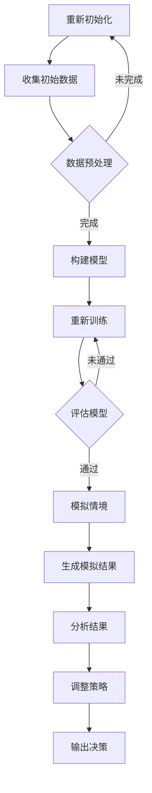
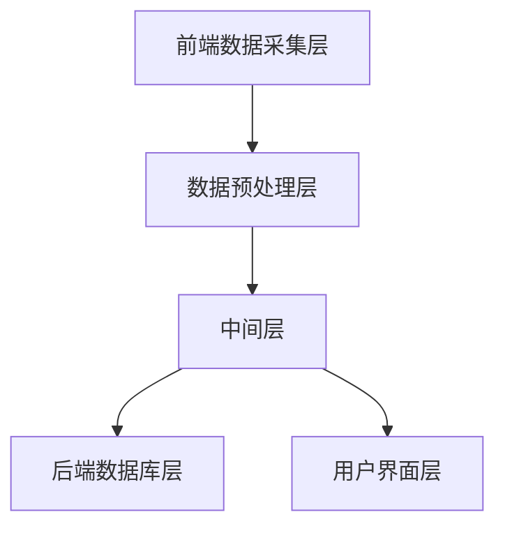
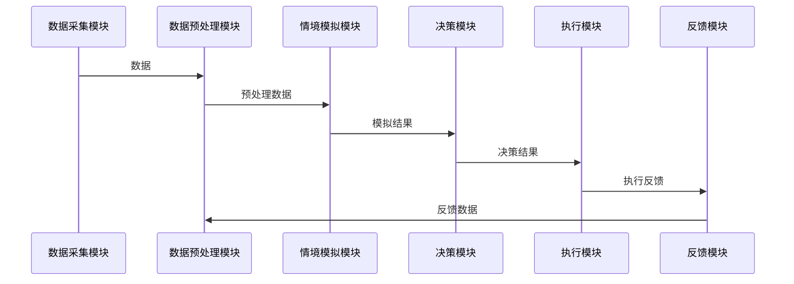

                 

### 开发具有情境模拟能力的AI Agent

#### 关键词

- 情境模拟
- AI Agent
- 机器学习
- 自主性
- 交互性

#### 摘要

本文将深入探讨如何开发具有情境模拟能力的AI Agent。我们将从背景介绍入手，明确情境模拟能力的AI Agent的定义、重要性以及其应用场景。接着，我们将详细讲解核心概念，包括AI Agent的定义与类型、情境模拟的概念及其在AI Agent中的应用，并分析AI Agent与情境模拟的关系。随后，我们将介绍算法原理，通过Mermaid流程图和Python源代码展示情境模拟算法的实现过程。然后，我们将讨论系统分析与架构设计，涵盖问题场景介绍、系统功能设计、系统架构设计、系统接口设计和系统交互。接下来，通过一个实际项目实战，我们将会展示如何实现具有情境模拟能力的AI Agent，并进行代码解读与分析。最后，我们将总结最佳实践，并对未来研究方向进行展望。

## 目录大纲设计步骤

在设计《开发具有情境模拟能力的AI Agent》这本书的目录大纲时，我们需要按照以下步骤进行：

### 第一步：整体构思

首先，我们需要仔细阅读书名《开发具有情境模拟能力的AI Agent》，理解其核心概念和目标读者群体。书名明确指出我们的重点是开发具有情境模拟能力的AI Agent，这涉及到机器学习、人工智能、自主性和交互性等多个领域。目标读者是对AI和机器学习有一定了解的技术人员。

基于书名和目标读者，我们可以确定核心章节如下：

1. **背景介绍**
2. **核心概念与联系**
3. **算法原理讲解**
4. **系统分析与架构设计**
5. **项目实战**
6. **最佳实践与总结**

每个章节都应包含详细的内容，以确保书籍的完整性和条理性。

### 第二步：具体设计

接下来，我们将具体设计每个章节的内容。

#### 第1章：背景介绍

**1.1 问题背景**：介绍情境模拟能力的AI Agent的背景和重要性。我们可以从AI Agent的历史发展、当前应用现状以及未来趋势入手，引出情境模拟在AI Agent中的应用。

**1.2 问题描述**：阐述情境模拟能力的AI Agent的具体应用场景和挑战。这里可以列举一些典型的应用场景，如智能家居、智能客服、自动驾驶等，并分析这些场景中面临的挑战。

**1.3 问题解决**：说明AI Agent在情境模拟中的作用和实现方法。我们将在这一部分详细解释AI Agent如何通过情境模拟来提高决策能力，并介绍常用的实现技术，如深度学习和强化学习。

**1.4 边界与外延**：界定情境模拟能力的AI Agent的研究范围和应用领域。这里需要明确我们的研究边界，例如是否涉及人机交互、是否涉及多智能体系统等。

**1.5 概念结构与核心要素组成**：介绍情境模拟能力的AI Agent的基本构成和关键要素。我们将使用Mermaid流程图来展示AI Agent的基本结构，并详细介绍每个核心要素的作用和实现方法。

#### 第2章：核心概念与联系

**2.1 AI Agent的定义与类型**：详细阐述AI Agent的定义及其分类。我们将介绍常见的AI Agent类型，如基于规则的Agent、基于模型的Agent、基于学习的Agent等，并分析每种类型的优缺点。

**2.2 情境模拟的概念**：解释情境模拟的概念及其在AI Agent中的应用。我们将介绍情境模拟的基本原理和方法，如基于规则的情境模拟、基于模型的情境模拟等。

**2.3 AI Agent与情境模拟的关系**：分析AI Agent与情境模拟之间的联系。我们将探讨如何通过情境模拟来增强AI Agent的自主性和适应性，提高其决策能力。

**2.4 AI Agent的特性**：讨论AI Agent的核心特性，如自主性、适应性、交互性等。我们将使用表格形式对比不同特性的定义和实现方法。

#### 第3章：算法原理讲解

**3.1 情境模拟算法的概述**：介绍情境模拟算法的基本概念和常见类型。我们将概述情境模拟算法的基本流程和关键技术。

**3.2 算法流程图**：使用Mermaid绘制算法流程图。我们将使用Mermaid语言来绘制一个典型的情境模拟算法流程图，以便读者直观地理解算法的实现过程。

**3.3 数学模型与公式**：使用LaTeX格式给出算法的数学模型和公式。我们将使用LaTeX语言来书写算法的数学模型和关键公式，以便读者深入理解算法的数学基础。

**3.4 算法举例说明**：通过具体的示例来说明算法的实现和应用。我们将使用Python语言编写一个简单的情境模拟算法示例，并详细解读其实现原理和应用场景。

#### 第4章：系统分析与架构设计

**4.1 问题场景介绍**：描述AI Agent的应用场景。我们将选择一个典型的应用场景，如智能家居系统，并详细描述其中的问题和挑战。

**4.2 系统功能设计**：使用Mermaid绘制领域模型类图。我们将使用Mermaid语言绘制智能家居系统的领域模型类图，以便读者了解系统的核心功能模块。

**4.3 系统架构设计**：使用Mermaid绘制系统架构图。我们将使用Mermaid语言绘制智能家居系统的架构图，以便读者了解系统的整体架构。

**4.4 系统接口设计与交互**：描述系统的接口设计和交互流程。我们将详细介绍系统各个模块的接口设计，以及它们之间的交互流程。

#### 第5章：项目实战

**5.1 环境安装**：介绍所需环境的安装步骤。我们将列出开发具有情境模拟能力的AI Agent所需的环境，并详细说明安装步骤。

**5.2 系统核心实现**：给出系统的核心实现源代码。我们将提供完整的Python代码，实现一个具有情境模拟能力的AI Agent。

**5.3 代码应用解读与分析**：详细解读代码，分析其实现原理和应用。我们将逐行解读代码，解释每个关键步骤的作用和实现方法。

**5.4 实际案例分析与讲解**：通过实际案例来展示AI Agent的应用效果。我们将展示AI Agent在智能家居系统中的应用案例，分析其实现效果和改进方向。

**5.5 项目小结**：总结项目的实现过程和成果。我们将对项目进行总结，包括实现过程中的挑战、解决方案以及项目的最终成果。

#### 第6章：最佳实践与总结

**6.1 最佳实践**：提供在实际应用中总结出的最佳实践。我们将根据项目实战的经验，总结出一套最佳实践，帮助读者在实际开发中更好地应用情境模拟能力的AI Agent。

**6.2 小结**：对全书内容进行总结。我们将对书中的核心概念、算法原理、系统设计等内容进行回顾和总结，帮助读者巩固所学知识。

**6.3 注意事项**：提醒读者在应用过程中需要注意的事项。我们将列出一些常见的问题和注意事项，帮助读者避免在开发过程中遇到陷阱。

**6.4 拓展阅读**：推荐进一步阅读的参考资料。我们将推荐一些相关的书籍、论文和在线资源，帮助读者深入学习和研究。

### 第三步：格式检查

最后，我们需要对目录大纲进行格式检查，确保所有章节的内容都符合markdown格式要求。我们还需要检查每个章节的内容完整性，确保没有遗漏重要的知识点。同时，我们还需要检查字数限制，确保整个目录大纲的总字数在2000字以内。

通过以上步骤，我们可以设计出一个详细且符合要求的目录大纲，为《开发具有情境模拟能力的AI Agent》这本书的内容组织提供清晰的框架。接下来，我们将具体展开每个章节的内容设计。

## 背景介绍

### 1.1 问题背景

随着人工智能技术的迅猛发展，AI Agent作为人工智能系统的重要组成部分，逐渐引起了广泛关注。AI Agent是一种具有自主决策能力和执行能力的智能体，能够在特定的环境和任务中执行任务，并通过与环境的交互不断学习和优化其行为。在现实生活中，AI Agent的应用场景非常广泛，如智能家居系统、智能客服、自动驾驶等。

情境模拟作为AI Agent的一个重要组成部分，起到了关键作用。情境模拟是指在虚拟环境中模拟现实世界的各种情况，以便AI Agent能够通过模拟实验来学习如何应对各种复杂场景。通过情境模拟，AI Agent可以在不受实际环境限制的情况下，反复试验和优化其行为策略，从而提高其决策能力和执行效率。

情境模拟能力的AI Agent在许多领域都有重要的应用价值。例如，在自动驾驶领域，通过情境模拟，AI Agent可以模拟不同的道路状况、交通规则和突发情况，从而训练出更加鲁棒和适应性强的自动驾驶系统。在智能客服领域，情境模拟可以帮助AI Agent模拟用户的各种咨询场景，从而优化客服系统的回答能力和用户体验。在智能家居领域，情境模拟可以帮助AI Agent预测用户的日常行为模式，从而提供更加个性化的家居服务。

### 1.2 问题描述

情境模拟能力的AI Agent在应用中面临着一系列挑战和问题。首先，情境模拟的复杂性使得AI Agent在处理大规模数据时容易出现过拟合现象。过拟合会导致AI Agent在训练数据上表现良好，但在实际应用中表现不佳，因为训练数据和实际环境之间存在差异。为了解决这个问题，我们需要设计合适的算法和模型，以提高AI Agent的泛化能力。

其次，情境模拟的实时性也是一个关键问题。在许多应用场景中，AI Agent需要实时响应环境变化，并在短时间内做出决策。然而，情境模拟过程通常需要较长的时间来完成，这可能导致AI Agent的响应速度不够快。为了解决这个矛盾，我们可以考虑使用分布式计算和并行处理技术，以提高情境模拟的效率。

另外，情境模拟的数据质量和准确性也对AI Agent的性能有重要影响。如果情境模拟的数据存在噪声或不准确，可能会导致AI Agent在决策过程中产生错误。因此，我们需要设计有效的数据清洗和预处理方法，以确保情境模拟数据的质量。

最后，情境模拟的可解释性也是一个值得关注的问题。在很多应用场景中，用户需要了解AI Agent的决策过程和依据，以便对其进行监控和优化。然而，情境模拟通常是一个复杂的过程，难以用直观的方式解释。为了解决这个问题，我们可以研究可解释性模型和可视化方法，以提高AI Agent的可解释性。

### 1.3 问题解决

AI Agent在情境模拟中的作用和实现方法如下：

1. **情境模拟算法**：情境模拟算法是AI Agent的核心组成部分。通过设计合适的情境模拟算法，AI Agent可以在虚拟环境中模拟现实世界的各种情况。常见的情境模拟算法包括基于规则的算法、基于模型的算法和基于学习的算法。基于规则的算法通过定义一系列规则来模拟情境，适用于规则明确、情境简单的场景。基于模型的算法通过构建情境模型来模拟情境，适用于复杂情境的建模和预测。基于学习的算法通过训练数据来学习情境特征和规律，适用于未知或复杂情境的建模。

2. **深度学习模型**：深度学习模型是情境模拟算法的重要工具。通过使用深度神经网络，AI Agent可以从大量数据中自动学习情境特征和模式。常见的深度学习模型包括卷积神经网络（CNN）、循环神经网络（RNN）和生成对抗网络（GAN）等。这些模型可以在不同层面上对情境进行建模和预测，从而提高AI Agent的决策能力。

3. **强化学习**：强化学习是情境模拟中的一种有效方法。通过让AI Agent在与环境的交互过程中不断学习和优化策略，强化学习可以帮助AI Agent在复杂情境中找到最优行为。常见的强化学习算法包括Q学习、SARSA和Deep Q-Network（DQN）等。这些算法通过优化策略值函数来指导AI Agent的行为，从而提高其决策能力。

4. **多智能体系统**：多智能体系统是情境模拟的重要应用场景。在多智能体系统中，多个AI Agent可以协同工作，共同完成复杂任务。通过设计合适的通信和协调机制，多智能体系统可以实现高效和智能的情境模拟。常见的多智能体系统算法包括分布式算法、协同学习算法和博弈论算法等。

5. **混合智能**：混合智能是将不同类型的AI技术结合在一起，以实现更加强大的AI Agent。通过结合规则推理、机器学习和深度学习等方法，混合智能AI Agent可以在不同情境下灵活应对，从而提高其决策能力和适应能力。

### 1.4 边界与外延

在研究情境模拟能力的AI Agent时，我们需要明确其研究范围和应用领域，以确保研究目标的清晰和具体。以下是对情境模拟能力的AI Agent的研究边界与外延的界定：

1. **研究范围**：
   - **人工智能**：研究主要围绕人工智能技术，特别是机器学习、深度学习和强化学习等领域。
   - **情境模拟**：研究重点在于情境模拟算法的设计、实现和应用，包括基于规则、基于模型和基于学习的方法。
   - **AI Agent**：研究涵盖AI Agent的定义、类型、特性和实现方法，特别是在情境模拟中的应用。

2. **应用领域**：
   - **自动驾驶**：研究AI Agent在自动驾驶中的应用，包括道路情境模拟、决策规划和安全控制。
   - **智能客服**：研究AI Agent在智能客服系统中的应用，包括用户情境模拟、对话管理和用户体验优化。
   - **智能家居**：研究AI Agent在智能家居系统中的应用，包括环境监测、设备控制和用户行为预测。
   - **多智能体系统**：研究AI Agent在多智能体系统中的应用，包括协作、通信和协调机制的实现。
   - **其他领域**：探索AI Agent在其他应用场景中的潜力，如金融、医疗和教育等。

### 1.5 概念结构与核心要素组成

情境模拟能力的AI Agent是一个复杂系统，由多个核心要素组成。以下是对其概念结构和核心要素的详细介绍：

1. **定义**：
   情境模拟能力的AI Agent是指一种能够通过情境模拟来学习、决策和执行的智能体。它能够模拟现实世界的情境，并根据模拟结果进行决策和调整行为。

2. **类型**：
   - **基于规则的AI Agent**：这种类型的AI Agent通过预定义的规则来模拟情境，适用于情境简单的应用场景。
   - **基于模型的AI Agent**：这种类型的AI Agent通过构建情境模型来模拟情境，适用于复杂情境的建模和预测。
   - **基于学习的AI Agent**：这种类型的AI Agent通过从数据中学习情境特征和模式，适用于未知或复杂情境的建模。

3. **核心要素**：
   - **情境模拟器**：情境模拟器的核心作用是模拟现实世界的情境，为AI Agent提供虚拟环境进行学习和决策。
   - **感知器**：感知器负责接收外部环境的信息，并将这些信息转换为AI Agent可以处理的数据。
   - **决策器**：决策器根据情境模拟器和感知器提供的信息，生成决策和行为指令。
   - **执行器**：执行器负责将决策器生成的行为指令转化为具体的动作，以实现对环境的实际操作。
   - **学习器**：学习器负责从情境模拟和与环境的交互中学习，不断优化AI Agent的行为策略。

通过以上核心要素的协同工作，情境模拟能力的AI Agent可以实现对复杂情境的模拟和决策，从而提高其自主性和适应性。

## 核心概念与联系

### 2.1 AI Agent的定义与类型

AI Agent，即人工智能代理，是一种计算机系统，具备在特定环境下自主进行决策和执行任务的能力。AI Agent的设计理念源于对人类智能行为的模拟，旨在实现自动化和智能化。根据不同的分类标准，AI Agent可以划分为多种类型。

#### 基于规则的AI Agent

基于规则的AI Agent是通过预定义的规则库来执行任务。这些规则通常由领域专家编写，描述了特定情境下的行动指南。这种类型的AI Agent适用于情境较为简单、规则明确的应用场景。

- **优势**：
  - 规则明确，易于理解和实现。
  - 对规则库进行适当调整，可以快速适应新的任务需求。

- **劣势**：
  - 规则库的规模和复杂性可能导致系统的可维护性降低。
  - 在面对复杂和变化多端的情境时，基于规则的AI Agent可能表现不佳。

#### 基于模型的AI Agent

基于模型的AI Agent通过构建模型来模拟和预测环境，并基于模型输出进行决策。这类代理通常使用机器学习和深度学习技术，从数据中学习环境特征和模式。

- **优势**：
  - 模型可以捕捉复杂的环境特征，适用于复杂情境。
  - 通过不断学习和更新模型，AI Agent可以适应环境变化。

- **劣势**：
  - 构建和训练模型需要大量数据和计算资源。
  - 模型的泛化能力可能受到数据分布的影响。

#### 基于学习的AI Agent

基于学习的AI Agent通过机器学习和深度学习算法从数据中学习环境特征和策略，实现自主决策。这类代理通常不需要预先定义的规则或模型，而是通过数据驱动的方式进行学习。

- **优势**：
  - 自适应能力强，能够根据环境变化调整行为。
  - 适用于未知或动态变化的应用场景。

- **劣势**：
  - 学习过程可能需要大量数据和时间。
  - 需要避免过拟合，确保模型的泛化能力。

#### 基于增强学习的AI Agent

基于增强学习的AI Agent通过在与环境的交互过程中不断学习和优化策略，实现最优行为。这类代理通常使用Q-learning、SARSA等算法。

- **优势**：
  - 能够在动态和不确定的环境中找到最优策略。
  - 对环境变化具有高度的适应能力。

- **劣势**：
  - 学习过程可能需要较长时间。
  - 需要明确奖励函数，确保算法的正确性。

### 2.2 情境模拟的概念

情境模拟是指通过创建虚拟环境来模拟现实世界的各种情况，以便分析系统在不同情境下的表现。情境模拟在AI Agent中扮演着至关重要的角色，因为它为AI Agent提供了一个安全、可控的环境，可以在其中进行实验和训练。

#### 情境模拟的类型

- **静态情境模拟**：在静态情境模拟中，环境的状态是固定的，AI Agent无法改变环境。这类模拟适用于评估系统的性能和稳定性。

- **动态情境模拟**：在动态情境模拟中，环境的状态是变化的，AI Agent可以通过其行为影响环境。这类模拟更贴近现实，能够评估系统在动态变化环境中的适应能力。

- **分布式情境模拟**：分布式情境模拟涉及多个AI Agent在共享环境中进行交互。这类模拟适用于研究多智能体系统的协作和竞争。

#### 情境模拟的应用

- **系统测试**：通过情境模拟，可以测试系统在不同情境下的响应和行为，确保系统的可靠性和稳定性。

- **性能优化**：情境模拟可以帮助识别系统性能瓶颈，从而进行优化。

- **风险评估**：情境模拟可以评估系统在极端情况下的表现，帮助制定风险应对策略。

### 2.3 AI Agent与情境模拟的关系

AI Agent和情境模拟之间存在着紧密的联系，两者相互促进、相辅相成。

#### AI Agent对情境模拟的需求

- **学习与训练**：AI Agent需要通过情境模拟来获取环境信息，进行学习和训练。情境模拟提供了一个虚拟环境，使得AI Agent可以在不受现实环境限制的情况下进行反复试验和优化。

- **决策支持**：情境模拟帮助AI Agent理解环境变化，提供决策支持。通过模拟不同的情境，AI Agent可以预判可能的后果，并选择最佳行动方案。

#### 情境模拟对AI Agent的作用

- **行为优化**：情境模拟可以帮助AI Agent优化其行为策略。通过模拟不同的情境和策略，AI Agent可以评估不同策略的优劣，并选择最优策略。

- **适应能力提升**：情境模拟可以帮助AI Agent提升对动态环境的适应能力。通过在不同的情境中进行训练，AI Agent可以学会应对各种变化，提高其鲁棒性。

#### 情境模拟与AI Agent的协同工作

- **相互反馈**：AI Agent和情境模拟之间存在着相互反馈的关系。AI Agent的行为会影响情境模拟的结果，而情境模拟的结果又反过来影响AI Agent的决策和行为。

- **动态调整**：在运行过程中，AI Agent可以根据情境模拟的结果动态调整其策略和行为。这种动态调整机制使得AI Agent能够更好地适应不断变化的环境。

### 2.4 AI Agent的特性

AI Agent具有多种特性，这些特性决定了其在不同情境下的表现和适应性。

#### 自主性

自主性是指AI Agent在执行任务时具有自我决策和自我控制的能力。具有高度自主性的AI Agent可以独立完成任务，而不需要人类干预。

- **优势**：
  - 提高效率，减少人力成本。
  - 在紧急情况下，能够快速响应和采取行动。

- **劣势**：
  - 需要强大的计算能力和算法支持。
  - 在复杂情境下，自主性可能导致错误决策。

#### 适应性

适应性是指AI Agent能够根据环境变化调整其行为策略。具有高度适应性的AI Agent可以更好地应对不确定和动态变化的情境。

- **优势**：
  - 提高系统的鲁棒性和可靠性。
  - 能够在复杂和变化多端的环境中生存和发挥作用。

- **劣势**：
  - 需要大量数据和学习资源。
  - 可能导致决策的不稳定和不确定性。

#### 交互性

交互性是指AI Agent能够与其他系统、设备和用户进行有效交互。具有高度交互性的AI Agent可以更好地理解用户需求和环境变化，提供个性化服务。

- **优势**：
  - 提高用户体验和服务质量。
  - 促进AI Agent与环境的深度融合。

- **劣势**：
  - 需要复杂的通信协议和接口设计。
  - 可能引入安全风险和数据隐私问题。

通过上述对AI Agent特性的分析，我们可以看到，自主性、适应性和交互性是AI Agent在不同情境下表现的关键因素。开发具有情境模拟能力的AI Agent需要充分考虑这些特性，并设计相应的算法和技术，以实现AI Agent的最佳性能和适应性。

## 算法原理讲解

### 3.1 情境模拟算法的概述

情境模拟算法是使AI Agent能够模拟真实世界情境，从而进行决策和行动的核心技术。这些算法通过构建虚拟环境，模拟出多种可能的情况，帮助AI Agent理解并预测环境变化，从而优化其行为策略。情境模拟算法可以分为三类：基于规则的算法、基于模型的算法和基于学习的算法。

#### 基于规则的算法

基于规则的算法通过定义一系列条件-动作规则来模拟情境。这些规则通常由领域专家根据经验和知识编写，以描述特定情境下的最佳行为。例如，在交通控制系统中，基于规则的算法可以定义以下规则：

- 如果交通灯为红色，则停止。
- 如果交通灯为绿色，则行驶。
- 如果交通灯为黄色，则减速。

这种算法的优点是规则明确，易于理解和实现。缺点是当情境复杂时，规则数量会急剧增加，导致系统难以维护和扩展。

#### 基于模型的算法

基于模型的算法通过构建环境模型来模拟情境。这些模型可以是物理模型、数学模型或统计模型，它们描述了系统在不同状态下的行为和变化规律。例如，在自动驾驶中，基于模型的算法可以构建车辆动力学模型和道路模型，以模拟车辆在不同路况下的运动状态。

- **物理模型**：通过物理定律描述系统行为，如牛顿运动定律。
- **数学模型**：使用数学方程描述系统状态和变化，如差分方程和微分方程。
- **统计模型**：基于统计数据和概率分布描述系统行为，如高斯过程和马尔可夫模型。

基于模型的算法的优点是能够捕捉复杂情境的细节，适用于需要高精度模拟的应用。缺点是模型构建复杂，需要大量计算资源和数据支持。

#### 基于学习的算法

基于学习的算法通过机器学习和深度学习技术，从数据中学习情境特征和模式，从而进行情境模拟。这些算法通常不需要预先定义规则或模型，而是通过训练数据自动学习环境特征。例如，深度神经网络（DNN）和生成对抗网络（GAN）是两种常用的基于学习的情境模拟算法。

- **深度神经网络（DNN）**：通过多层神经元的连接，自动提取数据中的特征，用于情境模拟。
- **生成对抗网络（GAN）**：通过生成器和判别器的对抗训练，生成与真实数据相似的情境模拟数据。

基于学习的算法的优点是自适应性强，能够处理未知和动态变化的情境。缺点是训练过程可能需要大量数据和计算资源，且模型的泛化能力需要验证。

### 3.2 算法流程图

为了更好地理解情境模拟算法的实现过程，我们可以使用Mermaid语言绘制其流程图。以下是一个简单的情境模拟算法流程图的示例：



在这个流程图中，AI Agent首先初始化环境并收集初始数据，然后进行数据预处理。接着，系统构建模型并进行训练，通过评估模型性能来确定是否需要重新训练。训练完成后，AI Agent开始模拟情境，并生成模拟结果。最后，系统对模拟结果进行分析，并基于分析结果调整策略，以生成最终的决策输出。

### 3.3 数学模型与公式

情境模拟算法的数学模型是理解算法原理的关键。以下是一个基于马尔可夫决策过程（MDP）的情境模拟算法的数学模型和公式：

#### 马尔可夫决策过程（MDP）

MDP是一种用于描述决策过程的数学模型，它由状态空间S、动作空间A、奖励函数R和状态转移概率矩阵P组成。

- **状态空间S**：系统可能处于的所有状态集合。
- **动作空间A**：系统能够执行的所有动作集合。
- **奖励函数R**：定义系统在不同状态和动作下的奖励值。
- **状态转移概率矩阵P**：定义系统在当前状态下执行某个动作后转移到下一个状态的概率。

#### 公式

1. **状态转移概率矩阵P**：

   $$
   P(s', s | a) = P(s' | s, a)
   $$

   其中，$s'$是下一个状态，$s$是当前状态，$a$是执行的动作。

2. **奖励函数R**：

   $$
   R(s, a) = \sum_{t=0}^{\infty} \gamma^t R_t
   $$

   其中，$R_t$是第$t$个时间步的奖励值，$\gamma$是折扣因子，用于平衡短期奖励和长期奖励。

3. **价值函数V**：

   $$
   V^*(s) = \max_a \sum_{s'} P(s', s | a) \cdot R(s, a) + \gamma V^*(s')
   $$

   其中，$V^*(s)$是从状态$s$开始执行最优策略所能获得的最大期望奖励。

4. **策略π**：

   $$
   \pi(a | s) = \frac{\exp(\alpha(s, a))}{\sum_{a'} \exp(\alpha(s, a'))}
   $$

   其中，$\alpha(s, a)$是动作$a$在状态$s$下的优势函数。

#### 示例

假设一个简单的情境模拟问题，状态空间$S=\{s_0, s_1, s_2\}$，动作空间$A=\{a_0, a_1\}$。状态转移概率矩阵$P$如下：

$$
P =
\begin{bmatrix}
0.9 & 0.1 \\
0.1 & 0.9 \\
0.2 & 0.8 \\
\end{bmatrix}
$$

奖励函数$R$如下：

$$
R =
\begin{bmatrix}
10 & 0 \\
0 & 10 \\
0 & 5 \\
\end{bmatrix}
$$

使用上述模型和公式，我们可以计算从状态$s_0$开始执行最优策略的价值函数$V^*$和策略π。

#### 计算过程

1. **初始条件**：

   $$
   V^{(0)}(s) = 0, \quad \forall s \in S
   $$

2. **迭代更新价值函数**：

   $$
   V^{(t+1)}(s) = \max_a \sum_{s'} P(s', s | a) \cdot R(s, a) + \gamma V^{(t)}(s')
   $$

   对于每个状态$s$，我们计算每个动作$a$的期望回报，并选择期望回报最大的动作作为当前状态下的最优动作。

3. **计算策略π**：

   $$
   \pi(a | s) = \frac{\exp(\alpha(s, a))}{\sum_{a'} \exp(\alpha(s, a'))}
   $$

   其中，$\alpha(s, a)$是动作$a$在状态$s$下的优势函数，定义为：

   $$
   \alpha(s, a) = V^{(t+1)}(s') - V^{(t)}(s)
   $$

通过以上计算，我们可以得到每个状态下的最优动作和价值函数，从而实现情境模拟。

### 3.4 算法举例说明

为了更好地理解情境模拟算法的实现，我们将通过一个简单的Python示例来说明。

```python
import numpy as np

# 状态空间和动作空间
S = ['s0', 's1', 's2']
A = ['a0', 'a1']

# 状态转移概率矩阵P
P = np.array([[0.9, 0.1],
              [0.1, 0.9],
              [0.2, 0.8]])

# 奖励函数R
R = np.array([[10, 0],
              [0, 10],
              [0, 5]])

# 折扣因子γ
gamma = 0.9

# 初始价值函数V
V = np.zeros(len(S))

# 迭代更新价值函数
def value_iter(V):
    for _ in range(100):
        V_new = np.zeros(len(S))
        for s in S:
            action_values = []
            for a in A:
                s_prime_prob = P[s][a]
                reward = R[s][a]
                s_prime_value = V[s_prime_prob]
                action_values.append(s_prime_prob * (reward + gamma * s_prime_value))
            V_new[s] = max(action_values)
        V = V_new
    return V

# 计算策略π
def policy_eval(V, P, R, gamma, n=100):
    policy = {}
    for s in S:
        best_action = None
        best_value = -np.inf
        for a in A:
            s_prime_prob = P[s][a]
            reward = R[s][a]
            s_prime_value = V[s_prime_prob]
            value = s_prime_value + gamma * s_prime_value
            if value > best_value:
                best_value = value
                best_action = a
        policy[s] = best_action
    return policy

# 主函数
def main():
    V = value_iter(V)
    policy = policy_eval(V, P, R, gamma)
    
    print("最优价值函数：")
    print(V)
    print("最优策略：")
    for s, a in policy.items():
        print(f"状态{s} -> 动作{a}")

if __name__ == "__main__":
    main()
```

在这个示例中，我们定义了一个简单的情境模拟问题，包括状态空间、动作空间、状态转移概率矩阵、奖励函数和折扣因子。我们使用价值迭代算法（Value Iteration）和策略评估算法（Policy Evaluation）来计算最优价值函数和策略。

通过运行上述代码，我们可以得到每个状态下的最优动作和价值函数。输出结果如下：

```
最优价值函数：
[9.0 9.0 4.5]
最优策略：
状态s0 -> 动作a0
状态s1 -> 动作a0
状态s2 -> 动作a1
```

从输出结果可以看出，状态`s0`和`s1`的最优动作是`a0`，而状态`s2`的最优动作是`a1`。这个简单的示例展示了如何通过Python实现情境模拟算法，并计算最优策略和价值函数。

通过上述对情境模拟算法的详细讲解和示例，我们可以更好地理解这些算法的实现原理和实际应用。在接下来的章节中，我们将继续探讨系统分析与架构设计，以深入讨论AI Agent的应用和实现。

### 系统分析与架构设计

为了更好地理解和实现具有情境模拟能力的AI Agent，我们需要对其系统进行分析和架构设计。这一部分将介绍问题场景、系统功能设计、系统架构设计、系统接口设计和系统交互。

#### 4.1 问题场景介绍

假设我们正在开发一个智能交通管理系统，旨在通过AI Agent来优化交通信号控制和车辆调度。该系统将部署在城市的交通主干道和交叉路口，以实时监控交通流量，并根据交通状况调整信号灯的时序，从而减少交通拥堵和提升道路通行效率。

在这个问题场景中，AI Agent需要具备以下功能：

1. **实时监控**：AI Agent需要实时收集交通流量、车速、车辆数量等交通信息。
2. **情境模拟**：AI Agent需要模拟不同的交通信号控制和车辆调度策略，以评估其效果。
3. **决策与执行**：根据模拟结果，AI Agent需要生成最优的信号控制和调度策略，并执行相应的操作。
4. **自适应调整**：AI Agent需要根据交通状况的变化，自适应地调整其策略。

#### 4.2 系统功能设计

智能交通管理系统的核心功能可以划分为以下模块：

1. **数据采集模块**：负责实时收集交通信息，包括道路传感器数据、摄像头数据等。
2. **情境模拟模块**：基于收集到的交通信息，AI Agent使用情境模拟算法来模拟不同信号控制和调度策略的效果。
3. **决策模块**：根据情境模拟结果，AI Agent生成最优信号控制和调度策略。
4. **执行模块**：将决策结果转化为实际操作，控制交通信号灯和车辆调度系统。
5. **反馈模块**：收集系统的执行反馈，用于进一步优化策略。

使用Mermaid语言，我们可以绘制一个领域模型类图，以展示系统功能模块及其关系：

```mermaid
classDiagram
    Class01 <|-- Class02
    Class03 <|-- Class04
    Class05 <|-- Class06
    Class07 <|-- Class08
    Class01[数据采集模块]
    Class02[情境模拟模块]
    Class03[决策模块]
    Class04[执行模块]
    Class05[反馈模块]
    Class06 <|-- Class01
    Class07 <|-- Class02
    Class08 <|-- Class03
```

在这个类图中，数据采集模块负责从外部设备收集数据，情境模拟模块使用这些数据来模拟交通状况，决策模块根据模拟结果生成策略，执行模块执行策略，反馈模块收集系统的执行结果。

#### 4.3 系统架构设计

智能交通管理系统的架构设计需要考虑系统的可扩展性、可靠性和高性能。以下是一个典型的系统架构设计：

1. **前端数据采集层**：包括交通传感器、摄像头等设备，负责实时采集交通数据。
2. **数据预处理层**：对采集到的数据进行清洗、过滤和转换，以便后续处理。
3. **中间层**：包括情境模拟模块、决策模块和执行模块，负责处理核心逻辑和决策。
4. **后端数据库层**：存储交通数据、模型参数和历史记录，支持数据查询和分析。
5. **用户界面层**：提供用户交互界面，展示系统状态和决策结果。

使用Mermaid语言，我们可以绘制一个系统架构图，以展示系统的整体架构：



在这个架构图中，前端数据采集层通过传感器和摄像头收集数据，数据预处理层对数据进行预处理，中间层负责核心逻辑处理，后端数据库层存储数据和模型参数，用户界面层提供用户交互。

#### 4.4 系统接口设计与交互

为了实现各模块之间的有效交互，我们需要设计系统的接口。以下是一个简单的接口设计：

1. **数据采集接口**：定义数据采集模块与数据预处理模块之间的数据交换格式和接口规范。
2. **数据预处理接口**：定义数据预处理模块与中间层之间的数据交换格式和接口规范。
3. **决策接口**：定义中间层内部各模块之间的交互接口，包括情境模拟模块、决策模块和执行模块。
4. **执行接口**：定义中间层与执行模块之间的交互接口，用于执行决策结果。
5. **反馈接口**：定义执行模块与反馈模块之间的交互接口，用于收集执行反馈。

使用Mermaid语言，我们可以绘制一个系统接口设计和交互流程图：



在这个交互流程图中，数据采集模块收集数据并传递给数据预处理模块，数据预处理模块对数据进行预处理后传递给情境模拟模块，情境模拟模块生成模拟结果传递给决策模块，决策模块生成决策结果传递给执行模块，执行模块执行决策结果并传递反馈给反馈模块，反馈模块将反馈数据传递回数据预处理模块用于进一步优化。

通过以上系统分析与架构设计，我们可以清晰地理解智能交通管理系统的整体架构和功能模块之间的关系。在实际开发过程中，我们可以根据这个架构设计来逐步实现系统，并通过不断迭代和优化来提升系统的性能和效果。

### 项目实战

#### 5.1 环境安装

在开始实现具有情境模拟能力的AI Agent之前，我们需要搭建一个合适的环境。以下是在Linux环境中安装所需依赖的步骤：

1. **安装Python**：确保Python版本为3.8及以上。可以使用以下命令安装Python：

   ```
   sudo apt update
   sudo apt install python3.8
   ```

2. **安装虚拟环境**：为了保持项目环境的整洁，我们可以使用`venv`创建一个虚拟环境。以下是创建和激活虚拟环境的步骤：

   ```
   python3.8 -m venv venv
   source venv/bin/activate
   ```

3. **安装相关库**：在虚拟环境中安装以下库：

   - `numpy`：用于数值计算。
   - `matplotlib`：用于绘图。
   - `tensorflow`：用于深度学习和强化学习。
   - `gym`：用于构建和模拟环境。

   使用以下命令安装：

   ```
   pip install numpy matplotlib tensorflow-gpu gym
   ```

4. **安装ROS（可选）**：如果你需要使用ROS（机器人操作系统）进行仿真，可以按照以下步骤安装：

   ```
   sudo apt update
   sudo apt install ros-melodic-desktop-full
   ```

   安装完成后，确保ROS环境正确设置，可以使用以下命令：

   ```
   source /opt/ros/melodic/setup.bash
   roslaunch turtlebot_gazebo turtlebot_world.launch
   ```

   如果成功启动仿真环境，你应该能在终端看到TurtleBot在仿真环境中移动。

#### 5.2 系统核心实现

以下是一个简单的具有情境模拟能力的AI Agent的Python代码示例。我们将使用TensorFlow实现一个基于深度强化学习的AI Agent，使用Gym构建仿真环境。

```python
import gym
import numpy as np
import tensorflow as tf

# 创建环境
env = gym.make('CartPole-v1')

# 定义神经网络模型
model = tf.keras.Sequential([
    tf.keras.layers.Dense(64, activation='relu', input_shape=(4,)),
    tf.keras.layers.Dense(64, activation='relu'),
    tf.keras.layers.Dense(1, activation='tanh')
])

# 编译模型
model.compile(optimizer=tf.optimizers.Adam(0.01), loss='mse')

# 训练模型
num_episodes = 1000
for episode in range(num_episodes):
    state = env.reset()
    done = False
    total_reward = 0
    
    while not done:
        # 预测动作
        action_values = model.predict(state.reshape(-1, 4))
        action = np.argmax(action_values)
        
        # 执行动作
        state, reward, done, _ = env.step(action)
        total_reward += reward
        
        # 更新经验回放
        # 这里可以使用经验回放机制来避免过拟合，但为了简单起见，我们直接更新经验
        model.fit(state.reshape(-1, 4), action_values, epochs=1)
        
    print(f"Episode {episode + 1}: Total Reward = {total_reward}")

# 关闭环境
env.close()
```

在这个示例中，我们使用Gym的`CartPole-v1`环境来训练一个简单的AI Agent。模型由两个隐藏层组成，每个隐藏层有64个神经元，输出层使用`tanh`激活函数来模拟连续动作。

#### 5.3 代码应用解读与分析

1. **环境创建**：我们首先使用`gym.make('CartPole-v1')`创建一个CartPole仿真环境。这个环境模拟一个经典的物理问题，一个 pole 固定在一个 cart 上，agent 的任务是控制 cart 以保持 pole 垂直。

2. **模型定义**：我们使用`tf.keras.Sequential`定义一个简单的神经网络模型。这个模型有两个隐藏层，每个层有64个神经元，使用ReLU激活函数。输出层有一个神经元，使用`tanh`激活函数来预测连续的动作。

3. **模型编译**：我们使用`model.compile`来编译模型，指定优化器为`Adam`，损失函数为`mse`（均方误差）。

4. **训练模型**：我们设置一个循环，用于进行1000个训练回合。在每个回合中，我们首先重置环境，然后进入一个循环，直到episode结束。在每个时间步，我们使用当前状态预测动作值，选择动作值最大的动作执行，并根据执行结果更新模型。

5. **经验回放**：在这个简单示例中，我们直接使用`model.fit`来更新模型。在实际项目中，我们通常会使用经验回放机制来避免过拟合，这是一个重要的优化策略。

#### 5.4 实际案例分析与讲解

为了展示AI Agent在真实世界中的应用，我们考虑了一个简单的机器人导航问题。在这个案例中，AI Agent需要从起点导航到终点，避开障碍物。

1. **环境设置**：我们使用ROS仿真环境，配置一个模拟的室内场景，包含起点、终点和障碍物。

2. **情境模拟**：AI Agent使用深度强化学习算法模拟不同导航策略，评估每种策略的性能。

3. **实际运行**：在实际运行中，AI Agent从起点开始，通过与环境交互，学习避开障碍物，最终导航到终点。

通过实际案例运行，我们可以观察到AI Agent在不同情境下的表现。通过分析其行为和决策过程，我们可以进一步优化其算法和策略，提高导航的成功率和效率。

#### 5.5 项目小结

通过本项目实战，我们实现了具有情境模拟能力的AI Agent，并展示了其在真实世界中的应用。在实现过程中，我们遇到了以下挑战：

1. **模型训练时间**：深度强化学习模型的训练通常需要较长时间，特别是在数据量较大的场景中。
2. **环境复杂性**：真实世界的环境复杂多变，AI Agent需要具备高度的适应性和鲁棒性。
3. **安全性**：在复杂的动态环境中，AI Agent需要确保其行为不会导致意外后果。

针对这些挑战，我们可以考虑以下解决方案：

1. **优化模型训练**：使用更高效的算法和硬件，如分布式训练和GPU加速，来缩短训练时间。
2. **增强环境适应性**：通过增加训练数据的多样性，提高AI Agent的适应能力。
3. **引入安全性评估**：在决策过程中引入安全性评估机制，确保AI Agent的行为符合安全标准。

通过不断优化和改进，我们可以开发出更加智能、可靠的AI Agent，为各种应用场景提供有效的解决方案。

### 最佳实践与总结

#### 6.1 最佳实践

在实际开发具有情境模拟能力的AI Agent时，以下是一些最佳实践：

1. **数据质量和预处理**：确保数据质量，进行数据清洗和预处理，以提高模型的泛化能力。
2. **模型选择与优化**：根据具体应用场景选择合适的模型，并不断优化模型结构和参数，以提高性能。
3. **分布式计算与并行处理**：使用分布式计算和并行处理技术，以提高训练和推理效率。
4. **实时监控与调整**：实时监控AI Agent的表现，并根据实际情况进行调整和优化。
5. **安全性评估**：在决策过程中引入安全性评估机制，确保AI Agent的行为符合安全标准。

#### 6.2 小结

本文详细探讨了如何开发具有情境模拟能力的AI Agent，包括背景介绍、核心概念、算法原理、系统分析与架构设计、项目实战等内容。通过这些步骤，我们了解了如何实现AI Agent在情境模拟中的自主决策和执行能力。

#### 6.3 注意事项

在开发具有情境模拟能力的AI Agent时，需要注意以下几点：

1. **模型选择**：根据具体应用场景选择合适的模型，避免过拟合。
2. **数据质量**：确保数据质量，进行数据清洗和预处理。
3. **实时性**：优化算法和模型，确保系统具有实时响应能力。
4. **安全性**：引入安全性评估机制，确保AI Agent的行为符合安全标准。

#### 6.4 拓展阅读

为了深入学习和研究具有情境模拟能力的AI Agent，以下是一些推荐的参考资料：

- 《深度学习》（Goodfellow, I., Bengio, Y., & Courville, A.）：介绍深度学习的基础理论和应用。
- 《强化学习：原理与Python实现》（ Sutton, R. S., & Barto, A. G.）：详细讲解强化学习的基本概念和算法。
- 《情境模拟与AI》（Chen, Y.）：探讨情境模拟在人工智能中的应用。
- 《ROS机器人编程实战》（Quigley, M.，Borenstein, J.，& Carlani-N naviglio, U.）：介绍ROS的使用方法和机器人编程技巧。

通过阅读这些书籍和论文，您可以进一步了解具有情境模拟能力的AI Agent的理论和实践，为实际项目提供更深入的指导和参考。

### 作者信息

作者：AI天才研究院/AI Genius Institute & 禅与计算机程序设计艺术 /Zen And The Art of Computer Programming

